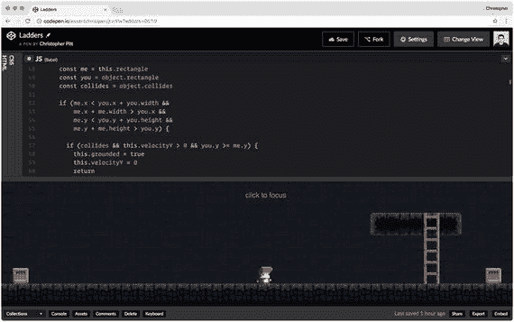

# 六、梯子

如果玩家只能通过跳过缝隙或跳到箱子上来向上移动，这将是非常有限的。然而，这些并不是唯一的选择。我们仍然需要学习电梯、楼梯和梯子。先从搭梯子开始吧！

## 创造我们的第一架梯子

让我们从复制`Box`类开始我们的阶梯:

```js
class Ladder {
  constructor(sprite, rectangle) {
    this.sprite = sprite
    this.rectangle = rectangle
  }

  animate(state) {
    this.sprite.x = this.rectangle.x
    this.sprite.y = this.rectangle.y
  }
}

// ...later

game.addObject(
  new Box(
    new PIXI.Sprite.fromImage(
      "path/to/sprites/platform.png",
    ),
    new PIXI.Rectangle(
      window.innerWidth - 400,
      window.innerHeight - 64 - 200,
      256,
      64,
    ),
  ),
)

game.addObject(
  new Ladder(
    new PIXI.extras.TilingSprite.fromImage(
      "path/to/sprites/ladder.png",
      44,
      200,
    ),
    new PIXI.Rectangle(
      window.innerWidth - 250,
      window.innerHeight - 64 - 200,
      44,
      200,
    ),
  ),

)

```

这是出自 [`http://codepen.io/assertchris/pen/jrzrPw`](http://codepen.io/assertchris/pen/jrzrPw) 。

你需要制作`ladder.png`和`platform.png`图像。一定要在添加玩家之前将这些添加到游戏中，否则梯子精灵会在玩家精灵的前面。

你会注意到玩家撞上了梯子，就好像它是一个盒子。我们需要给我们的盒子和梯子添加一些 getters，这样碰撞检测可以决定它们是否仍然相互碰撞:

```js
state.objects.forEach((object) => {
  if (object === this) {
    return
  }

  const me = this.rectangle
  const you = object.rectangle
  const collides = object.collides

  if (me.x < you.x + you.width &&
      me.x + me.width > you.x &&
      me.y < you.y + you.height &&
      me.y + me.height > you.y) {

    if (collides && this.velocityY > 0 && you.y >= me.y) {
      this.isOnGround = true
      this.velocityY = 0
      return
    }

    if (collides && this.velocityY < 0 && you.y <= me.y) {
      this.velocityY = this.accelerationY
      return
    }

    if (collides && this.velocityX < 0 && you.x <= me.x) {
      this.velocityX = 0
      return
    }

    if (collides && this.velocityX > 0 && you.x >= me.x) {
      this.velocityX = 0
      return
    }

  }
})

```

这是出自 [`http://codepen.io/assertchris/pen/jrzrPw`](http://codepen.io/assertchris/pen/jrzrPw) 。

我们给`Box`和`Ladder`一个`collides`属性，这样`Player.animate`就可以忽略与玩家不应该碰撞的物体的碰撞。如果我们要允许多个玩家在同一个游戏/关卡中，那么我们也要给`Player`添加一个`collides`属性。也就是说，除非我们希望多个玩家互相碰撞。



图 6-1。

Platforms and ladders

## 允许玩家爬梯子

为了让玩家能够爬梯子，我们必须能够判断他们是否在试图爬梯子。我们还必须暂停重力和侧向运动，这样它们才不会掉下来或滑落:

```js
class Player

{
  constructor(sprite, rectangle) {
    this.sprite = sprite
    this.rectangle = rectangle

    this.velocityX = 0
    this.maximumVelocityX = 8
    this.accelerationX = 2
    this.frictionX = 0.9

    this.velocityY = 0
    this.maximumVelocityY = 30
    this.accelerationY = 3
    this.jumpVelocity = -30

    this.climbingSpeed = 10

    this.isOnGround = false
    this.isOnLadder = false
  }

  animate(state) {
    if (state.keys[37]) { // left
      this.velocityX = Math.max(
        this.velocityX - this.accelerationX,
        this.maximumVelocityX * -1,
      )
    }

    if (state.keys[39]) { // right
      this.velocityX = Math.min(
        this.velocityX + this.accelerationX,
        this.maximumVelocityX,
      )
    }

    this.velocityX *= this.frictionX

    this.velocityY = Math.min(
      this.velocityY + this.accelerationY,
      this.maximumVelocityY,
    )

    state.objects.forEach((object) => {
      if (object === this) {
        return

      }

      const me = this.rectangle
      const you = object.rectangle
      const collides = object.collides

      if (me.x < you.x + you.width &&
          me.x + me.width > you.x &&
          me.y < you.y + you.height &&
          me.y + me.height > you.y) {

        if (object.constructor.name === "Ladder") {
          if (state.keys[38] || state.keys[40]) {
            this.isOnLadder = true
            this.isOnGround = false
            this.velocityY = 0
            this.velocityX = 0
          }

          if (state.keys[38]) {
            this.rectangle.y -= this.climbingSpeed
          }

          if (state.keys[40] &&
            me.y + me.height < you.y + you.height) {
            this.rectangle.y += this.climbingSpeed
          }
        }

        // ...snip
      }
    })

    if (state.keys[32] && this.isOnGround) {
        this.velocityY = this.jumpVelocity
        this.isOnGround = false
    }

    this.rectangle.x += this.velocityX

    if (!this.isOnLadder) {
      this.rectangle.y += this.velocityY
    }

    this.sprite.x = this.rectangle.x
    this.sprite.y = this.rectangle.y
  }
}

```

这是出自 [`http://codepen.io/assertchris/pen/jrzrPw`](http://codepen.io/assertchris/pen/jrzrPw) 。

在这段代码中，我们创建了一个`isOnLadder`变量，这样我们就可以知道玩家是否正站在梯子上。在通常的碰撞检测中，我们会注意玩家碰撞的物体是否是梯子。如果是这样，并且他们正在按向上的箭头，我们开始他们攀登。只有当他们按下向上箭头时,`isOnLadder`才会被设置，这就是为什么我们需要从这个变量开始。

然后我们重置玩家速度和与跳跃相关的属性。我们也直接改变球员矩形。如果向上箭头被按下，我们将玩家向上移动。

## 摘要

在本章中，我们添加了梯子和固定平台。我们的玩家现在可以跳跃和爬梯子来浏览关卡。这是 2D 平台游戏的两个基本要素。

你应该知道此时你希望你的游戏是什么样子的。我投资了一个很棒的雪碧包。你可以在 Graphic River ( [`https://graphicriver.net`](https://graphicriver.net) )找到其他人。