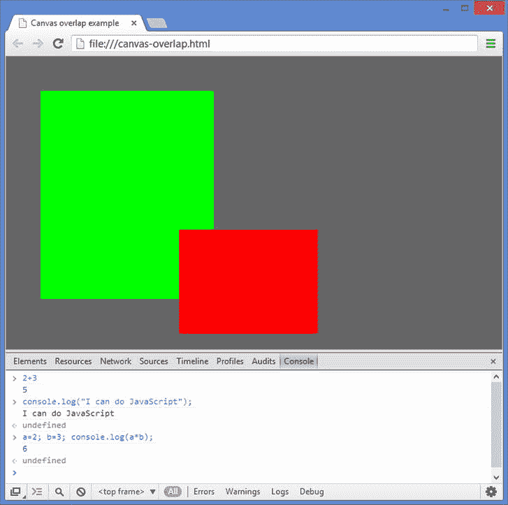
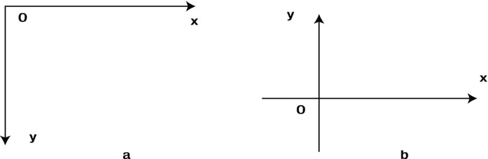
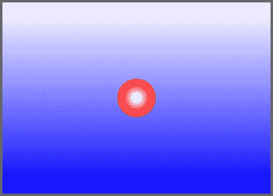

# 2.JavaScript 和 HTML5 画布基础

本章简要回顾了 JavaScript 和 HTML5 的元素，我们将在本书的其余部分充分利用这些元素。它并不意味着是一个全面的 JavaScript 教程；相反，它总结了理解书中的代码示例需要知道的内容。本章的另一个目的是涵盖 HTML5 canvas 元素和 JavaScript 的相关方面，它们将设置应用物理的上下文。

本章是在假设读者至少具备 HTML 和 JavaScript 的基础知识的情况下编写的。如果你是一个有经验的 JavaScript 程序员，你可以安全地跳过这一章的大部分内容，也许可以浏览一下 canvas 元素末尾的一些内容，并用代码制作动画。另一方面，如果你以前没有用 JavaScript 做过任何编程，我们建议你拿起最后的总结中提到的一本书。如果你已经用另一种语言编程，你将会从详细阅读这一章中受益。虽然概述本身不会让你成为一名熟练的 JavaScript 程序员，但它应该能让你毫无困难地使用和构建书中的代码示例。

本章涵盖的主题包括以下内容:

*   HTML5 和 canvas: HTML5 是 HTML 的最新标准，为 web 浏览器带来了激动人心的新特性。对于我们的目的来说，最重要的附加元素是 canvas 元素，它支持图形和动画的渲染，而不需要外部插件。
*   JavaScript 对象:对象是 JavaScript 的基本构件。现实世界中的“事物”在 JavaScript 中可以表示为对象。对象有属性。他们也可以用方法做事。
*   JavaScript 语言基础:为了完整起见，我们回顾了 JavaScript 的基本结构及其语法，如变量、数据类型、数组、运算符、函数、数学、逻辑和循环。
*   事件和用户交互:我们简要回顾一些基本概念和语法，举例说明如何使事情发生以响应程序或用户交互的变化。
*   画布坐标系:这相当于画布世界中的空间。可以使用画布元素的 2D 呈现上下文将对象定位在画布元素上。我们回顾了画布坐标系和数学中常用的笛卡尔坐标系之间的区别。
*   canvas drawing API:仅使用代码绘制事物的能力是一个强大的工具，尤其是在与数学和物理相结合时。画布绘制应用程序编程接口(API)的一些最常见的方法，将在整本书中使用，在这里简单回顾一下。
*   使用代码制作动画:我们回顾了使用代码制作动画的不同方法，并在本书的其余部分解释了我们将用于基于物理的动画的主要方法。

## HTML5、canvas 元素和 JavaScript

HTML5 是 HTML 标准的最新体现，它为 web 浏览器带来了许多新功能。作为一名使用 JavaScript 的准物理程序员，我们将只介绍利用最重要的动画特性 canvas 元素所需了解的最基本的知识。

### 最小的 HTML5 文档

出于本书的目的，你需要对 HTML5 了解得出奇的少。这是一个最小的 HTML5 文档的例子。假设你熟悉基本的 HTML 标记，大部分应该是有意义的。注意与早期 HTML 版本相比，`doctype`声明的形式非常简单。

`<!doctype html>`

`<html>`

`<head>`

`<meta charset="utf-8">`

`<title>A minimal HTML5 document</title>`

`</head>`

`<body>`

`<h1>Hello HTML5!</h1>`

`</body>`

`</html>`

我们将在本书中使用的 HTML5 文档不会比这个复杂太多！本质上，我们将添加一些标签来包含画布元素、CSS 样式和 JavaScript 代码。

### 画布元素

HTML5 规范中最令人兴奋的新增内容之一是 canvas 元素，它支持在 web 浏览器中呈现图形，从而呈现动画，而不需要外部插件，如 Flash Player。向 HTML5 文档添加 canvas 元素再简单不过了。只需在文档的正文部分包含以下行:

`<canvas id="canvas" width="700" height="500"></canvas>`

这将生成一个指定维度的 canvas 实例，可以通过其指定的 ID 在文档对象模型(DOM)中访问该实例。

您可以像处理任何常规 HTML 元素一样处理画布的样式。在示例`canvas-example.html`(源文件可以从 [`http://apress.com`](http://apress.com/) 网站下载)中，我们通过在 head 部分插入以下代码链接了一个名为`style.css`的 CSS 文件:

`<link rel="stylesheet" href="style.css">`

如果你查看文件`style.css`，你会发现我们为 body 部分和 canvas 元素选择了不同的背景颜色，这样我们就可以在前者的背景下更好地看到后者。

没有什么可以阻止你在一个 HTML5 文档中添加多个 canvas 元素。您甚至可以重叠不同的画布实例。这种技术可以证明对某些目的非常有用，例如在固定背景下渲染快速移动的动画。文件`canvas-overlap.html`显示了一个简单的例子，文件`style1.css`指定了两个画布实例所需的 CSS 定位代码(见下一节中的图 [2-1](#Fig1) )。

图 2-1。

Top: Two overlapping canvas elements. Bottom: JavaScript console in the Chrome browser

### 添加 JavaScript

有两种方法可以将 JavaScript 添加到 HTML5 文档中:将代码嵌入 HTML 文件本身的``标签中，或者链接到包含 JavaScript 代码的外部文件。在本书中，我们将采用后一种做法。让我们再来看看上一章中的弹跳球的例子。以下是该示例的完整 HTML 文件(`bouncing-ball.html`):

`<!doctype html>`

`<html>`

`<head>`

`<meta charset="utf-8">`

`<title>Bouncing ball</title>`

`<link rel="stylesheet" href="style.css">`

`</head>`

`<body>`

`<canvas id="canvas" width="700" height="500"></canvas>`

``

`</body>`

`</html>`

请注意脚本主体部分中链接到文件`bouncing-ball.js`的代码行，其中包含 JavaScript 代码。这一行正好放在结束 body 标记的末尾之前，这样 DOM 就有机会在脚本执行之前完全加载。你已经看过第一章的剧本了。

### JavaScript 调试控制台

现代浏览器为调试 JavaScript 代码提供了一个非常有用的工具，称为控制台。了解如何使用控制台的最好方法是进行实验。要在 Chrome 浏览器中启动控制台，请使用以下键盘快捷键:Control-Shift-J (Win/Linux)或 Command-Option-J (Mac)。

您可以在控制台的命令行中直接键入 JavaScript 代码，然后按 Enter 键对其进行评估(参见图 [2-1](#Fig1) )。尝试以下方法:

`2 + 3`

`console.log("I can do JavaScript");`

`a=2; b=3; console.log(a*b);`

## JavaScript 对象

如果您已经用面向对象编程(OOP)语言(如 C++、Java 或 ActionScript 3.0)进行了编程，那么您已经接触过作为对象所基于的基本结构的类。然而，JavaScript 是一种无类语言，尽管它有 OOP 能力。在 JavaScript 中，对象本身是基本单位。

那么什么是对象，它们为什么有用？对象是一个相当抽象的实体。所以在我们定义它之前，让我们用一个例子来解释它。假设您想要在项目中创建粒子。这些粒子将具有某些特性，并且能够执行某些功能。您可以定义一个具有这些属性和功能的通用 JavaScript 对象(称为粒子)。然后每次你需要一个粒子，你可以创建一个粒子对象的实例。以下部分描述了如何做这些事情。

### 对象和属性

我们可以从刚才给出的例子中进行归纳，将 JavaScript 中的对象定义为属性的集合。属性又可以被定义为名称和值之间的关联。构成财产价值的范围相当广泛；它还可以包括函数，见下一节。这使得对象非常通用。

除了现有的 JavaScript 对象，您可以随意创建具有自定义属性的自定义对象。预定义对象的例子包括`String, Array, Date`和`Math`对象(我们将在本章后面讨论)。要创建一个新的对象，可以使用两种不同形式的语法

`obj = new Object();`

或者

`obj = {};`

这两种方法都会创建一个`Object`的实例。结果对象`obj`没有属性。为了赋予属性和相应的值，以及随后访问这些属性，我们使用点符号:

`obj.name = "First object";`

`obj.length = 20;`

`console.log(obj.name,obj.length);`

另一种语法是括号符号:

`obj["name"] = "First object";`

`obj["length"] = 20;`

### 功能和方法

我们已经看到了如何给对象分配属性，但是我们如何让一个对象做一些事情呢？这就是函数的用武之地。函数是调用函数名时执行的代码块。函数定义的一般语法如下:

`function functionName(){`

`code block`

`}`

或者，函数可以携带任意数量的变量或参数:

`function functionName(arg1, arg2){`

`code block`

`}`

它们可以使用 return 语句返回值，例如:

`function multiply(x,y){`

`return x*y;`

`}`

在本例中，`multiply(2,3)`将返回值 6。

回到对象，我们将方法定义为函数对象的属性。因此，方法允许对象做一些事情。方法的定义方式与函数相同，但还需要被指定为对象的属性。这可以通过多种方式实现。一种语法是这样的:

`objectName.methodName = functionName;`

例如，要将`multiply()`函数指定为`obj`对象的属性，我们可以输入

`obj.multiply = multiply;`

函数`multiply`现在是`obj`的方法(我们可以使用不同的方法名)，然后`obj.multiply(2,3)`将返回 6。在下一节中，当我们看构造函数时，我们会遇到其他方法来给对象赋值。

### 原型、构造函数和继承

OOP 中的一个重要概念是继承，它允许你从一个现有的对象构建一个新的对象。然后，新对象继承旧对象的属性和方法。在基于类的语言中，继承适用于类——这就是所谓的经典继承。在 JavaScript 中，对象直接从其他对象继承——这是通过称为原型的内部对象来实现的。因此，JavaScript 中的继承是基于原型的。

原型实际上是任何函数的属性。函数也是对象，因此具有属性。归属于函数原型的属性被从函数对象构造的新对象自动继承。用于构造新对象的函数对象因此被称为构造函数。构造函数没有什么特别的——任何函数都可以用作构造函数。但是有一个普遍的惯例，用以大写字母开头的函数名来表示构造函数。

下面的示例展示了实际使用的语法:

`function Particle(pname){`

`this.name = pname;`

`this.move = function(){`

`console.log(this.name + " is moving");`

`};`

`}`

这段代码创建了一个带有属性`name`和方法`move()`的构造函数`Particle`。关键字`this`确保这些属性在构造函数之外是可访问的。然后，`new`关键字可以创建`Particle`对象的任何实例，并且它会自动继承这些属性，如下例所示:

`particle1 = new Particle("electron");`

`particle1.name; //``returns`T2】

`particle1.move(); // returns "electron is moving"`

要向父对象添加新属性，以便该对象的所有实例都可以继承这些属性，您需要将这些属性分配给父对象的原型。例如，要向`Particle`对象添加一个新属性`mass`和一个新方法`stop()`，我们可以键入:

`Particle.prototype.mass = 1;`

`Particle.prototype.stop = function(){console.log("I have stopped");};`

然后，`Particle`的所有实例都可以使用它们，甚至包括之前实例化的实例，例如:

`particle1.mass; // returns 1`

注意，`particle1.mass`的值此后可以独立于从`Particle.prototype.mass`继承的默认值而改变，例如:

`particle1.mass = 2;      // returns 2`

`Particle.prototype.mass; // returns 1;`

其他属性可以添加到实例中，当然不会传播到父对象或其他实例。例如，这一行:

`particle1.spin = 0;`

将名为`spin`的新属性添加到`particle1`中，并赋予其值 0。默认情况下，`Particle`的其他实例没有该属性。

### 静态属性和方法

在上一节的例子中，假设我们将一个新属性直接分配给`Particle`(而不是它的原型)，例如:

`Particle.lifetime = 100;`

该语句创建了一个静态属性`Particle`,无需实例化对象即可访问该属性。另一方面，`Particle`的实例不继承静态属性。

自然，也可以定义静态方法。例如，假设在一个名为`Physics`的对象中有下面的`static`方法:

`function calcGravity(mass,g) {`

`return(mass*g);`

`}`

`Physics.calcGravity = calcGravity;`

然后函数`Physics.calcGravity(4, 9.8)`会给你地球上一个 4 公斤物体的重力。

`Math`对象是具有静态属性和方法的内置 JavaScript 对象的一个例子，比如`Math.PI`和`Math.sin()`。

### 示例:球对象

作为上几节讨论的原则的一个例子，文件`ball.js`包含创建一个`Ball`对象的代码:

`function Ball (radius, color) {`

`this.radius = radius;`

`this.color  = color;`

`this.x      = 0;`

`this.y      = 0;`

`this.vx     = 0;`

`this.vy     = 0;`

`}`

`Ball.prototype.draw = function (context) {`

`context.fillStyle = this.color;`

`context.beginPath();`

`context.arc(this.x, this.y, this.radius, 0, 2*Math.PI, true);`

`context.closePath();`

`context.fill();`

`};`

注意，`Ball`对象被赋予了六个属性和一个方法。绘图代码已经放在了`Ball.draw()`方法中，并带有一个强制参数，即要在其上绘制球的画布上下文。

文件`ball-object.js`提供了一个从`Ball`对象创建球实例的简单例子:

`var canvas = document.getElementById('canvas');`

`var context = canvas.getContext('2d');`

`var ball = new Ball(50,'#0000ff');`

`ball.x = 100;`

`ball.y = 100;`

`ball.draw(context);`

我们将在整本书中广泛使用这个`Ball`对象，并对其进行各种修改。作为一个例子，文件`bouncing-ball-object.js`是对第一章的[的弹跳球模拟的修改，以利用`Ball`对象——请看！](01.html)

### JavaScript 框架、库和 API

如果你接触过 JavaScript，你可能知道有很多库和框架，比如 jQuery 和 MooTools。它们的优势在于为通常需要的任务提供了一组核心功能。但是，每个都有自己的学习曲线；因此，我们通常不会在本书中使用现有的库或框架(值得注意的例外是当我们在第 1 章第 5 章探索 3D 时)。相反，当我们继续阅读各个章节时，我们将从头开始创建一个小型的数学和物理相关对象库。

同样，大量的 JavaScript APIs 为 web 浏览器带来了扩展的功能。特别值得注意的是 WebGL API，它使用 HTML5 canvas 元素来提供 3D 图形功能。WebGL 基于 OpenGL ES 2.0，包括在计算机的 GPU(图形处理单元)上执行的着色器代码。WebGL 编码超出了本书的范围。然而，在[第 1 章](01.html) 5 中，我们将利用一个 JavaScript 库，它将极大地简化结合 WebGL 创建 3D 动画的任务。

## JavaScript 语言基础

在这一节中，我们回顾 JavaScript 语言中的基本代码元素。特别强调它们与数学和物理的相关性。

### 变量

变量是保存一些数据的容器。在这里，数据可能意味着不同的东西，包括数字和文本。使用`var`关键字定义或声明变量:

`var x;`

随后，`x`可能被赋予某个值。例如:

`x = 2;`

这种赋值可以与下面的变量声明一起完成，也可以在代码中的任何地方完成:

`var x = 2;`

也可以对`x`进行算术运算；例如，以下代码将`x`乘以一个数字，将结果添加到另一个变量`y`，并将结果赋给第三个变量`z`:

`z = 2*x + y;`

这类似于代数，但有一些显著的区别。第一个区别纯粹是语法问题:我们使用运算符`*`将 2 和`x`相乘。很快会有更多关于运营商的内容。

第二个区别更微妙，它与任务的意义有关。虽然前面的代码表面上看起来像一个代数方程，但重要的是要注意，赋值不是一个方程。通过考虑这样一个任务，可以突出这种差异:

`x = x + 1;`

如果这是一个代数方程，这将意味着 0 = 1，这是不可能的！这里，它的意思是我们把`x`(不管它是什么)的值加 1。

JavaScript 中的变量可以有数值以外的值。变量可以保存的值类型称为其数据类型。

### 数据类型

JavaScript 中的变量具有动态数据类型。这意味着它们可以在不同的时间保存不同的数据类型。JavaScript 中的数据类型可以分为两类:基本的和非基本的。原始数据类型有`Number, String, Boolean, Undefined`和`Null`(后两者有时称为特殊数据类型)；非原始数据类型包括`Object, Array`和`Function`(都是对象类型)。表 2-1 列出了所有这些数据类型。变量的数据类型可以由`typeof`操作符决定。

表 2-1。

Data Types in JavaScript

<colgroup><col> <col></colgroup> 
| 数据类型 | 描述 |
| --- | --- |
| `Number` | 64 位双精度浮点数 |
| `String` | 16 位字符序列 |
| `Boolean` | 有两个可能的值:`true`和`false`，或者`1`和`0` |
| `Undefined` | 为不存在的对象属性或没有值的变量返回 |
| `Null` | 只有一个值:null |
| `Object` | 保存属性和方法的集合 |
| `Array` | 由任何类型的数据列表组成的对象 |
| `Function` | 执行代码块的可调用对象 |

#### 民数记

与许多其他编程语言不同，JavaScript 中只有一种数值数据类型:`Number`。例如，整数和浮点数之间没有区别。

根据 IEEE 754 规范，`Number`类型是双精度 64 位浮点数。它能够存储正实数和负实数(不仅是整数，也包括分数)。`Number`能存储的最大值是 1.8 × 10 308 。鉴于可见宇宙中的原子数量估计“只有”10 80 ，即使对于最大的科学计算来说，这也应该足够了！它还允许小至 5×10–324的数字。

`Number`数据类型还包括以下特殊值:`NaN`(非数字)、`Infinity`、`–Infinity. NaN`表示尚未赋值的数值。你会得到`NaN`作为一个产生非真实或未定义结果的数学运算的结果(例如，取-1 的平方根或将 0 除以 0)。无穷大是一个非零数除以 0 的结果。根据被零除的数的符号，你将得到正无穷大或负无穷大。

#### 用线串

一个`String`是一组字符。例如，以下内容

`var str = "Hello there!";`

`console.log(str);`

会给出这样的输出:"`Hello there!"`

注意，`String`的值必须用引号括起来(单引号或双引号)。双引号可以包含在用单引号括起来的字符串中，反之亦然。

#### 布尔运算

一个`Boolean`只能有两个值之一:`true`或`false`。例如:

`var bln = false;`

请注意，值`true`或`false`没有用引号括起来；它不是一个字符串。必须特别小心，因为 JavaScript 变量是动态类型的。因此，如果`bln`后来被赋值如下:

`bln = "true";`

因为有引号，它将变成一个字符串变量！

#### 未定义和空

`Undefined`数据类型只有一个值:`undefined`。不存在的属性或已声明但未赋值的变量假定值为 undefined。没有 return 语句的函数返回 undefined。函数的未提供的参数也假定一个未定义的值。

`Null`数据类型也只有一个值:`null`。例如，`null`和`undefined`的一个重要区别是`null`被有意地赋给了一个变量

`var noVal = null;`

对具有空值的变量使用`typeof`操作符揭示了一种`Object`类型，而不是`Undefined`类型或`Null`类型。

#### 对象、函数和数组

我们在本章前面已经遇到过对象和函数。就像函数一样，数组是特定类型的对象。数组是保存项目集合的对象。假设您必须跟踪动画中的大量粒子。为此，您可以将它们分别命名为 particle1、particle2、particle3 等。如果你有几个粒子，这可能很好，但如果你有 100 或 10，000 个粒子呢？这就是数组派上用场的地方。例如，你可以定义一个名为`particles`的数组，把所有的粒子放在里面。

创建数组的一个简单方法是将数组元素指定为用方括号括起来的逗号分隔列表:

`var arr = new Array();`

`arr = [2, 4, 6];`

`arr[1]; // gives 4`

如前面的代码片段所示，生成的数组元素然后由`arr[` `n` `]`访问，其中`n`是一个称为数组索引的无符号整数。注意，数组索引从 0 开始，所以第一个数组元素是`arr[0]`。数组元素也可以单独赋值，例如，创建第四个数组元素并为其赋值 8:

`arr[3] = 8;`

还有其他几种创建数组的方法。数组和数组元素的操作也有很多规则。我们很快就会遇到这样的例子。

您也可以通过创建元素也是数组的数组来创建多维数组。下面的示例从两个一维数组创建一个二维数组:

`var xArr = new Array();`

`var yArr = new Array();`

`xArr     = [1,2];`

`yArr     = [3,4];`

`var zArr = new Array(xArr,yArr);`

`zArr[0][1]; // gives 2`

`zArr[1][0]; // gives 3`

注意，我们以不同的方式创建了第三个数组，直接将数组元素作为参数传递给`Array()`。

可以将不同类型的数据添加到同一数组中。这是因为 JavaScript 中的数组不是类型化的，不像 C++和 Java 等其他语言。

### 运算符

您可以使用常见的运算符(`+`、`-`、`*`和`/`)对数字进行基本的算术运算，以实现数字的加、减、乘和除。

还有许多其他不太明显的运算符。模运算符`%`给出一个数被另一个数除时的余数。递增运算符(`++`)将数字的值增加 1，递减运算符(`--`)将数字的值减少 1。

`var x = 5;`

`var y = 3;`

`x%y; // gives 2`

`var z;`

`z = x++; // assigns the value of x to z, then increments x`

`console.log(z); // gives 5`

`z = ++x // increments the value of x, then assigns it to z`

`console.log(z); //gives 7`

运算符也可以与赋值结合使用。例如:

`var a = 1;`

`a = a + 1;`

`console.log(a); // gives 2`

`a += 1;         // shortened form of a = a + 1`

`console.log(a); // gives 3`

`a = 4*a;`

`console.log(a); // gives 12`

`a *= 4;         // shortened form of a = a*4`

`console.log(a); // gives 48`

### 数学

除了上一节描述的基本操作符，`Math`对象包含更多的数学函数。

表 [2-2](#Tab2) 给出了`Math`功能的一些常见示例以及它们的作用。在下一章中，你会遇到更多的`Math`方法，比如三角函数、指数函数和对数函数。

表 2-2。

Math Methods

<colgroup><col> <col></colgroup> 
| 方法 | 它返回什么 |
| --- | --- |
| `Math.abs(a)` | a 的绝对值 |
| `Math.pow(a,b)` | a 的 b 次方 |
| `Math.sqrt(a)` | a 的平方根 |
| `Math.ceil(a)` | 大于的最小整数 |
| `Math.floor(a)` | 小于的最大整数 |
| `Math.round(a)` | 最接近 a 的整数 |
| `Math.max(a,b,c,...)` | a、b、c 中最大的…… |
| `Math.min(a,b,c,...)` | 最小的 a，b，c，… |
| `Math.random()` | 伪随机数 n，其中 0 <= n < 1 |

最后一种方法`Math.random()`，是一种有趣的方法。它生成一个介于 0 和 1 之间的随机数，包括 0 但不包括 1。严格地说，这个数字是伪随机的，因为生成它遵循一种算法。但是对于您可能使用它的大多数目的来说，它已经足够好了。

这里有一个如何使用`Math.random()`方法的例子。在`bouncing-ball-random.js`中，我们做了一个简单的修改，这样每次动画运行时，球都有不同的初速度。我们通过如下初始化水平和垂直速度来实现:

`vx = Math.random()*5;`

`vy = (Math.random()-0.5)*4;`

第一行将初始水平速度设置在 0 到 5 之间。第二行将垂直速度设置在–2 和 2 之间。负垂直速度意味着什么？它意味着与 y 增加方向相反的速度。因为在画布坐标系中，y 随着我们向下移动而增加(我们将在本章后面看到)，负垂直速度意味着对象向上移动。所以每次你重新加载页面，你会看到球最初以不同的水平和垂直速度向上或向下移动。

### 逻辑

在任何编程语言中，逻辑都是编码的重要组成部分。逻辑使代码能够根据某个表达式的结果采取不同的操作。

在 JavaScript 中实现逻辑的最简单的方法是通过一个基本的`if`语句，其结构如下:

`if (``logical expression`T2】

`do this code`

`}`

一个`if`语句主要检查一个逻辑表达式是否为真。例如，在`bouncing-ball.js`代码中，有以下逻辑:

`if (y > canvas.height - radius){`

`y = canvas.height - radius;`

`vy *= -0.8;`

`}`

这将测试球的垂直位置是否低于地板水平，如果是，将球准确地重新定位在地板水平，然后将其垂直速度乘以–0.8。在这个例子中，要测试的逻辑表达式是`y > canvas.height – radius`，而`>`是一个逻辑运算符，意思是“大于”。

其他常用的逻辑运算符还有`<`(小于)、`==`(等于)、`<=`(小于等于)、`>=`(大于等于)、`!=`(不等于)。还有一个严格的等式运算符`===`，它与等式运算符`==`的不同之处在于，它在比较两个变量时会考虑数据类型。

必须注意不要混淆等式运算符`==`和赋值运算符`=`。这是错误和随之而来的调试挫折的常见来源！

还有`&&` (and)和`||` (or)运算符，使您能够组合条件:

`if (a < 10 || b < 20){`

`c = a+b;`

`}`

`if`语句有更复杂的形式。`if else`语句的形式如下:

`if``(logical expression)`T2】

`do this if expression is true`

`} else {`

`do this if expression is false`

`}`

您还可以使用`if else if ... else`语句来检查不同的可能性:

`if (a == 0){`

`do this if a is zero`

`} else if (a < 0 ) {`

`do this if a is negative`

`} else if (a > 0) {`

`do this if a is positive`

`} else {`

`do this if a is NaN`

`}`

其他逻辑结构包括开关和三元条件运算符，但我们不会在本书中使用它们。

尝试这个练习:修改`bouncing-ball-random.js`代码来回收球，这样当它在右边界消失时，它会在初始位置重新开始，但速度是随机的。答案在`bouncing-ball-recycled.js`里。

### 环

就像逻辑一样，循环是编程的基本要素。使计算机有用的一个原因是它们能够一遍又一遍地重复操作，比人类快得多，而且从不感到厌烦。他们通过循环来实现。

在 JavaScript 中有几种循环。我们将在这里回顾其中的几个。

`for`循环是我们最常用的一个。下面是一个`fo` r 循环的例子，用于对前 100 个正整数求和:

`var sum = 0;`

`for (var i = 1; i <= 100; i++) {`

`sum += i;`

`}`

`console.log(sum);`

第一行将变量`sum`的值初始化为 0。下一行设置了循环——变量`i`是一个计数器，设置为从 1 开始(您可以从 0 或任何其他整数开始)，一直到 100(包括 100 ),并被告知在每一步增加 1 ( `i++`)。因此该循环执行 100 次，每次都将`i`的当前值加到`sum`中。

对数组元素进行循环是一种特别有用的技术。假设您想要制作五个弹跳球的动画，而不是一个。要了解如何做，请看一下`bouncing-balls.js`中的代码，它建立在`bouncing-ball-object.js`中的代码之上。

主要思想是修改`init()`函数，这样我们创建一堆球，给每个球一个位置和速度，并使用`push()`方法将它们放入一个名为`balls`的数组中:

`function init() {`

`balls = new Array();`

`for (var i=0; i<numBalls; i++){`

`var ball = new Ball(radius,color);`

`ball.x = 50;`

`ball.y = 75;`

`ball.vx = Math.random()*5;`

`ball.vy = (Math.random()-0.5)*4;`

`ball.draw(context);`

`balls.push(ball);`

`}`

`setInterval(onEachStep, 1000/60); // 60 fps`

`};`

自然地，事件处理程序(参见本章后面的“事件监听器和处理程序”一节)也被修改为循环所有的球:

`function onEachStep() {`

`context.clearRect(0, 0, canvas.width, canvas.height);`

`for (var i=0; i<numBalls; i++){`

`var ball = balls[i];`

`ball.vy += g;`

`ball.x += ball.vx;`

`ball.y += ball.vy;`

`if (ball.y > canvas.height - radius){`

`ball.y = canvas.height - radius;`

`ball.vy *= -0.8;`

`}`

`if (ball.x > canvas.width + radius){`

`ball.x = -radius;`

`}`

`ball.draw(context);`

`}`

`};`

不用担心球相遇时只是互相穿过。那是因为你的代码还不知道碰撞检测！我们将在后面的章节中解决这个问题。

注意，为了使用一个`for`循环，你需要准确地知道你想要循环多少次。如果你没有，或者如果你有不连续的数组键，那么还有其他的选择，比如`for ... in`、`for each ... in`和`while`循环。我们不会描述前两个，因为我们在本书中不会用到它们。

在一个`while`循环中，你告诉循环只要某个条件为真就执行，不管循环需要多少次。`while`回路的基本结构如下:

`while (``some condition`T2】

`do something`

`}`

例如，假设您想知道从 1 开始必须求和的连续整数的最小数目，以获得至少 1000。这里有一个`while`循环来实现这一点:

`var sum = 0;`

`var i = 1;`

`while (sum < 1000) {`

`sum += i;`

`i++;`

`}`

`console.log(i-1);`

您也可以像使用`for`循环一样使用`while`循环来执行固定次数的运算，例如，对前 100 个正整数求和:

`var sum = 0;`

`var i = 1;`

`while (i <= 100) {`

`sum += i;`

`i++;`

`}`

`console.log(sum);`

小心`while`循环——如果条件总是为真，你将结束一个无限循环，代码将永远不会停止执行！

一种变化是`do ... while`循环，在循环之后而不是之前检查条件。这确保循环中的代码至少执行一次:

`do {`

`do something`

`} while (``some condition`T2】

## 事件和用户交互

事件允许给定的动作过程被不同的动作过程所替代。用户交互，例如通过键盘或鼠标，产生特殊的事件类型。事件和用户交互在很大程度上使交互媒体变得有趣。JavaScript 可用于对 HTML DOM 事件做出反应。

### 事件侦听器和处理程序

事件管理有两个方面:跟踪事件和响应事件。事件侦听器“侦听”事件，事件处理程序采取适当的操作。侦听器是 HTML DOM 元素。将特定 DOM 元素设置为特定事件的侦听器的语法如下:

`someElement.addEventListener(event_type, handler [, useCapture]);`

可以指定为`event_type`的不同类型的事件将在下一节讨论。这里的`handler`只是一个函数，每当发生类型为`event_type`的事件时就会被调用。第三个参数`useCapture`，通常是可选的；然而，在一些较旧的浏览器实现中却不是这样。因此，在本书中，我们将始终将其指定为假。`useCapture`的值决定了事件如何在 DOM 树中冒泡，这里不需要我们关心。

您也可以用完全相同的方式删除事件监听器，用`removeEventListener`替换`addEventListener`:

`someElement.removeEventListener(event_type, handler [, useCapture]);`

### 用户交互:键盘、鼠标和触摸事件

我们通常感兴趣的事件是键盘、鼠标和触摸事件。这些类型的事件非常棒，因为它们允许用户与动画或模拟进行交互。我们没有足够的空间来回顾所有不同类型的事件，将仅仅提供一些例子来解释用法。读者可以参考本章末尾提到的书籍以获得更详细的信息。举个简单的例子，假设我们想在用户点击并按住鼠标时暂停弹跳球动画，并在松开鼠标时继续播放。这可以通过使用`'mousedown'`和`'mouseup'`事件轻松实现。只需修改`init()`方法如下:

`function init() {`

`canvas.addEventListener('mousedown',stopAnim,false);`

`canvas.addEventListener('mouseup',startAnim,false);`

`startAnim();`

`};`

并包括这些事件处理程序:

`function startAnim() {`

`interval = setInterval(onEachStep, 1000/60); // 60 fps`

`}`

`function stopAnim() {`

`clearInterval(interval);`

`}`

代码在`bouncing-ball-pause.js`里。

### 拖放

人们通常希望在交互式动画中拖动和移动对象。一个简单的技巧是，当鼠标按在对象上并四处移动时，强制对象的位置与鼠标光标的位置相匹配。为了说明该方法，我们将修改`bouncing-ball-object.js`代码，以便现在您可以单击球，将其移动到舞台上的任何位置，然后再次释放它。

为此，请进行以下更改。首先，将以下代码块添加到`init()`函数中:

`canvas.addEventListener('mousedown', function () {`

`canvas.addEventListener('mousemove',onDrag,false);`

`canvas.addEventListener('mouseup',onDrop,false);`

`}, false);`

这就建立了一个`'mousedown'`事件监听器，它又建立了`'mousemove'`和`'mouseup'`监听器。然后添加以下事件处理程序:

`function onDrag(evt){`

`isDragging = true;`

`ball.x = evt.clientX;`

`ball.y = evt.clientY;`

`}`

`function onDrop(){`

`isDragging = false;`

`canvas.removeEventListener('mousemove',onDrag,false);`

`canvas.removeEventListener('mouseup',onDrop,false);`

`}`

`clientX`和`clientY`属性提供了一种简单的方法来跟踪鼠标的位置。必须在代码开头声明`isDragging Boolean`变量并将其设置为`false`:

`var isDragging = false;`

顾名思义，`isDragging`告诉我们对象是否被拖动。这需要在拖动发生时停止代码的物理部分的执行。因此，我们将物理代码包装在函数`onEachStep`的下面的`if`块中:

`if (isDragging==false){`

`execute physics code`

`}`

您还需要将`vx`和`vy`的初始值设置为零，`ball.y`的初始值设置为`canvas.height – radius`(这样它最初在地面上是静止的)，并将`ball.x`设置为任何合适的值，以便它在舞台上可见。修改后的代码在`bouncing-ball-drag-drop.js`中。试试看。您会注意到几个奇怪的地方——首先，即使您在球外单击，球也会移动到鼠标位置；第二，球的中心跳到鼠标位置。当你在下一章学习如何计算两点之间的距离时，你将能够解决这些问题。

## 画布坐标系

在现实世界中，事物存在于空间中。在 HTML5 世界中，等价的是对象存在于 canvas 元素上。要知道如何在画布上定位对象，有必要了解画布坐标系。

画布坐标系与数学中常见的笛卡尔坐标系有些不同。在普通坐标几何中，x 坐标从左到右，y 坐标从下到上(见图 [2-2b](#Fig2) )。然而，在 canvas 中，y 坐标以相反的方式运行，从上到下(见图 [2-2a](#Fig2) )。原点在可视舞台的左上角。

图 2-2。

2D coordinate systems compared: (a) in canvas and (b) math

通常的笛卡尔系统被称为右手坐标系，因为如果你握住右手，手指部分闭合，拇指伸出纸面，手指将从正 x 轴指向正 y 轴。言下之意，canvas 中的坐标系是左手坐标系。

画布坐标系中的另一个奇怪之处是，角度是从正 x 轴方向顺时针测量的(见图 [2-3a](#Fig3) )。数学上的通常惯例是从正 x 轴逆时针测量角度(见图 [2-3b](#Fig3) )。

图 2-3。

Angles as measured in (a) canvas and (b) math coordinate systems

## 画布绘制 API

画布绘制应用程序编程接口(API)允许您使用 JavaScript 绘制形状和填充等内容。画布绘制 API 通过相对较少的方法提供了丰富的功能。为了便于说明，我们将只讨论其中的几个。

### 画布背景

允许访问画布绘制 API 的对象是画布呈现上下文。API 只是该对象的属性和方法的集合。第 1 章的[中`bouncing-ball.js`的前两行代码显示了如何访问画布上下文:](01.html)

`var canvas = document.getElementById('canvas');`

`var context = canvas.getContext('2d');`

canvas 元素的`getContext`方法中的字符串`'2d'`是不言自明的:HTML5 标准指定了一个 2D 绘图 API，所有现代浏览器都支持该 API。

canvas context 有许多属性和方法——我们不会列出所有的属性和方法，我们只挑选几个来说明如何完成某些常见的绘图任务。

### 画直线和曲线

以下是使用直线和曲线绘制基本形状的画布上下文的一些基本属性和方法:

*   属性指定 CSS 样式格式的线条颜色。默认值为`'#000000' (black)`。
*   `lineWidth`属性以像素为单位指定线条粗细。默认值为 1。
*   `beginPath()`方法重置当前路径。路径是子路径的集合。每个子路径是由直线或曲线连接的一组点。
*   `closePath()`方法关闭当前子路径，并从关闭的子路径的末尾开始一个新的子路径。
*   `moveTo(x, y)`方法将光标移动到指定的位置`(x, y)`而不绘制任何东西，也就是说，它从指定的点创建一个新的子路径。
*   `lineTo(x, y)`方法从当前位置到其参数中指定的新位置`(x, y)`画一条直线，也就是说，它向子路径添加一个新点，并用直线将该点连接到子路径中的前一个点。
*   `arc(x, y, radius, startAngle, endAngle, anticlockwise)`方法向路径添加一个以`(x, y)`为中心的指定半径的圆弧。开始和结束角度以弧度为单位(参见[第 3 章](03.html))。逆时针参数是一个`boolean`:如果`true`，逆时针方向画圆弧；如果为 false，则以顺时针方向绘制。
*   `rect(x, y, w, h)`方法创建一个新的封闭的矩形子路径，其左上角位于(`x, y`)，宽度为`w`，高度为`h`。
*   `stroke()`方法使用当前的笔画样式呈现当前的子路径。
*   `strokeRect(x, y, w, h)`方法结合了最后两种方法来呈现指定矩形的轮廓。

举个简单的例子，要画一条从点(50，100)到(250，400)的蓝色 2 像素直线，您应该这样做:

`context.strokeStyle = '#0000ff';`

`context.lineWidth = 2;`

`context.beginPath() ;`

`context.moveTo(50, 100);`

`context.lineTo(250, 400);`

`context.stroke();`

注意，如果没有调用`stroke()`方法，那么将不会呈现任何内容，并且路径将不可见！

作为练习，试着用这些方法画一个网格。参见`drawing-api-grid.js`中的代码。

### 创建填充和渐变

借助以下命令，生成填充是一个简单的过程:

*   属性获取或设置填充形状的样式。可以是颜色，也可以是渐变。
*   `fill()`方法使用当前填充样式填充子路径。
*   `fillRect(x, y, w, h)`方法使用当前填充样式创建一个填充的矩形，其左上角位于`(x, y)`，宽度为`w`，高度为`h`。

以下代码片段生成一个带有蓝色边框的绿色矩形:

`context.strokeStyle = '#0000ff';`

`context.lineWidth = 2;`

`context.beginPath() ;`

`context.moveTo(50, 50);`

`context.lineTo(150, 50);`

`context.lineTo(150, 200);`

`context.lineTo(50, 200);`

`context.lineTo(50, 50);`

`context.stroke();`

`context.fillStyle = '#00ff00';`

`context.fill();`

这一行额外的代码将生成一个没有边框的绿色矩形:

`context.fillRect(250,50,150,100);`

您可以使用以下附加方法来创建渐变:

*   `createLinearGradient(x0, y0, x1, y1)`方法创建一个线性渐变对象，其中`(x0, y0)`是渐变的起点，`(x1, y1)`是渐变的终点。
*   `createRadialGradient(x0, y0, r0, x1, y1, r1)`方法创建一个径向渐变对象，其中`(x0, y0)`和`r0`是起始圆的圆心和半径，`(x1, y1)`和`r1`是渐变结束圆的圆心和半径。
*   方法在画布渐变对象中添加指定的颜色和偏移位置。偏移量是一个介于 0 和 1 之间的十进制数，其中 0 和 1 表示渐变的起点和终点。

以下示例创建了一个具有径向渐变的球，背景是使用线性渐变表示的“天空”(见图 [2-4](#Fig4) )。

图 2-4。

A linear gradient and a radial gradient produced using the canvas drawing API

`gradient = context.createLinearGradient(0,0,0,500);`

`gradient.addColorStop(0,'ffffff');`

`gradient.addColorStop(1,'0000ff');`

`context.fillStyle = gradient;`

`context.fillRect(0,0,700,500);`

`gradient1 = context.createRadialGradient(350,250,5,350,250,50);`

`gradient1.addColorStop(0,'ffffff');`

`gradient1.addColorStop(1,'ff0000');`

`context.fillStyle = gradient1;`

`context.arc(350,250,50,0,2*Math.PI,true);`

`context.fill();`

### 使用画布上下文制作动画

到目前为止，我们一直在画静态的图形——但是我们如何在画布上制作动画呢？方法非常简单——简单地删除所有内容，然后一遍又一遍地重画！这可以使用`clearRect()`方法来完成:`clearRect(x, y, w, h)`方法清除一个矩形内画布上下文上的像素，该矩形的左上角位于`(x, y)`，宽度为`w`，高度为`h`。

下面一行代码清除了 canvas 元素的全部内容:

`context.clearRect(0,0,canvas.width,canvas.height);`

在每个时间步之前重复应用`clearRect()`会创建一个空的画布背景来绘制。下一节将描述如何进行时间步进。

## 使用代码制作动画

使用代码制作动画是本书的主题之一。此外，由于我们的重点是制作基于物理的动画，我们需要一种方法来衡量时间的前进。我们需要一个钟。我们已经介绍了`setInterval()`函数，它在某种程度上完成了这项任务。因此，让我们先来看看这个函数和相关的函数。

### 使用 JavaScript 计时器

JavaScript 中制作动画的“古老”经典方式涉及到定时器函数的使用，有几种:`setTimeout()`和`setInterval()`。到目前为止，我们在示例中使用的是后者。

*   `setTimeout(func,timeDelay)`功能将在`timeDelay`(毫秒)的延迟后执行一次指定的功能`func()`。
*   `setInterval(func,timeDelay)`功能将在连续延迟`timeDelay`(毫秒)后重复执行指定的功能`func()`。
*   相应的函数`clearTimeout(timerId)`和`clearInterval(timerId)`分别清除`setTimeout()`和`setInterval()`定时器，其中`timerId`是它们被分配的变量。

下面演示了使用这些函数的一般语法:

`intervalID = setInterval(func,timeDelay);`

`function timeDelay(){`

`some code`

`}`

`clearInterval(intervalId);`

我们已经在各种版本的弹跳球模拟中遇到了`setInterval()`的使用。在`timer-example.js`文件中给出了一个使用`setInterval`制作动画的简单例子。

我们可以在`setInterval()`函数中指定时间延迟为 1000/fps，其中 fps 是动画的帧率，即每秒的更新次数或帧数。

帧速率与动画的感知速度有什么关系？要回答这个问题，我们需要做一些简单的数学计算。假设我们要以每秒 100 像素的恒定速度移动一个物体，假设动画的帧率为 50 fps。让我们每帧增加对象的水平位置`vx`，如反弹球示例所示:

`function onEachStep(){`

`ball.x += vx;`

`}`

换句话说，`vx`是以每帧像素为单位的水平速度。我们必须给`vx`什么值？嗯，每秒像素单位的速度是 100，每秒有 50 帧。所以`vx`的值是 100/50 或者 2。一般来说，我们有以下关系:

(每秒像素速度)=(每帧像素速度)×(每秒帧速率)

好的，如果我们设置`vx = 2`，我们应该看到球以每秒 100 像素的速度移动。每秒像素的速度是我们在屏幕上实际感知的速度。但是，不能保证影片运行的帧速率就是所设置的帧速率。假设你的机器很慢或者有其他东西在上面运行，这样实际帧率更接近 30 fps。这给出的实际速度仅为每秒 60 像素。您的对象似乎移动得更慢了。因此，在`setInterval()`功能中设置帧速率并不能保证动画的速度。我们将很快研究如何解决这个问题。但是首先我们将介绍另一种更近的使用 JavaScript 制作动画的方法——`requestAnimationFrame()`方法。

### 使用 requestAnimationFrame()

近年来，web 浏览器中出现了一种新的 API，允许开发人员创建受益于基于浏览器的优化的 HTML5 动画，与旧的`setInterval()`和`setTimeout()`方法相比，性能有了显著提高。

函数`requestAnimationFrame(someFunction)`在重绘浏览器屏幕前调用函数`someFunction()`。一些浏览器实现还包括第二个参数来指定重绘应用的 HTML5 元素，例如`requestAnimationFrame(someFunction, canvas)`。

要使用`requestAnimationFrame()`创建动画循环，您只需将它包含在它调用的函数中！例如:

`function animFrame(){`

`requestAnimationFrame(animFrame,canvas);`

`onEachStep();`

`}`

`onEachStep()`函数是包含动画代码的函数。例如，`timer-example.js`代码已被修改为使用`requestAnimationFrame()`，结果代码在`frame-example.js`中给出。这是一个重要的例子，因为我们将使用其中的基本代码设置作为本书其余部分中大多数动画的基础。因此，我们在此复制完整的代码以供快速参考:

`var canvas = document.getElementById('canvas');`

`var context = canvas.getContext('2d');`

`var ball;`

`window.onload = init;`

`function init() {`

`ball = new Ball(20,"#0000ff");`

`ball.x = 50; ball.y = 250;`

`ball.vx = 2;`

`ball.draw(context);`

`animFrame();`

`};`

`function animFrame(){`

`requestAnimationFrame(animFrame,canvas);`

`onEachStep();`

`};`

`function onEachStep() {`

`ball.x += ball.vx;`

`context.clearRect(0, 0, canvas.width, canvas.height);`

`ball.draw(context);`

`};`

尽管`requestAnimationFrame()`功能的性能优于`setInterval()`和`setTimeout()`，但它受到没有内置方法来控制帧速率的限制。约束帧速率的一个简单技巧是将`requestAnimationFrame()`函数嵌套在`setTimeout()`函数中。在前面的例子中，我们可以将`animFrame()`函数修改如下:

`function animFrame(){`

`setTimeout(function() {`

`requestAnimationFrame(animFrame,canvas);`

`onEachStep();`

`}, 1000/60);`

`}`

这当然不能保证帧速率正好是 60 fps。其中一个主要问题是，计时器事件之间的时间间隔实际上包括在指定延迟之上执行事件处理程序中所有代码所需的时间。如果您的事件处理程序中有大量代码，这可能意味着您的计时器计时速度比您指定的慢得多。

### 使用 getTime()计算运行时间

不守时真的会搞糟你的物理。对于真正精确的计时，我们需要的是一种测量实际运行时间的方法。幸运的是，有一个简单的方法可以做到这一点:使用`getTime()`函数。并且该方法可以与`setInterval()`或`requestAnimationFrame()`一起使用。

`getTime()`函数是内置 JavaScript `Date`对象的一个方法，它返回一个整数，该整数等于自 1970 年 1 月 1 日午夜以来经过的毫秒数。因此，如果你在代码的不同部分调用`Date.getTime()`两次，并计算出返回值的差异，就会得到这两次调用之间经过的时间。

这对我们制作动画有什么帮助？关键是我们可以计算出自从一个物体的位置被最后一次更新以来已经过去的实际时间。然后我们可以用这段时间来计算它的移动量。

为了看到这一点，`getTime-example.js`修改了`frame-example.js`代码来制作一个以恒定水平速度移动的球的运动动画`vx`。下面是修改后的事件处理程序:

`function onEachStep() {`

`var t1 = new Date().getTime(); // current time in milliseconds`

`dt = 0.001*(t1-t0); // time elapsed in seconds since last call`

`t0 = t1; // reset t0`

`ball.x += ball.vx * dt;`

`context.clearRect(0, 0, canvas.width, canvas.height);`

`ball.draw(context);`

`};`

我们在这里添加了三行。第一行通过调用`Date().getTime()`获得以毫秒为单位的当前时间。第二行计算出从最后一次调用`onEachStep()`以来经过的时间`dt`(这个符号将在下一章中变得清晰)。这里的`t0`是在动画开始前初始化为`new Date().getTime()`的变量。下一行复位`t0`，以便可以用于下一次调用。

您还会看到我们修改了更新球的位置的代码。我们现在向球的当前位置添加一个数量`vx*dt`，而不是像以前一样添加`vx`。这是怎么回事？这就是计算运行时间`dt`的全部意义。你看，之前我们将速度`vx`解释为每帧(如果使用`requestAnimationFrame`)或每节拍(如果使用`setInterval`)移动的像素。这样做时，我们假设帧或节拍具有固定的持续时间，而该持续时间正是我们在帧速率或计时器延迟参数中指定的时间。只要这些假设成立，我们就可以使用帧或计时器刻度作为时间的良好代理，用每帧或计时器刻度的像素来考虑速度是一个好主意。但是我们要说的是:让我们回到以正确的方式思考速度，以每秒移动的像素为单位。因此，在`dt`秒内，移动的距离是`vx*dt`，所以新位置是这样的:

`ball.x += vx*dt;`

回到速度的真正含义的优点是，运动总是被正确地计算出来，与帧速率或定时器滴答速率无关。当我们开始研究更复杂的物理时，这项技术会派上用场。但是，即使是这个简单的例子，您也可以通过改变`ball.vx`的值来看到动画如何反映真实的物理，并看到球如何以每秒像素的指定速度准确移动。

下面是 get `Time-example.as`的完整代码:

`var canvas = document.getElementById('canvas');`

`var context = canvas.getContext('2d');`

`var ball;`

`var t;`

`window.onload = init;`

`function init() {`

`ball = new Ball(20,"#0000ff");`

`ball.x = 50; ball.y = 250;`

`ball.vx = 200;`

`ball.draw(context);`

`t = new Date().getTime(); // initialize value of t`

`animFrame();`

`};`

`function animFrame(){`

`requestAnimationFrame(animFrame,canvas);`

`onEachStep();`

`};`

`function onEachStep() {`

`var dt = (new Date().getTime() - t)/1000; // time elapsed in seconds since last call`

`t = new Date().getTime(); // reset t`

`ball.x += ball.vx * dt;`

`context.clearRect(0, 0, canvas.width, canvas.height);`

`ball.draw(context);`

`};`

### 预计运动

正如你现在所知道的，我们使用的用代码制作对象动画的方法是通过“动态”计算对象位置的更新来实现的。也有可能预先计算一个物体的运动，然后制作动画。这可以通过使用`for`或`while`循环来表示时间步进，计算每一步的粒子位置，并将位置坐标保存在一个数组中来实现。

你为什么要这么做？例如，如果计算需要很长时间才能完成，并且无法在合理的帧速率内完成，那么它就非常有用。

这种方法的缺点是它不支持交互性。因为用户交互通常是基于物理的应用程序的一个重要方面，所以我们一般不会使用这种方法。

## 摘要

哇哦！这一章是对 JavaScript 和 HTML5 画布的旋风之旅。希望您现在已经理解了它们对于基于物理的动画是如何有用的。

如果你对本章的任何内容都感到困惑，我们强烈建议你重温 JavaScript 和 HTML5 的知识。以下是我们特别推荐给初学者的几本书:

*   基础 HTML5 画布:游戏和娱乐，作者 Rob Hawkes(出版社，ISBN: 978-1430232919)。
*   Billy Lamberta 和 Keith Peters 的基础 HTML5 动画和 JavaScript(Apress，ISBN: 978-1430236658)。