# 三、一些数学背景

即使是最简单的物理编程也不可避免地涉及到一些数学。因此，我们假设这本书的读者对数学符号很熟悉，并且至少有一些数学知识。这种知识不需要非常复杂；熟悉基本代数和简单的方程和公式的代数运算是最重要的要求，无需复习。此外，对坐标几何以及三角学和向量的一些基本知识的理解将提供一个良好的基础。如果您需要，本章提供了这些主题的回顾或复习。微积分的先验知识是额外的，但不是必需的；数值方法也是如此。我们在足以在物理编程中应用它们的水平上提供这些主题中涉及的基本概念的概述。

本章涵盖的主题包括以下内容:

*   坐标和简单的图形:数学函数和它们的图形在物理应用中不断出现。我们回顾一些常见的数学函数，并使用自定义的 JavaScript 图形绘制对象绘制它们的图形。我们还展示了如何让一个物体沿着数学方程描述的任何曲线移动。
*   基本三角学:一般来说，三角学在图形和动画中经常出现，并且是基于物理的动画中不可或缺的工具。在这一节中，我们将复习一些将在后面章节中用到的三角学基础知识。我们还将使用诸如 sin 和 cos 之类的触发函数来制作一些很酷的动画效果。
*   向量和向量代数:向量很有用，因为使用向量可以更简单地表达、操作和编码物理方程。在回顾了 vector 概念之后，我们将构建一个 JavaScript `Vector2D`对象，该对象将在本书的其余部分中使用。
*   简单的微积分思想:微积分处理的是不断变化的事物，包括运动。因此，它是应用于物理学的自然工具。微积分通常被认为是高等数学的一部分。因此，我们将在这里只给出基本概念的概述，以显示它们如何在物理方程和代码中实现。

尽管这一章包含了复习资料，但大部分内容都涵盖了数学在 JavaScript 和物理学中的应用。因此，即使你有扎实的数学背景，我们建议你至少浏览一下这一章，看看我们是如何应用数学的。

为了说明抽象的数学概念在物理学中的应用，我们挑选了一些物理概念的例子，这些例子将在后面的章节中更全面地解释。因此，如果您没有立即获得我们将在这里介绍的所有内容，请不要担心；你可以随时根据需要回到这一章。

## 坐标和简单图形

坐标几何提供了一种以数学函数或方程式来可视化关系的方法。这一节将回顾一些你在学校数学课上已经学过的东西，但是混合了大量的 JavaScript 代码来强调这些数学概念的应用。

首先，让我们记住如何在图上绘制函数。假设你想画出函数 y = x 2 的图形。你必须做的第一件事是决定你要绘制的数值范围。假设您希望 x 的范围从–4 到 4。那么你可能在学校里做过的就是用 y = x 2 把 x 的值和相应的 y 的值列表。然后，您可能将每个(x，y)值对绘制成一个点，然后将这些点连接起来，形成一条平滑的曲线。不用担心；我们不会要求你在这里这样做。与其伸手去拿绘图纸，不如用 JavaScript 来做吧！

### 构建绘图仪:图形对象

`Graph`对象是我们创建的一个定制对象，正如它的名字所暗示的那样:绘制图形。欢迎您查看代码，但是它做的事情非常简单:它有使用绘图 API 绘制一组轴、主网格线和次网格线的方法。它还有一个绘制数据的方法。`Graph`对象在其构造函数中有 9 个参数:

`Graph(context,xmin, xmax, ymin, ymax, x0, y0, xwidth, ywidth)`

第一个参数是画布上下文，在其上绘制任何`Graph`对象的实例。接下来的四个参数(`xmin`、`xmax`、`ymin`、`ymax`)表示 x 和 y 的最小和最大期望值。接下来的两个参数(`x0`、`y0`)表示原点在画布坐标系中的坐标，以像素为单位。最后两个参数以像素为单位指定图形对象的宽度和高度。

函数`drawgrid()`采用四个数字参数，指定主要和次要划分:

`drawgrid(xmajor, xminor, ymajor, yminor)`

它绘制相应的网格线，并在相关的主要网格位置标注值。

函数`drawaxes()`采用两个可选参数，将轴上的文本标签指定为字符串。它绘制轴并给它们加标签，默认标签是`"x"`和`"y"`。

`drawaxes(xlabel, ylabel)`

一个例子将使用法变得清楚。假设我们想要绘制函数 y = x 2 在 x 的指定值范围内，从–4 到 4。那么 y 值的相应范围将是从 0 到 16。这告诉我们，图形应该适应 x 的正值和负值，但只需要 y 的正值。如果可用区域是 550×400 像素，放置原点的最佳位置应该是(275，380)。让我们将图形的宽度和高度分别选择为 450 和 350，这样它可以占据大部分可用空间。我们将 x 和 y ( `xmin`、`xmax`、`ymin`和`ymax`)中的范围设置为(–4，4，0，20)。(`xmajor`、`xminor`、`ymajor`和`yminor`)的合理选择是(1、0.2、5 和 1):

`var graph = new Graph(context, -4, 4, 0, 20, 275, 380, 450, 350);`

`graph.drawgrid(1, 0.2, 5, 1);`

`graph.drawaxes('x','y');`

你可以在`graph-example.js`中找到代码，从这本书的下载页面上 [`http://apress.com`](http://apress.com/) 。继续，自己试试，改参数看看效果。这并不难，你很快就会掌握它的窍门。

### 使用图形对象绘制函数

到目前为止，我们所做的是制作一张相当于图表的纸，上面标有轴。为了绘制图表，我们使用了`Graph`对象的`plot()`方法。此方法绘制成对的 x 和 y 值，并选择性地用指定颜色的线将它们连接起来:

`public function plot(x, y, color, dots, line)`

`x`和`y`的值在前两个参数中被指定为单独的数组。第三个可选参数`color`是一个表示绘图颜色的字符串。它的默认值是“#0000ff”，代表蓝色。最后两个参数`dots`和`line`，是可选的布尔参数。如果`dots`是`true`(默认)，在每个点用指定的颜色画一个小圆(半径 1 像素)。如果`line`是`true`(默认)，这些点由一条相同颜色的线连接。如果您查看代码，您会看到点是使用`arc()`方法绘制的，线是使用`lineTo()`方法绘制的。

现在让我们画出 y = x 2 的曲线图:

`var xvals = new Array(-4,-3,-2,-1,0,1,2,3,4);`

`var yvals = new Array(16,9,4,1,0,1,4,9,16);`

`graph.plot(xvals, yvals);`

这是我们的图表，但它看起来有点奇怪，根本不是一条平滑的曲线。问题是我们的积分不够。`lineTo()`方法使用直线连接点，如果相邻点之间的距离很大，绘图就不好看。

通过在代码中计算数组元素，我们可以做得更好。让我们这样做:

`var xA = new Array();`

`var yA = new Array();`

`for (var i=0; i<=100; i++){`

`xA[i] = (i-50)*0.08;`

`yA[i] = xA[i]*xA[i];`

`}`

`graph.plot(xA, yA, “0xff0000”, false, true);`

我们现在使用了 101 个 x-y 值对，而不是 9 个。请注意，我们已经将索引 I 减去 50，并将结果乘以 0.08，以给出与前面的数组`xvals`中相同的 x 范围(即从–4 到 4)。结果如图 [3-1](#Fig1) 所示。如你所见，该图给出了一条平滑的曲线。这条特殊的曲线有一种叫做抛物线的形状。在接下来的几节中，我们将使用`Graph`类为不同类型的数学函数生成图表。

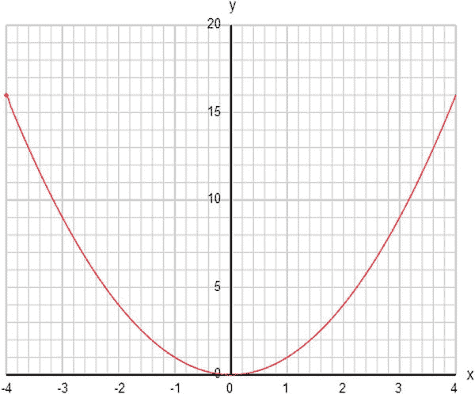

图 3-1。

Plotting the function y = x2 using the `Graph` object

### 画直线

我们从线性函数开始，比如 y = 2x + 1。键入以下代码或从`graph-functions.js`中复制:

`var canvas = document.getElementById('canvas');`

`var context = canvas.getContext('2d');`

`var graph = new Graph(context,-4,4,-10,10,275,210,450,350);`

`graph.drawgrid(1,0.2,5,1);`

`graph.drawaxes('x','y');`

`var xA = new Array();`

`var yA = new Array();`

`for (var i=0; i<=100; i++){`

`xA[i] = (i-50)*0.08;`

`yA[i] = f(xA[i]);`

`}`

`graph.plot(xA,yA,'#ff0000',false,true);`

`function f(x){`

`var y;`

`y = 2*x + 1;`

`return y;`

`}`

请注意，我们已经将 math 函数移到了一个名为`f()`的 JavaScript 函数中，以便于查看和修改。

这个图形是一条直线。如果你愿意，可以用 y = ax + b 形式的不同线性方程来模拟 a 和 b 的不同值，你会发现它们总是直线。

这条线在哪里与 y 轴相交？你会发现它总是在 y = b，那是因为在 y 轴上，x = 0。将 x = 0 代入等式，得到 y = b。b 值称为 y 轴截距。a 的意义是什么？你会在这一章的后面找到答案，在微积分那一节。

### 绘制多项式曲线

你已经看到方程 y = x 2 给出了一条抛物线。通过绘制 y = ax 2 + bx + c 形式的不同二次函数，对不同的 a、b 和 c 值进行试验，例如:

`y = x*x - 2*x - 3;`

您可能需要更改图表的范围。你会发现它们都是抛物线。如果 a 的值为正，你总会得到一条碗状曲线；如果 a 为负，曲线将呈山形。

线性和二次函数是多项式函数的特例。一般来说，多项式函数是由 x 的不同次幂的项相加而成的。x 的最高次幂称为多项式的次数。所以二次多项式是二次多项式。多项式越高，曲折越多；例如，该多项式将给出如图 [3-2](#Fig2) 所示的曲线图:

`y = -0.5*Math.pow(x,5) + 3*Math.pow(x,3) + x*x - 2*x - 3;`

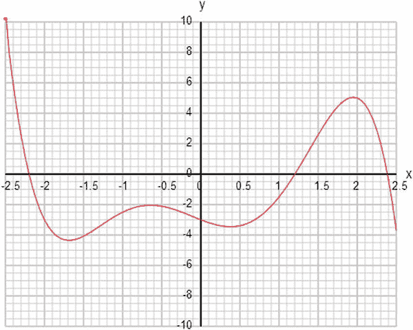

图 3-2。

A polynomial curve y = –0.5 x5 + 3x3 + x2 – 2x – 3

### 增长和衰退的事物:指数函数和对数函数

还有许多其他类型的函数可以显示有趣的行为。一个有趣的例子是指数函数，它在物理学中随处可见。它的数学定义如下

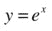

你可能想知道 e 代表什么。这是一个特殊的数字，大约等于 2.71828。在这方面，e 是一个类似π的数学常数，不能用精确的十进制形式写下来，但大约等于 3.14159。π、e 等常数出现在物理学各处。

指数函数有时也写作 exp(x)。JavaScript 有一个内置的`Math.exp()`函数。它还有一个`Math.E`静态常数，值为 2.718281828459045。

那我们就来剧情`Math.exp(x)`吧！

从图 [3-3](#Fig3) 中可以看出，当 x 变得更负时，exp(x)的曲线变为零，当 x 变得更正时，曲线增加得更快。你听说过指数增长这个术语。就是这里。如果你现在绘制 exp(–x)，你会看到相反的情况:随着 x 从负值增加到正值，exp(–x)迅速衰减到零。这是指数衰减。请注意，当 x 为 0 时，exp(x)和 exp(–x)都正好等于 1。那是因为任何数字的零次方都等于 1。

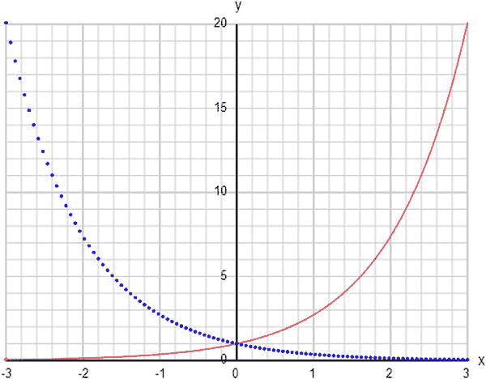

图 3-3。

Exponential growth function exp(x) (solid curve) and decay function exp(–x) (dotted curve)

当然，没有什么能阻止我们组合功能，你可以通过这样做得到有趣的形状。例如，尝试绘制–x2的指数:

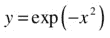

这给出了一条钟形曲线(技术上称之为高斯曲线)，如图 [3-4](#Fig4) 所示。它在中间有一个最大值，在两边迅速下降到零。在图 [3-4](#Fig4) 中，由于绘制图形的分辨率有限，曲线似乎下降到零。实际上，它永远不会精确到零，因为对于 x 的大的正值和负值，exp(–x2)变得小到几乎为零，但永远不会精确到零。

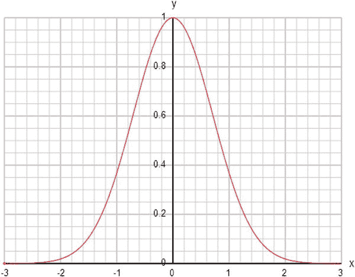

图 3-4。

The bell-shaped (Gaussian) function exp(–x2)

### 使物体沿曲线移动

让我们找点乐子，让球沿着曲线运动。为此，我们对`graph-functions.js`进行了重组，并在新代码`move-curve.js`中添加了三个新函数:

`function placeBall(){`

`ball = new Ball(6,"#0000ff");`

`ball.x = xA[0]/xscal+ xorig;`

`ball.y = -yA[0]/yscal + yorig;`

`ball.draw(context);`

`}`

`function setupTimer(){`

`idInterval = setInterval(moveBall, 1000/60);`

`}`

`function moveBall(){`

`ball.x = xA[n]/xscal + xorig;`

`ball.y = -yA[n]/yscal + yorig;`

`context.clearRect(0, 0, canvas.width, canvas.height);`

`ball.draw(context);`

`n++;`

`if (n==xA.length){`

`clearInterval(idInterval);`

`}`

`}`

函数`placeBall()`在`init()`中的`plotGraph()`之后被调用，并简单地在曲线的开始处放置一个`Ball`实例。然后在`placeBall()`之后调用`setupTimer()`，正如它的名字所示，它使用`setInterval()`函数设置了一个定时器。事件处理程序`moveBall()`在每次`setInterval()`调用时运行，并沿着曲线移动球，当球到达曲线末端时清除`setInterval()`实例。

#### 与山丘同乐

你可以让一个物体沿着你喜欢的任何函数的曲线移动；例如 y = x 2 。但是让我们疯狂一下，尝试一些更有趣的东西，比如这个 6 次多项式:

`y = 0.2*(x+3.6)*(x+2.5)*(x+1)*(x-0.5)*(x-2)*(x-3.5);`

你可以看到这是一个 6 次多项式，因为如果你展开因子，x 的最高幂的项将是 0.2 x 6 。

运行这个函数的代码来看动画。这让你有什么想法吗？也许你可以用一条曲线来代表一个丘陵景观，并创建一个游戏，在这个游戏中你试图将一个球推过山丘。唯一的问题是，曲线在端点处突然变得很大。这是多项式不可避免的。原因是对于 x 的较大正值或负值，最高项(在本例中为 0.2 x 6 )将始终支配其余项。因此，在这个例子中，由于 0.2 x 6 项的影响，我们将得到非常大的值。用数学术语来说，曲线在这些极限内“爆炸”。

让我们用一个 exp(–x2)类型的钟形函数来弥补这一点，如你所知，它在末端趋于零:

`y = (x+3.6)*(x+2.5)*(x+1)*(x-0.5)*(x-2)*(x-3.5)*Math.exp(-x*x/4);`

图 [3-5](#Fig5) 展示了我们得到的东西。酷。贝尔函数使曲线末端变平，解决了我们的问题。注意，我们已经将`exp()`中的 x 2 除以 4。这是为了拓宽钟形；否则，多项式会很快消失，留下更少的山丘。去掉 4 或者用 2 来代替，看看我们的意思。试着将 4 改为 5 或 6，看看相反的效果。

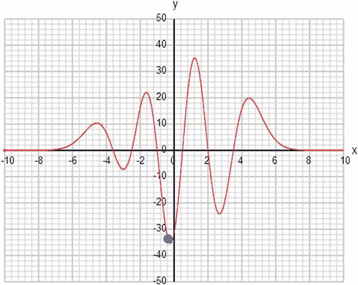

图 3-5。

Animating a ball on a curve created by multiplying a polynomial and a Gaussian

以下是修改曲线的另一种方法:将它乘以另一个因子 x(以及一个适当的数字，使其保持在显示的范围内):

`y = 0.5*x*(x+3.6)*(x+2.5)*(x+1)*(x-0.5)*(x-2)*(x-3.5) *Math.exp(-x*x/4);`

这以不同的方式修改曲线。因为 x 在原点附近小，远离原点大，通过将函数乘以 x，我们倾向于减少离原点较近的山丘，增加离原点较远的山丘的相对高度。你可能会注意到另一个变化:大负值 x 的 y 值现在是负值，景观从山谷而不是山丘开始，因为通过引入 x 的额外因子，该函数中的主导项现在是 0.5 x 7 。与之前的 0.2 x 6 相比。当主导项的幂是奇数时，它对于 x 的负值将是负的，但当幂是偶数时，即使 x 是负的，它也将是正的。通过乘以另一个系数 x 来检验这一点:

`y = 0.1*x*x*(x+3.6)*(x+2.5)*(x+1)*(x-0.5)*(x-2)*(x-3.5) *Math.exp(-x*x/4);`

如果你把这个函数乘以一个负数，你会反转整个曲线。

很明显，使用函数创建不同类型的形状有很大的灵活性。希望你能找到它们的用处！或许可以开发一个游戏，把球射过山丘。或者也许去掉图表和曲线，制作一些很酷的基于数学的动画，而不泄露你是如何做到的。

除了用于绘制已知函数之外，`Graph`对象还将作为一个有用的诊断工具来帮助您可视化您的代码实际上在计算什么，比普通的`console.log()`函数更直观、更详细。它可以帮助您理解代码中的逻辑或物理，并识别任何潜在的问题。把它想象成汽车或飞机上的仪表板或仪器面板，很快你就会比你想象的更多地使用它！

#### 圆圈的麻烦在于

现在，让我们尝试使用前两节中使用的相同方法围绕一个圆移动一个对象。这应该够简单了吧？首先，我们需要一个圆的方程。你可以在任何一本初等几何教科书中找到这个。

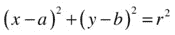

以(a，b)为原点，半径为 r 的圆的方程式如下:

如果您尝试遵循与前两节完全相同的步骤，您会希望将 y 作为 x 的函数。回想一下您的代数，您应该能够操作前面的等式来得到以下结果:

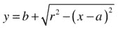

为了使任务简单，选择 a = b = 0，r = 1(圆心在原点，半径为 1):

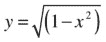

现在我们来绘制图表。你需要在两个轴上使用相同的缩放比例，这样你的圆看起来就不会扭曲。如果您这样做并运行代码，您将得到看起来部分正确的东西，但是有几个奇怪的问题。第一个是，你最终只能得到一个半圆，而不是整个圆。第二个问题是，球需要一点时间出现，然后在结束时消失。图 [3-6](#Fig6) 显示了结果图。

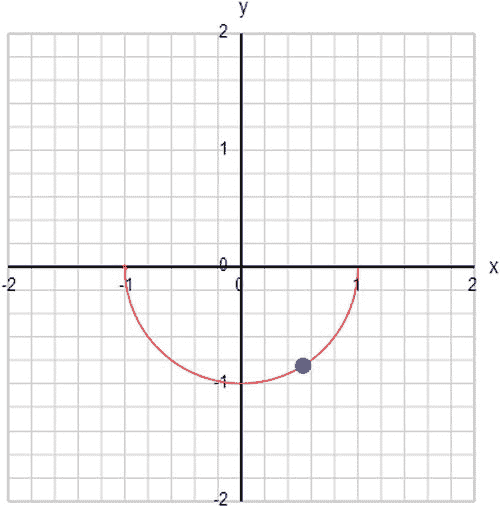

图 3-6。

First attempt to plot a circle

我们先处理后一个问题。这种奇怪的球行为的出现是因为我们已经超出了这个方程的适用范围。如果你看前面的等式，你会发现如果 x 的大小大于 1，我们有一个负数的平方根，它不会给你一个实数。所以当这种情况发生时，球无处可去！

与您之前看到的函数不同，圆被限制在平面的有限区域内。用数学术语来说，函数不能被定义在这个范围之外。让我们通过只计算范围为 1 < = x < = 1 的 x 的值来修正代码。这很容易在计算函数值的循环中完成。看一看`move-circle.js`。这是修改后的代码，可确保 x 限制在正确的范围内:

`for (var i=0; i<=1000; i++){`

`xA[i] = (i-500)*0.002;`

`yA[i] = f(xA[i]);`

`}`

第一个问题更棘手。只创建一个半圆是因为当我们用平方根来得到前面的等式时，我们也应该包括负数:

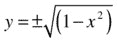

问题是你不能让一个函数同时返回两个不同的值。还有一个问题，这次是关于动画的。你可能已经注意到，球似乎沿着圆圈的某些部分快速移动，而在其他地方缓慢移动。这通常不是我们想看到的。它的出现是因为我们一直在等量增加 x。但是在曲线“陡峭”的地方，与曲线更“平坦”的地方相比，x 的相同增量导致 y 的更大增量

通常我们想让一个物体以匀速圆周运动。有没有办法知道球的位置是如何依赖于时间和转速的？有。是时候学习一下参数方程了。

#### 使用参数方程

我们在上一节中遇到的基本问题是，我们知道 y 是 x 的函数，但不知道 x 或 y 如何依赖于时间。我们所追求的是这种形式的一对方程，其中 f (t)和 g (t)是时间的函数:

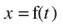

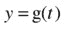

它们被称为参数方程，因为 x 和 y 是用另一个参数 t 来表示的，在这种情况下，t 代表时间。从这些参数方程中，应该可以恢复出连接 x 和 y 的方程，但反过来就不一定了。参数方程不是唯一的；可能有不同的参数方程对。

我们在这里给你一个答案。虽然在你学过一些三角学和我们讲过角速度的概念(下一节)之前不会有完全的意义，但在这里(其中 r 是圆的半径，ω是所谓的角速度，基本上是绕圆旋转的速率):

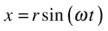

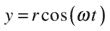

请注意，我们在这里使用的概念将在本章的后面部分详细解释。因此，尽管这些概念现在可能还不完全清楚，但它们应该很快就会变得清晰。

让我们选择 r = 1 和 w = 1，并修改代码以相应地计算 x 和 y(参见`move-circle-parametric.js`):

`for (var i=0; i<=1000; i++){`

`var t = 0.01*i;`

`xA[i] = Math.sin(t);`

`yA[i] = Math.cos(t);`

`}`

这完美地完成了工作(参见图 [3-7](#Fig7) )。选择从计数器`i`计算时间`t`的乘法因子，以产生至少一次完整的旋转。当然，你不必这样做。你可以完全去掉数组和循环，直接计算 x 和 y。但是很高兴知道，除了动态计算对象的位置之外，还有另一种方法可以用代码来制作对象的动画。这种方法可以证明是有用的，例如，如果计算太耗时；然后可以在“初始化”期间完成这些操作，并将位置存储在一个数组中(如前所述)，随后以通常的方式制作动画。

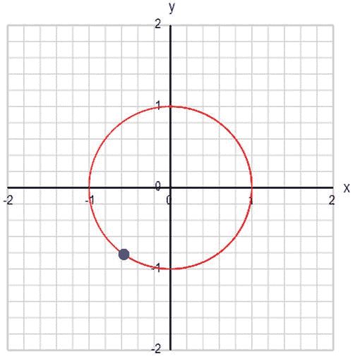

图 3-7。

Moving an object around a circle using parametric equations

### 求两点之间的距离

一个常见的问题是在给定两个物体位置的情况下找出它们之间的距离，这在例如碰撞检测中是需要的。一些物理定律也涉及两个物体之间的距离。比如牛顿万有引力定律(在[第六章](06.html)中涉及)涉及两个物体之间距离的平方。

幸运的是，有一个简单的公式，基于勾股定理，允许我们计算两点之间的距离。勾股定理实际上是一个关于三角形边长的定理。具体来说，它适用于一种特殊类型的三角形，称为直角三角形，其中一个角为 90 度。三角形的最长边称为斜边，总是与 90 度角相对(见图 [3-8](#Fig8) )。

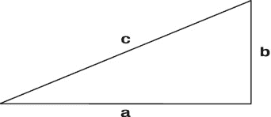

图 3-8。

A right triangle

毕达哥拉斯定理指出，如果我们取其他每条边，计算它们的长度的平方，并将结果相加，我们将得到最长边的长度的平方。用公式表示，如下，其中 c 是斜边的长度，a 和 b 是其他两条边的长度:

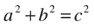

图 [3-9](#Fig9) 展示了我们如何使用这个公式计算两点之间的距离:通过画一个直角三角形。如果两点的坐标分别为(x1，y1)和(x2，y2)，则两个较短边的长度分别为(x2–x1)和(y2–y1)。

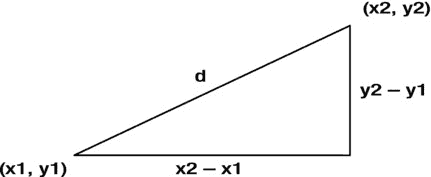

图 3-9。

Using the Pythagorean Theorem to calculate the distance between two points

因此，斜边的长度，实际上是两点之间的距离 d，由下式给出:

距离 d 然后通过取前一个表达式的平方根来获得。就这样。此外，该公式可以很容易地推广到 3D，给出如下公式:

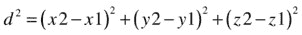

请注意，如果我们用(x1–x2)2代替(x2–x1)2并不重要，其他项也是如此，因为负数的平方与对应的正数的平方相同。

## 基础三角学

三角学是数学的一个分支，专门研究三角形的性质以及它们的边长和角之间的关系。换句话说，三角学听起来可能不是很特别，但事实上，它是动画或游戏程序员工具集不可或缺的一部分。例如，我们以前在产生圆周匀速运动的参数方程中使用三角函数。

你可能还记得学生时代的基础知识，比如三角形内角之和是 180 度的定理。但也许你不记得什么是正弦函数。这一节将回顾这门学科的要点。

### 角度和弧度

大家都知道一次完整的旋转有 360 度。很少有人知道 360 度等于 2π弧度(或者可能从未听说过弧度)。所以我们先来解释一下什么是弧度。

简单的解释是:弧度是角度的度量单位(就像度一样)。以下是这两种方法的关系:

*   2π弧度等于 360 度
*   所以π弧度等于 180 度
*   所以 1 弧度等于 180/π度，大约是 57.3 度

现在你可能对弧度的概念感到不舒服。为什么我们需要这样一个奇怪的角度单位？难道我们都不知道并热爱学位吗？好吧，重点是度数也是任意的——为什么一个圆有 360 度？为什么不是 100？

事实上，弧度在很多方面是一个更“自然”的角度单位。这是根据它的定义得出的:长度等于半径的弧在圆心所对的角。参见图 [3-10](#Fig10) 。

图 3-10。

A radian is the angle subtended at the center of a circle by an arc of length equal to the circle’s radius

您将经常需要在角度和弧度之间进行转换。这是转换公式:

*   (角度单位为度)=(角度单位为弧度)× 180 / π
*   (弧度角度)=(角度角度)× π / 180

### 正弦函数

三角函数是根据直角三角形的边来定义的。参考图 [3-11](#Fig11) ，你知道斜边(hyp)是三角形的最长边，与直角相对。选择其他角度中的一个，比如 x。然后，相对于角度 x，不接触 x 的远边称为对面(opp)。接触 x 的近边称为邻边(adj)。请注意，相对和相邻与您选择的角度(在本例中为 x)有关。相对于另一个角度，对立和相邻的角色颠倒了。另一方面，斜边总是最长的一边。

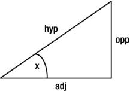

图 3-11。

Definition of hypotenuse, adjacent, and opposite sides of a right triangle

正弦函数被简单地定义为对边的长度与斜边的长度之比:

现在你可以为不同的角度 x 画许多直角三角形，测量 opp 和 hyp，计算它们的比率，并制表和绘制 sin (x)来看看它是什么样子。但是你肯定更喜欢挖出那个`Graph`物体并绘制`Math.sin()`。这就是我们在`trig-functions.js`所做的。

图 [3-12](#Fig12) 显示了我们得到的结果。我们在–720 度(–4π弧度)和 720 度(4π弧度)之间绘制了图表，以显示函数的周期性质。周期(它重复的间隔)是 360 度，或 2π弧度。曲线就像平滑的波浪。

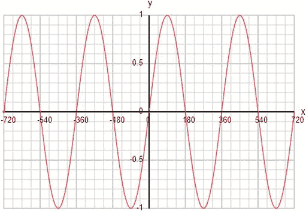

图 3-12。

The graph of a sine function

请注意，sin (x)始终介于–1 和 1 之间。在量级上永远不可能大于 1，因为 opp 永远不可能大于 hyp。我们说正弦波的峰值振幅为 1。sin (x)的值在 0 度以及此后和之前每隔 180 度为零。

### 余弦函数

与正弦类似，余弦函数定义为邻边长度与斜边长度之比:

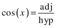

图 [3-13](#Fig13) 所示的曲线与 sin (x)相似，除了 cos (x)看起来相对于 sin (x)移动了 90 度。其实结果是 cos(x–π/2)= sin(x)。继续，通过绘制这个函数来证明它。这表明 cos 和 sin 仅相差一个常数。我们说它们有 90 度的相位差。

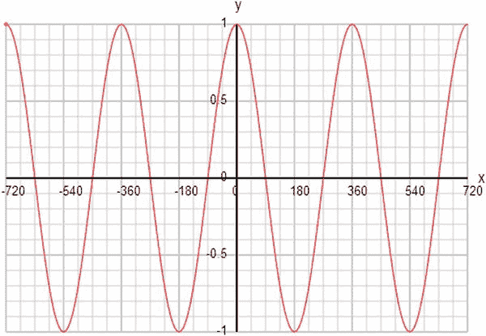

图 3-13。

The graph of a cosine function

### 正切函数

第三种常见的 trig 函数是正切函数，定义如下:

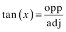

这个定义相当于:

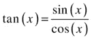

如果绘制 tan x 的曲线图，乍一看可能会有点奇怪(见图 [3-14](#Fig14) )。忽略 90 度的垂直线，以此类推。他们不应该真的在那里。该图仍然是周期性的，但它由每隔 180 度的不连续分支组成。此外，tan (x)可以取任何值，而不仅仅是–1 和 1 之间的值。90 度的情况是 tan (x)变得无穷大。回到 tan (x)的定义，这是因为对于 90 度，adj 为零，所以我们最后除以零。

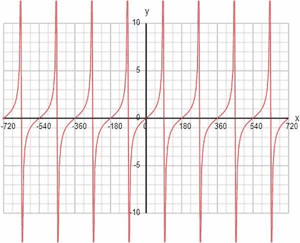

图 3-14。

The graph of a tangent function

你可能不会像罪恶和 cos 那样频繁地使用 tan。但是你肯定会用到它的逆，我们接下来会介绍。

### 反向触发功能

通常需要根据某个角度的 sin、cos 或 tan 值来确定该角度。在数学中，这是使用三角函数的逆函数来完成的，分别称为 arcsin、arccos 和 arctan。

在 JavaScript 中，这些被称为`Math.asin()`、`Math.acos()`和`Math.atan()`的函数以一个数字作为参数。显然，`Math.asin()`和`Math.acos()`的数字必须在-1 和 1 之间，但是`Math.atan()`可以是任何值。

请注意，反向 trig 函数返回的是以弧度表示的角度，因此如果需要的话，必须转换成度数。

JavaScript 中还有一个反 tan 函数:`Math.atan2()`。区别是什么，为什么我们需要两个？

`Math.atan()`采用单个参数，即您正在计算的角度的 opp/adj 比率。`Math.atan2()`取两个参数，是 opp 和 adj 的实际值，如果你碰巧知道的话。那么，为什么需要`Math.atan2()`——你不能只做`Math.atan(opp/adj)`？

要回答这个问题，请执行以下操作:

`console.log(Math.atan(1)*180/Math.PI);`

`console.log (Math.atan2(2,2)*180/Math.PI);`

`console.log (Math.atan2(-2,-2)*180/Math.PI);`

所有三行代码的 opp/adj 比率都为 1，但是您会发现前两行返回 45 度，而第三行将返回–135 度。所发生的是，第三个选项指定角度指向左上方，并且因为角度是从画布坐标系中的正 x 轴以顺时针方向测量的，所以角度实际上是–135 度(参见图 [3-15](#Fig15) )。现在，你没有办法告诉`Math.atan()`函数，因为它只有一个参数:1，和 45 度一样。

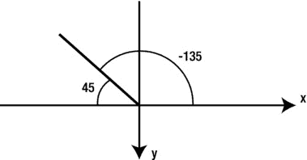

图 3-15。

Understanding the result of `Math.atan2(-2,-2)`

### 为动画使用 trig 函数

你已经看到了 sin 和 cos 如何被用来使一个物体做圆周运动。它们对于产生任何类型的重复或振荡运动也特别有用。但是在我们开始使用 trig 函数制作动画之前，我们需要引入一些新概念。

#### 波长、周期、频率和角频率

再看一下图 [3-12](#Fig12) ，它显示了正弦函数的图形。如果 x 代表空间中的距离，我们在空间中有一个以规则间隔重复的正弦波。这个间隔称为波的波长。它是相邻相似点之间的距离，例如，连续波峰之间的距离。

如果我们用正弦函数对时间作图，重复间隔就是一个时间尺度，称为波的周期。例如，如果这是一个上下运动的球，周期(用符号 T 表示)就是它回到初始位置的时间。让我们称之为一个循环。

现在，假设一个周期需要 0.5 秒，我们可以表述为 T = 0.5 秒。球在 1 秒钟内完成几个循环？很明显是两个。这就是一秒钟有多少个半秒钟。这被称为运动频率(用符号 f 表示)。

不难看出，一般来说，频率是由周期的倒数给出的:

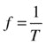

现在，事实证明，你总是可以把球的上下运动想象成另一个在圆周上匀速运动的假想球的位置的投影(见图 [3-16](#Fig16) )。一个周期的振荡(类似波浪的运动)相当于围绕圆周的一次完整的旋转。想想旋转的球移动的角度，那是 2π弧度。因为球每秒移动 f 个周期，每个周期是 2π弧度，这意味着球每秒通过 2πf 弧度。这被称为运动的角频率或角速度(通常用希腊字母ω，omega 表示)。它告诉你旋转的球每秒移动的角度，单位是弧度。

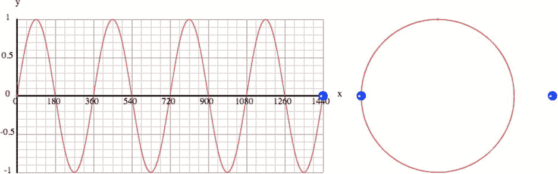

图 3-16。

Relationship between oscillation, circular motion, and a sine wave

最后，因为ω是假想球每秒移动的角度，所以在 t 秒内，球将移动ω t 弧度。因此，如果它以 0 弧度的角度开始，在 t 秒时，它的投影位移等于 sin (ω t):

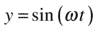

如果我们知道振荡的角频率，我们可以计算出球在任何时候的位置，如果它的初始位置是已知的。当然，如果我们知道周期或频率，我们可以通过前面的公式计算出角频率。

让我们看一些例子。对于这些例子，我们使用的是`trig-animations.js`，它是对`move-curve.js`的修改。我们现在将并排展示一个 2D 动画和它的 1D 版本，在这个版本中你只需要沿着一个方向移动一个物体。

#### 振动

基本振荡(2D 的波动)很容易用正弦或余弦函数来实现。这种振荡被称为简谐运动(SHM)。振荡由单一频率的波组成。用`trig-animations.js`试试看:

`function f(x){`

`var y;`

`y = Math.sin(x*Math.PI/180);`

`return y;`

`}`

通过将自变量乘以不同的因子，可以产生不同频率的波。

#### 阻尼振荡

正弦波振荡会永远持续下去。如果你想让它们随着时间消失，你可以把正弦乘以一个负系数的指数:

`y = Math.sin(x*Math.PI/180)*Math.exp(-0.002*x);`

您可以通过将系数 0.002 更改为更小或更大的数字来进行实验。图 [3-17](#Fig17) 显示了您可能会看到的典型模式。

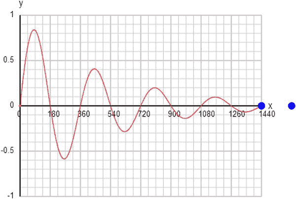

图 3-17。

Damped oscillations using sin(x) and exp(–x)

#### 组合正弦波

你可以通过组合正弦波和余弦波产生各种奇异的效果。这是一个组合的例子:

`y = Math.sin(x*Math.PI/180) + Math.sin(1.5*x*Math.PI/180);`

或者尝试两个角频率几乎相同的正弦波:

`y = 0.5*Math.sin(3*x*Math.PI/180) + 0.5*Math.sin(3.5*x*Math.PI/180);`

这给了你一个“节拍”动作；一个快速振荡叠加一个较慢的振荡(见图 [3-18](#Fig18) )。

图 3-18。

Pattern produced by superimposing two sine waves of nearly equal frequency

使用正弦波的组合可以产生各种重复的图案。有一种叫做傅立叶分析的数学技术，可以让你计算出产生特定模式所需的正弦波组合。正弦波的和称为傅立叶级数。

例如，您可以通过以下方式添加正弦波来产生看起来像方波(阶跃函数波)的东西:

`y = Math.sin(x*Math.PI/180) + Math.sin(3*x*Math.PI/180)/3 + Math.sin(5*x*Math.PI/180)/5;`

添加的波越多，结果就越接近方波。例如，添加系列中的下一个术语(`Math.sin(7*x*Math.PI/180)/7`)以查看您得到的结果。

我们写了一个小函数`fourierSum(N,x)`，它计算方波的 N 项傅里叶和。

`function f(x){`

`var y;`

`y = fourierSum(10,x);`

`return y;`

`}`

`function fourierSum(N,x){`

`var fs=0;`

`for (var nn=1; nn<=N; nn=nn+2){          fs += Math.sin(nn*x*Math.PI/180)/nn;`

`}`

`return fs;`

`}`

图 [3-19](#Fig19) 显示了 N = 10 的结果。当 N = 1000 时，曲线几乎是完美的方波。

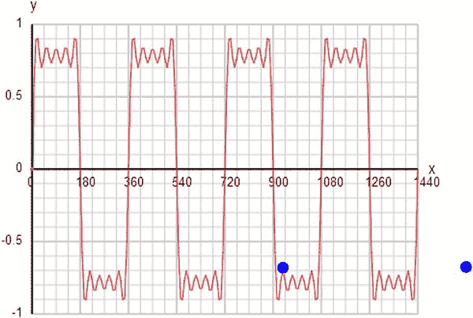

图 3-19。

Fourier series pattern for a square wave with N = 10

## 向量和基本向量代数

向量是有用的数学构造，它简化了我们处理速度和力等物理量的方式，这将在下一章详细讨论。向量代数由操作和组合向量的规则组成。当你们讨论速度分量的时候，你们已经非正式地接触过向量了。现在让我们更正式地介绍矢量。

### 什么是矢量？

用位移的例子可以最直观地说明矢量。位移的概念将在第 4 章中详细介绍，但本质上它指的是给定距离和给定方向的运动。这里有一个例子。

假设那只虫子，瓢虫，正在一张图表纸上爬行。Bug 从原点开始，爬行 10 个单位的距离；然后他停下来。Bug 接着继续爬行 10 个单位，然后再次停止。Bug 离原点有多远？有人可能会说 20 个单位。但是如果 Bug 第一次向上爬，第二次向右爬呢？(参见图 [3-20](#Fig20) )。显然 20 个单位是错误的答案。通过使用毕达哥拉斯定理，答案实际上是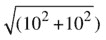，或者大致是 14.1 个单位。

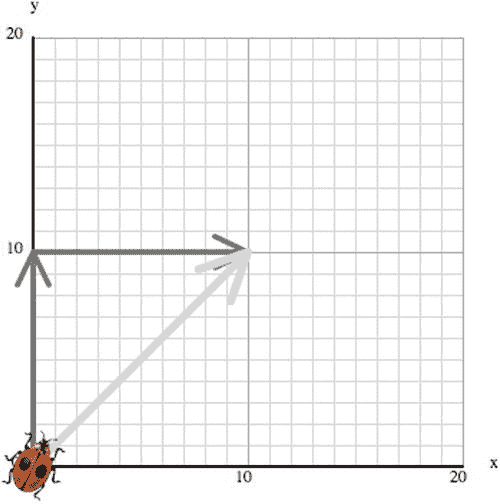

图 3-20。

The direction of displacement matters!

不能简单的把两个距离相加，因为还需要考虑到 Bug 移动的方向。为了分析位移，你需要一个大小和一个方向。

在数学中，我们将这个概念抽象为向量的概念，向量是一个有大小和方向的量。

位移不是唯一的向量。许多运动的基本概念，如速度、加速度和力，都是矢量(它们将在下一章讨论)。这一节概述了作为抽象数学对象的矢量代数，不管它们是位移、速度还是力。掌握一点向量代数，你可以通过减少你必须处理的方程的数量来简化计算。这节省了时间，减少了出错的可能性，简化了生活。

### 向量与标量

向量通常与标量形成对比，标量是只有大小的量。距离或长度是一个标量，你只需要一个数字来指定它。但是位移是一个向量，因为你需要指定位移的方向。形象地说，向量通常被表示为有方向的直线——一条上面有箭头的线。

注意，向量的唯一特征是它的大小和方向。这意味着两个具有相同大小和方向的矢量被认为是相等的，不管它们在空间的什么位置(见图 3-21a)。换句话说，矢量的位置无关紧要。然而，这个规则有一个例外:位置向量。物体的位置矢量是连接固定原点和物体的矢量，所以它是相对于固定原点的位移矢量(见图 3-21b)。

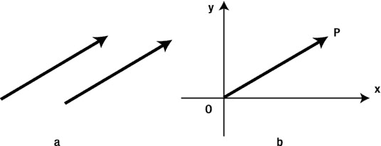

Figure 3-21\. (a) Parallel vectors of equal length are equal; (b) Position vectors relate to the origin

### 加法和减法向量

在 Bug 的例子中，两个位移之和是多少？自然的答案是，它是由从初始位置指向最终位置的矢量给出的合成位移(参见图 [3-20](#Fig20) )。如果 Bug 现在向下移动了 5 个单位的距离呢？你可能会说合成位移是从起点(在这种情况下是原点)指向终点的向量。这就是所谓的头尾法则:

*   要添加两个或多个向量，请将它们连接起来，使它们“头尾相接”，必要时可以四处移动它们(只要它们的方向不变，即它们保持与原始方向平行)。和矢量或合成矢量是连接起点和终点的矢量。

要从另一个向量中减去一个向量，我们只需加上那个向量的负值。向量的负值是指大小相同但方向相反的向量。

从向量本身(或向量和它的负数之和)中减去一个向量，得到零向量——一个长度为零、方向任意的向量。

我们来看一个例子。假设 Bug 向上移动了 10 个单位后，他决定以 45 度角移动 10 个单位(见图 [3-22](#Fig22) )。合成位移是多少？这就更棘手了:你不能直接应用勾股定理，因为你不再有直角三角形了。你可以使用一些更复杂的三角学，或者精确地画出矢量，然后拿一把尺子测量合成的距离和角度。

但实际上，你不会这么做。使用矢量分量来加减矢量要容易得多。现在我们来看看矢量分量。

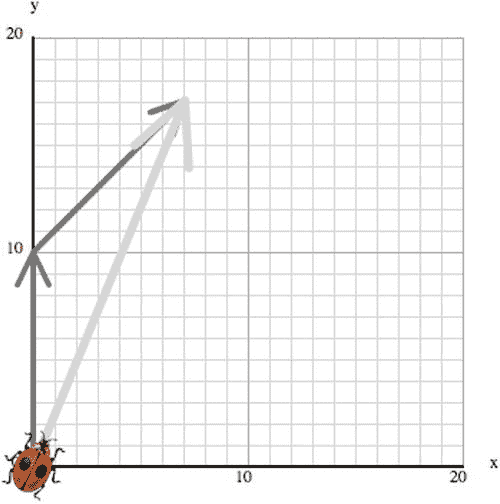

图 3-22。

Addition of vectors

### 解析向量:向量分量

如前所述，矢量有大小和方向。这在 2D 意味着你需要两个数字来指定一个向量。看一下图 [3-23](#Fig23) 。这两个数字是向量的长度 r 和它与 x 轴的夹角θ。但是我们也可以将这两个数字指定为向量在 x 和 y 方向上的范围，分别用 x 和 y 表示。这些被称为矢量分量。

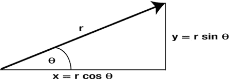

图 3-23。

Vector components

(r，θ)和(x，y)之间的关系可以通过上一节讨论的简单三角学得到。再次查看图 [3-23](#Fig23) ，我们知道:

这给出了以下内容:

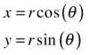

以这种方式从矢量的大小和角度计算出矢量分量被称为沿 x 轴和 y 轴“分解矢量”。实际上，你可以沿着任意两个相互垂直的方向分解一个矢量。但大多数时候，我们会沿着 x 轴和 y 轴来做。

向量有许多不同的符号，很容易陷入符号的困境。但是在 JavaScript 中，你只需要记住向量是有分量的。所以任何有助于记忆的符号都是一样好的。为了简洁起见，我们将使用下面的符号，用粗体字母表示向量，用方括号括起它们来表示它们的组成部分:

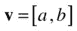

在 3D 中，你不需要两个，而是三个组件来指定一个向量，所以我们这样写:

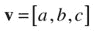

#### 位置向量

物体的位置向量是从原点指向该物体的向量。因此，我们可以用物体的坐标来表示位置向量。在 2D:

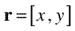

在 3D 中:

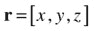

#### 使用组件添加向量

下面是如何使用组件添加两个向量:

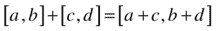

很简单，不是吗？为什么会这样，从图 [3-24](#Fig24) 中应该很清楚。将两个矢量的水平分量和垂直分量分别相加。这就给出了合成矢量的分量。

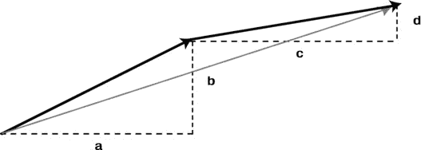

图 3-24。

Adding vectors using components

作为一个例子，将此应用于图 [3-22](#Fig22) 所示的 Bug 位移问题，可以得到以下位移，您可以很容易地在图上验证:

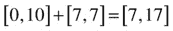

随意用纸笔练习做向量加法；在经历了一些之后，这个过程应该变得明显，并且帮助你建立你对向量和向量分量的直觉。

类似地，使用分量的矢量减法也很简单:

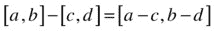

#### 将一个向量乘以一个数

将一个向量乘以一个数，就是将它的每个分量乘以那个数:

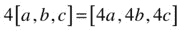

特别是，如果我们将一个向量乘以–1，我们会得到这个向量的负值:

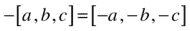

将一个向量除以一个数 N 就等于将这个向量乘以这个数的倒数 1/N。

#### 矢量幅度

矢量的大小(长度)是通过将勾股定理应用于其分量而得到的:

*   在 2D，[x，y]的量级是；或者用 JavaScript 代码:`Math.sqrt(x*x+y*y)`。
*   在 3D 中，[x，y，z]的大小为；或者用 JavaScript 代码:`Math.sqrt(x*x+y*y+z*z)`。

注意，如果我们把一个向量除以它的大小，我们会得到一个长度为一个单位的向量，它与原始向量的方向相同。这叫做单位向量。

#### 向量角度

从矢量的分量计算矢量的角度并不比计算其大小更困难。在 JavaScript 中，使用`Math.atan2()`函数最容易做到这一点。

向量[x，y]的角度由`Math.atan2(y, x)`给出。注意——您需要首先将参数指定为 y，然后是 x。

### 乘法向量:标量或点积

两个向量相乘可能吗？答案是肯定的。数学家定义了一种叫做标量积的“乘法”运算，其中两个向量产生一个标量。回想一下，标量只有大小，没有方向；换句话说，它基本上只是一个数字。规则是将每个向量的相应分量相乘，然后将结果相加:

标量积用一个点表示，所以也叫点积。

用矢量幅度和方向表示，点积由下式给出，其中θ是两个矢量之间的角度，r1 和 r2 是它们的长度:

标量积的几何解释是，它是一个向量的长度与另一个向量的投影长度的乘积(见图 [3-25](#Fig25) )。

图 3-25。

The scalar product between two vectors

当您需要找出两个向量之间的角度时，这很有用，您可以通过相等前面两个方程的右侧并求解θ来获得该角度。在 JavaScript 中，您只需这样做:

`angle = Math.acos((x1*x2+y1*y2)/(r1*r2))`

注意，如果两个向量之间的角度为零(它们是平行的)，cos (θ) = 1，点积正好是它们大小的乘积。

如果两个向量垂直，则 cos (θ) = cos (π/2) = 0，因此点积为零。这是检验两个向量是否垂直的好方法。所有这些公式和事实都适用于 3D，其点积如下所示:

标量积出现在物理学的几个地方。下一章我们会碰到一个例子，关于功的概念，它被定义为力和位移的点积。因此，尽管点积作为一种数学构造可能显得有些抽象和神秘，但当你在第四章的应用上下文中再次遇到它时，它将有望变得更直观。

### 乘法向量:向量或叉积

在 3D 中，还有另一种类型的乘积，称为矢量乘积，因为它给出的是矢量而不是标量。这条规则要复杂得多。

如果有两个向量 a = [x1，y1，z1]和 b = [x2，y2，z2]，并且它们的矢量积由向量 c = a ×b = [x，y，z]给出，则 c 的分量由下式给出:

这不太直观，对吧？就像数学中的一切一样，这肯定是有一些逻辑的。但试图解释这一点会转移太多的注意力。所以我们就接受这个公式吧。

矢量积也称为叉积，因为它用“叉”符号来表示。两个矢量 a 和 b 的矢量积给出了第三个矢量，它垂直于 a 和 b。

就矢量幅度和方向而言，叉积由下式给出:

其中 a 和 b 分别是 a 和 b 的大小，θ是 a 和 b 之间的较小角度，n 是垂直于 a 和 b 的单位向量，并且根据右手法则定向(参见图 [3-26](#Fig26) ):握住右手，食指指向第一个向量 a，中指指向 b 的方向，然后 n 将指向拇指的方向，保持垂直于 a 和 b。

图 3-26。

The right-hand rule for the vector product

注意，当θ = 0 时，叉积为零(因为 sin (0) = 0)。因此，两个平行向量的叉积给出零向量。

像标量积一样，矢量积出现在物理学的几个地方；例如在旋转运动中。

### 用向量代数构建向量对象

我们构建了一个轻量级的`Vector2D`对象，赋予了 2D 所有相关的向量代数。下面是代码(见`vector2D.js`)。选择这些方法名称是为了直观理解。

`function Vector2D(x,y) {`

`this.x = x;`

`this.y = y;`

`}`

`// PUBLIC METHODS`

`Vector2D.prototype = {`

`lengthSquared: function(){`

`return this.x*this.x + this.y*this.y;`

`},`

`length: function(){`

`return Math.sqrt(this.lengthSquared());`

`},`

`clone: function() {`

`return new Vector2D(this.x,this.y);`

`},`

`negate: function() {`

`this.x = - this.x;`

`this.y = - this.y;`

`},`

`normalize: function() {`

`var length = this.length();`

`if (length > 0) {`

`this.x /= length;`

`this.y /= length;`

`}`

`return this.length();`

`},`

`add: function(vec) {`

`return new Vector2D(this.x + vec.x,this.y + vec.y);`

`},`

`incrementBy: function(vec) {`

`this.x += vec.x;`

`this.y += vec.y;`

`},`

`subtract: function(vec) {`

`return new Vector2D(this.x - vec.x,this.y - vec.y);`

`},`

`decrementBy: function(vec) {`

`this.x -= vec.x;`

`this.y -= vec.y;`

`},`

`scaleBy: function(k) {`

`this.x *= k;`

`this.y *= k;`

`},`

`dotProduct:     function(vec) {`

`return this.x*vec.x + this.y*vec.y;`

`}`

`};`

`// STATIC METHODS`

`Vector2D.distance =  function(vec1,vec2){`

`return (vec1.subtract(vec2)).length();`

`}`

`Vector2D.angleBetween = function(vec1,vec2){`

`return Math.acos(vec1.dotProduct(vec2)/(vec1.length()*vec2.length()));`

`}`

文件`vector-examples.js`包含了一些使用`Vector2D`对象的例子。你很快会在整本书中看到大量使用它的例子。

## 简单的微积分思想

正如本章开始时所述，我们并不假设所有读者都有微积分背景。如果你这样做，那当然是方便的；但是我们仍然建议您浏览这一部分，尤其是代码示例和离散微积分部分，看看我们如何在代码中应用微积分。如果微积分对你来说是全新的，这一节是作为一些基本概念的概述而设计的。因此，虽然你不能仅仅通过阅读这一部分来“做”微积分，但你将有希望获得足够的理解来理解涉及微积分的物理公式的意义。此外，你将被介绍到离散微积分和数值方法的主题，这将为接近更复杂的物理模拟提供基础。

那么什么是微积分呢？一句话，这是一种数学形式，用来处理相对于其他量连续变化的量。因为物理学研究的是将一些量与其他量联系起来的规律，微积分显然是相关的。

微积分由两部分组成。微分学(或微分)处理的是量的变化率。积分学(或积分)处理连续和。这两者通过微积分的基本定理联系在一起，该定理指出积分是微分的逆运算。

如果你以前从未接触过微积分，这听起来非常神秘，所以让我们从你知道的一些东西开始，给你一个温和的介绍。到本章结束时，这些陈述对你来说会更有意义。

### 线的斜率:梯度

变化率是物理学中的一个重要概念。如果你想一想，我们正在试图制定定律来告诉我们，例如，行星的运动是如何随时间变化的；行星上的力如何随位置变化等等。这里的关键词是“随…而变”事实证明，物理定律包含位置、速度等不同物理量的变化率。

通俗地说，“变化率”告诉我们事物变化的速度有多快。通常我们指的是它随时间变化的速度，但我们也可能对某个事物相对于其他量的变化速度感兴趣，而不仅仅是时间。例如，当一颗行星在其轨道上运行时，重力随其位置的变化有多快？

所以，用数学术语来说，让我们考虑一个量 y 相对于另一个量 x 的变化率(其中 x 可以是时间 t 或其他量)。为此，我们将使用图表来帮助我们更容易地可视化关系。

让我们从两个相互之间有简单线性关系的量开始；也就是说，它们之间的关系是

正如你在坐标几何部分看到的，这意味着 y 对 x 的图形是一条直线。常数 b 是 y 轴截距；直线与 y 轴相交的点。我们现在将证明常数 a 给出了 y 随 x 的变化率的度量。

看图 [3-27](#Fig27) 。两条线中，哪一条 y 随 x 变化更快？

图 3-27。

The gradient (slope) of a line

很明显，它是 A，因为它“更陡”，所以 x 的相同增加导致 y 的更大增加。因此，直线斜率的陡度给出了 y 相对于 x 的变化率的度量。我们可以通过如下定义变化率来使这一想法更精确:

变化率=(y 的变化)/(x 的变化)

习惯上使用符号δ来表示“变化”，因此我们可以这样写:

让我们给变化率取一个较短的名字；姑且称之为梯度。想法是这样的:在坐标为(x1，y1)和(x2，y2)的直线上取任意两点，计算 y 的差值和 x 的差值，并将前者除以后者:

有了一条直线，你会发现无论你取哪一对点，你都会得到相同的梯度。此外，该梯度等于 a，即公式 y = ax + b 中 x 的倍数。

这是有意义的，因为一条直线有一个恒定的斜率，所以你在哪里测量它并不重要。这是一个非常好的开始。我们有一个计算梯度或变化率的公式。唯一的问题是，它仅限于彼此线性相关的量。那么我们如何将这个结果推广到更一般的关系(比如当 y 是 x 的非线性函数时？)

### 变化率:衍生品

你已经知道非线性函数的图形是曲线而不是直线。直观上，曲线的斜率不是恒定的，而是沿着曲线变化的。因此，无论非线性函数的变化率或梯度如何，它都不是常数，而是取决于 x。换句话说，它也是 x 的函数。

我们现在的目标是找到这个梯度函数。在数学课程中，你会做一些代数运算，然后得出梯度函数的公式。比如你可以从函数 y = x 2 开始，说明它的梯度函数是 2x。但是因为你没有上过数学课，所以让我们用代码来代替。但是首先，我们需要定义曲线的梯度是什么意思。

因为一条曲线的坡度是沿着曲线变化的，所以我们把重点放在曲线上的一个固定点 P 上(图 [3-28](#Fig28) )。

图 3-28。

The gradient of a curve

然后让我们在 P 点附近选取任何其他点 Q，如果我们画一条连接 P 和 Q 的线段，那条线的斜率就近似于曲线的斜率。如果我们想象 Q 接近 P，我们可以期望线段 PQ 的梯度越来越接近曲线在 P 处的梯度。

实际上，我们所做的是使用之前的直线梯度公式，并减少δx 和δy 的间隔:

然后，我们可以沿着曲线在不同的位置对点 P 重复这个过程，以找到梯度函数。现在让我们在`gradient-function.js`中做这件事:

`var canvas = document.getElementById('canvas');`

`var context = canvas.getContext('2d');`

`var numPoints=1001;`

`var numGrad=50;`

`var xRange=6;`

`var xStep;`

`var graph = new Graph(context,-4,4,-10,10,275,210,450,350);`

`graph.drawgrid(1,0.2,2,0.5);`

`graph.drawaxes('x','y');`

`var xA = new Array();`

`var yA = new Array();`

`// calculate function`

`xStep = xRange/(numPoints-1);`

`for (var i=0; i<numPoints; i++){`

`xA[i] = (i-numPoints/2)*xStep;`

`yA[i] = f(xA[i]);`

`}`

`graph.plot(xA,yA,'#ff0000',false,true); // plot function`

`// calculate gradient function using forward method`

`var xAr = new Array();`

`var gradA = new Array();`

`for (var j=0; j<numPoints-numGrad; j++){`

`xAr[j] = xA[j];`

`gradA[j] = grad(xA[j],xA[j+numGrad]);`

`}`

`graph.plot(xAr,gradA,'#0000ff',false,true); // plot gradient function`

`function f(x){`

`var y;`

`y = x*x;`

`return y;`

`}`

`function grad(x1,x2){`

`return (f(x1)-f(x2))/(x1-x2);`

`}`

相关的线是计算梯度函数和函数`grad()`的线。给定 x1 和 x2 作为输入，此函数简单地计算梯度(y2–y1)/(x2–x1)。决定使用哪些点的行如下:

`gradA[j] = grad(xA[j],xA[j+numGrad]);`

这里`numGrad`是 Q 远离点 P(我们正在评估梯度的点)的网格点数。显然，`numGrad`的值越小，计算出的梯度就越精确。

我们在 x 区间 6(从–3 到 3)中总共使用了 1，000 个网格点。这使得我们的步长为每个网格点 0.006 个单位。先用`numGrad=1`开始吧。这是最小的可能值。运行代码绘制梯度函数和原始函数 y = x 2 。梯度函数的图形是一条穿过原点的直线。当 x = 1 时，y = 2，当 x = 2 时，y = 4，依此类推。你大概可以猜到，这条线的方程是 y = 2x。现在任何微积分课本都会告诉你 y = x 2 的梯度函数是 y = 2x。所以这很好。你已经成功计算了你的第一个梯度函数！

现在将`numGrad`的值改为 50。你会看到计算出的梯度函数线移动了一点。不再是 y = 2x。不太好。试着减少`numGrad`。您会发现，最大值约为 10 时，结果看起来非常接近 y = 2x。那就是 10 × 0.006 = 0.06 的步长。比这大得多的话，你会开始失去准确性。

让我们通过介绍更多的术语和符号来结束这一节。梯度函数也叫做关于 x 的导函数或导数，我们可以互换使用这两个术语。计算导数的过程叫做微分。

我们证明了比率δy/δx 给出了曲线在某一点的梯度，只要δx 和δy 很小。在形式微积分中，我们说当δx 和δy 趋于零时，δy/δx 趋于梯度函数。

为了表达梯度函数实际上是δy/δx 的一个极限值，我们这样写:

这是函数 y 相对于 x 的导数的标准符号。另一个符号是 y’(“y 素数”)；或者我们写 y = f(x)，导数也可以用 f’(“f 素数”)来表示。

没有什么可以阻止你计算导数的导数。这被称为二阶导数，写作如下:

事实上，你会在下一章发现，速度是位置(相对于时间)的导数，加速度是速度的导数。所以加速度是位置对时间的二阶导数。记数法中，v = dx/dt，a = dv/dt，所以 a = d 2 x/dt 2 。

我们计算了标量函数的导数，但是你也可以对向量求导。你只需要分别求出每个矢量分量的导数。

例如，vx = dx/dt、vy = dy/dt 和 vz = dz/dt 是三个速度分量。我们可以更简洁地将它写成向量形式，如下所示，其中 v = [vx，vy，vz]和 r = [x，y，z]:

#### 离散微积分:差分方程

我们在前面的代码中计算梯度函数时所做的是离散微积分的一个例子:使用数值方法计算导数。数值方法基本上是一种使用代码以近似方式执行数学计算的算法。如果我们没有计算数量的精确公式，这是需要的。

在前面的例子中，我们有 y = x 2 并且需要使用导数的离散形式来计算 y ’:

为此，我们使用了以下形式的差分方程:

这被称为向前差分方案，因为我们在第 n 步使用下一步 n+1 的函数值计算导数。

还有很多其他的差分方案。让我们试试中心差分格式:

它被称为中心差分格式，因为我们在点 P 的两边选择一个点，在这里我们计算梯度。下面是执行此操作的代码:

`// calculate gradient function using centered method`

`var xArc = new Array();`

`var gradAc = new Array();`

`for (var k=numGrad; k<numPoints-numGrad; k++){`

`xArc[k-numGrad] = xA[k];`

`gradAc[k-numGrad] = grad(xA[k-numGrad],xA[k+numGrad]);`

`}`

如果运行这段代码，您会看到它给出了与前面的方案相同的答案，即`numGrad` = 1(回想一下，`numGrad`是 P 和 Q 之间的网格点数，它越小，计算出的梯度就越精确)。但是如果你现在尝试更大的`numGrad`值，你会发现它对于 250 这样大的值仍然是相当准确的，相当于 1.5 的网格大小。与前向差分方案的最大步长 0.06 相比，它大了 25 倍！

这表明中心差分格式比正演格式精确得多。图 [3-29](#Fig29) 显示了用两种方法计算的`numGrad = 50`的导数。注意我们在这个图上画了两种不同的东西:原函数 y 和它的梯度函数 dy/dx。因此 y 轴上的标签。恰好通过原点的直线就是利用中心差分格式得到的梯度函数。以你的坐标几何知识，你应该能够推断出这是函数 2x 的一个图。换句话说，dy/dx = 2x。任何做过微积分的人都会立刻认出 2x 是 y = x 2 的梯度函数，也就是我们的原始函数——所以中心差分格式做得非常好。使用前向差分方案计算的另一行有一点偏移，这意味着它将有一个相关的误差。这被称为数值积分误差。当然，所有的数值方法都会有误差。但是在这种情况下，由于中心差分方案产生的误差非常小，以至于在图上看不到。我们将在第 14 章的[中更详细地讨论数值精度。](14.html)

图 3-29。

Derivatives computed by the forward (thin line) and central (thick line) difference schemes

### 做加法:积分

现在我们问这样一个问题:反过来有可能吗？假设我们知道一个函数的导数；我们能找到函数吗？答案是肯定的。这就叫融合。同样，通常在数学中，你会用分析的方法来做。但这里我们将通过代码进行数值积分。

作为数值积分的一个例子，让我们反转前面的向前差分方案以找到 y(n+1)，它给出如下结果:

现在 y '给定了，我们就可以从前一个 y(n)算出 y(n+1)。你可以看到这将是一个迭代过程，我们增加 y 的值，这是一个和，这就是积分。积分的结果叫做积分，就像微分的结果叫做导数一样。

让我们把这个应用到导数 y' = 2x 上。我们应该可以恢复函数 y = x 2 。下面是实现这一点的代码:

`var canvas = document.getElementById('canvas');`

`var context = canvas.getContext('2d');`

`numPoints=1001;`

`var numGrad=1;`

`var xRange=6;`

`var xStep;`

`var graph = new Graph(context,-4,4,-10,10,275,210,450,350);`

`graph.drawgrid(1,0.2,2,0.5);`

`graph.drawaxes('x','y');`

`var xA = new Array();`

`var yA = new Array();`

`// calculate function`

`xStep = xRange/(numPoints-1);`

`for (var i=0; i<numPoints; i++){`

`xA[i] = (i-numPoints/2)*xStep;`

`yA[i] = f(xA[i]);`

`}`

`graph.plot(xA,yA,'#ff0000',false,true); // plot function`

`// calculate gradient function using forward method`

`var xAr = new Array();`

`var gradA = new Array();`

`for (var j=0; j<numPoints-numGrad; j++){`

`xAr[j] = xA[j];`

`gradA[j] = grad(xA[j],xA[j+numGrad]);`

`}`

`graph.plot(xAr,gradA,'#0000ff',false,true); // plot gradient function`

`// calculate integral using forward method`

`var xAi = new Array();`

`var integA = new Array();`

`xAi[0] = -3;`

`integA[0] = 9;`

`for (var k=1; k<numPoints; k++){`

`xAi[k] = xA[k];`

`integA[k] = integA[k-1] + f(xA[k-1])*(xA[k]-xA[k-1]);`

`}`

`graph.plot(xAi,integA,'#00ff00',false,true); // plot integral`

`function f(x){`

`var y;`

`y = 2*x;`

`return y;`

`}`

`function grad(x1,x2){`

`return (f(x1)-f(x2))/(x1-x2);`

`}`

`function integ(x1,x2){`

`return (f(x1)-f(x2))/(x1-x2);`

`}`

完整的源代码在`integration.js`中。你会注意到的一件事是，你必须指定起点。从前面的等式中可以清楚地看出这一点；因为 y(n+1)依赖于 y(n)，所以首先需要知道 y(0)(和 x(0))的值。这叫做初始条件。当你积分时，你必须指定一个初始条件。在代码中，我们通过指定 x(0)=–3 和 y(0) = 9 来实现这一点。尝试另一个初始条件，看看你得到什么；例如，x(0)=–3，y(0) = 0。

这个例子可能看起来是人为的，但事实上它描述了一个真实的物理例子:垂直向上扔球。函数 f(x)表示垂直速度，它的积分是垂直位移。实际上，导数 f '(x)就是加速度。如果你计算它(就像我们在代码中做的那样)，你会发现它是一个常数——一条对所有 x 都有相同 y 值的直线，因为重力加速度是常数。如果你还没猜到这个例子中 x 代表什么，它代表时间。初始条件 x(0)=–3，y(0) = 9 代表球的初始位置。现在很清楚为什么你首先需要一个初始条件，为什么不同的初始条件给出不同的曲线。当然，x 代表时间，你可能会从 x(0) = 0 开始。如果你想这么做，继续使用 y 的积分值来制作一个球的动画，以显示它确实产生了一个向上抛的球。您需要做的一件事是缩放 y，使它在画布元素上延伸足够多的像素。

你可以从恒定加速度 f’(x)开始，积分得到速度，然后积分速度得到位移。事实上，这就是我们所做的，以一种简化的方式，在本书的第一个例子中:`bouncing-ball.js`回到[第一章](01.html)。

我们在两个示例(`integration.js`和`bouncing-ball.js`)中使用的正向方案是最简单的集成方案。在[第 14 章](14.html)，我们将详细讨论数值积分和不同的积分方案。

## 摘要

哇哦！很好地幸存了这一章。你现在有了一套出色的工具供你使用。希望你能开始看到应用这些想法和方法的潜力。毫无疑问，你有许多自己的想法。

如果你对本章的一些内容有困难，不要担心。当你在后面的章节中看到实践中应用的概念时，事情会变得清楚得多。你可能想要再次回到这一章来刷新你的记忆和加强你的理解。

你现在准备好上物理课了。所以，好好休息一下，当你觉得准备好了，让我们进入下一章。