# 四、基本物理概念

前两章涵盖了大量关于 JavaScript 编码和数学工具的背景材料。这一章将提供一个基本物理学的概述，以建立你开始基于物理学的编程所需要的最后一组关键概念。在此过程中，我们将使用 JavaScript 示例来说明其中的一些概念，并将构建将在整本书中使用的有用的物理对象。

本章涵盖的主题包括以下内容:

*   普通物理学概念和符号:物理学处理可测量的量。这个简短的部分回顾了一些关于物理量及其单位的性质的基本事实，并解释了使用科学符号来表示物理量的值。
*   事物——物理学中的粒子和其他物体:物理学中的事物使用理想化的概念建模，例如粒子。我们构建一个 JavaScript `Particle`对象来实现适当的粒子属性和方法，并扩展它来创建一个可见的`Ball`对象。
*   描述运动——运动学:本节解释描述和分析运动所需的概念和方法。它包含任何准物理程序员必须知道的一些基本定义和公式。
*   预测运动——力和动力学:要预测运动，你需要了解运动的原因:力。动力学是对力和运动的研究。通过指定作用在物体上的力，你可以计算出它的运动。
*   能量概念:能量是物理学中一个强有力的概念，它使我们能够以简单的方式解决一些棘手的问题。

## 普通物理概念和符号

这一小段回顾了一些一般概念，并建立了一些适用于所有物理学的基本术语和符号。

### 物理量和单位

在物理学中，当你谈论长度或质量或能量时，你希望尽可能精确。理想情况下，你希望能够测量或计算你所谈论的事情。例如，物体的大小不仅仅是一种质量；这是一个数量。物理量是可测量的属性。它们可以被赋予一个数值或数量级。

物理量还必须有另外一个东西:单位。比如我们不只是说某个特定表的长度是 2；我们说(在世界上大多数地方)是 2 米。米(m)是单位。为什么我们需要一个单位？一个单位做两件事。首先，它告诉我们正在谈论什么样的事情。米告诉我们，我们正在处理一个长度，而不是温度或其他东西。第二，单位建立了一个参照物，我们用它来比较量的大小。当我们说一张桌子的长度是 2 米时，我们实际上是说它的长度是我们称之为米的参照物的两倍。所有的测量值只有在我们与之比较的参考值下才有意义。

如你所想，有不同的单位选择。例如，要测量长度或距离，可以使用米或英尺。科学文献中通常的长度单位是米(m)及其细分数和倍数，如厘米(cm)和千米(km)。关键是使用一致的单位，而不是混合不同类型的单位。否则，我们可以使用任何合适的单位制。例如，在计算机图形和动画工作中，我们通常以像素为单位来测量距离。

在前一章中，你遇到了标量和向量。简单回顾一下，向量是一个有大小和方向的数学对象，而标量只有大小。物理量可以是标量或矢量。前一章提到的矢量的一个例子是位移。在这一章的后面你会遇到更多的例子。

### 科学符号

在物理学中，你经常会遇到非常大和非常小的数字。例如，光速大约为 300 000 000 m/s。我们通常将这写成 3×108m/s。108(“10 的 8 次方”)是 1 后跟 8 个 0，等于 1 亿。这就是所谓的科学记数法。想法是用这种形式写大或小的数，其中 A 大于等于 1 但小于 10，B 是正整数或负整数:

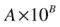

如示例所示，如果 B 为正，10 B 为 1，后跟 B 个零。如果 B 是负整数呢？在这种情况下，我们将 1 放在小数位后的第 B 第位，在它之前有零:例如，10 -4 与 0.0001 相同。

举个例子，一个电子(围绕原子中心的微小粒子)的质量大约是 9.1 × 10 -31 kg。

在 JavaScript 中，你把这个写成 9.1e-31，光速写成 3e8。这里的“e”一定不能和上一章介绍的数字 e 混淆，在 JavaScript 中是`Math.E`。这里，e 用来表示 10 的幂，我们用它乘以它前面的数。

## 事物:物理学中的粒子和其他物体

为了描述和模拟真实世界，物理学必须有一些物理事物的表示。物理学的理论是现实的概念和数学模型。它们由现实生活中存在的事物的理想化概念组成。一个这样的理想化是粒子的概念。虽然在这一节我们将专门关注粒子，但为了将它们放在上下文中，这里列出了您将在本书中遇到的各种“事物”:

*   粒子:从这一节开始，本书的大部分内容将涉及粒子。我们很快会谈到更多的粒子，但简单地说，它们可以被认为是存在于空间离散点的不可分割的单元。因此，它们不同于可以扩展或由多个部分组成的更复杂的对象。粒子以一种简单的方式运动:它们基本上可以改变它们的位置。这也被称为翻译。
*   刚体:刚体是一种扩展的物体，其大小和形状不容易改变，如桌子或汽车。刚体可以像粒子一样通过平移运动，但除此之外，它们还可以进行旋转。刚体运动将在第 13 章中介绍。
*   可变形物体:像刚体一样，可变形物体可以平移和旋转，但除此之外，它们的形状和/或大小也可以改变。例子包括一个橡皮球、一个布娃娃或一块布。建模可变形物体的方法将在第 13 章中讨论。
*   流体:流体不同于之前描述的物体，因为它们没有明确的大小或形状，但具有从空间的一部分流向另一部分的能力。因为流体的任何部分都可以移动，所以精确模拟流体运动要困难得多。但有时也有可能通过用粒子模拟流体来“作弊”。这是我们在第 12 章中用来创造一些有趣的流体视觉效果的方法。
*   字段:字段是更抽象的实体。广义上讲，场是在空间上连续存在的某种物理量。例如，我们将在第十章中探讨力场的概念。

### 什么是粒子？

因为我们要用粒子做很多事情，所以让我们多讨论一下。什么是粒子？可能首先想到的是微小的实体，如电子。在物理学中，这些被称为基本粒子。那不一定是我们在这里谈论的。

我们使用“粒子”这个词的意义在于，它是对任何物理对象的数学理想化，这些物理对象的内部结构或成分对我们所考虑的任何问题都不重要。这可能包括原子，或台球，甚至是星系中的恒星！从这个意义上来说，粒子基本上只是一组表征物体个体的属性。

### 粒子属性

让我们更准确地解释一下上一节中最后一句话的意思。我们在谈论什么属性？粒子具有以下特性:

*   位置:粒子一定在某个地方！这意味着它必须具有坐标 x 和 y(以及 3D 中的 z)。
*   速度:粒子运动，所以有速度。我们将在下一节正式定义速度；现在只需要注意它是一个有分量的向量，就像位置一样。
*   质量:作为一个物理事物，粒子也一定有质量。
*   电荷:一些基本粒子，如电子，也有一种称为电荷的属性，这使它们经历一种有趣的力，称为电磁力。因为我们将在本书中讨论这个力，我们也想给我们的粒子一个电荷属性。
*   其他(自旋，寿命，等等):我们可以包括其他属性，从物理学的基本粒子中获得灵感。但是现在，我们将坚持使用这里列出的属性。

这个背景给了我们足够的素材来开始构建一些 JavaScript 对象来表示粒子和它们的行为，尽管在我们这样做时引入的一些粒子属性和运动概念将在本章的后续章节中更深入地讨论。

首先，我们将创建一个实现刚才描述的粒子属性的`Particle`对象。然后，我们将创建一个扩展了`Particle`的`Ball`对象，绘制图形以便能够看到`Ball`实例，同时表现为粒子。最后，我们将展示如何使粒子运动。

### 构建粒子对象

我们需要创建基于物理属性的对象属性，如质量、电荷、位置和速度，如前一节所述。我们应该能够读取和修改这些属性。表 [4-1](#Tab1) 显示了我们想要创建的属性。

表 4-1。

Properties of the Particle object

<colgroup><col> <col> <col></colgroup> 
| 财产 | 类型 | 可能的价值和意义 |
| --- | --- | --- |
| `mass` | `Number` | 任何正值(默认值为 1) |
| `charge` | `Number` | 任何值:正数、负数或零(默认值) |
| `x` | `Number` | 任何值；位置的 x 分量 |
| `y` | `Number` | 任何值；位置的 y 分量 |
| `vx` | `Number` | 任意值(默认为 0)；速度的 x 分量 |
| `vy` | `Number` | 任意值(默认为 0)；速度的 y 分量 |
| `pos2D` | `Vector2D` | 任何`Vector2D`值；2D 位置向量 |
| `velo2D` | `Vector2D` | 任何`Vector2D`值；2D 速度矢量 |

这些属性的选择和它们可能的值需要一些解释。很明显`mass`不可能是负数或者零，因为每个粒子都有质量。正如你将在[第 10 章](10.html)中看到的，`charge`可以是正的、负的或零。电荷为零的粒子会表现得好像根本没有电荷一样。

在前一章赞美了向量的优点后，我们不使用它们就是伪君子了。因此，我们将位置和速度向量`pos2D`和`velo2D`创建为来自它们各自组件的`Vector2D`对象。

这些属性的实现过程如下。首先，我们在其构造函数中定义了`Particle mass`、`charge`、`x`、`y`、`vx`和`vy`属性:

`function Particle(mass,charge){`

`if(typeof(mass)==='undefined') mass = 1;`

`if(typeof(charge)==='undefined') charge = 0;`

`this.mass = mass;`

`this.charge = charge;`

`this.x = 0;`

`this.y = 0;`

`this.vx = 0;`

`this.vy = 0;`

`}`

我们希望能够在创建粒子时设置它们的质量和电荷，因此使用构造函数并将其作为参数输入构造函数是有意义的。请注意，`Particle`实例的质量和电荷值分别默认为 1 和 0，而位置和速度分量最初都被赋值为 0。

通过 getters 和 setters 将`pos2D`和`velo2D`属性添加到`Particle`原型中:

`Particle.prototype = {`

`get pos2D (){`

`return new Vector2D(this.x,this.y);`

`},`

`set pos2D (pos){`

`this.x = pos.x;`

`this.y = pos.y;`

`},`

`get velo2D (){`

`return new Vector2D(this.vx,this.vy);`

`},`

`set velo2D (velo){`

`this.vx = velo.x;`

`this.vy = velo.y;`

`}`

`};`

(请注意，如果您使用 Internet Explorer，尤其是 IE8 或更早版本，使用这些 getter/setter 可能会出错。)通过这些访问器，您可以简单地通过键入`particle.pos2D`来获取或设置名为`particle`的`Particle`实例的`pos2D`属性，对于`velo2D`属性也是如此。自然，您可以使用组件`x`和`y`的`pos2D`向量读取或分配`Particle`实例的位置坐标，对于`velo2D`也是如此。这就是`Particle`对象的全部内容。

文件`particle-example.js`包含了`Particle`对象的用法示例。您需要启动 JavaScript 控制台来查看代码的输出。

为了简化更新粒子的`pos2D`或`velo2D`值的代码，我们向`Vector2D`对象添加了两个方法`multiply(k)`和`addScaled(vec, k)`(其中`vec`是一个`Vector2D`，`k`是一个`Number`)。`vec1.multiply(k)`方法将向量`vec1`乘以标量`k`，`vec1.addScaled(vec, k)`将`k`乘以`vec`加到`vec1`。

例如，要更新名为`particle`的`Particle`实例的位置，请编写以下代码:

`particle.pos2D = particle.pos2D.add(particle.velo2D.multiply(dt));`

或者这样做，它包含一个方法调用`addScaled()`，而不是两个方法调用`multiply()`和`add()`:

`particle.pos2D = particle.pos2D.addScaled(particle.velo2D, dt);`

这些相当于组件形式:

`particle.x += particle.vx * dt;`

`particle.y += particle.vy * dt;`

### 扩展粒子对象

我们在前面部分所做的是很棒的东西，但是你还没有看到任何粒子。那是因为我们的粒子目前是不可见的。对象被有意地保持在最低的复杂程度。现在是时候扩展它，加入一些我们能看到的东西了。为此，我们将通过对我们在前面章节中使用的旧版本做一些修改来重新发明`Ball`对象。

#### 球对象

与其从前面章节中已有的`Ball`对象开始，不如从`Particle`对象开始，并添加一些额外的属性和方法，将它变成可见的东西。首先我们添加一个`radius`和一个`color`属性，类似于[第 3 章](03.html)中的`Ball`对象。然后我们引入一个额外的属性`gradient`，一个`Boolean`，它指定`Ball`对象是否要用渐变来绘制。最后，我们将`draw()`方法添加到`Ball`的原型中，增加了绘制带有或不带渐变的球的选项。`Ball`对象的完整代码如下所示:

`function Ball(radius,color,mass,charge,gradient){`

`if(typeof(radius)==='undefined') radius = 20;`

`if(typeof(color)==='undefined') color = '#0000ff';`

`if(typeof(mass)==='undefined') mass = 1;`

`if(typeof(charge)==='undefined') charge = 0;`

`if(typeof(gradient)==='undefined') gradient = false;`

`this.radius = radius;`

`this.color = color;`

`this.mass = mass;`

`this.charge = charge;`

`this.gradient = gradient;`

`this.x = 0;`

`this.y = 0;`

`this.vx = 0;`

`this.vy = 0;`

`}`

`Ball.prototype = {`

`get pos2D (){`

`return new Vector2D(this.x,this.y);`

`},`

`set pos2D (pos){`

`this.x = pos.x;`

`this.y = pos.y;`

`},`

`get velo2D (){`

`return new Vector2D(this.vx,this.vy);`

`},`

`set velo2D (velo){`

`this.vx = velo.x;`

`this.vy = velo.y;`

`},`

`draw: function (context) {`

`if (this.gradient){`

`grad = context.createRadialGradient(this.x,this.y,0,this.x,this.y,this.radius);`

`grad.addColorStop(0,'#ffffff');`

`grad.addColorStop(1,this.color);`

`context.fillStyle = grad;`

`}else{`

`context.fillStyle = this.color;`

`}`

`context.beginPath();`

`context.arc(this.x, this.y, this.radius, 0, 2*Math.PI, true);`

`context.closePath();`

`context.fill();`

`}`

`};`

可以看到，构造函数有五个可选参数:`radius`、`color`、`mass`、`charge`和`gradient`，默认值分别为 20、“#0000ff”、1、0 和`false`。`Boolean gradient`选项决定球是用渐变填充还是简单填充绘制。和以前一样，实际的绘制发生在`draw()`方法中。

这里，我们通过简单地复制`Particle`的属性和方法，从头开始创建了`Ball`对象。一个更聪明的方法是使用`Object.create()`方法模拟经典继承，用`Particle`原型创建`Ball`对象:

`Ball.prototype = Object.create(Particle.prototype);`

`Ball.prototype.constructor = Ball;`

然后可以用附加的`draw()`方法来扩充`Ball`对象，因此:

`Ball.prototype.draw = function (context) {`

`//` `code as before`

`}`

我们演示了在文件`ball2.js`中创建`Ball`对象的方法。要使用它，只需在相关的 HTML 文件中包含`ball2.js`文件，而不是`ball.js`。记得也包括`particle.js`文件。在以后的例子中使用`ball.js`还是`ball2.js`纯粹是个人喜好问题，不会以任何方式影响结果。

#### 使用球对象

使用`Ball`对象非常简单。这段代码片段创建一个`ball`对象，初始化它的位置，并绘制它:

`var ball = new Ball(20,'#ff0000',1,0,true);`

`ball.pos2D = new Vector2D(150,50);`

`ball.draw(context);`

这段代码生成一堆大小和位置随机的球，并将它们放入一个数组中，以便在后面的代码中引用它们(见图 [4-1](#Fig1) ):

`var balls = new Array();`

`var numBalls = 10;`

`for (var i=1; i<=numBalls; i++){`

`var ball;`

`var radius = (Math.random()+0.5)*20;`

`var color = '#0000ff';`

`ball = new Ball(radius,color,1,0,true);`

`ball.pos2D = new Vector2D(Math.random()*canvas.width,Math.random()*canvas.height);`

`ball.draw(context);`

`balls.push(ball);`

`}`

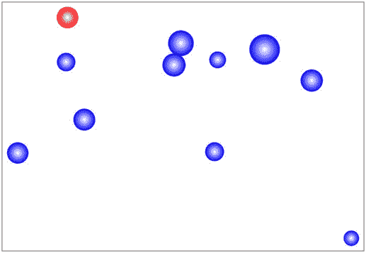

图 4-1。

A random bunch of  `Ball` objects

这些例子的代码在`ball-test.js`中。为了运行这段代码，`ball-test.html`文件使用了`ball.js`文件，而`ball-particle-inheritance-test.html`使用了`ball2.js`(参见上一节)。

### 移动粒子

图 [4-1](#Fig1) 中描述的`Ball`实例看起来很酷，但是它们只是坐在那里，没有做太多事情。我们需要让他们动起来。原则上，让`Particle`(和`Ball`)实例移动并不困难:我们只需要建立一个动画循环，更新粒子的位置，并在每个时间步重画它。为此，我们将使用基于`requestAnimationFrame()`方法的动画循环，以及`Date.getTime()`方法来精确计算时间间隔。我们建议你看一下[第二章](02.html)、`getTime-example.js`的最后一个例子，刷新一下你对基本逻辑和代码结构的记忆。`ball-move.js`中的示例代码建立在`getTime-example.js`(第 2 章)中的代码之上，在此完整展示:

`var canvas = document.getElementById('canvas');`

`var context = canvas.getContext('2d');`

`var ball;`

`var t;`

`var t0;`

`var dt;`

`var animId;`

`var animTime = 5; // duration of animation`

`window.onload = init;`

`function init() {`

`ball = new Ball(20,'#ff0000',1,0,true);`

`ball.pos2D = new Vector2D(150,50);`

`ball.velo2D=new Vector2D(30,20);`

`ball.draw(context);`

`t0 = new Date().getTime();`

`t = 0;`

`animFrame();`

`};`

`function animFrame(){`

`animId = requestAnimationFrame(animFrame,canvas);`

`onTimer();`

`}`

`function onTimer(){`

`var t1 = new Date().getTime();`

`dt = 0.001*(t1-t0);`

`t0 = t1;`

`t += dt;`

`if (t < animTime){`

`move();`

`}else{`

`stop();`

`}`

`}`

`function move(){`

`ball.pos2D = ball.pos2D.addScaled(ball.velo2D,dt);`

`context.clearRect(0, 0, canvas.width, canvas.height);`

`ball.draw(context);`

`}`

`function stop(){`

`cancelAnimationFrame(animId);`

`}`

大部分代码处理设置计时，如第 2 章中的[所述，因此应该很熟悉。`init()`函数创建一个`Ball`实例，初始化它的位置和速度，并在画布上绘制它。然后它初始化时间变量并调用`animFrame()`函数，该函数设置动画循环。在每个时间步长触发的`onTimer()`函数计算从第一次调用`dt`起经过的时间间隔(以秒为单位)，然后更新从模拟开始的持续时间`t`(以秒为单位)。后者是通过将所有经过的时间间隔`dt`相加到当前时间间隔来计算的。`onTimer()`函数还包含一个`if`循环，如果模拟的总运行时间小于指定的持续时间`animTime`，则调用`move()`函数，否则调用`stop()`函数，从而终止动画循环。`move()`函数根据球的速度向量更新球的位置向量，擦除画布上的所有内容，并重新绘制球对象。在网络浏览器中打开文件`ball-move.html`，您将看到一个球在画布上匀速运动。](02.html)

这段代码中计时的基本设置将在以后的例子中反复使用。下一个例子`balls-move.js`，扩展代码使几个球同时移动。唯一的实质性变化发生在`init()`和`move()`方法中:

`function init() {`

`balls = new Array();`

`for (var i=0; i<numBalls; i++){`

`var radius = (Math.random()+0.5)*20;`

`var ball = new Ball(radius,'#0000ff',1,0,true);`

`ball.pos2D = new Vector2D(canvas.width/2,canvas.height/2);`

`ball.velo2D = new Vector2D((Math.random()-0.5)*20,(Math.random()-0.5)*20);`

`ball.draw(context);`

`balls.push(ball);`

`}`

`t0 = new Date().getTime();`

`t = 0;`

`animFrame();`

`};`

在`init()`中，现在创建了许多球，并初始化了它们的位置和速度。然后将它们放入一个名为`balls`的数组中，就像上一节中的例子一样。这一次，这个数组实际上是用在了`move()`函数中:

`function move(){`

`context.clearRect(0, 0, canvas.width, canvas.height);`

`for (var i=0; i<numBalls; i++){`

`var ball = balls[i];`

`ball.pos2D = ball.pos2D.addScaled(ball.velo2D,dt);`

`ball.draw(context);`

`}`

`}`

正如你所看到的，我们遍历了所有的`balls`元素来更新每个球的位置，并在画布元素上重新绘制它。通过在浏览器中打开文件`balls-move.html`运行代码，您将看到不同大小的球从相同的初始位置移出。

在所有这些例子中，球以恒定的速度运动。真正有趣的情况是当速度随时间变化时。我们将在本章中很快介绍这一点。但首先我们需要介绍一些运动概念。

## 描述运动:运动学

在这一节中，我们将开始用精确的概念、方程和图形来更正式地描述运动。对运动的描述叫做运动学。在运动学中，我们不关心是什么引起运动，而只关心如何描述它。下一节，“预测运动:力和动力学”，将着眼于运动的原因:力。

### 概念:位移，速度，速度，加速度

到目前为止，我们已经相当松散地讨论了速度和加速度之类的东西。现在是时候准确地说出这些量的含义了。

以下是运动学中需要定义的主要概念:

*   排水量
*   速度(以及相关的速度概念)
*   加速

这些物理量依赖于更基本的概念——位置、距离和时间——这些概念不言而喻，不需要定义。对于矢量来说，还有第四个基本概念:角度，它定义了空间中的一个方向。

#### 排水量

位移是一个与物体运动相关的矢量。更准确地说，它是连接物体初始位置和最终位置的向量。还记得[第三章](03.html)的 Bug 的例子吗？Bug 从原点沿 y 轴移动 10 个单位的距离，这就是位移。从那里开始，它再向右移动 10 个单位(在 x 轴的正方向)。

在这个例子中，Bug 的净位移或合成位移是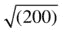，或者在 45 度角上大约 14.1 个单位。但是它移动的净距离当然是 20 个单位。这个例子说明了位移和距离的区别。一般来说，一个物体可能会沿着任何复杂的轨迹移动:移动的距离就是沿着轨迹的长度，而位移总是连接物体初始位置和最终位置的向量(见图 [4-2](#Fig2) )。

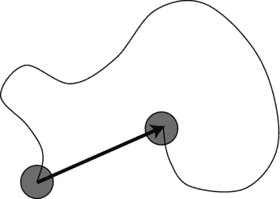

图 4-2。

Displacement vector (arrow) contrasted with distance along trajectory

位移通常用符号 s 或 x 表示，其大小用 s 或 x 表示。位移(和距离)的常用单位是米及其倍数(例如 km)和分数(cm、mm 等)。在画布上，你在电脑屏幕上看到一个舞台，而不是真实的空间，你会用像素来考虑距离和位移，我们通常缩写为 px。

#### 速度

速度被定义为位移随时间的变化率。它告诉你某物移动的速度，以及它移动的方向。因此，速度是一个矢量。

速度的通常符号是 u 或 v；对于它的大小，u 或 v。

还记得微积分里变化率是什么意思吗？这是梯度函数，或者导数。因此，速度是位移对时间的导数。在微积分符号中，我们把它写成

同样，随着时间间隔δt(以及因此位移变化δs)变小，该导数是比率δs/δt 的极限。因此，对于有限的间隔，我们可以写

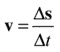

这给出了时间间隔δt 内的平均速度，而 v = d s/dt 给出了给定时间的瞬时速度。在速度恒定的特殊情况下，任意时刻的平均速度等于瞬时速度。

如前所述，物理学中通常的速度单位是米每秒(m/s)，尽管在日常生活中通常使用公里/小时和英里/小时。在 canvas 上下文中，时间的度量仍然是秒，但是距离的度量是像素。所以，你通常会认为速度是以像素每秒(px/s)来表示的。

在计算机代码中，我们总是在处理离散区间，所以我们实际上是在处理平均速度。但是如果我们使用足够小的时间间隔，平均值就接近瞬时值。可以重新排列前面的等式，用 v 和δt 表示δs:

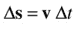

这个方程告诉我们，位移增量是速度和时间间隔的乘积。这正是我们在`ball-move.js`示例中的`move()`方法中所做的:

`ball.pos2D = ball.pos2D.addScaled(ball.velo2D,dt);`

你也可能认为这等同于使用正向方案进行时间积分(参见[第 3 章](03.html))。这很有道理——因为速度是位移对时间的导数，位移是速度对时间的积分。我们将使用这个积分方案，具体地说就是欧拉方案，直到我们读到本书的第四部分。

#### 速度

速度是速度的标量形式；它没有方向。速度被定义为距离随时间的变化率，换句话说，就是单位时间内移动的距离。速度的单位和速率的单位是一样的。

物体的平均速度是移动的总距离除以花费的总时间:

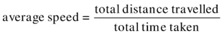

在这本书里，大部分时间我们会讨论速度和速度分量，而不是速度。

#### 加速

加速度被定义为速度随时间的变化率。它告诉你物体的速度变化有多快。如果你以 20 米/秒(约 45 英里/小时)的匀速直线行驶，你没有加速——加速度为零。但如果你踩下油门，在 10 秒内将汽车速度从 20 米/秒提高到 30 米/秒，那么平均加速度就是(30–20)/10 米/秒，或者 1 米/秒 2 。这意味着速度每秒增加 1 米/秒。加速度也可以是负的；在这种情况下，速度值减小。

加速度的微积分定义是

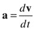

离散版本是

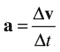

这些方程类似于速度方程，只是用速度代替了位移。与相应的速度方程一样，a =δv/δt 给出时间间隔δt 内的平均加速度，而 a = d v/dt 给出给定时间的瞬时加速度。

Note

在加速度恒定的特殊情况下，平均加速度等于瞬时加速度。我们将在下一节说明这一事实。

颠倒前面的等式得出:

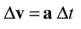

解释为一个离散方程，这给了我们一个积分方案，更新速度给定的加速度。这是您使用`Vector2D`在 JavaScript 中编写代码的方式:

`particle.velo2D = particle.velo2D.add(acc.multiply(dt));`

或者

`particle.velo2D = particle.velo2D.addScaled(acc, dt);`

这里`acc`是代表加速度的变量。它是一个`Vector2D`对象。假设我们使用一个固定值:

`var acc:Vector2D = new Vector2D(0,10);`

这会让我们的粒子以 10 px/s 2 的速度向下加速，模拟重力的作用。

因为加速度是速度的变化率，如果运动方向改变，即使速度不变，加速度也不为零。一个常见的例子是物体匀速圆周运动。因为物体的运动方向改变了，它的速度也就改变了。因此，它的加速度不为零。我们将在第 9 章中详细讨论这种情况。

### 组合向量

因为位移、速度和加速度都是矢量，所以不言而喻，它们必须用矢量方法组合(加或减)。在前一章中你已经看到了一个例子，所以我们在这里不再重复。

为什么要把这些量结合起来？您可能经常想要添加位移和速度来计算它们的总和(也称为它们的合力)。同样，你在第 3 章中看到了一个合成位移的例子。一个你想要增加速度的例子是一艘船在流动的河流上。船只的合成速度由船只在水中的速度与水流速度的矢量和给出(见图 [4-3](#Fig3) )。

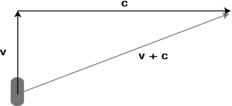

图 4-3。

Resultant velocity

当计算相对速度时，你需要使用矢量减法。假设你有一艘宇宙飞船 A 在追逐另一艘宇宙飞船 B，在太空中以不同的速度 A 和 B 运动(见图 [4-4](#Fig4) )。B 相对于 A 的速度是多少？那是从 A 的角度看 B 的速度，换句话说，是 B 在 A 不动(我们说它静止)的参照系中的速度。稍微静下心来想一想，你应该会相信它是由 B 减去 A 的速度给出的，在矢量意义上:B–A。图 [4-4](#Fig4) 向你展示了 B–A 在几何上的含义:它与 b+(–A)相同，因为(–A)以相同的大小指向 A 的相反方向，我们最终得到 B–A 指向所示的方向。这是从 A 的角度看 B 的速度。

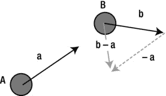

图 4-4。

Relative velocity

### 用图形描述运动

物体的运动可以用不同的方式用图形表示。对于一个二维运动的粒子，你可以在不同的时间绘制它的 y 坐标和 x 坐标。当然，最终的图形，只会给你粒子的轨迹。

还可以绘制位移、速度或加速度随时间变化的曲线。这些图表能告诉我们关于粒子如何运动的有用信息。

你将很快看到一些例子，在这些例子中，我们使用了在前一章中介绍的`Graph`对象来创建这样的图形。

### 匀加速运动方程

对于匀加速运动的特殊情况(也称为匀速运动)，仅从速度和加速度的定义出发，就有可能得到一组非常有用的方程。这些运动方程可以用来分析加速度为常数的问题，包括重力作用下物体的下落运动和抛射体的运动。

我们可以只陈述运动方程，并要求你接受它们。但是如果你看到他们来自哪里，你可能会更好地理解他们。这并不困难。你只需要做少量的代数运算。起点是平均加速度的定义:

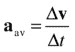

如果加速度不变，a av 也等于任意时刻 t 的瞬时加速度 a。

现在让我们建立初始条件，假设在时间 t = 0(初始)，s = 0(零初始位移)，v = u(初始速度用 u 表示)。

因此，在时间 t，我们有δv = v–u，和δt = t–0 = t，因此

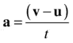

现在很容易改变这个公式的主题:

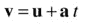

这个公式给出了任意时刻 t 的速度 v，给定了初速度 u 和(恒定)加速度 a。

如果也有一个类似的位移方程就好了。能做到吗？是的，你只需要运用同样的技巧，这次从平均速度的定义开始:

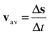

现在我们有δs = s–0 = s，δt = t–0 = t，这就给出

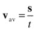

因为速度线性增加，平均速度 v av 正好是 (u + v)，初速度和终速度的平均值。代入前面的等式得出:

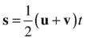

现在你可以用已经导出的公式(v = u + a t)来代替 v，这样做并简化，你应该得到这个:

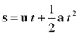

现在坐下来，欣赏你努力工作的非凡成果。这里有一个公式，告诉你一个质点在任意时刻 t 的位移 s，用质点的初速度 u 和(恒定)加速度 a 来表示。

如果质点在时间 t = 0 时从原点出发，这将等于质点在时间 t 时的位置向量。一般来说，如果粒子在时间 t = 0 从位置 pos0 = (x0，y0，z0)开始，那么它在时间 t 的位置向量 pos = (x，y，z)将由以下伪代码给出:

`pos = u * t  + 0.5 * a * t * t + pos0`

这给了你粒子的位置，作为一个精确的解析方程。在这种情况下，没有必要使用数值积分。

您可以直接以矢量形式编码这个解决方案(正如我们所做的那样)，或者如果您愿意，也可以将它拆分成组件。在伪代码中，你得到的是 3D(在 2D 忽略 z 分量):

`x = ux * t + 0.5 * ax * t * t + x0`

`y = uy * t + 0.5 * ay * t * t + y0`

`z = uz * t + 0.5 * az * t * t + z0`

在我们离开这一部分之前，你应该知道有第三个公式，有时证明是有用的。前面推导的两个公式(v = u + a t，s = u t + 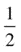 a t 2 )给出了速度 v 和位移 s，它们都是时间 t 的函数。如果去掉这两个方程之间的时间 t，就可以得到关于 v 和 s 的方程:

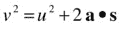

注意，这个是标量方程，不是矢量方程。

Caution

如前所述，本节推导的运动方程只对恒定加速度有效。如果加速度随时间变化，他们会给出错误的答案。

### 示例:将方程式应用于抛体运动

是时候举个例子了。让我们应用前面的方程来模拟炮弹等抛射体的运动。为此，我们将忽略除重力之外的所有其他力。在那种情况下，射弹在飞行过程中的任何时候所受的力都是恒定的。这会给它一个恒定的加速度(下一章你会完全明白为什么)。

我们首先不模拟发射炮弹的爆炸力。这个力非常短暂，它的作用是给炮弹一个初速度 u。

在这种特殊情况下，分量形式的射弹位置方程简化为伪代码形式:

`x = ux * t + x0`

`y = uy * t + 0.5 * g * t * t + y0`

`z = uz * t  + z0`

因为重力产生的加速度指向垂直下方，所以其 x 和 z 分量 ax 和 az 为零，ay = g，如果使用矢量，只需在方程 pos = u * t + 0.5 * a * t * t + pos0 中指定加速度矢量为 3D 中的(0，g，0)和 2D 中的(0，g)。

让我们用这些公式来编写一个简单的抛射体模拟程序。代码在`projectile-test.js`中，在此复制:

`var canvas = document.getElementById('canvas');`

`var context = canvas.getContext('2d');`

`var ball1;`

`var ball2;`

`var t;`

`var t0;`

`var dt;`

`var animId;`

`var pos0 = new Vector2D(100,350);`

`var velo0 = new Vector2D(20,-80);`

`var acc = new Vector2D(0,10); // acceleration due to gravity`

`var animTime = 16;`

`window.onload = init;`

`function init() {`

`ball1 = new Ball(15,'#000000',1,0,true);`

`ball1.pos2D = pos0;`

`ball1.velo2D = velo0;`

`ball2 = new Ball(15,'#aaaaaa',1,0,true);`

`ball2.pos2D = pos0;`

`ball2.velo2D = velo0;`

`ball1.draw(context);`

`ball2.draw(context);`

`t0 = new Date().getTime();`

`t = 0;`

`animFrame();`

`};`

`function animFrame(){`

`animId = requestAnimationFrame(animFrame,canvas);`

`onTimer();`

`}`

`function onTimer(){`

`var t1 = new Date().getTime();`

`dt = 0.001*(t1-t0);`

`t0 = t1;`

`if (dt>0.2) {dt=0;}; // fix for bug if user switches tabs`

`t += dt;`

`if (t < animTime){`

`move();`

`}`

`}`

`function move(){`

`// numerical solution - Euler scheme`

`ball1.pos2D = ball1.pos2D.addScaled(ball1.velo2D,dt);`

`ball1.velo2D = ball1.velo2D.addScaled(acc,dt);`

`// analytical solution`

`ball2.pos2D = pos0.addScaled(velo0,t).addScaled(acc,0.5*t*t);`

`ball2.velo2D = velo0.addScaled(acc,t);`

`// display`

`context.clearRect(0, 0, canvas.width, canvas.height);`

`ball1.draw(context);`

`ball2.draw(context);`

`}`

在`init()`函数中，代码创建了两个球(一个灰球和一个黑球)，它们最初位于相同的位置(100，350)，具有相同的初速度(20，–80)，并受到相同的向下加速度(0，10)来模拟重力。在`move()`函数中，这两个球的位置和速度被不同地更新。对于第一个球，我们实现了欧拉积分方案(如速度一节中所讨论的),通过将加速度乘以当前时间间隔`dt`来更新速度。球的位置也是如此。对于第二个球，我们根据精确的解析公式 pos = u * t + 0.5 * a * t * t + pos0 指定一个新的当前位置。不涉及数值近似。

在运行代码之前，请注意`onTimer()`中的以下附加代码行:

`if (dt>0.2) {dt=0;};`

这是对用户切换浏览器标签然后返回时出现的错误的修复。当这种情况发生时，`requestAnimationFrame()`停止活动，直到用户返回到当前选项卡，因此动画“冻结”在当前帧上。然而，当用户返回时，经过的时间`dt`仍然被计算为对`getTime()`的最后一次调用和当前时间之间的差值，导致该帧中`dt`的人为大值。然后`move()`函数中的代码在很长的时间间隔`dt`内使用相同的速度更新粒子的位置。如果速度是恒定的，就像我们在本章前面看到的`ball-move.js`例子一样，这是没问题的。但一般来说，如本例所示，速度实际上会因加速度而变化。人为的大值`dt`会导致粒子位置的非物理偏差或“跳跃”。如果`dt`的值恰好大于 0.2 秒的阈值，前面一行代码简单地通过将`dt`的值设置为 0 来解决这个问题。0.2 的值基本上是任意的，您可以使用任何您喜欢的值，只要它比动画正常运行时的典型值`dt`大得多(这里大约是 20 毫秒，比 0.2 秒小 10 倍)，并且比切换到一个新选项卡并返回所需的时间小得多。

如果你运行这个代码，你会看到两个球一起开始，并像抛射体应该做的那样以抛物线轨迹运动。随着模拟的进行，你会看到它们开始轻微分离，如图 [4-5](#Fig5) 所示，这是由于欧拉方案造成的数值误差。

图 4-5。

Simulating the motion of a projectile with both numerical and analytical solutions

灰球就在它应该在的地方，因为它遵循运动方程的精确解析解。现在你可能通常不会关心这种差异。但是如果你正在建立一个精确的投射物模拟或者一个台球游戏，你会的。图 [4-5](#Fig5) 所示的位置差异仅发生在 16 秒的运行时间之后。如果你要运行几分钟，并包括反弹或与其他粒子的碰撞，你的粒子很快就会在它不应该在的地方。

那么，如果你的模拟或游戏要求很高的准确性，对此可以做些什么呢？如果您的模拟足够简单，可以获得解析解(如本例所示)，那么使用解析解就可以解决问题。然而，在绝大多数情况下，解析解并不存在。在这些情况下，你需要使用比欧拉方法更精确的积分方法。

本书第四部分的第 14 章涵盖了一些更精确的集成方案。但是在我们到达那里之前，我们将在大多数例子中使用欧拉方案，因为欧拉是最简单和最快的方案，并且我们在本书第四部分之前的大部分中的主要目的是演示物理效果，而不必太担心绝对精度。随着我们的继续，我们将指出缺乏准确性可能特别重要的例子，尽管我们将把任何解决方案推迟到第 14 章。

如果担心数值精度，积分方案的选择不是唯一的考虑因素。处理突然变化(如弹跳和碰撞)的算法也会产生误差。我们将在本书的后面讨论这些错误的来源以及如何处理它们。

### 更多与运动相关的概念:惯性、质量和动量

到目前为止，我们被限制在几个运动概念上，而我们能取得的进展也相当有限。最大的力量来自于力的概念以及它们如何影响运动。我们将在下一节中从概念上介绍这种方法，然后在下一章中对其进行全面阐述。

在此之前，我们需要引入两个新概念，作为运动和产生运动的力之间的联系:质量和动量。

先说质量。在物理学中，质量有一个非常具体的含义:它是惯性的量度。惯性(字面意思是“懒惰”)是对运动的阻力。物体质量越大，运动阻力越大——推汽车比推自行车更难。所以我们说汽车的质量大于自行车的质量。物理学中通常的质量单位是千克(kg)。质量的通常符号是 m。

在物理学中，物体的质量和重量是不一样的。重量其实是一种力，地球施加在它身上的重力。质量是标量；重量是一个向量。我们将在下一节回到这个问题。

一个物体的动量，通常用符号 p 表示，大小为 p，定义为其质量和速度的乘积。它是一个矢量。

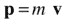

因为它等于标量(质量)乘以速度，所以它的方向与速度矢量的方向相同。

通俗地说，动量是一个物体拥有的“运动量”的度量——对于相同的速度，汽车比自行车“运动更多”，因为它更难停下来。动量之所以重要，有两个原因:它与力密切相关，有一个定律叫做动量守恒定律，对于解决粒子间的碰撞等问题非常有用。我们将在下一章仔细研究动量及其守恒。

## 预测运动:力和动力学

在前一节中，我们可以通过得到一个抛射体位置随时间变化的公式来“解决”抛射体问题。这是可能的，因为我们知道加速度，它是常数，等于重力加速度 g。

预测物体运动的问题基本上归结为计算每一时刻 a(t)的加速度，无论是通过某种解析公式还是通过某种数值方法。一旦我们知道了 a，我们就知道如何去做剩下的事情——我们可以进行数值积分(使用欧拉或其他方案),或者使用解析解(如果有的话)。

在地球表面附近有重力的情况下，你现在知道 a = g，这很简单。但是我们如何计算一个物体的加速度呢？在我们给出答案之前，我们需要再谈一谈力。

### 运动的原因:力

力是物理学中的一个抽象概念，表示使物体运动的“某物”。更准确地说，如果有点神秘的话，力改变了事物运动的方式。这句话的意思一会儿就清楚了。

直觉上，你可以把力想象成某种推力或拉力。重力是一种力；它把你拉向地球。摩擦力是另一种力；它推着移动的物体。

力是可以测量和计算的。力的单位是牛顿，用符号 n 表示。

力是有用的，因为知道作用在物体上的力就可以预测它的运动。接下来将解释这是如何进行的。

### 力、质量和加速度之间的关系

让我们回到我们在本节开始时提出的问题。我们怎样才能算出物体的加速度？答案出人意料地简单:

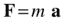

f 是作用在物体上的合力，m 是其质量，a 是力产生的加速度。就是这样。这是一个非凡的公式，可能是本书中最重要的。它之所以引人注目，是因为它以你能想象到的最简单的方式将运动(更准确地说是加速度)与其原因(力)联系起来。

方程 F = m a 是牛顿第二运动定律的特例。这是这条法律最常见的形式。在下一章中，我们将研究法律的一般形式。

你可以将公式改写如下，给定一个物体的质量 m 和作用在其上的力 F，你可以用它来计算加速度 a:

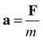

正如我们在第 1 章中所讨论的，物体的运动是作用在物体上的力的函数:

运动=功能{力}

嗯，a = F/m 就是这个意思。这是我们的职能。力引起加速度；它们会改变物体的速度。这就是我们如何计算运动中的变化。

这个公式与我们关于力和质量分别引起和阻止运动的概念是一致的。对于一个给定的力，质量越大，产生的加速度越小，因为我们将力除以一个更大的数。

下一个问题是:我们如何知道力 F？事实上，有许多不同类型的力。幸运的是，每种力都有公式。公式来自物理理论或实验。当然，对我们来说，它们来自哪里并不重要。重点是我们可以计算出任意时刻作用在物体上的所有力，然后把它们全部加起来，得到合力 F，我们再把这个合力 F 除以物体的质量 m；这给了我们物体的加速度 a。问题解决了。

### 力的类型

在这本书的第二部分，我们将会详细探讨不同类型的力。这里有一些简单的例子。

重力也许是力的最明显的例子。作用在物体上的重力也称为其重量。地球(或任何其他行星或恒星)对其附近的任何物体施加与该物体质量成比例的引力。所以质量为 m 的物体的重量由下式给出

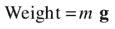

其中 g 是一个垂直向下的向量，大小不变。

用 a = F/m，这就给出了 a = m g/m = g，换句话说，一个物体的重量(重力对它的作用力)产生加速度 g，如果它是唯一作用在物体上的力。这表明 g 实际上是一个加速度，称为重力加速度。在地球表面附近，其震级约为 9.81 米/秒 2 。注意，物体的质量 m“掉出来了”——所有物体不论质量大小都以相同的加速度下落(只要空气阻力等其他力与重力相比可以忽略不计)。

另一种常见的力是接触力，它是一个物体与另一个物体直接物理接触时所受到的力。例如，当你推动某物时，当两个物体碰撞时，或者当两个物体被另一个力压在一起时(例如，一本书因其重量而压在桌子上)，就会发生这种情况。如果你正在读这本书的纸质版，把它放在桌子上。它不会从桌子上掉下来的原因是后者施加了一个向上的接触力，平衡了书上的重力。

另一种类型的接触力是摩擦力，当两个接触的物体相对运动时，摩擦力就会起作用。如果你沿着桌子推书，摩擦力就是阻止书运动的力。我们将在第 7 章中研究接触力。

还有几个由流体引起的力的例子，如压力、阻力(一种摩擦力)和上推力。我们将在第 7 章中详细讨论这些力。

然后还有电力和磁力，它们也可以共同作用成一个电磁力。这些力是由具有电荷这一物理属性的粒子和物体施加和经历的。事实上，除了重力之外，所有的日常作用力如接触力、流体力等等都来源于原子和分子之间相互施加的电磁力。我们将在第 10 章中研究这些力，看看它们如何被用来产生有趣的效果。

### 合力:力图和合力

在方程 F = m a 中，F 是合力。因为力是一个矢量，两个或两个以上的力产生的合力必须通过矢量相加得到，如[第三章](03.html)所述。

显示作用在物体上的力的矢量图叫做力图。力图是有用的工具，因为它能帮助我们算出合力。关键是作用在物体上的力是否不同并不重要。例如，只要使用矢量加法，就可以将重力添加到摩擦力和阻力中。

作为矢量，力可以被“分解”成垂直分量，如第 3 章中的解释。有时，通过将力分解成它们的分量，并将所有的水平和垂直分量分别组合起来，可能有助于分析问题。

图 [4-6](#Fig6) 显示了一个力图的例子。它显示了物体沿斜面下滑时所受的力。有三个力作用在这个物体上:它的重量 m g，向下作用；由表面施加的摩擦力 f，其作用方向与其运动方向相反；和表面施加在其上的垂直于表面作用的接触力 R。注意，你不关心物体施加在表面上的力。如果你正在模拟一个物体的运动，你只关心作用在它上面的力，而不是它施加的力。

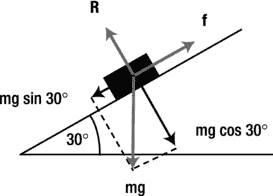

图 4-6。

Force diagram for a body sliding down an inclined plane

如果你要模拟一个物体的运动，如图 [4-6](#Fig6) 所示(可能是一辆下坡的汽车)，你会怎么做？一如既往，用一点常识逻辑，一些物理公式，和一些代码。我们不会详细讨论物理和编码(我们会把这些留到《T2》第七章，当我们详细讨论摩擦力和接触力的时候)，但是这里有一些常识性的部分。凭经验，你知道物体会沿着表面滑动，同时始终保持接触。所以沿着平面分解力是有意义的。嗯，f 已经沿着平面了；r 垂直于它，所以没有沿它的分量；重力的分量(重量)是 mg sin 30 沿斜面向下。因此，沿斜面向下的合力大小由下式给出

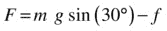

当然，你需要知道如何计算摩擦力 f，我们会在第七章告诉你。一旦你知道了 F，你就可以计算加速度 a = F/m，现在你肯定知道了。

### 平衡力

有时，有两个或两个以上的力作用在一个物体上，碰巧力的矢量和(合力)为零。在那种情况下，力被认为是平衡的。就物体的运动而言，就好像没有力作用在物体上一样。

让我们再一次回到等式 a = F/m，这个等式意味着如果合力 F = 0，那么 a = 0。因此，如果没有合力作用在一个物体上，这个物体就不会加速。换句话说，无论速度是多少，它都不会改变。这意味着两件事。首先，如果物体不运动(如果它是静止的)，它将保持静止。但是，如果物体已经以某个速度运动，它将保持这个速度，既不加速也不减速(这实际上是一个负加速度)。后一个结论可能会让你大吃一惊；我们将在下一章讨论牛顿运动定律时继续讨论这个问题。

图 [4-7](#Fig7) 显示了一个物体在多个力的作用下处于平衡状态的两个例子。在第一个例子中，一本书静止不动地放在一个水平的桌子上，因此它必须经受至少两个加起来为零的力。你知道其中一个一定是向下作用的重力。还有另一个力，接触力 R，桌子施加在书上，向上作用，正好与重力相反。

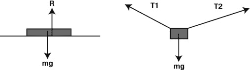

图 4-7。

Examples of forces in equilibrium

第二个稍微复杂一点的例子再次展示了一个静止的物体。但这次有三种力量在起作用。这个物体是用两根绳子悬挂起来的。所以每根弦上都有张力，还有重力作用在物体上。如果你把这三个力加起来，它们的矢量和一定是零。如果你把每个力分解成水平分量和垂直分量，然后把所有的水平分量加在一起，所有的垂直分量加在一起，两者相加为零。

图 [4-8](#Fig8) 中的例子显示了匀速飞行的飞机的力图。从前面的讨论中，我们再次推导出，无论有多少个力，无论它们有多复杂，作用在它上面的合力一定为零。事实上，有四个主要的力作用在飞机上:一个向前的推力，一个相反的阻力，一个向下的重量和一个向上的升力。升力平衡飞机的重量，推力平衡飞机上的阻力。推力和阻力相等，这听起来可能有点违反直觉。事实上，只有当飞机加速时，推力才必须超过阻力，例如在起飞和上升时。但是一旦飞机达到匀速，只需要推力来克服阻力。

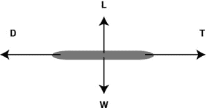

图 4-8。

Forces on a plane moving at constant velocity are also in equilibrium

### 示例:物体在重力和阻力作用下下落

所有这些关于力的讨论可能看起来有点抽象，你可能很想看看它是如何应用到实践中的。尽管在第二部分中我们会有大量的例子，但是现在让我们看一个简单的例子来吊起你的胃口。如果您不能立即理解所有内容，也不要担心:当您在第二部分中看到更多的例子后，就会完全理解了。

在这个例子中，一个球落入诸如空气的流体中，当它下落时，它受到向下的重力 W 和向上的阻力 D(见图 [4-9](#Fig9) )。当然，重力是不变的，由下式给出:

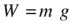

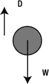

图 4-9。

A ball falling in air, experiencing forces of gravity W and drag D

我们将在第 7 章中对阻力有更多的描述；现在我们只是借用下面的公式:

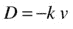

换句话说，阻力与球通过流体的速度成比例(负号表示阻力与速度方向相反，k 是比例常数)。利用这两个公式，我们可以作出如下推论。最初，球是静止的，所以它受到的阻力为零。当球下落时，它在重力的作用下加速，因此它的速度增加，阻力 d 也增加。最终(如果球下落足够长的时间而不落地)，阻力将变得与重力相等，因此两者将平衡。在这一点上，我们会达到平衡，所以加速度为零，就像上一节讨论的那样。球将继续以恒定的速度下落，这就是所谓的极限速度。根据物理理论，这是我们预计会发生的情况，但我们能在模拟中再现它吗？

为了证明我们确实可以模拟球在这些力的作用下的运动，我们将制作球下落的动画，同时随着时间的推移绘制球的速度和加速度。看一下文件`forces-example.js`中的代码和嵌入它的文件`forces-example.html`中的标记。

首先，您会注意到我们在 HTML 文件中有两个 canvas 实例，id 分别为`canvas`和`canvas_bg`。`canvas`实例被精确地放置在`canvas_bg`之上，并被透明化(参见样式文件`style1.css`了解这是如何完成的)。我们的想法是在`canvas_bg`上放置一个静态的`Graph`实例，在`canvas`上制作球的动画。还要注意，除了 HTML 文件中的`vector2D.js`和`ball.js`之外，我们还必须包含`graph.js`文件。

`forces-example.js`中的代码建立在前面的例子之上，但也添加了一些重要的新元素。`init()`函数看起来像这样:

`function init() {`

`ball = new Ball(15,'#000000',1,0,true);`

`ball.pos2D = new Vector2D(75,20);`

`ball.velo2D=new Vector2D(0,0);`

`ball.draw(context);`

`setupGraphs();`

`t0 = new Date().getTime();`

`t = 0;`

`animFrame();`

`};`

这是非常熟悉的:这里新增了`setupGraphs()`方法，它在`canvas_bg`上设置了几个`Graph`实例，用于绘制球下落时的速度和加速度:

`function setupGraphs(){`

`//graph = new Graph(context,xmin,xmax,ymin,ymax,xorig,yorig,xwidth,ywidth);`

`graphAcc = new Graph(context_bg,0,30,0,10,150,250,600,200);`

`graphAcc.drawgrid(5,1,5,1);`

`graphAcc.drawaxes('time (s)','acceleration (px/s/s)');`

`graphVelo = new Graph(context_bg,0,30,0,25,150,550,600,200);`

`graphVelo.drawgrid(5,1,5,1);`

`graphVelo.drawaxes('time (s)','velocity (px/s)');`

`}`

在`init()`中调用的用于设置动画的`animFrame()`函数本质上与前面的抛射体示例相同，但是时间步进`move()`方法现在看起来有所不同:

`function move(){`

`moveObject();`

`calcForce();`

`updateAccel();`

`updateVelo();`

`plotGraphs();`

`}`

主要出于教学的原因，我们将代码分成了独立的函数，从它们的名字中可以明显看出它们的任务。首先，`moveObject()`方法更新球的位置并重新绘制它，它看起来像这样:

`function moveObject(){`

`ball.pos2D = ball.pos2D.addScaled(ball.velo2D,dt);`

`context.clearRect(0, 0, canvas.width, canvas.height);`

`ball.draw(context);`

`}`

这并不是我们以前没有见过的新东西。重要的补充是三个方法`calcForce()`、`updateAccel()`和`updateVelo()`，如下所示:

`function calcForce(){`

`force = new Vector2D(0,ball.mass*g-k*ball.vy);`

`}`

`function updateAccel(){`

`acc = force.multiply(1/ball.mass);`

`}`

`function updateVelo(){`

`ball.velo2D = ball.velo2D.addScaled(acc,dt);`

`}`

如您所见，这些函数分别使用 F = mg–kv 计算合成向下力，使用 a = F /m 计算加速度，使用δv = aδt 计算新速度。因此，我们让 ball 实例受到重力和阻力这两个力的作用，计算它们的合力，然后计算加速度和速度。在`moveObject()`方法的下一个时间步更新位置。

最后一种方法`plotGraphs()`，在`canvas_bg`的各个`Graph`实例上绘制加速度和速度的垂直分量:

`function plotGraphs(){`

`graphAcc.plot([t], [acc.y], '#ff0000', false, true);`

`graphVelo.plot([t], [ball.vy], '#ff0000', false, true);`

`}`

运行代码，您将看到类似图 [4-10](#Fig10) 的内容。当球下落时，它最初以 g = 10 的值(如代码中设置的)加速，并且它的速度开始急剧增加。但是之后阻力开始增加。这减小了向下的合力，因此也减小了向下的加速度，导致速度增加得不太快。模拟进行到大约 10 秒钟时，加速度已经下降到零，因为阻力现在已经增长到足以完全平衡向下的重力。从那时起，球的速度恒定在 20 px/s。这都是如前所述，所以模拟真的工作！事实上，最终速度的值与物理理论预测的完全一样。

为了看到这一点，我们推论当达到最终速度时:

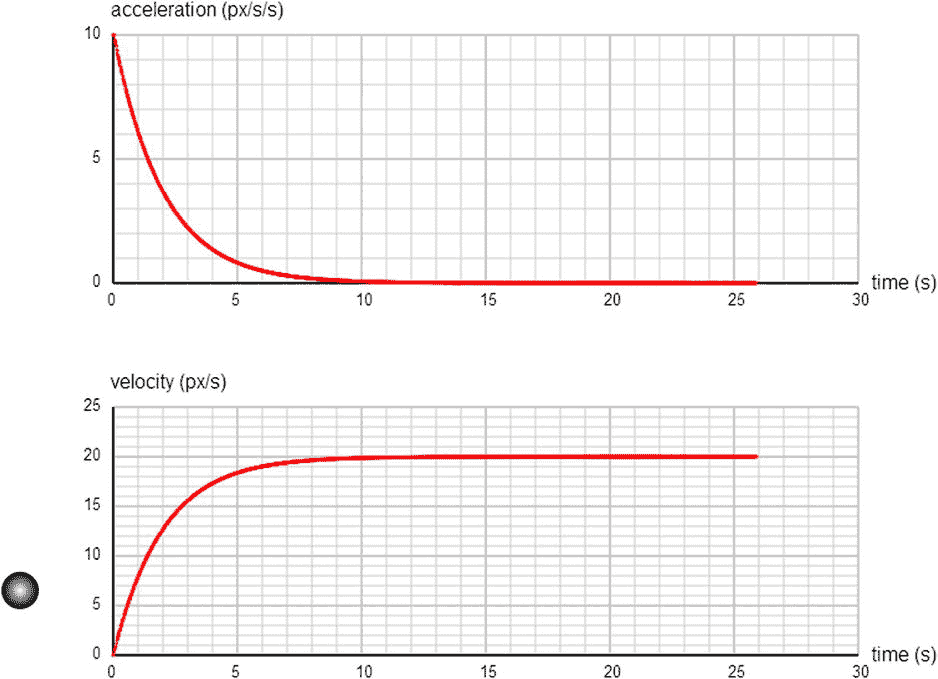

图 4-10。

Simulating a ball falling under gravity and drag

阻力=重力，

因此

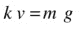

这给出了 v = mg/k。在我们的模拟中，m = 1，g = 10，k = 0.5。这给出了 v = 20 px/s，与仿真计算的完全相同。对于力的第一个例子来说还不错，你不同意吗？

## 能源概念

我们已经谈了很多关于力的问题，但是还有一个物理概念可能同样重要:能量。从我们的角度来看，重要的是，能量概念有时提供了一种替代方法来解决问题，这些问题可能被证明是棘手的，甚至不可能用力的方法来解决。正如你看到的动量，这是因为有一个强大的能量守恒定律(我们很快会谈到)。事实上，能量守恒和动量守恒可以一起应用来解决涉及碰撞的问题，正如我们将在第五章中看到的，更详细的内容将在第一章 1[中看到。](01.html)

与动量不同，能量的定义有点棘手。在此之前，我们需要引入一个密切相关的概念——工作。

### 物理学中的功的概念

我们常说力导致运动，但我们也看到一种力可以与其他力平衡存在，所以运动不会发生。为了区分一个力产生运动的效果和仅仅平衡另一个力的效果，我们引入了功的概念。

在物理学中，我们说，当一个力在它作用的方向上产生运动时，它就做功。所做的功 W 定义为力的大小 F 和力的方向上的位移 s 的乘积:

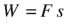

这听起来可能有点抽象，所以让我们看一个例子。假设一块石头从离地面一定高度 h 处落下(见图 [4-11](#Fig11) )。

图 4-11。

An object dropped from rest at a height h above the ground

那么石头的重量(重力)通过向下移动它来做功。根据前面的定义，下落距离 h 到地面所做的功由下面的公式给出，因为这里 F = mg，s = h:

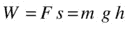

因为功是力和距离的乘积(记得力的单位是牛顿，N)，所以它的单位是 Nm(牛顿乘以米)。这个单位也有一个特殊的名字，焦耳(J)。所以，J = Nm。功是一个标量。

如果位移和力的方向不一样呢？举个例子，如果石头是斜着扔的，而不是垂直向下掉的，会怎么样？那么所做的功就是力和位移在其方向上的投影的乘积(见图 [4-12](#Fig12) )。

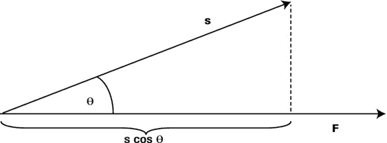

图 4-12。

Work done is the scalar product of force and displacement

你可能认为这是 F 和 s 的点积，其中θ是力 F 和位移 s 之间的角度:

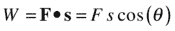

因此，如果角度θ为零，则 W = F s(因为 cos (0) = 1)。但是如果θ是 90 度，那么 cos θ = 0，那么 W = 0。换句话说，如果位移垂直于力，力所做的功为零。

Note

合成加速度必须总是在合力的方向上。然而，合成运动(位移)可能与合力方向一致，也可能不一致。

### 做功的能力:能量

既然我们知道什么是功，能量的定义就很简单:能量是做功的能力。以一块从高处落下的石头为例:因为它能通过下落来做功，所以它只要在地面上就一定拥有能量。这个能量叫做势能(通常缩写为 PE，符号 E p )。同样，一个运动的物体可以通过与另一个物体碰撞，在碰撞过程中施加一个接触力，并使其在这个力的作用下运动来做功。因此，运动的物体也有能量，称为动能(通常缩写为 KE，符号为 E k )。

事实上，功引起能量的转移或转换。例如，施加一个力使一个物体运动，就给了它动能。这导致施加力的力的能量减少。这通常用功能定理来表示:

能量转移=做功

在符号中:

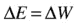

因为我们把能量和功等同起来，所以能量和功有相同的单位:焦耳(J)。像功一样，能量是一个标量。

### 能量转移、转换和守恒

正如力有多种类型一样，能量也有多种类型。例子包括光能、热能、核能等等。但是通常我们只关心两种形式的能量:动能和势能。在基本的微观层面上，所有形式的能量都是这两种基本形式的表现。

能量可以从一个身体转移到另一个身体。能量也可以从一种形式转换成另一种形式。无论能量是转移还是转化，总能量总是守恒的。

能量转移的一个例子是两个粒子的碰撞，其中一个粒子失去 KE，另一个粒子获得 KE。弹性碰撞被定义为总动能守恒的碰撞(KE 不会因碰撞而转化为其他形式的能量)；否则，碰撞是非弹性的。因此，如果碰撞是弹性的，一方得到的 KE 的量正好等于另一方失去的量。

作为能量转换的一个例子，从一定高度释放的物体失去势能，但在向下加速时获得动能——其 PE 转换为 KE。如果物体只在重力的作用下下落，KE 中的增益正好等于 PE 中的损耗；动能加上势能的总能量保持不变。如果有其他的力，比如摩擦力(由于空气阻力)，通过对摩擦力做功，将少量的能量转化为身体和周围空气中的热能。所有形式的总能量仍然保持不变。这就是众所周知的能量守恒原理。

这个原则如此重要，让我们用一种更通用的方式再陈述一次:

能量守恒原理:在相互作用过程中，能量可以从一种形式转化为另一种形式，或者从一个物体转移到另一个物体，但一个封闭系统的总能量是恒定的。

“封闭系统”是指除自身外没有其他相互作用的系统。在系统中，交互和交换可以是多种多样的，也可以是复杂的，这个原则仍然适用。例如，如果你有数百个粒子在一个封闭的系统中相互碰撞，该原理将成立。如果你有无数的分子在一个孤立的气体中相互作用，这个原理仍然成立。

### 势能和动能

因为势能和动能这么重要，我们来看看怎么计算。让我们从势能开始。当我们讨论功的概念时，回想一下，一个物体从离地高度 h 下落所做的功等于 mgh。因为做的功等于传递的能量，所以物体在下落之前，一定拥有这个能量。因为它在高度 h 从静止状态落下，它的速度最初为零，所以它没有动能。因此，它的能量一开始都是势能。因此，我们得出结论，一个质量为 m 的物体在离地高度 h 处，其势能的大小由下式给出

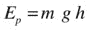

这是我们的势能公式。

现在让我们算出一个动能公式。考虑同样的落石的例子。忽略摩擦损失的能量，石头落地前的动能必须等于它最初的势能(因为它在地面上没有任何 PE，所以它必须全部转化为 KE)。所以最后的 KE 在数值上也等于 mgh。这里 h 是石头落下的距离。因为 KE 是由于运动而拥有的能量，我们真的想要一个公式，作为石头速度的函数，而不是它所经历的位移。还记得连接速度和位移的公式吗？使用 v 2 = u 2 + 2 a . s，并注意到 u = 0，a = g，s = h，我们得到 v 2 = 2gh。

使用这个，我们现在需要做的就是用 v 2 代替 gh，我们最终得到这个:

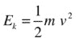

这是质量为 m 的物体以速度 v 运动时的动能公式。

### 力量

我们要介绍的最后一个概念是权力。在谈论能量时，我们似乎已经放弃了时间的概念。我们已经讨论了做功和能量交换或转移，但没有提到它发生的速度。在能量方法中，功率引入了时间。

功率被定义为做功的速率。因此，在微积分符号中，乘方 P 由下式给出:

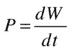

或者，以离散形式:

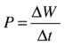

换句话说，P 定义为所做的功除以所用的时间。根据这个定义，功率的单位是 J/s。这个单位有一个特殊的名称。它叫做瓦特。另一个常用的单位是马力(HP)。功率是一个标量，就像能量一样。

我们可以颠倒最后一个公式，以获得当使用功率 P 时，在时间间隔δt 内所做的功:

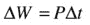

功率是一个非常有用的概念，用于分析机器的运行，例如车辆。假设一台机器通过施加一个力 F 并在 F 的方向上以速度 v 移动其施力点来做功，那么，所做的功就是δW = Fδs(注:这只是为小变化δW 和δs 写的公式 W = Fs)

根据功率是做功的速率的定义，机器的功率输出因此是这样的:

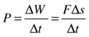

因为δs/δt = v，我们最终得到这个公式:

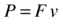

所以机器的功率等于它施加的力 F 和它产生的速度 v 的乘积。

如果你正在模拟由人类设计的机器，比如汽车和船，你通常需要应用功率概念。

### 示例:一个基本的“汽车”模拟

我们通过展示一个简单的例子来结束这一章，这个例子展示了如何在不明确使用力的情况下，应用功率和能量的概念来模拟运动。在本例中，您将对一个`Ball`对象(汽车)施加动力，以加速其摩擦和其他动力损失，就像您踩下汽车的油门踏板以保持其移动一样。

该示例的代码在文件`energy-example.js`中，在此完整显示:

`var canvas = document.getElementById('canvas');`

`var context = canvas.getContext('2d');`

`var canvas_bg = document.getElementById('canvas_bg');`

`var context_bg = canvas_bg.getContext('2d');`

`var car;`

`var t;`

`var t0;`

`var dt;`

`var animId;`

`var graph;`

`var force;`

`var acc;`

`var g = 10;`

`var k = 0.5;`

`var animTime = 60; // duration of animation`

`var powerLossFactor=0.1;`

`var powerApplied=50;`

`var ke;`

`var vmag;`

`var mass;`

`var applyThrust=false;`

`window.onload = init;`

`function init() {`

`car = new Ball(15,'#000000',1,0,true);`

`car.pos2D = new Vector2D(50,50);`

`car.velo2D=new Vector2D(20,0);`

`car.draw(context);`

`mass = car.mass;`

`vmag = car.velo2D.length();`

`ke = 0.5*mass*vmag*vmag;`

`window.addEventListener('keydown',startThrust,false);`

`window.addEventListener('keyup',stopThrust,false);`

`setupGraphs();`

`t0 = new Date().getTime();`

`t = 0;`

`animFrame();`

`};`

`function setupGraphs(){`

`//graph = new Graph(context,xmin,xmax,ymin,ymax,xorig,yorig,xwidth,ywidth);`

`graph= new Graph(context_bg,0,60,0,50,100,550,600,400);`

`graph.drawgrid(5,1,5,1);`

`graph.drawaxes('time (s)','velocity (px/s)');`

`}`

`function startThrust(evt){`

`if (evt.keyCode==38){`

`applyThrust = true;`

`}`

`}`

`function stopThrust(){`

`applyThrust = false;`

`}`

`function animFrame(){`

`animId = requestAnimationFrame(animFrame,canvas);`

`onTimer();`

`}`

`function onTimer(){`

`var t1 = new Date().getTime();`

`dt = 0.001*(t1-t0);`

`t0 = t1;`

`if (dt>0.2) {dt=0;}; // fix for bug if user switches tabs`

`t += dt;`

`//console.log(dt,t,t0,animTime);`

`if (t < animTime){`

`move();`

`}else{`

`stop();`

`}`

`}`

`function move(){`

`moveObject();`

`applyPower();`

`updateVelo();`

`plotGraphs();`

`}`

`function moveObject(){`

`car.pos2D = car.pos2D.addScaled(car.velo2D,dt);`

`context.clearRect(0, 0, canvas.width, canvas.height);`

`car.draw(context);`

`}`

`function applyPower(){`

`if (applyThrust){`

`ke += powerApplied*dt;`

`}`

`ke -= powerLossFactor*vmag*vmag*dt;`

`}`

`function updateVelo(){`

`vmag = Math.sqrt(2*ke/mass);`

`car.vx = vmag;`

`}`

`function plotGraphs(){`

`graph.plot([t], [car.vx], '#ff0000', false, true);`

`}`

`function stop(){`

`cancelAnimationFrame(animId);`

`}`

从前面的例子来看，大部分代码应该是熟悉的。`init()`方法包括设置 keydown 和 keyup 事件监听器的额外代码。如果按下向上箭头键，相应的事件处理程序将变量`Boolean`的值`applyThrust`设置为`true`，否则设置为`false`。

代码中使用了一些方便的变量:`mass`(粒子的质量)`vmag`(其速度大小)`ke`(其动能)`powerApplied`(施加的功率)和`powerLossFactor`(我们用来计算由于摩擦和其他因素造成的功率损失的系数)。`vmag`和`ke`的值在`init()`中初始化。我们给球在 x 方向的初速度是 20 px/s。球的质量是 1 个单位。

代码中最重要也是最新颖的部分是两个方法`applyPower()`和`updateVelo()`，它们在`move()`方法中的每个时间步都会被调用。

在`applyPower()`中，我们正在更新球的动能。布尔变量`applyThrust`告诉我们向上箭头键是否被按下；如果是，则通过将功率乘以时间间隔`dt`来更新 KE。我们现在做的是应用这个公式:

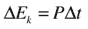

你可能不会马上认出这个公式，但它是通过将做功δW = pδt 与动能相等得到的，动能是根据功能定理得到的，如前所述。从概念上讲，所发生的是所施加的功率对球做机械功，这导致球的动能增加。

在`applyPower()`中，你会注意到我们也减少了球的动能，减少量等于`powerLossFactor*vmag*vmag*dt`。这相当于应用由下式给出的功率损耗，其中 k 是对应于`powerLossFactor`的常数:

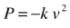

这个公式来源于应用我们在上一节看到的公式 P = F v，并用 F =–k v 模拟所有阻力(如摩擦力和阻力)的总和，作为与球的速度成比例的力(见[第 7 章](07.html))。这是一个粗略的近似值，但是对于我们这个简单的例子来说已经足够了。

`updateVelo()`方法首先通过该公式从更新的动能计算速度大小，该公式是通过反转动能 E k =  m v 2 的公式获得的:

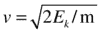

然后它相应地更新球的速度。

还有一些代码用于设置一个`Graph`实例，并随着模拟的进行绘制球的水平速度分量的图形。这些代码很简单，所以我们不会在这里深入讨论。

如果你运行代码，你会发现球开始移动，但是由于能量损失的影响，它的速度逐渐降低。如果你接着按住向上箭头键，施加的力量将导致球的动能增加，使其加速。如果持续通电，最终速度会趋于一个恒定值，但如果松开上箭头键，速度会再次降低，如图 [4-13](#Fig13) 所示。这种行为以简单的方式反映了汽车加速器的操作。

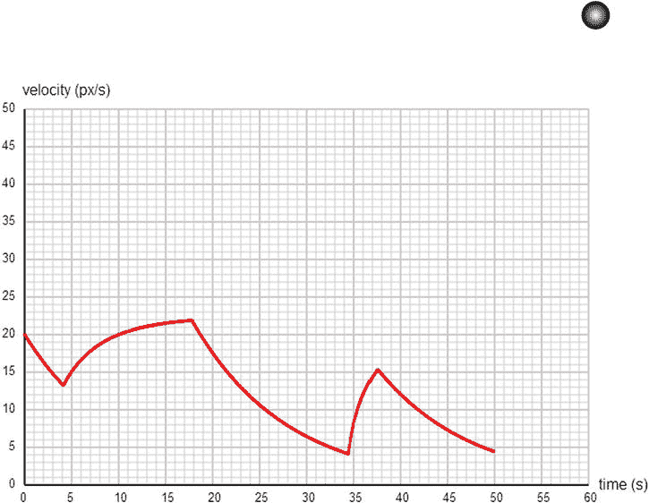

图 4-13。

A rudimentary car simulation

## 摘要

这是另一个很长的概述章节，你现在已经学到了很多物理概念。这一章完成了这本书的第一部分。下一章将把你到目前为止所学的东西结合在一起，列出如何模拟各种各样的力和运动的原理。

准备好真正的行动吧！