# 七、接触力和流体力

在前一章中，我们详细研究了重力，这是一种远距离作用的力。然而，除了重力之外，我们在日常生活中遇到的大多数力都来自于与其他物体的直接接触，无论是固体还是液体。因为在这个星球上，我们通常与固体地板接触，并被流体(空气或水)包围，所以知道它们对物体施加什么力肯定是一件好事。本章将着眼于这些力量。

本章涵盖的主题包括以下内容:

*   接触力:接触力是两个固体直接接触时相互施加的力。例子包括法向力、摩擦力和张力。
*   压力:流体施加压力。由于这种流体压力，流体中的任何物体都会受到力的作用。
*   上推力或浮力:上推力，也称为浮力，是部分或全部浸没在流体中的物体所承受的合成压力。
*   阻力:物体在流体中运动时会受到一种阻碍其运动的阻力。这就是阻力。
*   升力:在流体中移动的物体可能会受到另一个垂直于运动方向的力，称为升力。升力是飞机飞行的动力。
*   风:虽然风本身不是一种力，但它确实会对它吹过的任何物体施加一种力。风还会产生湍流，这会导致物体运动不稳定。

如该列表所示，这些力的变化包括固体物体之间的相互作用以及固体物体和流体之间的相互作用，这两种情况都是直接物理接触的结果。但从技术上讲，接触力这个术语是专指存在于两个固体之间的力。只有第一节将从技术的角度讨论接触力。本章的大部分将集中在流体对固体物体施加的力上。这部分是因为后者更复杂，但它们也表现出更丰富的多样性，具有有趣的功能和效果。在研究流体力时，我们将把注意力限制在固体在流体中所受的力上。我们不考虑作用在流体上的力以及这些力对流体本身的影响。流体运动是一个更复杂的问题，不在本书中讨论。

这里只是一些你在阅读本章后能够创建的模拟:摩擦运动、漂浮物体、气泡、气球、降落伞、升力、风和湍流效果。你也将知道建造潜艇模拟所需的大部分物理知识(见第十六章)。

## 接触力

简单地说，接触力是一个固体物体与另一个固体物体接触时受到的力。推和拉涉及接触力。跑步或者只是站着也是如此。碰撞涉及持续时间很短的大接触力。

### 法向接触力

当两个固体物体接触时，每个物体都会对另一个物体施加一个法向力，阻止它们融合在一起。法向力的大小取决于将两个物体推到一起的力。

Note

在我们做其他事情之前，我们必须解释一下，这里的正常这个词是指这个词的数学意义，它是垂直的，而不是不正常的对立面。

正常接触力的一个例子是地板对你的反作用力。事实上，这个力就是我们意识到自己体重的原因。如果没有地板的正常反作用力(因此没有正常的力)，我们会从地板上摔下来。

现在，每当我们在这本书里引入一个新的力，我们都会给你一个计算它的方法。你就可以这么模拟了。如果你不能计算一个力，谈论它就没有意义了！

法向力怎么算？这要看情况。不像重力，它没有通用的公式来告诉你法向力是什么。通常，你可以从作用在物体上的其他力推导出来。

这里有一个例子。假设有一本书放在一张水平的桌子上(见图 [7-1](#Fig1) )。作用在书上的力主要有两个:地球施加的垂直向下作用的重力 W = mg，桌子施加在书上垂直向上作用的法向接触力 N(法向接触力通常用 N 或 R 表示)。因为书不动，所以对它的合力一定为零(牛顿第一运动定律)。因此，我们可以推导出，这种情况下的法向力 N 在量级上等于书的重量 W。

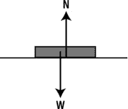

图 7-1。

The normal contact force acting on a book resting on a table

例如，如果桌子倾斜，法向力就会改变。你会在本章的第一个例子(“滑下斜坡”)中看到如何计算这种情况下的法向力。

### 拉伸和压缩

弦的张力是另一种接触力。如果你用一根绳子系住一个物体，然后握住绳子的另一端将物体悬挂起来(见图 [7-2](#Fig2) )，绳子会对物体施加拉力，防止其下落。绳子只有绷紧时才能做到这一点。根据牛顿第三运动定律，物体对绳子施加一个大小相等方向相反的力。绳子上的力叫做张力。非正式地，我们也把绳子施加在物体上的力称为张力。张力对细绳本身的作用是将它稍稍拉长。如果物体停止运动，那么张力一定等于物体的重量。如果物体很重，张力会把绳子拉至断裂点。

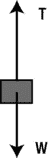

图 7-2。

Tension in a string

弹簧也会受到张力。弹簧的设计使得相对较小的张力可以产生较大的伸长。因为弹簧在拉伸时会恢复正常长度，所以它会拉回拉伸它的物体。张力的反义词是压缩。弹簧也可以被压缩；然后，它们对压缩它们的物体施加推力。

弹簧既有趣又非常有用，可以产生各种各样的效果。事实上，下一章专门讨论弹簧和类似弹簧的运动。

### 摩擦

摩擦力是阻止两个相接触的物体相对运动或阻止一个物体在流体中运动的力。例如，如果你沿着桌子推一本书，它会慢下来并停下来。那是因为桌面对它施加的摩擦力。两个固体之间的摩擦也称为干摩擦。空气或水等流体也会产生摩擦力，称为粘性流体阻力。

我们将在本章后面讨论流体阻力。在这一节，我们将看看两个固体之间的干摩擦，以及我们如何对它建模。

如前所述，摩擦力是阻止两个相互接触的物体相对运动的力。这意味着作用在物体上的摩擦力将与其运动方向相反。但是一个物体不一定要移动才能经历摩擦。如果一个物体受到一个使它向另一个物体移动的力，它也会受到摩擦，即使它实际上并没有移动。事实上，是摩擦力阻止了它的运动。所以实际上有两种类型的摩擦力:静止物体所受的摩擦力，和运动物体所受的摩擦力。我们分别称之为静摩擦力和动摩擦力。

#### 模拟静摩擦和动摩擦

我们用摩擦系数的概念来模拟这两种类型的摩擦。让我们从动摩擦开始，因为它简单一点。

普通的经验告诉我们，如果我们将两个表面压在一起，同时试图使一个表面滑过另一个表面，摩擦会更大。那是因为两个物体如果压在一起会更“粘在一起”。同样清楚的是，摩擦力的大小取决于构成物体的材料。例如，橡胶会比玻璃产生更大的摩擦力。因此，摩擦力 F 的大小由下式给出就不足为奇了，其中 N 是两个物体之间的法向力，C k 是一个取决于两个表面的数，称为动摩擦系数:

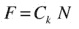

根据牛顿第三定律，大小相同的力作用在两个物体上；对于每个物体，力的作用方向与它相对于另一个物体的运动方向相反。动摩擦有时也被称为动态或滑动摩擦。

静态摩擦有点不同。对于给定的一对表面和法向接触力，动摩擦力只有一个值，而静摩擦力可以取最大值以下的任何值。最大值由下式给出:

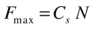

这在形式上类似于动摩擦公式，但有一个不同的系数，称为静摩擦系数。对于相同的两个表面，其值通常大于 C k 的相应值。因此，最大静摩擦力大于动摩擦力。

为了理解静摩擦和动摩擦，考虑下面的思维实验。假设你正在推动一个物体接触一个表面。如果你施加的力的大小小于前面公式给出的 F max ，摩擦力将等于作用力，因此合力为零，物体不会移动。如果你现在更用力，使施加的力大于 F max 的值，摩擦力将等于 F max (因为它不能超过那个最大值)。所以摩擦力不能完全平衡施加的力，物体会在合力的作用下开始加速。一旦它开始运动，摩擦力就会减小到与动摩擦力相等的值。因此，合力会突然增加，物体会加速。如果你曾经试图移动一件沉重的家具，你会很容易理解这个事实:一旦它已经在移动了，就更容易推动了。那是因为动摩擦力小于静摩擦力的最大值。

#### 摩擦系数

表 [7-1](#Tab1) 中给出了一些摩擦系数的例子。关键是数值一般都小于 1。摩擦系数大于 1 是非常罕见的，因为这意味着摩擦力大于将两个物体固定在一起的正常接触力。

表 7-1。

Static and Kinetic Coefficients of Friction

<colgroup><col> <col> <col></colgroup> 
| 材料 | C s | C k |
| --- | --- | --- |
| 木头上的木头 | 0.25–0.5 | Zero point two |
| 钢对钢 | Zero point seven four | Zero point five seven |
| 混凝土上的橡胶 | One | Zero point eight |
| 玻璃对玻璃 | Zero point nine four | Zero point four |
| 冰上的冰 | Zero point one | Zero point zero three |

请注意，尽管这些值代表了所引用的材料，但实际的摩擦系数可能会因实际物体表面的性质而有所不同。对于游戏编程来说，这不是一个大问题。

不可能给出一个完整的摩擦系数列表；但是如果你需要的东西没有列在这里，在网上应该很容易找到。

### 示例:滑下斜坡

举例子的时间到了！现在，您可以应用所学的法向接触力和摩擦力来模拟一个物体沿斜面下滑。首先，让我们将物理概念应用到这个特殊的例子中。

#### 物理学

本次模拟的力图如图 [7-3](#Fig3) 所示。如图所示，有三个力作用在物体上:重力 m g，法向接触力 N，摩擦力 f，由于物体沿表面直线运动，合力沿表面作用。没有垂直于表面的合力。

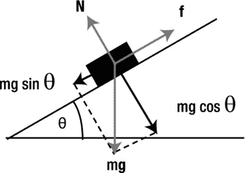

图 7-3。

Force diagram for an object sliding down an inclined plane

因此，分解沿表面的力，得到合力 F 的大小如下，其中θ是倾斜平面的角度:

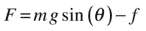

垂直于表面的分解力的合力必须为零，这样法向接触力 N 就被垂直于表面的重力分量所平衡。注意摩擦力 f 沿着表面作用，所以它垂直于表面的分量为零。因此，

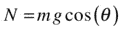

当物体运动时，摩擦力 f 的大小由下式给出:

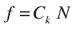

如果它不动，沿表面的合力 F 必然为零，所以 F 必须平衡重力沿表面的分量。根据上式，设置 F = 0 得出:

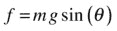

达到以下最大值时为真:

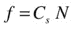

如果重力分量的值(mg sin (θ))超过这个临界值(C s N)，f 将具有后者的值，至少暂时是这样。一旦物体开始移动，f 的值将是 C k N

现在你知道了物理，有了相关的公式，就可以开始编码了。这将是一个两步的过程，与你在上一章中所做的非常相似。首先，您将创建可视化设置；然后，您将编写驱动模拟的代码。

#### 创建视觉设置

代码在一个名为`sliding.js`的文件中。在声明和初始化画布、上下文和其他变量之后，我们在`init()`函数中处理可视化设置:

`var canvas = document.getElementById('canvas');`

`var context = canvas.getContext('2d');`

`var canvas_bg = document.getElementById('canvas_bg');`

`var context_bg = canvas_bg.getContext('2d');`

`var ball;`

`var m = 1;          // mass of ball`

`var g = 10;         // acceleration due to gravity`

`var ck = 0.2;       // coeff of kinetic friction`

`var cs = 0.25;      // coeff of static friction`

`var vtol = 0.000001 // tolerance`

`// coordinates of end-points of inclined plane`

`var xtop = 50; var ytop = 150;`

`var xbot = 450; var ybot = 250;`

`var angle = Math.atan2(ybot-ytop,xbot-xtop); // angle of inclined plane`

`var t0,dt;`

`window.onload = init;`

`function init() {`

`// create a ball`

`ball = new Ball(20,'#0000ff',m,0,true);`

`ball.pos2D = new Vector2D(50,130);`

`ball.velo2D = new Vector2D(0,0);`

`ball.draw(context);`

`// create an inclined plane`

`context_bg.strokeStyle = '#333333';`

`context_bg.beginPath();`

`context_bg.moveTo(xtop,ytop);`

`context_bg.lineTo(xbot,ybot);`

`context_bg.closePath();`

`context_bg.stroke();`

`// make the ball move`

`t0 = new Date().getTime();`

`animFrame();`

`};`

在`init()`中，我们创建一个球和一条线(后者在不同的画布元素上，背景)，并将球放在线上。使用端点和`Math.atan2()`函数计算线条的角度，并存储在`angle`变量中。如果你不确定这里发生了什么，再看一下[第 3 章](03.html)中的“反向触发函数”小节。最后，我们通过调用`animFrame()`函数让球沿着斜线向下移动。

#### 编码动画

`animFrame()`函数完成了设置动画循环的常规工作，相关代码与前一章中的例子非常相似，但只是提醒你我们在这里复制了代码:

`function animFrame(){`

`animId = requestAnimationFrame(animFrame,canvas);`

`onTimer();`

`}`

`function onTimer(){`

`var t1 = new Date().getTime();`

`dt = 0.001*(t1-t0);`

`t0 = t1;`

`if (dt>0.2) {dt=0;};`

`move();`

`}`

`function move(){`

`moveObject(ball);`

`calcForce();`

`updateAccel();`

`updateVelo(ball);`

`}`

`function moveObject(obj){`

`obj.pos2D = obj.pos2D.addScaled(obj.velo2D,dt);`

`context.clearRect(0, 0, canvas.width, canvas.height);`

`obj.draw(context);`

`}`

`function updateAccel(){`

`acc = force.multiply(1/m);`

`}`

`function updateVelo(obj){`

`obj.velo2D = obj.velo2D.addScaled(acc,dt);`

`}`

这几乎是全部的动画代码，你可以看到到目前为止什么都没有改变。唯一的变化是在`calcForce()`函数中，它包含了新的物理特性:

`function calcForce(){`

`var gravity = Forces.constantGravity(m,g);`

`var normal = Vector2D.vector2D(m*g*Math.cos(angle),0.5*Math.PI-angle,false);`

`var coeff;`

`if (ball.velo2D.length() < vtol){  // static friction`

`coeff = Math.min(cs*normal.length(),m*g*Math.sin(angle));`

`}else{  // kinetic friction`

`coeff = ck*normal.length();`

`}`

`var friction = normal.perp(coeff);`

`force = Forces.add([gravity, normal, friction]);`

`}`

`calcForce()`方法计算每个时间步的三个相关力`gravity`、`normal`和`friction`，然后使用`Forces.add()`方法将它们相加得到合力。法向力和摩擦力的计算需要解释。对于法向力，我们使用一种叫做`vector2D()`的`Vector2D`新方法，定义如下:

`Vector2D.vector2D = function(mag,angle,clockwise){`

`if (typeof(clockwise)==='undefined') clockwise = true;`

`var vec = new Vector2D(0,0);`

`vec.x = mag*Math.cos(angle);`

`vec.y = mag*Math.sin(angle);`

`if (!clockwise){`

`vec.y *= -1;`

`}`

`return vec;`

`}`

该方法采用两个必需的`Number`参数`mag`和`angle`(以弧度表示)，以及一个可选的布尔参数`clockwise`，并返回一个`Vector2D`对象，该对象是一个具有指定大小和角度的 2D 向量。它通过将(幅度、角度)表示转换为矢量的分量表示来实现这一点(参见第 3 章中的“解析矢量”一节)。`clockwise`参数告诉`vector2D()`角度是顺时针方向(默认)还是逆时针方向。

使用前面的公式和图 [7-3](#Fig3) ，我们知道法向力的大小等于 mg cos (θ)，其角度等于逆时针方向上的π/2–θ(即 90–θ，单位为弧度)。因此，法向力由下式给出:

`var normal = Vector2D.vector2D(m*g*Math.cos(angle),0.5*Math.PI-angle,false);`

摩擦力垂直于法向力，大小为`coeff*N`，其中`coeff`为摩擦系数，`N`为法向力的大小。因此它由下面给出，其中`perp()`是我们在`Vector2D`类中创建的另一个新方法(我们将很快描述它),当对象开始移动时`coeff`等于 CkN；并且等于 mg sin (θ)，当物体不运动时，最大值为 C s N:

`var friction = normal.perp(coeff);`

这是通过以下方式实现的:

`if (ball.velo2D.length() < vtol){  // static friction`

`coeff = Math.min(cs*normal.length(),m*g*Math.sin(angle));`

`}else{  // kinetic friction`

`coeff = ck*normal.length();`

`}`

注意，我们利用`Math.min()`函数来实现这样一个事实，即对于静摩擦力，`coeff`等于 mg sin (θ)或 C s N，以较小者为准。

`Vector2D`的`perp()`方法是这样定义的:

`Function perp(u,anticlockwise){`

`if (typeof(anticlockwise)==='undefined') anticlockwise = true;`

`var length = this.length();`

`var vec = new Vector2D(this.y, -this.x);`

`if (length > 0) {`

`if (anticlockwise){ // anticlockwise with respect to canvas coordinate system`

`vec.scaleBy(u/length);`

`}else{`

`vec.scaleBy(-u/length);`

`}`

`}else{`

`vec = new Vector2D(0,0);`

`}`

`return vec;`

`}`

这个定义意味着，如果`vec`是一个`Vector2D`对象，`k`是一个数字，`vec.perp(k)`返回一个垂直于`vec`且长度为`k`的`Vector2D`对象，逆时针方向指向`vec`(在画布坐标系中)。参考图 [7-4](#Fig4) ，图中显示了该设置的截图，`normal.perp(coeff)`因此给出了一个指向斜坡上方的矢量`coeff`，正如摩擦力应该是。

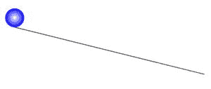

图 7-4。

An object sliding down a slope

当检查对象是否没有移动时，我们实际上并没有检查它的速度是否为零，而是检查它是否小于某个小值`vtol`(在代码中设置为 0.000001)。`g`的值设置为 10，假设滑动物体和表面都是由木头制成的，我们选择`ck = 0.2`和`cs = 0.25`。

如果您使用给定的参数值运行代码，您将看到什么也没有发生。物体只是停留在那里。这怎么可能呢？为了理解这一点，再看一下图 [7-3](#Fig3) 。很明显，只有当重力沿斜面的分量超过最大静摩擦力时，物体才能滑动。换句话说，如果以下条件成立，它将滑动:

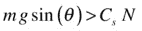

因为 N = mg cos (θ)，所以这相当于:

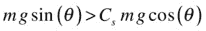

将这个不等式的两边除以 mg cos (θ)得出:

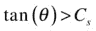

所以只有当倾斜角的正切大于静摩擦系数时，物体才会滑动。

现在，您可以根据`xtop`、`ytop`、`xbot`和`ybot`的值计算 tan (θ)，如下所示:

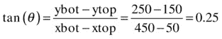

这正好等于代码中规定的 C s 的值。因此，重力不足以克服摩擦力，物体不会滑动。如果你稍微增加斜面的角度，物体就会滑动。比如把`ybot`的值改成 260，这就得出 tan (θ) = 110/400 = 0.275，大于 C s 的值。试一试！

在这个例子中，物体沿着表面滑动而不滚动。滚动包括刚体的旋转运动(将在第 13 章中讨论)。

## 压

本章的其余部分将讨论源于压力的力，更具体地说是流体压力。从技术上讲，压力与固体、液体和气体都有联系。但是这个概念对于流体特别有用，所以它更倾向于与液体和气体联系在一起。

### 压力的意义

那么什么是压力呢？它是施加在物体表面的单位面积上的法向(垂直)力。在不同情况下，垂直力的来源可以不同。固体和液体产生的压力通常是由于重力。气体中的压力是由气体分子的碰撞产生的。

关键问题是:我们如何计算压力，从而计算流体中物体所受的力？一旦我们做到了这一点，我们就可以尝试模拟物体在流体中的运动。

根据压力的定义，如果力 F 垂直作用于面积为 A 的表面，则表面上的平均压力 P 由下式给出:

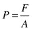

因为压力是力除以面积，所以它的单位是 N/m 2 。这个单位有一个特殊的名字:帕斯卡，或 Pa。

如果 F 与法线成一个角度呢？然后你需要求解 F 来找到法线方向的分量，这个法线分量就是你在前面的公式中使用的分量。这给了我们一种方法，如果我们知道力，就可以计算压力，反之亦然。

压力并不局限于流体(尽管流体压力将是我们在这一章中主要关心的)，用一个简单的固体例子来介绍计算压力的方法实际上更容易些。

假设一个长 l、宽 w、高 h、质量 m 的长方体(盒子)坐在一张桌子上(见图 [7-5](#Fig5) )。它对桌子施加的压力是多少？

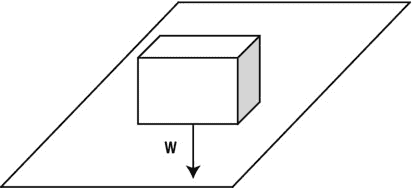

图 7-5。

A box sitting on a table

它施加在桌子上的力等于它的重量，这个力垂直于桌面，所以我们有 F = mg。面积 A = lw。因此，压力 P 由下式给出:

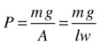

### 密度

通过引入密度的概念，我们可以取得更多的进展。

密度被定义为每单位体积的质量。密度给了你一种比较不同物质相对“重量”的方法——你可以取同样体积的每种物质，然后比较每种物质的重量。

我们用希腊符号ρ(ρ)表示密度。所以，基于这个定义，我们可以写成:

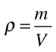

因为密度是质量除以体积，所以单位是 kg/m 3 。因为物体受热时会膨胀，尤其是液体和气体，所以流体的密度会随着温度(以及压力)而变化。在 20°C 和标准大气压下，水的密度约为 1000 kg/m 3 ，空气的密度约为 1.2 kg/m 3 。这意味着一个 1 米×1 米×1 米的盒子(体积为 1 米)可以容纳 1000 千克(1 吨)水和 1.2 千克空气。

操纵上面的公式给出如下结果:

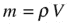

它也给出了这个:

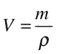

我们将在本章的其余部分频繁使用这些公式。

就像压力一样，密度的概念不仅适用于液体，也适用于固体。回到前面的长方体示例，我们可以用 m = ρV = ρlwh 来代替压力公式中的质量 m，因为长方体的体积是 V = lwh:

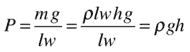

这是一个非常有用的公式。它给出了一个规则物体(在这种情况下，是一个长方体)在一个表面上施加的压力，这三个已知的量是:物体的密度、重力加速度和物体的高度。请注意，我们可以使用不同于盒子的其他形状，只要它具有规则的横截面 A。面积 A 将以相同的方式抵消，留下相同的公式:P = ρgh。

在下一节，我们会发现这个公式实际上更普遍，也适用于流体施加的压力，只要我们重新解释 h。

### 流体中压力随深度的变化

现在考虑一个与上一节中的固体形状相同的液体柱，而不是固体。

应用完全相同的数学公式，我们再次得出以下结果，其中 P 是液柱下方的压力，ρ是流体的密度，h 是液柱的高度:

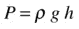

现在在精神上把自己传送到海洋。

在海面下的深度 h 处，有一个高度为 h 的水柱。因此，表面下深度 h 处的压力由相同的公式给出:

请注意，这是仅由水产生的压力。由于水面上方的空气，还有一个附加压力。这是大气压力，我们可以用 A 来表示，那么假设水的密度随深度不变，海洋中深度 h 处的总压力是 A + ρgh。这个公式表明，流体中的压力随着深度的增加而增加，这很有道理，因为上面有更多的流体在“下沉”

大气层也是如此。我们在地球表面感受到的气压是由于我们头上的空气柱。标准大气压约为 100 千帕或 100，000 帕。这有时简称为 1 大气压(atm)。

因为水的密度是 1000 kg/m 3 ，g 大约是 10 m/s 2 ，用公式 P = ρgh 告诉我们，10 m 的水将会施加大约和 1 个大气压相同的压力。因此，在 10 米的海洋深度，压力将是 2 个大气压，包括上面空气的压力。

### 静态和动态压力

到目前为止，当我们谈到流体中的压强时，我们指的是静压。公式 P = ρgh 适用于静压。静压定义在流动中的任何一点，它是各向同性的；也就是说，它在任何方向都有相同的值。它甚至存在于静态流体(静止的流体)中。

在流动的流体中，还有另一种压力，称为动压。动态压力是由于流体的流动。例如，从水龙头流出的水流会产生动压力。当水碰到水槽时，会对水槽施加一个力。类似地，由于与之相关的动态压力，风施加一个力。流体中任一点的动态压力公式如下，其中 v 是流体在该点的速度:

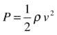

对于在流体中以速度 v 运动的物体也是如此；重要的是物体和流体之间的相对速度。

运动流体中的总压力是静压和动压之和。

## 上升推力(浮力)

在了解了压力和密度的背景之后，我们现在准备介绍流体产生的力。所以我们先从上推力说起，也就是浮力。

这里有一个简单的实验让你在洗澡的时候做。试着在水下推一个空心球。你有什么感觉？你应该感觉到有一股力量试图把球向上推回去。这是向上推力。现在放开球。会发生什么？在沉淀下来之前，它会重新弹起并在水面振荡。你很快就会创造出这样的效果。

上推也使我们在游泳池或浴缸里感觉更轻。它向上运动，对抗重力。

什么导致了上升？上冲的物理起源是流体中不同高度存在的压力差。为了理解我们的意思，看一下图 [7-6a](#Fig6) ，图中显示了一个物体部分浸没在诸如水的液体中。物体顶面的压力等于大气压 A 并向下推动物体，而底面的压力等于 A + ρgh，其中ρ是流体的密度，h 是物体被淹没的深度。这个压力向上作用，所以有一个等于ρgh 的净向上压力。因此，因为力=压力×表面面积，所以压力差会产生一个向上的合力 U，由下式给出(其中 S 是物体顶面和底面的面积，为简单起见，此处假设相等):

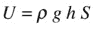

这就是上推力或浮力。

注意，因为压力是各向同性的，所以它也作用于物体的侧面。但是在每一个高度上，相对两侧的压力大小相等，方向相反，所以它们的影响被抵消了。如果物体完全浸没在液体中(见图 [7-6b](#Fig6) )，包括空气中的物体，类似的结论也成立。这基本上是因为流体中的压力随着深度的增加而增加，所以水下物体底部的压力总是大于顶部的压力。所以流体会对物体产生一个向上的净压力。

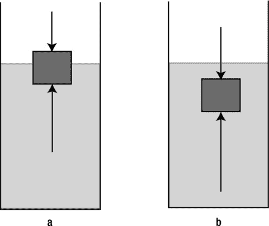

图 7-6。

An object immersed in a fluid experiences upthrust due to a pressure difference

### 阿基米德原理

让我们重温一下上一节中导出的最后一个公式。发现上冲的幅度 U 由 U = ρghS 给出。现在 h 是物体浸没部分的高度，S 是它的横截面积(为简单起见，我们假设它是常数)。因此，hS 等于物体浸没部分的体积 V。所以我们可以这样写:

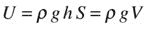

但是ρV = m，液体的质量被物体的水下部分所取代，所以我们现在可以这样写:

这只是排出液体的重量。因此，我们推导出阿基米德原理:

*   阿基米德原理:浸没在液体中的物体所受的上推力等于它所排开的液体重量。

阿基米德是古希腊科学家、数学家和全才。根据传说，当他发现这个原理时，他从浴缸里跳出来大喊“找到了！”，意思是“找到了！”

### 视重量

上冲导致视重现象。图 [7-7](#Fig7) 说明了这个概念。任何部分或全部浸在液体中的物体都会受到向上的推力 U，这个力与重力 W 作用在物体上的向下的力相反。

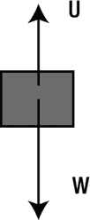

图 7-7。

Upthrust reduces the apparent weight of an object to W – U

因此，物体的表观重量由下式给出

表观体重现象是我们在浴缸或游泳池中感觉更轻的原因。利用明显的重量效应，宇航员在一个巨大的水槽中进行训练，以模拟失重或零重力。

### 水下物体

完全浸没在液体中的物体显然会排出其自身体积的液体。

由于物体和排出的流体具有相同的体积 V，因此完全浸没的物体的表观重量可以写为:

因此，它可以写成以下形式:

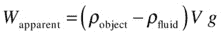

这是一个非常有用的公式，它根据物体的密度和体积给出了浸没在液体中的物体的向下合力或表观重量。

从这个公式中，我们可以推导出:

*   如果物体的密度大于流体的密度，则表观重量将为正(即向下)，但小于实际重量。你可以在浴室或游泳池中体验这种较低的表观重量。
*   如果物体的密度比流体的密度大得多，那么表观重量就几乎等于实际重量，因为与物体的重量相比，上推力可以忽略不计。例如，一块石头在空气中的上推力通常可以忽略不计。
*   如果物体的密度正好等于液体的密度，那么表观重量将为零，因此物体将漂浮在液体中。
*   如果物体的密度小于流体的密度，则表观重量为负(它向上作用)，因此物体会上升。例如，水中的气泡与它们的重量相比有很大的上升力，因为空气的密度比水的密度低得多，所以它们上升很快。

### 漂浮物体

阿基米德原理的一种特殊形式适用于浮体。这就是所谓的漂浮定律。

*   漂浮定律:一个漂浮物排出其自身重量的液体。

这是逻辑。浮体上没有净力作用；否则，它要么上升，要么下沉。因为作用在它身上的仅有的两个力是它的重量和向上的推力，它们必须平衡。因此，浮体上的上推力必须等于浮体的重量。根据阿基米德原理，这意味着排出液体的重量等于物体的重量。所以一个漂浮物体的表观重量是零——它“感觉没有重量”

如前所述，当物体浸没在密度等于物体自身密度的流体中时，也是这种情况。事实上，漂浮在液体表面的物体，如水上的船只，其“有效密度”与水的密度相同，尽管它可能由密度比水高的金属制成。这是因为船在水面以下的部分也包括封闭在船内部的空气，这降低了它的平均密度。

### 示例:气球

我们已经有了相当多的理论，所以让我们看一个例子。这个例子(如图 [7-8](#Fig8) 所示)模拟了一个简单的热气球。热气球的工作原理是加热空气。热空气的密度小于周围空气的密度，所以它上升。通过控制气球中空气的温度，你可以控制它的密度，从而控制它的上升力。

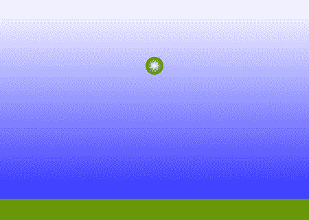

图 7-8。

Simulating a hot-air balloon

该模拟的代码可在`balloon.js`中找到。`init()`功能创建如图 [7-8](#Fig8) 所示的视觉背景，并创建一个气球作为`Ball`对象，最初静止在地面上。它还设置了`keydown`和`keyup`事件监听器，相应的`keydown`事件监听器响应`UP`和`DOWN`箭头的按下，分别从气球的初始值 1.1 增加或减少气球的密度`rhoP`。空气密度`rho`保持恒定在 1.2。您可以查看代码以了解更多细节。

到目前为止，你可能不需要太多的帮助就可以编写动画代码了。这里唯一的实质性变化是`calcForce()`方法，它指定了两个力(`gravity`和`upthrust`)，然后将它们相加:

`function calcForce(){`

`var gravity = Forces.constantGravity(m,g);`

`var V = m/rhoP; // volume of air displaced`

`var upthrust = Forces.upthrust(rho,V,g);`

`force = Forces.add([gravity, upthrust]);`

`}`

使用新创建的`Forces.upthrust()`静态函数计算`upthrust`，该静态函数基本上使用公式 U = ρgV，其中ρ(代码中的变量`rho`)是流体的密度，V(代码中的变量`V`是置换的空气体积。这是气球的体积，因为它完全浸没在空气中。所以`V`是用气球的质量和它的有效密度`rhoP`计算出来的，公式是体积=质量/密度。有效密度`rhoP`是整个气球的密度，包括它所承载的任何载荷(不仅仅是其中空气的密度)。

模拟中的关键参数是气球密度与环境空气密度的比率`rhoP/rho`。如果有效气球密度`rhoP`小于空气密度`rho`(该比值小于 1)，气球将上升。如果`rhoP`比`rho`大，就会沉下去。

为了使模拟更具交互性，我们还在`move()`中包含了对函数`changeBalloonDensity()`的调用，该函数允许您通过分别按上下箭头键来增加和减少气球的密度`rhoP`。每当`rhoP`改变时，该代码向控制台输出比率值(`rhoP/rho`)。看看你能否让气球上升，然后在某个高度保持静止。

这个模拟中缺少了一些东西。气球升得太快；它基本上是在多余的上推力的作用下加速的，所以它向上的速度一直在上升。现实中会被拖慢。因此，让我们来看看我们如何可以包括拖动效果。

## 拖

对于不熟悉流体动力学的人来说，尝试对阻力建模可能会有些困惑。一个原因是阻力的类型不止一种，而是几种。根据要模拟的对象和流，可能需要考虑不同类型的拖动。

困难的另一个来源是，我们对阻力的许多了解都是基于经验工作。阻力定律是通过大量的实验发现的，而不是像引力那样作为一个美丽的普遍理论的一部分。

底线是，你会碰到从实验结果中发展出来的公式，你必须毫无争议地接受这些公式。

对于本书中的大部分内容，我们将使用两个阻力定律中的一个:一个适用于低速(或所谓的层流)，另一个(更常见)适用于高速(或所谓的湍流)。

### 低速阻力定律

对于以非常低的速度在流体中移动的物体，物体周围的流动是层流或流线型的。这产生相对较低的阻力。那么阻力就服从斯托克斯定律，即阻力与物体的速度成正比。对于球形物体，斯托克斯阻力公式如下，其中 r 是球体的半径，希腊字母η表示称为粘度(更准确地说是动态粘度)的流体属性:

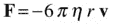

注意，动态粘度也用希腊字母μ表示。流体的粘度是它对通过它的物体所提供的阻力的量度。直观上，它代表了流体的“厚度”。所以水的粘度比空气高，油的粘度比水高。因此，在水中以相同速度运动的物体比在空气中受到更大的阻力。该公式还告诉我们，较大的物体受到的阻力更大，因为较大物体的参数 r 更大。

要在精确的模拟中使用该公式，您需要知道对象在其中运动的流体的粘度。像密度一样，粘度取决于温度。20°C 时，水的动力粘度为 1.0 × 10 -3 kg/(ms)，空气的动力粘度为 1.8×10-5kg/(ms)——约为 1/55。

在对这种阻力进行编码时，我们将把所有的因素放在一起，把速度乘以一个由 k 表示的单一因素，这样，线性阻力定律就变成如下，其中 k = 6ρρr 对于一个球体:

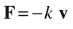

以这种形式写出线性阻力定律实际上更普遍，因为它也适用于其它非球形物体，对于这些物体，这个公式没有给出 k。通过选择合适的 k 值，我们可以模拟任何形状物体上的线性阻力。

这基本上是我们在第五章的[中编码到`Forces.linearDrag()`函数中的拖动形式:](05.html)

`Forces.linearDrag = function(k,vel){`

`var force;`

`var velMag = vel.length();`

`if (velMag > 0) {`

`force = vel.multiply(-k);`

`}else {`

`force = new Vector2D(0,0);`

`}`

`return force;`

`}`

### 高速时的阻力定律

斯托克斯阻力定律只适用于低速。在较高的速度下，浸没物体周围的流动变得紊乱，产生扰乱流动并使其混乱的涡流。阻力定律不同于层流定律，它与物体速度的平方成正比。阻力公式由下式给出，其中ρ是流体的密度，A 是物体的正面面积(当物体通过时流体冲击的面积)，C d 是称为阻力系数的参数，其取决于物体的特性，例如其形状、表面特性和流动特性:

请注意，该公式涉及速度 v 与其大小 v 的乘积。这给出了在 v 方向上的大小为 v 2 的矢量。因此，阻力定律在速度上是二次的，大小由下式给出:

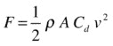

在这种形式中，很明显二次阻力取决于动压 P = 1/2 ρv 2 ，实际上我们可以这样写:

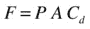

如前所述，阻力系数 C d 可能取决于大量因素。它的值是通过对特定对象和设置的实验得到的。例如，球体的阻力系数范围可以从 0.07 到 0.5。同样，你可以在物理或工程教科书或网站上找到大量物体形状的阻力系数(2D 和 3D)。

至于层流阻力公式，我们将通过定义高速阻力常数 k 来简化前面的公式，如下所示:

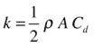

所以高速时的阻力定律可以写成这种形式:

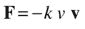

我们现在定义名为`Forces.` `drag()`的第二个阻力函数，如下所示:

`Forces.drag = function(k,vel) {`

`var force;`

`var velMag = vel.length();`

`if (velMag > 0) {`

`force = vel.multiply(-k*velMag);`

`}`

`else {`

`force = new Vector2D(0,0);`

`}`

`return force;`

`}`

### 我应该使用哪种阻力定律？

我们已经描述了两个阻力定律，线性的和二次的，说前者适用于低速，后者适用于高速。但是到目前为止，我们对“低”和“高”的含义相当模糊。区分高低的“临界流速”是什么？

为了回答这个问题，我们引入了流动雷诺数的概念。简单地说，雷诺数告诉我们流动是层流还是湍流。因此，它告诉我们，除了别的以外，是线性还是二次阻力定律适用。用符号 Re 表示的雷诺数由以下方程定义，其中 u 是与流动相关的特征速度，d 是特征长度标度，希腊符号ν (nu)是所谓的流体运动粘度:

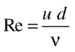

运动粘度定义为流体的动力粘度与密度之比:

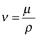

利用前面给出的动力粘度和密度值，我们可以推导出在 20°C 时，水的运动粘度为 1.0×10-6m2s，空气的运动粘度为 1.5×10-5m2s

选择什么样的速度 u 和什么样的长度尺度 d 来计算雷诺数取决于问题。对于在流体中运动的球体这样的物体，u 只是物体的速度，d 是线性维度(球体的直径)。

现在，实验发现层流占主导地位，因此，当雷诺数远小于 1 时，线性阻力的斯托克斯定律成立。使用雷诺数的公式，并设置 Re = 1，这意味着决定哪个阻力定律适用的临界速度由下式给出

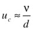

如果物体的速度远小于这个临界值 v c ，则阻力定律是线性的；如果远大于 v c ，阻力定律为二次型。如果速度介于这两个极限之间，则可以使用两个定律的组合。

例如，足球的直径为 22 厘米，即 0.22 米。使用前面给出的水和空气的运动粘度值，我们推断出这种球的临界速度在水中为 0.0045 毫米/秒，在空气中为 0.068 毫米/秒(是的，这些都是以毫米/秒为单位)。这些都是很小的速度，所以实际上你可以假设这种大小的球在水中或空气中的运动总是遵循二次阻力定律。这也适用于大多数在空气或水中以正常速度运动的日常物体。

另一方面，直径为 1 mm 的滚珠轴承落入甘油中(在 20°C 时，其运动粘度为 1.2 × 10 -3 m 2 /s)，其临界速度为 1.2 m/s。这是一个大得多的临界速度。滚珠轴承达到的最大速度(其终端速度)比这个要小得多。因此，线性阻力定律适用于这种情况。

### 向气球模拟添加阻力

如前一节所示，适用于大多数在空气或水中运动的日常物体的阻力定律是二次阻力定律，正如在`Forces.drag()`函数中编码的那样。给气球模拟的最后一个例子添加阻力是一件非常简单的事情。我们简单地更新`calcForce()`如下:

`function calcForce(){`

`var gravity = Forces.constantGravity(m,g);`

`var V = m/rhoP; // volume of air displaced`

`var upthrust = Forces.upthrust(rho,V,g);`

`var drag = Forces.drag(k,balloon.velo2D);`

`force = Forces.add([gravity, upthrust, drag]);`

`}`

新变量`k`是阻力常数。在提供的示例代码中，我们给它的值是 0.01。如果您使用这些修改运行模拟，您将会看到气球不再以加速度上升。阻力的增加减缓了它的上升速度，效果更加真实。

### 示例:浮球

现在让我们回到我们在第 5 章中介绍的浮球模拟来说明阻力、上推力和重力的影响。该代码模拟了一个球在水中被抛出、落下或释放的运动。

代码在文件`floating-ball.js`中。代码的视觉和交互方面将在[第 5 章](05.html)中讨论。在这里，我们将把重点放在物理学上，它本质上包含在`calcForce()`方法中:

`function calcForce(){`

`var rball = ball.radius;`

`var xball = ball.x;`

`var yball = ball.y;`

`var dr = (yball-yLevel)/rball;`

`var ratio;                            // volume fraction of object that is submerged`

`if (dr <= -1){                        // object completely out of water`

`ratio = 0;`

`}else if (dr < 1){                    // object partially in water`

`//ratio = 0.5 + 0.5*dr;          // for cuboid`

`ratio = 0.5 + 0.25*dr*(3-dr*dr); // for sphere`

`}else{                                // object completely in water`

`ratio = 1;`

`}`

`var gravity = Forces.constantGravity(ball.mass,g);`

`var upthrust = new Vector2D(0,-rho*V*ratio*g);`

`var drag = ball.velo2D.multiply(-ratio*k*ball.velo2D.length());`

`force = Forces.add([gravity, upthrust, drag]);`

`// bouncing off walls`

`if (xball < rball){`

`ball.xpos = rball;`

`ball.vx *= vfac;`

`}`

`if (xball > canvas.width - rball){`

`ball.xpos = canvas.width - rball;`

`ball.vx *= vfac;`

`}`

`}`

由位于`calcForce()`末端的两个`if`块组成的代码段处理球从墙上弹回的情况。之前的四行代码应该是显而易见的:我们正在计算作用在球上的三个力(重力、上推力和阻力),然后将它们相加得到合力。这里物理学的新内容是包含了一个叫做`ratio`的因素，它是浸没在水中的球的体积分数。这用于计算水中的上推力(根据阿基米德原理)和水中的阻力(假设这也与浸没的体积分数成比例——这实际上是一个相当粗略的近似，但有助于使算法更加简单)。为了简单起见，我们忽略了球在空气中可能受到的上推力和阻力。不难看出，如果需要的话，也可以把它们包括在内。所有这些应该很容易理解；微妙之处在于计算`ratio`的代码。

要计算`ratio`，需要做一些几何思考。看一下图 [7-9](#Fig9) ，它代表一个长方体和一个部分浸入水中的球体。在我们的动画中，假设相应对象的坐标在对象的中心，我们需要一个公式，根据对象的位置和水位的位置给出`ratio`。

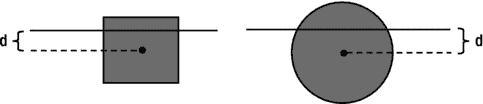

图 7-9。

Objects partially immersed in water

要做到这一点，首先定义一个参数`dr`是很方便的，它告诉你物体的中心在水面之上或之下多少，作为球的半径(或长方体的半高)的一部分。所以`dr`定义如下，其中 r 是物体的半高(等于球的半径):

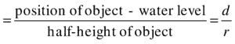

稍微思考一下应该就能让你相信，`dr`=–1 表示物体(不管是球还是长方体)刚好完全出水，`dr` = 1 表示刚好完全没入水中。因此，如果`dr`<=–1，`ratio`为零，如果`dr` > = 1，`ratio`为 1。更棘手的是当物体部分浸没在水中时。以长方体为例，简单的几何告诉我们(是的，你可以自己算出来):ratio = 0.5 + 0.5 dr

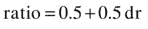

对于球体，计算起来要复杂一点(你需要做一点微积分)，但公式如下:ratio = 0.5+0.25 dr(3dr 2)

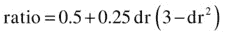

这就是我们所需要的。

代码中，球的体积`V`设为 1，质量也是 1。所以它的密度(等于质量/体积)是 1。水的密度设定为 1.5。所以，因为球的密度小于水的密度，所以会浮起来。

在`floating-ball.js`中，球的初始位置和速度给定如下:

`ball.pos2D = new Vector2D(50,50);`

`ball.velo2D = new Vector2D(40,-20);`

这使得球最初在水面上，并产生一个向上的速度分量和一个向右的分量。如果你运行这个代码，你会看到球在空中沿着一条曲线(抛物线)运动，直到它碰到水。然后，由于水中的阻力和上升推力，它突然减速，下沉一点，然后再次浮出水面，在水面上振荡，直到停止。仿真截图如图 [7-10](#Fig10) 所示。

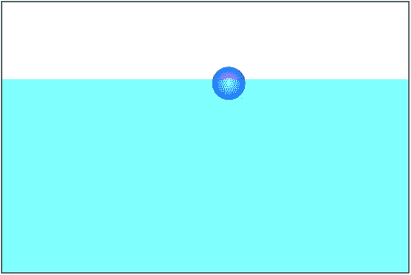

图 7-10。

A floating ball

这个模拟是如此的真实，你可以用它来做实验以了解其中的物理过程！点击水面上方的任何地方，将球移动到那里。然后把它放在水面上。它将落入水中，减速，上升，并在停止前再次在水面上振荡几次。你把它丢得越高，它就会沉得越深。现在点击水下并释放它。它将上升到表面，并在停止前再次振荡几次。

您还可以通过改变初始条件或参数值来进行试验。比如把球的质量改成 2，或者体积改成 0.5，这样密度就是 2。然后球会下沉而不是漂浮，因为它的密度大于水的密度，水的密度是 1.5。

想尝试不同的东西吗？如果球很轻会发生什么？试试看。通过将体积增加到 2，将密度减少到 0.5。当你在水下释放球时会发生什么？它射向空中，然后落回水中。如果你曾经试着用一个真实的球来做这件事，你会知道这是一个真实的效果。我们的模拟非常逼真，可以用来进行“虚拟实验”。我们甚至还没有注意到数字的准确性(我们将在本书的第四部分讨论)。

这个例子特别有启发性，因为它显示了包含相关物理的模拟如何表现得非常像真实生活中的真实事物。模拟知道如何处理初始条件或参数的任何变化，而不需要你告诉它更多的东西！这就是真实物理模拟的威力。它让你物有所值，可能比你想象的还要多——而且比造假容易多了！

### 终端速度

正如你在前面的例子中发现的，阻力的存在意味着上升或下降物体的速度不可能无限增加。为了理解为什么，考虑一个物体从高处(远离地面)释放并在重力作用下下落的情况。这个例子在第 4 章的[中讨论过，在第 5 章](04.html)的[中详细阐述过，但是现在你对阻力有了更多的了解，这里有必要回顾一下以获得更深的理解。特别是，前面的讨论是根据线性阻力公式进行的；了解结果如何推广到二次阻力，以及何时考虑上推力，是很有用的。](05.html)

在图 [7-11](#Fig11) 中，有一个向下的重力 W = mg 作用在物体上，还有一个向上的拖曳力 d。拖曳力的大小在非常低的速度下由 kv 给出，但通常由 kv 2 给出。最初物体的速度是零，所以阻力也是零。当它在重力作用下加速时，它的速度增加，因此阻力也增加。这将向下的合力减小到 W–D，从而减小加速度。因为重力是不变的，随着速度的增加，会有一个点，在这个点上拖曳力会和重力相等；换句话说，合力 W–D 为零，所以物体的加速度也为零。换句话说，它最终会以一个恒定的速度运动:终极速度。

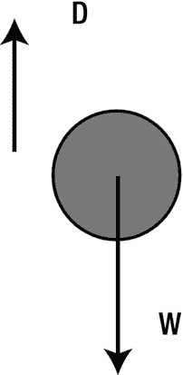

图 7-11。

Force balance giving rise to terminal velocity

如[第四章](04.html)所示，很容易算出终端速度的大小。这是 W–D = 0 时的 v 值。因为 W = mg，如果我们用 D = kv，我们得到这个:

以便

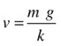

这是层流的极限速度。它适用于在高粘度流体(如石油)中运动的物体。

如果我们对更高的速度使用阻力定律，D = kv 2 ，我们反而得到

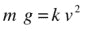

这就意味着

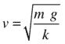

我们也可以通过用视重量 W 视 = (ρ 物体–ρ流体 ) V g 的绝对值代替重量 W = mg，将这些公式推广到包括上推(见图 [7-12](#Fig12) )

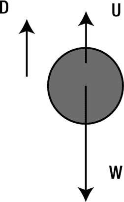

图 7-12。

Force balance with upthrust

如果你正在做一个模拟，其中物体达到终极速度非常快，你可以利用前面的公式，只给物体一个与终极速度相等的恒定速度。这将保持模拟的物理真实性(如果初始加速度不重要)，同时显著减少计算时间。例如，在水中上升的气泡达到极限速度非常快，如果除了重力、上推力和阻力之外没有其他力，就可以用这种方式模拟。

正如在第五章中所讨论的，一个物体在重力、上推力和阻力下的运动可以用微积分来解析求解，不仅可以给出最终速度，还可以给出任意时刻的速度。例如，对于在流体中静止下落的物体，假设线性阻力并忽略上推力，解析解由下式给出

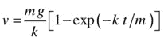

这给出了物体在 t 时刻下落后的速度。二次阻力和包括上升推力的解看起来有点复杂，你可以在物理教科书中找到。

### 示例:降落伞

降落伞的工作原理是利用阻力与物体面积成正比的事实。回到二次阻力 F =–kv v 的公式，用 k = 1/2 ρAC d 给出阻力常数 k，我们可以看到物体的面积越大，阻力就会越大。打开降落伞突然增加了暴露在空气中的表面积，从而增加了 k 值。这大大增加了阻力，因此使跳伞者减速。

我们目前的例子是说明这一原则的教育练习。看看`parachute.js`中的`init()`函数:

`function init() {`

`ball = new Ball(20,'#0000ff',m);`

`ball.pos2D = new Vector2D(650,50);`

`ball.velo2D=new Vector2D(0,0);`

`ball.draw(context);`

`setupGraph();`

`window.addEventListener('mousedown',openParachute,false);`

`t0 = new Date().getTime();`

`t = 0;`

`animFrame();`

`};`

这只是创建了一个`Ball`实例(代表一个跳伞者！)然后通过`animFrame()`和相关的运动代码以通常的方式制作它下落的动画。`calcForce()`方法增加了重力、上推力和阻力:

`function calcForce(){`

`var gravity = Forces.constantGravity(m,g);`

`var drag = Forces.drag(k,ball.velo2D);`

`var upthrust = Forces.upthrust(rho,V,g);`

`force = Forces.add([gravity, upthrust, drag]);`

`}`

此外，在`init()`中为`mousedown`事件设置了一个事件监听器。在相应的事件处理程序`openParachute()`中，降落伞的半径增加了一个等于`linearFactor`的因子(在代码中被赋予 3 的值)，阻力常数`k`的值增加了一个等于`linearFactor`的平方的因子(增加了 9)。然后删除事件侦听器。

`function openParachute(evt){`

`k *= linearFactor*linearFactor;`

`ball.radius *= linearFactor;`

`window.removeEventListener('mousedown',openParachute,false);`

`}`

这意味着当用户第一次点击鼠标时，降落伞会增大三倍(以半径计),阻力常数会增大九倍。最后在`setupGraph()`中设置一个`Graph`对象，在`init()`函数中调用，通过调用`move()`方法中的`plotGraph()`方法来绘制降落伞在每一时刻的速度的`vy`分量。

如果你现在运行这个代码(不打开降落伞)，你会发现降落伞开始加速很快，然后变得更慢，直到它在下落大约 10 秒后达到一个恒定的速度(极限速度)。终端速度的值大约是每秒 30 个像素。如果你点击“打开降落伞”，它将变得更大，并立即减速，在几秒钟内达到大约每秒 10 像素的新的更低的终端速度。无论何时打开降落伞，最终速度都是一样的:它与时间无关，只取决于降落伞的质量 m，重力加速度 g，以及阻力常数 k(通过公式)。图 [7-13](#Fig13) 显示了速度-时间图的典型形状。

图 7-13。

Velocity-time graph for a parachute

## 电梯

你看到了阻力取决于动压。还有一个力也依赖于动压，它叫做升力。更准确地说，是物体两侧的动态压力差造成了这些力。物体上的阻力与物体的速度方向相反，而升力则与速度方向垂直(见图 [7-14](#Fig14) )。现在，因为运动物体的前后总有一个动压差，所以运动物体上总有一个拖曳力。然而，如果一个物体沿运动方向的轴线完全对称，则该物体两侧的流量(以及动态压力)将完全相同。在这种情况下，没有升力。但是气流中的任何不对称——例如，由不对称的机翼形状(对于飞机)或迎角引起的不对称——都会产生垂直于运动方向的升力。

图 7-14。

Drag and lift force on an object moving in a fluid

升力使飞机能够飞行。在那种情况下，运动的方向通常是水平的，所以升力垂直向上作用，平衡了飞机的重量。但是升力并不总是垂直向上的。根据运动的方向，它可以向任何方向运动。

升力有时与上推力相混淆。事实上，上冲有时被误认为是升力。像上升一样，上升是因为压力差。上冲是由物体顶部和底部的静压力差引起的，静压力差是由被驱替流体的重量(浮力)引起的；但是升力是由物体沿其运动方向相对两侧的动态压力差引起的。这就造成了前面提到的两侧静压的差异。因此，尽管上升总是向上的(正如它的名字所暗示的)，但对升力来说却不一定如此。更重要的是，物理定律以及支配这两种力的公式完全不同。想想这个:升力是使飞机飞行的力量；上推力是使气球漂浮的力量；这两种情况下的机制是不同的。

### 升力系数

升力是用升力系数来模拟的，与二次阻力完全一样。因此，升力的大小可以写如下，其中 C L 是升力系数，A 是物体沿运动方向的面积(而不是像阻力一样垂直于运动方向):

像阻力系数 C d 一样，升力系数 C L 取决于多种因素。对于飞机来说，重要的变量是机翼形状和迎角。

正如我们对阻力所做的那样，我们可以定义一个升力常数 k = 1/2 ρAC L ，这样我们就可以把升力的大小写成 F = kv 2 。

升力的方向垂直于速度的方向。考虑到这一点，我们可以定义一个`Forces.lift()`函数如下:

`Forces.lift = function(k,vel) {`

`var force;`

`var velMag = vel.length();`

`if (velMag > 0) {`

`force = vel.perp(k*velMag);`

`}`

`else {`

`force = new Vector2D(0,0);`

`}`

`return force;`

`}`

### 例如:一架飞机

现在让我们来演示升力是如何使飞机飞行的。文件`airplane.js`包含基本飞行演示的代码。我们将在这里复制代码的关键部分。首先，看看变量声明/初始化和`init()`函数:

`var plane;`

`var m = 1;`

`var g = 10;`

`var kDrag = 0.01;`

`var kLift = 0.5;`

`var magThrust = 5;`

`var groundLevel = 550;`

`var t0,dt;`

`window.onload = init;`

`function init() {`

`makeBackground();`

`makePlane();`

`t0 = new Date().getTime();`

`animFrame();`

`};`

变量名应该是不言自明的。`makeBackground()`和`makePlane()`方法产生的视觉设置如图 [7-16](#Fig16) 所示。在`makePlane()`中，一架飞机被创建为`Plane`对象的实例，并被放置在初始速度为零的“跑道”上。欢迎您查看一下`plane.js`文件，看看`Plane`对象的代码是什么样子(如果您愿意，甚至可以对它进行改进！).但是视觉细节对我们目前的目的并不重要。真正重要的是如何让飞机飞起来。这是由`animFrame()`和相关方法发起的。这里唯一的新代码在`calcForce()`中。

如图 [7-15](#Fig15) 所示，飞机在飞行中主要受四种力:重力(W)、推力(T)、阻力(D)和升力(L)。当飞机在地面上时，还有地面产生的法向接触力。因此，`calcForce()`方法计算这些力并将它们相加:

`function calcForce(){`

`var gravity = Forces.constantGravity(m,g);`

`var velX = new Vector2D(plane.vx,0);`

`var drag = Forces.drag(kDrag,velX);`

`var lift = Forces.lift(kLift,velX);`

`var thrust = new Vector2D(magThrust,0);`

`var normal;`

`if (plane.y >= groundLevel-plane.height){`

`normal = gravity.multiply(-1);`

`}else{`

`normal = new Vector2D(0,0);`

`}`

`force = Forces.add([gravity, drag, lift, thrust, normal]);`

`}`

图 7-15。

The four forces on a airplane in flight

引力和往常一样简单明了。阻力和升力的计算方法很简单，只考虑飞机速度的水平分量。同样，假设飞机在任何时候都是水平的，迎角为零。推力被模拟为一个恒定的力。最后，当飞机在地面上时，法向力被设置为与重力大小相等方向相反，否则为零。

当你运行模拟时，你会看到飞机只有在获得足够高的速度以产生足够的升力来克服其重量时才会起飞(见图 [7-16](#Fig16) )。如果你把推力的大小减少到 3 或 4，飞机会沿着跑道移动，但永远不会起飞。在水平推力和阻力的作用下，它达到的最大水平速度(类似于极限速度)不足以产生足够的升力来克服其重量。

图 7-16。

Plane flying thanks to the lift force

重申一下，我们在这个例子中做了很多简化。我们将在最后一章建立一个更加完整和真实的飞行模拟器，在这一章中，我们还将更详细地研究飞机上的阻力、升力和推力。

## 风和湍流

风本身不是一种力，但它能产生力。风是空气的运动，它在空间和时间的每一点都有一个相关的速度。这可能相当复杂，但即使使用简单的风模型也可以实现相当真实的效果。一股持续的风吹过一个静止的物体，可以被看作是一个物体在空气中运动，只是方向相反。它以类似的方式产生阻力和升力。

### 风产生的力

正如你在本章开始时看到的，流动的流体有一个相关的动态压力。风只不过是流动的空气。当风吹在一个物体或表面上时，由于动态压力，它会施加一个力。

我们如何计算这个力？根据我们所说的，只有相对速度是重要的。因此，风施加的力正好是反方向的阻力，其中 w 是风速:

因此，我们可以使用阻力函数来模拟风，使用风速和负阻力常数 k。

### 风和阻力

当然，即使有风，在空气中运动的物体仍然会受到阻力。因此，由物体运动和空气(风)运动产生的净力将是阻力，以物体和空气之间的相对速度为参考。因此，风和阻力的合力由下式给出，其中| w–v |表示矢量(w–v)的大小:

注意| w–v |通常不等于 w 和 v 的幅度差(w–v)。

我们可以使用阻力函数，通过物体和空气之间的相对速度来计算风和阻力的综合影响。

### 稳定和湍流

我们现在知道了在给定风速的情况下，如何计算有风时物体所受的力。但是我们如何模拟风速 w 本身呢？

答案是，这取决于我们正在建模的情况。风的行为相当复杂，因为它随时间和空间而变化。风取决于复杂的大气条件以及建筑物和树木等障碍物。然而，在大多数情况下，你可能希望事情尽可能简单。所以我们将只讨论一些简单的风速建模方法。

最简单的风模型是假设速度 w 在空间和时间上都是恒定的。这相当于所谓的均匀稳定流动。一个稍微复杂一点的模型是假设一个水平恒定但随高度变化的稳定流(在时间上仍然恒定)。这个模型可以解释这样一个事实，即近地面的风速较低，越往上风速越高。

在现实世界中，风通常不是稳定的，而是由明显随机吹动的阵风组成。阵风产生所谓的湍流，这种湍流可以使事物以复杂的方式运动。

### 示例:稳定风中的气泡

在这个例子中，我们将模拟一个稳定均匀的风在空气中吹一些气泡。文件`bubbles-wind.js`包含代码。由于它与前面的示例略有不同(因为它涉及多个粒子)，我们在此完整复制代码:

`var canvas = document.getElementById('canvas');`

`var context = canvas.getContext('2d');`

`var bubbles; var t0;`

`var dt;`

`var force;`

`var acc;`

`var numBubbles = 10;`

`var g = 10;`

`var rho = 1;`

`var rhoP = 0.99;`

`var kfac = 0.01;`

`var windvel = new Vector2D(40,0);`

`window.onload = init;`

`function init() {`

`bubbles = new Array();`

`var color = 'rgba(0,200,255,0.5)';`

`for (var i=0; i<numBubbles; i++){`

`var radius = Math.random()*20+5;`

`var V = 4*Math.PI*Math.pow(radius,3)/3;`

`var mass = rho*V;`

`var bubble = new Ball(radius,color,mass,0,true);`

`bubble.pos2D = new Vector2D(Math.random()*canvas.width,Math.random()*canvas.height);`

`bubble.velo2D = new Vector2D((Math.random()-0.5)*20,0);`

`bubble.draw(context);`

`bubbles.push(bubble);`

`}`

`t0 = new Date().getTime();`

`animFrame();`

`};`

`function animFrame(){`

`requestAnimationFrame(animFrame,canvas);`

`onTimer();`

`}`

`function onTimer(){`

`var t1 = new Date().getTime();`

`dt = 0.001*(t1-t0);`

`t0 = t1;`

`if (dt>0.2) {dt=0;};`

`move();`

`}`

`function move(){`

`context.clearRect(0, 0, canvas.width, canvas.height);`

`for (var i=0; i<numBubbles; i++){`

`var bubble = bubbles[i];`

`moveObject(bubble);`

`calcForce(bubble);`

`updateAccel(bubble.mass);`

`updateVelo(bubble);`

`}`

`}`

`function moveObject(obj){`

`obj.pos2D = obj.pos2D.addScaled(obj.velo2D,dt);`

`obj.draw(context);`

`}`

`function updateAccel(mass){`

`acc = force.multiply(1/mass);`

`}`

`function updateVelo(obj){`

`obj.velo2D = obj.velo2D.addScaled(acc,dt);`

`}`

`function calcForce(particle){`

`var V = particle.mass/rhoP;`

`var k = Math.PI*particle.radius*particle.radius*kfac;`

`var gravity = Forces.constantGravity(particle.mass,g);`

`var upthrust = Forces.upthrust(rho,V,g);`

`var relwind = windvel.subtract(particle.velo2D);`

`var wind = Forces.drag(-k,relwind);`

`force = Forces.add([gravity, upthrust, wind]);`

`}`

在`init()`中，我们创建了许多气泡作为`Ball`物体，并给每个气泡一个随机的半径。(如果你有一台很慢的电脑，你可能想减少气泡的数量！)然后使用球体体积和气泡密度的公式计算它们的体积和质量，该公式指定为 0.99。气泡被赋予一个随机的位置和一个小的随机水平速度。然后它们被收集到一个数组中，然后在`move()`方法中使用该数组来依次将方法`moveObject(), calcForce(), updateAccel()`和`updateVelo()`应用于每个气泡。

在`calcForce()`方法中，三种力被计算并相加:重力、上推力和风(阻力)。上升推力是用每个气泡的体积来计算的，体积=质量/密度。为了计算风力，通过从风速`windvel`中减去气泡的当前速度来计算相对速度`relwind`，风速以恒定的水平向量给出。然后通过使用具有负阻力系数的`Forces.drag()`—`k`和相对速度作为自变量来计算风/阻力。注意`k`包括一个等于气泡投影面积的因子，考虑到拖曳力与物体的面积成比例。

如果你运行模拟，你会看到气泡顺着风向漂移，同时缓慢上升，如你所料(见图 [7-17](#Fig17) )。玩风速和其他参数，看看运动是如何修改的。

图 7-17。

Bubbles in a steady wind

### 模拟湍流

湍流是一种复杂的现象。事实上，它是如此复杂，以至于你需要带有数百个处理器的巨大超级计算机来精确计算湍流，即使是简单的配置。另一方面，有许多近似模拟湍流的方法。一个简单的方法是使用随机数。

通过在稳定的风场上叠加随机噪声，可以产生看起来像湍流的效果。这利用了湍流的统计特性，通常可以通过以下方式分解任何时间的风速来表示，其中 w 稳定是稳定部分，w 波动是捕捉湍流波动的时变部分:

稳定部分 w 稳定部分只是一个恒定矢量，正如我们在之前的气泡模拟中建模的那样。我们可以用一个向量来模拟 w 波动，这个向量的分量是在每个时间步长更新的随机数。要在 bubbles 模拟中做到这一点，只需在计算`relwind`的代码行之前添加以下代码行:

`windvel = new Vector2D(20 + (Math.random()-0.5)*1000,(Math.random()-0.5)*1000);`

我们这样做了，并将新文件保存为`bubbles-turbulence.js`。我们还在从`move()`调用的函数`showArrow()`中添加了一些代码来指示风矢量 w 的变化。代码在舞台中间产生一条线，沿着瞬时风向，长度与风速的大小成比例。

前面一行代码将风速 w 指定为以每秒 20 个像素的速度向右吹的稳定风矢量(20，0)和具有每秒–500 到 500 个像素的 x 和 y 分量的随机风矢量`(Math.random()-0.5)*1000,(Math.random()-0.5)*1000)`之和。舞台上所有位置的风速都相同。

尝试将这些值更改为您喜欢的值。稳定风的大小(此处设置为值 20)使气泡稳定漂移。波动的幅度(这里由因子 1000 设定)控制风的阵风并使气泡波动。你可以用这种方式产生一个相当令人信服的湍流效果。

## 摘要

本章介绍了许多作用在与其他固体或流体接触的固体上的力。如果你正在模拟地球上的几乎任何东西，很可能你需要模拟这些力。你在这一章学到的东西给了你一个坚实的基础，在此基础上你可以创建更复杂的效果和模拟。在最后一章，你将有机会使用这里解释的物理学来开发更完整的模拟。与此同时，在下一章中，你将了解到一种产生振荡(类似弹簧)运动的新型力。