# 八、回复力：弹簧和振动

弹簧是你会遇到的最有用的工具之一，尤其是用于创建有趣的物理效果。许多系统可以用弹簧和类似弹簧的运动来模拟。因此，学习弹簧运动的基本原理是值得的。但是要小心:春天会让人奇怪地上瘾！

本章涵盖的主题包括以下内容:

*   自由振荡:物体将在弹簧力的作用下振荡，也称为回复力。
*   阻尼振荡:阻尼消耗振荡的能量，使振荡随时间而消失。
*   强迫振荡:振荡可以由抵抗阻尼力的外力驱动。
*   耦合振荡器:使用多个弹簧和物体耦合在一起，可以产生有趣的效果。

## 弹簧和振动:基本概念

在讨论正弦波及其组合时，我们在第 3 章中介绍了振荡(参见“使用触发函数制作动画”一节)。振荡是围绕某一中心位置的重复运动。振荡系统的简单例子包括钟摆和秋千。

自然系统中也有大量的振荡现象:树木在风的吹拂下振荡，漂浮的物体在水面上振荡是因为经过的波浪。包括弹簧在内的人造机械会产生振动。因此，振荡和弹簧之间有一种直观的联系；事实上，我们将交替使用振荡和类似弹簧的运动这两个术语。这种联系不仅仅是口头上的:振荡系统通常可以用虚拟的“弹簧”来建模。

### 类似弹簧的运动

你已经在这本书里遇到了春天般的运动，可能还没有意识到。前一章中的浮球模拟提供了一个例子，其中球在水面上以类似弹簧的方式摆动。许多其他东西也经历类似弹簧的运动:汽车的悬挂装置；树、树枝和树叶在风中摇摆。其他东西，虽然它们不一定看起来像弹簧，但仍然可以使用弹簧建模:可变形的物体，如绳子、衣服和头发。当然，这些系统一定有一些共同的特征，使得它们可以用弹簧来建模。那么，振荡系统的一般特征是什么呢？

### 回复力、阻尼和作用力

振荡系统通常包括以下成分:

*   一个平衡位置，如果物体不运动，它将保持在这个位置。
*   如果物体发生位移，将物体拉回到平衡位置的恢复力。
*   随时间减少振荡的阻尼力。
*   将物体从平衡位置移开的驱动力。

其中，前两个是产生振荡的关键，而后两个可能存在，也可能不存在，这取决于系统。虽然更复杂的系统可能看起来没有这些特征，但它们可以由具有这些特征的组件组成(或由这些组件建模),例如，一根绳子可以表示为一串弹簧。

在理解恢复力、阻尼和作用力的作用时，一个相关的概念是振幅。振动的振幅是从平衡位置的最大位移。如果你把一个秋千拉离它的平衡位置，然后放开，初始位移将是振荡的振幅。

回复力随时间改变位移，但不改变振幅(最大位移)。振幅取决于系统中的能量大小。阻尼力从系统中带走能量，因此振幅随时间减小。如果在最初移动秋千之后，让它自己摆动，就会发生这种情况。驱动力将能量注入系统，因此倾向于增加振荡的振幅。当阻尼和强迫同时存在时，输入系统的能量有可能正好补偿阻尼损失的能量。在这种情况下，振幅随时间保持不变，就好像只有恢复力存在一样。在挥杆的例子中，这是通过用适当的力量定期推动挥杆来实现的。

### 胡克定律

在大多数振荡系统中，支配恢复力的力定律被称为胡克定律(因为一位名叫罗伯特·胡克的绅士在历史的某个时刻发现了它)。

胡克定律很简单。我们先解释弹簧，因为这是定律的原始形式。看一下图 [8-1](#Fig1) ，它显示了一个自然长度为 l 的弹簧，固定在一端，然后被拉伸 x，所以它的长度变成 l + x。

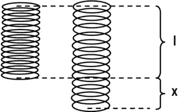

图 8-1。

A stretched spring experiences a restoring force proportional to the extension x

胡克定律表明，弹簧将被一个 F 级的力拉回，该力由下式给出:

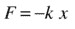

换句话说，回复力与延伸量 x 成比例。比例常数 k 称为弹簧常数，它是弹簧刚度的一个度量。k 值越大，对于给定的拉伸，力就越大，因此弹簧在拉伸时被拉回的力就越大。

负号表示力的方向与延伸方向相反。因此，如果弹簧被压缩，力会反推增加其长度。

方程的矢量形式是这样的，其中 r 被解释为弹簧自由端点的位移矢量:

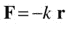

对于我们在这一章将要做的大部分事情(可能也是你想要做的)，我们不会太关心实际的春天。我们更感兴趣的是附在弹簧末端的质点的运动。这样一个物体会如何运动？每个孩子都知道，它会在平衡位置附近摆动。

事实上，我们可以完全去掉弹簧，只考虑恢复力对粒子的影响。这就是我们在很多例子中要做的。在这种情况下，虎克定律中的位移矢量 r 被解释为粒子相对于其振荡的平衡位置的位移，如图 [8-2](#Fig2) 所示。

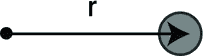

图 8-2。

A particle oscillating about an equilibrium position

在我们结束这一节之前，有一个警告:不应该假设所有的振荡都遵循胡克定律；许多人不知道。然而，许多类型的运动系统遵循胡克定律，至少近似如此。所以在这一章中我们将坚持胡克定律。

## 自由振荡

让我们从模拟自由振荡开始。这意味着，系统纯粹在恢复力的作用下振荡，没有任何其他的力。当然，对于一个要振荡的物体来说，首先一定有什么东西(一个施加的力)把它从平衡位置移开了。但是我们在这里感兴趣的是，在初始力被移除，振荡系统被留给它自己之后会发生什么。

### 弹簧力函数

首先，我们需要在`Forces`对象中为恢复力创建一个新的力函数。姑且称之为`spring()`。这是一个非常简单的功能:

`Forces.spring = function(k,r){`

`return r.multiply(-k);`

`}`

函数`spring()`有两个参数，分别是弹簧常数`k`和位移向量`r`(这只是前面公式中的向量 r)。它返回恢复力 F =–k r。

现在让我们用这个函数来创建一个基本振荡器。

### 创建基本振荡器

你知道接下来会发生什么，不是吗？下面是从文件`basic-oscillator.js`中提取的一些代码，该文件创建了一个对象，我们希望该对象作为名为`ball`的`Ball`对象进行振荡(我们省略了画布上的标准行和上下文变量)。我们实际上并没有创建一个弹簧(在视觉上)，而是创建了另一个`Ball`对象，我们称之为`attractor`，它的位置将是平衡位置。两者的初速度都是零，通过给它们不同的位置向量，它们被放置在一定距离之外`pos2D`:

`var ball;`

`var displ;`

`var center = new Vector2D(0.5*canvas.width,0.5*canvas.height);`

`var m = 1;`

`var kSpring = 1;`

`var t0, dt;`

`var acc, force;`

`var animId;`

`window.onload = init;`

`function init() {`

`// create a ball`

`ball = new Ball(15,'#0000cc',m,0,true);`

`ball.pos2D = new Vector2D(100,50);`

`ball.draw(context);`

`// create an attractor`

`var attractor = new Ball(2,'#000000');`

`attractor.pos2D = center;`

`attractor.draw(context_bg);`

`// make the ball move`

`t0 = new Date().getTime();`

`animFrame();`

`}`

动画代码相当标准；唯一的新颖之处在于`calcForce()`方法:

`function calcForce(){`

`displ = ball.pos2D.subtract(center);`

`force = Forces.spring(kSpring,displ);`

`}`

这段代码非常简单:它首先计算物体相对于吸引子的位移向量`displ`，然后用它来计算吸引子对物体施加的弹力。参数`kSpring`是弹簧常数 k。

运行代码，你会看到球在吸引子周围振荡，就像预期的那样。现在将弹簧常数值从 1 更改为 10。这给你一个硬弹簧。如果你再次运行代码，你会看到球摆动得更快了。如果你想让它以不同的振幅振荡，只需改变`basic-oscillations.js`中的初始位置。

接下来将 k 的值改回 1，然后将球的初速度改为(200，0):

`ball.velo2D = new Vector2D(200,0);`

当您运行代码时，您现在应该看到球以某种椭圆形轨迹“环绕”吸引子。有点像你在[第六章](06.html)看到的重力。重力和弹力都是吸引力，总是作用在一个点上。但是重力随着距离的增加而减小，而弹力随着距离的增加而增加。这是因为重力与 1/r 2 成正比，而弹力与 r 成正比，其中 r 是与引力中心的距离。

### 简谐运动

你刚才看到的这种振荡运动在技术上被称为简谐运动(SHM)。如果作用在物体上的唯一力是弹簧力，物体就会经历 SHM，就像前面的例子一样。

因为 SHM 中唯一的力是回复力 F =–k r，而牛顿第二定律表明 F = m a，所以这两个方程一起告诉我们，对于 SHM，以下是正确的:

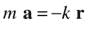

将等式两边除以 m 得出:

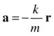

这里 m 是振荡粒子的质量，k 是弹簧常数，所以比率 k/m 是常数。因此，这个方程告诉我们，振动粒子的加速度与它离中心的位移矢量成正比。比例常数为负，这意味着加速度总是与位移矢量相反(它总是指向中心，因为位移矢量根据定义总是指向远离中心的方向)。参见图 [8-3](#Fig3) 。

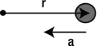

图 8-3。

The acceleration in SHM always points toward the center, opposite to displacement

还记得在第三章第一节中，我们谈到了导数，加速度是位移的二阶导数吗？这意味着以下情况成立:

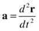

因此，我们可以将 SHM 方程 a =–(k/m)r 写成等价形式:

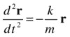

以这种方式表述清楚了支配 SHM 的方程是一个二阶微分方程，如第 5 章中所述。`basic-oscillator.js`中的动画代码所做的就是使用欧拉格式数值求解这个二阶微分方程(再次如[第五章](05.html)所述)。

事实上，前面的微分方程也可以解析求解，以给出作为时间函数的位移公式。这是大学水平微积分中的一个练习题，下面是解法，其中 A 和 B 是依赖于初始条件的常矢量，ω是振荡的角速度(见[第三章](03.html)):

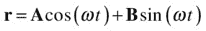

因此，SHM 由正弦和余弦函数组成。这并不奇怪，因为 SHM 基本上是一种振荡运动，正如你从第 3 章中所知，sin 和 cos 是振荡函数。ω的值决定了振动的频率和周期，而 A 和 B 的值决定了振动的振幅(物体从平衡位置的最大位移)。

稍微懂点微积分的人，都可以通过对前面的 r 的表达式求导，立刻写下速度向量 v，因为 v = d r/dt。结果是这样的:

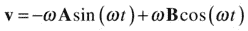

A、B 和ω的值分别是多少？a 和 B 由您在开始时为对象的位移和速度指定的初始条件设定(时间 t = 0 时的 r 和 v 值)。我们称初始位移矢量 r 0 和初始速度矢量 v 0 。如果我们现在将 t = 0 代入前面的 r 和 v 方程，因为 cos(0) = 1，sin(0) = 0，我们得到:

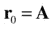

我们还得到以下信息:

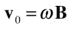

这马上告诉我们，A = r 0 和 B = v 0 /ω。

如果你要解这个微分方程，你也会发现角速度ω实际上是由这个公式给出的:

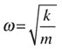

这称为系统的固有频率。如果给振荡系统一个初始扰动(使物体离开其平衡位置)，但此后任其自生自灭，它将以该频率振荡，并且仅在没有阻尼等其他影响的情况下以该频率振荡。

现在，如果您还记得(再次从[第 3 章](03.html))ω= 2πf 和 f = 1/T，其中 f 是频率(每秒的振荡次数)，T 是振荡周期(完成一次振荡的时间)，您可以使用前面的公式根据参数 k 和 m 获得振荡的频率和周期:

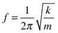

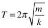

这些公式告诉你，如果你增加弹簧刚度 k，振荡的频率将增加，其周期将减少(它将振荡得更快)。如果你增加振荡粒子的质量，情况会相反，它会振荡得更慢。去试试吧！

这是仅有的两个影响频率和周期的参数；物体的初始位置和速度不变。你可能会想，如果物体最初离中心较远，完成一次摆动就需要更长的时间。但不是和 SHM。发生的情况是，如果物体离得更远，它在开始时会经历更大的加速度，因此平均来说，它会获得更大的速度，这补偿了它完成一次振荡所必须行进的更长的距离。怀疑？尝试用秒表计时振荡或输出时间。

事实上，我们可以做得更好。让我们画一张图表。

### 振荡和数值精度

为了绘制图表，我们通过改变振荡物体的初始位置来修改`basic-oscillations.js`,如下所示:

`object.pos2D = new Vector2D(100,50);`

我们也改变吸引子的位置:

`var center = new Vector2D(0.5*canvas.width,50);`

在添加了一些额外的代码来绘制显示对象相对于时间的位移的图形，并在固定的持续时间(20 秒)内运行模拟之后，我们将文件保存为`free-oscillations.js`。

下面是设置和绘制图表的代码:

`function setupGraph(){`

`//graph= new Graph(context,xmin,xmax,ymin,ymax,xorig,yorig,xwidth,ywidth);`

`graph = new Graph(context_bg,0,20,-250,250,50,300,600,300);`

`graph.drawgrid(5,1,50,50);`

`graph.drawaxes('t (s)','displacement (px)');`

`}`

`function plotGraph(){`

`graph.plot([t], [displ.x], '#ff0000', false, true);`

`graph.plot([t], [displ.y], '#0000ff', false, true);`

`}`

在每个时间步调用的`plotGraph()`方法调用`Graph`的`plot()`方法来绘制球相对于吸引子的位移的 x 和 y 坐标。

如果您现在运行代码，您将看到类似图 [8-4](#Fig4) 的内容。果然，物体随时间的水平位移(x)是一个正弦波，我们在上一节已经说过了。由于我们选择的初始条件，垂直位移始终为零。但是很容易改变它，给物体一个速度的初始垂直分量，或者一个不同的初始垂直位置。那么 y 位移也将正弦变化。你也可以改变 k、m 的值和物体的初始位置，以验证我们在上一节结束时所做的关于振荡的频率和周期如何随这些参数变化(或不变化)的陈述。

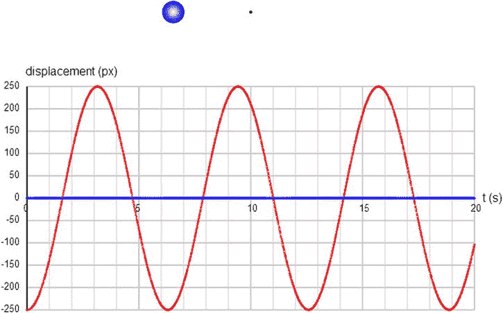

图 8-4。

Plotting the displacement of an oscillating object as a function of time

现在，让我们通过将振荡物体的轨迹与上一节给出的解析解预测的轨迹进行比较，来看看我们的模拟有多精确。

为此，我们首先通过改变振荡物体的初始速度将`free-oscillations.js`修改为`free-oscillations2.js`，如下所示:

`object.velo2D=new Vector2D(0,50);`

然后我们添加代码，使用之前给出的等式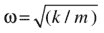、A = r 0 和 B = v  0  /ω计算 A、B 和ω的值(在代码中定义为变量`A`、`B`和`omega`)。这是在`init()`方法中完成的，因此它包含这些附加行:

`omega = Math.sqrt(kSpring/m);`

`A = ball.pos2D.subtract(center);`

`B = ball.velo2D.multiply(1/omega);`

然后，我们修改代码，创建两个`Graph`对象`graphX`和`graphY`(通过适当修改的`setupGraph()`方法建立)，在`plotGraph()`中分别绘制 x 和 y 位移。在`plotGraph()`方法中，我们插入以下附加行来绘制解析解 r = A cos (ωt) + B sin (ωt)的 x 和 y 分量:

`var r = A.multiply(Math.cos(omega*t)).add(B.multiply(Math.sin(omega*t)));`

`graphX.plot([t], [r.x], '#00ff00', false, true);`

`graphY.plot([t], [r.y], '#ff00ff', false, true);`

如果您现在运行代码，您将看到对象以拉长的轨道围绕吸引子运行，并且您将看到对象的每个水平和垂直位移的一对图形。在每对图表中，一个对应于通过指定公式计算的解析解，而另一个对应于通过模拟计算的数值解。你可以看到它们彼此非常接近，几乎重叠(见图 [8-5](#Fig5) )。欧拉积分在这种情况下做得还不错。

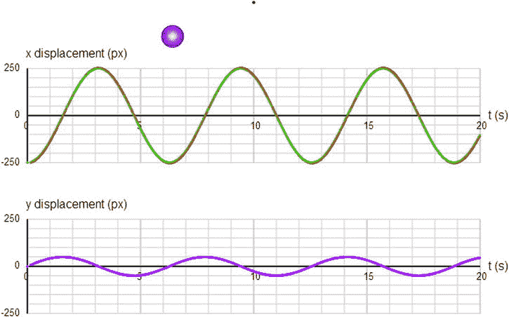

图 8-5。

Comparing the numerical and analytical solutions for the oscillator

然而，如果您现在将`kSpring`的值更改为`20`，例如，使“弹簧”更硬，对象移动更快，您会看到两者之间的差异更显著，表明欧拉正在失去准确性。如果你尝试让`kSpring`的值大于大约`100`，那么你可能会发现欧拉给出的完全是垃圾，物体在错误的时间出现在错误的地方。所以在这里你开始看到，如果你不小心对待你的积分器，你可能会得到错误的物理结果，特别是在弹簧的情况下。你会在[第 14 章](14.html)中看到如何克服这个问题。同时，在本章的其余部分，我们将避免非常高的弹簧常数值。

## 阻尼振荡

在前面的例子中，振荡会一直持续下去。实际上，这种情况很少发生。振荡系统通常是阻尼的。这意味着随着能量从系统中移除，振荡会减少并及时消失。这类似于曳力，它耗散了运动物体的动能，使其减速。为了在弹簧中实现阻尼，我们需要一个阻尼力。

### 阻尼力

阻尼力通常被建模为与运动物体的速度成比例。这意味着，在任何时刻，它由下式给出，其中 c 是一个称为阻尼系数的常数，负号表示力的方向与速度相反:

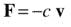

请注意，这与线性阻力的力定律的形式完全相同。因此，我们可以使用`linearDrag()`函数来实现弹簧运动的阻尼。然而，尽管阻力确实是阻尼的一种形式，但它并不是阻尼的唯一形式，尽管这两个术语有时可以互换使用。阻力是流体对浸入其中的运动物体施加的阻力。另一方面，弹簧阻尼可由流体阻力或外部摩擦等外部因素引起，或由弹簧的分子材料特性引起的内部因素如内部摩擦引起。事实上，你可以同时拥有由弹簧阻力产生的内部阻尼和由流体阻力产生的阻力(当然，系数不同)。例如，悬挂在弹簧上并在空气或水等流体中振荡的质量既受到内部摩擦，又受到流体阻力。出于这些原因，我们更喜欢为阻尼创建一个单独的函数。该函数的形式与`linearDrag()`的形式相同，如清单所示:

`Forces.damping = function(c,vel){`

`var force;`

`var velMag = vel.length();`

`if (velMag>0) {`

`force = vel.multiply(-c);`

`}`

`else {`

`force = new Vector2D(0,0);`

`}`

`return force;`

`}`

### 阻尼对振荡的影响

我们现在将修改`free-oscillations.js`来处理弹簧力之外的阻尼。新档名为`damped-oscillations.js`，基本上引入了一个新的力:阻尼。因此，与`free-oscillator.js`的一个不同之处在于，它声明了一个阻尼系数`cDamping`，并给它赋值:

`var cDamping = 0.5;`

另一个不同点是，它在`calcForce()`中包含了一个阻尼力，并将其与弹簧力相加，计算出合力:

`function calcForce(){`

`displ = ball.pos2D.subtract(center);`

`var restoring = Forces.spring(kSpring,displ);`

`var damping = Forces.damping(cDamping,ball.velo2D);`

`force = Forces.add([restoring, damping]);`

`}`

就这样。如果你用`kSpring = 10`和`cDamping = 0.5`运行代码，你会看到如图 [8-6](#Fig6) 所示的东西。正如你所料，振荡会及时消失，物体最终会停留在平衡位置。

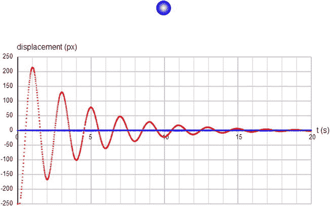

图 8-6。

Damped oscillations

此时，你应该摆弄一下阻尼常数`cDamping`，看看你得到了什么。选择一个较低的值，你会看到振荡持续更长时间，而一个较高的值会更快杀死它们。你可能认为 c 值越大，物体停止的越快。事实上，存在一个临界值 c，使振荡在最短时间内消失。在这个值下，根本没有振荡。物体只是平稳地移动到平衡位置，而不会振荡超过它。这称为临界阻尼，如图 [8-7](#Fig7) 所示。对于我们模拟中的`kSpring` = 10，`cDamping`的临界值约为 5.5，物体在 1.5 秒左右到达平衡位置。如果你增加`cDamping`超过这个临界值，例如增加到 10 或 20，你会看到物体实际上需要更长的时间到达它的平衡位置。这是因为增加的阻尼使它慢了下来，尽管它没有超过平衡位置，但需要更长的时间才能到达。临界阻尼是一种非常有用的现象，应用于门上的阻尼机构。

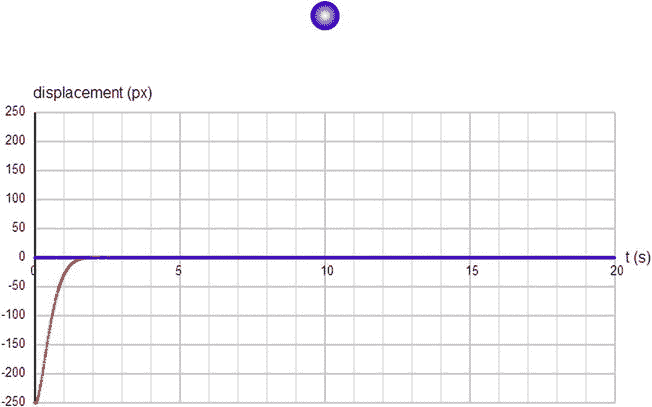

图 8-7。

Critical damping

### 有阻尼振荡的解析解

这个简短的部分是为爱好者准备的。如果你不喜欢复杂的公式，你可以放心地跳过它。本节的重点是向您展示在阻尼存在的情况下，前面引用的自由振荡的解析解是如何变化的，以及我们的模拟在再现它方面做得有多好。因此，它的教育意义大于实用性。

在弹簧力 F =–k r 和阻尼力 F =–c v 的作用下，振动的牛顿第二定律如下:

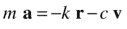

这可以用导数的形式写成(两边除以 m 之后):

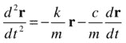

该微分方程的解析解由下式给出:

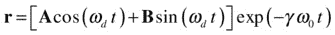

其中常数γ，ω 0 ，ω d ，A 和 B 由下式给出:

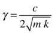

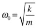

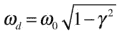

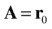

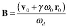

将此与之前无阻尼的解决方案进行比较，您会注意到 r 的表达式中有一个额外的指数因子，这是正弦振荡衰减的原因(参见[第 3 章](03.html))。新参数γ是由阻尼引起的。在没有阻尼的情况下，c = 0，所以γ= 0；于是，解就减少到没有阻尼的情况。还要注意，振荡的角频率现在是ω d (因为它出现在正弦和余弦曲线中)，小于没有阻尼时的固有频率ω 0 (之前用ω表示)。

我们将这些方程编码成我们称之为`damped-oscillations2.js`的`free-oscillations.js`的修改版本。如果你愿意，可以看一下代码。如果你运行代码，你会发现这个解析解和模拟计算的数值解之间又有一些差异。事实上，有时你可能会发现摆动的物体看起来很疯狂，最终停在了它不应该在的地方。从所有这些中得到的重要信息是，除了最简单的运动之外，欧拉积分在这种模拟中根本没有用。在[第 14 章](14.html)中，我们将讨论解决这个问题的替代集成方案。

## 强迫振荡

在阻尼存在的情况下，系统的振荡会及时消失。因此，首先需要一个力来维持振荡或引发振荡。这就是所谓的驱动力或压力。

### 驱动力

驱动力可以是任何形式，所以让我们简单地用 f (t)来表示。这仅仅意味着力是时间的函数，而没有具体说明力定律的形式。

例如，我们可以有一个形式为 f = A cos (ωt) + B sin (ωt)的周期力，其中 A 和 B 是给出力的振幅(最大值)和方向的恒定矢量，ω是力的角频率。例如，这可以表示一个振荡器与另一个振荡器相互作用并驱动另一个振荡器，如周期性的风吹过吊桥并导致其振动。

先说个例子。

### 示例:周期性驱动力

我们从修改`damped-oscillations2.js`开始。我们不想在这里画出解析解，所以我们去掉了`plotGraph()`中的相关行，但是我们将保留在`init()`方法中计算`gamma`、`omega0`和`omegad`的三行。这些变量对应于常数γ、ω 0 和ω d 。删除任何不必要的变量声明后，我们将文件重命名为`forced-oscillations.js`。

记住`omega0` (ω 0 是无阻尼系统的固有角频率，`omegad` (ω d )是有阻尼的角频率。让我们从给`calcForce()`添加以下几行开始:

`var forcing = new Vector2D(200*Math.cos(2*omegad*t)+200*Math.sin(2*omegad*t),0);`

`force = Forces.add([restoring, damping, forcing]);`

这增加了一个形式为 f = A cos (ωt) + B sin (ωt)的驱动力，其中 A 和 B 的幅度均为 200，并且在 x 方向上(我们需要相当大的值才能看到对振荡的作用力的显著差异)，ω = 2 ω d 。因此，我们以两倍于阻尼系统频率的角频率，对系统施加随时间呈正弦变化的驱动力。

运行代码，你会看到振荡开始消失，就像没有外力时一样。然后，过了一会儿，物体开始以两倍于之前的频率振荡，但是振幅要小得多。这种情况会无限期持续下去。因此，正弦驱动力的作用是最终使系统以驱动频率振荡(尽管振幅减小)，而不是以系统自己喜欢的频率振荡。你可以用不同的强制频率来尝试。例如，如果使用ω d /2，阻尼系统频率的一半，振荡的频率最终将是初始非受迫频率的一半。结论是，如果你强迫一个系统以不同于其固有频率的频率振荡，它仍然会振荡，但振幅会减小。

现在，通过将强制向量修改为以下形式，使强制频率恰好等于ω d :

`var forcing = new Vector2D(200*Math.cos(omegad*t)+200*Math.sin(omegad*t),0);`

当您运行代码时，您会看到振荡很快在原始频率ω d 处达到平衡，并保持较大的恒定振幅而不衰减。这个系统现在是“快乐的”,因为它被强迫以它喜欢的频率振荡。因此，它很快稳定下来，并以大幅度振荡。因此，虽然阻尼降低了系统的能量，但强迫将能量放回系统并维持振荡。

当强迫频率等于振荡系统的固有频率时，我们就有了所谓的共振。它发生在很多情况下，从推动孩子的秋千到调整无线电电路。共振也会产生不良影响，比如周期性阵风引起的桥梁有害振动。事实上，阵风引起的共振是 1940 年华盛顿塔科马海峡大桥倒塌的罪魁祸首。

### 示例:随机驱动力

接下来，我们来试试随机强制。这就像替换一行代码一样简单。让我们先试试这个:

`var forcing = new Vector2D(1000*Math.random(),0);`

这将在 x 轴正方向(向右)施加高达 1，000 个单位的随机力。如果这是唯一的力，它会使物体向右飞去，再也看不见了。但是回复力的存在(顾名思义)将物体拉回到吸引子。事实上，因为恢复力与吸引子的位移成正比，物体移动得越远，被拉回的力就越大。这创造了一个有趣的效果，你肯定想尝试一下。因为我们使力只作用于右边，所以物体大部分时间都在吸引子的右边，尽管偶尔会被稍微拉向左边。

要使吸引子周围的振荡更加对称，只需将该行代码改为:

`var forcing = new Vector2D(1000*(Math.random()-0.5),0);`

这会产生一个 x 分量在–500 和+500 之间的随机力，其中负号表示力指向左侧而不是右侧。运行代码，你会得到一个非周期振荡器(物体无规律地振荡)。

最后，通过将同一行代码修改为以下内容，让物体在 2D 的随机力的作用下振动:

`var forcing = new Vector2D(1000*(Math.random()-0.5),1000*(Math.random()-0.5));`

如果你运行代码，你会看到系统很快进入一种状态，其中 x 和 y 方向的振荡幅度相当，物体在吸引子周围盘旋(见图 [8-8](#Fig8) )。在每个时间步长，对象被踢向不同的方向，但也会被拉向吸引子。不管作用力有多大，它都不能逃脱，因为它走得越远，被拉回来的力就越大。这是一个有趣的效果。这是某种疯狂的随机轨道运动。或者甚至像蜜蜂在花周围嗡嗡叫。一定要玩那个！

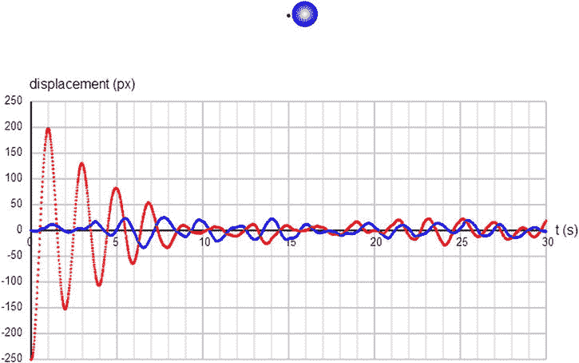

图 8-8。

Oscillator with random forcing

### 重力作为驱动力:蹦极

现在让我们来看一些不同的东西:蹦极！有人从桥上或类似的建筑上跳下来，绳子的另一端系在建筑上的固定支架上。弹力绳有一个自然的未拉伸长度，比如说`cordLength`。因此，如果跳线与固定支架的距离小于`cordLength`，则重力和阻力是跳线上仅有的力。但是一旦这个距离超过`cordLength`，弹性(弹簧)力就会生效，将跳线拉回。

所以这里重力作为驱动力，所以 f(t) = mg，这里 m 是 jumper 的质量。这是一种持续的压力，不像之前讨论的那种压力。主要的阻尼机制是由空气中的阻力提供的，因此可以使用`Forces.drag()`方法来实现。最后，仅当跳线与固定支架的距离超过电线的自然未拉伸长度`cordLength`时，才施加弹簧力。这个距离最初可能小于`cordLength`(在跳跃者从一些支撑结构上跳下之前)，但也可能在跳跃者跳回足够高的时候。

因为这个例子与前几个有一点不同，我们将列出完整的源代码，然后讨论要点。该文件简称为`bungee.js`:

`var canvas = document.getElementById('canvas');`

`var context = canvas.getContext('2d');`

`var jumper;`

`var fixedPoint;`

`var displ = new Vector2D(0,0);`

`var center = new Vector2D(0.5*canvas.width,50);`

`var mass = 90;`

`var g = 20;`

`var kDamping = 0.02;`

`var kSpring = 25;`

`var cordLength = 100;`

`var t0, dt;`

`var acc, force;`

`var animId;`

`window.onload = init;`

`function init() {`

`// create a bungee jumper`

`jumper = new StickMan();`

`jumper.mass = mass;`

`jumper.pos2D = center;`

`jumper.draw(context);`

`// create a fixedPoint`

`fixedPoint = new Ball(2,'#000000');`

`fixedPoint.pos2D = center;`

`fixedPoint.draw(context);`

`// make the ball move`

`t0 = new Date().getTime();`

`animFrame();`

`};`

`function animFrame(){`

`animId = requestAnimationFrame(animFrame,canvas);`

`onTimer();`

`}`

`function onTimer(){`

`var t1 = new Date().getTime();`

`dt = 0.001*(t1-t0);`

`t0 = t1;`

`if (dt>0.2) {dt=0;};`

`move();`

`}`

`function move(){`

`context.clearRect(0, 0, canvas.width, canvas.height);`

`drawSpring(jumper);`

`moveObject(jumper);`

`calcForce(jumper);`

`updateAccel();`

`updateVelo(jumper);`

`}`

`function drawSpring(obj){`

`fixedPoint.draw(context);`

`context.save();`

`if (displ.length() > cordLength){`

`context.lineStyle = '#999999';`

`context.lineWidth = 2;`

`}else{`

`context.lineStyle = '#cccccc';`

`context.lineWidth = 1;`

`}`

`context.moveTo(center.x,center.y);`

`context.lineTo(obj.x,obj.y);`

`context.stroke();`

`context.restore();`

`}`

`function moveObject(obj){`

`obj.pos2D = obj.pos2D.addScaled(obj.velo2D,dt);`

`obj.draw(context);`

`}`

`function calcForce(obj){`

`displ = obj.pos2D.subtract(center);`

`var gravity = Forces.constantGravity(mass,g);`

`var damping = Forces.drag(kDamping,obj.velo2D);`

`var extension = displ.subtract(displ.unit().multiply(cordLength));`

`var restoring;`

`if (displ.length() > cordLength) {`

`restoring = Forces.spring(kSpring,extension);`

`}else{`

`restoring = new Vector2D(0,0);`

`}`

`force = Forces.add([gravity, damping, restoring]);`

`}`

`function updateAccel(){`

`acc = force.multiply(1/mass);`

`}`

`function updateVelo(obj){`

`obj.velo2D = obj.velo2D.addScaled(acc,dt);`

`}`

请注意，我们在这里创建了两个对象:一个固定点和一个跳线。jumper 是`StickMan`的一个实例，一个男人的穷人版，欢迎你通过编辑文件`stickman.js`来改进。

首先，注意我们为弹簧常数`kSpring` (25)使用的大值。这是因为我们在`bungee.js`中将跳线的质量指定为 90，而不是之前所有模拟中的 1。这反映了一个事实，如果你想让一个大家伙在一根弹性绳索的末端摆动，绳索最好是相当硬的！

接下来看看`calcForce()`方法，我们看到我们包括了重力、阻尼和回复力，如前所述。前两个通常以简单的方式实现。与前面的例子相比，我们计算恢复力的方法有两个不同之处。首先，必须用来计算回复力的位移矢量现在是弹性索(延伸部分)端点的位移矢量，正如本章开头所解释的，而不是物体离开固定支座的位移。因此，我们首先在下面一行中计算作为向量的延伸:

`var extension = displ.subtract(displ.unit().multiply(cordLength));`

请注意对新添加到`Vector2D`对象中的`unit()`方法的巧妙使用，其中`vec.unit()`返回一个长度为`unit`的向量，其方向为向量`vec`。

然后我们提供`extension`作为`Forces.spring()`中的第二个参数。

第二个区别是，只有当物体离支撑物的距离大于绳子的长度时，回复力才不为零。那就等于说`displ.length() > cordLength`。这解释了`if`块中的代码:

`if (displ.length() > cordLength) {`

`restoring = Forces.spring(kSpring,extension);`

`}else{`

`restoring = new Vector2D(0,0);`

`}`

另一个新特性是我们包含了一个在`move()`方法中调用的`drawSpring()`方法，该方法在每个时间步长绘制一条线来表示弹性线。当绳子不拉伸时，线被拉得越来越细，越来越模糊。像往常一样，运行代码并随意使用参数。物体的初始位置与固定支撑的位置相同。这使得物体沿垂直直线振荡(这使得振荡 1D)。要使其成为 2D，只需在`bungee.js`中改变物体的初始 x 坐标即可；例如:

`object.pos2D = new Vector2D(300,50);`

演示的截图如图 [8-9](#Fig9) 所示。

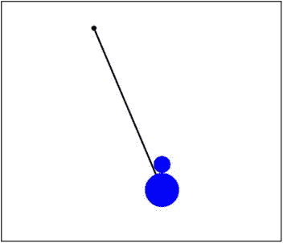

图 8-9。

A bungee jump simulation

### 示例:用户交互的驱动力

用户交互也可以被视为某种强迫。在下面的例子中，我们将构建一个模拟，其中用户可以单击并拖动对象，然后在任何位置释放它。这将扰乱系统，使其振荡。

修改蹦极模拟来做我们想要的事情是相当简单的。我们将把这个新文件称为`dragging-oscillations.js`。在其他修改中，我们将对象的质量更改为 1，并添加代码以支持拖动。如果您想了解如何做到这一点，请查看该文件——对于我们目前的目的来说，细节并不特别有趣。这里的要点是，代码更改使您，即用户，能够随时通过拖动和释放对象来施加驱动力。因此，这种强迫不是由一个数学函数确定的，而是人类随机互动的产物。

然而，正如`calcForce()`方法所反映的那样，基本的物理原理并没有改变:

`function calcForce(obj){`

`displ = obj.pos2D.subtract(center);`

`var gravity = Forces.constantGravity(mass,g);`

`var damping = Forces.drag(kDamping,obj.velo2D);`

`var extension = displ.subtract(displ.unit().multiply(springLength));`

`var restoring = Forces.spring(kSpring,extension);`

`force = Forces.add([gravity, damping, restoring]);`

`}`

在`calcForce()`中，我们像以前一样包括重力，同时使用`Forces.damping()`函数包括阻尼。然后，我们计算弹簧的伸长量，并像之前一样将其输入回复力。然而，因为这是一个也可以被压缩的弹簧，而不是一个弹性绳，所以即使伸长量为负，我们也会施加回复力，所以我们已经删除了前面蹦极例子中的`if`语句。

运行代码，你会看到物体在重力作用下下落，然后又被弹簧拉回来，由于阻尼作用，物体的振动幅度减小。如果你拖动物体并释放它，由于外力的作用，它会再次振荡。

## 耦合振荡器:多个弹簧和物体

到目前为止，在所有的例子中，我们只考虑了一个物体和弹簧系统。当您将多个对象和弹簧系统耦合在一起时，效果会变得更加有趣。事实上，您可以基于质量由弹簧连接的对象创建扩展系统。在下一小节中，您将看到一个可以做什么的示例。然后我们将在第十三章中看到更复杂的例子。

### 示例:由弹簧连接的对象链

你将创建的东西如图 [8-10](#Fig10) 所示:由弹簧连接的许多球，第一个球连接到一个支架上。然后支架会四处移动，导致悬浮球链也四处移动。

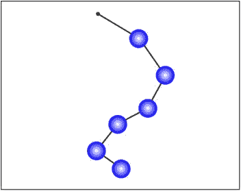

图 8-10。

A chain of objects held together by springs

将要建模的力包括重力、阻尼和恢复力。弹簧将有一个自然的长度，就像最后两个例子一样。因此，每个球都会受到重力、阻尼、上方弹簧产生的回复力和下方弹簧产生的回复力的作用(最后一个球除外)。弹簧本身将被假定为无质量的。

代码在一个名为`coupled-oscillations.js`的文件中。我们首先列出变量声明和`init()`函数:

`var canvas = document.getElementById('canvas');`

`var context = canvas.getContext('2d');`

`var balls;`

`var support;`

`var center = new Vector2D(0.5*canvas.width,50);`

`var g = 20;`

`var kDamping = 0.5;`

`var kSpring = 10;`

`var springLength = 50;`

`var numBalls = 6;`

`var t0, t, dt;`

`var acc, force;`

`var animId;`

`window.onload = init;`

`function init() {`

`// create a support`

`support = new Ball(2,'#000000');`

`support.pos2D = center;`

`support.draw(context);`

`// create a bunch of balls`

`balls = new Array();`

`for (var i=0; i<numBalls; i++){`

`var ball = new Ball(15,'#0000ff',1,0,true);`

`ball.pos2D = new Vector2D(0.5*canvas.width,100+60*i);`

`ball.pos2D = new Vector2D(0.5*canvas.width+60*i,100+60*i);`

`ball.draw(context);`

`balls.push(ball);`

`}`

`// make the balls move`

`t0 = new Date().getTime();`

`t = 0;`

`animFrame();`

`}`

和前面两个例子一样，我们首先创建一个`Ball`对象作为支撑。然后我们创建一大堆`Ball`对象，并将它们放入一个名为`balls`的数组中。

我们对代码的动画部分做了一些结构上的修改，为了便于参考，我们也在这里完整地复制了这些修改:

`function animFrame(){`

`animId = requestAnimationFrame(animFrame,canvas);`

`onTimer();`

`}`

`function onTimer(){`

`var t1 = new Date().getTime();`

`dt = 0.001*(t1-t0);`

`t0 = t1;`

`if (dt>0.2) {dt=0;};`

`t += dt;`

`move();`

`}`

`function move(){`

`context.clearRect(0, 0, canvas.width, canvas.height);`

`drawSpring();`

`for (var i=0; i<numBalls; i++){`

`var ball = balls[i];`

`moveObject(ball);`

`calcForce(ball,i);`

`updateAccel(ball.mass);`

`updateVelo(ball);`

`}`

`}`

`function drawSpring(){`

`support.draw(context);`

`context.save();`

`context.lineStyle = '#999999';`

`context.lineWidth = 2;`

`context.moveTo(center.x,center.y);`

`for (var i=0; i<numBalls; i++){`

`var X = balls[i].x;`

`var Y = balls[i].y;`

`context.lineTo(X,Y);`

`}`

`context.stroke();`

`context.restore();`

`}`

`function moveObject(obj){`

`obj.pos2D = obj.pos2D.addScaled(obj.velo2D,dt);`

`obj.draw(context);`

`}`

`function calcForce(obj,num){`

`var centerPrev;`

`var centerNext;`

`if (num > 0){`

`centerPrev = balls[num-1].pos2D;`

`}else{`

`centerPrev = center;`

`}`

`if (num < balls.length-1){`

`centerNext = balls[num+1].pos2D;`

`}else{`

`centerNext = obj.pos2D;`

`}`

`var gravity = Forces.constantGravity(obj.mass,g);`

`var damping = Forces.damping(kDamping,obj.velo2D);`

`var displPrev = obj.pos2D.subtract(centerPrev);`

`var displNext = obj.pos2D.subtract(centerNext);`

`var extensionPrev = displPrev.subtract(displPrev.unit().multiply(springLength));`

`var extensionNext = displNext.subtract(displNext.unit().multiply(springLength));`

`var restoringPrev = Forces.spring(kSpring,extensionPrev);`

`var restoringNext = Forces.spring(kSpring,extensionNext);`

`force = Forces.add([gravity, damping, restoringPrev, restoringNext]);`

`}`

`function updateAccel(mass){`

`acc = force.multiply(1/mass);`

`}`

`function updateVelo(obj){`

`obj.velo2D = obj.velo2D.addScaled(acc,dt);`

`}`

注意`move()`方法的变化，它循环遍历`balls`数组的元素，依次对每个球应用`moveObject(), calcForce(), updateAccel()`和`updateVelo()`方法。我们修改了方法`calcForce()`，加入了另一个参数`Number`。在`move()`中，当我们调用`calcForce()`时，我们包含一个额外的参数`i`，它是数组中相关粒子的索引号。为什么我们需要这样做？对于每一个球，我们需要计算与它相连的弹簧所施加的弹力。因此，如果我们确切地知道我们在处理哪个球，以及哪个球在它之前和之后，这将是很方便的。这就是额外参数的作用。

在`calcForce()`中，我们通过首先定义变量`centerPrev`和`centerNext`，考虑到每个物体由于其最近的邻居而经受恢复力的事实。我们通过使用数组索引`num`给出当前球之前和之后球的位置，数组索引作为参数在`calcForce()`中传递。对于第一个球，`centerPrev`给出了固定支撑的位置；对于最后一个球，`centerNext`给出当前球的位置。然后，我们使用`centerPrev`和`centerNext`的值，以通常的方式计算前一个球和下一个球的位移矢量。然后，根据弹簧`springLength`的自然长度，计算出每个弹簧的弹簧延伸长度，如最后两个示例所示。最后，使用`Forces.spring()`计算每个弹簧产生的弹簧力，并将其添加到重力和阻尼力中。

从`move()`方法调用而来的`drawSpring()`方法，现在从固定支撑开始通过每个球画一条线。

用不同的初始位置运行代码，看看球是如何在重力和弹簧力的作用下重新排列到它们的平衡位置的。

同样，不要害怕尝试。例如，添加下面的方法`moveSupport()`并在`move()`中调用它，使支撑正弦振动，同时拖动链条:

`function moveSupport(){`

`support.x = 100*Math.sin(1.0*t)+0.5*canvas.width;`

`center = support.pos2D;`

`}`

这给了你类似于图 [8-10](#Fig10) 中所示的东西。

试试不同的质量和不同的弹簧常数怎么样？还是允许球被拖动？或者看看能不能弄清楚怎么做封闭链。我们不打扰你了。

## 摘要

我们希望你能从本章的例子中获得很多乐趣。正如我们在本章开始时所说，弹簧不仅有趣，而且非常有用。弹簧可以以多种方式创造性地使用，例如，您可以将它们应用于速度，以便对象平稳地加速和减速，以获得给定的“平衡”速度。希望你能找到它们的许多用途。你的想象力是极限。在本书的后面，我们肯定会再次碰到春天。现在，是时候在下一章讨论一些不同的东西了:旋转运动。