# 10.远程部队

在第二部分的最后一章，我们将介绍更多的力定律。然而，这里的方法和目的将比前几章更有趣。您将学习一些概念和技术，这些概念和技术可能不一定用于制作真实的模拟，但更多的是用于制作有趣的动画和效果。

本章涵盖的主题包括以下内容:

*   粒子相互作用和力场:有两种方式来观察作用在远处的力:粒子之间的直接相互作用和力场。
*   引力:我们重新把引力作为一个长程作用力的例子，给出进一步的例子，并建立一个黑洞游戏！
*   静电力:这是静止的带电粒子之间的力，可以是吸引的，也可以是排斥的。电力可以产生有趣的效果。
*   电磁力:运动的电荷受到磁力和电力的作用。它们合在一起构成了一种电磁力，可以用来产生更复杂类型的运动。
*   其他力定律:没有理由你不能发明你自己的力定律来产生酷的效果。我们来看一些例子，包括不同类型的所谓中心力。

## 粒子相互作用和力场

到目前为止，每当我们在本书中谈到力时，我们都认为它们是由粒子对其他粒子施加的。但是还有另一种方式来思考在远处施加的力——我们可以认为它们是由力场引起的。这是一个相当微妙的概念，所以我们将在接下来的几节中花一些时间来解释它。

### 远距离互动

在这一章中，我们将专门讨论在远处施加和感受到的力；相互作用的物体不需要接触。实际上，从根本上来说，所有的力都是这样的，即使是接触力。不同之处在于，当两个物体靠得很近时，就会感觉到接触力。碰撞是相似的；当两个物体靠得如此之近，以至于它们的组成分子相互施加了电力时，就会发生这种现象。所以真正的区别是短程和远程部队。接触力和碰撞涉及短程力。重力是一种长程作用力。一般来说，短程力和长程力都可以是吸引的或排斥的。

### 从粒子相互作用到力场

从历史上看，物理学家对这样一个事实不太满意，即像重力这样的力似乎是在真空中施加的，两个遥远的物体显然能够立即相互影响。这就是所谓的超距作用问题。所以他们提出了力场的概念来代替超距作用的概念。

力场的概念，虽然看似深奥，其实相当简单。力场只是一个能感觉到力的空间区域。如果你有两个有质量的物体，比如一颗恒星和一颗行星，通常认为引力是它们各自对彼此施加一个引力。在场的概念中，你说恒星建立了一个引力场，弥漫在它周围的空间。任何其他物体，如行星，都会受到其所在点的场的作用力。关键的想法是场调节恒星和行星之间的相互作用。这样就不再有超距作用了；由于局部存在的力场，行星感受到的力是局部的。事实上，无论是否有行星存在，力场都会存在。

请注意，在前面的例子中，行星也建立了自己的引力场，然后根据牛顿第三运动定律，这导致恒星受到与行星所受力大小相等方向相反的力。

正如我们所知，行星受到的力取决于它与恒星的距离。在场的概念中，力随距离的变化包含在场强的概念中。在引力的情况下，场强随着距离场源(在这种情况下，是一颗恒星)的距离而减小。在下一节中，我们将看到由恒星产生的磁场强度的精确形式。习惯上将场强简称为场。

类似的想法也适用于其他远程力，比如电力。粒子产生力场。然后，其他粒子在该场的存在下受到力的作用。它们受到的力的大小取决于磁场强度。

你为什么要关心力场？一个重要的实际优势是，力场使我们不再需要粒子来施加力。正如你将在本章后面看到的，我们可以产生一个力场，而不用担心它是如何由粒子产生的。这给了我们很大的灵活性，可以让粒子受到的力的类型。力场和场强的概念在与电力和磁力的联系中特别有用，但是让我们在引力的背景下更仔细地研究它们。当我们谈论更抽象的电场和磁场时，它们会更容易理解。

## 牛顿引力

重力是长程作用力的一个典型例子。在这种情况下，场强被定义为在电场中任意给定点作用于粒子的每单位质量的力。这是一个明智的定义:它通过告诉我们重力力场对单位质量物体施加的力，来告诉我们重力力场有多强。

引力场强度是一个向量，用符号 g 表示。这个定义告诉我们

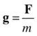

你会发现这相当于我们熟悉的，质量为 m 的物体的重力公式:

因此，引力场强度是一个矢量，其大小等于重力 g 产生的加速度。特别是，这意味着它对所有物体都具有相同的值，而不管它们的质量或其他特性如何。一般来说，引力场强度矢量 g 可以随位置变化，就像(非粗体)标量 g 一样，在均匀引力场中，比如靠近地球表面，g 和 g 都是常数。

重申一个重要的观点，引力场强度定义的关键是，它只是场的一个属性，因为它独立于任何可能受到它的力的物体而存在。一个物体上的重力取决于它的质量，而重力场强度 g 本身告诉我们在场中任何一点每单位质量的力。由此，我们可以通过乘以 m，计算出任意质量 m 上的力 F。

### 粒子产生的引力场

质量为 M 的粒子(如恒星)的引力场强度可以从牛顿引力定律开始计算:

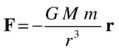

这里，M 是质量 M 产生的场中任何其他粒子的质量，r 是它相对于场源的位置矢量。

因为引力场强度是由 g = F/m 定义的，我们只需将前面的公式除以 m 就可以得到这个:

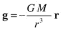

正如你在前面的公式中所看到的，引力场 g 只取决于产生它的粒子的质量 M 和该粒子的位置矢量，而不取决于任何其他可能存在的粒子。我们还可以推导出 g 的大小由 g = GM/r 2 给出，与[第六章](06.html)中推导出的重力引起的加速度变化一致。

一般来说，g 可以比这个简单的公式复杂得多。例如，在一个星系中，g 是各个恒星产生的所有场的矢量和(当然，所有的场都在运动)。但是，模拟星系中恒星的运动，使用场的概念比直接计算每对恒星之间的所有力要有效得多，正如你将在第 12 章中看到的。与此同时，是时候开始玩一些更简单的重力作为远程力的例子了。

### 多轨道飞行器引力

我们的第一个例子将涉及一个单一的引力吸引子，它将保持不变。我们借用了第六章中的轨道模拟，但我们会添加更多的轨道行星，使其更有趣，并说明每个行星在任何给定的时间都经历不同的引力场强度，因此沿着不同的轨道运动。下面是在`orbits.js`中修改后的代码:

`var canvas = document.getElementById('canvas');`

`var context = canvas.getContext('2d');`

`var canvas_bg = document.getElementById('canvas_bg');`

`var context_bg = canvas_bg.getContext('2d');`

`var M = 1000000; // sun's mass`

`var G = 1;`

`var sun;`

`var planets;`

`var t;`

`var t0;`

`var dt;`

`var force;`

`var acc;`

`var numPlanets = 3;`

`window.onload = init;`

`function init() {`

`// create a stationary sun`

`sun = new Ball(70,'#ff9900',M,0,true);`

`sun.pos2D = new Vector2D(400,300);`

`sun.draw(context_bg);`

`// create planets`

`planets = new Array();`

`var radius = new Array(10,6,12);`

`var mass = new Array(10,3,15);`

`var color = new Array('#0000ff','#ff0000','#00ff00');`

`var pos = new Array(new Vector2D(400,50),new Vector2D(500,300),new Vector2D(200,300));`

`var velo = new Array(new Vector2D(65,0),new Vector2D(0,100),new Vector2D(0,-70));`

`for (var i=0; i<numPlanets; i++){`

`var planet = new Ball(radius[i],color[i],mass[i],0,true);`

`planet.pos2D = pos[i];`

`planet.velo2D = velo[i];`

`planet.draw(context);`

`planets.push(planet);`

`}`

`t0 = new Date().getTime();`

`t = 0;`

`animFrame();`

`}`

`function animFrame(){`

`requestAnimationFrame(animFrame,canvas);`

`onTimer();`

`}`

`function onTimer(){`

`dt = 0.001*(new Date().getTime() - t0);`

`t0 = new Date().getTime();`

`t += dt;`

`move();`

`}`

`function move(){`

`context.clearRect(0, 0, canvas.width, canvas.height);`

`for (var i=0; i<numPlanets; i++){`

`var planet = planets[i];`

`moveObject(planet);`

`calcForce(planet);`

`updateAccel(planet.mass);`

`updateVelo(planet);`

`}`

`}`

`function moveObject(obj){`

`obj.pos2D = obj.pos2D.addScaled(obj.velo2D,dt);`

`obj.draw(context);`

`}`

`function updateAccel(mass){`

`acc = force.multiply(1/mass);`

`}`

`function updateVelo(obj){`

`obj.velo2D = obj.velo2D.addScaled(acc,dt);`

`}`

`function calcForce(planet){`

`force = Forces.gravity(G,M,planet.mass,planet.pos2D.subtract(sun.pos2D));`

`}`

这里的要点是，我们正在创建三个行星，然后初始化它们的位置和速度，以便它们最终绕太阳运行。这些行星被放置在离太阳不同的距离，然后每个行星被赋予一个初始切向速度。速度的大小基本上是通过反复试验来选择的；或者你可以使用第 9 章中给出的方法来选择速度，这将给出一个大致圆形的轨道。注意，`move()`函数在每个行星上循环，依次对每个行星应用函数`moveObject()`、`calcForce()`、`updateAccel()`和`updateVelo()`。

如果你运行代码，你会得到一个漂亮的太阳系玩具模拟(见图 [10-1](#Fig1) )。基本的物理原理就在那里。例如，一颗行星离太阳越近，它运行的速度越快。但是这个模拟并不完全准确。正如您在前面的例子中所看到的，欧拉积分方案会迅速累积误差。如果你想做一个精确的太阳系模拟，你需要一个更好的积分器。我们将在第 16 章的[中讨论这个问题，在那里我们也将考虑行星之间的作用力以及输入行星质量、大小、位置和速度的精确数据。](16.html)

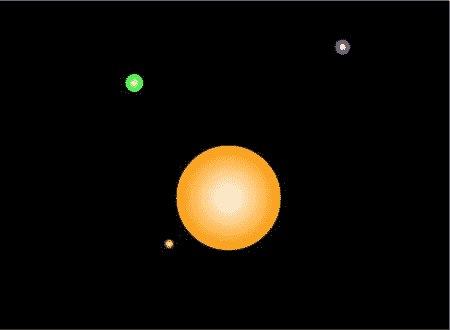

图 10-1。

Multiple orbiting planets around a sun

### 多重吸引子引力

让我们通过添加另一个吸引子来使前面的模拟稍微复杂一些。在那个例子中，我们将保持吸引子不变。让他们动起来并不难；这会产生一些有趣的整体运动。但是我们必须更加小心我们的数值积分方案。我们将在第 14 章中回到这个问题。

新代码在一个名为`attractors.js`的文件中，与`orbits.js`的本质区别在于`init()`和`calcForce()`方法。我们先来看前者:

`var numOrbiters = 3;`

`var numAttractors = 2;`

`function init() {`

`// create attractors`

`attractors = new Array();`

`var radiusA = new Array(20,20);`

`var massA = new Array(1000000,1000000);`

`var colorA = new Array('#ff9900','#ff9900');`

`var posA = new Array(new Vector2D(300,300),new Vector2D(500,300));`

`for (var i=0; i<numAttractors; i++){`

`var attractor = new Ball(radiusA[i],colorA[i],massA[i],0,true);`

`attractor.pos2D = posA[i];`

`attractor.draw(context_bg);`

`attractors.push(attractor);`

`}`

`// create orbiters`

`orbiters = new Array();`

`var radius = new Array(8,8,8);`

`var mass = new Array(1,1,1);`

`var color = new Array('#0000ff','#ff0000','#00ff00');`

`var pos = new Array(new Vector2D(400,300),new Vector2D(400,400),new Vector2D(300,400));`

`var velo = new Array(new Vector2D(0,60),new Vector2D(10,60),new Vector2D(90,0));`

`for (var i=0; i<numOrbiters; i++){`

`var orbiter = new Ball(radius[i],color[i],mass[i],0,true);`

`orbiter.pos2D = pos[i];`

`orbiter.velo2D = velo[i];`

`orbiter.draw(context);`

`orbiters.push(orbiter);`

`}`

`t0 = new Date().getTime();`

`t = 0;`

`animFrame();`

`}`

代码基本上是不言自明的:我们创建了两个吸引子和三个轨道器，都作为`Ball`实例。吸引子被赋予相同的半径和质量。然后设定轨道器的初始位置和速度。正如我们将要看到的，完全不同的轨迹是由不同的初始条件产生的。

在`calcForce()`中，我们计算并加总所有吸引子作用在每个轨道器上的力。代码可以处理任意数量的吸引子。

`function calcForce(orbiter){`

`var gravity;`

`force = Forces.zeroForce();`

`for (var i=0; i<numAttractors; i++){`

`var attractor = attractors[i];`

`gravity = Forces.gravity(G,attractor.mass,orbiter.mass,orbiter.pos2D.subtract(attractor.pos2D));`

`force = Forces.add([force, gravity]);`

`}`

`}`

按照`attractors.js`中指定的三个轨道器的初始条件运行代码。蓝色轨道飞行器有位置向量(400，300)和速度向量(0，60)。这将轨道器准确地定位在两个吸引子的中间，并使其向下的速度为 60 px/s。您将看到轨道器上下振荡，因此它与每个吸引子的距离相同。

红色轨道飞行器有位置矢量(400，400)和速度矢量(10，60)。你会发现这个轨道器以一种有趣的方式运动:交替地绕着每个吸引子运动，但在两者之间做了一个扭曲，所以它以顺时针方向绕着两个吸引子运动。如果你现在保持相同的初始位置，但是改变初始速度为(120，0)，你会看到轨道器围绕两个吸引子旋转。一般来说，你可以有不同的吸引子的分布，并且一个物体仍然有可能围绕着整个簇运动。

绿色轨道器有位置矢量(300，400)和速度矢量(90，0)。这个轨道器交替环绕每个吸引子，但方向相反，遵循 8 字形轨道。

请注意，如果您让模拟运行足够长的时间，您可能会开始看到由于积分方案中的数值不准确而导致的轨道变化。如前一节所述，我们将在第 14 章中探讨如何解决这个问题。

从这些实验中学到的关键经验(见图 [10-2](#Fig2) )是，虽然引力场是由吸引子固定的，但粒子在引力场中的实际轨迹也将取决于它们的位置和速度。

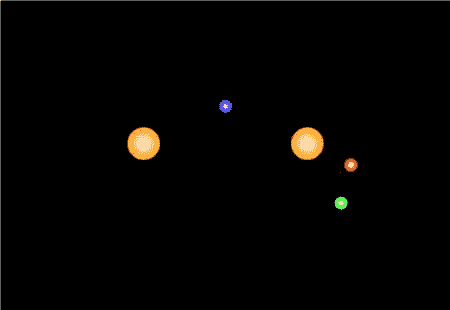

图 10-2。

Orbiters moving under the gravitational influence of two attractors

不用说，您可以用许多方法来试验这种模拟。作为一个练习，你为什么不添加另一个吸引子，看看你会得到什么样的运动？

### 重力场中的粒子轨迹

在下一个例子中，我们有许多吸引子，产生了一个复杂的重力场。粒子在这种场中的最终轨迹可能相当复杂，有时难以预测。为了让这个例子更有趣，我们假设我们的吸引子是黑洞。我们修改前一个例子中的`attractors.js`代码来实现这些新特性。让我们先来看看`init()`的方法:

`function init() {`

`// create attractors`

`attractors = new Array();`

`for (var i=0; i<numAttractors; i++){`

`var r = 20*(Math.random()+0.5);`

`var m = (0.5*c*c/G)*r;`

`var attractor = new Ball(r,'#000000',m,0,false);`

`attractor.pos2D = new Vector2D(Math.random()*canvas.width,Math.random()*canvas.height);`

`attractor.draw(context_bg);`

`attractors.push(attractor);`

`}`

`// create orbiters`

`orbiters = new Array();`

`var color = new Array('#0000ff','#ff0000','#00ff00');`

`for (var i=0; i<numOrbiters; i++){`

`var orbiter = new Ball(5,color[i],1,0,true);`

`orbiter.pos2D = new Vector2D(Math.random()*canvas.width,Math.random()*canvas.height);`

`orbiter.velo2D = new Vector2D((Math.random()-0.5)*100,(Math.random()-0.5)*100);`

`orbiter.draw(context);`

`orbiters.push(orbiter);`

`}`

`setupGraph();`

`t0 = new Date().getTime();`

`t = 0;`

`animFrame();`

`}`

在这段代码中，我们创建了一些黑洞作为球实例，将它们放置在画布上的随机位置，并将对它们的引用放在一个名为`attractors`的数组中。然后，我们创建三个轨道器，也作为球实例(在前面的例子中是蓝色、红色和绿色)，并给它们分配一个随机位置和一个随机速度。正如你从代码中看到的，为了设置黑洞的质量，我们使用了公式 M = (0.5c 2 /G) R，其中 M 是质量，R 是黑洞的半径(在代码中是 10 到 30 个像素之间的随机值)。c 是什么，这个公式从何而来？这是根据半径计算黑洞质量的公式。常数 c 是光速。我们的黑洞实际上是假设的牛顿黑洞；真正的(爱因斯坦)黑洞不遵守牛顿的引力定律，而是需要爱因斯坦的广义相对论(一个复杂得多的理论，我们无意在本书中模拟！).c 的值将决定黑洞的质量范围。这是一个玩弄价值的例子，使黑洞产生足够的，但不是太多的吸引力，这样粒子就有机会在被黑洞吞噬之前做一些有趣的事情。我们选择的值是 300。

`calcForce()`方法循环遍历所有的吸引子，并像前面的例子一样对它们的重力求和。此外，如果轨道飞行器与任何黑洞相撞，它就会消失，并通过调用`recycleOrbiter()`方法被“回收”，如`calcForce()`中高亮显示的代码所示:

`function calcForce(obj){`

`var gravity;`

`force = Forces.zeroForce();`

`for (var i=0; i<numAttractors; i++){`

`var attractor = attractors[i];`

`var dist = obj.pos2D.subtract(attractor.pos2D);`

`if (dist.length() > attractor.radius+obj.radius){`

`gravity = Forces.gravity(G,attractor.mass,obj.mass,dist);`

`force = Forces.add([force, gravity]);`

`}else{`

`recycleOrbiter(obj);`

`}`

`}`

`}`

`recycleOrbiter()`方法只是重新初始化轨道器的位置和速度:

`function recycleOrbiter(obj){`

`obj.pos2D = new Vector2D(Math.random()*canvas.width,Math.random()*canvas.height);`

`obj.velo2D = new Vector2D((Math.random()-0.5)*100,(Math.random()-0.5)*100);`

`}`

根据`moveObject()`方法中的一段`if`逻辑，如果轨道器离开可见的载物台区域，它也会被“回收”:

`function moveObject(obj){`

`obj.pos2D = obj.pos2D.addScaled(obj.velo2D,dt);`

`if (obj.x < 0 || obj.x > canvas.width || obj.y < 0 || obj.y > canvas.height){`

`recycleOrbiter(obj);`

`}`

`obj.draw(context);`

`}`

你会注意到我们还在`move()`方法中调用了一个`plotGraph()`方法。这是怎么回事？嗯，我们并不是真的在绘制一个图表，而是轨道飞行器的轨迹。但是我们可以使用与 stage 具有相同范围的`Graph`实例来实现。这是在`setupGraph()`方法中完成的，该方法在`init()`方法中被调用。然后`plotGraph()`方法绘制出轨道器的 y 位置和 x 位置。因为`plotGraph()`在`move()`内被调用，它在每个时间步执行，所以代码有效地描绘出轨道器的轨迹:

`function setupGraph(){`

`graph = new Graph(context_bg,0,canvas.width,0,canvas.height,0,0,canvas.width,canvas.height);`

`}`

`function plotGraph(obj){`

`graph.plot([obj.x], [-obj.y], obj.color, false, true);`

`}`

如果您想了解所有这些代码是如何组合在一起的，请看一下文件`gravity-field` `.js`。运行代码，当每个轨道飞行器穿过复杂的重力场并最终进入黑洞时，你会看到一些有趣的轨迹。每次这种情况发生时，它都会在其他地方重新出现，并描绘出另一条轨迹，要么结束于黑洞，要么就在舞台区域之外。图 [10-3](#Fig3) 显示了您将能够看到的结果类型。粒子初始条件的随机性会导致不同的模式随着时间的推移而出现，因此您可能希望让模拟运行一段时间来查看这一点。此外，每次你运行模拟，你会得到不同的黑洞配置，这也将给出不同的粒子轨迹模式。

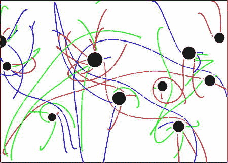

图 10-3。

Particle trajectories in the gravity field of black holes

### 构建一个简单的黑洞游戏

在下一个项目中，我们将会更加冒险，通过修改前面的模拟来构建一个简单的游戏。图 [10-4](#Fig4) 显示了游戏将会是什么样子的截图。游戏的目标是驾驶一艘宇宙飞船(三角形)穿过黑洞领域。宇宙飞船在舞台下端附近出发，如果你能越过顶端的终点线，你就赢了。每赢一次，就增加一个新的黑洞。黑洞的位置是随机初始化的，因此它们的中心都位于获胜线和更低的另一条水平线之间。每当黑洞捕获宇宙飞船时，你就失去一条生命。如果你走下舞台，宇宙飞船会重新回到它的初始位置。

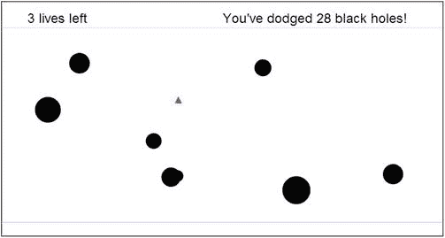

图 10-4。

The black hole game

#### 创建视觉设置

创建可视化设置的代码位从文件`black-holes.js`中的`init()`函数调用:

`function init() {`

`ship = new Rocket(12,12,'#ff0000',1);`

`ship.pos2D = new Vector2D(0.5*canvas.width,canvas.height-50);`

`ship.draw(context);`

`attractors = new Array();`

`addAttractor();`

`setupText();`

`setupScene();`

`setupEventListeners();`

`t0 = new Date().getTime();`

`t = 0;`

`animFrame();`

`}`

首先我们创建一艘名为`ship`的飞船作为`Rocket`对象的实例，从[第 6 章](06.html)中借用。接下来我们创建一个名为`attractors`的数组，然后调用一个函数`addAttractor()`，这个函数创建了我们的第一个黑洞，并在`attractors`数组中放置了对它的引用:

`function addAttractor(){`

`var r = 20*(Math.random()+0.5);`

`var m = (0.5*c*c/G)*r;`

`var attractor = new Ball(r,'#000000',m,0,false);`

`attractors.push(attractor);`

`}`

创建黑洞并指定其属性的代码与上一个示例中的代码相似。在`black-holes.js`中的代码中，我们将光速降低到 200 px/s，这样吸引力就不会太强，从而实际上有可能避开黑洞！

接下来在`init()`中，调用`setupText()`函数。此函数设置文本属性，如字体大小和字体系列。

`function setupText(){`

`context_bg.font = "18pt Arial";`

`context_bg.textAlign = "left";`

`context_bg.textBaseline = "top";`

`}`

然后调用`setupScene()`方法；它在`canvas_bg`上显示视觉元素:

`function setupScene(){`

`context_bg.clearRect(0, 0, canvas_bg.width, canvas_bg.height);`

`drawLines();`

`showLives();`

`showScore();`

`for (var i=0; i<attractors.length; i++){`

`var attractor = attractors[i];`

`attractor.pos2D = new Vector2D(Math.random()*canvas.width,Math.random()*(yposEdge-yposWinning)+yposWinning);`

`attractor.draw(context_bg);`

`}`

`}`

`setupScene()`函数首先清空画布，然后调用三个函数，`drawLines()`、`showLives()`和`showScore()`。首先，`drawLines()`功能在两个垂直高度`yposWinning`和`yposEdge`绘制水平线(这里分别设置为 50 和 400)。`showLives()`和`showScore()`函数分别显示当前生命数(初始化为 3)和当前分数(等于成功避开的黑洞数)。然后`setupScene()`将所有黑洞放置在上述两条水平线之间的随机位置。

回到`init()`，在调用动画代码之前，调用`setupEventListeners()`方法。下一节将描述相应的事件侦听器。

#### 游戏功能编程

接下来，我们看看实现游戏功能的代码部分。首先，有六个变量在代码开始时被初始化，它们在游戏的交互性中起着关键作用:

`var applyThrust = false;`

`var direction = "";`

`var dir = new Vector2D(0,1);`

`var vedmdt = 10; // ve*dm/dt`

`var numLives = 3;`

`var score = 0;`

四个变量`applyThrust`、`direction`、`dir`和`vedmdt`一起工作，因为它们需要指定飞船上的推力。

*   如果施加推力，第一个变量`applyThrust`是一个值为`true`的`Boolean`。
*   第二个变量`direction`是一个字符串，它告诉我们推力施加的方向。
*   第三个，`dir`，是指向下方的单位矢量；它将被用来计算推力矢量。
*   第四个，`vedmdt`，是`ve*dm/dt`的值，给出火箭推力的大小(参考[第六章](06.html))。
*   最后两个变量`numLives`和`score`是`Number`变量，分别存储当前的生命数和分数。

`setupEventListeners()`方法如下所示:

`function setupEventListeners(){`

`window.addEventListener('keydown',startThrust,false);`

`window.addEventListener('keyup',stopThrust,false);`

`window.addEventListener('dblclick',changeSetup,false);`

`}`

如果一个键被按下，事件处理程序`startThrust()`将被调用；如果该键被释放，事件处理程序`stopThrust()`将被调用；如果我们双击，事件处理程序`changeSetup()`将被调用。这里是`startThrust()`和`stopThrust()`的样子:

`function startThrust(evt){`

`applyThrust = true;`

`if (evt.keyCode==38){ // up arrow`

`direction = "UP";`

`}`

`if (evt.keyCode==40){ // down arrow`

`direction = "DOWN";`

`}`

`if (evt.keyCode==39){ // right arrow`

`direction = "RIGHT";`

`}`

`if (evt.keyCode==37){ // left arrow`

`direction = "LEFT";`

`}`

`}`

`function stopThrust(evt){`

`applyThrust = false;`

`direction = "";`

`}`

因此，`startThrust()`将`applyThrust`设置为`true`，并根据哪个方向键被按下，给出`"UP"`、`"DOWN"`、`"RIGHT"`或`"LEFT"`到`direction`的值。就其本身而言，`stopThrust()`将`applyThrust`重置为`false`，并将一个空白字符串分配给`direction`。

通过双击窗口上的任意位置调用的`changeSetup()`事件处理程序如下所示:

`function changeSetup(evt){`

`setupScene();`

`recycleOrbiter(ship);`

`}`

我们已经在上一节讨论了`setupScene()`方法。`recycleOrbiter()`方法如其名，将飞船的位置和速度重新初始化为初始值:

`function recycleOrbiter(obj){`

`obj.pos2D = new Vector2D(0.5*canvas.width,canvas.height-50);`

`obj.velo2D = new Vector2D(0,0);`

`}`

所以你可以通过双击浏览器窗口的任何地方来随时重置黑洞和宇宙飞船的位置。

现在让我们看看`calcForce()`是什么样子的:

`function calcForce(obj){`

`force = Forces.zeroForce();`

`// calculate and add gravity due to all black holes`

`var gravity = Forces.zeroForce();`

`for (var i=0; i<attractors.length; i++){`

`var attractor = attractors[i];`

`var dist = obj.pos2D.subtract(attractor.pos2D);`

`if (dist.length() > attractor.radius){`

`gravity = Forces.gravity(G,attractor.mass,obj.mass,dist);`

`force = Forces.add([force, gravity]);`

`}else{`

`updateLives();`

`setupScene();`

`recycleOrbiter(obj);`

`}`

`}`

`// calculate and add thrust`

`var thrust = Forces.zeroForce();`

`if (applyThrust){`

`if (direction=="UP"){`

`thrust = dir.para(-vedmdt);`

`}else if (direction=="DOWN"){`

`thrust = dir.para(vedmdt);`

`}else if (direction=="RIGHT"){`

`thrust = dir.perp(vedmdt);`

`}else if (direction=="LEFT"){`

`thrust = dir.perp(-vedmdt);`

`}else{`

`thrust = new Vector2D(0,0);`

`}`

`force = Forces.add([force, thrust]);`

`}`

`}`

每个黑洞产生的重力在一个`for`循环中计算，然后加到总力上(这里 G 在代码开始时被赋予值 1)。碰撞检测测试检查飞船不在当前的黑洞内；如果是，调用方法`updateLives()`，飞船被回收。然后根据按下的箭头键计算出飞船的推力，这由存储在`direction`变量中的字符串决定。例如，如果`direction=="UP"`，通过使用`Vector2D`的`para()`公共方法，将`dir`缩放为`-vedmdt`，推力被施加到与单位矢量`dir`(指向下方)相反的方向。如果按下右箭头键或左箭头键，则使用`perp()`方法，给出长度为`vedmdt`的水平向量。然后推力被加到合力上。

前面提到的`updateLives()`方法减少了生命变量`numLives`的数量:

`function updateLives(){`

`numLives--;`

`}`

接下来我们来看看`moveObject()`方法:

`function moveObject(obj){`

`obj.pos2D = obj.pos2D.addScaled(obj.velo2D,dt);`

`if (obj.x < 0 || obj.x > canvas.width || obj.y < 0 || obj.y > canvas.height){`

`recycleOrbiter(obj);`

`}`

`if (obj.y < yposWinning){`

`updateScore();`

`addAttractor();`

`setupScene();`

`recycleOrbiter(obj);`

`}`

`obj.draw(context);`

`}`

这里的新比特是代码的`if`块。如果船在画布区域之外，第一个`if`块回收船。第二个`if`模块检查船只是否通过了获胜线。如果有，它会更新分数，添加一个新的黑洞，重新定位所有的黑洞，并回收轨道飞行器。先前描述了`addAttractor()`、`setupScene()`和`recycleOrbiter()`方法。`updateScore()`方法将当前得分变量`score`增加当前黑洞数(因此`score`的值等于被避开的黑洞总数):

`function updateScore(){`

`score += attractors.length;`

`}`

为了完整起见，我们展示了从`setupScene()`调用的`showLives()`和`showScore()`方法:

`function showLives(){`

`txtLives = numLives.toString().concat(" lives left");`

`if (numLives==0){`

`txtLives = "Game over";`

`stop();`

`}`

`writeText(txtLives,50,20);`

`}`

`function showScore(){`

`if (score==0){`

`txtScore = "";`

`}else if (score==1){`

`txtScore = "You've just dodged a black hole!"`

`}else{`

`txtScore = "You've dodged ";`

`txtScore = txtScore.concat(score.toString()," black holes!");`

`}`

`writeText(txtScore,400,20);`

`}`

`function writeText(txt,x,y){`

`context_bg.fillText(txt,x,y);`

`}`

实用函数`writeText()`从`showLives()`和`showScore()`中被调用，并简单地在画布上的指定位置书写文本。这里需要注意的另一件事是，如果`numLives`变为零，在`showLives()`中调用`stop()`方法并停止动画:

`function stop(){`

`cancelAnimationFrame(animId);`

`}`

这就完成了游戏的描述。看看源文件，玩得开心点！请随意进一步开发游戏。它当然可以增强图像，也许还有一些声音效果。在功能性方面，看看能不能改进控件；例如，允许用户通过同时按下向上或向下键和向左或向右键来对角移动飞船。

## 静电力

我们要研究的下一个长程作用力是存在于带电粒子之间的作用力。这被称为电力或静电力。但是在我们讨论力的定律之前，我们需要解释一些关于电荷的事实。

### 电荷

电荷是粒子的一种物理性质，就像质量一样。基本粒子是物质的基本组成部分，经常带电。例如，电子是围绕原子核运行的粒子，它们带有负电荷。原子核包括带正电荷的质子和带零电荷的中子。我们所说的电流实际上是金属中自由电子的流动——运动的电荷(不管是不是电子)构成了电流。

一个有质量的粒子会产生一个引力场，对其他有质量的粒子施加一个力。同样，一个带电粒子会产生一个电场，对其他带电粒子施加一个力。电荷有两种:正电荷和负电荷。

同性电荷相斥；异性电荷相吸。

所以正电荷会吸引负电荷，反之亦然。但是正电荷会排斥另一个正电荷；同样，一个负电荷会排斥另一个负电荷。这和质量是不同的，质量总是正的，总会产生引力。

### 库仑静电学定律

两个粒子间的电力定律称为库仑定律。它在形式上与牛顿万有引力定律几乎相同，由下式给出，其中 Q 1 和 Q 2 是两个粒子上的电荷，r 是它们之间的距离，k 是类似于 G 的常数:

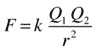

不用担心 k 的值；我们不打算模拟真实的电荷，但我们将研究一下力定律，看看它会产生什么样的运动。所以我们可以给 k 任何我们喜欢的值。

根据牛顿第三定律，一个粒子对另一个粒子施加的力大小相等，方向相反。和重力一样，力的方向是沿着两个粒子的连线，所以库仑定律可以用以下两种方式写成矢量形式，其中 r u 是 r 方向的单位矢量:

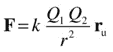

或者

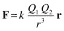

这里 r 是受力物体相对于施力物体的位置矢量，就像重力一样(参考[第六章](06.html))。

请注意，前面的公式中没有负号(回想一下，重力的等效矢量公式有一个负号)。这是因为同性电荷相斥，而异性电荷相吸。所以如果 Q 1 和 Q 2 都是正的或者都是负的，它们的乘积就是正的，力 F 是 r 的正数倍，那么 F 的方向就是 r(它是排斥的)。但是如果其中一个电荷是正的，另一个是负的，F 是负的数乘以 r，方向与 r 相反(它是吸引的)。

让我们在`Forces`对象中创建一个类似重力函数的电力函数:

`Forces.electric = function(k,q1,q2,r){`

`return r.multiply(k*q1*q2/(r.lengthSquared()*r.length()));`

`}`

这在形式上类似于重力函数，但没有负号。如前所述，乘积`q1*q2`的符号决定了我们得到的是吸引力还是排斥力。仅仅通过允许电荷有两种不同的符号，我们就得到一个比重力更“丰富”的力，尽管这个公式在形式上几乎是相同的。

### 带电粒子的吸引和排斥

为了看到电力的作用，让我们建立一个类似于`gravity-field.js`的模拟，但用带电粒子代替黑洞。新文件是`electric-field.js`。下面重点介绍了`init()`和`calcForce()`方法的主要区别:

`function init() {`

`// create attractors`

`attractors = new Array();`

`for (var i=0; i<numAttractors; i++){`

`var r = 20*(Math.random()+0.5);`

`var charge = (Math.random()-0.5)*1000000;`

`if (charge<0){`

`color = '#ff0000';`

`}else if(charge>0){`

`color = '#0000ff';`

`}else{`

`color = '#000000';`

`}`

`var attractor = new Ball(r,color,1,charge,true);`

`attractor.pos2D = new Vector2D(Math.random()*canvas.width,Math.random()*canvas.height);`

`attractor.draw(context_bg);`

`attractors.push(attractor);`

`}`

`// create orbiters`

`orbiters = new Array();     for (var i=0; i<numOrbiters; i++){`

`var orbiter = new Ball(5, ’#0000ff’,1,1,true);`

`orbiter.pos2D = new Vector2D(Math.random()*canvas.width,Math.random()*canvas.height);`

`orbiter.velo2D = new Vector2D((Math.random()-0.5)*100,(Math.random()-0.5)*100);`

`orbiter.draw(context);`

`orbiters.push(orbiter);`

`}`

`setupGraph();`

`t0 = new Date().getTime();`

`t = 0;`

`animFrame();`

`}`

主要的区别是，我们给吸引子随机的正负电荷，如果它们的电荷是正的，就把它们涂成蓝色，如果它们的电荷是负的，就涂成红色(如果它们的电荷为零，就涂成黑色，这种情况很少发生，因为`Math.random()`必须返回 0.5 才能成立)。每个移动的粒子，仍然被称为`orbiter`，被赋予 1 的正电荷，并被染成蓝色。所以它会被红色中心吸引，被蓝色中心排斥。

在`calcForce()`中，我们用`Forces.electric()`代替`Forces.gravity()`，用电荷代替质量:

`function calcForce(obj){`

`var electric;`

`force = Forces.zeroForce();`

`for (var i=0; i<numAttractors; i++){`

`var attractor = attractors[i];`

`var dist = obj.pos2D.subtract(attractor.pos2D);`

`if (dist.length() > attractor.radius+obj.radius){`

`electric = Forces.electric(k,attractor.charge,obj.charge,dist);`

`force = Forces.add([force, electric]);`

`}else{`

`recycleOrbiter(obj);`

`}`

`}`

`}`

图 [10-5](#Fig5) 显示了运行代码时应该看到的示例。

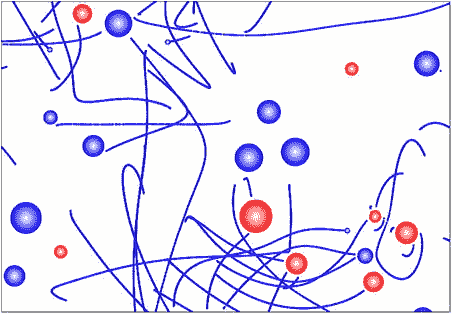

图 10-5。

Trajectories in the electric field of multiple charged particles

### 电场

和重力一样，我们可以引用静电学中力场的概念。回想一下，重力场强度 g 定义为每单位质量所施加的力，g = F/m。同样，电场强度 E 定义为每单位电荷所施加的力:

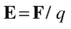

因此，如果我们知道电场强度，我们可以很容易地通过乘以粒子的电荷来计算电场对粒子施加的电力:

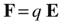

将此与重力的等效公式进行比较:

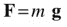

因为我们要用公式 F = q E，为什么不为它创建一个力函数呢？姑且称之为`Forces.forceField`:

`Forces.forceField = function(q,E) {`

`return E.multiply(q);`

`}`

注意，如果我们用 m 代表参数 q，用 g 代表 e，没有什么能阻止我们用同样的函数来计算 F = m，g。

#### 带电粒子产生的电场

作为一个例子，使用库仑定律，我们可以计算一个带电粒子产生的电场。设粒子带电荷 q，那么它对距离 r 远的带电荷 q 的粒子施加的力是这样的:

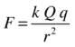

因此，每单位电荷的力是这样的:

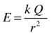

在向量形式中，它可以写成如下形式:

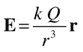

这是带电粒子产生的电场的公式。但是我们也可以随意改变 E 的任何形式，而不用担心它实际上是如何产生的。让我们看几个例子。

#### 时变电场

如前一节所述，静止电荷的电场在时间上是恒定的，尽管它在空间上是变化的。这类似于静止质量的引力场。但是如果带电粒子运动，它建立的电场会随时间变化。例如，振荡电荷会产生振荡电场。

一个简单的例子是像正弦或余弦波一样随时间变化的电场。频率和振幅等波动概念可以应用于这种正弦变化的场，如第 3 章和第 8 章所述。此外，因为电场是一个矢量，它的分量可以彼此独立地变化。如果这一切听起来有点抽象，那是因为电场是一个抽象的概念！你不能想象一个有两个或更多分量的振荡电场，就像你能想象一个振荡的质量弹簧系统一样。然而，同样的数学可以应用于两者。

随时间变化的电场可以产生有趣的效应。在文件`electric-field-examples.js`中，我们来看看不同电场产生的运动类型:

`var canvas = document.getElementById('canvas');`

`var context = canvas.getContext('2d');`

`var canvas_bg = document.getElementById('canvas_bg');`

`var context_bg = canvas_bg.getContext('2d');`

`var particle;`

`var mass = 1;`

`var charge = 1;`

`var E;`

`var t0, t, dt;`

`var acc, force;`

`var graph;`

`var animId;`

`var animTime = 25;`

`window.onload = init;`

`function init() {`

`particle = new Ball(5,'#ff0000',mass,charge,true);`

`particle.pos2D = new Vector2D(100,300);`

`particle.draw(context);`

`setupGraph();`

`t0 = new Date().getTime();`

`t = 0;`

`animFrame();`

`}`

`function animFrame(){`

`animId = requestAnimationFrame(animFrame,canvas);`

`onTimer();`

`}`

`function onTimer(){`

`dt = 0.001*(new Date().getTime() - t0);`

`t0 = new Date().getTime();`

`t += dt;`

`if (t < animTime){`

`move();`

`}else{`

`stop();`

`}`

`}`

`function move(){`

`moveObject(particle);`

`calcForce();`

`updateAccel();`

`updateVelo(particle);`

`plotGraph();`

`}`

`function moveObject(obj){`

`obj.pos2D = obj.pos2D.addScaled(obj.velo2D,dt);`

`context.clearRect(0, 0, canvas.width, canvas.height);`

`obj.draw(context);`

`}`

`function calcForce(){`

`E = new Vector2D(20*Math.sin(1*t),20*Math.cos(1*t));`

`force = Forces.forceField(charge,E);`

`}`

`function updateAccel(){`

`acc = force.multiply(1/mass);`

`}`

`function updateVelo(obj){`

`obj.velo2D = obj.velo2D.addScaled(acc,dt);`

`}`

`function stop(){`

`cancelAnimationFrame(animId);`

`}`

`function setupGraph(){`

`graph = new Graph(context_bg,0,canvas.width,0,canvas.height,0,0,canvas.width,canvas.height); }`

`function plotGraph(){`

`graph.plot([particle.x], [-particle.y], '#666666', false, true);`

`}`

如前面的代码所示，我们在`calcForce()`中指定的电力的影响下移动一个带电的球实例，并使用`plotGraph()`方法绘制其轨迹，以绘制之前在`setupGraph()`中设置的`Graph`实例。

现在是游戏时间了！在源文件中，我们为`calcForce()`中的`E`提供了许多不同的正弦变化函数(注释掉的代码),你可以试试。首先尝试以下功能:

`E = new Vector2D(0, 50*Math.cos(1*t));`

我们所做的是施加一个电场，其垂直分量随时间呈正弦变化，幅度(最大幅度)为 50，频率为每秒 1 个周期。当你运行代码时，你会看到粒子随着电场的变化上下振荡。

如果我们改变振荡的振幅或频率会发生什么？如果我们增加振幅，我们会施加更大的力，所以毫不奇怪，粒子会以更大的振幅振荡。但是增加外加电场频率的效果可能不那么明显。尝试将频率更改为 3，使`E`变成这样:

`E = new Vector2D(0, 50*Math.cos(3*t));`

如果你现在运行代码，你会发现粒子以小得多的振幅振荡。这里发生的是，粒子，因为它有惯性(质量)，跟不上电场的变化速度。

下面的函数给出了一个更有趣的模式，通过施加一个电场，其水平分量为 1，垂直分量为正弦变化，振幅由`2*t`给出:

`E = new Vector2D(1, 2*t*Math.cos(1*t));`

这使得粒子在水平方向加速，并在垂直方向以增加的振幅振荡(见图 [10-6](#Fig6) )。

我们将让您使用文件中给出的其他示例函数，以及尝试您自己的函数。当然，没有理由将自己局限于正弦变化的函数:可以随意试验任何你喜欢的函数。

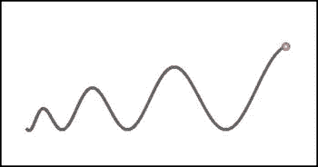

图 10-6。

Example of the effect of a time-varying electric field on a charged particle

## 电磁力

电(静电)力只是带电粒子的一个方面。除了电力之外，移动的带电粒子还会受到另一种力的作用——磁力。因此，考虑磁力将改变带电粒子的运动方式。在本节中，您将看到如何计算磁力，以及磁力与电力的结合如何影响带电粒子的运动。

### 磁场和力

我们小时候都体验过磁铁的魅力。它们吸引人的部分原因是，你可以实际感受到两块磁铁之间的作用力，而无需它们实际接触。由于这种超距作用的特性，磁性恰好符合力场的概念:一块磁铁会在其周围产生磁场，然后对其他磁铁和磁性材料施加作用力。

一点都不明显的是，磁场其实和电场有着密切的联系。磁场是由移动的电荷或随时间变化的电场产生的。因此，导线中的电流会产生磁场。正弦变化的电场将产生正弦变化的磁场。电场和磁场之间的关系以及它们产生的精确方式是复杂的；它们在数学上由一组称为麦克斯韦方程组的矢量微分方程来描述。为了简单起见，我们将简单地假设给定的电场和磁场，而不用担心它们是如何产生的或者它们如何相互作用，并且专注于它们如何影响带电粒子的运动。

我们已经知道，电场强度为 E 时，电荷为 q 的粒子所受的力为 F = q E。磁场的等效力定律是什么？

首先我们需要引入一个类似于电场强度的磁场强度。没有必要深入实际的定义；只要说它存在并被赋予符号 B，它是一个像电场强度 e 一样的矢量就够了。

磁场 B 对电荷 q 的作用力由下式给出，其中 v 是带电粒子的速度矢量，x 表示叉(矢量)积(参见[第 3 章](03.html)):

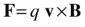

正如在第 3 章的[中所解释的，叉积 v × B 给出了一个垂直于 v 和 B 的向量(它指向一个垂直于包含向量 v 和 B 的平面的方向)。乘以 q 得到一个方向相同的矢量，但是 q 乘以它的大小。从](03.html)[第三章](03.html)，磁力也可以这样写，其中θ是 v 和 B 矢量之间的角度，n 是垂直于 v 和 B 矢量的单位矢量，方向根据右手定则(参见[第三章](03.html)):

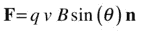

注意，因为磁力总是垂直于粒子速度，所以它充当向心力，引起旋转(参见[第 9 章](09.html))。因此，我们可以把磁力定律等同于向心力公式:

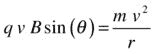

重新排列这个等式得出:

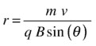

这给出了带电粒子所遵循的轨迹的半径。这个公式告诉我们，如果质量或速度增加，圆的半径就会增加，如果电荷 q 或磁场强度 B 增加，圆的半径就会减小。

### 洛伦兹力定律

您可以将带电粒子上的电力和磁力结合起来，给出粒子上电磁力的单一公式:

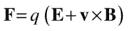

这被称为洛伦兹力方程。

我们现在将在`Forces`对象中创建一个名为`lorentz()`的静态力函数来实现这个力定律。唯一的问题是矢量积只在 3D 中定义，而我们的部队目前只在 2D。但是，如果我们假设磁场 B 总是指向屏幕内或屏幕外，我们可以用一种受限制的方式来实现磁力 qv × B。磁力由下式给出:qv × B = qvB sin (θ) n(参考上一节)，其中θ是 v 和 B 之间的角度，在 2D 中，如果 B 指向屏幕内或屏幕外，v 总是垂直于 B。因为 sin (90 ) = 1，所以在这种特殊情况下，n 垂直于 v 时，得出以下公式:

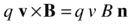

这意味着在 JavaScript 中磁力由下式给出，其中`vel`是速度矢量 v，`B`是磁场的大小:

`vel.perp(q*B*vel.length())`

完整的洛伦兹力函数如下:

`Forces.lorentz = function(q,E,B,vel) {`

`return E.multiply(q).add(vel.perp(q*B*vel.length()));`

`}`

现在让我们来玩洛仑兹力函数。文件`lorentz-force.js`设置一个粒子，让它在洛伦兹力的作用下运动。它与前面的`electric-field-examples.js`中的代码非常相似，主要区别在于 calcForce()方法:

`function calcForce(){`

`E = new Vector2D(0,0);`

`B = 0.2;`

`force = Forces.lorentz(charge,E,B,particle.velo2D);`

`}`

我们在`init()`中把质点在 x 方向的速度初始化为 40px/s；选择不同的初速度会得到不同的结果。

让我们尝试对`E`和`B`使用不同的值和数学函数，看看我们会得到什么。首先，让`E`是一个零矢量，让`B` = 0.2，就像前面的代码片段一样——换句话说，我们有一个恒定的磁场。运行代码，你会看到粒子描绘出一个圆形的路径，正如上一节所讨论的。你可以通过将`B`的值增加到 0.5 并注意到圆形路径的半径减小来验证我们在上一节末尾所说的。

您可以通过在`calcForce()`或`updateVelo()`中添加以下行来降低每个时间步长上粒子的速度:

`particle.velo2D = particle.velo2D.multiply(0.999);`

这将给出如图 [10-7](#Fig7) 所示的螺旋图案。

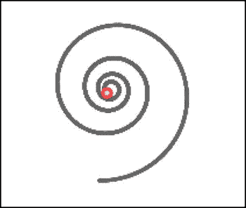

图 10-7。

A spiral traced by a particle with decreasing velocity in a constant magnetic field

现在加上一个非零电场。例如:

`E = new Vector2D(1,0);`

`B = 0.5;`

这将产生一个螺旋轨迹。你也可以使电场和/或磁场随时间变化；例如:

`E = new Vector2D(0,50*Math.cos(1*time));`

`B = 0.5;`

这将产生不总是你所期望的轨迹。体验愉快！

## 其他力定律

本章到目前为止，我们已经讨论了自然界中实际存在的物理力。但是我们没有理由不能发明自己的。因为我们的主要目的是摆弄力和它们的效果，所以我们不必受现实的限制。在接下来的几节中，我们将介绍不同的力定律，看看它们能做什么。请随意创建您自己的！

### 中央部队

中心力是满足以下两个条件的力:

*   力的大小只取决于离给定点的距离。
*   力的方向总是朝着那个点。

牛顿引力、静电力和弹簧力都是中心力的例子。数学上，上述两个条件可以组合起来给出任意点 P 的力矢量如下，其中 r u 是点 P 距力心的单位矢量，r 是其距该中心的距离，f(r)是 r 的函数:

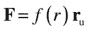

你已经知道，对于重力和静电力，f (r)正比于 1/r 2 :

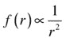

这通常被称为平方反比定律。有没有想过如果重力遵循不同的定律会是什么样子——例如，1/r 反比定律或者 1/r 立方反比定律？我们可以很容易地找到答案，通过创建一个修正的重力函数。但是，与其为这些不同的情况创建特殊的函数，不如让我们创建一个通用的中心力函数，该函数根据以下各项变化，其中 k 和 n 可以是正的或负的:

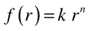

这给出了以下向量形式:

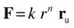

或者相当于:

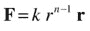

如果 k 为正，则力是排斥的(因为是 r 方向的)；如果 k 为负，则力是吸引的(因为它与 r 方向相反)。如果 n 为正，力随距离增加；如果 n 为负，力随着距离的增加而减小。

例子包括弹簧力定律，其中 k 为负，n 为 1；重力，k 为负，n 为-2。常数 k 通常与粒子的某些性质有关(例如，质量或电荷)。

让我们给`Forces`对象添加一个中心力函数:

`Forces.central = function(k,n,r) {`

`return r.multiply(k*Math.pow(r.length(),n-1));`

`}`

以下来自文件`central-forces.js`的代码片段设置了一个受到朝向固定中心的中心力的粒子:

`function init() {`

`center = new Ball(2,'#000000');`

`center.pos2D = new Vector2D(350,250);`

`center.draw(context_bg);`

`particle = new Ball(5,'#ff0000',mass,0,true);`

`particle.pos2D = new Vector2D(150,250);`

`particle.velo2D = new Vector2D(0,-20);`

`particle.draw(context);`

`setupGraph();`

`t0 = new Date().getTime();`

`t = 0;`

`animFrame();`

`}`

`function calcForce(){`

`var r = particle.pos2D.subtract(center.pos2D);`

`force = Forces.central(k,n,r);`

`}`

代码的其余部分与前面的例子相似，包括像前面一样绘制粒子的最终轨迹。您可以试验不同的 k 和 n 值，以及不同的粒子初始位置和速度。

能不能总让一个粒子遵循一个有引力中心力(负 k)的闭合轨道？我们已经知道这对于 f (r) = k/r 2 定律(例如重力)和 f (r) = kr 定律(弹簧)是可能的。但是其他的力定律呢，比如 f (r) = k/r 或者 f (r) = r 3 呢？自己试试看吧！

作为一个例子，在以下初始条件下，以及(k =–1，n = 1)，一个类似弹簧的力，你得到一个拉长的闭合轨道:

`center.pos2D = new Vector2D(350,250);`

`particle.pos2D = new Vector2D(150,250);`

`particle.velo2D = new Vector2D(0,-20);`

用(k =–100000，n =–2)，一个类似重力的定律，你也会得到一个封闭的椭圆轨道。但是用(k =–1000，n =–1)，一个 1/r 定律，你会得到一个不自我闭合的花状轨迹(见图[10-8](#Fig8))；这是一个束缚轨道，但不是一个封闭的轨道。根据 1/r 3 定律，你会得到螺旋进入或螺旋离开的轨迹，但不闭合:它们既不闭合也不束缚。请注意，k 的大小需要根据 n 的值进行调整，以产生大小合适的位移来配合载物台。

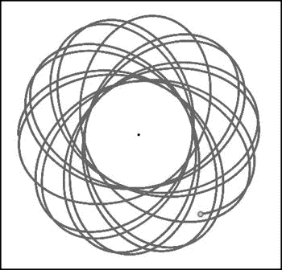

图 10-8。

Trajectory traced by a particle in a 1/r force field

实际上有一个数学定理叫做 Bertrand 定理，它说唯一给出闭合轨道的中心力定律是 f (r) = k/r 2 和 f (r) = kr 定律。幸运的地球(和我们！)引力是 1/r 2 定律！

尽管有最后一个陈述，如果你有正确的切向速度，作为一个特例，对于所有吸引中心力，闭合圆轨道是存在的。很容易算出所需的速度。只要将力定律等同于向心力的公式，其中 m 是粒子的质量:

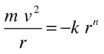

求解 v 得出如下结果:

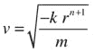

你可以用模拟来测试这个公式。只要 k 为负，它对任何 n 值都有效。

### 重力与弹簧力定律？

你能想象如果重力遵循不同的力定律，例如弹簧力定律，宇宙会是什么样子吗？好吧，让我们来看看！

代码在文件`spring-gravity.js`中，同样改编自本章前面的例子。所以我们在这里只列出来，不做什么解释:

`var canvas = document.getElementById('canvas');`

`var context = canvas.getContext('2d');`

`var canvas_bg = document.getElementById('canvas_bg');`

`var context_bg = canvas_bg.getContext('2d');`

`var vmax = 100;`

`var m = 1; // particles' mass`

`var M = 1; // center's mass`

`var G = 1;`

`var k = -G*M*m;`

`var n = 1;`

`var center;`

`var particles;`

`var t;`

`var t0;`

`var dt;`

`var force;`

`var acc;`

`var numParticles = 50;`

`window.onload = init;`

`function init() {`

`// create a stationary center`

`center = new Ball(20,'#ff0000',M,0,true);`

`center.pos2D = new Vector2D(400,300);`

`center.draw(context_bg);`

`// create particles`

`particles = new Array();`

`for (var i=0; i<numParticles; i++){`

`var particle = new Ball(4,'#000000',m,0,false);`

`particle.pos2D = new Vector2D(Math.random()*canvas.width,Math.random()*canvas.height);`

`particle.velo2D = new Vector2D((Math.random()-0.5)*vmax,(Math.random()-0.5)*vmax);`

`particle.draw(context);`

`particles.push(particle);`

`}`

`t0 = new Date().getTime();`

`t = 0;`

`animFrame();`

`};`

`function animFrame(){`

`requestAnimationFrame(animFrame,canvas);`

`onTimer();`

`}`

`function onTimer(){`

`dt = 0.001*(new Date().getTime() - t0);`

`t0 = new Date().getTime();`

`t += dt;`

`move();`

`}`

`function move(){`

`context.clearRect(0, 0, canvas.width, canvas.height);`

`for (var i=0; i<numParticles; i++){`

`var particle = particles[i];`

`moveObject(particle);`

`calcForce(particle);`

`updateAccel(particle.mass);`

`updateVelo(particle);`

`}`

`}`

`function moveObject(obj){`

`obj.pos2D = obj.pos2D.addScaled(obj.velo2D,dt);`

`obj.draw(context);`

`}`

`function updateAccel(mass){`

`acc = force.multiply(1/mass);`

`}`

`function updateVelo(obj){`

`obj.velo2D = obj.velo2D.addScaled(acc,dt);`

`}`

`function calcForce(particle){`

`var r = particle.pos2D.subtract(center.pos2D);`

`force = Forces.central(k,n,r);`

`}`

这里的主要思想是，我们创造 50 个粒子，给它们随机的位置和速度，并使它们受到朝向固定中心的中心力。`calcForce()`方法基本上是计算一个中心力，用 k =–GMm，其中引力常数 G = 1，M 是中心的质量；而 m 是相关粒子的质量(这里都是 1)。因为 k 是负的，n = 1，我们有一个弹簧力。我们创造了弹力重力！

运行代码，获得一个有趣的洞察，如果重力遵守弹簧力定律，生活会是什么样子。你会看到所有的粒子都被拉向中心，经历某种振荡(见图 [10-9](#Fig9) )。如果你追踪任何一个粒子，你会发现它描绘了一个围绕中心的闭合轨道(通常是拉长的)。如果你增加速度系数`vmax`的值，比如说增加到 1000，粒子会移动更多，但是仍然会被拉进这种振荡运动。根本没有办法摆脱弹簧重力！

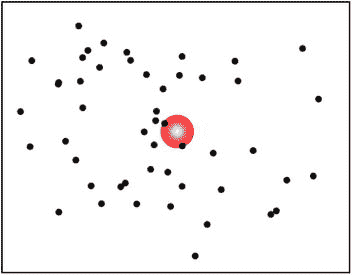

图 10-9。

Modeling gravity with a spring force

### 具有不同引力定律的多重吸引子

在我们的最后一个例子中，`force-fields.js`，我们将结合不同 k 和 n 值的中心力来产生一个复杂的力场。这是一个不同的吸引子根据不同的力定律施加引力的宇宙。

让我们先来看看`init()`法:

`function init() {`

`centers = new Array();`

`// k/r force`

`var center1 = new Ball(20,'#ff0000',1000,-1,true);`

`center1.pos2D = new Vector2D(200,500);`

`center1.velo2D = new Vector2D(10,-10);`

`center1.draw(context);`

`centers.push(center1);`

`// k/r2 force`

`var center2 = new Ball(20,'#00ff00',100000,-2,true);`

`center2.pos2D = new Vector2D(500,100);`

`center2.draw(context_bg);`

`centers.push(center2);`

`// k/r3 force`

`var center3 = new Ball(20,'#0000ff',10000000,-3,true);`

`center3.pos2D = new Vector2D(600,300);`

`center3.draw(context_bg);`

`centers.push(center3);`

`// create particles`

`particles = new Array();`

`for (var i=0; i<numParticles; i++){`

`var particle = new Ball(4,'#000000',1,0,false);`

`particle.pos2D = new Vector2D(Math.random()*canvas.width,Math.random()*canvas.height);`

`particle.velo2D = new Vector2D((Math.random()-0.5)*vmax,(Math.random()-0.5)*vmax);`

`particle.draw(context);`

`particles.push(particle);`

`}`

`t0 = new Date().getTime();`

`t = 0;`

`animFrame();`

`}`

就像在`spring-gravity.js`中一样，我们设置了一堆粒子(实际上是 50 个)并给它们随机的位置和速度，最大速度值`vmax`设置为 20。然后我们设置三个吸引子，称为`center1`、`center2`和`center3`，将对它们的引用放在一个名为`centers`的数组中，并赋予它们 1000、100000 和 1000000 的质量；以及分别为–1、–2 和–3 的费用。电荷的值用于存储中心力定律指数 n 的值。没有理由我们不能这样做，因为我们不会在这里使用电荷。这意味着吸引子将分别施加 1/r、1/r 2 和 1/r 3 力定律。

我们给`center1`一个非零的速度，并通过在`move()`方法中包含以下加粗的代码行使其移动:

`function move(){`

`context.clearRect(0, 0, canvas.width, canvas.height);`

`moveObject(centers[0]);`

`for (var i=0; i<numParticles; i++){`

`var particle = particles[i];`

`moveObject(particle);`

`calcForce(particle);`

`updateAccel(particle.mass);`

`updateVelo(particle);`

`}`

`}`

`calcForce()`方法如下所示:

`function calcForce(particle){`

`var central;`

`force = Forces.zeroForce();`

`for (var i=0; i<centers.length; i++){`

`var center = centers[i];`

`var k = -G*center.mass*particle.mass;`

`var n = center.charge;`

`var r = particle.pos2D.subtract(center.pos2D);`

`if (r.length() > center.radius){`

`central = Forces.central(k,n,r);`

`}else{`

`central = Forces.zeroForce();`

`}`

`force = Forces.add([force, central]);`

`}`

`}`

这与前一个例子类似，除了我们现在有一系列吸引中心(见图 [10-10](#Fig10) )，所以我们在`calcForce()`中对每个施加在`for`环中的中心力求和。注意，如果一个粒子恰好在中心，我们将力设置为零。这是为了提高视觉效果。毕竟这是我们自己创造的宇宙，所以我们可以为所欲为，不是吗？

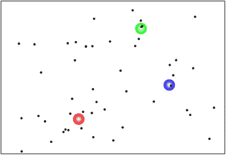

图 10-10。

Particles moving in a field composed of different central forces

如果你运行代码，你会看到大多数粒子都被施加 1/r 力的中心吸引。随着它的移动，它会捕获更多的粒子。这个吸引子的重力占主导地位，因为 1/r 力是一个比 1/r 2 或 1/r 3 力更长范围的力:它随距离衰减得更慢。施加 1/r 3 力的吸引子抓住很少的粒子:它的影响力随着距离迅速衰减。

你可以尝试很多其他的事情；例如，使吸引器以更复杂的方式移动(例如，环绕一个中心或来回移动和弹跳)。你可以添加更多的吸引子或包括反重力。你只是被你的想象力所限制。

## 摘要

你现在有足够多的工具来创造有趣的运动类型。本书的第二部分到此结束。在第三部分中，你将应用你在第二部分中学到的知识来构建由相互作用的粒子或扩展物体组成的更复杂的系统。