# 11.碰撞

这一章讨论了一个在任何动画或模拟中都必然会出现的重要主题:碰撞。更准确地说，它主要关注冲突解决——如何响应冲突事件——而不是冲突检测。冲突检测和冲突解决本身就是一个庞大的课题。一般物体碰撞检测的复杂性超出了本书的范围(因为我们专注于控制运动的物理学)，但粒子之间的碰撞情况要简单得多，这是本章的主要主题。同样，不可能在一章中涵盖冲突解决的所有方面。因此，我们将集中讨论一些最常见的基础知识。具体地说，我们将把注意力限制在粒子与固定壁的碰撞(弹跳)和与其他粒子的碰撞上。

本章涵盖的主题包括以下内容:

*   碰撞及其建模:这个简短的介绍性部分解释了什么是碰撞，并概述了本章将采用的建模方法。
*   从水平或垂直的墙壁反弹:所谓墙壁，我们指的是粒子可以反弹的任何固定的平面。我们从一个球从水平或垂直的墙上反弹的例子开始。这种情况下的冲突解决很简单。反弹或壁摩擦造成的能量损失的影响也可以直接实现。
*   从倾斜的墙壁上反弹:如果墙壁是倾斜的，情况就复杂多了。你将会看到解决与任何倾斜的墙壁碰撞的一般方法。
*   1D 粒子之间的碰撞:当粒子沿着连接它们的线运动时，碰撞是一维的，可以通过应用动量和能量守恒定律以一种直接的方式解决。
*   2D 粒子间的碰撞:最后一节讨论解决更复杂的二维粒子间碰撞的一般方法，这些粒子间的碰撞与连接它们的线成一定角度。

## 碰撞及其建模

我们将从定义本书上下文中的碰撞开始。两个物体之间的碰撞是一种短暂的相互作用，在此期间，它们接触并交换力，然后改变它们的运动。碰撞解决的任务是在碰撞发生后立即确定两个碰撞物体的运动。

在本书的第二部分，你已经习惯了用力来解决运动问题。碰撞通常不是这样处理的。很难对碰撞过程中施加的强大而短暂的力进行建模。通常处理碰撞的方式是通过它们的效果。根据牛顿第二运动定律，我们知道力会引起动量的变化。在第 5 章的[中，这种关系通过脉冲δt 的概念以如下方式表达，其中δp 是脉冲产生的动量变化:](05.html)

对于具有恒定质量 m 的粒子:

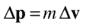

因此:

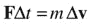

因此，一个大而短暂的碰撞力，换句话说，一个冲量 fδt，会产生一个速度的变化，由前面的公式给出。

处理碰撞的方法是直接计算出速度的变化。如果你回头看[第五章](05.html)，你会回忆起这就是动量守恒原理的全部内容。但是动量守恒本身不足以解决碰撞问题。我们还必须假设碰撞物体的动能会发生什么变化。因此，碰撞所涉及的物理学包括动量和能量两个守恒定律。我们将在下文中或明或暗地应用它们。

概括地说，我们将模拟两种类型的碰撞:粒子-粒子碰撞和粒子-壁碰撞。这里的墙意味着一个不可移动的物体，它的运动本身没有被模拟。具体来说，我们将使用“墙”这个词来指代任何粒子可以从其反弹的固定平面。所以，我们的墙可以是水平的，也可以是垂直的，也可以是倾斜的；它们也可以是边界障碍或放置在模拟空间中任何其他位置的障碍。

## 从水平或垂直墙壁反弹

在碰撞物理学的第一个应用中，我们将看看如何使一个球从 2D 模拟空间中水平或垂直的直墙上反弹，如地板、天花板或房间墙壁。为了便于说明，我们将在这里使用垂直墙，但类似的原则也适用于水平墙。

我们将依次研究弹性和非弹性反弹(球的动能守恒或不守恒的反弹)。

### 弹性弹跳

如果球从墙上弹性反弹，它反弹后的动能必须等于反弹前的动能。因为 k.e. = mv 2 ，这暗示着它的速度大小并没有因为碰撞而改变。

首先考虑球以速度 v 垂直撞击墙壁的特殊情况(见图 [11-1](#Fig1) )。在这种情况下，球也会以直角反弹回来。因此，因为它的速度大小不变，它在反弹后的速度将是-v。

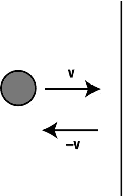

图 11-1。

A ball bouncing off a wall at a right angle

这在代码中很容易实现:在碰撞检测之后，你只需反转速度方向。然而，还有其他的事情要考虑。当检测到碰撞时，球可能已经通过了墙的边缘，稍微穿透了墙。因此，在逆转球的速度之前，你需要将球重新定位在墙的边缘(见图 [11-2](#Fig2) )。这不仅是为了避免球穿透墙壁的视觉效果，也是为了避免球“卡”在墙壁中的潜在问题。如果球的反向速度不足以使其穿出墙壁，则可能出现后一种情况(特别是如果速度也因能量损失而降低，见下一节)。在这种情况下，球的速度将在下一个时间步再次逆转，将其送回墙壁。

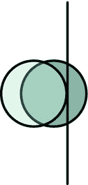

图 11-2。

Repositioning the ball after collision detection

以下代码说明了图 [11-2](#Fig2) 中所示场景的这些步骤，针对名为`ball`的`Ball`实例和名为`wall`的墙对象:

`if (ball.x > wall.x - ball.radius){  // collision detection`

`ball.x = wall.x - ball.radius;  // reposition ball at wall edge`

`ball.vx *= -1; // reverse ball’s velocity`

`}`

这简单的三条线概括了处理球与水平或垂直墙壁垂直碰撞的反弹的整个过程:

Collision detection: simple in this case.   Reposition the particle at the point of collision: in this case, shift it horizontally or vertically so that it just touches the wall.   Calculate the particle’s new velocity just after the collision: here, for elastic collisions normal (perpendicular) to the wall, just reverse the velocity.  

请注意，在步骤 1 和 2 中，前面的代码假设球的位置是其中心位置。例如，如果球的位置被取为其边界框的左上角，那么它的直径应该在相应的代码行中减去。此外，这段代码只涵盖了球从左向右移动的情况，但不难看出如何修改它来将球从右向左移动。

这一切都很好也很简单，但是如果球以一个倾斜的角度击中墙壁(见图 [11-3](#Fig3) )而不是以一个直角击中墙壁呢？在这种情况下，在执行步骤 3 时，我们需要分别考虑垂直和平行于壁面的速度分量。在图 [11-3](#Fig3) 所示的垂直墙的情况下，垂直分量为`ball.vx`，平行分量为`ball.vy`。我们需要像以前一样反转垂直分量，保持平行分量不变。这正是前一段代码所做的，所以它应该也能很好地处理间接影响。在这种情况下，将速度矢量分解为相对于壁面的法向(垂直)和平行(切向)分量的技术似乎是完全自然的。但它的应用更普遍；在下一节中，你会看到它的一个变体适用于两个粒子之间的碰撞。

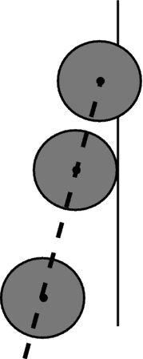

图 11-3。

Ball bouncing off a wall at an oblique angle

如果你需要额外的精确，还有一些你需要担心的事情，这次是关于第二步。再看一下图 [11-3](#Fig3) 。在前面的代码中，我们通过沿 x 方向移动球来重新定位它，使它刚好碰到墙。但是当碰撞是斜的时候，球在碰撞点的真实位置是沿着碰撞线的。所以球也需要沿着 y 方向移动一点。在下一节中，我们将设计一个通用的方法来做到这一点。对于这个简单的例子，让我们只调整 x 位置。在大多数情况下，这应该可以很好地工作并产生平滑的反弹效果(除非您的机器速度很慢，在这种情况下，您可能会发现球偶尔会粘在墙上)。

可下载的文件`wall-bouncing.js`演示了这个简单的例子。代码如下:

`var canvas = document.getElementById('canvas');`

`var context = canvas.getContext('2d');`

`var canvas_bg = document.getElementById('canvas_bg');`

`var context_bg = canvas_bg.getContext('2d');`

`var ball;`

`var wallX = 400;`

`var t0, dt;`

`window.onload = init;`

`function init() {`

`// create a ball`

`ball = new Ball(15,'#000000',1,0,false);`

`ball.pos2D = new Vector2D(100,100);`

`ball.velo2D = new Vector2D(200,50);`

`ball.draw(context);`

`// create a wall`

`context_bg.strokeStyle = '#333333';`

`context_bg.beginPath();`

`context_bg.moveTo(wallX,50);`

`context_bg.lineTo(wallX,350);`

`context_bg.closePath();`

`context_bg.stroke();`

`// make the ball move`

`t0 = new Date().getTime();`

`animFrame();`

`};`

`function animFrame(){`

`animId = requestAnimationFrame(animFrame,canvas);`

`onTimer();`

`}`

`function onTimer(){`

`var t1 = new Date().getTime();`

`dt = 0.001*(t1-t0);`

`t0 = t1;`

`if (dt>0.2) {dt=0;};`

`move();`

`}`

`function move(){`

`moveObject(ball);`

`checkBounce(ball);`

`}`

`function moveObject(obj){`

`obj.pos2D = obj.pos2D.addScaled(obj.velo2D,dt);`

`context.clearRect(0, 0, canvas.width, canvas.height);`

`obj.draw(context);`

`}`

`function checkBounce(obj){`

`if (obj.x > wallX - obj.radius){`

`obj.x = wallX - obj.radius;`

`obj.vx *= -1;`

`}`

`}`

如你所见，`init()`中的代码简单地创建了一个球作为`Ball`对象，并绘制了一条直线来表示一面墙。后续动画代码的大部分是熟悉的。在这里，我们不强加任何力量。所以，球的速度是恒定的，除了和墙碰撞的时候。关键的功能是由`checkBounce()`方法提供的，它包含一段条件代码，与前面给出的一个球与墙壁垂直碰撞的条件代码相同。请注意，如果墙在左侧或水平方向，则必须稍微修改此代码。如果墙既不是水平的也不是垂直的，而是成某个角度，您将需要比`checkBounce()`方法中的那三行代码多得多的代码，您很快就会发现这一点！

### 非弹性反弹

在前面的例子中，我们假设没有动能损失，换句话说，碰撞是弹性的。这样做意味着球以相同的速度反弹回来。在现实世界的碰撞中，总会有一些动能的损失。由于弹跳，很容易包括动能损失的影响。你所要做的就是在反转球的时候，把球垂直于墙的速度乘以一个小于 1 的因子。

因此，在前面的示例中，以下行:

`ball.vx *= -1;`

将被替换为类似这样的内容，其中`vfac`是一个介于 0 和 1 之间的数字:

`ball.vx *= -vfac; // energy loss on bouncing`

值为 1 对应于弹性碰撞，而值为 0 对应于完全非弹性碰撞(稍后会更详细地讨论)，在这种碰撞中，球只是粘在墙上。您可以尝试不同的`vfac`值，看看会得到什么。

当我们讨论一维碰撞时，将速度乘以这个常数因子的原因将变得很清楚。

类似地，您可以通过将球的切向速度(平行于墙壁的速度分量)乘以 0 到 1 之间的系数，以简单的方式模拟墙壁摩擦的影响:

`ball.vy *= vfac2; // wall friction`

请注意，在这种情况下没有负号，因为摩擦力减小了，但没有使切向速度反向。

## 从倾斜的墙上反弹回来

如果球反弹的墙壁与水平面或垂直面成一定角度，情况就会变得复杂得多。同样的步骤也适用于水平墙或垂直墙的情况，但现在实施起来稍微复杂一些。这里可以采取不同的方法。Billy Lamberta 和 Keith Peters (Apress，2011)在《使用 JavaScript 的基础 HTML5 动画》一书中描述了一种常见的方法，即执行坐标旋转以使墙壁水平，进行反弹，然后将坐标系旋转回来。这是一个非常好的方法，我们建议你参考那本书来了解程序的细节。对于我们目前的目的，因为我们使用向量，我们已经设计了一种替代方法，利用向量公式并避免两次坐标旋转。在举例说明如何实施之前，我们详细解释了新方法的步骤。

### 具有倾斜壁的碰撞检测

当从倾斜的墙壁上反弹时，碰撞检测要简单得多，因为这不仅仅是检查球相对于墙壁的 x 或 y 位置的情况。但是从向量的角度思考很有帮助。看一下图 [11-4](#Fig4) ，它显示了一个粒子接近与一面墙的碰撞。发生碰撞基本上必须满足两个条件:

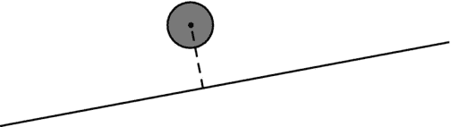

图 11-4。

A ball approaching a wall

*   粒子离壁的垂直距离必须小于它的半径。
*   粒子必须位于墙的端点之间。

有许多方法可以实现这两种情况。我们在这里描述一种可能的方法。图 [11-5](#Fig5) 显示了与图 [11-4](#Fig4) 中的设置相对应的位置和位移矢量图。在该图中，p1 和 p2 是壁的端点相对于原点 O 的位置向量；w 是从标记为 A 的端点(具有位置向量 p1)到另一个端点的向量。类似地，p 是球相对于原点的位置向量，b1 和 b2 是从球到墙的端点的向量，d 是从球到墙的垂直向量(因此 d 等于球到墙的距离 PQ)。注意，我们把一个质点的位置定在它的中心。从`Ball`对象创建的任何`Ball`实例都是如此。

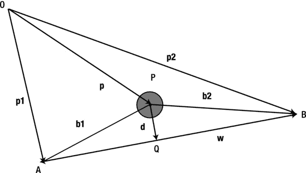

图 11-5。

Vector diagram for analyzing the collision of a ball with an inclined wall

根据这些向量，第一个条件简单如下，其中 r 是球的半径:

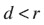

第二个条件可以用矢量 b1 和 b2 在墙壁矢量 w 的方向上的投影 QA 和 QB 来表示。如果这两个投影的长度都小于 w 的长度，这意味着球在墙壁的端点之间。否则，如果任何一个投影超过 w 的长度，球一定在那个范围之外，不会碰到墙。

现在仍然需要计算投影的长度以及与已知向量 p1、p2 和 p 的距离 d。通过使用向量加法的规则，我们得到以下结果:

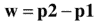

在伪代码中，这是:

`wallVec = wall.p2.subtract(wall.p1);`

通过类似的推理，向量 b1 和 b2 由这些等式给出:

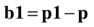

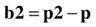

在伪代码中，它们可以写成如下形式:

`ballToWall1 = wall.p1.subtract(ball.pos2D);`

`ballToWall2 = wall.p2.subtract(ball.pos2D);`

那么向量`ballToWall1`和`ballToWall2`在 w 上的投影由下式给出:

`proj1 = ballToWall1.projection(wallVec);`

`proj2 = ballToWall2.projection(wallVec);`

向量 d，在伪代码中我们称之为`dist`，可以通过从 b1 中减去 b1 在 w 上的投影向量来获得。在伪代码中，它可以写成这样:

`dist = ballToWall1.subtract(ballToWall1.project(wallVec));`

本章稍后将介绍`project()`功能。你也许可以用许多不同但等价的方式来表达这些量。我们把它留给你作为练习！

### 重新定位粒子

您在上一节中看到的用于在碰撞检测时重新定位粒子的公式特定于相对于球的位置位于右侧的垂直墙。对于左侧、顶部或底部的墙壁，其形状看起来略有不同。而且如果墙是斜的就不好了。我们需要更好的东西。这就是载体再次出手相救的地方。用矢量方法，有可能得出一个适用于任何粒子速度和任何壁面方向的公式。

图 [11-6](#Fig6) 显示了一个球撞击一面倾斜的墙壁，当球撞击墙壁一小段距离后，碰撞被检测到。如图所示，球必须沿其接近路线向后移动δs = h 的距离(与其速度矢量相反)。这里我们假设速度矢量的方向在这个小区间内是恒定的。如果存在重力这样的力，严格来说这是不正确的，但是因为时间间隔很小，所以速度方向可以作为一个非常好的近似常数。

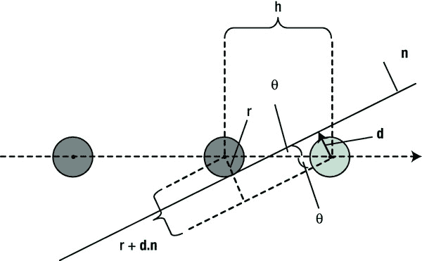

图 11-6。

Repositioning a particle after collision detection with an inclined wall

然后，简单的三角学表明，δs 的大小由以下表达式给出，其中 d 是从碰撞检测点到壁的粒子中心的垂直矢量(因此其大小 d 是粒子到壁的距离)，n 是垂直于壁并指向粒子通常所在侧的单位矢量，θ是粒子的接近线(以及碰撞前的速度)和壁之间的角度:

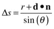

请注意，如果球在碰撞检测点的中心位于墙的前面，则 d 与 n 相反，因此 d∙n =–d；如果它位于墙后，则 d 指向 n，因此 d ∙ n = d。使用点积可以自动处理这两种情况。

在伪代码中，重新定位粒子的位移向量由下式给出:

`displ = particle.velo2D.para(deltaS);`

因此，粒子的位置需要更新如下:

`particle.pos2D = particle.pos2D.subtract(displ);`

与为每面墙使用特殊的非矢量代码相比，这一切看起来既漂亮又简单。

### 计算新的速度

就像水平或垂直墙一样，粒子在反弹后的新速度是通过首先将反弹前的速度分解为平行和垂直于墙的分量，然后反转法线分量来计算的。但是因为墙现在是倾斜的，那些分量不仅仅是粒子的`vx`和`vy`属性。相反，我们必须把它们指定为拥有自身权利的`Vector2D`物体。

参见图 [11-7](#Fig7) 了解如何操作。如果 d 是从质点中心到碰撞点垂直于壁面的矢量，则法向速度是一个矢量，其大小等于质点速度在 d 上的投影，方向与 d 相同。

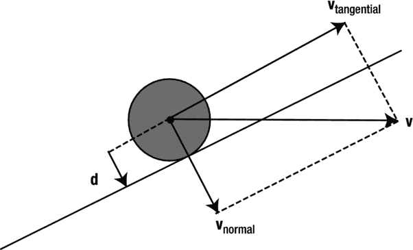

图 11-7。

Decomposing the velocity vector

在伪代码中，如果我们将粒子到墙壁的垂直矢量计算为`dist`，并将粒子表示为`particle`，则使用`Vector2D`对象的`projection()`和`para()`方法，法向速度如下所示:

`normalVelo = dist.para(particle.velo2D.projection(dist));`

回想一下，`vec1.projection(vec2)`给出了矢量`vec1`在`vec2`方向上的投影长度，而`vec.para(mag)`给出了一个平行于矢量`vec`且长度为`mag`的矢量。

我们可以通过在`Vector2D`对象中创建下面的`project()`方法来使代码更加简单:

`function project(vec) {`

`return vec.para(this.projection(vec));`

`}`

因此，`vec1.project(vec2)`给出了矢量`vec2`方向上的矢量，其大小等于`vec1`在`vec2`方向上的投影。用这个新定义的方法，我们可以简单地写出法向速度如下:

`normalVelo = particle.velo2D.project(dist);`

切向速度可以简单地通过从粒子速度中减去法向速度得到(见图 [11-7](#Fig7) ):

`tangentVelo = particle.velo2D.subtract(normalVelo);`

这些是预碰撞速度。假设没有能量损失，碰撞将反转法向速度，同时保持切向速度不变。因此，作为碰撞的结果，粒子的新速度由下式给出:

`particle.velo2D = tangentVelo.addScaled(normalVelo,-1);`

如果反弹导致能量损失，只需用上一节中讨论的分数 v `fac`替换之前代码中的–1。

### 碰撞前的速度修正

如果您正在创建一个包含力(如重力)的模拟，那么还有其他事情需要担心。只要有一个力参与，就意味着粒子在加速(它的速度一直在变)。在这种情况下，当粒子在墙的边缘重新定位时，其速度也必须调整到该点的速度。虽然这看起来像是一个小的修正，但在某些情况下，不这样做可能会导致严重的准确性损失。如果速度随时间变化，这同样适用于水平或垂直墙壁。

让我们考虑一个简单的例子:一个球从一定高度落到水平的地板上。假设当球稍微越过地板时，碰撞被检测到。如果你简单地按照到目前为止给出的程序，你将把球移动到地板的水平，然后逆转它的速度(如果你假设没有因反弹而损失能量)。问题是，由于球在重力作用下加速，它在碰撞检测点的速度比实际碰撞点的速度要高。通过简单地逆转这个速度，你就把它带走了比它应该有的更高的动能，这是因为它从最初的高度下落，失去了势能。结果是球最终会到达比它落下的地方更高的地方！在几次反弹之后，动画可能会变得完全不稳定。当然，如果你在弹跳时实现能量损失，你甚至可能不会注意到这个问题——如果精度不重要，这可能是解决问题的一个简单技巧。但是，如果你想尽可能精确，或者如果模拟的性质不允许你包括能量损失，那么这里是这样做的方法。

目的是在粒子加速的情况下，计算出粒子在碰撞点的速度。我们知道碰撞检测点的速度、加速度和位移。接下来，让我们从加速度的微积分定义开始:

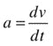

由于一个很快就会变得明显的原因，我们可以把它写成如下形式(你可以把两个 ds 因子看作是“抵消”):

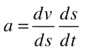

现在，因为 v = ds/dt，我们可以写为:

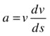

这给了我们一个微分方程，它将我们刚刚讨论的量联系起来。因为我们正在进行离散模拟，所以让我们这样写:

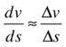

代入前面的等式得出:

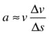

所以:

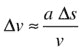

该公式给出了加速度 a 下位移δs 引起的速度变化δv。设 v 为碰撞检测时的速度，v’为碰撞时的速度，因此:

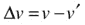

简单代数给出了这个:

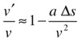

该公式根据加速度(在重力情况下是常数)、碰撞检测点的速度以及粒子从碰撞点到检测到碰撞的位置的位移，给出了碰撞点的速度与碰撞检测点的速度的比值。后一个量在“重新定位粒子”一节中计算出来因此，速度的调整系数可以根据前面公式给出的这些已知量来计算。该公式是针对 1D 情况推导的，因为我们没有使用矢量，但当加速度 a 和位移δs 是可能不在同一方向的矢量时(例如，对于在重力作用下运动的球)，该公式同样适用于 2D。在这种情况下，我们将加速度分解为位移方向，因此实际上我们需要用点积 a .δs 代替乘积 aδs；v 是速度矢量的大小。

让我们将速度校正因子 v'/v 对应的代码变量表示为`vcor`。然后，假设速度的方向在碰撞点和碰撞检测点之间没有太大变化，我们可以用伪代码来写:

`veloAtCollision = veloAtCollisionDetection.multiply(vcor);`

### 例子:一个球从一面倾斜的墙上反弹回来

我们一直在讨论的向量代数可能开始听起来有点沉重了。因此，现在是时候将您在本节中学到的知识整合起来，构建一个完整的示例了。因为我们要在墙壁上做很多弹跳，所以创建一个可重用的`Wall`对象是有意义的。让我们先做那件事。

#### 创建墙对象

`Wall`对象是一个简单的对象，它在两个指定的端点之间画一条线来代表一面墙。端点是`Vector2D`对象。下面是`Wall`对象的完整代码:

`function Wall(p1,p2){`

`this.p1 = p1;`

`this.p2 = p2;`

`this.side = 1;`

`}`

`Wall.prototype = {`

`get dir (){`

`return this.p2.subtract(this.p1);`

`},`

`get normal (){`

`return this.dir.perp(1);`

`},`

`draw: function (context) {`

`context.save();`

`context.strokeStyle = '#000000';`

`context.lineWidth = 1;`

`context.beginPath();`

`context.moveTo(this.p1.x,this.p1.y);`

`context.lineTo(this.p2.x,this.p2.y);`

`context.closePath();`

`context.stroke();`

`context.restore();`

`}`

`}`

由`p1`和`p2`表示的端点在`Wall`的构造函数中作为参数提供。属性`wall.dir`和`wall.normal`通过 getters 定义，getters 分别返回从`p1`到`p2`的向量(沿着墙壁的向量)和垂直于墙壁的单位向量。这些特性的用处将很快变得显而易见。属性将在“处理潜在的‘隧道’问题”一节中讨论

#### 创建墙实例

在文件`wall-object.js`中，我们通过下面这段代码演示了如何创建一个与水平面成斜角的`Wall`实例:

`var p1 = new Vector2D(100,200);`

`var p2 = new Vector2D(250,400);`

`var wall = new Wall(p1,p2);`

`wall.draw(context);`

所以端点向量`p1`和`p2`分别是【100，200】和【250，400】。

#### 让一个球从倾斜的墙上反弹回来

在`bouncing-off-inclined-wall.js`文件中，我们首先创建一个球和一面倾斜的墙，然后使用`calcForce()`中带有重力`Forces.constantGravity`的普通动画代码，使球在重力作用下移动到墙上(见本章后面的图 [11-9](#Fig9) )。`move()`方法添加了一个新方法`checkBounce()`，如下所示:

`function checkBounce(obj){`

`// vector along wall`

`var wdir = wall.dir;`

`// vectors from ball to endpoints of wall`

`var ballp1 = wall.p1.subtract(obj.pos2D);`

`var ballp2 = wall.p2.subtract(obj.pos2D);`

`// projection of above vectors onto wall vector`

`var proj1 = ballp1.projection(wdir);`

`var proj2 = ballp2.projection(wdir);`

`// perpendicular distance vector from the object to the wall`

`var dist = ballp1.addScaled(wdir.unit(), proj1*(-1));`

`// collision detection`

`var test = ((Math.abs(proj1) < wdir.length()) && (Math.abs(proj2) < wdir.length()));`

`if ((dist.length() < obj.radius) &&  test){`

`// angle between velocity and wall`

`var angle = Vector2D.angleBetween(obj.velo2D, wdir);`

`// reposition object`

`var normal = wall.normal;`

`if (normal.dotProduct(obj.velo2D) > 0){`

`normal.scaleBy(-1);`

`}`

`var deltaS = (obj.radius+dist.dotProduct(normal))/Math.sin(angle);`

`var displ = obj.velo2D.para(deltaS);`

`obj.pos2D = obj.pos2D.subtract(displ);`

`// velocity correction factor`

`var vcor = 1-acc.dotProduct(displ)/obj.velo2D.lengthSquared();`

`// corrected velocity vector just before impact`

`var Velo = obj.velo2D.multiply(vcor);`

`// velocity vector component perpendicular to wall just before impact`

`var normalVelo = dist.para(Velo.projection(dist));`

`// velocity vector component parallel to wall; unchanged by impact`

`var tangentVelo = Velo.subtract(normalVelo);`

`// velocity vector component perpendicular to wall just after impact`

`obj.velo2D = tangentVelo.addScaled(normalVelo,-vfac);`

`}`

`// collision at the wall boundaries`

`else if (Math.abs(ballp1.length()) < obj.radius){`

`bounceOffEndpoint(obj,wall.p1);`

`}`

`else if (Math.abs(ballp2.length()) < obj.radius){`

`bounceOffEndpoint(obj,wall.p2);`

`}`

`}`

这段代码很好地反映了前面几节中给出的描述。因此，大部分内容应该是简单明了的(我们保留了注释，这样您可以更容易地理解逻辑)。因此，让我们只关注前面讨论中没有涉及的几个特性。

首先，在碰撞检测后重新定位球的代码中，注意我们检查墙法向量是否与球的速度向量有正的点积；如果是这样，我们反转墙的法向量。要理解这样做的原因，请参考“重新定位粒子”一节，其中我们说过法线必须指向粒子所在的一侧。后一个条件相当于说法向量应该指向，这样它就有一个与球的速度方向相反的法向量分量，因此应该有一个负的点积(见图 [11-8](#Fig8) )。代码强制执行那个条件。但是为什么我们需要在每一个时间点都检查它呢？我们不能一劳永逸地恢复正常吗？原因是这样做，我们考虑到了球可能在墙的底面和顶面反弹的可能性。

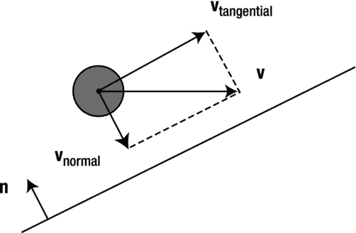

图 11-8。

The unit normal vector to the wall should be oriented opposite to the velocity vector

要指出的第二件事是在`checkBounce()`函数的末尾出现了两个`else if`块。他们在那里处理球在墙的任一端点的半径内的情况。在那种情况下，他们称之为一种新方法:`bounceOffEndpoint()`。这个想法是，从墙壁边缘反弹应该引起不同类型的运动，因此应该以不同的方式处理。我们采用的方法是以类似于两个粒子之间碰撞的方式来处理这种碰撞，另外一个特点是，这里的一个“粒子”，即壁端点，是固定的，半径为零。在`bounceOffEndpoint()`方法中的代码现在可能没有太多意义，但是一旦你在本章后面讲述了粒子间碰撞的内容，它就有意义了。

为了使模拟更具交互性和趣味性，还有一些代码允许您在画布上的任意位置单击和拖动来改变球的位置和大小。释放鼠标后，新球将继续模拟。

花些时间进行模拟实验。单击并拖动以创建不同大小的球，并查看它们如何以自然的方式下落并反弹到倾斜的墙上。拖动时避免球与墙重叠，因为这将导致不稳定的行为。将球释放到墙的端点上，注意它反弹方式的不同。改变重力`g`和能量损失系数`vfac`。仿真截图见图 [11-9](#Fig9) 。

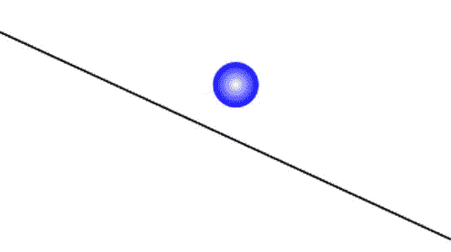

图 11-9。

A ball bouncing off an inclined wall

接下来，将球释放到线的正上方，这样球就开始沿着墙滑下。你可能会发现，如果球只是滑动而没有反弹，它往往会被“卡住”。问题是我们的代码处理冲突解决，而不是联系解决。要伪造接触分辨率，您可以在球的位置向量`pos2D`更新后，通过在`checkBounce()`中引入以下行来欺骗:

`obj.y -= 0.1;`

每次球接触墙壁时，它都会将球稍稍抬高(仅 0.1 像素)。结果是球再次落回墙上，当它沿着墙滑下时，经历了一系列连续的碰撞。用这条额外的线再次运行模拟，看看球现在是如何滑下墙壁的，看起来很平稳。这很容易让人想起我们在第 7 章中使用法向接触力模拟球沿斜面下滑的场景。事实上，这是处理接触分辨率的一种常见方法:使用由“微碰撞”产生的脉冲，而不是通过显式包含法向接触力。

#### 处理潜在的“隧道”问题

我们在上一节中描述并在本模拟中实现的碰撞检测方法在大多数正常情况下应该工作良好。但在某些情况下，特别是如果模拟在慢速机器上运行，并且球很小且移动很快，球可能会在单个时间步长内完全穿过墙壁。在这种情况下，碰撞检测将失败。这就是所谓的隧道效应。如果你把球做得很小(1 px ),然后把它放在离墙很远的地方，你可能会看到这种效果，这样当它碰到墙的时候就达到了很高的速度。球可能会直接穿过墙。

前一节中概述的碰撞检测算法失败，因为第一个条件(粒子比其半径更接近墙壁)从未满足。我们需要修改算法以包含新的可能场景。一个简单的解决方法是测试球的中心是否已经从墙的一边移动到另一边。如果是这样，这意味着它已经“隧道化”，这本身就提供了冲突检测。

我们已经用源文件`bouncing-off-inclined-wall2.js`在模拟的修改版本中实现了这种碰撞检测机制。如果将修改后的代码与原始代码进行比较，您会发现一个关键的变化是在`init()`和`onUp()`方法中加入了新的`checkSide()`和`setSide()`方法:

`function checkSide(){`

`var wdir = wall.dir;`

`var ballp1 = wall.p1.subtract(ball.pos2D);`

`var proj1 = ballp1.projection(wdir);`

`var dist = ballp1.addScaled(wdir.unit(), proj1*(-1));`

`setSide(dist);`

`}`

`function setSide(dist){`

`if (dist.dotProduct(wall.normal) > 0){`

`wall.side = 1;`

`}else{`

`wall.side = -1;`

`}`

`}`

在`checkBounce()`中也调用了`setSide()`方法。这个代码提供了一种方法来跟踪球在任何时候在每面墙的哪一边。为此，它检查从粒子到墙壁的垂直矢量`dist`和墙壁法向量之间的点积的符号。如果符号为负，它将墙的`side`属性设置为–1；否则，它将其设置为 1。`Wall`对象的`side`属性就是专门为此目的而创建的。

`checkBounce()`中另一段重要的新代码检查点积的符号是否反转(这意味着球已经隧穿)；如果是，它将变量`testTunneling Boolean`设置为真:

`var testTunneling;`

`if (wall.side*dist.dotProduct(wall.normal) < 0){`

`testTunneling = true;`

`}else{`

`testTunneling = false;`

`}`

`testTunneling`的值随后被用作碰撞检测测试的一部分:

`if (( (dist.length() < obj.radius) || (testTunneling) ) &&  test){`

`...`

`}`

这就建立了隧道情况下的基本冲突检测。代码中的其余更改应该很容易理解。

如果你测试`bouncing-off-inclined-wall2.js`，你会发现隧道问题已经解决了。

### 示例:球从多面倾斜的墙壁上反弹

在`bouncing-off-multiple-inclined-walls.js`中，我们将前面的模拟归纳为包括几面墙(见图 [11-10](#Fig10) )。看一看源文件；该代码以一种简单明了的方式扩展了前面的示例。首先，你用同样的方法在`init()`中添加更多的墙——四面倾斜的墙，加上四面包围墙，形成一个包围其他墙和球的盒子。`checkBounce()`方法现在在每面墙上循环。它还包括一个新的`hasHitAWall Boolean`变量，用于在检测到与其中一面墙发生碰撞时停止循环。

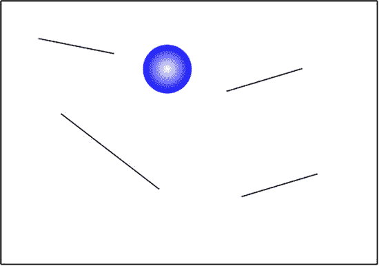

图 11-10。

Ball bouncing off multiple walls

尝试模拟，记住您可以单击并拖动来重新定位和调整球的大小。如前所述，避免定位球，使其与任何墙壁重叠。这样做将引入非物理的初始条件(球不能与墙物理重叠)，这将导致一些方程给出无意义的结果，导致不稳定和不可预测的行为。

查看模拟如何正确处理不同的场景。例如，尝试不同大小的球，并在不同的位置释放它们:在墙壁上方，以便它们弹开；就在墙壁上，让它们滑下来；或者刚好在对他们来说太小的墙壁之间的缝隙上方，这样他们就会被困住。你会看到墙下的碰撞也得到妥善处理。请注意，四面围壁的处理方式与其他围壁完全相同。你也可以在顶壁上方点击拖动，让球从上面弹开！

与前面的模拟一样，您可能会在较慢的机器上遇到隧道问题。为了解决这个问题，我们按照与上一小节中描述的完全相同的方式修改了模拟。修改后的源代码在文件`bouncing-off-multiple-inclined-walls2.js`中。您可能会发现，隧道效应有时仍然会以非常高的速度发生(例如，尝试用超过 1000 px/s 的幅度初始化球的速度)。这里的问题是，我们处于模拟的时间分辨率的极限，这是由你的机器运行它的速度所限制的。

## 1D 粒子间的碰撞

在本节中，我们将向您展示当粒子的接近方向位于连接它们的直线上时，如何处理粒子之间的碰撞。这种情况可以被描述为 1D 碰撞，因为在碰撞前后，粒子的运动都是沿直线进行的。一般来说，两个粒子可能以任何角度碰撞，并在碰撞时改变方向。因此，本节中讨论的案例可能看起来是一个非常特殊的案例。那么为什么要研究它呢？原因是，在这种特殊情况下成立的方法和公式可以很容易地推广到粒子可以以任何角度碰撞的更一般的情况。事实上，我们将在下一节中介绍这一点。

处理 1D 粒子碰撞的步骤如下(与解决垂直于墙壁移动的粒子的反弹的步骤类似):

Collision detection   Repositioning the particles at the moment of collision   Calculating the new velocities just after the collision  

对于球形粒子(在 2D 是圆形)，第一步碰撞检测非常简单。正如在[第 2 章](02.html)中所讨论的，你只需查看两个粒子中心之间的距离 d 是否小于它们的半径之和，其中 d 是使用勾股定理从位置坐标(x 1 ，y 1 )和(x 2 ，y 2 )计算出来的:

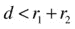

在 2D:

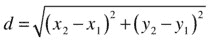

现在让我们看看当检测到碰撞时如何重新定位粒子。

### 重新定位粒子

就像当侦测到碰撞时，一个粒子可能会沉入墙中一段距离，两个粒子也可能会重叠。这种情况的复杂性在于，一般来说，两个粒子都可能在运动，所以两个粒子都需要回到它们实际接触点的位置。但是我们怎么知道每个粒子要移动多少呢？

让我们首先考虑两个粒子相向运动的情况，如图 [11-11](#Fig11) 所示。

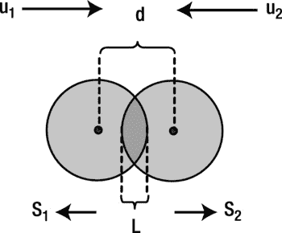

图 11-11。

Separating overlapping particles moving toward each other

重叠量 L 由下式给出，其中 r 1 和 r 2 是两个粒子的半径，d 是它们中心之间的距离，由上一节讨论的毕达哥拉斯公式给出:

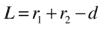

设 s 1 和 s 2 为质点必须沿相反方向移动的位移量，以使它们刚好接触。这些位移必须相加得出重叠距离 L:

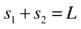

这给出了一个关于已知变量 l 的 s 1 和 s 2 的方程。为了能够计算出 s 1 和 s 2 ，我们需要一个连接它们的第二个方程。我们可以通过回忆得出这样一个等式，在一个小的时间间隔 t 内:

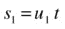

和

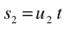

其中 u 1 和 u 2 是碰撞前各自粒子的速度。那只是利用了位移=速度×时间这个事实(见[第四章](04.html))。

将第一个等式除以第二个等式得出:

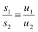

这是我们的第二个方程。现在这是一个简单的代数问题，求解 s 1 和 s 2 给出:

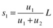

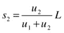

这个结果告诉我们的是，在撞击之前，粒子的位移必须与它们的速度成正比。

这很好，但如果我们有其他可能的情况，其中两个粒子在同一个方向上移动(而不是彼此相向)，后面的一个移动得更快(因此实际上发生了碰撞)，如图 [11-12](#Fig12) 所示。

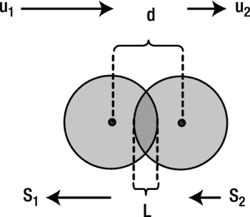

图 11-12。

Overlapping particles moving in the same direction

在这种情况下，连接位移量 s 1 和 s 2 的第一个方程变成如下，而第二个方程不变:

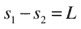

同时求解它们就得到这个:

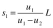

还有这个:

这有点混乱，因为我们有不同的方程，取决于粒子是否相向运动。幸运的是，通过考虑向量位移，可以将两种情况合并成一个解决方案。推理稍微不太直观，但这是最终结果，其中符号|v|表示矢量 v 的大小:

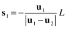

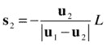

注意，我们总是除以相对速度的大小(u1–u2)。当粒子相互靠近时，这是(u1+u2)；否则为(u1–u2)。因此，在前面讨论的两种情况下，这些方程实际上简化为相应的位移量方程。另一件好事是，这里位移的方向在公式中也是明确的:负号告诉我们 s 1 与 u 1 相反，s 2 与 u 2 相反。

现在，您知道了一旦检测到碰撞，如何重新定位粒子。最后要做的是计算碰撞后碰撞粒子的新速度。我们将对弹性和非弹性碰撞分别做这个。

### 弹性碰撞

回想一下第四章，弹性碰撞是一种动能守恒的碰撞。这意味着除了动量守恒，我们还可以应用动能守恒(在任何碰撞中，无论是否有弹性，动量总是守恒的)。例如，台球之间的碰撞通常被建模为弹性碰撞。

设两个碰撞的粒子(我们可以称之为 particle1 和 particle2)分别有质量 m 1 和 m 2 ，初速度 u 1 和 u 2 ，终速度 v 1 和 v 2 。注意，我们只需要速度的一个分量，因为运动是 1D。那么我们可以把动量守恒和能量守恒写成:

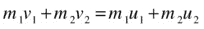

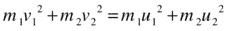

这里粒子的质量 m 1 和 m 2 已知，初速度 u 1 和 u 2 也已知。目的是根据这些已知变量计算最终速度 v 1 和 v 2 。这是一个同时求解这两个方程的问题。最简单的方法是得出一个重要的中间结果，包括碰撞前后粒子的相对速度。所以让我们现在就开始吧。

#### 碰撞粒子的相对速度

推导碰撞粒子的相对速度的第一步是通过组合方程每一侧每个粒子的项来重新排列前面的两个方程(将所有下标为 1 的项放在一侧，下标为 2 的项放在另一侧):

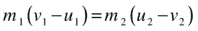

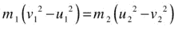

现在回想一下你的学校代数中的下列等式:

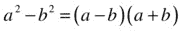

这允许您将第二个等式写成如下:

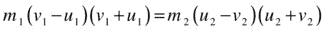

你现在可以看到，这个方程的每一边都包含第一个方程的相应一边作为因子。所以你可以用这个方程除以第一个方程，去掉那些因素，留给我们这个:

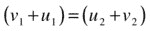

这可以通过结合等式一侧的初始速度(u 变量)和另一侧的最终速度(v 变量)来重新排列，得到:

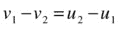

或者，相当于，这个:

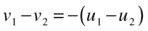

这是我们的结果。注意(u1–u2)是从粒子 2 的角度来看粒子 1 的初始相对速度。同样，(v1–v2)是从粒子 2 的角度来看粒子 1 的最终相对速度。因此，前面的结果告诉我们，两个粒子分离的相对速度是它们相对接近速度的负值。这个结果不取决于粒子的质量，因为 m 1 和 m 2 被抵消了。但是请注意，它只适用于弹性碰撞。在下一节中，我们将看到它是如何被修正用于非弹性碰撞的。

作为这个结果的直接应用，考虑其中一个粒子，比如粒子 2，不可移动的情况(比如一堵墙)。这和说 u 2 = v 2 = 0 是一样的。将这些值代入最后一个等式，我们得到了这个结果:

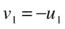

这是一个不可移动的物体的弹性反弹，这是我们在第一个例子中应用的一个球从墙上弹性反弹的条件。

#### 计算弹性碰撞后的速度

利用上一节的结果，现在很容易计算出弹性碰撞后粒子的速度。逻辑是能量守恒被结合到相对速度的方程中:

所以我们需要同时求解这个方程和动量守恒方程:

目标是根据其他变量(初始速度和质量)找到最终速度 v 1 和 v 2 。这可以通过消除两个等式之间的 v 1 或 v 2 来完成，然后重新排列得到的等式以找到另一个。例如，我们首先将第一个等式乘以 m 2 得出:

将此加到第二个等式中，然后去掉 v 2 ，得到:

除以(m 1 +m 2 )得到粒子速度 1 的最终结果:

您可以通过类似的代数运算来计算 v 2 ，但没有必要这样做:您可以交换最后一个等式中的 1 和 2 索引，得到如下结果:

这就是你想要的结果:你现在可以从碰撞前的速度(和粒子的质量)计算出碰撞后两个粒子的速度。

最后注意，你不必从第二个等式计算 v 2 。一旦你知道了 v 1 ，你就可以通过重新排列相对速度的方程来计算出 v 2 ，给出如下公式，这样可以节省 CPU 时间:

#### 一个特例:质量相等的粒子

在具有相同质量的粒子的特殊情况下，它们碰撞后的速度公式具有特别简单的形式。要了解这一点，只需将 m 1 = m 2 = m 代入前面的等式即可得出:

还有这个:

换句话说，粒子只是在碰撞后交换速度！只要粒子具有相同的质量，并且碰撞是弹性的，这一点与粒子的初速度无关。这是一个非常有用的结果。如果您的模拟将只涉及相同质量的粒子之间的弹性碰撞，则没有必要在前面给出的复杂通用公式中编码，从而节省宝贵的 CPU 时间。你可能记得我们在第五章的简单碰撞例子中利用了这个结果。

作为这个特例的特例，如果其中一个粒子初始静止(u 2 = 0)，我们得到 v 1 = 0，v2= u1；另一个粒子在碰撞后突然停止在它的轨道上，而最初静止的粒子以另一个粒子在碰撞前的速度离开。

#### 另一个特例:与质量大得多的粒子碰撞

另一方面，如果一个粒子的质量比另一个大得多(例如，m2>T5】m1)，最终速度的公式简化为:

还有这个:

特别是，如果质量大的粒子(particle2)最初是静止的，u 2 = 0，那么

和

因此，较轻的粒子被较重的粒子反弹，几乎逆转了它的速度。注意到(m 1 /m 2 )是一个远小于 1 的小数字，我们得出 v2<<u1；因此，较重的粒子以比第一个粒子撞击它的速度小得多的速度离开。这都是常识。

### 非弹性碰撞

虽然通常将碰撞建模为弹性的，但现实生活中的大多数碰撞很少是弹性的——它们通常涉及动能的损失，因此是非弹性的。

为了模拟非弹性碰撞，一个有用的起点是碰撞粒子的相对速度——通过引入恢复系数的概念。

#### 恢复系数

恢复系数(用符号 C R 表示)定义为碰撞后的相对速度与碰撞前的相对速度之比。

这个等式可以改写如下:

对于弹性碰撞，碰撞前后的相对速度由等式表示，因此前面的等式告诉我们，对于弹性碰撞，C  R  = 1。

从概念上讲，恢复系数是偏离完全弹性碰撞的一个量度。一般 C R 的值会小于 1。CRT4】1 的碰撞也是可能的；它们对应于产生爆炸力的碰撞，使得粒子碰撞后的总动能大于其初始动能。这种碰撞被称为超弹性碰撞。

C R = 0 的特例是指所谓的完全非弹性碰撞。在这种情况下，相对速度方程简化为:

因此:

换句话说，粒子的最终速度是相同的:它们粘在一起。在完全非弹性碰撞中，动能的损失是最大的，但不是完全的(如果它是完全的，粒子会刚好停止；这将违反动量守恒)。

作为另一个特例，假设其中一个粒子是不可移动的(比如一面墙)。例如，如果粒子 2 是不可移动的，则 u 2 = v 2 = 0，因此相对速度方程给出:

这正是我们在本章前面对涉及能量损失的壁碰撞建模的方式，C R 代表“反弹”因子。

#### 计算非弹性碰撞后的速度

从非弹性碰撞的相对速度方程出发，使用类似于推导相应的弹性碰撞方程的方法，很容易证明非弹性碰撞的最终速度由下式给出:

还有这个:

这是最通用的碰撞公式，因为它还包括作为特例的弹性公式(在上述公式中设 C R = 1，并验证它们简化为弹性碰撞的相应公式)。

#### 完全非弹性碰撞

如果两个粒子的碰撞是完全非弹性的(C R = 0)，最后的方程简化为:

所以两个粒子粘在一起，在碰撞后以相同的速度运动。您可能想要对完全非弹性碰撞建模的示例包括用雪球击中角色，或者发射一颗刺入目标的子弹。

这就完成了我们对 1D 粒子碰撞的讨论。毫无疑问，您渴望看到演示中应用的所有数学知识。您将很快看到一个代码示例，但在此之前，让我们快速讨论一下这如何扩展到 2D。一旦我们解决了这个问题，我们就能够建立模拟来处理 1D 和 2D 碰撞。

## 2D 粒子间的碰撞

我们现在准备研究一般的 2D 碰撞，其中粒子的接近方向不一定是沿着它们中心的连线。处理这种碰撞的方法是求助于一个类似于球与墙碰撞的技巧:在碰撞点(当粒子刚刚接触时)，将每个粒子的速度分解为沿着连接它们的线的法向分量和垂直于该线的切向分量(见图 [11-13](#Fig13) )。启示是，正如在与墙壁的碰撞中，只有法向速度分量受到碰撞的影响；碰撞后切向分量保持不变(假设无摩擦)。此外，法向速度分量的变化方式与 1D 碰撞完全相同(就好像切向分量为零)。那太好了；这意味着，我们可以根据法向速度分量，把任何 2D 碰撞当作 1D 碰撞。

图 11-13。

Resolving velocity normal and parallel to line joining particles

所以处理 2D 粒子碰撞的步骤如下:

Detecting the collision   Decomposing the initial velocities in normal and tangential components   Repositioning the particles at the moment of collision   Calculating the new normal velocities just after the collision   Adding the new normal velocity components back to the tangential components  

与处理 1D 碰撞的过程相比，额外的步骤是步骤 2 和 5。还要注意，在步骤 3 中，使用我们为 1D 碰撞导出的相同公式(参见“重新定位粒子”一节)重新定位粒子，但是使用法线速度。

正如在“从倾斜的墙壁反弹”一节中提到的，我们发现人们用来处理 2D 碰撞的通常方法是旋转坐标系，执行 1D 碰撞，然后旋转回坐标系。但是有了向量，我们建议的方法实际上证明更简单:代替坐标旋转，我们简单地解析向量，然后再把它们加起来。让我们来看看实际使用的方法！

### 例子:两个粒子之间的 2D 碰撞

我们将创建一个模拟，可以处理两个粒子之间的一般 2D 碰撞。显然，只要选择适当的粒子初始位置和速度，它也能处理 1D 碰撞。这个例子将把我们已经讨论过的粒子间碰撞的所有内容汇集在一起。

#### 创建两粒子碰撞模拟器

创建这个两粒子碰撞模拟器示例的代码在文件`ball-collision.js`中。`init()`方法创建两个粒子作为`Ball`实例，并在调用动画代码之前设置它们的初始大小、质量、位置和速度:

`function init() {`

`// create a ball`

`ball1 = new Ball(15,'#ff0000',1,0,true);`

`ball1.pos2D = new Vector2D(0,200);`

`ball1.velo2D = new Vector2D(250,0);`

`ball1.draw(context);`

`ball2 = new Ball(75,'#0000ff',125,0,true);`

`ball2.pos2D = new Vector2D(300,200);`

`ball2.velo2D = new Vector2D(50,0);`

`ball2.draw(context);`

`// make the ball move`

`t0 = new Date().getTime();`

`animFrame();`

`}`

我们正在创建一个半径为 15 像素和 1 质量单位的小球和一个半径为 75 像素和 125 质量单位的大球。请注意，我们已经根据 3D 几何缩放了半径立方的质量(回想一下，球体的体积= 4πr 3 /3)，并假设两个球具有相同的密度(回想一下，质量=密度×体积)。在此基础上，由于大球的半径是小球的 5 倍，其质量应该是小球的 125 倍。

在代码的动画部分，`move()`方法依次移动每个球，然后在每个时间步检查碰撞:

`function move(){`

`context.clearRect(0, 0, canvas.width, canvas.height);`

`moveObject(ball1);`

`moveObject(ball2);`

`checkCollision();`

`}`

`checkCollision()`方法如下所示:

`function checkCollision(){`

`var dist = ball1.pos2D.subtract(ball2.pos2D);`

`if (dist.length() < (ball1.radius + ball2.radius) ) {`

`// normal velocity vectors just before the impact`

`var normalVelo1 = ball1.velo2D.project(dist);`

`var normalVelo2 = ball2.velo2D.project(dist);`

`// tangential velocity vectors`

`var tangentVelo1 = ball1.velo2D.subtract(normalVelo1);`

`var tangentVelo2 = ball2.velo2D.subtract(normalVelo2);`

`// move particles so that they just touch`

`var L = ball1.radius + ball2.radius-dist.length();`

`var vrel = normalVelo1.subtract(normalVelo2).length();`

`ball1.pos2D = ball1.pos2D.addScaled(normalVelo1,-L/vrel);`

`ball2.pos2D = ball2.pos2D.addScaled(normalVelo2,-L/vrel);`

`// normal velocity components after the impact`

`var m1 = ball1.mass;`

`var m2 = ball2.mass;`

`var u1 = normalVelo1.projection(dist);`

`var u2 = normalVelo2.projection(dist);`

`var v1 = ((m1-m2)*u1+2*m2*u2)/(m1+m2);`

`var v2 = ((m2-m1)*u2+2*m1*u1)/(m1+m2);`

`// normal velocity vectors after collision`

`normalVelo1 = dist.para(v1);`

`normalVelo2 = dist.para(v2);`

`// final velocity vectors after collision`

`ball1.velo2D = normalVelo1.add(tangentVelo1);`

`ball2.velo2D = normalVelo2.add(tangentVelo2);`

`}`

`}`

代码严格遵循前面小节中给出的解释，代码中的注释应该清楚地说明每一步发生了什么。事实上，这种代码比斜壁反射的相应代码简单得多。还要注意两个球的对称性。代码的简单性和相对简洁性，提供了一种我们认为有吸引力的替代方法，可以替代旋转坐标系来解决倾斜碰撞。

最后，计算最终速度的公式假设了弹性碰撞，但是用非弹性碰撞的另一个(更一般的)公式来代替它是一件简单的事情。我们把这个留给你做练习。

#### 粒子碰撞模拟实验

如果你运行粒子碰撞模拟，你会看到小球与大球发生 1D 碰撞(见图 [11-14](#Fig14) )。让我们开始实验，验证我们在讨论 1D 弹性碰撞的特殊情况时所做的一些观察。

图 11-14。

A two-particle collision simulator

首先，简单地通过注释掉`ball-collision.js`中设置其速度的行，将大的那个的初始速度设置为零。你会看到小球在碰撞后几乎逆转了速度，而大球以非常小的速度离开，就像我们之前说的那样。

接下来，通过用以下修改后的行替换实例化第二个球的行，使第二个球的大小和质量与第一个球相同:

`var ball2 = new Ball(15,'#0000ff',1,0,true);`

保持第二个球的速度为零并运行代码。你会看到，在碰撞时，第一个球正好停在它的轨道上，而第二个球以第一个球的初速度离开。这再一次证实了我们先前根据支配碰撞方程式所做的推论。

这是一个完整的 2D 碰撞模拟器，为什么不让球以一个角度碰撞呢？例如，在保持两个粒子的质量和大小相同的同时，尝试以下方法:

`ball1.velo2D = new Vector2D(100,-30);`

`ball2.velo2D = new Vector2D(-50,-30);`

这表明我们的基本 2D 粒子碰撞模拟器可以正确处理 1D 和 2D 碰撞。现在让我们增加一点复杂性。

### 示例:多个粒子碰撞

扩展前面的模拟以处理大量粒子只是创建更多的球实例，然后检查每对粒子之间的碰撞。在`multiple-ball-collision.js`中，我们创建了九个相同大小和质量的粒子，并用`move()`方法制作了每个粒子的动画，如下所示:

`function move(){`

`context.clearRect(0, 0, canvas.width, canvas.height);`

`for (var i=0; i<numBalls; i++){`

`var ball = balls[i];`

`moveObject(ball);`

`}`

`checkCollision();`

`}`

`checkCollision()`方法非常类似于`ball-collision.js`中的两粒子版本，主要区别在于当前版本中的双`for`循环:

`function checkCollision(){`

`for (var i=0; i<balls.length; i++){`

`var ball1 = balls[i];`

`for(var j=i+1; j<balls.length; j++){`

`var ball2 = balls[j];`

`//` `code in here is similar to ball-collision.js`

`}`

`}`

`}`

循环的关键任务是挑选所有可能的粒子对，而不用重复计算。所以第一个循环遍历了`balls`数组的所有元素，从中挑选出第一个球`ball1`。然后，第二个循环再次遍历`balls`的元素来选择`ball2`，但是这次是从`ball1`的下一个元素开始。这避免了检查`ball1`和`ball2`之间的碰撞，然后再次检查`ball2`和`ball1`之间的碰撞。

九个球最初被随机放置在画布上。给定它们朝向画布中心的速度，速度大小与它们离中心的距离成比例。当运行模拟时，球移动到中心，在那里它们快速连续碰撞多次，结果它们向外反弹。随意试验不同的配置和初始速度。

### 示例:具有反弹的多个粒子碰撞

前面的例子很有趣，但是粒子在分离并消失在画布区域之外之前只发生了短暂的碰撞。限制它们，让它们一次又一次地碰撞，会有趣得多。为此，我们需要引入限制墙。所以，让我们结合本章所学的一切，建立最后一个涉及多个粒子相互碰撞以及与墙壁碰撞的例子。粒子也将具有不同的大小和质量。

我们称这个新文件为`molecules.js`,因为结果看起来会像气体分子四处跳动。下面是`molecules.js`中的`init()`方法:

`function init() {`

`balls = new Array();`

`for(var i = 0; i < numBalls; i++){`

`var radius = Math.random()*20 + 5;`

`var mass = 0.01*Math.pow(radius,3);`

`var ball = new Ball(radius,'#666600',mass,0,true);`

`ball.pos2D = new Vector2D(Math.random()*(canvas.width-2*radius)+radius, Math.random()*(canvas.height-2*radius)+radius);`

`ball.velo2D = new Vector2D(((Math.random()-0.5)*100),((Math.random()-0.5)*100));`

`balls.push(ball);`

`ball.draw(context);`

`}`

`walls = new Array();`

`var wall1 = new Wall(new Vector2D(canvas.width,0),new Vector2D(0,0));`

`wall1.draw(context_bg);`

`walls.push(wall1);`

`var wall2 = new Wall(new Vector2D(canvas.width,canvas.height),new Vector2D(canvas.width,0));`

`wall2.draw(context_bg);`

`walls.push(wall2);`

`var wall3 = new Wall(new Vector2D(0,canvas.height), new Vector2D(canvas.width,canvas.height));`

`wall3.draw(context_bg);`

`walls.push(wall3);`

`var wall4 = new Wall(new Vector2D(0,0),new Vector2D(0,canvas.height));`

`wall4.draw(context_bg);`

`walls.push(wall4);`

`t0 = new Date().getTime();`

`animFrame();`

`}`

我们首先创建一组随机半径从 5 px 到 25 px 的球，其质量与半径的立方成比例。球被随机放置在画布上，并被赋予最大 50 px/s 的随机速度。然后在画布的边缘创建四面墙。然后调用动画代码。

代码的其余部分基本上是用于多个碰撞粒子(前面的例子)和从多个墙壁反弹的代码的混合。因此，除了它们的组合方式之外，没有什么实质性的新东西。`move()`方法与前面多个粒子碰撞的例子相同。除了在外部的`for`循环中增加了一行代码之外，`checkCollision()`方法与前面的例子几乎相同(在下面的清单中以粗体显示):

`function checkCollision(){`

`for (var i=0; i<balls.length; i++){`

`var ball1 = balls[i];`

`for(var j=i+1; j<balls.length; j++){`

`var ball2 = balls[j];`

`var dist = ball1.pos2D.subtract(ball2.pos2D);`

`if (dist.length() < (ball1.radius + ball2.radius) ) {`

`// normal velocity vectors just before the impact`

`var normalVelo1 = ball1.velo2D.project(dist);`

`var normalVelo2 = ball2.velo2D.project(dist);`

`// tangential velocity vectors`

`var tangentVelo1 = ball1.velo2D.subtract(normalVelo1);`

`var tangentVelo2 = ball2.velo2D.subtract(normalVelo2);`

`// move particles so that they just touch`

`var L = ball1.radius + ball2.radius-dist.length();`

`var vrel = normalVelo1.subtract(normalVelo2).length();`

`ball1.pos2D = ball1.pos2D.addScaled(normalVelo1,-L/vrel);`

`ball2.pos2D = ball2.pos2D.addScaled(normalVelo2,-L/vrel);`

`// normal velocity components after the impact`

`var m1 = ball1.mass;`

`var m2 = ball2.mass;`

`var u1 = normalVelo1.projection(dist);`

`var u2 = normalVelo2.projection(dist);`

`var v1 = ((m1-m2)*u1+2*m2*u2)/(m1+m2);`

`var v2 = ((m2-m1)*u2+2*m1*u1)/(m1+m2);`

`// normal velocity vectors after collision`

`normalVelo1 = dist.para(v1);`

`normalVelo2 = dist.para(v2);`

`// final velocity vectors after collision`

`ball1.velo2D = normalVelo1.add(tangentVelo1);`

`ball2.velo2D = normalVelo2.add(tangentVelo2);`

`}`

`}`

`checkWallBounce(ball1);`

`}`

`}`

额外的一行告诉代码查看`ball1`是否与任何墙壁发生碰撞。这里给出的`checkWallBounce()`方法是为了完整性，但它本质上与`bouncing-off-multiple-inclined-walls.js`中的相同，除了我们去掉了处理墙端点反弹的代码，因为在这个例子中没有空闲的墙端点可以反弹:

`function checkWallBounce(obj){`

`var hasHitAWall = false;`

`for (var i=0; (i<walls.length && hasHitAWall==false); i++){`

`var wall = walls[i];`

`var wdir = wall.dir;`

`var ballp1 = wall.p1.subtract(obj.pos2D);`

`var ballp2 = wall.p2.subtract(obj.pos2D);`

`var proj1 = ballp1.projection(wdir);`

`var proj2 = ballp2.projection(wdir);`

`var dist = ballp1.addScaled(wdir.unit(), proj1*(-1));`

`var test = ((Math.abs(proj1) < wdir.length()) && (Math.abs(proj2) < wdir.length()));`

`if ((dist.length() < obj.radius) &&  test){`

`var angle = Vector2D.angleBetween(obj.velo2D, wdir);`

`var normal = wall.normal;`

`if (normal.dotProduct(obj.velo2D) > 0){`

`normal.scaleBy(-1);`

`}`

`var deltaS = (obj.radius+dist.dotProduct(normal))/Math.sin(angle);`

`var displ = obj.velo2D.para(deltaS);`

`obj.pos2D = obj.pos2D.subtract(displ);`

`var normalVelo = obj.velo2D.project(dist);`

`var tangentVelo = obj.velo2D.subtract(normalVelo);`

`obj.velo2D = tangentVelo.addScaled(normalVelo,-vfac);`

`hasHitAWall = true;`

`}`

`}`

`}`

图 [11-15](#Fig15) 显示了运行代码时你会看到的截图:气体分子四处跳动！请注意，小分子通常比大分子移动得快，因为当大分子与它们碰撞时，它们可以获得大量动量。玩这个模拟或者只是简单地看一下，会浪费很多时间！为了让它更有趣，在源代码中我们还包括了一个模拟的修改版本(`molecules2.js`)，允许你通过点击和拖动来添加你自己的粒子。对于大量的粒子，你可能会发现它们中的一些，尤其是较小的粒子，偶尔会从限制壁中穿出。您可以使用“从倾斜的墙壁反弹”一节中描述的方法来解决这个问题

图 11-15。

“Molecules” bouncing off each other and off walls

您可能还会发现，由于随机定位，一些粒子在最初创建时会重叠。这将导致一些最初的不稳定行为，这些行为应该会在几个时间步长内自行解决。大量粒子也可能出现其他问题(除了你的计算机无法处理的明显问题)，特别是如果它们被塞进一个小空间或者高速移动。例如，你可以让一个粒子与另外两个粒子在同一时间步内发生碰撞。或者，您可以让一个粒子重新定位，并最终与附近的另一个粒子重叠。我们可以详细讨论处理这些情况的方法，但是我们在这一章已经讲了很多，需要在某个地方停下来！

## 摘要

在这一章中，我们已经从一个简单的演示一个球从一个垂直的墙壁上反弹到创建复杂的模拟，包括粒子从多个倾斜的墙壁上反弹以及粒子与其他粒子碰撞。我们已经相当详细地讨论了基础物理学，讨论了 1D 和 2D 中控制不同类型碰撞的方程式。在实现壁和粒子之间的碰撞解决时，我们引入了一种使用矢量代数的新方法，避免了通常需要执行坐标旋转来解决 2D 中的碰撞。我们看到的一系列例子在一个有趣的模拟中达到高潮，多个粒子碰撞，表现得像气体分子。在下一章中，我们将继续探索一系列视觉和动画效果，这些效果可以通过包含大量粒子的系统来实现。