# 13.扩展对象

在本书的大部分内容中，我们集中讨论了粒子的运动。在这一章中，我们将探索支配延伸物体运动的物理学。这个主题很重要，原因显而易见:日常生活中的物体在空间中延伸，具有各种形状、大小和行为。为了模拟扩展对象的运动，我们需要涵盖一些额外的物理和方法。这是一个很大的主题，可以很容易地写满几章，甚至一整本书。因此，我们在报道中有所选择，集中于两个主题，我们可以充分深入地报道，以提供一个良好的介绍，而不是提供一个更广泛但更肤浅的介绍。

本章涵盖的主题包括以下内容:

*   刚体:刚体是具有固定形状和大小的扩展对象。除了改变它的位置，这样的物体也可以旋转来改变它的方向。我们将涵盖刚体动力学、滚动和刚体碰撞，并用许多不同的例子来说明它们。
*   可变形物体:物体如绳子和衣服可以改变它们的形状。我们可以通过质量弹簧系统来模拟这种可变形物体，建立在第 8 章讨论的原理上。

这一章的大部分内容是关于刚体的，关于变形体的讨论要短得多。

## 刚体

刚体被定义为当力施加到其上时保持其形状和大小的物体。换句话说，刚体在力的作用下不会变形。刚体的概念是一个理想化的概念，因为在现实中，几乎所有的物体在受到力的作用时都会发生一些变形，即使是微小的变形。然而，当对许多对象的运动进行建模时，通常可以忽略任何这样的变形，并且仍然可以获得良好的结果。这是我们将在本节中采用的方法。

### 刚体建模的基本概念

在我们能够模拟刚体的运动之前，我们需要回顾前面章节中的一些相关概念，并介绍一些新的概念。这些概念将在下一节集中在一起，形成支配刚体转动的定律。

#### 刚体运动与粒子运动

与质点运动相比，刚体运动的关键区别在于，刚体既可以转动，也可以平移。刚体的平移运动遵守与质点相同的定律(如[第五章](05.html)所述)。我们现在必须讨论如何分析旋转运动。

#### 旋转运动学

在[第 9 章](09.html)中，我们看了旋转运动的运动学，引入了角位移θ、角速度ω、角加速度α等概念。简单回顾一下，以下是这些量的定义公式:

角速度:

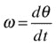

角加速度:

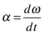

这些旋转运动变量与相应的线性变量相关，例如:

线性位移和角位移:

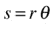

线速度和角速度:

线性(切向)和角加速度:

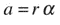

在刚体旋转的情况下，这些公式给出了在没有平移运动的情况下，或者除了平移运动之外，刚体上距离旋转中心距离为 r 的点的位移、速度和切向加速度。

除了切向加速度，还有一个向心(径向)加速度，由以下公式给出:

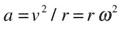

请注意，刚体上的所有点必须具有相同的角位移、角速度和角加速度，而这些量的线性对应关系取决于距旋转中心的距离 r。

我们还将使用前面的量和公式的矢量等价物。例如，角速度实际上是一个矢量ω，其方向垂直于旋转平面，方向如图 [13-1](#Fig1) 所示。因此，作为角速度导数的角加速度也是矢量α。

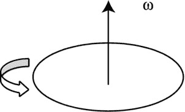

图 13-1。

Angular velocity as a vector

#### 在画布元素上旋转刚体对象

如何在画布元素上旋转对象？在第 9 章中，我们通过旋转整个画布来实现。回想一下，在进行旋转之前，我们首先必须移动画布，使其原点位于对象的中心。旋转画布后，在绘制对象之前，我们将画布平移回其原始位置。如果有许多对象正在被动画，这个过程必须在每个时间步为每个对象重复。肯定有更好的方法来做到这一点。

虽然在画布元素上绘制单个对象后不能旋转它们，但是您可以首先控制绘制它们的方向。在动画中，如果您跟踪对象的方向，那么您可以在每个时间步长以稍微不同的方向重新绘制它。

为了说明这个想法的应用，让我们从[第 9 章](09.html)中翻出`wheel-demo.js`模拟和`Wheel`对象，并对它们做一些小的修改。在`wheel.js`中，我们在构造函数中添加了一个`rotation`属性来跟踪轮子实例的方向。`rotation`的值将以弧度表示一个角度，初始值为 0:

`this.rotation = 0;`

然后，在`Wheel`的`draw()`方法中，我们修改了绘制轮辐的代码，如粗体所示:

`for (var n=0; n<nums; n++){`

`context.moveTo(this.x,this.y);`

`context.lineTo(this.x + ir*Math.cos(2*Math.PI*n/nums``+ this.rotation``), this.y + ir*Math.sin(2*Math.PI*n/nums``+ this.rotation`T4】

`}`

通过这一修改，`draw()`方法将轮子实例的旋转添加到它绘制每个辐条的角度上。

接下来我们从第九章的[修改`wheel-demo.js`，称新文件为`wheel-rotate.js`。在这个文件中，我们去掉了`onTimer()`中执行画布转换的代码行:](09.html)

`context.save();`

`context.translate(wheel.x,wheel.y);`

`context.rotate(angle);`

`context.translate(-wheel.x,-wheel.y);`

`context.restore();`

我们用单行替换这五行:

`wheel.rotation = angle;`

运行代码，你会发现它产生的动画与第 9 章中的动画一模一样。但是这段代码更简单、更优雅、更高效。在这个简单的例子中，性能的提高可能并不明显，但是如果正在制作大量旋转对象的动画，性能的提高可能是相当可观的。

#### 多边形对象和旋转多边形

我们在上一节中使用的方法可以适用于旋转除轮子以外的其他类型的对象。在这一章中，我们将会经常用到多边形，所以让我们创建一个多边形对象并应用这个方法:

`function Polygon(vertices,color,mass){`

`if(typeof(color)==='undefined') color = '#0000ff';`

`if(typeof(mass)==='undefined') mass = 1;`

`this.vertices = vertices;`

`this.color = color;`

`this.mass = mass;`

`this.x = 0;`

`this.y = 0;`

`this.vx = 0;`

`this.vy = 0;`

`this.angVelo = 0;`

`}`

`Polygon.prototype = {`

`get pos2D (){`

`return new Vector2D(this.x,this.y);`

`},`

`set pos2D (pos){`

`this.x = pos.x;`

`this.y = pos.y;`

`},`

`get velo2D (){`

`return new Vector2D(this.vx,this.vy);`

`},`

`set velo2D (velo){`

`this.vx = velo.x;`

`this.vy = velo.y;`

`},`

`set rotation (angle){`

`for (var i=0; i<this.vertices.length; i++){`

`this.vertices[i] = this.vertices[i].rotate(angle);`

`}`

`},`

`draw: function (ctx) {`

`var v = new Array();`

`for (var i=0; i<this.vertices.length; i++){`

`v[i] = this.vertices[i].add(this.pos2D);`

`}`

`ctx.save();`

`ctx.fillStyle = this.color;`

`ctx.beginPath();`

`ctx.moveTo(v[0].x,v[0].y);`

`for (var i=1; i<v.length; i++){`

`ctx.lineTo(v[i].x,v[i].y);`

`}`

`ctx.lineTo(v[0].x,v[0].y);`

`ctx.closePath();`

`ctx.fill();`

`ctx.restore();`

`}`

`}`

多边形对象有三个参数:`vertices, color`和`mass`。这里感兴趣的是第一个，`vertices`。这是一个`Vector2D`对象的数组，指定要创建的多边形实例的顶点的位置向量。这些位置向量相对于多边形对象的位置，由`x`和`y`值指定。对于正多边形，这将是其几何中心的位置。`draw()`方法通过连接这些顶点来绘制多边形。属性在这里的工作方式不同于在对象中的工作方式。这里使用一个 setter 来旋转多边形的顶点，旋转角度指定为`rotation`的值。这是通过使用新创建的`Vector2D`对象的`rotate()`方法完成的，该方法将一个向量旋转指定的角度作为它的参数(以弧度为单位)。其定义如下:

`function rotate(angle){`

`return new Vector2D(this.x*Math.cos(angle) - this.y*Math.sin(angle), this.x*Math.sin(angle) + this.y*Math.cos(angle));`

`}`

它用了一些三角学来做这个，你可以试着把它当成一个练习。

`polygon-rotate.js`文件给出了一个如何使用`Polygon`对象创建一个多边形并使其旋转的例子:

`var canvas = document.getElementById('canvas');`

`var context = canvas.getContext('2d');`

`var v = 10;       // linear velocity in pixels per second`

`var w = 1;        // angular velocity in radians per second`

`var angDispl = 0; // initial angular displacement in radians`

`var dt = 30/1000; // time step in seconds = 1/FPS`

`// create a polygon`

`v1 = new Vector2D(-100,100);`

`v2 = new Vector2D(100,100);`

`v3 = new Vector2D(150,0);`

`v4 = new Vector2D(100,-100);`

`v5 = new Vector2D(-100,-100);`

`var vertices = new Array(v1,v2,v3,v4,v5);`

`var polygon = new Polygon(vertices);`

`polygon.x = 300;`

`polygon.y = 300;`

`polygon.draw(context);`

`setInterval(onTimer, 1/dt);`

`function onTimer(evt){`

`polygon.x += v*dt;`

`angDispl = w*dt;`

`polygon.rotation = angDispl;`

`context.clearRect(0, 0, canvas.width, canvas.height);`

`polygon.draw(context);`

`}`

如您所见，此代码的工作方式与上一节中修改后的 wheel 示例相同，只需更新时间循环中多边形实例的 rotation 属性值，而无需调用 canvas 变换。

正如本节开始时指出的，您可以采用这种方法来处理其他类型的对象。当`line`属性被指定为`true`时，我们通过定义对应于在`Ball`实例上绘制的线的端点的“顶点”,在`Ball`对象中实现了它的变体。看看本章源代码中修改过的`ball.js`文件。`Ball`在绘制实例之前，只需改变它们的`rotation`属性，就可以使实例旋转，如`ball-rotate.js`示例文件所示。

#### 力的转动效应:扭矩

假设一个刚体静止，我们想平移它(给它一点线速度)。我们如何做到这一点？我们需要施加一个力。但是如果我们想让它绕给定的轴旋转，我们必须做什么呢？我们再次需要施加一个力。但是力的作用线不能通过轴。力的转动效应被称为力矩或扭矩，定义为力与其作用线离轴的垂直距离的乘积(见图 [13-2](#Fig2) ):

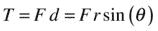

这里，θ是力 F 和从旋转中心到力的作用点的矢量 r 之间的角度。

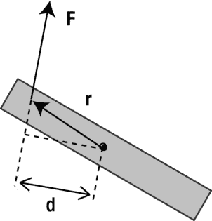

图 13-2。

Definition of torque due to a force

在矢量形式中，它如下:

请注意，矢量积是不可交换的，因此乘积的执行顺序很重要。因为两个矢量的矢量积给出了一个垂直于两者的矢量，如果 r 和 F 在纸的平面上，转矩将指向纸的内部或外部(参见第 3 章中的“矢量相乘:矢量或叉积”一节，了解如何计算出合成矢量的方向)。

从这个定义可以清楚地看出，如果力的作用线通过轴，转矩为零。一般来说，一个力既会产生线性加速度，又会产生转向效应。

#### 质心

从上一节我们所说的，你可以看到，如果一个物体可以自由移动(没有任何约束)，你对它施加一个力，它将同时经历平移和旋转。如果力的作用线通过一个称为物体质心的特殊点，就会出现例外。在这种情况下，施加的力只产生平移，而不产生旋转。

质心是一个通用概念，适用于点粒子的集合，也适用于扩展对象。在这两种情况下，它都代表系统整体质量的作用位置。对于位于位置 r 1 ，r 2 ，…的质量为 m 1 ，m 2 ，…的点粒子集合，质心的位置矢量由以下公式给出:

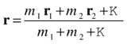

所以我们把粒子的乘积 m r 向量相加，然后除以它们的总质量。使用代表 sum 的符号σ，我们可以用下面的速记形式写出这个公式:

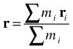

对于刚体来说，这个公式的推广是通过把物体看作是由连续分布的质点组成的。然后可以使用微积分公式计算刚体的质心:

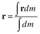

这个公式的分母简单地等于刚体的总质量。质心的位置将取决于物体的形状及其质量的分布。对于对称且质量分布均匀的物体，质心位于其几何中心。例如，球体的质心位于其中心。其他物体如长方体、圆盘和矩形也是如此。

质心很重要，有两个原因。首先，它提供了粒子动力学和刚体动力学之间的联系:就其平移运动而言，刚体可以被认为是位于其质心的粒子。第二，刚体运动的分析，如果用以质心为原点的坐标系来表示，就简单多了。

#### 转动惯量

我们说过转矩是旋转运动的力的模拟:转矩是角加速度的原因。质量(惯性)的旋转模拟是什么？这可能不明显，但是，正如下一节将要演示的，它是一个称为惯性矩的量。惯性矩定义为组成粒子系统或刚体的所有粒子的 mr 2 之和，其中 m 是粒子的质量，r 是其与旋转轴的距离。因此，对于离散的粒子系统，惯性矩(用符号 I 表示)的定义如下:

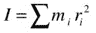

这个公式告诉我们，粒子的质量越大，或者它们离轴的距离越大，转动惯量就越大。

对于质量的连续分布，如刚体，相应的微积分定义如下:

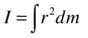

这两个公式都告诉我们，转动惯量是一个量化刚体中质量分布的性质。使用微积分公式，可以计算出 2D 和三维中各种规则刚体的转动惯量。结果是一个关于刚体的总质量和一些线性尺寸的公式。

例如，质量为 m、半径为 r 的空心球体绕通过其中心的轴的惯性矩由以下公式给出:

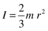

因为惯性矩取决于质量分布，相同质量 m 和半径 r 的实心球体具有不同的惯性矩，由以下公式给出:

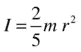

因此，与相同质量和半径的实心球相比，空心球的惯性矩更大(因此更难旋转)。

惯性矩也取决于旋转所围绕的轴。例如，图 [13-3](#Fig3) 所示的实心圆柱体绕 x 轴和 y 轴的惯性矩由以下公式给出(其中 m 为其质量，r 为其圆形横截面的半径，h 为其高度):

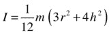

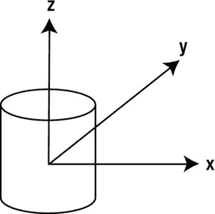

图 13-3。

Rotation of a solid cylinder about different axes

相同圆柱体绕 z 轴的相应惯性矩由不同的公式给出:

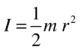

你可以在物理或工程教科书和网站上找到各种 2D 和 3D 物体的转动惯量。

#### 角动量

另一个重要的概念是角动量，它是线性动量的旋转模拟。对于一个绕着一个距离它 r 的中心旋转的粒子，角动量(用符号 L 表示)被定义为它的线性动量和距离 r 的乘积:

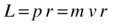

在矢量形式中，角动量矢量是位置矢量和动量矢量的矢量积:

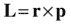

利用线速度和角速度之间的关系 v = rω，得出:

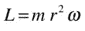

因此，对于所有以相同角速度ω旋转的粒子的集合，总角动量由下式给出:

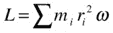

使用惯性矩的定义，得出以下结果:

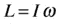

在向量形式中，它是这样的:

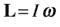

根据惯性矩的适当微积分定义，这个结果也适用于刚体。

### 建模刚体

有了刚体概念的知识，我们现在可以构建一些基本的 JavaScript 对象来帮助我们创建刚体。

#### 创建刚体对象

我们将创建的第一个对象是`RigidBody`对象。因为一个刚体拥有粒子的所有属性以及更多属性，所以使用模拟第 4 章中描述的经典继承的方法来“扩展”对象`Particle`可能是有意义的。如果您要开发一个包含许多从其他对象继承属性的对象的大型库，这将是推荐的方法。但是为了清晰起见，我们将只修改`particle.js`中`Particle`对象的代码，并将其保存为`rigidbody.js`。

事实上，我们的`RigidBody`对象只是将`Particle`对象的`charge`属性替换为`im`属性，表示惯性矩(默认值为 1)。所以这里是`RigidBody`的目标代码:

`function RigidBody(mass,momentOfInertia){`

`if(typeof(mass)==='undefined') mass = 1;`

`if(typeof(momentOfInertia)==='undefined') momentOfInertia = 1;`

`this.mass = mass;`

`this.im = momentOfInertia;`

`this.x = 0;`

`this.y = 0;`

`this.vx = 0;`

`this.vy = 0;`

`}`

`RigidBody.prototype = {`

`get pos2D (){`

`return new Vector2D(this.x,this.y);`

`},`

`set pos2D (pos){`

`this.x = pos.x;`

`this.y = pos.y;`

`},`

`get velo2D (){`

`return new Vector2D(this.vx,this.vy);`

`},`

`set velo2D (velo){`

`this.vx = velo.x;`

`this.vy = velo.y;`

`}`

`}`

刚体实例的位置将始终被认为是其质心的位置，并由`x`和`y`属性指定，或者等效地由`pos2D`属性指定。

#### 扩展刚体对象

和`Particle`一样，`RigidBody`对象没有图形。要在实践中使用它，您需要“扩展”它并包含一些图形。让我们创建几个例子，我们将在本章的后面使用。

##### BallRB 对象

正如`RigidBody`用`im`(惯性矩)属性替换了`Particle`中的`charge`属性一样，我们对`Ball`对象做了同样的处理，并将新对象称为`BallRB`。所以`BallRB`的构造函数是这样的:

`function BallRB(radius,color,mass,momentOfInertia,gradient,line){}`

所有参数都是可选的，默认值分别为`20, '#0000ff', 1, 1, false`和`false`。

##### 多边形对象

接下来，我们以类似于`BallRB`类的方式创建一个`PolygonRB`对象，本质上就是给`Polygon`添加一个惯性矩属性。因此，该对象的构造函数中的参数如下:

`function PolygonRB(vertices,color,mass,momentOfInertia){}`

与`Polygon`对象一样，`vertices`是一个由`Vector2D`值组成的数组，对应于顶点相对于`PolygonRB`实例位置的位置，也就是相对于多边形质心的位置。

像`Polygon`一样，`PolygonRB`对象用指定的颜色绘制一个多边形。指定顶点的顺序很重要。该代码通过按指定顺序连接顶点来绘制多边形，因此不同的顶点顺序会产生不同的形状。

#### 使用刚体对象

文件`rigid-body-test.js`包含演示这些刚体类使用的代码。这段代码产生了一个旋转了 45 度的`BallRB`对象和一个正方形的`PolygonRB`对象，并使它们以不同的速度和相反的方向旋转。正方形也随着旋转慢慢向右移动。将这个例子与`polygon-rotate.js`中早先的旋转多边形进行比较，可以看出我们还没有做任何实质性的新东西——我们没有利用`BallRB`或`PolygonRB`的转动惯量属性。要做到这一点，我们需要在我们的模拟中实现旋转动力学。但在此之前，我们需要更多的理论。

### 刚体的转动动力学

在发展了与它们的线性对应物相似的相关旋转运动概念之后，我们现在能够阐明旋转动力学的定律了。先说最重要的一个:牛顿第二运动定律的转动等效。

#### 牛顿旋转运动第二定律

如图 [13-4](#Fig4) 所示，考虑一个刚体在力 F(产生力矩 T)的作用下绕轴旋转。

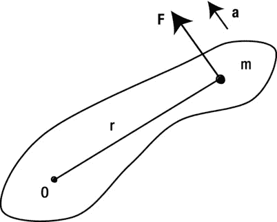

图 13-4。

A rotating rigid body

让我们把刚体想象成由小粒子组成，每个粒子的质量为 m，每个粒子都承受切向加速度 a(忽略任何径向加速度，它对旋转没有贡献)。然后，将牛顿第二定律应用于这样的粒子，得到如下结果:

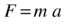

回想一下将切向加速度与角加速度联系起来的公式 a = rα，我们可以将前面的公式写成:

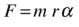

因此，颗粒上的扭矩 T = Fr 是通过将前面的公式乘以 r 得到的:

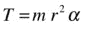

为了得到刚体上的总扭矩，我们将每个粒子上的扭矩相加，得到以下公式:

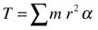

严格来说，对于刚体，我们应该用积分而不是离散和，但推理和最终答案是一样的，因为积分不过是一个连续和。所以我们在这里使用更简单的离散求和符号。

因为刚体上的所有点都有相同的角加速度，α是一个常数，我们可以把它从和中拿出来。认识到σMr2为惯性矩 I，我们然后获得以下最终结果:

在向量形式中，它是这样的:

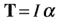

这个公式相当于旋转运动的牛顿第二定律 F = m a，用扭矩、惯性矩和角加速度分别代替力、质量和线加速度。这个公式使我们能够根据施加在刚体上的力矩来计算它的角加速度。

作为特例，如果转矩 T 为零，该公式意味着角加速度也为零。这是牛顿第一运动定律的类比。

正如在直线运动中，你可以有减速扭矩以及加速扭矩。例如，你施加一个加速扭矩来做旋转木马。然后，由于摩擦产生的减速扭矩的作用，它减速并停止。

#### 平衡中的刚体

在[第四章](04.html)中，我们讨论了一个物体在多个力的作用下处于平衡的情况。例如，匀速运动的飞机在四个主要力(重力、推力、阻力和升力)的作用下处于平衡状态。平衡的条件是力平衡(合力为零)。但是对于一个延伸的物体，比如一个刚体，这个条件是不够的。合成扭矩也必须为零；否则，物体将经历旋转加速度。

旋转平衡的概念可以用天平的例子很好地说明(见图 [13-5](#Fig5) )。

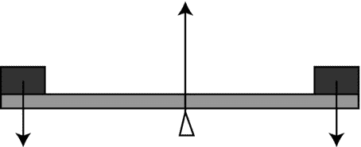

图 13-5。

Rotational equilibrium illustrated by a balance

假设天平处于平衡状态，由枢轴任一侧的组合重量施加的向下的力被枢轴施加的向上的接触力平衡。此外，一个重物产生的顺时针扭矩或力矩被另一个重物产生的逆时针扭矩平衡:这就是众所周知的力矩原理。在矢量项中，一个力矩指向纸外，另一个指向纸内。

合力可能为零而合力扭矩不为零的一个例子是当你转动旋钮时(见图 [13-6](#Fig6) )。在这种情况下，有两个相反的力施加在旋钮的两侧。如果它们的大小相等，则合力为零。然而，它们的扭矩将在相同的方向上(进入纸面)，因为它们都产生顺时针旋转。这是力偶的一个例子:一对大小相等方向相反的力，它们有平行不重合的作用线，因此产生合力。

图 13-6。

A couple

#### 角动量守恒

正如牛顿第二定律有一个旋转类比，其他定律的旋转类比也存在。我们现在将从角动量守恒定律开始，不加证明地陈述这些定律。

这个原理表明，如果没有外力作用在刚体或质点系上，它的角动量是守恒的。例如，如果一个物体以恒定的角速度旋转，它将继续这样做，除非对它施加一个外部扭矩。这就是地球继续绕轴旋转的原因。另一方面，由于相反的摩擦力矩，旋转的陀螺很快停止旋转。

#### 角动量定理

角动量守恒是角冲量定理的一个特例。回忆一下第 5 章中的线性冲量定理。表达该定理的公式如下所示:

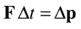

这个公式告诉我们，作用在物体上的冲量等于产生的动量的变化。

前一个方程的旋转模拟是通过取 r 与方程各边的矢量积得到的(因为 T = r × F，L = r × p):

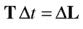

换句话说，作用在物体上的角冲量等于它产生的角动量的变化。回想一下，对于一个刚体，角动量 L = I w，当我们考虑刚体之间的碰撞时，这个结果是有用的。

如果力矩 T = 0，定理给出δL = 0，角动量守恒。因此，角动量守恒原理是前面所说的角动量定理的一个特例。

#### 旋转动能

因为刚体既能旋转又能平移，所以除了与直线运动有关的动能之外，还有与旋转运动有关的动能。回想一下，线性动能由以下公式给出:

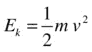

我们说过转动惯量类比质量，角速度类比线速度。因此，当你知道转动动能由以下公式给出时，你可能不会感到惊讶:

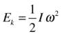

所以刚体的总动能就是这两个动能之和。

#### 旋转运动的功能定理

与力所做的功类似，扭矩所做的功等于扭矩与其产生的角位移的乘积:

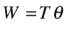

然后，我们可以将功能定理(见[第 4 章](04.html))应用于旋转运动的情况，得出结论:扭矩所做的功等于其产生的旋转动能的变化:

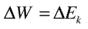

在那种情况下，动能由 E k = Iω 2 给出。

### 模拟刚体动力学

我们现在准备用代码实现刚体动力学。要做到这一点，我们需要修改我们在本书中一直使用的动画循环代码的相关部分。

#### 修改动画循环以包含旋转动力学

动画代码需要以直接的方式修改，以包括扭矩和角加速度，与力和线性加速度完全相似。下面的清单显示了实现这一点的典型代码，增加的部分以粗体突出显示:

`function moveObject(obj){`

`obj.pos2D = obj.pos2D.addScaled(obj.velo2D,dt);`

`obj.rotation = obj.angVelo*dt;`

`context.clearRect(0, 0, canvas.width, canvas.height);`

`obj.draw(context);`

`}`

`function calcForce(obj){`

`force = Forces.zeroForce();`

`torque = 0;`

`}`

`function updateAccel(obj){`

`acc = force.multiply(1/obj.mass);`

`alp = torque/obj.im;`

`}`

`function updateVelo(obj){`

`obj.velo2D = obj.velo2D.addScaled(acc,dt);`

`obj.angVelo += alp*dt;`

`}`

在该代码中，`torque`表示扭矩的大小，`alp`表示角加速度的大小。因此，它们都是数字，而不是像相应的`force`和`acc`变量那样的`Vector2D`对象。我们之所以只表示扭矩和角加速度的大小，是因为在我们要考虑的 2D 例子中，旋转只能发生在 x–y 平面(只有一个平面)，因此任何相关的角速度、角加速度和扭矩的方向总是在一个假想的第三维空间中，该空间要么伸入该平面，要么伸出该平面。相关量的符号将决定它指向哪个方向。

#### 简单的测试

让我们用一个简单的例子来测试新的旋转动力学代码。在`rigid-body-dynamics.js`中，我们使用`PolygonRB`对象创建一个方形刚体，然后对其施加扭矩。`init()`方法中的设置代码如下所示:

`function init() {`

`var v1 = new Vector2D(-100,100);`

`var v2 = new Vector2D(100,100);`

`var v3 = new Vector2D(100,-100);`

`var v4 = new Vector2D(-100,-100);`

`var vertices = new Array(v1,v2,v3,v4);`

`rigidBody = new PolygonRB(vertices);`

`rigidBody.mass = 1;`

`rigidBody.im = 5;`

`rigidBody.pos2D = new Vector2D(200,200);`

`rigidBody.velo2D = new Vector2D(10,0);`

`rigidBody.angVelo = 0;`

`rigidBody.draw(context);`

`t0 = new Date().getTime();`

`animFrame();`

`}`

物体的质量和转动惯量被设定，其速度和角速度被初始化。后续的动画代码如下所示:

`function animFrame(){`

`animId = requestAnimationFrame(animFrame,canvas);`

`onTimer();`

`}`

`function onTimer(){`

`var t1 = new Date().getTime();`

`dt = 0.001*(t1-t0);`

`t0 = t1;`

`if (dt>0.2) {dt=0;};`

`move();`

`}`

`function move(){`

`moveObject(rigidBody);`

`calcForce(rigidBody);`

`updateAccel(rigidBody);`

`updateVelo(rigidBody);`

`}`

`function moveObject(obj){`

`obj.pos2D = obj.pos2D.addScaled(obj.velo2D,dt);`

`obj.rotation = obj.angVelo*dt;`

`context.clearRect(0, 0, canvas.width, canvas.height);`

`obj.draw(context);`

`}`

`function calcForce(obj){`

`force = Forces.zeroForce();`

`force = force.addScaled(obj.velo2D,-kLin); // linear damping`

`torque = 1;`

`torque += -kAng*obj.angVelo; // angular damping`

`}`

`function updateAccel(obj){`

`acc = force.multiply(1/obj.mass);`

`alp = torque/obj.im;`

`}`

`function updateVelo(obj){`

`obj.velo2D = obj.velo2D.addScaled(acc,dt);`

`obj.angVelo += alp*dt;`

`}`

正如你在`calcForce()`方法中看到的，在每个时间步都施加了 1 个单位的扭矩。如果这就是所做的一切，那么正方形将会经历连续的角加速度，旋转得越来越快。因此，还应用与角速度成比例的角阻尼项来限制其角速度。力中还加入了线性阻尼项。相应的阻尼因子`kLin`和`kAng`的值分别设置为 0.05 和 0.5。

如果你运行模拟，你会发现广场平移到右边，而顺时针方向旋转。随着时间的推移，其线速度会降低，直到停止(因为没有驱动力，而是有一个与其速度成比例的减速力)，而其角速度会增加到一个恒定值(您可以通过在每个时间步长跟踪角速度来检查这一点)。后者之所以发生，是因为施加的 1 单位扭矩会增加角速度，而角阻尼项会随着角速度的增加而增加。因此，在某些点上，阻尼项平衡了所施加的扭矩，并且实现了旋转平衡(以及线性平衡)。它相当于旋转运动的终端速度。你可以用下面的方法计算“终端角速度”。

从与扭矩和角加速度相关的角运动方程开始:

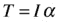

在本模拟中，因为存在 1 单位的驱动扭矩和与角速度成比例的减速扭矩，所以合成扭矩 T 由下式给出:

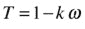

使用前面的运动方程，得到如下结果:

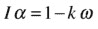

平衡时，角加速度α为零。因此，这个等式的左边是零。重新排列会产生以下结果:

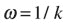

这就是“终极”角速度。在代码中使用 k = 0.5 的值给出了这个角速度的值 2。如果你在模拟中的每个时间步追踪物体的角速度，你会发现它确实收敛到这个值。

通过改变物体的质量和转动惯量进行实验。你会发现，它们分别影响达到线性和旋转平衡所需的时间，但不影响最终的线速度(0)或最终的角速度(2)。

我们现在可以模拟旋转动力学了！让我们建立一些更有趣的例子。

### 示例:简单的风力涡轮机模拟

在这个例子中，我们将模拟多个刚体的运动。我们要模拟的物体是风力涡轮机。所以我们首先创建一个`turbine`函数，它利用`PolygonRB`来绘制一个由六个顶点组成的填充多边形。其中三个顶点沿内圆圆周等距分布，另外三个位于外圆上。内圆和外圆上的顶点交替出现，这样产生的`Polygon`看起来像一个风力涡轮机。`turbine`函数有五个参数，分别对应于内外圆的半径(`ri`和`ro`)、涡轮颜色(`col`)、质量(`m`)和转动惯量(`im`)，如下所示:

`function turbine(ri,ro,col,m,im){`

`var vertices = new Array();`

`for (var i=0; i<3; i++){`

`var vertex = getVertex(ro,i*120);`

`vertices.push(vertex);`

`vertex = getVertex(ri,i*120+60);`

`vertices.push(vertex);`

`}`

`return new PolygonRB(vertices,col,m,im);`

`}`

函数`getVertex()`返回顶点位置，作为一个`Vector2D`对象，给出它与涡轮机中心的距离和它与水平面的角度:

`function getVertex(r,a){`

`a *= Math.PI/180;`

`return new Vector2D(r*Math.cos(a),r*Math.sin(a));`

`}`

在文件`wind-turbines.js`中，我们使用`turbine`功能创建了三个不同尺寸的涡轮机，如图 [13-7](#Fig7) 所示。

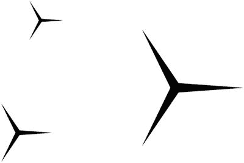

图 13-7。

Creating wind turbines!

这是在`wind-turbines.js:`的`init()`方法中完成的

`function init() {`

`turbines = new Array();`

`var turbine1 = turbine(4,50,'#000000',1,1);`

`turbine1.pos2D = new Vector2D(200,150);`

`turbines.push(turbine1);`

`var turbine2 = turbine(6,75,'#000000',2.25,5);`

`turbine2.pos2D = new Vector2D(150,400);`

`turbines.push(turbine2);`

`var turbine3 = turbine(12,150,'#000000',9,81);`

`turbine3.pos2D = new Vector2D(500,300);`

`turbines.push(turbine3);`

`addEventListener('mousedown',onDown,false);`

`t0 = new Date().getTime();`

`animFrame();`

`}`

该规范为涡轮机分配了不同的质量和惯性矩。质量与涡轮机外半径的平方成比例分配(将其视为二维)，而惯性矩与外半径的四次方成比例(因为 I 与 mr 2 成比例，m 与 r 2 成比例)。质量真的无关紧要，因为涡轮机只会旋转。将它们的值更改为其他值不会对旋转产生任何影响。但是我们为物理一致性设置了适当的值。

这里显示了部分动画代码:

`function move(){`

`context.clearRect(0, 0, canvas.width, canvas.height);`

`for (var i=0; i<turbines.length; i++){`

`var windTurbine = turbines[i];`

`moveObject(windTurbine);`

`calcForce(windTurbine);`

`updateAccel(windTurbine);`

`updateVelo(windTurbine);`

`}`

`}`

`function moveObject(obj){`

`obj.pos2D = obj.pos2D.addScaled(obj.velo2D,dt);`

`obj.rotation = obj.angVelo*dt;`

`obj.draw(context);`

`}`

`function calcForce(obj){`

`force = Forces.zeroForce();`

`torque = tq;`

`torque += -k*obj.angVelo; // angular damping`

`}`

`function updateAccel(obj){`

`acc = force.multiply(1/obj.mass);`

`alp = torque/obj.im;`

`}`

`function updateVelo(obj){`

`obj.velo2D = obj.velo2D.addScaled(acc,dt);`

`obj.angVelo += alp*dt;`

`}`

从前面的例子来看，这段代码应该很熟悉。在`calcForce()`方法中，我们指定了一个零合力和一个大小为`tq`的驱动扭矩，以及一个与角速度成比例的角阻尼项。扭矩大小`tq`的值由鼠标点击事件处理程序控制:如果按下鼠标，`tq`被赋予一个值`tqMax`(默认为 2)；如果不是，它的值为 0。这意味着任何时候点击鼠标，一个恒定的驱动扭矩应用于每个涡轮；否则，驱动扭矩为零。

`function onDown(evt){`

`tq = tqMax;`

`addEventListener('mouseup',onUp,false);`

`}`

`function onUp(evt){`

`tq = 0;`

`removeEventListener('mouseup',onUp,false);`

`}`

运行模拟并单击画布上的任意位置。你看到了什么？最小的涡轮机几乎立即开始转动，而最大的涡轮机只是缓慢地开始转动。这说明了转动惯量的概念:对于相同的扭矩，转动惯量较大的刚体比转动惯量较小的刚体加速度小。当然，这只是 T = Iα的结果。同样，如果你停止按鼠标，最小的涡轮也会迅速停止；最大的一个要过很久才会停。

虽然这种模拟捕捉到了旋转涡轮机的基本动态，但还需要做更多的工作来更真实地模拟它在风力作用下的实际运行情况。例如，每个涡轮机的扭矩和阻尼系数将取决于其表面积等特性。风建模是另一个独立的主题。我们不会纠缠于这些复杂的因素；相反，我们将移动到另一个例子！

### 示例:滚下斜面

滚动涉及旋转动力学的一个有趣且特别有益的应用，但理解起来可能相当复杂。因此，我们将通过一个具体的例子来探讨这个问题。

在[第七章](07.html)中，我们模拟了一个球从斜面上滑下的运动。人们注意到，只有当斜面陡于某个取决于静摩擦系数的临界角时，球才会滑动。模拟效果很好，但有一个主要缺陷:如果角度不够高，球就不会移动。这几乎不现实；事实上，不管倾斜角度如何，球都会从斜面上滚下！

#### 从粒子到刚体的模拟

我们现在可以将滚动融入到球沿斜面下滑的模拟中了。但是首先我们需要把球当作一个刚体，而不是一个质点。因此，让我们找出旧代码`sliding.js`，并修改它以使用我们的新刚体对象`BallRB`。文件的设置部分`rolling.js`，最初看起来是这样的:

`var ball;`

`var r = 20; // radius of ball`

`var m = 1;  // mass of ball`

`var g = 10; // acceleration due to gravity`

`var ck = 0.2;  // coeff of kinetic friction`

`var cs = 0.25; // coeff of static friction`

`var vtol = 0.000001 // tolerance`

`// coordinates of end-points of inclined plane`

`var xtop = 50; var ytop = 150;`

`var xbot = 450; var ybot = 250;`

`var angle = Math.atan2(ybot-ytop,xbot-xtop); // angle of inclined plane`

`var acc, force;`

`var alp, torque;`

`var t0, dt;`

`var animId;`

`window.onload = init;`

`function init() {`

`// create a ball`

`ball = new BallRB(r,'#0000ff',m,0,true,true);`

`ball.im = 0.4*m*r*r; // for solid sphere`

`ball.pos2D = new Vector2D(50,130);`

`ball.velo2D = new Vector2D(0,0);`

`ball.draw(context);`

`// create an inclined plane`

`context_bg.strokeStyle = '#333333';`

`context_bg.beginPath();`

`context_bg.moveTo(xtop,ytop);`

`context_bg.lineTo(xbot,ybot);`

`context_bg.closePath();`

`context_bg.stroke();`

`// make the ball move`

`t0 = new Date().getTime();`

`t = 0;`

`animFrame();`

`}`

这类似于第 7 章中的[代码，它产生如图](07.html) [13-8](#Fig8) 所示的设置。此外，我们已经指定了球的质量和转动惯量。对于后者，我们使用的是实心球体的转动惯量公式(I = 2mr 2 /5)，假设我们模拟的是实心球形球体。

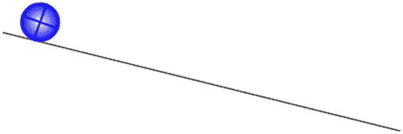

图 13-8。

A ball rolling down an inclined plane

代码的动画部分是标准的，除了`calcForce()`方法，它最初看起来是这样的(我们很快会修改它):

`function calcForce(){`

`var gravity = Forces.constantGravity(m,g);`

`var normal = Vector2D.vector2D(m*g*Math.cos(angle),0.5*Math.PI-angle,false);`

`var coeff;`

`if (ball.velo2D.length() < vtol){  // static friction`

`coeff = Math.min(cs*normal.length(),m*g*Math.sin(angle));`

`}else{  // kinetic friction`

`coeff = ck*normal.length();`

`}`

`var friction = normal.perp(coeff);`

`force = Forces.add([gravity, normal, friction]);`

`}`

如果您将这段代码与第 7 章的[中的`sliding.js`示例的相应`calcForce()`方法进行比较，您会发现它做了同样的事情，具有相同的力和参数值。到目前为止，我们所做的就是用`BallRB`代替`Ball`，这样我们就可以引入刚体动力学。如果你以当前形式运行代码，球不会移动，就像第 7 章](07.html)中的[一样，除非你使倾斜度更陡(例如，通过将设置文件中的`ybot`的值改为 260 或更大)。我们知道，在现实生活中，即使球不能滑动，它也会滚下斜坡。那么少了什么呢？](07.html)

#### 模拟无滑动滚动

你可能想给`calcForce()`增加一个扭矩，看看是否能让球滚动。从最后一行代码中可以看出，模拟中包含了三种力:重力、法向力和摩擦力(参见图 [13-9](#Fig9) 中的力图)。因为重力和法向力都通过质心作用，所以它们没有任何关于质心的相关力矩。只有摩擦力有一个绕球质心的力矩，这个力矩的大小是 fr，其中 f 是摩擦力的大小，r 是球的半径。

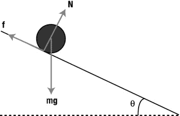

图 13-9。

Force diagram for a ball rolling down an inclined plane

在`calcForce()`的最后一行后添加以下代码行:

`torque = r*friction.length();`

现在运行代码。你发现了什么？肯定球在摩擦力产生的力矩作用下旋转越来越快，但是它哪儿也不去！我们仍然遗漏了一些东西。保留扭矩代码，因为它是正确的。但是我们需要做更多的思考。

让我们再来看看图 [13-9](#Fig9) 。除了考虑摩擦产生的扭矩，还需要改变什么？唯一的另一件事是，三个力是否仍然与滚动相同。现在重力是一个只取决于物体质量的固定力，所以会保持完全不变，量级 mg，垂直向下作用；法向力也会如此，因为它仍然必须与垂直于平面的重力分量大小相等，方向相反(在那个方向上没有运动)。因此，法向力的大小仍为 mg cos(θ),并垂直于平面作用，如规范中所述。

摩擦力需要改变。滚动摩擦通常小于静摩擦或动摩擦(这就是为什么轮子是如此有用的发明！).目前摩擦力普遍过大。因此，问题实际上可以归结为指定正确的摩擦力，以产生无滑动的滚动。

关键是，无滑动滚动的条件限制了线性和旋转运动“一起工作”，这反过来又限制了摩擦力的大小。通过从基本原理(即从基本物理定律开始)制定约束，并使用线性和旋转运动方程计算出其含义，就有可能推导出摩擦力必须是多少。让我们现在做那件事。

为了更容易形象化(但不失一般性)，想象一个半径为 r 的球或轮子以角速度ω在平地上滚动，如图 [13-10](#Fig10) 所示。

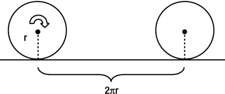

图 13-10。

A ball or wheel rolling without slipping

如果球或轮子无滑动地滚动(让我们称之为纯滚动)，当它完成一次旋转时，它向前移动了等于 2πr 的距离。它这样做的时间等于它的周期 T，它等于 2π/ω(见[第 9 章](09.html))。其质心的速度由移动距离与所用时间的比值给出，因此由下式给出:

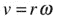

回想一下，这只是圆周上任意一点的线速度的公式；在纯滚动中，它也给出了整个物体向前运动的速度。这个公式在任何时候都成立，即使角速度(以及质心的线性速度)在变化。然后对时间求导，得到质量加速度的线性中心与角加速度的等效公式:

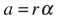

这是帮助我们计算纯滚动摩擦力(用 f 表示)的关键约束。力发挥作用的方式当然是通过运动方程。沿着斜坡应用线性运动方程 F = ma 给出(见图 [13-9](#Fig9) ):

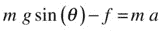

应用运动的角度方程 T = Iα给出如下:

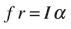

我们需要求解摩擦力 f，但是我们不知道加速度 a 或者角加速度α。但是我们有约束条件 a = rα，所以我们可以用它和上一个等式来消去α，得到加速度 a 和摩擦力 f 之间的关系:

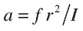

现在，我们可以将其代入由线性运动方程得出的前一个方程，重新排列后，得到以下最终结果:

然后，我们还可以使用前面连接 a 和 f 的等式，推导出滚动物体加速度的以下公式:

将此与自由下落物体的加速度 g 进行比较，我们发现滚动物体的加速度降低了一个系数，该系数取决于物体的 I/mr 2 比，以及平面的倾角(后者只是因为我们看到的是沿斜坡向下的加速度分量，而不是垂直向下的)。

既然我们已经有了纯滚动摩擦力的公式，把它包含在代码中就很简单了。删除`calcForce()`中计算摩擦力`coeff`大小的`if`代码块，用下面一行代替，这就是 f 的公式:

`coeff = m*g*Math.sin(angle)/(1+m*r*r/ball.im);`

现在运行代码，你就可以让球沿着斜坡滚下去而不会打滑了！

#### 允许运输和滚动

现在，通过将`ybot`的值更改为 850 来增加斜率，并重新运行模拟。现在坡度很陡，但是球还是会滚下来，不会打滑。现在我们有相反的问题:球不知道如何滑动！

为了使模拟更加真实，我们需要以一种简单的方式实现滚动和滑动的可能性，只需在计算`coeff`的行之后添加下面的`if`块:

`if (coeff > cs*normal.length()){`

`coeff = ck*normal.length();`

`}`

这就限制了滚动摩擦的最大值；如果计算出的摩擦力超过静摩擦力，它会将摩擦力的大小重置为动摩擦力。运行代码，你会看到球在滚下的时候滑动了。如果你把`ybot`变回 250，你会发现球像以前一样进行纯滚动。事实上，您可以在`if`块中添加一行`console.log("slipping")`，并针对不同的`ybot`值运行代码。这将明确地告诉你球何时滑落。根据给定的参数值，您应该会发现纯滚动发生在`ybot` = 500 的值，对应于大约 41.2°的倾斜角。

#### 更多的模拟实验

一个经典的大学物理问题是这样的:假设你在一个斜坡上，在相同的高度释放两个实心圆柱体，一个轻，一个重。假设两人都不打滑的滚下斜坡，哪一个会先到达底部？好吧，你可以用你的模拟来找出答案！

首先把`rolling.js`中的`ybot`的值改回 250，这样你就有了纯滚动。然后将惯性矩公式改为如下:

`ball.im = 0.5*m*r*r;`

这与前面的球体公式的不同之处仅在于系数为 0.5；圆柱体的转动惯量是 I = mr 2 /2。

使用圆柱体的不同质量和半径值进行模拟实验，并记下圆柱体到达底部所需的时间。你注意到了什么？

好吧，尽管看起来有些违反直觉，你应该会发现圆柱体到达斜坡底部的时间总是一样的，不管它的质量和半径如何。要了解为什么会这样，请参考上一小节中推导出的加速度公式。因为圆柱体的惯性矩由 I = mr 2 /2 给出，所以该公式中出现的比率 I/mr 2 的值为 0.5，给出实心圆柱体沿斜坡向下的加速度为

这个有趣的结果告诉我们，加速度完全独立于圆柱体的性质，如质量、半径或惯性矩:它们都被抵消了！所以，只要两个圆柱体都是实心的，它们应该总是以相同的速度滚下斜坡！

然而，中空圆柱形管具有由近似 I = mr 2 给出的惯性矩。通过同样的计算，得出以下加速度:

因此，一个中空的圆柱形管道会加速得更慢，因此需要更长的时间才能到达斜坡的底部。

### 刚体碰撞和反弹

在第 11 章中，我们花了相当多的时间讨论粒子碰撞和反弹。你可能会觉得当时的数学有点复杂。好吧，对于刚体，数学变得更加复杂！对于刚体，你必须考虑碰撞中物体的线性运动和旋转。粒子、球体和圆形物体不会因为碰撞而旋转(至少如果我们假设碰撞是无摩擦的)。这是因为对于这样的物体，碰撞线总是通过它们的质心(见图 [13-11](#Fig11) )，因此碰撞产生的冲击力不会产生扭矩。

图 13-11。

Colliding spheres

对于一个形状更复杂的物体来说，这通常是不成立的。与球体一样，碰撞线垂直于物体表面，但它可能不会通过物体的质心(见图 [13-12](#Fig12) )。因此，在这种情况下，会产生围绕每个碰撞物体中心的扭矩，导致它们旋转。

图 13-12。

Collision between two rigid bodies of arbitrary shape

因此，在这种更一般的情况下，碰撞解决的任务是计算两个物体的最终线速度 v 1 f 和 v 2 f 和角速度ω 1 f 和ω 2 f ， 给定它们的初始线速度 v 1 i 和 v 2 i 和角速度ω 1 i 和ω 2 i (物体在碰撞之前可能已经在旋转)。 这就是我们在这一节要做的事情。

#### 碰撞产生的线性冲量

线速度 v 1 i ，v 2 i ，v 1 f ，v 2 f 是两个碰撞刚体质心的初始和最终线速度(分别用下标 1 和 2 表示)。角速度ω 1

起点是应用冲量-动量定理:

让我们用符号 j 来表示冲量 fδt。然后，将冲量-动量定理应用于每个刚体，并记住它们经历大小相等方向相反的冲量，我们可以写出以下等式:

我们顺便注意到，这两个方程合在一起意味着下列方程:

正如我们在第 11 章中看到的，这就是动量守恒。我们将该等式与恢复系数 C R 的等式一起使用，以根据初始速度(由 u 1 和 u 2 表示)获得最终速度 v1f 和 v2ff(由 v 1 和 v 2 表示)。参考第 11 章中的“计算非弹性碰撞后的速度”一节。这里的情况更复杂，因为我们还要考虑角速度，我们需要通过一条稍微不同的路线前进。

我们将采用的方法是，用冲量 J 来表示最终速度，然后算出 J 是多少。对于线速度而言，这只是重新排列前面涉及 J 的等式，以获得以下等式:

和粒子碰撞一样，我们可以用一个包含恢复系数的方程来补充这些方程。在粒子的情况下，恢复系数等于碰撞前后碰撞粒子的相对法向速度的负比率。在这里，人们可能会尝试用每个粒子质心的线速度来做同样的假设。但事实上，在这种情况下，相关的速度是每个物体上垂直于接触面的接触点的线速度。再次参考图 [13-12](#Fig12) ，这些是两个刚体接触点 P 处的速度。让我们用 v p1 和 v p2 来表示这些速度。它们都是由质心速度和点 P 处速度的矢量和给出的，因为绕质心旋转。

因此，我们有以下等式:

这些方程在任何时候都是有效的，特别是在碰撞之前和之后。因此，它们可以用我们以前用过的上标“I”和“f”来写。向量 r p1 和 r p2 ，它们是点 P 相对于每个物体质心的位置向量，在那个短暂的间隔内是相同的，所以它们不需要这些上标。

碰撞前后的相对速度由下式给出:

恢复系数由这些相对速度的法向分量的负比率给出(其中 n 是单位法向量):

问题是，这也涉及到最终的角速度，我们不知道。所以我们需要同时求解角速度。这意味着我们需要更多的方程。额外的方程式来自应用角冲量定理。

#### 碰撞产生的角冲量

现在让我们应用角冲量定理:

因为 T = r × F，L = Iω，所以等价于:

将此应用于每个物体，并再次记住它们经历相等且相反的脉冲，我们得到以下等式:

这些方程可以重新排列，根据初始角速度和冲量给出最终角速度:

我们现在唯一需要的是冲量 J，然后我们就可以得到线速度和角速度。

#### 最后的结果

有可能将上述所有方程一起求解，以获得冲量 j 的表达式。我们将省去详细的代数运算，只提供最终答案。写出 J = J n，其中 J 是冲量的大小，n 是单位法向量，如前所述(因为冲量是沿着法线方向的)，我们得到冲量大小的如下表达式:

在前面的等式中，每个叉积项(矢量)的平方指的是取自身的点积。

在第二刚体是不可移动物体的情况下，比如一面墙，我们可以使前面方程中的 m 2 和 I 2 无穷大(去掉了涉及它们的项)。注意，那种情况下的相对速度 vrT6】I 就是物体 1 上点 P 的速度 vIT10】P1。然后我们得出以下结论:

为了便于参考，让我们重复一下等式，以便计算最终的线速度和角速度:

在第二个物体是不可移动的墙壁的情况下，v2T2f 和ω2T6】f 为零。

完成了看起来复杂的数学运算后，你会很高兴地知道前面的公式实际上并不难编码。在编码方面，模拟刚体碰撞的更棘手的方面可能是碰撞检测和重新定位，它们同样重要，在创建真实模拟时需要仔细考虑。

注意，这些方程对任何形状的刚体之间的碰撞都有效。在我们不久将放在一起的例子中，我们将考虑多边形。在这种情况下，最常见的碰撞事件是一个多边形的顶点与另一个多边形的边发生碰撞。然后，碰撞线是相关边的法线。但是两个多边形的顶点之间的冲突也很常见，因此有一种方法来处理它们是很重要的。其他不太常见的碰撞场景包括一个对象的两个顶点同时撞击两个不同的对象。

为了避免与这些不同碰撞场景以及处理它们所需的碰撞检测和处理方法相关联的复杂性，我们将从一个简单的单个多边形从地板上反弹的例子开始。这将使我们能够专注于实现前面几节中开发的冲突解决方法。之后，我们将构建一个更复杂的模拟，涉及多个碰撞和反弹的对象，这将需要我们面对这里提到的一些更棘手的问题。

### 示例:模拟单个弹跳块

我们现在将构建一个简单的矩形块从地板上反弹的模拟，这样我们就有了一个可移动的对象。该模拟的设置代码`rigid-body-bouncing.js`如下所示:

`var block;`

`var wall;`

`var m = 1;`

`var im = 5000;`

`var g = 20;`

`var cr = 0.4;`

`var k = 1;`

`var acc, force;`

`var alp, torque;`

`var t0, dt;`

`var animId;`

`window.onload = init;`

`function init() {`

`// create a block`

`block = makeBlock(100,50,'#0000ff',m,im);`

`block.rotation = Math.PI/4;`

`block.pos2D = new Vector2D(400,50);`

`block.draw(context);`

`// create a wall`

`wall = new Wall(new Vector2D(100,400),new Vector2D(700,400));`

`wall.draw(context_bg);`

`// make the block move`

`t0 = new Date().getTime();`

`animFrame();`

`}`

`function makeBlock(w,h,col,m,im){`

`var vertices = new Array();`

`var vertex = new Vector2D(-w/2,-h/2);`

`vertices.push(vertex);`

`vertex = new Vector2D(w/2,-h/2);`

`vertices.push(vertex);`

`vertex = new Vector2D(w/2,h/2);`

`vertices.push(vertex);`

`vertex = new Vector2D(-w/2,h/2);`

`vertices.push(vertex);`

`return new PolygonRB(vertices,col,m,im);`

`}`

我们使用[第 11 章](11.html)中的`Wall`类创建一个矩形块作为`PolygonRB`实例和地板对象。该块的惯性矩为 5000，初始方向为π/4 弧度(45°)。

代码的动画部分相当标准，有一个看起来不起眼的`calcForce()`方法:

`function calcForce(obj){`

`force = Forces.constantGravity(m,g);`

`torque = 0; // no external torque since gravity is the only force`

`torque += -k*obj.angVelo; // damping`

`}`

`calcForce()`方法规定重力是作用在木块上的唯一力，并规定外部扭矩为零，因为重力不会产生围绕其质心的扭矩。不过，我们确实包括一个阻尼扭矩，其大小由阻尼参数`k`控制(如果您愿意，可以将其设置为零)。

代码中真正新的物理特性包含在`checkBounce()`方法中，该方法在每个时间步长从`move()`方法调用，如下所示:

`function checkBounce(obj){`

`// collision detection`

`var testCollision = false;`

`var j;`

`for (var i=0; i<obj.vertices.length;i++){`

`if (obj.pos2D.add(obj.vertices[i].rotate(obj.rotation)).y >= wall.p1.y){`

`if (testCollision==false){`

`testCollision = true;`

`j = i;`

`}else{ // that means one vertex is already touching`

`stop(); // block is lying flat on floor, so stop simulation`

`}`

`}`

`}`

`// collision resolution`

`if (testCollision == true){`

`obj.y += obj.pos2D.add(obj.vertices[j].rotate(obj.rotation)).y*(-1) + wall.p1.y;`

`var normal = wall.normal;`

`var rp1 = obj.vertices[j].rotate(obj.rotation);`

`var vp1 = obj.velo2D.add(rp1.perp(-obj.angVelo*rp1.length()));`

`var rp1Xnormal = rp1.crossProduct(normal);`

`var impulse = -(1+cr)*vp1.dotProduct(normal)/(1/obj.mass + rp1Xnormal*rp1Xnormal/obj.im);`

`obj.velo2D = obj.velo2D.add(normal.multiply(impulse/obj.mass));`

`obj.angVelo += rp1.crossProduct(normal)*impulse/obj.im;`

`testCollision = false;`

`}`

`}`

正如您所看到的，考虑到前面理论讨论的复杂性，代码看起来出奇的短。代码分为两部分，一部分指定冲突检测，另一部分指定冲突解决。碰撞检测代码在块的顶点上循环，并使用以下条件测试是否有任何顶点低于地板:

`if (obj.pos2D.add(obj.vertices[i].rotate(obj.rotation)).y >= wall.p1.y){}`

这一行可能看起来有点复杂，所以让我们分解一下。首先简单的一点:`wall.p1.y`给出墙的`y`位置。接下来，`obj.vertices[i]`是当前正在测试的顶点相对于该块质心的位置向量。你已经在本章前面遇到了`Vector2D`对象的`rotate()`方法。

因此，我们将当前顶点的位置向量旋转一个角度，该角度等于块的角位移`obj.rotation`，以说明块的方向。然后我们把它加到物体的(重心)位置上。我们这样做是因为我们需要顶点在画布坐标系中的位置向量，而不是在质心坐标系中。最后，我们测试这个向量的 y 分量是否大于墙的 y 位置。如果是，则检测到碰撞，并且将`Boolean`参数`testCollision`设置为`true`，并且将顶点的索引存储在变量`j`中。但这仅在`testCollision`当前为`false`的情况下完成(在同一时间步中尚未检测到另一个冲突)。如果`testCollision`已经是`true`，这意味着另一个顶点已经与地板发生碰撞。从物理上来说，这意味着积木现在平放在地板上。那么合理的做法是停止模拟。我们使用`stop()`方法来停止动画循环:

`function stop(){`

`cancelAnimationFrame(animId);`

`}`

如果检测到碰撞(如果`testCollision`为真)，则执行碰撞解决代码。第一行通过简单地将块向上移动它落到墙下的量来重新定位块。接下来的几行代码简单地实现了上一节末尾给出的等式，应该很容易理解。惟一的微妙之处是使用了`crossProduct()`方法，这是`Vector2D`类的另一个新创建的方法，定义如下:

`function crossProduct(vec) {`

`return this.x*vec.y - this.y*vec.x;`

`}`

如果你记得两个向量的叉积只存在于 3D 中，并且本身就是一个向量，这可能会让你感到困惑。因为我们的模拟是在 2D 进行的，我们已经定义了叉积的模拟，但只能给出它的大小，因为两个向量的叉积应该与两个向量都垂直，因此需要第三维度存在。底线是，这个技巧使我们能够使用上一节中涉及矢量积的公式，只要我们记住，它只会给我们叉积的大小(事实上，这就是我们在这些公式中所需要的)。

这个模拟就不多说了。运行它并享受吧！截图见图 [13-13](#Fig13) 。像往常一样，尝试改变转动惯量、恢复系数和角度阻尼系数等参数的影响。作为附加练习，尝试用另一个多边形(如三角形或五边形)替换矩形。

图 13-13。

A falling block bouncing off a floor

### 示例:碰撞块

如前所述，当多个块碰撞在一起时，需要注意检测对象之间的碰撞，然后将它们分开。因此，让我们花一些时间来讨论如何在一个具体的例子中应用它们——一组具有不同大小和方向的多边形从高处落下，以便它们落到地板上并从地板上弹回，同时彼此碰撞。

图 [13-14](#Fig14) 说明了一个块(对象 1)的顶点 P 与另一个块(对象 2)的边发生碰撞时最常见的情况。在碰撞检测的时候，P 在第二个多边形里面。如果考虑第二个多边形的顶点相对于 P 的位置向量，它们应该都具有正的点积，其法线从 P 到与它们相邻的边(按照惯例，我们将考虑从相关顶点逆时针方向的边)。所以如果你测试所有这些点积，任何一个都是负的，你就知道没有碰撞发生。你也可以先做一个较弱的测试，看看两个物体质心之间的距离是否大于它们最远顶点的距离。如果是这样，您就不必费心去做更详细的碰撞检测测试了。

图 13-14。

Vertex-edge collision between two polygons

要在顶点-边碰撞后重新定位对象，只需沿发生碰撞的边的法线将其向后移动一段距离，该距离等于从点 P 到相关边的垂直距离。通过检查哪一个相对于物体 1 的质心的位置矢量 P 的角度最小来确定正确的法线(参见图 [13-14](#Fig14) )。

另一种情况是一个对象的顶点与另一个对象的顶点发生碰撞。你可能会认为这是一个罕见的事件，但它往往比你想象的更经常发生。例如，一个多边形的顶点可以沿着另一个多边形的边滑动，直到碰到顶点为止。在顶点-顶点碰撞的情况下，一个简单的碰撞检测方法是检查两个顶点之间的距离；如果它小于一定的量(比如说 1 个像素)，那就算作碰撞。

我们在示例模拟中应用了这些方法。模拟的代码在文件`rigid-body-collisions.js`中。此代码生成许多不同大小和方向的多边形，并根据它们的质量和尺寸为它们分配与其面积成比例的质量和惯性矩。还生成一个`Wall`对象来表示楼层。我们不会在这里列出所有的代码，而只是展示修改后的`move()`方法，这样你就可以了解主要的逻辑:

`function move(){`

`context.clearRect(0, 0, canvas.width, canvas.height);`

`for (var i=0; i<blocks.length; i++){`

`var block = blocks[i];`

`checkWallBounce(block);`

`for(var j=0;j<blocks.length;j++){`

`if(j!==i){`

`checkObjectCollision(block,blocks[j]);`

`}`

`}`

`moveObject(block);`

`checkWallBounce(block);`

`calcForce(block);`

`updateAccel(block);`

`updateVelo(block);`

`}`

`}`

和前面的模拟一样，每个物体上只有重力作为外力，没有外力矩，这样`calcForce()`和前面一样。在每个时间步，`checkWallBounce()`方法检查当前对象是否与墙壁碰撞，并在必要时处理碰撞。这种方法本质上非常类似于我们在前面的例子中看到的用于检测和解决墙壁碰撞的代码。然后`checkObjectCollision()`方法查看当前对象是否与任何其他对象发生碰撞，如果发生碰撞，则解决碰撞。碰撞解决代码与壁碰撞的代码是相同的，但是当然使用两体碰撞的相应公式。`checkObjectCollision()`中的其余代码检测两个对象之间的任何顶点边或顶点-顶点碰撞，并根据前面描述的方法重新定位它们。具体实现见`rigid-body-collisions.js`文件中的源代码。

如果您运行代码，您会发现模拟通常运行良好，正确处理了它旨在检测的碰撞场景。但是因为我们保持了简单的模拟，你可能会不时地注意到一些问题，尤其是当物体变得拥挤并且涉及多个碰撞时。如果涉及更高的速度，问题会变得更糟；例如，如果`g`增加。您可以通过设计方法来处理更多可能的碰撞场景来改进模拟。你也可以引入摩擦力，让它看起来更真实，当砖块由于缺乏摩擦力而在地板上滑动时。图 [13-15](#Fig15) 显示了模拟的截图。

图 13-15。

The multiple colliding blocks simulation

## 可变形物体

你现在知道如何模拟刚体运动，但是你如何模拟可变形物体的运动，例如绳子和衣服，它们的形状可以改变？有各种方法可以做到这一点，但是我们将介绍一种基于弹簧物理学的特殊方法，我们在第 8 章中已经介绍过了。让我们首先简要回顾一下弹簧物理学的主要原理和公式，并讨论如何将这些原理应用于可变形物体的建模。

### 质量弹簧系统

基本的建模方法是将可变形的扩展对象表示为一系列通过虚拟弹簧连接在一起的具有质量的粒子。因此，我们通常把这种模型称为质量弹簧系统。作为该方法的说明，考虑图 [13-16](#Fig16) 中所示的简单一维粒子和弹簧链。

图 13-16。

A 1D chain of particles connected by springs

每个粒子都受到一个弹力，这个弹力取决于它与相邻粒子的距离。我们可以在粒子之间施加一定的平衡距离 L。如果两个粒子之间的距离小于距离 L，它们会相互排斥；如果它们之间的距离比 L 大，它们就会相互吸引。该长度可以被认为是连接两个粒子的虚拟弹簧的自然未拉伸长度。

如[第 8 章](08.html)所述，任意两个粒子之间的弹簧力由下式给出，其中 k 为弹簧常数，x 为延伸量:

延伸 x 的大小是弹簧被拉伸超过其未拉伸长度 L 的量。在两个相邻粒子由弹簧连接的情况下，它因此等于粒子之间的距离 d 减去 L:

在向量形式中，它是这样的:

这里 d 是两个粒子之间的距离矢量。例如，前面的 1D 链中的第 i 个粒子受到由以下等式给出的第(i+1) 个粒子产生的力，其中 r 是各个粒子的位置向量:

类似地，第 i 个粒子受到第(i-1) 个粒子的力，由下式给出:

这个 1D 模型可以扩展到 2D 或 3D，根据前面的公式，由于更多的邻居，每个粒子都可以受到弹簧力。

你也想在你的质量弹簧系统中有阻尼；否则，粒子将永远振荡。阻尼项通常与相对速度成线性关系，系数为常数 c(可以选择它来最小化达到平衡所需的时间)，正如我们在第 8 章中讨论的:

在我们连接的质量-弹簧系统的特定上下文中，速度 v r 是相关粒子相对于对其施加力的粒子的速度。因此，第 I 个粒子相对于第(i+1) 粒子的阻尼力由下式给出:

类似地，第 i 个粒子相对于第(i+1) 个粒子的阻尼力由下式给出:

为了使质量弹簧系统正常工作，经常需要调整质量、刚度和阻尼系数。一般来说，你会希望刚度 k 高，以减少你的对象的拉伸。问题是，由此产生的弹簧系统变得更加不稳定，看到模拟在你眼前爆炸是很正常的！让我们举个例子，你很快就会明白我们的意思了！

### 绳索模拟

这个例子建立在第八章的最后一个例子的基础上，在那里我们模拟了一个由弹簧连接在一起的粒子链(参见“耦合振荡”代码)。我们现在将对这个模拟做一些小而重要的改变，使它的行为更像一根绳子。修改后的代码在文件`rope.j` s 中，在此完整复制，最重要的更改以粗体突出显示:

`var canvas = document.getElementById('canvas');`

`var context = canvas.getContext('2d');`

`var balls;`

`var support;`

`var center = new Vector2D(100,100);`

`var g = 10;`

`var kDamping = 20;`

`var kSpring = 500;`

`var springLength = 20;`

`var spacing = 20;`

`var numBalls = 15;`

`var drop = false;`

`var t0, dt;`

`var acc, force;`

`var animId;`

`window.onload = init;`

`function init() {`

`// create a support`

`support = new Ball(2,'#000000');`

`support.pos2D = center;`

`support.draw(context);`

`// create a bunch of balls`

`balls = new Array();`

`for (var i=0; i<numBalls; i++){`

`var ball = new Ball(2,'#000000',10,0,true);`

`ball.pos2D = new Vector2D(support.x+spacing*(i+1),support.y);`

`ball.draw(context);`

`balls.push(ball);`

`}`

`addEventListener('mousedown',onDown,false);`

`t0 = new Date().getTime();`

`animFrame();`

`}`

`function onDown(evt){`

`drop = true;`

`addEventListener('mouseup',onUp,false);`

`}`

`function onUp(evt){`

`drop = false;`

`removeEventListener('mouseup',onUp,false);`

`}`

`function animFrame(){`

`animId = requestAnimationFrame(animFrame,canvas);`

`onTimer();`

`}`

`function onTimer(){`

`var t1 = new Date().getTime();`

`dt = 0.001*(t1-t0);`

`t0 = t1;`

`if (dt>0.2) {dt=0;};`

`move();`

`}`

`function move(){`

`context.clearRect(0, 0, canvas.width, canvas.height);`

`drawSpring();`

`for (var i=0; i<numBalls; i++){`

`var ball = balls[i];`

`moveObject(ball);`

`calcForce(ball,i);`

`updateAccel(ball.mass);`

`updateVelo(ball);`

`}`

`}`

`function drawSpring(){`

`support.draw(context);`

`context.save();`

`context.lineStyle = '#009999';`

`context.lineWidth = 2;`

`context.moveTo(center.x,center.y);`

`for (var i=0; i<numBalls; i++){`

`var X = balls[i].x;`

`var Y = balls[i].y;`

`context.lineTo(X,Y);`

`}`

`context.stroke();`

`context.restore();`

`}`

`function moveObject(obj){`

`obj.pos2D = obj.pos2D.addScaled(obj.velo2D,dt);`

`obj.draw(context);`

`}`

`function calcForce(obj,num){`

`var centerPrev;`

`var centerNext;`

`var veloPrev;`

`var veloNext;`

`if (num > 0){`

`centerPrev = balls[num-1].pos2D;`

`veloPrev = balls[num-1].velo2D;`

`}else{`

`centerPrev = center;`

`veloPrev = new Vector2D(0,0);`

`}`

`if (num < balls.length-1){`

`centerNext = balls[num+1].pos2D;`

`veloNext = balls[num+1].velo2D;`

`}else{`

`centerNext = obj.pos2D;`

`veloNext = obj.velo2D;`

`}`

`var gravity = Forces.constantGravity(obj.mass,g);`

`var velo = obj.velo2D.multiply(2).subtract(veloPrev).subtract(veloNext);`

`var damping = Forces.damping(kDamping,velo);`

`var displPrev = obj.pos2D.subtract(centerPrev);`

`var displNext = obj.pos2D.subtract(centerNext);`

`var extensionPrev = displPrev.subtract(displPrev.unit().multiply(springLength));`

`var extensionNext = displNext.subtract(displNext.unit().multiply(springLength));`

`var restoringPrev = Forces.spring(kSpring,extensionPrev);`

`var restoringNext = Forces.spring(kSpring,extensionNext);`

`force = Forces.add([gravity, damping, restoringPrev, restoringNext]);`

`if (num==balls.length-1``&&`T2】

`force = new Vector2D(0,0);`

`obj.velo2D = new Vector2D(0,0);`

`}`

`}`

`function updateAccel(mass){`

`acc = force.multiply(1/mass);`

`}`

`function updateVelo(obj){`

`obj.velo2D = obj.velo2D.addScaled(acc,dt);`

`}`

大部分代码与`coupled-oscillations.js`中的代码没有变化，因此，如果它不是完全显而易见，并且您需要复习它是如何工作的，我们建议您参考[第 8 章](08.html)中的相关讨论。相反，我们将关注关键的变化。

首先，注意我们在变量`veloPrev`和`veloNext`中存储了当前粒子之前和之后的粒子速度。然后，它们与当前粒子的速度相结合，给出参数`velo`，该参数用于使用`Forces.damping()`函数计算阻尼力。你可能想知道为什么我们这样组合速度。参考上一小节给出的阻尼力公式，我们将当前粒子相对于两个相邻粒子的阻尼力相加，得出:

变量`velo`就是由该总和产生的组合有效速度。注意，在`coupled-oscillations.js`中，我们使用当前粒子的绝对速度(不是相对于其邻居的速度)来计算它的阻尼力。如果您在这里做同样的事情，您可能希望通过比较模拟的行为来进行实验。

另一个变化是，我们通过将链中最后一个粒子上的力和速度设置为零来固定它，除非`Boolean`参数`drop`为真:

`if (num==balls.length-1 && drop==false){`

`force = new Vector2D(0,0);`

`obj.velo2D = new Vector2D(0,0);`

`}`

参数`drop`，最初设置为假，通过分别响应`mousedown`和`mouseup`事件的事件处理程序`onDown()`和`onUp()`由用户交互控制。只要用户按住鼠标，`drop`为真，最后一个粒子可以像其余粒子一样在力的作用下运动(第一个除外)。如果放开鼠标，最后一个粒子会停在它所在的地方。源文件`rope2.js`中有一个稍微修改的模拟版本，以不同的方式响应鼠标点击:当鼠标被按住时，一个力被施加到鼠标上，其大小与鼠标到最后一个粒子的距离成比例；释放鼠标时，力消失。尽管我们在下面的讨论中引用了模拟的第一个版本，但是它的大部分同样适用于修改后的版本。

注意我们在`rope.js`中指定的参数值:重力是 10 个单位，弹簧长度是 20 个像素，粒子的质量是 10 个单位。最重要的是，注意用于弹簧阻尼系数(20)和弹簧常数(500)的高值，与它们在第 8 章的[耦合振荡模拟中的值相比，这些参数的值分别为 0.5 和 10。当您试验此模拟时，请尝试这些参数的不同值，以查看它们如何改变其行为。](08.html)

使用这些参数的默认值运行模拟。注意粒子是如何在重力的作用下从它们的初始位置落下，但是被弹簧力保持在一起的。在一些短暂的摆动和轻微的拉伸后，它们稳定下来，形成一个弯曲的形状，像一条绳子一样垂下来(见图 [13-17](#Fig17) )。这是一条被称为悬链线的典型数学曲线:它是两端固定的链条在其自身重量的影响下自然呈现的形状。当它稳定下来后，点击并按住鼠标，让绳子的末端落下来:看看“绳子”是如何自我调整的。现在松开鼠标，注意绳子又变成了一条特征曲线:这是悬链线的不同部分。

图 13-17。

A rope simulation

通过改变参数值进行实验。首先，将弹簧常数`kSpring`的值增加到 1000。看看绳子现在怎么变得不那么紧了。你可能会尝试一个更大的值，看看你是否能得到一个更紧的绳子。继续将`kSpring`增加到 10000(别说我们没有警告你)，然后重新运行模拟。哎呦！你的绳子爆炸了！欢迎来到数值不稳定性。不幸的是，这是质量弹簧系统的一个常见问题:它们容易爆炸，尤其是对于高值的弹簧常数。这是因为积分方案的一个潜在问题，称为数值不稳定性，我们将在下一章详细讨论。

你可以类似地使用阻尼系数`kDamping`，注意它的值会影响振动停止的速度。这里的问题也会变得棘手。例如，保持`kSpring`的初始值为 500，并将`kDamping`的值减少到 1。模拟最初似乎表现良好，显然像以前一样稳定下来。但是再等一会儿，你很快就会看到微小的波动在增长，把绳子扭曲成你再也不能称之为绳子的东西。

总结:质量弹簧系统很容易创建，观看起来也很有趣，但在某些参数范围内，它们可能非常不稳定。可以采取一些措施来提高它们的稳定性，例如使用改进的集成方案(见下一章)，但应小心使用。

### 布料仿真

将我们的绳子模拟扩展到 2D 来创建一个简单的布料模拟是相当简单的。当然，要创建一个可以弯曲的布料的真实模拟，我们真的需要一个 3D 模拟，即使布料是 2D 的，也要允许布料在三维空间中运动和弯曲。但是我们可以很快做出一个 2D 版本，它将至少再现移动的布的行为的一些元素。所以让我们对绳子模拟做一些快速的修改，并创建一个 2D 版本。新文件名为`cloth.js`，其设置部分如下:

`var balls;`

`var rows = 10;`

`var cols = 15;`

`var refPoint = new Vector2D(120,50);`

`var fixedPoints = new Array(0,70,140);`

`var g = 10;`

`var kDamping = 10;`

`var kSpring = 100;`

`var kWind = 10;`

`var windMag = 10;`

`var springLength = 20;`

`var spacing = 20;`

`var w = 0;`

`var t0, dt;`

`var acc, force;`

`var animId;`

`window.onload = init;`

`function init() {`

`// create the masses`

`balls = new Array();`

`for (var i=0; i<cols*rows; i++){`

`var ball = new Ball(2,'#000000',10,0,true);`

`var ncol = Math.floor(i/rows);`

`ball.pos2D = new Vector2D(refPoint.x+ncol*spacing,refPoint.y+(i-ncol*rows-1)*spacing);`

`ball.draw(context);`

`balls.push(ball);`

`}`

`addEventListener('mousedown',onDown,false);`

`t0 = new Date().getTime();`

`animFrame();`

`}`

`function onDown(evt){`

`w = windMag;`

`addEventListener('mouseup',onUp,false);`

`}`

`function onUp(evt){`

`w = 0;`

`removeEventListener('mouseup',onUp,false);`

`}`

除了对 2D 设置的明显概括，请注意，我们还指定了布料上我们希望保持固定的点的数组。在清单中，我们将布料固定在三个点上，看起来像是挂在一条线上的一块布料。

驱动模拟的`calcForce()`方法相当长，但是它是`rope.js`代码中的一个明显的概括，所以我们不会在这里列出它。不过，请看一下源文件中的代码。可以说，该文件中的一些编码可以通过使用数组而不是在不同方向做相同事情的不同变量(如`extensionUp`、`extensionDown`等)来更简洁优雅地完成。但是代码在当前不优雅的形式下可能更容易理解，注释也应该有所帮助。主要的想法是，现在每个粒子都受到力的作用，这是由于它的四个最近的邻居分别在左、右、上、下。如果一个粒子在布的边缘，它显然没有这些力中的一个或多个。所有的粒子都受到重力的影响。另一个变化是在用户交互方面；点击并按住鼠标现在应用一个稳定的风吹向右侧。

运行模拟，你会有一块悬挂的布，你可以通过点击鼠标让风吹过(见图 [13-18](#Fig18) )。实验模拟的参数，看看他们做什么。例如，您可以尝试增加粒子的数量，减少它们的间距，等等。你可能还想增加弹簧常数，看看在你把布撕成碎片之前你能走多远！

图 13-18。

A simple cloth simulation

不用说，这是一个非常基本的布料模拟，可以通过无数种方式进行增强。在功能上，最重要的改进大概是让布料在 3D 中运动，但我们还没有谈到如何在 3D 中模拟物理。你也可以将每个粒子连接到更多的邻居；例如，四个最近的对角线邻居和上下左右次最近的邻居。这将改善布料的性能。视觉上，你可以填充粒子之间的区域，以及添加纹理，灯光等等。交给你了！

## 摘要

本章介绍了刚体动力学和碰撞，并向您展示了如何使用质量弹簧系统来建模可变形体。不用说，我们在这一章中所谈到的只是冰山一角。关于扩展系统的一般主题，还有许多我们在这里只能简要提及的主题:约束系统、正向和反向运动学以及 Verlet 系统。其中一些可以提供模拟刚体和变形体的替代方法，但是我们没有足够的空间在本书中讨论它们。

本章完成了第三部分。在第四册的第一章中，我们将着眼于先进的数值方案，以及在创建复杂模拟中所涉及的稳定性和精确性的考虑。