# 14.数值积分方案、精度和比例

在这本书的前两部分中，我们已经介绍了很多物理知识。在这个过程中，我们尽量避免陷入复杂的数字问题。在这一章中，我们将集中讨论数值积分方案的重要课题以及数值稳定性和精度的考虑。因为不会出现新的物理现象，所以这一章不会有任何新的模拟，只是一些简单的代码示例来测试不同的方案。在这一章的最后，我们还包括了一小段关于建造比例模型的内容。

数值积分是数值分析的一个分支，处理微分方程的解。积分方案是一种特殊的数值积分方法，其形式易于编写成代码。我们需要一个积分方案来模拟运动，因为它涉及到求解牛顿第二运动定律(这是一个微分方程；参见[第五章](05.html)。

本章涵盖的主题包括以下内容:

*   一般原则:我们首先陈述要解决的一般问题，并解释可用的不同类型的集成方案及其特征。
*   欧拉积分:这是最简单的积分方法，也是我们在整本书中一直使用的方法。它很快并且非常容易编码，但是它不准确并且可能不稳定，这可能导致某些类型的模拟出现问题。
*   龙格-库塔积分:这种方法比欧拉方案精确得多，但它涉及大量的计算，因此会降低模拟速度。它特别适合高度精确的模拟。
*   Verlet 积分:这种方法不如 Runge-Kutta 精确，但一般比 Euler 方案好。它非常适合许多游戏编程和动画应用。
*   实现准确性的提示:如果您想要创建一个需要高度准确的模拟，本节回顾了一些需要考虑的因素。
*   构建比例模型:当您构建真实的模拟时，数值精度不是唯一的考虑因素。本节讨论如何选择单位和参数值来创建您要模拟的系统的比例模型。

## 总则

在我们研究具体的积分方案之前，先以一般的方式提出数值模拟的问题，然后看看数值积分是如何接近其解的，这是很有用的。然后，我们讨论集成方案的一般特征，并回顾与不同类型的方案相关的一些术语。

### 问题陈述

数值积分是解决问题的一种方法。那么我们要解决的问题是什么呢？

#### 作为初值问题的质点运动

为了简化讨论，考虑模拟单个质点在力的作用下的运动问题。假设粒子从相对于原点 O 的初始位置向量 x(0)给定的位置开始，初始速度为 v(0)(见图 [14-1](#Fig1) )。问题是确定作为时间函数的轨迹。在数学上，这相当于确定作为时间函数的位置和速度矢量 x(t)和 v(t)。这被称为初值问题。

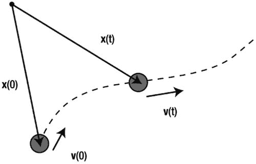

图 14-1。

The initial-value problem for particle motion simulation

在这个问题中，粒子 v 的速度本身可能是随时间变化的(换句话说，粒子可能在加速)。这就是为什么我们需要牛顿第二定律:

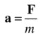

知道任意时刻的加速度，我们就可以通过积分定义加速度的方程来计算速度 v:

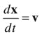

类似地，应用速度的定义，我们可以通过对速度进行时间积分来获得位置:

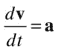

正如在第 5 章中所讨论的，这些微分方程有时可以解析求解，以给出 x(t)和 v(t)作为时间函数的闭合表达式。在计算机模拟中，积分需要用数字来完成。

数值积分意味着连续变化的粒子的位置和速度只能在小的离散步骤中计算和更新。要做到这一点，我们必须首先离散化刚才所示的运动方程。

#### 数值离散和差分格式

在第 3 章中，当我们用一般数学术语讨论梯度函数的数值计算时，你看到了一个离散化过程的例子。你可以参考“简单的微积分思想”一节来复习。

在当前的上下文中，您可以将数值离散化应用到前面的两个方程，以将它们转换为可以在计算机上输入代码和求解的形式。

这是通过用代数分数近似这些方程中的导数来实现的。例如，我们可以利用 v 和 t 的微小变化δv 和δt 来近似计算加速度 d v/dt，如下所示:

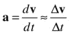

下一步是用一定时间的值来表示离散阶跃变化δv 和δt，因为这是您知道的(或者说是您的计算机知道的)。这可以用不同的方法实现，称为差分格式。

例如，您可以将δt 作为下一个时间步长的时间减去当前时间，速度间隔δv 也是如此。这给出了一个向前差分方案，如第 3 章中所述(注意，这里的 n 表示时间步长编号):

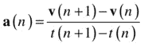

类似地，速度可以通过以下方式由前向差分方案近似:

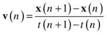

现在，您已经将微分方程转换成了易于理解和操作的代数方程。更重要的是，它是一种计算机可以计算的形式。这就是离散化的作用。

但是在您可以将任何东西放入代码之前，还有一个步骤:您需要将前面的差分模式转换为集成模式。

#### 数值积分和积分方案

在第 3 章中也概括介绍了数值积分。关键的想法是，我们需要根据旧时间的值，找到新时间的速度和位置。因此，正如我们在[第 3 章](03.html)中所做的，我们操纵前面的等式给出 v(n+1)和 x(n+1)的以下表达式，其中我们将时间差 t(n+1)–t(n)写成δt(时间步长):

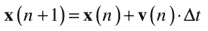

如你所知，这给出了一个前向积分方案，称为欧拉方案。有了这些方程，你可以根据前一时间步的速度和位置来获得新的速度和位置。现在，您可以将这些方程直接放入代码中，并通过在每个时间步重复计算来模拟粒子的运动。这将给你一个粒子真实轨迹的离散近似值，如图 [14-2](#Fig2) 所示。一个好的模拟意味着这个近似的轨迹尽可能的接近真实的轨迹。近似值的精度取决于许多因素，包括以下因素:

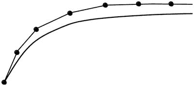

图 14-2。

Numerical integration gives an approximation of the true trajectory

*   问题的物理学:实际上，这是通过加速度 a 随时间的变化而得到的。有些物理问题比其他问题更容易精确模拟，特别是当加速度不随时间变化很大时。
*   模拟时间步长:一般来说，时间步长越小，近似值就越好。但是减少时间步长是有代价的，因为模拟可能会运行得更慢。参考图 [14-2](#Fig2) ，较小的时间步长意味着点之间的距离减小，近似曲线更接近真实曲线。集成方案:集成方案的选择通常对模拟的准确性、稳定性和执行速度有重要影响。但是在这些期望的特征之间经常有一个折衷。

### 数值格式的特征

当您决定使用哪种集成方案时，有一组特性需要牢记在心，因为它们决定了该方案有多“好”以及它有多适合您心目中的应用。我们将分别简要讨论其中的一些特征，但请记住它们是相互联系的。

#### 一致性

数值格式的一致性是指数值格式在逼近微分方程的意义上与原微分方程一致的性质。形式上，在无限小时间步长的限制下，数值解应该与微分方程的真实解相同。这可以看作是任何数值格式的必要条件。如果这不是真的，这个方案将给出错误的物理原理，并且基本上是无用的。

#### 稳定性

在前一章中，你看到了一个数值不稳定的壮观例子，当弹簧刚度太高时，绳索模拟“爆炸”。从形式上讲，数值格式的稳定性是指它随着时间的推移减少误差(或通常所说的“扰动”)的能力。如果误差或扰动在任何时候随时间衰减，则方案是稳定的；如果误差随时间增长，它是不稳定的。一个方案可以是有条件稳定的(意味着它在某些条件下是稳定的)或无条件稳定的(总是稳定的，与条件无关)。

#### 集合

收敛是指当我们减少时间步长时，得到的数值解应该接近真实解。一致性是收敛的必要条件，但不是充分条件。同样，如果数值格式不收敛，它显然是没有用的。为了收敛，一个方案还必须是稳定的。

#### 准确

用有限差分代替微分方程不可避免地会引入误差(称为离散化误差)。不用说，希望这些误差尽可能小。数值方案的精度决定了这些误差的大小。时间步长对数值误差也有重要影响；时间步长越小，误差通常越小(如果方案是收敛的)。数值格式的顺序决定了误差随着时间步长的减小而减小的速度。一阶方案的误差与时间步长δt 成正比，二阶方案的误差与(δt)2成正比，依此类推。因此，随着时间步长δt 的减小，二阶格式将更快地收敛到真实解，使其更加精确。

#### 效率

数值方案的效率量化了每单位模拟时间内计算解决方案的速度(以挂钟时间计)。对于相同的时间步长，数值格式越复杂，其效率越低，因为它必须执行大量的计算和相关操作，以产生每个时间步长的给定解。更精确的方案通常更复杂，因此效率更低。因此，通常需要在准确性和效率之间进行权衡。然而，在实际实施中，数值方法的整体效率取决于它在保持稳定性和准确性的同时可以允许的时间步长的大小。结果可能是，一个简单的方案比一个更复杂的方案需要大得多的时间步长来保持稳定，这使得它在每个模拟时间的总计算时间方面效率更低。

### 集成方案的类型

数值分析的术语听起来很混乱，因为有太多的方案，它们相关的名称，以及不同的分类方法。以下是与集成方案分类相关的一些术语的简要描述。请注意，这里提到的类别并不相互排斥；它们重叠。

*   向前/向后方案:您可能会遇到诸如向前欧拉和向后欧拉这样的方案名称。这些名称表明该格式是从相应的向前或向后差分格式中派生出来的。
*   隐式/显式方案:显式方案是仅根据前一时间步的变量来计算新时间步的状态变量的值；这使得显式方案易于应用。在隐式方案中，必须求解包含旧时间步长和新时间步长的变量的方程，以计算新时间步长的变量；这使得这种方案效率较低。
*   单步/多步方法:单步方法使用单个先前时间步的信息来计算新时间步的变量。多步方法使用来自多个先前时间步的信息。
*   预测-校正方法:顾名思义，预测-校正方法包括两个阶段:在新的时间步长预测值的步骤，然后是对估计值进行校正的另一个步骤。
*   龙格-库塔方法:这是指一类高阶方法，通过采用中间阶段进行，可以是显式的，也可以是隐式的。我们将考虑这种方法的两个例子，包括四阶龙格-库塔(RK4)方法，通常简称为龙格-库塔方法。

### 演示不同集成方案的简单示例

在接下来的部分中，我们将讨论一些不同的方案，然后编写实现它们的代码。能够容易地在不同的方案之间切换将是有帮助的，这将便于比较不同的方案和为每个问题选择合适的方案。

启用这种切换在一个简单的例子中得到了最好的演示，这个例子修改了我们在本书到目前为止的大多数例子中使用的动画代码的结构。具体来说，我们将修改《T2》第 5 章中的基本`forces-test.js`示例，该示例演示了球在重力和阻力下的运动，以处理切换。我们称修改后的文件为`schemes-test.js`。代码的开头如下所示:

`var canvas = document.getElementById('canvas');`

`var context = canvas.getContext('2d');`

`var ball;`

`var m = 1;`

`var g = 10;`

`var k = 0.1;`

`var t, t0, dt;`

`var force, acc;`

`var animId;`

`var animTime = 10;`

`window.onload = init;`

`function init() {`

`ball = new Ball(15,'#0000ff',m,0,true);`

`ball.pos2D = new Vector2D(50,400);`

`ball.velo2D = new Vector2D(60,-60);`

`ball.draw(context);`

`t0 = new Date().getTime();`

`t = 0;`

`animFrame();`

`};`

`function animFrame(){`

`animId = requestAnimationFrame(animFrame,canvas);`

`onTimer();`

`}`

`function onTimer(){`

`var t1 = new Date().getTime();`

`dt = 0.001*(t1-t0);`

`t0 = t1;`

`if (dt>0.2) {dt=0;};`

`t += dt;`

`if (t < animTime){`

`move();`

`}else{`

`stop();`

`}`

`}`

`function stop(){`

`cancelAnimationFrame(animId);`

`}`

`function move(){`

`myFavoriteScheme(ball);`

`context.clearRect(0, 0, canvas.width, canvas.height);`

`ball.draw(context);`

`}`

`function calcForce(``pos,vel`T2】

`var gravity = Forces.constantGravity(m,g);`

`var drag = Forces.linearDrag(k,vel);`

`force = Forces.add([gravity, drag]);`

`}`

`function getAcc(pos,vel){`

`calcForce(pos,vel);`

`return force.multiply(1/m);`

`}`

`function myFavoriteScheme(obj){`

`//` `scheme-specific code goes in here`

`}`

代码的关键结构变化用粗体表示。`calcForce()`方法现在有两个参数，`pos`和`vel`，它们引用位置和速度向量。这是需要的，因为一些方案需要在不同的时间评估加速度(以及力)。在列出的示例中，没有使用`pos`参数，但在未来的示例中可能需要它，因此出于通用性考虑将其包括在内。这些方案将通过调用私有的`getAcc()`方法来进行评估，该方法计算加速度，也使用位置和速度向量作为参数。`move()`方法将调用实现集成方案的方法。所有特定于方案的代码都将在它自己的方法中，这里统称为`myFavoriteScheme()`。这样，实现新的方案和在方案之间切换将变得容易。请注意，我们只对线性运动应用这些变化，因为我们将只对粒子运动使用新的积分方案；作为进一步的练习，你也可以沿着同样的路线在旋转运动中实现它们。

## 欧拉积分

我们在本书中多次讨论和使用了欧拉积分方案，所以你现在已经非常熟悉了。但你可能不知道的是，欧拉方案有几种不同的版本。让我们来看看其中的一些及其属性。

### 显式欧拉

我们在本节前面从前向差分格式导出的欧拉积分格式被称为前向欧拉格式。又因为是显式格式，所以又称为显式欧拉格式。等式又来了:

因为简单，显式欧拉格式速度快，但只有一阶精度，而且往往不稳定。

注意，当在代码中实现该方案时，我们在基于当前加速度更新速度之前基于当前速度更新位置，以与前面的等式一致。

文件`schemes-test.js`中的相关代码在`EulerExplicit()`方法中，看起来是这样的:

`function EulerExplicit(obj){`

`acc = getAcc(obj.pos2D,obj.velo2D);`

`obj.pos2D = obj.pos2D.addScaled(obj.velo2D,dt);`

`obj.velo2D = obj.velo2D.addScaled(acc,dt);`

`}`

### 隐式欧拉

显式欧拉格式是从导数的前向差分近似开始得到的。相反，您可以从向后差分方案开始:

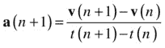

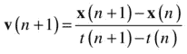

重新排列这些差分方程得到如下结果:

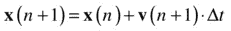

这看起来类似于显式欧拉格式的相应方程，除了一个关键的区别:这些方程的右侧包含新时间步长下的加速度和速度。因此，在获得新时间步长的速度之前，我们需要先求解一个隐式方程。这涉及到进一步的计算，这使得隐式方案效率更低(而且编码起来也很痛苦！).隐式格式的主要优点是它是无条件稳定的。如果你想确保你的模拟永远不会爆炸，值得考虑使用隐式方案。但是因为我们在本书中没有使用隐式欧拉格式，所以我们不会费心编写代码。

### 半隐式欧拉

半隐式欧拉格式，顾名思义，介于显式和隐式欧拉格式之间。在一个常见的变型中，如在显式方案中，基于前一时间步的加速度来推进速度，但如在隐式方案中，基于新时间步的更新速度来推进位置:

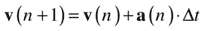

半隐式方案的优点是它比显式方案更稳定，并且还节省能量。这种能量守恒特性使它比显式格式更精确，尽管它仍然是一阶的。

与显式方案的实现相比，半隐式方案实现简单。您只需颠倒更新位置和速度的顺序。下面是相应的函数`EulerSemiImplicit()`:

`function EulerSemiImplicit(obj){`

`acc = getAcc(obj.pos2D,obj.velo2D);`

`obj.velo2D = obj.velo2D.addScaled(acc,dt);`

`obj.pos2D = obj.pos2D.addScaled(obj.velo2D,dt);`

`}`

存在半隐式欧拉方案的另一个变体(具有与第一个版本类似的属性)，其中基于当前速度而不是更新的速度来推进位置，并且基于更新的加速度(因此在更新的位置)来推进速度:

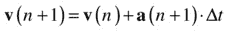

请注意，因为加速度可能取决于位置，并且必须在新的时间进行计算，所以必须首先在代码中更新位置。这个版本的半隐式欧拉方案是我们在本书的大部分内容中一直使用的方案，并且它基本上工作得相当好，至少对于创建各种类型的物理效果的简单演示来说是如此。

我们已经在函数`EulerSemiImplicit2()`中对此进行了编码:

`function EulerSemiImplicit2(obj){`

`obj.pos2D = obj.pos2D.addScaled(obj.velo2D,dt);`

`acc = getAcc(obj.pos2D,obj.velo2D);`

`obj.velo2D = obj.velo2D.addScaled(acc,dt);`

`}`

### 显式和半隐式欧拉格式的比较

为了比较显式和半隐式欧拉方案，让我们对一个质点在弹簧力作用下的振动进行一个非常简单的模拟。文件`spring.js`设置了一个粒子和一个弹簧力作用的中心，并在理论上其轨迹应该结束的点上创建了另外两个粒子。然后，`calcForce()`方法施加弹簧力，模拟移动粒子的运动，描绘出它的轨迹。这些文件在物理或编码方面没有什么新内容，所以我们在这里不列出任何代码。但关键的一点是，你可以在`move()`方法中改变集成方案。

用`EulerExplicit()`、`EulerSemiImplicit()`和`EulerSemiImplicit2()`方法依次运行模拟。您可以通过取消注释`springs.js`中的`moveObject()`方法中的相关行并注释掉其他行来选择集成方案(或者，您可能希望修改代码以同时运行多个方案)。你会发现粒子如预期的那样振荡，并且很好地保持在两个半隐式方案的端点边界内。半隐式欧拉方法几乎是能量守恒的；就是所谓的辛方法。然而，显式欧拉格式表现很差:振荡变得越来越大(见图 [14-3](#Fig3) )。模拟炸了:显式欧拉创造能量！如果你引入一些可以消除能量的物理现象，比如阻力或摩擦力，稳定性就会提高。然而，该格式不能模拟纯周期振荡运动。

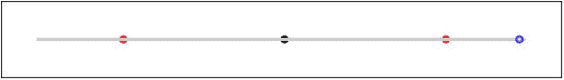

图 14-3。

The explicit Euler scheme is too unstable to simulate spring motion properly

作为这些方案稳定性的另一个测试，通过改变`move()`方法中位置和速度更新的顺序，尝试使用显式欧拉方案运行上一章的绳索模拟。这是在文件`rope-explicit-euler.js`里做的:不好看！即使在低得多的刚度下，显式欧拉格式也不能模拟绳索。有趣的是，即使半隐式方案的第一个版本也没有第二个版本做得好；对于小得多的刚度值，它变得不稳定。相比之下，半隐式方案的第二个版本相当健壮，尽管它最终也会失败，正如你在[第 13 章](13.html)中看到的。

### 为什么用欧拉，为什么不用？

许多程序员只使用欧拉积分，而其他人则尽可能远离欧拉。那么到底该不该用欧拉呢？

为了明智地回答这个问题，区分不同版本的欧拉方法是很重要的。人们经常谈论欧拉方案，好像只有一个似的。但是我们已经看到，不同版本的 Euler 具有非常不同的属性，根据模拟的性质，这可能会导致非常不同的性能。有不好的欧拉，也有更好的欧拉。你一定要避免不好的，显式的欧拉。半隐式欧拉实际上没那么糟糕(毕竟，我们用它熬过了本书的大部分时间！).它和显式欧拉格式一样容易编码，但具有更好的特性。在代码中，显式和半隐式 Euler 格式的区别仅仅在于交换了计算变量的顺序(所以要小心！).所以真的没有理由使用显式欧拉格式。半隐式欧拉格式广泛应用于刚体物理引擎中。

如果你需要绝对的稳定性，全隐式欧拉格式是值得考虑的，尽管我们还没有真正向你展示如何求解一个隐式方程。但是现在你对数值模式有了更好的理解，从书上或网上找到它应该不难。求解所得隐式方程所涉及的额外计算成本使得隐式欧拉格式在效率方面看起来不太吸引人。但是您可以使用大的时间步长，而不用担心数值不稳定，这将提高效率。然而，大的时间步长会导致低精度，特别是考虑到欧拉仅仅是一阶的。如果与稳定性相比，准确性不重要，这可能没问题(例如，如果您只是希望您的模拟不会爆炸，而不担心其准确性)。

但是，如果你真的需要精度，我们讨论过的一阶欧拉格式不会很好地为你服务。你可能需要一个类似龙格-库塔的方案。

## 龙格-库塔积分

龙格-库塔方案比欧拉方案更复杂，但它们在相当大的精度方面是值得的。如果准确性对您的模拟至关重要，您应该认真考虑龙格-库塔。不过，这种精度是以性能价格为代价的，尤其是如果您选择高阶方案的话。我们将描述两种最流行的龙格-库塔方案。

### 二阶龙格-库塔格式(RK2)

二阶龙格-库塔方法(RK2)也称为 Heun 方法或改进的欧拉方法。这是一种两阶段预测-校正方法，使用显式欧拉方法作为预测器，使用所谓的梯形方法作为校正器。以下是定义该方法的等式:

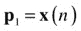

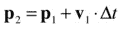

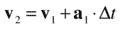

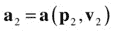

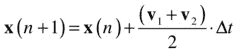

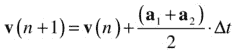

临时变量 p 1 ，v 1 ，a 1 为初始位置、速度和加速度向量；类似地，p 2 、v 2 和 a 2 是由前向欧拉方案计算的时间步长结束时的相应变量。这是预测部分。最后两个等式通过(分别)使用时间步长间隔内的平均速度和平均加速度更新位置和速度来应用校正器。

RK2 比 Euler 更精确，因为 Euler 方案仅使用旧时间步的速度和加速度来计算粒子的新速度和位置。如果没有加速度，这没问题，所以速度在一个时间步长内保持不变，但速度和加速度都可能变化。例如，对于一个抛射体来说，速度的大小和方向都是变化的。欧拉方案只考虑时间步长开始时的速度，而 RK2 方案则考虑时间步长开始和结束时的平均速度。因此，RK2 预测的时间步长结束时的位置更接近实际位置。

这种方法的精度是二阶的，因此它比欧拉方法要精确得多。下面是相关的`RK2()`函数:

`function RK2(obj){`

`var pos1 = obj.pos2D;`

`var vel1 = obj.velo2D;`

`var acc1 = getAcc(pos1,vel1);`

`var pos2 = pos1.addScaled(vel1,dt);`

`var vel2 = vel1.addScaled(acc1,dt);`

`var acc2 = getAcc(pos2,vel2);`

`obj.pos2D = pos1.addScaled(vel1.add(vel2),dt/2);`

`obj.velo2D = vel1.addScaled(acc1.add(acc2),dt/2);`

`}`

`RK2()`函数比半隐式欧拉方案多包含几行代码。因此，对于相同的时间步长，精度的提高是以降低速度为代价的。

### 四阶龙格-库塔格式(RK4)

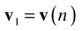

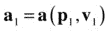

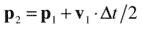

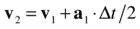

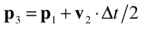

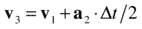

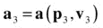

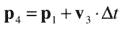

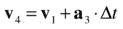

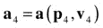

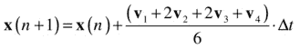

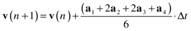

四阶龙格-库塔方案(RK4)是最著名的龙格-库塔方案，通常被称为龙格-库塔方案。顾名思义，它是四阶精度。因此，如果将时间步长减半，误差应该会减少十六分之一！这种想法与 RK2 类似，但中间步骤更多，中间变量及其平均值的计算方式也不同。下面是完整的方程组:

下面是相应的`RK4()`方法:

`function RK4(obj){`

`var pos1 = obj.pos2D;`

`var vel1 = obj.velo2D;`

`var acc1 = getAcc(pos1,vel1);`

`var pos2 = pos1.addScaled(vel1,dt/2);`

`var vel2 = vel1.addScaled(acc1,dt/2);`

`var acc2 = getAcc(pos2,vel2);`

`var pos3 = pos1.addScaled(vel2,dt/2);`

`var vel3 = vel1.addScaled(acc2,dt/2);`

`var acc3 = getAcc(pos3,vel3);`

`var pos4 = pos1.addScaled(vel3,dt);`

`var vel4 = vel1.addScaled(acc3,dt);`

`var acc4 = getAcc(pos4,vel4);`

`var velsum = vel1.addScaled(vel2,2).addScaled(vel3,2).add(vel4);`

`var accsum = acc1.addScaled(acc2,2).addScaled(acc3,2).add(acc4);`

`obj.pos2D = pos1.addScaled(velsum,dt/6);`

`obj.velo2D = vel1.addScaled(accsum,dt/6);`

`}`

在一个时间步长内要做大量的计算！所以让我们看看 RK4 能为我们做些什么。我们将针对三个不同的问题比较欧拉、RK2 和 RK4 方法。

### 与欧拉比较 RK2 和 RK4 的稳定性和精确度

为了检查 RK2 和 RK4 的稳定性，您可以使用`RK2()`和`RK4()`方法重复弹簧测试。你会发现振荡运动被两者完美地模拟了:在肉眼所能看到的范围内，振荡的振幅(以及能量)甚至没有一点点的减少或增加(如果你愿意，你可以通过绘制图表来进行更多的定量测试)。

为了测试这些方案的准确性，并以一种简单的方式与以前的方案进行比较，让我们做一个简单的轨道模拟。文件名为`orbits.js`。同样，没有什么是你在以前的文件中没有见过的，我们不会在这里列出任何代码。测试是轨道应该自己关闭；如果他们不这样做，这个计划就会引入重大错误。

像以前一样用不同的集成方案运行代码。有了显式欧拉积分器，轨道将到处结束:它永远不会自我关闭(见图 [14-4](#Fig4) )。这应该足以说服你永远不要使用显式欧拉格式！

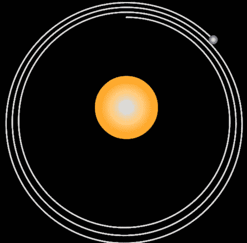

图 14-4。

The explicit Euler scheme is too inaccurate to produce a closed orbit

所有其他计划都做得相当不错。但是如果你长时间运行模拟，你会发现即使是半隐式欧拉格式也开始失去精度，并跟踪稍微不重叠的圆，因为它们只有一阶精度(见图 [14-5](#Fig5) )。相比之下，我们运行 RK4 方案的时间要长得多，但是没有发现任何准确性的损失。RK2 格式的精度介于半隐式欧拉格式和 RK4 格式之间。对于这个简单的例子，你几乎不会注意到 RK2 和 RK4 之间的任何区别。

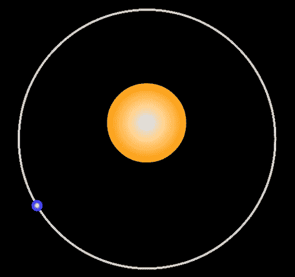

图 14-5。

The semi-implicit Euler scheme accumulates errors after a few orbits

## Verlet 集成

我们将讨论的第三类也是最后一类集成方案称为 Verlet 集成。由于其稳定性，该方法最初是为处理复杂和可变的分子动力学模拟而开发的，现在广泛用于游戏编程和动画。

在所谓的 Verlet 系统中使用 Verlet 积分来模拟受约束的粒子的运动。这项技术可以应用于连接结构，如在布娃娃物理学，正向和反向运动学，甚至刚体系统。我们没有空间来探索这种方法。我们提到 Verlet 系统仅仅是为了将它们与 Verlet 集成方案区分开来，因为它们有时会被混淆:Verlet 系统如此命名是因为它们使用了 Verlet 集成方案。但是方案本身完全独立于建模方法；事实上，它可以与任何其他方法一起使用，例如在第 13 章中讨论的刚体动力学。

Verlet 积分方案通常不如 RK4 精确，但另一方面，相比之下非常有效。让我们来看看该方法的两个常见变体:位置 Verlet 和速度 Verlet。

### 位置 Verlet 方法

在位置微元法中，也称为标准微元法，粒子的速度是不存储的。相反，存储粒子的最后位置，然后可以根据需要通过从当前位置减去最后位置并除以时间步长来计算其速度。

正如显式欧拉格式可以从一阶导数的前向差分近似导出一样，标准的 Verlet 格式可以从二阶导数的中心差分近似导出(见[第 3 章](03.html))。我们不会在这里显示推导过程，而只引用最终结果:

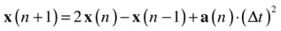

该等式根据前两个时间步长的位置给出新时间步长的位置，而不使用速度。

如果需要，可以从位置计算速度，例如，使用后向差分:

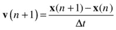

或者，您可以使用中心差分方案，因为先前的位置也是已知的，以给出更精确的速度估计:

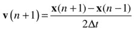

先前给出的位置 Verlet 方程的一个问题是它假设时间步长是恒定的。但一般来说，模拟中的时间步长是可变的。事实上，在您的 JavaScript 模拟中，时间步长通常会略有不同。考虑到可变的时间步长，使用该公式的修改版本:

在该等式中，δt(n)表示当前时间步长，δt(n-1)表示前一时间步长。这种形式可以称为时间校正或时间调整的位置 Verlet 方案。

在 Position Verlet 方案的实现中出现的另一个潜在问题是初始条件的指定。因为该方案不使用速度，而是使用前一时间步的位置，所以不能像通常那样直接指定初始速度和初始位置。相反，您需要指定初始位置 x(0)以及初始位置之前的前一个位置 x(–1)！这听起来可能毫无意义，但实际上，通过应用前面给出的速度向后差分公式，可以从初始速度推断出假设位置的值。在该公式中设置 n =–1 给出如下结果:

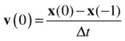

解出 x(–1)的方程式，得出:

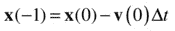

我们现在可以如下编写一个`PositionVerlet()`函数:

`function PositionVerlet(obj){`

`var temp = obj.pos2D;`

`if (n==0){`

`acc = getAcc(obj.pos2D,obj.velo2D);`

`oldpos = obj.pos2D.addScaled(obj.velo2D,-dt).addScaled(acc,dt*dt/2);`

`olddt = dt;`

`}`

`acc = getAcc(obj.pos2D,obj.velo2D);`

`obj.pos2D = obj.pos2D.addScaled(obj.pos2D.subtract(oldpos),dt/olddt).addScaled(acc,dt*dt);`

`obj.velo2D = (obj.pos2D.subtract(oldpos)).multiply(0.5/dt);`

`oldpos = temp;`

`olddt = dt;`

`n++;`

`}`

注意，我们有新的变量`oldpos`和`olddt`用于存储先前的位置和先前的时间步长。还有一个变量`n`,表示自上次调用该函数以来已经过去的时间步数。从代码中可以看出，第一次调用该函数时，位置 x(–1)被设置。

### 速度 Verlet 方法

位置 Verlet 方法的一个问题是速度估计不是非常精确。Velocity Verlet 方法解决了这个问题，尽管在效率上付出了一些代价。Velocity Verlet 是两者中更常用的版本。方案方程如下:

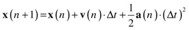

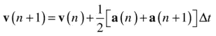

将第一个方程与欧拉方案中的相应方程进行比较，可以看出我们现在有了一个包含加速度的附加项。因此，欧拉方案假设加速度在一个时间步长的间隔内为零，而速度 Verlet 方法考虑了加速度，但假设加速度在该间隔内是恒定的。也许你还记得《T2》第四章中的等式 s = u t + a t 2 。速度 Verlet 中的位置更新方程正是这种形式(位移为 s = x(n+1)-x(n))。

还要注意，速度更新方程使用旧时间步长和新时间步长的加速度平均值，而不是仅使用旧时间步长的加速度。因此，它是速度的一个更好的近似值。由于这些原因，速度 Verlet 方案比欧拉方案更精确，并且具有其他良好的特性，如更大的稳定性和能量守恒。

下面是`VelocityVerlet()`方法:

`function VelocityVerlet(obj){`

`acc = getAcc(obj.pos2D,obj.velo2D);`

`var accPrev = acc;`

`obj.pos2D = obj.pos2D.addScaled(obj.velo2D,dt).addScaled(acc,dt*dt/2);`

`acc = getAcc(obj.pos2D,obj.velo2D);`

`obj.velo2D = obj.velo2D.addScaled(acc.add(accPrev),dt/2);`

`}`

### 测试 Verlet 方案的稳定性和准确性

现在，您可以使用 Verlet 方案运行弹簧和轨道模拟。你应该会发现他们在这两种情况下都做得相当不错。Verlet 方案是稳定的，但不如 RK4 精确。

通过用已知的解析解对一个问题进行模拟，可以进行一个简单的测试来说明所有不同方案的精度差异，然后可以将数值解与之进行比较。你可能还记得，在第四章中，我们为抛射体模拟的欧拉方案做过这样的测试。现在让我们对所有不同的方案做一些类似的事情。

文件`projectile.js`包含代码。同样，我们不会显示任何代码清单，因为到目前为止，您已经多次看到过类似的代码。要点是它创建一个球，并初始化它的位置和速度，使球以一定角度向上抛，然后使球受重力作用。

使用不同的积分器运行模拟。该代码绘制了分析轨迹以及数值计算轨迹(当然，球会跟随该轨迹)。你会发现时间修正位置 Verlet 和所有欧拉积分器给出的轨迹与解析轨迹略有偏差(见图 [14-6](#Fig6) )。另一方面，使用速度 Verlet、RK2 和 RK4 方案预测的轨迹与解析轨迹非常接近，以至于无法区分。和 RK2 一样，Velocity Verlet 格式也是二阶格式。请注意，这些比较是针对特定的问题，包括恒定加速度。对于不同的问题，不同的方案可能或多或少是准确的。

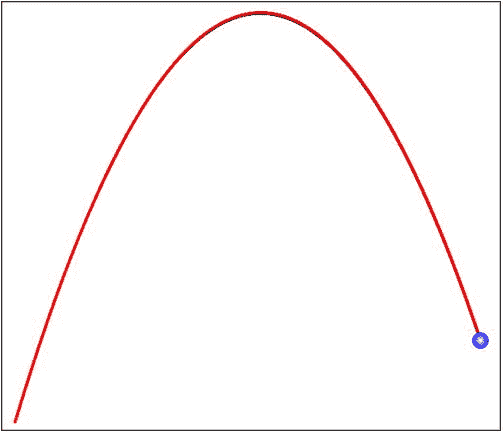

图 14-6。

Projectile trajectory simulated with Position Verlet scheme (slightly lower curve)

最后，您可能想要检查标准 Position Verlet 方案在没有时间校正的情况下表现如何。为此，用以下代码替换更新`PositionVerlet()`中位置的代码行:

`obj.pos2D = obj.pos2D.add(obj.pos2D).subtract(oldpos).addScaled(acc,dt*dt);`

如果你运行代码，你会发现模拟完全错了！消息是，如果在模拟中有可变的时间步长，时间校正是必不可少的。

## 实现准确性的技巧

如果你想建立非常精确的模拟，你需要仔细考虑几个方面。我们在这里简要回顾一下你在这一章以及前几章中学到的知识。

### 选择合适的集成方案

在这一章中，我们花了很多时间讨论数值积分方案及其特点，如精度和稳定性。所以，这里就不多说了。简单重申一下，通常的欧拉格式不是很精确，只是一阶格式；四阶龙格-库塔方案 RK4 通常是精度非常重要的仿真的好选择，尽管这是以降低效率为代价的。RK2 和 Velocity Verlet 方案在精度和速度之间提供了很好的折衷，是二阶的(因此比 Euler 方案更精确),同时比 RK4 简单得多。

### 使用合适的时间步长

结合积分方案，你需要为你的模拟选择一个合适的时间步长。时间步长越小，数值格式越精确。RK4 等高阶格式比欧拉等低阶格式收敛更快。这意味着对于给定的时间步长，RK4 更精确。你可以在一定程度上控制时间步长。然而，时间步长可以有一个限制，因为`timer`事件之间的实际时间间隔包括执行事件处理程序中所有代码的时间。因此，如果您的模拟很复杂，并且涉及大量计算或动画，则实际时间步长可能会远远大于您在计时器中指定的时间步长。

有些模拟非常复杂，无法在合理的小时间步长内完成计算，因此可能无法实时执行。一个可能的解决方案是预先计算，然后制作动画。通过这种方式，可以将模拟时间步长与动画时间步长“分离”。这种方法的一个例子将在[第十六章](16.html)的太阳系模拟中应用。

### 使用精确的初始条件

有些模拟对开始时模拟对象的位置和速度值很敏感。这些初始条件的一个小变化可能会在随后的运动中产生大的变化。例如，在涉及轨道的模拟中，卫星的轨道可能会发生实质性的变化，甚至可能在初始条件选择错误的情况下撞上一颗行星。初始条件是模拟规范的一部分:它们越精确，结果轨迹就越接近预期轨迹。

### 小心处理界限

涉及边界的模拟特别容易不准确。这种相互作用必须使用特殊的方法来处理，以检测和处理特定时刻的碰撞，它们会引入额外的误差源，随着时间的推移，这些误差源甚至会变得比与数值积分相关的误差源更重要。在第 11 章中，我们描述了如何处理一些特殊情况下的问题，包括边界的重新定位和速度修正。不准确的另一个来源是碰撞时间的不确定性。在下一节中，你将看到一个例子，一个球在“穿过”地面后被检测到并停止。因此，它落地的时间被稍微高估了。速度越高，该误差越大。为了获得更高的精度，需要考虑并校正这些误差。

## 建筑比例模型

让我们从澄清标题的含义开始这一部分。我们所说的比例模型并不是指像飞机那样的物理比例模型。我们指的是一个计算机模型，其中所有相关的物理参数都与它要模拟的真实系统成适当的比例。从这个意义上说，比例模型可能包括按比例表示物理对象，但它远远超出了简单的视觉方面；从某种意义上来说，我们很快会做得更精确，正确地衡量物理学。

### 缩放以获得真实感

为什么比例建模很重要？正确的比例建模对于模拟真实地复制被建模系统的行为是必要的。拥有正确的物理方程和适当的视觉表现以及像 3D 这样的附加效果对于游戏和模拟中的真实感来说显然是非常重要的。也许不太明显的是，需要一致地选择适当的参数值，以便模拟的所有方面与正确的长度和时间比例一起工作，以产生真实世界的逼真模型。

我们如何做到这一点？首先，我们将用一个非常简单的例子来说明比例建模的过程；然后在这一节的最后，我们会给你一个处理更复杂模拟的通用形式方法。

### 简单的例子

假设你想创建一个 2D 的排球游戏:角色将把球扔来扔去，因此大部分时间球将在重力作用下移动，就像一个抛射体。周围会有风景和建筑，你希望你的游戏在视觉上和功能上都是一个比例模型。为了继续，让我们考虑一个简单的假设场景，其中球在建筑物的高度，并在重力作用下下落。你希望球下落的速度与周围场景中的长度比例一致；在这种情况下，建筑高度。假设唯一的力是没有阻力或摩擦或风效应的纯重力，并且为了简单起见(但不失一般性)，仅考虑垂直运动，底层物理可以由单个方程描述。应用牛顿第二定律 F = ma，用 mg 给出的力 F，我们得到这个方程:

当然，这个方程仅仅表达了这样一个事实，即所有物体都以相同的垂直加速度 g 下落，不管它们的质量或其他特性如何。如你所知，你的模拟将对这个方程进行两次积分:第一次获得球的速度，第二次获得它的位移。整个问题由一个参数控制:重力加速度 g。因此，问题归结为:你必须在你的模拟中使用什么样的 g 值，才能使球以真实的速度下落，与游戏中的大小和距离一致？g 的实际值为 9.8 米/秒 2 ，或约为 10 米/秒 2 。但这不是您可以在模拟中使用的值，因为您在模拟中没有使用相同的单位。见图 [14-7](#Fig7) 。

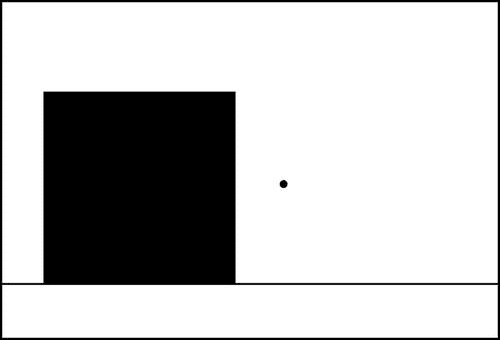

图 14-7。

Simulating a falling ball to scale

### 选择单位

首先，您需要为模拟中的相关物理量选择单位。你需要的最重要的单位是时间、长度和质量。它们在物理学中被称为基本量。其他量，如速度和加速度，取决于这些基本量，它们的单位可以通过使用它们的定义方程从基本量的单位导出；因此，它们被称为导出量。

在这种情况下，因为质量不在方程中，所以用什么单位或者什么值来表示球的质量是完全不相关的。所以我们需要担心两个基本量:时间和长度(或距离)。

让我们假设您想要实时模拟:换句话说，模拟应该以与真实“挂钟”时间相同的速率进行。(有时您可能不希望这样:例如，如果您正在模拟太阳系，您可能不希望等待一年地球绕太阳一周！)在图 [14-7](#Fig7) 中，你的模拟中的球从真实建筑的高度落下所用的时间完全相同。因此，你选择以秒来衡量时间，就像在现实生活中一样。不仅如此，您还希望 1 秒的模拟时间等于 1 秒的真实时间:您的时间缩放因子是 1。

用于基于屏幕的视觉模拟的自然距离单位是像素(px)。您还需要决定一个合适的比例因子来将实际距离转换为像素。

### 比例因子和参数值

假设你场景中的建筑在现实生活中有 5 米高，你用一个 200 像素高的矩形来表示它。那意味着你的缩放因子是 0.025m/px；每个像素代表 0.025 米或 2.5 厘米。您可以使用该长度比例因子相应地缩放其他对象。因此，如果你的球是一个半径为 10 厘米的排球，它在模拟中的半径将是 4 个像素。

回到我们最初的问题:你应该给 g 什么值？你解决这个问题的方法如下。作为加速度，g 的测量单位是米/秒 2 。现在，每一秒在模拟中都是实际的一秒，但每米在模拟中都是 40 px。因此，在模拟中，缩放 g = 10 米/秒 2 的近似值将得到 g = 400！

文件`scale-model.js`在这个简单的模拟中实现了这些值。在代码中，当球落到地面上 200 px(相当于现实中的 5 m)时，球被停止。然后跟踪自模拟开始以来的时间。运行模拟，你会发现球落地大约需要 1 秒钟。这现实吗？使用你在第四章中遇到的旧公式很容易找到答案:

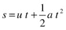

这里位移 s 是下落的高度(5 m)，u 是初速度大小(零)，a 是重力加速度 g (10 m/s 2 )。代入这些值确实给出了 t = 1 s，我们有了实时比例模型！模拟中跟踪的值不完全是 1，但已经足够接近了。它不精确为 1 的原因之一是，球被检测到越过地面的时间稍微晚了一点，因为它移动得太快了。当您运行模拟时，您会看到它在“地面”下方稍停

假设你在模拟中天真地给了 g 值 10。会有什么后果？现在这样做，你应该会发现球到达地面需要 6 秒以上的时间——几乎不现实！

当然，在确定模拟的参数时，您可能不需要总是像这样小心。你可能根本不在乎有没有缩尺模型；也许你只是对创建一个看起来大致正确的动画感兴趣。但是当现实主义真的很重要的时候，知道如何做到这一点是很有用的。在更复杂的模拟中，有一个系统的方法来计算参数值是有帮助的。

### 重新调整方程

重定方程式比例的方法是一种正式的程序，有助于为模拟中的参数计算出合适的值。当您需要计算多个参数的值或者存在多个比例因子时，这种方法特别有用，但是我们将针对刚刚看到的简单示例来演示这种方法。

重新标度涉及到对系统中的变量进行标度，根据新的标度变量重新表达方程，然后将标度方程与原始方程进行比较。程序如下。

首先，写下控制方程(代数的或微分的)，确定所有的变量。在我们的例子中，方程是 a = g，但这实际上是下面的微分方程:

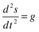

接下来，为每个变量定义比例因子，如下所示:

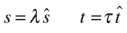

这里，带帽子的变量是新的缩放变量，希腊字母是相应的缩放因子。

然后把旧变量代入原方程。在前面的微分方程中，注意二阶导数意味着我们将位移增量除以时间增量两次。进行替换，我们因此得到这个:

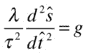

我们可以将这个转换后的等式改写如下:

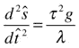

将其与原始方程进行比较，我们推断出，如果右侧等于 g 的重新标度值，则根据标度变量的方程将与原始方程具有完全相同的形式:

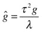

该等式给出了比例因子和参数 g 的重定标值之间的约束。因此，如果我们选择其中两个，就可以获得第三个。在本例中，我们选择了距离和时间的比例因子。因此，我们可以通过替换比例因子τ和λ的值来获得 g 的重新标度值。如前所述，时间 t 的比例因子τ为 1，而距离 s 的比例因子λ为 5/200 或 0.025 m/px，如前一小节所示。因此，模拟所需的 g 的比例值由下式给出:

这正如我们先前的推理。

注意，我们也可以将 g 的重新标度值与其中一个变量(时间或长度)的标度因子固定在一起。先前的约束条件将为我们提供剩余变量的比例因子。

对于这个简单的例子，刚刚概述的正式程序肯定是多余的，但是添加更多的变量和更复杂的方程组，它确实会派上用场。

## 摘要

如果你打算认真进入物理模拟，迟早你需要担心你的集成方案的准确性和稳定性。本章介绍了一些最常见的选项供您选择。特定方案的选择取决于问题以及其他实际因素。在本书的前几章中，我们只使用了欧拉方案。在第 16 章中，你会看到一个需要更精确集成方案的例子。