# 十五、3D 物理

到目前为止，在本书中，你已经建立了二维模拟。但在现实世界中有三个维度:如何将你已经完成的艰苦工作扩展到 3D 领域？在倒数第二章，我们将向你介绍基于 3D 物理的动画的精彩世界。

本章涵盖的主题包括以下内容:

*   3D 物理和数学:这一节讨论如何扩展我们现有的代码框架来创建 3D 模拟。在这个过程中，我们将探索一些额外的数学概念，这将有助于处理三维平移和旋转运动，这将在本章后面的例子中使用。
*   3D 渲染:介绍 WebGL 和 three.js:本节讨论 3D 渲染和 WebGL API，并介绍了`three.js` JavaScript 库，它简化了使用 WebGL 创建 3D 模拟的过程。
*   模拟 3D 中的粒子运动:这部分给出了使用`three.js`库来创建 3D 中粒子运动的物理模拟的例子。这里使用的方法将在第 16 章中应用于开发一个精确的太阳系模拟。
*   在 3D 中模拟刚体运动:以一个旋转立方体为例，本节展示如何在 3D 中模拟刚体运动。在第 16 章中，我们将在这个例子的基础上创建一个飞行模拟器。

请注意，这一章的重点将是 3D 物理，而不是一般的 3D 编程。因此，尽管我们不可避免地要讨论使用 JavaScript 库进行 3D 编码的一些方面，这一章并不是关于最新的 3D 技术。

## 3D 物理和数学

在我们可以创建 3D 模拟之前，我们需要概括一些迄今为止我们一直在使用的数学和物理概念，并在此过程中引入新的概念。

### 3D 对 2D 物理学

到目前为止，我们在本书中讨论的大多数物理学在从 2D 到 3D 的过程中基本上没有变化。当用矢量形式表示时，直线运动和旋转运动的基本定律保持不变。粒子运动以类似的方式处理，不同的是在 3D 中粒子可以在额外的维度中运动(这很明显，不是吗？).因此，数学和代码必须一般化，以包括额外的空间维度。因此，我们将在 3D 中查看向量和向量代数，并构建一个`Vector3D` JavaScript 对象。我们还将创建一个`Forces3D`对象，它与`Vector3D`对象一起，将使我们能够编写代码来处理 3D 空间中各种力下的粒子运动。

刚体动力学更复杂，因为 3D 中的旋转很复杂，需要一些更高级的数学知识。因此，我们还将介绍处理 3D 旋转所需的数学背景，介绍新的数学概念，如矩阵和四元数。

### 三维向量

我们在本书中广泛使用了向量。作为对其有用性的提醒，向量使代表物理定律的方程能够以一种经济的方式来书写。根据 vector 对象编写的代码也更简洁、更直观、更不容易出错。好消息是，3D 矢量与 2D 矢量没有太大区别。

#### 三维向量代数

3D 矢量是 2D 矢量的直接扩展。在第 3 章中，我们并排复习了 2D 版和 3D 版的向量代数。如果你需要复习，你可以再读一遍那一节。2D 的向量代数和 3D 的最大区别，除了有三个分量而不是两个之外，就是你可以在 3D 中做叉积。

##### Vector3D 对象

回到[第三章](03.html)，我们构建了一个`Vector2D`对象，我们一直在用新方法稳步增强它。修改它来创建一个`Vector3D`对象是很简单的。代码在`vector3D.js`文件中，可从 [`www.apress.com`](http://www.apress.com/) 下载，我们在此列出完整代码:

`function Vector3D(x,y,z) {`

`this.x = x;`

`this.y = y;`

`this.z = z;`

`}`

`// PUBLIC METHODS`

`Vector3D.prototype = {`

`lengthSquared: function(){`

`return this.x*this.x + this.y*this.y + this.z*this.z;`

`},`

`length: function(){`

`return Math.sqrt(this.lengthSquared());`

`},`

`clone: function() {`

`return new Vector3D(this.x,this.y,this.z);`

`},`

`negate: function() {`

`this.x = - this.x;`

`this.y = - this.y;`

`this.z = - this.z;`

`},`

`unit: function() {`

`var length = this.length();`

`if (length > 0) {`

`return new Vector3D(this.x/length,this.y/length,this.z/length);`

`}else{`

`return new Vector3D(0,0,0);`

`}`

`},`

`normalize: function() {`

`var length = this.length();`

`if (length > 0) {`

`this.x /=length;`

`this.y /=length;`

`this.z /=length;`

`}`

`return this.length();`

`},`

`add: function(vec) {`

`return new Vector3D(this.x + vec.x,this.y + vec.y,this.z + vec.z);`

`},`

`incrementBy: function(vec) {`

`this.x += vec.x;`

`this.y += vec.y;`

`this.z += vec.z;`

`},`

`subtract: function(vec) {`

`return new Vector3D(this.x - vec.x,this.y - vec.y,this.z - vec.z);`

`},`

`decrementBy: function(vec) {`

`this.x -= vec.x;`

`this.y -= vec.y;`

`this.z -= vec.z;`

`},`

`multiply: function(k) {`

`return new Vector3D(k*this.x,k*this.y,k*this.z);`

`},`

`addScaled: function(vec,k) {`

`return new Vector3D(this.x + k*vec.x, this.y + k*vec.y, this.z + k*vec.z);`

`},`

`scaleBy: function(k) {`

`this.x *= k;`

`this.y *= k;`

`this.z *= k;`

`},`

`dotProduct: function(vec) {`

`return this.x*vec.x + this.y*vec.y + this.z*vec.z;`

`},`

`crossProduct: function(vec) {`

`return new Vector3D(this.y*vec.z-this.z*vec.y,this.z*vec.x-this.x*vec.z,this.x*vec.y-this.y*vec.x);`

`}`

`};`

`// STATIC METHODS`

`Vector3D.distance =  function(vec1,vec2){`

`return (vec1.subtract(vec2)).length();`

`}`

`Vector3D.angleBetween = function(vec1,vec2){`

`return Math.acos(vec1.dotProduct(vec2)/(vec1.length()*vec2.length()));`

`}`

`Vector3D.scale = function(vec,sca){`

`vec.x *= sca;`

`vec.y *= sca;`

`vec.z *= sca;`

`}`

`Vector3D`方法是它们的`Vector2D`对应物的简单概括。注意，`crossProduct()`方法返回了一个`Vector3D`对象，这是应该的。

### 3D 中的力

因为力是矢量，所以当你得知新创建的`Vector3D`对象使得在 3D 模拟中包含力变得简单时，你不会感到惊讶。

#### 三维空间中的牛顿运动定律

在[第五章](05.html)中，我们介绍了支配运动的定律，包括牛顿运动定律。概括地说，这些定律允许我们计算物体在力的作用下的运动。如果你回头看看[第五章](05.html)，你会发现这些定律是用矢量形式表达的。至关重要的是，我们没有具体说明我们是在 2D 还是在 3D 中谈论矢量:规律是一样的。我们在[第四章](04.html)中介绍的运动概念也是如此，比如速度和加速度。所以我们写 3D 代码要做的就是把这些物理量定义为`Vector3D`对象，而不是`Vector2D`对象。我们必须应用的定律保持不变，因此产生的物理代码实际上和它的 2D 对应物是一样的！

##### Forces3D 对象

在我们可以为 3D 粒子运动编写类似的代码之前，我们需要更新另外一个关键的代码:对象。同样，这非常简单。我们称这个新对象为`Forces3D`，并在这里列出相应文件`forces3D.js`中的代码:

`function Forces3D(){`

`}`

`// STATIC METHODS`

`Forces3D.zeroForce = function() {`

`return (new Vector3D(0,0,0));`

`}`

`Forces3D.constantGravity = function(m,g){`

`return new Vector3D(0,m*g,0);`

`}`

`Forces3D.gravity = function(G,m1,m2,r){`

`return r.multiply(-G*m1*m2/(r.lengthSquared()*r.length()));`

`}`

`Forces3D.gravityModified = function(G,m1,m2,r,eps){`

`return r.multiply(-G*m1*m2/((r.lengthSquared()+eps*eps)*r.length()));`

`}`

`Forces3D.electric = function(k,q1,q2,r){`

`return r.multiply(k*q1*q2/(r.lengthSquared()*r.length()));`

`}`

`Forces3D.forceField = function(q,E) {`

`return E.multiply(q);`

`}`

`Forces3D.lorentz = function(q,E,B,vel) {`

`return E.multiply(q).add(vel.perp(q*B*vel.length()));`

`}`

`Forces3D.central = function(k,n,r) {`

`return r.multiply(k*Math.pow(r.length(),n-1));`

`}`

`Forces3D.linearDrag = function(k,vel){`

`var force;`

`var velMag = vel.length();`

`if (velMag > 0) {`

`force = vel.multiply(-k);`

`}else {`

`force = new Vector3D(0,0,0);`

`}`

`return force;`

`}`

`Forces3D.drag = function(k,vel) {`

`var force;`

`var velMag = vel.length();`

`if (velMag > 0) {`

`force = vel.multiply(-k*velMag);`

`} else {`

`force = new Vector3D(0,0,0);`

`}`

`return force;`

`}`

`Forces3D.upthrust = function(rho,V,g) {`

`return new Vector3D(0,-rho*V*g,0);`

`}`

`Forces3D.spring = function(k,r){`

`return r.multiply(-k);`

`}`

`Forces3D.damping = function(c,vel){`

`var force;`

`var velMag = vel.length();`

`if (velMag>0) {`

`force = vel.multiply(-c);`

`}`

`else {`

`force = new Vector3D(0,0,0);`

`}`

`return force;`

`}`

`Forces3D.add = function(arr){`

`var forceSum = new Vector3D(0,0,0);`

`for (var i=0; i<arr.length; i++){`

`var force = arr[i];`

`forceSum.incrementBy(force);`

`}`

`return forceSum;`

`}`

### 矩阵和旋转

向量帮助我们处理平移运动，从而改变物体在空间中的位置。你需要一个更复杂的数学实体来处理旋转，由此扩展的对象改变其在空间中的方向——你需要一个矩阵。

#### 矩阵介绍

到目前为止，我们在避免矩阵方面做得很好，甚至在第 13 章讨论刚体转动时也是如此。虽然在 2D 这样做没问题，但在 3D 中忽略矩阵就比较困难了。但是在我们讨论 3D 中的矩阵代数和旋转之前，先在更简单的 2D 上下文中做这些会有很大帮助。

矩阵本质上是一组数字，很像向量。但是尽管向量是一维数组，你也可以有更高维的矩阵。我们只需要担心二维矩阵，它看起来像这样:

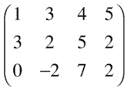

该矩阵有 3 行 4 列；这是一个 3 × 4 的矩阵。我们称它为 a，然后我们可以通过行号和列号来识别特定的矩阵元素。例如，A(3，2)=–2。

就像数组一样，当您必须处理一组相似的量，并且必须对它们执行相同的操作时，矩阵非常有用。它们提供了一种执行计算的简洁方法；例如，当你必须做旋转和其他变换时。但是正如数学向量不仅仅是一个数组，因为它有明确的向量代数规则(如向量加法或乘法)，矩阵也是如此。我们来看看矩阵代数的规则。

##### 矩阵代数

可以通过加减相应的元素来加减矩阵。这意味着您只能添加或减去相同大小的矩阵，例如 2 × 2 矩阵:

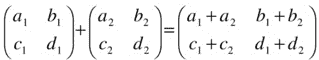

矩阵加法可用于表示平移或位移，其中物体的位置在空间中移动；例如，下面的代码分别沿 x 和 y 方向将一个点的位置移动 dx 和 dy。这可以用 2 × 1 矩阵表示，如下所示:

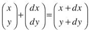

矩阵乘法有点复杂。当你把两个矩阵 A 和 B 相乘时，你把 A 的每一行乘以 B 的每一列，一个元素接一个元素，然后把结果相加。下面是一个 2 × 2 矩阵的例子:

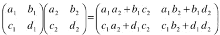

这意味着，如果矩阵 A 的列数与 B 的行数相同，则只能将矩阵 A 乘以矩阵 B。换句话说，一个 M × N 矩阵只能乘以一个 N × P 矩阵。

注意，将第 m 行乘以第 n 列得到乘积中的(m，n)矩阵元素。同样，M × N 矩阵乘以 N × P 矩阵的结果是 M × P 矩阵。

矩阵乘法可以以各种方式变换对象，这取决于我们要乘的矩阵的形式。我们对旋转矩阵特别感兴趣。

##### 2D 的旋转矩阵

矩阵在做旋转时特别有用。为了看到这一点，假设你有一个物体，你想围绕一个垂直于 xy 平面的轴旋转一个角度θ(见图 [15-1](#Fig1) )。让我们使用数学坐标系，这样 y 轴指向上，角度以逆时针方向测量。

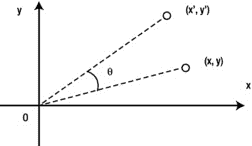

图 15-1。

Rotating an object in 2D

使用三角学，您可以显示坐标为(x，y)的对象上的每个点将被移动到坐标为(x '，y ')的新位置，由以下等式给出:

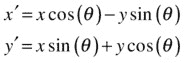

顺便说一下，这是我们在[第 13 章](13.html)中介绍的`Vector2D`对象的`rotate()`方法背后的数学。您可以用一个矩阵方程来表示新旧坐标之间的关系:

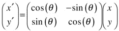

我们在这里所做的是将点(x，y)和(x’，y’)的每个位置向量 r 和 r’表示为一个具有单列的矩阵(称为列矩阵或列向量)。如果您将右侧的矩阵相乘，并使所得列向量的元素与等式左侧的元素相等，您将恢复前两个等式。

我们可以用方便的简写形式写出这个矩阵方程如下:

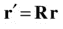

矩阵 R 被称为旋转矩阵，由下式给出:

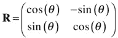

除了旋转对象，您还可以旋转坐标系(轴):

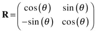

这里的情况是，将坐标轴旋转θ角，与将物体旋转-θ角是一样的。因此，如果将原始矩阵中的θ替换为–θ，并利用 sin(–θ)=–sin(θ)，cos(–θ)= cos(θ这一事实，就可以得到第二个矩阵。因此，在物体和坐标系旋转之间交换的规则是“反转正弦的符号”

#### 三维旋转矩阵

在 3D 中，情况很复杂，因为您有三个组件和三个独立的旋转方向。旋转矩阵是一个 3 × 3 矩阵，对于绕 z 轴的旋转，它由下式给出:

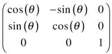

绕 x 轴的旋转矩阵由下式给出:

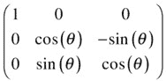

绕 y 轴的旋转由以下矩阵给出:

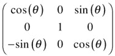

与 2D 的情况一样，如果坐标轴旋转，正弦的符号就会颠倒。

旋转矩阵可以通过相乘来组合。因此，矩阵 R 1 的旋转后跟矩阵 R 2 的旋转等价于矩阵 R 2 R 1 的旋转。请注意，旋转的顺序在 3D 中很重要。例如，将长方体绕 x 轴顺时针旋转 90 度，然后绕 z 轴顺时针旋转 90 度，将使长方体以不同的方向结束，而不是先绕 z 轴旋转，然后再绕 x 轴旋转。用书试试吧！数学上，这对应于矩阵乘法不可交换的事实。换句话说:

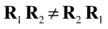

另一方面，非常小的增量(无穷小)旋转是可交换的，所以关于不同轴的无穷小旋转以什么顺序进行并不重要。这对于我们如何在 3D 中表示角度方向和角速度有着重要的意义。绕 x 轴、y 轴和 z 轴旋转的不可交换性意味着，作为一个具有三个分量的矢量，角度方向没有明确的意义。所以你不能从 3D 的角度旋转θ形成一个真正的矢量。然而，对于小的角度增量δθ，可以形成一个矢量，因此角速度ω = d θ/dt。

如前面的讨论所示，旋转矩阵是非常有用的数学对象，可以用代码实现，以允许对象在 3D 中旋转。然而，在实践中，从计算的角度来看，处理矩阵运算通常不是很有效。不赘述，只说一个 3 × 3 的矩阵有 9 个分量就够了，乘法等矩阵运算涉及大量计算，有些是冗余的。幸运的是，有一种更有效的方法来执行 3D 旋转——使用更奇特的数学对象，称为四元数。

### 四元数

处理 3D 旋转最方便的方法是使用四元数，它属于一个抽象的数字系统。这些相当神秘的数学实体并不经常出现在学院或大学的数学课程中——所以你可能以前没有遇到过它们。因此，让我们花一点时间非正式地介绍一下四元数。

#### 四元数简介

四元数是由一位名叫威廉·哈密顿的爱尔兰数学家在十九世纪发明的，是所谓复数(或虚数)的延伸。正如你可能想象的那样，这使得它们成为相当抽象的构造。就我们的目的而言，将四元数想象成一个标量和一个矢量的组合会更有用(关于标量和矢量的复习见第 3 章)。我们可以把四元数象征性地写成

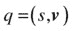

其中 s 是标量部分，v 是矢量部分。我们也可以显式地写出矢量分量，就像这样:

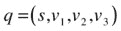

还有其他的符号，但这可能是最简单的。在这种符号中，很容易把四元数想象成一个有四个分量的向量。对于许多目的来说，这是很有帮助的，只要你记住操作和组合四元数(即四元数代数)的规则与向量的规则有些不同。现在我们来看看四元数代数。

##### 四元数代数

处理 3D 旋转需要知道的操作是两个四元数的加法，一个四元数乘以一个标量，以及两个四元数的乘法。此外，您还需要了解四元数的大小、四元数的共轭和逆以及恒等四元数。

要添加或减去两个四元数，只需添加或减去它们各自的分量:

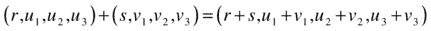

要将四元数乘以或除以标量，可以将四元数的每个分量乘以或除以标量:

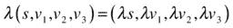

前面的规则类似于组合向量的规则。将一个四元数乘以另一个四元数要复杂得多，可以结合使用点积和叉积来完成。用下面的符号来写最方便:

请注意，四元数乘法是不可交换的，乘法的顺序很重要。

恒等四元数是一种特殊的四元数，标量部分等于 1，矢量部分等于 0:1 =(1，0，0，0)。之所以这么叫，是因为任何一个四元数乘以恒等四元数都保持不变(我们把证明留给练习！).

四元数 q = (s，v 1 ，v 2 ，v 3 )的大小或范数的定义方式与向量类似:

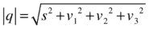

将一个四元数除以其大小，得到一个单位大小的四元数，也称为单位四元数。这个过程称为规范化。

对于任意四元数 q = (s，v 1 ，v 2 ，v 3 )存在一个由 q* = (s，–v1，–v2，–v3定义的共轭四元数。很容易证明，四元数和它的共轭的乘积给出了一个四元数，其矢量部分为零，标量部分等于四元数的范数平方(同样，我们把这作为练习):

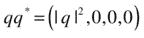

四元数 q 的逆 q–1等于其共轭除以其范数的平方:

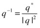

四元数与其倒数相乘得到单位四元数:

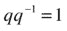

##### 四元数和旋转

像矩阵一样，四元数可以用于旋转矢量。在上一节中，我们看到旋转矩阵 R 根据公式 r' = R r 将向量 R 转换为向量 R '，也就是说，我们只需将向量与旋转矩阵相乘，就可以得到旋转后的向量。用四元数 q 旋转向量 r 的等价公式稍微复杂一些:

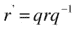

这里 r 是一个四元数，标量部分为零，矢量部分等于 r: r = (0，r)。

如果 q 是单位四元数，那么它与下面的等式相同:

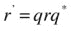

在这种情况下，旋转四元数总是可以写成以下形式，以表示围绕由单位向量 u 表示的轴转过角度θ的旋转:

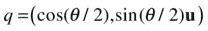

像旋转矩阵一样，两个旋转四元数 q 1 和 q 2 可以通过将它们相乘(或合成)来组合，以给出表示组合旋转的四元数 q ’:

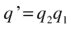

这表示由 q 1 表示的旋转，随后是由 q 2 表示的旋转。回想一下，四元数乘法是不可交换的，所以乘积的阶数会给出 3D 空间中不同的旋转。

### 三维旋转动力学

你需要的最后一个背景理论是关于如何在 3D 中实现刚体动力学。要做到这一点，我们首先需要确定一些关键概念，如角度方向、角速度、扭矩等如何推广到 3D。

#### 3D 方向

在 2D 中，物体的方向可以用 x-y 平面上的角度直接描述，这可以解释为绕垂直于该平面的虚拟 z 轴的旋转。通过将方向指定为绕 x、y 和 z 轴旋转的组合，很容易将这种方法推广到 3D。这些角度被称为欧拉角。不幸的是，这种方法存在严重的问题。首先，正如在“3D 中的旋转矩阵”一节中所讨论的，以这种方式定义的对象的方向将取决于围绕三个轴旋转的顺序。这很难令人满意。第二，某些配置可能导致可怕的“万向节锁”问题，从而不可能围绕其中一个轴旋转(在网上搜索“万向节锁”以了解更多详细信息)；这被证明是阿波罗 11 号任务中的一个问题。

更好的解决方案是使用旋转矩阵来表征方向——因为旋转矩阵告诉我们如何相对于一组固定的轴旋转对象，所以也可以认为它保存了旋转对象的方向信息。然后，问题变成计算旋转矩阵随时间的演变。这当然是可行的，也是制作旋转动画的常用方法。但是它有一个小小的缺点，那就是必须处理矩阵代数，这通常在计算上效率不高。

我们的首选方法是使用单位四元数来表示方向。这是可能的，原因与旋转矩阵可以用来表示方向相同。为了说明这是如何工作的，假设刚体的初始方向由单位四元数 q 描述。然后，我们使刚体进行由单位四元数 p 描述的旋转。然后，刚体的新方向 q '可通过简单地将 q 乘以 p 获得:

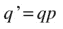

我们在一个物理动画中面临的问题是:我们如何在每个时间步找到需要乘以 q 的四元数 p？在离散形式中，我们寻找 p 使得:

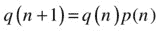

是时候回到角速度了。

#### 角速度和方向

在“3D 中的旋转矩阵”一节中，我们指出一个无穷小的角位移是一个矢量，因此角速度ω = d θ/dt 也是一个矢量。事实证明，有一个特别简单的演化方程，将方向四元数与角速度联系起来。在附着于旋转物体的坐标框架(所谓的体框架)中，可以写成:

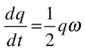

这里ω是角速度四元数，通过设置四元数的矢量部分等于角速度矢量，标量部分为零来构造。这个方程告诉我们一个物体的方位四元数 q 是如何随时间变化的:它的变化率等于 q 和角速度ω乘积的一半。

要在代码中应用这个等式，我们首先必须将其离散化。使用欧拉方法，我们可以写出:

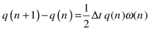

重新排列，我们可以把这个等式写成:

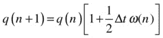

该等式将新时间步长 q(n+1)处的方向四元数与旧时间步长 q(n)处的方向四元数相关联。方括号中的量就是我们要找的 p(n)的表达式。这是旋转四元数，我们需要在每个时间步长乘以 q 来更新方向。注意，方括号中的第一个 1 表示单位四元数。

一个关键要求是 q 必须始终是单位四元数；否则，随着动画的进行，对象将被缩放或扭曲。因为不可避免地会有数值误差，这些误差会随着时间的推移而累积，并导致 q 的范数偏离 1，所以明智的做法是频繁地归一化 q，可能在每个时间步长进行归一化。

#### 扭矩、角加速度和惯性矩矩阵

就像角速度一样，角加速度，α = d ω/dt，在 3D 中也是矢量。如果有合成力矩 T 作用在一个刚体上，它将受到角加速度。在 3D 中，运动的角度方程可以在主体框架中写成以下矩阵方程:

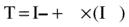

回想一下，扭矩是由旋转中心的力作用点的位置矢量与力矢量的叉积给出的:T = r × F，可以用数值方法求解该方程，得到每个时间步长的角速度。额外的复杂性在于，在 3D 中，转动惯量 I 是一个 3 × 3 的矩阵。在 I 是对角线且对角线元素都相等的特殊情况下，Ixx= IYY= IZZ= I，前面的等式简化为 T = I α，类似于[第十三章](13.html)中的 2D 情况。

## 3D 渲染:介绍 WebGL 和 three.js

在这篇相当冗长的 3D 数学和物理介绍之后，你无疑已经迫不及待地想看到它全部投入使用了。但是如何在浏览器中制作 3D 图形和动画呢？是时候介绍一下 WebGL 和`three.js`了。

### Canvas、WebGL 和 WebGL 框架

HTML5 canvas 元素是一个固有的 2D 环境。那么我们如何扩展它的 3D 渲染能力呢？可以通过应用透视变形在 2D 画布上模拟 3D，这有时被称为 2.5D。这是 Billy Lamberta 和 Keith Peters 在 book Foundation HTML5 动画和 JavaScript 中采用的方法。然而，这是一个相当费力的过程，并且存在性能问题。幸运的是，现在有了一个更简单、更强大的替代方案——web GL。

#### WebGL:将画布扩展到 3D

WebGL 起源于 Mozilla 为 canvas 元素添加 3D 功能的尝试。它本质上是一个 JavaScript API，用于在 web 浏览器中渲染 2D 和 3D 图形。WebGL 基于 OpenGL ES 2.0，并允许在兼容的浏览器中进行 GPU(图形处理单元)加速。在撰写本文时，大多数主流 web 浏览器都支持 WebGL。要检查您的浏览器或设备是否支持 WebGL，您可以访问以下网站之一:

[T2`http://webglreport.com/`](http://webglreport.com/)

[T2`http://get.webgl.org/`](http://get.webgl.org/)

WebGL 程序由 JavaScript 控制代码和在计算机的 GPU 上执行的着色器代码组成(着色器是一种为深度感知和视觉效果执行 3D 模型着色的程序)。用纯 WebGL 编码可能是一个相当费力的过程，超出了本书的范围。相反，我们将利用一个框架来避免编写原始着色器代码的需要。

#### WebGL 框架

到目前为止，我们在不需要使用外部库或框架的情况下做得非常好。但是我们将为 3D 破例，因为我们并不特别热衷于花时间使用低级 WebGL 命令！有许多基于 WebGL 构建的 JavaScript 框架和库可以简化 3D 编码过程。`Three.js`和`babylon.js`只是其中比较受欢迎的两个。在本书中，我们将使用`three.js`库。

### 快速三. js 入门

本节的目的是介绍使用`three.js`开始运行时您需要了解的最基本知识。如果您想获得更深入的知识，我们鼓励您查阅`three.js`上的许多书籍和在线资源。当然，首先要去的地方是位于 [`http://three.org`](http://three.org/) 的官方项目网页，在那里你可以找到文档和例子，并且可以下载最新版本的库。为了方便起见，我们在本章的可下载源代码中包含了一个包含完整库的`three.min.js`文件的副本。不用说，在本章的所有例子中，你必须将这个文件包含在你的 HTML 文件的一个`<script>`标签中。

#### 渲染器

首先你需要选择一个渲染器。您可以选择渲染器，包括使用 GPU 的`CanvasRenderer`和性能更好的`WebGLRenderer`。您可以用下面几行代码创建一个`WebGLRenderer`并将其添加到 DOM 中:

`var renderer = new THREE.WebGLRenderer();`

`renderer.setSize(window.innerWidth, window.innerHeight);`

`document.body.appendChild(renderer.domElement);`

最后一行创建了一个显示场景的 canvas 元素。

#### 现场

场景设置了一个可以放置视觉元素、摄像机、灯光等的区域。创造一个场景再简单不过了:

`var scene = new THREE.Scene();`

#### 照相机

接下来你需要一台相机。有多种不同的摄像机可供选择，我们建议您参考文档以了解详细信息。这里我们只需选择一个`PerspectiveCamera`，设置它的位置，并将其添加到场景中，如下所示:

`var camera = new THREE.PerspectiveCamera(45, window.innerWidth/window.innerHeight, 0.1, 10000);`

`camera.position.set(100,0,400);`

`scene.add(camera);`

您需要在`PerspectiveCamera` : `fov`(视野)、`aspect`、`near`和`far`中指定四个参数。这里的视野设置为 45 度，长宽比是浏览器窗口的宽度和高度之比。`near`和`far`参数分别是摄像机渲染对象的最近距离和最远距离(这里设置为 0.1 和 10000)。

前面清单中的第二行代码使用(x，y，z)坐标设置摄像机的位置。最后一行将摄像机添加到场景中。

#### 照明设备

你需要一盏灯来看场景中的物体。有几种不同的选择(参见文档)，并且可以使用多种灯光。让我们挑一个`DirectionalLight`:

`var light = new THREE.DirectionalLight();`

`light.position.set(-10,0,20);`

`scene.add(light);`

#### 对象:网格、几何体和材质

接下来，您需要用一个或多个对象填充场景。在`three.js`中，创建一个带有`Mesh`的对象，它带有两个参数`Geometry`和`Material`。同样，根据你想要创建的物体的形状和外观，有许多`Geometry`和`Material`的选择。让我们创建一个球体，给它一个红色的`MeshLambertMaterial`:

`var sphereGeometry = new THREE.SphereGeometry(50,20,20);`

`var sphereMaterial = new THREE.MeshLambertMaterial({color: 0xff0000});`

`var ball = new THREE.Mesh(sphereGeometry,sphereMaterial);`

`ball.position.set(100,0,0);`

`scene.add(ball);`

`SphereGeometry`有三个参数:半径、水平线段数(类似于纬度线)和垂直线段数(类似于经度线)。

#### 3D 坐标系统

在 WebGL 和`three.js`中，坐标系如图 [15-2](#Fig2) 所示。x 轴从左向右，y 轴从下向上，z 轴指向屏幕外。原点位于显示区域的中心。原点的位置和 y 轴的方向不同于 2D 画布坐标系。在您的代码中必须考虑到这些差异。

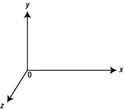

图 15-2。

The 3D coordinate system

#### three.js 动画

使用`three.js`制作 3D 动画和在 2D 制作基本相同。你首先使用第二章中描述的任何一种方法创建一个动画循环。在动画循环中，您可以在每个时间步长更新对象的位置和/或方向。

你已经看到了如何使用`obj.position.set()`方法设置一个对象的位置。您也可以单独设置或更新单个坐标，如下例所示:

`obj.position.x = 100;`

在`three.js`中，对象的方向可以由 r `otation`属性指定，r`otation`属性是具有三个分量 x、y 和 z 的欧拉角表示。例如:

`obj.rotation.y = Math.PI/2;`

也可以使用对象的四元数属性来指定对象的方向。您将在“模拟 3D 刚体运动”一节中看到一个示例

## 模拟三维粒子运动

好了，在所有这些背景材料之后，终于到了一些代码示例的时候了。让我们从我们的“hello world”物理模拟开始——一个弹跳球！

### 三维弹跳球模拟

因为这是我们的第一个 3D 示例，所以查看完整的代码是很有用的。代码在`bouncing-ball.js`中，在此列出:

`var width = window.innerWidth, height = window.innerHeight;`

`var scene, camera, renderer;`

`var ball;`

`var t0, dt;`

`var g = -20;`

`var fac = 0.9;`

`var radius = 20;`

`var x0 = -100, y0 = -100, z0 = -100;`

`window.onload = init;`

`function init() {`

`renderer = new THREE.WebGLRenderer();`

`renderer.setSize(width, height);`

`document.body.appendChild(renderer.domElement);`

`scene = new THREE.Scene();`

`var angle = 45, aspect = width/height, near = 0.1, far = 10000;`

`camera = new THREE.PerspectiveCamera(angle, aspect, near, far);`

`camera.position.set(100,0,400);`

`scene.add(camera);`

`var light = new THREE.DirectionalLight();`

`light.position.set(-10,0,20);`

`scene.add(light);`

`var sphereGeometry = new THREE.SphereGeometry(radius,20,20);`

`var sphereMaterial = new THREE.MeshLambertMaterial({color: 0x006666});`

`ball = new THREE.Mesh(sphereGeometry,sphereMaterial);`

`scene.add(ball);`

`ball.pos = new Vector3D(100,0,0);`

`ball.velo = new Vector3D(-20,0,-20);`

`positionObject(ball);`

`var plane1 = new THREE.Mesh(new THREE.PlaneGeometry(400, 400), new THREE.MeshNormalMaterial());`

`plane1.rotation.x = -Math.PI/2;`

`plane1.position.set(0,y0,0);`

`scene.add(plane1);`

`var plane2 = new THREE.Mesh(new THREE.PlaneGeometry(400, 400), new THREE.MeshNormalMaterial());`

`plane2.position.set(0,0,z0);`

`scene.add(plane2);`

`var plane3 = new THREE.Mesh(new THREE.PlaneGeometry(400, 400), new THREE.MeshNormalMaterial());`

`plane3.rotation.y = Math.PI/2;`

`plane3.position.set(x0,0,0);`

`scene.add(plane3);`

`t0 = new Date().getTime();`

`animFrame();`

`}`

`function animFrame(){`

`requestAnimationFrame(animFrame);`

`onTimer();`

`}`

`function onTimer(){`

`var t1 = new Date().getTime();`

`dt = 0.001*(t1-t0);`

`t0 = t1;`

`if (dt>0.2) {dt=0;};`

`move();`

`}`

`function move(){`

`moveObject(ball);`

`}`

`function positionObject(obj){`

`obj.position.set(obj.pos.x,obj.pos.y,obj.pos.z);`

`}`

`function moveObject(obj){`

`obj.velo.y += g*dt;`

`obj.pos = obj.pos.addScaled(obj.velo,dt);`

`if (obj.pos.x < x0 + radius){`

`obj.pos.x = x0 + radius;`

`obj.velo.x *= -fac;`

`}`

`if (obj.pos.y < y0 + radius){`

`obj.pos.y = y0 + radius;`

`obj.velo.y *= -fac;`

`}`

`if (obj.pos.z < z0 + radius){`

`obj.pos.z = z0 + radius;`

`obj.velo.z *= -fac;`

`}`

`positionObject(obj);`

`renderer.render(scene, camera);`

`}`

我们首先将浏览器窗口的宽度和高度存储在变量`width`和`height`中，我们将在几个地方使用它们。然后我们为`scene`、`camera`和`renderer`以及一个`ball`对象创建变量。球的半径存储在变量`radius`中，我们会在很多地方用到它。请注意，代表重力加速度的变量`g`被赋予了负值。原因是 WebGL 的垂直(y)轴指向上方而不是下方。

在`init()`方法中，我们设置了渲染器、场景、摄像机和灯光，如前一节所述。然后我们使用`SphereGeometry`创建一个球。接下来，我们为球对象创建新的属性`pos`和`velo`，并赋予它们`Vector3D`值以保持其初始位置和速度。注意，您必须在 HTML 文件中包含`vector3D.js`文件。`ball.pos`和`ball.velo`变量将用于执行物理计算。但是我们还需要告诉 WebGL 在每次更新这些变量时设置球在画布上的位置。这是通过调用`positionObject()`方法完成的，该方法使用`pos`值更新球的位置属性:

`function positionObject(obj){`

`obj.position.set(obj.pos.x,obj.pos.y,obj.pos.z);`

`}`

接下来在`init()`中，我们使用`PlaneGeometry`对象创建三面墙，并使用实例的`rotation`和`position`属性适当地定向和定位它们。

动画代码看起来非常类似于你已经用来创建 2D 画布模拟。新的代码片段在`moveObject()`方法中。在前两行中，我们更新了球的垂直速度和位置向量。然后我们用和第一章的第一个例子相似的方法检查与三面墙的碰撞。然后我们调用`positionObject()`在渲染场景之前更新球的`position`属性。

运行代码，您应该会看到类似于图 [15-3](#Fig3) 中的截图。和以往一样，您可以通过更改参数和视觉元素来随意进行实验。

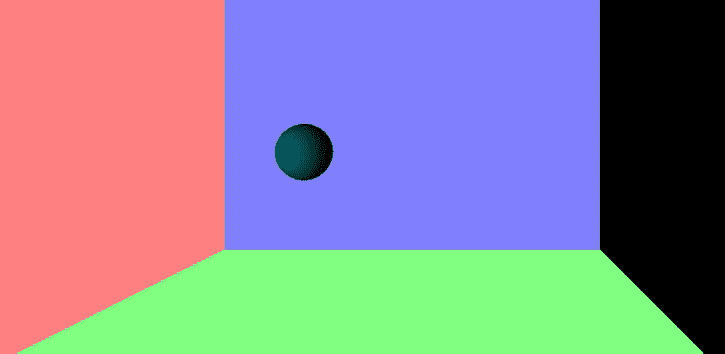

图 15-3。

Bouncing ball in 3D

### 旋转地球动画

使用`three.js`可以轻松创建旋转动画。为了说明如何做到这一点，让我们制作一个旋转的地球动画。这个例子的代码实际上比前一个例子简单，您可以在文件`earth.js`中找到它。以下是完整列表:

`var width = window.innerWidth, height = window.innerHeight;`

`var renderer = new THREE.WebGLRenderer();`

`renderer.setSize(width, height);`

`document.body.appendChild(renderer.domElement);`

`var scene = new THREE.Scene();`

`var angle = 45, aspect = width/height, near = 0.1, far = 10000;`

`var camera = new THREE.PerspectiveCamera(angle, aspect, near, far);`

`camera.position.set(100,0,500);`

`scene.add(camera);`

`var light = new THREE.DirectionalLight();`

`light.position.set(-10,0,20);`

`scene.add(light);`

`var radius = 100, segments = 20, rings = 20;`

`var sphereGeometry = new THREE.SphereGeometry(radius,segments,rings);`

`var sphereMaterial = new THREE.MeshLambertMaterial();`

`sphereMaterial.map = THREE.ImageUtils.loadTexture('img/earth.jpg');`

`var sphere = new THREE.Mesh(sphereGeometry,sphereMaterial);`

`scene.add(sphere);`

`function animFrame(){`

`requestAnimationFrame(animFrame);`

`onEachStep();`

`}`

`function onEachStep() {`

`sphere.rotation.y += 0.01;`

`camera.position.z -= 0.1;`

`renderer.render(scene, camera);`

`}`

`animFrame();`

正如你所看到的，我们已经大大简化了动画代码。除此之外，新颖之处仅在于三行代码，以粗体显示。第一行加载了一个图像，它用作创建的`SphereGeometry`对象的纹理贴图，给出了一个 3D 地球的外观，如图 [15-4](#Fig4) 所示。请注意，如果您只是在 web 浏览器中打开 HTML 文件，您的代码可能无法正常工作，因为 JavaScript 中的安全特性会阻止外部托管的文件加载。如果发生这种情况，在 [`https://github.com/mrdoob/three.js/wiki/How-to-run-things-locally`](https://github.com/mrdoob/three.js/wiki/How-to-run-things-locally) 的一个有用的`three.js`页面会解释如何规避这个问题。

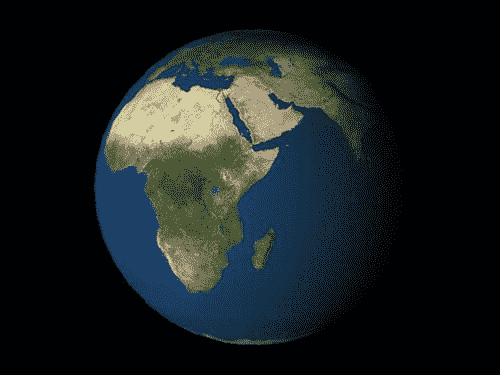

图 15-4。

Rotating Earth in 3D

在函数`onEachStep()`中，前两行增加地球自转属性的 y 分量，减少相机位置的 z 分量。运行代码以查看结果。

### 力:重力和 3D 中的轨道

接下来，我们将添加一个月球和一些重力物理，使其绕地球运行！我们将需要精确的计时，所以将恢复我们在书中大多数例子中使用的完整动画循环。您还需要在 HTML 文件中添加`forces3D.js`文件。

结果代码在`earth-moon.js`中，在此复制:

`var width = window.innerWidth, height = window.innerHeight;`

`var acc, force;`

`var t0, dt;`

`var animId;`

`var G = 1;`

`var M = 50000;`

`var m = 1;`

`var scene, camera, renderer;`

`var earth, moon;`

`window.onload = init;`

`function init() {`

`renderer = new THREE.WebGLRenderer();`

`renderer.setSize(width, height);`

`document.body.appendChild(renderer.domElement);`

`scene = new THREE.Scene();`

`var angle = 45, aspect = width/height, near = 0.1, far = 10000;`

`camera = new THREE.PerspectiveCamera(angle, aspect, near, far);`

`camera.position.set(0,100,1000);`

`scene.add(camera);`

`var light = new THREE.DirectionalLight();`

`light.position.set(-10,0,20);`

`scene.add(light);`

`var radius = 100, segments = 20, rings = 20;`

`var sphereGeometry = new THREE.SphereGeometry(radius,segments,rings);`

`var sphereMaterial = new THREE.MeshLambertMaterial({color: 0x0099ff});`

`sphereMaterial.map = THREE.ImageUtils.loadTexture('img/Earth.jpg');`

`earth = new THREE.Mesh(sphereGeometry,sphereMaterial);`

`scene.add(earth);`

`earth.mass = M;`

`earth.pos = new Vector3D(0,0,0);`

`earth.velo = new Vector3D(0,0,0);`

`positionObject(earth);`

`moon = new THREE.Mesh(new THREE.SphereGeometry(radius/4,segments,rings),new THREE.MeshLambertMaterial());`

`scene.add(moon);`

`moon.mass = m;`

`moon.pos = new Vector3D(300,0,0);`

`moon.velo = new Vector3D(0,0,-12);`

`positionObject(moon);`

`t0 = new Date().getTime();`

`animFrame();`

`}`

`function animFrame(){`

`requestAnimationFrame(animFrame);`

`onTimer();`

`}`

`function onTimer(){`

`var t1 = new Date().getTime();`

`dt = 0.001*(t1-t0);`

`t0 = t1;`

`if (dt>0.2) {dt=0;};`

`move();`

`}`

`function move(){`

`positionObject(moon);`

`moveObject(moon);`

`calcForce(moon);`

`updateAccel(moon);`

`updateVelo(moon);`

`}`

`function positionObject(obj){`

`obj.position.set(obj.pos.x,obj.pos.y,obj.pos.z);`

`}`

`function moveObject(obj){`

`obj.pos = obj.pos.addScaled(obj.velo,dt);`

`positionObject(obj);`

`earth.rotation.y += 0.001;`

`renderer.render(scene, camera);`

`}`

`function calcForce(obj){`

`var r = obj.pos.subtract(earth.pos);`

`force = Forces3D.gravity(G,M,m,r);`

`}`

`function updateAccel(obj){`

`acc = force.multiply(1/obj.mass);`

`}`

`function updateVelo(obj){`

`obj.velo = obj.velo.addScaled(acc,dt);`

`}`

你应该可以毫无困难地理解这些代码。`init()`方法设置场景和 3D 对象，动画代码像 2D 的例子一样工作，根据需要用`Vector3D`变量替换`Vector2D`变量。

运行代码，你将看到一个视觉上吸引人的月球绕地球运行的 3D 模拟，如图 [15-5](#Fig5) 所示。您可以改变摄像机的位置，从不同的角度观察系统。例如，在`init()`中添加下面一行，从地球的位置观看月球:

`camera.position = earth.position;`

图 15-5。

Earth-Moon simulation

或者在`moveObject()`里加上下面一行，从月球上看地球:

`camera.position = moon.position;`

我们让您进一步开发代码并添加交互性，例如更改摄像机位置或添加缩放效果等等。

不用说，模拟不是按比例的，但它确实包含了基本的物理学。在第 16 章中，你将建立一个精确且更加真实的太阳系模拟。

## 模拟三维刚体运动

我们现在准备模拟三维刚体运动。让我们选择一个简单的物体——一个旋转的立方体——它的惯性矩矩阵的对角线元素相等，非对角线元素为零。正如我们在“3D 旋转动力学”一节中看到的，扭矩和角加速度之间的关系简化为 T = I α，其中 I 是惯性矩矩阵的每个对角元素的值。

### 旋转立方体动画

作为起点，让我们回到[第 13 章](13.html)的`rigid-body-dynamics.js`模拟，并做一些修改，用旋转立方体替换旋转正方形。修改后的代码在`cube-rotation.js`中，在此全文转载:

`var width = window.innerWidth, height = window.innerHeight;`

`var t0, dt;`

`var cube;`

`var scene, camera, renderer;`

`var alp, torque;`

`var t0, dt;`

`var animId;`

`var k = 0.5; // angular damping factor`

`var tqMax = 2;`

`var tq = 0;`

`window.onload = init;`

`function init() {`

`renderer = new THREE.WebGLRenderer();`

`renderer.setSize(width, height);`

`document.body.appendChild(renderer.domElement);`

`scene = new THREE.Scene();`

`var angle = 45, aspect = width/height, near = 0.1, far = 10000;`

`camera = new THREE.PerspectiveCamera(angle, aspect, near, far);`

`camera.position.set(100,0,500);`

`scene.add(camera);`

`var light = new THREE.DirectionalLight();`

`light.position.set(30,0,30);`

`scene.add(light);`

`cube = new THREE.Mesh(new THREE.CubeGeometry(100, 100, 100), new THREE.MeshNormalMaterial());`

`cube.overdraw = true;`

`scene.add(cube);`

`cube.im = 1;`

`cube.angVelo = 0;`

`addEventListener('mousedown',onDown,false);`

`t0 = new Date().getTime();`

`animFrame();`

`}`

`function onDown(evt){`

`tq = tqMax;`

`addEventListener('mouseup',onUp,false);`

`}`

`function onUp(evt){`

`tq = 0;`

`removeEventListener('mouseup',onUp,false);`

`}`

`function animFrame(){`

`animId = requestAnimationFrame(animFrame);`

`onTimer();`

`}`

`function onTimer(){`

`var t1 = new Date().getTime();`

`dt = 0.001*(t1-t0);`

`t0 = t1;`

`if (dt>0.2) {dt=0;};`

`move();`

`}`

`function move(){`

`moveObject(cube);`

`calcForce(cube);`

`updateAccel(cube);`

`updateVelo(cube);`

`}`

`function moveObject(obj){`

`obj.rotation.x += obj.angVelo*dt;`

`renderer.render(scene, camera);`

`}`

`function calcForce(obj){`

`torque = tq;`

`torque += -k*obj.angVelo; // angular damping`

`}`

`function updateAccel(obj){`

`alp = torque/obj.im;`

`}`

`function updateVelo(obj){`

`obj.angVelo += alp*dt;`

`}`

在`init()`方法中，我们添加了新的代码，在`three.js`命令的帮助下设置场景和相关对象。然后我们用`CubeGeometry`创建一个立方体，并赋予它新的属性`im`(惯性矩)和`angVelo`(角速度)，值分别设置为 1 和 0。代码的动画部分紧跟第 13 章的[代码中的动画部分。这里我们已经删除了一些与力相关的代码，因为我们只施加了一个扭矩而没有施加力。为了简单起见，转矩和角加速度都被视为标量，就像 2D 的情况一样。现在这很好，因为我们将围绕 x、y 或 z 轴旋转立方体。在代码清单中，我们有以下代码行，它使立方体围绕 x 轴旋转:](13.html)

`obj.rotation.x += obj.angVelo*dt;`

您可以将这条线改为绕其他两个轴之一旋转。有一些事件侦听器和处理程序，当您单击鼠标时，它们会应用一个恒定的扭矩使立方体旋转，否则将扭矩设置为零。在 2D 的例子中，已经包括了一个角阻尼项。运行代码并单击鼠标进行模拟实验。截图如图 [15-6](#Fig6) 所示。

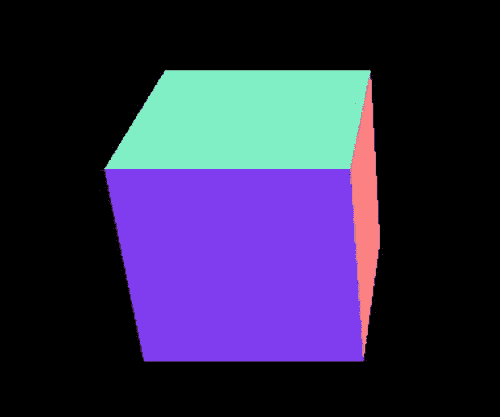

图 15-6。

A rotating cube in 3D

### 向旋转的立方体施加力

现在，让我们通过将扭矩和角加速度视为矢量而不是标量来进一步开发旋转立方体模拟。在这个例子中，我们将使用欧拉角来处理旋转。我们还将包含处理力的代码。为了补偿增加的代码长度，我们删除了事件处理程序和侦听器，从而失去了交互性。新代码(`cube-euler-angles.js`)现在看起来像这样:

`var width = window.innerWidth, height = window.innerHeight;`

`var t0, dt;`

`var cube;`

`var scene, camera, renderer;`

`var acc, force;`

`var alp, torque;`

`var t0, dt;`

`var animId;`

`var k = 0.5;`

`var kSpring = 0.2;`

`var tq = new Vector3D(1,0,0);`

`var center = new Vector3D(0,0,-500);`

`window.onload = init;`

`function init() {`

`renderer = new THREE.WebGLRenderer();`

`renderer.setSize(width, height);`

`document.body.appendChild(renderer.domElement);`

`scene = new THREE.Scene();`

`var angle = 45, aspect = width/height, near = 0.1, far = 10000;`

`camera = new THREE.PerspectiveCamera(angle, aspect, near, far);`

`camera.position.set(100,0,500);`

`scene.add(camera);`

`var light = new THREE.DirectionalLight();`

`light.position.set(30,0,30);`

`scene.add(light);`

`cube = new THREE.Mesh(new THREE.CubeGeometry(100, 100, 100), new THREE.MeshNormalMaterial());`

`cube.overdraw = true;`

`scene.add(cube);`

`cube.mass = 1;`

`cube.im = new Vector3D(1,1,1);`

`cube.pos = new Vector3D(0,0,0);`

`cube.velo = new Vector3D(0,0,0);`

`cube.eulerAngles = new Vector3D(0,0,0);`

`cube.angVelo = new Vector3D(0,0,0);`

`t0 = new Date().getTime();`

`animFrame();`

`}`

`function animFrame(){`

`animId = requestAnimationFrame(animFrame);`

`onTimer();`

`}`

`function onTimer(){`

`var t1 = new Date().getTime();`

`dt = 0.001*(t1-t0);`

`t0 = t1;`

`if (dt>0.2) {dt=0;};`

`move();`

`}`

`function move(){`

`positionObject(cube);`

`moveObject(cube);`

`calcForce(cube);`

`updateAccel(cube);`

`updateVelo(cube);`

`}`

`function positionObject(obj){`

`obj.position.set(obj.pos.x,obj.pos.y,obj.pos.z);`

`obj.rotation.set(obj.eulerAngles.x,obj.eulerAngles.y,obj.eulerAngles.z);`

`}`

`function moveObject(obj){`

`obj.pos = obj.pos.addScaled(obj.velo,dt);`

`obj.eulerAngles = obj.eulerAngles.addScaled(obj.angVelo,dt);`

`positionObject(obj);`

`renderer.render(scene, camera);`

`}`

`function calcForce(obj){`

`var r = obj.pos.subtract(center);`

`force = Forces3D.spring(kSpring,r);`

`torque = tq;`

`torque = torque.addScaled(obj.angVelo,-k);`

`}`

`function updateAccel(obj){`

`acc = force.multiply(1/obj.mass);`

`alp = torque.div(obj.im);`

`}`

`function updateVelo(obj){`

`obj.velo = obj.velo.addScaled(acc,dt);`

`obj.angVelo = obj.angVelo.addScaled(alp,dt);`

`}`

该代码中有许多新功能。首先，我们使用`Forces3D.spring()`方法在`calcForce()`中包含一个弹簧力。扭矩现在是一个矢量，并在整个模拟过程中被赋予一个恒定的`Vector3D`值，该值在变量`tq`中设置。在`init()`中，我们创建并初始化立方体的各种物理属性:质量属性、惯性矩向量(而不是矩阵，假设矩阵是对角的)、位置和速度向量、角速度向量以及存储描述立方体方向的欧拉角的向量。

在`updateAccel()`中，我们通过将扭矩的每个分量除以相应的惯性矩分量来计算角加速度；这是一种数学上的简化，只有当惯性矩矩阵是对角线时才有可能，就像在这种情况下一样。我们使用新创建的`Vector3D`的`div()`方法来执行这种划分。`div()`方法允许你通过划分一个向量和另一个向量各自的分量来划分它们(不是标准的数学运算！):

`div: function(vec) {`

`return new Vector3D(this.x/vec.x,this.y/vec.y,this.z/vec.z);`

`}`

最后，我们对待`eulerAngles`变量就像对待`moveObject()`和`positionObject()`中的位置变量`pos`一样。这对于绕 x 轴、y 轴或 z 轴的旋转是没问题的，但对于你将要看到的任意斜轴就不一样了。

如果您照原样运行代码，您将看到一个立方体绕着它的 x 轴旋转，同时沿着 z 轴振荡。您可以简单地通过改变`Vector3D`变量`tq`和`center`的值来改变旋转轴和摆动中心。先将`tq`的值改为`Vector3D(0,1,0)`，再改为`Vector3D(0,0,1)`；这将分别在 y 和 z 方向施加一个扭矩，并使立方体绕各自的轴旋转。现在试着通过将`tq`的值改为`Vector3D(1,1,1)`来使立方体绕一个斜轴旋转。这沿着一条对角线轴施加了一个扭矩，从物理上来说，应该使立方体围绕该轴旋转。但是如果你运行代码，你会发现立方体的行为完全不同。我们对欧拉角的简单尝试在处理斜轴旋转时有困难。让我们看看如何用四元数来处理这个问题。

### 绕任意轴旋转立方体

我们这里的重点是如何处理绕任意轴的旋转。因此，让我们去掉之前处理力的代码，这样我们就可以专注于处理旋转的部分。此外，我们没有使用我们创建的`eulerAngles`属性，而是使用了`quaternion`属性，这是一个内置的`three.js`属性，它将对象的方向存储为一个四元数。新代码名为`cube-rotation-quaternion.js`，如下所示:

`var width = window.innerWidth, height = window.innerHeight;`

`var t0, dt;`

`var cube;`

`var scene, camera, renderer;`

`var alp, torque;`

`var t0, dt;`

`var animId;`

`var k = 0.5;`

`var tqMax = new Vector3D(1,1,1);`

`var tq = new Vector3D(0,0,0);`

`window.onload = init;`

`function init() {`

`renderer = new THREE.WebGLRenderer();`

`renderer.setSize(width, height);`

`document.body.appendChild(renderer.domElement);`

`scene = new THREE.Scene();`

`var angle = 45, aspect = width/height, near = 0.1, far = 10000;`

`camera = new THREE.PerspectiveCamera(angle, aspect, near, far);`

`camera.position.set(100,0,500);`

`scene.add(camera);`

`var light = new THREE.DirectionalLight();`

`light.position.set(30,0,30);`

`scene.add(light);`

`cube = new THREE.Mesh(new THREE.CubeGeometry(100, 100, 100), new THREE.MeshNormalMaterial());`

`cube.overdraw = true;`

`scene.add(cube);`

`cube.im = new Vector3D(1,1,1);`

`cube.angVelo = new Vector3D(0,0,0);`

`addEventListener('mousedown',onDown,false);`

`t0 = new Date().getTime();`

`animFrame();`

`}`

`function onDown(evt){`

`tq = tqMax;`

`addEventListener('mouseup',onUp,false);`

`}`

`function onUp(evt){`

`tq = new Vector3D(0,0,0);`

`removeEventListener('mouseup',onUp,false);`

`}`

`function animFrame(){`

`animId = requestAnimationFrame(animFrame);`

`onTimer();`

`}`

`function onTimer(){`

`var t1 = new Date().getTime();`

`dt = 0.001*(t1-t0);`

`t0 = t1;`

`if (dt>0.2) {dt=0;};`

`move();`

`}`

`function move(){`

`moveObject(cube);`

`calcForce(cube);`

`updateAccel(cube);`

`updateVelo(cube);`

`}`

`function moveObject(obj){`

`var p = new THREE.Quaternion;`

`p.set(obj.angVelo.x*dt/2,obj.angVelo.y*dt/2,obj.angVelo.z*dt/2,1);`

`obj.quaternion.multiply(p);`

`obj.quaternion.normalize();`

`renderer.render(scene,camera);`

`}`

`function calcForce(obj){`

`torque = tq;`

`torque = torque.addScaled(obj.angVelo,-k);`

`}`

`function updateAccel(obj){`

`alp = torque.div(obj.im);`

`}`

`function updateVelo(obj){`

`obj.angVelo = obj.angVelo.addScaled(alp,dt);`

`}`

请注意，我们重新引入了事件侦听器和处理程序，因此只有在单击鼠标时才会施加扭矩。默认情况下，施加的扭矩值为`Vector3D(1,1,1)`；所以它是沿着对角线轴应用的。关键的新代码是`moveObject()`中的前四行；这就是实现我们在“3D 中的旋转动力学”一节中讨论的四元数旋转技术所需的全部内容第一行只是通过实例化`THREE.Quaternion`对象来创建一个新的四元数 p。下一行使用`Quaternion`的`set()`方法给 p 一个值，该值等于出现在以下等式的方括号中的四元数:

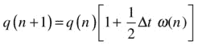

回想一下，在这个等式中，1 表示单位四元数，标量分量为 1，矢量分量为 0；同样，ω是角速度的四元数形式，标量分量等于 0，矢量分量等于角速度矢量。`moveObject()`中的第三行代码使用`Quaternion`的`multiply()`方法将对象的方向四元数(上一个等式中的`obj.quaternion`，q)乘以 p 并更新。最后一行将对象的方向四元数归一化，以避免由于数值舍入误差导致的失真。

运行代码，你会发现立方体表现完美，围绕对角线轴旋转。通过改变所施加的扭矩值`tqMax`进行试验，使其绕任意轴旋转。

## 摘要

干得好，这本书写了这么多！你现在知道如何创建 3D 物理模拟了——原则上没有什么能阻止你将书中的任何 2D 例子转换成 3D。在最后一章，你将应用你在这里学到的知识创建两个 3D 模拟——一个飞行模拟器和一个太阳系模拟。