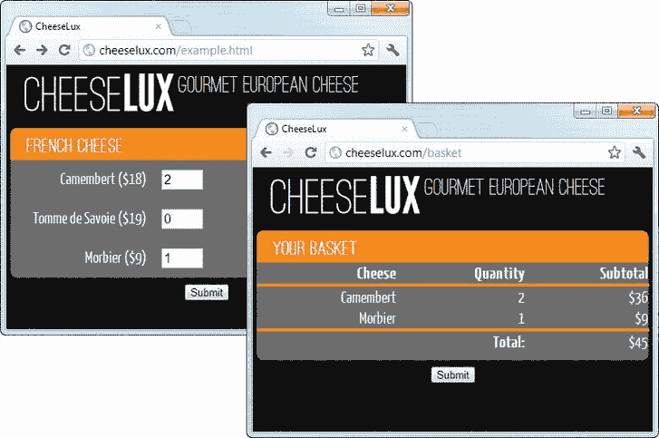

## C H A P T E R 1

## 做好准备

客户端 web 应用开发一直是服务器端编码的穷亲戚。这是因为浏览器和运行它们的设备没有企业级服务器强大。为了提供任何一种严肃的 web 应用功能，服务器必须为浏览器做所有繁重的工作，相比之下，这是相当愚蠢和简单的。

在过去的几年里，浏览器变得更加智能，功能更加强大，并且在实现 web 技术和标准方面更加一致。过去创造独特功能的斗争已经变成了创造最快和最兼容浏览器的斗争。智能手机和平板电脑的激增为高质量的 web 应用创造了一个巨大的市场，HTML5 的逐渐采用为 web 应用开发人员提供了构建丰富和流畅的客户端体验的坚实基础。

可悲的是，虽然客户端技术已经赶上了服务器端，但客户端程序员使用的技术仍然落后。客户端 web 应用的复杂性已经达到了一个临界点，规模、优雅和可维护性是必不可少的，快速解决方案的时代已经过去了。在本书中，我将公平竞争，向您展示如何加快您的客户端开发，以接受来自服务器端世界的最佳技术，并将它们与最新的 HTML5 特性相结合。

### 关于这本书

这是我关于技术的第 15 本书，为了纪念这一点，Apress 要求我做一些不同的事情:分享我用来创建复杂的客户端 web 应用的工具、技巧和技术。其结果是比我的常规工作更加个人化、非正式和不拘一格。我将向您展示如何从服务器端开发中获取工业级的开发概念，并将它们应用到浏览器中。通过使用这些技术，您可以构建更容易编写、更容易维护的 web 应用，并为您的用户提供更好、更丰富的功能。

#### 你是谁？

你是一个经验丰富的 web 开发人员，你的项目已经开始失控。JavaScript 代码中的错误越来越多，找到并修复每个错误需要更长的时间。您的目标是越来越广泛的设备，包括台式机、平板电脑和智能手机，保持所有这些设备正常工作变得越来越困难。你的工作日变长了，但是你花在新特性上的时间却变少了，因为维护你已经拥有的代码消耗了你大量的时间。

来自工作的兴奋已经消退，你已经忘记了编码的一天是什么感觉。你知道出了问题，你知道你正在失去控制，你知道你需要找到一种不同的方法。如果这听起来很熟悉，那么*你*是我的目标读者。

#### 在你阅读这本书之前，你需要知道什么？

这是一本高级的书，你需要是一个有经验的 web 程序员才能理解内容。您需要 HTML 的工作知识，您需要知道如何编写 JavaScript，并且您已经使用这两者创建了客户端 web 应用。您需要理解浏览器是如何工作的，HTTP 是如何适应这种情况的，什么是 Ajax 请求，以及为什么您应该关心它们。

#### 如果你没有这样的经历呢？

你可能仍然会从这本书里得到一些好处，但是你必须自己弄清楚一些基本的东西。我已经写了几本其他的书，作为这本书的入门，你可能会觉得有用。如果你是 HTML 新手，那么请阅读 HTML5 的权威指南。这解释了创建常规 web 内容和基本 web 应用所需的一切。我解释了如何使用 HTML 标记和 CSS3(包括新的 HTML5 元素)，以及如何使用 DOM API 和 HTML5 APIs(如果您不熟悉这门语言，还包括一个 JavaScript 初级读本)。我在本书中大量使用了 jQuery。我提供了每个主题所需的所有信息，但是如果你想更好地了解 jQuery 如何工作以及它与 DOM API 的关系，那么请阅读 *Pro jQuery* 。这两本书都是出版社出版的。

除了书籍，通过阅读 W3C 在`[www.w3.org](http://www.w3.org)`发布的规范，你可以学到很多关于 HTML 和浏览器 API 的知识。这些规范是权威的，但可能很难做到，也不总是那么清晰。一个更容易获得的资源是位于`[http://developer.mozilla.org](http://developer.mozilla.org)`的 Mozilla 开发者网络。从 HTML 到 JavaScript，这是一个极好的信息来源。人们普遍偏向于 Firefox，但这通常不是问题，因为主流浏览器在实现 web 标准的方式上通常是兼容且一致的。

#### 这是一本关于 HTML5 的书吗？

不，尽管我确实谈到了一些新的 HTML5 JavaScript APIs。这本书的大部分内容都是关于技术的，其中大部分都适用于 HTML4，就像它适用于 HTML5 一样。有些章节纯粹是基于 HTML5 APIs 构建的(比如[第 5 章](05.html)和[第 6 章](06.html)，它们向你展示了如何创建离线工作的 web 应用，以及如何在浏览器中存储数据)，但其他章节并没有绑定到任何特定的 HTML 版本。我没有详细介绍 HTML5 中描述的新元素。这是一本关于编程的书，新元素对 JavaScript 编程没有太大影响。

#### 这本书的结构是怎样的？

在第 2 章的[中，我为一个虚构的奶酪零售商 CheeseLux 构建了一个简单的 web 应用，它基于我在本章后面介绍的基本示例。我遵循一些非常标准的方法来创建这个 web 应用，并在本书的剩余部分向您展示如何应用工业级技术来改进不同的方面。我试图将每一章合理地分开，但这是一本相当非正式的书，我确实在几章中逐步介绍了一些概念。每章都建立在前面章节介绍的技术之上。如果可以的话，你应该按章节顺序读这本书。以下部分总结了本书的章节。](02.html)

##### [第 1 章](01.html):做好准备

除了描述这本书，我还介绍了 CheeseLux 示例的静态 HTML 版本，我在这本书里一直使用它。我还列出了您需要的软件，如果您想自己重新创建示例或尝试本书附带的源代码下载中的清单(可从 Apress.com 免费获得)。

##### [第 2 章](02.html):入门

在这一章中，我使用一些基本的技术来创建一个更动态的 CheeseLux 示例版本，从一个网站转移到一个 web 应用。我以此为契机，介绍本书剩余部分需要的一些工具和概念，并提供一个背景，以便我可以在后面的章节中展示更好的技术。

##### [第三章](03.html):添加视图模型

我描述的第一个高级技术是在 web 应用中引入客户端视图模型。视图模型是设计模式中的关键组件，如模型视图控制器(MVC)和模型-视图-视图模型。如果你只采用这本书里的一种技术，那就选这一种；它将对您的开发实践产生最大的影响。

##### [第 4 章](04.html):使用 URL 路由

URL 路由允许您扩展 web 应用中的导航机制。您可能没有意识到您有一个导航问题，但是当您看到 URL 路由如何在客户端工作时，您将会看到它是一种多么强大和灵活的技术。

##### 第 5 章:创建离线网络应用

在这一章中，我将向您展示如何使用一些新的 HTML5 JavaScript APIs 来创建即使在用户离线时也能工作的 web 应用。这是一项强大的技术，随着智能手机和平板电脑进入市场，这项技术变得越来越重要。永远在线的网络连接的想法正在改变，能够适应离线工作对于许多 web 应用来说是必不可少的。

##### [第 6 章](06.html):存储数据

除非你还能访问存储的数据，否则离线运行 web 应用没有多大用处。在本章中，我将向您展示可用于存储不同类型数据的不同 HTML5 APIs，从简单的名称/值对到持久化 JavaScript 对象的可搜索层次结构。

##### 第 7 章:创建响应式网络应用

在传统的桌面和移动设备分类之外，还有许多网络设备类别。应对不同设备类型激增的一种方法是创建 web 应用，这些应用能够动态适应它们所使用的设备的功能，根据需要定制它们的外观、功能和交互模型。在这一章中，我将向你展示如何发现你关心的能力并对它们做出反应。

##### 第 8 章:创建移动网络应用

创建响应式 web 应用的另一种方法是创建一个针对特定设备的单独版本。在本章中，我将向您展示如何使用 jQuery Mobile 来创建这样一个 web 应用，以及如何将 URL 路由等高级功能整合到移动 web 应用中。

##### 第 9 章:写更好的 JavaScript

本书的最后一章是关于改进代码的——不是指更好地使用 JavaScript，而是指创建易于维护的代码模块，这些模块更易于在自己的项目中使用，也更易于与他人共享。我将向您展示一些基于约定的方法，并介绍异步模块定义，当外部库依赖于其他功能时，异步模块定义可以解决一些复杂的问题。我还将向您展示如何轻松地对客户端代码应用单元测试，包括如何对复杂的 HTML 转换进行单元测试。

#### 你描述过设计模式吗？

我没有。这不是那种书。这是一本关于获得结果的书，我不会花太多时间讨论支撑我描述的每种技术的设计模式。如果你正在读这本书，那么你希望看到那些结果，并得到它们提供的好处*现在*。我的建议是解决你眼前的问题，然后开始研究理论。有很多关于设计模式和相关理论的有用信息。维基百科是一个很好的起点。一些读者可能会对维基百科作为编程信息来源的想法感到惊讶，但它提供了大量平衡且编写良好的内容。

我喜欢设计模式。我认为它们是重要的、有用的，并且是交流复杂问题的一般解决方案的有价值的机制。可悲的是，它们经常被用作一种宗教，在这种宗教中，模式的每个方面都必须完全按照指定的方式应用，并且关于竞争模式的优点和适用性的长期而令人讨厌的冲突就会爆发。

我的建议是将设计模式视为开发技术的基础。混合搭配不同的设计模式以适应您的项目，并挑选出能解决您所面临问题的部分。不要让任何人决定你使用模式的方式，并且始终专注于为真实的用户解决真实项目中的真实问题。你开始争论理论问题的解决方案的那一天，就是你走向黑暗面的那一天。要坚强。保持专注。抵制模式狂热者。

#### 你会谈论平面设计和布局吗？

不。这也不是那种书。示例 web 应用的布局非常简单。这有几个原因。首先，这是一本关于编程的书，虽然我花了很多时间向您展示动态管理标记的技术，但实际的视觉效果是一个很大的副作用。

第二个原因是我有柠檬的艺术才能。我不画画，不作画，也没有副业在当地画廊卖我的布面油画作品。事实上，当我还是个孩子的时候，我被免除了艺术课，因为我完全没有天赋。我是一个相当好的程序员，但是我的设计技巧很烂。在这本书里，我坚持我所知道的，也就是重载编程。

#### 如果你不喜欢我描述的技术或工具怎么办？

然后你调整这些技术，直到你确实喜欢它们，并找到以你喜欢的方式工作的替代工具。本书中的关键信息是，你可以应用重型服务器端技术来创建更好的 web 应用。精细的实现细节并不重要。我喜欢的工具和技术对我来说很好，如果你像我一样思考代码，它们也会对你很好。但是，如果你的思维以不同的方式工作，改变我的方法中不适合的部分，丢弃那些不起作用的部分，并使用剩下的部分作为你自己方法的基础。只要你最终开发出可伸缩性更好的 web 应用，让你的编码更有趣，并减轻维护负担，我们都会领先。

#### 这本书的代码多吗？

是的。事实上，代码太多了，我都装不下。书籍有一个页面预算，在项目开始时就设定好了。页面预算影响图书的进度、生产成本和图书的最终售价。坚持页面预算是一件大事，每当我的编辑认为我要花很长时间(嗨，本！).我必须做一些编辑，以适应所有我想包含的代码。所以，当我引入一个新主题或者一口气做了很多改动的时候，我会给你看一个完整的 HTML 文档或者 JavaScript 代码文件，就像[清单 1-1](#list_1_1) 中显示的那样。

*清单 1-1。一个完整的 HTML 文档*

`<!DOCTYPE html>
<html>
<head>
    <title>CheeseLux</title>
        
    
    <link rel="stylesheet" type="text/css" href="jquery.mobile-1.0.1.css"/>
    <link rel="stylesheet" type="text/css" href="styles.mobile.css"/>
    
</head>
<body>
    

                        
        
            Would you like to use our mobile web app?
        
        

            <button data-inline="true" data-theme="b" id="yes">Yes</button>
            <button data-inline="true" id="no">No</button>        
        

    

</body>
</html>`

这个列表基于第 8 章中的一个。完整的清单给你一个更广阔的背景，让你了解手头的技术如何适应 web 应用世界。当我展示一个小的变化或者强调一个特定的代码区域时，我会展示一个类似于[清单 1-2](#list_1_2) 中的代码片段。

*清单 1-2。一段代码片段*

`...
<title>CheeseLux</title>
    

<link rel="stylesheet" type="text/css" href="jquery.mobile-1.0.1.css"/>
<link rel="stylesheet" type="text/css" href="styles.mobile.css"/>
**<meta name="viewport" content="width=device-width, initial-scale=1">**
<script>
...`

这些片段被累积应用到最后一个完整的列表中，这样,[列表 1-2](#list_1_2) 中的片段显示一个`meta`元素被添加到[列表 1-1](#list_1_1) 的`head`部分。如果您想对示例进行实验，您不必自己应用这些更改。相反，你可以从 Apress.com 下载本书中所有代码的完整列表。这个免费下载还包括我在本章后面提到的服务器端代码，并在本书中用来创建 web 应用的不同方面。

### 这本书需要什么软件？

如果你想重现书中的例子，你需要一些软件。每种类型都有很多选择，我用的都是免费的。我在接下来的章节中描述了每一种工具，以及我在每一类中的首选工具。

#### 获取源代码

你需要下载这本书的源代码，Apress.com 免费提供。源代码下载包含按章节组织的所有清单和所有支持资源，比如图像和样式表。如果您想要完全重新创建任何示例，您将需要该下载的内容。

#### 获得一个 HTML 编辑器

几乎任何编辑器都可以用来处理 HTML。我不依赖这本书的任何特性，所以使用任何适合你的编辑器。我在活动状态下使用 Komodo Edit。它免费且简单，对 HTML、JavaScript、jQuery 和 Node.js 都有很好的支持。可以从`[http://activestate.com](http://activestate.com)`获得 Komodo Edit，有 Windows、Mac、Linux 的版本。

#### 获得桌面网络浏览器

任何现代主流桌面浏览器都会运行本书中的例子。我喜欢谷歌 Chrome 我发现它很快，我喜欢简单的用户界面，开发者工具也很不错。这本书里的大部分截图都是谷歌 Chrome 的，虽然有时候我会用 Firefox，因为 Chrome 没有完全实现 HTML5 的功能。(在我写这篇文章时，对 HTML5 APIs 的支持有点复杂，但每个浏览器版本都会改善这种情况。)

#### 获得移动浏览器模拟器

在第 7 章和第 8 章[中，我谈到了针对不同类型的设备。在开发的早期阶段，处理真实设备可能是一项缓慢而令人沮丧的工作，所以我使用一个移动浏览器模拟器来开始并将主要功能放在一起。直到我有了一些实用的、可靠的东西，我才开始在真正的移动设备上测试。](08.html)

我喜欢 Opera 手机模拟器，从`[www.opera.com/developer/tools/mobile](http://www.opera.com/developer/tools/mobile)`开始可以免费获得；有适用于 Windows、Mac 和 Linux 的版本。该模拟器使用与真实的、广泛使用的 Opera Mobile 相同的代码库，虽然有一些奇怪的地方，但体验相当忠实于原作。我喜欢这个包，因为它让我可以为从小屏幕智能手机到高清平板电脑的不同屏幕尺寸创建模拟器。支持模拟触摸事件和改变设备的方向。你可以在任何浏览器中运行第 7 章和第 8 章中的例子，但是这些章节的部分重点是优雅地检测移动设备，并且你将通过使用仿真器获得最佳结果，即使它不是用于 Opera 的。

#### 获取 JavaScript 库

我不相信重新创建一个写得很好、公开可用的 JavaScript 库中的功能。为此，我在每一章中都使用了一些库。有些是众所周知的，如 jQuery、jQuery UI 和 jQuery Mobile，但也有一些提供了一些特殊功能或弥补了没有实现某些 HTML5 APIs 的浏览器的空白。在我介绍时，我会告诉您如何获得每个库，它们都可以在 Apress.com 的源代码下载中找到。为了使用我讨论的技术，您不需要使用我喜欢的库，但是您将需要它们来重新创建示例。

#### 获取 Web 服务器

本书中的例子集中在客户端 web 应用上，但是有些技术需要服务器的某些行为。大多数例子都适用于任何 web 服务器提供的内容，但是如果您想要重新创建本书中的每个例子，您将需要使用 Node.js。

我选择 Node.js 的原因是它是用 JavaScript 编写的，并且在许多平台上都得到支持。这意味着本书的任何读者都能够设置服务器，阅读并理解驱动服务器的代码。

服务器端代码包含在从 Apress.com 下载的源代码中，在一个名为`server.js`的文件中。我不打算详细介绍这段代码，也不打算列出它。它没有做任何特别的事情；它只是提供内容，并有几个特殊的 URL，允许我从示例 web 应用中发布数据，并获得定制的响应。还有一些其他的 URL 会产生特殊的效果，比如给一些请求增加延迟。如果你想知道里面有什么，可以看一看`server.js`，但是你不需要理解(甚至不需要看)服务器端代码就可以从这本书里得到最好的东西。

但是，您需要安装和设置 Node.js，以便它可以在您的网络上运行。在接下来的部分中，我提供了启动和运行的说明。

##### 获取和准备 Node.js

可以从`[http://nodejs.org](http://nodejs.org)`下载 Node.js。安装包可用于 Windows、Mac 和 Linux，如果您想为不同的平台编译，源代码也是可用的。设置 Node 的说明经常变化，最好的入门方法是阅读 Felix Geisendö rfer 的 Node 初学者指南，你可以在`[http://nodeguide.com/beginner.html](http://nodeguide.com/beginner.html)`找到。

我依赖于一些第三方模块，所以在安装 Node.js 包之后运行以下命令:

`npm install node-static jqtpl`

这个命令下载并安装我在示例中用来交付静态和模板化内容的`node-static`和`jqtpl`包。该命令将生成类似如下的输出(但是您可能会看到一些额外的警告，这些警告可以忽略):

* * *

`npm http GET https://registry.npmjs.org/node-static
npm http GET https://registry.npmjs.org/jqtpl
npm http 200 https://registry.npmjs.org/jqtpl
npm http 200 https://registry.npmjs.org/node-static
node-static@0.5.9 ./node_modules/node-static
jqtpl@1.0.9 ./node_modules/jqtpl`

* * *

源代码下载是按章节组织的。您需要在 Node.js 目录中创建一个名为`content`的目录，并将章节内容复制到其中。`content`目录没有多少结构；为了简单起见，几乎所有的资源和清单都在同一个目录中。

 **注意**章节之间的资源文件有变化，所以在章节内容之间移动时，一定要清除浏览器的历史记录。

您还需要将源代码下载中的`server.js`文件复制到 Node.js 目录中。这个节点脚本只为书中的例子服务；不要依赖它做任何其他用途，当然也不要用它来托管真正的项目。一旦一切就绪，只需运行以下命令:

* * *

`node server.js`

* * *

您将看到下面的输出(或与之非常接近的内容):

* * *

`The "sys" module is now called "util". It should have a similar interface.
Ready on port 80`

* * *

如果您使用的是 Windows，可能会提示您允许 Node 通过 Windows 防火墙进行通信，您应该这样做。这样，您的服务器就可以正常运行了。该脚本监听端口 80 上的请求。如果您需要更改这一点，请在`server.js`文件中查找以下行:

`http.createServer(handleRequest).listen(80);`

 **注意** Node.js 非常不稳定，经常发布新版本。我在这本书里使用的版本是 0.6.6，但是当你读到这本书的时候，它已经被取代了。我坚持使用更稳定的节点 API，但是您可能需要做一些小的调整来让一切正常工作。

### 介绍 CheeseLux 示例

本书中的大多数例子都基于一个虚构的奶酪零售商 CheeseLux 的 web 应用。我想把重点放在本书中的个别技术上，所以我尽可能保持 web 应用的简单性。首先，我创建了一个静态网站，向用户提供有限的产品。站点的入口点是`example.html`文件。我用`example.html`来表示这本书里几乎所有的列表。[清单 1-3](#list_1_3) 显示了`example.html`的初始静态版本。

*清单 1-3。静态 example.html*

`<!DOCTYPE html>
<html>
<head>
    <title>CheeseLux</title>
    <link rel="stylesheet" type="text/css" href="styles.css"/>
</head>
<body>

    

        
            Gourmet European Cheese
    

    <form action="/basket" method="post">

        

            
French Cheese

            

                <label for="camembert" class="cheesename">Camembert ($18)</label>
                <input name="camembert" value="0"/>
            

            

                <label for="tomme" class="cheesename">Tomme de Savoie ($19)</label>
                <input name="tomme" value="0"/>
            
            

            

                <label for="morbier" class="cheesename">Morbier ($9)</label>
                <input name="morbier" value="0"/>
            

        

        

            <input type="submit" />
        

    </form>
</body>
</html>`

我从一些基本的东西开始。web 应用的静态版本有四个页面，尽管在后面的章节中我倾向于只关注前两个页面的功能。这些是产品列表和显示用户选择的购物篮(在静态版本中由`basket.html`处理)。在[图 1-1](#fig_1_1) 中可以看到`example.html`和`basket.html`是如何在浏览器中显示的。

*图 1-1。浏览器中显示的 example.html 和 basket.html 文件*

您不需要对静态文件做任何事情，但是如果您查看`basket.html`的内容，例如，您会看到我使用模板来生成基于通过 HTML 表单提交的数据的内容，如[清单 1-4](#list_1_4) 所示。

*清单 1-4。使用模板生成内容*

`<html>
<head>
    <title>CheeseLux</title>
    <link rel="stylesheet" type="text/css" href="styles.css"/>
</head>
<body>
    

        
        Gourmet European Cheese
    

    <form action="/shipping" method="post">
        

            
Your Basket

            <table class="basketTable" border=0>
                <thead>
                    <tr><th>Cheese</th><th>Quantity</th><th>Subtotal</th></tr>` `                    <tr><td class="sumline" colspan=3></td></tr>
                </thead>
                <tbody>
                    **{{each properties}}**
                        **{{if $value.propVal > 0}}**
                        **<tr>**
                            **<td>${$data.getProp($value.propName, "name")}</td>**
                            **<td>${$value.propVal}</td>**
                            **<td>**
                                **$${$data.getSubtotal($value.propName, $value.propVal)}**
                            **</td>**
                        **</tr>**
                        **{{/if}}**
                    **{{/each}}**
                </tbody>
                <tfoot>
                    <tr><td class="sumline" colspan=3></td></tr>
                    <tr><th colspan=2>Total:</th><td>$${$data.total}</td>
                </tfoot>
            </table>
            

        

        

            <input type="submit" />
        

        **{{each properties}}**
            **<input type="hidden" name="${$value.propName}" value="${$value.propVal}"/>**
        **{{/each}}**
    </form>
</body>
</html>`

这些模板由您为 Node.js 下载的`jqtpl`模块处理。这个模块是一个简单模板库的节点兼容版本，广泛用于 jQuery 库。我在客户端示例中不使用这种风格的模板，但是我想解释一下这些标记的含义，以防您想偷看静态内容。

在下一章中，我将使用一些基本的 JavaScript 技术来创建这个简单应用的更动态的版本，然后在本书的剩余部分向您展示更高级的技术，您可以使用这些技术来为您自己的项目创建更好、更可伸缩、响应更快的 web 应用。

### 字体归属

我在这本书里使用了一些自定义的网络字体。字体文件包含在从 Apress.com 下载的源代码中。我使用的字体来自可移动类型联盟(`[www.theleagueofmoveabletype.com](http://www.theleagueofmoveabletype.com)`)和谷歌网络字体服务(`[www.google.com/webfonts](http://www.google.com/webfonts)`)。

### 总结

在这一章中，我概述了这本书的内容和结构，并列出如果你想用书中的例子进行实验所需的软件。我还介绍了 CheeseLux 示例，该示例贯穿了本书。在下一章，我将使用一些基本的技术来增强静态网页，并介绍一些我在本书中使用的核心工具。从那时起，我将向您展示一系列更好的工业级技术，这是本书的核心。