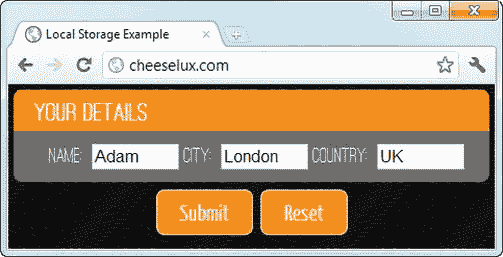
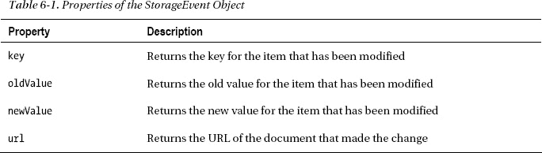
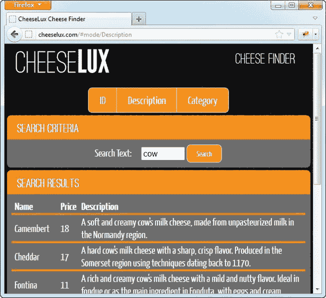

# 六、在浏览器中存储数据

客户端数据存储是对离线应用的自然补充。HTML5 定义了一些用于在浏览器中存储数据的有用的 JavaScript APIs，从简单的名称/值对到使用 JavaScript 对象数据库。在本章中，我将向您展示如何构建依赖持久存储数据的应用，包括如何在离线 web 应用中使用这些数据的细节。

 **注意**浏览器对数据存储的支持喜忧参半。您应该使用 Google Chrome 运行本章中的示例，但 IndexedDB 部分的示例除外，它们只能在 Mozilla Firefox 中运行。

### 使用本地存储

在浏览器中存储数据最简单的方法是使用 HTML5 *本地存储*特性。这允许您存储简单的名称/值对，并在以后检索或修改它们。数据会永久存储，但不能保证永远存储。如果需要空间(或者如果数据很长时间没有被访问)，浏览器可以自由删除你的数据，当然，用户可以随时清除数据存储，即使你的 web 应用正在运行。其结果是数据是广泛持久的，但不是无限持久的。使用本地存储非常类似于使用常规的 JavaScript 数组，如[清单 6-1](#list_6_1) 所示。

*清单 6-1。使用本地存储*

`<!DOCTYPE html>
<html>
<head>
    <title>Local Storage Example</title>
    <link rel="stylesheet" type="text/css" href="jquery-ui-1.8.16.custom.css"/>
    <link rel="stylesheet" type="text/css" href="styles.css"/>
        
    
    
    
    
    `
`      
    
</head>
<body>
    

        <a data-bind="formatAttr: {attr: 'href', prefix: '#select/', value: $data},
            css: {selectedItem: ($data == viewModel.selectedItem())}">
            
        </a>
    

    

        

            The selected item is: 
        
  
    

</body>
</html>`

为了演示本地存储，我使用了第 4 章中的简单例子，它允许我专注于存储技术，而不会妨碍其他章节的特性。如清单所示，开始使用本地存储非常简单。全局`localStorage`对象就像一个数组。当用户在这个简单的 web 应用中做出选择时，我使用数组样式的符号存储所选项，如下所示:

`**localStorage["selection"]** = item;`

 **提示**键区分大小写(因此`selection`和`Selection`将代表不同的数据项)，给已经存在的键赋值会覆盖先前定义的值。

这条语句创建了一个新的本地存储*条目*，我可以使用相同的数组样式符号读回它，如下所示:

`viewModel.selectedItem**(localStorage["selection"]** || viewModel.items[0]);`

将这两条语句添加到示例中的效果是为用户的选择创建简单的持久性。当加载 web 应用时，我检查是否有数据存储在`selection`键下，如果有，在视图模型中设置相应的数据项，这将恢复用户在早期会话中的选择。

用户可以查看和编辑本地存储的内容，这意味着您存储的任何内容都不是秘密的，任何内容都可以更改。不要存储任何你不想公开传播的内容，也不要依赖本地存储来给你的 web 应用提供特权访问。

从那时起，每当我的路线被一个 URL 改变匹配时，我就更新与`selection`键相关的值。我包含了一个默认选择的后备选项，以应对本地存储数据被删除的可能性(或者这是用户第一次加载 web 应用)。要测试这个特性，加载示例 web 应用，选择其中一个选项，然后重新加载 web 页面。浏览器将重新加载文档，重新执行 JavaScript 代码，并恢复您的选择。

#### 存储 JSON 数据

本地存储的规范要求键和值都是字符串，就像前面的例子一样。能够存储名称/值对的列表并不总是那么有用，但是我们可以建立对字符串的支持来使用 JSON 数据的本地存储，如[清单 6-2](#list_6_2) 所示。

*清单 6-2。为 JSON 数据使用本地存储*

`...

...`

我在`script`元素中定义了两个新函数来支持存储 JSON。每当用户做出选择时，就会调用`storeViewModelData`函数。JSON 只能存储数据值，而不能存储 JavaScript 函数，所以我从视图模型中提取数据值，并用它们来创建一个新对象。我将这个对象传递给`JSON.stringify`方法，该方法返回一个 JSON 字符串，如下所示:

`{"items":["Apple","Orange","Banana"],
"selectedItem":"Banana"}`

我通过将这个字符串与本地存储中的`viewModelData`键相关联来存储它。对应的功能是`loadViewModelData`。当 jQuery `ready`事件被触发时，我调用这个函数，并使用它来完成视图模型。

 **提示**本地存储的持久性意味着，如果您重复使用一个密钥来存储不同类型的数据，您将面临遇到以前会话中存储的旧格式的风险。在开发中处理这个问题的最简单的方法是清除浏览器的缓存。在生产中，您必须能够检测旧数据并处理它，或者至少能够在不产生任何错误的情况下丢弃它。

如果有与`viewModelData`键相关联的本地存储数据，我加载 JSON 字符串并使用`JSON.parse`方法创建一个 JavaScript 对象。然后我可以读取对象的属性来填充视图模型。当然，我不能依赖现有的数据，所以如果需要的话，我会使用一些合理的默认值。

**存储对象数据**

在我的简单示例中，从包含数据的对象中分离数据并不难，但是在复杂的 web 应用中，这可能要困难得多。您可能想通过直接存储对象来简化这个过程，而不是将数据映射到字符串。不要这样；这只会给你带来麻烦。下面是一段代码，展示了对象使用的本地存储:

`...

...`

这种技术行不通。当您存储对象时，浏览器不会抱怨，如果您在同一个会话中读回值，一切看起来都很好。但是浏览器会序列化该对象，以便为将来的会话存储它。对于大多数 JavaScript 对象，存储的值将是`[object Object]`，这是调用`toString`方法得到的结果。当用户再次访问 web 应用时，本地存储中的值不是有效的 JavaScript 对象，无法解析。这是应该在测试过程中发现的问题，但是我经常看到这个问题，尤其是因为即使是认真对待测试的项目通常也不会在多个会话中重新访问应用。

#### 存储表单数据

本地存储非常适合使表单数据持久化。键/值映射非常适合表单元素的本质，而且不费吹灰之力，就可以创建会话间持久的表单，如清单 6-3 所示。

*清单 6-3。使用本地存储创建持久表单*

`<!DOCTYPE html>
<html>
<head>
    <title>Local Storage Example</title>
    <link rel="stylesheet" type="text/css" href="jquery-ui-1.8.16.custom.css"/>
    <link rel="stylesheet" type="text/css" href="styles.css"/>
        
    
    
    
</head>
<body>    
    <form action="/formecho" method="POST">
        

            
Your Details

            

                

                    :
                    <input class="stwin" data-bind="attr: {name: name}, value: value">
                

            

        

        

            <input type="submit" value="Submit">
            <input type="reset" value="Reset">
        

    </form>
</body>
</html>`

我在这个例子中定义了一个简单的三字段`form`元素，你可以在[图 6-1](#fig_6_1) 中看到。该表单捕获用户的姓名、城市和国家，并被发送到服务器上的`/formecho` URL，服务器简单地响应所提交数据的细节。

*图 6-1。对表单元素使用本地存储*

我使用了一个视图模型作为`input`元素和本地存储之间的媒介。当用户向`input`元素之一输入值时，值数据绑定更新视图模型中相应的可观察数据项。我使用`subscribe`函数接收这些更改的通知，并将更新写入本地存储，如下所示:

`$.each(viewModel.personalDetails, function(index, item) {
    item.value(localStorage[item.name] || "");
**    item.value.subscribe(function(newValue) {**
**        localStorage[item.name] = newValue;**
**    });**
});`

我通过枚举视图模型中的项目来设置订阅。如果有可用的数据，我利用这个机会从本地存储设置视图模型中的初始值，如下所示:

`item.value(localStorage[item.name] || "");`

当我设置初始值时，来自本地存储的值通过视图模型传播到`input`元素，保持所有内容都是最新的。

一旦提交了表单或者当用户单击重置按钮时，继续存储表单数据是没有意义的。当单击提交或重置按钮时，我从本地存储中删除数据，如下所示:

`$('#buttonDiv input').button().click(function(e) {
**    localStorage.clear();**
});`

`clear`方法删除本地存储中 web 应用的所有数据(但不删除其他 web 应用的数据；只有用户或浏览器本身可以影响跨 web 应用的存储)。我没有阻止这两个按钮的默认操作，这意味着表单将由 submit 按钮提交，表单将由 reset 按钮重置。

 **提示**严格来说，我不需要处理 reset 按钮的`click`事件，因为视图模型会导致空值被写入本地存储。在这种情况下，我倾向于两次清理数据，以获得更简单的 JavaScript 代码。

这个小 web 应用的效果是表单数据是持久的，直到用户提交表单。如果用户在提交表单之前导航离开表单，他们在导航离开之前输入的数据将在下次加载 web 应用时恢复。

### 在文档间同步视图模型数据

本地存储中的数据是基于每个原点存储的，这意味着每个原点都有自己单独的本地存储区域。这意味着你不必担心与其他人的 web 应用发生键冲突。这也意味着我们可以使用 web 存储来同步同一域内不同文档之间的视图模型。

以这种方式使用本地存储时，我希望在另一个文档修改存储的数据值时得到通知。我可以通过处理由`window`浏览器对象发出的`storage`事件来接收这样的通知。为了让这个事件更容易使用，我创建了一种新的可观察数据项，它自动将自身保存到本地存储中，并加载更改后的值来响应`storage`事件。我将这个新功能添加到了`utils.js`文件中，如清单 6-4 中的[所示。](#list_6_4)

*清单 6-4。创建持久可观察数据项*

`...
ko.persistentObservable = function(keyName, initialValue) {
    var obItem = ko.observable(localStorage[keyName] || initialValue);

    $(window).bind("storage", function(e) {
        if (e.originalEvent.key == keyName) {
            obItem(e.originalEvent.newValue);          
        }
    });
    obItem.subscribe(function(newValue) {
        localStorage[keyName] = newValue;    
    });
    return obItem;
}
...`

这段代码是标准可观察数据项、本地存储数据数组和`storage`事件的包装器。调用该函数时使用的键名引用了本地存储中的数据项。当函数被调用时，我使用键来检查本地存储中是否已经有指定键的数据，如果有，就设置可观察值的初始值。如果没有默认值，我使用`initialValue`函数参数:

`var obItem = ko.observable(localStorage[keyName] || initialValue);`

我使用 jQuery 绑定到`window`对象上的`storage`事件。jQuery 将事件规范化，用一个特定于 jQuery 的替代来包装元素发出的事件对象。我需要获得底层的事件对象，因为它包含有关本地存储中的变化的信息；我通过`originalEvent`房产做这件事。当处理`storage`事件时，`originalEvent`属性返回一个`StorageEvent`对象，其最有用的属性在[表 6-1](#tab_6_1) 中描述。

在示例中，我使用`key`属性来确定这是否是我正在监视的数据项的事件，如果是，则使用`newValue`属性来更新常规的可观察数据项:

`$(window).bind("storage", function(e) {`
`    if (**e.originalEvent.key** == keyName) {
        obItem(**e.originalEvent.newValue**);
    }
});`

最后，我使用 KO `subscribe`方法来更新本地存储值，以响应视图模型的变化:

`obItem.subscribe(function(newValue) {
    localStorage[keyName] = newValue;    
});`

只需几行代码，我就能够为我的视图模型创建一个持久的可观察数据项。

我不必采取任何特殊的预防措施来防止事件-更新-订阅-事件的无限循环发生。这有两个原因。首先，我的代码包装的 KO observable 数据项足够智能，只有在更新的值与现有值不同时才发布更新。

第二，浏览器只在同一来源的*其他*文档中触发`storage`事件，而在*而不是*进行了更改的文档中。我一直认为这有点奇怪，但这确实意味着我的代码比其他情况下要简单。

为了展示我新的持久化数据项，我定义了一个名为`embedded.html`的新文档，其内容如[清单 6-5](#list_6_5) 所示。

*清单 6-5。使用持久可观察数据项的新文档*

`<!DOCTYPE html>
<html>
<head>
    <title>Embedded Storage Example</title>
    <link rel="stylesheet" type="text/css" href="jquery-ui-1.8.16.custom.css"/>
    <link rel="stylesheet" type="text/css" href="styles.css"/>
        
    
    
    
    
</head>
<body>`
`    

        
Embedded Document

        

            

                :
                <input class="stwin" data-bind="attr: {name: name}, value: value">
            

        

    

</body>
</html>`

这个文档复制了主示例中的`input`元素，但是没有`form`和`button`元素。但是，它有一个使用`persistentObservable`数据项的视图模型，这意味着对本文档中`input`元素值的更改将反映在本地存储中，同样，本地存储中的更改将反映在`input`元素中。我没有为持久可观察项提供默认值；如果没有本地存储值，那么我希望初始值默认为`null`，这是通过不向`persistentObservable`函数提供第二个参数来实现的。

剩下的就是修改主文档了。为了简单起见，我将一个文档嵌入到另一个文档中，但是本地存储由来自相同来源的任何文档共享，这意味着当这些文档在不同的浏览器选项卡或窗口中时，这种技术将会工作。[清单 6-6](#list_6_6) 显示了对`example.html`的修改，包括嵌入`embedded.html`文档。

*清单 6-6。修改主示例文档*

`<!DOCTYPE html>
<html>
<head>
    <title>Local Storage Example</title>
    <link rel="stylesheet" type="text/css" href="jquery-ui-1.8.16.custom.css"/>
    <link rel="stylesheet" type="text/css" href="styles.css"/>
        
    
    
    
    
</head>
<body>    
    <form action="/formecho" method="POST">
        

            
Your Details

            

                

                    :
                    <input class="stwin" data-bind="attr: {name: name}, value: value">
                

            

        

**        <iframe src="embedded.html"></iframe>**

        

            <input type="submit" value="Submit">
            <input type="reset" value="Reset">
        

    </form>
</body>
</html>`

在定义视图模型时，我为`persistentObservable`函数使用了相同的键，并添加了一个嵌入其他 HTML 文档的`iframe`元素。由于两者都是从相同的原点加载的，因此浏览器在它们之间共享相同的本地存储。通过本地存储和两个视图模型，更改一个文档中的`input`元素的值将触发另一个文档中相应的更改。

 **注意**如果两个文档的更新同时写入本地存储器，浏览器不提供任何关于数据项完整性的保证。很难考虑这种可能性(我从未见过这种情况发生)，但谨慎的做法是假设如果您共享本地存储，可能会发生数据损坏。

### 使用会话存储

本地存储的补充是*会话存储*，它通过`sessionStorage`对象访问。`sessionStorage`和`localStorage`对象以相同的方式使用，并发出相同的`storage`事件。不同之处在于，当文档在浏览器中关闭时，数据被删除(更具体地说，当顶级浏览上下文被破坏时，数据被删除，但这通常是一回事)。

会话存储最常见的用途是在重新加载文档时保留数据。这是一种有用的技术，尽管我不得不承认我倾向于使用本地存储来实现相同的效果。会话存储的主要好处是性能，因为数据通常保存在内存中，不需要写入磁盘。也就是说，如果你关心这提供的边际性能增益，那么你可能需要考虑浏览器是否是你的应用的最佳环境。[清单 6-7](#list_6_7) 展示了我如何在`utils.js`中为我的可观察数据项添加会话持久性支持。

*清单 6-7。使用会话存储定义半持久可观察数据项*

`ko.persistentObservable = function(keyName, initialValue, useSession) {
**    var storageObject = useSession ? sessionStorage : localStorage**
    var obItem = ko.observable(storageObject[keyName] || initialValue);

    $(window).bind("storage", function(e) {
        if (e.originalEvent.key == keyName) {
            obItem(e.originalEvent.newValue);          
        }
    });
    obItem.subscribe(function(newValue) {
        **storageObject**[keyName] = newValue;    
    });
    return obItem;
}`

由于`sessionStorage`和`localStorage`对象暴露了相同的特性并使用了相同的事件，所以我能够很容易地修改我的本地存储可观察项来添加对会话存储的支持。我在函数中添加了一个参数，如果`true`，就会切换到会话存储。如果参数没有提供或者是`false`，我使用本地存储。[清单 6-8](#list_6_8) 展示了我如何将会话存储应用于示例视图模型中的两个可观察数据项。

*清单 6-8。使用会话存储*

`...
var viewModel = {
    personalDetails: [
        {name: "name", label: "Name", value: ko.persistentObservable("name")},
**        {name: "city", label: "City",**
**            value: ko.persistentObservable("city", null, true)},**
**        {name: "country", label: "Country",**
**            value: ko.persistentObservable("country", null, true)}**
    ]
};
...`

使用会话存储处理`City`和`Country`元素的值，而`Name`元素保留在本地存储中。如果您将示例加载到浏览器中，您会发现重新加载文档不会清除您输入的任何值。但是，如果您关闭并重新打开文档，只有`Name`值保留。

### 对离线 Web 应用使用本地存储

使用本地存储的部分好处是它可以脱机使用。这意味着当浏览器离线时，我们可以使用本地数据来解决 Ajax GET 请求引起的问题。[清单 6-9](#list_6_9) 显示了上一章的缓存 CheeseLux web 应用，更新后可以利用本地存储。

*清单 6-9。为使用 Ajax 的离线 Web 应用使用本地存储*

`<!DOCTYPE html>
<html manifest="cheeselux.appcache">
<head>
    <title>CheeseLux</title>
    <link rel="stylesheet" type="text/css" href="styles.css"/>
        
    
    
    
    
        
    
    <link rel="stylesheet" type="text/css" href="jquery-ui-1.8.16.custom.css"/>
    <noscript>
        <meta http-equiv="refresh" content="0; noscript.html"/>      
    </noscript>    
    
</head>
<body>
    

        
        

            Gourmet European Cheese
            

                
                    <a data-bind="visible: cheeseModel.cache.status() != 4"
                       data-action="update" class="cachelink">Check for Updates</a>
                    <a data-bind="visible: cheeseModel.cache.status() == 4"
                       data-action="swapCache" class="cachelink">Apply Update</a>
                    <a class="cachelink" href="/news.html">News</a>
                
                `
`                    (Offline)
                            
            

        

    

    

        

            <a data-bind="formatAttr: {attr: 'href', prefix: '#category/',
               value: category},
            css: {selectedItem: (category == cheeseModel.selectedCategory())}">
                
            </a>
        

    
                

    <form action="/shipping" method="post">
        

            

                

                <!-- ko foreach: items -->
                

                    <label data-bind="attr: {for: id}" class="cheesename">
                        
                         $()</label>
                    <input data-bind="attr: {name: id}, value: quantity"/>
                    
                        ($)
                    
                

                <!-- /ko -->
                

                    <label class="cheesename">Total:</label>
                    
                        $
                                        
                

            

        

        

            <input type="submit" value="Submit Order"/>
        

    </form>
</body>
</html>`

在这个清单中，当 Ajax 请求成功时，我使用`JSON.stringify`方法存储视图模型数据的副本:

`$.getJSON("products.json", function(data) {
    cheeseModel.products = data;
**    localStorage["jsondata"] = JSON.stringify(data);**`
`})`

我在这个 web 应用的清单的`NETWORK`部分添加了`products.json` URL，所以我有理由相信数据是可用的，Ajax 请求会成功。

但是，如果请求失败(如果浏览器脱机，这种情况肯定会发生)，那么我会尝试从本地存储中定位并恢复序列化数据，如下所示:

`}).error(function() {
**    if (localStorage["jsondata"]) {**
**        cheeseModel.products = JSON.parse(localStorage["jsondata"]);**
**    }**
})`

假设初始请求有效，如果后续请求失败，我将有一个很好的后备位置。这种技术产生的效果类似于 Firefox 在浏览器离线时处理 Ajax 请求的方式，因为我最终使用了我能够从服务器获得的最新版本的数据。

请注意，我已经重新构建了代码，因此 web 应用设置的其余部分发生在`complete`处理函数中，它的触发与 Ajax 请求的结果无关。Ajax 的成败不再决定我如何处理它；现在，关键是我是否有数据，无论是从服务器上获得的还是从本地存储中恢复的。

#### 对脱机表单使用本地存储

我在[第 5 章](05.html)中提到，在缓存的应用中处理 POST 请求的唯一方法是防止用户在浏览器离线时发起请求。这仍然是正确的，但是您可以通过使用本地存储来创建持久值，从而改善您向用户提供的体验。为了演示这种方法，我首先需要更新`utils.js`文件中的`enhanceViewModel`函数，以使用本地存储来保存表单值，如[清单 6-10](#list_6_10) 所示。

*清单 6-10。更新 enhanceViewModel 函数以使用本地存储*

`...
function enhanceViewModel() {

    cheeseModel.selectedCategory
**        = ko.persistentObservable("selectedCategory", cheeseModel.products[0].category);**

    mapProducts(function(item) {
**        item.quantity = ko.persistentObservable(item.id + "_quantity", 0);**
        item.subtotal = ko.computed(function() {
            return this.quantity() * this.price;
        }, item);
    }, cheeseModel.products, "items");

    cheeseModel.total = ko.computed(function() {
        var total = 0;
        mapProducts(function(elem) {
            total += elem.subtotal();
        }, cheeseModel.products, "items");
        return total;
    });`
`};
...`

这是一个非常简单的改变，但是有几点需要注意。我想让每个奶酪产品的视图模型`quantity`属性持久化，所以我使用 item `id`属性的值来避免本地存储中的键冲突:

`item.quantity = ko.persistentObservable(**item.id + "_quantity",** 0);                `

要注意的第二点是，当我从本地存储中加载值时，我将在视图模型中放置字符串，而不是数字。然而，JavaScript 足够聪明，可以在执行乘法运算时转换字符串，就像这样:

`return this.quantity() * this.price;`

一切都如我所愿。然而，JavaScript 使用相同的符号来表示字符串连接和数字相加，因此如果我试图对视图模型中的值求和，我将不得不采取额外的步骤来解析值，如下所示:

`return Number(this.quantity()) + someOtherValue;`

#### 在离线应用中使用持久性

现在我已经修改了视图模型，我可以更改主文档来改进浏览器离线时处理`form`元素的方式。清单 6-11 展示了 HTML 标记的变化。

*清单 6-11。添加当浏览器离线时处理表单的按钮*

`...
<form action="/shipping" method="post">
    

        

            

            <!-- ko foreach: items -->
            

                <label data-bind="attr: {for: id}" class="cheesename">
                    
                     $()</label>
                <input data-bind="attr: {name: id}, value: quantity"/>
                
                    ($)
                
            

            <!-- /ko -->
            

                <label class="cheesename">Total:</label>
                
                    $
                                    
            

        
`
`    

    

        <input type="submit" value="Submit Order"
**               data-bind="visible: cheeseModel.cache.online()"/>**
**        <input type="button" value="Save for Later"**
**               data-bind="visible: !cheeseModel.cache.online()"/>**
    

</form>
...`

我在文档中添加了一个“保存以备后用”按钮，该按钮在浏览器脱机时可见。我还修改了提交按钮，这样它只有在浏览器在线时才可见。清单 6-12 显示了对`script`元素的相应变化。

*清单 6-12。更改脚本元素以支持离线表单*

``

这是一个简单的改变，你会很快意识到我正在做一些轻微的误导。当浏览器在线时，用户可以正常提交表单，本地存储中的所有数据都将被清除。当浏览器离线，用户点击保存以备后用按钮时，就会出现误导。我所做的就是调用`createDialog`函数，告诉用户表单数据已经保存。然而，我实际上不需要保存数据，因为我在视图模型中使用了持久可观察的数据项。用户不需要知道这些；他们只是获得了持久性的好处和来自 web 应用的明确信号，即表单数据尚未提交。当浏览器再次联机时，用户可以提交数据。始终使用本地存储意味着，如果用户在将表单提交给服务器之前关闭并重新加载应用，他们不会丢失数据。为了完整起见，[清单 6-13](#list_6_13) 显示了`createDialog`函数，我在`utils.js`文件中定义了它。这与我在原始示例中创建错误对话框的方法相同，我将代码移到了一个函数中，因为我需要在应用的多个位置创建相同类型的对话框。

*清单 6-13。createDialog 函数*

`function createDialog(message) {
    $('
' + message + '
').dialog({
        modal: true,
        title: "Message",            
        buttons: [{text: "OK",
            click: function() {$(this).dialog("close")}}]
    });
};`

我采用了一种非常简单直接的方法在浏览器离线时处理表单数据，但是您可以很容易地看到如何创建一种更复杂的方法。例如，您可以通过提示用户提交数据来响应`online`事件，或者甚至使用 Ajax 自动提交数据。无论你采取什么方法，你必须确保用户理解并认可你的 web 应用正在做的事情。

### 存储复杂数据

存储名称/值对非常适合存储表单数据，但是对于任何更复杂的东西，这样一个简单的方法就开始失效了。还有另一个浏览器特性，叫做 *IndexedDB* ，可以用来存储和处理更复杂的数据。

 **注意** IndexedDB 只是在浏览器中存储复杂数据的两个竞争标准之一。另一个是 WebSQL。在我写这篇文章的时候，W3C 正在支持 IndexedDB，但是 WebSQL 完全有可能卷土重来，或者至少成为事实上的标准。我没有在本章中包括 WebSQL，因为目前对它的支持是有限的，但是这是一个功能性的领域，还远没有解决，在您的项目中采用其中一个标准之前，您应该查看对这两个标准的支持。

IndexedDB 仍处于早期阶段，在我撰写本文时，该功能只能通过供应商指定的前缀获得，这意味着浏览器实现仍处于试验阶段，可能会偏离 W3C 规范。目前，最符合 W3C 规范的浏览器是 Mozilla Firefox，所以这是我用来演示 IndexedDB 的浏览器。

 **注意**本章中的例子可能不适用于 Firefox 以外的浏览器。事实上，除了我在本章中使用的版本(版本 10)之外，它们甚至不能在其他版本的 Firefox 上运行。也就是说，即使规范或实现发生了变化，您仍然应该能够对 IndexedDB 的工作原理有一个坚实的理解。

IndexedDB 特性是围绕*数据库*组织的，这些数据库与本地和会话存储一样，都是基于每个来源隔离的，因此它们可以在来自相同来源的应用之间共享。IndexedDB 不遵循关系数据库中常见的基于 SQL 的表结构。IndexedDB 数据库由*对象存储库*组成，其中可以包含 JavaScript 对象。您可以将 JavaScript 对象添加到对象存储中，并且可以用不同的方式查询这些存储，其中一些我将很快演示。

这种方法的结果是一种更符合 JavaScript 语言风格的存储机制，但最终使用起来有点笨拙。IndexedDB 中的几乎所有操作都是作为异步请求执行的，函数可以附加到这些请求上，以便在操作完成时执行它们。为了演示 IndexedDB 如何工作，我将创建一个奶酪查找器应用。我将奶酪产品数据放入 IndexedDB 数据库，并为用户提供一些不同的方法来搜索他们可能喜欢的奶酪数据。[图 6-2](#fig_6_2) 展示了完成的 web 应用，为后面的代码提供一些上下文。

*图 6-2。使用 IndexedDB 查询产品数据*

图中显示了搜索正在使用的每种产品的描述的选项。我搜索过 *cow* 这个词，页面底部列出了那些描述中包含这个词的产品。(有几个匹配，因为很多描述都解释说奶酪是用牛奶做的。)

#### 创建索引数据库和对象存储

这个例子的代码被分割在`utils.js`文件和主`example.html`文档之间。我将在这些文件之间跳转，展示 IndexedDB 提供的核心特性。首先，我在`utils.js`中定义了一个`DBO`对象和`setupDatabase`函数，如清单 6-14 中的[所示。](#list_6_14)

*清单 6-14。建立索引数据库*

`var DBO = {
    dbVersion: 31
}

function setupDatabase(data, callback) {
    var indexDB = window.indexedDB || window.mozIndexedDB;
    var req = indexDB.open("CheeseDB", DBO.dbVersion);

    req.onupgradeneeded = function(e) {
        var db = req.result;

        var existingStores = db.objectStoreNames;
        for (var i = 0; i < existingStores.length; i++) {
            db.deleteObjectStore(existingStores[i]);
        }

        var objectStore = db.createObjectStore("products", {keyPath: "id"});
        objectStore.createIndex("category", "category", {unique: false});

        $.each(data, function(index, item) {
            var currentCategory = item.category;
            $.each(item.items, function(index, item) {
                item.category = currentCategory;
                objectStore.add(item);
            });
        });
    };

    req.onsuccess = function(e) {
        DBO.db = this.result;
        callback();
    };    
};`

我定义了一个名为`DBO`的对象，它执行两个重要的任务。首先，它定义了我期望使用的数据库的版本。每次我对数据库模式进行更改时，我都会增加`dbVersion`属性的值，正如您所看到的，我花了 31 次更改才得到本例中我想要的结果。这主要是因为当前的规范草案和 Firefox 中的实现之间的差异。

 **提示**版本号是一个重要的机制，可以确保我为我的应用使用正确的模式版本。稍后，我将向您展示如何检查模式版本，如果需要的话，如何升级模式。

在`setupDatabase`函数中，我首先定位充当 IndexedDB 数据库网关的对象，如下所示:

`var indexDB = window.indexedDB || **window.mozIndexedDB;**`

IndexedDB 特性目前只能通过`window.mozIndexedDB`对象在 Firefox 中使用，但是一旦实现收敛到最终规范，它将变为`window.indexedDB`。为了给你最大的机会让本章这一部分的例子发挥作用，我试着首先使用“官方的”IndexedDB 对象，如果它不可用，就使用厂商前缀的替代对象。下一步是打开数据库:

`var req = **indexDB.open("CheeseDB", DBO.dbVersion);**`

两个参数是数据库的名称和预期的模式版本。如果指定的数据库已经存在，IndexedDB 将打开它，如果不存在，将创建它。来自`open`方法的结果是一个表示打开数据库请求的对象。要在 IndexedDB 中完成任何事情，您必须为请求的一个或多个可能结果提供处理函数。

##### 响应需要升级的结果

当我打开数据库时，我关心两种可能的结果。首先，如果数据库已经存在，并且模式版本与我期望的版本不匹配，我希望得到通知。当这种情况发生时，我想删除数据库中的对象存储并重新开始。我通过`onupgradeneeded`属性注册一个函数来接收模式不匹配的通知:

`req.onupgradeneeded = function(e) {
    var db = req.result;

    var existingStores = db.objectStoreNames;
    for (var i = 0; i < existingStores.length; i++) {
        db.deleteObjectStore(existingStores[i]);
    }

    var objectStore = db.createObjectStore("products", {keyPath: "id"});
    objectStore.createIndex("category", "category", {unique: false});

    $.each(data, function(index, item) {
        var currentCategory = item.category;
        $.each(item.items, function(index, item) {
            item.category = currentCategory;
            objectStore.add(item);
        });
    });
};`

数据库对象可通过由`open`方法返回的请求的`result`属性获得。我通过`objectStoreNames`属性获得现有对象存储的列表，并使用`deleteObjectStore`方法依次删除每个对象存储。在删除对象存储时，我也删除了它们包含的数据。对于这样一个简单的 web 应用来说，这很好，因为所有的数据都来自服务器，很容易替换，但是如果您的数据库包含用户操作生成的数据，您可能需要采用更复杂的方法。

 **注意**分配给`onupgradeneeded`属性的函数是您修改数据库模式的唯一机会。如果您尝试在其他地方添加或删除对象存储，浏览器将会生成错误。

一旦现有的对象存储不碍事了，我可以使用`createObject` store 方法创建一些新的。此方法的参数是新存储的名称和一个可选对象，该对象包含要应用于新存储的配置设置。我使用了`keyPath`配置选项，它允许我为添加到存储中的对象设置一个默认键。我已经指定了`id`属性作为键。我还使用`createIndex`方法在新创建的对象存储上创建了一个索引。索引允许我使用除键以外的属性在对象存储中执行搜索，在本例中，属性是 category。我将很快向您展示如何使用索引。

最后，我将对象添加到数据存储中。当我在主文档中使用这个函数时，我将使用从 Ajax 请求中获得的数据来处理`products.json`文件。这与我在本书中使用的数据格式相同。我使用 jQuery `each`函数来枚举每个类别及其包含的项目。我已经为每个商品添加了一个`category`属性，这样我可以更容易地找到属于同一类别的所有产品。

 **提示**使用 HTML5 *结构化克隆*技术克隆你添加到对象库中的对象。这是一种比 JSON 更全面的序列化技术，浏览器通常可以处理复杂的对象，只要这些属性都不是函数或 DOM API 对象。

##### 对成功结果的回应

我关心的第二个结果是*成功*，我通过为打开数据库的请求的`onsuccess`属性分配一个函数来处理它，如下所示:

`req.onsuccess = function(e) {
    DBO.db = this.result;
    callback();
};    `

该函数中的第一条语句将打开的数据库分配给`DBO`对象的`db`属性。这只是保持数据库句柄的一种便捷方式，这样我就可以在其他函数中使用它，稍后我将演示这一点。

第二条语句调用作为第二个参数传递给`setupDatabase`函数的回调函数。在执行`onsuccess`函数之前假设数据库是打开的是不安全的，这意味着我需要某种机制来通知函数调用方数据库已经成功打开，可以开始与数据相关的操作。

 **提示** IndexedDB 请求有一个对应的结果属性叫做`onerror`。我不会在这些例子中做任何错误处理，因为在我写这篇文章的时候，试图处理 IndexedDB 错误导致的问题比它解决的问题还多。理想情况下，当你阅读本章时，这种情况会有所改善，你将能够编写更健壮的代码。

#### 将数据库整合到 Web 应用中

清单 6-15 显示了示例应用的标记和内联 JavaScript。除了特定于数据库的函数之外，本例中的所有内容都依赖于前面章节中介绍的主题。

*清单 6-15。消耗数据库的网络应用*

`<!DOCTYPE html>
<html>
<head>
    <title>CheeseLux Cheese Finder</title>
    <link rel="stylesheet" type="text/css" href="styles.css"/>
        
    
    
    
    
        
        
    <link rel="stylesheet" type="text/css" href="jquery-ui-1.8.16.custom.css"/>
    <noscript>
        <meta http-equiv="refresh" content="0; noscript.html"/>      
    </noscript>    
    
</head>
<body>
    

        
        

            Cheese Finder
        

    

    

        

            <a data-bind="formatAttr: {attr: 'href', prefix: '#mode/', value: $data},
                css: {selectedItem: $data == $root.selectedMode()}">
                
            </a>`
`        

    

    

        
Search Criteria

        

            <label class="cheesename">Search Text:</label>
            <input id="textsearch" class="stwin"/>
            <a id="textsearch" class="smallbutton">Search</a>            
        

    

    

        
Search Results

        

            <table id="resultTable" data-bind="visible: selectedItems().length > 0">
                <thead>
                    <tr><th>Name</th><th>Price</th><th>Description</th></tr>
                    <tr><td colspan=3 class="sumline"></td></tr>
                </thead>                
                <tbody>
                    <!-- ko foreach: viewModel.selectedItems() -->
                    <tr>
                        <td data-bind="text: name"></td>
                        <td data-bind="text: price"></td>
                        <td data-bind="text: description"></td>
                    </tr>
                    <tr><td colspan=3 class="sumline"></td></tr>
                    <!-- /ko -->
                </tbody>
            </table>
            

                No matches
            

        

    
        
</body>
</html>`

正如您现在所期望的，我已经使用了一个视图模型来将应用的状态绑定到 HTML 标记。文档的大部分都用来定义和控制提供给用户的视图，并支持用户交互。

当用户点击搜索按钮时，根据所选择的搜索模式，调用`utils.js`文件中的三个函数之一。如果用户选择了按产品 ID 搜索，则调用`getProductByID`函数。当用户想要搜索产品描述时使用`getProductsByDescription`功能，而`getProductsByCategory`功能用于查找特定类别中的所有产品。这些函数中的每一个都有两个参数:要搜索的文本和结果应该发送到的回调函数(即使搜索对象存储也是使用 IndexedDB 的异步操作)。所有三种搜索模式的回调函数都是相同的:`handleSearchResults`。搜索功能的结果将是单个产品对象或一组对象。`handleSearchResults`函数的作用是清除视图模型中`selectedItems` 可观察数组的内容，并用新的结果替换它们；这将导致元素被更新，并将结果显示给用户。

注意，我将大部分代码语句放在了`setupDatabase`函数回调函数内的内联`script`元素中。这是数据库成功打开时调用的函数。

#### 通过按键定位物体

第一个搜索函数是`getProductByID`，它根据`id`属性的值定位一个对象。您可能还记得，在创建数据库时，我将该属性指定为对象存储的键:

`var objectStore = db.createObjectStore("products", **{keyPath: "id"}**);`

使用对象的键获取对象非常简单。[清单 6-16](#list_6_16) 显示了我在`utils.js`文件中定义的`getProductByID`函数。

*清单 6-16。使用对象的键*定位对象

`function getProductByID(id, callback) {
    var transaction = DBO.db.transaction(["products"]);
    var objectStore = transaction.objectStore("products");
    var req = objectStore.get(id);
    req.onsuccess = function(e) {
        callback(this.result);    
    };
}`

这个函数展示了查询数据库中对象存储的基本模式。首先，您必须使用`transaction`方法创建一个事务，声明您想要使用的对象存储。只有这样，您才能在刚刚创建的事务上使用`objectStore`方法打开一个对象存储。

 **提示**您不需要显式关闭对象存储或事务；当它们超出范围时，浏览器会为您关闭它们。试图显式强制关闭商店或事务没有任何好处。

我使用`get`方法获得具有指定键的对象，它最多匹配一个对象(如果有多个对象具有相同的键，那么匹配第一个匹配的对象)。该方法返回一个请求，我必须为`onsuccess`属性提供一个函数，以便在搜索完成时得到通知。匹配的对象在请求的`result`属性中可用，我通过调用传递给`getProductByID`函数的回调函数将它传递回 web 应用的主要部分(您应该记得，它是`handleSearchResults`函数)。

来自`get`方法的(最终)结果是一个 JavaScript 对象，或者，如果没有匹配，则是`null`。我不必担心从数据库存储的序列化数据中重新创建对象，也不必使用任何类型的对象关系映射层。IndexedDB 数据库始终处理 JavaScript 对象，这是一个很好的特性。

每当你想执行一个简单的操作时，都不得不使用回调，这有点令人沮丧，但这很快就变成了习惯。其结果是一种非常适合 JavaScript 世界的存储机制，当执行长时间操作时，它不会占用执行的主线程，但需要仔细思考和应用设计才能正确使用。

#### 用光标定位物体

当用户想通过描述搜索产品时，我必须采取不同的方法。描述在我的对象存储中不是一个键，我希望能够查找部分匹配(否则用户将不得不准确地输入所有描述来进行匹配)。[清单 6-17](#list_6_17) 显示了在`utils.js`中定义的`getProductsByDescription`函数。

*清单 6-17。使用光标定位对象*

`function getProductsByDescription(text, callback) {
    var searchTerm = text.toLowerCase();
    var results = [];
    var transaction = DBO.db.transaction(["products"]);
    var objectStore = transaction.objectStore("products");
**    objectStore.openCursor().onsuccess = function(e) {**
**        var cursor = this.result;**
**        if (cursor) {**
**            if (cursor.value.description.toLowerCase().indexOf(searchTerm) > -1) {**
**                results.push(cursor.value);**
**            }**
**            cursor.continue();**
**        } else {**
**            callback(results);**
**        }**
**    };**
};`

我在这里的技术是使用一个*光标*来枚举对象存储中的所有对象，并寻找那些其`products`属性包含用户提供的搜索词的对象。游标只是在我枚举一系列数据库对象时记录我的进度。

IndexedDB 没有文本搜索功能，所以我必须自己处理。在对象存储上调用`openCursor`方法会创建一个请求，当光标打开时会执行该请求的`onsuccess`回调。光标本身可以通过`this`上下文对象的 result 属性获得。(它也应该可以通过传递给函数的事件的`result`属性获得，但是当前的实现并不总是可靠地设置它。)

如果光标不是`null`，那么在`value`属性中有一个可用的对象。我检查对象的`description`属性是否包含我要寻找的术语，如果包含，我将对象`push`放入一个局部数组。为了将光标移动到下一个对象，我调用了`continue`方法，该方法再次执行`onsuccess`函数。

当我读取了对象存储中的所有对象时，光标是`null`。此时，我的本地数组包含所有匹配我的搜索的对象，我使用回调将它们传递回 web 应用的主要部分，回调作为第二个参数提供给`getProductsByDescription`函数。

#### 使用索引定位对象

枚举对象存储中的所有对象并不是查找对象的有效方式，这就是为什么我在设置对象存储时为`category`属性创建了一个索引:

`objectStore.createIndex("category", "category", {unique: false});`

`createIndex`方法的参数是索引的名称、将被索引的对象中的属性以及一个配置对象，我用它来告诉 indexed db,`category`属性的值不是惟一的。

在[清单 6-18](#list_6_18) 中显示的`getProductsByCategory`函数使用索引来缩小光标所列举的对象。

*清单 6-18。使用 IndexedDB 索引*

`function getProductsByCategory(searchCat, callback) {
    var results = [];
    var transaction = DBO.db.transaction(["products"]);
    var objectStore = transaction.objectStore("products");
**    var keyRange = IDBKeyRange.only(searchCat);**
**    var index = objectStore.index("category");**
    index.openCursor**(keyRange)**.onsuccess = function(e) {
        var cursor = this.result;
        if (cursor) {
            results.push(cursor.value);
            cursor.continue();
        } else {
            callback(results);
        }
    };
};`

`IDBKeyRange`对象有许多方法来约束键值，这些键值将匹配对象存储中的对象。我已经使用了`only`方法来指定我只想要精确的匹配。

我通过调用对象存储上的`index`方法打开索引，并在打开光标时将`IDBKeyRange`对象作为参数传入。这就缩小了通过游标可用的对象集，意味着我通过回调传递的结果只包含指定类别中的奶酪产品。在这个例子中没有部分匹配；用户必须输入整个类别名称，例如法国奶酪。

### 总结

在本章中，我向您展示了如何使用本地存储在浏览器中持久地存储名称/值对，以及如何在离线 web 应用中使用该功能来处理 HTML 表单。我还向您展示了 IndexedDB 的特性，它远没有那么成熟，但是作为使用自然 JavaScript 对象和语言习惯用法存储和查询更复杂数据的基础，它显示了很大的潜力。

IndexedDB 还不能用于生产，但是我发现本地存储在很多情况下都非常健壮和有用。我发现它特别有助于使表单更有用、更少烦人，就像我在本章中演示的那样。本地存储特性非常易于使用，尤其是当它嵌入到应用视图模型中时。

在下一章中，我将向您展示如何创建响应性 web 应用，这些应用能够适应并响应运行它们的设备的功能。