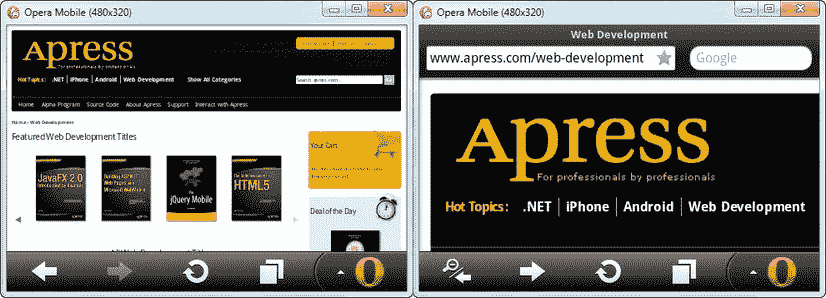
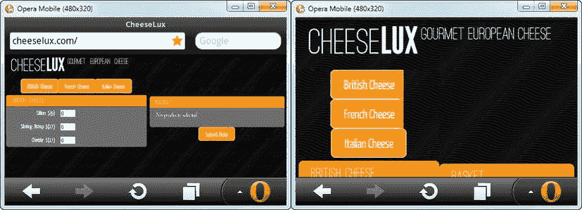
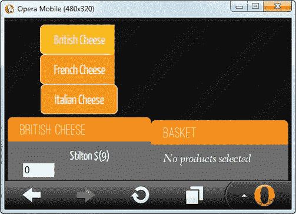
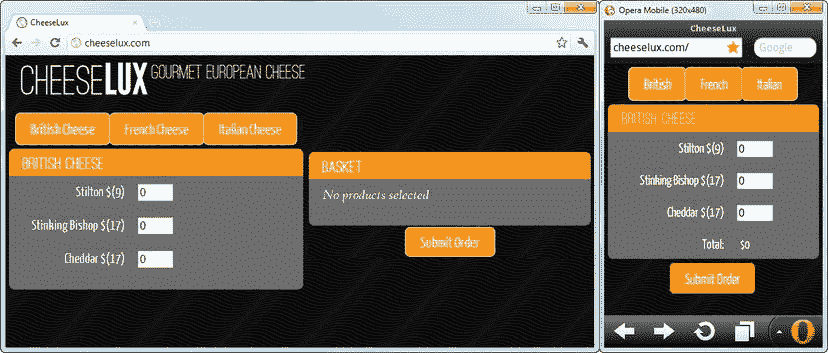
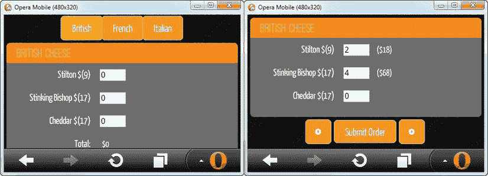

## 7

## 创建响应式 Web 应用程序

有两种方法可以让一个 web 应用程序面向多个平台。首先是为你想要瞄准的每种设备创建不同版本的应用程序:台式机、智能手机、平板电脑等等。我会在第 8 章中给你一些如何做到这一点的例子。

另一种方法，也是本章的主题，是创建一个*响应式 web 应用*，这仅仅意味着 web 应用适应运行它的设备的功能。我喜欢这种方法，因为它没有在移动设备和“普通”设备之间划出明显的界限。

这很重要，因为智能手机、平板电脑和台式机的功能混淆在一起。许多移动浏览器已经有很好的 HTML5 支持，带触摸屏的台式机也越来越普遍。在这一章中，我将向你展示可以用来创建灵活多变的 web 应用程序的技术。

### 设置视口

我需要解决一个特定于智能手机和平板电脑上运行的浏览器的问题(我将开始称之为*移动浏览器*)。移动浏览器通常从一个假设开始，即网站是为大屏幕桌面设备设计的，因此，用户需要一些帮助才能浏览它。这是通过*视窗*完成的，它缩小了网页，这样用户就能对整个页面结构有所了解。用户然后放大到页面的特定区域，以便阅读或使用它。你可以在[图 7-1](#fig_7_1) 中看到效果。

*图 7-1。手机浏览器中默认视口的效果*

 **注**[图 7-1](#fig_7_1) 中的截图是 Opera 手机模拟器的，可以从`[www.opera.com/developer/tools/mobile](http://www.opera.com/developer/tools/mobile)`获取。虽然它有一些怪癖，但这个模拟器相当忠实于真实的 Opera Mobile，后者广泛用于移动设备。我喜欢它，因为它允许我创建屏幕大小从小型智能手机到大型平板电脑的模拟器，并选择是否支持触摸事件。另外，您可以使用标准的 Opera 开发工具调试和检查您的 web 应用程序。仿真器不能代替在一系列真实硬件设备上的测试，但是在开发的早期阶段非常方便。

这是一个明智的功能，但你需要禁用它的网络应用程序；否则，内容和控件的显示尺寸太小，无法使用。[清单 7-1](#list_7_1) 展示了如何使用 HTML `meta`标签禁用这个特性，我已经将它应用到一个简化版的 CheeseLux web 应用程序中，这将是本章的基础示例。

*清单 7-1。使用 meta 标签控制 CheeseLux Web 应用程序中的视窗*

`<!DOCTYPE html>
<html>
<head>
    <title>CheeseLux</title>
    <link rel="stylesheet" type="text/css" href="styles.css"/>
        
    
    
    
    
    
    
    
    <link rel="stylesheet" type="text/css" href="jquery-ui-1.8.16.custom.css"/>
**    <meta name="viewport" content="width=device-width, initial-scale=1">**
    
</head>
<body>
    

        
        Gourmet European Cheese
    

    

        

            <a data-bind="formatAttr: {attr: 'href', prefix: '#category/',
               value: category},
            css: {selectedItem: (category == cheeseModel.selectedCategory())}">
                
            </a>
        

    
                

    

        
Basket

        

            

                No products selected
            
            

            <table id="basketTable" data-bind="visible: total">
                <thead><tr><th>Cheese</th><th>Subtotal</th><th></th></tr></thead>
                <tbody data-bind="foreach: products">
                    <!-- ko foreach: items -->
                        <tr data-bind="visible: quantity, attr: {'data-prodId': id}">
                            <td data-bind="text: name"></td>
                            <td>$</td>

                        </tr>                    
                    <!-- /ko -->
                </tbody>
                <tfoot>
                    <tr><td class="sumline" colspan=2></td></tr>
                    <tr>
                        <th>Total:</th><td>$</td>
                    </tr>
                </tfoot>
            </table>`
`        

        

        

            <input type="submit" value="Submit Order"/>
        

    
            

    <form action="/shipping" method="post">
        <!-- ko foreach: products -->
        

            

            

                

                    <label data-bind="attr: {for: id}" class="cheesename">
                        
                         $()</label>
                    <input data-bind="attr: {name: id}, value: quantity"/>
                    
                        ($)
                    
                

            

        

        <!-- /ko -->
    </form>
</body>
</html>`

将高亮显示的`meta`元素添加到文档中会禁用缩放功能。你可以在[图 7-2](#fig_7_2) 中看到效果。这个特殊的`meta`标签告诉浏览器使用显示器的实际宽度显示 HTML 文档，而不进行任何放大。当然，web 应用程序仍然是一团糟，但它是以正确的大小显示的，这是向响应性应用程序迈出的第一步。在本章的其余部分，我将向您展示如何响应不同的设备特性和功能。

*图 7-2。禁用 web 应用程序的视窗的效果*

### 响应屏幕大小

*媒体查询*是根据设备功能定制 CSS 样式的有效方法。从响应性 web 应用的角度来看，设备最重要的特征可能是屏幕大小，CSS 媒体查询很好地解决了这个问题。如图 7-2 所示，CheeseLux 标志在小屏幕上占据了很大的空间，我可以使用 CSS 媒体查询来确保它只在更大的显示器上显示。清单 7-2 显示了我添加到`styles.css`文件中的一个简单的媒体查询。

*清单 7-2。简单的媒体查询*

`@media screen AND (max-width:500px) {
    *.largeScreenOnly {
        display: none;
    }
}`

 **提示** Opera Mobile 大肆缓存 CSS 和 JavaScript 文件。当试验媒体查询时，最好的技术是在主 HTML 文档中定义 CSS 和脚本代码，当您对结果满意时，将它移到外部文件中。否则，您需要清除缓存(或重新启动模拟器)以确保应用您的更改。

标签告诉浏览器这是一个媒体查询。我已经指定只有当设备是屏幕(相对于投影仪或印刷材料)并且宽度不大于 500 像素时，才应该应用该查询中包含的`largeScreenOnly`样式。

 **提示**在这一章中，我将把世界分为两类显示器。*小型*显示器将是那些宽度不超过 500 像素的显示器，而*大型*显示器将是其他所有的显示器。这是简单而随意的，你可能需要设计更多的类别来获得你的 web 应用程序所需要的效果。我将完全忽略显示器的高度。我的简单分类将使本章中的例子易于管理，尽管是以牺牲粒度为代价的。

如果满足这些条件，那么定义一个样式，将分配给`largeScreenOnly`类的任何元素的 CSS `display`属性设置为`none`，这将隐藏该元素。添加到样式表后，我可以通过对我的标记应用`largeScreenOnly`类来确保 CheeseLux 标识只在大显示器上显示，如[清单 7-3](#list_7_3) 所示。

*清单 7-3。使用 CSS 媒体查询来响应屏幕尺寸*

`...

    
    Gourmet European Cheese

...`

CSS 媒体查询是*实时的*，这意味着如果调整浏览器窗口的大小，屏幕大小的类别会改变。这在移动设备上用处不大，但这意味着一个响应迅速的 web 应用程序即使在桌面平台上也能适应显示尺寸。你可以在[图 7-3](#fig_7_3) 中看到布局是如何变化的。

*图 7-3。使用媒体查询来管理元素的可见性*

#### 通过 JavaScript 使用媒体查询

为了正确地将媒体查询集成到 web 应用程序中，我们需要使用 W3C *CSS* 对象模型规范的视图模块，它将 JavaScript 媒体查询支持引入到浏览器中。使用`window.matchMedia`方法在 JavaScript 中评估媒体查询，如[清单 7-4](#list_7_4) 所示。我在`utils.js`文件中定义了`detectDeviceFeatures`函数；目前，它只检测屏幕大小，但我稍后会检测一些附加功能。清单中有很多内容，所以我将在接下来的部分中对其进行分解并解释各个部分。

*清单 7-4。在 JavaScript 中使用媒体查询*

`function detectDeviceFeatures(callback) {
    var deviceConfig = {};
    Modernizr.load({
        test: window.matchMedia,`
`        nope: 'matchMedia.js',
        complete: function() {          
            var screenQuery = **window.matchMedia('screen AND (max-width:500px)**');
            deviceConfig.smallScreen = ko.observable(screenQuery.matches);
            if (screenQuery.addListener) {
                screenQuery.addListener(function(mq) {    
                    deviceConfig.smallScreen(mq.matches);
                });
            }

            deviceConfig.largeScreen = ko.computed(function() {
                return !deviceConfig.smallScreen();
            });

            setInterval(function() {
                deviceConfig.smallScreen(window.innerWidth <= 500);
            }, 500);

            callback(deviceConfig);
        }
    });
};`

##### 装载聚合填料

我需要使用 polyfill 来确保我可以使用`matchMedia`方法。桌面浏览器对这一特性的支持很好，但在移动世界却不尽如人意。我使用的 polyfill 叫做`matchMedia.js`，可以从`[http://github.com/paulirish/matchMedia.js](http://github.com/paulirish/matchMedia.js)`买到。

我想仅在浏览器本身不支持`matchMedia`功能时加载聚合填充。为此，我使用了`Modernizr.load`方法，这是一个灵活的资源加载器。我向`load`方法传递一个对象，该对象的属性告诉 Modernizr 该做什么。

 **提示**`Modernizr.load`特性仅在您创建自定义 Modernizr 构建时可用；它*不*包含在 Modernizr 库的未压缩开发版本中。Modernizr load 方法是一个名为 *YepNope* 的库的包装器，可在`[http://yepnopejs.com](http://yepnopejs.com)`获得。如果出于任何原因不想使用压缩的 Modernizr 构建，可以直接使用 YepNope。`[http://yepnopejs.com](http://yepnopejs.com)`网站还包含所有装载机功能的详细信息；当这个库包含在 Modernizr 中时，语法不会改变。在外部 JavaScript 文件中使用资源加载器时要小心。可能会出现严重的问题，我在第 9 章中描述了这些问题。您将在 Modernizr 网页上看到一个创建自定义下载的链接。对于我在本章中使用的定制构建，我简单地检查了所有选项，以便在下载中包含尽可能多的 Modernizr 功能。

`test`属性，顾名思义，指定了我希望 Modernizr 计算的表达式。在这种情况下，我想看看`window.matchMedia`方法是否由浏览器定义。您可以使用任何带有`test`属性的 JavaScript 表达式，包括 Modernizr 特性检测检查。

属性告诉 Modernizr，如果`test`对`false`求值，我想加载什么资源。在本例中，我指定了包含多填充代码的`matchMedia.js`文件。有一个相应的属性`yep`，它告诉 Modernizr 如果`test`是`true`需要什么资源，但是我不需要在这个例子中使用它，因为如果`test`是`true`，我将依赖于对`matchMedia`的内置支持。`complete`属性指定了一个函数，当`yep`或`nope`属性指定的资源都已被加载和执行时，该函数将被执行。

`Modernizr.load`异步获取并执行 JavaScript 脚本，这就是为什么`detectDeviceFeatures`函数将回调函数作为参数。我在`complete`函数的末尾调用这个回调函数，传入一个包含已检测到的特性细节的对象。

##### 检测屏幕尺寸

我现在可以开始计算这款设备的屏幕属于我的大类还是小类。为此，我向`matchMedia`方法传递一个媒体查询，就像我在 CSS 中使用的一样，如下所示:

`var screenQuery = **window.matchMedia('screen AND (max-width:500px)');**`

我通过读取从`matchMedia`返回的对象的`matches`属性来确定我的媒体查询是否匹配。如果`matches`是`true`，那么我正在处理的屏幕属于我的小类(500 像素及更小)。如果是`false`，那么我有一个大屏幕。我将结果赋给对象中的一个可观察数据项，并将其传递给回调函数:

`var deviceConfig = {
    smallScreen: ko.observable(screenQuery.matches)
};`

如果浏览器实现了`matchMedia`特性，那么我可以使用`addListener`方法在媒体查询的状态改变时得到通知，如下所示:

`if (screenQuery.addListener) {
    screenQuery.addListener(function(mq) {
        deviceConfig.smallScreen(mq.matches);
    });
}`

当介质查询包含的条件之一改变时，介质查询的状态也会改变。我的查询中的两个条件是，我们正在一个屏幕上工作，它的最大宽度为 500 像素。因此，改变通知指示显示的宽度已经改变。这意味着浏览器窗口的大小已被调整或屏幕方向已被改变(详见本章后面的“响应屏幕方向”一节)。

`matchMedia.js` polyfill 不支持变更通知，所以在使用之前，我必须测试一下`addListener`方法是否存在。当媒体查询的状态改变并且我更新可观察数据项的值时，我的函数被执行。我做的最后一件事是创建一个计算的可观察数据项，就像这样:

`deviceConfig.largeScreen = ko.computed(function() {
    return !deviceConfig.smallScreen();
});`

这只是为了帮助整理我的语法，当我想在我的 web 应用程序的其余部分引用屏幕尺寸时，这样我就可以引用`smalllScreen`和`largeScreen`来弄清楚我正在处理什么，而不是`smallScreen`和`!smallScreen`。这是一件小事，但我这样做可以减少打字错误。

一些浏览器在处理媒体查询中状态变化的方式上不一致。例如，当我写这篇文章的时候，谷歌浏览器的最新版本并不总是在屏幕尺寸改变的时候更新媒体查询。作为一项严格的措施，我添加了一个对屏幕尺寸的简单检查，这是使用`setInterval`函数设置的:

`setInterval(function() {
    deviceConfig.smallScreen(window.innerWidth <= 500);
}, 500);`

该函数每 500 毫秒执行一次，并更新视图模型中的屏幕尺寸项目。这并不理想，但重要的是一个响应迅速的 web 应用程序能够适应设备的变化，这可能意味着采取一些不可取的预防措施，包括轮询状态变化。

 **提示**注意，我使用了`window.innerWidth`属性来计算屏幕的大小。我正在解决的问题是，媒体查询不能在所有浏览器中正常工作，所以我需要找到一种替代机制来评估屏幕大小。

##### 将能力检测集成到 Web 应用程序中

我想在 web 应用程序中做任何事情之前检测设备的功能，这就是我为什么添加了一个对`detectDeviceFeatures`函数的回调。在[清单 7-5](#list_7_5) 中，你可以看到我是如何将这个函数的使用集成到 web app `script`元素中的。

*清单 7-5。从内联脚本元素*调用 detectDeviceFeatures 函数

``

我将`detectDeviceFeatures`函数传递给回调的对象分配给视图模型中的设备属性。通过使用可观察的数据项，当媒体查询改变时，我将改变从视图模型传播到应用程序中。

最后一步是利用 web 应用程序标记中对视图模型的增强。清单 7-6 显示了我如何通过数据绑定来控制 CheeseLux 标志的可见性。

*清单 7-6。基于通过视图模型*表达的屏幕能力控制元素可见性

`...

    
    Gourmet European Cheese

...`

结果是重新创建了在 JavaScript 中使用 CSS 媒体查询的效果。CheeseLux 徽标仅在大屏幕上可见。你可能会奇怪，为什么我要花这么大力气用 JavaScript 重新创建一个简单而优雅的 CSS 技术。原因很简单:通过我的 web 应用程序视图模型推送关于设备功能的信息给了我创建响应性 web 应用程序的基础，这些应用程序比单独使用 CSS 要强大和灵活得多。下一节给出了一个例子。

##### 推迟图像加载

简单隐藏一个`img`元素的问题是浏览器仍然会加载它；它只是从来没有向用户展示过。这是一个荒谬的情况，因为它花费了我*和*的用户带宽来下载一个永远不会在小屏幕设备上显示的资源。为了解决这个问题，我在`utils.js`文件中定义了一个名为`ifAttr`的新数据绑定，如清单 7-7 中的[所示。这种绑定基于对条件的评估来添加和移除属性。](#list_7_7)

*清单 7-7。用于有条件地设置元素属性的数据绑定*

`ko.bindingHandlers.ifAttr = {
    update: function(element, accessor) {
        if (accessor().test) {
            $(element).attr(accessor().attr, accessor().value);
        } else {
            $(element).removeAttr(accessor().attr);
        }
    }
}`

这个绑定期望一个包含三个属性的数据对象:`attr`属性指定我想要应用哪个属性，`test`属性确定该属性是否被添加到元素中，`value`属性指定如果`test`是`true`将被分配给该属性的值。清单 7-8 显示了如何将这个绑定应用到我的 CheeseLux 徽标标记上，以推迟加载图像，直到需要它的时候。

*清单 7-8。使用 ifAttr 绑定防止图像加载*

`

    **
    Gourmet European Cheese

`

当`img`元素没有`src`属性时，浏览器无法加载图像。为了利用这一点，我在`largeScreen`视图模型项中使用了`ifAttr`属性，这样`src`属性只在图像显示时才被设置。通过这种方式，我能够阻止图像加载，除非它将被显示。这是一个非常简单的技巧，但是展示了在创建一个响应式 web 应用程序时应该寻求的灵活性。

 **提示**将你不想马上使用的资源和你根本不太可能想要的资源区分开来是很重要的。如果你有一个合理的预期，用户在正常使用你的应用程序时会需要一个图像，那么你应该让浏览器下载它，以便在需要的时候可以立即得到。如果用户不太可能需要资源，使用`ifAttr`技术来避免浪费下载。

#### 调整网络应用程序布局

从现在开始，我只需要根据我感兴趣的两类屏幕来调整 web 应用程序的每个部分。清单 7-9 显示了所需的变更。

 **提示**在应用了[清单 7-10](#list_7_10) 中的更改之前，不要试图在浏览器中加载这个清单。如果这样做，您将得到一个错误，因为视图模型数据和数据绑定不同步。

*清单 7-9。使网络应用适应大小屏幕*

`<!DOCTYPE html>
<html>
<head>
    <title>CheeseLux</title>
    <link rel="stylesheet" type="text/css" href="styles.css"/>`
`        
    
    
    
    
    
    
    
    <link rel="stylesheet" type="text/css" href="jquery-ui-1.8.16.custom.css"/>
    <meta name="viewport" content="width=device-width, initial-scale=1">
    
</head>
<body>
    

        
        Gourmet European Cheese`
`    

    

        

            <a data-bind="formatAttr: {attr: 'href', prefix: '#category/',
               value: category},
            css: {selectedItem: (category == cheeseModel.selectedCategory())}">
**                **
            </a>
        

    
                

    
**
        
Basket

        

            

                No products selected
            
            

            <table id="basketTable" data-bind="visible: total">
                <thead><tr><th>Cheese</th><th>Subtotal</th><th></th></tr></thead>
                <tbody data-bind="foreach: products">
                    <!-- ko foreach: items -->
                        <tr data-bind="visible: quantity, attr: {'data-prodId': id}">
                            <td data-bind="text: name"></td>
                            <td>$</td>

                        </tr>                    
                    <!-- /ko -->
                </tbody>
                <tfoot>
                    <tr><td class="sumline" colspan=2></td></tr>
                    <tr>
                        <th>Total:</th><td>$</td>
                    </tr>
                </tfoot>
            </table>
        

        

        

            <input type="submit" value="Submit Order"/>
        

    
            

    <form action="/shipping" method="post">
        

            

                

`
`                <!-- ko foreach: items -->
                

                    <label data-bind="attr: {for: id}" class="cheesename">
                        
                         $()</label>
                    <input data-bind="attr: {name: id}, value: quantity"/>
                    
                        ($)
                    
                

                <!-- /ko -->
**                
**
**                    <label class="cheesename">Total:</label>**
**                    **
**                        $**
**                    **
**                
    **
            

        

**        
**
**            <input type="submit" value="Submit Order"/>**
**        
**
    </form>
</body>
</html>`

这种方法的乐趣在于，只需要很少的改变就能让 web 应用程序响应屏幕大小(以及这些改变是多么简单)。也就是说，有少量的变化需要解释，我将在下面的部分中提供。你可以在[图 7-4](#fig_7_4) 中看到我的响应式 web app 是如何出现在大小屏幕上的。

*图 7-4。在大小屏幕上显示相同的网络应用程序*

这些微小的变化会产生很大的影响，而且在很大程度上，这些变化只是表面上的。我的 web 应用程序的基本功能和结构保持不变。我不必为了支持一个更小屏幕的设备而放弃我的视图模型或路由。

##### 调整源数据

类别按钮在小屏幕上是一个问题，所以我想向用户显示一些有意义但需要较少屏幕空间的东西。为此，我在`products.json`文件中添加了一些内容，以便在空间有限的情况下，每个类别都包含一个名称。清单 7-10 显示了其中一个类别的添加。

*清单 7-10。向产品数据添加屏幕特定信息*

`...
[{"category": "British Cheese",
**  "shortName": "British",**
   "items" : [
        {"id": "stilton", "name": "Stilton", "price": 9,
        "description": "A semi-soft blue cow's milk cheese produced in the
         Nottinghamshire region. A strong cheese with a distinctive smell
         and taste and crumbly texture."},
...`

我已经对`products.json`文件中的所有其他类别进行了类似的修改。我可以通过在空格字符上拆分类别值字符串来获得短名称，但是我想指出的是，不仅仅是 web 应用程序中的脚本和标记可以响应；您还可以在驱动应用程序的数据中支持这一概念。

在[清单 7-9](#list_7_9) 中，我修改了导航按钮的数据绑定，以利用更短的类别名称，如下所示:

`

    

        <a data-bind="formatAttr: {attr: 'href', prefix: '#category/',
           value: category},
        css: {selectedItem: (category == cheeseModel.selectedCategory())}">
            
        </a>
    

                `

对于`formatAttr`绑定，我仍然使用完整的类别名称。这使我可以使用同一组导航路线，而不管屏幕大小如何(参见[第 4 章](04.html)了解在网络应用中使用路线的详细信息)。

##### 应用条件 jQuery UI 样式

在大屏幕布局中，我调整了产品列表元素的大小，以便为购物篮腾出空间。在小屏幕布局中，我在每个部分的末尾用一行合计替换专用的购物篮。如果可以的话，我喜欢利用`matchMedia.addListener`功能，这意味着我必须能够根据需要在大小屏幕布局之间切换。为了适应这种情况，我将那些在自己的函数中驱动单个布局的脚本语句视为视图模型中更改的订阅者:

`function performScreenSetup(smallScreen) {    
**    $('div.cheesegroup').not("#basket").css("width", smallScreen ? "" : "50%");      **
};                
cheeseModel.device.smallScreen.subscribe(performScreenSetup);`

只有当值发生变化时，才会调用该函数，所以我显式调用该函数，以便在文档首次加载时获得正确的行为，如下所示:

`performScreenSetup(cheeseModel.device.smallScreen());`

实际上，我根据屏幕的大小切换了`cheesegroup`类中`div`元素的 CSS `width`属性。你可以忽略这种方法，让布局保持初始状态，但是我认为这是一个为桌面用户提供良好体验的机会。

##### 从文档中删除元素

在大多数情况下，我只是根据屏幕的大小隐藏和显示文档中的元素。但是，有时需要使用`if`和`ifnot`绑定来确保元素完全从文档中移除。在清单中可以看到一个简单的例子，我使用了`if`绑定来获得一行总摘要:

`

    <label class="cheesename">Total:</label>
    
        $
                        

    `

我在这里使用了`if`绑定，因为隐藏在`styles.css`文件中的是一个应用圆角的 CSS 样式:

`div.groupcontent:last-child {
    border-bottom-left-radius: 8px;
    border-bottom-right-radius: 8px;
}`

浏览器在判断哪个元素是其父元素的最后一个子元素时，不会考虑元素的可见性。如果我使用了`visible`绑定，那么我在大屏幕布局中没有得到我想要的圆角。`if`绑定通过完全移除元素来强制我想要的行为，确保圆角被正确应用。

### 响应屏幕方向

许多移动设备通过在横向和纵向模式之间改变屏幕方向来响应用户握持设备的方式。保持对显示模式的了解是相当棘手的，但是确保你的 web 应用在方向改变时做出适当的响应是值得的。有几种方法可以解决这个问题。

一些设备支持一个`window.orientation`属性和一个`orientationchange`事件，以便更容易地跟踪屏幕方向，但这个特性并不通用，即使实现了，事件也往往在不应该被触发的时候被触发(在应该被触发的时候没有被触发)。

其他设备支持将`orientation`作为媒体查询的一部分。如果作为`matchMedia`的一部分支持`addListener`功能，这是很有用的，但是大多数移动浏览器不支持这个功能，而这些设备的方向最有可能改变。

几乎所有的浏览器都支持一个`resize`事件，当调整窗口大小或改变方向时，就会触发这个事件。然而，一些实现在方向改变和事件被触发之间引入了延迟，这使得 web 应用程序响应缓慢，并且可能在用户已经开始以新的方向进行交互之后改变其布局或行为。

最后一种方法是定期检查屏幕尺寸，并手动确定方向。这是一种粗糙但有效的方法，只有当检查的频率足够高，可以快速响应，但又足够低，不会让设备不堪重负时，这种方法才有效。

确保检测到方向变化的唯一可靠方法是应用所有四种技术。[清单 7-11](#list_7_11) 显示了对`detectDeviceFeatures`函数的必要添加。

*清单 7-11。检测屏幕方向变化*

`function detectDeviceFeatures(callback) {
    var deviceConfig = {};

**    deviceConfig.landscape = ko.observable();**
**    deviceConfig.portrait = ko.computed(function() {**
**        return !deviceConfig.landscape();**
**    });**

**    var setOrientation = function() {**
**        deviceConfig.landscape(window.innerWidth > window.innerHeight);**
**    }**
**    setOrientation();**

**    $(window).bind("orientationchange resize", function() {**
**        setOrientation();**
**    });**

**    setInterval(setOrientation, 500);**

**    if (window.matchMedia) {**
**        var orientQuery = window.matchMedia('screen AND (orientation:landscape)')**
**        if (orientQuery.addListener) {**
**            orientQuery.addListener(setOrientation);**
**        }**
**    }**

    Modernizr.load({
        test: window.matchMedia,
        nope: 'matchMedia.js',
        complete: function() {          
            var screenQuery = window.matchMedia('screen AND (max-width:500px)');
            deviceConfig.smallScreen = ko.observable(screenQuery.matches);
            if (screenQuery.addListener) {`
`                screenQuery.addListener(function(mq) {    
                    deviceConfig.smallScreen(mq.matches);
                });
            }
            deviceConfig.largeScreen = ko.computed(function() {
                return !deviceConfig.smallScreen();
            });            

            setInterval(function() {
                deviceConfig.smallScreen(window.innerWidth <= 500);
            }, 500);

            callback(deviceConfig);
        }
    });
};`

我已经建立了两个视图模型数据项，`landscape`和`portrait`，遵循我用于`smallScreen`和`largeScreen`的相同模式。我不想重复我的代码来测试设备的方向，所以我创建了一个简单的名为`setOrientation`的内嵌函数来设置`landscape`数据项的值:

`var setOrientation = function() {
    deviceConfig.landscape(**window.innerWidth > window.innerHeight**);
}`

我发现比较`window`对象的`innerWidth`和`innerHeight`值是确定屏幕方向最可靠的方法。`screen.width`和`screen.height`值*应该*起作用，但是一些浏览器在设备重定向时不会改变这些值。属性提供了很好的信息，但是它并没有被普遍实现。这无疑是一种妥协，我建议您在目标设备上测试这种方法的有效性。

其余的添加实现了调用`setOrientation`的各种方法:通过`orientationchange`和`resize`事件，通过媒体查询，以及通过轮询。判断轮询方向的正确频率很困难，但我通常使用 500 毫秒。它并不总是像我希望的那样响应迅速，但它达到了合理的平衡。

 **提示**我本可以使用一个单独的`setInterval`调用来轮询屏幕大小和方向，但是我更喜欢将代码功能的区域尽可能分开。

#### 将屏幕方向整合到网络应用中

我可以让 web 应用程序响应屏幕方向，因为视图模型已经有了`portrait`和`landscape`项。为了演示这一点，我将解决一个问题:web 应用程序目前需要用户向下滚动，才能在小屏幕设备上以横向模式查看所有元素。[图 7-5](#fig_7_5) 显示了我修改 web 应用程序布局后的问题和结果。

*图 7-5。响应小屏幕上的横向方向*

为了适应小屏幕的这种定位，我移除了类别导航元素，用左右按钮来替换它们。这不是最优雅的方法，但它很好地利用了有限的屏幕空间，同时保留了 web 应用程序的基本特性。[清单 7-12](#list_7_12) 显示了添加数据绑定来控制导航项目的可见性。

*清单 7-12。绑定元素对屏幕大小和方向的可见性*

`
**
    

        <a data-bind="formatAttr: {attr: 'href', prefix: '#category/',
           value: category},
        css: {selectedItem: (category == cheeseModel.selectedCategory())}">
            
        </a>
    

                `

如果设备的屏幕很小，并且是横向的，我会从 DOM 中删除这些元素。我添加的按钮如下:

`

**    <button id="left">Prev</button>**
    <input type="submit" value="Submit Order"/>
**    <button id="right">Next</button>**

`

元素本身并不有趣，但是处理单击时出现的导航的代码值得一看:

`...
function performScreenSetup(smallScreen) {    
    $('div.cheesegroup').not("#basket")
        .css("width", smallScreen ? "" : "50%");
**    $('button#left').button({icons:**
**        {primary: "ui-icon-circle-triangle-w"},text: false});**
**    $('button#right').button({icons:**
**        {primary: "ui-icon-circle-triangle-e"},text: false});**
**    $('button#left, button#right').click(function(e) {**
**        e.preventDefault();**
**        advanceCategory(e, this.id);**
**    });**
};
...`

这是一个使用路由导航不起作用的例子。我希望用户能够重复点击这些按钮，正如我已经提到的，浏览器不会响应试图导航到已经显示的相同 URL。考虑到这一点，我使用 jQuery `click`方法通过调用`advanceCategory`函数来处理常规的 JavaScript 事件。我在`utils.js`中定义了这个函数，它显示在[清单 7-13](#list_7_13) 中。

*清单 7-13。高级分类功能*

`function advanceCategory(e, dir) {
    var cIndex = -1;
    for (var i = 0; i < cheeseModel.products.length; i++) {
        if (cheeseModel.products[i].category == cheeseModel.selectedCategory()) {
            cIndex = i;
            break;
        }
    }
    cIndex = (dir == "left" ? cIndex - 1 : cIndex + 1) % (cheeseModel.products.length);
    if (cIndex < 0) {
        cIndex = cheeseModel.products.length -1;
    }
    cheeseModel.selectedCategory(cheeseModel.products[cIndex].category)
}`

视图模型中的类别没有整齐的顺序，所以我通过数据枚举来查找当前所选类别的索引，并根据所单击的按钮来增加或减少值。结果是更紧凑的布局，更适合小屏幕横向。我对设备进行分类的方式相当粗糙，我建议您在实际项目中采用更细粒度的方法，但它可以演示您需要的技术，以便对屏幕方向做出响应。

### 对触摸做出反应

响应式 web 应用需要处理的最后一个特性是触摸支持。基于触摸的交互理念在智能手机和平板电脑市场已经根深蒂固，但它也正在向桌面进军，主要是通过微软 Windows 8。

为了支持触摸交互，我们需要两样东西:触摸屏和发出触摸事件的浏览器。这两者并不总是走到一起；例如，将支持触摸的显示器插入台式机并不会自动在浏览器中启用触摸。同样，你不应该假设如果一个设备支持触摸，这将是唯一的交互模式。许多设备将支持鼠标和键盘交互以及触摸，用户应该能够在使用 web 应用程序时选择适合他们的模式，并在它们之间自由切换。

没有常规鼠标和键盘的设备合成诸如`click`的事件以响应触摸事件。这意味着您不需要对您的 web 应用程序进行更改来支持基本的触摸交互。然而，要创建一个真正响应的 web 应用程序，你应该考虑支持触摸设备上常见的导航手势，比如滑动。我将很快演示如何做到这一点。

#### 检测触摸支持

触摸事件有一个 W3C 规范，但它是低级的，需要做大量的工作来弄清楚用户正在做什么手势。正如我以前说过的，web 应用程序开发的部分乐趣在于高质量 JavaScript 库的可用性，它使开发变得更加简单。一个这样的例子是 *touchSwipe* ，它建立在 jQuery 之上，将低级别的触摸事件转换成表示手势的事件。我将 touchSwipe 库包含在本书附带的源代码下载中，可以从 Apress.com 获得。图书馆的网址是`[http://labs.skinkers.com/touchSwipe](http://labs.skinkers.com/touchSwipe)`。

检测触摸支持最简单、最可靠的方法是依靠 Modernizr 测试。[清单 7-14](#list_7_14) 显示了添加到`utils.js`文件中的`detectDeviceFeatures`函数，用于检测和报告触摸支持，并显示了使用 touchSwipe 来响应触摸事件。

*清单 7-14。检测对触摸事件的支持*

`function detectDeviceFeatures(callback) {
    var deviceConfig = {};

    deviceConfig.landscape = ko.observable();
    deviceConfig.portrait = ko.computed(function() {
        return !deviceConfig.landscape();
    });    

    var setOrientation = function() {
        deviceConfig.landscape(window.innerWidth > window.innerHeight);
    }
    setOrientation();

    $(window).bind("orientationchange resize", function() {
        setOrientation();
    });

    setInterval(setOrientation, 500);

    if (window.matchMedia) {
        var orientQuery = window.matchMedia('screen AND (orientation:landscape)')
        if (orientQuery.addListener) {
            orientQuery.addListener(setOrientation);
        }`
`    }

    Modernizr.load([{
        test: window.matchMedia,
        nope: 'matchMedia.js',
        complete: function() {          
            var screenQuery = window.matchMedia('screen AND (max-width:500px)');
            deviceConfig.smallScreen = ko.observable(screenQuery.matches);
            if (screenQuery.addListener) {
                screenQuery.addListener(function(mq) {    
                    deviceConfig.smallScreen(mq.matches);
                });
            }
            deviceConfig.largeScreen = ko.computed(function() {
                return !deviceConfig.smallScreen();
            });            
        }
    }, **{**
**        test: Modernizr.touch,**
**        yep: 'jquery.touchSwipe-1.2.5.js',**
**        callback: function() {**
**            $('html').swipe({**
**                swipeLeft: advanceCategory,**
**                swipeRight: advanceCategory**
**            });**
**        }**
    **}**,{
        complete: function() {
            callback(deviceConfig);
        }
    }]);
};`

当您将一个对象数组传递给`Modernizr.load`方法时，会依次执行每个测试。我已经添加了一个使用`Modernizr.touch`检查的测试，如果存在触摸支持，它将加载 touchSwipe 库。

 **提示**如果你下载了你自己版本的 Modernizr，确保你包含了触摸测试。本章源代码中的版本 I 包含了所有可用的测试。

注意，我使用了`callback`属性来设置对处理刷卡的支持。使用`callback`属性设置的函数在加载指定的资源时执行，而使用`complete`指定的函数在测试结束时执行，不管测试结果如何。我想只有在已经加载 touchSwipe 的情况下才处理 swipe 事件(这本身表明存在触摸支持)，所以我使用了`callback`来赋予 Modernizr 我的功能。

使用`swipe`方法应用 touchSwipe 库。在这个例子中，我选择了`html`元素作为检测滑动手势的目标。一些浏览器限制了`body`元素的大小，这样当内容小于可用空间时就不会填满整个窗口。这通常不是问题，但在处理手势时，它会在屏幕上产生盲点，因为手势可能不是针对单个元素的。解决这个问题最简单的方法是处理`html`元素。

touchSwipe 库能够区分不同种类的触摸事件和在一系列方向上的滑动。在这个例子中，我只关心左右滑动，这就是为什么我在传递给`swipe`方法的对象中为`swipeLeft`和`swipeRight`属性定义了一个函数。在这两种情况下，我都指定了`advanceCategory`函数，这个函数就是我之前用来更改所选类别的函数。结果是向左滑动移动到上一个类别，向右滑动进入下一个类别。关于这个清单需要注意的最后一点是传递给`Modernizr.load`方法的数组中的最后一项:

`{
    complete: function() {
        callback(deviceConfig);
    }
}`

我不想调用回调函数，除非我已经在将被添加到视图模型的结果对象中设置了所有的设备细节。确保这一点的最简单方法是创建一个额外的测试，只包含一个`complete`函数。Modernizr 不会执行这个函数，直到所有其他的测试都已执行，所需的资源都已加载，并且前面所有测试的`callback`和`complete`函数都已执行。

#### 使用触摸浏览网络应用历史

在前面的例子中，我通过循环浏览可用的产品类别来响应滑动手势。在这一节中，我将向您展示如何以更有效的方式回应这些手势。

诱惑是使用浏览器的历史来响应滑动。问题是，没有办法查看历史记录中的上一个或下一个条目，看它是否属于 web 应用程序。如果不是，那么你最终会让用户离开你的 web 应用，潜在地导航到一个他们无意访问的 URL。[清单 7-15](#list_7_15) 显示了对`utils.js`文件中的`enhanceViewModel`函数所需的更改，以建立跟踪用户类别选择的基本支持。

 **提示**你可以选择使用本地存储，让刷卡相关的历史持久化。我不喜欢这样做，因为我认为将历史记录限制在 web 应用程序的当前生命周期更有意义。

*清单 7-15。使用会话存储添加特定于应用程序的历史记录*

`function enhanceViewModel() {

    cheeseModel.selectedCategory = ko.observable(cheeseModel.products[0].category);                              

    mapProducts(function(item) {
        item.quantity = ko.observable(0);                
        item.subtotal = ko.computed(function() {      
            return this.quantity() * this.price;`
`        }, item);
    }, cheeseModel.products, "items");

    cheeseModel.total = ko.computed(function() {
        var total = 0;
        mapProducts(function(elem) {
            total += elem.subtotal();
        }, cheeseModel.products, "items");
        return total;
    });

**    var history = cheeseModel.history = {};**
**    history.index = 0;**
**    history.categories = [cheeseModel.selectedCategory()];**
**    cheeseModel.selectedCategory.subscribe(function(newValue) {**
**        if (newValue != history.categories[history.index]) {      **
**            history.index++;**
**            history.categories.push(newValue);**
**        }**
**    })**
};`

添加很简单。我已经在视图模型中添加了一个索引和一个数组，并订阅了`selectedCategory` observable 数据项，这样我就可以在用户改变类别时建立他们的历史记录。我不担心管理阵列的大小，因为我认为不太可能进行足够多的类别更改来导致容量问题。[清单 7-16](#list_7_16) 展示了广告的变化。

*清单 7-16。利用特定于应用程序的历史记录*

`function advanceCategory(e, dir) {
**    if (cheeseModel.device.smallScreen() && cheeseModel.device.landscape()) {**
        var cIndex = -1;
        for (var i = 0; i < cheeseModel.products.length; i++) {
            if (cheeseModel.products[i].category == cheeseModel.selectedCategory()) {
                cIndex = i;
                break;
            }
        }
        cIndex = (dir == "left" ? cIndex-1 : cIndex + 1) % (cheeseModel.products.length);
        if (cIndex < 0) {
            cIndex = cheeseModel.products.length -1;
        }
        cheeseModel.selectedCategory(cheeseModel.products[cIndex].category)

**    } else {**
**        var history = cheeseModel.history;**
**        if (dir == "left" && history.index > 0) {**
**            cheeseModel.selectedCategory(history.categories[--history.index]);**
**        } else if (dir == "right" && history.index < history.categories.length -1) {**
**            cheeseModel.selectedCategory(history.categories[++history.index]);**
**        }**`
`**    }**
}`

当 web 应用程序以横向显示在小屏幕上时，我必须小心不要应用滑动历史。我删除了这个设备配置中的类别按钮，这意味着用户无法生成历史记录供我浏览。在所有其他设备配置中，我可以通过更改索引值和选择相应的历史类别来响应滑动。结果是，用户可以使用导航按钮在类别之间导航，并且在最近的选择中向后或向前滑动。

#### 结合应用途径

我想做的最后一个调整是通过 web 应用程序的 URL 路由来响应滑动事件。在上一个清单中，我采取了直接更改可观察数据项的捷径，但这意味着我将绕过因 URL 更改而生成的任何代码，包括与 HTML5 History API 的集成(我在第 4 章的[中对此进行了描述)。这些变化如](04.html)[清单 7-17](#list_7_17) 所示。

*清单 7-17。通过应用程序路由响应刷卡事件*

`function advanceCategory(e, dir) {
    if (cheeseModel.device.smallScreen() && cheeseModel.device.landscape()) {
        var cIndex = -1;
        for (var i = 0; i < cheeseModel.products.length; i++) {
            if (cheeseModel.products[i].category == cheeseModel.selectedCategory()) {
                cIndex = i;
                break;
            }
        }
        cIndex = (dir == "left" ? cIndex-1 : cIndex + 1) % (cheeseModel.products.length);
        if (cIndex < 0) {
            cIndex = cheeseModel.products.length -1;
        }
        cheeseModel.selectedCategory(cheeseModel.products[cIndex].category)

    } else {
        var history = cheeseModel.history;
        if (dir == "left" && history.index > 0) {
**            location.href = "#category/" + history.categories[--history.index];**
        } else if (dir == "right" && history.index < history.categories.length -1) {
**            location.href = "#category/" + history.categories[++history.index];**
        }
    }
}`

我使用了 browser `location`对象来改变浏览器显示的 URL。因为我已经指定了相对 URL，所以浏览器不会离开 web 应用程序，并且我的路线将能够匹配这些 URL。通过这样做，我确保了我对滑动事件的响应与其他形式的导航一致。

### 总结

在这一章中，我已经向你展示了为了创建一个响应式 web 应用程序，你必须适应的三个特征:屏幕尺寸、屏幕方向和触摸交互。通过检测和适应不同的设备配置，您可以创建一个 web 应用程序，该应用程序可以无缝、优雅地调整其布局和交互模型，以适应用户的设备。当你考虑到智能手机和平板电脑的激增以及这些设备和台式机之间的界限模糊时，这种方法的优势是显而易见的。在下一章中，我将向您展示支持不同类型设备的不同方法:创建特定于平台的 web 应用程序。