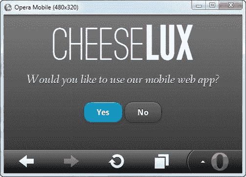
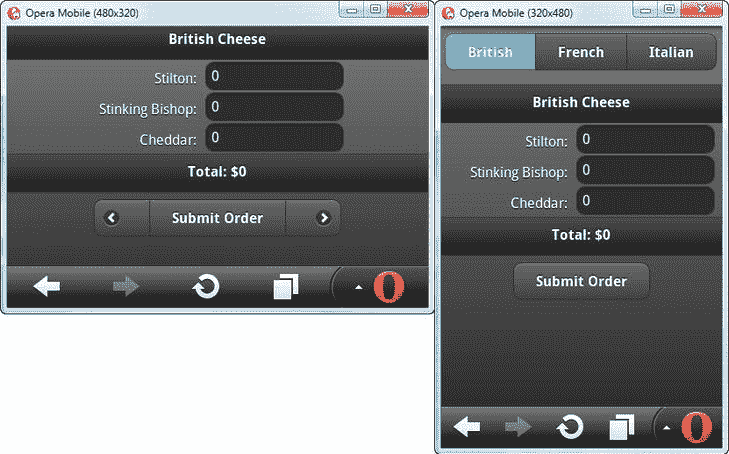

## T1】C H A P T E R 8

## 创建移动 Web 应用程序

创建适应不同设备功能的 web 应用程序的另一种方法是创建一个专门针对移动设备的版本。在响应式 web 应用和特定于移动设备的实现之间做出选择可能很困难，但我的经验是，当我想为移动和桌面用户提供完全不同的体验时，或者当在响应式实现中处理设备限制变得笨拙和过于复杂时，移动版本是有意义的。当然，你的决定将取决于你项目的具体情况，但是这一章是针对当你决定你的 web 应用程序的一个版本，不管它的响应速度有多快，都不能满足你的移动用户的需求。

### 检测移动设备

第一步是决定如何引导移动设备的用户使用 web 应用程序的移动版本。你在这个阶段做出的决定将会塑造你在构建移动网络应用时的许多假设。有两种广泛的方法，我将在下面的部分中描述。

#### 检测用户代理

传统的方法是查看浏览器用来描述自己的用户代理字符串。这可以通过`navigator.userAgent`属性获得，它返回的值可以用来标识浏览器，通常还可以用来标识浏览器运行的平台。作为一个例子，下面是 Chrome 在我的 Windows 系统上返回的`navigator.userAgent`的值:

`"Mozilla/5.0 (Windows NT 6.1; WOW64) AppleWebKit/535.7 (KHTML, like Gecko) Chrome/16.0.912.77
Safari/535.7"`

作为对比，下面是我从 Opera 移动模拟器得到的结果:

`Opera/9.80 (Windows NT 6.1; Opera Mobi/23731; U; en) Presto/2.9.201 Version/11.50"`

您可以通过构建用户代理值列表并跟踪哪些用户代理值代表移动浏览器来识别移动设备。然而，你不必自己创建和管理这些列表——网上有一些很好的信息来源。(一个名为 *WURFL* 的非常全面的数据库可以在`[http://wurfl.sourceforge.net](http://wurfl.sourceforge.net)`找到，但这需要集成到你的服务器端代码中，这对于本书来说并不理想。)

在`[http://detectmobilebrowsers.com](http://detectmobilebrowsers.com)`可以找到一个不太全面的客户端解决方案，您可以下载一个小的 jQuery 库，将用户代理与已知的移动浏览器列表进行匹配。这种方法不像 WURFL 那样完整，但它使用起来更简单，并且可以检测最广泛使用的移动浏览器。为了演示这种移动设备检测，我将 jQuery 代码下载到我的 Node.js `content`目录下的一个名为`detectmobilebrowser.js`的文件中(您可以在本书的源代码下载中找到这个文件，可以从 Apress.com 获得)。[清单 8-1](#list_8_1) 展示了如何使用这个插件来检测移动设备。

*清单 8-1。在客户端检测移动设备*

`<!DOCTYPE html>
<html>
<head>
    <title>CheeseLux</title>
    <link rel="stylesheet" type="text/css" href="styles.css"/>
        
    
    
    
    
    
    
    
**    **
    <link rel="stylesheet" type="text/css" href="jquery-ui-1.8.16.custom.css"/>
    <meta name="viewport" content="width=device-width, initial-scale=1">
        
    
    <link rel="stylesheet" type="text/css" href="jquery.mobile-1.0.1.css"/>`
`    <link rel="stylesheet" type="text/css" href="styles.mobile.css"/>
    <meta name="viewport" content="width=device-width, initial-scale=1">
    
</head>
<body>
    

                        
        
            Would you like to use our mobile web app?
        
        

            <button data-inline="true" data-theme="b" id="yes">Yes</button>
            <button data-inline="true" id="no">No</button>        
        

    

</body>
</html>`

 **提示**我很快会解释如何获得清单中提到的 CSS 和 JavaScript 文件。

该文档为用户提供了两个按钮，用户可以使用它们来选择想要使用的 web 应用程序的版本。你可以在[图 8-1](#fig_8_1) 中看到文档是如何在浏览器中显示的。

*图 8-1。询问用户他们需要哪个版本的网络应用*

这个小小的 web 应用程序给了我一个很好的例子来介绍 jQuery Mobile，这也是我将在本章中用到的。jQuery Mobile 是一个针对移动设备优化的工具包，它包括易于使用触摸进行交互的小部件，以及处理触摸事件和手势的内置支持。

jQuery Mobile 是 jQuery 主项目的“官方”移动工具包，它非常好，尽管有些布局有些粗糙，需要用少量 CSS 进行调整。还有其他基于 jQuery 的移动小部件工具包，其中一些也非常好。我之所以选择 jQuery Mobile，是因为它与 jQuery UI 有着广泛的共同方法，并且它具有一些大多数移动工具包的典型设计特征，在编写复杂的 web 应用程序时需要特别注意。

**避免伪本地移动应用**

我使用 jQuery Mobile 的另一个原因是，它不试图重新创建原生智能手机应用程序的外观，这是其他一些工具包采用的方法。我不喜欢那种方法，因为它不太管用。如果你给用户一个看起来像本地 iOS 或 Android 应用的东西，那么你需要确保它的行为完全符合本地应用应有的方式——至少在目前，这是不可能的。

最糟糕的方法是尝试只为一个平台重新创建一个本地应用程序。你经常会看到这种情况，而 web 应用开发者瞄准的通常是 iOS。如果再现是忠实的，并且所有移动设备都运行 iOS，这可能不是那么糟糕，但 Android 和其他操作系统的用户会得到一些完全陌生的东西，iOS 用户会得到一些最初看起来熟悉但后来证明令人困惑和不一致的东西。

在我看来，设计一个真正显而易见且易于使用的 web 应用要好得多。结果会更好，你的用户会更高兴，你也不必扭曲你的 web 应用程序来适应你无论如何都无法正确遵守的平台约束。

我不打算提供关于 jQuery Mobile 的冗长教程，但是为了演示如何创建一个可靠的移动 web 应用程序，我需要解释一些重要的特性。我将在接下来的章节中解释核心概念。如果你想了解更多关于 jQuery Mobile 的信息，那么请访问项目网站或者阅读我的书，这本书由 Apress 出版，包含了使用 jQuery Mobile 的完整参考。

#### 安装 jQuery Mobile

可以从`[http://jquerymobile.com](http://jquerymobile.com)`下载 jQuery Mobile。jQuery Mobile 依赖于 jQuery，将 jQuery 导入文档的`script`元素必须位于导入 jQuery Mobile 库的元素之前，如下所示:

`<head>
    <title>CheeseLux</title>
**    **
**    **
**    <link rel="stylesheet" type="text/css" href="jquery.mobile-1.0.1.css"/>**`

jQuery Mobile 依赖于自己的 CSS 和图像，这些不同于 jQuery UI 使用的 CSS 和图像。下载 jQuery Mobile 时，将 CSS 文件和 JavaScript 文件一起复制到 Node.js `content`目录，将图片和 jQuery UI 中的图片一起放入`images`目录。

#### 了解 jQuery 移动数据属性

jQuery Mobile 依靠数据属性来配置 web 应用程序的布局。数据属性允许将自定义属性应用于元素，就像我一直用于数据绑定的`data-bind`属性一样。HTML 规范中没有定义`data-bind`属性，但是任何以`data-`为前缀的属性都会被浏览器忽略，并且允许您在标记中嵌入有用的信息，然后您可以通过 JavaScript 访问这些信息。数据属性已经被非正式地使用了几年，现在是 HTML5 的正式部分。

jQuery Mobile 使用数据属性，而不是 jQuery UI 要求的以代码为中心的方法。使用`data-role`属性告诉 jQuery Mobile 应该如何处理元素——当加载文档和创建小部件时，会自动处理标记。

您并不总是需要使用`data-role`属性。对于某些元素，jQuery Mobile 将假设它需要基于元素类型创建一个小部件。文档中的按钮已经发生了这种情况:当 jQuery Mobile 在标记中找到一个`button`元素时，它将创建一个按钮小部件。所以，这个元素:

`<button data-inline="true" id="no">No</button>`

不需要一个`data-role`属性，但是如果你愿意，可以写成这样:

`<button data-role="button" data-inline="true" id="no">No</button>        `

##### 定义页面

`data-role`属性最重要的值是`page`。在构建移动 web 应用程序时，最好尽量减少对服务器的请求数量。jQuery Mobile 通过支持*单页面应用*在这方面提供了帮助，其中多个逻辑页面的标记和脚本包含在单个文档中，并根据需要显示给用户。一个页面由一个`div`元素表示，其`data-role`属性为`page`。`div`元素的内容就是该页面的内容:

`...
<body>
    

*        ...page content goes here...*

    

</body>
...`

在我的`askmobile.html`文档中只有一页，但是当我们在本章后面构建完整的移动 CheeseLux 应用程序时，我会回到页面的主题。

##### 配置小组件

jQuery Mobile 也使用数据属性来配置小部件。默认情况下，jQuery 移动按钮跨越整个页面。这使得一个大的目标在一个小的纵向屏幕上出现，但在其他布局上看起来很奇怪。为了禁用这种行为，我告诉 jQuery Mobile 我想要*内联按钮*，其中的按钮足够大，可以包含它的内容。我通过将`button`元素的`data-inline`属性设置为`true`来实现这一点，如下所示:

`<button **data-inline="true"** id="no">No</button>  `

有许多特定于元素的数据属性可用，您应该查阅 jQuery Mobile 网站以获得详细信息。然而，我将提到的一个重要的配置属性是`data-theme`，它将样式应用于它所应用的页面或小部件。一个 jQuery Mobile 主题包含许多名为`A`、`B`、`C`等的*样本*。我已经将页面元素的`data-theme`属性设置为`a`，以便为文档中的单个页面及其所有内容设置主题:

`
`

您可以使用 jQuery Mobile ThemeRoller 创建自己的自定义主题，该工具可在`jquerymobile.com`获得。我使用的是默认主题，swatch `A`为 web 应用程序提供了深色风格。作为对比，我将“是”按钮上的样本设置为`b`，如下所示:

`<button data-inline="true" **data-theme="b"** id="yes">Yes</button>`

swatch `B`中的按钮是蓝色的，这为用户提供了关于推荐决策的强烈建议。

 **提示**我已经为 jQuery Mobile 定义了一个新的 CSS 样式表。它名为`[http://styles.mobile.css](http://styles.mobile.css)`，与其他示例文件一起位于 Node.js `content`目录中。这个文件中的样式只是稍微调整了一下布局，允许我将元素放在页面的中心，并对默认的 jQuery Mobile 布局进行其他小的调整。您可以在本书的源代码下载中找到样式表，可以从 Apress.com 获得。

#### 处理 jQuery 移动事件

使用基于 jQuery 的小部件库意味着我们可以使用熟悉的技术处理事件。如果您查看`askmobile.html`文档中的`script`元素，您会发现处理按钮被点击时触发的事件需要我在本书中一直使用的相同的基本 jQuery 代码:

``

我使用 jQuery 来选择`button`元素，使用标准的`click`方法来处理`click`事件。然而，jQuery Mobile 处理事件的方式有一个非常重要的区别。这是:

`$(document)**.bind("pageinit",** function() {          
*    ...code to handle button click events...*
}`

当标准的 jQuery `ready`事件触发时，jQuery Mobile 处理数据属性的标记。这意味着如果我想在 jQuery Mobile 设置完小部件后执行代码，我必须`bind`到`pageinit`事件。没有方便的方法为这个事件指定一个函数，所以我使用了`bind`方法。本例中的代码将会非常愉快地响应 jQuery `ready`事件，因为我没有直接与 jQuery Mobile 创建的小部件交互。当我使用完整的 jQuery Mobile CheeseLux web 应用程序时，这种情况将会改变，在所有 jQuery 移动应用程序中使用`pageinit`事件是一种很好的做法。

#### 存储用户的决定

现在我已经描述了`askmobile.html`的 jQuery Mobile 部分，我们可以回到应用程序的功能，即记录和存储用户对用户想要使用的 web app 版本的偏好。如果本地存储可用，我就使用本地存储，如果本地存储不可用，我就使用普通的 cookie。使用 cookies 没有方便的 jQuery 支持，所以我编写了自己的函数`setCookie`:

`function setCookie(name, value, days) {
    var date = new Date();
    date.setTime(date.getTime()+(days * 24 * 60 * 60 *1000));
    document.cookie = name + "="+ value
        + "; expires=" + date.toGMTString() +"; path=/";            
}`

如果我必须使用 cookie，那么我将生命周期设置为 30 天，之后浏览器将删除 cookie，用户将不得不再次表达他们的偏好。为了简单起见，在使用本地存储时，我没有设置任何生存期，但是这样做将是一个很好的实践。

提示询问用户是否希望你存储他们的选择也是一个很好的做法。在我的简单示例中，我还没有采取这一步，但是有些用户对这些问题很敏感，尤其是涉及到 cookies 的时候。

#### 检测用户在网络应用中的决定

最后一步是在 CheeseLux web 应用的桌面版本中检测用户的决定。[清单 8-5](#list_8_5) 显示了我添加到`utils.js`中的一对函数来支持这个过程。

*清单 8-5。在执行重定向之前检查先前的决定*

`function checkForVersionPreference() {
    var previousDecision;
    if (localStorage && localStorage["cheeseLuxMode"]) {
        previousDecision = localStorage["cheeseLuxMode"];
    } else {
        previousDecision = getCookie("cheeseLuxMode");
    }
    if (!previousDecision && cheeseModel.device.mobile) {
        location.href = "/askmobile.html";
    } else if (location.pathname == "/mobile.html" && previousDecision == "desktop") {
        location.href = "/example.html";
    } else if (location.pathname != "/mobile.html" && previousDecision == "mobile") {        
        location.href = "/mobile.html";
    }
}

function getCookie(name) {
    var val;
    $.each(document.cookie.split(';'), function(index, elem) {
        var cookie = $.trim(elem);
        if (cookie.indexOf(name) == 0) {
            val = cookie.slice(name.length + 1);
        }
    })
    return val;
}`

`checkForVersionPreference`函数使用视图模型值来查看用户是否有移动设备，如果有，则尝试从本地存储或 cookie 中恢复先前决策的结果。cookie 很难处理，所以我添加了一个`getCookie`函数，通过名称查找 cookie 并返回其值。如果没有存储值，那么我将用户定向到`askmobile.html`文档以获得他们的偏好。如果*是*的存储值，那么我用它来切换到移动版本，如果这是用户的偏好。剩下的就是将对`checkForVersionPreference`函数的调用合并到`example.html`中，它包含了 web 应用程序的桌面版本，如下所示:

`...
detectDeviceFeatures(function(deviceConfig) {
    cheeseModel.device = deviceConfig;
**    checkForVersionPreference();**

    $.getJSON("products.json", function(data) {
        cheeseModel.products = data;

    }).success(function() {
        $(document).ready(function() {
*            ... code removed for brevity...*
        });
    });
)};
...`

我用代码片段展示了这些变化，因为我不想在关于移动设备的章节中使用 pages 来列出桌面 web 应用程序代码。您可以从 Apress.com 免费下载的源代码中获得完整的清单。

 **提示**当决策的效果被自动存储和应用时，给用户提供改变主意的机会是有意义的。我跳过了这一步，因为我想在本章中将重点放在移动应用程序上，但是您应该始终包含某种 UI 提示，允许用户切换到 web 应用程序的另一个版本，尤其是在决策被持久存储和使用的情况下。

### 构建移动网络应用

我将从 CheeseLux web 应用程序的基本移动版本开始，然后在此基础上向您展示如何为用户创造更好的体验。当我创建一个有桌面版的移动版 web 应用程序时，我有两个目标:

*   尽可能多地重用桌面代码
*   确保手机能够优雅地响应不同的设备功能

第一个目标是长期可维护性。我拥有的通用代码越多，我不得不在两个不同的地方找到并修复 bug 的情况就越少。我喜欢提前决定哪个版本的 web 应用程序是首要的，哪个版本必须灵活才能使用代码。总的来说，我倾向于首先创建桌面版本，然后让移动 web 应用程序适应。例外情况是大多数用户将使用移动设备。

**先说移动怎么样？**

有一种观点(通常称为 *mobile first* )首先关注移动平台的设计和开发，主要是因为它迫使您在最受限制的环境中工作，因为移动设备具有桌面上没有的功能，如地理定位。

在我的项目中，我不想要最初的约束——我想尽我所能构建最丰富、最深刻、最沉浸式的体验，至少目前是桌面。一旦我掌握了大屏幕和丰富互动的可能性，我就开始处理设备限制的过程，削减和定制我的应用程序，直到我得到在移动设备上运行良好的东西。我也不相信移动设备的独特功能。正如我在第 7 章中提到的，设备类别之间的硬性区别正在迅速消失。我最近感到惊讶的一个时刻是，谷歌能够使用其街景产品收集的 Wi-Fi 数据，在几英尺内精确定位我的位置。这是在一台需要叉车移动的机器上。

但是，正如我前面提到的，我不是模式狂热者，您应该遵循对您和您的项目最有意义的方法。不要让任何人支配你的开发风格，包括我。

第二个目标是确保我的移动 web 应用程序能够响应和适应用户可能拥有的各种设备类型。即使只针对移动设备，你也不能对屏幕尺寸和输入机制做出假设。

 **注意**您可能会尝试创建一个 web 应用程序，根据正在使用的设备类型在 jQuery UI 和 jQuery Mobile(或等效的库)之间切换。这样的技巧是可能的，但要在不创建大量扭曲的代码和标记的情况下实现却非常困难。如果您想利用特定于某个库的特性，最明智的方法是创建单独的版本。

为了让事情进展顺利，[清单 8-6](#list_8_6) 展示了使用 jQuery Mobile 创建核心功能的第一步。这个清单依赖于视图模型中的一些变化，我将很快解释这些变化。

*清单 8-6。CheeseLux 移动网络应用的初始版本*

`<!DOCTYPE html>
<html>
<head>
    <title>CheeseLux</title>
    
    
    
    <link rel="stylesheet" type="text/css" href="jquery.mobile-1.0.1.css"/>
    <link rel="stylesheet" type="text/css" href="styles.mobile.css"/>
    
    
    
    
    
    
    <meta name="viewport" content="width=device-width, initial-scale=1">
    
</head>
<body>
    

        

            
            Gourmet European Cheese
        

        <fieldset class="middle" data-role="controlgroup" data-type="horizontal"
            data-bind="foreach:products, visible: device.largeScreen() ||
                device.smallAndPortrait()">
            <input type="radio" name="category" data-bind="attr: {id: category,
                value: category}, checked: $root.selectedCategory" />
            <label data-bind="attr: {for: category}">
                
            </label>
        </fieldset>

        <form action="/basket" method="post">
            

                

                    

                        <h1 data-bind="text: category"></h1>
                    

                    <!-- ko foreach: items -->
                    

                        

                            <label data-bind="attr: {for: id}, formatText: {value: name,
                                suffix:':'}"></label>
                        

                        

                            <input data-bind="attr: {name: id}, value: quantity">
                        

                    

                    <!-- /ko -->
                    

                         <h1>
                             <label>Total:</label>
                             
                     

                

            

            
`
`                <button id="left" data-icon="arrow-l">&nbsp;</button>
                <input type="submit" value="Submit Order"/>
                <button id="right" data-icon="arrow-r"
                        data-iconpos="right">&nbsp;</button>
            

            

                <input type="submit" value="Submit Order"/>
            

        </form>            
    

</body>
</html>`

在很大程度上，这是一个简单的 web 应用程序，依赖于 jQuery Mobile 的核心功能，但是您需要注意一些我在下面几节中描述的细节和附加内容。你可以在[图 8-2](#fig_8_2) 中看到小屏幕设备的横向和纵向布局。该 web 应用程序还支持大屏幕移动设备的布局。我没有展示这些布局，但它们与图中所示的布局相似，只是在导航按钮中显示了 CheeseLux 徽标和完整的类别名称。

*图 8-2。移动 CheeseLux web 应用程序的基本实现*

您将注意到清单中新的数据绑定和视图模型项。`formatText`数据绑定允许我对元素的文本内容应用前缀和后缀，这简化了组合字符串的处理，尤其是货币金额。这是我通常添加到项目和代码中的一组自定义绑定之一，包含在`utils.js`文件中，如[清单 8-7](#list_8_7) 所示。这个绑定使用的`composeString`函数与我在第 4 章中介绍自定义`formatAttr`绑定时展示的函数相同。

*清单 8-7。formatText 自定义数据绑定*

`ko.bindingHandlers.formatText = {
    update: function(element, accessor) {      
        $(element).text(composeString(accessor()));
    }
}`

其他新增内容是添加到视图模型中设备功能信息的一些有用的快捷方式。虽然 KO 可以处理数据绑定中的表达式，但我不喜欢用这种方式定义代码，我一般会创建计算数据项，允许我通过单个视图模型项来确定设备的状态。在这一章中，我定义了一对计算值，让我可以轻松地读取我对移动 web 应用程序感兴趣的屏幕大小和方向的组合。这些快捷方式在`utils.js`文件的`detectDeviceFeatures`函数中定义，如[清单 8-8](#list_8_8) 所示。

*清单 8-8。在视图模型中创建快捷方式以避免绑定中的表达式*

`...
function detectDeviceFeatures(callback) {
    var deviceConfig = {};

    deviceConfig.landscape = ko.observable();
    deviceConfig.portrait = ko.computed(function() {
        return !deviceConfig.landscape();
    });    

    var setOrientation = function() {
        deviceConfig.landscape(window.innerWidth > window.innerHeight);
    }
    setOrientation();

    $(window).bind("orientationchange resize", function() {
        setOrientation();
    });

    setInterval(setOrientation, 500);

    if (window.matchMedia) {
        var orientQuery = window.matchMedia('screen AND (orientation:landscape)')
        if (orientQuery.addListener) {
            orientQuery.addListener(setOrientation);
        }
    }`

`    Modernizr.load([{
        test: window.matchMedia,
        nope: 'matchMedia.js',
        complete: function() {          
            var screenQuery = window.matchMedia('screen AND (max-width: 500px)');
            deviceConfig.smallScreen = ko.observable(screenQuery.matches);                          
            if (screenQuery.addListener) {
                screenQuery.addListener(function(mq) {              
                    deviceConfig.smallScreen(mq.matches);
                });
            }
            deviceConfig.largeScreen = ko.computed(function() {
                return !deviceConfig.smallScreen();
            });

            setInterval(function() {
                deviceConfig.smallScreen(window.innerWidth <= 500);
            }, 500);
        }
    }, {
        test: Modernizr.touch,
        yep: 'jquery.touchSwipe-1.2.5.js',    
        callback: function() {            
            $('html').swipe({
                swipeLeft: advanceCategory,
                swipeRight: advanceCategory
            })
        }
    },{
        complete: function() {
            deviceConfig.mobile = Modernizr.touch && deviceConfig.smallScreen();

**            deviceConfig.smallAndLandscape = ko.computed(function() {**
**                return deviceConfig.smallScreen() && deviceConfig.landscape();**
**            });**
**            deviceConfig.smallAndPortrait = ko.computed(function() {**
**                return deviceConfig.smallScreen() && deviceConfig.portrait();**
**            });**

            callback(deviceConfig);
        }
    }]);
};
...`

#### 管理事件序列

正如我在`askmobile.html`文档中演示的，jQuery Mobile 将自动处理文档，并基于元素类型和`data-role`属性的值创建小部件。这是一个很好的特性，它显著减少了简单 web 应用程序所需的代码量。不幸的是，当您使用视图模型生成或格式化元素时，它会碍事，尤其是如果视图模型中的数据是通过 Ajax 获得的。jQuery Mobile 将在用数据绑定填充视图模型之前处理文档，这意味着不能正确创建小部件。

这是我以前在 jQuery UI 中遇到的同样的问题，但是在 jQuery Mobile 中这个问题更严重，因为它假设它对页面中的元素拥有唯一的控制权，并且很难创建绑定来协商 jQuery Mobile 在设置小部件时使用的额外元素。(这是一个问题，我将在本章后面的不同原因中再次讨论。)

##### 禁用自动处理

最好的方法是阻止 jQuery Mobile 自动处理文档。为此，我需要处理`mobileinit`事件，该事件由 jQuery Mobile 在库首次加载时发出。我需要在加载 jQuery Mobile 之前注册我的处理函数，这意味着我必须在导入 jQuery 的元素之后和导入 jQuery Mobile 的元素之前插入一个新的`script`元素，如下所示:

`...
<sript src="jquery-1.7.1.js" type="text/javascript"></script>
****

...`

通过将`$.mobile.autoInitializePage`属性设置为`false`，我禁用了自动处理文档中标记的 jQuery Mobile 特性。

 **提示**公平地说，只有当我想使用`bind`方法时，我才需要在 jQuery 后插入我的`script`元素，但是我更喜欢这样做，而不是使用笨重的 DOM API 来处理事件。

禁用自动处理停止了视图模型和 jQuery Mobile 之间的竞争，并允许我发出 Ajax 请求、填充视图模型和完成任何其他任务，而不用担心过早创建小部件。当我完成设置时，我明确地告诉 jQuery Mobile 它应该处理页面，就像这样:

`$.getJSON("products.json", function(data) {                        
    cheeseModel.products = data;
    enhanceViewModel();

    $(document).ready(function() {
        ko.applyBindings(cheeseModel);
        $('button#left, button#right').live("click", function(e) {
            e.preventDefault();    
            advanceCategory(e, e.target.id);`
`        })
**        $.mobile.initializePage();**
    });
});`

`mobile`对象提供对 jQuery Mobile API 的访问，`initializePage`方法启动页面处理。

##### 响应 pageinit 事件

现在我已经控制了主要事件，在 jQuery Mobile 处理完文档中的页面后，我可以使用`pageinit`来执行任务。jQuery Mobile 通常非常可靠，但是它有一些布局上的怪癖。一个特别的问题是按钮组不在页面的中心。对于页面底部的按钮，我已经能够用 CSS 解决这个问题(这就是`centered`样式在`styles.mobile.css`文件中的作用)。但是导航按钮的大小会改变，这需要一个 JavaScript 解决方案，如下所示:

`...
$(document).bind("**pageinit**", function() {
    function positionCategoryButtons() {
        setTimeout(function() {
            $('fieldset:visible').each(function(index, elem) {
                var fsWidth = 0;    
                $(elem).children().each(function(index, child) {
                    fsWidth+= $(child).width();
                });
                if (fsWidth > 0) {
                    $(elem).width(fsWidth);
                } else {                            
                    positionCategoryButtons();
                }
            });
        }, 10);
    };
    positionCategoryButtons();
    cheeseModel.device.smallAndPortrait.subscribe(positionCategoryButtons);
});
...`

我想在 jQuery Mobile 完成创建后将按钮居中，这是对`pageinit`事件的理想使用。在函数中，我将每个`fieldset`元素的子元素的宽度相加，然后使用总值来设置`fieldset`的宽度。jQuery Mobile 将`fieldset`设为窗口的宽度，创建一组按钮所需的元素序列使得很难通过其他方式将按钮居中。

 **提示**我使用 jQuery `each`方法，这样我可以确保`children`方法只返回一个`fieldset`元素的子元素。这意味着如果我稍后添加另一个`fieldset`元素，我的代码不会中断。元素选择器是贪婪的，如果我只是调用`$('fieldset').children()`，我将得到文档中所有`fieldset`元素的子元素，这将抛出宽度计算。

我将设置宽度的代码放在了对`setTimeout`函数的调用中，因为当导航按钮的内容改变时，我希望正确地调整`fieldset`元素的大小，当大小和方向改变时就会发生这种情况。

元素的内容通过数据绑定来改变，数据绑定在视图模型中可观察的数据项被更新时执行。因为我使用了`subscribe`方法来接收相同类型的通知，所以我需要确保在按钮内容改变之前不会执行我的代码来调整`fieldset`的大小，这是通过使用`setTimeout`函数引入一个小延迟来实现的。

#### 为内容变更做准备

jQuery Mobile 假设它能够控制作为小部件基础的元素。对于按钮，jQuery Mobile 将`button`内容(或者使用单选按钮时的`label`内容)包装在一个`span`元素中，以便应用样式。

这是 jQuery UI 造成的同样的问题，jQuery Mobile 的解决方案也是一样的:自己将内容包装在一个`span`元素中，这样就有了数据绑定的目标。一旦有了可以附加数据绑定的元素，就不需要担心 jQuery Mobile 如何将元素转换成小部件。您可以看到我是如何为导航按钮做这些的:

`<fieldset class="middle" data-role="controlgroup" data-type="horizontal"
    data-bind="foreach:products, visible: device.largeScreen() ||
        device.smallAndPortrait()">
    <input type="radio" name="category" data-bind="attr: {id: category,
        value: category}, checked: $root.selectedCategory" />
    <label data-bind="attr: {for: category}">
**        **
    </label>
</fieldset>`

这看起来似乎是一个简单的技巧，但是许多移动 web 应用程序程序员被这个问题所困扰，并最终试图通过一些痛苦而不可靠的替代方法来解决它。这个简单的方法相当巧妙地解决了这个问题。我使用过的所有移动小部件工具包都以类似的方式与数据绑定发生冲突。在 jQuery Mobile 的例子中，你知道当数据绑定改变按钮内容时，按钮的格式丢失，问题就发生了，如图 8-3 所示。

*图 8-3。jQuery Mobile 添加样式元素引起的问题*

### 复制元素和使用模板

并不是所有小部件库和数据绑定之间的冲突都能这么容易解决。在[清单 8-6](#list_8_6) 中，我创建了显示在页面底部的按钮的副本，如下所示:

`

    <button id="left" data-icon="arrow-l">&nbsp;</button>
    <input type="submit" value="Submit Order"/>
    <button id="right" data-icon="arrow-r"
            data-iconpos="right">&nbsp;</button>

    <input type="submit" value="Submit Order"/>

`

一组有额外的按钮，用户可以点击这些按钮来浏览产品类别。我正在解决的问题是，jQuery Mobile 创建了一组按钮，却没有考虑到它所处理的元素的可见性。这意味着即使外部按钮是不可见的，它们也会被赋予圆角，这意味着使用`visible`绑定不会创建格式良好的按钮组。

`if`绑定有它自己的问题，因为当新元素添加到容器中时，jQuery Mobile 不会自动更新按钮的样式，而让 jQuery Mobile 刷新内容并不能解决这个问题。因此，最简单的方法是创建重复的元素集。

#### 使用两遍数据绑定

对于简单的情况，复制元素是可以的，但是当您处理具有大量绑定和格式的复杂元素集时，这就成问题了。在某些情况下，一个更改将应用于一组元素，而不是另一组。当这种问题发生时，跟踪它是非常耗时的。另一种方法是从单个模板生成重复的元素集。这是一种优雅但复杂的技术——你可以在清单 8-9 中看到所需的变化。

*清单 8-9。使用模板创建重复的元素集*

`<!DOCTYPE html>
<html>
<head>
    <title>CheeseLux</title>
    `
`    
    
    <link rel="stylesheet" type="text/css" href="jquery.mobile-1.0.1.css"/>
    <link rel="stylesheet" type="text/css" href="styles.mobile.css"/>
    
    
    
    
    
    
    <meta name="viewport" content="width=device-width, initial-scale=1">
    
**    **
</head>
<body>
    

        

            
            Gourmet European Cheese
        

        <fieldset class="middle" data-role="controlgroup" data-type="horizontal"
            data-bind="foreach:products, visible: device.largeScreen() ||
                device.smallAndPortrait()">
            <input type="radio" name="category" data-bind="attr: {id: category,
                value: category}, checked: $root.selectedCategory" />
            <label data-bind="attr: {for: category}">
                
            </label>
        </fieldset>

        <form action="/basket" method="post">
            

                

                    

                        <h1 data-bind="text: category"></h1>
                    

                    <!-- ko foreach: items -->
                    

                        

                            <label data-bind="attr: {for: id}, formatText: {value: name,`
`                                suffix:':'}"></label>
                        

                        

                            <input data-bind="attr: {name: id}, value: quantity">
                        

                    

                    <!-- /ko -->
                    

                         <h1>
                             <label>Total:</label>
                             
                     

                

            

**            <!-- ko template: {name: 'buttonsTemplate', foreach: [true, false] } -->**
**            <!-- /ko -->**
        </form>            
    

</body>
</html>`

这项技术有三个部分，为了展示这些部分是如何组合在一起的，我需要按照它们在文档中出现的相反顺序来解释它们。

##### 使用自定义数据调用模板

我已经使用了模板绑定来从 Knockout.js 模板生成元素，我在第 3 章中描述了这种技术:

`<!-- ko template: {name: 'buttonsTemplate', **foreach: [true, false]** } -->
<!-- /ko -->`

奇怪的是，我没有使用视图模型来驱动模板。相反，我创建了一个包含`true`或`false`值的数组。我在一个非常简单的情况下应用了这种技术，我只需要知道我创建的是允许类别导航的按钮集(由`true`值表示)还是不允许的按钮集(由`false`值表示)。重点是您可以对不属于视图模型的数据使用`foreach`绑定。您可以对更复杂的元素集使用更复杂的数据结构。

##### 使用模板生成绑定

第二步有点奇怪。我使用`attr`数据绑定来设置模板生成的元素的`data-bind`属性值，如下所示:

`    `

该模板最简单的部分是使用`if`绑定来确定何时应该生成类别导航按钮。我的模板将被使用两次:一次用于我传递给`foreach`绑定的`true`和`false`值。当值为`true`时，按钮元素包含在 DOM 中，当值为`false`时，它们被省略。

更复杂的部分是我使用了`attr`绑定来为模板生成的元素中的`data-bind`属性指定一个值。下面是模板中`data-bind`属性的值:

`data-bind="attr: {'data-bind': 'visible: ' + ($data ? '' : '!') +  
    'device.smallAndLandscape()'}"`

在这个绑定中发生了很多事情。需要理解的最重要的一点是，我指定了我希望生成的元素作为一个字符串的`data-bind`值，这个字符串目前不会被处理。我将很快回到处理过程。

我使用`$data`来引用我在调用模板时传递给`foreach`绑定的值。`$data`的值将是`true`或`false`。首先，Knockout 将解析绑定的这一部分，因此当我处理`true`值时，生成的`div`元素将具有如下绑定:

`data-bind="attr: {'data-bind': 'visible: device.smallAndLandscape()'}"`

而`false`值将导致这样的绑定:

`data-bind="attr: {'data-bind': 'visible: !device.smallAndLandscape()'}"`

然后，一旦数据值被解析，Knockout 将处理整个`attr`绑定，这相当简洁地在生成的元素中替换了它自己，就像这样:

`data-bind="visible: device.smallAndLandscape()"`

##### 重新应用数据绑定

Knockout 只处理一次数据绑定属性，这意味着我的模板生成带有我想要的数据绑定的元素，但是这些绑定不是活动的。视图模型中的变化不会影响它们，因为当我调用`ko.applyBindings`方法时，还没有定义`data-bind`属性。

为了解决这个问题，我简单地再次调用`applyBindings`,但是这一次我使用了可选的参数，该参数允许我指定处理哪些元素:

`$(document).ready(function() {
    ko.applyBindings(cheeseModel);
    **$('*.deferred').each(function(index, elem) {**
**        ko.applyBindings(cheeseModel, elem);**
**    });**
    $('button#left, button#right').live("click", function(e) {`
`        e.preventDefault();    
        advanceCategory(e, e.target.id);
    })
    $.mobile.initializePage();
});            `

我将按钮容器元素添加到了`deferred`类中。我现在选择这个类的所有成员，并使用`each`方法依次调用每个元素的`applyBindings`方法。这使得 Knockout.js 处理我从模板生成的绑定，并使它们生效。这最后一步意味着我的绑定将响应视图模型中的变化。

关于这项技术有几点需要注意。首先，我并没有试图阻止 DOM 中元素的重复。如果没有重复的元素集，就没有简单的方法来处理 jQuery Mobile 格式问题。我的目标是从一组源元素中生成副本，这样我就可以在一个地方进行更改，并在生成副本时使它们在所有副本中生效。

其次，当使用这种技术时，您必须确保除了在一对引号字符内(即，在一个字符串内)之外，不引用视图模型项。如果你引用了一个字符串之外的变量，那么 Kockout.js 会尝试寻找一个值来解析引用，你会得到一个错误。视图模型值在第二次调用`applyBindings`方法时被解析，而不是在使用模板创建元素时被解析。

 **注意**正确设置字符串可能很困难，但是对于复杂的元素集合来说，这种努力是值得的。对于更简单的情况，我建议您简单地在文档中复制您需要的内容，并完全跳过模板。本书的源代码下载包含了这个例子的完整清单。

### 采用多页模式

我的移动 web 应用正在成形，但我仍然缺少 URL 路由，这意味着移动和桌面版本之间存在显著差异。添加路由支持的第一步是采用多页面模型。正如我前面解释的，jQuery Mobile 支持在一个 HTML 文档中包含多个页面的想法。我将使用这个特性为用户提供在类别之间导航的方法。清单 8-10 显示了所需的变更。

*清单 8-10。添加对多页面模型的支持*

`<!DOCTYPE html>
<html>
<head>
    <title>CheeseLux</title>
    
    
    `
`    <link rel="stylesheet" type="text/css" href="jquery.mobile-1.0.1.css"/>
    <link rel="stylesheet" type="text/css" href="styles.mobile.css"/>
    
    
    
    
    
    
    <meta name="viewport" content="width=device-width, initial-scale=1">
    
        
</head>
<body>
    <!-- ko foreach: products -->
**        
**
            

                
                Gourmet European Cheese
            
                              

**            <fieldset class="middle" data-role="controlgroup" data-type="horizontal"**
**                      data-bind="foreach: $root.products,**
**                        visible: $root.device.largeScreen() ||**
**                            $root.device.smallAndPortrait()">**
**                <a data-role="button" data-bind="formatAttr: {attr: 'href',**
**                    prefix: '#', value: shortName},**
**                    css: {'ui-btn-active': (category == $root.selectedCategory())}">**
**                    **
**                </a>**
**            </fieldset>**

            <form action="/basket" method="post">
                

                    

                        

                            <h1 data-bind="text: category"></h1>
                        

                        <!-- ko foreach: items -->
                        

                            
`
`                                <label data-bind="attr: {for: id},
                                    formatText: {value: name, suffix:':'}">
                                </label>
                            

                            

                                <input data-bind="attr: {name: id}, value: quantity">
                            

                        

                        <!-- /ko -->
                        

                             <h1>
                                 <label>Total:</label>
                                 
                         

                    

                

                <!-- ko template: {name: 'buttonsTemplate', foreach: [true, false] } -->
                <!-- /ko -->
            </form>            
        
        
    <!-- /ko -->
</body>
</html>`

我已经强调了最重要的变化(稍后我会描述它们)，但是基本的方法是为每个类别创建一个页面。每个页面都包含一组重复的导航项目，只有个别产品的详细信息不同。在大多数情况下，对数据绑定的更改会产生这种效果。然而，有些变化需要更多的解释。

#### 返工类别导航

jQuery Mobile 使用我在桌面版本中使用的基于 URL 片段的方法在页面之间导航。例如，如果有一个`div`元素，其`data-role`属性被设置为`page`，其`id`属性被设置为`mypage`，我可以通过导航到`#mypage`片段让 jQuery Mobile 显示该页面。

与桌面 web 应用程序的不同之处在于，jQuery Mobile 对可用于页面的名称进行了一些限制。我以前使用完整的类别名称(例如`British Cheese`)，但是空格对于 jQuery Mobile 来说是个问题，所以我使用了简短的类别名称(例如`British`)。下面是设置页面 ID 的绑定:

`
`

注意，我添加了一个包含完整类别名称的`data-category`属性。我将很快回到这个属性。

#### 用锚点替换单选按钮

页面导航模型意味着我可以用`a`元素替换我的单选按钮。如果`data-role`属性设置为`button`，jQuery Mobile 将从`a`元素创建按钮小部件，并且`href`属性的值可用于文档内的导航:

`<a data-role="button" data-bind="formatAttr: {attr: 'href',
    prefix: '#', value: shortName},
    css: {'ui-btn-active': (category == $root.selectedCategory())}">
    
</a>                `

当数据绑定被解析后，我得到了一个导航元素，它的用途更容易理解:

`<a data-role="button" href="#British"
    British
</a>                `

单击 jQuery Mobile 从这种元素创建的按钮之一，将导航到适当的类别页面。作为一个额外的好处，jQuery Mobile 正确地将从`a`元素创建的按钮组居中，所以我不必担心显式设置包含`fieldset`元素的宽度。

 **提示**请注意，我已经使用了`css`绑定来将`ui-btn-active`类应用到按钮，当选择的类别与按钮代表的类别匹配时。这是一个 jQuery Mobile CSS 类，当一个按钮处于活动状态时使用，应用这个类创建蓝色突出显示，这是我在以前版本的移动 web 应用程序中使用的。在工具包 CSS 中挖掘并不理想，但有时别无选择。

#### 将页面名称映射到路线

为了能够重用我的 JavaScript 代码来处理路由，我希望使用与桌面版本相同的路由名称。这是一个问题，因为 jQuery Mobile 对页面名称进行了限制。为了解决这个问题，我添加了一个路由，它映射了 jQuery Mobile 需要的路由和我真正想要的路由:

`...
hasher.initialized.add(crossroads.parse, crossroads);
hasher.changed.add(crossroads.parse, crossroads);
hasher.init();    
crossroads.addRoute("category/:newCat:", function(newCat) {                
    cheeseModel.selectedCategory(newCat ||
        cheeseModel.products[0].category);
});

**crossroads.addRoute("{shortCat}", function(shortCat) {**`
`**    $.each(cheeseModel.products, function(index, item) {**
**        if (item.shortName == shortCat) {**
**            crossroads.parse("category/" + item.category);**
**        }**
**    });**
**});**
crossroads.parse(location.hash.slice(1));
...`

当用户点击其中一个`a`元素导航到一个新的类别时，URL 片段会改变。哈希库检测到这一变化，并将新的哈希传递给 crossroads 路由引擎。jQuery Mobile URL 与突出显示的路线匹配，我在视图模型中枚举产品，以找到具有匹配的`shortName`值的产品。我使用产品的`category`属性创建桌面版本使用的 URL 类型，并调用`crossroads.parse`方法使其与应用程序路由相匹配。这项技术允许我在 jQuery Mobile URLs 和我想要的路由之间建立桥梁，允许我在 web 应用程序的所有版本中保持路由的一致性。对于我的简单示例 routes 来说，这没什么大不了的，但是如果您有一个外部 JavaScript 文件，其中充满了在 URL 匹配时执行的 JavaScript 代码，这就变成了一个有用的技巧。

#### 明确地改变页面

最后一个变化与我添加到页面`div`元素的`data-category`属性有关。当用户滑动屏幕或使用一个横向导航按钮时，调用`advanceCategory`函数，视图模型中的`selectedCategory`项的值被更新。但是，更新视图模型不会自动导致 jQuery Mobile 导航到所选类别的页面。为了解决这个问题，我添加了一个对`mobile.changePage`方法的调用。该方法将接受一个要导航到的 URL 或一个 jQuery 对象作为要显示的元素:

`$('button.left, button.right').live("click", function(e) {

    e.preventDefault();
    advanceCategory(e, $(e.target).hasClass("left") ? "left" : "right");
**    $.mobile.changePage($('div[data-category="'**
**        + cheeseModel.selectedCategory() + '"]'));**
})`

我使用`data-category`项为新的`selectedCategory`值选择页面元素，而不必遍历产品。通过这个小小的添加，我可以依赖于我在 web 应用的桌面版本中使用的相同的`advanceCategory`代码，但是获得了 jQuery 移动页面模型的好处。

### 添加最后的铬合金

我想对 CheeseLux 移动应用程序做最后一个更改。在某种程度上，这完全是一个微不足道的变化，但是它也允许我演示 jQuery Mobile 显示的一个重要的行为怪癖。

当显示新页面时，jQuery Mobile 会播放滑动动画。默认情况下，页面从右侧滑入。我想做的更改是，当用户按下左侧横向导航按钮或按下当前类别之前视图模型中出现的类别的纵向/大屏幕按钮时，新页面从左侧滑入。

jQuery Mobile `changePage`方法接受一个可选的配置对象。jQuery Mobile 识别的对象属性之一是`reverse`。当该属性的值为`true`时，页面从左侧显示。默认值`false`使新页面从右侧出现。

对于纵向导航按钮，我在`utils.js`中添加了一个名为`getIndexOfCategory`的功能。该函数如[清单 8-11](#list_8_11) 所示，枚举视图模型数据，以找到指定完整或简短类别名称的索引。

*清单 8-11。getIndexOfCategory 函数*

`function getIndexOfCategory(category) {
    var result = -1;
    for (var i = 0; i < cheeseModel.products.length; i++) {
        if (cheeseModel.products[i].category == category ||
                cheeseModel.products[i].shortName == category) {
            result = i;
            break;
        }
    }
    return result;
}`

[清单 8-12](#list_8_12) 显示了`mobile.html`中使用该功能的变化。

*清单 8-12。管理页面过渡动画方向*

``

我只需要给`changePage`方法提供可选参数，让水平按钮工作。对于`a`元素，我决定处理`click`事件，找出过渡方向，直接调用`changePage`方法。在 jQuery Mobile 中还有其他方法可以做到这一点，但这是最简单、最直接的方法。

我想展示的重要 jQuery Mobile 特性与内部 URL 的管理方式有关。如果您使用`changePage`方法导航到表示文档中第一页的 URL，jQuery Mobile 将导航到整个文档的 URL，而不是特定页面。例如，如果您呼叫`changePage('#British')`，jQuery Mobile 将导航到`cheeselux.com/mobile.html`，而不是`cheeselux.com/mobile.html#British`。

为此，我需要更改 jQuery Mobile 友好片段 URL 与桌面版 web 应用程序共享的路由之间的映射，如下所示:

`crossroads.addRoute("**:shortCat:**", function(shortCat) {
    $.each(cheeseModel.products, function(index, item) {
        if (item.shortName == (**shortCat || cheeseModel.products[0].shortName)**) {                              
                crossroads.parse("category/" + item.category);
        }
    });                        
});`

我使段可选，而不是可变的(我在[第 4 章](04.html)中解释了区别)，如果 URL 中没有提供类别名称，我假设应该使用视图模型中的第一个类别。对于我的 web 应用程序来说，这是一个简单的更改，但如果您正在绘制复杂的路径集，则必须确保您为所有预期的路径段设置了默认值，这些路径段通常由桌面版本提供。

### 总结

在这一章中，我为我的 CheeseLux web 应用程序创建了一个可靠的移动实现。我向您展示了采用您正在使用的移动工具包提供的导航模型的重要性，以及集成专业级 web 应用程序的核心功能的各种方法，例如路由、视图模型和数据绑定。移动小部件工具包通常需要一些调整和技巧才能很好地与专业 web 应用程序配合，但结果是值得找出解决出现的问题的方法。在下一章中，我将向您展示不同的技术来改进您编写和打包 JavaScript 代码的方式。