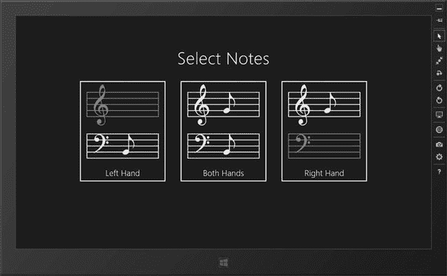
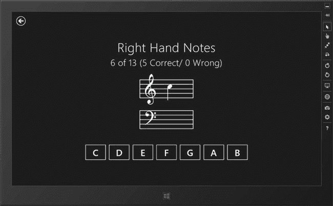
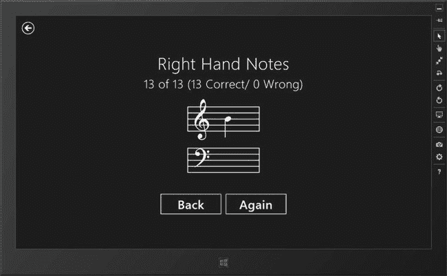
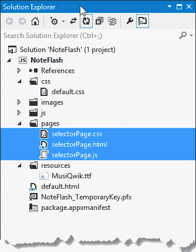

# 三、您的第一款 Windows 8 应用

在这一章，我将开始使用 JavaScript 和 HTML 构建一个真正的应用。这不是一个特别复杂的应用，但它演示了许多你需要理解的基本技术，并为后面的章节奠定了基础。

示例应用名为`NoteFlash,`，是我为自己使用而构建的。我最近开始学习弹钢琴，这个过程的一部分是学习读谱。我一直很难根据音符的位置来识别它们，所以我创建了一个小应用，就像一副闪存卡一样工作。这种方法效果很好——我一天要看几次音符，我开始越来越擅长看谱了。(如果有一种基于软件的技术可以用来提高我的实际演奏水平，我就会一路领先到卡内基音乐厅。)

除了向你介绍 Windows 8 的世界，`NoteFlash`应用还将展示你现有的 HTML 和 JavaScript 知识在 Windows 8 中有多少用处。当然，我会教你专门针对 Windows 8 应用的技能和技术，但是当你经历创建`NoteFlash`应用的过程时，你会看到基本的 Windows 应用与基本的 web 应用有多少共同之处。

在这一章中，我将构建应用的基本功能，然后我将在第 4 章中添加一些润色和介绍一些附加功能。在这个过程中，我还将使用一些特定于应用的特性，我将在本书的后面深入讨论这些特性。

### 了解应用结构

如果你知道最终产品是什么样的，那么创建`NoteFlash`应用的过程会更有意义。该应用有两个页面。第一个允许用户选择她想要测试的一组音符，如图 3-1 所示。选项将在左侧音符、右侧音符或两者上进行测试。

***图 3-1。**笔记选择页面*

用户点击图中所示的三个按钮中的一个，显示第二页，如图[图 3-2](#fig_3_2) 所示。每个音符都显示在五线谱上，用户按下按钮来识别音符。在[图 3-2](#fig_3_2) 中显示的音符是一个`C`，例如，用户可以按下`C`按钮。

***图 3-2。**闪存卡页面*

当用户看到所有的注释时，页面布局会改变。笔记名称按钮被几个导航按钮取代，如图[图 3-3](#fig_3_3) 所示。`Again`按钮测试用户对同一音符的选择，`Back`按钮返回选择页面。

***图 3-3。**向用户呈现导航控件*

正如我所说，这是一个简单的应用。在接下来的小节中，我将带您完成我用来创建它的过程。同时，我将介绍一些关键的 Windows 8 概念，如导航、异常处理和数据绑定。我会在[第 4 章](04.html)给你演示如何完成 app。

### 重温示例应用项目

我将使用的 Visual Studio 项目是我在第 2 章中创建的项目。这个项目是使用项目名`NoteFlash`从`Blank App`模板生成的，并且只包含 Visual Studio 默认添加的默认 HTML、JavaScript 和 CSS 文件。我在这个项目中做了两处修改:我在`default.html`文件的 HTML 元素中添加了一个 id 属性，在`default.js`文件中添加了一个`for`循环和`debugger`关键字。我将很快更改这两个文件的内容，替换这些添加的内容。

### 创建导航基础设施

从展示成品的图中可以看出，`NoteFlash`应用有几个不同的内容页面向用户显示。大多数 Windows 应用依赖于单页导航的 T2 模式，类似于许多网络应用所采用的方法。

在这个模型中，运行时加载一个 HTML 母版页，然后根据需要将其他页面的内容插入到母版页中。对于`NoteFlash` app，我的母版页会是`default.html`(项目创建时 Visual Studio 生成的那个)。你可以在[清单 3-1](#list_3_1) 中看到`default.html`的内容，这里我对前一章做了一个小改动。

**了解不同的内容模型**

为了避免混淆，在描述 Windows 应用时使用正确的术语非常重要。大多数应用都有多个页面，这些页面使用母版页作为内容容器来显示，这被称为*单页内容模型*。这样做的好处是，无论显示什么内容，都可以保留应用的状态，这使得编写应用的 JavaScript 部分变得更加容易。这种方法的缺点是 HTML 标记和 CSS 可能会更复杂，因为您必须确保不会无意中创建一个样式，例如，该样式的范围太广，会影响其他内容文件中包含的元素。

另一种方法是将所有内容文件完全分开，包含在单独的 HTML、JavaScript 和 CSS 文件中。这种方法被称为*多页面模型*，它使创建应用的 HTML 和 CSS 部分变得更加容易，但也使 JavaScript 变得更加复杂，因为每次加载一页内容并显示给用户时，应用的状态都会重置。

最后一个变化是单页应用。这是一个非常简单的应用，它只包含一页内容，通常是`default.html`文件。不需要加载其他内容，也不需要担心应用状态。我在本书的一些章节中使用单页应用进行简单的演示和小助手应用。

在很大程度上，单页内容模型是最有用的方法。在创建 HTML，尤其是 CSS 时，它需要一些小心，但它使 JavaScript 变得更简单，而且——正如您将了解到的——Windows 应用的复杂性通常在于代码，而不是样式或标记。在第 5 章中，我将回到单页内容模型，以及使其更容易使用的 API 特性。

***清单 3-1** 。default.html 的内容*

`<!DOCTYPE html>
<html>
<head>
    <meta charset="utf-8" />
    <title>NoteFlash</title>

    <!-- WinJS references -->
    <link href="//Microsoft.WinJS.1.0/css/ui-dark.css" rel="stylesheet" />
    
    

    <!-- NoteFlash references -->
    <link href="/css/default.css" rel="stylesheet" />
    
</head>
<body>
**    

**
</body>
</html>`

我用一个 div 元素替换了 Visual Studio 添加到`default.html`中的`p`元素(我在[第二章](02.html)中为其添加了一个`id`属性)，该 div 元素的`id`属性值为`pageFrame`。这个元素将是我在单页模型中导入内容的容器，允许我向用户显示不同的内容。

 **提示**应用的初始页面不必如此简单——你可以将本地元素与其他页面的元素以任何适合你的应用的组合混合在一起。我倾向于将这个页面用于整个应用中的通用内容，当我添加一个名为 *AppBar* 的 Windows 8 专用控件时，你会在[第 7 章](07.html)中看到。

#### 定义代码

正如我在《T4》第二章中解释的，Visual Studio 在创建新项目时会创建`js/default.js`文件，并在`default.html`文件中添加一个`script`元素，以确保该文件在应用启动时被加载。在本书中，我将使用`default.js`文件作为我的主要 JavaScript 文件，本章也不例外。

你可以在清单 3-2 中看到我对`default.js`文件所做的修改。我已经简化了代码，删除了一些我在本书后面才会描述的特性，并删除了注释。

***清单 3-2** 。修改后的 default.js 文件*

`(function () {
    "use strict";

    var app = WinJS.Application;
    var activation = Windows.ApplicationModel.Activation;

    window.$ = WinJS.Utilities.query;
    window.showPage = function (url, options) {
        WinJS.Utilities.empty(pageFrame);
        WinJS.UI.Pages.render(url, pageFrame, options);
    };

    app.onactivated = function (args) {
        showPage("/pages/selectorPage.html");
    };

    app.start();
})();`

关于这段代码有很多需要解释的地方，尽管只有几条语句。由于这是我向您展示的第一个真正的 Windows 应用 JavaScript 文件，我将在接下来的部分中首先解释该文件的结构和内容。

#### 处理全局名称空间

JavaScript 开发中最常遇到的问题之一是*全局名称空间冲突*。默认情况下，任何在函数之外创建的或者定义时没有使用`var`关键字的 JavaScript 变量都是一个*全局变量*，这意味着它可以通过应用中的 JavaScript 代码进行访问。对于 web 应用和 Windows 应用来说都是如此。有意义的变量名只有这么多，定义两个类似于`data`或`user`的变量并出现问题只是时间问题，尤其是当一个应用依赖于不同程序员的库时。代码的不同部分对有争议的变量的值和意义有不同的期望，结果可能是从稍微奇怪的行为到数据损坏。

##### 使用自动执行功能

在[清单 3-2](#list_3_2) 中，你可以看到 Windows 应用的三个约定中的两个，旨在减少名称空间污染。第一个是所有的 JavaScript 语句都包含在一个*自执行函数中。*通过将一个函数放在圆括号中，然后添加另一对圆括号，函数在被定义后立即被执行:

`**(function() {**
    // *... statements go here ...*
**})();**`

使用自执行函数的好处是，函数中定义的任何变量都是函数范围的局部变量，当函数完成时将被删除，从而保持全局命名空间清晰。Visual Studio 为您创建的任何 JavaScript 文件中都添加了自执行函数，我在本书中广泛使用了它们。我建议您在自己的代码中采用这种做法，因为这是帮助减少全局名称空间问题的最简单的方法之一。

##### 使用严格模式

有助于保持全局名称空间清晰的第二个约定是使用*严格模式*，这是通过将`"use strict"`放在函数中实现的，如下所示:

`**(function() {**
    "use strict";
    // ... statements go here ...
**})();**`

严格模式对 JavaScript 的使用方式施加了一些限制。其中一个限制是，您不能通过省略`var`关键字来隐式创建全局变量:

`...
var color1 = "blue";  // OK—scope is local to function
color2 = "red";       // Not OK—this is a global variable
...`

如果在使用严格模式时定义了一个隐式全局变量，Windows JavaScript 运行时将生成错误。使用严格模式是可选的，但这是很好的实践，它禁用了一些更令人困惑和奇怪的 JavaScript 行为。您可以通过阅读位于`[www.ecma-international.org/publications/files/ECMA-ST/Ecma-262.pdf](http://www.ecma-international.org/publications/files/ECMA-ST/Ecma-262.pdf)`的 ECMAScript 语言规范的附录 C 来获得严格模式实施的变化的全部细节。

#### 了解 Windows 应用命名空间

既然你已经知道管理全局名称空间的重要性，那么清单 3-2 中的第一个常规语句就有意义了:

`...
window.$ = WinJS.Utilities.query;
...`

这种说法只是一种方便。如果你读过我的 *Pro jQuery* 的书，你就会知道我是 jQuery 的忠实粉丝，我习惯于使用`$`快捷键来查询文档中的元素。我在*了解 Windows API*侧栏中介绍的`WinJS` API(应用编程接口)包含`WinJS.Utilities.query`方法，该方法对当前文档进行基于 CSS 选择器的查询，并支持一些基本的类似 jQuery 的操作。它不是 jQuery，但是对于大多数简单的任务来说已经足够接近了，我将在本书中通篇使用它。

 **提示**你可以继续为你的 Windows 应用使用 jQuery(或者任何你喜欢的 JavaScript 库)。我在本书中保持简单，只使用内置的工具，但由于 JavaScript Windows 应用是使用 Internet Explorer 10 执行的，所以几乎任何编写良好的 JavaScript 库都可以正常工作。只要留意 Windows 8 与网络应用不同的地方就行了。一个很好的例子是用来表示 Windows 应用生命周期的一组事件。例如，您应该优先使用这些函数，而不是 jQuery 定义的`ready`函数，因为它们允许您正确地集成到操作系统中。我在[第 19 章](19.html)中解释了这些事件。您可能还想看看我在本书第 3 部分中描述的 WinJS UI 控件——其中一些依赖于其他 WinJS 特性，如果您为这些特性使用其他 jQuery 库，您将不会获得最佳的 UI 体验。

我希望我的`$`快捷方式全局可用，所以我必须将其显式定义为`window`对象的属性(一个鲜为人知的事实是，所有 JavaScript 全局对象实际上都是`window`属性)。通过将`WinJS.Utilities.query`函数分配给`window.$`，我保持在自执行函数和严格模式的约束之内——这些约定都不是为了阻止你故意定义全局变量，只是为了防止你不小心这样做。

除了自执行函数和严格模式，微软帮助减少全局名称空间污染的第三种方式是支持*名称空间*，比如`WinJS.Utilities`:

`...
window.$ = **WinJS.Utilities**.query;
...`

名称空间允许您以结构化的方式将相关的对象和函数组合在一起。在第 4 章中，我将向你展示如何创建你自己的名称空间。`WinJS`名称空间包含整个`WinJS` API，其中包括一个名为`Utilities`的子名称空间，它是用于 DOM 操作的类似 jQuery 的对象和方法的主目录。`Utilities`名称空间包含了`query`方法，它允许我使用 CSS 选择器定位 HTML 元素。命名空间创建按用途或公共功能分组的对象层次结构。

与 C#等语言中的命名空间不同，Windows app JavaScript 命名空间不限制对其包含的代码的访问，所有函数和数据值都可以通过命名空间全局使用。Windows 应用 JavaScript 名称空间都是关于使用结构来保持全局名称空间清晰。

**了解 WINDOWS API**

使用 HTML 和 JavaScript 编写 Windows 8 应用时，您可以访问许多不同的 API。首先，也是最明显的，是 DOM 和标准 JavaScript APIs。这些都是可用的，因为 JavaScript Windows 应用是使用 Internet Explorer 10 运行的，这意味着您可以访问 web 浏览器的所有功能(至少是 IE10 提供的功能)。当我在本章中构建`NoteFlash`应用时，你会发现你可以使用标准 HTML 元素和普通 JavaScript 创建一个基本的 Windows 应用。

您还可以访问 Windows API。这些是通过以`Windows`开头的名称空间访问的对象。这个 API 中的对象与 C#、Visual Basic 和 C++程序员可用的对象是相同的，但它们的出现是为了便于在 JavaScript 中使用。微软在让 JavaScript 成为 Windows 应用开发的一流语言方面做得相当不错，Windows API 是这一特性的核心。

最后一个 API 是`WinJS`，它包含特定于使用 HTML 和 JavaScript 编写的 Windows 应用的对象。在某些情况下，这些对象使得使用 Windows API 变得更加容易，但是大多数情况下，它们提供了只有 JavaScript 程序员才需要的特性。一个很好的例子是增加标准 HTML 元素的附加 UI 控件(我在[第 3 部分](pt3.html)中描述过)。这些是特定于 JavaScript 的，因为其他语言使用可扩展应用标记语言(XAML)。您可以通过打开 Visual Studio 项目的`References`部分来阅读 WinJS API 的源代码。(Windows API 的源代码不可用。)

#### 定义全局导航功能

我的`default.html`文档包含了`pageFrame`元素，我将在其中插入其他页面。我想将导航到其他页面的能力作为一个全局函数公开，如下所示:

`...
window.showPage = function (url, options) {
    WinJS.Utilities.empty(pageFrame);
    WinJS.UI.Pages.render(url, pageFrame, options);
};
...`

我已经将`showPage`函数定义为`window`对象的一个属性，因此它是全局可用的。这个函数的好处是，它允许我避免将`pageFrame`元素名称硬编码到我创建的每个内容页面中。`showPage`函数的参数是我想要显示的页面的 URL 和应该传递给页面的任何状态信息。

 **提示**在[第 7 章](07.html)中我介绍了*导航*特性，它简化了这一技术。

在这个函数内部，可以看到一些 WinJS API 调用。我想替换而不是添加`pageFrame`元素中的任何内容。我调用了`WinJS.Utilities.empty`方法，它移除了作为参数传递的元素的所有子元素。我将`pageFrame`元素称为一个全局变量，这是我在第 2 章讨论使用浏览器特有特性时描述的 Internet Explorer 特性。

一旦我删除了任何现有的内容，我就调用`WinJS.UI.Pages.render`方法。这个方法是更大的*页面*特性的一部分，例如，除了使用`iframe`元素之外，它还提供了一些有用的行为。然而，在其核心，`render`方法是 web 应用 Ajax 请求中常用的`XMLHttpRequest`对象的包装器。

 **提示**我将在本章稍后向应用添加页面时向您展示`WinJS.UI.Pages`提供的一些功能，我将在[第 5 章](05.html)中深入介绍 API 的这一部分。你可以在第 18 章的[中读到关于`WinJS.Utilities` API 的内容。](18.html)

#### 显示初始页面

设置应用的最后一步是使用我的`showPage`全局函数在`pageFrame`元素中显示初始页面:

`...
var app = WinJS.Application;

app.onactivated = function (eventObject) {
**    showPage("/pages/selectorPage.html");**
};
app.start();
...`

`WinJS.Application`对象为 Windows 应用提供了基础——包括定义描述应用生命周期的事件。我将在第 19 章中全面解释生命周期，但是通过向`onactivated`属性添加一个处理函数，我表达了对`activated`事件的兴趣，该事件在应用启动时发送。这使我有机会执行任何一次性的初始化任务——包括使用`showPage`函数显示我的初始页面。您可以忽略这个片段中的最后一个语句——对`app.start`方法的调用。目前你需要知道的是`activated`事件的处理函数是你初始化应用的地方(我在[第 19 章](19.html)中解释了`start`方法，但是在那之前你不需要知道它是如何工作的，只需要知道它是触发分配给`onactivated`属性的函数所必需的)。

### 添加音符字体

对于`NoteFlash`应用，我需要能够显示音符。我发现的最简单的方法是使用一种叫做`MusiQwik`的字体，它是由 Robert Allgeyer 创建的，我已经将它包含在本书的源代码下载中。如果你愿意，你可以直接从`luc.devroye.org/allgeyer/allgeyer.html`下载字体。

我需要使字体成为 Visual Studio 项目的一部分。我创建了一个名为`resources`的项目文件夹，将字体下载文件中的`MusiQwik.ttf`文件复制到其中。因为这是我第一次在项目中添加文件夹，所以我会给你一步一步的指导。

首先，您必须确保调试器没有运行，因为当它运行时,`Solution Explorer`不允许您修改项目结构。点击工具栏上的停止按钮(带有红色方形图标的那个)或从`Debug`菜单中选择`Stop Debugging`来停止应用。

右击`Solution Explorer`窗口中的粗体`NoteFlash`条目，并从弹出菜单中选择`Add`  `New Folder`。一个新的文件夹将被添加到项目中，并且它的名字将被选中，这样你就可以很容易地更改它——在这个例子中是更改为`resources`。按回车键确认名称，您就已经创建并命名了文件夹。您现在可以将源代码下载中的`MusiQwik.ttf`文件复制到文件夹中。

### 定义应用范围的 CSS

下一步是编写 CSS，使音乐字体可以在我的 HTML 文件中使用。用于执行 JavaScript Windows 应用的 Internet Explorer 10 支持 CSS3 *网络字体*功能，该功能允许自定义字体。[清单 3-3](#list_3_3) 显示了我添加到`css/default.css`文件中的 CSS，它定义了字体和相关的样式。我删除了 Visual Studio 添加的默认样式和`media`规则(你可以在第 2 章的[中看到)。](02.html)

***清单 3-3** 。css/default.css 文件的内容*

`@font-face {
    font-family: 'Music';
    font-style: normal;
    font-weight: normal;
    src: url('/resources/MusiQwik.ttf');
}

*.music {
    font-family: Music, cursive;
    font-size: 200px;
    letter-spacing: 0px;
}

*.musicSmall {
    font-size: 100px;
}

*.musicDisabled {
    color: #808080;
}

#pageFrame {
    height: 100%;
}`

这都是标准的 CSS3。我使用`@font-face`规则来定义一个新的字体，使用`MusiQwik.ttf`作为字体的来源。这个规则产生了一个新的字体，叫做`Music`。

我在样式中为`music`类使用了新的字体，这允许我将任何元素中的文本显示为一系列注释。`musicSmall`和`musicDisabled`类是我在整个应用中使用的常见样式。我会把它们和`music`类结合起来，创造出特定的效果。

我在`default.css`文件中定义了`font-face`规则和相关的样式，因为我在这里定义的任何东西都将自动地被加载并插入到`default.html`文件中的每个页面所使用。这并不是 Windows 特有的魔法——它之所以有效，是因为 Visual Studio 在创建导入`css/default.css`文件的文件时向`default.html`添加了一个`link`元素:

`...
<link href="**/css/default.css**" rel="stylesheet">
...`

在`default.css`中定义的样式将应用于我插入到`default.html`中的其他页面的元素，这使得`default.css`特别适合定义应用范围的样式和规则。

我不想过多地强调这一点，但这是一个很好的例子，说明 JavaScript Windows 应用模型在多大程度上依赖于 web 标准，因此，您的 HTML、CSS 和 JavaScript 知识能让您在应用开发的道路上走多远。即使当我开始添加更多 Windows 特有的功能时，应用仍然会受到底层 web 技术和标准的驱动。

### 添加选择器页面

既然导航母版页和通用样式已经就绪，我可以添加应用的内容页面了。我将从选择器页面开始，它允许用户选择她将被测试的笔记组。

我喜欢在 Visual Studio 项目中将我的内容页面分组在一起，所以我在项目中添加了一个`pages`文件夹。我在这个文件夹中添加了`selectorPage.html`，方法是在`Solution Explorer`中右键单击新添加的`pages`文件夹，从弹出菜单中选择`Add`  `New Item`，并使用`Page Control`项目模板。

`Page Control`模板是一个方便的 Visual Studio 特性，它可以在一个步骤中创建一个 HTML 文件、一个 JavaScript 文件和一个 CSS 文件。HTML 文件包含一个用于 CSS 文件的`link`元素和一个用于 JavaScript 文件的`script`元素，以便在使用 HTML 时自动加载代码和样式。

JavaScript 和 CSS 文件创建在与 HTML 文件相同的文件夹中，并自动命名，这意味着我的项目包含三个新文件:`pages/selectorPage.html`、`pages/selectorPage.css`和`pages/selectorPage.js`。你可以在图 3-4 中看到这些文件是如何在解决方案浏览器中显示的。

***图 3-4。**使用页面控制模板创建一组链接的 HTML、CSS 和 JavaScript 文件*

新的 CSS 和 JavaScript 文件允许我区分特定页面的样式和代码，以及适用于整个应用的样式和代码(在`default.css`和`default.js`文件中定义)。[清单 3-4](#list_3_4) 显示了我的`selectorPage.html`文件的内容，它包含了将要呈现给用户的 HTML 标记。

***清单 3-4** 。selectorPage.html 文件的内容*

`<!DOCTYPE html>
<html>
<head>
    <meta charset="utf-8" />
    <title>selectorPage</title>

    <!-- WinJS references -->
    <link href="//Microsoft.WinJS.1.0/css/ui-dark.css" rel="stylesheet" />
    
    

**    <link href="selectorPage.css" rel="stylesheet" />**
**    **
</head>
<body>
**    
**
**        <h1 id="prompt">Select Notes</h1>**

**        
**
**            
'&======!
**
**            
'&#175;==&#70;===!
**
**            <h2 class="">Left Hand</h2>**
**        
**
**        
**
**            
'&==&#70;===!
**
**            
'&#175;==&#70;===!
**
**            <h2 class="">Both Hands</h2>**
**        
**

**        
**
**            
'&==&#70;===!
**
**            
'&#175;======!
**
**            <h2 class="">Right Hand</h2>**
**        
**
**    
**
</body>
</html>`

我突出显示了将 CSS 和 JavaScript 文件带入上下文的`link`和`script`元素，以及我对文件所做的更改。Windows 应用真的很像 web 应用，并且没有将 Visual Studio 创建的文件与 HTML 页面相关联的魔法——您负责确保您需要的一切都链接到 HTML，尽管 Visual Studio 在从其模板创建文件时会有很大帮助。

所有三个`selectorPage`文件的内容将被导入到应用的主导航结构中，这意味着由`default.js`文件定义的功能和属性可以在特定于页面的脚本中调用，而在`default.css`中定义的 CSS 类将被应用到各个 HTML 文件中的元素。

我的更改删除了 Visual Studio 放入`body`元素中的默认内容，代之以一个简单的结构，该结构将向用户提供要测试的笔记的选择。我已经应用了我在`css/default.css`文件中定义的样式来应用音符字体。奇怪的字符串在字体中显示为有意义的音符，但它们本身看起来非常奇怪。

 **提示**在[第五章](05.html)我解释了*为什么*default . CSS 和 default.js 文件的内容总是可用，当我解释 Windows 应用如何处理导入的 HTML 内容时。

**HTML5 语义元素和划分**

HTML5 有趣的一点是增加了新元素类型，比如`section`和`article`。当您希望一致地将语义结构应用于内容时，这些元素非常有用，这样内容区域的重要性就可以从包含它的元素类型中明显看出。这是对 HTML 4 方法的一大改进，在 HTML 4 方法中，语义通常是应用于`div`元素的表达类，这很难一致地应用，并且使得与采用不同类本体的第三方共享内容变得特别困难。这很好，尤其是当你处理大量内容的时候。

另外，新的 HTML 开发人员倾向于一种被称为 *divitus* 或 *div-itus* 的行为，这是指过度使用`div`元素来为页面布局添加结构。结果是一长串用于微观管理元素布局的 CSS 样式。这导致内容难以阅读、难以维护，并且在进行更改时容易出现显示问题。

许多程序员将这两个问题混为一谈，并开始使用 HTML5 语义元素来减少标记中的`div`元素的数量。用`article`元素替换`div`元素根本没有用*，除非`article`元素中的内容代表某种...嗯，*条*。如果内容不是某种类型的文章，你会让世界上其他人更难处理你的内容，这与 HTML5 中新元素的意图完全相反。*

解决`divitus`的方法是学习如何有效地使用 CSS，这样你需要更少的 CSS 类，结果是更少的`div`元素——用不恰当的语义元素替换`div`元素不会提高你的 HTML 的质量(但是用*恰当的*语义元素替换`div`元素确实会提高你的 HTML，并且会让你因为掌握了 HTML5 的语义特性而广受赞誉)。

需要澄清的是，`div`元素被*认为*是用来帮助创建布局的，因为`div`元素在语义上是中性的——当一项内容有清晰明显的含义时，应用语义元素，当没有含义时，应用`div`元素。这就是为什么`div`元素在 HTML5 规范中被称为最后的元素——如果有更适合你的内容的元素，那么就使用它——但是当你需要它们的时候不要特意避开`div`元素。

对于前面的章节和例子，这个问题有两个实际结果。首先，我没有使用新的语义元素——不是因为我不喜欢它们，而是因为我的示例应用通常重布局轻数据。这是示例应用的本质，在某种程度上，也是 Windows 应用中 HTML 的本质。因此，在本书中，你会在我的标记中看到很多`div`元素。

你还会看到，我大量使用了两个新的 CSS3 布局特性，以防止我的`div`用法变成一种分割。这两个特性是*网格布局*和 *flexbox 布局*，它们都允许我创建流畅灵活的布局，而不需要大量的`div`元素作为基础设施。我在这一章简单解释网格布局，在[第 4 章](04.html)简单解释 flexbox 布局。这两者都值得你关注，并且会比无情地(并且没有必要地)替换`div`元素对你的 HTML 的简洁和质量有更大的影响。

#### 定义选择器页面 CSS

为了管理`selectorPage.html`文件中标记的布局，我使用了`grid`布局，这是 CSS3 的一个特性。网格布局的规范还没有最终确定，所以微软使用了特定于供应商的属性名(以`-ms-`开头，表示一个没有最终确定或不符合最终规范的特性)。你可以在清单 3-5 中看到我是如何应用 CSS `grid`的，它显示了`selectorPage.css`文件的内容。

 **提示** Visual Studio 默认缩进 CSS，不适合我的开发风格，对书籍页面布局没有帮助。我已经禁用了层次缩进功能(使用`Tools``Options``Text Editor``CSS``Formatting`)，我在本书中展示的所有 CSS 都将是平面的。

***清单 3-5** 。selectorPage.css 文件*

`#selectorFrame {
**    display: -ms-grid;**
**    -ms-grid-rows: 0.25fr 0.25fr 1fr 0.5fr;**
**    -ms-grid-columns: 0.5fr 1fr 1fr 1fr 0.5fr;**
    text-align: center;
    padding: 0px 20px;
}

div.musicButton {
    border: medium solid white;
    margin: 25px;
    padding: 10px;
}

div.musicButton:hover {
    background-color: #3D4C42;
}

div.musicButtonPressed {
    background-color: #6B997A;
}

#prompt {
**    -ms-grid-column: 2;**
**    -ms-grid-row: 2;**
**    -ms-grid-column-span: 3;**` `    margin: 10px;
}

#leftHand {
**    -ms-grid-column: 2;**
**    -ms-grid-row: 3;**
}

#rightHand {
**    -ms-grid-column: 4;**
**    -ms-grid-row: 3;**
}

#bothHands {
**    -ms-grid-column: 3;**
**    -ms-grid-row: 3;**
}`

这个文件包含了`selectorPage`内容的所有 CSS，所以我强调了那些与网格布局特性相关的属性。

##### 使用 CSS 网格布局

您可能没有使用过网格布局，因为它相当新，并且没有在主流 web 浏览器中一致地实现。幸运的是，在开发 Windows 应用时，您只需要担心 Internet Explorer 10，这意味着您可以根据单个浏览器的功能来定制 HTML 和 CSS 功能的使用。在这一节中，我给你一个 CSS `grid`布局的快速概述。

要开始使用`grid`布局，您需要设置`display`属性，并为包含网格的元素指定行数和列数。我希望网格出现在`selectorFrame`元素中，所以我像这样应用属性:

`...
#selectorFrame {
**    display: -ms-grid;**
**    -ms-grid-rows: 0.25fr 0.25fr 1fr 0.5fr;**
**    -ms-grid-columns: 0.5fr 1fr 1fr 1fr 0.5fr;**
    text-align: center;
    padding: 0px 20px;
}
...`

必须将`display`属性设置为`-ms-grid`。`-ms-grid-rows`和`-ms-grid-columns`属性指定了网格结构。这些可以指定为分数单位(表示为`fr`，代表可用空间的一部分)，可用空间的百分比，或者使用固定的尺寸，如像素。有许多不同的方式来表达网格，但是我最常用的方法是清单中显示的方法:整个可用空间的一部分。我喜欢分数，因为我可以很容易地创建一个网格，在这个网格中，行和列相对于彼此表示*和相对于容器大小表示*。我也喜欢使用分数，因为它们可以很容易地在元素周围创造空间。

为了理解清单中的网格，考虑一下行。要获得整个单位的总数，将所有的`fr`值加在一起:0.25 + 0.25 + 1 + 0.5 = 2 个单位。为容器元素分配的空间是指定的小数单位数，因此 1 个`fr`单位等于容器高度的 50%。无论容器元素占据多少像素，这个比率都将保持不变，浏览器将放大和缩小每行占据的切片。浏览器使用我指定的比率分配可用空间。在我对柱子重复这个过程之后，我就有了一个网格。

下一步是使用- `ms-grid-column`和`-ms-grid-row`属性在网格中放置项目，如下所示:

`...
#prompt {
**    -ms-grid-column: 2;**
**    -ms-grid-row: 2;**
**    -ms-grid-column-span: 3;**
    margin: 10px;
}
...`

这些属性使用基于 1 的索引指定元素出现在哪一行和哪一列(即，要将一个项目放在第一行或第一列，使用值`1`)。要使一个项目占据多行或多列，使用`-ms-grid-column-span`和`-ms-grid-row-span`属性。在这个片段中，我已经在第 2 行第 2 列找到了具有`prompt`的`id`值的元素，并指定它应该跨越 3 列。

另一个感兴趣的网格属性是`-ms-grid-column-align`，我在这个例子中没有使用它。该属性指定网格正方形内元素的对齐方式，可以设置为`start`、`end`、`center`或`stretch`。如果您使用的是从左到右的语言，比如英语，那么`start`和`end`值将元素左右对齐。`center`值使元素居中，`stretch`值调整元素的大小，使其完全填充分配给它的空间。您可以使用网格属性创建一些非常复杂的布局。

 **提示**详见`[www.w3.org/TR/css3-grid](http://www.w3.org/TR/css3-grid)`的 CSS 网格规范，记住这还不是一个被认可的标准。你可以在`[http://msdn.microsoft.com/en-us/library/windows/apps/hh453256.aspx](http://msdn.microsoft.com/en-us/library/windows/apps/hh453256.aspx)`阅读微软对网格 CSS 属性的描述。

##### 添加音乐字体和风格

如果你查看清单 3-4 中[文件的内容，你会发现一些元素的内容是一系列字符引用，就像这样:](#list_3_4)

`...

**'&#175;==&#70;===!**

...`

这就是我如何表达音符和它周围的符号。您可以看到片段中的`div`元素具有`music`和`musicSmall`样式，这意味着浏览器将应用我在本章前面的`default.css`文件中定义的自定义`font face`。并不是所有我想从字体中得到的符号都被映射成方便的字符，所以我混合使用了常规字符和 HTML 转义码来获得我需要的内容。你可以在[图 3-1](#fig_3_1) 中看到音乐字体和相关样式的效果，图中显示了`selectorPage.html`文件的最终外观。

#### 定义选择器页面的 JavaScript 代码

`selectorPage.html`标记中的元素看起来像按钮，但它们只是`div`元素。为了让它们*表现得像*按钮，我需要使用 CSS 和 JavaScript 代码的组合。你已经看到了 CSS——在[清单 3-5](#list_3_5) 中，我定义了`div.musicButton`和`div.musicButton:hover`样式来设置基础样式，并在指针移动到三个`div`元素之一所占据的屏幕区域时做出响应。

为了补充这个基本行为，我必须切换到 JavaScript，我已经在`pages/selectorPage.js`文件中定义了它，以便遵循 Windows 应用惯例。你可以在清单 3-6 中看到代码。

***清单 3-6** 。selectorPage.js 文件的内容*

`(function () {
    "use strict";

    function handleMusicButtonEvents(e) {
        switch (e.type) {
            case "mousedown":
                this.style.backgroundColor = "#6B997A";
                break;
            case "mouseup":
                this.style.backgroundColor = "";
                break;
            case "click":
                showPage("/pages/flashCardsPage.html", this.id);
                break;
        }
    };

**    WinJS.UI.Pages.define("/pages/selectorPage.html", {**
**        ready: function (element, options) {**
**            var buttons = WinJS.Utilities.query("div.musicButton");**
**            ["mouseup", "mousedown", "click"].forEach(function (eventType) {**
**                buttons.listen(eventType, handleMusicButtonEvents);**
**            });**
**        }**
**    });**
})();`

在这个文件中，您可以看到导航模型的另一半。在`default.js`文件中，我使用了`WinJS.UI.Pages.render`方法来显示页面，比如`selectorPage.html`。在`selectorPage.js`中，我使用`WinJS.UI.Pages.define`方法在页面显示时做出响应。

方法的参数是页面的 URL 和一个为不同事件定义处理函数的对象。在这个例子中，我为`ready`事件定义了一个处理程序，每次显示页面时都会调用这个处理程序。(我在[第 5 章](05.html)中详细解释了这两个部分的功能。)

这个方法的操作方式有些微妙，第一个参数暗示了这一点:页面 URL。您不必在与页面关联的 JavaScript 文件中注册事件处理函数。您可以将它们放入任何已经整合到应用中的 JavaScript 代码中——对于我的简单应用，这意味着`default.js`或创建一个新文件并使用`script`元素导入代码。我在第五章的[中深入研究了`define`方法，但是现在，知道这一点就足够了这是](05.html) Windows 应用模式，用于定义当指定文件中的标记被加载到应用中时应该执行的代码。

**优化和加载 JAVASCRIPT**

当编写一个常规的 web 应用时，有很多动机直接控制 JavaScript 代码的加载。您从缩小或最小化代码开始，以便它需要更少的带宽，您将多个文件连接在一起以减少浏览器必须建立的 HTTP 连接的数量，您使用内容交付网络(cdn)来获得流行的 JavaScript 库，希望提高性能，或者，理想情况下，从您需要的公共库的先前下载版本中受益。

如果您非常重视 web 应用的性能，您可以开始考虑使用 JavaScript 加载器来异步引入您的 JavaScript 代码。我在 web 应用中使用的两个加载器是`YepNope`和`RequireJS`。如果小心使用，一个好的 JavaScript 加载器确实可以减少用户盯着加载屏幕的时间，并且在使用像`YepNope`这样的条件加载器的情况下，避免下载特定用户、浏览器或平台不需要的脚本文件。

你*可以*将这些相同的技术应用到你的 JavaScript Windows 应用中，但是这样做没有任何好处——更糟糕的是，你只会让你的应用更难测试和调试。

Windows 8 应用部署在本地，这意味着您的脚本文件加载速度非常快，快到您不太可能需要推迟执行来解决性能问题。同样，因为 JavaScript 文件是本地加载的，所以不需要缩减代码来减少带宽消耗。

有一些重要的 WinJS 特性和约定隐含地依赖于同步脚本执行，包括我在上一节中向您展示的`define`方法。这并不是说你不能解决这些情况——但是在这样做之前，你应该停下来问问自己你正在试图解决什么问题。自从 Windows 8 的最早发布版本以来，我一直在编写 Windows 应用，我还没有遇到任何可以通过添加 JavaScript 加载程序来解决的问题。可能有一些非常特殊的情况，加载器非常有用，但我还没有遇到过，但这些情况很可能很少发生，因此您不应该仅仅因为它是 web 应用开发工作流的一部分就自动将加载器添加到您的 Windows 应用项目中。

##### 处理按钮点击

在我的`ready`事件处理程序中，我将`handleMusicButtonEvents`函数注册为`click`、`mousedown`和`mouseup`事件的处理程序。我没有在标记中使用`button`元素，所以我通过应用和移除背景颜色来响应`mousedown`和`mouseup`事件。这些是您在 web 应用开发过程中遇到的标准 DOM 事件，您可以像处理普通 HTML 页面一样处理它们。

我使用`WinJS.Utilities.query`方法找到了我想要的元素，这是我之前在`default.js`文件中别名为`$`的方法。我在这个文件中明确地使用了方法名，所以你可以清楚地看到发生了什么。`query`方法采用 CSS 选择器，并返回代表页面中匹配元素的标准 DOM `HTMLElement`对象的集合(这是调用该方法时应用的整个*标记，而不仅仅是内容 HTML 文件中的内容)。匹配元素的集合可以像常规数组一样处理，但实际上是一个`WinJS.Utilities.QueryCollection`对象，它定义了许多有用的方法。其中一个方法是`listen`，它接受一个事件名称和一个处理函数，并对集合中的每个`HTMLElements`调用`addEventListener`方法。如果您是一名 jQuery 用户，您会认识到,`WinJS.Utilities`名称空间受 jQuery API 启发的程度。(我将向您介绍我使用的各种`WinJS.Utilities`特性，并在第 18 章中详细讨论名称空间。)*

 **提示**您会注意到我使用标准的 DOM 事件来处理用户交互。这工作得非常好(我在本书中使用这些事件)，但是如果你想处理触摸和手势输入，你需要使用微软特有的事件。我在[第 17 章](17.html)中解释了这些事件是什么以及它们是如何工作的。对于常规的输入，比如处理按钮，即使用户触摸了屏幕而不是使用鼠标，常规的 DOM 事件也会起作用。

当用户点击或触摸其中一个元素时，我调用我之前在`default.js`文件中创建的全局`showPage`导航函数，传入所选元素的`id`，如下所示:

`...
showPage("/pages/flashCardsPage.html", **this.id**);
...`

在这个`showPage`函数中，这个参数被传递给`WinJS.UI.Pages.render`方法，如下所示:

`...
window.showPage = function (url, options) {
    var targetElem = document.getElementById("pageFrame");
    WinJS.Utilities.empty(targetElem);
    WinJS.UI.Pages.render(url, targetElem, options);
};
...`

这是一种将信息从一个页面传递到另一个页面的简单技术，但是它需要预先的知识和页面之间的协调。这对于像这样的简单应用来说是好的，但是在实际项目中是有问题的。在本书的第 2 部分中，我向你展示了各种技术和特性，来帮助你去除这些依赖性，创建由松散耦合的组件组成的应用，这使得应用更容易编写和维护。

你可以在[图 3-5](#fig_3_5) 中看到该应用是如何出现的:允许用户选择她想要测试的音符的按钮状`div`元素整齐地显示在布局网格上，并对基本的鼠标交互做出响应(尽管单击时它们加载的页面尚不存在)。

***图 3-5。**允许用户选择一组音符*

目前看起来不太像，但这一章的大部分内容都是关于 Windows 应用开发的上下文和背景。到目前为止，该应用本身仅由几个短文件和一些基本的 JavaScript 组成。下一章会加快速度，你会看到应用的其余功能很快到位。

### 总结

示例应用目前没有做太多工作，但是到目前为止，您已经了解了 Windows 应用开发中一些最基本的概念。您还了解了 Windows 为帮助您管理全局命名空间而提供的约定和功能。Windows 应用开发*不是* web 应用开发，但是您现有的技能为您创建丰富流畅的 Windows 应用打下了良好的基础。在本章中，你看到了我如何使用标准 HTML 和 CSS 来创建应用的结构和布局，包括 CSS3 web 字体和`grid`布局(尽管使用了特定于供应商的前缀)以及标准 DOM 事件，如`click`和`mouseover`。在下一章中，我将添加到示例应用中并构建功能。