## 第五章

## 单页模型

当我创建`NoteFlash`应用时，我简要介绍了单页导航模型的思想。在这一章中，我将深入探讨这个话题。单页模型背后的基本思想是，有一个 HTML 页面(通常称为母版页或主页)总是向用户显示，并负责在应用状态改变时将其他内容导入其结构。

这个模型为允许用户浏览你的应用提供了基础。您将内容导入到主页中以响应用户输入和交互，通常会替换以前显示的内容。WinJS API 提供了导入和显示应用内容以及在其中导航所需的工具和功能。在这一章中，我将向您展示如何执行这些操作，并解释处理导航操作的不同模型。这不是最令人兴奋的话题，但单页模型是 Windows 应用的核心，正确地使用它会使应用开发的其他方面变得更简单和容易——这可能有点枯燥，但值得关注。表 5-1 对本章进行了总结。

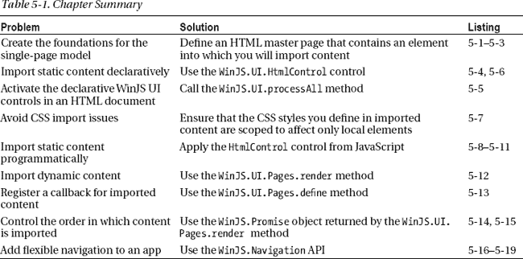

### 创建单页项目

为了演示支撑单页模型的技术，我使用`Blank Application`模板创建了一个名为`SinglePageNav`的示例 Visual Studio 项目(这是我在[第 2 章](02.html)中为`NoteFlash`应用使用的同一模板，也是我在本书中使用的模板)。对于我导入其他内容的基础，我将使用 Visual Studio 创建的`default.html`文件。你可以在清单 5-1 中看到`default.html`的起点。

***清单 5-1** 。SinglePageNav 项目中 default.html 文件的初始版本*

`<!DOCTYPE html>
<html>
<head>
    <meta charset="utf-8">
    <title>SinglePageNav</title>

    <!-- WinJS references -->
    <link href="//Microsoft.WinJS.1.0/css/ui-dark.css" rel="stylesheet" />
    
    

    <!-- SinglePageNav references -->
    <link href="/css/default.css" rel="stylesheet">
    
</head>
<body>
    

        

            <h1 class="colHeader">Content Controls</h1>
            <button id="button1">Button One</button>
            <button id="button2">Button Two</button>
        

        

            <h1 class="colHeader">Top Right</h1>
            
This is part of default.html

            

                This is where the content will go
            

        

        

            <h1 class="colHeader">Bottom Right</h1>
            
This is part of default.html

            

                This is where the content will go
            

        

    

</body>
</html>`

定义该应用布局结构的三个元素是 id 为`left`、`topRight`和`bottomRight`的`div`元素。`left`元素包含一些`button`元素，我将在本章后面使用它们来导入内容以响应用户输入。`topRight`和`bottomRight`元素提供了显示导入内容的结构。

#### 定义初始 CSS

我使用 CSS 网格布局来定位元素，使用我在`css/default.css`文件中定义的样式，你可以在[清单 5-2](#list_5_2) 中看到。

***清单 5-2** 。default.css 文件*

`#gridContainer {
    height: 100%;
**    display: -ms-grid;**
**    -ms-grid-columns: 1fr 1fr;**
**    -ms-grid-rows: 1fr 1fr;**
}

#left {
**    -ms-grid-row-span: 2;**
    background-color: black;
    padding: 10px;
}

#topRight {
**    -ms-grid-column: 2;**
    background-color: #617666;
}

#bottomRight {
**    -ms-grid-column: 2;**
**    -ms-grid-row: 2;**
    background-color: #767676;
}

div.contentBlock {
    border: medium solid white;
    padding: 5px; margin: 2px;    
}

div.message {
    font-size: 30px;
}

button {
    font-size: 30px; margin: 10px;
}

#frameTarget {` `    width: 100%;
    height: 100%;
}`

我强调了与网格布局相关的 CSS 属性。这些属性创建一个两行两列的网格。`left`元素横跨两行，由于我没有明确指定位置，所以它会在第一列和第一行。`topRight`和`bottomRight`元素在第二列，每行一个。你可以在[图 5-1](#fig_5_1) 中看到网格布局的效果。

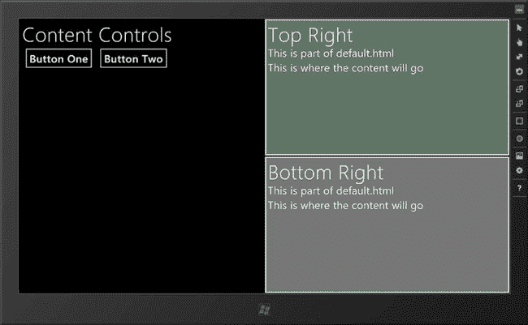

***图 5-1。**样板工程的初始布局*

#### 定义初始 JavaScript

我在`js/default.js`文件中的初始 JavaScript 代码如[清单 5-3](#list_5_3) 所示。除了为`WinJS.Utilities.query`方法创建我喜欢的`$`别名之外，代码还在名为`left`的`div`元素中找到了`button`元素，并为`click`事件注册了一个回调函数。

***清单 5-3** 。js/default.js 文件的初始内容*

`(function () {
    "use strict";

    var app = WinJS.Application;
    window.$ = WinJS.Utilities.query;

    app.onactivated = function (eventObject) {
**        $('#left button').listen("click", function (e) {**
**            // button handler code will go here**
**        });**
    };` `    app.start();
})();`

我将在本章的后面添加处理`click`事件的代码。

### 以声明方式导入内容

将内容引入单页应用的最简单方法是以声明的方式进行，这仅仅意味着将一种机制应用于`default.html`文件中的 HTML 元素。清单 5-4 展示了如何将声明性技术应用到示例应用布局中的一个容器元素中。

***清单 5-4** 。以声明方式导入内容*

`...

    <h1 class="colHeader">Top Right</h1>
    
This is part of default.html

    

        This is where the content will go
    

...`

WinJS API 的主要部分是一组 UI 控件。这些是应用于标准 HTML 元素的增强，以提供特定于应用的功能。为了以声明方式将内容导入到我的应用中，我使用了一个非常基本的控件`HtmlControl`。

我将`HtmlControl`应用到`div`元素中我想要插入导入内容的地方。应用控件就是将`data-win-control`属性设置为 WinJS API 中控件对象的全名，也就是`WinJS.UI.HtmlControl`。

我必须配置控件，以指定我想要导入的文件的名称。格式是包含一个 JSON 片段，其中的`uri`属性定义了文件名，在本例中是`contentBasic.html`。我不喜欢像这样将 JSON 嵌入到 HTML 中，但是声明式导入需要它。

 **提示**在这一章中，我不会深入探究 WinJS UI 控件的机制。我在本书的第三部分中详细介绍了它们。

最后一步是激活控件，这需要一个 JavaScript 方法调用。这在一定程度上破坏了这个示例的声明性，但是这是一个激活您添加到 HTML 中的任何控件的调用。你可以在清单 5-5 的[中看到所需的方法调用，我已经将它添加到了`default.js`中。](#list_5_5)

***清单 5-5** 。激活 HTML 标记中的控件*

`(function () {
    "use strict";`  `var app = WinJS.Application;
    window.$ = WinJS.Utilities.query;

    app.onactivated = function (eventObject) {
        $('#left button').listen("click", function (e) {
            // button handler code will go here
        });
**        WinJS.UI.processAll();**
    };

    app.start();
})();`

Windows 运行时不会自动搜索 DOM 来查找带有`data-win-control`属性的元素。我必须显式地请求这个搜索，这就是`WinJS.UI.processAll`方法所做的。最后一步是定义我想要导入的内容。[清单 5-6](#list_5_6) 显示了`contentBasic.html`文件的内容。

 **提示**我创建了 contentBasic.html 文件，方法是在解决方案浏览器窗口中右键单击项目条目，从弹出菜单中选择`Add` `New Item`，并使用`HTML Page`项模板。这个模板创建一个 HTML 页面。这不同于我之前使用的`Page Control`项目模板，它创建了 HTML 文件、CSS 文件和 JavaScript 文件(并在 HTML 文件中添加了`link`和`script`元素)。`Page Control`模板只是为了方便，并没有赋予它创建的文件任何特殊属性。事实上，我更喜欢在需要时单独创建文件，很少在自己的项目中使用`Page Control`模板。

***清单 5-6** 。contentBasic.html 档案*

`<!DOCTYPE html>
<html>
    <head>
        <title>Basic Content</title>
        
    </head>
    <body>
        

            Hello from the contentBasic.html file
        

    </body>
</html>`

这是一个简单的 HTML 文件，包含一个内嵌的`style`元素和一些基本的 HTML。如果您启动示例应用，您将看到声明式导入的效果，如图[图 5-2](#fig_5_2) 所示。我在图中突出显示了导入的内容。

注意，已经在`div`元素中的内容仍然存在。导入内容不会替换任何现有的子元素——如果您只想要导入的内容，就必须显式删除目标元素的内容(我很快就会这么做)。

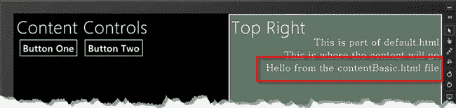

***图 5-2。**以声明方式导入内容*

#### 了解导入机制

如果你运行这个例子或者查看图 5-2 ，你会注意到右栏中的所有文本现在都对齐到了父元素的右边，而之前它是对齐到左边的(如图[图 5-1](#fig_5_1) 所示)。发生这种情况是因为内容导入应用时的处理方式。

这个例子使用了`HtmlControl`，但是我在本章后面描述的 Pages 特性也发生了同样的事情。为了理解发生了什么，考虑示例应用中的 CSS。`default.css`文件包含了`message`类的样式，如下所示:

`...
div.message {
    font-size: 30px;
}
...`

`contentBasic.html`文件包含一个`style`元素，*也*为`message`类定义了一个样式:

`...
div.message {
    font-family: serif;
    text-align: right;
}
...`

导入文件时，它包含的`script`元素被添加到主 HTML 文档的`head`元素中。Windows 应用中的 CSS 遵循与 web 应用相同的优先级规则。这意味着应用于`message`类中元素的样式是来自两个文件的组合属性集，并且由于`script`元素被添加到主文档的`head`中，这个组合属性集将影响所有的`message`元素，而不仅仅是那些已经导入的元素。

 **提示** CSS 优先考虑属性定义的顺序。这意味着导入内容中的属性会覆盖主文件中定义的属性。

确保您的样式只影响一个文档中的元素的最简单方法是确保您缩小 CSS 样式的范围，使它们只影响导入的元素。你可以在[清单 5-7](#list_5_7) 中看到我是如何为`contentBasic.html`做这些的。

***清单 5-7** 。缩小对导入内容中 CSS 样式的关注*

`<!DOCTYPE html>
<html>
    <head>
        <title>Basic Content</title>
        
    </head>
    <body>
**        
**
            

                Hello from the contentBasic.html file
            

**        
**
    </body>
</html>`

我添加了一个`div`元素，作为将要导入到文档中的元素的父元素。`div`不会改变导入内容的外观或结构，但它允许我缩小样式的关注范围，这样它们就不会泄露到布局的其他部分。你可以在图 5-3 的[中看到这种变化的效果。注意来自`default.html`文件的内容不再受右对齐的影响。](#fig_5_3)

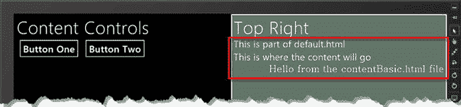

***图 5-3。**缩小导入内容中 CSS 样式焦点的效果*

### 以编程方式导入内容

声明性的`HtmlControl`是导入内容的最简单的方式，但是这种简单性带来了一些限制。第一个问题是一旦内容被加载，就没有办法改变它——使用 JavaScript 来改变`data-win-options`属性的值不会加载新的内容。第二个限制是，如果您导入包含`script`元素的内容，您几乎肯定会遇到问题——`HtmlControl`只能可靠地处理简单的静态内容，就像我在前面的例子中使用的那种内容。

JavaScript 的问题取决于代码本身。导入内容时，`script`元素的处理方式与`style`元素相同，并被添加到主文档的`head`元素中。一旦`script`元素的内容被插入到`head`元素中，就会被执行，这发生在 HTML 元素被导入之前。由于您想要操作的元素尚不存在，代码将会失败。您不能依赖 DOM 事件或类似 jQuery `ready`方法的技巧，因为底层事件是在 Internet Explorer 加载主控文档时触发的。当内容被导入时，浏览器已经触发了它的就绪事件并继续前进。

只对主文档中已经存在的元素进行操作的 JavaScript 代码可以工作，但是将这种代码放入要导入的文件中是违反直觉的。这样做在主布局和导入的代码之间创建了一个*紧密耦合*——我将在下一节更详细地讨论这一点，但这通常不是一个好主意。

这并不意味着声明性地使用`HtmlControl`没有用，但这是非常基本的。如果你想把你的应用布局分成可管理的部分，并在运行时加载它们，那么声明式的`HtmlControl`是完美、简单和可靠的。如果您想要更复杂的东西，那么您应该看看可编程的替代方案，我将在下一节对此进行描述。

#### 以编程方式使用 HtmlControl

灵活性的下一步是以编程方式使用`HtmlControl`。这就改变了对`HtmlControl`的使用，使其全部发生在 JavaScript 代码中，而不再嵌入到 HTML 中。现在，我必须说我在我的项目中没有以这种方式使用`HtmlControl`——它缺乏声明式方法的简单性，也没有我稍后描述的页面特性的灵活性。我向您展示这项技术的主要原因是为了演示一个常见的陷阱:我提到的紧耦合概念。让我从展示编程用法开始。首先，我需要重置我在`default.html`文件中的 HTML 元素来移除声明性属性，如[清单 5-8](#list_5_8) 所示。

***清单 5-8** 。删除声明性 HtmlControl 属性*

`...

    <h1 class="colHeader">Top Right</h1>
    
This is part of default.html

    

        This is where the content will go
    

...`

我现在可以在我的 JavaScript 代码中添加语句到`default.js`文件中，以编程方式使用`HtmlControl`，我在[清单 5-9](#list_5_9) 中就是这么做的。

***清单 5-9** 。以编程方式使用 HtmlControl】*

`(function () {
    "use strict";

    var app = WinJS.Application;
    window.$ = WinJS.Utilities.query;

    app.onactivated = function (eventObject) {
        $('#left button').listen("click", function (e) {` `**            var targetElem;**
**            if (this.id == "button1") {**
**                targetElem = $('#topRight div.contentTarget')[0];**
**            } else {**
**                targetElem = $('#bottomRight div.contentTarget')[0];**
**            }**
**            WinJS.Utilities.empty(targetElem);**
**            new WinJS.UI.HtmlControl(targetElem, {uri: 'contentBasic.html'});**
        });
        WinJS.UI.processAll();
    };
    app.start();
})();`

我已经为`button`控件的`click`处理函数添加了新代码。每个按钮在文档中定位一个不同的目标元素，并将它赋给`targetElem`变量。

 **注意**这是内容*导航*的基本形式，因为我为用户提供了一种改变布局组成的方式。在 Windows 应用中使用常规的 HTML 元素和事件进行导航是完全允许的，但是也有一些特定于应用的 UI 控件和 API 专用于导航，我在第 7 章的[中对此进行了描述。](07.html)

我使用`WinJS.Utilities.empty`方法删除目标元素中的现有内容，然后创建一个新的`HtmlControl`对象来导入`contentBasic.html`文件。一个`HtmlControl`对象的两个构造函数参数是目标 HTML 元素和一个包含配置信息的对象，配置信息的格式与我在上一节中声明的格式相同。您可以使用标准的 DOM API 方法(比如`document.getElementById`)，使用将`id`属性值视为变量的 IE 特性，或者像我在本例中所做的那样，使用`WinJS.Utilities.query`方法来获得目标元素。这是我别名为`$`的方法，它返回一个匹配 CSS 查询字符串的元素数组，即使只有一个匹配元素。这就是为什么我必须通过将`[0]`附加到方法调用来提取我想要的元素。

 **提示**以编程方式创建的`HtmlControl`的配置信息是一个对象，而不是一个 JSON 字符串。你必须记住不要把论点用引号括起来。

这些更改的结果是，在单击左侧面板中的某个按钮之前，不会导入任何内容。两个按钮导入相同的内容——`contextBasic.html`文件——但是内容导入到的元素不同。这些动作相互独立工作，也就是说如果你同时点击两个按钮，`contentBasic.html`文件的内容将被导入到文档中的两个位置，如图[图 5-4](#fig_5_4) 所示。

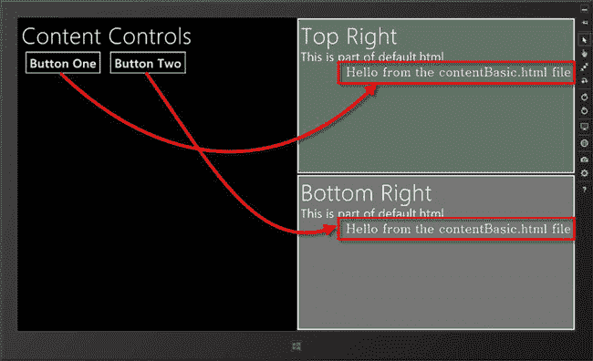

***图 5-4。**以编程方式将相同的内容导入两个位置*

使用`HtmlControl`以编程方式解决了声明性使用的一些不足。首先，我获得了对何时导入内容的控制权——在本例中，我在响应按钮点击时导入内容。其次，我可以通过删除目标元素中存在的任何内容并创建另一个`HtmlControl`对象来更改显示的内容。这是一个很大的进步，它让我可以将我的应用分解成可管理的块，我可以按需组合并显示给用户，根据应用的变化状态重用部分布局来导入和显示内容。

#### 进口互动内容的风险

即使以编程方式使用，`HtmlControl`也不能以有效的方式处理`script`元素——它们仍然被添加到主文档的`head`元素中，并在导入常规 HTML 元素之前执行。然而，`HtmlControl`对象构造函数接受一个回调函数的可选参数，该函数将在内容导入后执行。这提供了我以前没有的定时信号，允许我创建可以对新添加的元素进行操作的代码。至少，最初看起来是这样——但这是一个陷阱，需要谨慎。我将介绍回调函数的使用，并向您展示它所产生的问题。首先，我需要一些需要 JavaScript 才能有用的内容。清单 5-10 显示了我添加到根项目文件夹中的一个新文件的内容，名为`contentButton.html`。

***清单 5-10** 。contentButton.html 档案*

`<!DOCTYPE html>
<html>
    <head>
        <title>Button Content</title>
    </head>
    <body>
        
` `            

                <button id="contentButton">Press Me</button>
            

        

    </body>
</html>`

这是一个包含一个`button`元素的普通 HTML 文件。这给我带来了一个问题，因为我需要设置一个处理函数，这样我就可以响应`button`的事件。在[清单 5-11](#list_5_11) 中，你可以看到我是如何使用`default.js`文件中的第三个`HtmlControl`参数来提供一个找到按钮并绑定它的函数的。

***清单 5-11** 。使用 HtmlControl 回调函数处理导入的元素*

`(function () {
    "use strict";

    var app = WinJS.Application;
    window.$ = WinJS.Utilities.query;

    function loadLowerContent() {
        var targetElem = $('#bottomRight div.contentTarget')[0];
        WinJS.Utilities.empty(targetElem);
        new WinJS.UI.HtmlControl(targetElem, { uri: "contentBasic.html" });
    }

    app.onactivated = function (eventObject) {
        $('#left button').listen("click", function (e) {
            var targetElem = $('#topRight div.contentTarget')[0];
            WinJS.Utilities.empty(targetElem);

**            new WinJS.UI.HtmlControl(targetElem, { uri: "contentButton.html" },**
**                function () {**
**                    contentButton.addEventListener("click", loadLowerContent);**
**                });**
        });
        WinJS.UI.processAll();
    };
    app.start();
})();`

我通过`id`属性值定位`button`元素，并使用`addEventListener`方法设置一个事件处理程序。

这一切都如你所料:如果按下应用布局左侧的按钮，就会加载`contentButton.html`文件，其中包含的元素就会添加到布局中。然后调用我的回调函数，并配置我的按钮。要查看效果，启动应用并单击左侧面板中的`Button One`。您将看到`contentButton.html`文件的内容被导入到右上角的面板中，包括`button`元素。点击新导入的`button`，`contentBasic.html`文件的内容被导入到右下面板。

这种方法有两个问题。一个是可见的，并且相当容易分类。另一个是无形的，但更重要，需要时间和注意力来理解和解决。

##### 了解 CSS 问题

可见的问题是我前面描述的 CSS 范围问题的变体。我想重温一下，因为它强调了在导入内容时缩小 CSS 选择器范围的重要性。

如果您运行示例应用并单击`Button One`，则会加载`contentButton.html`文件。出现的`Press Me`按钮与其父容器的左边缘对齐。如果点击`Press Me`按钮，`contentBasic.html`文件被导入到布局中，`Press Me`按钮的对齐被移动到父项的右侧。你可以在[图 5-5](#fig_5_5) 中看到效果，图中显示了点击`button`前后的 app。

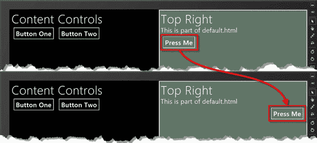

***图 5-5。**由进口 CSS 驱动的按钮延时动作*

这种变化的原因是在`contentBasic.html`文件中为`message`样式定义的附加属性。`contentButton.html`文件中的`button`包含在`message`类的`div`元素中，两个文件共享相同的元素结构和命名模式。当导入`contentBasic.html`文件时，我定义的 CSS 样式比我预期的应用得更广泛。

事实上，问题是由一系列交互触发的，这使得在开发和测试过程中很难发现问题(这种性质的大多数问题比按钮突然移动位置更加微妙)。

##### 理解紧耦合问题

更严重的问题是，我在`default.js`和`contentButton.html`文件之间创建了一个紧密耦合。紧密耦合简单地说就是对一个应用中一个组件的更改将要求我在其他地方做一个或多个更改——也就是说，`default.js`文件中的代码依赖于`contentButton.html`文件的内容。因此，例如，如果我更改了`contentButton.html`文件中`button`元素的`id`或者用不同种类的元素替换它，我必须更新`default.js`文件，以便`HtmlControl`回调函数也反映这些更改。

这是一个比听起来严重得多的问题。对于一个简单的示例应用，管理紧密耦合的组件之间的依赖关系所带来的额外工作并不多。但是对于一个真正的应用，有真正的用户，真正的时间表和真正的测试计划，这就成了一个严重的负担。每次更改都需要跟踪应用中所有受影响的地方，正确应用更新，然后测试整个应用。这是一个非常痛苦的过程，并且对软件质量和开发人员的生产力有着非常不利的影响，因此在可能的情况下避免紧密耦合是非常重要的。

对于我的例子，我需要从`default.js`中删除关于`contentButton.html`文件的内容和结构的知识。这意味着使`contentButton.html`成为一个独立的单元，`default.js`可以像黑盒一样对待它，这意味着修复我前面解释的导入的`script`元素执行问题，以便导入的内容可以包含代码。接下来，我将解释 WinJS Pages 特性如何提供我正在寻找的解决方案。

### 使用 WinJS 页面功能

WinJS Pages 特性提供了解决内容导入问题所需的工具，而不会产生耦合问题。因为 Pages 特性解决了 JavaScript 计时问题，所以它适用于导入所有类型的内容。这对于将应用分成可管理的静态内容块以及创建对导入文档中的元素进行操作的 JavaScript 代码非常有用。这种灵活性是以复杂性为代价的——没有对 Pages 特性的声明性支持，导入内容至少需要两步。正如您将看到的，第一步需要添加代码来导入内容。这发生在`default.js`文件中。第二步是将代码添加到正在导入的文件中，遵循特定的模式，这样当导入的元素被添加到 DOM 中时，我会得到通知。

Pages 特性的功能包含在`WinJS.UI.Pages`名称空间中。在接下来的小节中，我将向您展示如何使用这个名称空间来实现导入过程(以及一个可选的步骤，它可以使以特定的顺序导入内容变得更加容易)。

#### 导入内容

当然，第一步是通过`WinJS.UI.Pages.render`方法导入内容。对此没有声明性支持，因此任何内容导入都依赖于`render`方法。你可以在[清单 5-12](#list_5_12) 中看到对`default.js`文件的修改，以使用渲染方法。

***清单 5-12** 。使用 WinJS。导入内容的 UI.Pages.render 方法*

`(function () {
    "use strict";

    var app = WinJS.Application;
    window.$ = WinJS.Utilities.query;

    app.onactivated = function (eventObject) {
        $('#left button').listen("click", function (e) {
            var targetElem = $('#topRight div.contentTarget')[0];
            WinJS.Utilities.empty(targetElem);

**            var buttonTargetElem = $('#bottomRight div.contentTarget')[0]**

**            WinJS.UI.Pages.render("contentButton.html", targetElem,**
**                { content: "contentBasic.html", target: buttonTargetElem });**
        });
        WinJS.UI.processAll();
    };
    app.start();` `})();`

`render`方法的前两个参数指定要导入的内容和内容将插入的目标元素。第三个参数是可选的，更有趣。此参数允许您指定任意数据对象，该对象可用于导入内容中的代码。这是一个很好的特性，因为它允许您创建复杂的功能块，您可以通过传入不同的数据值以不同的方式重用这些功能块。数据对象没有要求的格式，您可以将任何内容从简单的字符串传递到复杂的对象。在这个例子中，我使用了一个对象，它的属性指定了`contentButton.html`文件中的按钮所需的信息——单击按钮时应该导入的内容和应该插入内容的元素。

#### 注册回拨

Pages 功能不会改变内容的加载方式。导入文件中的任何`script`元素仍然被添加到`head`元素中并立即执行。Pages 特性添加了一个回调机制，当我的内容被插入到文档中时它会通知我，这意味着我可以推迟 JavaScript 代码的执行，直到我想要操作的元素被添加到 DOM 中。回调的处理程序是使用`WinJS.UI.Pages.define`方法设置的，你可以在清单 5-13 中的`contentButton.html`文件的`script`元素中看到我是如何使用这个方法的。

***清单 5-13** 。使用 WinJS。注册回调函数的方法*

`<!DOCTYPE html>
<html>
    <head>
        <title>Button Content</title>
        
    </head>
    <body>
        

            

                <button id="contentButton">Press Me</button>
            

        

    </body>
</html>`

`define`方法有两个参数。第一个是您希望得到通知的文件的名称——在这个场景中，这总是当前文件的名称，因为我希望在 HTML 元素导入后得到通知。

第二个参数更复杂—它是一个对象，其属性指定回调函数，这些函数将在响应内容生命周期的不同部分时执行。属性集由`WinJS.UI.Pages.IPageControlMembers`接口定义，涵盖了生命周期中的各个阶段。

 **注意** JavaScript 不支持*接口*，但其他 Windows app 编程语言支持。不必拘泥于细节，对于 JavaScript Windows 应用，接口定义了一组方法和属性，对象必须定义这些方法和属性才能在特定情况下使用，或者在本例中，定义了一组受支持的值或属性名。接口的概念不太适合 JavaScript，但它是让这种语言被视为一等 Windows 应用公民并访问 Windows API 的成本的一部分。

支持的属性名集合有`error`、`init`、`load`、`processed`和`ready`，它们可以用于在导入特定文件时对其进行监控。

当您在导入的文件中使用`define`方法时，最有用的属性是`ready`,当内容已经加载并插入到主布局中时，您分配给该属性的函数将被执行。`ready`属性是我支持 JavaScript 代码所需的定时信号，该代码对导入文件的 HTML 元素进行操作。

执行分配给 ready 属性的函数时，会传递两个参数。第一个参数是内容将要插入的元素。第二个参数是传递给`render`方法的数据对象。

在这个例子中，我使用数据对象的`target`和`content`属性来配置来自`Press Me`按钮的`click`事件的处理方式。通过以这种方式传递信息，我确保了`contentButton.html`中的代码不依赖于`default.html`文件中的元素结构。

 **提示**这种技术并不完美，因为导入的文件需要知道自己在 Visual Studio 项目中的路径——这意味着移动或重命名文件需要更改代码。我还没有找到解决这个问题的方法，但是结果仍然比我开始时的那种深度依赖要好。

#### 确保内容顺序

WinJS 和 Windows APIs 中的许多方法都是异步工作的。这意味着当您调用一个方法时，它需要做的工作被安排在以后执行。方法立即将控制权返回给代码，以便可以执行脚本中的下一条语句。如果这个方法有一个结果，它通常是通过一个回调函数来处理的，当你调用这个函数时，你把它传递给这个方法。

您可以在 API 文档中找到异步方法，因为它们返回一个`WinJS.Promise`对象。一个`Promise`代表了在未来某个时候执行一些工作的承诺，并定义了当`Promise`完成时(即工作已经完成)设置回调函数所需的所有功能。我在[第 9 章](09.html)中解释了`Promise`对象的工作原理，但是我现在需要介绍一些基本用法来告诉你如何处理一些内容导入问题。

微软如此广泛使用异步方法的原因是为了迫使开发人员创建响应性应用。特别是，微软希望避免困扰 Windows 以前版本的一个问题，即应用的 UI 冻结，因为它正在前台执行一些长期活动，如等待连接到服务器或保存大量数据。通过在整个 API 中驱动 `Promise`对象，微软确保 Windows 应用 ui 很少落入这个陷阱，尽管代价是让开发人员的生活稍微复杂一些。

我说稍微复杂一点，是因为您可能已经熟悉了 web 应用开发中异步编程的概念。Ajax 请求一个在后台执行的操作的完美示例，其结果使用回调函数发出信号。如果你是 jQuery 的粉丝，你会很高兴地得知 jQuery 延迟对象特性与 Windows `Promise`对象基于相同的`CommonJS Promises/A`规范(你可以在`[http://wiki.commonjs.org/wiki/Promises/A](http://wiki.commonjs.org/wiki/Promises/A)`了解更多)。

承诺在本章中很重要的原因是`WinJS.UI.Pages.render`方法是异步的。当您调用此方法时，您指定的内容不会立即加载，而是计划在以后加载。如果你用一段内容填充你的目标元素，就像我在这一章中一直做的那样，这没问题，但是当你把几个条目导入到同一个元素中时，这可能会引起问题。

问题是不能保证后台任务按照它们被调度的顺序执行。Windows 运行时可以按照它喜欢的任何顺序自由地履行承诺(异步编程中的一种常见方法)，并且内容一旦可用就被插入(这意味着需要较长处理时间的内容可以比较简单的内容晚插入，即使较长内容的处理先开始)。

在[清单 5-14](#list_5_14) 中，我已经展示了将多个内容项导入单个元素的两种方法中的第一种。当点击`id`为`button1`的按钮时，我调用`render`方法三次，忽略方法调用返回的`Promise`对象。当您不关心它们的插入顺序时，您会采用这种方法。清单显示了`default.js`文件的内容。

***清单 5-14** 。使用 render 方法返回的承诺来订购内容*

`(function () {
    "use strict";

    var app = WinJS.Application;
    window.$ = WinJS.Utilities.query;

    app.onactivated = function (eventObject) {
        $('#left button').listen("click", function (e) {
            var targetElem = $('#topRight div.contentTarget')[0];
            WinJS.Utilities.empty(targetElem);

            if (this.id == "button1") {
**                WinJS.UI.Pages.render("contentButton.html", targetElem)**
**                WinJS.UI.Pages.render("contentBasic.html", targetElem);**
**                WinJS.UI.Pages.render("contentButton.html", targetElem);**
            }
        });
        WinJS.UI.processAll();
    };
    app.start();
})();`

我称为`render`方法的顺序建议内容顺序为`contentButton.html`、`contentBasic.html`，然后再一次为`contentButton.html`。但是由于我已经忽略了`WinJS.Promise`对象，我实际上是让顺序在运行时确定。如果运行该示例并单击`Button One`，您将看到如图[图 5-6](#fig_5_6) 所示的结果。

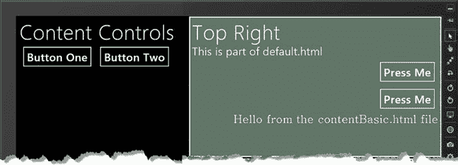

***图 5-6。**不受管理的内容顺序*

如图所示，内容导入的顺序与我调用`render`方法的顺序不匹配。发生这种情况的原因有很多，但是对排序最重要的影响来自于`render`方法缓存内容这一事实。加载`contentButton.html`文件的第二次调用完成得非常快，因为第一次调用的结果被缓存了。

 **提示**尽管缓存在这个例子中起了很大的作用，但是当你丢弃由`render`方法返回的`Promise`对象时，你仍然不能依赖特定的顺序。因为有很多因素会影响后台工作的执行顺序，所以即使第二次调用相同的方法，也不能指望得到相同的结果——每次都可能不同。

#### 用承诺强迫内容订单

`Promise`对象定义了一个名为`then`的方法，用于指定当`Promise`完成时(即后台工作完成时)要执行的功能。`then`方法允许您将函数链接在一起，从而将一个后台任务的调度推迟到另一个任务完成之后。[清单 5-15](#list_5_15) 展示了当点击标记为`Button Two`的按钮时，我如何使用`Promise.then`来强制输入内容的顺序。

***清单 5-15** 。使用 render 方法返回的承诺来订购内容*

`(function () {
    "use strict";

    var app = WinJS.Application;
    window.$ = WinJS.Utilities.query;

    app.onactivated = function (eventObject) {
        $('#left button').listen("click", function (e) {
            var targetElem = $('#topRight div.contentTarget')[0];
            WinJS.Utilities.empty(targetElem);

            if (this.id == "button1") {` `                WinJS.UI.Pages.render("contentButton.html", targetElem)
                WinJS.UI.Pages.render("contentBasic.html", targetElem);
                WinJS.UI.Pages.render("contentButton.html", targetElem);
            } else {
**                WinJS.UI.Pages.render("contentButton.html", targetElem)**
**                .then(function () {**
**                    return WinJS.UI.Pages.render("contentBasic.html", targetElem);**
**                }).then(function () {**
**                    return WinJS.UI.Pages.render("contentButton.html", targetElem);**
**                });**
            }
        });
        WinJS.UI.processAll();
    };
    app.start();
})();`

注意，我返回了从`render`方法得到的`Promise`对象，作为我传递给`then`方法的函数的结果。这确保了在`Promise`完成之前不会执行后续功能。我将在第九章中向你展示不同的编排`Promise`的方法，但你可以通过启动应用并点击`Button Two`来查看这种编排的效果。[图 5-7](#fig_5_7) 显示了结果——如你所料，内容已经按照我调用`render`方法的顺序导入。

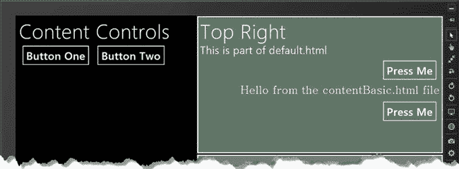

***图 5-7。**强制输入内容的顺序*

这种方法的好处是内容按照我想要的顺序排列。缺点是我拒绝了运行时一次加载和处理多个项目的机会，这是异步编程的主要好处之一。当涉及到对布局中的内容进行排序时，为了得到您需要的结果，牺牲性能通常是值得的。

### 使用导航 API

在我的示例应用中，我仍然有一个问题:用户可以导航到哪里的细节必须包含在每个页面中。当您希望为用户提供不同的路线来导航到相同的内容时，这可能会有所限制。例如，想象一个以特定方式显示数据并可以通过另外两个页面访问的页面——您想为用户提供一种返回到他来自的页面的方法，但是没有办法知道那是哪个页面。

您可以使用包含在`WinJS.Navigation`名称空间中的 WinJS 导航 API 来解决这个问题。导航 API 帮助您跟踪您在应用中所做的导航更改，并使用这些数据来创建更灵活的布局。在接下来的小节中，我将向您展示如何使用这个 API。导航 API 实际上不做任何导航，它只是在需要导航服务的应用部分和实现您的首选导航策略的代码之间充当代理。随着导航请求的创建和完成，导航 API 会维护一个导航历史，您可以使用它在内容中创建更灵活的导航。

#### 处理导航事件

使用导航 API 时，您必须做的第一件事是为至少一个*导航事件*注册回调函数。这些事件是在发出导航请求时触发的(我将在下一节演示)。对于每个导航请求，三个导航事件依次发生——我在[表 5-2](#tab_5_2) 中总结了这些事件。这些事件没有内置的处理程序，所以你可以在你的应用中把它们解释成最有意义的。我倾向于处理`navigating`事件，而忽略其他事件。

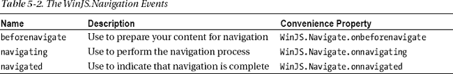

您可以用`WinJS.Navigate.addEventListener`方法或我在表中显示的便利属性为每个事件注册一个处理函数。导航 API 是一个自我组装的导航系统，所以你在应用中解释这些事件的方式完全取决于你。对于我的示例应用，我将为`navigating`事件注册一个处理程序，并通过使用 Pages API 将内容导入到应用布局中来进行响应。您必须安排注册您的事件处理函数，作为应用初始设置的一部分，以便您可以响应所有导航请求。在[清单 5-16](#list_5_16) 中，你可以看到我已经添加到`default.js`文件中的事件处理程序:将代码放在这个文件中意味着当应用加载我的 HTML 主文件时，我的事件处理程序将被注册。

***清单 5-16** 。处理导航事件*

`(function () {
    "use strict";

    var app = WinJS.Application;
    window.$ = WinJS.Utilities.query;

    app.onactivated = function (eventObject) {

**        WinJS.Navigation.addEventListener("navigating", function (e) {**
**            var targetElem = $('#topRight div.contentTarget')[0];**
**            WinJS.Utilities.empty(targetElem);**

**            var content = e.detail.location == "basic"**
**                ? "contentBasic.html" : "contentButton.html";**` `**            WinJS.UI.Pages.render(content, targetElem);**
**        });**
    };
    app.start();
})();`

在这个清单中，我为`navigating`事件注册了一个处理函数。当我收到这个事件时，我在布局中定位并`empty`一个目标元素，然后使用`render`方法导入内容，就像我在前面的例子中所做的一样。(我只导入了一个项目，所以忽略了 render 方法返回的`Promise`对象。)

我的处理函数接收一个`Event`对象作为参数。`detail.location`属性为我提供了所请求的导航位置。使用导航 API 的优点之一是，您的内容不必知道它想要导航到的文件的名称，它可以使用您创建的任何命名机制请求任何内容。在我的例子中，导航到`basic`将导入`contentBasic.html`文件，导航到`button`将导入`contentButton.html`文件。

提示这似乎是一个小功能，但却是一个有用的想法。如果项目的结构发生变化，嵌入到内容中的每个显式文件名都必须更新。通过将请求位置的名称与导入文件的名称分开，可以将需要与项目结构保持同步的代码放在一个地方。当项目结构发生变化时，您只需更新导航事件处理程序。

#### 调用导航方法

`navigate`方法是导航 API 的核心。当您想要导航到应用的另一部分时，可以调用此方法。导航 API 触发我在上一节中描述的事件，这些事件反过来执行您在事件处理函数中设置的导航代码。

`navigate`方法的参数是您请求的位置和一个可选的状态对象，您可以用它将信息传递到您导航到的内容。清单 5-17 展示了我如何在`default.js`文件中使用`navigate`方法。

***清单 5-17** 。使用 default.js 文件中的 navigate 方法*

`(function () {
    "use strict";

    var app = WinJS.Application;
    window.$ = WinJS.Utilities.query;

    app.onactivated = function (eventObject) {

        WinJS.Navigation.addEventListener("navigating", function (e) {
            var targetElem = $('#topRight div.contentTarget')[0];
            WinJS.Utilities.empty(targetElem);

            var content = e.detail.location == "basic"
                ? "contentBasic.html" : "contentButton.html";` `            WinJS.UI.Pages.render(content, targetElem);
        });

**        $('#left button').listen("click", function (e) {**
**            if (this.id == "button1") {**
**                WinJS.Navigation.navigate("basic", "Hello from default.js");**
**            } else {**
**                WinJS.Navigation.navigate("button");**
**            }**
**        });**
        WinJS.UI.processAll();
    };
    app.start();
})();`

在定义导航事件处理函数的同一个代码块中调用`navigate`方法看起来有点奇怪，但是随着我在示例应用的其余部分继续采用导航 API，这种模式开始变得更有意义。[清单 5-18](#list_5_18) 显示了对`contentButton.html`文件的修改，这样点击按钮元素就会调用`navigate`方法。

***清单 5-18** 。使用 contentButton.html 文件*中的导航方法

`<!DOCTYPE html>
<html>
    <head>
        <title>Button Content</title>
        
    </head>
    <body>
        

            

                <button id="contentButton">Press Me</button>
            

        

    </body>
</html>`

现在我有了一些内容，它们可以请求导航到`basic`内容，而不需要知道内容文件的名称或者内容将被插入到布局中的什么位置。导航事件处理函数负责处理导航，它为应用的其余部分提供服务。注意在`navigate`方法的调用者和事件处理函数之间没有直接的关系。当您调用`navigate`方法时，您依赖导航 API 来发送事件，并期望有一个处理函数愿意并能够代表您执行导航。(这就是为什么确保在应用首次启动时注册您的处理函数非常重要。)

#### 使用导航历史

此时，我有了一个工作的导航系统，它允许我以两种方式访问`contentBasic.html`文件。我可以点击`Button One`，直接导航到内容，也可以点击`Button Two`，带我到`contentButton.html`，然后点击`Press Me`。现在，我已经建立了到相同内容的两条路径，我可以使用导航 API 的其他特性来确保用户获得一致的导航体验。对于我的简单示例应用，这意味着我可以设置`Back`按钮，以便它返回到用户来自的页面。我已经修改了`contentBasic.html`文件来使用导航 API，如[清单 5-19](#list_5_19) 所示。

***清单 5-19** 。使用 contentBasic.html 文件中的导航 API*

`<!DOCTYPE html>
<html>
    <head>
        <title>Basic Content</title>
        
        
    </head>
    <body>
        
` `            

                No Message
            

**            <button id="back">Back</button>**
        

    </body>
</html>`

本文档中的重要元素是`button`。当我的`ready`处理程序被执行时，我通过`id`找到了`button`元素，并使用导航 API 来配置它。导航 API 维护已经导航到的位置的历史。如果有可能返回到先前的位置，那么`WinJS.Navigation.canGoBack`属性返回`true`。

在我的清单中，如果不能返回，我禁用了`button`，如果可以，我为`click`事件设置了一个处理函数。如果您在按钮被启用时单击它，我的处理程序将调用`WinJS.Navigation.back`方法。这导致导航 API 使用最后访问的位置发出导航事件，为我的内容提供了一种简洁的方式来展开导航序列。导航 API 中有用于向前移动和确定当前位置的等效成员，就像在 web 应用中使用浏览器的历史 API 一样。

我在清单中包含的导航 API 的另一部分是 state 对象。在`default.js`文件中，我用一个简单的字符串作为状态对象参数调用了`navigate`方法。这个对象可以通过`WinJS.Navigation.state`属性获得。如果一个状态对象可用，我用它来设置导入内容中的`div`元素的内容。

 **提示**通过`Event`对象的`detail.state`属性，导航事件处理函数可以使用状态对象。

在[图 5-8](#fig_5_8) 中点击`Button One`可以看到导航到`contentBasic.html`的效果。如果你在应用刚刚启动的时候以这种方式导航，没有导航历史，因此`canGoBack`属性返回`false`，这意味着`Back`按钮将被禁用。虽然没有历史记录，但是有一个可用的状态对象，您可以在布局中看到显示的消息。

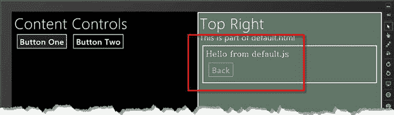

***图 5-8。点击按钮一***导航至 contentBasic.html

作为对比，你可以看到在图 5-9 中点击`Button Two`然后点击`Press Me`按钮导航到`contentBasic.html`的效果。有可用的导航历史，所以`Back`按钮被激活，点击它将导航回`contentButton.html`(当然，这里的要点是在`contentBasic.html`文件的代码或标记中没有对`contentButton.html`的引用)。在这个导航序列中，我没有向`navigate`方法传递状态对象参数，这在消息中有所反映。

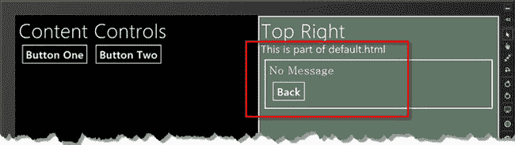

***图 5-9。**点击按钮一导航到 contentBasic.html，然后按我*

**避开浏览器导航功能**

既然你已经看到了导航 API 是如何工作的，你可能想知道为什么不直接使用浏览器内置的`history`和`location`对象。问题是这些对象不允许你根据应用的单页内容模型来定制导航。一个 JavaScript Windows 应用*可以*从主页面导航到一个新的顶级页面，但是当这种情况发生时，应用中的所有状态和内容都会丢失(因为它是使用简单的 JavaScript 对象维护的)。这在使用视图模型时尤其成问题，我在[第 8 章](08.html)中介绍了这一点。

你需要小心不要使用浏览器内置的导航功能——如果你这样做，你将打破单页模式。这样做不会杀死应用，但会丢失任何基于常规全局 JavaScript 对象和变量的数据，例如导航历史和自定义名称空间。一旦您导航到另一个顶级页面，这些数据就会丢失，并且导航回您的母版页不会恢复这些数据。

在我的项目中，疏忽的顶级导航最常见的原因是当我使用`a`元素进行导航时，忘记覆盖默认的`click`行为。如果您在项目中使用`a`元素，您必须确保处理`click`事件，调用事件上的`preventDefault`方法，并使用 WinJS 导航 API 请求导航更改。

### 总结

在这一章中，我已经向你展示了 Windows 应用的一个基本构件:单页布局。这种布局在 web 应用中越来越流行，但是要让它在应用中正常工作需要使用一些 WinJS 功能。我向您展示了如何使用`HtmlControl`导入简单的静态内容，如何使用`WinJS.UI.Pages` API 导入和管理更复杂的内容，最后，如何使用`WinJS.Navigation` API 在您的应用中创建灵活的导航。

Windows 应用处理单页布局模型的方法很复杂，需要考虑很多东西。但是不要担心——它很快就会成为你的第二天性，你很快就会熟悉我所描述的特性和技术。在下一章，我将向你展示如何让你的应用适应和响应不同的布局和方向，如果你想给你的用户提供一流的 Windows 体验，这是很重要的。