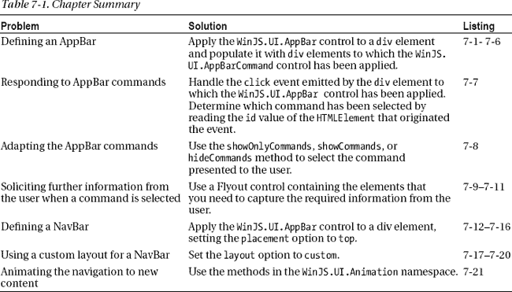
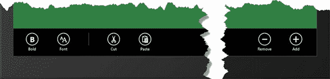
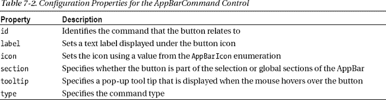
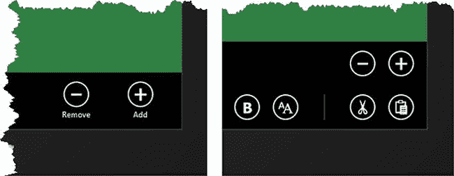
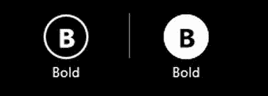
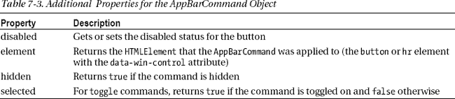
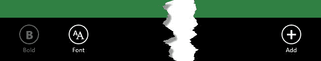
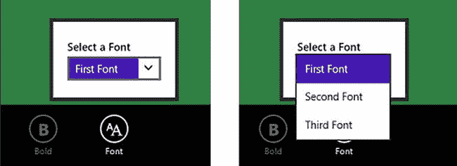
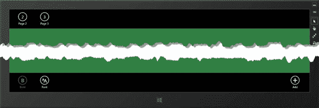

## 第七章

## 命令和导航

在第五章中，我向你展示了如何使用单页布局来创建一个 Windows 应用的基础。当我这样做的时候，我使用了`button`和锚(`a`)元素来导航内容，就像我在普通的 web 应用中所做的一样。在这一章中，我将向你展示应用特有的控件，这些控件专用于提供在应用中导航的命令，并操纵它所呈现的数据或对象:应用工具栏*和导航工具栏*。这些控件提供了 Windows 应用独特的视觉风格和交互模型的很大一部分，并且存在于大多数应用中(游戏似乎是个例外，在游戏中非标准界面很常见)。在这一章中，我将向你展示如何创建和应用这些控件，并且在这样做的时候，提供更多关于 WinJS 控件模型的细节，我在第五章中使用`HtmlControl`导入内容的时候提到过。[表 7-1](#tab_7_1) 对本章进行了总结。**

 *

### 创建示例项目

我使用`Blank App`模板创建的本章示例项目名为`AppBars`，它遵循单页面导航模型。这一章是关于导航的，所以我已经创建了一个项目，它有一个母版页和两个内容文件，稍后我将向您展示。当应用启动时，我导入其中一个内容文件，然后，在本章的后面，我将添加一些 Windows 应用 UI 控件，以便在其他内容之间导航。`default.html`文件将作为母版页，如清单 7-1 中的[所示。](#list_7_1)

***清单 7-1** 。AppBars 项目的 default.html 主页*

`<!DOCTYPE html>
<html>
<head>
    <meta charset="utf-8">
    <title>AppBars</title>

    <!-- WinJS references -->
    <link href="//Microsoft.WinJS.1.0/css/ui-dark.css" rel="stylesheet" />
    
    

    <!-- AppBars references -->
    <link href="/css/default.css" rel="stylesheet">
    
</head>
<body>
    

</body>
</html>`

这将是我的母版页，我将把内容导入到属性为`contentTarget`的`div`元素中。在所有其他方面，我保留了这个文件，就像我使用`Blank Application`项目模板时由 Visual Studio 创建的一样。

#### 定义和加载内容

我从这个项目中的一个内容文件开始，我将其命名为`page1.html`(我已经将它添加到根项目文件夹中，与`default.html`放在一起)。正如你在[清单 7-2](#list_7_2) 中看到的，这个文件包含一个`h1`元素，它清楚地表明哪个文件已经被加载，还有一些`span`元素(我将在本章后面解释命令时用到它们)。

***清单 7-2** 。page1.html 文件的内容*

`<!DOCTYPE html>
<html>
    <head>
        <title></title>
    </head>
    <body>
        

            <h1>This is Page 1</h1>` `            Command: None
        

    </body>
</html>`

#### 定义 JavaScript

我已经使用了`WinJS.Navigation` API 来处理请求和加载`js/default.js`文件中的内容，你可以在[清单 7-3](#list_7_3) 中看到。我的导航事件处理程序清除母版页中的目标元素，并使用`WinJS.UI.Pages.render`方法加载指定的内容。我将直接使用文件的名称来请求此应用中的内容。应用的开始位置是加载`page1.html`，我将使用导航控件切换到本章后面的其他内容。

***清单 7-3** 。加载 default.js 文件中的初始内容*

`(function () {
    "use strict";

    var app = WinJS.Application;

    WinJS.Navigation.addEventListener("navigating", function (e) {
        WinJS.Utilities.empty(contentTarget);
        WinJS.UI.Pages.render(e.detail.location, contentTarget);
    });

    app.onactivated = function (eventObject) {
        WinJS.Navigation.navigate("page1.html");
    };

    app.start();
})();`

#### 定义 CSS

这个项目中的最后一个文件是`css/default.css`文件，我用它来定义母版页和单独内容文件的样式。你可以在清单 7-4 中看到 CSS 样式。

***清单 7-4** 。default.css 文件的内容*

`#contentTarget, div.container {
    width: 100%;
    height: 100%;
    text-align: center;
    display: -ms-flexbox;
    -ms-flex-direction: column;
    -ms-flex-align: center;
    -ms-flex-pack: center;
}

#page1Container {` `    background-color: #317f42;    
}

#page2Container {
    background-color: #5A8463;    
}

div.container span {
    font-size: 30pt;
}`

我已经使用了 flexbox 布局来排列元素，正如你在[图 7-1](#fig_7_1) 中看到的，它显示了示例应用的初始外观。

***图 7-1。**app bars 示例 app 的初始外观*

### 创建应用命令

应用栏出现在屏幕底部，为用户提供对*命令*的访问。命令对当前范围内的数据或对象执行一些功能，这通常意味着您的命令应该与您当前呈现给用户的内容相关。

AppBar 是 Windows 应用用户体验的重要组成部分。它为关键交互提供了一致和熟悉的锚点，并允许您将 UI 控件从应用的主布局中移出，以便您使用屏幕空间为用户提供更多数据。在这一节中，我将详细介绍 AppBar，向您展示如何创建、填充和管理 UI 控件以及如何响应用户命令，并告诉您在应用中充分利用 app bar 所需要知道的一切。很自然，可以从创建 AppBar 开始，这是通过`WinJS.UI.AppBar`对象完成的。创建 AppBar 最简单的方法是通过向标准 HTML 元素添加数据属性，以声明的方式完成。应用栏通常被添加到母版页，这样你就不必在每次导入新内容时重新设置它们。考虑到这一点，[清单 7-5](#list_7_5) 展示了在`default.html`文件中添加一个 AppBar。

 **注意**`WinJS.UI.AppBar`对象是 WinJS UI 控件的一个例子。我在这本书的这一部分中提到的都与应用的基本布局和结构有关。在本书的第 3 部分的[中，我将介绍更通用的 UI 控件对象，并向你展示如何应用它们。](pt3.html)

***清单 7-5** 。给 default.html 文件添加一个 app bar*

`<!DOCTYPE html>
<html>
<head>
    <meta charset="utf-8">
    <title>AppBars</title>

    <!-- WinJS references -->
    <link href="//Microsoft.WinJS.1.0/css/ui-dark.css" rel="stylesheet" />
    
    

    <!-- AppBars references -->
    <link href="/css/default.css" rel="stylesheet">
    
</head>
<body>
    

**    
**

**        <button data-win-control="WinJS.UI.AppBarCommand"**
**            data-win-options="{id:'cmdBold', label:'Bold', icon:'bold',**
**                section:'selection', tooltip:'Bold', type: 'toggle'}">**
**        </button>            **

**        <button data-win-control="WinJS.UI.AppBarCommand"**
**            data-win-options="{id:'cmdFont', label:'Font', icon:'font',**
**                section:'selection', tooltip:'Change Font'}">**
**        </button>            **

**        
**

**        <button data-win-control="WinJS.UI.AppBarCommand"**
**            data-win-options="{id:'cmdCut', label:'Cut', icon:'cut',**
**                section:'selection', tooltip:'Cut'}">**
**        </button>            **

**        <button data-win-control="WinJS.UI.AppBarCommand"**` `**            data-win-options="{id:'cmdCut', label:'Paste', icon:'paste',**
**                section:'selection', tooltip:'Paste'}">**
**        </button>            **

**        <button data-win-control="WinJS.UI.AppBarCommand"**
**            data-win-options="{id:'cmdRemove',label:'Remove', icon:'remove',**
**                section:'global', tooltip:'Remove item'}">**
**        </button>**

**        <button data-win-control="WinJS.UI.AppBarCommand"**
**            data-win-options="{id:'cmdAdd', label:'Add', icon:'add',**
**                section:'global', tooltip:'Add item'}">**
**        </button>**
**    
**
</body>
</html>`

这些元素中有很多东西，我将一步一步地分解它们。图 7-2 显示了这些元素创建的 AppBar，当我解释各个部分是如何组合在一起的时候，它给了你一些上下文。我已经把图中 AppBar 的中间部分切掉了，这样更容易看到各个按钮。

 **提示**如果你现在运行这个例子，AppBar 不会出现。您需要首先应用清单 7-6 中的[所示的更改。](#list_7_6)

***图 7-2。**清单 7-5 中的[元素创建的 app bar](#list_7_5)*

#### 声明 AppBar 控件

AppBar 的起点是创建一个`WinJS.UI.AppBar`对象，我使用`div`元素上的`data-win-control`属性来完成，如下所示:

`...

    // ...elements removed for brevity

...`

这是我在前面章节中使用的 UI 控制模式，也是 WinJS 中使用的模式。您获取一个常规的 HTML 元素，在 AppBars 中是一个`div`元素，并使用`data-win-control`属性来指示您想要创建哪个用户控件。正如我之前提到的， Windows 运行时不会自动搜索这些属性，这就是为什么我在`default.js`文件中添加了对`WinJS.UI.processAll`方法的调用，如[清单 7-6](#list_7_6) 所示。如果不调用`processAll`方法，`AppBar`控件将不会应用于`div`元素，当用户右击或滑动鼠标时，AppBar 也不会弹出。

***清单 7-6** 。调用 processAll 方法应用 WinJS UI 控件*

`(function () {
    "use strict";

    var app = WinJS.Application;

    WinJS.Navigation.addEventListener("navigating", function (e) {
        WinJS.Utilities.empty(contentTarget);
        WinJS.UI.Pages.render(e.detail.location, contentTarget);
    });

    app.onactivated = function (eventObject) {        
**        WinJS.UI.processAll().then(function() {**
**            WinJS.Navigation.navigate("page1.html");**
**        });**
    };
    app.start();
})();`

`processAll`方法在后台处理元素，并返回一个`WinJS.Promise`对象，当处理完成且所有 UI 控件都已创建时，该对象被实现。我在第 5 章的[中介绍了`Promise`对象，并简要介绍了使用`then`方法来推迟操作直到`Promise`完成。我在第 9 章](05.html)的[中深入讨论了`Promise`对象。](09.html)

 **提示**注意，我不必亲自处理滑动或右键单击来显示 AppBar 控件。这在应用中是默认连接的，因此应用栏(和导航条，我将在本章后面介绍)会自动出现。

我已经把对`WinJS.Navigation.navigate`方法的调用放在一个函数中，我把它传递给由`processAll`方法返回的`Promise`的`then`方法。这很重要。虽然我在母版页中设置了 AppBar，但我想从内容页中管理和控制它(我将在本章的后面解释为什么并向您展示如何做到这一点)。我无法通知导入的内容母版页中的 HTML 元素已经被处理并转换为 WinJS UI 控件，这一点很重要，因为我不希望该内容中的代码在准备好之前就开始访问控件功能(这将导致引发异常)。解决方案是确保`processAll`方法在导入内容之前已经完成了它的工作，这意味着使用 WinJS `Promise`，如代码所示。

 **提示**我说 WinJS 控件是从 HTML 元素创建的，或者应用于 HTML 元素，但实际发生的是 WinJS 用一些 CSS 格式化 HTML 元素，并且在某些情况下，添加一些新元素。该技术非常类似于基于 JavaScript 的 UI 库，如 jQuery UI 和 jQuery Mobile。我不想给你留下正在进行某种魔术的印象——在大多数情况下，WinJS 控件是标准的 HTML 和 CSS。在某些情况下，JavaScript 代码会使用一些 Windows API 调用，但这种情况非常少见，而且这些也是您可以在代码中使用的 Windows API(这也是我在本书中描述的)。

#### 向 AppBar 添加按钮

通过向 AppBar 添加具有`data-win-control`值`WinJS.UI.AppBarCommand`的`button`元素，向用户显示命令，如下所示:

`...
<button **data-win-control="WinJS.UI.AppBarCommand"**
    data-win-options="{id:'cmdBold', label:'Bold', icon:'bold',
section:'selection', tooltip:'Bold', type: 'toggle'}">
</button>            
...`

使用包含配置信息的 JSON 字符串，通过`data-win-options`属性为 AppBar 按钮提供配置。JSON 字符串中的属性对应于`WinJS.UI.AppBarCommand`对象中的属性。我在[表 7-2](#tab_7_2) 中总结了这些配置属性，并在下面的章节中逐一描述。理解这些选项是充分利用 AppBars 的关键。

##### 设置命令 ID

`id`属性标识与按钮相关的命令。没有预定义的命令，因此您可以自由分配在应用环境中有意义的`id`值。该属性有两种用途。首先，在响应用户交互时，使用`id`属性来确定请求了哪个命令。其次，您使用`id`告诉 AppBar 在导入内容时显示哪些命令。我将在本章后面的响应命令部分演示这两种用法。

##### 配置命令按钮的外观

`icon`、`label`和`tooltip`属性定义了按钮的外观。`icon`属性指定按钮中使用的字形。字形是通过显示一个来自`Segoe UI Symbol`字体的字符产生的，这是 Windows 8 的一部分。您可以使用 Windows 8 中的`Character Map`工具查看字体中的图标范围。

`icon`属性的值通常是来自`WinJS.UI.AppBarIcon`枚举的值，这为字符代码提供了一个方便的映射方案。分配给我之前展示的按钮的`bold`值等同于`WinJS.UI.AppBarIcon.bold`属性，该属性在 Visual Studio 添加到应用的`base.js`文件中定义为:

`...
bold:               "\uE19B"
...`

(在`Solution Explorer`窗口中展开`References`可以看到`base.js`的内容。)您不需要为您想要的字符指定名称空间或对象名——只需`bold`即可。如果您想要使用一个在枚举中没有值的字符，您可以简单地使用字体字符代码而不是名称(例如，`\uE19B`而不是`bold`)。

 **提示**如果找不到适合自己需要的图标，可以将`icon`属性设置为包含自定义图标的 PNG 文件的名称。

`label`和`tooltip`属性指定显示在按钮图标下的字符串，以及当鼠标悬停在按钮上或者当用户在按钮上滑动手指而没有松开时显示的字符串。这些属性的值不是根据`icon`值自动推断出来的，你可以在你的应用中自由使用任何有意义的文本。然而，重要的是不要给众所周知的图标赋予新的含义，因为你赋予`label`和`tooltip`属性的值不会总是显示给用户。在我向您展示的代码片段中的`button`中，我将`icon`设置为`bold`并将`label`和`tooltip`都设置为`Bold`，这产生了如图[图 7-3](#fig_7_3) 所示的按钮。

***图 7-3。**配置应用栏中命令按钮的外观*

图的左侧显示了全屏横向视图中显示的 AppBar 的一部分，其中显示了`label`文本(我只显示了 AppBar 的一侧，其他按钮都在旁边)。图的右侧显示了快照视图中的 AppBar。在这个视图中没有显示`label`文本，因为 AppBar 已经通过省略`label`和将图标打包堆叠在一起来适应缩小的屏幕空间。你也不能依靠`tooltip`的值来帮助用户理解一个按钮会做什么，因为它们不会显示在只支持触摸的设备上。你可以依靠图标*的清晰度来传达按钮的含义——这使得做出适当的选择并尊重与众所周知的图标相关的惯例变得很重要。*

 **提示**如果你发现自己很难通过图标传达命令，你可能想停下来想想你的应用的设计。Windows 应用的用户体验是关于即时和明显的交互，这可能是因为你试图在一个命令中包含太多的含义。通过将动作分解成一系列命令或者使用上下文菜单(我在本书的第三部分中描述了这一点)，你可以为你的用户创造更好的体验。

##### 分组和分隔按钮

AppBar 中有两个部分:*选择*部分位于 AppBar 的左侧，包含应用于用户选择的数据或对象的命令。*全局*部分位于应用栏的右侧，包含始终可用且不受单个选项影响的命令。`section`属性决定了一个按钮被分配到哪个部分，如你所料，支持的值是`selection`和`global`。

当您创建 AppBar 时，您用您的应用在所有情况下支持的所有命令填充每个部分。然后，您可以更改命令集和单个命令的状态，以匹配应用的状态——稍后我将向您展示如何做到这一点。

**选择全局命令的位置**

微软已经为一些全局命令在应用栏上的位置定义了一些规则。如果你的应用有一个`New`或`Add`命令，那么它应该被放在最右边的全局命令，并且应该用`add`图标显示(这个图标不应该用于任何其他命令)。

放置在`New`或`Add`左侧的命令应为对应命令。如果你的应用处理的数据或对象具有应用之外的生命(比如照片，它们驻留在设备存储上，可以被其他应用访问)，那么你必须使用一个`Delete`命令(一个`Delete`的`label`值和一个`delete`的`icon`值)。如果你的应用只处理自己的数据，那么你应该使用一个`Remove`命令(一个`label`值为`Remove`，一个图标值为`remove`)。如果该操作将删除多个项目，那么您应该使用一个`Clear`命令(一个标签值为`Clear`，一个图标值为`clear`)。

##### 设置命令类型

有四种类型的命令可以添加到 AppBar，由`type`属性指定——这些类型对应于值`button`、`toggle`、`separator`和`flyout`。如果您没有为`type`属性显式设置值，那么将使用`button`值。

`button`和`toggle`类型创建常规按钮，当它们被点击时触发事件。它们之间的区别在于`toggle`类型创建了一个具有开和关状态的切换按钮。我之前关注的`Bold`按钮是一个`toggle`命令，你可以在[图 7-4](#fig_7_4) 中看到关闭和打开状态是如何显示的。我将很快向您展示如何以编程方式检查和更改切换状态。

***图 7-4。**用分隔符显示的切换命令的不同状态*

该图还显示了可以添加到 AppBar 的第三种命令:`separator`类型。(这在页面上可能很难辨认——分隔符是一条细长的竖线，通过运行示例可以清楚地看到。)其他三种命令类型是从`button`元素创建的，但是您可以从`hr`元素创建一个分隔符，如下所示:

`...
<**hr** data-win-control="WinJS.UI.AppBarCommand"
    data-win-options="{type: **'separator'**, section:'selection'}" />
...`

命令按照它们在 HTML 中定义的顺序被添加到它们在 AppBar 中的部分，因此您可以简单地在代表其他类型命令的`button`元素之间添加分隔符。最后一个命令类型`flyout`用于将命令与弹出菜单相关联。我将在本章后面的“使用弹出型按钮”部分向您展示如何使用这种命令。

#### 响应命令

通过在 AppBar HTML 元素上为`click`事件注册一个处理函数来响应来自 AppBar 的命令。处理 click 事件的最佳位置是您导入到母版页的内容中——这允许您针对不同的内容适当地响应命令，而无需诉诸紧耦合。[清单 7-7](#list_7_7) 展示了在`page1.html`文件中添加一个`script`元素来响应 AppBar 中的命令。

***清单 7-7** 。响应 page1.html 文件中的命令*

`<!DOCTYPE html>
<html>
    <head>
        <title></title>
**        **
    </head>
    <body>
        

            <h1>This is Page 1</h1>
            Command: None
        

    </body>
</html>`

我使用`addEventListener`方法为应用了 AppBar 控件的`div`元素注册一个`click`事件的处理函数。这依赖于 DOM 事件通过文档中元素的层次结构向上传播的方式，这意味着我可以避免找到单个 command `button`元素并直接处理它们。清单中的`script`元素的重要声明是这样的:

`...
document.getElementById("command").innerText = **e.target.winControl.label**;
...`

该语句获取被单击命令的`label`属性的值，并使用它来设置标记中`span`元素的`innerText`属性。当`WinJS.UI.processAll`方法处理一个具有`data-win-control`属性的元素时，它将一个`winControl`属性附加到表示 DOM 中元素的对象上。属性返回一个对象，允许你使用 UI 控件的特性和功能。

 **提示**注意，我已经使用了`e.target`来定位点击事件所源自的元素。该事件来自命令，而不是 AppBar，因此您需要确保处理正确的元素。

由`winControl`属性返回的对象是由`data-win-control`属性指定的对象。对于 AppBar 命令，`winControl`是一个`WinJS.UI.AppBarCommand`对象，我可以访问这个对象定义的所有属性和方法。在本例中，我已经读取了`label`属性来获取显示在命令按钮下的文本字符串。

`AppBarCommand`对象非常简单，它定义的大多数成员对应于我在本章前面描述的配置选项(`id`、`icon`、`section`、`type`等等)。还有一些额外的属性，我已经在[表 7-3](#tab_7_3) 中描述了它们，尽管我在本章后面才详细解释其中的几个。

#### 使 AppBar 适应特定内容

在声明 AppBar 时，添加应用中需要的所有命令，然后指定在将内容导入母版页时向用户显示哪些命令。这允许您为应用栏提供一组一致的元素，并且仍然适应应用的状态，以便导入内容的功能在应用栏的命令中得到反映。

区分*禁用*和*隐藏*的命令非常重要。禁用的命令仍然出现在应用栏上，但是命令按钮是灰色的，表示该命令现在不适用，但是以后可能会适用—例如，可能在用户选择了对象或数据项时。

隐藏的命令会从应用栏中完全删除—当命令不适用于当前内容时，您会隐藏命令。您可以使用应用了`WinJS.UI.AppBar`控件的元素的`winControl`对象来隐藏和禁用命令。在清单 7-8 的[中，我已经添加了`page1.html`文件来配置 AppBar 命令。](#list_7_8)

***清单 7-8** 。定制 AppBar 命令以匹配导入内容的功能*

`<!DOCTYPE html>
<html>
    <head>
        <title></title>` `        
    </head>
    <body>
        

            <h1>This is Page 1</h1>
            Command: None
        

    </body>
</html>`

使用`winControl`属性，我能够访问`WinJS.UI.AppBar`控件的方法和属性。在这个清单中，我使用了两种可用的方法:`showOnlyCommands`方法接受命令`id`值的数组，并隐藏数组中没有指定的所有命令。我用这个方法来隐藏除了`cmdBold`、`cmdFont`和`cmdAdd`命令之外的所有命令。

`getCommandById`接受一个`id`值并返回相应的`AppBarCommand`对象。在清单中，我为`cmdBold`命令找到了`AppBarCommand`对象，并将`disabled`属性设置为`true`(正如我在上一节中所描述的，它将按钮保留在 AppBar 上，但阻止它被使用)。你可以在[图 7-5](#fig_7_5) 中看到这些方法在 AppBar 上的效果。

***图 7-5。**为导入的内容定制 app bar*

我喜欢使用`showOnlyCommands`方法，因为这意味着我提供了我想要显示的命令的明确列表，但是在`AppBar`对象中还有其他方法可以用来为您的内容准备 AppBar。在[表 7-4](#tab_7_4) 中，我描述了你可以用来显示、隐藏和定位命令的一整套方法。

T2】

#### 使用弹出按钮

基本命令可以用`button`或`toggle`命令类型处理，但是对于复杂的命令，你需要使用`flyout`类型，它将命令与一个被称为*弹出按钮*的弹出窗口链接起来。使用`WinJS.UI.Flyout` UI 控件创建弹出按钮，在这一节中，我将向您展示如何创建和使用弹出按钮，以及如何将它们与您的 AppBar 命令相关联。

 **提示**在这一节中，我将解释如何使用 AppBars 的`Flyout`控件，但是您也可以使用`Flyout`来创建通用的弹出窗口。更多细节和示例见第 12 章。

##### 声明弹出型按钮

声明弹出按钮的最佳位置是在母版页中，这样整个应用中都可以使用相同的元素集。通过将`data-win-control`属性设置为`WinJS.UI.Flyout`，弹出按钮被应用于`div`元素。您可以设置`div`元素的内容，以适应您的应用的需求——`Flyout`UI 控件的作用是处理弹出窗口，对您向用户呈现的内容没有任何限制。清单 7-9 显示了我添加到`default.html`文件中的一个简单的弹出按钮。

***清单 7-9** 。向 default.html 文件添加弹出按钮*

`<!DOCTYPE html>
<html>
<head>
    <meta charset="utf-8">
    <title>AppBars</title>

    <!-- WinJS references -->
    <link href="//Microsoft.WinJS.1.0/css/ui-dark.css" rel="stylesheet" />
    
    

    <!-- AppBars references -->
    <link href="/css/default.css" rel="stylesheet">
    
</head>
<body>
    

` `    

        <button data-win-control="WinJS.UI.AppBarCommand"
            data-win-options="{id:'cmdBold', label:'Bold', icon:'bold',
                section:'selection', tooltip:'Bold', type: 'toggle'}">
        </button>

        <button data-win-control="WinJS.UI.AppBarCommand"
            data-win-options="{id:'cmdFont', label:'Font', icon:'font',
                section:'selection', tooltip:'Change Font', **type: 'flyout'**,
**                flyout: 'fontFlyout'**}">
        </button>

        <!-- other commands removed for brevity -->

    

**    
**
**        <h3>Select a Font</h3>**
**        <select id="fontSelect">**
**            <option>First Font</option>**
**            <option>Second Font</option>**
**            <option>Third Font</option>**
**        </select>**
**    
**
</body>
</html>`

在这个清单中，我定义了一个弹出按钮，它包含一个简单的标题和一个带有三个`option`元素的`select`元素。为了将弹出按钮与命令相关联，我将命令的`type`属性设置为`flyout`，将`flyout`属性设置为已经应用了`WinJS.UI.Flyout`控件的`div`元素的`id`。

形成弹出按钮的元素是隐藏的，直到用户单击或触摸相关联的命令按钮。此时，弹出按钮显示在按钮上方，如图[图 7-6](#fig_7_6) 所示。飞出式按钮被*轻轻关闭*，这意味着如果用户点击飞出式按钮占据的屏幕区域之外，它们将再次隐藏。这意味着您不必添加任何种类的取消按钮来删除弹出按钮。

***图 7-6。**使用带有 AppBar 命令的弹出菜单*

##### 样式弹出按钮

弹出型按钮的默认样式非常简单。如果你想让你的弹出按钮与应用的其他部分的视觉主题相适应，你可以覆盖 CSS `win-flyout`类。[清单 7-10](#list_7_10) 展示了我如何在`default.css`文件中覆盖这个样式来改变背景颜色和应用边框。如果你遵循这个例子，你需要将这些样式添加到`default.css`文件中。

***清单 7-10** 。通过 win-flyout 类设计弹出菜单*

`...
div.win-flyout {
    background-color: #4FCB6A;
    border: thick solid black;
}

div.win-flyout select {
    border: medium solid black;
}
...`

##### 响应弹出交互

声明和显示弹出型按钮只是该过程的一部分。您还需要响应用户与您添加到弹出按钮的元素的交互。处理弹出控件交互的最佳位置是在母版页的 JavaScript 代码中——这允许您为弹出控件创建一致的处理方式，不管显示的内容是什么。

然而，您需要使用一个*视图模型*和*数据绑定*来使这种方法工作，而不会在母版页和导入的内容之间产生紧耦合问题。在第 8 章之前，我不会描述视图模型和数据绑定，所以我将接受母版页需要有内容的详细知识，这样我就可以演示如何处理弹出按钮，并在本书的后面向您展示如何解决紧耦合问题。[清单 7-11](#list_7_11) 显示了对`default.js`文件的添加，以响应弹出按钮。

***清单 7-11** 。响应弹出按钮*

`(function () {
    "use strict";

    var app = WinJS.Application;

    WinJS.Navigation.addEventListener("navigating", function (e) {
        WinJS.Utilities.empty(contentTarget);
        WinJS.UI.Pages.render(e.detail.location, contentTarget);
    });

    app.onactivated = function (eventObject) {

        WinJS.UI.processAll().then(function() {
            WinJS.Navigation.navigate("page1.html");

**            fontSelect.addEventListener("change", function (e) {**` `**                command.innerText = this.value;**
**                fontFlyout.winControl.hide();**
**            });**
        });
    };
    app.start();
})();`

我已经处理了来自`select`元素的`change`事件，就像我在常规 web 应用中一样，并且我将在`page1.html`中定义的`span`元素的`innerText`属性设置为用户选择的值。这是紧密耦合的部分——`default.js`文件中的代码不应该知道 page1.html 中内容的结构和性质(但是正如我所说的，您可以使用视图模型和数据绑定来解决这个问题，我在第 8 章中对此进行了描述)。

这个例子的关键部分是这样的陈述:

`...
fontFlyout.winControl.hide();
...`

一旦我处理了用户交互，我就定位到应用了`Flyout`控件的元素，并通过`winControl`属性调用`hide`方法。仅当用户在弹出窗口之外单击时，弹出窗口灯光消除功能才适用，而当用户使用弹出窗口包含的控件执行操作时，该功能不适用。这意味着在成功交互完成时，您必须明确地从显示屏上移除弹出窗口(使用`hide`方法)。

对于这个简单的弹出按钮，我可以在用户使用`select`元素做出选择时立即做出响应，但是对于更复杂的交互，您可以依靠`OK`按钮或其他类型的明确信号来表明用户已经完成了。

### 创建导航命令

导航栏从屏幕顶部向下滑动，充当应用栏的对应物。AppBar 提供了对当前内容中的数据和对象进行操作的命令，而 NavBar 提供了在应用的不同区域中移动的方法。NavBars 是使用与 AppBars 相同的`WinJS.UI.AppBar` UI 控件创建的，但是在向用户呈现命令的方式上，您拥有更大的灵活性。在这一部分，我将向你展示如何在你的应用中添加和管理导航条。为了演示导航控件，我在项目中添加了两个新文件，名为`page2.html`和`page3.html`。你可以在[清单 7-12](#list_7_12) 中看到`page2.html`。

***清单 7-12。【page2.html 档案】T2***

`<!DOCTYPE html>
<html>
    <head>
        <title></title>
    </head>
    <body>
        

            <h1>This is Page 2</h1>
        

    </body>
</html>`

这些文件最初将用于演示导航，但是在本章的后面我将使用`page2.html`文件来演示如何创建一组自定义的导航控件。你可以在清单 7-13 的[中看到`page3.html`的内容。](#list_7_13)

***清单 7-13。【page3.html 档案】T2***

`<!DOCTYPE html>
<html>
    <head>
        <title></title>
    </head>
    <body>
        

            <h1>This is Page 3</h1>
        

    </body>
</html>`

#### 使用标准导航条

虽然我发现在母版页中定义 AppBar 更容易，但在 NavBar 中我倾向于采用不同的方法。我创建了一个包含 NavBar 元素的单独文件，并使用`WinJS.UI.Pages`名称空间将它导入到每个内容文件中，采用了我在第 5 章的[中描述的技术。在这一节中，我将向您展示一个标准的 NavBar，它遵循与我在 AppBar 中使用的相同的基于命令的方法。清单 7-14](05.html) 显示了我使用 Visual Studio `HTML Page`项目模板添加到示例项目中的`standardNavBar.html`文件的内容。(在本章的后面，我将向你展示一个不同的导航条设计。)

***清单 7-14** 。standardNavbar.html 文件的内容*

`<!DOCTYPE html>
<html>
    <head>
        <title></title>
        
    </head>
    <body>
        

            <button data-win-control="WinJS.UI.AppBarCommand"` `                data-win-options="{id:'cmdPage2', label:'Page 2', icon:'\u0032',
                    section:'selection', tooltip:'Page2'}">
            </button>

            <button data-win-control="WinJS.UI.AppBarCommand"
                data-win-options="{id:'cmdPage3', label:'Page 3', icon:'\u0033',
                    section:'selection', tooltip:'Page3'}">
            </button>
        

    </body>
</html>`

NavBar 遵循我为 AppBar 使用的命令模式，有两个按钮导航到`page2.html`和`page3.html`文件。当您使用一个`WinJS.UI.AppBar`控件作为导航栏时，您必须使用`data-win-options`属性将`placement`属性设置为`top`，就像我在清单中所做的那样。

`placement`属性是区分用作 AppBars 的`WinJS.UI.AppBar`控件和用作 NavBars 的控件的方式。当用户点击或触摸其中一个命令按钮时，我接收到`click`事件，并使用命令的`id`属性计算出用户想要导航到的页面，并将其传递给`WinJS.Navigation.navigate`方法。

##### 应用标准导航条

我想在`page1.html`文件中使用标准的导航条，你可以在[清单 7-15](#list_7_15) 中看到我是如何做的。

***清单 7-15** 。使用 page1.html 文件中的标准导航条*

`<!DOCTYPE html>
<html>
    <head>
        <title></title>
        
    </head>
    <body>
        

            <h1>This is Page 1</h1>
            Command: None
        

    </body>
</html>`

这是`render`方法的标准用法，除了我正在导入内容的元素没有在`page1.html`文件中定义。我将在这个示例应用中使用多种样式的 NavBar，这需要对元素进行一些调整，首先是在母版页中有一个公共元素，内容可以在其中加载所需的 NavBar。你可以看到我是如何将这个元素添加到[清单 7-16](#list_7_16) 中的`default.html`文件中的。(让我再次强调，当我在第 8 章中介绍视图模型时，我会演示一些更好的技术来处理这种情况。)

***清单 7-16** 。向 default.html 添加一个通用元素，导航条将被导入其中*

`...
<body>
    

**    

**
    

        <!-- commands removed for brevity -->

    

    

        <h3>Select a Font</h3>
        <select id="fontSelect">
            <option>First Font</option>
            <option>Second Font</option>
            <option>Third Font</option>
        </select>
    

</body>
...`

当`page1.html`文件被导入时，它将导入`standardNavBar.html`文件的内容，并将它们插入到`default.html`文件的公共元素中。你可以在[图 7-7](#fig_7_7) 中看到效果。NavBar 与 AppBar 同时显示，并响应相同的交互。同样，我不需要处理任何事件来显示 NavBar——这是在应用控件时自动连接的，当用户滑动或右键单击时，NavBar 和 AppBar 都会显示。

***图 7-7。**向示例应用添加导航栏*

图中的细节可能很难辨认，但是你可以看到我在图 7-8 的[中特写的两个命令按钮。数字没有预定义的图标，所以我将命令的`icon`值设置为来自`Segoe UI Symbol`字体的字符代码(`\u0032`和`\u0033`)。点击命令将导航到相应的页面。](#fig_7_8)

***图 7-8。**标准导航条按钮上的命令*

#### 使用自定义导航条

在导航条上使用一系列按钮来表示命令并不总是有意义的。在这些情况下，您可以为`WinJS.UI.AppBar`控件定义一个自定义布局。[清单 7-17](#list_7_17) 显示了`customNavBar.html`文件的内容，这是我使用 Visual Studio `HTML Page`项模板添加到项目中的。

***清单 7-17** 。customNavBar.html 文件的内容*

`<!DOCTYPE html>
<html>
    <head>
        <title></title>
        
    </head>
    <body>
        

            

                <button id="navBarBack" class="win-backbutton"></button>
                <h1 id="navBarTitle">Page Title</h1>
            

        

    </body>
</html>`

这是另一个自包含的 NavBar，HTML 元素和响应它们的代码定义在同一个文件中。不同的是，我在`data-win-options` 属性中将`layout`属性设置为`custom`。`custom`值告诉`WinJS.UI.AppBar`控件，你不想要标准的基于命令的布局，你将自己提供和管理导航条中的元素。

 **注意**你*可以*在应用栏和导航条上使用自定义布局——但这通常不是个好主意。应用的导航结构可能会有所不同，用户希望导航条能够反映出你的应用的独特特征。另一方面，命令应该是一致的，并使用我前面描述的约定来应用。用户将期待在应用栏中的命令，它们的布局和响应方式与所有其他 Windows 应用一致。如果你必须使用一个非标准的 AppBar 来表达你的应用的独特性，那么你的设计一定有问题。

如清单所示，我已经用一个`button`和一个`h1`元素填充了导航栏。我使用了一个叫做`win-backbutton`的方便的 Windows CSS 类，它创建了一个圆形边框中带有箭头的按钮。导航栏中的元素包含在一个`div`元素中。我采用了这种结构，这样我可以很容易地设计元素的样式——你可以在清单 7-18 的[中看到我添加到`default.css`文件中的样式。](#list_7_18)

***清单 7-18** 。自定义导航栏布局的 default.css 文件中的样式*

`...
#navBarContent {
    display: -ms-flexbox;
    -ms-flex-direction: row;
    -ms-flex-align: start;
    width: 100%;
    height: 80px;
}

#navBarBack {
    margin-top: 18px;
    margin-left: 20px;
}

#navBarTitle {
    padding-top: 3px;
    margin-left: 20px;
}
...`

我使用 CSS flexbox 布局来定位元素。正如你已经意识到的，我经常使用这种布局，因为它非常适合 Windows 应用的一般风格，其中控件沿着公共轴流动——当我在第 16 章中描述语义缩放概念时，你会更清楚地看到这种视觉主题。

##### 应用自定义导航栏

应用带有自定义布局的导航栏的过程与应用常规导航栏的过程是一样的，只是您必须确保布局中的元素得到了正确的配置和准备。对于我的自定义 NavBar 布局，我需要设置`h1`元素的内容，这是通过用`render` 方法传递一个数据对象来完成的，这样它就可以被在`customNavBar.html`文件中定义的`ready`函数使用。清单 7-19 显示了使用自定义导航条的`page2.html`文件。

***清单 7-19** 。page2.html 文件的内容*

`<!DOCTYPE html>
<html>
    <head>
        <title></title>
**        **
    </head>
    <body>
        

            <h1>This is Page 2</h1>
        

    </body>
</html>`

我不需要监听导航栏中按钮的`click`事件，因为它是使用`WinJS.Navigation` API 在`customNavPage.html`文件中处理的。

 **提示**我也在项目中添加了`page3.html`，但它本质上与`page2.html`相同，所以我不会浪费篇幅列出内容。

##### 调整导航条和应用条的行为

WinJS API 期望一个应用中只有一个 NavBar。当`WinJS.UI.processAll`方法处理一个已经应用了`WinJS.UI.AppBar`控件的元素时，它会将该元素移出它在 DOM 中的原始位置，这样它就不会受到导入内容变化的影响。对于我的例子来说，这是一个问题，因为我想在导航条之间自由切换，以反映我正在显示的内容。

我还有第二个问题要解决。当用户导航到应用的另一部分时，应用栏和导航栏不会自动隐藏。我将删除 NavBar，这样我就不用担心隐藏它了——但是我需要确保 AppBar 是隐藏的；否则，它只会在屏幕上徘徊，遮住我新导入的内容。

为了解决这两个问题，我在`default.js`文件中添加了一些代码来响应导航请求。您可以在清单 7-20 中看到这些变化。

***清单 7-20** 。移除导航条并隐藏应用条以响应导航事件*

`(function () {
    "use strict";`  `var app = WinJS.Application;

    WinJS.Navigation.addEventListener("navigating", function (e) {

**        if (window.navbar) {**
**            window.navbar.parentNode.removeChild(navbar);**
**        }**

**        if (window.appbar) {**
**            window.appbar.winControl.hide();**
**        }**

        WinJS.Utilities.empty(contentTarget);
        WinJS.UI.Pages.render(e.detail.location, contentTarget);
    });

    app.onactivated = function (eventObject) {
        WinJS.UI.processAll().then(function () {
            WinJS.Navigation.navigate("page1.html");

            fontSelect.addEventListener("change", function (e) {
                command.innerText = this.value;
                fontFlyout.winControl.hide();
            });
        });
    };
    app.start();
})();`

在导航到请求的内容之前，我移除了`id`为`navbar`的元素，并通过`winControl`隐藏了`appbar`元素。这给了我所需的应用状态，以便新内容可以加载自己的导航栏，并且不会被应用栏遮挡。你可以在[图 7-9](#fig_7_9) 中看到导航条产生的效果。

***图 7-9。**在一个应用中使用两种风格的导航条*

#### 制作导航过渡动画

在这一章中，我要做的最后一件事是制作从一页内容到另一页内容的动画。`WinJS.UI.Animation`名称空间定义了许多动画，您可以在应用状态的关键转换时将这些动画应用于元素。我将向您展示这些动画，因为我描述了它们相关的功能——在这一章中，当一个内容页面离开显示屏以及当另一个内容页面到达时会应用相关的动画。我会在[第 18 章](18.html)中详细解释这些动画，但我只想在这里提供一个快速的概述。

应用中的内容转换可能发生得如此之快，以至于人眼并不总是能察觉到它们——特别是如果涉及的两个内容页面共享共同的视觉线索，例如颜色和字体。您希望您的用户知道，由于单击或触摸导航命令，内容已经发生了变化。如果不明显，你将打破好的应用所拥有的流畅的交互模式，并导致用户花一秒钟来检查他期望的动作已经被执行了。

你让用户知道视觉信号发生了变化。我在示例中为内容页面使用了不同的背景颜色，这是一个非常有用和强大的信号，尤其是如果在整个应用中使用一致的颜色来指示不同的功能区域。另一个强大的视觉信号是动画。[清单 7-21](#list_7_21) 展示了我是如何将动画添加到`default.js`文件中的导航事件处理函数中的——在这个函数中应用动画意味着它们将被一致地应用到整个应用中。

***清单 7-21** 。将导航动画应用于示例应用*

`(function () {
    "use strict";

    var app = WinJS.Application;

    WinJS.Navigation.addEventListener("navigating", function (e) {

        if (window.navbar) {
            window.navbar.parentNode.removeChild(navbar);
        }

        if (window.appbar) {
            window.appbar.winControl.hide();
        }

        **// These statements are commented out**
        **//**WinJS.Utilities.empty(contentTarget);
        **//**WinJS.UI.Pages.render(e.detail.location, contentTarget);

**        WinJS.UI.Animation.exitPage(contentTarget.children).then(function () {**
**            WinJS.Utilities.empty(contentTarget);**
**            WinJS.UI.Pages.render(e.detail.location, contentTarget).then(function () {**
**                return WinJS.UI.Animation.enterPage(contentTarget.children)**
**            });**
**        });**
    });

    app.onactivated = function (eventObject) {
        WinJS.UI.processAll().then(function () {
            WinJS.Navigation.navigate("page1.html");
        });
    };

    app.start();
})();`

我在这个清单中使用的两个动画方法是`exitPage`和`enterPage`。名称解释了每个动画的用途，两种方法的参数都是一个或多个需要动画的元素。为了简单起见，我传递了母版页中承载导入内容的元素的`children`属性的结果。

请注意，没有为这些动画配置样式或持续时间的选项。通过使用这些方法，您可以应用标准的页面过渡动画，这对于所有 Windows 应用都是一样的。这是一个很好的方法，因为很多非常明智和理性的开发人员在得到一个动画库时会变得有点疯狂，并且往往会忘记动画是为了帮助用户。

我不能给你看截图中的动画，所以你应该运行示例应用来看看效果。由`exitPage`和`enterPage`方法触发的动画简洁、简单且有效。它们足够简单和快速，当用户第 100 次看到动画时不会感到厌烦，但它们足够丰富，足以引发用户意识到应用中的内容已经发生了变化。

### 总结

在这一章中，我已经向你展示了如何使用`WinJS.UI.AppBar`控件来创建应用栏和导航条。这些是 Windows 用户体验中的基本元素，它们为用户与你的应用的交互带来了一致性和清晰性。这并不是说使用 AppBars 和 NavBars 应该受到限制——即使有微软制定的惯例，也有许多不同的方式来组织您呈现给用户的命令，并且您可以选择使用自定义 NavBar 布局来定制您提供的导航体验。

在下一章，我将介绍*视图模型*和*数据绑定*的主题。现在我们已经了解了 Windows 应用布局和导航的基本结构，是时候考虑如何采用同样的方法来组织和显示应用的数据了。*