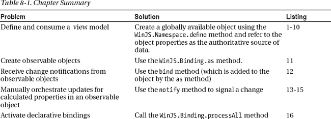
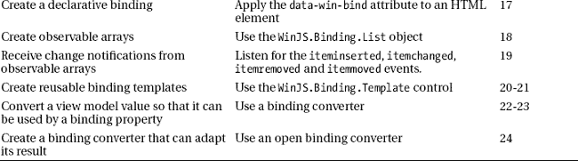
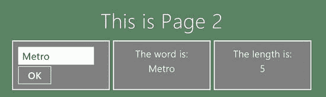
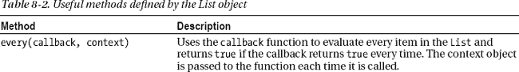
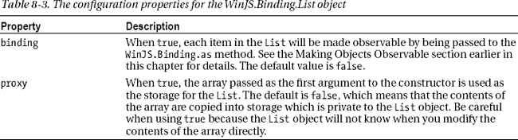
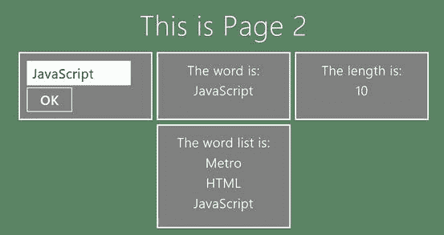
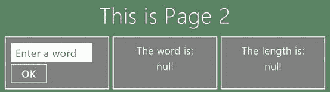
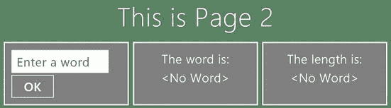

## 第八章

## 查看模型和数据绑定

在本章中，我将向您介绍*视图模型*和*数据绑定*。这是两个基本的技术，可以让您创建可伸缩性好、易于开发和维护、能够流畅地响应数据变化的应用。

您可能已经从设计模式中熟悉了模型和视图模型，如模型-视图-控制器(MVC)，模型-视图-视图模型(MVVM 和模型-视图-视图控制器(MVVC))。我不打算在本书中详细讨论这些模式。有很多关于 MVC、MVVM 和 MVVC 的好信息，从维基百科开始，它有一些非常平衡和深刻的描述。

我发现使用视图模型的好处是巨大的，除了最简单的应用项目，其他项目都值得考虑，我建议你认真考虑遵循同样的道路。我不是一个模式狂热者，我坚信应该采用解决实际问题的部分模式和技术，并将它们应用到具体的项目中。最后，你会发现我对如何使用视图模型持相当开放的观点。

我在本章中描述的 WinJS 特性支撑了 Windows 应用支持的一些基本交互模型。为了确保我为更高级的特性打下坚实的基础，我慢慢地开始这一章，并逐步介绍关键概念。理解这些特性是充分利用高级 UI 控件和概念的前提，比如语义缩放，我在第 16 章中对此进行了描述。[表 8-1](#tab_8_1) 对本章进行了总结。

### 重温示例应用

在这一章中，我继续构建我在前一章中创建的`AppBars`项目。提醒一下，这个应用引入了 NavBars 和 AppBars，并包含了一些简单的内容页面。我将在此基础上展示新的应用特性。

### 分离应用组件

我将首先应用一个视图模型来修复第 7 章中的示例应用的一些缺点。在此过程中，我将向您展示我首选的视图模型对象结构，并演示视图模型可以有多简单，同时还能使开发人员的工作更加轻松。

 **注意**如我之前所说，我对视图模型的构成持非常开放的态度，它包括不直接呈现给用户的数据。

#### 定义视图模型

视图模型最重要的特征是全局可用性和一致性。在 Windows 应用中，创建基本视图模型最简单的方法是使用`WinJS.Namespace`特性(我在[第 3 章](03.html)和[第 4 章](04.html)中介绍过)来创建视图模型对象并将其导出到全局名称空间。清单 8-1 显示了`viewmodel.js`文件的内容，我将它添加到了`AppBars`示例项目的`js`文件夹中。

***清单 8-1** 。viewmodel.js 文件的内容*

`(function () {
    "use strict";

    WinJS.Namespace.define("ViewModel.State", {
        appBarElement: null,
        navBarContainerElement: null,
        navBarControlElement: null
    });`  `WinJS.Namespace.define("ViewModel.UserData", {

    });
})();`

我喜欢创建一个名为`ViewModel`的顶级名称空间，它包含嵌套的名称空间，代表我想要处理的每一大类数据。在这个例子中，我定义了两个名称空间。`ViewModel.State`是我定义关于应用状态的数据的地方，我将它粗略地定义为应用的一部分为了与应用的其他部分顺利工作而需要知道的数据。这个名称空间包含三个属性，我将使用它们来解决我在第 7 章的[中引入到示例应用中的挥之不去的紧耦合问题。](07.html)

我在`ViewModel.UserData`中定义的第二个名称空间。我使用这个名称空间来存储用户关心的数据。这因应用而异，但它包括用户输入的任何值和我从这些值中导出的任何数据。这是前台数据，而不是我放在`ViewModel.State`名称空间中的后台数据。最初这个名称空间中没有属性，但是我会在本章的后面添加一些。

 **提示** JavaScript 是一种动态语言，这意味着在给属性赋值之前，我不需要在视图模型中定义属性。我还是这样做了，因为我希望我的视图模型定义成为它包含的数据的规范引用；在我看来，这意味着定义属性并将`null`分配给它们，而不是在我第一次使用它们时在应用的其他地方创建属性。

我的 Windows 应用通常有一个包含这两个名称空间的视图模型。我根据我的应用支持的*合同*添加其他合同。我在本书的第四部分解释了合同，但这两个是我最常用的基本合同。我将状态数据从用户数据中分离出来，因为我发现这样更容易确定哪些数据应该持久存储；我会在[第 20 章](20.html)中进一步讨论这个问题。

#### 导入并填充视图模型

视图模式是在一个自动执行的 JavaScript 函数中定义的，所以在示例应用中使用它所要做的就是导入带有`script`元素的代码，并为视图模型包含的属性设置值。我希望视图模型在应用启动时就可用，并且无论导入和显示了哪些内容都可用，这意味着需要将`script`元素作为示例应用的母版页放在`default.html`文件中。[清单 8-2](#list_8_2) 显示了添加的`script`元素。

***清单 8-2** 。使用脚本元素加载视图模型代码*

`...
<head>
    <meta charset="utf-8">
    <title>AppBars</title>

    <!-- WinJS references -->
    <link href="//Microsoft.WinJS.1.0/css/ui-dark.css" rel="stylesheet" />
    
    `  `<!-- AppBars references -->
    <link href="/css/default.css" rel="stylesheet">
**    **
    
</head>
...`

我在之前添加了`viewmodel.js`文件*的脚本元素，这让我有机会在初始化应用时引用视图模型。在示例应用中，我想为在`default.js`文件中包含 AppBar 和 NavBar 控件的元素设置值，如清单 8-3 中的[所示。](#list_8_3)*

***清单 8-3** 。填充视图模型*

`(function () {
    "use strict";

    var app = WinJS.Application;

    WinJS.Navigation.addEventListener("navigating", function (e) {

**        var navbar = ViewModel.State.navBarControlElement;**
**        if (navbar) {**
**            navbar.parentNode.removeChild(navbar);**
**        }**

**        if (ViewModel.State.appBarElement) {**
**            ViewModel.State.appBarElement.winControl.hide();**
**        }**

        //WinJS.Utilities.empty(contentTarget);
        //WinJS.UI.Pages.render(e.detail.location, contentTarget);

        WinJS.UI.Animation.exitPage(contentTarget.children).then(function () {
            WinJS.Utilities.empty(contentTarget);
            WinJS.UI.Pages.render(e.detail.location, contentTarget).then(function () {
                return WinJS.UI.Animation.enterPage(contentTarget.children)
            });
        });
    });

    app.onactivated = function (eventObject) {
        WinJS.UI.processAll().then(function () {

**            ViewModel.State.appBarElement = appbar;**
**            ViewModel.State.navBarContainerElement = navBarContainer;**

            WinJS.Navigation.navigate("page1.html");

            fontSelect.addEventListener("change", function (e) {
                command.innerText = this.value;` `                fontFlyout.winControl.hide();
            });
        });
    };
    app.start();
})();`

#### 消费视图模型

我在视图模型中设置了值，这样,`default.html`文件中元素结构的细节就不会在整个应用中扩散。如果我更改了`default.html`文件，我只需在`default.js`文件中反映这些更改，而不必搜寻并找到所有使用了`appbar`和`navBarContainer`值的实例。在包含在内容文件中的代码中，我可以将我想要的导航条导入到视图模型中列出的元素中，如清单 8-4 所示的，它显示了`page2.html`文件的内容。

***清单 8-4** 。使用视图模型定位导航条加载到的元素*

`<!DOCTYPE html>
<html>
<head>
    <title></title>
    
</head>
<body>
    

        <h1>This is Page 2</h1>
    

</body>
</html>`

在`default.js`文件中只设置了`ViewModel.State`名称空间中的两个属性。第三个属性`navBarControlElement`，由设置应用使用的每种 NavBar 样式的代码设置，如[清单 8-5](#list_8_5) 所示，它显示了来自`customNavBar.html`文件的`script`元素——这允许我拥有一个全局可用的属性，该属性被设置为反映当前导入的内容。

***清单 8-5** 。在 NavBar 代码中设置视图模型属性值*

`...

...`

该属性用于`default.js,`中的导航事件处理函数，这意味着导航条控件不必应用于`id`为`navbar`的元素。最后，我对`standardNavBar.html`文件进行了同样的修改，如[清单 8-6](#list_8_6) 所示。

***清单 8-6** 。在 NavBar 代码中设置视图模型属性值*

`...

...`

这些变化的结果是，视图模型充当了关于应用的状态和结构的信息库，允许各种组件协同工作，而无需事先了解彼此。当我在标记或代码中进行更改时，我只需要确保视图模型属性反映了更改，而不是搜寻所有的依赖项并手动进行更改。

### 从布局中分离数据

视图模型的最大价值来自于将应用中的数据从 HTML 中分离出来，并呈现给用户。通过将视图模型与*数据绑定*相结合，您可以使您的应用更容易开发、测试和维护。我将在本节的后面解释数据绑定是如何工作的，但是首先我将向您展示我正在着手解决的问题。在开始之前，我需要为我将在本章中添加的元素添加一些新的 CSS 样式。为此，我创建了一个名为`/css/extrastyles.css`的新文件，其内容你可以在[清单 8-7](#list_8_7) 中看到。在这个 CSS 中没有新的技术，我列出了新的样式，所以你可以看到这个项目的各个方面。

***清单 8-7** 。extrastyles.css 文件的内容*

`#page2BoxContainer {
    display: -ms-flexbox;
    -ms-flex-direction: row;
    -ms-flex-align: stretch;
    -ms-flex-pack: justify;
    margin-top: 20px;
}

div.page2box {
    width: 325px;
    padding: 10px;
    margin: 5px;
    border: medium solid white;
    background-color: gray;
    display: -ms-flexbox;
    -ms-flex-direction: column;
    -ms-flex-pack: center;
}

div.page2box * {
    display: block;
    margin: 4px;
    font-size: 18pt;
}`

这些样式中引用的类和`id`属性值是针对我稍后将添加的元素的。为了将文件的内容纳入项目范围，我向`default.html`文件添加了一个`link`元素，如下所示:

`...
<head>
    <meta charset="utf-8">
    <title>AppBars</title>

    <!-- WinJS references -->
    <link href="//Microsoft.WinJS.1.0/css/ui-dark.css" rel="stylesheet" />
    
    

    <!-- AppBars references -->
    <link href="/css/default.css" rel="stylesheet">
**    <link href="/css/extrastyles.css" rel="stylesheet">**
    
    
</head>
...`

#### 论证问题

没有视图模型，数据项的权威来源是 HTML 元素；也就是说，当您想要一个数据值时，您必须在 DOM 中找到包含它的元素，并从适当的`HTMLElement`对象中读取该值。作为示范，我对`page2.html`文件做了一些修改，如[清单 8-8](#list_8_8) 所示。

***清单 8-8** 。使用布局中的元素作为数据值的权威来源*

`<!DOCTYPE html>
<html>
    <head>
        <title></title>
        
    </head>
    <body>
        

            <h1>This is Page 2</h1>

       **     
**
**                
**
**                    <input id="wordinput" placeholder="Enter a word">**
**                    <button id="wordbutton">OK</button>**
**                
**

**                
**
**                    The word is:**
**                    ????**
**                
**

**                
**
**                    The length is:**
**                    ????**
**                
**
**            
**
        

    </body>
</html>`

这是一个简单的例子。我在布局中添加了三个`div`元素。我使用 CSS flexbox 布局对它们进行了定位，并应用了我在`extrastyles.css`文件中定义的类。

您可以在[图 1](#fig_8_1) 中看到新标记和代码的效果。您在左侧面板的`input`元素中输入一个单词，然后点击`OK`按钮。您输入的单词显示在中间面板中，单词的长度显示在右侧面板中。在图中，我已经输入了单词*press*。

***图 8-1。**向 page2.html 布局添加三个面板*

本例中的`input`元素是用户输入的数据的权威来源。如果我想让用户输入单词，我需要读取代表 DOM 中的`input`元素的`HTMLElement`对象的`value`属性。这种方法的好处是简单，但是它引入了一些深刻的问题。

一个问题是`input`元素并不是真正的*权威。当点击`button`时，您可以合理地确信`input`元素包含在*精确时刻*的用户数据，但是在所有其他时间，用户可能正在改变值。如果你在除了点击`button`之外的任何时候读取`value`属性，你不能确定你有有用的数据。*

更严重的问题是，在单页内容模型中使用时，数据值不是持久的。当用户导航到新页面时，Windows 应用运行时会丢弃`input`元素及其内容。当用户导航回该页面时，会生成新元素，并且用户在导航之前输入的任何数据都会丢失。

#### 应用视图模型

当然，解决方案是使用视图模型。[清单 8-9](#list_8_9) 显示了在`viewmodel.js`文件中添加的两个新属性，代表我向用户显示的两个数据项。因为我正在处理用户输入的数据，所以我在名称空间`ViewModel.UserData`中定义了这些属性。

***清单 8-9** 。在视图模型中为用户数据定义属性*

`(function () {
    "use strict";

    WinJS.Namespace.define("ViewModel.State", {
        appBarElement: null,
        navBarContainerElement: null,
        navBarControlElement: null
    });

    WinJS.Namespace.define("ViewModel.UserData", {
**        word: null,**
**        wordLength: {**` `**            get: function() {**
**                return this.word ? this.word.length : null;**
**            }**
**        }**
    });
})();`

`word`属性将包含用户输入的值。这个数据项没有默认值，所以我将`null`赋给了属性。

`wordLength`属性被称为*派生值*或*计算值*，这意味着它返回的值基于视图模型中的某个其他值。为了创建这个属性，我使用了一个相对较新的 JavaScript 特性，称为 *getter* 。Getters 及其对应的*setter*，允许您使用函数来创建复杂的属性。在这个例子中，我只定义了一个 getter，这意味着该值可以被读取，但不能被修改。

 **提示**在视图模型中使用计算值的好处是生成值的逻辑保存在一个地方，而不是嵌入到需要显示值的每个`script`元素中。如果我以后需要更改`wordLength`属性，也许是为了只计算元音，那么我只需要更改视图模型。这是向应用添加结构的另一个方面，这样负责配置 HTML 元素的代码就不用负责生成这些值。

视图模型的消费者看不到 getters 和 setters 的使用，他们通过读取`ViewModel.UserData.wordLength`获得`wordLength`值，就像它是一个常规属性一样。定义完这些属性后，我需要对`page2.html`做两组修改，如[清单 8-10](#list_8_10) 所示。

***清单 8-10** 。使用视图模型存储和检索数据*

`...

...`

我通过更新视图模型中的属性来响应被点击的`button`,这和其他 JavaScript 赋值一样。此时，视图模型对象没有特殊的能力或特性，除了我已经使它成为我的数据的权威来源:

`...
**ViewModel.UserData.word** = wordinput.value;
...`

另一个变化是当`ViewModel.UserData.word`属性的值改变时，使用视图模型更新中间和右边的面板。我已经将更新面板的语句转移到一个名为`updateDataDisplay`的函数中，该函数使用视图模型来获取`word`和`wordLength`数据值。应用的功能是相同的，但现在视图模型充当数据存储库以及更新属性的代码和响应这些更新的代码之间的中介。

### 使用数据绑定

在这一点上，我已经达到了我的目标，但不是以一种有益的方式。例如，尽管我已经将更新代码分离到它自己的函数中，并使用视图模型数据进行更新，但我仍然必须直接从与`button`元素相关联的`click`事件处理函数中触发更新。

构建应用的下一步是断开更新函数和`click`事件处理程序之间的链接。我将使用*数据绑定*来实现这一点，这是两个数据项链接在一起并保持同步的地方。

对于 Windows 应用，数据绑定是通过`WinJS.Binding`名称空间提供的。设置数据绑定的过程需要两个步骤:使一个数据项*可观察*，然后*观察*该数据项，这样当该数据项的值改变时，您就会收到通知。在接下来的小节中，我将向您展示这两个步骤。

#### 使物体可见

一个*可观察对象*每当它的一个属性值改变时就会发出一个事件。此事件允许相关方监控属性值并做出相应的响应。你通过使用`WinJS.Binding.as`方法创建一个可观察的对象，你可以看到我是如何将这个方法应用到[清单 8-11](#list_8_11) 中的`viewmodel.js`文件的。

***清单 8-11** 。使部分视图模型可见*

`(function () {
    "use strict";

    WinJS.Namespace.define("ViewModel.State", {
        appBarElement: null,
        navBarContainerElement: null,
        navBarControlElement: null
    });` `**    WinJS.Namespace.define("ViewModel", WinJS.Binding.as({**
**        UserData: {**
**            word: null,**
**        }**
**    }));**

**    WinJS.Namespace.define("ViewModel.UserData", {**
**        wordLength: {**
**            get: function () {**
**                return this.word ? this.word.length : null;**
**            }**
**        }**
**    });**
})();`

创建一个可观察的视图模型并不完全简单，您可以从我在视图模型中所做的结构更改中看到这一点。需要这些更改来解决 WinJS API 中的一系列冲突和限制。我将向您详细介绍每一个问题，以便您理解发生了什么，并且如果您在自己的代码中遇到它们，可以识别它们。

##### 解决命名空间与绑定的冲突

`WinJS.Binding.as`方法的工作原理是用 getters 和 setters 替换对象中的属性。这允许您继续使用属性，而不必担心它们是如何实现的，并允许可观察对象在设置新值时无缝地发出事件。结果是一个可见的对象，但它仍然与使用它的代码兼容。

为了支持这种方法，`WinJS.Binding.as`方法使用在成员名前加下划线字符(`_`)的 JavaScript 约定来创建一些私有成员。

但是当`WinJS.Namespace.define`方法将一个对象导出到全局名称空间时，它会隐藏任何名称以下划线开头的对象成员。我认为，这个想法是为了加强一些严格性，防止名称空间的消费者访问私有变量和方法。

当您使用`WinJS.Binding.as`方法创建一个想要使用`WinJS.Namespace.define`方法导出的可观察对象时，问题就来了——`as`方法添加的私有成员被`define`方法隐藏，破坏了对象。结果是，您不能简单地将`as`方法应用于您想要导出到名称空间的对象，就像这样:

`...
WinJS.Namespace.define("ViewModel.UserData",
    WinJS.Binding.as({
        word: null
    })
);
...`

`define`方法只对它所传递的对象的顶层隐藏私有成员，这意味着你可以通过构造不同的名称空间来解决这个问题，就像这样:

`...
WinJS.Namespace.define("ViewModel", WinJS.Binding.as({
**    UserData: {**
**        word: null,**
**    }**` `}));
...`

名称空间的`UserData`部分被传递给`as`方法，这解决了问题。WinJS API 的不同部分在一些地方不能很好地协同工作，这是新的 Windows 应用开发人员最常遇到的问题。

##### 解决 Getter 冲突

`WinJS.Binding.as`方法转换对象中的简单值属性，使它们变得可观察。它不对函数进行操作，但是它会导致使用 getters 和 setters 的值出现问题。正是因为这个原因，我将`wordLength`属性的定义移到了对`WinJS.Namespace.define`方法的单独调用中:

`...
WinJS.Namespace.define("ViewModel.UserData", {
   wordLength: {
       get: function () {
           return this.word ? this.word.length : null;
       }
    }
});
...`

`define`方法是*附加的*，这意味着我可以定义属性或函数，它们将被添加到我已经用相同名称定义的任何现有名称空间对象中(而不是替换它们)。在这种情况下，我的`wordLength`属性被添加到`ViewModel.UserData`名称空间，但没有通过`WinJS.Binding.as`方法传递，这意味着我的计算视图模型属性工作正常，并返回从同一名称空间中的`word`属性派生的值。

#### 消费可观察的对象事件

这个有点复杂的设置过程的结果是我的`ViewModel.UserData`名称空间中的`word`属性是可见的。当我更改`word`属性的值时，`ViewModel.UserData`对象将向任何感兴趣的方发送一个事件。

您使用`bind`方法在可观察对象上注册对属性的兴趣。在清单 8-12 的[中，你可以看到我是如何在`page2.html`文件的`script`元素中使用这个方法的。](#list_8_12)

***清单 8-12** 。使用 WinJS。Binding.bind 方法接收属性值更改事件*

`...

...`

当我调用`WinJS.Binding.as`方法时，`bind`方法被添加到可观察对象中。`bind`的参数是一个包含您想要观察的属性名称的字符串，以及一个当属性值改变时处理事件的函数。在我的例子中，我已经在`ViewModel.UserData`对象上调用了`bind`方法，指定我想要观察`word`属性，并且变更事件将由`updateDataDisplay`函数处理。

事件处理函数传递了两个参数——被观察属性的新值和旧值(mu 示例只有一个参数，因为我不关心前一个值)。在这个清单中，我修改了`updateDataDisplay`函数，以便使用新的 value 参数设置布局中的中间面板，并更新右侧面板以反映单词长度。

使用`bind`方法创建一个编程绑定(即绑定是在 JavaScript 代码中定义的)。我能够使用编程绑定来简化我的代码，并确保我的应用的不同部分自动保持彼此同步，使用视图模型作为代理或中介。

#### 重构可观察的属性

我的数据绑定还有一个问题需要解决，那就是`wordLength`属性是不可见的。这样做的效果是，视图模型中值的消费者必须知道`wordLength`属性是从`word`属性计算出来的，并使用后者属性中的事件作为触发器来检查前者的变化。

修复这个问题相当简单，只需要稍微修改一下`viewmodel.js`文件，如[清单 8-13](#list_8_13) 所示。

***清单 8-13** 。手动发送更新事件使属性可见*

`(function () {
    "use strict";

    WinJS.Namespace.define("ViewModel.State", {
        appBarElement: null,
        navBarContainerElement: null,
        navBarControlElement: null
    });

    WinJS.Namespace.define("ViewModel", WinJS.Binding.as({
        UserData: {
            word: null,
**            wordLength: null**
        }
    }));

**    ViewModel.UserData.bind("word", function (newVal) {**` `**        if (newVal) {**
**            ViewModel.UserData.wordLength = newVal ? newVal.length : null;**

**        }**
**    });**
})();`

在这个清单中，我使用了`bind`方法让视图模型观察自己。这允许我将为`wordLength`属性计算值的逻辑移出`ViewModel.UserData`对象，这意味着`wordLength`属性本身就可以被观察到。

这并不是一种完美的技术，因为视图模型的消费者有可能接收到`word`属性的变更事件，并在更新之前读取`wordLength`属性。然而，对于大多数项目来说，这是一种完全合理的方法，并且只需要少量的工作就可以避免 WinJS 数据绑定支持中的一些问题；我将很快向您展示一种替代方法，用于那些无法接受时间问题的应用。

通过使这两个属性都是可观察的，我使视图模型的消费者能够在其中一个发生变化时收到通知。[清单 8-14](#list_8_14) 显示了来自`page2.html`的`script`元素，它显示了正在为`word`和`wordLength`属性处理的变更事件。

***清单 8-14** 。绑定到多视图模型属性*

`...

...`

事件的处理函数没有传递哪个属性已经改变的细节，这意味着处理改变事件的最简单的方法是使用一个专用于单个属性的函数。您可以在清单中看到这一点，我将`updateDataDisplay`函数分成了两个独立的函数，每个函数对应一个可观察的属性。结果是，`wordLength`属性的观察者不需要知道该属性是从`word`属性派生出来的。

##### 彻底解决问题

在我继续之前，我想向您展示一种使视图模型可观察的不同方法，这种方法没有上一节中潜在的时间问题。如果您使用计算属性*和*，您只需要使用这种方法。在发送任何变更事件之前，更新所有相关的属性值是必要的。对于所有其他情况，你应该使用我在[清单 8-14](#list_8_14) 中展示的方法，这更简单，也更容易操作。[清单 8-15](#list_8_15) 显示了完全解决更新问题所需的更高级的方法。

***清单 8-15** 。解决 viewmodel.js 文件中的更新排序问题*

`(function () {
    "use strict";

    WinJS.Namespace.define("ViewModel.State", {
        appBarElement: null,
        navBarContainerElement: null,
        navBarControlElement: null
    });

**    WinJS.Namespace.define("ViewModel", WinJS.Binding.as({**
**        UserData: {**
**            // no properties defined here**
**        }**
**    }));**

**    WinJS.Namespace.define("ViewModel.UserData", {**
**        _wordValue: null,**
**        wordLength: null,**
**        word: {**
**            get: function() {**
**                return this._wordValue;**
**            },**
**            set: function (newVal) {**
**                var oldWordVal = this._wordValue;**
**                var oldLengthVal = this.wordLength;**
**                this._wordValue = newVal;**
**                this.wordLength = newVal ? newVal.length : null;**
**                this.notify("word", newVal, oldWordVal);**
**                if (this.wordLength != oldLengthVal) {**
**                    this.notify("wordLength", this.wordLength, oldLengthVal);**
**                }**
**            }**
**        }**
**    });**` `**})();**`

以这种方式设置视图模型需要两个步骤。第一种是使用`WinJS.Binding.as`方法创建一个不包含属性的可观察对象。这在对象中设置了可观察的功能，但是没有用 getters 和 setters 替换任何属性。

第二步是仅使用`define`方法手工定义需要同步更新的属性，以便将它们添加到您在第一步中作为名称空间导出的对象中。

您可以使用 getters 和 setters 来定义其他值的派生属性。在 setter 中，您执行派生属性的计算，然后使用`notify`方法发布 changes 属性的更新，如下所示:

`...
this.notify("word", newVal, oldWordVal);
if (this.wordLength != oldLengthVal) {
    this.notify("wordLength", this.wordLength, oldLengthVal);
}
...`

当我调用`WinJS.Bind.as`方法时，`notify`方法被添加到了`ViewModel.UserData`对象中，观察者需要使用`bind`方法来注册事件。`notify`方法的参数是发生变化的属性的名称、新值和旧值。`notify`方法与可观察对象内部使用的机制相同，它允许您完全控制视图模型发出变更事件的方式。在清单中，通过确保在更新完所有属性值之前不调用`notify`方法，我能够确保在更新完这两个值之前不发送`word`和`wordLength`属性的变更事件。

让我重申一下，你只需要在非常特殊的情况下走这么远。我已经向您展示了这种技术，因为这些情况经常令人惊讶地出现，并且因为它允许您获得关于 WinJS 数据绑定机制如何配合的更多细节。

### 使用声明绑定

到目前为止，在我向您展示的示例中，视图模型中的值是使用*编程*绑定来消费的，这意味着我在我的 JavaScript 代码中接收属性值更改的通知，并通过更新应用的 HTML 中的一个或多个元素的内容来响应。我可以通过使用*声明性绑定*来优化这个过程，其中我将数据绑定的细节作为 HTML 元素声明的一部分，并允许 WinJS 为我管理更新过程。

#### 处理文档

使用声明性绑定的前提是调用`WinJS.Binding.processAll`方法，该方法在 HTML 中定位绑定并激活它们。使用单页内容模型时，将对此方法的调用放在导航事件处理程序函数中很重要，以便在导入内容时处理页面中的声明性绑定；否则，您的绑定将不会被激活。在我的示例应用中，导航事件处理程序在`default.js`文件中，你可以在[清单 8-16](#list_8_16) 中看到`processAll`方法调用。

***清单 8-16** 。打电话给温家。导航事件处理函数*中的 Binding.processAll 方法

`(function () {
    "use strict";` `**    WinJS.Binding.optimizeBindingReferences = true;**

    var app = WinJS.Application;

    WinJS.Navigation.addEventListener("navigating", function (e) {

        var navbar = ViewModel.State.navBarControlElement;
        if (navbar) {
            navbar.parentNode.removeChild(navbar);
        }

        if (ViewModel.State.appBarElement) {
            ViewModel.State.appBarElement.winControl.hide();
        }

        WinJS.UI.Animation.exitPage(contentTarget.children).then(function () {
            WinJS.Utilities.empty(contentTarget);
            WinJS.UI.Pages.render(e.detail.location, contentTarget)
                .then(function () {
**                    return WinJS.Binding.processAll(document.body, ViewModel);**
                }).then(function() {
                    return WinJS.UI.Animation.enterPage(contentTarget.children)
                });
        });
    });

    app.onactivated = function (eventObject) {
       WinJS.UI.processAll().then(function () {

            ViewModel.State.appBarElement = appbar;
            ViewModel.State.navBarContainerElement = navBarContainer;

            WinJS.Navigation.navigate("page1.html");

            fontSelect.addEventListener("change", function (e) {
                command.innerText = this.value;
                fontFlyout.winControl.hide();
            });
        });    
    };
    app.start();
})();`

 **注意**当你使用声明式绑定时，你应该总是将`WinJS.Binding.optimizeBindingReferences`属性的值设置为`true`，就像我在例子中所做的那样。虽然我没有遇到任何问题，但微软警告说，省略这一步会产生绑定操作导致内存泄漏的风险。我没有在本书的一些例子中应用这个属性，因为我想让他们尽可能专注于手头的功能，但是对于真正的项目，你应该采纳微软的建议。

您需要将对`WinJS.Binding.processAll`方法的调用放入到`Promise.then`调用链中，以便在用`WinJS.UI.Pages.render`方法导入内容之后、向用户显示之前处理绑定。`processAll`方法返回一个`Promise`对象，所以很容易得到正确的顺序，尽管嵌套的`then`调用链可能会变得相当深。

 **提示**我在[第九章](09.html)中深入覆盖了`WinJS.Promise`对象。

`WinJS.Binding.processAll`方法的参数是处理的开始元素和数据值的来源。我已经将开始元素设置为`document.body`，这确保了整个布局被处理。对于数据值的来源，我已经指定了`ViewModel`对象。

#### 声明绑定

一旦安排好用`processAll`方法处理绑定，就可以继续在 HTML 中声明绑定了。为了演示声明性绑定，我更新了`page2.html`文件中的面板，如[清单 8-17](#list_8_17) 所示。

***清单 8-17** 。使用 page2.html 文件*中的十进制装订

`<!DOCTYPE html>
<html>
    <head>
        <title></title>
        
    </head>
    <body>
        

            <h1>This is Page 2</h1>

            

                

                    <input id="wordinput" placeholder="Enter a word">
                    <button id="wordbutton">OK</button>
                

                

                    The word is:
                    ????
                

                

                    The length is:
                    ????
                

            

        

    </body>
</html>`

首先，请注意我已经从`script`元素中移除了编程绑定——我不再调用`bind`方法或者在代码中更新`span`元素的内容。相反，我给`span`元素添加了`data-win-bind`属性。该属性是声明性绑定特性的核心，它允许您指定如何设置一个`HTMLElement`对象的一个或多个属性值。

WinJS 声明性绑定在表示 DOM 中元素的`HTMLElement`对象上操作。这意味着如果你想设置一个元素的文本内容，你可以指定将`innerText`属性设置为你传递给`processAll`方法的对象的`UserData.word`属性，就像这样:

`...

...`

冒号(`:`)将属性名称与数据属性名称分开。如果与声明性绑定相关的数据项是可观察的，则声明性绑定会自动保持最新。清单中的两个声明性绑定都与可观察的数据项相关，因此我的布局与视图模型保持同步。当您只需要向用户显示值时，这是使用编程绑定的一个很好的替代方法。

 **提示**通过用分号(`;`)分隔绑定，您可以在单个`**data-win-bind**`属性中绑定多个属性。

### 创建可观察数组

正如我前面提到的，`WinJS.Binding.as`方法只能观察简单的值属性。它将忽略对象、函数、日期和数组(尽管在对象的情况下，它将寻找嵌套的简单值属性并使它们可被观察到)。在这一节中，我将向您展示如何创建可观察数组。可观察数组不仅有用，而且是我在本书第三部分中描述的一些 UI 控件的重要基础。

#### 创建可观察数组

通过创建新的`WinJS.Binding.List`对象来创建可观察数组。你可以看到我是如何在清单 8-18 中的[文件中添加这样一个对象的。我将使用这个`List`来保存用户输入的单词的简单历史。](#list_8_18)

***清单 8-18** 。向视图模型添加一个可观察数组*

`(function () {
    "use strict";

    WinJS.Namespace.define("ViewModel.State", {
        appBarElement: null,
        navBarContainerElement: null,
        navBarControlElement: null
    });

    WinJS.Namespace.define("ViewModel", WinJS.Binding.as({
        UserData: {
            word: null,
            wordLength: null,
        }
    }));

**    ViewModel.UserData.wordList = new WinJS.Binding.List();**

    ViewModel.UserData.bind("word", function (newVal) {
        if (newVal) {
            ViewModel.UserData.wordLength = newVal ? newVal.length : null;
**            ViewModel.UserData.wordList.push(newVal);**
        }
    });
})();`

`WinJS.Binding.List`对象受`WinJS.Namespace.define`方法删除名称以下划线开头的属性和函数的影响——解决方案是手动将`List`对象添加到名称空间，如清单所示。

 **提示**注意，我已经返回到清单中视图模型的更简单形式。我在本章其余部分描述的技术可以应用于任何一种方法，但是这个更简单的视图模型使我更容易说明我所做的更改。

`List`对象不是 JavaScript 数组的直接替代。它实现了数组中的许多方法和属性，包括我在清单中使用的在`word`属性更新时向`List`添加一个项目的`push`方法。主要的区别是没有数组索引器(像`myArray[0]`)，你必须使用`getAt`和`setAt`方法(`myArray.getAt(0)`)来代替。您很快就会习惯它，从积极的方面来看，`List`对象支持一些很好的特性来排序和过滤它的内容。[表 8-2](#tab_8_2) 总结了由`List`对象定义的最重要的方法。

这些只是基本的方法，我建议您花些时间看看 API 文档，更详细地探索一下`List`对象的功能。

 **提示**`List`对象支持的许多功能是它作为一些 WinJS UI 控件的数据源所必需的。你可以在[第三部分](pt3.html)中了解更多关于数据源和使用它们的控件的信息。

在[清单 8-18](#list_8_18) 中，我创建了一个空的`List`对象，但是如果你将一个 JavaScript 数组传递给构造函数，你可以预先填充一个`List`。你也可以传递一个可选的配置对象，它支持[表 8-3](#tab_8_3) 所示的属性。

您可以按如下方式应用这些选项:

`...
var myArray = ["Apple", "Orange", "Cherry"];
var myList = new WinJS.Binding.List(myArray, **{**` `**    proxy: true,**
**    binding: false**
**}**);
...`

我还没有在实际项目中使用过这些选项。`proxy`属性是危险的，并且`binding`选项需要在由`List`发出的事件的处理函数中非常小心地编码，以防止观察到不再是集合的一部分的对象(并且在有用的情况下，我更喜欢自己注意使对象可被观察到)。

#### 观察列表

正如您所料，`List`对象会在集合内容发生变化时发出事件。有几个事件，最有用的是`iteminserted`、`itemchanged`、`itemremoved`和`itemmoved`。每个事件的重要性从它的名字就可以看出，通过查看传递给事件处理函数的事件的`detail`属性，您可以获得插入、更改、删除或移动内容的详细信息。

更改列表中对象的属性值不会触发事件。

为了演示如何观察一个`List`对象，我向由`page2.html`定义的布局添加了一个新面板，并向`script`元素添加了一些新代码。您可以在清单 8-19 中看到这些变化。

***清单 8-19** 。观察一个 WinJS。Binding.List 对象*

`<!DOCTYPE html>
<html>
<head>
    <title></title>
    
</head>
<body>
    

        <h1>This is Page 2</h1>

        

            

                <input id="wordinput" placeholder="Enter a word">
                <button id="wordbutton">OK</button>
            

            

                The word is:
                ????
            

            

                The length is:
                ????
            

        

**        
**
**            Word List:**
**            

**
**        
**
    

</body>
</html>`

您通过调用`addEventListener`方法来观察一个`List`对象，指定您感兴趣的事件类型和将处理变更事件的回调函数。在这个清单中，我通过创建一个新的`div`元素来响应`iteminserted`事件，将它分配给 CSS `word`类，并将其添加到新的布局面板中。我将传递给处理函数的`Event`对象的`innerText`属性设置为`detail.value`属性。`Event.detail`对象还为新添加的项目定义了`index`属性，这样您就可以知道项目被添加到了`List`中的什么位置。你可以在[图 8-2](#fig_8_2) 中看到结果:每次用户输入一个单词并点击`OK`按钮时都会添加一个新元素，创建一个简单的历史。

***图 8-2。**观察列表对象以创建简单的历史显示*

您会注意到，我只展示了`List`对象的编程绑定。有一些可用的声明性绑定，但是它们被包装在一些 WinJS UI 控件中。我将在本书的[第三部分](pt3.html)中介绍这些控件并解释它们如何与`List`对象一起使用。

### 使用模板

在前面的例子中，我最终创建了一系列的`div`元素来表示用户输入单词的历史。我使用了 DOM API，它可以工作，但是使用起来很笨拙，而且容易出错。幸运的是，WinJS 提供了一些与数据绑定特性相关的基本模板支持，这使得基于视图模型中的数据创建元素变得更加容易。清单 8-20 显示了我在前面的例子中使用 JavaScript 创建的元素——这些将作为我的模板的(简单)目标。

***清单 8-20** 。单词历史列表中的代码生成元素*

`...

    Word List:
    

**        
HTML
**
**        
CSS
**
**        
JavaScript
**
    

...`

#### 定义和使用模板

通过将`data-win-control`属性设置为`WinJS.Binding.Template`来表示将成为模板的元素。当文档由`WinJS.UI.processAll`方法处理时，元素从它在 DOM 中的位置被移除，并准备用作模板。因为这是一个常规的 WinJS 控件，所以在代表 DOM 中主机元素的`HTMLElement`对象中添加了一个`winControl`属性。清单 8-21 显示了向`page2.html`文件添加一个模板以及使用它的 JavaScript 代码。

***清单 8-21** 。声明和使用模板*

`<!DOCTYPE html>
<html>
<head>
    <title></title>
    
</head>
<body>
**    
**
**        

**
**    
**

    

        <h1>This is Page 2</h1>

        

            

                <input id="wordinput" placeholder="Enter a word">
                <button id="wordbutton">OK</button>
            

            

                The word is:
                ????
            

            

                The length is:
                ????
            

        
` `        

            Word List:
            

        

    

</body>
</html>`

您将`WinJS.Binding.Template`控件应用于包含您的模板的元素。您需要为模板元素定义一个`id`属性，以便以后可以定位它。在容器元素中，使用`data-win-bind`属性定义模板内容，以引用要在模板中应用的数据值。

您将为绑定提供值的数据对象直接传递给`render`方法模板控件，这意味着数据项不必是视图模型的一部分。在清单中，我的模板由单个`div`元素组成，匹配我在代码中生成元素时使用的模式。我使用了`data-win-bind`属性来指定将使用传递给模板的数据对象的`wordValue`属性来设置`innerText`属性:

`...

    

....`

要使用模板，您需要在 DOM 中找到模板容器元素，并使用`winControl`属性来访问`WinJS.Binding.Template`对象。模板对象定义了接受两个参数的`render`方法——应用于模板的数据和从模板生成的内容将要插入的元素。您需要使数据值与模板期望的一致，所以我创建了一个数据对象，将添加到`WinJS.Binding.List`对象的新值映射到`wordValue`属性，然后我将它传递给 render 方法:

`...
wordTemplate.winControl.render(**{ wordValue: e.detail.value }**, wordList);
...`

结果是我的元素是从标记中生成的，而不是纯粹用代码。我喜欢模板方法，我在我的 web 应用中广泛使用模板。在 Windows 应用中，一些更高级的 UI 控件依赖于模板来显示数据，我将在第三部分中向您展示它们是如何操作的(以及它们扮演的角色)。

### 使用价值转换器

我想回去稍微整理一下。通过使用数据绑定到一个可观察的视图模型值，我引入了一个轻微的修饰问题，你可以在图 8-3 中看到。

***图 8-3。**布局的初始状态*

我将视图模型中的`word`和`wordLength`属性的值设置为`null`，这样属性就被定义了，并表明还没有设置任何值。问题是`null`值在布局中显示给用户，这并不美观。

为了解决这个问题，我将使用一个 WinJS *绑定转换器*，它是一个 JavaScript 函数，充当视图模型值和数据绑定之间的中介。你可以在清单 8-22 中看到我是如何创建我的转换器的，它显示了对`viewmodel.js`文件的一些添加。您不必将转换器放在视图模型文件中，但是我采用了厨房水槽的方法，将所有东西放在一起。

***清单 8-22** 。向 viewmodel.js 文件添加绑定转换器*

`(function () {
    "use strict";

    WinJS.Namespace.define("ViewModel.State", {
        appBarElement: null,
        navBarContainerElement: null,
        navBarControlElement: null
    });

    WinJS.Namespace.define("ViewModel", WinJS.Binding.as({
        UserData: {
            word: null,
            wordLength: null,
        }
    }));

    ViewModel.UserData.wordList = new WinJS.Binding.List();

    ViewModel.UserData.bind("word", function (newVal) {
        if (newVal) {
            ViewModel.UserData.wordLength = newVal ? newVal.length : null;
            ViewModel.UserData.wordList.push(newVal);
        }
    });

**    WinJS.Namespace.define("ViewModel.Converters", {**
**        defaultStringIfNull: WinJS.Binding.converter(function (val) {**
**            return val ? val : "<No Word>";**
**        })**
**    });**
})();`

我创建了一个名为`ViewModel.Converters`的新名称空间，并定义了一个名为`defaultStringIfNull`的转换器。转换器是一个常规的 JavaScript 函数，它接受单个参数并返回转换后的值。这个函数被传递给`WinJS.Binding.converter`方法，该方法返回一个可以在数据绑定中使用的对象。在这个例子中，我的转换器返回它所传递的值，除非它是`null`，在这种情况下，返回`<No Word>`。

在声明性绑定中，将转换器的名称放在视图模型属性之后。[清单 8-23](#list_8_23) 展示了我如何更新了`page2.html`文件中的绑定以使用`defaultStringIfNull`转换器。

***清单 8-23** 。应用数值转换器*

`...

    The word is:
    ????

    The length is:
    ????

...`

您必须指定转换器的完整路径，该路径必须通过全局命名空间可用。对于我的示例应用，这意味着我必须将转换器称为`ViewModel.Converters.defaultStringIfNull`。你可以在[图 8-4](#fig_8_4) 中看到结果，当`word`或`wordLength`属性为`null`时，一个更有意义的值呈现给用户。

***图 8-4。**使用绑定转换器避免向用户显示空值*

#### 使用开放值转换器

我在上一节中使用`WinJS.Binding.converter`方法创建的值转换器不知道它正在处理的值来自哪里，也不知道转换后的值将应用于哪个元素。这是一个*闭值转换器*，因为对于给定的输入值，它总是产生相同的转换结果。你可以在[图 8-4](#fig_8_4) 中看到这样的效果——我使用转换器的两个地方都显示了`<No Word>`,我没有办法修改结果来更好地匹配目标元素。我可以获得不同转换值的唯一方法是创建多个转换器，这并不理想，因为大多数转换器代码都非常相似，会导致不必要的重复。

一个更高级的选择是一个*开放转换器*，它可以看到绑定请求的全部细节。这种转换器更难创建，但这意味着您可以根据所请求的数据值或转换后的值将应用到的元素来定制转换器产生的结果。在[清单 8-24](#list_8_24) 中，我已经用一个开放的转换器替换了前一个例子中的`viewmodel.js`文件中的转换器，该转换器根据被转换的数据属性调整显示在标记中的值。

小心这是一项先进的技术，在大多数情况下，封闭式捆绑已经足够了。只有在您需要在多个绑定中复制大量代码以生成略微不同的结果的情况下，才使用开放绑定。

***清单 8-24** 。应用开放式数据转换器*

`(function () {
    "use strict";

    WinJS.Namespace.define("ViewModel.State", {
        appBarElement: null,
        navBarContainerElement: null,
        navBarControlElement: null
    });

    WinJS.Namespace.define("ViewModel", WinJS.Binding.as({
        UserData: {
            word: null,
            wordLength: null,
        }
    }));

    ViewModel.UserData.wordList = new WinJS.Binding.List();

    ViewModel.UserData.bind("word", function (newVal) {
        if (newVal) {
            ViewModel.UserData.wordLength = newVal ? newVal.length : null;
            ViewModel.UserData.wordList.push(newVal);
        }
    });

**    WinJS.Namespace.define("ViewModel.Converters", {**
**        defaultStringIfNull: function (src, srcprop, dest, destprop) {**
**            var srcObject= src;**
**            var targetObject = dest;**

**            srcprop.slice(0, srcprop.length -1).forEach(function (prop) {**
**                srcObject = srcObject[prop] != undefined ? srcObject[prop] : null;**
**            });**

**            destprop.slice(0, destprop.length -1).forEach(function (prop) {**` `**                targetObject = targetObject[prop] == undefined ? null:**
**                    targetObject[prop];**
**            });**

**            srcObject.bind(srcprop[srcprop.length - 1], function (val) {**
**                var value = val != null ? val :**
**                    srcprop[srcprop.length - 1] == "wordLength" ? "-" : "<No Word>";**
**                targetObject[destprop[destprop.length - 1]] = value;**
**            });**
**        }**
**    });**

**    ViewModel.Converters.defaultStringIfNull.supportedForProcessing = true;**

})();`

您不需要调用任何`WinJS.Binding`方法来创建一个开放的转换器。相反，您只需创建一个带有四个参数的函数。您的函数将被调用来转换数据值，并且您可以使用参数来确定需要什么以及它将被应用到哪里。为了解释这些论点，我将基于示例应用中的以下声明性绑定进行描述:

`...
????
...`

第一个参数是传递给`WinJS.Binding.processAll`方法的数据对象——例如，这将是`ViewModel`对象。第二个参数是被请求的数据值，表示为名称数组。在示例绑定中，我想要将在第二个参数中显示为`["UserData", "wordLength"]`的`UserData.wordLength`属性。

第三个参数是绑定的目标。对于我的例子，这将是跨度元素，它的`id`是`lengthspan`。最后一个参数是转换后的值将应用到的属性——这是另一个名称数组，因此我的函数将接收数组`["innerText"]`作为示例绑定。

这个转换器中的大部分代码处理名称数组，这样我就可以获得数据值并将它们应用到目标对象。

你不只是从一个开放的转换器返回一个值。相反，您必须设置一个编程绑定，以便随着数据值的变化，目标保持最新。正如我前面所描述的，我使用了`bind`方法。在该示例中，根据所请求的属性，我从转换中返回不同的值，如下所示:

`...
srcObject.bind(srcprop[srcprop.length - 1], function (val) {
    var value = val != null ? val : srcprop[srcprop.length - 1] ==
**        "wordLength" ? "N/A" : "<No Word>";**
    targetObject[destprop[destprop.length - 1]] = value;
});
...`

这种技术是用于支持声明性绑定的编程绑定的奇怪组合，它比任何一种技术本身都要多做很多工作。但是灵活性有时是值得努力的。

 **提示**请注意，我没有根据所使用的目标元素做出任何决定——这样做是实现紧密耦合的途径，因为标记结构的知识将嵌入到转换器中。如果您必须根据应用的位置来定制转换后的结果，那么就限制自己根据元素类型或它所属的类来做出决定。

默认情况下，除非将`supportedForProcessing`属性显式设置为`true`，否则不能从标记中调用函数，如下所示:

`...
ViewModel.Converters.defaultStringIfNull.supportedForProcessing = true;
...`

当您创建封闭转换器时，这个属性是自动为您设置的，但是由于开放转换器需要更多的手动操作，您需要自己负责设置它。如果您忘记了，应用将在执行转换器功能时终止。

### 总结

在本章中，我向您展示了如何将视图模型引入到您的 Windows 应用中，如何使其可观察，以及如何使用编程和声明性数据绑定来响应更新的数据值。我还向您展示了如何创建可观察数组，以及如何用它们来驱动简单的模板。

通过应用视图模型，您可以将数据从标记中分离出来，确保您的数据在整个应用中都可用，并使长期开发和维护变得更加简单和容易。通过将数据绑定应用到视图模型，您可以创建一个能够流畅地响应数据变化的应用。在下一章，我将深入研究`WinJS.Promise`对象的细节，并向您展示如何使用它来充分利用 WinJS 和 Windows APIs。