# 十、创建 UI 控件示例框架

在本书这一部分的章节中，我向您展示了 WinJS UI 控件。这些是 WinJS UI 的重要组成部分，也是我在示例应用中一直使用的标准 HTML 元素的有益补充。这些控件不仅为用户提供了更丰富的体验，还提供了 Metro 应用的部分独特外观。

有各种各样的控制，我把它们都展示给你。每个控件都有许多改变其外观和行为的配置选项，为了尽可能容易地理解这些功能，我希望能够通过一个实例向您展示它们对控件的影响，而不仅仅是描述它们。

演示每个控件所需的标记和代码量很大，单独处理每个控件将需要为每一章列出无尽的页面，这对于我来说没有吸引力，对于您来说也没有吸引力。

相反，我已经构建了一个框架，可以用来简单明了地生成每个 UI 控件所需的示例，我将在接下来的章节中使用这个框架。在这一章中，我将介绍这个框架，并向您展示它是如何运作的，这样您就会理解我提供的较小的列表意味着什么。这种方法的一个好处是，我已经使用了我在前面章节中描述的相同的 WinJS 特性和技术来创建这个示例，因此您可以看到如何将它们应用到更重要的应用中。

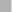 **注意**你不需要详细阅读本章来理解后面的章节和它们包含的 WinJS UI 控件的描述。我已经包括了这一章，所以你可以看到我是如何创建这些例子的。这一章有很多代码和标记，可能会很难，所以你可能想浏览一下这些材料，并在你构建了最初的几个 Metro 应用后返回来更深入地阅读。

### 了解最终应用

如果你能看到我想要的结果，这将有助于理解应用。我的目标是向您展示一个简单的初始布局，带有一个包含每个 UI 控件命令的导航栏。你可以在图 10-1 中看到这个初始布局，它显示了导航条命令。

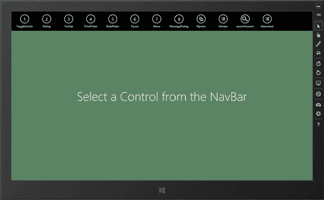

***图 10-1。**应用和导航条的初始布局只需一个命令*

每个 NavBar 命令都有一个按钮，点击它会产生一个包含两个面板的页面。左侧面板将包含我正在演示的 UI 控件。右面板将包含其他 UI 控件，您可以使用这些控件来更改左面板中控件的设置。你可以在图 10-2 的[中看到一个例子，它展示了我如何演示`FlipView`控件(我在第 14 章](#fig_10_2)的[中描述了它)。](14.html)

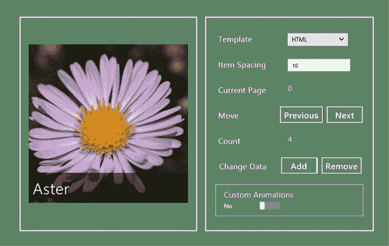

***图 10-2。**flip view 控件的显示*

右侧面板中的每个控件都允许您查看或更改左侧面板中控件的属性。在创建示例框架时，我的目标是能够尽可能简洁地生成这种标记和驱动它的代码。在图 10-2 中，你可以看到我需要生成的不同类型的控件:

> *   The `select` element allows the user to choose from a fixed range of values.
> *   The `input` element allows the user to enter unconstrained values.
> *   The `span` element displays a read-only value to the user.
> *   A set of `button` elements allows users to perform operations.
> *   The `ToggleSwitch` control lets the user select the `boolean` value.

`ToggleSwitch`控件是 WinJS UI 控件之一，我在[第 11 章](11.html)中描述了它。你可能想读完第 11 章然后回到这里，但是我在这一章的重点是生成我需要的标记，我不会深入控件的细节。

 **注意**虽然总体结果比冗长重复的清单更简洁，但框架本身相当复杂，这一章包含了大量代码，其中大部分与处理模板有关，我在第 8 章的[中描述过。](08.html)

### 创建基本项目结构

首先，我将创建应用的基本结构，以便向用户显示初始消息，并且导航条已经就位。我还将添加导航机制，并将用于视图模型的代码文件放在适当的位置，并保存我需要的每组配置控件的详细信息列表。我首先使用`Blank App`模板创建一个新的 Visual Studio 项目调用`UIControls`，并对 default.html 文件做一些基本的添加，如[清单 10-1](#list_10_1) 所示。

***清单 10-1。来自 UIControls 项目的初始 default.html 文件***

`<!DOCTYPE html>
<html>
<head>
    <meta charset="utf-8">
    <title>UIControls</title>

    <!-- WinJS references -->
    <link href="//Microsoft.WinJS.1.0/css/ui-dark.css" rel="stylesheet" />
    
    

    <!-- UIControls references -->
    <link href="/css/default.css" rel="stylesheet">
**    **
**    **
**    **
    `  `</head>
<body>
**    
**
**        <button data-win-control="WinJS.UI.AppBarCommand"**
**            data-win-options="{section:'selection'}"**
**            data-win-bind="winControl.label: name; winControl.icon: icon">**
**        </button>  **
**    
**

**    
**
**        <h1 class="message">Select a Control from the NavBar</h1>**
**    
**

**    

**
</body>
</html>`

我添加的`script`元素指的是我稍后将添加的代码文件。

`templates.js`文件将包含使用 WinJS 模板生成元素所需的代码。这些是我在[第 8 章](08.html)中介绍的同类模板，我将在`default.html`文件中定义它们。事实上，您已经可以看到清单中的第一个模板——其`id`为`navBarCommandTemplate`的元素将用于为 NavBar 生成命令，允许用户导航到应用中的内容页面，每个页面将展示一个 WinJS UI 控件。

`controls.js`文件将包含我需要生成的配置控件的细节，以便演示每个 WinJS UI 控件。`viewmodel.js`文件将包含我需要的其他部分，比如绑定值转换器和 WinJS UI 控件的数据集，这些控件是由数据驱动的。

#### 添加模板生成代码

我的下一步是创建`js/templates.js`文件，并用生成 NavBar 命令所需的代码填充它。你可以在清单 10-2 的[中看到这个文件的初始版本，我将在整个章节中添加这个文件，为创建我需要的不同种类的配置控件添加支持。](#list_10_2)

***清单 10-2** 。templates.js 文件的初始版本*

`(function () {

    var navBarCommands = [
          { name: "AppTest", icon: "target" },
          { name: "ToggleSwitch", icon: "\u0031" },
          { name: "Rating", icon: "\u0032" },
          { name: "Tooltip", icon: "\u0033" },
          { name: "TimePicker", icon: "\u0034" },
          { name: "DatePicker", icon: "\u0035" },
          { name: "Flyout", icon: "\u0036" },
          { name: "Menu", icon: "\u0037" },
          { name: "MessageDialog", icon: "\u0038" },
          { name: "FlipView", icon: "pictures" },
          { name: "ListView", icon: "list" },
          { name: "SemanticZoom", icon: "zoom" },` `          { name: "ListContext", icon: "list" },
    ];

    WinJS.Namespace.define("Templates", {

        generateNavBarCommands: function (navBarElement, templateElement) {
            navBarCommands.forEach(function (commandItem) {
                templateElement.winControl.render(commandItem, navBarElement);
            });
        },

    });
})();`

`navBarCommands`数组包含我想要创建的每个命令的细节。数组中的每一项都有`name`和`icon`属性，我在`default.html`文件中定义的`navBarCommandTemplate`模板中使用了这些属性。

当我创建完框架后，我将删除其中的第一项，即 name 属性为`AppTest`的项。我添加它只是为了在我创建示例框架时演示它，在本书这一部分的其余章节中不会用到它。

我使用了`WinJS.Namespace.define`方法来创建一个名为`Templates`的新名称空间。这个名称空间将包含我需要从我在`default.html`文件中定义的模板生成元素的函数。开始只有一个函数，它对应于我已经定义的单个模板。`generateNavBarCommands`函数有两个参数:第一个参数是 NavBar 元素，生成的命令元素将插入其中，第二个参数是用来生成这些元素的模板。该函数枚举`navBarCommands`数组中的元素，并使用`WinJS.Binding.Template.render`方法从数组项中生成元素，并将它们插入到 NavBar 元素中。

**了解 WINCONTROL 属性**

当我向你展示如何使用模板时，我在[第 8 章](08.html)中介绍了`winControl`属性，但是它是 WinJS 的一个更普遍的特征，并且当涉及到 UI 控件时特别重要。您很快就会看到，WinJS UI 控件被应用于常规的 HTML 元素，最典型的是`div`元素。WinJS 通过向底层元素添加子元素、CSS 样式和事件侦听器来创建控件，这是一种由 jQuery UI 等 web 应用 UI 库共享的技术。

当 WinJS 创建控件时，它会将`winControl`属性添加到代表底层元素的`HTMLElement`对象中，并将该属性的值设置为来自`WinJS.UI`命名空间的对象。从`winControl`属性中获取的对象让您可以访问由`WinJS.UI`对象定义的属性、方法和事件，您可以使用它们来配置控件或响应用户交互。在本章和后面的章节中，你会看到我经常使用`winControl`属性来设置和管理我创建的 WinJS 控件。

`WinJS.Binding.Template`对象遵循相同的模式。我通过将`data-win-control attribute`设置为我想要创建的控件的名称来创建一个模板，在本例中是`WinJS.Binding.Template`。模板没有可视组件，但是 WinJS 仍然创建控件并设置`winControl`属性。`WinJS.Binding.Template`控件定义了 render 方法，因此为了访问这个方法，我找到了具有 data `-win-control`属性的元素，并对由`winControl`属性返回的对象调用了`render`方法。这是您将在所有 WinJS 控件中看到的模式。

#### 添加导航码

在`/js/default.js`文件中，我添加了处理`WinJS.Navigation.navigating`事件的代码，并注册了一个来自导航条的`click`事件的监听器函数。我还调用了`ViewModel.Templates.generateNavBarCommands`方法来使用命令填充 NavBar，这些命令将应用导航到各个 UI 控件的内容页面(尽管我还没有创建这些文件，因此单击 NavBar 命令会导致错误)。你可以在清单 10-3 中的[文件中看到代码。](#list_10_3)

***清单 10-3** 。/js/default.js 文件的内容*

`(function () {
    "use strict";

    var app = WinJS.Application;
    window.$ = WinJS.Utilities.query;
    WinJS.Binding.optimizeBindingReferences = true;

    WinJS.Navigation.addEventListener("navigating", function (e) {
        WinJS.UI.Animation.exitPage(contentTarget.children).then(function () {
            WinJS.Utilities.empty(contentTarget);
            WinJS.UI.Pages.render(e.detail.location, contentTarget)
                .then(function () {
                    return WinJS.Binding.processAll(contentTarget, ViewModel.State)
                        .then(function () {
                            return WinJS.UI.Animation.enterPage(contentTarget.children)
                        });
                });
        });
    });

    app.onactivated = function (eventObject) {
        WinJS.UI.processAll().then(function () {

            Templates.generateNavBarCommands(navbar, navBarCommandTemplate);

            navbar.addEventListener("click", function (e) {
                var navTarget = "pages/" + e.target.winControl.label + ".html";
                WinJS.Navigation.navigate(navTarget);
                navbar.winControl.hide();
            });
        })

        //.then(function() {
        //    return WinJS.Navigation.navigate("pages/AppTest.html");
        //})
    };

    app.start();
})();`

`navigating`事件的处理程序使用`WinJS.UI.Animation`名称空间来制作从一个内容页面到另一个内容页面的动画，我在第 18 章的[中描述了这个名称空间。我之所以在这里使用它，是因为内容之间的转换可能太快而无法注意到，而且动画有助于将用户的注意力吸引到内容已经改变的事实上。](18.html)

NavBar 的`click`事件处理程序从所使用的命令按钮(通过`winControl`属性)获取`label`属性的值，并使用该值导航到`pages`目录中相应的 HTML 文件(我将很快创建该文件)。这遵循了我在[第五章](05.html)中介绍的相同的导航和内容管理模式，从那以后我已经在几个示例应用中使用过了。

`default.html`文件中的 JavaScript 非常简单，因为繁重的工作将由我添加到`templates.js`和`viewmodel.js`文件中的代码来完成。对于这个应用，default.html 文件只负责设置导航和导航条。

 **提示**您会注意到清单中有一些语句被注释掉了。这些是在应用首次加载时自动显示给定内容页面的有用快捷方式，这在您测试和调试示例应用中的页面时非常有用(否则您必须使用 NavBar，如果您像我一样使用短暂的代码然后测试周期，这很快就会变得令人厌倦)。

#### 添加其他 JavaScript 文件

在开始添加内容页面之前，我想让应用的基本结构就位，所以我现在将添加`viewmodel.js`文件和`controls.js`文件，尽管它们将只包含创建名称空间的代码。[清单 10-4](#list_10_4) 显示了`js/controls.js`文件的内容，它创建了一个名为`App.Controls`的名称空间。我将使用这个名称空间来包含我需要为每个内容页面生成的控件的细节。

***清单 10-4。**controls . js 文件的内容*

`(function () {

    WinJS.Namespace.define("App.Controls", {
        // ...details of configuration controls will go here
    });

})();`

初始版本的`js/viewmodel.js`文件如[清单 10-5](#list_10_5) 所示，目前它只是创建了一个名为`ViewModel`的名称空间。

***清单 10-5** 。js/viewmodel.js 文件的初始内容*

`(function () {
    "use strict";

    WinJS.Namespace.define("ViewModel", {
        // ...code for view model will go here
    });

})();`

在本章中我不会用到`viewmodel.js`文件，但是当我遇到一些更复杂的 WinJS UI 控件，比如`FlipView`和`ListView`时，我会用到它(我在[第 14 章](14.html)和[第 15 章](15.html)中描述过)。

#### 添加 CSS

在`css/default.css`文件中，我已经定义了我将用来显示不同 UI 控件的通用样式。有些控件需要额外的 CSS，但是我会在向你展示控件如何工作的时候处理这个问题。您可以在[清单 10-6](#list_10_6) 中看到`default.css`文件的内容。为了完整起见，我展示了这个文件，但是这些样式中没有新的技术，并且为了简单起见，我没有添加对响应应用视图或方向变化的支持。

***清单 10-6** 。css/default.css 文件的内容*

`body {
    background-color: #5A8463; display: -ms-flexbox; -ms-flex-direction: column;
    -ms-flex-align: center; -ms-flex-pack: center; }

.inputContainer, .selectContainer, .spanContainer {
    width: 100%;}

h2.controlTitle {
    margin: 10px 0px; color: white; font-size: 20px; display: inline-block;
    padding: 10px; font-weight: bolder; width: 140px;}

.controlPanel .win-toggleswitch { width: 90%; margin: 15px; padding-left: 20px;}
.win-toggleswitch .win-title { color: white; font-size: 20px;}

div.flexContainer { display: -ms-flexbox;  -ms-flex-direction: row;
    -ms-flex-align: stretch; -ms-flex-pack: center; }

.controlPanel {
    display: -ms-flexbox; -ms-flex-direction: column; -ms-flex-align: center;
    -ms-flex-pack: center;    border: medium white solid;
    margin: 10px; padding: 20px; min-width: 300px;}

[data-win-control="WinJS.UI.ToggleSwitch"] {
    border: thin solid white; margin: 5px; padding: 10px;width: 250px;}

input.controlInput, select.controlSelect, span.controlSpan  {
    width: 150px;display: inline-block; margin-left: 20px;}

span.controlSpan {
    white-space: nowrap; text-overflow: ellipsis; overflow: hidden; font-size: 14pt;}

div.buttonContainer button {margin: 5px; font-size: 16pt;}

.textPara { display: inline-block; width: 200px; font-size: 18pt;}
.win-tooltip { background-color: #8ED09C; color: white;
    border: medium solid white; font-size: 16pt;}`

如果你此时运行应用，你会看到类似于[图 10-3](#fig_10_3) 的东西。导航栏在图中显示为两行，因为标准 Visual Studio 模拟器分辨率的按钮太多了——如果模拟器设置为更大的分辨率(我在第 6 章的[中描述了这一点)，你就不会有这个问题。在这一章的最后，我将把`AppTest`按钮从导航条上移除，这将把命令放在一行上。`AppTest`按钮将导航到`pages/Apptest.html`文件，我只使用它来开发和演示示例框架应用。](06.html)

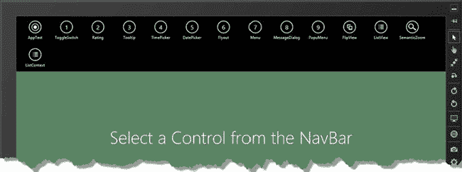

***图 10-3。**示例 app 的初始状态*

### 创建测试内容页面

应用的基本结构已经就绪，这意味着我可以将注意力转向创建测试内容页面和填充它所需的代码。同样，向您展示完成的内容，然后再向您展示我是如何创建的，会更容易。在[图 10-4](#fig_10_4) 中可以看到点击导航栏上`AppTest`按钮的结果。

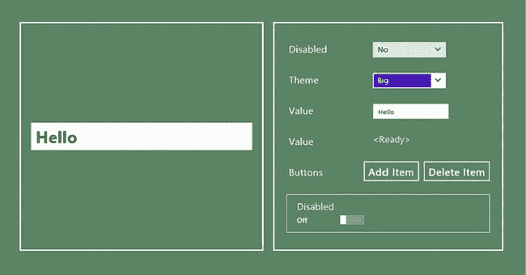

***图 10-4。**点击导航栏上的 AppTest 按钮时显示的完成内容*

在接下来的几节中，我将带您了解我用来创建这些内容的过程以及生成大量内容的代码。

#### 创建内容页面

单击其中一个导航栏按钮会从项目`pages`文件夹中加载一页内容，所以我的第一步是使用解决方案浏览器实际创建`pages`文件夹。然后我可以添加`AppTest.html`文件，这个文件将在点击导航栏上的`AppTest`按钮时被加载。你可以在[清单 10-7](#list_10_7) 中看到这个文件的初始内容。

***清单 10-7** 。`AppTest.html`页*的初始内容

`<!DOCTYPE html>
<html>
<head>
    <title></title>
    
</head>
<body>
    

        

            <input id="inputElem"/>
        

        

    

</body>
</html>`

这个文件显示了标准模式，我将遵循这个模式来演示每个 WinJS UI 控件。文件中的 HTML 标记包含两个`div`元素。第一个包含我正在演示的 UI 控件。为了保持本章的简单，我将使用常规的 HTML `input`元素，而不是 WinJS UI 控件之一——这将允许我专注于我正在构建的框架，而不必深入 WinJS 控件的细节。对于这个例子，我给`input`元素分配了一个`inputElem`的`id`值，如下所示:

`...

    <input **id="inputElem"**/>

...`

另一个`div`元素将包含允许用户配置正在演示的控件的元素。这是本章的主要焦点——描述我需要的元素并从模板中生成它们的过程，这样我就不必在的后续章节中重复大量的标记和代码。目标`div`元素的`id`是`rightPanel`，因为它是布局中最右边的面板而得名:

`...

...`

内容页面最重要的部分是包含在`script`元素中的 JavaScript。我使用第 5 章的[中的 WinJS Pages 特性来注册一个`ready`函数，该函数将在加载内容页面时执行。关键语句是对`Templates.createControls`方法的调用，如下所示:](05.html)

`...
Templates.createControls(rightPanel, inputElem, "apptest");
...`

这是生成我需要的配置元素的方法。此方法的参数是:

> *   Element, which will contain the created configuration control.
> *   UI control element being demonstrated
> *   A key that identifies the set of controls to be generated.

对于`AppTest.html`文件，目标元素是`id`为`rightPanel`的元素。`input`元素是正在演示的元素，我使用的键是`apptest`。在下一节中，您将看到如何使用这些值。

### 创建模板系统

现在我已经有了一个要处理的测试内容页面，我可以开始构建代码来生成我需要的元素，以演示`input`元素的一些特性，正如您所记得的，它是一个真正的 WinJS UI 控件的简单替代。在接下来的小节中，我将向您展示我如何描述所需的配置元素集，以及我创建它们的方法。

我将从创建一个配置元素开始。它将是一个`select`元素，可用于禁用或启用`input`元素。你可以在[图 10-5](#fig_10_5) 中看到这个选择元素创建后的样子。它非常简单，是我开始描述代码不同部分的好地方。

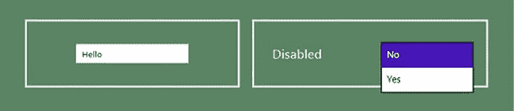

***图 10-5。**生成选择元素来配置输入元素*

#### 描述一个选择元素

我必须从描述我想要生成的`select`元素开始。我在`/js/controls.js`文件中这样做，你可以看到我在[清单 10-8](#list_10_8) 中添加的内容。select 元素有两个选项——`No`和`Yes`，，当选择`No`值时，它们将把`input`元素的`disabled`属性的值设置为空字符串(`""`)，当选择`Yes`值时，它们将设置为`disabled`。

 **注意**我花了这么多时间来生成一个简单的可以用四行 HTML 标记编写的`select`元素，这可能有点奇怪。我试图解决的问题是，我有许多这些`select`元素要生成，我不想在本书这一部分的其他章节中一遍又一遍地列出本质上相同的标记。此外，您很快就会看到，我不仅仅是生成元素，我还创建了允许配置元素在我演示的 UI 控件上操作的事件处理程序，这是另一个非常重复的代码块，我不必在每章中列出。总的来说，在本章中致力于创建框架可以让我在接下来的章节中花更多的时间关注 WinJS UI 控件和它们的特性。

***清单 10-8** 。选择元素的初始定义*

`(function () {

    WinJS.Namespace.define("App.Controls", {

        apptest: [{
            type: "select",
            id: "disabled",
            title: "Disabled",
            values: ["", "disabled"],
            labels: ["No", "Yes"]
        }]
    });

})();`

你可以看到我已经在`App.Controls`名称空间中创建了一个名为`apptest`的数组——这是从`AppTest.html`文件传递给`Templates.createControls`方法的键。这个数组将包含一系列的*定义对象*，它们描述了我需要创建的每个配置元素。目前只有一个对象，它描述了你在图 10-4[中看到的`select`元素。](#fig_10_4)

 **提示**在后面的章节中，我将更简洁地列出定义对象。在这个例子中，我使用了在自己的行上显示每个属性，以便于理解这些对象是如何工作的。

我将很快解释对象中的每一个属性，但是首先我将把我用来生成`select`元素的模板添加到`default.html`文件中，如[清单 10-9](#list_10_9) 所示。在本章中，我将为我在这个框架中支持的每种配置元素添加一个模板。

***清单 10-9** 。向 default.html 文件添加用于生成选择元素的模板*

`...
<body>`  `

        <button data-win-control="WinJS.UI.AppBarCommand"
            data-win-options="{section:'selection'}"
            data-win-bind="winControl.label: name; winControl.icon: icon">
        </button>  
    

**    
**
**        
**
**            <h2 class="controlTitle" data-win-bind="innerText: title"></h2>**
**            <select class="controlSelect"></select>**
**        
**
**    
**

    

        <h1 class="message">Select a Control from the NavBar</h1>
    

    

</body>
...`

我将使用的模板结构将帮助我解释清单 10-8 中[定义对象的属性的用途，我已经在](#list_10_8)[表 10-1](#tab_10_1) 中列出了这些属性。

 **提示**此表解释了选择元素的定义对象的属性的含义。定义对象的每个*类型*都有一些额外的或不同的属性，我将在本章后面生成这类元素时解释这些属性。

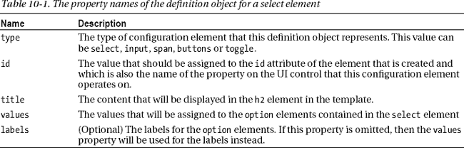

如果你回头看[清单 10-8](#list_10_8) ，你可以看到我分配给属性的值是如何与图 10-4 中显示的结果相对应的。type 属性设置为`select`，表示我想要一个`select`元素；id 属性设置为 disabled，对应的是我要管理的`input`元素属性；title 属性被设置为`Disabled`，这样用户就知道改变配置元素会对正在演示的 UI 控件产生什么影响。

最后，我使用了`values` *和* `labels`属性，因为`input.disabled`属性允许的值不适合显示给用户。通过为这两个属性提供值，我在呈现给用户的内容和分配给 UI 控件属性的值之间创建了一个映射。

#### 添加元素生成代码

我有了`select`元素的定义，也有了生成`select`元素的模板。现在我所需要的是将这些结合在一起的代码——我已经将这样做的结构添加到了`/js/templates.js`文件中，如[清单 10-10](#list_10_10) 所示。

***清单 10-10** 。使用 templates.js 文件中的定义和模板创建元素的代码*

`(function () {

var navBarCommands = [
        { name: "AppTest", icon: "target" },
];

WinJS.Namespace.define("Templates", {

    generateNavBarCommands: function (navBarElement, templateElement) {
        navBarCommands.forEach(function (commandItem) {
            templateElement.winControl.render(commandItem, navBarElement);
        });
    },

**    createControls: function (container, uiControl, key) {**
**        var promises = [];**

**        App.Controls[key].forEach(function (definition) {**
**            var targetObject = uiControl.winControl ? uiControl.winControl : uiControl;**
**            promises.push(Templates["create" + definition.type](container,definition,**
**                targetObject));**
**        });**

**        return WinJS.Promise.join(promises).then(function () {**
**            $("*[data-win-bind]", container).forEach(function (childElem) {**
**                childElem.removeAttribute("data-win-bind");**
**            });**
**        });**
**    },**

**    createtoggle: function (containerElem, definition, uiControl) {**
**        // ...code to create ToggleSwitch element will go here**
**    },**

**    createinput: function (containerElem, definition, uiControl) {**` `**        // ...code to create input element will go here**
**    },**

**    createselect: function (containerElem, definition, uiControl) {**
**        // ...code to create select element will go here**

**    },**

**    createspan: function (containerElem, definition, uiControl) {**
**        // ...code to create span element will go here**
**    },**

**    createbuttons: function (containerElem, definition, uiControl) {**
**        // ...code to create button elements will go here**
**    }**
});

})();`

我对这个文件所做的添加是以`createControls`方法为中心的，我从`AppTest.html`文件中调用这个方法来创建我想要的配置控件。`createControls`方法比看起来要简单，但是它是我构建这个框架所采用的方法的核心，所以我将向您详细介绍它，并将代码的工作方式与我在上一节中描述的示例`select`元素联系起来。

该方法的参数有:创建配置控件时应该放入的容器，将要由新创建的控件配置的 UI 控件，以及引用`controls.js`文件中定义对象集的键。对于`select`元素，这些参数将是来自`AppTest.html`文件中标记的`rightPanel`元素和`input`元素以及值`apptest`，它对应于包含我在[清单 10-8](#list_10_8) 中展示的`select`元素定义的数组。

##### 处理定义对象

我使用我收到的键从`App.Controls`名称空间获得关联的定义对象的数组。目前只有一个键(`apptest`)，我得到的数组只包含一个定义对象(对于我的`select`元素)，但是我将在本章后面添加更多的定义(在后续章节中添加更多的键)。

我使用`forEach`方法来枚举数组中的项目。我做的第一件事是建立我正在工作的目标对象。在后面的章节中，我将使用 WinJS 控件，它们都定义了`winControl`属性(详见*理解 winControl 属性*侧栏)，但是对于这一章，我将使用没有`winControl`属性的 input 元素。我是这样弄清楚我在做什么的:

`...
var targetObject = uiControl.winControl ? uiControl.winControl : uiControl;
...`

这很重要，因为我创建了事件处理程序，当我创建配置元素时，它将应用更改目标对象的属性值。当我使用 WinJS 控件时，我想操作控件，而不是应用它的底层 HTML 元素。在这一章中，没有 WinJS 控件，HTML 元素是我必须使用的全部。

确定了我的目标之后，我基于当前定义对象的 type 属性值，调用了`Templates`名称空间中的其他方法之一，如下所示:

`...
promises.push(Templates["create" + definition.type](container,definition, targetObject));
...`

目前我只有一个定义对象，它的 type 属性的值是 select，这意味着将调用`Templates.createSelect`方法。名称空间中的其他方法负责创建一种元素，并被传递给应该插入元素的容器、当前定义对象和目标对象。我将很快实现其中的第一个方法来演示它们是如何工作的。

元素创建方法返回一个`Promise`，我将它添加到一个名为 promises 的数组中。我在`promises`数组上使用了`Promise.join`方法(我在[第 9 章](09.html)中描述过)来创建一个`Promise`，当所有的单个元素都被创建、添加到容器元素并配置好之后，这个方法就完成了。

##### 清理结果

在`createObjects`方法中的最后一步是使用`then`方法指定一个函数，当所有的单个`Promise`对象都被满足时，这个函数将被执行。在这个函数中，我从所有拥有属性的元素中移除了属性`data-win-bind`。当我介绍`FlipView`元素时，我将详细解释为什么这是一件有用的事情[第 14 章](14.html)，但简短的版本是，如果在生成的`elements`添加到文档后调用`WinJS.Binding.processAll`方法，将`data-win-bind`属性留在已生成的元素上会导致问题。通过移除属性，我确保这种情况不会发生。

### 生成一个选择元素

现在一切就绪，我可以生成我的 select 元素了，我将通过在`templates.js`文件中实现`createselect`方法来实现它。你可以在[清单 10-11](#list_10_11) 中看到我是如何做到这一点的。

***清单 10-11** 。生成选择元素*

`...
createselect: function (containerElem, definition, uiControl) {
    return selectTemplate.winControl.render(definition).then(function (newElem) {

        var selectElem = WinJS.Utilities.query("select", newElem)[0];
        selectElem.id = definition.id;
        definition.values.forEach(function (value, index) {
            var option = selectElem.appendChild(document.createElement("option"));
            option.innerText = definition.labels ? definition.labels[index] : value;
            option.value = value;
        });

        selectElem.addEventListener("change", function (e) {
            setImmediate(function () {
                uiControl[definition.id] =
                   selectElem.options[selectElem.selectedIndex].value;` `            });
        });
        containerElem.appendChild(newElem.removeChild(newElem.children[0]));
        uiControl[definition.id] = selectElem.options[0].value;
    });
},
...`

由于这是我生成的第一种类型的元素，我将逐步遍历代码，并解释我如何创建结果。

#### 渲染模板

我首先使用添加到`default.html`文件中的模板来生成一组新的元素，如下所示:

`...
createselect: function (containerElem, definition, uiControl) {
    return selectTemplate.winControl.render(definition).then(function (newElem) {
       // *...code removed for brevity...*
},
...`

当你在一个只有一个参数的`WinJS.Binding.Template`对象上调用`render`方法时，你得到的`Promise`产生了当它被实现时已经被创建的元素，并且这些元素没有被插入到应用布局中。在这个清单中，我将定义对象从`controls.js`文件传递给`render`方法，这允许定义中包含的细节用于填充模板。提醒一下，下面是我正在使用的模板(我已经使用`id`属性值在代码中找到了它):

`...

    

        <h2 class="controlTitle" data-win-bind="innerText: title"></h2>
        <select class="controlSelect"></select>
    

...`

当`WinJS.Binding.Template`对象完成元素的渲染后，我就有了一些从模板生成的分离元素。分离的元素还不是应用内容的一部分，这些元素如下所示:

* * *

`

    

        <h2 class="controlTitle" data-win-bind="innerText: title">Disabled</h2>
        <select class="controlSelect">
        </select>
    

`

* * *

#### 配置&填充选择元素

此时，我已经拥有了我需要的元素，但是它们只是部分完成。我的下一步是完成 select 元素并添加代表用户可以做出的选择的`option`元素，如下所示:

`...
createselect: function (containerElem, definition, uiControl) {
    return selectTemplate.winControl.render(definition).then(function (newElem) {

**        var selectElem = WinJS.Utilities.query("select", newElem)[0];**
**        selectElem.id = definition.id;**
**        definition.values.forEach(function (value, index) {**
**            var option = selectElem.appendChild(document.createElement("option"));**
**            option.innerText = definition.labels ? definition.labels[index] : value;**
**            option.value = value;**
**        });**

        // *...code removed for brevity...*
    });
},
...`

我使用`WinJS.Utilities.query`方法定位从`render`方法传递给我的函数的元素集中的`select`元素。

我的第一个动作是将`id`属性设置为由定义对象指定的值。然后，我使用定义对象中的`values`和`labels`数组来创建一系列的`option`元素，我将它们作为子元素添加到 select 元素中。这给了我下面的 HTML:

* * *

`

    

        <h2 class="controlTitle" data-win-bind="innerText: title">Disabled</h2>
        <select class="controlSelect" **id="disabled"**>
**            <option value="">No</option>**
**            <option value="disabled">Yes</option>**
        </select>
    

`

* * *

#### 创建事件处理程序

当用户在`select`元素中选择`option`的 on 选项时，我想更新目标对象的属性值。为了确保这一点，我使用`addEventListener`方法为`change`事件注册一个处理函数，如下所示:

`...
createselect: function (containerElem, definition, uiControl) {
    return selectTemplate.winControl.render(definition).then(function (newElem) {

        var selectElem = WinJS.Utilities.query("select", newElem)[0];

        // *...code removed for brevity...*` `**        selectElem.addEventListener("change", function (e) {**
**            setImmediate(function () {**
**                uiControl[definition.id] =**
**                    selectElem.options[selectElem.selectedIndex].value;**
**            });**
**        });**

        // *...code removed for brevity...*
    });
},
...`

当`change`事件被触发时，我更新目标对象的属性以匹配从`select`元素中选取的值。请注意，我使用了`setImmediate`方法来延迟属性更改——这允许选择元素在 UI 控件的属性更改之前完成向新选择的值的转换。如果不调用`setImmediate`，应用会暂时没有响应，因为控件的属性更改会在`select`元素完成响应用户选择值之前执行。

#### 整理完毕

当我从模板中生成元素时，我最终得到了一个我不想添加到应用布局中的外部`div`元素。为此，在我设置了事件处理程序之后，我选择了第一个子元素，并使用传递给该方法的`container`参数将其添加到应用布局中，如下所示:

`...
createselect: function (containerElem, definition, uiControl) {
    return selectTemplate.winControl.render(definition).then(function (newElem) {

        // *...code removed for brevity...*

**        containerElem.appendChild(newElem.removeChild(newElem.children[0]));**
**        uiControl[definition.id] = selectElem.options[0].value;**
    });
},
...`

最后一步是设置 UI 控件的属性，以匹配选择菜单的初始值，这确保了选择控件和所演示的 UI 控件的状态是同步的。

您可以通过启动应用并从导航栏中选择`AppTest`命令来测试这些附加功能。您将能够通过从右侧面板的`select`元素中选取值来启用和禁用左侧面板中的`input`元素。

### 使用代理对象

不是所有我想在后面章节中展示的特性都可以简单地通过设置属性值来演示。在这些情况下，我需要使用一个代理对象，这样我就可以以一种有用的方式响应对配置元素所做的更改。在这一节中，我将向您展示我是如何将这个特性添加到示例框架中的。

#### 添加定义对象

首先，我将向`controls.js`文件添加一个新的定义对象，这将提供一个配置选项，它不能被转换成简单的属性更改。你可以在清单 10-12 中看到这个新定义。

***清单 10-12** 。向 controls.js 文件添加新的定义对象*

`(function () {

WinJS.Namespace.define("App.Controls", {

    apptest: [
        { type: "select", id: "disabled", title: "Disabled",
            values: ["", "disabled"], labels: ["No", "Yes"] },
**        { type: "select", id: "theme", title: "Theme", values: ["Small", "Big"],**
**              useProxy: true },**
    ]
});

})();`

这个定义指定了另一个`select`元素，带有`Small`和`Big`选项。重要的添加是`useProxy`属性，我已经将它设置为`true`。这将表明，当用户从`select`元素中选择一个`option`时，新值应该应用于代理，而不是直接应用于正在演示的 UI 控件。

#### 创建代理对象

我在内容页面的`script`元素中创建代理对象，如清单 10-13 中的[所示，它展示了我对`AppTest.html`文件所做的添加。我创建了一个名为`proxyObject`的可观察对象，并将其作为参数传递给`createControls`方法。我使用`WinJS.Binding.as`方法创建可观察对象，我在第 8 章](#list_10_13)的[中描述过。](08.html)

***清单 10-13** 。向 AppTest.html 文件添加代理对象*

`<!DOCTYPE html>
<html>
<head>
    <title></title>
    
</head>
<body>
    

        

            <input id="inputElem"/>
        

        

    

</body>
</html>`

#### 检测和使用代理对象

接下来，我需要更新`templates.js`文件中的`createControls`方法，以便它可以接收代理对象，并在定义对象需要时使用它。你可以在[清单 10-14](#list_10_14) 中看到我为此所做的修改。

***清单 10-14** 。在 createControls 方法中添加对代理对象的支持*

`...
createControls: function (container, uiControl, key, **proxy**) {
    var promises = [];

    App.Controls[key].forEach(function (definition) {
**        var targetObject = definition.useProxy ? proxy : uiControl.winControl ?**
**            uiControl.winControl : uiControl;**
        promises.push(Templates["create" + definition.type](container,definition,
            targetObject));
    });

    return WinJS.Promise.join(promises).then(function () {
        $("*[data-win-bind]", container).forEach(function (childElem) {
            childElem.removeAttribute("data-win-bind");
        });
    });
},
...`

更改相对简单——我只需扩展为配置控制更改选择目标的语句，以考虑代理对象。

这种添加的效果是，当定义对象指定应该使用代理对象时，从模板生成的`select`元素的事件处理程序将更改代理上指定属性的值，而不是`winControl`属性或 HTML 元素本身。

#### 响应代理对象属性变化

最后一步是返回到`AppTest.html`文件中的 script 元素，并添加一些代码来监控可观察代理对象的变化。你可以在清单 10-15 中看到我是如何做到的。

***清单 10-15** 。观察代理对象的变化*

`...

...`

当用户使用新的`select`元素选取一个值时，代理对象中的`theme`属性将会改变。我使用`bind`方法观察主题属性，我在第 8 章的[中描述过，并改变两个 CSS 属性来创建不同的视觉效果。这是一个简单的演示，说明了我如何使用我的示例框架将配置元素与更复杂的 UI 控件特性绑定在一起——这是我将在接下来的章节中经常用到的。你可以在](08.html)[图 10-6](#fig_10_6) 中看到选择`Big`和`Small`值的结果。

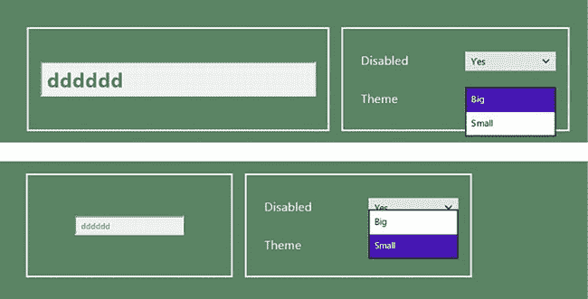

***图 10-6。**使用代理对象支持更复杂的配置*

### 生成其他元素类型

现在，您已经看到了示例框架中的所有复杂性。剩下的工作就是为不同的元素类型添加剩余的模板，并在`controls.js`文件中实现使用它们的方法。在接下来的小节中，我将结束这个框架，并创建一个新的定义对象来演示其余类型的配置元素。本章的剩余部分没有新的技术，所以我将列出每种元素类型所需的模板和代码，并展示一个生成每种元素类型的定义对象的例子。

#### 生成输入元素

我使用`input`元素来允许用户输入不受约束的值。您可以在清单 10-16 的[中看到输入配置元素的定义对象。](#list_10_16)

***清单 10-16。**输入配置元素的定义对象*

`(function () {

WinJS.Namespace.define("App.Controls", {

    apptest: [
        { type: "select", id: "disabled", title: "Disabled", values: ["", "disabled"],
            labels: ["No", "Yes"] },
        { type: "select", id: "theme", title: "Theme", values: ["Small", "Big"],
            useProxy: true },
**        { type: "input", id: "value", title: "Value", value: "Hello" },**
    ]
});

})();`

你可以在[表 10-2](#tab_10_2) 中看到该定义对象中属性的含义。

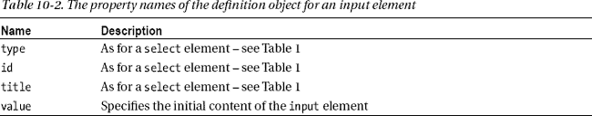

您可以从我用来生成[清单 10-17](#list_10_17) 中的`input`元素的`default.html`文件中看到模板。

***清单 10-17** 。来自 default.html 文件的输入元素模板*

`...

    
` `        <h2 class="controlTitle" data-win-bind="innerText: title"></h2>
        <input class="controlInput" data-win-bind="value: value"/>
    

...`

您可以在[清单 10-18](#list_10_18) 中的`controls.js`文件中看到`createinput`方法的实现。

***清单 10-18。**controls . js 文件中 createinput 方法的实现*

`...
createinput: function (containerElem, definition, uiControl) {
    return inputTemplate.winControl.render(definition).then(function (newElem) {
        WinJS.Utilities.query("input", newElem).forEach(function (elem) {
            elem.id = definition.id;
            elem.addEventListener("change", function (e) {
                setImmediate(function () {
                    uiControl[elem.id] = elem.value;
                });
            });
            uiControl[definition.id] = elem.value;                
        });
        containerElem.appendChild(newElem.removeChild(newElem.children[0]));
    });
},
...`

您输入到我在本节中创建的`input`配置元素中的值更新了布局左侧面板中的`input`元素的值，这是 WinJS UI 控件将在后面章节中出现的位置。请注意，这种关系只是单向的——也就是说，在左侧面板的 input 元素中输入文本不会更新右侧面板中 input 元素的内容。

#### 生成一个跨度元素

我使用`span`元素来显示 UI 控件的一些只读特性，通常是为了支持演示一些其他特性。我在生成`span`元素时没有创建事件监听器，而是从内容页面的`script`元素中更新内容。清单 10-19 显示了向`controls.js`文件添加一个`span`定义对象。

***清单 10-19** 。向 controls.js 文件添加 span 定义对象*

`(function () {

WinJS.Namespace.define("App.Controls", {
    apptest: [
        { type: "select", id: "disabled", title: "Disabled", values: ["", "disabled"],
            labels: ["No", "Yes"] },
        { type: "select", id: "theme", title: "Theme", values: ["Small", "Big"],
            useProxy: true },
        { type: "input", id: "value", title: "Value", value: "Hello" },
**        { type: "span", id: "value", value: "<Ready>", title: "Value" },**` `    ]
});

})();`

你可以在[表 10-3](#tab_10_3) 中看到该定义对象中属性的含义。

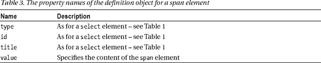

您可以从 default.html 文件中看到我用来生成清单 10-20 中的[元素的模板。](#list_10_20)

***清单 10-20** 。来自 default.html 文件的跨度模板*

`...

    

        <h2 class="controlTitle" data-win-bind="innerText: title"></h2>
        
    

...`

您可以在[清单 10-21](#list_10_21) 中的`templates.js`文件中看到`createinput`方法的实现。

***清单 10-21** 。templates.js 文件中 createspan 方法的实现*

`...
createspan: function (containerElem, definition, uiControl) {
    return spanTemplate.winControl.render(definition).then(function (newElem) {
        WinJS.Utilities.query("span", newElem).forEach(function (elem) {
            elem.id = definition.id;
        });
        containerElem.appendChild(newElem.removeChild(newElem.children[0]));
    });
},
...`

#### 生成按钮元素

我使用`button`配置元素让用户触发某种动作——通常是从数据源中添加或删除项目，我会在第 14 章的[中向您介绍。您可以在清单 10-22](14.html) 的[中看到按钮元素的定义对象。](#list_10_22)

***清单 10-22** 。按钮元素的定义对象*

`(function () {

WinJS.Namespace.define("App.Controls", {

    apptest: [
        { type: "select", id: "disabled", title: "Disabled", values: ["", "disabled"],
            labels: ["No", "Yes"] },
        { type: "select", id: "theme", title: "Theme", values: ["Small", "Big"],
           useProxy: true },
        { type: "input", id: "value", title: "Value", value: "Hello" },
        { type: "span", id: "value", value: "<Ready>", title: "Value" },
**        { type: "buttons", title: "Buttons", labels: ["Add Item", "Delete Item"] },**
    ]
});

})();`

你可以在[表 10-4](#tab_10_4) 中看到该定义对象中属性的含义。

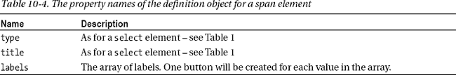

我不使用模板来生成按钮元素，我将事件处理程序留给内容页面，这意味着在`templates.js`文件中实现`createbuttons`方法，如[清单 10-23](#list_10_23) 所示，特别简单。

***清单 10-23** 。templates.js 文件中 createbuttons 方法的实现*

`...
createbuttons: function (containerElem, definition, uiControl) {
    var newDiv = containerElem.appendChild(document.createElement("div"));
    WinJS.Utilities.addClass(newDiv, "buttonContainer");
    if (definition.title) {
        var titleElem = newDiv.appendChild(document.createElement("h2"))
        titleElem.innerText = definition.title;
        WinJS.Utilities.addClass(titleElem, "controlTitle");
    }
    definition.labels.forEach(function (label) {
        var button = newDiv.appendChild(document.createElement("button"));
        button.innerText = label;
    });
}
...`

#### 生成 ToggleSwitch 控件

`WinJS.UI.ToggleSwitch`控件让用户选择真/假值。我将在下一章详细演示这个控件，所以我不想在这一章讨论任何细节。我将按原样呈现定义对象、模板和代码，在您阅读完[第 11 章](11.html)后，它们将变得有意义。你可以在[清单 10-24](#list_10_24) 中看到一个`ToggleSwitch`控件的定义对象。

***清单 10-24** 。ToggleSwitch 控件的定义对象*

`(function () {

WinJS.Namespace.define("App.Controls", {

    apptest: [
        { type: "select", id: "disabled", title: "Disabled", values: ["", "disabled"],
            labels: ["No", "Yes"] },
        { type: "select", id: "theme", title: "Theme", values: ["Small", "Big"],
             useProxy: true },
        { type: "input", id: "value", title: "Value", value: "Hello" },
        { type: "span", id: "value", value: "<Ready>", title: "Value" },
        { type: "buttons", title: "Buttons", labels: ["Add Item", "Delete Item"] },
**        { type: "toggle", id: "disabled", title: "Disabled", value: false},**
    ]
});

})();`

你可以在[表 10-5](#tab_10_5) 中看到该定义对象中属性的含义。

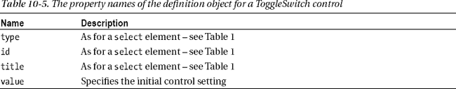

你可以在[清单 10-25](#list_10_25) 中看到我用来创建`ToggleSwitch`控件的`default.html`文件中的模板。

***清单 10-25** 。生成 ToggleSwitch 控件的模板*

`...

    

    

...`

最后，您可以在[清单 10-26](#list_10_26) 中看到`createtoggle`方法的实现。我将在[第 11 章](11.html)中解释我通过`winControl`属性设置的属性。

***清单 10-26** 。templates.js 文件中 createtoggle 方法的实现*

`...
createtoggle: function (containerElem, definition, uiControl) {
    return toggleSwitchTemplate.winControl.render(definition).then(function (newElem) {
        var toggle = newElem.children[0];
        toggle.id = definition.id;
        if (definition.labelOn != undefined) {
            toggle.winControl.labelOn = definition.labelOn;
            toggle.winControl.labelOff = definition.labelOff;
        }
        toggle.addEventListener("change", function (e) {
            setImmediate(function () {
                uiControl[definition.id] = toggle.winControl.checked;
            });
        });
        containerElem.appendChild(newElem.removeChild(toggle));
        uiControl[definition.id] = toggle.winControl.checked;
    });
},
...`

如果您运行带有所有这些定义对象、模板和方法实现的示例应用，您将会看到如图[图 10-4](#fig_10_4) 所示的布局。

### 打扫卫生

现在剩下的就是从导航条上移除`AppTest`命令按钮，这样我在下一章就有了一个干净的项目。你可以在[清单 10-27](#list_10_27) 中看到我对`templates.js`文件所做的最后修改。

***清单 10-27** 。从导航条上取下测试按钮*

`...
var navBarCommands = [
        **//**{ name: "AppTest", icon: "target" },
        // *...other commands omitted for brevity...*
];
...`

### 总结

在这一章中，我已经解释了我是如何创建框架的，我将用它来演示本书这一部分的剩余章节中的 WinJS UI 控件。尽管这个框架本身解释起来相当冗长，但它让我避免了在每章的前十页列出大部分相同的代码和标记。这个项目还有一个额外的好处，就是演示了一些核心的 WinJS 特性如何以更复杂的方式组合起来，以创建更丰富的效果。在接下来的章节中，我将带您浏览一下您可以在 Metro 应用中使用的 UI 控件，以提供更丰富的体验，并为您的用户提供与其他 Metro 应用一致的外观。