# 十二、使用`TimePicker`和`DatePicker`和`Flyout`

在这一章中，我继续探索 WinJS UI 控件，重点是`TimePicker`、`DatePicker`、`Flyout`和`Menu`控件。`TimePicker`和`DatePicker`控件允许用户指定时间和日期，顾名思义。这些是带有一些设计问题的基本控件，这些设计问题使它们比它们本应具有的功能更难使用(也更没用)。你已经在第 7 章的[中看到了`Flyout`控件，在那里我将它与 AppBar 一起使用。作为一个通用控件，T7 有着更广泛的存在，我解释了在这种情况下使用它所需要知道的一切。表 12-1](07.html#ch7) 提供了本章的总结。

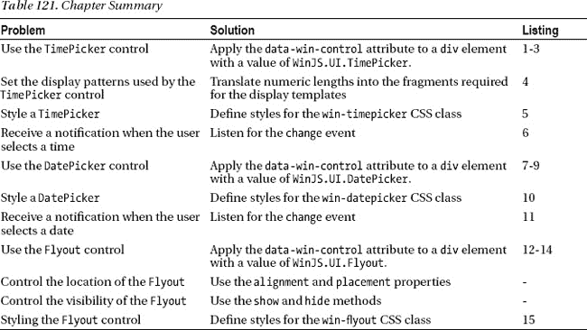

### 使用时间选择器控件

`WinJS.UI.TimePicker`控件允许用户选择时间。HTML5 在`input`元素中增加了支持时间和日期输入的功能，但是在 Internet Explorer 10 中不支持，你必须使用`TimePicker`和`DatePicker`控件来代替(我将在本章后面描述`DatePicker`)。你可以在图 12-1 的[中看到`TimePicker`控件是如何显示给用户的。](#fig_12_1)

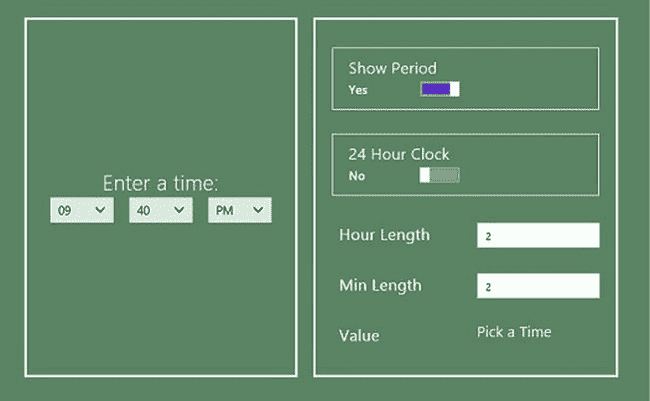

***图 12-1。**时间选择器控制和支持配置设置*

#### 何时使用时间选择器控件

当您需要用户指定一天中的时间时，您应该使用`TimePicker`控件。`TImePicker`控件尊重用户机器的语言环境设置，因此使用本地化的时间首选项捕获时间——尽管，正如您将看到的，这并不完全成功。

控件的质量没有我希望的那么好。众所周知，本地化的时间和日期首选项很难得到正确，必须做出一些让步，但即使如此，在`TimePicker`中反映出的不幸的设计选择使它的用处大大降低。我对这个控件和它的同伴`DatePicker`的总体印象是，这是一个仓促的工作，很少考虑控件将如何使用。

#### 演示时间选择器控件

按照上一章的模式，我在第十章的[中开始的 Visual Studio 项目的`pages`文件夹中添加了一个名为`TimePicker.html`的文件。您可以在](10.html#ch10)[清单 12-1](#list_12_1) 中看到该文件的内容。

***清单 12-1** 。TimePicker.html 文件的内容*

`<!DOCTYPE html>
<html>
<head>` `    <title></title>
    
</head>
<body>
    

        

            <h2>Enter a time:</h2>
            <**div id="picker" data-win-control="WinJS.UI.TimePicker"**
                **data-win-options="{minuteIncrement: 10}">**
            **
**
        

        

    

</body>
</html>`

这是我需要代理对象特性的第一个控件，我在第 10 章的[中将其添加到示例框架中。正如您将看到的，当我解释由`TimePicker`控件定义的属性如何工作时，我不容易将我为布局中的右侧面板生成的配置控件中的值映射到我可以与`TimePicker`属性一起使用的值。](10.html#ch10)

您可以看到我如何在添加到`/js/controls.js`文件的定义对象中使用代理对象来演示[清单 12-2](#list_12_2) 中的`TimePicker`控件。

***清单 12-2** 。将定义对象添加到 TimePicker 控件的 controls.js 文件中*

`...
**timePicker**: [
    { type: "toggle", id: "showPeriod", title: "Show Period", value: true,
        useProxy: true, labelOn: "Yes", labelOff: "No" },
    { type: "toggle", id: "clock", title: "24 Hour Clock", value: false,
        useProxy: true, labelOn: "Yes", labelOff: "No" },
    { type: "input", id: "hourLength", title: "Hour Length", value: 2,
        useProxy: true },
    { type: "input", id: "minuteLength", title: "Min Length", value: 2,
        useProxy: true },
    { type: "span", id: "current", value: "Pick a Time", title: "Value" }],
...`

最后，为了让用户能够通过导航条导航到`TimePicker.html`文件，我添加了`templates.js`文件，如[清单 12-3](#list_12_3) 所示。

***清单 12-3** 。增加了通过导航栏导航到 TimePicker.html 文件的支持*

`...
var navBarCommands = [
    //{ name: "AppTest", icon: "target" },
    { name: "ToggleSwitch", icon: "\u0031" },
    { name: "Rating", icon: "\u0032" },
    { name: "Tooltip", icon: "\u0033" },
**    { name: "TimePicker", icon: "\u0034" },**
];
...`

#### 应用和配置时间选择器控件

通过将`data-win-control`属性设置为`WinJS.UI.TimePicker`，将`TimePicker`控件应用于`div`元素。`TimePicker`控件支持许多配置属性，我已经在[表 12-2](#tab_12_2) 中总结了这些属性，并且我已经为这些属性创建了配置控件。我将在接下来的小节中详细解释这些属性。

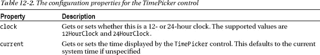

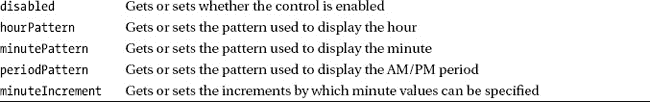

##### 设置时钟类型

您可以使用`clock`属性选择将要显示的时间类型。如果该属性设置为`12HourClock`,`TimePicker`显示三个选择元素，允许用户选择小时、分钟和周期(`AM`或`PM`)。如果`clock`属性设置为`24HourClock`，那么只显示两个`select`元素，但是小时菜单中有 24 个项目，允许指定 24 小时时间。您可以使用标记为`24 Hour Clock`的控件更改示例中的`clock`属性，12 小时和 24 小时时钟显示如图[图 12-2](#fig_12_2) 所示。

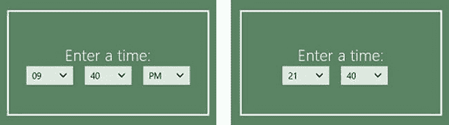

***图 12-2。**设置时间选择器控制的时钟类型*

##### 设置分钟增量

`minuteIncrement`属性指定可以为分钟值选择的最小间隔。例如，将`minuteIncrement`属性设置为`10`将允许用户将分钟设置为`0`、`10`、`20`、`30`、`40`和`50`分钟。值`15`将允许`0`、`15`、`30`和`45`分钟。问题是在控件初始化后更改属性没有任何效果——您必须决定您想要的时间间隔，并使用`data-win-options`属性指定它有一个配置选项。

在这个例子中，我使用`data-win-options`属性将`minuteIncrement`属性设置为`10`，如下所示:

`...

...`

你可以在图 12-3 的[中看到这种效果，我点击了`TimePicker`控件的分钟部分来显示可用的增量。](#fig_12_3)

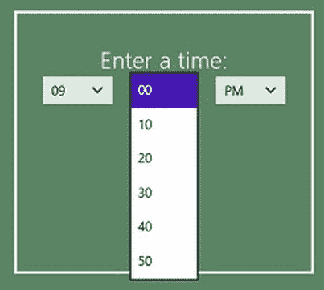

***图 12-3。**在时间选择器控件上限制分钟增量*

##### 指定显示模式

通过`hourPattern`、`minutePattern`和`periodPattern`属性，您可以指定时间的各个组成部分的显示方式。实际上，他们只是让你指定使用多少字符，即使这样，你也必须努力工作。

名称空间包含对象，T2 控件用它来格式化和解析时间值。`DateTimeFormatter`支持一个全面的基于模板的系统来处理时间和日期。这里有一个例子:

`{hour.integer}:{minute.integer(2)}:{second.integer(2)} {period.abbreviated}`

该模板包含小时、分钟和秒的组件。分和秒用两个字符显示，周期用缩写形式显示(例如`AM`或`PM`)。

`TimePicker`控件中的模式属性作用于该模板的片段。您不能更改元素出现的顺序，但可以更改每个元素使用的字符数。因此，举例来说，如果您想确保小时总是使用 12 小时制显示，那么您可以将`minutePattern`属性设置为`{hour.integer(2)}`。括号字符(`{`和`}`)是值的必需部分，这意味着在使用`data-win-options`属性设置这些属性的值时必须小心——很容易混淆括号和引号字符的顺序。

考虑到您可以对这些属性进行的唯一更改是设置字符数，我认为让`TimePicker`控件负责将整数值转换成模板片段会更明智。实际上，您需要对日期/时间格式的底层工作有足够的了解，但这样做不会有任何好处。但是，正如我之前所说的，`TimePicker`控件并没有经过特别的考虑或实现。

我在示例的右面板中包含了两个`input`元素，让您可以更改小时和分钟元素使用的字符数。我通过代理对象更新了`hourPattern`和`minutePattern`属性，如[清单 12-4](#list_12_4) 所示。

***清单 12-4** 。在整数值和模板片段之间转换*

`...
["hour", "minute"].forEach(function (item) {` `    proxyObject.bind(item + "Length", function (val) {
        picker.winControl[item + "Pattern"] = "{" + item + ".integer(" + val + ")}";
    });
});
...`

你可以在[图 12-4](#fig_12_4) 中的`Hour Length`和`Min Length` `input`元素中看到输入`3`的效果。

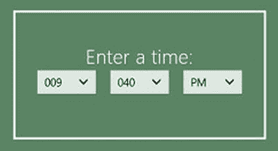

***图 12-4。**指定用于显示小时和分钟时间成分的字符数*

#### 以编程方式管理时间选择器

`TimePicker`控件没有定义任何方法。我包含这一部分只是为了保持与其他控件的一致性，这样您就不会认为它被错误地忽略了。

#### 设置时间选择器控件的样式

`TimePicker`控件支持许多 CSS 类，这些类可以用来设计整个控件或其中一个元素的样式。我已经在[表 12-3](#tab_12_3) 中描述了类的集合。

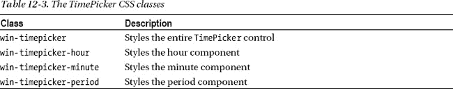

在这个例子中，我使用`Show Period`配置控件通过`win-timepicker-period`类改变周期组件的可见性，如[清单 12-5](#list_12_5) 所示。

***清单 12-5** 。使用 CSS 类定位 TimePicker 控件的组件*

`...
proxyObject.bind("showPeriod", function (val) {
**    $('.win-timepicker-period').setStyle("display", val ? "block" : "none");**
});
...`

当`clock`属性被设置为`12HourClock`时，改变标记为`Show Period`的`ToggeSwitch`的状态将改变周期`select`元素的可见性。

#### 响应 TimePicker 事件

当用户改变控件显示的时间时，`TimePicker`发出`change`事件。你可以看到我对`TimePicker.html`文件中的`script`元素所做的添加，以处理[清单 12-6](#list_12_6) 中的`change`事件，在那里我显示了用户选择的时间，用`TimePicker`作为应用布局右侧面板中`span`元素的内容。

***清单 12-6** 。从 TimePicker 控件处理变更事件*

`...

...`

`TimePicker.current`属性返回一个标准的 JavaScript `Date`对象，它允许我调用`toLocaleTimeString`方法来获得一个值，我可以安全地在布局中显示该值，如图[图 12-5](#fig_12_5) 所示，在这里我使用了选取器来选择晚上 9:50。

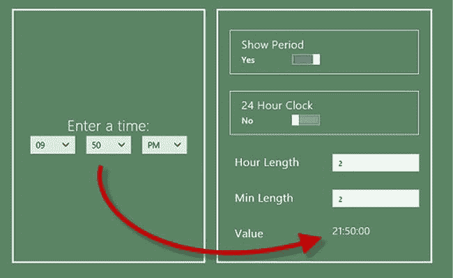

***图 12-5。**响应时间选择器控件的变更事件*

### 使用日期选择器控件

`DatePicker`控件是对`TimePicker`的补充，允许用户选择日期。`DatePicker`与`TimePicker`控件有很多相似之处——可悲的是，包括一些不太有用的特征，比如模板片段。

`DatePicker`控件在结构和外观上与`TimePicker`控件非常相似，并为用户提供了三个`select`元素，用户可以用它们来选择日期。在[图 12-6](#fig_12_6) 中，你可以看到`DatePicker`是如何显示的，以及我生成的用来演示不同日期相关特性的配置控件。

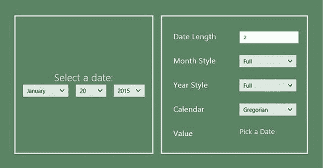

***图 12-6。**日期选择器控件*

#### 何时使用 DatePicker 控件

`DatePicker`控件适合在您希望用户选择日期时使用。`DatePicker`控件使用设备区域设置来执行它的大部分日期格式化，并且像`TimePicker`一样，不提供覆盖区域设置的机制(尽管有一个使用不同种类日历的选项)。这意味着您应该只在一个应用中使用`DatePicker`,该应用已经在将要部署它的每个地区进行了彻底的测试。

#### 演示日期选择器控件

我在[第 10 章](10.html#ch10)中开始的 Visual Studio 项目的`pages`文件夹中添加了一个名为`DatePicker.html`的文件。您可以在[清单 12-7](#list_12_7) 中看到该文件的内容。

***清单 12-7** 。DatePicker.html 文件的内容*

`<!DOCTYPE html>
<html>
<head>
    <title></title>
    
</head>
<body>
    

        

            <h2>Select a date:</h2>
**            
**
            

        

        

    

</body>
</html>`

这是另一个我需要代理对象特性的控件，我在第 10 章的[中添加到示例框架中。`DatePicker`控件使用与`TimePicker`控件相同的模板模式系统，这意味着我需要代理对象来改变显示的日期格式(我将很快演示)。](10.html#ch10)

您可以看到我如何在添加到`/js/controls.js`文件的定义对象中使用代理对象来演示[清单 12-8](#list_12_8) 中的`DatePicker`控件。

***清单 12-8** 。将定义对象添加到 DatePicker 控件的 control.js 文件中*

`...
**datePicker**: [
    { type: "input", id: "dateLength", title: "Date Length", value: 2, useProxy: true },
    { type: "select", id: "monthPattern", title: "Month Style", values: ["{month.full}",
        "{month.abbreviated}"], labels: ["Full", "Abbreviated"]},
    { type: "select", id: "yearPattern", title: "Year Style", values: ["{year.full}",
        "{year.abbreviated}"], labels: ["Full", "Abbreviated"]},
    { type: "select", id: "calendar", title: "Calendar", values: ["GregorianCalendar",
        "HebrewCalendar", "ThaiCalendar"], labels: ["Gregorian", "Hebrew", "Thai"]},
    { type: "span", id: "current", value: "Pick a Date", title: "Value"}],
...`

最后，为了让用户能够通过导航条导航到`TimePicker.html`文件，我添加了`templates.js`文件，如[清单 12-9](#list_12_9) 所示。

***清单 12-9** 。增加了通过导航栏导航到 TimePicker.html 文件的支持*

`...
var navBarCommands = [
    //{ name: "AppTest", icon: "target" },
    { name: "ToggleSwitch", icon: "\u0031" },
    { name: "Rating", icon: "\u0032" },
    { name: "Tooltip", icon: "\u0033" },
    { name: "TimePicker", icon: "\u0034" },
    { name: "DatePicker", icon: "\u0035" },
];
...`

#### 应用和配置日期选择器控件

通过将`data-win-control`属性设置为`WinJS.UI.DatePicker`，将`DatePicker`控件应用于`div`元素。默认情况下有三个下拉菜单(但是可以使用 CSS 类隐藏——请参见设计 DatePicker 控件一节的详细信息),允许用户选择日期的日、月和年组成部分。`DatePicker`控件支持[表 12-4](#tab_12_4) 中列出和描述的配置属性。

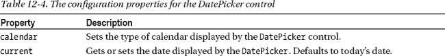

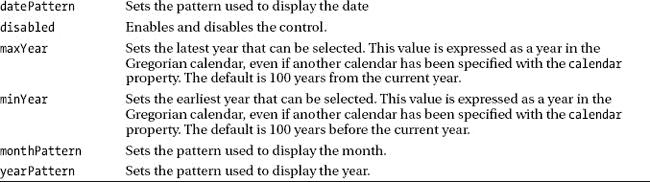

##### 使用不同的日历

属性允许你指定一个日历给 T1 使用。默认值来自设备区域设置。在本例中，我在右侧面板中添加了一个`select`元素，允许您选择`GregorianCalendar`、`HebrewCalendar`和`ThaiCalendar`值，其效果可以在图 12-7 的[中看到。](#fig_12_7)

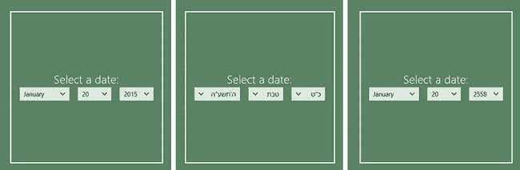

***图 12-7。**使用不同的日历显示日期*

我添加了对这些日历类型的支持，以展示可用的横截面。该属性支持的全套值为:`GregorianCalendar`、`HijriCalendar`、`HebrewCalendar`、`JapaneseCalendar`、`KoreanCalendar`、`ThaiCalendar`、`TaiwanCalendar`、`UmAlQuraCalendar`和`JulianCalendar`。

##### 指定显示模式

`DatePicker`控件使用模板片段的方式类似于`TimePicker`控件，通过`datePattern`、`monthPattern`和`yearPattern`属性公开。

`datePattern`的格式是`{day.integer(` ***n*** `)}`，其中`n`是用于显示日期的字符数。注意，虽然属性的名称是`***date***Pattern`，但是片段是 *`**day**`* `.integer`(即`date`对`day`)。对于月份和年份组件，您可以选择完整值和缩写值。[表 12-5](#tab_12_5) 显示了这两个属性的一组支持值。

T2】

我添加了三个配置控件来管理日期的显示方式。通过`Date Length` `input`元素，您可以更改用于显示日部分的字符数，通过`Month Style`和`Year Style` `select`元素，您可以看到完整和简化显示的样子。在图 12-8 中，您可以看到缩写的月份和年份设置是如何显示的。

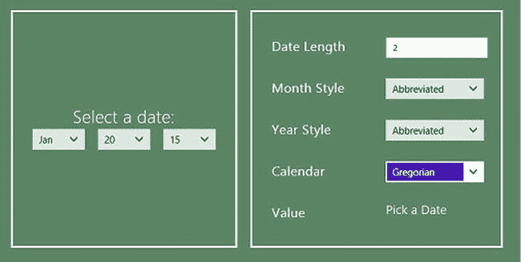

***图 12-8。**显示月份和年份的缩写值*

#### 以编程方式管理日期选择器

`DatePicker`控件没有定义任何方法。我包含这一部分只是为了保持与其他控件的一致性，这样您就不会认为它被错误地忽略了。

#### 设置 DatePicker 控件的样式

`DatePicker`控件支持许多 CSS 类，这些类可以用来设计整个控件或其中一个元素的样式。我已经在[表 12-6](#tab_12_6) 中描述了类的集合。

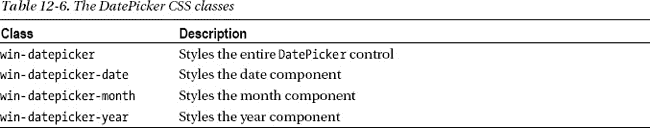

我没有在例子中使用任何样式，但是我发现它们对于隐藏控件中的单个组件很有用，这样用户可以指定一个不太精确的日期。因此，举例来说，如果我想让用户只选择月份和年份，我会在`DatePicker.html`文件中添加一个`style`元素，如清单 12-10 中的[所示。](#list_12_10)

***清单 12-10** 。使用 CSS 类隐藏 DatePicker 控件的组件*

`...

...`

隐藏其中一个组件会导致控件被调整大小，如图 12-9 所示。

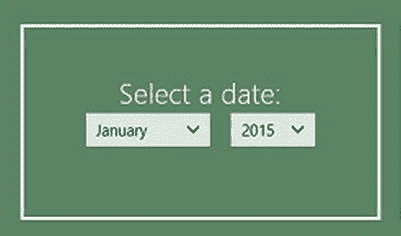

***图 12-9。**显示 DatePicker 控件中组件的子集*

#### 响应 DatePicker 事件

当用户选择一个新的日期时，`DatePicker`发出`change`事件。你可以看到我在`DatePicker.html`文件中添加了`script`元素来处理[清单 12-11](#list_12_11) 中的`change`事件，这里我使用用户用`DatePicker`选择的日期来更新应用布局右侧面板中`span`元素的内容。

***清单 12-11** 。从 DatePicker 控件处理变更事件*

`...

...`

`DatePicker.current`属性返回一个标准的 JavaScript `Date`对象，这允许我调用`toLocaleDateString`方法来获得一个我可以显示的值。

### 重访弹出控件

我在第 7 章的[中向你介绍了`WinJS.UI.Flyout`控件，当时我向你展示了如何使用`Flyout`来响应`AppBar`命令。`Flyout`控件是一个通用的弹出菜单，可以在任何情况下使用，这就是为什么我要返回到这个控件，这样我就可以向你展示如何在应用栏之外使用它。我在这个部分的例子中使用了两个`Flyout`控件，其中一个你可以在图 12-10](07.html#ch7) 中看到。右侧面板中的控件允许您配置可见的`Flyout`控件。

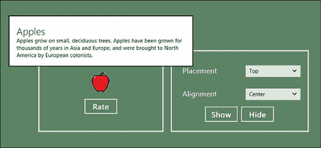

***图 12-10。**使用弹出控件*

#### 何时使用弹出控件

`Flyout`是一个通用控件，可以在任何想要在主布局之外呈现内容的情况下使用。`Flyout`有一些特殊的用途，比如使用`AppBar`(参见[第 7 章](07.html#ch7))或者使用`Menu`控件(在本章稍后描述)，但是除此之外，你可以在你的应用环境中做任何有意义的事情。对于简单的纯信息内容，考虑使用`WinJS.UI.Tooltip`控件，我在第 11 章中描述了它，它需要更少的编程控制。

 **提示**请务必阅读本章后面的*使用弹出按钮进行用户交互*一节，了解如何使用弹出按钮显示需要用户交互的元素，如`button`元素和`Rating`控件。在这些情况下，`Flyout`有一些特点需要特别注意。

#### 演示弹出控件

为了演示`Flyout`控件，我在 Visual Studio 项目的`pages`文件夹中添加了一个名为`Flyout.html`的新文件。你可以在[清单 12-12](#list_12_12) 中看到这个文件的内容。这个文件比我添加到项目中的其他一些文件稍大，因为它包含了`Flyout`控件和我将在其中显示的内容。

***清单 12-12** 。Flyout.html 文件的内容*

`<!DOCTYPE html>
<html>
<head>
    <title></title>
    
    
</head>
<body>
    

        

            
            <button id="rateButton">Rate</button>
        

        

` `    

**    
**
        <h2>Apples</h2>
        
            Apples grow on small, deciduous trees.
            Apples have been grown for thousands of years in Asia
            and Europe, and were brought to North America by European
            colonists.
        
    

**    
**
        <h2>How much do you like apples?</h2>
        

        

            <button id="flyoutInteractiveButton">Close</button>
        

    

</body>
</html>`

为了创建您可以在图 12-10 的[右侧面板中看到的配置控件，我将定义对象添加到了您可以在](#fig_12_10)[清单 12-13](#list_12_13) 中看到的`controls.js`文件中。

***清单 12-13** 。弹出控件的定义对象*

`...
**flyout**: [
     { type: "select", id: "placement", title: "Placement", values: ["top", "bottom",    
         "left", "right"], labels: ["Top", "Bottom", "Left", "Right"]},
     { type: "select", id: "alignment", title: "Alignment", values: ["left", "center",
         "right"], labels: ["Left", "Center", "Right"]},
     { type: "buttons", labels: ["Show", "Hide"] }],
...`

最后，为了让用户可以通过导航栏导航到`Flyout.html`文件，我添加了`templates.js`文件，您可以在[清单 12-14](#list_12_14) 中看到。

***清单 12-14** 。将 Flyout.html 文件添加到导航栏*

`...
var navBarCommands = [
    //{ name: "AppTest", icon: "target" },
    { name: "ToggleSwitch", icon: "\u0031" },
    { name: "Rating", icon: "\u0032" },
    { name: "Tooltip", icon: "\u0033" },
    { name: "TimePicker", icon: "\u0034" },
    { name: "DatePicker", icon: "\u0035" },
**    { name: "Flyout", icon: "\u0036" },**
];
...`

#### 应用和配置弹出控件

`WinJS.UI.Flyout`控件应用于`div`元素。`Flyout`没有固定的内部结构，您可以创建任何元素和控件的组合来满足您的需求，包括用户可以与之交互的内容——稍后我将向您详细介绍这项技术。

##### 显示弹出控件

`Flyout`定义了`show`和`hide`方法，可以用来控制控件的可见性。[表 12-7](#tab_12_7) 总结了这些方法以供快速参考。

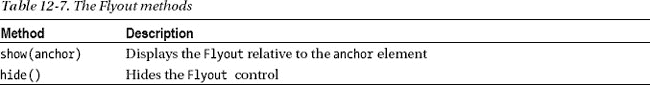

`show`方法有一个强制参数，用它指定一个*锚元素*，它是`Flyout`所在的附近。`show`方法支持两个可选参数，允许您覆盖`placement`和`alignment`属性的值——我将在下一节解释这些属性的用途和值。

`Flyout`控件支持我在[第 12 章](#ch12)中提到的 light-dissolve 技术，当用户点击或触摸`Flyout`弹出窗口之外的显示屏时，它会自动消失。您*可以通过调用`hide`方法*显式地解除`Flyout`，但是这只在您响应`Flyout`中的交互控件时有用，我将很快演示这一点。

示例中有两个`Flyout`控件，您可以通过单击右侧面板中的`Show`和`Hide`按钮来查看如何应用`show`和`hide`方法。点击`Show`按钮会出现一个显示一些静态文本的`Flyout`(这是图 12-10 中的`Flyout`)。当点击`Show`按钮时，我使用标记中的`img`元素作为锚元素，这就是为什么`Flyout`位于图中图像的正上方。您可以通过点击`Hide`按钮或点击`Flyout`之外的应用布局中的任意位置来关闭`Flyout`。

 **提示**点击`Rate`按钮，显示示例中的另一个`Flyout`。在本节稍后讨论使用`Flyout`控件向用户呈现交互式内容时，我会回到这个控件。

##### 配置弹出控件

正如您现在所期望的，有许多由`Flyout`控件定义的属性，您可以使用它们来改变它的行为。表 12-8 总结了这些特性。

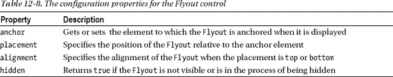

设置`anchor`属性没有用，因为该值将被`show`方法所需的强制参数替换。但是，您可以读取该属性的值来查看`Flyout`锚定到了哪个元素。

您可以使用`placement`属性覆盖`Flyout`的默认位置。这与`Tooltip`控件的工作方式相同，支持的值为`top`、`bottom`、`left`和`right`。这些值相对于传递给`show`方法的锚元素。

如果`placement`属性是`top`或`bottom`，您可以使用`alignment`属性进一步细化位置，该属性接受值`left`、`right`和`center`。

我在示例中添加到右侧面板的`select`元素允许您更改由`Show`和`Hide`按钮控制的`Flyout`的`placement`和`alignment`属性。选择您需要的数值组合，点击`Show`按钮，查看`Flyout`是如何定位的。`Flyout`将自动重新定位，使其完全适合屏幕——然而，这可能意味着锚定元素可能会被`Flyout`遮挡。

在图 12-11 的[中可以看到`alignment`的`left`和`right`值、`placement`的`top`值。](#fig_12_11)

***图 12-11。**放置属性左右值的效果*

#### 设计弹出控件的样式

`Flyout`控件支持一个 CSS 类:`win-flyout`。您可以使用该类作为设计显示内容样式的起点。没有其他类，因为在`Flyout`控件中没有固定的结构。我倾向于不使用这个类，更喜欢将样式直接应用于我在`Flyout`控件中显示的内容。在[清单 12-15](#list_12_15) 中，你可以看到我添加到使用`win-flyout`类的`Flyout.html`文件中的`style`元素。

***清单 12-15** 。设计弹出控件的样式*

`...

...`

这种样式的效果是将所有`Flyout`控件中的文本居中。你可以在[图 12-12](#fig_12_12) 中看到它的效果。

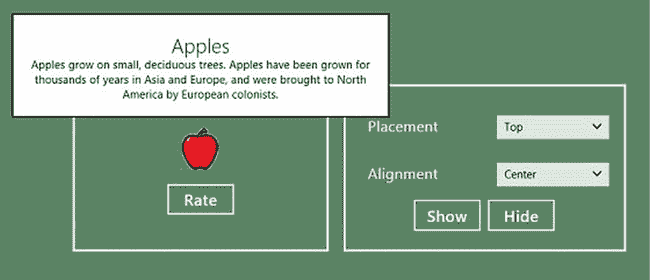

***图 12-12。**对弹出控件应用样式的效果*

#### 处理弹出事件

`Flyout`控件支持我在[表 12-9](#tab_12_9) 中描述的四个事件。我在示例中没有使用这些事件，但是在处理包含交互内容的`Flyout`控件时，`beforehide`和`afterhide`事件会很有用——更多信息请见下一节。

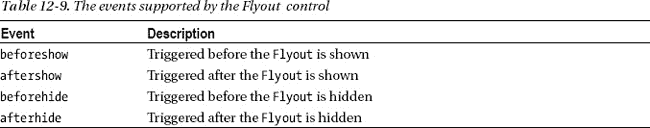

#### 使用弹出按钮进行用户交互

示例应用中的第二个`Flyout`显示需要用户交互的控件——你可以在[图 12-13](#fig_12_13) 中看到这些控件是如何显示的。您可以使用一个`Flyout`来显示任何内容，但是当您从用户那里收集数据时，有一些特殊的考虑。

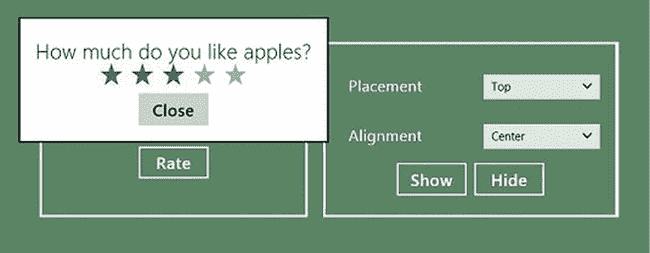

***图 12-13。**包含互动内容的弹出按钮*

在这个例子中，我的`Flyout`包含一个`Rating`控件，允许用户表达他们喜欢苹果的程度。当用户单击示例应用左侧面板中的`Rate`按钮时，会显示`Flyout`。你必须小心设计你的`Flyout`交互来提供一致和流畅的用户体验。在接下来的部分中，我描述了我所遵循的并且推荐您采纳的指导原则。

##### 确保一致的显示和隐藏

我总是小心翼翼地确保用户可以使用与显示相同的交互类型来隐藏`Flyout`。如果点击`button`导致`Flyout`出现，那么我确保在`Flyout`内容中有一个按钮可以隐藏弹出窗口。这是我在本章的例子中采用的方法:点击`Rate`按钮会显示`Flyout`，点击`Close`按钮会隐藏弹出窗口。我不想干涉灯光消失功能，这使得这个按钮成为隐藏`Flyout`的其他方式的补充，而不是替代。

##### 保持弹出型按钮简单

我使用`Flyout`来执行小而简单的用户交互。对于复杂的 HTML 风格的表单，我不使用`Flyout` s，在这些表单中有大量的数据值需要从用户那里收集，并且这些值之间存在依赖关系。在这种情况下，使用导航到应用的不同部分，并在专用布局中收集数据，让用户清楚这是一个导入交互。

##### 立即响应数据值

一旦用户在`Flyout`中向我提供信息，我就更新我的视图模型和应用状态。在这个例子中，我会从`Rating`控件中响应`change`事件，而不是等到`Flyout`被解除后才根据用户的意见更新应用。(我两者都没有做过，因为这是一个关于`Flyout`控件的例子，但是您已经明白了)。

##### 使撤销或重做弹出型交互变得容易

我试图使`Flyouts`中的交互尽可能无摩擦，并允许用户轻松地更改他们输入的数据或返回到根本没有数据输入的状态。在很大程度上，这意味着我试图让用户非常清楚如何显示特定的`Flyout`，并且我利用 WinJS 控件特性和数据绑定来允许用户更改或删除数据。在这个例子中，允许用户删除数据需要我将`Rating`控件的`enableClear`属性设置为`true`。

我也避免提示用户“您确定吗？”值被更改或删除时的消息。让更改值变得容易，并通过在应用中立即反映新值，使得检查用户的意图变得多余。

##### 清楚地发出破坏性行动的信号

与使数据值更改变得容易相对应的是，当用户将要执行一个不可撤销的破坏性操作时，比如不可逆地删除一个文件，我使它变得非常明显。在这些情况下，我要求用户使用显示在`Flyout`中的`button`给我一个明确的确认，并把一个轻解雇作为一个取消。尽管如此，我还是让用户很容易地将破坏性的动作组合在一起，这样我就不会提示用户确认每个单独的项目应该被销毁。

### 总结

在这一章中，我已经展示了四个 WinJS UI 控件。这些比我在上一章描述的更复杂，但是它们可以更广泛地应用，并且在`Flyout`控件的情况下，可以形成你的应用结构的关键部分。在下一章，我将展示如何使用`Menu`控件，并演示一些不属于 WinJS 名称空间的 UI 控件。