# 十四、使用`FlipView`控件

在这一章中，我将描述`FlipView`控件，它是 WinJS *数据驱动的* UI 控件之一。数据驱动控件从*数据源*获取内容，并监控数据源以确保它们显示最新的可用数据。`FlipView`控件一次显示数据源中的一个项目，并允许用户通过单击按钮或做出翻转触摸手势在它们之间移动。

在本章中，我将向您展示如何为数据驱动控件准备数据源，并将其与用于向用户呈现每一项的模板相结合。您将看到 WinJS 的许多特性是如何在一个数据驱动控件中结合在一起的，包括可观察数组、数据绑定和模板。我还将向您展示这些特性是如何相互作用导致棘手的问题的。最后，我将介绍一下`FlipView`控件在从一个数据项移动到下一个数据项时使用的动画，作为在第 18 章中全面讨论这个主题的前奏。表 14-1 对本章进行了总结

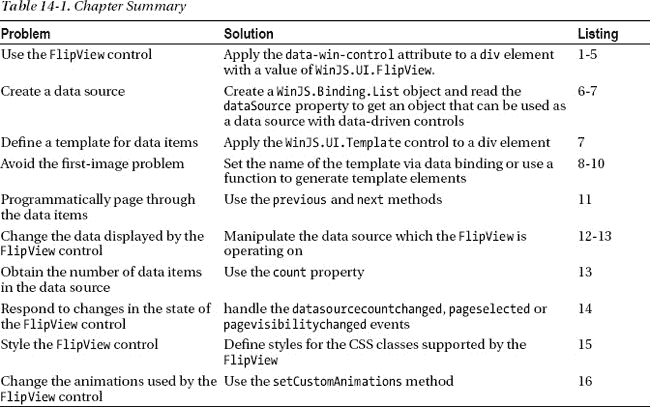

### 使用 FlipView 控件

数据驱动的 WinJS UI 控件使用模板来呈现数据源中的项。在这一章中，我将使用一个`FlipView`来执行一个非常普通的任务——一次显示一组照片中的一张图片。你可以在[图 14-1](#fig_14_1) 中看到`FlipView`是如何出现的。如同本书这一部分的其他章节一样，我使用我在[第 10 章](10.html#ch10)中创建的框架创建了如图所示的布局。

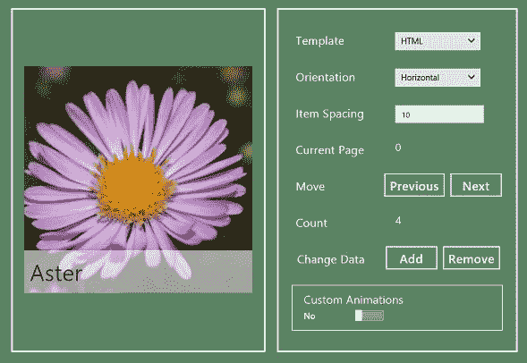

***图 14-1。**用来显示一组照片的 FlipView 控件*

有三个数据驱动的 WinJS UI 控件，但我选择了`FlipView`作为第一个描述，因为它相对简单，但基于许多有用和重要的功能。我可以相对快速地处理控件的使用，然后将重点放在一些关键的基础上，这些基础与我稍后描述的更复杂的控件是相同的。

**数据源和接口**

WinJS 定义了一组指定数据源功能的*接口*。如果您使用的是标准的数据源对象，您就不需要担心这些接口，这些对象适用于大多数项目。然而，如果您想要创建一个定制的数据源，那么您需要理解这些接口所扮演的角色。

首先要理解的是，接口的概念在 JavaScript 中没有任何意义。这是您可以看到 JavaScript 和其他 Windows 应用编程语言的契合之处之一。在像 C#这样的语言中，定义一个接口意味着列出特定用途所需的抽象功能。实现接口的程序员实际上同意以某种方式实现该功能。编译器检查以确保接口的所有方面都已实现，如果没有实现，则报告一个错误。在用强类型语言创建松散耦合的软件系统时，接口是一种有用的技术。

接口的想法依赖于不适合 JavaScript 的假设，但是微软需要阐明一种可以描述一组预期的属性和方法的方式，所以我们有了这个想法，但是没有接口的实现。当我提到接口时，我指的是一个必需成员的列表，如果你希望它适合特定的用途，比如作为像`FlipView`这样的 UI 控件的数据源，你必须在你的对象中实现这些成员。

#### 何时使用 FlipView 控件

每当您需要一次显示一项内容时，就可以使用`FlipView`控件。在这一章中，我展示了这个控件最常见的用法，它允许用户在媒体中翻页——在这个例子中是一些怒目而视者的照片。然而，`FlipView`控件可以显示*任何*内容，并且有一个很好的模板系统，可以让你控制每个项目如何呈现给用户。在后面的章节中，你可以看到使用其他类型的数据来驱动 WinJS UI 控件的例子。

### 创建 FlipView 控件示例

数据驱动控件比`WinJS.UI`名称空间中的其他控件更复杂，因此我采用了一种稍微不同的方法来创建演示`FlipView`控件的代码。我将分解示例代码，使 HTML、CSS 和 JavaScript 位于不同的文件中，更重要的是，在本节结束时，示例不会完成。我将在解释数据源和使用它们的 UI 控件的一些核心特征和特性时完成这个例子。

首先，我在 Visual Studio 项目的`pages`文件夹中创建了一个名为`FlipView.html`的新文件，其内容可以在[清单 14-1](#list_14_1) 中看到。这个文件包含创建一个基本的`FlipView`控件的标记，但是它不包含任何对数据源的引用，而数据源是让`FlipView`显示数据所必需的。

***清单 14-1** 。FlipView.html 文件的初始内容*

`<!DOCTYPE html>
<html>
<head>
    <title></title>
**    <link href="/css/flipview.css" rel="stylesheet" />**
**    **
</head>
<body>
    

        

**            

**
        

        

` `    

</body>
</html>`

您可以在清单中看到我使用`data-win-control`应用了`FlipView`控件的元素。您还可以看到我为 CSS 和 JavaScript 文件添加的`link`和`script`元素。这个`/css/flipview.css`文件包含了一些我需要用来控制`FlipView`控件布局的样式，以及我将用它来显示的数据。您可以在[清单 14-2](#list_14_2) 中看到 flipview.css 文件的内容。

***清单 14-2** 。/css/flipview.css 文件的内容*

`#flip { width: 400px; height: 400px }
.flipItem img { height: 400px }
.flipTitle { position: absolute; color: black;
    bottom: 2px; font-size: 30pt; width: 100%;
    padding: 10px; background-color: rgba(255, 255, 255, 0.6)}
.renderDiv { border: thick solid white; height: 200px}
.renderDiv img { height: 200px; width: 200px }
.renderDiv div { text-align: center; font-size: 30pt }`

您可以在[清单 14-3](#list_14_3) 中看到 JavaScript 文件的内容。我想将数据驱动控件的代码与 JavaScript 的其余部分分开，所以我创建了`/js/pages`文件夹，然后在那里添加了`flipview.js`文件——这就是您可以在清单中看到的文件。

***清单 14-3** 。flipview.js 文件的内容*

`(function() {

    WinJS.UI.Pages.define("/pages/FlipView.html", {
        ready: function () {

            var proxyObject = WinJS.Binding.as({
                itemTemplate: null,
                customAnimations: false
            });

            Templates.createControls(rightPanel, flip, "**flipView**", proxyObject)
            .then(function () {

            });
        }
    });
})();`

目前，`flipview.js`文件只包含代理对象，我将用它来响应一些配置控件和对将创建它们的`Templates.createControls`方法的调用。我将在本章中添加代码，解释数据驱动控件的不同特性，特别是`FlipView`控件。在[清单 14-4](#list_14_4) 中，你可以看到我添加到`controls.js`文件中的定义对象，以创建[图 14-1](#fig_14_1) 右侧面板中显示的配置控件。为了与本书这一部分的其他章节保持一致，我将使用这些控件来演示`FlipView`控件的关键特性。

***清单 14-4** 为 FlipView 控件添加到 controls.js 文件中的定义对象*

`...
flipView: [
     { type: "select", id: "itemTemplate", title: "Template",
         values: ["HTML", "Function"], useProxy: true},
     { type: "select", id: "orientation", title: "Orientation",
         values: ["horizontal", "vertical"], labels: ["Horizontal", "Vertical"]},
     { type: "input", id: "itemSpacing", title: "Item Spacing", value: 10 },
     { type: "span", id: "currentPage", value: 0, title: "Current Page" },
     { type: "buttons", title: "Move", labels: ["Previous", "Next"] },
     { type: "span", id: "itemCount", value: 4, title: "Count" },
     { type: "buttons", title: "Change Data", labels: ["Add", "Remove"] },
     { type: "toggle", id: "customAnimations", title: "Custom Animations", value: false,
        useProxy: true, labelOn: "Yes", labelOff: "No" }],
...`

本章中设置基本结构的最后一步是启用从导航栏到`FlipView.html`页面的导航。你可以在[清单 14-5](#list_14_5) 中看到我是如何做到这一点的，它显示了我对`/js/templates.js`文件所做的添加。

***清单 14-5** 。通过导航栏导航至 FlipView.html 页面*

`...
var navBarCommands = [
    //{ name: "AppTest", icon: "target" },
    { name: "ToggleSwitch", icon: "\u0031" },
    { name: "Rating", icon: "\u0032" },
    { name: "Tooltip", icon: "\u0033" },
    { name: "TimePicker", icon: "\u0034" },
    { name: "DatePicker", icon: "\u0035" },
    { name: "Flyout", icon: "\u0036" },
    { name: "Menu", icon: "\u0037" },
    { name: "MessageDialog", icon: "\u0038" },
**    { name: "FlipView", icon: "pictures" },**
];
...`

`FlipView`控件是我描述的第一个 WinJS 数据驱动控件，顾名思义，我需要一些数据来处理。在本章中，我将使用`FlipView`来显示一些图像文件，这是该控件的典型用法。你可以通过数据驱动的 WinJS 控件使用任何类型的数据，包括`FlipView`，但是我现在想保持事情简单。

为了将数据图像与应用图像分开，我创建了一img/data`文件夹，并将我的图像文件复制到那里。这些图像是花的照片，你可以在[图 14-2](#fig_14_2) 的解决方案浏览器中看到它们。我在本书附带的源代码下载中包含了这些图片(可从`Apress.com`获得)。

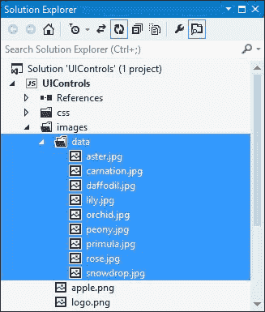

***图 14-2。**将数据图像添加到 Visual Studio 项目中*

如果此时运行应用，您将会看到如图[图 14-3](#fig_14_3) 所示的布局。`FlipView`控件在布局中，但它还不可见——这是因为我还没有设置我想要显示的图像和`FlipView`控件之间的关系——我将很快解决这个问题。

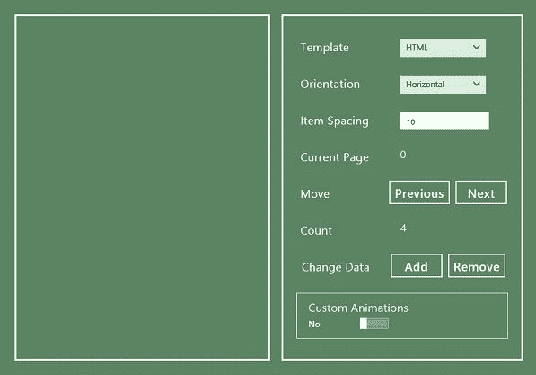

***图 14-3。**将基础文件添加到 Visual Studio 项目后 app 的状态*

### 创建和使用数据源

使用数据驱动 UI 控件的关键步骤是创建数据源。方法是由数据源实现的属性，数据源由`WinJS.UI.IListDataSource`接口定义，如果您想要创建自己的数据源，您需要定义一个对象来实现`IListDataSource`定义的所有方法和属性，以便公开您的数据。

我不打算详细介绍这个界面，因为几乎在每种情况下都可以使用一些预定义的数据源。`WinJS.UI.StorageDataSource`可用于从设备文件系统加载数据——我将在本书的[第 4 部分](pt4.html#pt4)中更广泛地回到文件和数据，并且我将在[第 23 章](23.html#ch23)中演示`StorageDataSource`对象。

在本章中，我将使用另一个预定义的数据源，即`WinJS.Binding.List`对象。我在[第 8 章](08.html#ch8)中解释了如何为数据绑定创建可观察数组，并一直在例子中使用。`List`对象有一个`dataSource`属性，它返回一个实现数据源所需的所有方法和属性的对象。这使得`List`非常适合在处理内存数据时使用数据驱动的 UI 控件。

因此，首先，我将创建一个包含我想要显示的图像细节的`List`对象。在[清单 14-6](#list_14_6) 中，你可以看到我对`/js/viewmodel.js`文件所做的添加。

***清单 14-6。**在/js/viewmodel.js 文件中定义列表*

`(function () {
    "use strict";

    WinJS.Namespace.define("ViewModel", {
**        data: {**
**            images: new WinJS.Binding.List([**
**                { file:img/aster.jpg", name: "Aster"},**
**                { file:img/carnation.jpg", name: "Carnation"},**
**                { file:img/daffodil.jpg", name: "Daffodil"},**
**                { file:img/lily.jpg", name: "Lilly"},**
**            ]),**
**        }   **
    });

})();`

我创建了一个名为`images`的新的`List`对象，并将其分配给了`ViewModel.data`名称空间。`List`中的每个对象都有一个包含图像文件路径的`file`属性和一个包含我将向用户显示的名称的`name`属性。

 **提示**`List`只包含四个图像文件的对象——我将在本章后面使用其他图像。

#### 应用数据源

要应用数据源，需要设置两个`FlipView`属性。属性告诉 T2 在哪里可以找到数据。`itemTemplate`属性指定了一个模板，该模板将用于显示数据源中的项目——这与我在第 8 章的[中描述的数据绑定模板类型相同。在清单 14-7](08.html#ch8) 中，你可以看到我是如何定义模板并在`/pages/FlipView.html`文件中设置`FlipView`属性的值的。

***清单 14-7** 。设置数据源和模板*

`<!DOCTYPE html>
<html>
<head>
    <title></title>
    <link href="/css/flipview.css" rel="stylesheet" />
    
</head>
<body>
**    
**
**        
**
**            **
**            

**
**        
**
**    
**

    

        

            
**
            

        

        

    

</body>
</html>`

我定义的模板使用数据对象的 file 属性来设置一个`img`元素的`src`属性，并显示`name`属性的值——我用来在模板中布局元素的样式在本章前面列出的`/css/flipview.css`文件中。

我已经使用`data-win-options`属性设置了 UI 控件的选项。请注意我是如何为`itemTemplate`属性指定值的:

`itemTemplate: **select('#ItemTemplate')**`

`select`关键字用于定位标记中的元素，它将一个 CSS 选择器作为参数，在本例中，该参数是我应用了`WinJS.Binding.Template`控件的元素的`id`属性值。

对于`itemDataSource`属性，注意我已经指定了我在`/js/viewmodel.js`文件中创建的`WinJS.Binding.List`对象的`dataSource`属性，如下所示:

`itemDataSource: ViewModel.data.images.**dataSource**`

`FlipView`控件——实际上是所有数据驱动的 UI 控件——没有关于`List`对象功能的特殊知识，并期望接收一个定义了在`IListDataSource`对象中列出的一组方法和属性的对象。这意味着当你告诉一个数据驱动的 UI 控件使用一个`List`对象作为数据源时，你必须记住使用`dataSource`属性。

### 修复第一个图像问题

我已经设置了模板和数据源，但是如果你现在运行这个应用，你会看到一个问题。数据源中的第一项显示不正确。但是，如果您滑动`FlipView`控件或将鼠标移动到它上面并单击出现的箭头，您将看到第二个和后续项目显示正常。你可以在[图 14-4](#fig_14_4) 中看到问题。这是使用`FlipView`控件时经常遇到的问题，我倾向于把它看作是*的第一个图像问题*。

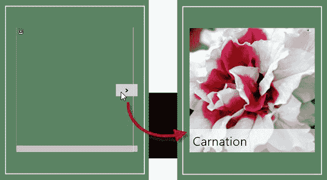

***图 14-4。**flip view 第一个图像问题*

这个问题是由`WinJS.UI.Pages` API、`WinJS.Binding` API 和`FlipView`控件本身之间不幸的交互引起的。当你点击`FlipView`控件的`NavBar`命令时，`WinJS.UI.Pages.render`方法被用来加载`FlipView.html`文件。

作为这个过程的一部分，`render`方法自动调用`WinJS.UI.processAll`方法，以便正确创建导入内容中的任何 WinJS UI 控件。

对`processAll`方法的自动调用初始化了`FlipView`控件。作为初始化的一部分，`FlipView`定位我使用`itemTemplate`属性指定的元素，使用这个模板生成显示第一个项目所需的内容，包括处理数据绑定，为`img`元素设置`src`属性。

在这个阶段，`FlipView`已经从模板中创建了 HTML，如下所示:

`...

    
    
Aster

...`

您可以从代码片段中看到，数据绑定已经过处理，因此来自第一个数据源项的值反映在 HTML 元素中。

然而，您也可以看到(为了强调，我突出显示了它们),模板中最初的`data-win-bind`属性已经被复制到新内容中。

那些挥之不去的属性是问题的一部分。尽管为导入的内容自动调用了`WinJS.UI.processAll`方法，但没有调用`WinJS.Binding.processAll`方法。为了确保我的绑定被解析，我在`default.js`文件中的`WinJS.Navigation`事件的处理程序中直接调用这个方法，如下所示:

`...
WinJS.Navigation.addEventListener("navigating", function (e) {
    WinJS.UI.Animation.exitPage(contentTarget.children).then(function () {
        WinJS.Utilities.empty(contentTarget);
        WinJS.UI.Pages.render(e.detail.location, contentTarget)
            .then(function () {
                return **WinJS.Binding.processAll(contentTarget, ViewModel.State)**
                    .then(function () {
                        return WinJS.UI.Animation.enterPage(contentTarget.children)
                    });
            });
    });
});
...`

在这种情况下,`default.js`文件中的代码执行一系列常见的操作:导入内容、处理数据绑定并执行动画。

问题是当`WinJS.Binding.processAll`方法运行时，它遍历 DOM 寻找定义`data-win-bind`属性的元素，并找到`FlipView`控件从模板中创建的元素。尽管这些元素的数据绑定已经被解析，但是`processAll`方法会再次查看它们并尝试理解它们。

`WinJS.Binding.processAll`方法将`undefined`插入到任何引用它无法解析的数据值的数据绑定中。它将无法解析的带有`innerText`绑定的任何元素的内容保留为空。这不是最有帮助的行为，因为`processAll`方法试图应用`ViewModel.State`对象，而绑定旨在处理数据源项，所以`processAll`方法覆盖了模板元素中的值，如下所示:

`...

    
    

    
...`

因此，WinJS 功能的各个部分之间的交互意味着第一个数据项不能正确显示，因为`img`元素上的`src`属性被设置为 undefined，而我用于图像名称的 div 元素的内容为空。

`FlipView`控件按需生成显示数据项所需的元素，这意味着在`WinJS.Binding.processAll`方法完成其工作很久之后，直到您通过单击或滑动前进到下一项，第二个和后续数据项的元素才从模板中生成——这就是为什么只有第一个数据项受到影响。

#### 解决第一个图像问题

有两种方法可以解决这个问题，这两种方法都不需要我修改`WinJS.Navigation`事件的处理程序。我用来处理导航的功能模式在其他情况下也很好，使得在导入的内容中使用数据绑定变得轻而易举。在接下来的部分中，我将向您展示解决这个问题的解决方案。

##### 以编程方式指定模板或数据源

第一种解决方案是在内容页面的`ready`函数中的`FlipView`控件上设置`itemTemplate`属性或`itemDataSource`属性。当您更改任一属性的值时，`FlipView`控件将重新生成其内容，因为有一个重要的更改需要显示给用户。为了演示这个解决方案，我必须将该语句添加到清单 14-8 中的`/js/pages/flipview.js`文件中。

***清单 14-8** 。设置 itemTemplate 属性的值*

`(function() {

    WinJS.UI.Pages.define("/pages/FlipView.html", {
        ready: function () {
            var proxyObject = WinJS.Binding.as({
                itemTemplate: ItemTemplate,
                customAnimations: false
            });

            Templates.createControls(rightPanel, flip, "flipView", proxyObject)
            .then(function () {

**                flip.winControl.itemTemplate = ItemTemplate;**
            });
        }
    });
})();`

当你现在启动应用时，你会看到第一项显示正确，如图[图 14-5](#fig_14_5) 所示。这个解决方案之所以有效，是因为在调用了`WinJS.Binding.processAll`方法之后执行了`ready`函数中的代码，这意味着`FlipView`从模板中生成的元素不会针对`data-win-bind`属性被再次处理。

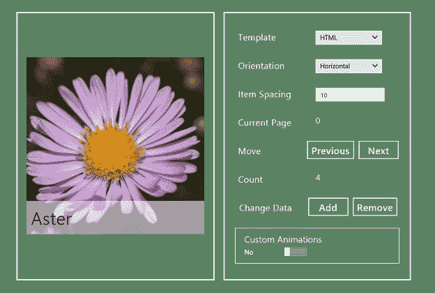

***图 14-5。**通过以编程方式设置 itemTemplate 属性来修复第一个图像问题*

当您导航到`FlipView.html`页面时，您可能会注意到轻微的闪烁，在纠正之前，损坏的图像会显示一秒钟。这是因为当页面第一次加载时，`itemTemplate`属性仍然以声明方式设置和处理。为了解决这个问题，我需要从应用了`FlipView`控件的元素的`data-win-options`属性中删除`itemTemplate`属性的声明值，如[清单 14-9](#list_14_9) 所示，只留下`itemDataSource`属性的值。

***清单 14-9** 。移除 itemTemplate 属性的声明值*

`...

    

**        
**
        

    

    

...`

##### 使用函数作为模板

另一个解决方案是去掉声明性模板，使用一个函数来生成元素，供`FlipView`控件用来显示每个数据项。你可以看到我是如何在[清单 14-10](#list_14_10) 的`/js/pages/flipview.js`文件中添加这样一个函数的。

***清单 14-10** 。添加生成显示元素的功能*

`(function() {

**    function renderItem(itemPromise) {**
**        return itemPromise.then(function (item) {**
**            var topElem = document.createElement("div");**
**            WinJS.Utilities.addClass(topElem, "renderDiv");**
**            var imgElem = topElem.appendChild(document.createElement("img"));**
**            imgElem.src = item.data.file;**
**            var titleElem = topElem.appendChild(document.createElement("div"));**
**            titleElem.innerText = item.data.name;**
**            return topElem;**
**        });**
**    }**

    WinJS.UI.Pages.define("/pages/FlipView.html", {
        ready: function () {

            var proxyObject = WinJS.Binding.as({
                itemTemplate:**ItemTemplate**,
                customAnimations: false
            });

            Templates.createControls(rightPanel, flip, "flipView", proxyObject)
            .then(function () {

**                proxyObject.bind("itemTemplate", function (val) {**
**                    flip.winControl.itemTemplate =**
**                        val == "HTML" ? ItemTemplate : renderItem;**
**                });**

            });
        }
    });
})();`

当您使用函数生成项目模板时，传递给您的参数是一个`IItemPromise`对象。这是一个常规的`WinJS.Promise`，但是当`Promise`完成时传递给`then`函数的参数是一个`IItem`对象。(这两个`I`是故意的——开头的`I`表示一个接口)。`IItem`对象提供了对数据源项的访问，并定义了我在[表 14-2](#tab_14_2) 中描述的属性。

T2】

要创建一个模板，您需要在`IItemPromise`对象上调用`then`方法，指定一个函数，该函数将在`IItem`对象准备好时接收它(这允许数据源执行某种后台操作——比如查询数据库或从磁盘读取文件——异步完成)。当您获得`IItem`对象时，您可以使用表中的属性查询它，以生成向用户显示它所需的元素。

 **提示**使用函数生成模板时，必须返回单个`HTMLElement`对象，尽管这个顶级元素可以包含任意多个子元素。这与声明性 HTML 模板的约束相同。

为了帮助演示不同的模板方法，我改变了 JavaScript 文件中设置`itemTemplate`属性的方式，将它链接到应用布局右侧面板中的`select`元素。当您从`select`元素中选取`HTML`值时，将使用前一节中的声明性模板，当您选取`Function`值时，将应用清单中的`renderItem`函数。`renderItem`功能为数据项产生一种不同的布局样式，以便更容易看出正在使用哪一个，如图 14-6 所示。

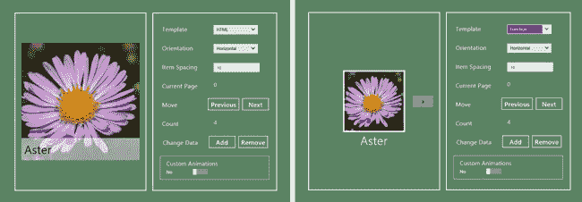

***图 14-6。**为 FlipView 控件生成元素的不同技术*

这两种方法都解决了第一个图像问题，您可以选择适合您的编程风格的方法。在大多数情况下，我倾向于使用声明性模板，但是使用函数生成元素会更加灵活，尤其是当您希望根据单个数据项来定制元素的内容时。

### 配置 FlipView 控件

既然我已经解决了第一个图像问题和解决方案，我可以转向`FlipView`控件支持的其他配置属性，我已经在[表 14-3](#tab_14_3) 中总结了这些属性。

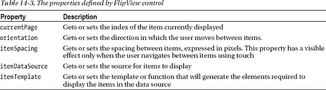

`itemTemplate`和`itemDataSource`是最重要的属性，在解释如何解决第一个图像问题时，我已经解释了如何使用它们。在接下来的部分中，我将使用我在应用布局的右侧面板中创建的一些配置控件来演示`orientation`和`itemSpacing`属性。在本章的后面，当我谈到以编程方式操作`FlipView`控件时，我将演示`currentPage`属性。

#### 设置方向

属性允许你改变用户在数据源中前后移动的方向。默认值为`horizontal`，表示用户在触摸屏上左右滑动或者用鼠标点击控件左右边缘的按钮。另一个支持值是`vertical`，它要求用户上下滑动，并为鼠标用户改变按钮的位置，使它们出现在控件的顶部和底部。我在右侧面板中添加了一个标记为`Orientation`的`select`元素，它允许您更改左侧面板中`FlipView`控件的`orientation`属性的值。在[图 14-7](#fig_14_7) 中，您可以看到为鼠标用户显示的`horizontal`和`vertical`值的不同按钮位置。我在图中突出显示了按钮，因为它们的默认样式很难看到(我将在本章的后面向您展示如何更改按钮样式)。

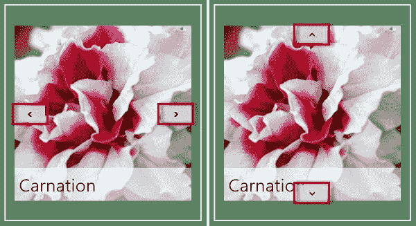

***图 14-7。**水平和垂直方向值按钮的不同位置*

#### 设置项目间距

`itemSpacing`属性设置当用户使用触摸从一个项目翻转到另一个项目时项目之间显示的间隙。在图 14-8 的[中，你可以看到这种差距的两个例子，默认值为 10 像素，较大值为 100 像素。](#fig_14_8)

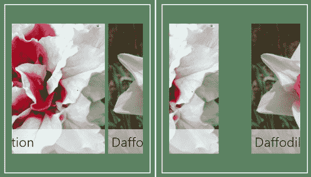

***图 14-8。**设置触摸交互项目之间显示的间距*

我在这个属性的例子中包含了一个配置控件——一个标记为`Item Spacing`的`input`元素。`itemSpacing`属性的影响可能看起来很小，但是设置项目间距可以对`FlipView`控件的外观和感觉产生显著的影响。特别是，我发现当数据源内容只是松散相关时，使用更大的空间会产生更自然的感觉。当然，这纯粹是主观感觉，你应该做对你自己的应用和偏好有意义的事情。

### 以编程方式管理动画视图

在很大程度上，`FlipView`控件为用户提供了与正在显示的内容进行交互所需的一切。当鼠标在`FlipView`上移动时，鼠标用户会看到弹出按钮，触摸用户可以通过滑动动作从一个项目移动到下一个项目。即便如此，有些时候你需要更直接地控制控件如何操作，对于这些情况，`FlipView`定义了我在[表 14-4](#tab_14_4) 中描述的方法。在接下来的小节中，我将向您展示如何使用这些方法。

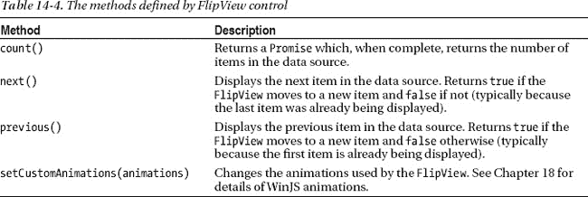

#### 移动浏览项目

您可以通过调用`next`和`previous`方法以编程方式在数据源中的项目间移动。我在示例的右边面板添加了按钮来演示这个特性，你可以从清单 14-11 中的[按钮中看到处理`click`事件的代码。](#list_14_11)

***清单 14-11** 。使用下一个和上一个方法在 FlipView 项目中移动*

`...
WinJS.UI.Pages.define("/pages/FlipView.html", {
    ready: function () {

        var proxyObject = WinJS.Binding.as({
            itemTemplate: ItemTemplate,
            customAnimations: false,
        });

        Templates.createControls(rightPanel, flip, "flipView", proxyObject)
        .then(function () {` `            proxyObject.bind("itemTemplate", function (val) {
                flip.winControl.itemTemplate =
                    val == "HTML" ? ItemTemplate : renderItem;
            });

**            $('#rightPanel button').listen("click", function (e) {**
**                var buttonText = e.target.innerText.toLowerCase();**
**                switch (buttonText) {**
**                    case "previous":**
**                    case "next":**
**                        flip.winControl[buttonText]();**
**                        currentPage.innerText = flip.winControl.currentPage;**
**                        break;**
**                }**
**            });**
        });
    }
});
...`

只有当数据源中有另一个要移动到的项目时，这些方法才会更改显示的项目。这意味着当`FlipView`显示数据源中的最后一项时，`next`方法不起作用，当显示第一项时，`previous`方法不起作用。在我调用上一个或下一个方法之后，我使用`currentPage`属性的值来更新右侧面板中相应的`span`元素的值。

 **提示**如果您想直接导航到特定的元素，可以设置`currentPage`属性的值。

#### 操纵数据源

数据驱动 UI 控件最有用的功能之一是，当数据源的内容发生变化时，它们会自动做出响应。这使您可以为应用创建动态且适应性强的布局，从而对基础数据的变化做出即时响应。为了展示这种响应性，我向视图模型添加了一些额外的数据项，如清单 14-12 所示。

***清单 14-12。**视图模型中定义的附加数据项*

`(function () {
    "use strict";

    WinJS.Namespace.define("ViewModel", {
        data: {
            images: new WinJS.Binding.List([
                { file:img/aster.jpg", name: "Aster"},
                { file:img/carnation.jpg", name: "Carnation"},
                { file:img/daffodil.jpg", name: "Daffodil"},
                { file:img/lily.jpg", name: "Lilly"},
            ]),` 
`            extraImages: [{ file:img/orchid.jpg", name: "Orchid"},
                { file:img/peony.jpg", name: "Peony"},
                { file:img/primula.jpg", name: "Primula"},
                { file:img/rose.jpg", name: "Rose"},
                { file:img/snowdrop.jpg", name: "Snowdrop"}]
        }
    });

})();`

当应用启动时，这些数据项不是数据源的一部分，但是当您单击示例右侧面板上的`Add`和`Remove`按钮时，我会将数据项从`List`对象移入和移出。我在`flipview.js`文件中添加了我的`click`事件处理函数来支持这些按钮，如清单 14-13 中的[所示。](#list_14_13)

***清单 14-13** 。为点击事件处理程序添加对添加和删除按钮的支持*

`...
$('#rightPanel button').listen("click", function (e) {
    var data = ViewModel.data.images;
    var extras = ViewModel.data.extraImages;
    var buttonText = e.target.innerText.toLowerCase();
    switch (buttonText) {
**        case "add":**
**        case "remove":**
**            if (buttonText == "add" && extras.length > 0) {**
**                data.push(extras.pop());**
**            } else if (buttonText == "remove" && data.length > 1) {**
**                extras.push(data.pop());**
**            }**
**            setImmediate(function () {**
**                flip.winControl.count().then(function (countVal) {**
**                    itemCount.innerText = countVal;**
**                });**
**            });**
**            break;**
        case "previous":
        case "next":
            flip.winControl[buttonText]();
            currentPage.innerText = flip.winControl.currentPage;
            break;
    }
});
...`

您可以通过点击`Add`按钮向`List`对象添加新的项目，并通过点击`Remove`按钮删除它们。查看`FlipView`控件对数据源变化响应的最好方法是移动到最后一个数据项并点击`Remove`按钮。`FlipView`将自动移动到前一项，以反映数据源的变化。

##### 获取数据源中的项目数

您会注意到，我在前面的清单中添加了一些调用`count`方法的代码。正如你所看到的，这个方法需要一点解释。当您调用`count`方法时，您会得到一个`WinJS.Promise`对象，当它被满足时，会将数据源中的项目数作为参数传递给`then`方法。这是数据源和数据驱动的 UI 控件如何被设计成支持异步操作的另一个例子，即使可以同步获得`List`对象中的项目数。

我将对 count 方法的调用放在传递给`setImmediate`函数的函数中。正如我在第 9 章的[中解释的那样，`setImmediate`函数会推迟一个函数的执行，直到已经传递给`setImmediate`函数的事件和其他函数得到处理。我这样做的原因是因为数据源使用事件来通知 FlipView 控件它包含的数据已经更改，并且当我立即调用`count`方法时，该事件没有被处理。为了确保显示最新的值，我使用`setImmediate`推迟了对`count`方法的调用。在下一节的稍后部分，我将向您展示使用 FlipView UI 控件支持的事件的另一种方法。](09.html#ch9)

### 响应 FlipView 事件

`FlipView`定义了我在[表 14-5](#tab_14_5) 中描述的三个事件。

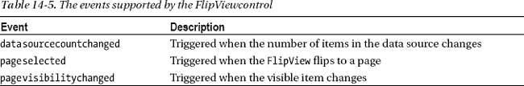

只有当数据源中的项目数量改变时，而不是当一个项目被另一个项目替换时，才会触发`datasourcecountchanged`事件。这意味着当你使用一个`WinJS.Binding.List`对象作为你的数据源时，使用`setAt`方法将导致`FlipView`控件显示你指定的项目，但它不会触发`datasourcecountchanged`事件。

当显示新页面时，触发`pageselected`事件。当用户单击导航按钮时，或者当调用`next`和`previous`方法时，或者当使用`currentPage`属性跳转到特定项目时，该事件被触发。当用户在控件上滑动以选择一项时，不会触发该事件，但当释放触摸时会触发该事件。

每当`FlipView`改变一个项目的可见性时，就会触发`pagevisibilitychanged`事件。这是一个很好的想法，但它没有以一种特别有用的方式执行。传递给`pagevisibilitychanged`的处理函数的`Event`并不包含事件相关条目的细节，所以您只会收到一连串几乎无用的通知。

我可以使用`datasourcecountchanged`事件来替换我对`setImmediate`函数的调用，以推迟使用`count`方法。您可以在[清单 14-14](#list_14_14) 中看到我对`flipview.js`文件所做的更改。

***清单 14-14** 。处理 datasourcecountchanged 事件*

`...
WinJS.UI.Pages.define("/pages/FlipView.html", {
    ready: function () {

        var proxyObject = WinJS.Binding.as({` `            itemTemplate: ItemTemplate,
            customAnimations: false,
        });

        Templates.createControls(rightPanel, flip, "flipView", proxyObject)
        .then(function () {

            proxyObject.bind("itemTemplate", function (val) {
                flip.winControl.itemTemplate =
                    val == "HTML" ? ItemTemplate : renderItem;
            });

**            flip.addEventListener("datasourcecountchanged", function () {**
**                flip.winControl.count().then(function (countVal) {**
**                    itemCount.innerText = countVal;**
**                });**
**            });**

            $('#rightPanel button').listen("click", function (e) {
                var data = ViewModel.data.images;
                var extras = ViewModel.data.extraImages;
                var buttonText = e.target.innerText.toLowerCase();
                switch (buttonText) {
                    case "add":
                    case "remove":
                        if (buttonText == "add" && extras.length > 0) {
                            data.push(extras.pop());
                        } else if (buttonText == "remove" && data.length > 1) {
                            extras.push(data.pop());
                        }

                        break;
                    case "previous":
                    case "next":
                        flip.winControl[buttonText]();
                        currentPage.innerText = flip.winControl.currentPage;
                        break;
                }
            });
        });
    }
});
...`

我已经删除了对`setImmediate`函数的调用，并用一个事件监听器替换它，该监听器调用`count`方法并更新右面板中`span`元素的内容。在 FlipView 处理完数据源中的新变化之前，不会触发`datasourcecountchanged`事件，这意味着我不必再担心推迟方法调用。

### 样式化 FlipView 控件

`FlipView`支持使用六个类来设计控件外观的不同方面，如[表 14-6](#tab_14_6) 中所总结的。

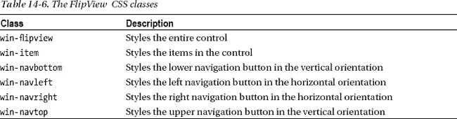

`FlipView`不会自动调整自己的大小，所以你需要将控件放入一个自动分配大小的布局中，或者指定明确的宽度和高度值。您可以使用`win-flipview`类来实现这一点，但是我倾向于将`id`用于已经应用了控件的类，以便同一页面上的多个`FlipView`控件被单独处理(出于某种原因，我的项目很少需要相同大小的多个`FlipView`控件)。

我也倾向于不使用`win-item`类，因为我更喜欢通过项目模板来处理项目的样式。当然，这只是我的偏好，当您使用一个函数来生成不同的元素集以显示项目，并且希望应用一组总体样式时，`win-item`类会很有用。

我经常使用的类是那些设计当鼠标移动到`FlipView`控件上时出现的导航按钮的类。当显示浅色图像时，这些按钮可能很难看到，在[清单 14-15](#list_14_15) 中，你可以看到一个我添加到`FlipView.html`文件中的`style`元素，它通过应用边框使它们更加明显。

***清单 14-15** 。导航按钮样式*

`...
<head>
    <title></title>
    <link href="/css/flipview.css" rel="stylesheet" />
    
**    **
</head>
...`

你可以在[图 14-9](#fig_14_9) 中看到这种风格的效果。如果您自己测试这些附加功能，请记住我只对左右按钮应用了样式，如果将`FlipView orientation`属性设置为`vertical`，这将不会产生任何效果。

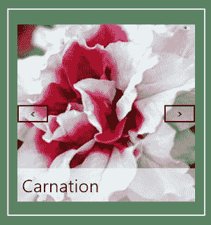

***图 14-9。**让导航按钮在灯光图像上更容易看到*

### 使用自定义动画

如果您查看布局右侧面板中的控件，您会注意到我添加了一个`ToggleSwitch`来启用自定义动画。许多 WinJS UI 控件以某种形式使用动画，或者显示从一种状态到另一种状态的转换，或者指示内容以某种方式发生了变化。通常，动画是如此的简短，以至于他们几乎看不见，但是他们仍然足够吸引眼球，向用户传递重要的信号。

我在第 18 章中深入解释了动画系统，但是`FlipView`控件为改变它所使用的动画提供了支持，我想在本章中解释如何做到这一点。这意味着我将解释如何使用一个我还没有正确介绍的功能，所以你可能想去阅读[第 18 章](18.html#ch18)，然后再回到这一节。

在本节中，你需要知道的关于动画系统的所有事情就是动画是由`WinJS.UI.Animation`名称空间中的函数来表示的，并且两个这样的函数是`fadeIn`和`fadeOut`。这两个函数都以一个元素作为参数，它们的名字告诉你它们在这个元素上执行什么样的动画。

#### 应用自定义动画

当用户导航到不同的项目时,`FlipView`控件使用动画。要改变在一种或多种情况下使用的动画，您可以向`setCustomAnimations`方法传递一个对象，该方法具有名为`next`、`previous`和`jump`的属性。当用户移动到下一个或前一个数据项时，使用下一个和前一个属性的动画，当用户导航到更远的地方时，使用 jump 属性。

这些属性的值必须是返回一个`WinJS.Promise`对象的函数，该对象在动画结束时实现。向您定义的函数传递参数，这些参数表示将要删除的元素，以及将替换它作为由`FlipView`显示的选定项的元素。

在[清单 14-16](#list_14_16) 中，你可以看到我添加到`flipview.js`文件中的代码，用于为`next`属性设置自定义动画，当右侧面板中标有`Custom Animations`的`ToggleSwitch`控件设置为`Yes`时，我会应用这些代码。

***清单 14-16** 。通过 FlipView 控件使用自定义动画*

`...

WinJS.UI.Pages.define("/pages/FlipView.html", {
    ready: function () {

        var proxyObject = WinJS.Binding.as({
            itemTemplate: ItemTemplate,
            customAnimations: false,
        });

        Templates.createControls(rightPanel, flip, "flipView", proxyObject)
        .then(function () {

            proxyObject.bind("itemTemplate", function (val) {
                flip.winControl.itemTemplate =
                    val == "HTML" ? ItemTemplate : renderItem;
            });

            flip.addEventListener("datasourcecountchanged", function () {
                flip.winControl.count().then(function (countVal) {
                    itemCount.innerText = countVal;
                });
            });

            $('#rightPanel button').listen("click", function (e) {
                var data = ViewModel.data.images;
                var extras = ViewModel.data.extraImages;
                var buttonText = e.target.innerText.toLowerCase();
                switch (buttonText) {
                    case "add":
                    case "remove":
                        if (buttonText == "add" && extras.length > 0) {
                            data.push(extras.pop());
                        } else if (buttonText == "remove" && data.length > 1) {
                            extras.push(data.pop());
                        }

                        break;
                    case "previous":
                    case "next":
                        flip.winControl[buttonText]();
                        currentPage.innerText = flip.winControl.currentPage;` `                        break;
                }
            });

**            proxyObject.bind("customAnimations", function (val) {**
**                if (val) {**
**                    flip.winControl.setCustomAnimations({**
**                        next: function (pageout, pagein) {**
**                            return WinJS.Promise.join([WinJS.UI.Animation.fadeOut(pageout),**
**                                 WinJS.UI.Animation.fadeIn(pagein)]);**
**                        }**
**                    });**
**                } else {**
**                    flip.winControl.setCustomAnimations({**
**                        next: null**
**                    });**
**                }**
**            });**
        });
    }
});
...`

当视图模型属性被设置为`true`时，我调用`setCustomAnimations`方法并向`FlipView`控件提供我希望它使用的动画的细节以及何时应用它们。我传递给`setCustomAnimations`方法的对象只定义了`next`属性，它告诉`FlipView`控件使用默认的动画用于`previous`和`jump`场景。

我想执行两个动画——我想在输出元素上执行`fadeOut`动画，在输入元素上执行`fadeIn`动画。我需要返回一个只有当这两个动画都完成时才完成的`Promise`对象，这就是为什么我使用了`Promise.join`方法，我在[第 9 章](09.html#ch9)中描述了这个方法。

当`ToggleSwitch`被设置为`No`时，我通过向`setCustomAnimations`方法传递另一个对象来返回默认动画，该方法对于我想要重置的属性具有空值。

您可以通过启动应用并使用控制导航按钮前进到下一个数据项来测试此功能。一个非常简短的动画将创建从右边出现的新项目的效果。当您将`ToggleSwitch`设置为`Yes`并再次使用导航按钮时，现有项目将淡出，并被下一个数据项所取代。

 **注意**仔细考虑你选择的动画。虽然动画很快，但与其他 Windows 应用不一致的糟糕选择可能意味着与用户正在执行的交互不同的交互类型。尽可能坚持使用默认的动画，如果不可能的话，试着将用户执行的动作和你选择的动画联系起来。这是我在第 18 章中更详细解释 WinJS 动画特性时回到的话题。

### 总结

在这一章中，我描述了 WinJS 数据控件中的第一个，`FlipView`。我向您展示了如何使用`WinJS.Binding.List`对象来创建数据源，以及如何将模板与数据相关联来配置向用户显示项目的方式。我还向您展示了第一图像问题，解释了它是如何产生的，并提供了解决该问题的不同方法。最后，我向你展示了如何用`FlipView`控件来使用自定义动画——一旦你阅读了深入研究 WinJS 动画系统的[第 18 章](18.html#ch18)，这些信息将会产生更多的共鸣。在下一章，我将向您展示`ListView`控件，它是对`FlipView`控件更大更复杂的补充。