## 第十五章

## 使用 ListView 控件

在这一章中，我描述了`ListView`控件，这是另一个 WinJS 数据驱动的 UI 控件。与上一章的 FlipView 控件有一个共同的基础，但是`ListView`显示多个项目，并在如何实现这一点上提供了一些灵活性。在这一章中，我解释了可以使用的不同种类的模板和布局，描述了被调用项和被选择项之间的区别，以及如何处理`ListView`控件发出的各种事件。我还将向您展示如何使用描述数据源的抽象，这样您就可以编写适用于任何数据源的代码，而不仅仅是那些使用`WinJS.Binding.List`对象创建的数据源。[表 15-1](#tab_15_1) 对本章进行了总结。

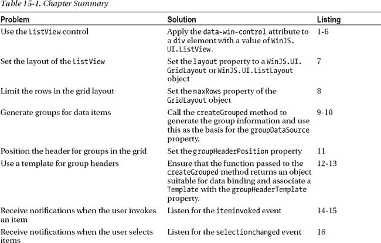

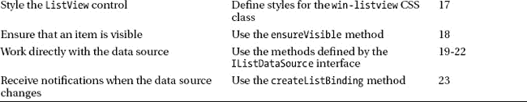

### 何时使用 ListView 控件

`ListView`是一个非常灵活的控件，对于如何使用它没有真正的限制。简而言之，如果您想向用户呈现多个项目，那么`ListView`可能是最好的 WinJS UI 控件。但是，您必须确保用户能够容易地找到特定的项目或项目组。`ListView`非常适合显示项目，包括大型数据集，但是它很容易被冲昏头脑，呈现给用户一大堆可供选择的项目。对于大型数据集，考虑为用户提供搜索或过滤项目的工具，或者实现基于语义缩放控件的布局，我在第十六章的[中对此进行了描述。](16.html#ch16)

### 添加 ListView 示例

我将从描述`ListView`控件的基本特性开始，然后在这个例子的基础上演示一些更高级的选项和特性。虽然`ListView`控件只做一件事(向用户呈现多个项目的列表)，但是有很多排列和配置选项。首先，我在`/js/viewmodel.js`文件中定义了一个数据源，如[清单 15-1](#list_15_1) 所示。

***清单 15-1** 。ListView 示例的 viewmodel.js 文件中的附加内容*

`(function () {
    "use strict";

    WinJS.Namespace.define("ViewModel", {
        data: {
            images: new WinJS.Binding.List([
                { file:img/aster.jpg", name: "Aster"},
                { file:img/carnation.jpg", name: "Carnation"},
                { file:img/daffodil.jpg", name: "Daffodil"},
                { file:img/lily.jpg", name: "Lilly"},
            ]),

            extraImages: [{ file:img/orchid.jpg", name: "Orchid"},
                { file:img/peony.jpg", name: "Peony"},
                { file:img/primula.jpg", name: "Primula"},
                { file:img/rose.jpg", name: "Rose"},
                { file:img/snowdrop.jpg", name: "Snowdrop" }],` 
`**            letters: new WinJS.Binding.List(),**
        },
    });

**    var src = ["A", "B", "C", "D", "E", "F", "G", "H", "I", "J", "K", "L", "M", "N", "O",**
**                "P", "Q", "R", "S", "T", "U", "V", "W", "X", "Y", "Z"];**
**    src.forEach(function (item, index) {**
**        ViewModel.data.letters.push({**
**            letter: item,**
**            group: index % 3**
**        });**
**    });**

})();`

我创建了一个新的`WinJS.Binding.List`对象，包含了字母表中每个字母的对象。每个对象都有一个`letter`属性，它返回对象对应的字母，还有一个`group`属性，我用它将对象分配到三个数字组中的一个。在本章的后面，我将在显示项目时使用`letter`属性的值，在描述将相关项目分组的`ListView`特性时使用 group 属性。

#### 定义列表视图 HTML

为了演示`ListView`控件，我在 Visual Studio 项目的`pages`文件夹中添加了一个名为`ListView.html`的新文件。你可以在清单 15-2 中看到这个文件的内容。

***清单 15-2** 。ListView.html 文件的初始内容*

`<!DOCTYPE html>
<html>
<head>
    <title></title>
**    <link href="/css/listview.css" rel="stylesheet">**
**    **
</head>
<body>
    

        

            

            

        

    

    

        

**            
**
**            
**
        
` 
`**        

**
**        

**
    

</body>
</html>`

通过将`data-win-control`属性设置为`WinJS.UI.ListView`，将`ListView`控件应用于`div`元素。当使用`ListView`控件时，使用`itemDataSource`和`itemTemplate`属性设置数据源和用于显示数据项的模板，就像使用`FlipView`控件一样。

`ListView`控件没有我在第 14 章的[中为`FlipView`描述的第一个图像问题，所以你可以使用`data-win-options`属性安全地声明设置`itemDataSource`和`itemTemplate`属性(尽管你也可以编程地设置这些值，并且如果你喜欢的话，使用一个函数来生成你的模板元素——细节和例子参见第 14 章](14.html#ch14))。在我的清单中，我使用添加到`viewmodel.js`文件中的字母相关对象的`List`作为数据源，使用在`ListView.html`文件中定义的`WinJS.Binding.Template`控件作为模板。

#### 定义 CSS

我已经把这个例子的 CSS 放到一个名为`/css/listview.css`的文件中，你可以在[清单 15-3](#list_15_3) 中看到它的内容。在这个 CSS 中没有新的技术，所有的风格都是简单和标准的。

***清单 15-3** 。listview.css 文件的内容*

`#list {width:  500px;height: 500px;}
*.listItem {width: 100px;}
*.listData {background-color: black;
    text-align: center; border: solid medium white;font-size: 70pt;}
.listTitle {position: absolute; background-color: rgba(255, 255, 255, 0.6);
    color: black; bottom: 3px;font-size: 20pt; width: 86px;
    padding-left: 10px; padding-top: 20px;font-weight: bold;}
*.invoked {color: red;}
*.invoked .listData {font-weight: bold;}
*.invoked .listTitle {background-color: transparent}
#midPanel, #rightPanel { -ms-flex-pack: start;  }
#list .win-container {background-color: transparent;}`

#### 定义 JavaScript

我已经把这个例子的 JavaScript 放到了一个名为`/js/pages/listview.js`的文件中，你可以在[清单 15-4](#list_15_4) 中看到这个文件的内容。

***清单 15-4** 。listview.js 文件的初始内容*

`(function () {

    WinJS.UI.Pages.define("/pages/ListView.html", {
        ready: function () {

            var proxyObject = WinJS.Binding.as({
                layout: "Grid",
                groups: false,` `                groupHeaderPosition: "top",
                maxRows: 3,
                ensureVisible: null,
                searchFor: null,
            });

**            Templates.createControls(midPanel, list, "listView1", proxyObject);**
**            Templates.createControls(rightPanel, list, "listView2", proxyObject);**
        }
    });
})();`

您会注意到，我对清单中的`Templates.createControls`方法进行了两次调用。当我为这个例子定义 HTML 时，我为配置控件添加了一个额外的容器元素，如下所示:

`...
**

**

...`

在这一章中，我需要太多的配置控件来将它们放入模拟器的标准分辨率屏幕上的一个容器中，所以我将元素分成了两个容器，因此，需要对`createControls`方法进行两次调用。你可以在[清单 15-5](#list_15_5) 中看到我添加到这个例子的`controls.js`文件中的两组定义控件。

***清单 15-5** 。ListView 控件的定义对象*

`...
**listView1**: [
    { type: "select", id: "layout", title: "Layout", values: ["Grid", "List"],
         useProxy: true },
    { type: "toggle", id: "groups", title: "Groups", useProxy: true, value: false },
    { type: "select", id: "groupHeaderPosition", title: "Group Position",
        values: ["top", "left"], labels: ["Top", "Left"], useProxy: true },
    { type: "input", id: "maxRows", title: "Max Rows", value: 3, useProxy: true },
    { type: "span", id: "invoked", value: "Invoke an Item", title: "Invoked" },
    { type: "span", id: "selected", value: "Select an Item", title: "Selected" }],

**listView2**: [
    { type: "select", id: "tapBehavior", title: "tapBehavior",
        values: ["directSelect", "toggleSelect", "invokeOnly", "none"] },
    { type: "select", id: "selectionMode", title: "selectionMode",
        values: ["multi", "single", "none"] },
    { type: "input", id: "ensureVisible", title: "EnsureVisible", value: "",
        useProxy: true },
    { type: "input", id: "searchFor", title: "Search For", value: "", useProxy: true },
    { type: "span", id: "itemCount", value: 26, title: "Count" },
    { type: "buttons", labels: ["Add Item", "Delete Item"] }],
...`

正如我前面提到的，`ListView`控件非常灵活，这反映在我演示最重要的特性所需的配置控件的数量上。

最后，我需要确保用户可以从导航条导航到`ListView.html`文件，所以我对`templates.js`文件进行了添加，如[清单 6](#list_15_6) 所示。

***清单 15-6** 。确保可以从导航栏访问 ListView.html 文件*

`...
var navBarCommands = [
    //{ name: "AppTest", icon: "target" },
    { name: "ToggleSwitch", icon: "\u0031" },
    { name: "Rating", icon: "\u0032" },
    { name: "Tooltip", icon: "\u0033" },
    { name: "TimePicker", icon: "\u0034" },
    { name: "DatePicker", icon: "\u0035" },
    { name: "Flyout", icon: "\u0036" },
    { name: "Menu", icon: "\u0037" },
    { name: "MessageDialog", icon: "\u0038" },
    { name: "FlipView", icon: "pictures" },
**    { name: "Listview", icon: "list" },**
];
...`

### 使用列表视图控件

如果此时运行 app 并通过导航栏导航到`ListView.html`文件，你会看到如图[图 15-1](#fig_15_1) 所示的布局。在左侧面板中是`ListView`控件，它显示了我添加到`viewmodel.js`文件中的字母数据源中的项目。另外两个面板包含配置控件，我将使用它们来演示不同的`ListView`特性。

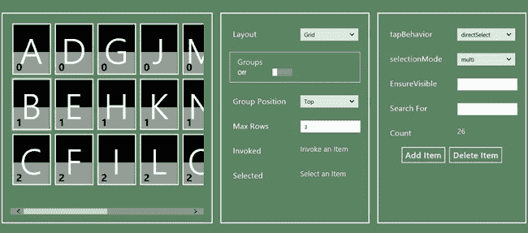

***图 15-1。【ListView.html T2】文件的布局***

在接下来的部分中，我将解释`ListView`功能的不同方面，并演示使用`ListView`控件显示数据项的不同方式。

#### 选择布局

`ListView`可以使用两种不同的布局显示数据项。默认情况下，`ListView`控件在一个网格中显示来自数据源的项目，如图 1 所示。请注意数据项的显示顺序。网格中的每一列都是从上到下填充的，形成了垂直优先的布局。如果数据源中的项目多于`ListView`控件占据的屏幕空间，则使用水平滚动。为了使布局对用户更明显，当用户将鼠标移动到`ListView`控件上或通过触摸交互向左或向右滑动时，会显示一个水平滚动条。

可以使用的另一种布局是垂直列表。您可以使用示例右侧面板中的第一个`select`元素在网格和列表之间切换，我将它标记为`Layout`。在清单 15-7 中，你可以看到我添加到`/js/pages/listview.js`文件中的代码，它将`select`元素链接到`ListView`控件。

***清单 15-7** 。切换 ListView 控件的布局*

`(function () {

    WinJS.UI.Pages.define("/pages/ListView.html", {
        ready: function () {

            var proxyObject = WinJS.Binding.as({
                layout: "Grid",
                groups: false,
                groupHeaderPosition: "top",
                maxRows: 3,
                ensureVisible: null,
                searchFor: null,
            });

            Templates.createControls(midPanel, list, "listView1", proxyObject);
            Templates.createControls(rightPanel, list, "listView2", proxyObject);

**            proxyObject.bind("layout", function (val) {**
**                list.winControl.layout = val == "Grid" ?**
**                    new WinJS.UI.GridLayout() : new WinJS.UI.ListLayout();**
**            });**
        }
    });
})();`

`ListView`控件定义了`layout`属性，这就是我在清单中所做的更改。您将该属性设置为一个对象——如果您想要网格，则为一个`WinJS.UI.GridLayout`对象；如果您想要垂直列表，则为一个`WinJS.UI.ListLayout`对象。

在[图 15-2](#fig_15_2) 中可以看到切换到`List`布局的效果。图中的布局看起来有点奇怪，因为`ListView`控件的大小适合显示多列。

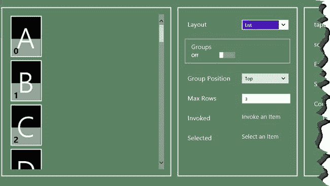

***图 15-2。**使用列表布局显示元素*

这是一个更加传统的垂直列表。我倾向于不像这样单独使用列表布局，但是它在创建语义缩放布局时非常有用，我在第 16 章中对此进行了描述。

一个常见的错误是将`layout`属性设置为字符串形式的对象名称。这是行不通的——您需要使用`new`关键字来创建一个新对象，并将其赋值，就像我在清单中所做的那样。如果希望以声明方式设置布局，则必须在数据绑定中使用特殊的符号，如下所示:

`...
data-win-options="{layout: **{type: WinJS.UI.ListLayout}**}"
...`

这个符号告诉`ListView`控件创建一个`ListLayout`对象的新实例。这是一种笨拙的语法，我倾向于通过在代码中设置布局来避免它。

 **注意**原则上，你可以创建自己的布局对象来实现定制的布局策略，但是很难将`WinJS.UI.Layout`对象中定义的基本功能和`ListView`控件对布局功能的假设分开。

#### 设置网格的最大行数

`GridLayout`对象定义了`maxRows`属性，该属性对用于布局数据源中的项目的行数设置了上限。为`maxRows`属性设置一个值只会限制行数——例如，它不会强制网格占据您指定的行数。实际行数不同的主要原因是`GridLayout`永远不会使用垂直滚动。因此，除非有足够的垂直空间来完全容纳从模板生成的元素，否则不会添加新行。

为了演示这个特性，在标签为`Max Rows`的应用程序布局的中间面板中有一个`input`元素。在[清单 15-8](#list_15_8) 中，您可以看到我添加到`/js/pages/listview.js`文件中的代码，该代码将输入该控件的值链接到`maxRows`属性。

***清单 15-8** 。向 listview.js 文件添加对 maxRows 特性的支持*

`(function () {

    WinJS.UI.Pages.define("/pages/ListView.html", {
        ready: function () {

            var proxyObject = WinJS.Binding.as({
                layout: "Grid",
                groups: false,
                groupHeaderPosition: "top",
                maxRows: 3,
                ensureVisible: null,
                searchFor: null,
            });

            Templates.createControls(midPanel, list, "listView1", proxyObject);
            Templates.createControls(rightPanel, list, "listView2", proxyObject);

            proxyObject.bind("layout", function (val) {
                list.winControl.layout = val == "Grid" ?
                    new WinJS.UI.GridLayout() : new WinJS.UI.ListLayout();
            });

**            proxyObject.bind("maxRows", function (val) {**
**                list.winControl.layout.maxRows = val;**
**            });**
        }
    });
})();`

这是`GridLayout`对象的一个特性，您创建它并将其设置为`ListView`控件的`layout`属性的值——它不是由`ListView`本身直接定义的一个特性。这意味着该功能仅在网格布局中起作用，并且您必须确保通过从布局属性返回的对象来设置值。如果你给一个`ListLayout`对象的`maxRows`属性赋值，不要担心——这不会有不好的影响，但是不会改变布局。您可以在[图 3](#fig_15_3) 中的`Max Rows input`元素中看到输入值`2`的效果。

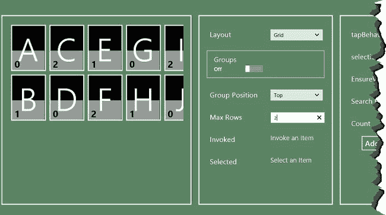

***图 15-3。**为 maxRows 属性设置一个值*

#### 显示组

`ListView`控件能够以组的形式显示项目，其中组的细节通过一种特殊的数据源提供，这种数据源很明显叫做*组数据源*。正是为了准备这个特性，当我在本章前面设置示例应用程序时，我为我添加到数据列表中的对象定义了`group`属性。

当您使用`WinJS.Binding.List`对象时，创建一个组数据源非常简单——您只需调用`createGrouped`方法。你可以在清单 15-9 的[中看到我对`/js/viewmodel.js`文件所做的添加，以调用这个方法。](#list_15_9)

***清单 15-9** 。从列表对象创建分组数据源*

`(function () {
    "use strict";

    WinJS.Namespace.define("ViewModel", {
        data: {
            images: new WinJS.Binding.List([
                { file:img/aster.jpg", name: "Aster"},
                { file:img/carnation.jpg", name: "Carnation"},
                { file:img/daffodil.jpg", name: "Daffodil"},
                { file:img/lily.jpg", name: "Lilly"},
            ]),

            extraImages: [{ file:img/orchid.jpg", name: "Orchid"},` `                { file:img/peony.jpg", name: "Peony"},
                { file:img/primula.jpg", name: "Primula"},
                { file:img/rose.jpg", name: "Rose"},
                { file:img/snowdrop.jpg", name: "Snowdrop" }],

            letters: new WinJS.Binding.List(),
**            groupedLetters: null,**
        },
    });

    var src = ["A", "B", "C", "D", "E", "F", "G", "H", "I", "J", "K", "L", "M", "N", "O",
                "P", "Q", "R", "S", "T", "U", "V", "W", "X", "Y", "Z"];
    src.forEach(function (item, index) {
        ViewModel.data.letters.push({
            letter: item,
            group: index % 3
        });
    });

**    ViewModel.data.groupedLetters = ViewModel.data.letters.createGrouped(**
**        function (item) { return item.group.toString(); },**
**        function (item) { return "Group " + item.group; },**
**        function (g1, g2) { return g1 - g2; }**
**    );**
})();`

我在名称空间`ViewModel.data`中定义了一个名为`groupedLetters`的新属性，并将来自`List.createGrouped`方法的结果赋给它。`createGrouped`方法返回一个新的`List`对象，其中的项目按组组织。`createGrouped`方法有三个函数，用于提供每个项目的分组信息。

第一个函数返回项目所属组的键。数据源中的每个项目都会调用它，并且您必须返回一个字符串。在我的例子中，我能够返回我为每个数据项定义的`group`属性的字符串值。

第二个函数为每组中的第一项调用一次。结果是要分配给组的文本描述。我对 group 属性的数值进行了简单的修改，因此我返回了名称`Group 1`、`Group 2`等等。请注意，系统会向您传递一个完整的数据项，因此您可以使用您选择的数据项的任何特征来生成组描述。

第三个函数用于对组进行排序。您被传递了两个组的密钥，要求您返回一个数值。返回值`0`表示这些组具有相同的等级，返回小于零的值表示第一组应该在第二组之前显示，返回大于零的值表示第二组应该在第一组之前显示。因为我的组合键是数字，所以我可以返回一个减去另一个的结果来得到我想要的效果。

##### 应用组数据源

我将在常规数据源和组数据源之间切换，以响应中间面板中标有`Groups`的`ToggleSwitch`控件。您可以在清单 10 的[中看到我添加到`/js/pages/listview.js`中的代码，当开关位置改变时，它会做出响应。](#list_15_10)

***清单 15-10** 。增加数据源之间切换的支持*

`(function () {

    WinJS.UI.Pages.define("/pages/ListView.html", {
        ready: function () {

            var proxyObject = WinJS.Binding.as({
                layout: "Grid",
                groups: false,
                groupHeaderPosition: "top",
                maxRows: 3,
                ensureVisible: null,
                searchFor: null,
            });

            Templates.createControls(midPanel, list, "listView1", proxyObject);
            Templates.createControls(rightPanel, list, "listView2", proxyObject);

            proxyObject.bind("layout", function (val) {
                list.winControl.layout = val == "Grid" ?
                    new WinJS.UI.GridLayout() : new WinJS.UI.ListLayout();
            });

            proxyObject.bind("maxRows", function (val) {
                list.winControl.layout.maxRows = val;
            });

**            proxyObject.bind("groups", function (val) {**
**                if (val) {**
**                    var groupDataSource = ViewModel.data.groupedLetters;**
**                    list.winControl.itemDataSource = groupDataSource.dataSource;**
**                    list.winControl.groupDataSource = groupDataSource.groups.dataSource;**
**                } else {**
**                    list.winControl.itemDataSource = ViewModel.data.letters.dataSource;**
**                    list.winControl.groupDataSource = null;**
**                }**
**            });**
        }
    });
})();`

为了显示分组数据，我必须更新两个属性:`itemDataSource`和`groupDataSource`。`itemDataSource`属性用于获取将要显示的项目，而`groupDataSource`属性用于获取关于项目分组方式的信息。

第一步是设置`itemDataSource`属性，使其指向*分组* `List`对象的`dataSource`属性。第二步是将`groupDataSource`设置为*分组* `List`对象的`groups.dataSource`属性。

 **注意**这导致了很多混乱，需要强调的是:对于*`itemDataSource`和`groupDataSource`属性，必须使用*分组的*数据源。*

 *按照与常规数据源相同的语法，`itemDataSource`属性被设置为`List.dataSource`属性。`groupDataSource`属性被设置为`List.groups.dataSource`属性——注意属性路径中添加了`groups`。设置了这两个属性后，`ListView`控件将分组显示数据源项，并显示每组的标题，如图 15-4 中的[所示。](#fig_15_4)

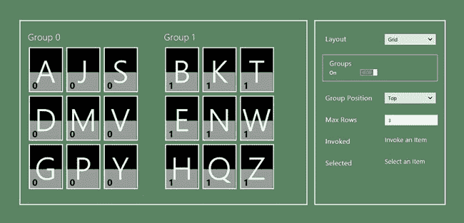

***图 15-4。**显示分组数据*

为了更容易看到这些组，我在导航到`ListView.html`页面后，通过在`JavaScript Console`窗口中输入以下语句，临时调整了应用程序的布局:

* * *

`rightPanel.style.display = "none";
list.style.width = "800px"`

* * *

当切换回常规(未分组)数据源时，必须将`groupDataSource`属性设置为`null`。如果您不这样做，应用程序将抛出一个异常，因为数据源缺少将组与单个数据项关联起来所需的结构。

##### 设置割台位置

如图 15-4 中的[所示，项目组上方的每组都有一个标题。您可以通过由`GroupLayout`对象(而不是由`ListView`控件本身)定义的`groupHeaderPosition`属性来更改这个位置。中间面板中的`select`元素可以用来改变组标题的位置，你可以看到我添加到`/js/pages/listview.js`文件中的代码，当在](#fig_15_4)[清单 15-11](#list_15_11) 中选取一个新的`select`值时，它会做出响应。

***清单 15-11** 。增加了改变组头位置的支持*

`(function () {

    WinJS.UI.Pages.define("/pages/ListView.html", {
        ready: function () {

            var proxyObject = WinJS.Binding.as({
                layout: "Grid",
                groups: false,
                groupHeaderPosition: "top",
                maxRows: 3,
                ensureVisible: null,
                searchFor: null,
            });

            Templates.createControls(midPanel, list, "listView1", proxyObject);
            Templates.createControls(rightPanel, list, "listView2", proxyObject);

            proxyObject.bind("layout", function (val) {
                list.winControl.layout = val == "Grid" ?
                    new WinJS.UI.GridLayout() : new WinJS.UI.ListLayout();
            });

            proxyObject.bind("maxRows", function (val) {
                list.winControl.layout.maxRows = val;
            });

**            proxyObject.bind("groupHeaderPosition", function (val) {**
**                list.winControl.layout.groupHeaderPosition = val;**
**            });**

            proxyObject.bind("groups", function (val) {
                // ...code removed for brevity...
            });
        }
    });
})();`

`groupHeaderPosition`属性支持的值是`top`(默认值)和`left`。你可以在图 15-5 的[中看到`left`值如何改变布局。在组的顶部显示标题可以减少网格中的行数，所以当那些行更重要时`left`设置是有用的，即使网格本身会更宽并且需要更多的水平滚动。](#fig_15_5)

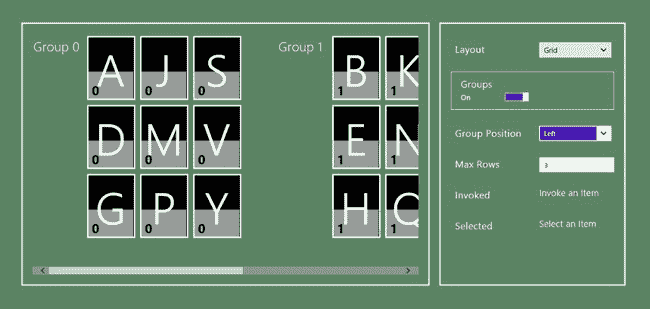

***图 15-5。**在群组左侧显示群组标题*

##### 使用组页眉模板

默认情况下，`ListView`只是将组头显示为一个字符串，但是您可以通过提供一个定制模板来定制外观。但是，需要对数据源进行调整，以便组密钥可以与 WinJS 绑定模板一起使用。您可以在[清单 15-12](#list_15_12) 中看到 UI 对`/js/viewmodel.js`文件中的组数据所做的更改。

***清单 15-12** 。更改组数据以支持使用标题模板*

`...
ViewModel.data.groupedLetters = ViewModel.data.letters.createGrouped(
    function (item) { return item.group.toString(); },
    function (item) {
        //return "Group " + item.group;
**        return {**
**            title: "Group " + item.group**
**        };**
    },
    function (g1, g2) { return g1 - g2; }
);
...`

问题是 WinJS 数据绑定系统没有一种机制允许你引用传递给`Template`控件的`render`方法的数据对象。(有关如何使用数据绑定模板的详细信息，请参见[第 8 章](08.html#ch8))。为了解决这个问题，我需要更改我传递给`createGrouped`方法的第二个函数的结果，以便它返回一个具有我可以在数据绑定中引用的属性的对象。

在[清单 15-13](#list_15_13) 中，你可以看到我添加到`ListView.html`文件中的模板，以及我使用`data-win-options`属性中的`groupHeaderTemplate`属性将模板与控件关联起来的方式。我还添加了一个`style`元素，它适用于从模板创建的元素。

***清单 15-13** 。向 ListView.html 文件添加并应用组标题模板*

`<!DOCTYPE html>
<html>
<head>
    <title></title>
    <link href="/css/listview.css" rel="stylesheet">
    
**    **
</head>
<body>
    

        

            

            

        

    

**    
**
**        

**
**    
**

    

        

            

            

        

        

        

    

</body>
</html>`

模板没有什么特别的——它遵循了我在《T2》第 8 章中展示的所有约定，并用于`ListView`和`FlipView`控件的项目模板。你可以在[图 15-6](#fig_15_6) 中看到结果，我已经在两个位置显示了从模板生成的组标题。

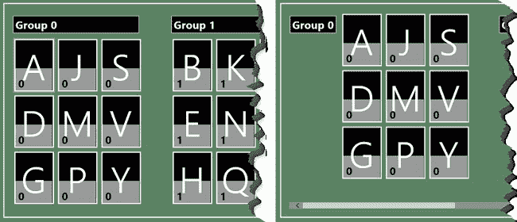

***图六。**使用模板显示群组标题*

### 处理 ListView 事件

`ListView`控件定义了我在[表 15-2](#tab_15_2) 中描述的四个事件。在很大程度上，这些事件与用户交互有关，我将在下面的章节中解释。

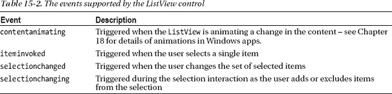

#### 处理被调用的项目

当用户通过点击或用鼠标点击选择一个项目时，触发`iteminvoked`事件。传递给事件处理函数的对象是一个`IItemPromise`，它是一个常规的`Promise`，当它被满足时返回一个`IItem`对象(我在[第 9 章](09.html#ch9)中描述过)。在清单 15-14 中，你可以看到我是如何使用`IItemPromise`来更新中间面板中标有`Invoked`的 span 元素的。

***清单 15-14** 。处理 iteminvoked 事件*

`...
list.addEventListener("**iteminvoked**", function (e) {
    e.detail.itemPromise.then(function (item) {
        invoked.innerText = item.data.letter;
        $('.invoked').removeClass("invoked");
        WinJS.Utilities.addClass(e.target, "invoked");` `    });
});
...`

没有视觉提示来显示哪个项目被调用了，所以，如果你想让用户清楚，你必须自己处理。在这个例子中，我将`invoked`类应用于表示被调用项目的元素(并且，因为一次只能调用一个项目，所以要确保没有其他元素属于这个类)。`invoked`类对应于我在本章开始时向您展示的`/css/listview.css`文件中的样式。我已经重复了清单 15-15 中的样式。

***清单 15-15** 。定义被调用项目的样式*

`...
*.invoked {color: red;}
*.invoked .listData { font-weight: bold;}
*.invoked .listTitle {background-color: transparent;}
...`

你可以在[图 15-7](#fig_15_7) 中看到结果，该图显示了同一项目的正常状态和调用状态。但是，您不必指出被调用的项，尤其是当它与项的选择相冲突时，我将在下一节中对此进行描述。

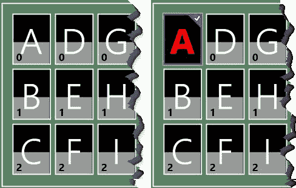

***图 15-7。**为用户标记被调用的项目*

##### 设定点击行为

通过改变`tapBehavior`属性的值，可以改变`ListView`响应用户点击项目的方式。这个属性可以设置为`WinJS.UI.TapBehavior`枚举中的一个值，我已经在[表 15-3](#tab_15_3) 中描述过了。

T2】

这些值定义了调用和选择项目之间的关系。如果您只想让用户调用项目，那么您应该使用的值是`invokeOnly`。如果您希望用户能够选择，但不能调用项目，那么您应该使用`none`值。其他值允许同时调用和选择一个项目。我将在下一节解释项目选择。

您可以通过从应用程序布局的右侧面板中的`select`元素中选择一个值来更改`tapBehavior`属性的值，该元素的标签很明显是`tapBehavior`。

#### 处理项目选择

用户可以选择项目并调用它们。这可能会导致一些复杂的交互，因此配置`ListView`非常重要，这样您就可以获得您想要的效果。您可以通过使用我在上一节中提到的`tapBehaviour`属性和`selectionMode`属性来实现这一点，后者是使用来自`WinJS.UI.SelectionMode`枚举的值来设置的。我已经在[表 15-4](#tab_15_4) 中描述了这个枚举中的值。

 **提示**您可以通过从标签为`selectionMode`的应用程序布局右侧面板的`select`元素中选取一个值来更改`selectionMode`属性的值。

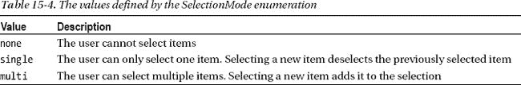

通过监听`selectionchanged`事件，您可以在选择发生变化时收到通知。当`selectionMode`设置为`multi`时，通过监听`selectionchanging`事件，您可以在用户向选择中添加项目时接收更新。你可以看到我是如何在清单 15-16 中为`selectionchanged`定义一个处理程序的。

***清单 15-16** 。处理 selectionchanged 事件*

`...
list.addEventListener("iteminvoked", function (e) {
    e.detail.itemPromise.then(function (item) {
        invoked.innerText = item.data.letter;
        $('.invoked').removeClass("invoked");` `        WinJS.Utilities.addClass(e.target, "invoked");
    });
});

**list.addEventListener("selectionchanged", function (e) {**
**    this.winControl.selection.getItems().then(function (items) {**
**        var selectionString = "";**
**        items.forEach(function (item) {**
**            selectionString += item.data.letter + ", ";**
**        });**
**        selected.innerText = selectionString.slice(0, -2);**
**    });**
**});**
...`

用户选择的项目集可通过 selected 属性获得，该属性返回一个`ISelection`对象。这个对象定义了一些有用的方法来处理选中的项目，我已经在[表 15-5](#tab_15_5) 中描述过了。

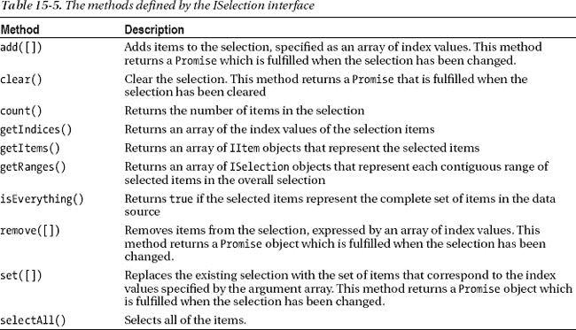

在清单中，我使用了`getItems`方法来获取所选项的集合，以便构建一个可以在视图模型中设置的值，从而在示例的右侧面板中显示选择。`getItems`方法返回一个由`IItem`对象组成的数组，每个对象对应一个选中的项目。正如您在第 14 章中回忆的那样，`IItem`通过一个`Promise`使其内容可用，这就是为什么我必须使用 then 方法来获得每一项的细节(参见[第 9 章](09.html#ch9)以获得`Promise`对象的更多细节)。`ListView`对选择的项目进行强调，以便用户可以看到整个选择，如图[图 15-8](#fig_15_8) 所示。注意，字母`D`的项目被选中*并且*被调用。

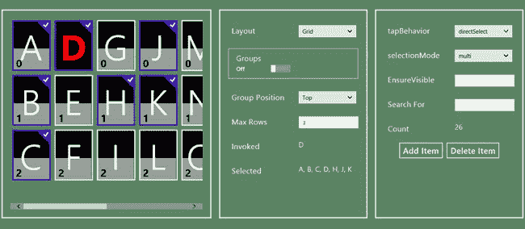

***图 15-8。**通过 ListView 控件添加到所选项目的强调*

### 设计 ListView 控件的样式

`ListView`支持许多类，你可以用它们来设计控件外观的不同方面，如[表 15-6](#tab_15_6) 中所总结的。

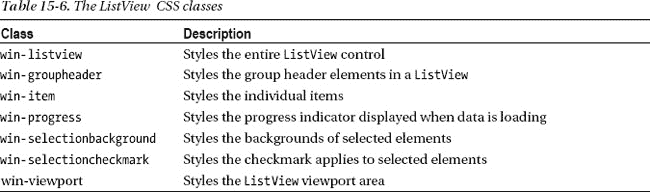

并非所有这些 CSS 类都是`ListView`控件独有的——例如，你会注意到`win-item`类是与我在第 14 章中描述的`FlipView`控件共享的。当应用这些样式时，您需要确保将焦点缩小到已经应用了`ListView`控件的元素上。在[清单 15-17](#list_15_17) 中，你可以看到我添加到`ListView.html`文件中的`style`元素来演示这些风格。

***清单 15-17** 。使用 CSS 样式化 ListView 选择*

`...

...`

我已经使用了`win-selectioncheckmark`类来改变选中项目上显示的格子的大小和颜色，你可以在[图 15-9](#fig_15_9) 中看到它的效果。

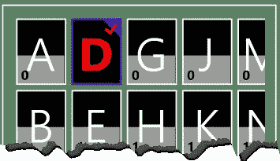

***图 15-9。**使用 CSS 样式化 ListView 控件*

### 以编程方式管理 ListView 控件

您可以使用许多不同的方法和属性来控制`ListView`的行为。我已经描述了其中的一些，比如通过`selection`属性可用的`add`、`remove`和`set`方法，以及控制数据项如何显示的`itemTemplate`和`groupHeaderTemplate`属性。[表 15-7](#tab_15_7) 显示了从代码中驱动`ListView`控件行为时有用的一些附加方法和属性。

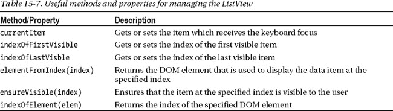

我倾向于不使用`indexOfElement`和`elementFromIndex`方法，因为我更喜欢让`ListView`控件处理其内容的外观和布局。然而，其他方法可能非常有用，尤其是当您从外部 UI 控件驱动`ListView`时。作为一个例子，我在例子的右边面板中包含了一个`input`元素，这个元素被标记为`Ensure Visible`。[清单 15-18](#list_15_18) 显示了我添加到`/js/pages/listview.js`文件中的代码，当`input`元素的内容改变时，它调用`ensureVisible`方法。

***清单 15-18** 。调用 ensureVisible 方法*

`...
proxyObject.bind("ensureVisible", function (val) {
    list.winControl.**ensureVisible**(val == null ? 0 : val);
});
...`

例如，如果您将 input 元素中的值设置为`26`，您将看到`ListView`滚动其内容，以便字母`Z`可见。

#### 搜索元素

用户通常不会根据索引来考虑数据项，因此作为一个相关的例子，我在右边的面板中定义了另一个标记为`Search For`的`input`元素。在[清单 15-19](#list_15_19) 中，你可以看到我添加到`/js/pages/listview.js`文件中的代码，当一个值被输入到`input`元素中时，通过定位相应的项目并选择它来响应。这是一个简单的技巧，但却是一个经常需要的技巧，所以我想把它包含在这一章中，供你将来参考。

***清单 15-19** 。根据内容定位和选择项目*

`...
proxyObject.bind("searchFor", function (val) {
    if (val != null) {
        var index = -1;
        ViewModel.data.letters.forEach(function (item) {
            if (item.letter == val.toUpperCase()) {
                index = ViewModel.data.letters.indexOf(item);
            }
        });
        if (index > -1) {
            list.winControl.ensureVisible(index);
            list.winControl.selection.set([index]);
        }
    }
});
...`

代码的第一部分定位数据源中与用户在`input`元素中输入的字母相匹配的项目的索引。如果有匹配，我使用索引来设置`ListView`选择，并确保选中的项目是可见的。在[图 15-10](#fig_15_10) 中，你可以看到在`Search For input`元素中输入字母`J`会发生什么。

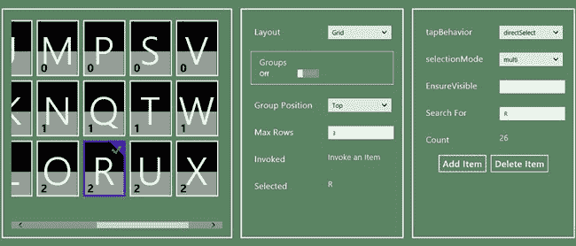

***图 15-10。**寻找字母 J*

### 使用数据源

在我的例子中，`ListView`控件的数据源是一个`WinJS.Binding.List`对象。这是一个方便的安排，因为这意味着我可以通过操作`List`的内容来改变`ListView`显示的数据。

虽然这很方便，但不太现实。您可能无法通过这样一个有用的辅助渠道修改数据，甚至不知道您正在处理哪种数据源。在这些情况下，您需要依赖由`IListDataSource`接口定义的功能。该接口定义了所有数据源都必须实现的方法，并且您可以依赖这些由`ListView.itemDataSource`属性返回的对象定义的方法。我已经在[表 15-8](#tab_15_8) 中描述了`IListDataSource`定义的方法。

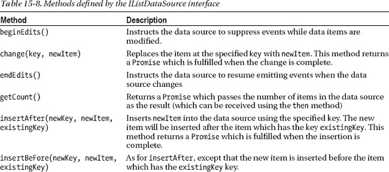

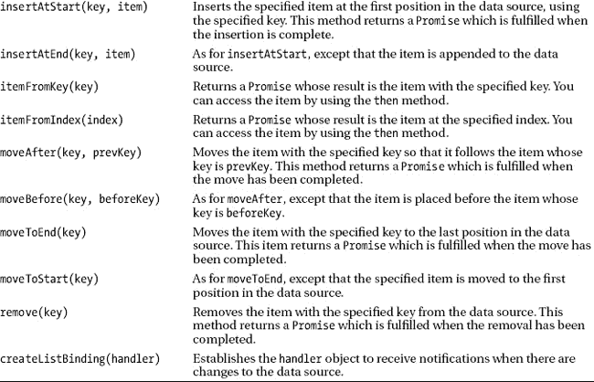

我在这个例子的右边面板中定义了两个`button`元素，标记为`Add Item`和`Delete Item`。您可以从清单 15-20 中的[按钮看到我添加到`/js/pages/listview.js`文件中处理`click`事件的代码。在这段代码中，我使用了来自`IListDataSource`接口的方法来编辑数据源的内容。](#list_15_20)

***清单 15-20** 。使用 IListDataSource 方法编辑数据源的内容*

`...
$(".buttonContainer button").listen("click", function (e) {
    var ds = list.winControl.itemDataSource;
    ds.beginEdits();
    var promise;
    if (this.innerText == "Add Item") {
        promise = ds.insertAtEnd(null, { letter: "A", group: 4 });
    } else {
        promise = ds.remove("1");
    }
    promise.then(function () {
        ds.endEdits();
    });
});
...`

如果点击`Add Item`按钮，一个新的数据项将被添加到数据源中，并由`ListView`控件显示——该数据项总是带有字母`A`,属于组`4`。如果点击`Delete Item`按钮，索引`1`处的元素将被移除。

#### 处理钥匙

如果您仔细查看表中的方法，您会注意到键在标识数据源中的项时起着重要的作用。到目前为止，我还没有担心过键，因为它们是由`List`对象自动分配的，但是当您直接使用数据源时，它们就会浮出水面。

`WinJS.Binding.List`对象遵循一个简单的系统，根据条目添加到列表中的顺序生成键。第一项被分配一个键`1`，第二项被分配一个键`2`，依此类推。键被表示为字符串值，所以如果你想通过它的索引定位一个键，你必须使用`"1"`而不是数字值。您可以看到我如何使用键值来响应被点击的`Delete Item`按钮:

`...
promise = ds.remove(**"1"**);
...`

该方法调用首先删除添加到`List`中的项目。但是，当数据源的内容改变时，键不会改变，因此再次单击该按钮将会生成错误，因为数据源中没有具有指定键的项。

当使用`List`对象作为数据源时，这是一个非常常见的错误，因为很容易假设键指的是元素的索引，而不是它被添加的顺序。要删除第一个项目，我需要采取不同的方法，如清单 15-21 所示，它通过位置获取一个项目，然后获取密钥并用它来请求删除。

***清单 15-21** 。根据项目在数据源中的位置删除项目*

`...
$(".buttonContainer button").listen("click", function (e) {
    var ds = list.winControl.itemDataSource;
    ds.beginEdits();
    var promise;
    if (this.innerText == "Add Item") {
        promise = ds.insertAtEnd(null, { letter: "A", group: 4 });
    } else {
        //promise = ds.remove("1");
   **     promise = ds.itemFromIndex(0).then(function (item) {**
**            return ds.remove(item.key);**
**        });**
    }
    promise.then(function () {
        ds.endEdits();
    });
});
...`

由`itemFromIndex`方法返回的来自`Promise`的结果是一个`IItem`对象，我在[第 14 章](14.html#ch14)中介绍过。这个对象包含了键，我可以将它传递给`remove`方法。注意，几乎所有由`IListDataSource`接口定义的方法都返回一个`Promise`。你需要使用`Promise.then`方法将操作数据源内容的动作链接在一起——参见[第 9 章](09.html#ch9)了解`Promise`对象和如何使用`then`方法的全部细节。

#### 添加没有关键字的项目

点击`Add Item`按钮向数据源添加一个新项目。我不想担心为我的数据对象生成唯一的键，所以我将`insertAtEnd`方法的第一个参数设置为`null`，如下所示:

`...
promise = ds.insertAtEnd(**null**, { letter: "A", group: 4 });
...`

这告诉数据源实现对象(在我的例子中是`List`)应该使用它的标准算法生成一个键。

#### 抑制更新事件

每次项目改变时，数据源都会发出事件，这导致`ListView`更新其布局，以便与数据保持同步。这是一个很棒的功能，但这意味着如果您进行多次编辑，您需要显式禁用这些事件——如果您不这样做，那么`ListView`将在每次更改后自我更新，这是一个资源密集型操作，可能会导致用户看到不一致或混乱的数据项视图。

您可以使用`beginEdits`方法禁用事件。我已经在示例中这样做了，尽管我只编辑了一个项目(我发现总是调用`beginEdits`是一个好习惯，这样我以后更新编辑代码时就不会有问题了)。一旦您调用了这个方法，您就可以自由地对数据源进行彻底的修改，而不必担心不必要的`ListView`更新。

完成编辑后，必须确保调用`endEdits`方法。如果您忘记了，数据源不会发送任何事件，并且`ListView`也不会更新。你需要确保在调用`endEdits`之前所有的编辑操作都已经完成，这意味着跟踪`IListDataSource`方法返回的`Promise`对象，并在适当的时候使用`then`方法链接方法调用。你可以在清单 15-22 中看到我是如何做到的。

***清单 15-22** 。使用 then 方法确保 endEdits 方法具有正确的效果*

`...
$(".buttonContainer button").listen("click", function (e) {
    var ds = list.winControl.itemDataSource;
**    ds.beginEdits();**
    var promise;
    if (this.innerText == "Add Item") {
        promise = ds.insertAtEnd(null, { letter: "A", group: 4 });
    } else {
        //promise = ds.remove("1");
        promise = ds.itemFromIndex(0).then(function (item) {
            return ds.remove(item.key);
        });
    }
**    promise.then(function () {**
**        ds.endEdits();**
**    });**` `});
...`

如果您在编辑操作完成之前调用了`endEdits`方法，那么您将会在`ListView`中看到您所做的最后几次编辑的每次更改的更新，这就使调用`beginEdits`失去了意义。

#### 监听数据源的变化

您可以通过使用`createListBinding`方法接收数据源变化的通知。这个方法的参数是一个实现由`IListNotificationHandler`接口定义的方法的对象，我已经在[表 15-9](#tab_15_9) 中描述过了。

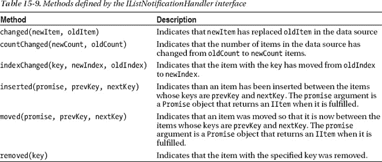

你倾听事件的方式有点奇怪，最好用一个例子来解释。清单 15-23 显示了我在例子中定义的处理程序。

***清单 15-23** 。使用带有数据源的通知处理程序*

`...
var handler = {
**    countChanged: function (newCount, oldCount) {**
**        itemCount.innerText = newCount;**
**    }**
};
list.winControl.itemDataSource.**createListBinding(handler)**;
...`

第一步是创建一个对象，该对象定义与表中的方法相匹配的方法。您可以在清单中看到，我定义了一个名为`countChanged`的方法，它有两个参数——这与由`IListNotificationHandler`接口定义的`countChanged`方法相匹配。

一旦实现了您感兴趣的方法，您就可以将处理程序对象传递给`createListBinding`方法。从这一点来看，当数据源发生变化时，将调用处理程序方法。在我的例子中，当数据源中的项数改变时，我的`countChanged`方法将被执行。您可以通过点击`Add Item`或`Delete Item`按钮来实现这一点，并查看示例右侧面板中`Count`标签旁边显示的结果。

### 总结

在这一章中，我已经向你展示了`ListView`控件，这是一个丰富而复杂的 UI 控件。布局和模板系统允许您控制项目的布局，我解释了调用和选择项目以及与它们相关的事件之间的区别。在本章的最后，我向您展示了如何使用数据源，而不是直接操作实现对象。这允许您创建适用于任何数据源的代码，而不仅仅是基于`WinJS.Binding.List`对象的代码。在下一章，我将向你展示如何使用语义缩放，它结合了不同的 WinJS UI 控件来创建一个关键的窗口交互。*