## 第十六章

## 使用语义缩放

在这一章中，我描述了 WinJS UI 控件的最后一个，叫做`SemanticZoom`。该控件代表 Windows 中的一个关键用户交互，并允许用户在数据集中的两个细节级别之间缩放。控件本身相对简单，依靠一对`ListView`控件来完成所有的艰苦工作(我在[第 15 章](15.html#ch15)的`ListView`控件中描述过)。在这一章中，我将向你展示如何使用`SemanticZoom`，并演示一种可以同时显示两个细节层次的替代方法。表 16-1 提供了本章的总结。

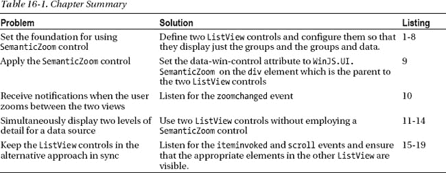

### 何时使用语义缩放控件

只有当数据可以被有意义地分组时，才应该使用`SemanticZoom`控件，因为这是提供导航和上下文的基础。我说*是有意义的*分组，因为以对用户和他们使用数据执行的任务有意义的方式来表示数据是很重要的。将分组应用到数据上很容易，只是为了让使用`SemanticZoom`变得可行，但是结果会让那些必须处理以无意义的方式组织的数据的用户感到有点困惑。在使用`SemanticZoom`控件之前，您可能希望阅读整个章节:除了如何使用`SemanticZoom`的细节，我还演示了一种替代方法，这种方法对于数据分组方式对用户来说不太明显的数据集很有用。

### 添加 SemanticZoom 示例

`SemanticZoom`控件相对简单，因为它建立在`ListView`控件的功能上。对于更大的数据集来说，`SemanticZoom`控件是最容易演示的，所以我开始对`/js/viewmodel.js`文件做了一些补充，如[清单 16-1](#list_16_1) 所示。

***清单 16-1** 。向 viewmodel.js 文件添加数据*

`(function () {
    "use strict";

    WinJS.Namespace.define("ViewModel", {
        data: {
            images: new WinJS.Binding.List([
                { file:img/aster.jpg", name: "Aster"},
                { file:img/carnation.jpg", name: "Carnation"},
                { file:img/daffodil.jpg", name: "Daffodil"},
                { file:img/lily.jpg", name: "Lilly"},
            ]),

            extraImages: [{ file:img/orchid.jpg", name: "Orchid"},
                { file:img/peony.jpg", name: "Peony"},
                { file:img/primula.jpg", name: "Primula"},
                { file:img/rose.jpg", name: "Rose"},
                { file:img/snowdrop.jpg", name: "Snowdrop" }],

            letters: new WinJS.Binding.List(),
            groupedLetters: null,
**            names: new WinJS.Binding.List(),**
**            groupedNames: null,**
        },
    });

    // *...code for previous chapters removed for brevity...*

**    var namesSrcData = ['Aaliyah', 'Aaron', 'Abigail', 'Abraham', 'Adam', 'Addison',**
**    'Adrian', 'Adriana', 'Aidan', 'Aiden', 'Alex', 'Alexa', 'Alexander', 'Alexandra',**
**    'Alexis', 'Allison', 'Alyssa', 'Amelia', 'Andrew', 'Angel', 'Angelina',**
**    'Anna', 'Anthony', 'Ariana', 'Arianna', 'Ashley', 'Aubrey', 'Austin', 'Ava',**
**    'Avery', 'Ayden', 'Bella', 'Benjamin', 'Blake', 'Brandon', 'Brayden', 'Brian',**
**    'Brianna', 'Brooke', 'Bryan', 'Caleb', 'Cameron', 'Camila', 'Carter', 'Charles',**
**    'Charlotte', 'Chase', 'Chaya', 'Chloe', 'Christian', 'Christopher', 'Claire',**
**    'Connor', 'Daniel', 'David', 'Dominic', 'Dylan', 'Eli', 'Elijah', 'Elizabeth',**
**    'Ella', 'Emily', 'Emma', 'Eric', 'Esther', 'Ethan', 'Eva', 'Evan', 'Evelyn',**
**    'Faith', 'Gabriel', 'Gabriella', 'Gabrielle', 'Gavin', 'Genesis', 'Gianna',**
**    'Giovanni', 'Grace', 'Hailey', 'Hannah', 'Henry', 'Hunter', 'Ian', 'Isaac',**
**    'Isabella', 'Isaiah', 'Jack', 'Jackson', 'Jacob', 'Jacqui', 'Jaden', 'Jake',**
**    'James', 'Jasmine', 'Jason', 'Jayden', 'Jeremiah', 'Jeremy', 'Jessica', 'Joel',**
**    'John', 'Jonathan', 'Jordan', 'Jose', 'Joseph', 'Joshua', 'Josiah', 'Julia',**
**    'Julian', 'Juliana', 'Julianna', 'Justin', 'Kaitlyn', 'Katherine', 'Kayla',**
**    'Kaylee', 'Kevin', 'Khloe', 'Kimberly', 'Kyle', 'Kylie', 'Landon', 'Lauren',**` `**    'Layla', 'Leah', 'Leo', 'Liam', 'Lillian', 'Lily', 'Logan', 'London', 'Lucas',**
**    'Luis', 'Luke', 'Mackenzie', 'Madeline', 'Madelyn', 'Madison', 'Makayla', 'Maria',**
**    'Mason', 'Matthew', 'Max', 'Maya', 'Melanie', 'Mia', 'Michelle', 'Miriam', 'Molly',**
**    'Morgan', 'Moshe', 'Naomi', 'Natalia', 'Natalie', 'Nathan', 'Nathaniel', 'Nevaeh',**
**    'Nicholas', 'Nicole', 'Noah', 'Oliver', 'Olivia', 'Owen', 'Paige', 'Patrick',**
**    'Peyton', 'Rachel', 'Rebecca', 'Richard', 'Riley', 'Robert', 'Ryan', 'Samantha',**
**    'Samuel', 'Sara', 'Sarah', 'Savannah', 'Scarlett', 'Sean', 'Sebastian', 'Serenity',**
**    'Sofia', 'Sophia', 'Sophie', 'Stella', 'Steven', 'Sydney', 'Taylor', 'Thomas',**
**    'Tristan', 'Tyler', 'Valentina', 'Victoria', 'Vincent', 'William', 'Wyatt',**
**    'Xavier', 'Zachary', 'Zoe', 'Zoey'];**

**    namesSrcData.forEach(function (item, index) {**
**        ViewModel.data.names.push({name: item, firstLetter: item[0]**
**        });**
**    });**

**    ViewModel.data.groupedNames = ViewModel.data.names.createGrouped(**
**        function (item) { return item.firstLetter; },**
**        function (item) { return item; },**
**        function (g1, g2) { return g1 < g2 ? -1 : g1 > g2 ? 1 : 0; }**
**    );**
})();`

我将处理的数据是一个姓名列表。这些是 2011 年纽约州最受欢迎的婴儿名字。

我首先处理名称列表，以填充我分配给`ViewModel.data`名称空间中的 names 属性的`WinJS.Binding.List`对象。对于每个名字，我创建一个对象，它有一个`name`属性和一个`firstLetter`属性。我将完整的名称分配给 name 属性，并且顾名思义，将名称的第一个字符分配给`firstLetter`属性(这将使我以后更容易将数据组织成组)。所以，以名称`Sophie`为例，我在`ViewModel.data.names` `List`中创建一个对象，如下所示:

`...
{
    name: "Sophie",
    firstLetter: "S"
}
...`

我使用`ViewModel.data.names` `List`中的数据对象创建分组数据，使用的技术与我在第 15 章的[中展示的技术相同。正如你将看到的，当使用`SemanticZoom`控件时，群组扮演了一个重要的角色。在这种情况下，我已经按照项目的首字母对它们进行了分组，因此所有以`A`开头的名称都在同一个组中，所有以`B`开头的名称也是如此，依此类推。分组数据可通过`ViewModel.data.groupedNames`属性获得。](15.html#ch15)

#### 定义 HTML 文件

为了演示`SemanticZoom`控件，我在 Visual Studio 项目的`pages`文件夹中创建了一个名为`SemanticZoom.html`的新文件。你可以在清单 16-2 中看到这个文件的内容。

***清单 16-2** 。SemanticZoom.html 文件的最初内容*

`<!DOCTYPE html>
<html>
<head>
    <title></title>
    <link href="/css/listview.css" rel="stylesheet">
    <link href="/css/semanticzoom.css" rel="stylesheet">
    
</head>
<body>
    

        

            

        

    

    

        

            

        

    

    

        
Letter: 

    

    

        

            **
**
**            
**
        

        

    

</body>
</html>`

这个文件包含了标准的双面板布局，我在本书这一部分的大多数例子中使用了这个布局，还有三个模板，我将用它们来演示`SemanticZoom`控件的特性。有一点是不包含对`SemanticZoom`控件本身的任何引用——这是因为通过向您展示底层构建模块并在以后添加控件，我可以更容易地解释该控件的工作原理。

本例的 JavaScript 只包含对`Templates.createControl`方法的调用，所以我将它包含在 HTML 文件的`script`元素中。

#### 定义 CSS

在`SemanticZoom.html`文件中有两个`link`元素。第一个是我在第 15 章中创建的`/css/listview.css`文件，它包含我为用来显示数据的模板定义的样式——出于同样的目的，我在本章中再次使用这些样式。第二个`link`元素指的是我添加到 Visual Studio 项目中的一个名为`/css/semanticzoom.css`的新文件，它包含一些我用于`SemanticZoom`控件的附加样式。您可以在清单 16-3 的[中看到`semanticzoom.css`文件的内容。这个文件中没有新的技术——我只是设置了将应用`SemanticZoom`控件的元素的大小，并为`SemanticZoom`所依赖的底层控件之一定义了一些基本样式(稍后我会解释)。](#list_16_3)

***清单 16-3** 。semanticzoom.css 文件的内容*

`#semanticZoomer {
    width: 500px; height: 500px;
}

*.zoomedInListItem {
    width: 150px;
}

*.zoomedInListData { background-color: black; text-align: center;
    border: solid medium white; font-size: 20pt; padding: 10px;
}`

#### 完成示例

你可以在[清单 16-4](#list_16_4) 中看到我添加到`/js/controls.js`文件中的定义对象。`SemanticZoom`控件相对简单，您可以从我定义的少量配置控件中看到这一点。

***清单 16-4** 。controls.js 文件的定义对象*

`...
**semanticZoom**: [
    { type: "toggle", id: "enableButton", title: "EnableButton", value: true },
    { type: "toggle", id: "locked", title: "Locked", value: false },
    { type: "toggle", id: "zoomedOut", title: "Zoomed Out", value: false },
    { type: "input", id: "zoomFactor", title: "Zoom Factor", value: 0.65 },
],
...`

最后一步是确保用户可以导航到`SemanticZoom.html`文件，我通过在`/js/templates.js`文件中添加如[清单 16-5](#list_16_5) 所示的内容来完成。

***清单 16-5** 。增加导航到 SemanticZoom.html 文件的支持*

`var navBarCommands = [
    //{ name: "AppTest", icon: "target" },
    { name: "ToggleSwitch", icon: "\u0031" },
    { name: "Rating", icon: "\u0032" },
    { name: "Tooltip", icon: "\u0033" },` `    { name: "TimePicker", icon: "\u0034" },
    { name: "DatePicker", icon: "\u0035" },
    { name: "Flyout", icon: "\u0036" },
    { name: "Menu", icon: "\u0037" },
    { name: "MessageDialog", icon: "\u0038" },
    { name: "FlipView", icon: "pictures" },
    { name: "Listview", icon: "list" },
**    { name: "SemanticZoom", icon: "zoom" },**
];`

如果您在此时运行示例应用程序并导航到`SemanticZoom.html`页面，您将看到如图[图 16-1](#fig_16_1) 所示的应用程序布局。面板结构和配置控件已经就位，但是左侧面板中没有控件。在接下来的部分中，我将向您展示如何应用`SemanticZoom`控件。

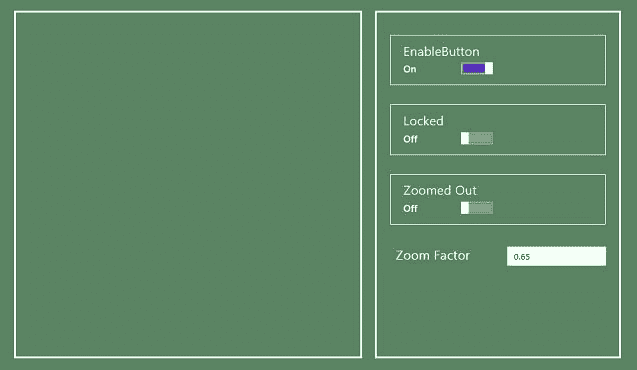

***图 16-1。【SemanticZoom.html T2】页面的初始布局***

### 了解语义缩放控件

`SemanticZoom`控件为用户提供了相同数据的两种视图选择——一种是放大的视图，显示分组排列的单个数据项，另一种是缩小的视图，只显示分组，不显示数据项。用户可以使用缩小视图来浏览大型复杂数据集，然后深入了解特定组的详细信息。

向您展示如何应用`SemanticZoom`的最佳方式是从关注如何创建两个视图开始，这依赖于`WinJS.UI.ListView`控件的两个实例，我在[第 15 章](15.html#ch15)中描述过。在接下来的章节中，我将向你展示如何创建底层的`ListView`控件，然后如何应用`SemanticZoom`控件来协调它们的行为和外观。

#### 创建放大的列表视图控件

`SemanticZoom`控件依靠两个`ListView`控件来表示数据的放大和缩小视图。你可以在清单 16-6 的[中看到我是如何定义放大视图的，我已经将它添加到了`SemanticZoom.html`文件中。](#list_16_6)

***清单 16-6** 。定义放大的 ListView 控件*

`...

**    
**
**    
**

...`

要创建放大视图，将分组数据源的`itemDataSource`设置为`dataSource`，将`groupDataSource`属性设置为`groups.dataSource`对象。这将设置`ListView`,使数据项成组显示，并带有组标题。(这与我在第 15 章的[中描述`ListView`控件时使用的技术相同。)](15.html#ch15)

您用常规模板设置了`itemTemplate`和`groupHeaderTemplate`来显示项目和组标题。这些是我在`SemanticZoom.html`文件中定义的模板，我在[清单 16-7](#list_16_7) 中再次列出了它们。

***清单 16-7** 。放大的 ListView 控件的项目和显示模板*

`...

    

        

    

...

    
Letter: 

...`

如果您运行该示例并在此时导航到`SemanticZoom.html`文件，您将能够看到添加和配置`ListView`控件的效果，如图[图 16-2](#fig_16_2) 所示。我仍然没有`SemanticZoom`控件，但是数据的两个视图中的一个已经就位。

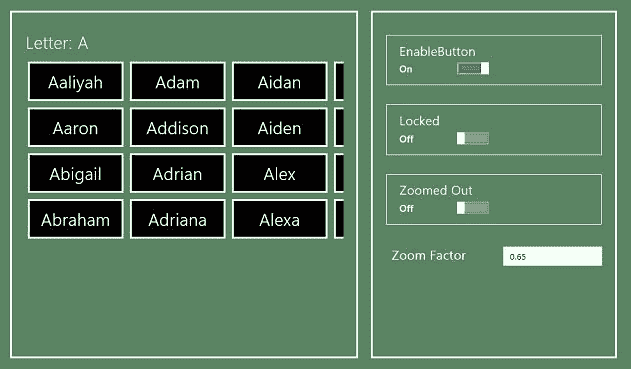

***图 16-2。**将放大的视图添加到 SemanticZoom.html 文件*

#### 创建缩小的 ListView 控件

下一步是添加将显示缩小视图的`ListView`控件，向用户显示组列表，而不显示这些组中的任何数据项。你可以在清单 16-8 的[中看到我对`SemanticZoom.html`文件添加的`ListView`控件。](#list_16_8)

***清单 16-8** 。为缩小视图添加 ListView 控件*

`...

    

    

**    
**
**    
**

...`

这个`ListView`将只显示组，这意味着我必须使用*组数据源*作为`itemDataSource`属性的值。这是一个巧妙的技巧，因为它允许`ListView`控件显示缩小的数据，而不需要理解它正在处理的数据的结构——这是`SemanticZoom`控件，我将很快添加到示例中，它提供上下文并关联数据的两个视图。

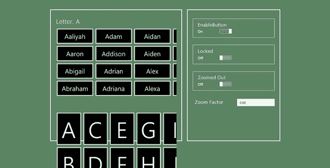

***图 16-3。**两个 ListView 控件都显示在应用程序布局中*

如果你现在运行这个例子，你将会在应用程序布局中看到两个`ListView`控件，如图 16-3 中的[所示。](#fig_16_3)

根据您的设备分辨率，布局中可能没有足够的空间来显示两个`ListView`控件，因此其中一个控件可能会溢出屏幕底部。即便如此，这也是一个机会，可以确保在应用`SemanticZoom`控件并开始管理控件的可见性之前，它们已经被正确配置。

#### 应用语义缩放控件

通过将`data-win-control`属性设置为`WinJS.UI.SemanticZoom`，将`SemanticZoom`控件应用于`div`元素，其中`div`元素包含显示数据的两个视图的`ListView`控件。

当您设置了`ListView`控件并以您想要的方式显示数据时，您可以添加`SemanticZoom`控件。你可以在清单 16-9 的[中的`SemanticZoom.html`文件中看到我是如何做的。](#list_16_9)

 **注意**`ListView`控件在`SemanticZoom` `div`元素中声明的顺序很重要——放大视图必须出现在缩小视图之前。

***清单 16-9** 。应用语义缩放控件*

`...

    

        

        

        

        

    

...`

应用`SemanticZoom`控件的结果是只有一个`ListView`元素，最初，这是放大的视图。如果你将鼠标移到`SemanticZoom`控件上，你会看到滚动条上方出现一个小按钮。在[图 16-4](#fig_16_4) 中，你可以看到放大的视图，我高亮显示了这个按钮以便更容易看到(直到你知道它在那里，它才那么明显)。

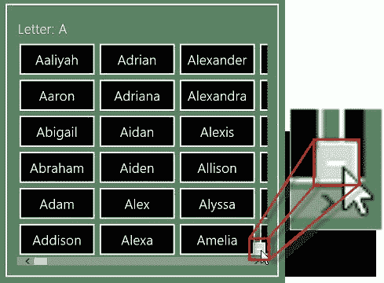

***图 16-4。**放大视图和缩小按钮。*

点击该按钮将使`SemanticZoom`控件显示向缩小视图转换的动画，允许用户浏览组级别的数据，如图 16-5 中的[所示。](#fig_16_5)

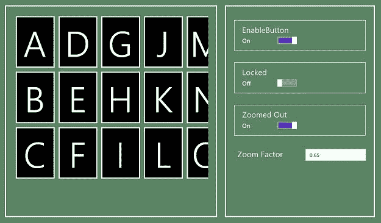

***图 16-5。**语义缩放控件*显示的缩小视图

如果你点击一个组，那么`SemanticZoom`控件将动画显示转换回放大的视图，显示你选择的组中的项目。

#### 在语义缩放视图之间导航

我向您展示了缩小按钮，因为在没有提示的情况下很难注意到它，但是有几种不同的方式可以在由`SemanticZoom`控件显示的两个视图之间导航。如果你有带滚轮的鼠标，你可以按住`Control`键，向上移动鼠标滚轮放大，向下移动缩小。如果你喜欢使用键盘，那么你可以使用`Control`和加号键(`+`)放大，使用`Control`和减号键(`-`)缩小。

如果您是触控用户，那么您可以使用捏合/缩放触控手势来放大和缩小。我将在第 17 章中详细讨论触摸手势，但是如果你选择了我在[图 16-6](#fig_16_6) 中突出显示的按钮，Visual Studio 模拟器将允许你执行捏/缩放手势。

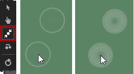

***图 16-6。**捏手势模拟按钮并显示*

当您选择收缩/缩放手势按钮时，光标将变为图中所示的两个空心圆圈，每个圆圈代表一根手指。按住鼠标按钮，模拟用手指触摸屏幕–光标会发生变化，圆圈被填满，如图的最后一帧所示。使用鼠标滚轮将模拟的手指移近或移远，创建收缩/缩放手势。将手指并拢使`SemanticZoom`控件缩小，将手指分开使其放大。

### 配置语义缩放控件

`SemanticZoom`控件支持我在[表 16-2](#tab_16_2) 中描述的配置属性。与其他 WinJS UI 控件相比，这是一个很小的属性集，因为`SemanticZoom`中的复杂性被委托给它所依赖的`ListView`控件。

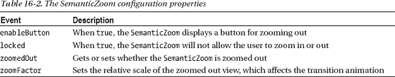

我已经在示例的右面板中定义了配置控件来演示所有四个`SemanticZoom`属性。`locked`和`zoomedOut`属性是不言而喻的，但是我将在接下来的章节中解释另外两个属性。

#### 启用和禁用缩小按钮

属性控制我在[图 16-4](#fig_16_4) 中展示的缩小按钮的可见性。我在示例的右面板中加入了一个`ToggleSwitch`，它改变了`SemanticZoom`控件上的`enableButton`属性。

该属性的默认值是`true`，这意味着`SemanticZoom`控件将显示按钮。将属性设置为`false`会阻止按钮显示，但是用户仍然可以使用我在上一节中描述的其他技术在视图之间导航。如果您想防止用户在视图之间切换，那么将`locked`属性设置为`true`。

#### 设置缩放系数

正如您已经注意到的，`SemanticZoom`控件使用动画在视图之间切换，而`zoomFactor`属性决定动画的戏剧性。该值可以在`0.2`和`0.85`之间，默认为`0.6`。我无法在打印页面上演示动画，但是较小的值会产生更生动的缩放效果。我更喜欢一个更微妙的动画，这意味着如果我改变默认值，它通常是一个值`0.8`，它创建了一个效果，清楚地表明一个过渡，而不是太引人注目。

### T1】处理 SemanticZoom 控件事件

`SemanticZoom`控件定义了一个事件，当控件在缩放级别之间切换时会发出该事件。我在[表 16-3](#tab_16_3) 中描述了这一事件。

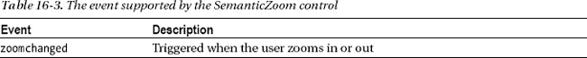

您可以在清单 16-10 中看到我是如何处理这个事件的。当事件被触发时，我更新了视图模型中的一个属性，这使得标记为`Zoomed Out`的`ToggleSwitch`配置控件与`SemanticZoom`的状态保持一致。

***清单 16-10** 。处理 SemanticZoom 事件*

`...
...`

传递给 handler 函数的`Event`对象的`detail`属性在`SemanticZoom`为`zoomedOut`时设置为`true`，在放大时设置为`false`。

 **提示**你通过直接处理控件的事件来响应用户与放大的`ListView`的交互。关于项目被调用或选择时`ListView`用来发送通知的事件的详细信息，请参见[第 15 章](15.html#ch15)。

### 设置 SemanticZoom 控件的样式

一个`SemanticZoom`的大部分样式是通过底层`ListView`控件使用的模板完成的(我在[第 15 章](15.html#ch15)中描述过)。然而，有两个类可以用来直接设计这个控件的样式，如[表 16-4](#tab_16_4) 所述。

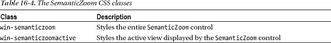

我不会在我的项目中使用这些风格。如果我想应用常规样式，那么我的目标是包含`SemanticZoom`控件的父元素(在我的例子中，这是具有`semanticZoomContainer`的`id`的`div`元素，我通常在我的所有内容中有一个等价的容器元素)。如果我想设计一个更具体的布局部分，那么我会瞄准`ListView`控件，或者通常依靠项目和组标题模板来获得我想要的效果。

### 语义缩放控件的替代

在我看来，`SemanticZoom`控件呈现的交互有一个缺陷，那就是当显示放大视图时，缩小视图呈现的整体上下文丢失了。当可以从数据中推断出上下文时，这不是问题，我的姓名数据就是这种情况。你可以在[图 16-7](#fig_16_7) 中看到我的意思。

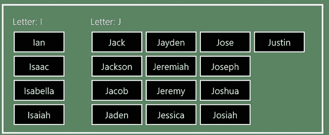

***图 16-7。**数据中群体的性质非常明显*

我只需要向您展示一两个组，就可以清楚地看到数据是按字母顺序分组的，并且根据所显示的组，`SemanticZoom`显示的数据接近数据源的 50%。在这些情况下，`SemanticZoom`控件是完美的，因为用户需要知道的一切都显示在布局中，或者可以很容易地从布局中推断出来。

 **注**以下部分展示了如何将两个`ListView`控件连接在一起。然而，很难仔细阅读所有对放大和缩小视图的引用。我的建议是在 Visual Studio 中遵循这些部分，以便您可以看到每个更改的效果——它将为描述性文本提供上下文。

有时这种方法不起作用，而您希望同时显示两个视图，以便整体上下文和细节同时可见。我发现自己经常遇到这个问题，我通过用两个`ListView`控件和一些事件处理程序代码替换`SemanticZoom`控件来解决这个问题。

#### 创建列表上下文示例

为了演示两个`ListView`控件的排列，我在名为`ListContext.html`的示例项目的`pages`目录中添加了一个新文件，其内容如[清单 16-11](#list_16_11) 所示。

***清单 16-11** 。ListContext.html 文件的内容*

`<!DOCTYPE html>
<html>
<head>
    <title></title>
    <link href="/css/semanticzoom.css" rel="stylesheet">
    <link href="/css/listcontext.css" rel="stylesheet">
    
</head>
<body>
    

        

            

        

    

    

        

            

        

    

    

        
Letter: 

    

    

        

        

        

        

    

</body>
</html>`

这个文件包含两个`ListView`元素，它们使用我为`SemanticZoom`控件定义的相同数据源。与`SemanticZoom`的例子一样，我使用了一个`ListView`来分组显示数据项(创建放大视图)，使用了一个`ListView`来只显示分组本身(创建缩小视图)。

##### 定义 CSS

我在这个例子中重用了`semanticzoom.css`文件，这样就不必改进我在模板中使用的样式。我还添加了`/css/listcontext.css`文件来去掉`ListView`对象，并定义了一些我将在本章后面使用的附加样式。您可以在[清单 16-12](#list_16_12) 中看到`listcontext.css`文件的内容。这个文件中没有新的技术，所有的样式都很简单，并且使用标准的 CSS。

***清单 16-12** 。listcontext.css 文件的内容*

`#contextContainer { height: 100%; display: -ms-flexbox;
    -ms-flex-direction: row; -ms-flex-align: center; -ms-flex-pack: center;    
}

#contextContainer div[data-win-control="WinJS.UI.ListView"] {
    border: thick solid white; height: 650px; padding: 20px; margin: 10px;
}

#zoomedOut { width: 200px;}
#zoomedIn { width: 900px; padding: 20px;}
#zoomedIn .win-groupheader {display: none;}

*.contextListItem {width: 170px;}
*.contextListData { background-color: black; text-align: center;
    border: solid medium white; font-size: 20pt;}

*.highlighted { color: #4cff00; font-weight: bold;}
*.notHighlighted { color: white; font-weight: normal;
    -ms-transition-delay: 100ms; -ms-transition-duration: 500ms;}`

##### 定义 JavaScript 代码

这个例子的 JavaScript 代码在`/js/pages/listcontext.js`文件中。首先，这个文件只包含一个空的自执行函数，但是我将在完成这个示例的过程中添加代码。你可以在清单 16-13 中看到这个文件的初始内容。

***清单 16-13** 。listcontext.js 文件的初始内容*

`(function () {

WinJS.UI.Pages.define("/pages/ListContext.html", {
    ready: function () {       
        // *...code will go here...*
    }
});

})();`

这个例子没有定义对象，因为我不需要演示任何特定的 UI 控件特性。这意味着我需要采取的唯一额外步骤是确保用户可以通过导航条导航到`ListContext.html`文件，我已经对清单 16-14 中的[文件做了添加。](#list_16_14)

***清单 16-14** 。通过导航栏启用 ListContext.html 文件导航*

`...
var navBarCommands = [
    //{ name: "AppTest", icon: "target" },
    { name: "ToggleSwitch", icon: "\u0031" },
    { name: "Rating", icon: "\u0032" },
    { name: "Tooltip", icon: "\u0033" },
    { name: "TimePicker", icon: "\u0034" },
    { name: "DatePicker", icon: "\u0035" },
    { name: "Flyout", icon: "\u0036" },
    { name: "Menu", icon: "\u0037" },
    { name: "MessageDialog", icon: "\u0038" },
    { name: "FlipView", icon: "pictures" },
    { name: "Listview", icon: "list" },
    { name: "SemanticZoom", icon: "zoom" },
**    { name: "ListContext", icon: "list" },**
];
...`

如果运行该示例并导航到`ListContext.html`文件，您将看到如图[图 16-8](#fig_16_8) 所示的布局。两个`ListView`控件已经就位并填充了数据，但是它们还没有链接在一起，所以当您调用单个项目时，它们之间没有交互。

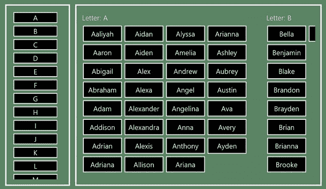

***图 16-8。【ListContext.html T2】文件的布局***

#### 为列表上下文示例添加事件处理程序代码

本例的构建模块已经就绪——剩下的是纯粹的 JavaScript 来创建两个`ListView`控件之间的关系，模拟`SemanticZoom`控件的基本行为，但确保用户可以看到组的上下文和单个元素的细节。在接下来的部分中，我将所需的代码添加到`/js/pages/listcontext.js`文件中，并解释每次添加是如何构建`ListView`控件之间交互的关键部分的。

##### 从缩小的 ListView 控件中选择组

我想做的第一件事是通过在放大视图中显示相应的组来响应在缩小视图中调用的项目。你可以在[清单 16-15](#list_16_15) 中看到我是如何做到这一点的，这里我添加了一个函数来处理`ListContext.js`文件中的`iteminvoked`事件。

***清单 16-15** 。在缩小视图中处理调用的项目*

`(function () {

WinJS.UI.Pages.define("/pages/ListContext.html", {
    ready: function () {

        zoomedOut.addEventListener("iteminvoked", function (e) {
            e.detail.itemPromise.then(function (item) {
                var invokedGroup = item.key;
                zoomedIn.winControl.groupDataSource.itemFromKey(invokedGroup)
                .then(function (item) {
                    var index = item.firstItemIndexHint;
                    zoomedIn.winControl.indexOfFirstVisible = index;
                });
            });
        });
    }
});

})();`

正如你在第 15 章中回忆的那样，当用户点击一个项目时，就会触发`iteminvoked`事件。传递给处理函数的`Event`对象的`detail`属性是一个`Promise`对象，它在项目完成时返回项目。我使用`then`方法获取项目，并使用`key`属性获取被调用项目的键。

属性告诉我用户调用了哪个组。为了在放大的视图中显示这个组，我在分组的数据源上使用了`itemFromKey`方法。这给了我另一个`Promise`，它在完成时返回一个项目。不同之处在于，从分组数据源返回的项包含一个`firstItemIndexHint`属性，该属性返回组中第一项的索引。我通过设置`indexOfFirstVisible`属性的值来确保用户在缩小视图中调用的组显示在放大视图中，这将导致`ListView`跳转到数据中的正确位置。

这种添加的结果是调用缩小的`ListView`中的项目将导致在放大的`ListView`中向用户显示相应的组。你可以在[图 16-9](#fig_16_9) 的缩小视图中看到调用`J`组的效果。

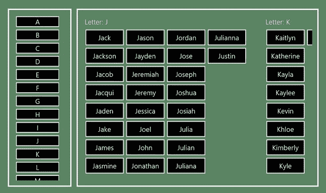

***图 16-9。**在缩小的 ListView 控件中调用一个组的效果*

##### 响应放大的 ListView 控件中的滚动

我现在想设置互补关系，以便在放大的视图中滚动内容。我在`ListContext.js`文件中为放大的`ListView`控件上的`scroll`事件添加了一个处理函数，如[清单 16-16](#list_16_16) 所示

***清单 16-16** 。为放大的 ListView 控件添加滚动事件处理程序*

`(function () {

WinJS.UI.Pages.define("/pages/ListContext.html", {
    ready: function () {

        zoomedOut.addEventListener("iteminvoked", function (e) {
            e.detail.itemPromise.then(function (item) {
                var invokedGroup = item.key;
                zoomedIn.winControl.groupDataSource.itemFromKey(invokedGroup)
                .then(function (item) {
                    var index = item.firstItemIndexHint;
                    zoomedIn.winControl.indexOfFirstVisible = index;
                });
            });
        });

**        zoomedIn.addEventListener("scroll", function (e) {**` `**            var firstIndex = zoomedIn.winControl.indexOfFirstVisible;**
**            zoomedIn.winControl.itemDataSource.itemFromIndex(firstIndex)**
**            .then(function (item) {**
**                zoomedOut.winControl.itemDataSource.itemFromKey(item.groupKey)**
**                .then(function (item) {**
**                    zoomedOut.winControl.ensureVisible(item.index);**
**                });**
**            });**
**        }, true);**
    }
});

})();`

要从一个`ListView`控件接收`scroll`事件，你必须将`addEventListener`方法的可选第三个参数设置为`true`，这样事件就会从包含在生成事件的`ListView`中的元素(称为视窗)中冒出来:

`...
zoomedIn.addEventListener("**scroll**", function (e) {
       //...*function statements go here*...

}, **true**);
...`

如果省略该参数，该值默认为`false`，并且该事件不会触发您的处理函数。在我的代码中，我通过读取图 16 中`indexOfFirstVisible`属性的值来响应`scroll`事件——找出哪个元素在放大的`ListView`中位于最左侧。

我使用这个元素的索引，通过调用数据源上的`itemFromIndex`方法来获取数据项本身——这是另一个在满足`Promise`时返回数据项的方法。

一旦有了条目，我就使用`groupKey`属性(在分组数据源中的条目上定义)来标识最左边的组，并确保相应的条目在缩小的`ListView`中可见。结果是两个`ListView`项目现在同步了。如果您在缩小视图中调用一个项目，相应的组将显示在放大视图中。同样，当您滚动放大视图时，代表当前显示组的项目总是可见的。

##### 处理最后一项

我还没有完全达到我想要的效果。我编写的代码确保了与放大的`ListView`中的第一个组相对应的缩小项目是可见的，但是它没有很好地处理数据源中的最后几个组。你可以在[图 16-10](#fig_16_10) 中看到这个问题，它显示了当我滚动放大的`ListView`来显示最终的元素组时的效果。

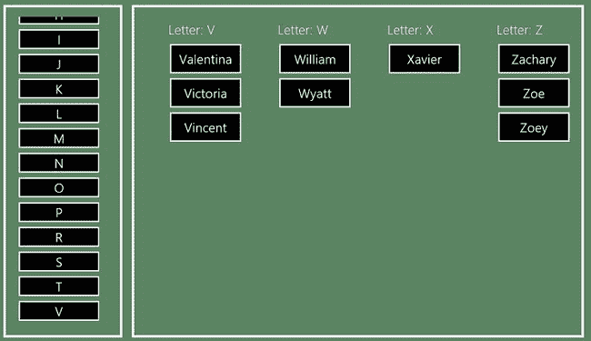

***图 16-10。**最后几组内容有问题*

如图 16-所示，缩小后的`ListView`没有显示与放大视图中最后几组相对应的项目。为了解决这个问题，我需要添加一个事件处理程序代码来专门检查显示中的最后一组，如清单 16-17 中的[所示。](#list_16_17)

***清单 16-17** 。确保最后一组得到正确处理*

`(function () {

WinJS.UI.Pages.define("/pages/ListContext.html", {
    ready: function () {

        zoomedOut.addEventListener("iteminvoked", function (e) {
            e.detail.itemPromise.then(function (item) {
                var invokedGroup = item.key;
                zoomedIn.winControl.groupDataSource.itemFromKey(invokedGroup)
                .then(function (item) {
                    var index = item.firstItemIndexHint;
                    zoomedIn.winControl.indexOfFirstVisible = index;
                });
            });
        });

**        zoomedIn.addEventListener("scroll", function (e) {**

**            var firstIndex = zoomedIn.winControl.indexOfFirstVisible;**
**            var lastIndex = zoomedIn.winControl.indexOfLastVisible;**` `**            zoomedIn.winControl.itemDataSource.getCount().then(function (count) {**
**                var targetIndex = lastIndex == count - 1 ? lastIndex : firstIndex;**

**                zoomedIn.winControl.itemDataSource.itemFromIndex(targetIndex)**
**                .then(function (item) {**
**                    zoomedOut.winControl.itemDataSource.itemFromKey(item.groupKey)**
**                    .then(function (item) {**
**                        zoomedOut.winControl.ensureVisible(item.index);**
**                    });**
**                });**
**            });**
**        }, true);**
    }
});

})();`

与上一个例子的不同之处在于，我通过使用`ListView`控件的`count`方法和`indexOfLastVisible`属性来检查数据源中的最后一项是否可见，这两者我都在第 15 章的[中描述过。如果最后一个数据项可见，那么我确保缩小视图显示最后一组组。您可以在图 16-11](15.html#ch15) 的[中看到这种变化的结果，其中您可以看到将放大视图滚动到数据集的末尾会导致缩小控件显示最后几组。](#fig_16_11)

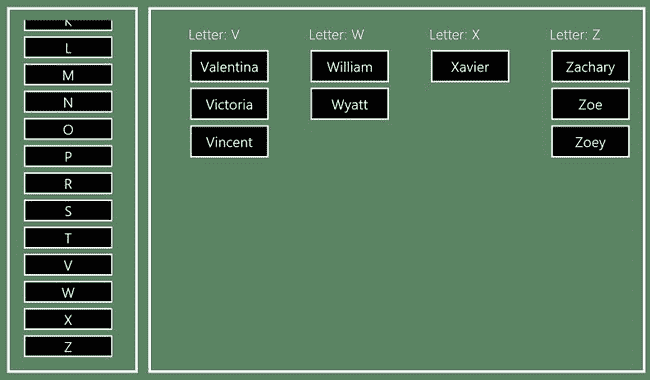

***图 16-11。**确保最后的数据项被正确处理*

##### 在缩小的控件中强调过渡

当放大视图滚动时，缩小视图是否保持最新对于用户来说不是很明显。用户的注意力会集中在正在滚动的`ListView`上，他们不会总是注意到其他地方的细微变化。

为了帮助吸引用户的注意力并强调两个`ListView`控件之间的双向关系，当放大视图中显示的组发生变化时，我将为缩小的`ListView`添加一个简短的颜色高亮。

为此，我将使用来自`/css/listContext.css`文件的两个样式，这是我在本章前面创建示例时添加的，我在[清单 16-18](#list_16_18) 中再次展示了这两个样式。这些样式使用 CSS3 过渡，使样式中定义的值逐渐应用。

***清单 16-18** 。缩小视图中高亮过渡的样式*

`...
*.highlighted {
    color: #4cff00;
    font-weight: bold;
}

*.notHighlighted {
    color: white;
    font-weight: normal;    
    -ms-transition-delay: 100ms;
    -ms-transition-duration: 500ms;
}
...`

应用了`highlighted`类的元素将有绿色和粗体文本。`notHighlighted`类逆转这些改变，但是在 100 毫秒的延迟之后，在 500 毫秒的方向上进行。为了应用这些样式，我对清单 16-19 中的[文件进行了修改。](#list_16_19)

***清单 16-19** 。应用 CSS 样式来强调列表视图控件中的项目*

`...
zoomedIn.addEventListener("scroll", function (e) {

    var firstIndex = zoomedIn.winControl.indexOfFirstVisible;
    var lastIndex = zoomedIn.winControl.indexOfLastVisible;

    zoomedIn.winControl.itemDataSource.getCount().then(function (count) {
        var targetIndex = lastIndex == count - 1 ? lastIndex : firstIndex;

**        var promises = {**
**            hightlightItem: zoomedIn.winControl.itemDataSource.itemFromIndex(firstIndex),**
**            visibleItem: zoomedIn.winControl.itemDataSource.itemFromIndex(targetIndex)**
**        };**

**        WinJS.Promise.join(promises).then(function (results) {**
            zoomedOut.winControl.itemDataSource.itemFromKey(results.visibleItem.groupKey)
            .then(function (item) {` `                zoomedOut.winControl.ensureVisible(item.index);
            });

**        zoomedOut.winControl.itemDataSource.itemFromKey(results.hightlightItem.groupKey)**
**            .then(function (item) {**
**                var elem = zoomedOut.winControl.elementFromIndex(item.index);**
**                $('*.highlighted').removeClass("highlighted")**
**                    .removeClass("notHighlighted");**
**                WinJS.Utilities.addClass(elem, "highlighted");**
**                WinJS.Utilities.addClass(elem, "notHighlighted");**
**            });**

        });
    });
}, true);
...`

我使用了`WinJS.Promise.join`方法的一个特性，它允许您传递一个属性值为`Promise`对象的对象。由`join`方法返回的`Promise`产生的结果包含相同的属性名，但是每个属性名的值是由您在对象中传递的相应的`Promise`产生的结果——这是使用数组索引的一个很好的替代方法。

否则，添加的代码很简单，当放大视图显示的组发生变化时，我应用 CSS 类来突出显示缩小视图中的项目。这种效果如此之快，以至于我无法轻松地在截图中展示给你，但如果你启动示例应用程序并滚动浏览放大的内容，你会看到在缩小的视图中出现强调的闪光。

### 总结

在本章中，我向您展示了`SemanticZoom`控件，它在整个 Windows 用户体验中扮演着重要的角色，它将两个`ListView`控件结合在一起，允许用户从一个控件缩放到另一个控件，以在两个不同的细节级别上查看相同的数据。

我还向您展示了一种替代方法，其中整体上下文和详细视图同时显示。当您正在处理的数据在没有更广泛的上下文的情况下有意义时，您应该使用标准的`SemanticZoom`控件——在我看来，这意味着数据中应用组的方式和在内容中的相对位置是不言而喻的。对于其他数据集，您应该考虑使用一种方法来确保广泛的上下文和精细的细节并排显示。在下一章，我将描述 Windows 应用程序处理输入事件和触摸手势的方式。