## 第二十一章

## 搜索合同

Windows 定义了一系列的*契约*，Windows 应用程序可以实现这些契约来集成关键的平台范围的服务。这些合同为特定功能的应用程序和操作系统之间的交互设置了一个模型。在这一章中，我将向您介绍*搜索合同*，它允许一个应用程序无缝地参与 Windows 搜索机制，允许用户在您的应用程序中查找数据，就像他在操作系统中定位文件和应用程序一样。

这一章不是关于给你的应用添加搜索功能。这是一款*已经有能力处理搜索的应用，并使用合同向用户展示这种能力。您可以提供对您的应用程序和应用程序数据有意义的任何类型的搜索功能，并且，正如您将看到的，使用户能够轻松访问和使用它。本章开始时，我将构建一个能够搜索其应用程序数据的简单应用程序，然后我将使用该应用程序来演示如何实现搜索契约。*

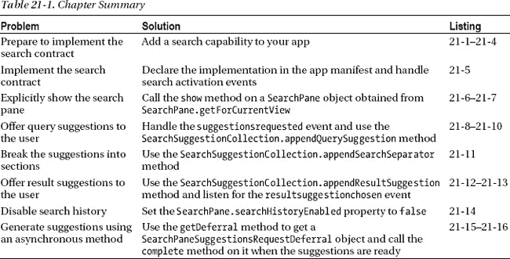

### 创建示例应用程序

在《T2》第 16 章中，我使用了一系列流行的名字来帮助演示`SemanticZoom` UI 控件。我将在本章中使用相同的数据作为基础，来演示支持搜索契约的不同方式。我为这一章编写的示例应用程序叫做`SearchContract`，你可以在[的清单 21-1](#list_21_1) 中看到 default.html 文件的内容。

***清单 21-1** 。来自 SearchContract 应用程序的 default.html 文件的内容*

`<!DOCTYPE html>
<html>
<head>
    <meta charset="utf-8" />
    <title>SearchContract</title>

    <!-- WinJS references -->
    <link href="//Microsoft.WinJS.1.0/css/ui-dark.css" rel="stylesheet" />
    
    

    <!-- SearchContract references -->
    <link href="/css/default.css" rel="stylesheet" />
**    **
    
</head>
<body>
    

        

            

        

    

    

        

    

    

**        
**
**        
**
    

    

**        
**
**        
**
    
` `</body>
</html>`

这个应用程序布局的关键部分是两个`ListView`控件。第一个`ListView`将显示一组名称，我将使用第二个`ListView`控件来显示一系列消息，类似于我在第 19 章[中向您展示 UI 中的应用生命周期事件时采用的方法。该标记还包含几个我将用于`ListView`内容项的模板和一个导入`viewmodel.js`文件的脚本元素，我将很快创建该文件。](19.html#ch19)

为了创建这个应用程序的布局，我在`/css/default.css`文件中定义了一些样式，如[清单 21-2](#list_21_2) 所示。这些样式是使用常规 CSS 属性构建的，不依赖于任何特定于 Windows 的功能。

***清单 21-2** 。/css/default.css 文件的内容*

 `body { background-color: #5A8463; display: -ms-flexbox;
    -ms-flex-direction: row; -ms-flex-align: center; -ms-flex-pack: center;}
.listContainer {height: 80%; margin: 10px; border: medium solid white; padding: 10px;}

#nameContainer { width: 50%;}
#messageContainer {width: 25%;}
#nameList, #messageList {height: 100%; margin-bottom: 10px;}

*.ListData, .message { background-color: black; text-align: center;
    border: solid medium white; font-size: 20pt; padding: 10px; width: 140px;}

.message { width: 95%; font-size: 18pt; padding: 5px;}
#buttonContainer > button {font-size: 20pt; margin: 10px;}`

#### 定义视图模型

为了定义数据并准备好它，以便它可以与`ListView`控件一起使用，我添加了一个名为`js/viewmodel.js`的文件，其内容可以在[清单 21-3](#list_21_3) 中看到。

***清单 21-3** 。viewmodel.js 文件的初始内容*

`(function () {

    var rawData = ['Aaliyah', 'Aaron', 'Abigail', 'Abraham', 'Adam', 'Addison', 'Adrian',
        'Adriana', 'Aidan', 'Aiden', 'Alex', 'Alexa', 'Alexander', 'Alexandra', 'Alexis',
        'Allison', 'Alyssa', 'Amelia', 'Andrew', 'Angel', 'Angelina', 'Anna', 'Anthony',
        'Ariana', 'Arianna', 'Ashley', 'Aubrey', 'Austin', 'Ava', 'Avery', 'Ayden',
        'Bella', 'Benjamin', 'Blake', 'Brandon', 'Brayden', 'Brian', 'Brianna', 'Brooke',
        'Bryan', 'Caleb', 'Cameron', 'Camila', 'Carter', 'Charles', 'Charlotte', 'Chase',
        'Chaya', 'Chloe', 'Christian', 'Christopher', 'sClaire', 'Connor', 'Daniel',
        'David', 'Dominic', 'Dylan', 'Eli', 'Elijah', 'Elizabeth', 'Ella', 'Emily',
        'Emma', 'Eric', 'Esther', 'Ethan', 'Eva', 'Evan', 'Evelyn', 'Faith', 'Gabriel',
        'Gabriella', 'Gabrielle', 'Gavin', 'Genesis', 'Gianna', 'Giovanni', 'Grace',
        'Hailey', 'Hannah', 'Henry', 'Hunter', 'Ian', 'Isaac', 'Isabella', 'Isaiah',
        'Jack', 'Jackson', 'Jacob', 'Jacqui', 'Jaden', 'Jake', 'James', 'Jasmine',
        'Jason', 'Jayden', 'Jeremiah', 'Jeremy', 'Jessica', 'Joel', 'John', 'Jonathan',` `        'Jordan', 'Jose', 'Joseph', 'Joshua', 'Josiah', 'Julia', 'Julian', 'Juliana',
        'Julianna', 'Justin', 'Kaitlyn', 'Katherine', 'Kayla', 'Kaylee', 'Kevin',
        'Khloe', 'Kimberly', 'Kyle', 'Kylie', 'Landon', 'Lauren', 'Layla', 'Leah', 'Leo',
        'Liam', 'Lillian', 'Lily', 'Logan', 'London', 'Lucas', 'Luis', 'Luke',
        'Mackenzie', 'Madeline', 'Madelyn', 'Madison', 'Makayla', 'Maria', 'Mason',
        'Matthew', 'Max', 'Maya', 'Melanie', 'Mia', 'Michelle', 'Miriam', 'Molly',
        'Morgan', 'Moshe', 'Naomi', 'Natalia', 'Natalie', 'Nathan', 'Nathaniel',
        'Nevaeh', 'Nicholas', 'Nicole', 'Noah', 'Oliver', 'Olivia', 'Owen', 'Paige',
        'Patrick', 'Peyton', 'Rachel', 'Rebecca', 'Richard', 'Riley', 'Robert', 'Ryan',
        'Samantha', 'Samuel', 'Sara', 'Sarah', 'Savannah', 'Scarlett', 'Sean',
        'Sebastian', 'Serenity', 'Sofia', 'Sophia', 'Sophie', 'Stella', 'Steven',
        'Sydney', 'Taylor', 'Thomas', 'Tristan', 'Tyler', 'Valentina', 'Victoria',
        'Vincent', 'William', 'Wyatt', 'Xavier', 'Zachary', 'Zoe', 'Zoey'];

    WinJS.Namespace.define("ViewModel", {
        allNames: [],
        filteredNames: new WinJS.Binding.List(),
        messages: new WinJS.Binding.List(),
        writeMessage: function (msg) {
            ViewModel.messages.push({ message: msg });
        },
        searchTerm: ""
    });

    rawData.forEach(function (item, index) {
        var item = { name: item, firstLetter: item[0] };
        ViewModel.allNames.push(item);
    });

    ViewModel.search = function (term) {
        ViewModel.writeMessage("Searched for: " + (term == "" ? "empty string" : term));
        term = term.toLowerCase();
        ViewModel.filteredNames.length = 0;
        ViewModel.allNames.forEach(function (item) {
            if (item.name.toLowerCase().indexOf(term) > -1) {
                ViewModel.filteredNames.push(item)
            }
        });
        ViewModel.searchTerm = term;
    };
})();`

`rawData`数组包含作为一组字符串的名字列表。这些对我来说没有多大用处，所以我处理这些值来创建两组对象，我可以将它们用于数据绑定模板。第一个集合`ViewModel.allNames`，包含一个完整的对象集合——这将是我的参考数据，我将根据它执行搜索。第二组对象是`ViewModel.filteredNames`，我将它用作布局中左侧`ListView`控件的数据源。在本章中，我将使用数据源来显示一些搜索的结果。

我还使用`viewmodel.js`文件来定义`ViewModel.search`函数，该函数通过依次检查每个名字来执行简单的搜索——这是一种低效的搜索技术，但对于我的示例应用程序来说已经足够了。

#### 定义 JavaScript 代码

现在剩下的就是实现`default.js`文件。我只使用了最小生命周期事件处理代码，在本章中我不会担心应用程序暂停或终止的影响。您可以在[清单 21-4](#list_21_4) 中看到我修改后的`default.js`文件的内容。

***清单 21-4** 。初始 default.js 文件*

`(function () {
    "use strict";

    var app = WinJS.Application;
    var activation = Windows.ApplicationModel.Activation;
    WinJS.strictProcessing();

    app.onactivated = function (args) {
        if (args.detail.kind === activation.ActivationKind.launch) {
            if (args.detail.previousExecutionState
                    != activation.ApplicationExecutionState.suspended) {

                args.setPromise(WinJS.UI.processAll().then(function () {
**                    ViewModel.writeMessage("App Launched");**
**                    ViewModel.search("");**
                }));
            }
        }
    };

    app.start();
})();`

当应用程序启动时，我调用`ViewModel.search`方法来搜索空字符串——这样可以在应用程序首次启动时匹配所有名称并显示完整的名称集。你可以在[图 21-1](#fig_21_1) 中看到应用程序的布局以及首次启动时显示的数据和消息。

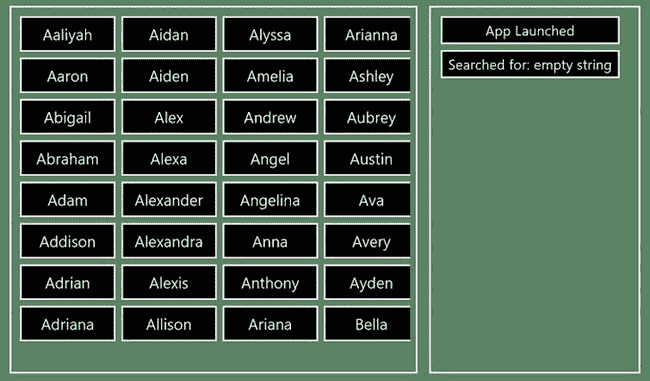

***图 21-1。**示例 app 的初始布局和数据*

#### 添加应用程序图片

我在项目的`images`文件夹中添加了一些文件，如图[图 21-2](#fig_21_2) 所示。我已经使用了文件名以`tile`开头的文件来设置应用程序清单的应用程序 UI 部分的字段，就像我在第 4 章的[中所做的一样。这些图像包含如图所示的放大镜图标。另一个文件，`user.png`，包含一个人物图标，我将在本章后面使用 Windows 显示我的搜索结果时使用这个文件。您可以在图中看到这两个图标(我添加了黑色背景以使图标可见—实际文件是透明的)。我已经将这些文件包含在本书的源代码下载中，您可以从`apress.com`获得。](04.html#ch4)

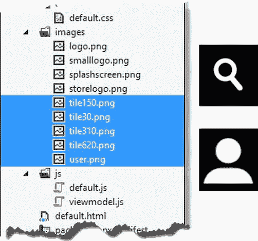

***图 21-2。**向示例应用添加磁贴和用户图标*

#### 测试示例应用程序

正如我在介绍中提到的，这一章不是关于你如何在你的应用中实现搜索，而是关于你如何将搜索功能集成到 Windows 中，以便你的用户有一致和丰富的搜索体验。我在示例应用程序中执行搜索的方式非常简单，您可以通过使用 Visual Studio `JavaScript Console`窗口看到它是如何工作的。启动应用程序(确保使用`Start Debugging`菜单项)并进入 JavaScript 控制台窗口。在提示符下输入以下内容:

* * *

`ViewModel.search("jac")`

* * *

(JavaScript 控制台也会说`Undefined`——你可以忽略这个。)当你按下 Enter 键时，你会看到左边的`ListView`显示的名字集合将被限制为包含搜索词`jac`的名字，如图[图 21-3](#fig_21_3) 所示。右边的`ListView`将显示一条新消息，报告所请求的搜索词。

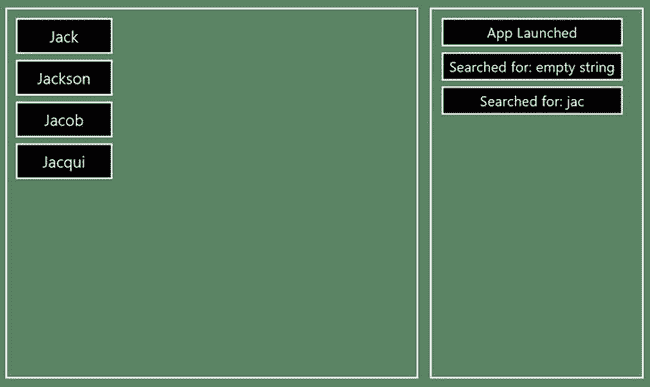

***图 21-3。**测试 app 搜索能力*

你必须使用`JavaScript Console`来执行搜索，因为我没有在布局中添加任何搜索元素或控件——当我将应用搜索功能集成到更广泛的 Windows 搜索体验中时，这将由操作系统提供。在接下来的小节中，我将向您展示如何执行这种集成，并解释您可以采用的不同方法。

### 实施搜索合同

第一步是更新应用程序清单，以声明您打算支持搜索契约。为此，双击 Visual Studio `Solution Explorer`窗口中的`package.appxmanifest`文件，并选择`Declarations`选项卡。从`Available Declarations`菜单中选择`Search`并按下`Add` 按钮。你会看到`Search`被添加到`Supported Declarations`列表中，如图[图 21-4](#fig_21_4) 所示。你可以忽略页面的`Properties`部分——只有当你想使用一个单独的应用程序来处理搜索时，这些才是有用的，在这一章，我将向你展示如何直接向应用程序添加搜索支持。

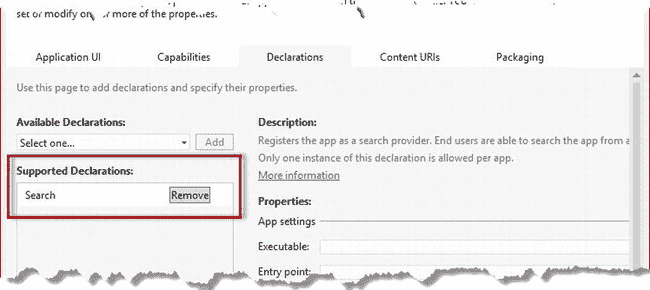

***图 21-4。**宣布支持搜索合同*

#### 处理激活事件

Windows 通过发送一个`activated`事件通知你的应用程序它需要执行一个搜索操作。这与您的应用程序启动时发送的事件相同，为了区分这两种情况，您必须读取事件的`kind`属性。处理一个合同的激活需要一种不同的方法来实现你的应用程序中的`onactivated`功能，如清单 21-5 中的[所示。](#list_21_5)

***清单 21-5** 。default.js 文件中的合同激活处理*

`(function () {
    "use strict";

    var app = WinJS.Application;
    var activation = Windows.ApplicationModel.Activation;
    WinJS.strictProcessing();

    app.onactivated = function (args) {

**        var searchTerm;**
**        var promise;**

**        switch (args.detail.kind) {**
**            case activation.ActivationKind.search:**
**                ViewModel.writeMessage("Search Activation");**
**                searchTerm = args.detail.queryText;**
**                break;**
**            case activation.ActivationKind.launch:**
**                ViewModel.writeMessage("Launch Activation");**` `**                searchTerm = "";**
**                break;**
**        }**

**        if (args.detail.previousExecutionState**
**            != activation.ApplicationExecutionState.suspended) {**
**            ViewModel.writeMessage("App was not resumed");**
**            promise = WinJS.UI.processAll();**
**        } else {**
**            ViewModel.writeMessage("App was resumed");**
**            promise = WinJS.Promise.as(true);**
**        }**

**        args.setPromise(promise.then(function () {**
**            ViewModel.search(searchTerm);**
**        }));**
    };

    app.start();
})();`

为了解释这是如何工作的，我将详细地遍历代码，并向您展示它适合的场景范围。这一点也不复杂，但有一些细节需要考虑，如果你理解如何处理这个合同，你会发现处理其他合同更简单、更容易。

##### 启动应用程序

首先要做的是启动 app。如何做并不重要——您可以使用 Visual Studio `Debug`菜单中的`Start Debugging`项，或者，如果您之前已经运行了该示例，可以使用开始屏幕上的磁贴。当应用程序启动时，您会在右侧的`ListView`控件中看到如图[图 21-5](#fig_21_5) 所示的消息。

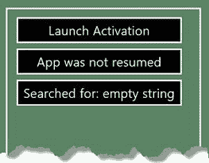

***图 21-5。**应用正常启动时显示的消息*

在这种情况下，我在`onactivated`处理函数中的`switch`语句将读取`detail.kind`属性并获得`launch`值。在这种情况下，我将搜索字符串设置为空字符串(`""`)，如下所示:

`...
switch (args.detail.kind) {
    case activation.ActivationKind.search:
        ViewModel.writeMessage("Search Activation");
        searchTerm = args.detail.queryText;
        break;
    case activation.ActivationKind.**launch**:
        ViewModel.writeMessage("Launch Activation");
**        searchTerm = "";**
        break;
}
...`

这给了我两样我需要的东西之一:搜索词。为了得到`Promise`，我需要查看之前的执行状态。由于 app 已经重新启动，之前的状态会是`notRunning`。对于除`suspended`之外的每个州，我想调用`WinJS.UI.processAll`方法来执行应用程序的初始设置:

`...
if (args.detail.previousExecutionState
    != activation.ApplicationExecutionState.**suspended**) {
    ViewModel.writeMessage("App was not resumed");
**    promise = WinJS.UI.processAll();**
} else {
    ViewModel.writeMessage("App was resumed");
    promise = WinJS.Promise.as(true);
}
...`

其效果是，搜索将匹配所有数据项(因此最初显示所有名称)，并且应用程序被初始化，以便 WinJS UI 控件被激活。你可以看到我是如何在整个代码中编写消息来显示我正在处理的情况，这就是我如何得到如图 21-4 所示的消息。

##### 执行搜索

启动应用程序当然很好，但是你已经知道怎么做了。要查看新的东西，选择搜索符，通过键入`Win+Q`或激活符栏并选择`Search`图标，如图[图 21-6](#fig_21_6) 所示。

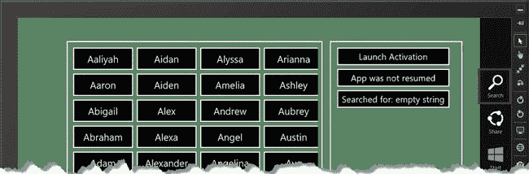

***图 21-6。**选择搜索符*

当你激活搜索功能时，一个名为*搜索窗格*的新显示会覆盖在应用程序上，允许你进行搜索。有一个搜索词的文本输入框，在它下面你会看到一系列图标。这些图标代表搜索目标的范围，包括`SearchContract`示例 app，如图[图 21-7](#fig_21_7) 所示。(您可能需要向下滚动列表才能看到该应用程序。)

 **提示**如果搜索窗格报告无法搜索到应用程序，您需要停止 Visual Studio 调试器，卸载`SearchContract`应用程序，然后再次启动 Visual Studio 调试器。在开发过程中，Windows 并不总是能够正确响应明显的更改，但对于通过 Windows 应用商店安装的应用来说，这不是问题。(我在本书的第五部分中向你展示了将你的应用发布到商店的过程。)

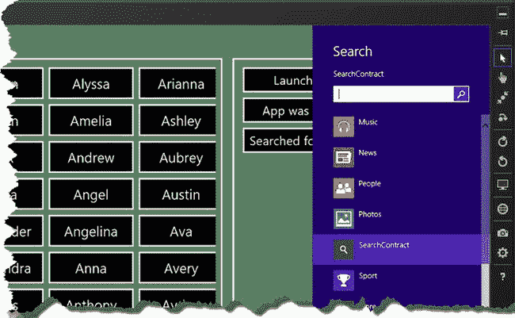

***图 21-7。**搜索窗格*

您会注意到列表中已经选择了`SearchContract`应用程序，这向用户表明搜索请求将被传递给该应用程序进行处理。

输入`jac`和搜索词，点击回车或点击文本输入右侧的图标进行搜索。该应用程序将执行指定术语的搜索，并显示匹配的名称，但搜索窗格将保持可见。

单击应用程序上的任意位置关闭搜索窗格，您将看到右侧`ListView`控件中显示的消息已经更新，如下所示:

* * *

`Launch Activation
App was not resumed
Searched for: empty string
**Search Activation**
**App was not resumed**
**Searched for: jac**`

* * *

感兴趣的是我用粗体标记的新条目。当你提交搜索时，Windows 向应用程序发送了另一个`activated`事件，但这次`args.detail.kind`属性被设置为`search`。众所周知，当执行*搜索激活*时，系统包含用户正在搜索的字符串作为`detail.queryText`属性的值。当我收到一个搜索激活事件时，这是我在我的`onactivated`处理程序中搜索的术语:

`...
switch (args.detail.kind) {
    case activation.ActivationKind.**search**:
        ViewModel.writeMessage("Search Activation");
**        searchTerm = args.detail.queryText;**
        break;
    case activation.ActivationKind.launch:
        ViewModel.writeMessage("Launch Activation");
        searchTerm = "";
        break;
}
...`

当然，此时应用程序正在运行，所以我不需要调用`WinJS.UI.processAll`方法，因为我所有的 UI 控件都已经应用并正常工作。我仍然希望有一个`Promise`对象来处理，所以我使用`Promise.wrap`方法(我在[第 9 章](09.html#ch9)中描述过)来创建一个将被立即实现的`Promise`，如下所示:

`...
if (args.detail.previousExecutionState
    != activation.ApplicationExecutionState.suspended) {
    ViewModel.writeMessage("App was not resumed");
    promise = WinJS.UI.processAll();
} else {
    ViewModel.writeMessage("App was resumed");
**    promise = WinJS.Promise.as(true);**
}
...`

每当用户执行额外的搜索时，该应用程序将接收额外的`activated`事件，其`kind`为`search`。出于这个原因，我一直小心地构建我的代码，这样我就不会对我将要处理的事件的数量或种类做任何假设。

##### 应用程序不运行时进行搜索

我想探索的最后一个场景要求应用程序已经关闭。停止调试器或在应用程序中按`Alt+F4`关闭应用程序。无需重启应用程序，从开始屏幕选择搜索符。

当您从开始屏幕中选择 Search Charm 时，搜索范围将设置为安装在设备上的应用程序的名称(视觉提示是在文本输入框下的列表中选择了`Apps`)。输入`jac`作为搜索词，并按回车键执行搜索。你会在[图 21-8](#fig_21_8) 中看到结果(除非你刚好有一个 app 的名字包含`jac`)。

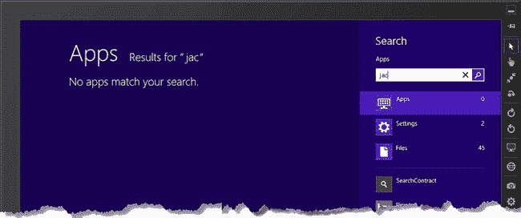

***图 21-8。**通用视窗搜索*

现在点击列表中`SearchContract`应用程序的图标。(如果你一直遵循本章中的示例，应用程序将是列表中的第一项，因为 Windows 根据使用情况对应用程序进行排序——你或许可以从图中看出这一点。)

单击列表中的应用程序条目会将搜索范围更改为示例应用程序。该应用程序将被启动，显示在左侧`ListView`的名字将是那些匹配的搜索词。点击应用程序布局，关闭搜索窗格，查看右侧`ListView`显示的消息，如下所示:

* * *

`Search Activation
App was not resumed
Searched for: jac`

* * *

需要注意的重要一点是，应用程序没有接收到`launch`激活事件，只有`search`激活是由系统发送的。如果当用户执行针对该应用的搜索时，该应用没有运行，则系统将启动该应用，但它不会发送与通过其磁贴或 Visual Studio 调试器启动该应用时相同的事件。

知道了这一点，我需要确保当我得到一个搜索激活事件并且应用程序之前没有运行时，我可以正确地初始化应用程序——对于这个简单的应用程序，这仅仅意味着调用`WinJS.UI.processAll`方法，然后进行搜索。您现在可以理解为什么我把对前一个执行状态的检查从检查我接收到的事件的`kind`的代码中分离出来了:

`...
if (args.detail.previousExecutionState
    != **activation.ApplicationExecutionState.suspended**) {
    ViewModel.writeMessage("App was not resumed");
**    promise = WinJS.UI.processAll();**
} else {
    ViewModel.writeMessage("App was resumed");
    promise = WinJS.Promise.as(true);
}
...`

##### 总结搜索合同激活场景

重要的是要确保你知道什么时候初始化你的应用程序，什么时候你可以通过`queryText`属性获得一个搜索词。您已经在前面的章节中看到了各种场景，为了将来快速参考，我在[表 21-2](#tab_21_2) 中总结了这些排列。

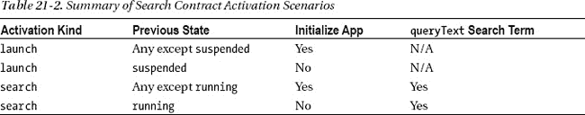

### 使用搜索窗格

我在前面几节中向您展示的技术是搜索契约的基本实现，一旦您的应用程序中有了搜索功能，大部分工作就是确保您正确处理激活事件。

您还可以通过直接使用搜索窗格来创建定制的搜索体验，搜索窗格可通过`Windows.ApplicationModel.Search`名称空间中的对象获得。这个名称空间中的关键对象是`SearchPane`，它允许您访问 Windows 搜索窗格并与之集成。`SearchPane`对象定义了[表 21-3](#tab_21_3) 中所示的方法和属性。

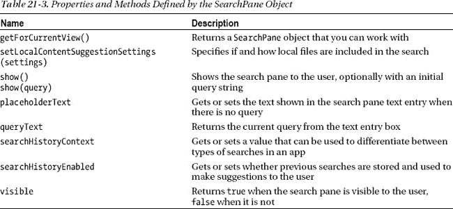

此外，`SearchPane`对象支持几个事件，我已经在[表 21-4](#tab_21_4) 中描述过了。这些事件在搜索过程的关键时刻触发，允许您以比使用基本契约实现更复杂的方式做出响应。

T2】

在接下来的部分中，我将向您展示一些使用这些方法、属性和事件的高级搜索技术，包括如何从应用程序布局中触发搜索过程，并提供 Windows 可以用来在搜索过程中帮助用户的不同类型的建议。

 **注意**除非我另有说明，否则我在本节中引用的对象都在`Windows.ApplicationModel.Search`名称空间中。

#### 激活搜索

用户并不总是理解 Windows 8 搜索是如何工作的，这是一个遗憾，因为从系统范围的窗格中触发特定应用程序搜索的想法是一个很好的想法。如果搜索是应用程序功能的一个关键部分，您可能需要在应用程序布局中为用户提供一个用于打开搜索窗格的控件。为了演示这一点，我在`default.html`文件的标记中添加了一个`button`元素，如[清单 21-6](#list_21_6) 所示。

***清单 21-6** 。添加一个打开搜索窗格的按钮*

`...
<body>
    

        

            

        

    

    

        

    

    

        

        
` `    

**    
**
**        <button id="showSearch">Show Search</button>**
**    
**

    

        

        

    

</body>
...`

这并没有创造出最优雅的应用程序布局，但对我来说已经足够了。你可以在[图 21-9](#fig_21_9) 中看到结果。

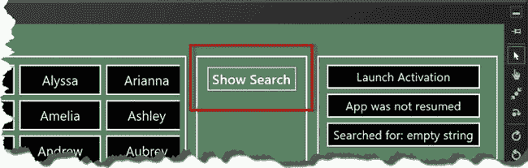

***图 21-9。**在应用布局中添加显示搜索按钮*

我已经将[清单 21-7](#list_21_7) 中显示的语句添加到`default.js`文件中，以响应被点击的`button`。

***清单 21-7** 。响应被点击的按钮*

`(function () {
    "use strict";

    var app = WinJS.Application;
    var activation = Windows.ApplicationModel.Activation;
**    var search = Windows.ApplicationModel.Search;**
    WinJS.strictProcessing();

    app.onactivated = function (args) {
        var searchTerm;
        var promise;

        switch (args.detail.kind) {
            case activation.ActivationKind.search:
                ViewModel.writeMessage("Search Activation");` `                searchTerm = args.detail.queryText;
                break;
            case activation.ActivationKind.launch:
                ViewModel.writeMessage("Launch Activation");
                searchTerm = "";
                break;
        }

        if (args.detail.previousExecutionState
            != activation.ApplicationExecutionState.suspended) {
            ViewModel.writeMessage("App was not resumed");
            promise = WinJS.UI.processAll()**.then(function () {**
**                showSearch.addEventListener("click", function (e) {**
**                    search.SearchPane.getForCurrentView().show(ViewModel.searchTerm);**
**                });**
            });
        } else {
            ViewModel.writeMessage("App was resumed");
            promise = WinJS.Promise.as(true);
        }

        args.setPromise(promise.then(function () {
            ViewModel.search(searchTerm);
        }));
    };

    app.start();
})();`

使用`SearchPane`对象的第一步是调用`getForCurrentView`方法，该方法返回一个`SearchPane`对象，您可以在其上执行操作。这意味着，如果您想要显示搜索窗格，就像我在示例中所做的那样，您必须使用:

`...
search.SearchPane.**getForCurrentView()**.show(ViewModel.searchTerm);
...`

如果你试图在一个`SearchPane`对象上使用一个不是通过`getForCurrentView`方法获得的方法或属性，你将会创建一个异常。在清单中，我通过使用`show`方法显示搜索窗格来响应新添加的`button`中的`click`事件。我可以通过向`show`方法传递一个字符串来设置搜索窗格中的初始查询字符串，这允许我确保搜索窗格与应用布局左侧`ListView`中显示的数据一致。

如果您运行示例应用程序并单击`Show Search`按钮，将会显示标准的 Windows 搜索窗格。`Search`示例应用程序将被自动选择为搜索范围，就像您在本章前面通过 Search Charm 显示搜索窗格一样。

#### 提供查询建议

使用搜索窗格时，我最喜欢的功能是直接在窗格中显示结果。这让用户可以在你的应用程序上执行*渐进式搜索*，每次查询框中的文本改变时，可能匹配的范围都会更新。

当搜索窗格可见，用户正在输入搜索词时，`SearchPane`对象将触发`suggestionsrequested`事件，这是邀请你向用户提供建议。你可以在[清单 21-8](#list_21_8) 中的示例应用程序中看到我是如何做到这一点的，我已经为这个事件在`default.js`文件中添加了一个处理函数。

***清单 21-8** 。添加对建议请求事件*的支持

`(function () {
    "use strict";

    var app = WinJS.Application;
    var activation = Windows.ApplicationModel.Activation;
    var search = Windows.ApplicationModel.Search;
    WinJS.strictProcessing();

    app.onactivated = function (args) {
        var searchTerm;
        var promise;

        switch (args.detail.kind) {
            case activation.ActivationKind.search:
                ViewModel.writeMessage("Search Activation");
                searchTerm = args.detail.queryText;
                break;
            case activation.ActivationKind.launch:
                ViewModel.writeMessage("Launch Activation");
                searchTerm = "";
                break;
        }

        if (args.detail.previousExecutionState
            != activation.ApplicationExecutionState.suspended) {
            ViewModel.writeMessage("App was not resumed");
            promise = WinJS.UI.processAll().then(function () {
**                var sp = search.SearchPane.getForCurrentView();**
                showSearch.addEventListener("click", function (e) {
                    sp.show(ViewModel.searchTerm);
                });
**                sp.addEventListener("suggestionsrequested", function (e) {**
**                    var query = e.queryText;**
**                    var suggestions = ViewModel.search(query, true);**
**                    suggestions.forEach(function (item) {**
**                        e.request.searchSuggestionCollection**
**                            .appendQuerySuggestion(item.name);**
**                    });**
**                });**
            });
        } else {
            ViewModel.writeMessage("App was resumed");
            promise = WinJS.Promise.as(true);
        }` `        args.setPromise(promise.then(function () {
            ViewModel.search(searchTerm);
        }));
    };

    app.start();
})();`

注意，我在从`SearchPane.getForCurrentView`方法返回的对象上调用了`addEventListener`方法。为了能够提供建议，我必须更新`viewmodel.js`文件，这样我的`search`方法就可以执行更新`ListView`控件的搜索以及仅仅生成建议的搜索。您可以在清单 21-9 的[中看到`search`方法的新版本。](#list_21_9)

***清单 21-9** 。更新搜索方法以生成建议*

`...
ViewModel.search = function (term, **suggestions**) {
    ViewModel.writeMessage("Searched for: " + (term == "" ? "empty string" : term));
    term = term.toLowerCase();
**    var target = suggestions ? [] : ViewModel.filteredNames;**
    target.length = 0;
    ViewModel.allNames.forEach(function (item) {
        if (item.name.toLowerCase().indexOf(term) > -1) {
            target.push(item)
        }
    });
**    if (!suggestions) {**
**        ViewModel.searchTerm = term;**
**    }**
    return target;
};
...`

如果`suggestions`参数存在并且`true`，那么该方法将生成并返回一个匹配数组，而不更新`ListView`使用的数据源。这允许我添加对建议的支持，而不必修改任何对`search`方法的现有调用。

对于本节，向您展示结果，然后解释所有涉及的对象是如何组合在一起的会更容易。要查看这些更改的效果，请启动应用程序，打开搜索窗格，然后键入`jac`。当您输入每个字母时，您会看到在文本输入框下方显示一个可能匹配的列表，如图[图 21-10](#fig_21_10) 所示。Windows 将显示您的应用提供的最多五个建议。

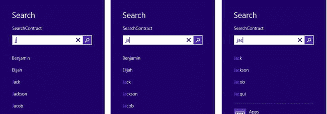

***图 21-10。**搜索窗格中显示的建议*

每当您键入一个额外的字母时，该列表都会被优化。当你输入所有三个字母时，会显示四个建议，所有建议都包含术语`jac`。示例应用中的`ListView`在你输入时不会受到影响——但是如果你点击这些建议中的任何一个，系统将触发搜索激活，这将具有搜索该术语的效果。

##### 理解建议示例

要想给系统提供建议，需要一长串的对象，但是请相信我——它并不像看起来那么复杂。一个`SearchPaneSuggestionsRequestedEventArgs`对象被传递给`suggestionrequired`事件的处理函数。除了有一个长得离谱的名字，这个对象定义了两个有用的只读属性，我已经在[表 21-5](#tab_21_5) 中描述过了。

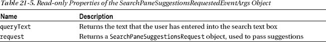

每次用户修改搜索文本时,`queryText`属性都会更新。当用户缩小搜索范围时，通常会收到一系列事件——可能从`j`的`queryText`值开始，然后是`ja`，最后是`jac`。您读取`queryText`属性的值，并使用 request 属性返回的`SearchPaneSuggestionsRequest`对象向系统提供可以呈现给用户的建议。`SearchPaneSuggestionsRequest`定义了我在[表 21-6](#tab_21_6) 中描述的方法和属性。

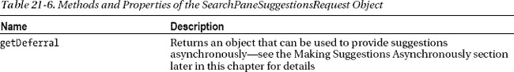
T4】

我们已经到达了这个链中的重要对象，即`SearchSuggestionCollection`对象，它可以通过传递给处理函数的事件对象的`request.searchSuggestionCollection`属性获得。`SearchSuggestionCollection`对象定义了四个方法和一个属性，我已经在[表 21-7](#tab_21_7) 中进行了总结。

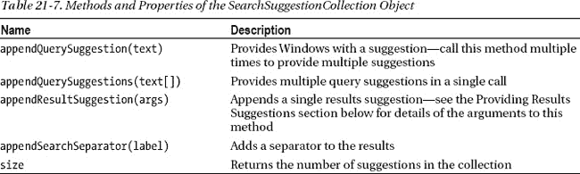

最简单的方法是`appendQuerySuggestion`，它将一个字符串作为参数，并在搜索窗格中作为一个可能的查询呈现给用户。这是我在例子中使用的方法，正如你在[清单 21-10](#list_21_10) 中看到的，在那里我重复了关键语句。

***清单 21-10** 。为用户提供查询建议*

`...
sp.addEventListener("suggestionsrequested", function (e) {
    var query = e.queryText;
    var suggestions = ViewModel.search(query, true);
    suggestions.forEach(function (item) {
        e.request.searchSuggestionCollection.**appendQuerySuggestion**(item.name);
    });
});
...`

 **提示**我为从`ViewModel.search`方法得到的每个建议调用`appendQuerySuggestion`方法。这对于我的示例应用程序来说是可行的，因为搜索 200 个名字没有任何显著的成本。但是，Windows 将显示不超过五个建议，因此如果生成结果的成本很高，您可以通过只生成五个匹配来节省资源。

#### 给建议添加分隔符

方法允许你给你的建议增加一些结构。如果将对`appendSearchSeparator`的调用与对`appendQuerySuggestion`方法的调用交错，就可以创建一组结构化的建议。然而，在搜索窗格上仍然只有五个位置用于建议，所以您向建议添加的每一个分隔符都意味着您可以少提供一个结果。[清单 21-11](#list_21_11) 显示了我对`default.js`文件中的`suggestionsrequested`处理函数所做的修改，以演示`appendSearchSeparator`方法的使用。

***清单 21-11** 。使用 appendSearchSeparator 方法向建议添加结构*

`...
sp.addEventListener("suggestionsrequested", function (e) {
    var query = e.queryText;
    var suggestions = ViewModel.search(query, true);
**    var lastLetter = null;**
    suggestions.forEach(function (item) {
**        if (item.firstLetter != lastLetter) {**
**            e.request.searchSuggestionCollection.appendSearchSeparator(item.firstLetter);**
**            lastLetter = item.firstLetter;**
**        }**
        e.request.searchSuggestionCollection.appendQuerySuggestion(item.name);

    });
});
...`

搜索建议没有固定的结构，所以你可以在应用中以任何有意义的方式应用分隔符。在这个例子中，我根据名字的第一个字母来分隔名字(这样做时，我依赖于这样一个事实，即由`ViewModel.search`方法返回的名字是按字母顺序排序的)。你可以在图 21-11 中看到结果。

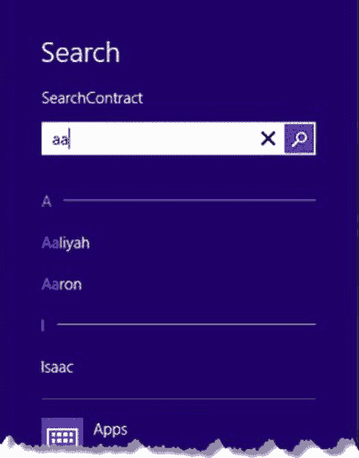

***图 21-11。**搜索建议添加分隔符的效果*

要查看示例应用程序中的效果，您需要找到一个匹配以不同字母开头的名称的搜索字符串。在示例中，我使用了字符串`aa`，它匹配`Aaliyah`、`Aaron`和`Isaac`。您可以在图中看到，这些名称已经使用我传递给`appendSearchSeparator`方法的值进行了分隔。

 **提示**我建议你在提供搜索结果时使用分隔符之前仔细考虑一下，因为它们会占用宝贵的空间，而这些空间可以用来给用户提供额外的建议。只有当没有分隔符的建议对用户没有意义时，才使用分隔符。

#### 提供结果建议

当用户正在搜索的术语与你的应用中的数据项完全匹配时，你可以给出一个*结果建议*。这为用户提供了该项目的概述，并帮助他决定他是否已经找到了他正在寻找的东西。你可以在[图 21-12](#fig_21_12) 中看到一个例子，我在这里搜索过`alex`。`Alex`是我正在处理的列表中的一个名字，也是其他名字的一部分，比如`Alexa`和`Alexander`，这就是为什么你会看到混合的查询建议(到目前为止我一直在做的那种建议)和结果建议。

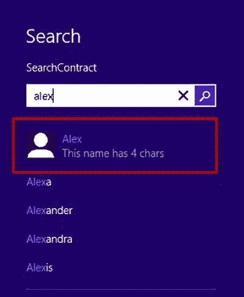

***图 21-12。**搜索窗格中显示的结果建议*

使用`SearchSuggestionCollection.appendResultSuggestion`方法提出结果建议，该方法需要[表 21-8](#tab_21_8) 中描述的参数。这些附加参数用于提供您可以在图中看到的有关该项目的附加信息。

T2】

所有参数都是必需的。对于这个例子，我在示例项目中添加了一个简单的图像作为`img/user.png`，这个图像显示在建议的`Alex`结果旁边。您可以在清单 21-12 中看到我是如何创建建议的，它显示了我对`default.js`文件所做的更改。

***清单 21-12** 。增加对结果建议的支持*

`...
sp.addEventListener("suggestionsrequested", function (e) {
    var query = e.queryText;
    var suggestions = ViewModel.search(query, true);
    var lastLetter = null;
    suggestions.forEach(function (item) {
**        if (query.toLowerCase() != item.name.toLowerCase()) {**
            e.request.searchSuggestionCollection.appendQuerySuggestion(item.name);
**        } else {**
**            var imageSource = Windows.Storage.Streams.RandomAccessStreamReference.**
**                createFromUri(Windows.Foundation.Uri("ms-appx:img/user.png"));**
**            e.request.searchSuggestionCollection.appendResultSuggestion(**
**                item.name,**
**                "This name has " + item.name.length + " chars",**
**                item.name, imageSource, item.name);**
**        }**
    });
});
...`

我的数据并不完全适合这个模型——这并不罕见。我发现数据项要么太复杂而不能用作结果建议，要么太简单，导致我不得不添加一些填充数据。在这个例子中，数据过于简单。

对于`text`和`detailText`参数，我使用了匹配的名称和一个报告名称中有多少字符的字符串——这不是有用的数据，但它是您最终使用的填充类型。如果您真的没有什么有用的东西要说，您可以将`detailText`参数设置为空字符串，但是这样会产生一个看起来有点奇怪的建议。

我将暂时跳过`tag`参数，来看看`image`参数。我包含了我想作为项目一部分使用的图像，但是图像参数必须是一个`Windows.Storage.Streams.IRandomAccessStreamReference`对象。

我在《T4》第 22 章中介绍了 Windows 对文件处理的支持，所以现在我将把`image`参数所需的代码作为黑盒咒语呈现出来。从应用程序包加载图像所需的咒语类似于我在加载应用程序数据文件时向您展示的技术，但是将`Windows.Foundation.Uri`对象传递给`Windows.Storage.Streams.` `RandomAccessStreamReference.createFromUri`方法，以创建加载建议图像所需的对象类型:

`...
Windows.Storage.Streams.RandomAccessStreamReference.createFromUri(
    Windows.Foundation.Uri("**ms-appx:img/user.png**"));
...`

 **注意**不要忘记在指定图像文件的 URL 中有三个`///`字符——一个常见的错误是只使用两个。这不会产生错误，但是您不会看到作为结果建议的一部分显示的图像。

##### 选择建议后做出回应

您可以在清单中看到，我也为`tag`参数使用了这个名称。此参数必须唯一标识您建议的数据项。系统并不关心这个值是什么——如果用户点击了建议，它就把它返回给你。当这种情况发生时，`SearchPane`对象触发一个`resultsuggestionchosen`事件，并通过事件对象的`tag`属性将您提供的`tag`值传递回您的应用程序。[清单 21-13](#list_21_13) 显示了为`resultsuggestionchosen`事件添加一个处理函数，其中我将标签值传递给`ViewModel.search`方法以反映用户的选择。

***清单 21-13** 。为 resultsuggestionchosen 事件添加事件处理程序*

`...
sp.addEventListener("suggestionsrequested", function (e) {
    var query = e.queryText;
    var suggestions = ViewModel.search(query, true);
    var lastLetter = null;
    suggestions.forEach(function (item) {
        if (query.toLowerCase() != item.name.toLowerCase()) {
            e.request.searchSuggestionCollection.appendQuerySuggestion(item.name);
        } else {
            var imageSource = Windows.Storage.Streams.RandomAccessStreamReference
                .createFromUri(Windows.Foundation.Uri("ms-appx:img/user.png"));
            e.request.searchSuggestionCollection.appendResultSuggestion(
                item.name,
                "This name has " + item.name.length + " chars",
                item.name, imageSource, item.name);
        }
    });
});
**sp.addEventListener("resultsuggestionchosen", function (e) {**
**    ViewModel.search(e.tag);**
**});**
...`

#### 处理建议历史

Windows 维护用户接受的建议结果和查询的历史记录，并在再次执行相同的搜索时给予他们优先权。要了解这是如何工作的，请启动应用程序并搜索`jo`。您将看到搜索窗格中显示的建议是:

* * *

`Joel
John
Jonathan
Jordan
Jose`

* * *

点击`Jordan`完成搜索——你会看到应用布局中的`ListView`控件被更新以匹配你的搜索，搜索框也被更新以显示`Jordan`。清除搜索框，再次输入`jo`。这一次，名字出现的顺序有所不同:

* * *

`**Jordan**
Joel
John
Jonathan
Jose`

* * *

这对用户来说是一个有用的帮助，并且搜索历史是持久的，这意味着当用户做出更多选择时，它将向用户提供更好的建议。

您可以通过将`SearchPane.searchHistoryEnabled`属性设置为`false`来禁用建议历史。这可以防止用户的选择被添加到历史记录中，并确保您的建议按照您提供的顺序呈现给用户。您可以在清单 21-14 中看到我是如何使用`searchHistoryEnabled`属性的。

***清单 21-14** 。禁用搜索历史*

`...
if (args.detail.previousExecutionState
    != activation.ApplicationExecutionState.suspended) {
    ViewModel.writeMessage("App was not resumed");
    promise = WinJS.UI.processAll().then(function () {
        var sp = search.SearchPane.getForCurrentView();
**        sp.searchHistoryEnabled = false;**
        showSearch.addEventListener("click", function (e) {
            sp.show(ViewModel.searchTerm);
        });
        sp.addEventListener("suggestionsrequested", function (e) {
            // *... code removed for brevity...*
        });
        sp.addEventListener("resultsuggestionchosen", function (e) {
            ViewModel.search(e.tag);
        });
    });
} else {
    ViewModel.writeMessage("App was resumed");` `    promise = WinJS.Promise.as(true);
}
...`

如果您启动应用程序并再次运行对`jo`的搜索，您将会看到`Jordan`在建议列表中没有被优先考虑。

 **提示**如果你的应用支持不同的数据搜索方式或者支持搜索不同的数据集，你可以使用`SearchPane.searchHistoryContext`属性为每个数据集保存单独的搜索历史。给这个属性分配一个代表用户将要执行的搜索类型的值，下次使用相同的值给`searchHistoryContext`属性时，Windows 将只考虑用户所做的选择。

#### 异步提出建议

到目前为止，我已经同步生成了我的所有建议，这很好，因为我的所有数据都存储在内存中，可以立即使用。

如果生成建议所依赖的代码返回一个`Promise`而不是直接给你数据，你就需要采取不同的方法。当您的数据包含在文件或一个`WinJS.UI.IListDataSource`对象中时，您会经常发现这种情况，该对象从它的许多方法中返回`Promise`对象，并在满足`Promise`时产生数据。

为了演示这个问题，我在我的`viewmodel.js`类中添加了一个`ViewModel.asyncSuggest`方法。这个方法使用了我在这一章中一直使用的数据，但是它通过一个`Promise`来呈现结果，这个结果只有在搜索完成后才能实现。为了更真实地展示这一点，搜索是作为一系列小操作来执行的，这些小操作与对`setImmedate`方法的调用交织在一起，以允许 JavaScript 运行时执行其他操作。你可以在[清单 21-15](#list_21_15) 中看到增加的内容。

 **提示**关于`WinJS.Promise`对象和`setImmediate`方法的详细信息，请参见[第 9 章](09.html#ch9)。

***清单 21-15** 。一种异步搜索方法*

`...
ViewModel.asyncSuggest = function (term) {
    return new WinJS.Promise(function (fDone, fError, fProgress) {
        var index = 0;
        var blockSize = 10;
        var matches = [];
        term = term.toLowerCase();

        function searchBlock() {
            for (var i = index; i < index + blockSize; i++) {
                if (ViewModel.allNames[i].name.toLowerCase().indexOf(term) > -1) {
                    matches.push(ViewModel.allNames[i].name);
                }
            }
            index += blockSize;
            if (index < ViewModel.allNames.length) {` `                setImmediate(searchBlock);
            } else {
                fDone(matches);
            }
        }
        setImmediate(searchBlock);
    });
}
...`

该方法返回一个`WinJS.Promise`对象，当查询词的所有名称都被搜索到时，该对象被满足。搜索本身是在 10 个名字的块中执行的，并且在每个块之后调用`setImmediate`方法，以便 JavaScript 运行时可以执行其他未完成的工作，比如流程事件。

要使用异步方法生成建议，您必须调用`SearchPaneSuggestionRequest.getDeferral`方法。通过传递给`suggestionsrequested`事件处理函数的对象的`request`属性可以获得`SearchPaneSuggestionRequest`对象。`getDeferral`方法返回一个`SearchPaneSuggestionsRequestDeferral`对象，该对象定义了一个方法:`complete`。当异步建议生成方法返回的`Promise`被满足时，调用`complete`方法。[清单 21-16](#list_21_16) 展示了我是如何将这项技术应用到例子中的`suggestionsrequested`处理程序的。

***清单 21-16** 。使用异步方法生成建议*

`...
sp.addEventListener("suggestionsrequested", function (e) {
**    var deferral = e.request.getDeferral();**
    ViewModel.asyncSuggest(e.queryText).then(function (suggestions) {
        e.request.searchSuggestionCollection.appendQuerySuggestions(suggestions);
**        deferral.complete();**
    });
});
...`

当满足`Promise`时，记住调用`complete`方法是很重要的。如果您忘记这样做，不会报告错误，但是用户不会看到您提供的建议。

### 总结

在这一章中，我已经向你展示了如何实现第一个 Windows 契约，它允许一个应用程序与系统范围的特性相集成。我向你展示了搜索合同，通过实施这一合同，一个应用程序能够无缝地参与搜索，提供其内容和数据以及其他应用程序的内容和数据。

我还向您展示了如何通过直接使用搜索窗格来定制搜索体验。使用搜索窗格，我向您展示了如何提供查询和结果建议，以帮助用户在您的应用程序中找到他想要的东西。Windows 对搜索的支持非常灵活，我建议你花时间以一种有用和有意义的方式将其集成到你的应用程序中。在下一章，我将向你展示如何在 Windows 应用程序中处理文件。这是一个重要的功能领域，我将在接下来的三章中全面介绍。