# 二十三、集成文件服务

在这一章中，我将基于第 22 章中的技术向你展示如何向用户公开文件操作。我将向您展示如何使用文件选择器来请求用户选择文件和文件夹，如何缓存位置以便您的应用保留对它们的访问，以及如何使用文件系统作为 WinJS 数据驱动 UI 控件(如`FlipView`和`ListView`)的数据源。[表 23-1](#tab_23_1) 对本章进行了总结。

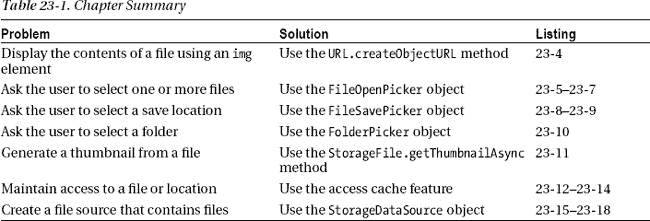

### 创建示例应用

对于这一章，我已经创建了一个名为`FileServices`的示例应用，它遵循单页内容模型并使用`WinJS.Navigation`名称空间，由应用导航栏上的按钮驱动。本章中的例子不容易放入一个布局中，所以这种方法将让我在同一个应用中向你展示多个内容页面。您可以在清单 23-1 的[中看到我对`default.html`文件所做的修改。](#list_23_1)

***清单 23-1** 。来自文件服务项目的 default.html 文件*

`<!DOCTYPE html>
<html>
<head>
    <meta charset="utf-8" />` `    <title>FileServices</title>
    <!-- WinJS references -->
    <link href="//Microsoft.WinJS.1.0/css/ui-dark.css" rel="stylesheet" />
    
    
    <!-- FileServices references -->
    <link href="/css/default.css" rel="stylesheet" />
    
</head>
<body>
**    
**
**        
**
**            <h1 class="message">Select a page from the NavBar</h1>**
**        
**
**    
**

**    
**
**        <button data-win-control="WinJS.UI.AppBarCommand"**
**            data-win-options="{id:'displayFile', label:'Display File',**
**                icon:'\u0031', section:'selection'}">**
**        </button>**
**        <button data-win-control="WinJS.UI.AppBarCommand"**
**            data-win-options="{id:'pickers', label:'Pickers',**
**                icon:'\u0032', section:'selection'}">**
**        </button>**
**        <button data-win-control="WinJS.UI.AppBarCommand"**
**            data-win-options="{id:'access', label:'Access Cache',**
**                icon:'\u0033', section:'selection'}">**
**        </button>**
**        <button data-win-control="WinJS.UI.AppBarCommand"**
**            data-win-options="{id:'dataSources', label:'Data Sources',**
**                icon:'\u0034', section:'selection'}">**
**        </button>**
**    
**
</body>
</html>`

其`id`为`contentTarget`的`div`元素将成为其他页面内容的目标，这些内容将被导入到文档中以响应单击导航条按钮。你可以在`default.html`文件中看到 NavBar 命令，我将在本章中添加它们相关的文件。初始内容是一条提示用户去导航条的消息，如图[图 23-1](#fig_23_1) 所示。

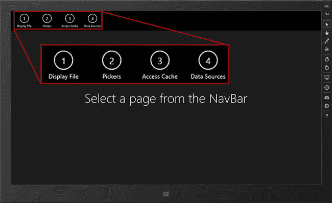

***图 23-1。**示例应用的布局*

您可以在清单 23-2 的[中看到`/css/default.css`文件的内容。该文件包含示例应用中使用的常见样式，我将在示例的内容页面中添加特定于元素的内容。](#list_23_2)

***清单 23-2** 。css/default.css 文件的内容*

`body {display: -ms-flexbox; -ms-flex-direction: column;
    -ms-flex-align: center; -ms-flex-pack: center;    }

#contentTarget { display: -ms-flexbox; -ms-flex-direction: row;
    -ms-flex-align: center; -ms-flex-pack: center; text-align: center;}

.container {border: medium solid white; margin: 10px; padding: 10px;}
.container button {font-size: 25pt; margin: 10px; display: block; width: 300px;}

*.imgElem {height: 500px;}
*.imgTitle { color: white; background-color: black;font-size: 30pt; padding-left: 10px;}`

CSS 中没有新的技术或特性——样式和属性仅用于展示示例中的元素。对于这个项目来说,`/js/default.js`文件的内容非常简单，只包含设置和导航代码——所有有趣的特性都在我在本章每一节添加的单独文件中。您可以在[清单 23-3](#list_23_3) 中看到`default.js`文件的内容。

***清单 23-3** 。default.js 文件的内容*

`(function () {` 
`    var app = WinJS.Application;
    var activation = Windows.ApplicationModel.Activation;

    WinJS.Navigation.addEventListener("navigating", function (e) {
        WinJS.UI.Animation.exitPage(contentTarget.children).then(function () {
            WinJS.Utilities.empty(contentTarget);
            WinJS.UI.Pages.render(e.detail.location,
                contentTarget, WinJS.Navigation.state)
                .then(function () {
                    return WinJS.UI.Animation.enterPage(contentTarget.children)
                });
        });
    });

    app.onactivated = function (args) {
        if (args.detail.previousExecutionState
            != activation.ApplicationExecutionState.suspended) {
            args.setPromise(WinJS.UI.processAll().then(function() {
                navbar.addEventListener("click", function (e) {
                    var navTarget = "pages/" + e.target.winControl.id + ".html";
                    WinJS.Navigation.navigate(navTarget);
                    navbar.winControl.hide();
                });
            }));
        }
    };

    app.start();
})();`

#### 声明文件定位能力

让基本示例工作的最后一步是启用对`Pictures`库的访问。为此，我打开`package.appxmanifest`文件，切换到`Capabilities`选项卡并检查`Pictures Library`能力，如图[图 23-2](#fig_23_2) 所示。

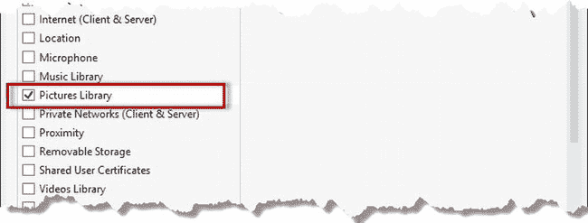

***图 23-2。**启用对图片库的访问*

我将在本章的后面返回到清单来声明额外的功能，但是对`Pictures`库的访问已经足够开始了。

### 显示图像文件

对于本章的第一个例子，我将从一些非常简单的事情开始:在应用布局中显示一个图像文件。这是一个很好的切入点，因为它让我在第 22 章中向您展示的文件系统功能的基础上进行构建，并演示它们如何与 JavaScript Metro 应用中的 HTML 布局相关联。

 **注意**除非我另有说明，否则我在本章中使用的对象都在`Windows.Storage`名称空间中。

对于这一节，我已经在项目中添加了一个名为`pages/displayFile.html`的文件。这是一个包含标记、CSS 和 JavaScript 的一体化文件，你可以在清单 23-4 中看到内容。

***清单 23-4** 。displayFile.html 文件的内容*

`<!DOCTYPE html>
<html>
<head>
    <title></title>
    
    
</head>
<body>` `    

        
        

    

</body>
</html>`

这个内容的简单布局由一个用于显示文件的`img`元素和一个用于显示文件名的`div`元素组成。如果你启动应用，通过点击`Display File`命令使用导航条导航到这个文件，你会看到类似于[图 23-3](#fig_23_3) 的东西。

 **提示**如果您的图片库中没有文件，您会看到一条`No Files Found`消息。只需重启应用，点击`Copy Sample Files`按钮，然后选择`Display File`导航条命令来补救这种情况。

***图 23-3。**显示在图片库中找到的第一个文件*

我说您将看到类似于下图的内容，因为本例中的代码对`Pictures`库中的文件进行了深度查询，并显示了第一个文件的内容。(我在[第 22 章](22.html#ch22)中描述了文件查询。)对于我的机器，找到的文件是我在前一章中使用的一组示例图像中的`astor.jpg`文件，但是它可能是您机器上的一个完全不同的图像。

 **提示**如果`Pictures`库中的第一个文件不是浏览器可以显示的图像，您会看到一条`Not an image file`消息。Windows 并没有对`Pictures`库强制执行只显示图像的策略，所以我在显示文件之前检查了文件类型。

`displayFile.html`文件中的`script`元素代码应该很熟悉。我在由`KnownFolders.picturesLibrary`属性返回的`StorageFolder`上调用`getFilesAsync`方法，指定 `CommonFileQuery.orderByName`值来排序文件并设置文件夹深度。该示例的关键部分是以下语句:

`imgElem.src = **URL.createObjectURL**(files[0]);`

由`getFilesAsync`方法返回的`Promise`产生一个代表图片库中文件的`StorageFile`对象数组。问题是我在布局中使用的`img`元素不知道如何显示`StorageFile`对象的内容，因为它们是一个 Windows 概念，不是 HTML 的一部分。

`URL.createObjectURL`方法通过充当文件和我的 HTML 标记之间的桥梁解决了我的问题。`URL`对象是 W3C 文件 API 规范的一部分，它是 HTML5 的附属标准草案。它是由浏览器实现的，这就是为什么我能够在不使用名称空间的情况下调用该方法。

`createObjectURL`方法获取一个文件并返回一个 URL，该 URL 可用于在 HTML 元素中访问该文件，这就是为什么我将示例中的`createObjectURL`调用的结果赋给了我的`img`元素的`src`属性。如果您使用 Visual Studio `DOM Explorer`窗口查看示例应用中的 HTML，您会看到`img`元素最终看起来像这样:

`</img>`

 **提示**`createObjectURL`方法返回的 URL 特定于创建它的系统——您不能与其他设备共享该 URL。

### 使用文件和文件夹选择器

应用只能自由访问由`KnownFolders`对象定义的文件系统位置，这些位置在应用清单的功能部分中声明。为了访问其他位置，您需要用户的明确许可，这是使用文件和文件夹选择器获得的。使用选择器，您可以要求用户指定要打开或保存的文件，或者选择一个文件夹。

为了演示拣选器的使用，我在 Visual Studio 项目中添加了一个名为`pages/pickers.html`的新文件，其内容如[清单 23-5](#list_23_5) 所示。当点击导航栏中的`Pickers`命令时，会显示该内容。首先，这个文件只包含演示其中一个选择器的代码，稍后我会为其他选择器添加代码。

***清单 23-5** 。pages/pickers.html 文件的初始内容*

`<!DOCTYPE html>
<html>
<head>
    <title></title>
    
    
</head>
<body>
    

        <button id="open">Open File Picker</button>
        <button id="save" disabled>Save File Picker</button>
        <button id="folder">Folder Picker</button>
    

    

        
        
Select an image file

    

</body>
</html>`

这个例子包含三个按钮，我将用它们来激活拣选器。还有一个`img`和`div`元素，我将使用它们来显示选定的文件。此文件的代码演示了文件打开选择器的使用，它允许用户选择一个或多个文件。因为这是我第一次向您展示一个选择器，所以我将介绍它是如何呈现给用户的，然后解释代码是如何工作的。

#### 举个例子

当您第一次选择导航栏上的命令时，您会看到一个非常基本的布局。`img`元素被隐藏，仅显示按钮和一条消息，如图 23-4 中的[所示。](#fig_23_4)

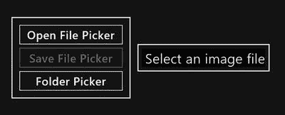

***图 23-4。**pickers.html 文件的初始布局*

点击`Open File Picker`按钮显示拾取器，如图[图 23-5](#fig_23_5) 所示。选取器填充屏幕，允许用户在文件系统中导航，并显示当前文件夹中文件的缩略图。

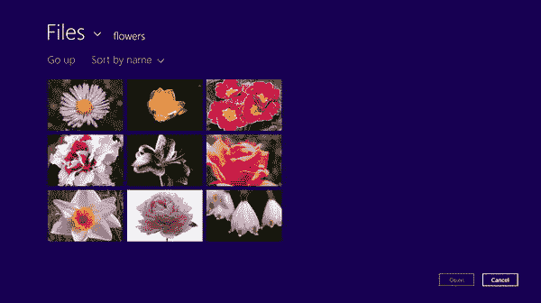

***图 23-5。**文件打开选择器*

导航到图中所示的`flowers`文件夹，选择其中一幅图像(该图像将被检查)。激活`Open`按钮—点击它选择文件。文件拾取器消失，选中的图像显示在应用布局中，如图[图 23-6](#fig_23_6) 所示。

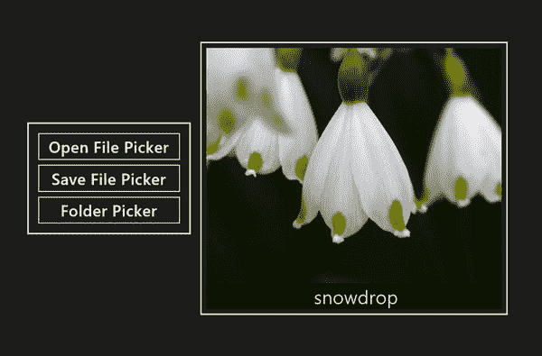

***图 23-6。**显示用文件拾取器选择的图像*

#### 理解代码

现在您已经看到了文件选择器是如何呈现给用户的，我将解释示例中的代码是如何创建您所看到的行为的。当您需要用户选择一个或多个文件时，您可以使用位于`Windows.Storage.Pickers`名称空间中的`FileOpenPicker`对象。要使用选取器，您需要创建对象的新实例，然后为它定义的属性设置值。您可以在[表 23-1](#tab_23_1) 中看到`FileOpenPicker`属性列表。

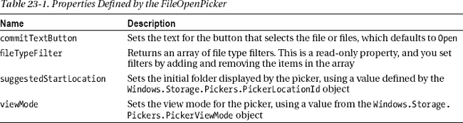

我已经重复了创建和配置 23-清单 23-6 中的`FileOpenPicker`的语句。您可以看到我已经将`png`和`jpg`扩展添加到了`fileTypeFilter`数组中，并且我没有为`commitTextButton`属性设置值，而是依赖于默认值`Open`。

***清单 23-6** 。创建和配置拾取器*

`...
var openPicker = Windows.Storage.Pickers.FileOpenPicker();
openPicker.fileTypeFilter.push(".png", ".jpg");
openPicker.suggestedStartLocation = pickers.PickerLocationId.picturesLibrary;` `openPicker.viewMode = pickers.PickerViewMode.thumbnail;
...`

您使用`suggestedStartLocation`属性来指示应该在选择器中显示的初始文件夹。这只是一个建议，选取器可能会显示另一个值-如果之前使用过选取器并且它记住了最后一个位置，或者因为您指定的位置不可用，则可能会发生这种情况。你从`Windows.Storage.Pickers.PickerLocationId`对象中设置初始位置的值，我已经在[表 23-2](#tab_23_2) 中列出。在这个例子中，我使用了`picturesLibrary`值，这样提货人最初打开了`Pictures`位置。

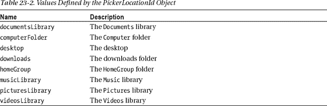

使用来自`Windows.Storage.Pickers.PickerViewMode`对象的值设置`viewMode`属性，它允许您指定选取器如何显示文件和文件夹。有两个定义的值，我已经在[表 23-3](#tab_23_3) 中给出。

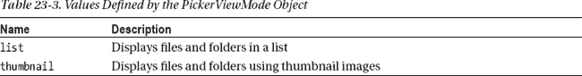

我在示例中使用了`thumbnail`值，这在您希望处理图像文件时非常理想，我的示例应用就是这样。用户不能在选取器中更改视图，因此您必须确保为您希望处理的内容选取一个合理的值。

##### 挑选文件

`FileOpenPicker`对象定义了两个方法，当您准备好显示选择器并让用户做出选择时，您可以调用这两个方法。这些方法在[表 23-4](#tab_23_4) 中描述。

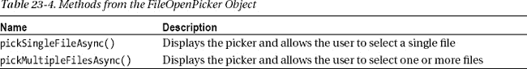

在这个例子中，我使用了`pickSingleFileAsync`方法，它允许用户选择单个文件。该方法返回一个`Promise`,当用户做出选择时，它被满足，并通过`then`方法产生一个`StorageFile`对象。(提醒一下，你可以在[第 9 章](09.html#ch9)中阅读所有关于`Promise`对象和`then`方法的内容。)如果用户没有选择就取消了选取器，那么传递给`then`方法函数的对象将是`null`。在[清单 23-7](#list_23_7) 中，我重复了示例中显示选取器和处理用户选择的代码。

***清单 23-7** 。显示选取器并处理用户的选择*

`...
openPicker.**pickSingleFileAsync()**.then(function (**pickedFile**) {
    if (pickedFile != null) {
        loadedFile = pickedFile;
        pickerImgElem.style.display = "block";
        **pickerImgElem.src = URL.createObjectURL(pickedFile);**
        pickerTitleElem.innerText = pickedFile.displayName;
        save.disabled = false;
    } else {
        pickerImgElem.style.display = "none";
        pickerTitleElem.innerText = "No file selected";
    }
});
...`

为了显示选中的文件，我使用了`URL.createObjectURL`方法，并将结果赋给布局中`img`元素的`src`属性。使用`pickMultipleFilesAsync`方法是类似的，除了当用户做出选择时，`then`方法被传递一个`StorageFile`对象的数组。

 **提示**在这个例子中，我限制了用户可以选择的文件类型，这意味着我可以安全地在一个`img`元素中显示文件的内容。在这一章的后面，我将向你展示如何处理不是图像的文件。

#### 使用文件保存选择器

现在，您已经看到了其中一个拣选器是如何工作的，我可以介绍其他的拣选器，而不必进入相同的细节层次。清单 23-8 显示了我添加到 pickers.html 文件中的内容，当点击`Save File Picker`按钮时，它会做出响应。这段代码使用了`Windows.Storage.Pickers.FileSavePicker`对象，它允许用户选择一个位置并保存文件。

***清单 23-8** 。用文件保存选择器保存文件*

`...
**
...`

要测试这段代码，请启动应用，单击`Open File Picker`按钮，然后选择一个图像文件。当显示图像文件时，`Save File Picker`按钮将被激活，允许您将加载的图像文件保存到新位置。当您点击`Save File Picker`按钮时，将显示拾取器，如图[图 23-7](#fig_23_7) 所示。

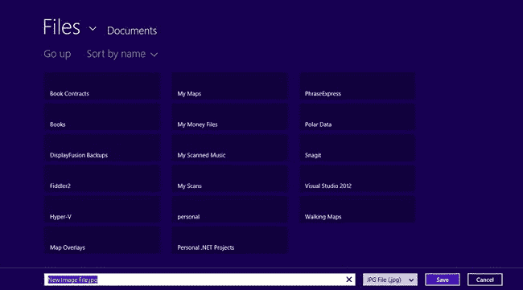

***图 23-7。**用拾取器保存文件*

除了用户能够为将要保存的文件指定名称和类型之外，保存选取器的外观类似于打开选取器。我已经将选取器的初始位置设置为`Documents`库，这就是为什么会列出这么多不同的文件夹。您可以通过创建一个新的`FileSavePicker`对象来创建一个新的选取器，并通过该对象的属性来配置它。我已经在[表 23-5](#tab_23_5) 中列出了房产，其中部分房产与`FileOpenPicker`共有。

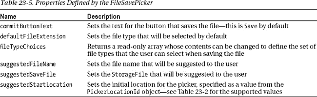

在示例中，我使用了属性来约束用户的选择，以便他们可以选择文件的位置和名称，但只能选择用打开的选择器加载的文件类型。这是因为我不想进入文件类型转换的世界，而是想演示一下选择器是如何工作的。

##### 挑选文件

当您准备好向用户显示选取器时，调用`pickSaveFileAsync`方法。这个方法返回一个`Promise`,它将一个代表用户选择的`StorageFile`对象传递给`then`方法函数。如果用户点击`Cancel`按钮，则`null`被传递到`then`功能。

选取器只向用户请求一个位置——应用有责任对它做些什么。例如，我将先前加载的文件复制到所选的位置。我已经重复了清单 23-9 中的代码。

***清单 23-9** 。处理用户选择的位置*

`...
savePicker.pickSaveFileAsync().then(function (saveFile) {
    if (saveFile) {
        loadedFile.copyAndReplaceAsync(saveFile).then(function () {
            pickerImgElem.style.display = "none";
            pickerTitleElem.innerText = "Saved: " + saveFile.name;
        });
    }
});
...`

#### 使用文件夹选择器

第三个选择器允许用户选择一个文件夹。到目前为止，您已经理解了配置和使用选择器的模式，所以我在这个例子中添加了一项新技术，只是为了让事情变得更有趣。

到目前为止，我假设用户只想处理图像文件。这是一个方便的快捷方式，因为它与应用布局中的`img`元素配合得很好。当然，现实是大多数应用需要处理不同类型的文件，所以在这个例子中，我向你展示了如何显示你可能遇到的任何文件的缩略图。[清单 23-10](#list_23_10) 显示了`pickers.html`文件的附加内容，用于在点击文件夹选择器按钮时使用文件夹选择器(并处理缩略图)。

 **注意**当然，显示缩略图并不等同于阅读文件内容。正如我在前面的例子中演示的那样，处理图像文件的内容很容易，因为您可以依赖 IE10 对使用 HTML `img`元素显示图像的内置支持。在[第 22 章](22.html#ch22)中，我向你展示了如何读取文件内容，并提到了对处理二进制内容的支持，这可能是你所需要的，取决于你的应用所操作的文件类型。

***清单 23-10** 。对 pickers.html 文件的补充，增加了对文件夹选择器的支持*

`...

...`

使用文件夹选择器的技术与前面的示例类似。你创建一个`Windows.Storage.Pickers.FolderPicker`对象并通过它的属性配置它，我已经在[表 23-6](#tab_23_6) 中列出了。

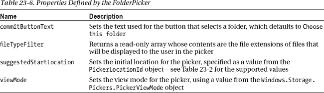

在这个例子中，我将初始位置设置为`Pictures`库，并使用一个星号(`*`字符)来指定应该向用户显示所有类型的文件。

 **提示**如果`fileTypeFilter`数组没有包含至少一项，那么`FolderPicker`对象将抛出一个异常，因此你必须列出你想要显示的文件类型或者使用一个星号。

`pickSingleFolderAsync`方法显示选取器并允许用户选择一个文件夹。你可以在[图 23-8](#fig_23_8) 中看到拾取器是如何出现在用户面前的，它显示了包含本书前一章手稿的文件夹的内容。

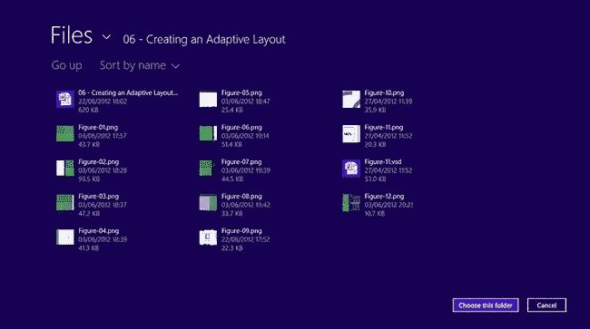

***图 23-8。**使用文件夹选择器选择文件夹*

`FolderPicker`看起来很像`FileOpenPicker`，但是用户不能选择单个文件，按钮文本清楚地表明正在选择一个文件夹。`pickSingleFolderAsync`方法返回一个`Promise`,当用户选择一个文件夹时，这个值就会被满足。用户的选择作为一个`StorageFolder`对象传递给`then`方法函数(我在[第 22 章](22.html#ch22)中介绍过)。

##### 使用缩略图图像

我重复了前一个例子中处理[清单 23-11](#list_23_11) 中的`StorageFolder`的代码。当用户选择一个文件夹时，我调用`getFilesAsync`方法来获取文件夹中的文件。

***清单 23-11** 。使用缩略图*

`...
folderPicker.pickSingleFolderAsync().then(function(selectedFolder) {
    if (selectedFolder != null) {` `        selectedFolder.getFilesAsync().then(function (files) {
**            files[0].getThumbnailAsync(storage.FileProperties.ThumbnailMode.singleItem,**
**                 500)**
            .then(function (thumb) {
                pickerImgElem.style.display = "block";
                pickerImgElem.src = URL.createObjectURL(thumb);
                pickerTitleElem.innerText = files[0].displayName;
            });
        });
    }
});
...`

我获取文件夹中的第一个`StorageFile`对象并调用`getThumbnailAsync`方法。此方法生成一个图像，可用于直观地引用文件。对于图像文件，缩略图将是文件内容，而对于其他文件，缩略图通常是系统用来打开文件类型的默认应用的应用图标。

`getThumbnailAsync`方法有两个参数。第一个参数是来自`Windows.Storage.FileProperties.ThumbnailMode`对象的一个值，它指定了将要生成的缩略图的种类。我已经在[表 23-7](#tab_23_7) 中列出并描述了`ThumbnailMode`值。

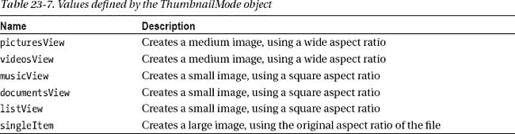

在示例中，我选择了用户选择的文件夹中的第一个文件，并在创建缩略图时使用了`singleItem`值，这意味着我将收到一个具有文件原始纵横比的大图像(这在显示图像文件时很重要)。第二个参数是您希望最长边的缩略图的大小—我已经指定了`500`，这意味着我的缩略图的最长边将是 500 像素。

当`getThumbnailAsync`方法返回的`Promise`被满足时，我使用`URL.createObjectURL`方法为缩略图创建一个 URL，如下所示:

`...
pickerImgElem.src = URL.createObjectURL(thumb);
...`

`createObjectURL`方法接受一系列不同的对象类型，包括由`getThumbnailAsync`方法产生的`Windows.Storage.FileProperties.StorageItemThumbnail`对象。

为了演示如何为非图像文件生成缩略图，我在我的`Music`库中选择了包含手稿文件的文件夹。使用文件夹选取器选择文件夹是一个两阶段的过程。

首先，导航到想要选择的文件夹后，点击`Choose this folder`按钮。这做了一个临时的选择，但是执行了一个微妙的 UI 更新，文件夹显示在屏幕的底部边缘，按钮的文本变成了`OK`，如图[图 23-9](#fig_23_9) 所示。

***图 23-9。**临时挑选文件夹*

你可以在[图 23-10](#fig_23_10) 中看到拾取一个非图像文件的效果。我选择了包含手稿章节文本的 Microsoft Word 文件，该文件使用与 Word 文件相关的缩略图显示。

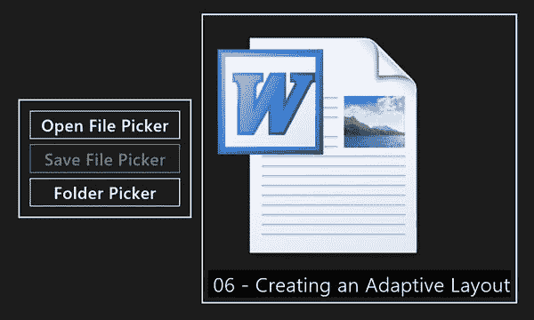

***图 23-10。**Word 文件的缩略图*

### 缓存位置访问

正如您多次看到的那样，Metro 应用在文件系统方面受到严格的访问限制。您的应用可以自由访问由`KnownFolders`对象定义的位置，但前提是您想要访问的每个位置都在应用清单中声明为一项功能。如果您需要处理不同位置的文件，那么您需要使用选择器来获得用户授予的显式访问权限。

如果您的应用允许用户创建一些内容，然后将其保存到单个文件中，这种模式就很好——在这种情况下，使用选择器是非常合理的，因为每个文件的打开或保存位置可能会有所不同。

但是许多 Metro 应用将需要持久访问用户选择的位置，为了管理这一点，您必须使用`Windows.Storage.AccessCache`名称空间中的对象。首先，我向示例 Visual Studio 项目添加了一个名为`access.html`的新文件，您可以在示例应用中使用`Access Cache` NavBar 命令来访问该文件。你可以在[清单 23-12](#list_23_12) 中看到内容。

***清单 23-12** 。access.html 文件的初始内容*

`<!DOCTYPE html>
<html>
<head>` `<title></title>
    
    
</head>
<body>` `    

        <button id="pick">Pick Folder</button>
        <button id="load">Load File</button>
    

    

        
        
Ready

    

</body>
</html>`

这个例子背后的想法是展示两个相关的文件操作。布局中有两个`button`元素，为了测试这个例子，启动应用，在导航栏上选择适当的 common，然后单击`Pick Folder`按钮。该应用将显示文件夹选择器，以便您可以选择一个位置。选择任何不在`Pictures`库中的文件夹(因为应用已经在清单中声明了对`Pictures`的访问，所以已经可以访问那个位置)。

选择文件夹后，点击`Load File`按钮。该应用显示所选文件夹中第一个文件的名称——但它还没有显示缩略图，如图[图 23-11](#fig_23_11) 所示。

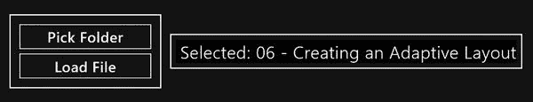

***图 23-11。**使用示例应用选择文件夹*

现在，为了看看这个例子有什么不同，从 Visual Studio `Debug`菜单中选择`Restart`来重新启动应用。(重要的是*重启*，而不是*刷新*app。)

点击`Load File`按钮(不是`Pick Folder`按钮)，你会看到缩略图和先前选择的文件夹中第一个文件的名称被显示出来，如图[图 23-12](#fig_23_12) 所示。我在文档库中选择了一个文件夹，应用通常无法访问该文件夹。

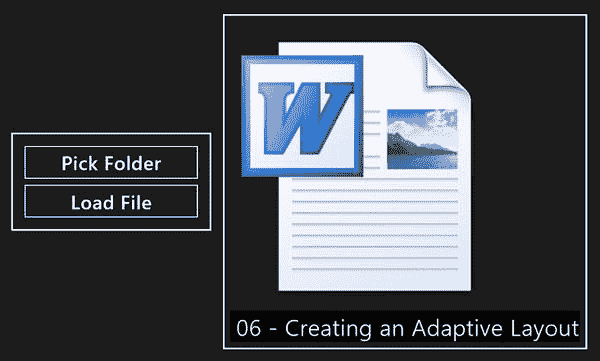

***图 23-12。**使用缓存文件位置*

这个例子有两点很重要。第一个是所选位置被持久存储，第二个是访问该位置的*许可*也是持久的。这个应用不需要返回给用户并显示选取器来再次获取位置(以及访问它的权限)。

#### 使用访问缓存

这个过程有两个部分——缓存对位置的访问和检索缓存的数据。我重复了清单 23-13 中处理缓存部分的例子中的关键语句。

***清单 23-13** 。缓存对文件系统位置的访问*

`...
folderPicker.pickSingleFolderAsync().then(function (folder) {
    if (folder != null) {
**        var token = access.StorageApplicationPermissions.futureAccessList.add(folder);**
**        storage.ApplicationData.current.localSettings.values["folder"] = token;**
        accessTitleElem.innerText = "Selected: " + folder.displayName;
    }
**});**
**...**`

名称空间`Windows.Storage.AccessCache`(在例子中我将其别名为`access`)包含了`StorageApplicationPermissions`对象。该对象定义了两个属性，如[表 23-8](#tab_23_8) 所述。

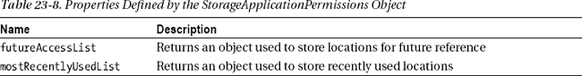

在这个例子中，我使用了`futureAccessList`属性，它返回一个`Windows.Storage.AccessCache.StorageItemAccessList`对象。我通过调用`add`方法存储我的位置，传入我希望在将来再次使用其位置的`StorageFile`或`StorageFolder`对象。

`add`方法返回了一个我需要注意的字符串令牌——我使用了我在第 20 章的[中描述的应用设置特性来持久地存储选择的文件夹作为`folder`设置。`StorageItemAccessList`对象定义了我在表](20.html#ch20) [23-9](#tab_23_9) 中列出的方法和属性。

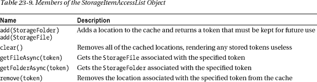
T4】

当需要我显示文件的缩略图和名称时，我检索存储在应用设置中的令牌，并将其传递给`getFolderAsync`方法。这个方法返回一个`Promise`,当它被满足时，产生一个对应于缓存位置的`StorageFolder`对象。我重复了清单 23-14 中获取令牌和检索位置的例子中的语句。

***清单 23-14** 。从访问缓存中检索位置*

`...
var token = storage.ApplicationData.current.localSettings.values["folder"];
var folder = **access.StorageApplicationPermissions.futureAccessList.getFolderAsync(token)**
.then(function (folder) {
    // *...statements that process StorageFolder omitted for brevity...*
});
...`

通过使用访问缓存，我能够保留用户授予我的访问位置的权限，这样我就不必在每次应用启动时都使用选择器，我只需获得一次我需要的位置，然后就可以继续使用它们。

当然，有几个考虑因素。首先，也是最重要的，我不能滥用用户的信任，在我的应用被授权访问的位置上执行意想不到的操作。根据经验，我继续使用缓存位置来执行非破坏性操作，比如读取文件、监视文件夹的更改或创建新文件。如果我需要对文件系统执行任何类型的更改，包括重命名、移动和(尤其是)删除文件，我会提示用户获得明确的许可。

提示用户不仅给了他们说不的机会，还意味着他们清楚地知道是我的应用做了一系列的改变，避免了当他们试图找到已经被归档到不同地方或者更糟的是已经被删除的文件时令人讨厌的意外。

使用访问缓存时的第二个考虑是确保缓存中的位置不超过 1，000 个。一千个位置听起来很多，但缓存的条目会很快增加，特别是如果你的应用经常使用，并且操作单个文件而不是文件夹。有两种方法可以处理这个问题——您可以手动管理`futureAccessList.entries`数组的内容，并确保它不超过`maximumItemsAllowed`值。每个条目由一个`AccessListEntry`项表示，其`token`属性通过`getFileAsync`和`getFolderAsync`方法返回访问缓存位置所需的令牌。

作为替代，您可以使用`StorageApplicationPermissions.mostRecentlyUsedList`。这就像`futureList`一样，但是它只包含 25 个最近使用的位置。当您添加第 26 个项目时，最少使用的项目会被自动删除，使您无需直接管理内容。

### 使用文件数据源

在[第 14 章](14.html#ch14)、[第 15 章](15.html#ch15)和[第 16 章](16.html#ch16)中，我解释了如何通过数据驱动的 WinJS UI 控件`FlipView`、`ListView`和`SemanticZoom`使用数据源。在那些章节中，我使用了`WinJS.Binding.List`对象作为数据源，即使是在我演示如何显示图像的时候。

更好的方法是创建由文件系统查询直接驱动的数据源，允许您对用户存储在设备上的文件进行操作。为了演示这一点，我将`pages/dataSources.html` 文件添加到示例 Visual Studio 项目中，其内容可以在[清单 23-15](#list_23_15) 中看到。

***清单 23-15** 。dataSources.html 文件的内容*

`<!DOCTYPE html>
<html>
<head>
    <title></title>
    
    
</head>
<body>
    

        

            
            

        

    

    

        

        

    

</body>
</html>`

这个例子在`Pictures`库中查询 PNG 图像文件，生成一个数据源，然后与`FlipView`控件一起使用，这样用户就可以浏览他们的图像。你可以在[图 23-13](#fig_23_13) 中看到应用的布局，你可以使用`Data Sources`导航条命令将其加载到示例应用中。

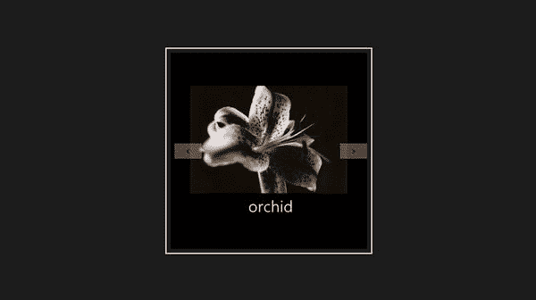

***图 23-13。【dataSources.html T2】页面的布局***

布局很简单，但是在这个简短的例子中有惊人的数量，所以我将详细检查代码。

#### 创建数据源

简单的部分是创建数据源本身，这是使用`WinJS.UI.StorageDataSource`对象完成的。你首先创建一个`QueryOptions`对象，我在[第 22 章](22.html#ch22)中介绍过，然后把它传递给`StorageFolder.createFileQueryWithOptions`方法。这将返回一个`StorageFolderQueryResult`对象，您可以将它作为参数传递给`StorageDataSource`构造函数。我重复了清单 23-16 中设置`StorageDataSource`对象的例子中的语句。

***清单 23-16** 。创建存储数据源对象*

`...
var options = new search.QueryOptions();
options.fileTypeFilter = [".png"];
options.folderDepth = search.FolderDepth.deep;

var query = folder.createFileQueryWithOptions(options);
flip.winControl.itemDataSource = new WinJS.UI.StorageDataSource(query, {
     mode: storage.FileProperties.ThumbnailMode.picturesView,
     requestedThumbnailSize: 400,
     thumbnailOptions: storage.FileProperties.ThumbnailOptions.resizeThumbnail,
     synchronous: false
});
...`

在这个例子中，我创建了一个`QueryOptions`对象，它执行深层文件夹查询，并将其匹配限制在 PNG 文件。我将`StorageDataSource`对象赋给了`FlipView`控件的`itemDataSource`属性，这意味着通过`QueryOptions`匹配的文件将由 UI 控件显示。

`StorageDataSource`构造函数有两个参数:`QueryOptions`对象和一个具有四个特定属性的对象。这些属性在[表 23-10](#tab_23_10) 中描述。

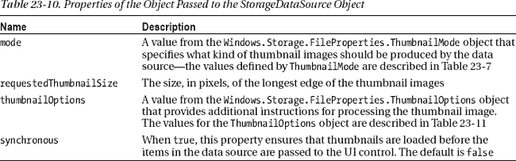

对于这个例子，我使用了`ThumbnailMode.picturesView`值来获得一个宽高比的缩略图，并指定大小为 400 像素。我使用了在[表 23-11](#tab_23_11) 中描述的`ThumbnailOptions.resizeThumbnail`值，并将`synchronous`属性设置为`false`，这意味着我需要满足那些缩略图尚未被加载的数据源项目——我将很快解释如何做到这一点。

T2】

#### 生成模板数据

创建数据源只是这个过程的一部分——我还需要使用 WinJS 数据绑定特性来填充由`FlipView`控件使用的模板。这并没有想象中那么简单，因为文件系统查询返回的对象不能用新的属性来扩展，这正是`WinJS.Binding.converter`方法试图使数据对象的属性可观察到的事情。

相反，我必须使用一个开放的值转换器，这让我可以更松散地映射函数。我在第八章中描述了这种技术，处理不能扩展的对象是这种技术有用的一种情况。首先，我将`data-win-bind`属性添加到 HTML 模板的元素中，如清单 23-17 中的[所示，这里我重复了示例中的模板元素。](#list_23_17)

***清单 23-17** 。向 HTML 模板元素添加 data-win-bind 属性*

`...

    

        
        

    

...`

为了支持这个模板，我定义了两个开放的转换器，我在清单 23-18 中重复了这两个转换器。

***清单 23-18** 。开放数据转换器以支持 HTML 模板*

`WinJS.Namespace.define("Converters", {
    img: function (src, srcprop, dest, destprop) {
        if (src.thumbnail == null) {
            src.addEventListener("thumbnailupdated", function (e) {
              dest[destprop] = URL.createObjectURL(src.thumbnail);
            });
        } else {
            dest[destprop] = URL.createObjectURL(src.thumbnail);
        }
    },
    general: function (src, srcprop, dest, destprop) {
        dest[destprop] = src[srcprop];
    }
});` `Converters.img.supportedForProcessing = true;
Converters.general.supportedForProcessing = true;`

最简单的转换器叫做`Converters.general`，它只是将指定属性的值设置为指定的数据对象值。第二个称为`Converters.img`，需要稍微多解释一下。对于不能使用文件系统对象作为数据绑定值的来源这一问题，这是一个简单的解决方案。`general`转换器简单地使用源属性的值来设置目标属性的值，不进行转换或格式化，并充当`Windows.Storage`和`WinJS.Binding`名称空间之间的桥梁。

`Converters.img`转换器处理两个问题。首先，它使用`URL.createObjectURL`方法创建引用文件缩略图的 URL，这样我就可以在 HTML `img`元素中使用它们。

第二个问题是 Windows 只在需要的时候才生成文件缩略图。这意味着，如果您正在浏览数据源中的文件(在本例中，这是用户将使用`FlipView`控件进行的操作)，那么您将会遇到缩略图尚未加载的数据对象。

使用`StorageDataSource`对象时，数据源将是一个`Windows.Storage.BulkAccess.FileInformation`对象。`Windows.Storage.BulkAccess`名称空间提供了可以用来执行大规模高效文件系统操作的对象，这通常对创建数据源提供者很有用，但通常对常规应用开发没什么用处(这就是为什么在本节之外我不详细介绍这个名称空间)。

缩略图可通过`FileInformation.thumbnail`属性获得，但如果 Windows 尚未生成并缓存合适的图像，这将返回`null`。为了解决这个问题，我监听了`thumbnailupdated`事件，当 Windows 生成缩略图时，`FileInformation`对象将发出该事件。结果是 HTML 元素将被更新，即使 Windows 需要一点时间来生成所需的缩略图。所有这些组合在一起提供了一个数据源，可以用于数据驱动的 WinJS UI 控件，它建立在我在《T4》第 22 章中介绍的对象和技术之上。

### 总结

在这一章中，我已经向你展示了一些方法，你可以将文件系统的底层支持集成到你的应用中。我向您展示了如何创建引用图像文件内容的 URL，如何向用户呈现打开文件、保存文件和文件夹选择器，以及如何缓存对位置的访问，以便您可以向用户提供服务，而不必不断地纠缠他们让您访问文件系统位置。同时，我还向您展示了如何生成缩略图，以及如何创建查询文件系统的数据源，并以 WinJS 数据驱动 UI 控件可以使用的方式呈现结果。在下一章，我将向您展示如何实现与文件系统相关的 Metro 契约。