## 第二十四章

## 文件激活和选取器合同

在这一章中，我将向你展示如何实现允许 Windows 应用程序将文件相关功能集成到 Windows 中的三个契约。我将向您展示如何使用*文件激活契约*注册一个应用程序来处理特定类型的文件，以及如何使用*保存选取器*和*打开选取器契约*向其他应用程序提供存储服务。像所有合同一样，实现这些合同是可选的，但如果你的应用程序以任何方式处理文件，你应该仔细查看它们，看看它们是否提供了集成，使用户使用你的应用程序更加简单和容易。表 24-1 提供了本章的总结。

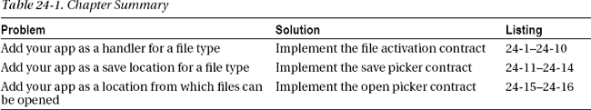

### 创建示例应用程序

本章的示例应用程序将提供一些基本功能，我将通过实现文件契约来增强这些功能。我要建立一个简单的相册应用程序，它的初始化身将让用户从文件系统中选择图像文件添加到相册中。每个图像的缩略图将显示在一个`ListView` UI 控件中(我在[第 15 章](15.html#ch15)中描述过)。我将使用`Windows.Storage.AppCache`名称空间中的对象缓存用户选择的文件位置(我在[第 23 章](23.html#ch23)中描述过)，这将使用户的文件选择持久化。

我使用`Blank App`模板创建了一个名为`PhotoAlbum`的新 Visual Studio 项目。您可以在[清单 24-1](#list_24_1) 中看到`default.html`文件的内容。

***清单 24-1** 。来自相册 app 的 default.html 文件*

`<!DOCTYPE html>
<html>
<head>` `    <meta charset="utf-8" />
    <title>PhotoAlbum</title>
    <!-- WinJS references -->
    <link href="//Microsoft.WinJS.1.0/css/ui-dark.css" rel="stylesheet" />
    
    
    <!-- PhotoAlbum references -->
    <link href="/css/default.css" rel="stylesheet" />
**    **
**    **
    
</head>
<body>
**    
**
**        
**
**            **
**            **
**        
**
**    
**

**    

**
</body>
</html>`

该应用程序将使用标准内容导航模型，通过使用`WinJS.Navigation`名称空间将内容页面引入应用程序布局。与我使用`WinJS.Navigation`的其他例子不同，内容转换将由应用程序触发，以响应文件契约。这个`default.html`文件还包含了一个`WinJS.Binding.Template`的元素，我将用它来显示整个应用程序中图像文件的缩略图。模板显示图像和包含文件名的标签。

内容文件可以在`pages`文件夹中找到，我只从一页内容开始，名为`pages/albumView.html`，我将在应用程序启动时加载它。这将提供基本的相册特性，你可以在[清单 24-2](#list_24_2) 中看到这个文件的内容。

***清单 24-2** 。albumView.html 文件的内容*

`<!DOCTYPE html>
<html>
<head>
    <title></title>
    
</head>
<body>
    

    

    

        <button id="openButton">Open</button>
        <button id="clearButton">Clear</button>
    

</body>
</html>`

除了显示图像缩略图的`ListView`控件之外，该文件还包含两个按钮。`Open`按钮显示文件打开选择器(在第 23 章的[中描述),以便用户可以在应用程序中打开图像文件。`Clear`按钮从`ListView`中移除图像并清除位置缓存，将应用程序重置为初始状态。你可以在清单 24-3](23.html#ch23) 中看到我为这些元素定义的样式，它显示了`css/default.css`文件的内容。CSS 中没有特殊的功能或特定于应用程序的技术。

***清单 24-3** 。default.css 文件的内容*

`#contentTarget {
    width: 100%; height: 100%;
    display: -ms-flexbox; -ms-flex-direction: column;
    -ms-flex-align: center; -ms-flex-pack: center;}

#listView { border: medium solid white; margin: 10px;
    height: 80%; width: 80%; padding: 20px;}

#buttonContainer button { font-size: 20pt; width: 100px;}

.imgContainer { border: thin solid white; padding: 2px;}

.listTitle { font-size: 18pt; max-width: 180px;
    text-overflow: ellipsis; display: block; white-space: nowrap;
    margin: 0 0 5px 5px; height: 35px;}

.listImg {height: 200px; width: 300px;}
.title { font-size: 30pt;}`

#### 定义 JavaScript

我想让这个项目中的`default.js`文件尽可能简单，因为它将是本章中变化最大的文件，我不想重复列出作为基本的非契约功能一部分的代码。为此，我创建了几个 JavaScript 文件来执行应用程序的基本设置，并提供管理相册所需的功能。这些文件中的第一个，`/js/setup.js`，如[清单 24-4](#list_24_4) 所示。

***清单 24-4** 。setup.js 文件的内容*

`(function () {

    WinJS.Namespace.define("ViewModel", {
        fileList: new WinJS.Binding.List()
    });

    WinJS.Navigation.addEventListener("navigating", function (e) {
        WinJS.UI.Animation.exitPage(contentTarget.children).then(function () {
            WinJS.Utilities.empty(contentTarget);
            WinJS.UI.Pages.render(e.detail.location, contentTarget,
                WinJS.Navigation.state)
                .then(function() {
                    WinJS.Binding.processAll(document.body, ViewModel);
                }).then(function () {
                    return WinJS.UI.Animation.enterPage(contentTarget.children)
                });
        });
    });
})();`

这个文件创建了`ViewModel.fileList`对象，我将它用作`ListView`控件的数据源，这样我就可以显示图像缩略图。我还为`navigating`事件设置了事件处理程序，它将内容加载到主页中。我提到的函数在`/js/app.js`文件中，其内容如[清单 24-5](#list_24_5) 所示。

***清单 24-5** 。app.js 文件的内容*

`(function () {

var storage = Windows.Storage;
var access = storage.AccessCache;
var cache = access.StorageApplicationPermissions.futureAccessList;
var pickers = storage.Pickers;

WinJS.Namespace.define("App", {

    loadFilesFromCache: function () {
        return new WinJS.Promise(function (fDone, fErr, fProg) {
            if (cache.entries.length > 0) {
                ViewModel.fileList.length = 0;
                var index = cache.entries.length - 1;
                (function processEntry() {
                    cache.getFileAsync(cache.entries[index].token)
                        .then(function (file) {
                            App.processFile(file, false);
                            if (--index != -1) {
                                processEntry();
                            } else {
                                fDone();
                            }
                        });
                })();
            } else {
                fDone();
            }` `        });
    },

    processFile: function (file, addToCache) {
        ViewModel.fileList.unshift({
            img: URL.createObjectURL(file),
            title: file.displayName,
            file: file
        });
        if (addToCache !== false) {
            cache.add(file);
        }
    },

    pickFiles: function () {
        var picker = pickers.FileOpenPicker();
        picker.fileTypeFilter.replaceAll([".jpg", ".png"]);
        picker.pickMultipleFilesAsync().then(function (files) {
            if (files != null) {
                files.forEach(function (file) {
                     App.processFile(file);
                });
            }
        });
    },

    clearCache: function () {
        cache.clear();
        ViewModel.fileList.length = 0;
    }
});

})();`

我不打算详细介绍这段代码，因为它建立在我在前面的章节中描述和演示的功能之上，我只是将它作为演示文件契约的基础。

也就是说，这个清单中的一些技术是我在前面章节中展示的技术的微小变化，值得指出。首先，我在`FileOpenPicker`对象上使用了`pickMultipleFilesAsync`方法，这样用户可以一次选择多个文件。这不是一个复杂的特性，与使用`pickSingleFileAsync`的唯一区别是，方法返回的`Promise`通过`then`方法产生一个`StorageFile`对象的数组(而不是单个`StorageFile`对象)。

第二个变化是我不存储由`futureAccessList.add`方法返回的令牌。相反，我处理的是`entries`数组中的项目，使用`token`属性从`getFileAsync`方法中获取我需要的字符串来获取`StorageFile`对象。(我反向枚举缓存位置，以便最近添加的图像显示在`ListView`显示屏的顶部。)最后一个文件是`js/default.js`，如[清单 24-6](#list_24_6) 所示。

***清单 24-6** 。default.js 文件的初始内容*

`(function () {

    var app = WinJS.Application;
    var activation = Windows.ApplicationModel.Activation;
    var appstate = activation.ApplicationExecutionState;
    var storage = Windows.Storage;

    app.onactivated = function (args) {

        if (args.detail.previousExecutionState != appstate.suspended) {
            args.setPromise(WinJS.UI.processAll().then(function () {
                if (ViewModel.fileList.length == 0) {
                    App.loadFilesFromCache();
                }

                switch (args.detail.kind) {
                    default:
                        WinJS.Navigation.navigate("/pages/albumView.html");
                        break;
                }
            }));
        }
    };
    app.start();
})();`

我尽可能保持简单，依靠我在`viewmodel.js`文件中创建的`ViewModel`和`App`名称空间中的对象来实现相册的基本功能，我将在下一节中演示。`switch`语句可能看起来有点奇怪，因为它只有一个`default`块，但是我将在本章中为不同类型的激活事件添加处理程序。

#### 测试示例应用

为了测试这个例子，启动应用程序并点击`Open`按钮。导航到一个有一些图像文件的文件夹(我使用了我在前面章节中创建的`Pictures/flowers`文件夹),用选择器选择一个或多个图像。点击选择器中的`Open`按钮打开文件，你会看到缩略图显示在应用布局中，如图[图 24-1](#fig_24_1) 所示。

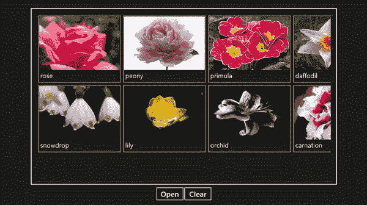

***图 24-1。**将图像载入示例应用*

从 Visual Studio `Debug`菜单中选择`Stop Debugging`停止应用程序，然后再次启动应用程序。由于文件位置缓存在`futureAccessList`对象中，你会看到你之前加载的图像再次显示。

对于示例应用程序来说，这是一个很长的设置过程，但是它为我实现文件契约提供了一个很好的基础，现在我可以用最少的额外代码来实现它。

#### 添加图像

我在这个示例应用程序中使用了许多图像，所有这些图像都可以在 Visual Studio 项目的 images 文件夹中找到。前两个图像被称为`jpgLogo.png`和`pngLogo.png`，我将在实现文件激活契约时使用它们。你可以在[图 24-2](#fig_24_2) 中看到这些图像。这两个文件显示相同的图像，但背景不同。

***图 24-2。**将在文件激活合同中使用的图像*

我还将 Visual Studio 在`images`文件夹中创建的所有默认图像替换为具有相同尺寸的图像，但显示的图标与图中的图像相同。

对于`logo.png`、`slashscreen.png`和`storelogo.png`文件，我添加到项目中的图像在透明背景上显示一个白色图标，这意味着它们不可能在白色页面上显示——但是如果你想象一下图 24-2 中的一个图像没有彩色背景，你就会明白了。

我已经删除了`smalllogo.png`文件，用一个名为`small.png`的 30×30 像素文件代替，它以白色显示相同的图标，但背景为黑色，看起来和[图 24-2](#fig_24_2) 中左边的图像一样。然后我更新了应用程序清单，为`Small logo`字段指定了 small.png 文件，如图 24-3 中的[所示。](#fig_24_3)

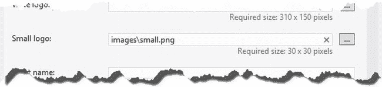

***图 24-3。**更改小 logo 文件*

这个名称的改变很重要，因为它解决了一个奇怪的错误——我将在本章后面实现文件激活契约时解释这个问题。

 **提示**你可以在本书附带的源代码下载中找到所有这些图像文件，从`apress.com`开始可以免费获得。

### 创建助手应用程序

我在本章中实现的一些合同为其他应用程序提供服务，我需要一个助手应用程序来演示这些功能。这个应用叫做`FileHelper`，它非常简单，使用我在第 23 章的[中介绍的文件拾取器来加载和保存一个图像文件。您可以在](23.html#ch23)[清单 24-7](#list_24_7) 中看到`FileHelper`项目的`default.html`文件的内容。

***清单 24-7** 。file helper default.html 文件的内容*

`<!DOCTYPE html>
<html>
<head>
    <meta charset="utf-8" />
    <title>FileHelper</title>

    <!-- WinJS references -->
    <link href="//Microsoft.WinJS.1.0/css/ui-dark.css" rel="stylesheet" />
    
    

    <!-- FileHelper references -->
    <link href="/css/default.css" rel="stylesheet" />
    
</head>
<body>
    

        <button id="open">Open</button>` `        <button id="save" disabled>Save</button>
    

    

        
    

</body>
</html>`

这个应用程序的布局是围绕两个`button`元素和一个`img`元素构建的。`Open`按钮使用文件打开选择器加载单个图像文件，该文件使用`img`元素显示。你可以在清单 24-8 中看到我用来样式化这些元素的 CSS，它显示了`css/default.css`文件的内容。

***清单 24-8** 。FileHelper 项目中的 default.css 文件*

`body, div.container {display: -ms-flexbox;-ms-flex-direction: row;
    -ms-flex-align: center; -ms-flex-pack: center; }
div.container {margin: 10px; height: 80%; -ms-flex-direction: column;}
button {font-size: 25pt; width: 200px; margin: 10px;}
#thumbnail {width: 600px; border: medium white solid;}`

这个项目中唯一的另一个文件是`default.js`，在这个文件中，我通过显示选择器来响应按钮点击，以便用户可以加载和保存图像文件。您可以在[清单 24-9](#list_24_9) 中看到`default.js`文件的内容。

***清单 24-9** 。FileHelper 项目中 default.js 文件的内容*

`(function () {
    "use strict";

    var app = WinJS.Application;
    var activation = Windows.ApplicationModel.Activation;
    var storage = Windows.Storage;
    var pickers = Windows.Storage.Pickers;

    var pickedFile = null;

    app.onactivated = function (args) {
        if (args.detail.previousExecutionState
            != activation.ApplicationExecutionState.suspended) {

            args.setPromise(WinJS.UI.processAll().then(function() {
                WinJS.Utilities.query('button').listen("click", function (e) {
                    if (this.id == "open") {
                        var openPicker = new pickers.FileOpenPicker();
                        openPicker.fileTypeFilter.replaceAll([".png", ".jpg"]);
                        openPicker.pickSingleFileAsync().then(function (file) {
                            pickedFile = file;
                            save.disabled = false;
                            thumbnail.src = URL.createObjectURL(file);
                        });
                    } else {` `                        var savePicker = new pickers.FileSavePicker();
                        savePicker.defaultFileExtension = pickedFile.fileType;
                        savePicker.fileTypeChoices.insert(pickedFile.displayType,
                            [pickedFile.fileType]);
                        savePicker.suggestedFileName = "New Image File";
                        savePicker.pickSaveFileAsync().then(function (saveFile) {
                            if (saveFile) {
                                pickedFile.copyAndReplaceAsync(saveFile);
                            }
                        });
                    }
                });
            }));
        }
    };
    app.start();
})();`

在这个清单中没有新的技术，我使用了拣选器，就像我在第 23 章中所做的一样。助手应用程序的存在只是为了帮助我在`PhotoAlbum`应用程序中演示文件契约的实现。你可以在[图 24-4](#fig_24_4) 中看到助手应用程序，它显示了我在前面章节中使用的一个样本图像。

***图 24-4。**文件助手应用*

### 实现文件激活契约

文件激活合同允许您声明您的应用程序愿意并且能够处理某种类型的文件。为了理解我的意思，打开桌面，使用文件浏览器找到一个 PNG 或 JPG 文件——前几章中的花卉图片是理想的。右键单击该文件并选择`Open with`菜单，您将看到一个应用列表，包括桌面和 Windows 应用商店应用，可以打开该文件。你可以在图 24-5 中看到在我的台式电脑上打开 PNG 文件的应用程序。

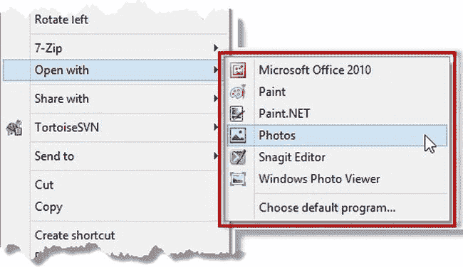

***图 24-5。**能够在我的系统上打开 PNG 文件的应用*

如图所示，我可以使用 Microsoft Office、Paint、Paint.NET、Photos 应用程序、Snagit 编辑器(我用于截图)和 Windows Photo Viewer 打开一个 PNG 文件。在这一部分，我将向你展示如何将你的应用程序添加到列表中，并演示当你的应用程序被选中打开一个文件时，你如何回应。

#### 声明文件类型关联

您可以在应用程序清单中声明想要支持的文件类型。从`Solution Explorer`打开`package.appxmanifest`文件，切换到`Declarations`选项卡。

从`Declarations`列表中选择`File Type Associations`，点击`Add`按钮。Visual Studio 将为您提供一个表单，用于填写文件关联的详细信息。对于这个例子，我需要两个文件关联—一个用于 PNG 文件，一个用于 JPG 文件。[表 24-2](#tab_24_2) 描述了需要填充的字段的含义，并提供了每个关联的值。使用`First Form`列中的值填充完第一个表单后，单击`Add`按钮创建第二个关联。使用`Second Form`列中的值填写表单，然后键入`Control+S`保存对清单的更改。当你完成时，你会在声明列表中看到两个条目，如图[图 24-6](#fig_24_6) 所示。

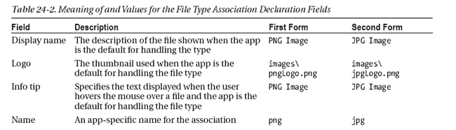
T4】

 **提示**通过点击`Add New`按钮，您可以在同一个声明中支持多个文件扩展名，这将在表单中添加一个新的`Supported File Type`部分。我使用了两个声明，因为我希望每种文件类型有不同的图像和描述性文本。

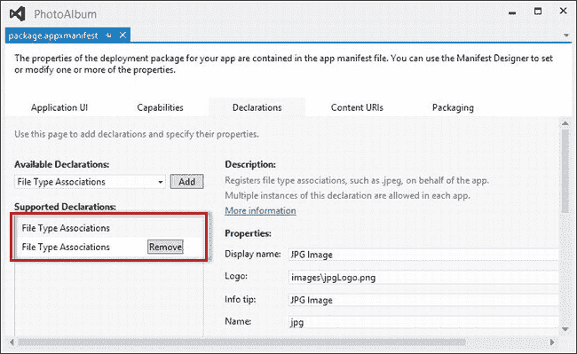

***图 24-6。**向应用清单添加文件类型关联声明*

当您使用 Visual Studio 启动应用程序时，应用程序包会安装到设备上，这包括创建 Windows 文件关联。尽管我只实现了契约的一部分，但您已经可以看到文件关联的效果:启动应用程序，然后导航到桌面(最简单的方法是键入`Control+D`)。打开`Explorer`并找到任何 PNG 或 JPG 文件。如果右击文件并选择`Open with`菜单，你会看到`PhotoAlbum` app 已经添加到列表中，如图[图 24-7](#fig_24_7) 所示。(显示的名称取自清单的`Application UI`部分的`Display name`字段——我更改了这个值，在单词`Photo`和`Album`之间添加了一个空格。)

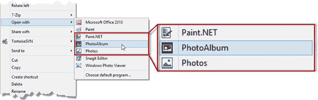

***图 24-7。**浏览器中与文件类型相关联的应用*

 **注意**当我创建示例应用程序时，我特意更改了在`Small logo`清单字段中指定的文件名。有一个奇怪的错误，如果你不改变文件名，Windows 将显示你的项目`images`文件夹中的`logo.png`文件，它通常有一个透明的背景，以便它可以在开始屏幕上使用(这个主题我将在第 19 章中深入讨论)。透明背景会阻止应用程序在`Open with`列表中正常显示。要避免此问题，请确保更改 30 x 30 像素文件的名称，以便使用该文件，为用户呈现具有纯色背景的图像。

#### 处理文件激活事件

最后一步是当用户选择应用程序打开文件时做出响应，这是使用一个`activated`事件发出的信号，该事件的`kind`属性被设置为`ActivationKind.file`。你可以看到我对清单 24-10 中的`default.js`文件中的`onactivated`函数所做的修改，以支持这种事件。

***清单 24-10** 。响应文件激活事件*

`(function () {

    var app = WinJS.Application;
    var activation = Windows.ApplicationModel.Activation;
    var appstate = activation.ApplicationExecutionState;
    var storage = Windows.Storage;

    app.onactivated = function (args) {
        if (args.detail.previousExecutionState != appstate.suspended) {
            args.setPromise(WinJS.UI.processAll().then(function () {

                var promise = ViewModel.fileList.length == 0 ?
                    App.loadFilesFromCache() : WinJS.Promise.wrap(false);

                promise.then(function () {
                    switch (args.detail.kind) {
**                        case activation.ActivationKind.file:**
**                            args.detail.files.forEach(function (file) {**` `**                                App.processFile(file);**
**                            });**
                        default:
                            WinJS.Navigation.navigate("/pages/albumView.html");
                            break;
                    }
                });

                return promise;
            }));
        }
    };
    app.start();
})();`

粗体语句响应文件激活事件。事件对象的`detail.files`属性包含一个`StorageFile`对象的数组，每个对象都由用户选择由应用程序打开。在这个清单中，我使用`forEach`方法来枚举数组的内容，并为每个`StorageFile`调用`App.processFile`方法(我在`app.js`文件中定义了该方法),其效果是将缩略图添加到`ListView`控件并缓存文件位置，以便应用程序持久工作。

 **注意**注意，处理文件激活事件的`case`块一直到`default`块。这意味着`albumView.html`文件将用于为`file`事件以及常规发布事件提供内容。你可以在第 19 章中了解更多关于发布活动的信息。

要测试事件的处理，启动应用程序，导航到桌面，右键单击 PNG 或 JPG 文件。选择`Open with`菜单项，点击列表中的`Photo Album`。您打开的文件的缩略图将被添加到布局中的`ListView`，与文件的`displayName`值一起显示。

 **提示**如果没有得到正确的结果，那么右击开始屏幕上的`Photo Album`应用图标，选择`Uninstall`，然后从 Visual Studio 再次启动应用。当应用程序重新启动时，Windows 并不总是会选择更改，卸载应用程序包可以解决这个问题。

#### 将应用程序设为默认处理程序

我还想描述文件激活处理程序的另一个方面。为此，您需要将应用程序设置为文件类型的默认处理程序。从 Windows 桌面上，使用文件资源管理器找到并右键单击一个 PNG 文件，选择`Open with`  `Choose default program`菜单项。你会看到一个弹出窗口，如图[图 24-8](#fig_24_8) 所示。(该应用程序显示有我在清单的应用程序 UI 部分中定义的徽标。我使用了与文件关联相同的图标，但是背景是透明的。)选择`Photo Album`项，使示例应用程序成为默认处理程序，然后对 JPG 文件重复这个过程。

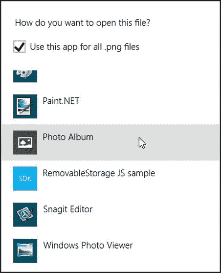

***图 24-8。**让应用成为 PNG 文件的默认处理程序*

这不会改变应用程序的行为方式，但它确实意味着 Windows 将使用我在本章前面添加到应用程序的图像，这些图像被指定为文件关联声明的一部分，作为向用户显示 PNG 和 JPG 文件时的文件图标。你可以在图 24-9 的[中看到这是如何出现的。](#fig_24_9)

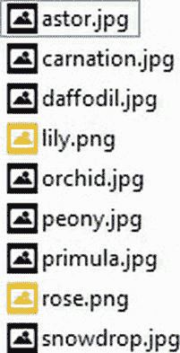

***图 24-9。**Windows 资源管理器中使用的文件关联声明中的文件图标*

因为我正在处理图像文件，Windows 会尽可能显示文件内容，但图标的使用范围更广，包括在开始屏幕上搜索文件时，以及搜索其他文件类型时。该图显示了文件资源管理器的`List`视图。

### 实施 App-to-App 提货合同

应用程序到应用程序的挑选合同允许其他应用程序通过你的应用程序加载和保存文件，而不是本地文件系统。如果你的应用程序提供的某种价值超出了用户以常规方式存储文件所能获得的价值，这将非常有用——一个很好的例子是支持 Dropbox 或 SkyDrive 风格的文件复制或提供对存储在远程位置的文件的访问的应用程序。

我需要一些更简单的东西来演示文件选择器契约，所以我的示例应用程序将文件存储在本地应用程序数据文件夹中。这不会给用户增加任何价值，但这意味着我可以专注于合同，而不会有太多的分心和转移。

在接下来的章节中，我将向您展示如何实现 app-to-app 提货契约:保存提货契约和开放提货契约。

#### 实施保存提货人合同

*保存选择器合同*允许其他应用程序将文件保存到你的应用程序，就好像它是一个文件系统位置，就像一个文件夹一样。与大多数契约一样，您必须在应用程序清单中进行声明，并处理特定类型的激活事件。这份合同与您目前看到的略有不同，因为您还需要准备应用程序的布局，以便应用程序可以在选取器中显示内容。我将在接下来的章节中解释它是如何工作的。

##### 宣布支持该合同

第一步是声明应用程序实现清单中的协定。这告诉 Windows 您的应用程序应该作为一个可以保存文件的位置呈现给用户。从 Visual Studio 的`Solution Explorer`窗口打开`package.appxmanifest`文件，点击`Declaration`部分的标签。

从`Available Declarations`列表中选择`File Save Picker`，点击`Add`按钮。如果你希望你的应用能够处理任何类型的文件(这在 Dropbox/SkyDrive 场景中是有意义的)，那么选择`Supports any file type`选项。`PhotoAlbum`示例应用程序将只支持 JPG 和 PNG 文件，因此在`File type`文本框中输入`.png`，单击`Add New`按钮获得另一个框，并在第二个`File type`文本框中输入`.jpg`。键入`Control+S`保存更改。您的清单应该看起来像图 24-10 中的清单。

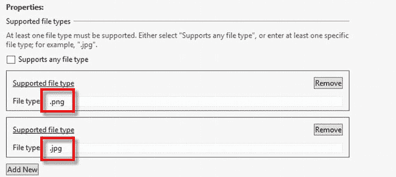

***图 24-10。**将文件保存提货人合同声明添加到应用清单*

##### 测试保存选择器声明

仅仅进行清单声明就将应用程序定义为一个保存位置，尽管我还没有实现作为契约一部分的激活事件。现在看看这是如何工作的，将更容易理解应用程序为实现这个契约而必须做的其余工作。

测试 save picker 契约声明需要使用我在本章开始时创建的`FileHelper`应用程序以及`PhotoAlbum`本身，并且需要几个步骤。

首先启动`PhotoAlbum` app。该应用程序不需要运行到保存位置，但 Visual Studio 会在启动时安装该应用程序，这将向 Windows 注册清单声明中定义的文件类型。点击`Open`按钮，选择一些图像，这样应用程序中就会有一些内容。

其次，启动我在本章开始时创建的`FileHelper`应用程序，点击`Open`按钮，选择一个图像文件——最好是你刚才没有选择的文件。点击`Save`按钮。该应用程序将显示文件保存选择器。如果你点击`Files`链接旁边的箭头，你会看到一个保存目的地列表，包括`Photo Album`，如图[图 24-11](#fig_24_11) 所示。

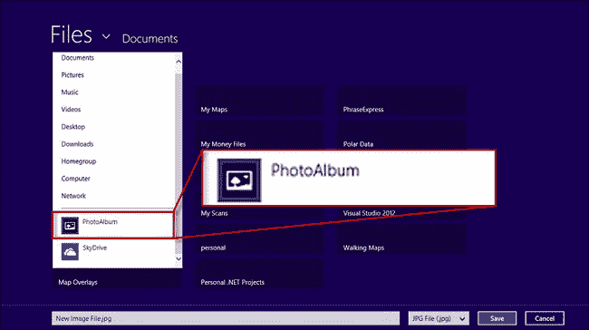

***图 24-11。**在选取器中显示为保存位置的应用程序*

如果从列表中选择`Photo Album`，你会看到类似于[图 24-12](#fig_24_12) 所示的布局。这是文件选择器中显示的`PhotoAlbum`应用程序布局的奇怪组合。

完成实现合同所需的工作是双重的:我需要更新应用程序，以便在选择器中显示更有用的布局，并支持从`FileHelper`应用程序保存文件。在下一节中，我将向您展示如何做到这两点。

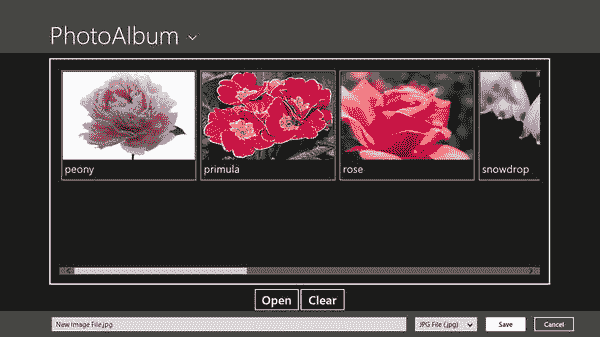

***图 24-12。**保存选择器中显示的应用布局*

#### 处理被激活的事件

当用户选择应用程序作为保存位置时，Windows 会发送一个`activated`事件。事件的`detail.kind`属性被设置为`ActivationKind.fileSavePicker`，这是更改应用程序布局的提示，以便它适合选取器并为用户提供一些有意义的内容。你可以在清单 24-11 中的[应用程序中看到我是如何响应事件的，它显示了我对`/js/default.js`文件所做的更改。](#list_24_11)

***清单 24-11** 。响应 default.html 保存提货人合同激活事件*

`(function () {

    var app = WinJS.Application;
    var activation = Windows.ApplicationModel.Activation;
    var appstate = activation.ApplicationExecutionState;
    var storage = Windows.Storage;

    app.onactivated = function (args) {

        if (args.detail.previousExecutionState != appstate.suspended) {
            args.setPromise(WinJS.UI.processAll().then(function () {

                if (ViewModel.fileList.length == 0) {
                    App.loadFilesFromCache();
                }

                switch (args.detail.kind) {
**                    case activation.ActivationKind.fileSavePicker:**
**                        var pickerUI = args.detail.fileSavePickerUI;m,**
**                        WinJS.Navigation.navigate("/pages/savePickerView.html",**
**                            pickerUI);**
**                        break;**
                    case activation.ActivationKind.file:
                        args.detail.files.forEach(function (file) {
                            App.processFile(file);
                        });
                    default:
                        WinJS.Navigation.navigate("/pages/albumView.html");
                        break;
                }
            }));
        }
    };
    app.start();
})();`

除了这些更改之外，我还向项目添加了一个名为`pages/savePickerView.html`的新文件，当我获得文件保存选择器契约的激活事件时，我会显示这个文件。

注意，当我调用`WinJS.Navigation.navigate`方法时，我从激活事件中传递了`detail.fileSavePickerUI`属性的值。这个对象让我在用户保存文件时做出响应，通过将它传递给`navigate`方法，我将能够处理`savePickerView.html`文件中的对象，如[清单 24-12](#list_24_12) 所示。

 **注意**要明确的是，我能够像这样传递对象是因为我在`js/setup.js`文件中定义的函数将`WinJS.Navigation.state`属性的值传递给了`WinJS.UI.Pages.render`方法。你可以在第七章的[中了解更多关于`WinJS.Navigation.state`属性和`WinJS.UI.Pages.render`方法的知识。](07.html#ch7)

***清单 24-12** 。pages/savePickerView.html 文件的内容*

`<!DOCTYPE html>
<html>
<head>
    <title></title>
    
    
</head>
<body>
    
Add to the
        
         images in your album

    

    

</body>
</html>`

这个文件有两个部分。该标记是自包含的，并向用户提供有用的消息和单行图像缩略图，以显示相册中已有的内容。当收到 `activated`事件时，我使用这个标记作为应用程序布局，数据绑定和`ListView`控件向用户提供内容。你可以在[图 24-13](#fig_24_13) 中看到结果。(我通过重启`PhotoAlbum`应用程序，切换到`FileHelper`应用程序，点击`Save`按钮，这样我就可以从文件位置列表中选择`PhotoAlbum`了。)

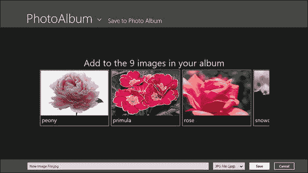

***图 24-13。**向用户呈现适合提货人的内容*

在这种情况下，您可以使用任何您喜欢的布局，只要它适合文件选取器的信箱区。你展示的任何东西都应该是有用的——这通常意味着给用户一些已经可用的指示。在我看来，对用户的价值优先于严格准确的内容视图。在图中，你会看到我已经决定显示相册中的图片，而不是只关注那些作为保存位置存储在应用程序中的图片。

##### 配置选取器

在选择器中向用户呈现内容只是任务的一部分。我还必须配置选择器本身，并在用户单击保存按钮时做出响应。在清单 24-13 的[中，我重复了来自`savePickerView.html`文件的代码来完成这两项工作。](#list_24_13)

***清单 24-13** 。savePickerView.html 文件中处理拣选器的代码*

`...
ready: function (element, pickerUI) {
    pickerUI.title = "Save to Photo Album";
    pickerUI.addEventListener("targetfilerequested", function (e) {
        var deferral = e.request.getDeferral();
        storage.ApplicationData.current.localFolder
            .createFileAsync(pickerUI.fileName,
                storage.CreationCollisionOption.replaceExisting)
                .then(function (file) {
                    e.request.targetFile = file;
                    App.processFile(file);
                    deferral.complete();
                });` `    });
}
...`

我在我的`ready`函数中接收的`pickerUI`变量是来自激活事件的`detail.fileSavePickerUI`属性的值。该属性返回一个`Windows.Storage.Pickers.Provider.FileSavePickerUI`对象，用于配置呈现给用户的选择器。`FileSavePickerUI`对象定义了[表 24-3](#tab_24_3) 中描述的属性。

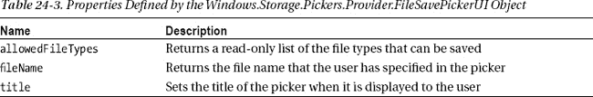

在示例中，我使用了`title`属性来指定字符串`Save to Photo Album`，这可以在[图 24-13](#fig_24_13) 中看到。当您提供的存储存在某种层次结构时，此属性非常有用，因为您可以使用它来指示文件的保存位置。`FileSavePickerUI`对象还定义了两个事件，其中一个我在例子中使用了。您可以在[表 24-4](#tab_24_4) 中查看这些事件的详细信息。

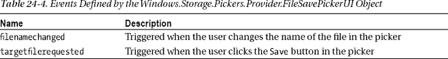

我对这一章感兴趣的是`targetfilerequested`事件，因为它向应用程序发出用户想要保存文件的信号。事件的处理程序被传递了一个`Windows.Storage.Pickers.Provider.targetFileRequestedEventArgs`对象。这个对象只定义了一个名为`request`的属性，这是完成契约所需要的。请求属性返回一个`Windows.Storage.Pickers.Provider.TargetFileRequest`对象，该对象定义了[表 24-5](#tab_24_5) 中显示的属性。

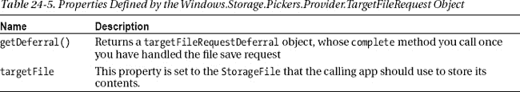

一个简单的操作涉及到很多对象。当您接收到`targetfilerequested`事件时，您调用`request.getDeferral`方法来告诉 Windows 在您执行异步操作时等待。

然后，创建或获取将被传递给另一个应用程序的`StorageFile`对象，以便它可以写入其内容。在示例中，我在代表本地应用数据文件夹的`StorageFolder`对象上调用了`createFileAsync`方法(如[第 20 章](20.html#ch20)所述)。对于文件名，我读的是`FileSavePickerUI.fileName`属性。将`StorageFile`赋给`request.targetfile`属性，然后调用之前调用`getDeferral`时获得的对象的 complete 方法——这告诉 Windows 您已经完成了，现在可以将`StorageFile`传递给想要保存数据的应用程序。

##### 更新数据

完成契约的实现还需要一个步骤，这涉及到保持你的应用布局是最新的。

如果当用户选择它作为存储位置时，您的应用程序没有运行，则应用程序会启动并发送文件激活事件。一旦保存操作完成，应用程序就会终止。

但是，如果您的应用程序在用户选择它作为保存位置时正在运行，则会创建应用程序的第二个实例，具有完全独立的全局名称空间和变量。一旦保存操作完成，第二个实例就被终止，但是它留下了一个问题:您的应用程序的保持运行的实例如何发现新保存的文件？

你不能依靠视图模型来解决这个问题，因为视图模型是一个全局变量，应用程序的每个实例都有自己的副本。您必须使用某种共享存储来解决这个问题，通过它您可以发现文件。对于我的应用程序，这意味着我必须监控本地应用程序数据文件夹，并加载我在那里发现的任何新文件。你可以看到我是如何使用我在[第 22 章](22.html#ch22)和[清单 24-14](#list_24_14) 中展示的文件夹监控技术做到这一点的，其中显示了我在`PhotoAlbum`应用程序中对`default.js`文件所做的添加。

***清单 24-14** 。监控本地应用数据文件夹的变化*

`(function () {

    var app = WinJS.Application;
    var activation = Windows.ApplicationModel.Activation;
    var appstate = activation.ApplicationExecutionState;
    var storage = Windows.Storage;

**    var query = storage.ApplicationData.current.localFolder**
**        .createFolderQuery();**
**    query.addEventListener("contentschanged", function () {**
**        App.loadFilesFromCache();**
**    });**
**    query.getFoldersAsync();**

    app.onactivated = function (args) {

        if (args.detail.previousExecutionState != appstate.suspended) {
            args.setPromise(WinJS.UI.processAll().then(function () {

                if (ViewModel.fileList.length == 0) {
                    App.loadFilesFromCache();
                }

                switch (args.detail.kind) {
                    case activation.ActivationKind.fileSavePicker:
                        var pickerUI = args.detail.fileSavePickerUI;
                        WinJS.Navigation.navigate("/pages/savePickerView.html",` `                            pickerUI);
                        break;
                    case activation.ActivationKind.file:
                        args.detail.files.forEach(function (file) {
                            App.processFile(file);
                        });
                    default:
                        WinJS.Navigation.navigate("/pages/albumView.html");
                        break;
                }
            }));
        }
    };
    app.start();
})();`

每当我接收到`contentschanged`事件时，我就调用`App.loadFilesFromCache`函数，该函数在`/js/app.js`文件中定义(在本章前面显示过)。有了这个功能，你可以将文件从`FileHelper`应用程序保存到`PhotoAlbum`应用程序，并立即看到它们出现。对于这个简单的应用程序来说，重新加载所有文件比找出新内容更容易。有了这个附加功能，我有了一个很好的保存选择器契约的实现，并且可以从其他应用程序接收和存储文件。

现在，当您从`FileHelper`应用程序保存文件时，您可以切换到`PhotoAlbum`应用程序，并看到您保存的图像显示在应用程序布局中。你可以在[图 24-14](#fig_24_14) 中看到这个效果，它显示了一个图像添加到应用程序布局中。

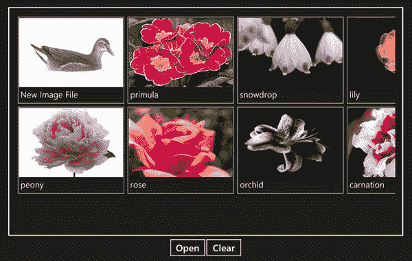

***图 24-14。**通过保存选取器合同将图像保存到示例应用*

#### 实施开放提货人合同

既然您已经看到了保存选取器契约，那么它的补充——开放选取器契约——通过比较就很容易理解了。与所有契约一样，首先向应用程序清单添加一个声明。从 Visual Studio 的`Solution Explorer`窗口打开`package.appxmanifest`文件，点击`Declarations`部分的标签。

从`Available Declarations`列表中选择`File Open Picker`，点击`Add`按钮。示例中我打算支持 JPG 和 PNG 文件，所以在现有的`File type`文本框中输入`.jpg`，点击`Add New`按钮，在新创建的`File type`文本框中输入`.png`。键入`Control+S`保存更改。清单应该类似于图 24-15 中所示的清单。

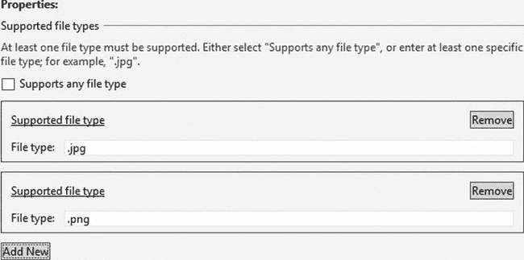

***图 24-15。**增加文件打开提货人合同声明*

##### 处理激活事件

当用户选择应用程序作为打开文件的位置时，Windows 会发送激活事件。激活事件的`detail.kind`属性被设置为`ActivationKind.fileOpenPicker`，就像处理保存选取器事件一样，这是改变应用程序布局的提示，以便它适合选取器并为用户提供一些有意义的内容。在[清单 24-15](#list_24_15) 中，您可以看到我是如何响应`PhotoAlbum`应用程序中的激活事件的，它显示了我对`default.html`文件中的`switch`语句所做的更改。

***清单 24-15** 。响应 default.html 文件中的打开选取器激活事件*

`...
switch (args.detail.kind) {
    case activation.ActivationKind.fileOpenPicker:
**        var pickerUI = args.detail.fileOpenPickerUI;**
**        WinJS.Navigation.navigate("/pages/openPickerView.html",**
**            pickerUI);**
        break;
    case activation.ActivationKind.fileSavePicker:
        var pickerUI = args.detail.fileSavePickerUI;
        WinJS.Navigation.navigate("/pages/savePickerView.html",
            pickerUI);
        break;
    case activation.ActivationKind.file:
        args.detail.files.forEach(function (file) {` `            App.processFile(file);
        });
    default:
        WinJS.Navigation.navigate("/pages/albumView.html");
        break;
}
...`

该契约的工作方式与保存选取器契约非常相似。该应用程序的一个新实例被启动并发送激活事件，布局被嵌入显示给用户的文件选取器中。

激活事件的`detail.fileOpenPickerUI`属性返回我需要管理文件打开过程的对象，所以我将它传递给 navigate 方法，请求用我添加到项目中的`/pages/openPickerView.html`文件填充布局，其内容可以在[清单 24-16](#list_24_16) 中看到。

***清单 24-16** 。/pages/openPickerView.html 文件的内容*

`<!DOCTYPE html>
<html>
<head>
    <title></title>
    
    
</head>
<body>
    
Select images from the album

    

    

</body>
</html>`

该文件定义的布局非常类似于我用于保存选择器契约的布局——一个`WinJS.UI.ListView` UI 控件显示相册中当前的图像。用户将选择文件来挑选它们。

要看到这种布局，您需要经历一系列特定的事件。首先，重启`PhotoAlbum`应用程序——open picker 应用程序不需要运行才能工作，但您需要重启应用程序，以便 Visual Studio 通知 Windows 您的应用程序已声明支持 open picker 合约。

现在切换到`FileHelper`应用程序，点击`Open`按钮显示一个打开的拾取器。点击位置标题旁边的箭头，你会看到`PhotoAlbum`被列为文件来源，如图[图 24-16](#fig_24_16) 所示。

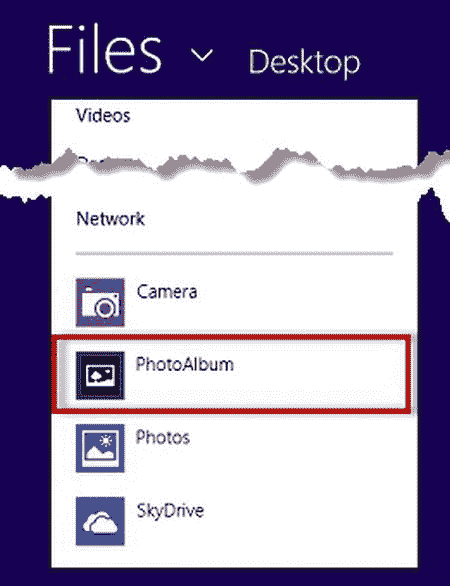

***图 24-16。**显示为要打开的文件源的示例应用程序*

如果选择列表中的`PhotoAlbum`项，将触发激活事件，显示新的布局，如图[图 24-17](#fig_24_17) 所示。

***图 24-17。**使用开放选取器合同打开文件*

选择其中一个文件并点击`Open`按钮，您将看到您选择的图像显示在`FileHelper`应用程序中。

从`PhotoAlbum`应用的角度来看，激活事件的`detail.fileOpenPickerUI`属性返回的对象是一个`Windows.Storage.Pickers.Provider.FileOpenPickerUI`对象，它的工作方式与保存选取器契约的相应对象略有不同。为了演示它是如何工作的，我将分解对象并依次讨论它的属性、方法和事件。

由`FileOpenPickerUI`对象定义的属性显示在[清单 24-6](#list_24_6) 中，它们用于获取显示给用户的拣选器信息，并设置一些基本的配置选项。

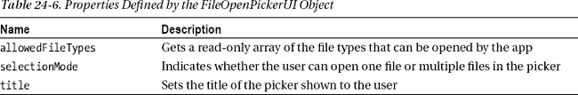

`selectionMode`属性对你呈现给用户的布局影响最大，因为它表明试图打开文件的应用程序是接受一个文件还是多个文件。该属性返回由`Windows.Storage.Pickers.Provider.FileSelectionMode`对象定义的值之一，我已经在[表 24-7](#tab_24_7) 中列出了这些值。

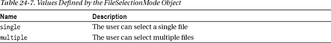

确保您在打开的文件选择器中呈现给用户的布局遵循`FileSelectionMode`值是很重要的，否则您会让用户选择更多可以打开的文件，或者在他们应该可以选择多个文件时将他们限制为一个，从而使用户感到困惑。

我在示例中使用了`selectionMode`属性来改变`ListView`控件的`selectionMode`属性。即使属性名称相同，定义值的对象却不同，因此我必须从一个对象映射到另一个对象，如下所示:

`...
openListView.winControl.selectionMode = (pickerUI.selectionMode ==
    provider.FileSelectionMode.single) ? WinJS.UI.SelectionMode.single
        : WinJS.UI.SelectionMode.multi;
...`

当用户选择或取消选择项目时，`ListView`控件触发`selectionchanged`事件，我使用由`FileOpenPickerUI`定义的方法来响应，以反映用户选择的文件。这些方法在[表 24-8](#tab_24_8) 中描述。

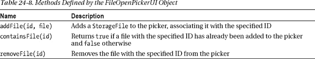

当调用`addFile`方法时，传递一个代表用户选择的`StorageFile`和一个代表文件的惟一 ID。然后，您可以使用此 ID 来检查该文件是否已经是选择的一部分，或者将其从选择中删除。没有方法来枚举选择器中的文件，这是一个问题，因为`selectionchanged`事件并没有指出选择中发生了什么变化。这意味着我必须在每次用户改变`ListView`选择时清除选择的文件，并为每个选择的项目添加新的条目，以确保我没有在选择器中留下任何已被取消选择的文件。

除了调用`addFile`方法之外，不需要任何显式操作。你传递给`addFile`的`StorageFile`对象被交给为用户打开文件的应用程序，所以你唯一的义务就是确保`StorageFile`对象与用户的选择相对应。通过监听`FileOpenPickerUI`定义的事件，你可以更深入地了解挑选过程，我已经在[表 24-9](#tab_24_9) 中描述了这些事件。

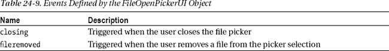

### 总结

在这一章中，我向你展示了如何实现三个关键契约:文件激活、保存选择器和打开选择器。这些合同允许您将应用程序集成到 Windows 中，以便您可以代表用户处理文件，并为其他应用程序提供存储服务。在下一章中，我将向您展示共享合同，这是 Windows 8 的一项关键功能。