## 第二十五章

## 共享合同

*共享合同*允许用户在应用之间共享数据项。这是 Windows 应用的关键功能之一，它允许用户使用互不了解且仅共享相同数据格式的应用创建临时工作流。

需要两个应用参与共享合同。作为*共享源*的应用拥有用户想要共享的一项或多项数据。Windows 向用户提供了一个应用列表，称为*共享目标*，能够处理这些数据，用户选择他们想要从共享源接收项目的应用。在这一章中，我将向您展示如何在契约中创建两个参与者，并演示如何简化重复的操作，使用户的共享更简单。[表 25-1](#tab_25_1) 对本章进行了总结。

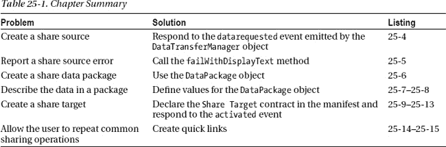

### 创建示例应用

我将从创建一个*共享源*开始，这是一个提供数据供另一个应用使用的应用。我创建了一个简单的助手应用，名为`ShareHelper`。我将介绍不支持共享的基本应用，然后展示如何实现共享源代码功能。清单 25-1 显示了来自`ShareHelper`应用的`default.html`文件。

***清单 25-1** 。来自 ShareHelper 应用的 default.html 文件*

`<!DOCTYPE html>
<html>
<head>
    <meta charset="utf-8" />
    <title>ShareHelper</title>
    <!-- WinJS references -->
    <link href="//Microsoft.WinJS.1.0/css/ui-dark.css" rel="stylesheet" />
    
    
    <!-- ShareHelper references -->
    <link href="/css/default.css" rel="stylesheet" />
    
</head>
<body>
**    
**
**        
**
**            **
**            **
**        
**
**    
**
**    
**
**    
**
</body>
</html>`

这个应用的布局由一个大的`ListView`控件组成，使用了我在最近的其他例子中使用的相同类型的项目模板。这里的想法是向用户提供一组图像，他们可以从中进行选择，然后使用共享合同与`PhotoAlbum`应用共享这些图像，然后将共享的图像添加到相册中。

有了这样一个简单的布局，`ShareHelper`应用所需的 CSS 主要集中在模板中的元素上，正如你在[清单 25-2](#list_25_2) 中看到的，它显示了`css/default.css`文件的内容。

***清单 25-2** 。来自 ShareHelper 应用的 css/default.css 文件*

`body {
    display: -ms-flexbox;
    -ms-flex-direction: column;  -ms-flex-pack: center;}

#listView { width: 100%; height: 100%; padding: 10px;}

.imgContainer { border: thin solid white; padding: 2px; }

.listTitle { font-size: 18pt; max-width: 180px;
    text-overflow: ellipsis; display: block; white-space: nowrap;
    margin: 0 0 5px 5px; height: 35px;}` 
`.listImg {width: 300px; height: 200px;}            `

创建助手应用的下一步是加载一些图像并填充`ListView`控件。你可以在清单 25-3 中看到我是如何做的，它显示了`js/default.js`文件。我对`Pictures`库进行了深度查询，并显示了我在那里找到的所有图像文件。

***清单 25-3** 。ShareHelper 应用中 default.js 文件的内容*

`(function () {

    var app = WinJS.Application;
    var activation = Windows.ApplicationModel.Activation;
    var appstate = activation.ApplicationExecutionState;
    var storage = Windows.Storage;

    app.onactivated = function (args) {
        if (args.detail.previousExecutionState != appstate.suspended) {
            args.setPromise(WinJS.UI.processAll().then(function () {
                var list = new WinJS.Binding.List();
                listView.winControl.itemDataSource = list.dataSource;

                storage.KnownFolders.picturesLibrary
                    .getFilesAsync(storage.Search.CommonFileQuery.orderByName)
                    .then(function (files) {
                        files.forEach(function (file) {
                            list.unshift({
                                img: URL.createObjectURL(file),
                                title: file.displayName, file: file
                            });
                        });
                    });
            }));
        }
    };
    app.start();
})();`

这是一个基本的应用，我以简洁的名义做了一些假设，其中最重要的是我假设`Pictures`库中的所有文件都是图像文件。

创建助手应用的最后一步是在清单中声明需要访问`Pictures`库。打开`package.appxmanifest`文件，导航到`Capabilities`部分，勾选`Pictures Library`选项，如图[图 25-1](#fig_25_1) 所示。

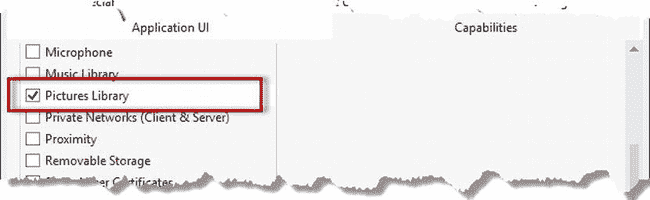

***图 25-1。**声明访问图片库*

如果你启动应用，你会看到你的`Pictures`文件夹中的图片显示在`ListView`中，如图[图 25-2](#fig_25_2) 所示。

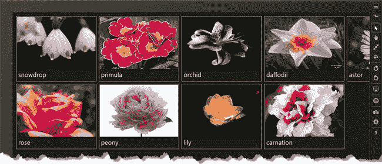

***图 25-1。**share helper app 的基本功能*

### 创建共享源

尽管共享源是共享契约的关键部分，但不会对应用清单进行任何更改。相反，当应用启动时，一切都在 JavaScript 中处理。为了演示这一点，我对[清单 25-4](#list_25_4) 中显示的`ShareHelper`应用中的`/js/default.js`文件进行了修改。

***清单 25-4。**在 ShareHelper 应用中创建共享源*

`(function () {

    var app = WinJS.Application;
    var activation = Windows.ApplicationModel.Activation;
    var appstate = activation.ApplicationExecutionState;
    var storage = Windows.Storage;
    var share = Windows.ApplicationModel.DataTransfer;` `    app.onactivated = function (args) {
        if (args.detail.previousExecutionState != appstate.suspended) {
            args.setPromise(WinJS.UI.processAll().then(function () {
                var list = new WinJS.Binding.List();
                listView.winControl.itemDataSource = list.dataSource;

                storage.KnownFolders.picturesLibrary
                    .getFilesAsync(storage.Search.CommonFileQuery.orderByName)
                    .then(function (files) {
                        files.forEach(function (file) {
                             list.unshift({
                                 img: URL.createObjectURL(file),
                                 title: file.displayName, file: file
                             });
                        });
                    });

**                    share.DataTransferManager.getForCurrentView()**
**                        .addEventListener("datarequested", function (e) {**

**                        var deferral = e.request.getDeferral();**

**                        listView.winControl.selection.getItems().then(function (items) {**
**                            if (items.length > 0) {**
**                                var datapackage = e.request.data;**

**                                var files = [];**
**                                items.forEach(function (item) {**
**                                    files.push(item.data.file);**
**                                });**
**                                datapackage.setStorageItems(files);**

**                                datapackage.setUri(new Windows.Foundation.Uri(**
**                                    "http://apress.com"));**

**                                datapackage.properties.title = "Share Images";**
**                                datapackage.properties.description**
**                                     = "Images from the Pictures Library";**
**                                datapackage.properties.applicationName = "ShareHelper";**
**                            } else {**
**                                e.request.failWithDisplayText(**
**                                    "Select the images you want to share and try again");**
**                            }**
**                        });**
**                        deferral.complete();**
**                    });**
            }));
        }
    };
    app.start();
})();`

我在清单中突出显示的代码做了两件事:它将应用注册为共享数据源，并在用户激活 Share Charm 时做出响应。我将在接下来的部分中解释每个活动。

#### 注册为共享源

告诉 Windows 您的应用是共享数据的来源所需的技术不需要任何清单声明，也不是通过激活事件来完成的。相反，您必须处理位于`Windows.ApplicationModel.DataTransfer`名称空间中的`DataTransferManager`对象。(在示例中，我将这个名称空间别名为`share`。)对象`DataTransferManager`定义了我在[表 25-2](#tab_25_2) 中描述的事件。

 **注意**在本章中，我引入的所有新对象都在`Windows.ApplicationModel.DataTransfer`名称空间中，除非我另有说明。

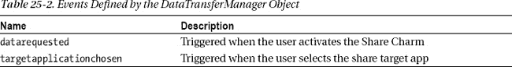

要为这些事件注册一个处理函数，必须对由`DataTransferManager.getForCurrentView`方法返回的对象调用`addEventListener`方法。(如果你是一名. NET 程序员，这是另一个其结构更有意义的对象，但是只要你记得调用`getForCurrentView`，它在 JavaScript 中工作得非常好。)

#### 对事件做出反应

我对本例中的`datarequested`事件感兴趣，该事件在用户激活 Windows Share Charm 时触发，提示我准备要共享的数据。传递给`datarequested`事件处理程序的对象有点奇怪，因为`request`属性，而不是`detail`属性，包含服务于共享操作所需的信息。

`request`属性返回一个`DataRequest`对象，用于创建一个*数据包*，该数据包将与另一个应用共享。我总结了[表 25-3](#tab_25_3) 中`DataRequest`对象定义的方法和属性。

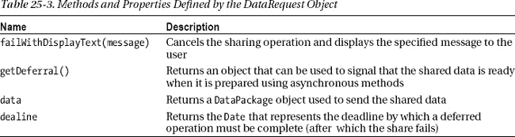

当您接收到`datarequested`事件时，您需要做的第一件事是调用`getDeferral`方法，如果您将执行任何异步方法调用的话。如果你不调用`getDeferral`，那么当你的处理函数执行完成时，Windows 会认为你没有提供任何数据。

`getDeferral`方法返回一个定义了`complete`方法的`DataRequestDeferral`对象。这是`DataRequestDeferral`定义的唯一方法，当您创建了数据包并准备好呈现给用户时，您可以调用它。

对于我的示例应用，我已经定义了一些代码来创建事件处理程序的概要，如清单 25-5 中的[所示。](#list_25_5)

***清单 25-5** 。处理 datarequested 对象*

`...
share.DataTransferManager.getForCurrentView().addEventListener("datarequested",
    function (e) {

**    var deferral = e.request.getDeferral();**

    listView.winControl.selection.getItems().then(function (items) {
        if (items.length > 0) {
            // *...statements to prepare shared data go here...*
        } else {
**            e.request.failWithDisplayText(**
**                "Select the images you want to share and try again");**
        }
    });
**    deferral.complete();**
});
...`

我调用`getDeferral`方法是因为我需要使用异步`getItems`方法从`ListView`控件中获取选择，如果用户没有选择任何要共享的图像，我调用`failWithDisplayText`方法。如果用户在没有选择`ListView`控件中的任何图像的情况下激活了 Share Charm，他们将会看到传递给`failWithDisplayText`方法的消息。这是将应用设置为共享数据提供者的基本模式，将数据的准备和打包工作留给自己。我将在下一节向您展示如何做到这一点。

#### 打包共享数据

如果您的应用有可以共享的数据，那么您必须填充从`DataRequest.data`属性获得的`DataPackage`对象，以便可以定位共享目标并传递您的数据。通过读取传递给`datarequested`事件处理函数的对象的`request`属性来获得`DataRequest`对象。

`DataPackage`非常灵活，可以用来共享各种数据。我在表 25-4 中总结了向`DataPackage`添加数据的最有用的方法。

T2】

您可以使用表中所示的方法将数据添加到将与其他应用共享的包中。您的包可以包含不同类型的数据，但是如果您两次调用相同的方法，则第二次传递的数据将替换包中已有的数据。

 **提示**你不必事先指定你的数据包的内容——你可以在`datarequested`事件到来的那一刻决定。这意味着你可以基于你的应用的状态共享不同种类的数据——例如，当用户在`ListView`控件中选择单个图像时，我可能会共享图像文件，如果选择了多个文件，我可能会共享文件名列表，如果用户导航到应用的不同部分，我可能会完全共享其他内容。共享合同的灵活性很大一部分来自于能够根据用户正在执行的任务选择共享的内容。

你可以在[清单 25-6](#list_25_6) 中看到我如何使用`setStorageItems`方法将文件添加到数据包中，对应于用户在`ListView`中选择的图像。我还使用了`setUri`方法为用户提供一个链接，他们可以通过这个链接获得更多信息——在我的例子中，我使用了 URL `apress.com`作为占位符。

***清单 25-6** 。打包数据以供共享*

`...
share.DataTransferManager.getForCurrentView()
    .addEventListener("datarequested", function (e) {

    var deferral = e.request.getDeferral();

    listView.winControl.selection.getItems().then(function (items) {
        if (items.length > 0) {
            var datapackage = e.request.data;

**            var files = [];**
**            items.forEach(function (item) {**
**                files.push(item.data.file);**
**            });**` `**            datapackage.setStorageItems(files);**

**            datapackage.setUri(new Windows.Foundation.Uri("http://apress.com"));**

            datapackage.properties.title = "Share Images";
            datapackage.properties.description = "Images from the Pictures Library";
            datapackage.properties.applicationName = "ShareHelper";

        } else {
            e.request.failWithDisplayText(
                "Select the images you want to share and try again");
        }
    });
    deferral.complete();
});
...`

 **注**我在这个数据包上使用`setUri`方法的方式上故意引入了一个问题。在这一章的后面，我会回来解释这个问题以及为什么会经常遇到这个问题——所以，在你阅读完这一章的其余部分之前，不要使用`setUri`方法。

##### 描述数据

`DataPackage`对象定义了一个名为`properties,`的属性，该属性返回一个`DataPackagePropertySet`对象(由于术语*属性*出现得如此频繁，本节中的对象和成员名称可能有点令人困惑)。

您使用`DataPackagePropertySet`来提供关于共享操作及其数据的附加信息，我已经在[表 25-5](#tab_25_5) 中描述了该对象定义的属性。

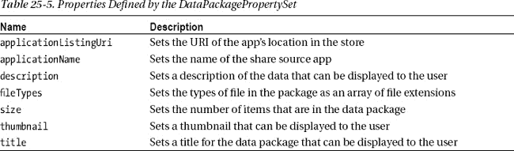

这些属性不是为您设置的，尽管其中一些属性——如`applicationListUri`和`fileTypes`——看起来应该设置。另一方面，您不需要为这些属性中的任何一个提供值，所以您只需要处理那些有助于用户理解共享操作的属性。

在我的例子中，我已经为其中三个属性设置了值，如清单 25-7 所示。当我在本章稍后将`PhotoAlbum`应用设为共享目标时，我将使用这些值来显示共享操作的细节，在下一节中您可以看到 Windows 是如何使用它们的。

***清单 25-7** 。用属性描述数据包*

`...
datapackage.properties.title = "Share Images";
datapackage.properties.description = "Images from the Pictures Library";
datapackage.properties.applicationName = "ShareHelper";
...`

 **提示**您也可以使用`insert`方法向数据包添加自定义属性。在本章后面的添加自定义属性部分，我将向您展示一个这样的例子。

#### 测试共享源代码应用

为了测试数据共享，使用 Visual Studio `Debug`菜单中的`Start Debugging`项启动`ShareHelper`应用，并在`ListView`中选择一个或多个图像。

打开魅力条，选择分享魅力(可以直接用`Win` + `H`激活分享魅力)。您将看到共享弹出按钮，其中包含可以处理由`ShareHelper`应用准备的数据包的应用列表，如图[图 25-3](#fig_25_3) 所示。

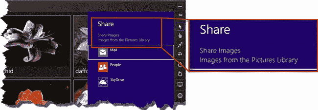

***图 25-3。**挑选应用的哪些数据将与哪些数据共享*

我已经展开了共享弹出按钮的一部分，以便您可以看到我为数据包指定的属性的效果，以及它们是如何显示给用户来描述数据的。

图中有三个 app 可以从`ShareHelper` app 接收数据:`Mail`、`People`和`SkyDrive`。如果你在系统上安装了其他应用，你可能会看到其他条目，但请注意，列出的所有应用都是 Windows 应用商店应用，共享合同仅适用于应用，不包括传统的 Windows 桌面程序。

#### 了解常见的共享问题

Windows 根据创建共享数据包时调用的`set` ***`<XXX>`*** 方法选择处理共享数据的应用。我调用了`setStorageItems`和`setUri`，所以 Windows 正在寻找可以处理文件或 URL 的应用。

关键词是*或*——应用只需要声明支持包中任何*一种*类型的数据，就可以成为合适的共享目标。应用可以自由地从共享包中获取它们支持的数据，而忽略其他任何东西。

在内置 Windows 应用的情况下，`Mail`应用(一个电子邮件客户端)将使用文件作为新电子邮件消息的附件，`People`应用(一个社交媒体工具)将与我的社交媒体联系人共享 URL，`SkyDrive`应用将图像文件保存到云存储中。

这是我在[清单 25-6](#list_25_6) 中制造的问题。我使用`setUri`向包中添加了一个 URL，它向用户提供了一些额外的信息，但与用户试图共享的内容没有直接关系。然而，如果用户选择`People`或`Mail`应用作为分享目标，那么图像文件——真正的内容——将被丢弃，链接将被给予比它应有的更重要的对待。用户的联系人将被发送一个 URL，而没有用户试图共享的图像所提供的任何上下文——这对用户和消息的接收者来说是一个非常混乱的结果，可悲的是，这是共享数据时常见的错误。

如果您从“共享”弹出菜单中选择`Mail`应用，您就可以发现问题。`Mail`应用将显示在一个小的弹出菜单中，允许你通过选择收件人和添加一些文本来完成电子邮件，如图[图 25-4](#fig_25_4) 所示。

 **提示**您需要在本地机器上执行这个测试，因为`Mail`应用无法在 Visual Studio 模拟器中正常启动。

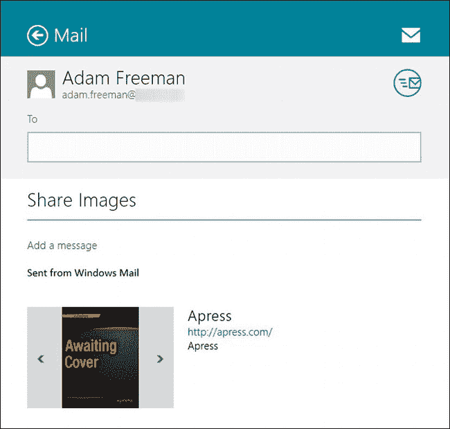

***图 25-4。**与邮件应用分享数据*

用户试图分享的图片文件被忽略了，更糟糕的是，邮件应用找到了网址，找到了其中包含的图片，并以 FlipView 的形式呈现给用户。这只是简单的混淆，因为用户选择了图像文件，但现在提供了完全不同的图像选择，这些图像是从我的示例应用悄悄添加到数据包的 URL 获得的。

##### 回避问题

为了避免这个问题，确保添加到包中的每种类型的数据都是独立的，并且对用户有价值，这一点很重要。我的偏好是，仅当多种类型的数据等效时，才将它们添加到包中，例如，如果我正在共享本章的文本，我可能会添加 RTF 格式的手稿、纯文本等效内容和 SkyDrive 存储上内容的 URL。

在解决如何共享数据的问题时，我的基本想法是问自己，用户*期望*会发生什么？如果您不能立即将数据包中的项目与用户的合理预期相关联，您应该重新查看您的数据包内容。

如果您确实需要向数据包添加补充信息以支持用户选择的数据，您应该定义一个自定义属性。自定义属性不用于选择合适的共享目标应用，任何不知道其重要性的应用都可以忽略它们。您可以通过使用`DataPackagePropertySet.insert`方法向数据包添加一个自定义属性，传递您想要赋予该属性的名称及其值。在清单 25-8 的[中，您可以看到我是如何用一个名为`referenceURL`的自定义属性替换了`setUri`方法的。](#list_25_8)

***清单 25-8** 。使用插入方法添加自定义属性*

`...
var datapackage = e.request.data;

var files = [];
items.forEach(function (item) {
    files.push(item.data.file);
});
datapackage.setStorageItems(files);

**// This statement is now commented out**
**//**datapackage.setUri(new Windows.Foundation.Uri("http://apress.com"));

datapackage.properties.title = "Share Images";
datapackage.properties.description = "Images from the Pictures Library";
datapackage.properties.applicationName = "ShareHelper";
**datapackage.properties.insert("referenceURL", "http://apress.com");**
...`

如果你重启`ShareHelper`应用，在`ListView`中选择一些图像，并再次激活共享魔咒，你将在目标列表中只看到`Mail`和`SkyDrive`应用——这是因为`People`应用不能处理共享数据包中的文件，因此不会被 Windows 选为数据的目标。如果您选择`Mail`应用，您会看到用户选择的图像文件已经作为附件添加到消息中，如图[图 25-5](#fig_25_5) 所示。

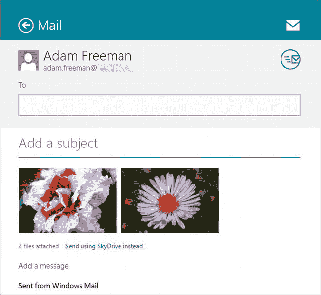

***图 25-5。**用邮件应用分享文件*

### 创建共享目标

在这一部分，我将通过把我在第 24 章的[中创建的`PhotoAlbum`应用变成一个共享目标并允许它接收包含文件的数据包来展示共享契约的另一面。](24.html#ch24)

提醒一下，`PhotoAlbum`应用的基本功能允许用户选择要在简单相册中显示的图像文件，该相册显示为在`WinJS.UI.ListView`控件中显示的一系列缩略图。

在前一章中，我在此基础上实现了文件激活、保存选取器和打开选取器合约，展示了应用集成到操作系统的不同方式——这是我将在本章分享合约中继续讨论的主题。提醒一下，[图 25-6](#fig_25_6) 显示了`PhotoAlbum`显示图像时的样子。

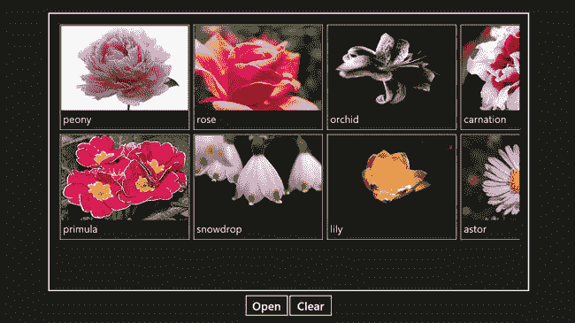

***图 25-6。**相册示例 app*

我不打算重新列出示例应用的代码和标记，因为你可以在[第 24 章](24.html#ch24)中找到它们，或者从`Apress.com`下载该项目作为源代码包的一部分。我知道不得不前后翻页到另一章会令人沮丧，但另一种选择是花 10 页列出你已经看过的代码，我宁愿用这些空间向你展示新的合同和特性。

#### 更新清单

与共享源不同，共享目标必须在清单中声明它们的功能。这是有意义的，因为共享源需要自由地共享用户正在处理的任何数据，而共享目标将有预先确定的方式来处理一组数据类型。

对于这一章，我将增强`PhotoAlbum`应用，使其能够处理包含`.jpg`和`.png`文件的数据包。为此，从 Visual Studio 的`Solution Explorer`窗口打开`package.appxmanifest`文件，并导航到`Declarations`部分。从`Available Declarations`列表中选择`Share Target`并点击`Add`按钮。与其他合同一样，显示附加细节的表格，如图[图 25-7](#fig_25_7) 所示。显示红色警告是因为我还没有填充表单。

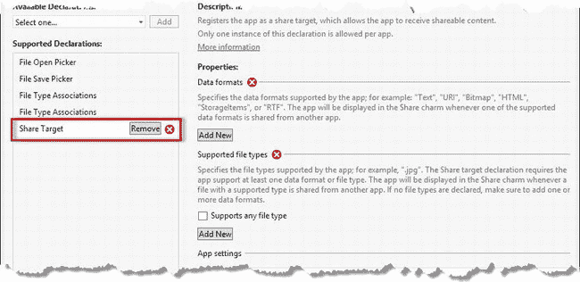

***图 25-7。**将份额目标申报添加到清单中*

##### 声明数据格式

你可以用两种方式之一来表达你对共享目标的支持。第一种是使用数据格式，这可以通过单击清单表单的`Data formats`部分中的`Add New`按钮来完成。当你点击这个按钮时，你会看到一个`Data format`字段，你可以在其中输入你的应用支持的数据格式。

`Data format`字段接受与`DataPackage`对象中的方法相对应的值，我在本章前面已经描述过了。[表 25-6](#tab_25_6) 提供了共享源可以使用的`DataPackage`对象中的方法和相应的`Data format`值之间的快速参考，共享目标必须在清单中声明这些值才能接收那种包。

 **提示**请记住，如果正在共享的数据包包含至少一种您声明的类型，Windows 会将您的应用包括在呈现给用户的共享目标列表中。您不需要声明`Data format`值的精确组合来接收包含多种类型的包。同样，你不应该声明支持任何你的应用不能使用的数据类型。

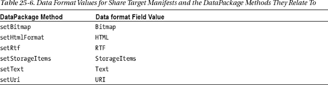

如果您想支持多种类型的数据，比如文件和 URL，再次点击`Add New`创建额外的`Data format`字段，并从表格中输入适当的值。完成后，键入`Control+S`保存清单更改。

##### 声明文件类型支持

您还可以通过使用清单的`Supported file types section`指定单个文件类型来声明对共享目标联系人的支持。这允许您支持包含您的应用可以处理的文件类型的数据包，而不是任何文件(这是`StorageItems`数据格式的效果)。

区别很重要。例如，`Mail`应用想要处理文件，但它并不关心它们是什么，因为每个文件都适合作为电子邮件的附件。我需要对`PhotoAlbum`应用更有选择性，因为我只支持图像文件——例如，我无法在相册应用中使用 Excel 电子表格，因此我需要确保我的应用只是 PNG 和 JPG 文件的共享目标。

 **提示**我将向您展示清单声明的两个部分是如何分别工作的，但是您可以在同一个声明中使用这两个部分来支持数据类型和文件类型的混合。您必须为此联系人指定至少一种文件类型或数据格式，否则您可以随意组合。

要为`PhotoAlbum`应用设置清单声明，请单击`Add New`按钮创建一个新的`File type`字段，并输入`.png`文件扩展名(包括句点)。再次点击`Add New`按钮，在`File type`字段输入`.jpg`。清单应该类似于图 25-8 中所示的清单。当您添加了第一种文件类型后，红色警告标记将会消失，告诉您清单声明是有效的。

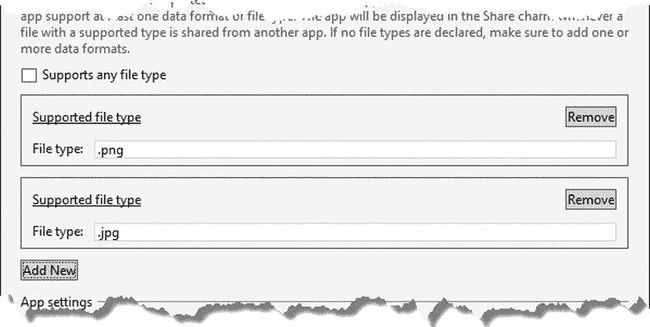

***图 25-1。**在相册清单中增加对特定文件类型的支持*

如果数据包包含至少一个与您指定的类型相匹配的文件，Windows 会将您的应用添加到共享目标列表中。这意味着您可能会收到包含一些您无法处理的文件的包——您有责任在包中找到您*可以*处理的文件，并忽略其余的文件。(你可以在本章后面看到我是如何做到这一点的。)

#### 响应激活事件

当您的应用被选为数据包的共享目标时，Windows 会使用`activated`事件通知您。激活事件的`detail.kind`属性设置为`ActivationKind.shareTarget`。在[清单 25-9](#list_25_9) 中，您可以看到我在`PhotoAlbum`项目中对`/js/default.js`文件的添加，以响应这一事件。

***清单 25-9** 。响应被激活的事件*

`...
switch (args.detail.kind) {
**    case activation.ActivationKind.shareTarget:**
**        WinJS.Navigation.navigate("/pages/shareTargetView.html",**
**            args.detail.shareOperation);**
**        break;**
        // *... statements for other activation types removed for brevity...*
    default:
        WinJS.Navigation.navigate("/pages/albumView.html");
        break;
}
...`

`args.detail.shareOperation`属性返回一个`Windows.ApplicationModel.DataTransfer.ShareTarget.ShareOperation`对象，该对象提供对数据包的访问，并提供一些方法，通过这些方法，我可以在处理数据包时向 Windows 发送进度信号。我将`ShareOperation`对象传递给`WinJS.Navigation.navigate`方法，以便它可以在我创建的用于处理`shareTarget`激活事件的内容文件中使用，该文件名为`shareTargetView.html`，我将它添加到了`PhotoAlbum` Visual Studio 项目的`pages`文件夹中。在接下来的小节中，我将向您展示这个文件的内容。

 **注意**需要注意的重要一点是，你的应用的一个新实例被启动来处理`shareTarget`事件。这意味着如果您的应用已经在运行，那么将会创建第二个实例。您将需要提供某种协调，以便用户启动的应用实例反映 Windows 启动的实例所做的更新，以处理共享数据包。对于这个例子，我将把用户共享的文件复制到本地应用数据文件夹中，`PhotoAlbum`应用将监视这个文件夹的变化。

#### 处理共享操作

在[清单 25-10](#list_25_10) 中，您可以看到`shareTargetView.html`文件的内容，我创建这个文件是为了给`PhotoAlbum`应用添加对共享目标契约的支持。`script`元素中的两个关键函数是占位符，我将在本节稍后完成。

***清单 25-10** 。shareTargetView.html 文件的最初内容*

`<!DOCTYPE html>
<html>
<head>
    <title></title>
    
    
</head>
<body>
    

    
Shared by: 

    
(For info: )

    

    

    

        <button class="addButton" id="addAll">Add All</button>
        <button class="addButton" id="addSelected">Add Selected</button>
    

</body>
</html>`

即使有不完整的函数，这个文件中仍然有一些重要的事情在进行。对我来说，解释它们的最好方式是向你展示完成后的页面是什么样子，然后再返回。[图 25-9](#fig_25_9) 显示了 Windows 用来处理共享数据包的`shareTargetView.html`文件。

 **注意**此时您将无法重新创建这个图，因为 default.js 文件中的关键函数尚未实现。

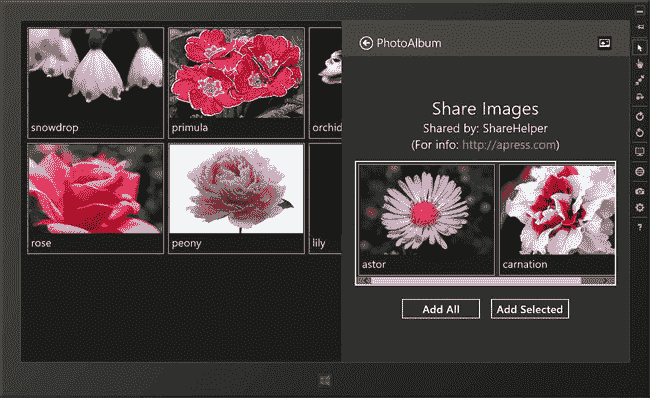

***图 25-9。**相册 app 收到分享数据包*

Windows 在 650 像素的窗格中显示共享目标应用(其中 645 像素可供应用使用)。对于我的示例应用，我使用的布局包含一些标题信息(我将使用共享数据包中的属性填充)、一个`ListView`(我将使用数据包中的`StorageFile`对象填充)和两个`button`元素。

这些按钮允许用户进一步细化他们对包中文件的选择。点击`Add All`按钮会将数据包中的所有文件复制到本地 app data 文件夹中，并添加到相册中。点击`Add Selected`按钮将仅对用户在`ListView`中选择的图像进行操作。

我喜欢为用户提供进一步过滤数据包内容的选项，因为我对数据来自的应用一无所知。这在分享过程中创造了一个额外的步骤，这是一件坏事，但许多应用似乎不会让用户在分享前微调他们的选择，这更糟糕。我通过支持快速链接特性来证明向流程中添加额外步骤是正确的，我将在本章的后面对此进行描述。

##### 报告进度

`ShareOperation`对象定义了许多方法，当你处理数据包时，这些方法用来通知窗口，如[表 25-7](#tab_25_7) 中所述。

T2】

你可以看到我是如何在[清单 25-11](#list_25_11) 中的`shareTargetView.html`页面的`ready`函数中使用这些方法的，在这里我重复了代码并突出显示了关键语句。

***清单 25-11** 。处理共享包时使用 ShareOperation 方法*

`...
ready: function (element, shareOperation) {

    processPackage(shareOperation.data).then(function (list) {
        if (list.length == 0) {
**            shareOperation.reportError("No images files were shared");**
            return;
        }

        shareListView.winControl.itemDataSource = list.dataSource;
        WinJS.Utilities.query("button.addButton").listen("click", function (e) {
**            shareOperation.reportStarted();**
            if (this.id == "addAll") {
**                shareListView.winControl.selection.selectAll();**
            }
            var filesToProcess = [];
            shareListView.winControl.selection.getItems().then(function (items) {
                items.forEach(function (item) {
                    filesToProcess.push(item.data.file);
                });
            });

            copySelectedFiles(filesToProcess).then(function () {
**                shareOperation.reportDataRetrieved();**
**                shareOperation.reportCompleted();**
            });;
        });
    });
}
...`

只有当用户不再需要与你的应用交互时，你才应该调用`reportStarted`方法——这是因为 Windows 可能会关闭你的应用，并允许共享操作在后台继续，从而允许用户继续使用共享源应用。

对于我的例子来说，这意味着我不能调用`reportStarted`，直到用户点击其中一个按钮，表明他们想要导入哪些文件。我一解析完包中的内容就调用`reportStarted`方法，并在将内容复制到本地 app data 文件夹后调用`reportDataRetrieved`和`reportCompleted`方法。

如果我从`processPackage`函数得到的`WinJS.Binding.List`对象不包含任何我可以操作的文件，我就调用`reportError`方法。在理想情况下，我不需要这样做，因为 Windows 已经将包的内容与清单声明中的文件类型进行了匹配，但我将此检查添加到我的共享目标应用中，以处理编写得不好的应用。一些共享源应用错误地设置了数据包中`fileTypes`属性的值(如本章前面所述)——该值会覆盖真正正在使用的文件类型，这会导致 Windows 发送不包含任何有用文件的我的应用包。

 **注意**错误呈现给用户的方式有点奇怪。调用`reportError`方法时，共享目标 app 立即关闭。然后向用户显示一条通知消息，告诉他们出现了一个问题。只有当他们点击通知时，他们才能看到您传递给`reportError`方法的消息。

##### 处理数据包

`ShareOperation.data`属性返回一个`DataPackageView`对象，它是数据包的只读版本。您使用这个对象来了解发送给您的包，并获取其中包含的数据。[表 25-8](#tab_25_8) 显示了`DataPackageView`对象定义的方法。

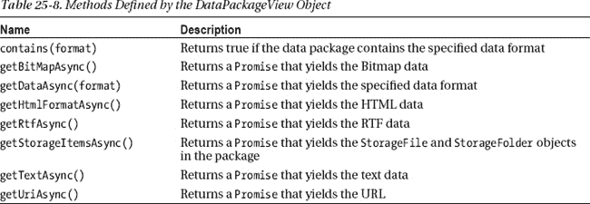

从包中检索数据的方法都是异步的，并返回一个`WinJS.Promise`对象，该对象在完成时产生适当类型的数据。

`contains`方法让您检查包是否包含给定的数据类型。你可以将[表 25-6](#tab_25_6) 中的一个字符串值传递给这个方法，或者使用`StandardDataFormats`对象中的一个值，我已经在[表 25-9](#tab_25_9) 中列出了。

T2】

你可以在[清单 25-12](#list_25_12) 中看到我是如何使用`contains`和`getStorageItemsAsync`方法的，它展示了我是如何在`shareTargetView.html`文件中实现`processPackage`函数的。

***清单 25-12** 。完成 processPackage 方法*

`...
function processPackage(data) {
    if (**data.contains(share.StandardDataFormats.storageItems)**) {
        return **data.getStorageItemsAsync()**.then(function (files) {
            var fileList = new WinJS.Binding.List();
            files.forEach(function (file) {
                 if (file.fileType == ".jpg" || file.fileType == ".png") {
                     fileList.unshift({
                          img: URL.createObjectURL(file),
                          title: file.displayName,
                          file: file
                     });
                 }
            });
            appName.innerText = data.properties.applicationName;
            shareTitle.innerText = data.properties.title;
            var refLink = data.properties["referenceURL"]
            infoAnchor.innerText = infoAnchor.href = refLink == null ? "N/A" : refLink;
            return fileList;
        });
    };
}
...`

我首先使用`contains`方法来确保数据包中有文件或文件夹——这是我在示例应用中支持的唯一一种数据，否则没有必要进一步处理数据包。

我调用`getStorageItemsAsync`方法并检查传递给`then`方法的每个对象的`fileType`属性，这允许我过滤掉错误类型的文件夹和文件。我为我找到的每个图像文件添加一个对象到一个`WinJS.Binding.List`中，该对象的属性意味着我可以使用 default.html 文件中的 HTML 模板在`ListView` UI 控件中显示它(这是我在第 24 章的[中用于所有`PhotoAlbum`示例的相同模板)。](24.html#ch24)

`DataPackageView.properties`属性返回一个对象，您可以使用该对象获取由共享源应用添加到数据包中的属性。我读取了`applicationName`和 `title`属性的值，并检查了`ShareHelper`应用添加到包中的自定义属性是否存在。我使用这些值来设置布局中一些 HTML 元素的内容。

 **提示**在告诉 Windows 你已经完成了共享操作之前，你必须小心确保你的异步方法调用已经完成。在这个例子中，我通过从`processPackage`函数返回一个`Promise`来完成这个任务，只有当我接收并处理了来自`getStorageItemsAsync`方法的结果时，这个任务才会完成。

##### 复制数据

剩下的工作就是将数据从共享包复制到本地应用数据文件夹，我通过实现`copySelectedFiles`函数来完成，如[清单 25-13](#list_25_13) 所示。

***清单 25-13** 。实现 copySelectedFiles 函数*

`...
**function copySelectedFiles(files) {**
**    var promises = []**;
**    files.forEach(function (file) {;**
**        var promise = localFolder.createFileAsync(file.name,**
**            storage.CreationCollisionOption.replaceExisting)**
**            .then(function (newfile) {**
**                return file.copyAndReplaceAsync(newfile).then(function () {**
**                    App.processFile(newfile);**
**                });**
**            });**
**        promises.push(promise);**
**    });**
**    return WinJS.Promise.join(promises)**
**}**
...`

这个函数中没有新的技术——你可以在第 22 章的[中了解基本的文件操作，并在第 9 章](22.html#ch22)的[中了解如何使用`Promise.join`方法。completed `copySelectedFiles`函数将用户从数据包中选择的所有文件复制到本地 app data 文件夹中，并返回一个`Promise`,只有当所有复制操作都完成时，该函数才会完成(我这样做是为了确保在我知道已经完成了数据包的内容之前不会调用`ShareOperation`方法)。](09.html#ch9)

我复制文件而不是使用我在数据包中收到的位置有两个原因。首先，如果有另一个示例应用正在运行，我可以更容易地确保相册中的新内容得到反映。这是我在第 24 章中实现应用到应用选取器合同时遇到的相同问题，我已经用相同的方式解决了它——通过将我正在处理的文件复制到一个位置，该位置由`PhotoAlbum`应用监控新文件。我承认这是一个小技巧，但是 Windows 同时创建你的应用的两个实例的情况很少，尽管我可能会尝试，但我无法找到更好的方法在它们之间进行通信。我复制文件的第二个原因是，当共享操作结束时，我不知道共享源应用打算如何处理它们。我需要制作一个副本，以确保用户可以使用这些图像。

#### 测试共享目标实现情况

共享目标合同的实施已经完成，现在您可以与`PhotoAlbum`应用共享图像文件。你已经知道如何用`ShareHelper`应用来做这件事，但是分享合同的一个好处是你可以从任何应用接收兼容的数据包。为此，转到桌面并使用`File` `Explorer`找到一个在`Pictures`库之外的图像文件。

右键单击该文件，从弹出菜单中选择`Open with`，并从列表中选择`Photos`(这是 Windows 8 附带的默认图像查看器应用，从桌面选择它意味着您不必担心图像文件类型的默认应用，如果您遵循第 24 章中的[中的示例，它很可能是`PhotoAlbum`应用)。](24.html#ch24)

激活分享魔咒，从目标应用列表中选择`Photo Album`。你会看到来自`shareTargetView.html`文件的布局，如图[图 25-10](#fig_25_10) 所示。点击`Add All`按钮，启动`PhotoAlbum`应用——你会看到你分享的图片显示出来。

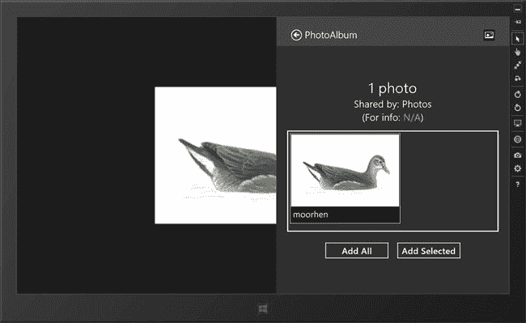

***图 25-10。**分享来自 Windows Photos 应用的图片文件*

在我继续之前，还有最后一点需要注意。我让您在`Pictures`库之外定位一个图像文件的原因是，我想演示打包`StorageFile`对象的方式将访问这些文件的隐含权限转移到目标应用。一切都按照它应该的方式运行——例如，您不必担心确保目标应用已被授予读取包含该文件的文件夹的权限。

当然，有了这种隐含的许可，就隐含了对您的信任，即您不会对数据做一些意想不到的事情。您应该确保在没有获得用户明确许可的情况下，不要删除或修改原始文件。

### 创建快速链接

*快速链接*是一个预先配置的动作，允许用户使用他们之前做出的细节或决定来执行简化的共享动作。在我的`PhotoAlbum`应用中，我让用户选择他们想要复制和导入的数据包中的图像。每次用户与`PhotoAlbum`共享文件时，强迫用户做出相同的决定是重复和令人讨厌的，尤其是因为他们很有可能已经花时间在 share source 应用中选择了他们想要的图像。

为了简化我的应用，我将创建一个快速链接，允许用户导入所有文件，而无需与我的应用布局进行任何交互。使用快速链接有两个阶段——创建它们和接收它们——我将在接下来的小节中向您展示这两个阶段。

#### 创建快速链接

您可以通过向`ShareOperation.reportCompleted`方法传递一个`QuickLink`对象来创建一个快速链接，这个对象可以在`Windows.ApplicationModel.DataTransfer.ShareTarget`名称空间中找到。配置`QuickLink`对象，使其包含应用重复用户刚刚执行的共享操作所需的所有信息。`QuickLink`对象定义了[表 25-10](#tab_25_10) 中所示的属性。

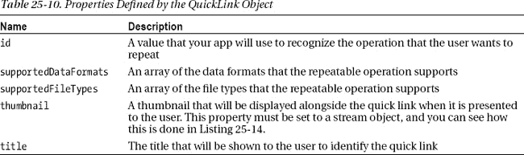

你可以在[清单 25-14](#list_25_14) 中看到我如何为`PhotoAlbum`应用创建了一个`QuickLink`，它显示了我对`shareTargetView.html`文件中的`ready`函数所做的更改。

***清单 25-14** 。在共享操作结束时创建快速链接*

`...
WinJS.Utilities.query("button.addButton").listen("click", function (e) {

    if (this.id == "addAll") {
        shareListView.winControl.selection.selectAll();
    }
    var filesToProcess = [];
    shareListView.winControl.selection.getItems()
        .then(function (items) {
            items.forEach(function (item) {
                filesToProcess.push(item.data.file);
            });
        });` `    copySelectedFiles(filesToProcess).then(function () {
        shareOperation.reportDataRetrieved();

        if (e.target.id == "addAll") {
**            var qlink = new share.ShareTarget.QuickLink();**
**            qlink.id = "all";**
**            qlink.supportedFileTypes.replaceAll([".png", ".jpg"]);**
**            qlink.title = "Add all files";**
**            qlink.thumbnail = storage.Streams.RandomAccessStreamReference.**
**                createFromUri(Windows.Foundation.Uri("ms-appx:img/logo.png"));**
**            shareOperation.reportCompleted(qlink);**

        } else {
            shareOperation.reportCompleted();
        }
    });
});
...`

我想创建一个快速链接，只有当用户从数据包中选择了所有的图像，因为没有办法，我可以在未来有效地重复选择单个图像。其他种类的应用可以明智地提供一系列快速链接——例如，如果你正在编写一个电子邮件应用，你可能会创建`QuickLink`对象，以便用户可以快速发送电子邮件给以前的收件人。

您可以看到这些变化的效果，但这需要一段时间。启动`PhotoAlbum`应用(确保运行最新版本)。然后启动`ShareHelper`应用，使用`ListView`控制键选择图像，激活`Share Charm`，从列表中选择`PhotoAlbum`。点击`Add All`按钮。

保持在`ShareHelper`应用内，再次激活分享图标，你会在分享弹出菜单上看到一个新项目，如图[图 25-11](#fig_25_11) 所示。这是一个快速链接，在本例中，它允许用户在一个步骤中添加他们选择共享的所有文件。我还没有在`PhotoAlbum`应用中添加代码来处理快速链接——我将在下一节中做这件事——但是图中显示了快速链接是如何呈现给用户的。

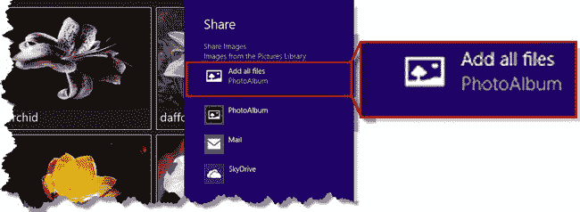

***图 25-11。**分享弹出菜单中增加了一个快速链接*

简单回顾一下，快速链接用于允许用户重复经常执行的共享操作。这就是为什么我让你激活两次分享魔咒:第一次定义了操作，第二次显示为快速链接。

选择快速链接目前只是加载标准的共享目标布局，但在下一节中，我将向您展示如何识别快速链接何时被选择，以便您可以简化共享操作。

#### 接收快速链接

当你的应用被激活时，你可以通过读取`ShareOperation.quickLinkId`属性来确定用户是否选择了你的一个快速链接。该属性返回的值是您分配给`QuickLink.id`属性的值，允许您确定用户想要重复哪个共享操作。我的示例应用只有一个快速链接 id——`all`——你可以在清单 25-15 的[中看到我是如何响应用户选择它的。](#list_25_15)

[清单 25-15](#list_25_15) 。检测用户何时选择了快速链接

`...
ready: function (element, shareOperation) {

    processPackage(shareOperation.data).then(function (list) {
        if (list.length == 0) {
            shareOperation.reportError("No images files were shared");
            return;
**        } else if (shareOperation.quickLinkId == "all") {**
**            shareOperation.reportStarted();**
**            var files = [];**
**            list.forEach(function (listItem) {**
**                files.push(listItem.file);**
**            });**
**            copySelectedFiles(files).then(function () {**
**                shareOperation.reportDataRetrieved();**
**                shareOperation.reportCompleted();**
**            });**
**        } else {**

            shareOperation.reportStarted();

            shareListView.winControl.itemDataSource = list.dataSource;
            WinJS.Utilities.query("button.addButton").listen("click", function (e) {
               // *...statements removed for brevity...*
            });
        **}**
    });
}
...`

当用户选择快速链接时，我处理所有文件，不提示用户输入任何内容。结果是一个简化的共享操作，甚至不向用户呈现界面——文件只是无缝地添加到相册中。

### 总结

在这一章中，我向你展示了如何实现共享契约的两个部分，让你能够让数据从一个应用平稳地流向另一个应用。共享源应用负责打包数据并使其可供 Windows 使用，Windows 充当一个代理来查找可以处理共享数据的合适的共享目标应用。共享是关键的 Windows 交互之一，我鼓励你将它添加到你的应用中，并以支持最广泛的数据格式和文件类型的方式进行。你给用户分享你的应用的机会越多，你的应用就越能深入他们的工作流程。

在下一章，我将展示 Windows 8 支持的其他一些合同。