## 第二十七章

## 使用应用程序切片

在第 4 章中，我向你展示了如何设置一个应用程序在 Windows 开始屏幕上使用的图片。这是磁贴的基本操作，但应用程序可以更进一步，创建*实时*磁贴，即使在应用程序不运行时，也可以通过开始屏幕显示有用的信息。在本节中，我将向您展示如何创建动态切片，以及通过应用程序更新动态切片的不同方式。

使用动态磁贴有两个基本原因:因为您希望用户更频繁地运行您的应用程序，或者因为您希望用户不那么频繁地运行您的应用程序。如果你有一个旨在吸引用户注意力的应用程序，那么你希望将用户的目光吸引到你的应用程序磁贴上，并提醒他们你在那里。这对于游戏来说是真实的，例如，你想吸引用户并提醒他们你的游戏比他们通过开始菜单想要做的更有趣或更令人兴奋。在这些情况下，你有责任创建吸引人但不分散注意力的磁贴——这符合你的利益，因为 Windows 8 允许用户禁用令人讨厌的应用程序的动态磁贴。Windows Store 中的一些早期应用程序有动态磁贴设计，它们的风格非常激进，以至于我发现自己在移动磁贴，这样我就看不到它们了。

如果你有一个旨在提高用户生产力或工作生活的应用程序，那么你希望使用磁贴为用户提供关键信息的及时摘要，以便他们可以轻松获得关键事实*，而无需*启动你的应用程序，等待初始化，导航到正确的部分，等等。简而言之，你在不启动你的应用程序的情况下，通过给用户提供他们需要的信息来帮助他们。这需要仔细考虑用户关心什么，并为用户提供改变显示在磁贴上的信息种类的方法。

对于这类 app 来说，你的责任就是创建一个内容及时、明显、准确的磁贴，也就是说当 app 状态发生变化的时候更新磁贴。

我对实时应用程序磁贴的看法和我对 UI 动画的看法是一样的:如果少用的话，它们是个好东西，但是很快就会变得烦人和分散注意力(你应该总是提供一种方法来禁用它们)。不要误判你的应用对用户的重要性，不要把他们的开始屏幕变成维加斯老虎机。[表 1](#tab_27_1) 提供了本章的总结。

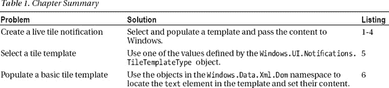
T4】

### 为本章创建示例

我为这一章创建了一个名为`LiveTiles`的新 Visual Studio 项目。起点是非常基本的，因为我只需要布局包含按钮，将执行不同种类的瓷砖更新，从一个基本的实时瓷砖开始。[清单 1](#list_27_1) 显示了应用程序的`default.html`文件，其中包含一个按钮。我将在本章中添加新的元素，并演示不同的技术。

*清单 1。来自 LiveTiles 项目的 default.html 文件*

`<!DOCTYPE html>
<html>
<head>
    <meta charset="utf-8" />
    <title>LiveTiles</title>

    <!-- WinJS references -->
    <link href="//Microsoft.WinJS.1.0/css/ui-dark.css" rel="stylesheet" />
    
    

    <!-- LiveTiles references -->
    <link href="/css/default.css" rel="stylesheet" />
    
</head>
<body>
    

**        <button id="basicTile">Basic Live Tile</button>**` `    

</body>
</html>`

这个示例应用程序的 CSS 同样简单，您可以在清单 2 的[中看到`/css/default.css`文件的内容。这个 CSS 中没有新的技术，只是将 HTML 中的按钮放在屏幕的中央。](#list_27_2)

*清单 2。/css/default.css 文件的内容*

`body { display: -ms-flexbox;-ms-flex-direction: row;-ms-flex-align: stretch;
    -ms-flex-pack: center;}
#container { display: -ms-flexbox; -ms-flex-direction: column; -ms-flex-align: stretch;
    -ms-flex-pack: center;}
#container button {font-size: 30pt; width: 400px; margin: 10px;}`

你可以在[图 1](#fig_27_1) 中看到 app 的初始布局。正如承诺的那样，它非常简单，我将在本章的后面添加额外的按钮来演示其他特性。

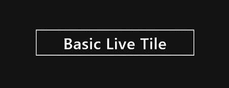

***图 1。**示例 app 的初始布局*

#### 定义 JavaScript

如[清单 3](#list_27_3) 所示，我从一个简单的`default.js`文件开始。这个 app 全是磁贴，我没有任何后台工作或者 app 状态要担心。我甚至不必像往常一样调用`WinJS.Binding.processAll`方法，因为我没有视图模型或任何要处理的数据绑定。

*清单 3。一个简单的 Default.js 文件*

`(function () {
    "use strict";

    var app = WinJS.Application;
    var activation = Windows.ApplicationModel.Activation;
    var $ = WinJS.Utilities.query;
    WinJS.strictProcessing();

    var textMessages = ["Today: Pick up groceries",
                        "Tomorrow: Oil change",
                        "Wed: Book vacation",
                        "Thu: Renew insurance"];

    app.onactivated = function (args) {` `        if (args.detail.kind === activation.ActivationKind.launch) {
            args.setPromise(WinJS.UI.processAll().then(function () {
                **$("#container > button").listen("click", function (e) {**
**                    switch (this.id) {**
**                        case "basicTile":**
**                            // TODO - code for tile goes here**
**                            break;**
**                    }**
**                });**
            }));
        }
    };
    app.start();
})();`

我在文档中定位`button`元素并监听`click`事件，使用被点击按钮的`id`值计算出在每种情况下我需要做什么。目前布局中只有一个按钮，但我会添加更多。

#### 设置平铺图像

因为这是关于 tiles 的一章，所以我在 Visual Studio 项目的`images`文件夹中添加了文件，这样我就可以创建一个基本的静态 tile。这些文件被称为`tile30.png`、`tile150.png`和`tile310.png`，你可以在图 2 的[清单的`Application UI`部分看到我是如何应用这些图像的。](#fig_27_2)

***图二。**为应用程序磁贴设置图像*

 **提示**当您使用磁贴并更改应用程序使用的设置时，您可能会发现磁贴图标不会显示在开始屏幕上。我发现右键点击应用程序，点击应用程序栏上的`Uninstall`，重新启动应用程序，往往就能解决问题。有时应用程序磁贴根本不显示——在这种情况下，键入应用程序名称的前几个字母来执行搜索，然后按 escape 键返回主开始屏幕；瓷砖通常会出现。如果所有这些都失败了，从模拟器和开发机器上卸载应用程序，重新启动，并在不启动模拟器的情况下从 Visual Studio 启动应用程序。

#### 测试示例应用程序

目前没有太多的功能，但是如果您从 Visual Studio 启动应用程序，然后切换到开始屏幕，您将能够看到示例应用程序的静态磁贴。您可以使用`Larger`和`Smaller` AppBar 命令在正常和宽按钮配置之间切换，您可以在[图 3](#fig_27_3) 中看到。

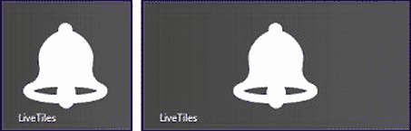

***图三。**示例 app 的方形宽静态瓷砖*

如图所示，我添加到项目中并在清单中应用的图像显示了一个警铃；我为示例应用程序选择了这张图片，因为它将像一个提醒程序一样创建磁贴更新。我不打算创建提醒逻辑，但我需要一个更新和提醒是理想的主题。

### 创建动态磁贴

创建动态切片的基本原则包括三个步骤:

1.  选择一个 XML 模板。
2.  用您的数据填充模板。
3.  将填充的 XML 传递给 Windows 以更新图块。

完成所有这些工作的 API 相当笨拙，但是这种笨拙可以相当简单地用助手函数来包装，一旦您启动并运行，这个过程就变得相对容易了。首先，我将创建基本类型的 live tile，它只包含文本信息，然后再创建更复杂的替代方案。[清单 4](#list_27_4) 展示了当点击应用布局中的`button`时对`default.js`文件的修改，它创建了一个动态磁贴。

*清单 4。创建实时互动程序*

`(function () {
    "use strict";

    var app = WinJS.Application;
    var activation = Windows.ApplicationModel.Activation;
**    var wnote = Windows.UI.Notifications;**
    WinJS.strictProcessing();

    var textMessages = ["Today: Pick up groceries",
                        "Tomorrow: Oil change",
                        "Wed: Book vacation",` `                        "Thu: Renew insurance"];

**    function getTemplateContent(template) {**
**        return wnote.TileUpdateManager.getTemplateContent(template);**
**    }**

**    function populateTemplateText(xml, values) {**
**        var textNodes = xml.getElementsByTagName("text");**
**        var count = Math.min(textNodes.length, values.length);**
**        for (var i = 0; i < count; i++) {**
**            textNodes[i].innerText = values[i];**
**        }**
**        return xml;**
**    }**

**    function updateTile(xml) {**
**        var notification = new wnote.TileNotification(xml);**
**        var updater = wnote.TileUpdateManager.createTileUpdaterForApplication();**
**        updater.update(notification);**
**    }**

    app.onactivated = function (args) {
        if (args.detail.kind === activation.ActivationKind.launch) {
            args.setPromise(WinJS.UI.processAll().then(function () {
                WinJS.Utilities.query("#container > button").listen("click",
                    function (e) {
                        switch (this.id) {
                            case "basicTile":
**                                var template = wnote.TileTemplateType.tileSquareText03;**
**                                var xml = getTemplateContent(template);**
**                                updateTile(populateTemplateText(xml, textMessages));**
                                break;
                        }
                    });
            }));
        }
    };
    app.start();
})();`

我将工作分成了三个助手函数，可以在后面的例子中使用，而不必直接使用`Windows.UI.Notifications`名称空间，在那里可以找到与 tile 相关的功能。我将在接下来的部分中分解这个过程。

##### 获取模板内容

可用于实时图块的模板集合由`Windows.UI.Notifications.TileTemplateType`枚举定义。有 45 种不同类型的模板可用，它们提供不同的大小(用于正方形和宽瓷砖)和不同数量的文本，有或没有图像。如果你看一下`TileTemplateType`(在`[http://msdn.microsoft.com/en-us/library/windows/apps/windows.ui.notifications.tiletemplatetype.aspx](http://msdn.microsoft.com/en-us/library/windows/apps/windows.ui.notifications.tiletemplatetype.aspx)`)，的 API 文档，你会看到每个不同模板的例子。我将从`TileTemplateType.tileSquareText03`模板开始，这是一个显示四行文本的纯文本模板。您可以在清单 5 中看到这个模板的 XML。

*清单 5。tileSquareText03 模板的 XML*

`<tile>
    <visual>
        <binding template="TileSquareText03">
            <text id="1"></text>
            <text id="2"></text>
            <text id="3"></text>
            <text id="4"></text>
        </binding>
    </visual>
</tile>`

目标是设置每个`text`元素的内容——我将使用我在`/js/default.js`文件的`textMessages`数组中定义的四个字符串，它们代表我的假提醒应用程序即将发出的提醒。

获取 XML 模板的内容需要将一个值从`TileTemplateType`枚举传递给由`Windows.UI.Notifications.TileUpdateManager`定义的`getTemplateContent`方法。在这个区域中有一些相当长的名称空间和对象名，所以我为`Windows.UI.Notifications`名称空间定义了一个别名，并将获取 XML 内容的调用放入`getTemplateContent`助手函数中。

`getTemplateContent`方法返回一个`Windows.Data.Xml.Dom.XmlDocument`对象，为 XML 内容提供 DOM 操作。操作 XML 与处理 HTML 内容非常相似，尽管您将在下一节中看到，在处理动态切片时，您不必进行太多的操作。

 **提示**除了`Windows.Data.Xml.Dom`名称空间，你会发现应用程序也可以使用`Windows.Data.Html`和`Windows.Data.Json`名称空间。它们提供了用于处理 HTML 和 JSON 内容的对象，如果您想要在当前 DOM 之外处理 HTML，或者想要超越 Internet Explorer 10 中可用的基本 JSON 支持，它们会非常有用。

##### 推广 xml 文本元素的内容

获得 XML 模板后，我现在需要填充`text`元素的内容。我已经定义了`populateTemplateText`函数，它接受一个模板和一个字符串值数组，并使用`innerText`属性设置文本元素的内容。

尽管模板中的`text`元素有`id`属性，但是`XmlDocument.getElementById`方法不能正常工作，所以下一个最好的选择是使用`getElementsByTagName`方法定位所有的`text`元素。这给了我一组按照它们在 XML 文档中出现的顺序排列的`text`元素，我依靠这种顺序使用`innerText`属性设置`text`元素的内容，就像我处理 HTML 元素一样。结果是一个填充的 XML 模板，如清单 6 所示。

*清单 6。填充的 XML 模板*

`<tile>
    <visual>
        <binding template="TileSquareText03">
            <text id="1">**Today: Pick up groceries**</text>
            <text id="2">**Tomorrow: Oil change**</text>
            <text id="3">**Wed: Book vacation**</text>
            <text id="4">**Thu: Renew insurance**</text>
        </binding>
    </visual>
</tile>`

##### 更新磁贴

最后一步是通过将填充的 XML 传递给系统来更新图块，这是通过一系列笨拙的 API 调用来完成的，如清单 7 中的[所示，它重复了几页前的`updateTile`助手函数。](#list_27_7)

*清单 7。用填充的 XML 更新图块*

`...
function updateTile(xml) {
    var notification = new wnote.TileNotification(xml);
    var updater = wnote.TileUpdateManager.createTileUpdaterForApplication();
    updater.update(notification);
}
...`

首先，我需要创建一个`TileNotification`对象，将填充的 XML 作为构造函数参数传入。对于一个简单的磁贴，你只需要创建对象，但是我将在本章的后面向你展示如何为不同的场景配置它。接下来，我通过调用`TileUpdateManager.createTileUpdaterForApplication`方法创建一个`TileUpdater`对象。`TileUpdater`对象提供了一系列更新图块的不同方法。目前，我只是使用了最基本的方法，即调用`update`方法，传入上一步创建的`TileNotification`对象。稍后我将向您展示更复杂的安排。结果是当你点击布局中的`button`时，静态磁贴变成活动的，显示我的假约会数据，如图[图 4](#fig_27_4) 所示。

 **警告**Visual Studio 模拟器不支持实时图块。要测试 live tiles，你必须使用真正的 Windows 8 设备。

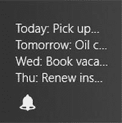

***图 4。**一个基本活瓦*

您可以看到，小图标用于实时磁贴更新，以帮助用户识别与磁贴相关的应用程序。你还可以看到，我所做的更新并不是特别有用——在一个正方形的磁贴中没有太多的空间，当依赖文本时，很难向用户提供有意义的信息。

 **提示**你不能指望用户看到你的磁贴更新。首先，您的应用程序磁贴可能不在最初显示的开始屏幕上，用户可能不会滚动它以使它变得可见。其次，用户可以使用开始屏幕应用程序栏禁用实时磁贴。这意味着您应该使用实时磁贴来显示应用程序本身也提供的信息，而不是将磁贴视为核心应用程序功能的一部分。

#### 创建更有用的实时互动程序

我的基础磁贴更新还有一个问题，就是不影响宽磁贴。为了解决缺乏实用性的问题并支持所有的图块格式，我将采用不同的方法，如[清单 8](#list_27_8) 所示，它强调了我对`default.js`文件所做的添加，以一起更新窄和宽图块格式。

*清单 8。创建更有用的磁贴更新*

`(function () {
    "use strict";

    var app = WinJS.Application;
    var activation = Windows.ApplicationModel.Activation;
    var wnote = Windows.UI.Notifications;
    WinJS.strictProcessing();

    var textMessages = ["Today: Pick up groceries",
                        "Tomorrow: Oil change","Wed: Book vacation",
                        "Thu: Renew insurance", "Sat: BBQ"];

    function getTemplateContent(template) {
        return wnote.TileUpdateManager.getTemplateContent(template);
    }

    function populateTemplateText(xml, values) {
        var textNodes = xml.getElementsByTagName("text");` `var count = Math.min(textNodes.length, values.length);
        for (var i = 0; i < count; i++) {
            textNodes[i].innerText = values[i];
        }
        return xml;
    }

    function updateTile(xml) {
        var notification = new wnote.TileNotification(xml);
        var updater = wnote.TileUpdateManager.createTileUpdaterForApplication();
        updater.update(notification);
    }

**    function combineXML(firstXml, secondXML) {**
**        var wideBindingElement = secondXML.getElementsByTagName("binding")[0];**
**        var importedNode = firstXml.importNode(wideBindingElement, true);**
**        var squareVisualElement = firstXml.getElementsByTagName("visual")[0];**
**        squareVisualElement.appendChild(importedNode);**
**        return firstXml;**
**    }**

    app.onactivated = function (args) {
        if (args.detail.kind === activation.ActivationKind.launch) {
            args.setPromise(WinJS.UI.processAll().then(function () {
                WinJS.Utilities.query("#container > button").listen("click",
                    function (e) {
                        switch (this.id) {
                            case "basicTile":
                                **var squareTemplate =**
**                                    wnote.TileTemplateType.tileSquareBlock;**
**                                var squareXML = populateTemplateText(**
**                                    getTemplateContent (squareTemplate),**
**                                        [textMessages.length, "Reminders"]);**

**                                var wideTemplate =**
**                                    wnote.TileTemplateType.tileWideBlockAndText01;**
**                                var wideData = textMessages.slice(0, 4)**
**                                wideData.push(textMessages.length, "Reminders");**
**                                var wideXml = populateTemplateText(**
**                                    getTemplateContent(wideTemplate),wideData);**

**                                updateTile(combineXML(squareXML, wideXml));**
                                break;
                        }
                    });
            }));
        }
    };
    app.start();
})();` 

要执行影响方形和宽瓷砖的瓷砖更新，您需要选择并填充两个不同的模板，并组合它们的内容。为了使 square 更新更具可读性，我使用了一个不同的模板`tileSquareBlock`，它有两个文本元素——一个大的显示在一个小的上面(我通过查看用于`TileTemplateType`枚举的 API 文档选择了该模板，其中包含每个模板将如何出现的图片)。[图 5](#fig_27_5) 显示了微软为该模板提供的描述和图片。

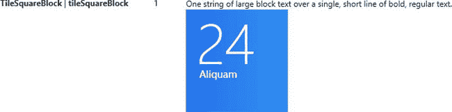

***图 5。**tileSquareBlock 模板的描述*

我不会显示单个提醒的详细信息，因为正如上一个演示所示，在一个狭窄的磁贴上没有空间，所以我调用带有摘要信息的`populateTemplateText`方法，如下所示:

`...
var squareXML = populateTemplateText(getTemplateContent (squareTemplate),
    **[textMessages.length, "Reminders"]**);
....`

模板中`text`元素的顺序与它们在模板中出现的顺序相匹配，这使得为模板设置内容非常简单。对于宽磁贴，我选择了`tileWideBlockAndText01`模板，你可以在[图 6](#fig_27_6) 中看到微软是如何描述的。

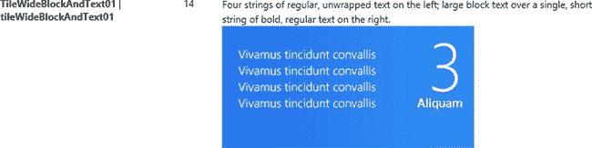

***图六。**tilewideblockandtext 01 模板的描述*

您可以在清单 9 中看到这个模板的 XML。同样，文本元素的顺序与它们的显示顺序一致，因此前四个`text`元素对应于平铺左侧的文本，后两个对应于右侧的文本。

*清单 9。宽图块模板的 XML*

`<tile>
    <visual>` `        <binding template="TileWideBlockAndText01">
            <text id="1"></text>
            <text id="2"></text>
            <text id="3"></text>
            <text id="4"></text>
            <text id="5"></text>
            <text id="6"></text>
         </binding>
    </visual>
</tile>`

我通过从数据数组中复制前四项并将两个新项推入数组来填充模板。在一个真实的项目中，你需要考虑数据项比`text`元素少，但是为了简单起见，我跳过了这个细节。下一步是将两个模板组合在一起，形成单个更新的基础。这需要对 XML 进行一些操作——我在 wide 模板的 XML 中找到了`binding`元素，并将其插入到 square 模板的 XML 中，产生了如[清单 10](#list_27_10) 所示的 XML 组合片段。

*清单 10。组合 XML 片段以更新不同的图块大小*

`<tile>
    <visual>
        <binding template="TileSquareBlock">
            <text id="1">5</text>
            <text id="2">Reminders</text>
        </binding>
        <binding template="TileWideBlockAndText01">
            <text id="1">Today: Pick up groceries</text>
            <text id="2">Tomorrow: Oil change</text>
            <text id="3">Wed: Book vacation</text>
            <text id="4">Thu: Renew insurance</text>
            <text id="5">5</text>
            <text id="6">Reminders</text>
        </binding>
    </visual>
</tile>`

将 XML 传递给 Windows 也是以同样的方式完成的，并且更新两种大小的图块。你可以在图 7 的[中看到结果。要查看实时磁贴，您需要重启示例应用程序，点击应用程序布局中的基本磁贴按钮，然后切换到`Start`屏幕。您可以通过选择图块并从开始屏幕应用程序栏中选择`Larger`或`Smaller`按钮来切换图块尺寸。](#fig_27_7)

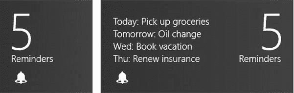

***图 7。**示例应用程序的方形和宽瓷砖更新*

为你的应用选择正确的模板至关重要。你需要找到一种向用户传达信息的方式，这种方式是有帮助的，并且(可选地)会鼓励他们打开和使用你的应用。

#### 使用图像模板

并非所有的应用程序都受益于在磁贴中只显示文本。为此，有显示图像或图像和文本混合的模板。还有 *peek* 模板，在两种显示之间交替，通常是所有图像，然后是文本或文本和图像的混合。[清单 11](#list_27_11) 显示了`tileSquarePeekImageAndText02`模板的 XML，它包含了`text`和`image`元素的混合。

*清单 11。混合文本和图像模板的 XML*

`<tile>
    <visual>
        <binding template="TileSquarePeekImageAndText02">
**            <image id="1" src=""/>**
**            <text id="1"></text>**
        </binding>
    </visual>
</tile>`

你可以看到我是如何构建一个小的帮助函数库来处理瓷砖的，我需要添加对处理`image`元素的支持。您可以在[清单 12](#list_27_12) 中看到我对`default.js`文件所做的更改。

*清单 12。添加对填充图像元素的支持*

`(function () {
    "use strict";

    var app = WinJS.Application;
    var activation = Windows.ApplicationModel.Activation;
    var wnote = Windows.UI.Notifications;
    WinJS.strictProcessing();

    var textMessages = ["Today: Pick up groceries", "Tomorrow: Oil change",
                        "Wed: Book vacation", "Thu: Renew insurance", "Sat: BBQ"];

**    var images = img/lily.png",img/astor.png",img/carnation.png",**
**       img/daffodil.png",img/snowdrop.png"];**

    function getTemplateContent(template) {
        return wnote.TileUpdateManager.getTemplateContent(template);
    }

**    function populateTemplate(xml, textValues, imgValues) {**
**        if (textValues) {**
**            var textNodes = xml.getElementsByTagName("text");**
**            var count = Math.min(textNodes.length, textValues.length);**
**            for (var i = 0; i < count; i++) {**
**                textNodes[i].innerText = textValues[i];**` `**            }**
**        }**
**        if (imgValues) {**
**            var imgNodes = xml.getElementsByTagName("image");**
**            var count = Math.min(imgNodes.length, imgValues.length);**
**            for (var i = 0; i < count; i++) {**
**                imgNodes[i].attributes.getNamedItem("src").innerText = imgValues[i]**
**            }**
**        }**
**        return xml;**
**    }**

    function updateTile(xml) {
        var notification = new wnote.TileNotification(xml);
        var updater = wnote.TileUpdateManager.createTileUpdaterForApplication();
        updater.update(notification);
    }

    function combineXML(firstXml, secondXML) {
        var wideBindingElement = secondXML.getElementsByTagName("binding")[0];
        var importedNode = firstXml.importNode(wideBindingElement, true);
        var squareVisualElement = firstXml.getElementsByTagName("visual")[0];
        squareVisualElement.appendChild(importedNode);
        return firstXml;
    }

    app.onactivated = function (args) {
        if (args.detail.kind === activation.ActivationKind.launch) {
            args.setPromise(WinJS.UI.processAll().then(function () {
                WinJS.Utilities.query("#container > button").listen("click",
                    function (e) {
                        switch (this.id) {
                            case "basicTile":
                                **var squareTemplate =**
**                                    wnote.TileTemplateType.tileSquarePeekImageAndText02;**
**                                var squareXML =**
**                                    populateTemplate(getTemplateContent(squareTemplate),**
**                                        [textMessages.length, "Reminders"], images);**
**                                var wideTemplate =**
**                                    wnote.TileTemplateType.tileWidePeekImageCollection02;**
**                                var wideData = textMessages.slice(0, 4)**
**                                wideData.unshift(textMessages.length + " Reminders");**
**                                var wideXml =**
**                                    populateTemplate(getTemplateContent(wideTemplate),**
**                                    wideData, images);**
**                                updateTile(combineXML(squareXML, wideXml));**
                                break;
                        }
                    });
            }));` `        }
    };
    app.start();
})();`

我已经用`populateTemplate`替换了`populateTemplateText`函数，它既处理`text`又处理`image`元素。为了演示图像的使用，我在 Visual Studio 项目的`images`文件夹中添加了一些文件。我使用了前几章的花卉图片，你可以在图 8[的解决方案浏览器中看到我添加的内容。您可以在`apress.com`从本书附带的源代码下载中获得这些图像，或者使用您自己的图像(在这种情况下，您需要更改`/js/default.js`文件中的文件名)。](#fig_27_8)

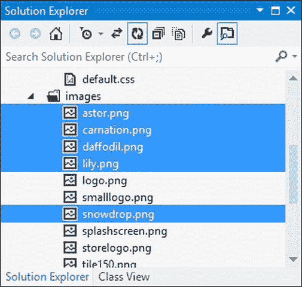

***图 8。**向 Visual Studio 项目添加图像文件*

 **提示**注意，我通过`attributes`属性设置了`image`元素中`src`属性的值，而不是使用由`XmlElement`对象定义的`setAttribute`方法。这是因为 Windows 8 的 DOM 支持不一致，调用`getElementsByNameTag`有时会返回一个`XmlElement`对象的集合，有时反而会返回一个`IXmlNode`对象的集合。`IXmlNode`对象没有定义`setAttribute`方法，所以我必须找到`src`属性并使用`innerText`属性设置其内容。

更新后，平铺最初显示图像，然后切换到带有动画的文本显示。几秒钟后，这个过程重复进行，如此继续下去。我觉得这种 live tile 有点烦人，但它可能正是你的应用程序所需要的。您可以在[图 9](#fig_27_9) 中看到图块的不同状态。请注意，我用于宽尺寸的模板有五个图像。我不需要调整图像的大小来显示它们；这是作为磁贴更新的一部分自动完成的。

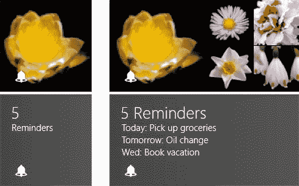

***图九。**使用包含图像的图块模板*

#### 清除瓷砖

有时您需要清除图块的内容，通常是因为显示的信息现在已经过时，并且没有新的或值得注意的内容来代替它。为了演示如何清除文件，我向`default.html`页面添加了一个新的按钮元素，如[清单 13](#list_27_13) 所示。

*清单 13。向布局添加一个按钮来清除磁贴*

`...
<body>
    

        <button id="basicTile">Basic Live Tile</button>
**        <button id="clearTile">Clear Tile</button>**
    

</body>
...`

清除磁贴很简单，如清单 14 所示，它详细说明了我对`default.js`文件所做的更改。

*清单 14。添加清除磁贴的支持*

`(function () {
    "use strict";

    var app = WinJS.Application;
    var activation = Windows.ApplicationModel.Activation;
    var wnote = Windows.UI.Notifications;
    WinJS.strictProcessing();

    var textMessages = ["Today: Pick up groceries", "Tomorrow: Oil change",` `                        "Wed: Book vacation", "Thu: Renew insurance", "Sat: BBQ"];
    var images = img/lily.png",img/astor.png",img/carnation.png",
       img/daffodil.png",img/snowdrop.png"];

    // ...*helper functions removed for brevity*...

**    function clearTile() {**
**        wnote.TileUpdateManager.createTileUpdaterForApplication().clear();**
**    }**

    app.onactivated = function (args) {
        if (args.detail.kind === activation.ActivationKind.launch) {
            args.setPromise(WinJS.UI.processAll().then(function () {
                WinJS.Utilities.query("#container > button").listen("click",
                    function (e) {
                        switch (this.id) {
                            case "basicTile":
                                // ...statements removed for brevity...
                                break;
**                            case "clearTile":**
**                                clearTile();**
**                                break;**
                        }
                    });
            }));
        }
    };
    app.start();
})();`

要清除图块，可以通过调用`TileUpdateManager.createTileUpdaterForApplication`方法创建一个`TileUpdater`对象，并对其调用`clear`方法。清除磁贴会将其返回到静态，显示清单中定义的应用程序图像。

### 使用徽章

徽章是显示在图块上的一个小指示器，可以作为我在前面几节中展示的完整实时图块更新的替代或补充。添加工卡所需的步骤类似于定期更新所需的步骤，因为您选择一个 XML 模板，填充内容并将其作为更新传递给 Windows。

徽章出现在应用程序磁贴的右下角，可以是 1 到 99 之间的数字，也可以是 Windows 定义的少数图标之一(称为*徽章* *字形*)。这是一种非常有限的表达信息的方式，但在某些情况下却很有用。我发现显示数字的能力很有用，但是还没有找到一个真正的项目，因为选择是如此有限(并且你不能定义你自己的)。

我在示例项目的`default.html`文件中添加了两个新的`button`元素，这样我就可以演示徽章的使用。新增内容如[清单 15](#list_27_15) 所示。

*清单 15。向 default.html 文件添加一个新的按钮元素*

`...
<body>
    

        <button id="basicTile">Basic Live Tile</button>
**        <button id="numericBadge">Numeric Badge</button>**
**        <button id="glyphBadge">Glyph Badge</button>**
        <button id="clearTile">Clear Tile</button>
    

</body>
...`

您可以看到我对`default.js`文件所做的添加，以支持[清单 16](#list_27_16) 中的徽章。我列出了这个文件的完整代码，因为我想强调徽章的技术和瓷砖的技术是多么相似。

*清单 16。向 default.js 文件添加对徽章的支持*

`(function () {
    "use strict";

    var app = WinJS.Application;
    var activation = Windows.ApplicationModel.Activation;
    var wnote = Windows.UI.Notifications;
    WinJS.strictProcessing();

    var textMessages = ["Today: Pick up groceries", "Tomorrow: Oil change",
                        "Wed: Book vacation", "Thu: Renew insurance", "Sat: BBQ"];

    var images = img/lily.png",img/astor.png",img/carnation.png",
       img/daffodil.png",img/snowdrop.png"];

    function getTemplateContent(template) {
        return wnote.TileUpdateManager.getTemplateContent(template);
    }

**    function getBadgeTemplateContent(template) {**
**        return wnote.BadgeUpdateManager.getTemplateContent(template);**
**    }**

    function populateTemplate(xml, textValues, imgValues) {
        if (textValues) {
            var textNodes = xml.getElementsByTagName("text");
            var count = Math.min(textNodes.length, textValues.length);
            for (var i = 0; i < count; i++) {
                textNodes[i].innerText = textValues[i];
            }
        }
        if (imgValues) {
            var imgNodes = xml.getElementsByTagName("image");
            var count = Math.min(imgNodes.length, imgValues.length);` `for (var i = 0; i < count; i++) {
                imgNodes[i].attributes.getNamedItem("src").innerText = imgValues[i]
            }
        }
        return xml;
    }

**    function populateBadgeTemplate(xml, value) {**
**        var badgeNode = xml.getElementsByTagName("badge")[0];**
**        badgeNode.attributes.getNamedItem("value").innerText = value;**
**        return xml;**
**    }**

    function updateTile(xml) {
        var notification = new wnote.TileNotification(xml);
        var updater = wnote.TileUpdateManager.createTileUpdaterForApplication();
        updater.update(notification);
    }

**    function updateBadge(xml) {**
**        var notification = new wnote.BadgeNotification(xml);**
**        var updater = wnote.BadgeUpdateManager.createBadgeUpdaterForApplication();**
**        updater.update(notification);**
**    }**

    function combineXML(firstXml, secondXML) {
        var wideBindingElement = secondXML.getElementsByTagName("binding")[0];
        var importedNode = firstXml.importNode(wideBindingElement, true);
        var squareVisualElement = firstXml.getElementsByTagName("visual")[0];
        squareVisualElement.appendChild(importedNode);
        return firstXml;
    }

    function clearTile() {
        wnote.TileUpdateManager.createTileUpdaterForApplication().clear();
**        wnote.BadgeUpdateManager.createBadgeUpdaterForApplication().clear();**
    }

    app.onactivated = function (args) {
        if (args.detail.kind === activation.ActivationKind.launch) {
            args.setPromise(WinJS.UI.processAll().then(function () {
                WinJS.Utilities.query("#container > button").listen("click",
                    function (e) {
                        switch (this.id) {
                            case "basicTile":
                                var squareTemplate =
                                    wnote.TileTemplateType.tileSquarePeekImageAndText02;
                                var squareXML =
                                    populateTemplate(getTemplateContent(squareTemplate),
                                        [textMessages.length, "Reminders"], images);
                                var wideTemplate =` `                                    wnote.TileTemplateType.tileWidePeekImageCollection02;
                                var wideData = textMessages.slice(0, 4)
                                wideData.unshift(textMessages.length + " Reminders");
                                var wideXml =
                                    populateTemplate(getTemplateContent(wideTemplate),
                                    wideData, images);
                                updateTile(combineXML(squareXML, wideXml));
                                break;
                            case "clearTile":
                                clearTile();
                                break;
**                            case "numericBadge":**
**                                var template = getBadgeTemplateContent(**
**                                    wnote.BadgeTemplateType.badgeNumber);**
**                                var badgeXml = populateBadgeTemplate(template,**
**                                    textMessages.length);**
**                                updateBadge(badgeXml);**
**                                break;**
**                            case "glyphBadge":**
**                                var template = getBadgeTemplateContent(**
**                                    wnote.BadgeTemplateType.badgeGlyph);**
**                                var badgeXml = populateBadgeTemplate(template, "alert");**
**                                updateBadge(badgeXml);**
**                                break;**
                        }
                    });
            }));
        }
    };
    app.start();
})();`

徽章的所有对象都在`Windows.UI.Notifications`名称空间中，旁边是用于图块的对象。通过将一个值从`BadgeTemplateType`枚举传递给`BadgeUpdateManager.getTemplateContent`方法，可以获得想要使用的模板。我已经在[表 2](#tab_27_2) 中展示了两种不同的模板类型。

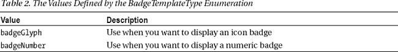

两个模板的内容是相同的，尽管使用正确的模板很重要，以防它们在未来的版本中发生变化。您可以在清单 17 的[中看到由`getTemplateContent`方法返回的 XML。](#list_27_17)

*清单 17。徽章模板的 XML 内容*

`<badge value=""/>`

这是一个非常简单的模板。如果你想显示一个数字徽章，那么你设置`value`为你想显示的数字，在 1 到 99 之间。如果您设置的值超出了此范围，该值将显示为`99+`(数字 99 后跟一个加号)。

如果您想要显示一个字形徽章，那么您可以将`value`属性设置为您想要的字形的名称。在这个例子中，我使用了`alert`值。没有枚举这些值的 JavaScript 对象，但是您可以在`[http://msdn.microsoft.com/en-us/library/windows/apps/hh761458.aspx](http://msdn.microsoft.com/en-us/library/windows/apps/hh761458.aspx)`看到它们的列表。共有 11 种字形，它们涵盖了应用程序可能想要传达给用户的一些常见信息。

一旦您填充了模板，您就创建了一个通知并将其传递给一个徽章更新程序，如示例中的`updateBadge`函数所示。使用徽章时，您不必担心不同的图块大小，一次徽章更新会影响方形和宽图块。在图 10 的[中，您可以看到应用于示例应用程序磁贴的数字和字形徽章。我已经展示了应用于静态和动态瓷砖的徽章。](#fig_27_10)

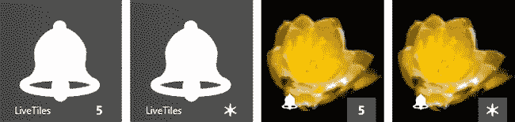

***图 10。**将徽章应用于静态和动态应用程序磁贴*

最后，清除徽章更新需要调用徽章更新程序上的`clear`方法。您可以在示例中的`clearTile`函数中看到一个演示，它现在删除了动态磁贴更新和徽章，将磁贴返回到其初始静态。

### 高级磁贴功能

我在前面几节中展示的磁贴技术将满足大多数应用程序的需求。对于更特殊的情况，您可以使用一些高级功能来更好地控制您的应用程序切片。在接下来的小节中，我将向您展示如何使用这些特性。为了演示这些特性，我创建了一个名为`AdvancedTiles`的新 Visual Studio 项目。`default.html`中的初始布局如清单 18 中的[所示，由三个简单的`button`元素组成。](#list_27_18)

*清单 18。default.html 文件的初始内容*

`<!DOCTYPE html>
<html>
<head>
    <meta charset="utf-8" />
    <title>AdvancedTiles</title>

    <!-- WinJS references -->
    <link href="//Microsoft.WinJS.1.0/css/ui-dark.css" rel="stylesheet" />
    
    ` `    <!-- AdvancedTiles references -->
    <link href="/css/default.css" rel="stylesheet" />
**    **
    
</head>
<body>
    

**        <button id="multiple">Multiple Notifications</button>**
**        <button id="update">Update Notification</button>**
**        <button id="clear">Clear Tile</button>**
    

</body>
</html>`

`button`元素是为本章这一部分的第一个例子设置的。您可以在[清单 19](#list_27_19) 的文件中看到这个项目的`/css/default.css`的内容。

*清单 19。default.css 文件的内容*

`body { display: -ms-flexbox; -ms-flex-direction: row; -ms-flex-align: stretch;
    -ms-flex-pack: center;}
#container {display: -ms-flexbox; -ms-flex-direction: column; -ms-flex-align: stretch;
    -ms-flex-pack: center;}
#container button {font-size: 30pt; width: 500px; margin: 10px;}`

你可以在[图 11](#fig_27_11) 中看到这个 app 的初始布局。我将在本章的后面添加额外的按钮。

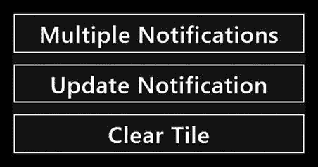

***图 11。**示例 app 的布局*

我已经将本章前面的 tile helper 函数放到一个名为`/js/tiles.js`的文件中，并通过`Tiles`名称空间使它们可用。您可以在[清单 20](#list_27_20) 中看到 tiles.js 文件的内容。

*清单 20。/js/tiles.js 文件的内容*

`(function () {

    var wnote = Windows.UI.Notifications;

    WinJS.Namespace.define("Tiles", {` `        getTemplateContent: function (template) {
            return wnote.TileUpdateManager.getTemplateContent(template);
        },
        getBadgeTemplateContent: function (template) {
            return wnote.BadgeUpdateManager.getTemplateContent(template);
        },
        populateTemplate: function (xml, textValues, imgValues) {
            if (textValues) {
                var textNodes = xml.getElementsByTagName("text");
                var count = Math.min(textNodes.length, textValues.length);
                for (var i = 0; i < count; i++) {
                    textNodes[i].innerText = textValues[i];
                }
            }
            if (imgValues) {
                var imgNodes = xml.getElementsByTagName("image");
                var count = Math.min(imgNodes.length, imgValues.length);
                for (var i = 0; i < count; i++) {
                    imgNodes[i].attributes.getNamedItem("src").innerText = imgValues[i]
                }
            }
            return xml;
        },
        populateBadgeTemplate: function (xml, value) {
            var badgeNode = xml.getElementsByTagName("badge")[0];
            badgeNode.attributes.getNamedItem("value").innerText = value;
            return xml;
        },
        updateTile: function (xml) {
            var notification = new wnote.TileNotification(xml);
            var updater = wnote.TileUpdateManager.createTileUpdaterForApplication();
            updater.update(notification);
        },
        updateBadge: function (xml) {
            var notification = new wnote.BadgeNotification(xml);
            var updater = wnote.BadgeUpdateManager.createBadgeUpdaterForApplication();
            updater.update(notification);
        },
        combineXML: function (firstXml, secondXML) {
            var wideBindingElement = secondXML.getElementsByTagName("binding")[0];
            var importedNode = firstXml.importNode(wideBindingElement, true);
            var squareVisualElement = firstXml.getElementsByTagName("visual")[0];
            squareVisualElement.appendChild(importedNode);
            return firstXml;
        },
        clearTile: function () {
            wnote.TileUpdateManager.createTileUpdaterForApplication().clear();
            wnote.BadgeUpdateManager.createBadgeUpdaterForApplication().clear();
        }
    });
})();`

当我想在前面的例子基础上构建并列出不同之处时，我将调用这些函数。您可以在[清单 21](#list_27_21) 中看到`/js/default.js`文件的初始内容。

*清单 21。default.js 文件的初始内容为*

`(function () {
    "use strict";

    var app = WinJS.Application;
    var activation = Windows.ApplicationModel.Activation;
    var wnote = Windows.UI.Notifications;
    WinJS.strictProcessing();

    var dataObjects = [
        { name: "Projects", quant: 6, key: "projects" },
        { name: "Clients", quant: 2, key: "clients" },
        { name: "Milestones", quant: 4, key: "milestones" }
    ];

    app.onactivated = function (args) {
        if (args.detail.kind === activation.ActivationKind.launch) {
            args.setPromise(WinJS.UI.processAll().then(function () {

                WinJS.Utilities.query("#container > button").listen("click",
                    function (e) {
                        switch (this.id) {
                            case "clear":
                                Tiles.clearTile();
                                break;
                        }
                    });
            }));
        }
    };
    app.start();
})();`

`Clear Tile`按钮已经连接好，并调用了`Tile.clearTile`方法来将磁贴重置为静态，并移除任何徽章。在接下来的部分中，我将添加其他按钮的代码。

最后，我在项目中添加了我在之前的示例应用程序中使用的相同的图块图像，并更新了应用程序清单，如[图 12](#fig_27_12) 所示。

***图 12。**设置清单图像文件*

#### 使用通知队列

我要描述的第一个高级特性是*通知队列*，它允许您使用磁贴轮流显示多达五个更新。当你的应用程序需要向用户显示一系列相关的消息或图像时，这可能会很有用——尽管，由于单个消息会显示大约 5 秒钟，你不能指望用户在访问开始屏幕时看到队列中的所有消息。这意味着你应该仔细选择你要展示的内容，这样每条信息都是独立的、有意义的，并且是有帮助的或有吸引力的。在示例应用程序中，我定义了一些可能总结用户项目承诺的数据:

`...
var dataObjects = [
    { name: "Projects", quant: 6, key: "projects" },
    { name: "Clients", quant: 2, key: "clients" },
    { name: "Milestones", quant: 4, key: "milestones" }];
...`

每个数据对象都有三个属性:名称、数量和键。前两个是将向用户显示的数据项，`key`属性将让我区分队列中的消息——当您想要刷新通知时，这变得很重要。您可以在[清单 22](#list_27_22) 中看到我对`default.js`文件所做的更改，以使用通知队列。

*清单 22。使用通知队列*

`(function () {
    "use strict";

    var app = WinJS.Application;
    var activation = Windows.ApplicationModel.Activation;
    var wnote = Windows.UI.Notifications;
    WinJS.strictProcessing();

    var dataObjects = [
        { name: "Projects", quant: 6, key: "projects" },
        { name: "Clients", quant: 2, key: "clients" },
        { name: "Milestones", quant: 4, key: "milestones" }];

**    function updateTileQueue(xml, tag) {**` `**        var notification = new wnote.TileNotification(xml);**
**        notification.tag = tag;**
**        var updater = wnote.TileUpdateManager.createTileUpdaterForApplication();**
**        updater.update(notification);**
**    }**

    app.onactivated = function (args) {
        if (args.detail.kind === activation.ActivationKind.launch) {
            args.setPromise(WinJS.UI.processAll().then(function () {

**                wnote.TileUpdateManager.createTileUpdaterForApplication()**
**                        .enableNotificationQueue(true);**

                WinJS.Utilities.query("#container > button").listen("click",
                    function (e) {
                        switch (this.id) {
                            case "clear":
                                Tiles.clearTile();
                                break;
                            case "multiple":
**                                dataObjects.forEach(function (item) {**
**                                    var xml = Tiles.getTemplateContent(**
**                                        wnote.TileTemplateType.tileSquareBlock);**
**                                    Tiles.populateTemplate(xml, [item.quant, item.name]);**
**                                    updateTileQueue(xml, item.key);**
**                                });**
                                break;
                        }
                    });
            }));
        }
    };
    app.start();
})();`

您必须显式地启用通知队列，这是通过创建一个`TileUpdater`对象并调用`enableNotificationQueue`方法，传递`true`作为方法参数来完成的。你只需要这样做一次，这就是为什么我在应用程序的初始化阶段执行这项任务。

当点击`Multiple Notifications`按钮时，我调用`forEach`方法来枚举数据对象。对于每个对象，我获取并填充模板 XML，就像我在本章前面所做的那样。(我将只为方块大小创建通知，但是组合模板的过程与本章的第一部分相同)。

 **提示**通知队列最多可容纳五个通知；如果您添加的项目超过五个，最新添加的项目将会推出旧的项目。

当我来更新磁贴时，差异就出现了。我使用填充的 XML 创建了`TileNotification`对象，然后给`tag`属性赋值。所有这些都发生在`updateTileQueue`函数中，它允许系统区分它必须显示的不同通知。您将很快了解到，您可以通过重用标记值来替换单个通知。结果是，我将三个通知放入队列，磁贴将在它们之间旋转，大约每五秒钟从一个通知切换到另一个通知。您可以在[图 13](#fig_27_13) 中看到显示的三个通知。

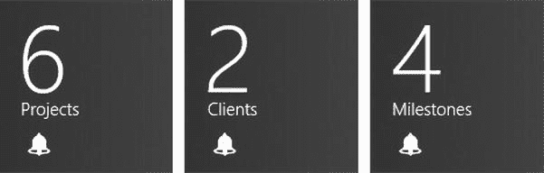

***图十三。**在一个磁贴中显示多个通知*

 **注意**同样，您需要在本地机器上运行这个示例应用程序，因为 Visual Studio 模拟器不支持动态磁贴或通知。

我真的无法通过显示单个通知来捕捉这种工作方式，我建议您运行示例应用程序并查看开始屏幕，看看通知队列中的项目是如何显示的。

#### 更新通知

您可以通过发出重用标记名的更新来更新通知。例如，如果我接受了一个新客户，那么我希望更新客户通知，以正确反映额外的业务。[清单 23](#list_27_23) 展示了如何响应被点击的`Update Notification`按钮。

*清单 23。通过重用标签*更新通知

`...
switch (this.id) {
    case "clear":
        Tiles.clearTile();
        break;
    case "multiple":
        dataObjects.forEach(function (item) {
            var xml = Tiles.getTemplateContent(
                wnote.TileTemplateType.tileSquareBlock);
            Tiles.populateTemplate(xml, [item.quant, item.name]);
            updateTileQueue(xml, item.key);
        });
        break;
**    case "update":**
**        var dob = dataObjects[1];**
**        dob.quant++;**
**        var xml = Tiles.getTemplateContent(**` `**            wnote.TileTemplateType.tileSquareBlock);**
**        Tiles.populateTemplate(xml, [dob.quant, dob.name]);**
**        updateTileQueue(xml, dob.key);**
**        break;**
}
...`

我增加数值属性，并通过`updateTileQueue`函数发布一个更新。务必注意使用正确的`tag`值。如果重用标签，更新将替换现有项目，保持队列的顺序。如果您使用的标记值不在队列中，Windows 会将其视为新的通知，并将其附加到队列的末尾，这意味着您可能会得到两个显示冲突数据的通知。

#### 调度通知

您可以安排通知出现在磁贴上的时间，以及从队列中删除通知的时间。未来安排通知的能力对于确保在应用程序可能被暂停或被终止时向用户呈现不是立即有用的信息是有用的。然而，当这种情况发生时，你不能指望用户查看你的应用程序磁贴，所以对于重要信息，你应该使用更直接的方法，比如 *toast 通知*，我在[第 28 章](28.html#ch28)中描述了这一点。

计划从队列中删除通知的时间点的能力更有用，如果用户有一段时间没有运行您的应用程序，您可以避免向用户显示过时的数据。我在`default.html`文件中添加了一个新的`button`来发送预定的通知，如[清单 24](#list_27_24) 所示。

*清单 24。添加一个按钮元素来支持预定通知*

`...
<body>
    

        <button id="multiple">Multiple Notifications</button>
        <button id="update">Update Notification</button>
**        <button id="schedule">Schedule Notification</button>**
        <button id="clear">Clear Tile</button>
    

</body>
...`

[清单 25](#list_27_25) 显示了我对`default.js`文件所做的更改，以响应这个`button`并安排一个通知。

*清单 25。安排图块通知*

`(function () {
    "use strict";

    var app = WinJS.Application;
    var activation = Windows.ApplicationModel.Activation;
    var wnote = Windows.UI.Notifications;
    WinJS.strictProcessing();

    var dataObjects = [` `{ name: "Projects", quant: 6, key: "projects" },
        { name: "Clients", quant: 2, key: "clients" },
        { name: "Milestones", quant: 4, key: "milestones" }];

    function updateTileQueue(xml, tag) {
        var notification = new wnote.TileNotification(xml);
        notification.tag = tag;
        var updater = wnote.TileUpdateManager.createTileUpdaterForApplication();
        updater.update(notification);
    }

**    function scheduleTileQueue(xml, tag, start, end) {**
**        var notification = new wnote.ScheduledTileNotification(xml, start);**
**        notification.tag = tag;**
**        notification.expirationTime = end;**
**        var updater = wnote.TileUpdateManager.createTileUpdaterForApplication();**
**        updater.addToSchedule(notification);**
**    }**

    app.onactivated = function (args) {
        if (args.detail.kind === activation.ActivationKind.launch) {
            args.setPromise(WinJS.UI.processAll().then(function () {

                wnote.TileUpdateManager.createTileUpdaterForApplication()
                        .enableNotificationQueue(true);

                WinJS.Utilities.query("#container > button").listen("click",
                    function (e) {
                        switch (this.id) {
                            case "clear":
                                Tiles.clearTile();
                                break;
                            case "multiple":
                                // *...statements removed for brevity...*
                                break;
                            case "update":
                                // *...statements removed for brevity...*
                                break;
**                            case "schedule":**
**                                var xml = Tiles.getTemplateContent(**
**                                    wnote.TileTemplateType.tileSquareBlock);**
**                                Tiles.populateTemplate(xml, [10, "Days Left"]);**
**                                var start = new Date(new Date().getTime() + (20 * 1000));**
**                                var end = new Date(start.getTime() + (30 * 1000));**
**                                scheduleTileQueue(xml, "daysleft", start, end);**
**                                break;**
                        }
                    });
            }));
        }
    };` `    app.start();
})();`

创建通知与其他技术完全相同:您像往常一样获取并填充 XML 内容。当您将更新应用到 tile 时，差异就出现了，这是我通过清单中所示的`scheduleTileQueue`函数完成的。

这项技术的关键是`ScheduledTileNotification`对象，通过将填充的 XML 和 tile 应该开始显示更新的时间传递给构造函数来创建这个对象。时间被表示为一个`Date`对象，在这个例子中，我已经指定更新应该在未来 20 秒后开始显示(对于一个真正的应用程序来说，这是一个非常短的时间，但是对于一个例子来说是理想的，因为你在点击按钮后不久就可以看到变化)。`ScheduledTileNotification`对象定义了一组用于配置通知的属性，如[表 3](#tab_27_3) 所示。

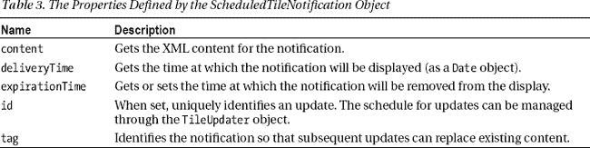

您可以从清单中看到，我已经将到期时间设置为首次显示通知后的 30 秒。`ScheduledTileNotification`对象的时间值是绝对的，这意味着您的`Date`对象应该用日、月和年来定义(而不是仅仅用一段时间来表示)。如果您启动示例应用程序，单击`Schedule Notification`按钮，并切换到开始屏幕，您可以看到这些更改的效果。

您看到的确切效果将取决于通知开始显示时磁贴的状态。如果队列中已经有通知，则计划的通知将作为定期轮换的一部分显示。到达到期时间后，计划通知将从队列中删除，仅显示原始通知。

如果图块是静态的(即队列中没有通知)，情况会略有不同。通知被显示为磁贴的唯一内容，并且当到期时间到达时，磁贴重置为其静态。您可以在[图 14](#fig_27_14) 中看到该示例对通知的影响。

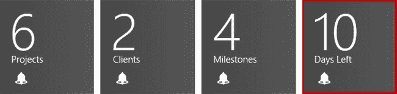

***图十四。**向磁贴添加预定通知*

#### 确定通知是否启用

在本章中，我将向您展示的最后一项技术是确定应用程序磁贴是否会显示实时更新。应用程序磁贴的设置由`Windows.UI.Notifications.NotificationSetting`对象中的值表示，我已经在[表 4](#tab_27_4) 中列出了这些值。

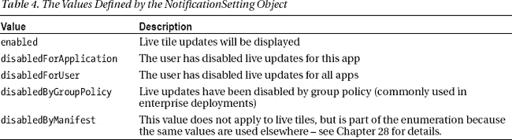

我已经在`default.html`文件中添加了一个最终的`button`来确定应用程序的磁贴设置，如[清单 26](#list_27_26) 所示。

*清单 26。添加一个按钮来检查实时磁贴更新的状态*

`...
<body>
    

        <button id="multiple">Multiple Notifications</button>
        <button id="update">Update Notification</button>
        <button id="schedule">Schedule Notification</button>
**        <button id="check">Check Status</button>**
        <button id="clear">Clear Tile</button>
    

</body>
...`

[清单 27](#list_27_27) 显示了我在`default.js`文件中添加的内容，以确定状态。为了简单起见，我将结果写入 Visual Studio `JavaScript Console`窗口，这意味着您需要使用调试器启动应用程序来查看消息。

*清单 27。检查实时更新是否对用户可见*

`(function () {
    "use strict";

    var app = WinJS.Application;
    var activation = Windows.ApplicationModel.Activation;
    var wnote = Windows.UI.Notifications;
    WinJS.strictProcessing();

    var dataObjects = [
        { name: "Projects", quant: 6, key: "projects" },
        { name: "Clients", quant: 2, key: "clients" },` `        { name: "Milestones", quant: 4, key: "milestones" }];

    // *...functions removed for brevity...*

**    function getValueFromEnum(val) {**
**        for (var prop in wnote.NotificationSetting) {**
**            if (wnote.NotificationSetting[prop] == val) {**
**                return prop;**
**            }**
**        }**
**    }**

    app.onactivated = function (args) {
        if (args.detail.kind === activation.ActivationKind.launch) {
            args.setPromise(WinJS.UI.processAll().then(function () {

                wnote.TileUpdateManager.createTileUpdaterForApplication()
                        .enableNotificationQueue(true);

                WinJS.Utilities.query("#container > button").listen("click",
                    function (e) {
                        switch (this.id) {
                            case "clear":
                                Tiles.clearTile();
                                break;
                            case "multiple":
                                // *...statements removed for brevity...*
                                break;
                            case "update":
                                // *...statements removed for brevity...*
                                break;
                            case "schedule":
                                // *...statements removed for brevity...*
                                break;
**                            case "check":**
**                                var setting =**
**                                    wnote.TileUpdateManager.**
**                                    createTileUpdaterForApplication().setting;**
**                                console.log("Live tile updates are " +**
**                                    getValueFromEnum(setting));**
                                break;
                        }
                    });
            }));
        }
    };
    app.start();
})();`

您可以通过创建一个`TileUpdater`对象(通过调用`TileUpdateManager.createTileUpdaterForApplication`方法)并读取`setting` 属性的值来查看这些值中的哪一个适用。您可以通过选择应用程序磁贴并单击应用程序栏中的按钮来更改设置。两个选项如图[图 15](#fig_27_15) 所示。他们将在`enabled`和`disabledForApplication`设置之间切换。

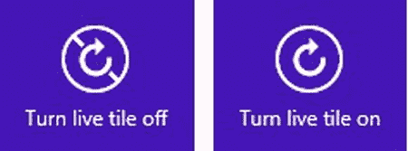

***图 15。**启用和禁用单个应用的磁贴通知*

如果没有为切片启用通知，则生成通知不会导致任何问题-通知会被直接丢弃。这意味着，如果您想提醒用户图块通知可用，只需检查设置值。对设置值的重要性保持敏感——如果用户只禁用了你的应用程序的通知(`disabledForApplication`值),那么你的通知可能很烦人或者没有为用户提供价值。如果用户已经禁用了所有应用程序的动态磁贴(值为`disabledForUser`)，那么他们不太可能为你的应用程序破例。如果你遇到了`disabledByGroupPolicy`值，那就继续——提醒用户通知可用是没有意义的，因为他们不太可能覆盖设置。这在大型企业部署中很常见，在这些部署中，以安全和易于管理的名义禁用了许多系统功能。

### 总结

如果使用得当，动态磁贴可以为应用的核心功能增添强大的功能，让用户不必启动应用，或者吸引用户来启动应用。在本章中，我向您展示了如何使用 live app 磁贴，从选择和填充单个模板的基本技巧开始，然后继续演示如何组合多个模板以及如何使用徽章。

在很大程度上，这些基本技术将是您所需要的，但是我也向您展示了一些用于要求更高的应用程序的高级特性。其中包括使用通知队列显示消息的循环序列，更新队列中各个通知的内容，以及控制通知的计划时间。我已经向你展示了如何判断是否显示实时更新，从而结束了这一章。将这项技术放在最后可能有点奇怪，但在大多数情况下并不需要，因为如果动态磁贴被禁用，通知就会被丢弃。磁贴并不是 Windows 应用程序唯一可用的通知机制——在下一章，当我向您展示如何使用 *toast* 以及介绍系统启动器功能时，您将会了解到这一点。