## 第二十九章

## 使用传感器

Windows 8 支持一个传感器框架，您可以使用它来获取有关设备运行条件的信息。在本章中，我描述了最常遇到的传感器，从位置传感器开始，通过它您可以确定设备正在世界上的哪个地方使用。

即使设备中没有特殊的位置感应硬件，如 GPS 接收器，Windows 也会尝试确定设备位置。我在本章中描述的其他传感器确实需要特殊的硬件，如光和加速度传感器，尽管这种设备越来越常见，特别是在笔记本电脑和平板电脑中。

在本章中，我将向您展示如何读取来自不同传感器的数据，但您如何使用这些数据为用户带来好处则取决于具体的应用。因此，示例通常只是将传感器数据显示为文本。

当你阅读这一章的时候，你会遇到一些地方，我已经注意到，在我的测试硬件中，某些特性对传感器不起作用。这并不罕见，因为传感器及其设备驱动程序的质量有很大的可变性，因此需要仔细测试。

使用传感器时，注意不要根据你收到的数据对用户在做什么做出大胆的推断。例如，当使用光线水平传感器时，不要仅仅因为光线水平低就认为现在是夜间——这可能是因为设备被放在包中，或者只是因为传感器被遮挡。始终允许用户覆盖基于传感器数据对应用行为所做的更改，并在可能的情况下，在对当前条件做出假设之前，尝试从不同来源收集数据——例如，通过将光线水平与当前时间和位置相结合，您可以避免假设工作日是晚上。[表 1](#tab_29_1) 提供了本章的总结。

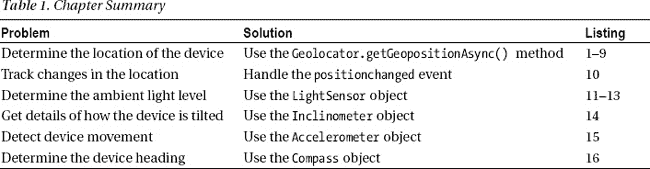

### 创建示例应用

我将创建一个示例应用，它将允许我演示我在本章中介绍的每个传感器。我将按照我在本书其他地方使用的模式来实现这一点，即创建一个使用导航条导航到内容页面的应用，每个页面包含一个主要功能。我创建了一个名为`Sensors`的新 Visual Studio 项目，您可以在[清单 1](#list_29_1) 中看到`default.html`文件的内容。这个文件包含目标元素，我将在其中加载内容页面和导航栏，以及每个页面的命令。

*清单 1。default.html 文件的内容*

`<!DOCTYPE html>
<html>
<head>
    <meta charset="utf-8" />
    <title>Sensors</title>
    <link href="//Microsoft.WinJS.1.0/css/ui-dark.css" rel="stylesheet" />
    
    
    <link href="/css/default.css" rel="stylesheet" />
    
</head>
<body>
    

        <h1 class="message">Select a page from the NavBar</h1>
    

    

        <button data-win-control="WinJS.UI.AppBarCommand"
            data-win-options="{id:'geolocation', label:'Location',
                icon:'\u0031', section:'selection'}">

        <button data-win-control="WinJS.UI.AppBarCommand"
            data-win-options="{id:'light', label:'Light',
                icon:'\u0032', section:'selection'}">

        <button data-win-control="WinJS.UI.AppBarCommand"
            data-win-options="{id:'tilt', label:'Tilt',
                icon:'\u0033', section:'selection'}">

        <button data-win-control="WinJS.UI.AppBarCommand"
            data-win-options="{id:'acceleration', label:'Acceleration',
                icon:'\u0034', section:'selection'}">

        <button data-win-control="WinJS.UI.AppBarCommand"
            data-win-options="{id:'direction', label:'Direction',
                icon:'\u0035', section:'selection'}">

    

</body>
</html>`

HTML 文件包含了导航我在本章中使用的所有内容页面的按钮，但是我不会在每一节开始之前添加这些文件。您可以在清单 2 的[示例中看到我定义的管理元素布局的样式，它显示了`/css/default.css`文件的内容。](#list_29_2)

*清单 2。/css/default.css 文件的内容*

`body {display: -ms-flexbox; -ms-flex-direction: column;
    -ms-flex-align: stretch; -ms-flex-pack: center;    }
#contentTarget {display: -ms-flexbox; -ms-flex-direction: row;
    -ms-flex-align: stretch; -ms-flex-pack: center;}
.container { border: medium solid white; margin: 10px; padding: 10px;}
.containerHeader {text-align: center;}

#buttonsContainer button {font-size: 20pt; margin: 20pt; display: block; width: 80%;}

*.imgElem {height: 500px;}
*.imgTitle { color: white; background-color: black;font-size: 30pt; padding-left: 10px;}

.messageItem {display: block; font-size: 20pt; width: 100%; margin-top: 10px;}
#messageContainer {width: 60%;}
.messageList {height: 80vh;}

.label { margin: 20px; width: 600px;}
.label span { display: inline-block; width: 250px; text-align: right;}
h1.warning { display: none; text-align: center;}`

最后，我已经定义了[清单 3](#list_29_3) 中的代码，它显示了`/js/default.js`文件的内容。在这一章中，我关注的是设备，所以我不担心管理不同的生命周期事件——因此，JavaScript 代码执行一个非常基本的应用初始化来设置内容页面的导航，我将把它添加到 Visual Studio 项目的`pages`文件夹中。

*清单 3。/js/default.js 文件的内容*

`(function () {

    var app = WinJS.Application;
    var activation = Windows.ApplicationModel.Activation;

    WinJS.Navigation.addEventListener("navigating", function (e) {
        WinJS.UI.Animation.exitPage(contentTarget.children).then(function () {
            WinJS.Utilities.empty(contentTarget);
            WinJS.UI.Pages.render(e.detail.location,
                contentTarget, WinJS.Navigation.state)
                .then(function () {
                    return WinJS.UI.Animation.enterPage(contentTarget.children)
                });
        });
    });

    app.onactivated = function (args) {
        if (args.detail.previousExecutionState
                != activation.ApplicationExecutionState.suspended) {` `            args.setPromise(WinJS.UI.processAll().then(function () {
                navbar.addEventListener("click", function (e) {
                    var navTarget = "pages/" + e.target.winControl.id + ".html";
                    WinJS.Navigation.navigate(navTarget);
                    navbar.winControl.hide();
                });
            }));
        }
    };

    app.start();
})();`

如果您启动应用并显示 NavBar，您将看到如图[图 1](#fig_29_1) 所示的布局——尽管单击 NavBar 命令栏会产生错误，因为我还没有添加激活时加载的文件。

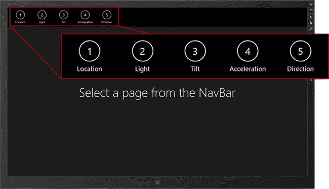

***图 1。**示例 app 的基本布局*

 **注意**为了让这个例子尽可能简单，我编写了每个内容页面，就好像它是唯一将被显示的页面一样。这意味着在显示来自不同传感器的数据之前，您必须重新启动示例应用。

### 使用地理定位

地理定位对于应用开发来说是一个越来越重要的功能，因为它为根据用户所处的位置定制用户体验提供了基础。许多 Windows 8 设备将配备 GPS 硬件，但 Windows 也可以尝试通过结合从一系列替代来源获取的信息来确定没有 GPS 的设备的当前位置——例如，包括设备 IP 地址和附近无线网络的名称——这种技术可能会惊人地准确。在接下来的小节中，我将向您展示如何使用地理定位特性，以及如何使用 Visual Studio simulator 测试地理定位。

 **注意**地理定位是一个功能的例子，您可以使用特定于 Windows 的 API 或通过 HTML5 API 来访问。我发现 Windows APIs 倾向于提供与 Windows 设备的功能更一致的细粒度功能，这是意料之中的，因为 HTML5 APIs 的用途非常广泛。我将在本章中使用 Windows 地理定位 API。

#### 准备地理定位示例

为了演示地理定位特性，我在 Visual Studio 项目的`pages`文件夹中添加了一个名为`geolocation.html`的文件。您可以在[清单 4](#list_29_4) 中看到这个文件的内容。

*清单 4。geolocation.html 文件的内容*

`<!DOCTYPE html>
<html>
<head>
    <title></title>
    
</head>
<body>
    

        

    

    

        <button>Get Location</button>
        <button id="start">Start Tracking</button>
        <button id="stop" disabled>Stop Tracking</button>
    

    

        <h1 class="containerHeader">Messages</h1>
        

        

        

    

</body>
</html>`

该文件定义了一个布局，在左侧面板中有三个按钮，可以激活不同的地理定位功能，在右侧有一个大面板，可以显示更新消息。我已经将这个例子的 JavaScript 放到了一个名为`/pages/geolocation.js`的单独文件中，您可以在[清单 5](#list_29_5) 中看到这个文件。目前，该文件包含一个处理程序函数，用于在点击`button`元素时进行监听，以及在收到事件时执行的占位符函数——我将在接下来的小节中填充这些函数，向您展示地理定位功能的不同方面。我还添加了代码，让我可以轻松地在应用布局中显示消息。

*清单 5。/pages/geolocation.js 文件的初始内容*

`(function () {
    var geo = Windows.Devices.Geolocation;

    var messages = new WinJS.Binding.List();
    function writeMessage(msg) {
        messages.push({ message: msg });
    }

    function getFromCode(src, code) {
        for (var propName in src) {
            if (code == src[propName]) { return propName; }
        }
    }

    WinJS.UI.Pages.define("/pages/geolocation.html", {
        ready: function () {
            messageList.winControl.itemDataSource = messages.dataSource;

            WinJS.Utilities.query("#buttonsContainer button").listen("click",
                function (e) {
                switch (e.target.innerText) {
                    case "Get Location":
                        getLocation();
                        break;
                    case "Start Tracking":
                        startTracking();
                        break;

                    case "Stop Tracking":
                        stopTracking();
                        break;
                }
            });
        }
    });

    function getLocation() {
        // ...code will be added here...
    }

    function startTracking() {
        // ...code will be added here...
    }

    function stopTracking() {` `        // ...code will be added here...
    }
})();`

##### 在清单中启用位置访问

必须在清单中启用对设备位置的访问，方法是打开`package.appxmanifest`文件，导航到`Capabilities`部分，并选中`Location`选项，如图[图 2](#fig_29_2) 所示。

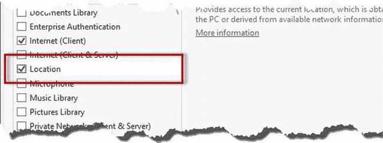

***图二。**启用清单中的位置访问*

 **警告**如果您试图在未启用清单中的`Location`功能的情况下访问设备位置，将会产生错误。

#### 获取位置快照

获取设备当前位置最简单的方法就是拍快照，也就是说你向系统询问当前位置，系统提供，然后你就完事了。另一种方法是跟踪当前位置，这意味着当位置发生变化时，系统会为您的应用提供更新。我将在本章的后面向您展示位置跟踪是如何工作的，但是拍摄位置快照相对简单，让我介绍支持地理定位特性的对象，这些对象在`Windows.Devices.Geolocation`名称空间中定义。

 **注意**除非我另有说明，否则我在本节中引用的所有新对象都可以在`Windows.Devices.Geolocation`名称空间中找到，在示例中我将它别名化为变量`geo`。

为了添加对拍摄位置快照的支持，我在`/pages/geolocation.js`文件中实现了`getLocation`函数，如[清单 6](#list_29_6) 所示。

*清单 6。实现 getLocation 函数来拍摄位置快照*

`(function () {
    var geo = Windows.Devices.Geolocation;
**    var geoloc;**

    var messages = new WinJS.Binding.List();
    function writeMessage(msg) {
        messages.push({ message: msg });
    }

**    function getStatus(code) {**
**        for (var propName in geo.PositionStatus) {**
**            if (code == geo.PositionStatus[propName]) { return propName; }**
**        }**
**    }**

    WinJS.UI.Pages.define("/pages/geolocation.html", {
        ready: function () {
            messageList.winControl.itemDataSource = messages.dataSource;

            WinJS.Utilities.query("#buttonsContainer button").listen("click",
                function (e) {
                switch (e.target.innerText) {
                    case "Get Location":
                        getLocation();
                        break;
                    case "Start Tracking":
                        startTracking();
                        break;
                    case "Stop Tracking":
                        stopTracking();
                        break;
                }
            });

**            geoloc = new geo.Geolocator();**
**            writeMessage("Status: " + getStatus(geoloc.locationStatus));**
**            geoloc.addEventListener("statuschanged", function (e) {**
**                writeMessage("Status: " + getStatus(geoloc.locationStatus));**
**            });**
        }
    });

**    function getLocation() {**
**        geoloc.desiredAccuracy = geo.PositionAccuracy.high;**
**        geoloc.getGeopositionAsync().then(function (pos) {**
**            writeMessage("Snapshot - Lat: " + pos.coordinate.latitude**
**                + " Lon: " + pos.coordinate.longitude**
**                + " (" + pos.coordinate.timestamp.toTimeString() + ")");**
**        });**
**    }**` `    function startTracking() { /* ...code will go here... */}
    function stopTracking() { /* ...code will go here... */}
})();`

虽然只有少量的添加，但是这段代码中有很多内容，所以我将在接下来的部分中一步一步地进行分解。

##### 创建和配置地理定位器对象

获取位置的第一步是创建并配置一个`Geolocator`对象。一个对象可以用于多次获取位置，所以我在加载内容页面时执行的`ready`函数中创建了一个`Geolocation`对象——这将允许我在整个示例中使用一个`Geolocator`对象。当你创建一个新的`Geolocator`对象时，没有使用构造函数参数，如[清单 7](#list_29_7) 所示，这里我重复了来自`geolocation.js`文件的语句。

*清单 7。创建新的地理定位器对象*

`...
geoloc = new geo.Geolocator();
...`

下一步是配置`Geolocator`对象。拍摄位置快照时，只有一个设置，通过`desiredAccuracy`属性访问。这个属性必须设置为由`PositionAccuracy`枚举定义的值之一，我已经在[表 2](#tab_29_2) 中描述过了。

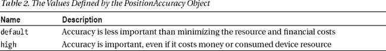

`default`和`high`值并没有指定位置应该被确定的精确程度。相反，它们指定设备应该如何获取位置。`default`值将倾向于不太准确的信息，这些信息可以快速、轻松、免费地获得。`high`值将获得设备可以产生的最精确的位置，并且它将使用它所拥有的所有资源来获得该精确度，即使这意味着消耗大量的电池电量或使用可能花费用户金钱的服务(例如来自蜂窝服务提供商的定位服务)。

 **提示**请注意，您无法指定用于获取位置的技术，甚至无法找出设备获取位置的不同选项。你所能做的就是设置你想要的精确度，剩下的就交给 Windows 了。

关于为属性`desiredAccurcy`使用哪个值的决定通常最好由用户来做，尤其是出于财务方面的考虑。发现一个写得很糟糕的应用耗尽了你所有的电池电量已经够糟糕了，但发现它在这样做的同时一直在耗费你的钱，这是无法忍受的。您可以看到我是如何在清单 8 的[示例中指定高精度选项的，在这里我重复了来自`geolocation.js`文件的语句。](#list_29_8)

*清单 8。配置地理定位器对象的精确度*

`...
geoloc.desiredAccuracy = **geo.PositionAccuracy.high**;
...`

我不担心获取位置的成本，因为我将使用 Visual Studio 模拟器向应用提供位置数据。

##### 监控地理位置状态

`Geolocator`对象定义了`statuschanged`事件，它提供了关于地理定位特性状态的通知。一个`Geoloctor`对象的状态是通过`locationStatus`属性获得的，并且将是由`PositionStatus`枚举定义的值之一，我已经在[表 3](#tab_29_3) 中列出了这些值。

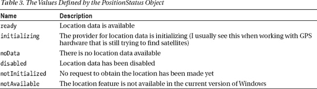

我通过读取`locationStatus`属性的值并在应用布局右侧面板的`ListView`控件中显示一条消息来处理`statuschanged`事件。如果启动 app，会提示允许 app 访问位置数据，如图[图 3](#fig_29_3) 所示。

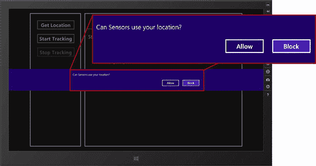

***图三。**请求位置访问*

如果点击`Block`按钮，Windows 会拒绝你的 app 访问位置数据，并且会触发`statuschanged`事件，表示`locationStatus`属性已经更改为`disabled`，如图[图 4](#fig_29_4) 所示。

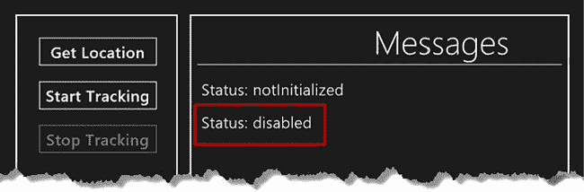

***图 4。**禁止访问位置数据的影响*

如果您在应用中获得了`disabled`值，那么您将知道您将无法访问位置数据。在这一点上，根据你的应用，你可能能够继续并向用户提供某种减少的功能，或者你可能需要显示一条消息，鼓励用户授予你的应用所需的访问权限。你应该*而不是*做的是忽略`disabled`值，只是尝试读取位置数据——你不会得到任何数据，用户也不会明显看出缺乏位置访问是你的应用产生奇怪结果的原因。

要访问位置数据，激活`Settings`图标，点击`Permissions`链接，改变`Location`拨动开关的位置。当你重新加载 app 时，你会看到状态显示为`ready`，表示有位置数据可用，如图[图 5](#fig_29_5) 。

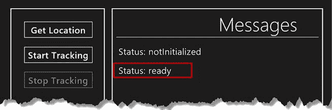

***图 5。**允许访问位置数据的效果*

##### 获取位置

点击应用布局中的`Get Location`按钮，调用`geolocation.js`文件中的`getLocation`函数，就是这个函数生成位置的快照。在[的清单 9](#list_29_9) 中，我重复了`getLocation`的实现。

*清单 9。getLocation 函数的实现*

`...
function getLocation() {
    geoloc.desiredAccuracy = geo.PositionAccuracy.high;` `    geoloc.getGeopositionAsync().then(function (pos) {
        writeMessage("Snapshot - Lat: " + pos.coordinate.latitude
            + " Lon: " + pos.coordinate.longitude
            + " (" + pos.coordinate.timestamp.toTimeString() + ")");
    });
}
...`

一旦我配置了`Geolocator`对象，我就调用`getGeopositionAsync`方法。这个方法返回一个`Promise`,当它被实现时，将产生当前位置的快照。快照作为一个`Geoposition`对象传递给`then`函数，它定义了我在[表 4](#tab_29_4) 中描述的两个属性。

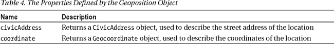

`CivicAddress`对象有点令人失望，因为 Windows 没有用地址的细节填充该对象。这个想法是 Windows 的第三方附加软件可以提供这项服务，但它们并没有被广泛使用，所以你不能指望在用户的设备上找到一个安装的。

**超越获得位置**

Windows 位置传感器非常善于给你设备的经度和纬度，但仅此而已，你甚至不能依赖于自动填充的`CivicAddress`对象。如果您想超越获取基本坐标的范围，那么您将需要使用众多可用的地图 web 服务之一。我喜欢`openstreetmap.org`，它有出色的反向地理编码服务(将坐标转化为街道地址)和精确的地图数据。最重要的是，这些服务可以免费使用，并且不需要您将 API 密钥嵌入到您的应用中(当密钥更改或过期时，这是一个管理难题)。

如果你比我更少受到 API 键的困扰，那么你可能会考虑 Bing 地图 AJAX 控件，它使获取地址和在 Windows 应用中显示地图变得非常容易。有使用限制，高请求量收费，但地图很好，有一些应用开发的代码示例。你可以在`[http://bingmapsportal.com](http://bingmapsportal.com)`找到更多细节。当然，谷歌也有一个类似的库，它的功能和 Bing 选项一样好，也需要 API 密钥和高使用率的费用。您可以在`[https://developers.google.com/maps](https://developers.google.com/maps)`获得 Google APIs 的详细信息。

我将把注意力集中在`Geocoordinate`对象上，它*是正确填充的*，并定义了我在[表 5](#tab_29_5) 中描述的属性。

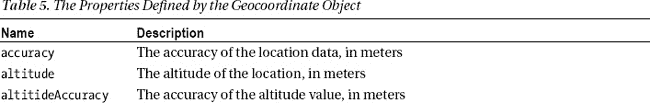
T4】

并非`Geocoordinate`对象中的所有属性都将被填充——例如，这可能是因为设备没有能够提供高度细节的硬件，或者因为某些属性仅在位置被跟踪时可用，而不是拍摄快照。在示例中，当由`getGeopositionAsync`方法返回的`Promise`被满足时，我使用`latitude`、`longitude`和`timestamp`属性在应用布局的右侧面板中显示一条消息。

##### 测试位置快照

现在您已经看到了各种对象是如何组合在一起的，是时候测试示例应用拍摄位置数据快照的能力了。最简单的方法是使用 Visual Studio 模拟器，它能够模拟位置数据。启动 app 前，点击模拟器窗口的`Set location`按钮，勾选`Use simulated location`选项，输入纬度值`38.89`和经度值`-77.03`，如图[图 6](#fig_29_6) (这里是白宫所在地)。

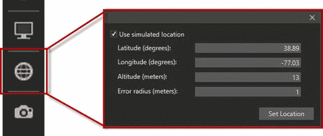

***图六。**输入模拟位置数据*

点击`Set Location`按钮应用模拟位置，然后启动示例应用。点击`Get Location`按钮生成位置快照，并在应用布局中显示消息。您可以在[图 7](#fig_29_7) 中看到本次测试使用模拟数据的结果。

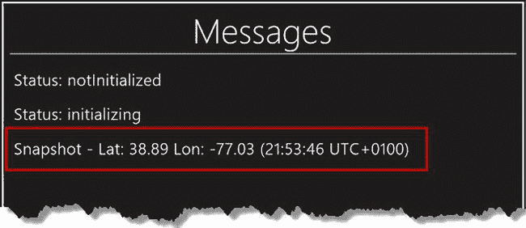

***图 7。**生成位置快照*

不一定要用模拟数据。如果您没有在模拟器弹出窗口中选择`Use simulated location`选项，那么应用将从 Windows 中读取位置数据。我使用了模拟数据，因为我想创建一个可以持续重复的结果，但我建议也使用真实数据——尤其是如果你的设备不支持 GPS。虽然可变，但非 GPS 位置数据的准确性可能相当惊人——仅使用无线网络名称，我的电脑就可以确定其位置在我家 200 英尺以内。

#### 追踪位置

下一个向您展示的功能是在位置变化时跟踪位置的能力。如果您想监控设备的位置，您可以定期调用`getGeopositionAsync`方法，但是这是一个很难实现的过程。您不希望过于频繁地拍摄位置快照，因为设备可能不会移动，而且您会不必要地消耗设备资源(可能还会消耗用户的钱)。如果您拍摄快照的频率太低，您将错过设备移动的时刻，并以部分数据磁道结束。

为了更容易跟踪位置，`Geolocator`对象定义了`positionchanged`事件，当设备的位置超出您定义的阈值时，就会触发该事件。您可以看到我是如何在[清单 10](#list_29_10) 中的示例应用中添加位置跟踪支持的，它展示了我对`startTracking`和`stopTracking`函数的实现，以及一个编写显示位置信息的新函数。

*清单 10。位置跟踪的实现*

`...
**function startTracking() {**
**    geoloc.movementThreshold = 100;**
**    geoloc.addEventListener("positionchanged", displayLocation);**
**    writeMessage("Tracking started");**
**start.disabled = !(stop.disabled = false);**` `**}**

**function stopTracking() {**
**    geoloc.removeEventListener("positionchanged", displayLocation);**
**    writeMessage("Tracking stopped");**
**    start.disabled = !(stop.disabled = true);**
**}**

**function displayLocation(e) {**
**    writeMessage("Track - Lat: " + e.position.coordinate.latitude**
**        + " Lon: " + e.position.coordinate.longitude**
**        + " (" + e.position.coordinate.timestamp.toTimeString() + ")");**

**}**
...`

您可以通过设置`Geolocator.movementThreshold`属性的值来设置移动的阈值。当设备移动的距离超过您指定的米数时，将触发`positionchanged`事件。

 **提示**一米大约是 3 英尺 3 英寸。可以指定一个低于设备确定其位置精度的移动阈值，在这种情况下，只要位置改变，就会触发`positionchanged`事件。

在`startTracking`函数中，我将阈值设置为 100 米(大约 110 码),然后使用`addEventListener`方法为`positionchanged`事件设置一个事件监听器，指定使用`displayLocation`函数(也在清单中定义)来处理该事件。为了停止跟踪，我简单地调用`removeEventListener`函数来取消`displayLocation`作为事件监听器的注册。

传递给处理函数的事件对象定义了一个返回一个`Geoposition`对象的`position`属性，我使用它的`coordinate`属性来显示新位置的细节。

要测试位置跟踪，启动应用，通过导航栏导航到`geolocation.html`页面，然后单击`Start Tracking`按钮。现在点击 Visual Studio 模拟器的`Set location`按钮，输入新的坐标，然后点击`Set Location`按钮。每次设置新坐标时，只要新位置距离旧位置至少 100 米，就会在应用布局中显示一条新消息。在[图 8](#fig_29_8) 中可以看到追踪位置的效果。

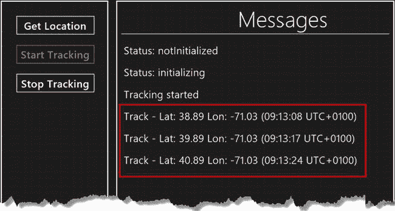

***图 8。**使用 positionchanged 事件跟踪位置*

### 使用光线传感器

如今，光传感器越来越常见，用于改变照亮设备屏幕的电量，以最大限度地减少电池消耗(屏幕通常是设备功耗的最大消耗者，在光线较暗的情况下调暗屏幕可以节省大量电力，并使屏幕使用起来不那么累)。对于一个应用来说，光传感器最常见的用途是试图找出设备何时在户外或用户何时入睡，这两者都可以与其他信息(如时间或位置)相关联，以改变应用的行为。几年前，我有一台 PDA，它利用光传感器提供不同寻常的选项，例如黎明警报和提醒我是否在室内呆了太长时间——虽然不总是成功，但玩起来很有趣。

 **注意**与即使设备没有专用的位置硬件也能产生位置的位置传感器不同，光传感器(以及我在本章中描述的其他传感器)需要实际的硬件。硬件相当常见，为了测试示例项目，我使用了我在第 6 章的[中提到的戴尔 Inspiron Duo。这对组合有一个触摸屏和一系列硬件传感器，这使它成为测试应用的理想选择。我不想听起来像是戴尔的广告(我不太喜欢戴尔)，但这对组合非常便宜，尤其是二手的，我发现它对于在部署前测试应用非常有用，特别是在确保我的触摸屏交互有意义和感觉自然的时候。](06.html#ch6)

为了演示光传感器，我在名为`light.html`的项目的`pages`文件夹中添加了一个文件，其内容可以在[清单 11](#list_29_11) 中看到。

*清单 11。light.html 文件的内容*

`<!DOCTYPE html>
<html>
<head>
    <title></title>
    
</head>
<body>
    

        <h1 class="message warning">No Light Sensor Installed</h1>
        <h1 class="message">Light level: (None)</h1>
        <h1 class="message">Condition: (None)</h1>
    

</body>
</html>`

光线传感器由`Windows.Devices.Sensors.LightSensor`对象表示，您通过`getDefault`方法获得对传感器的引用，如下所示:

`...
var sensor = Windows.Devices.Sensors.LightSensor.getDefault();
...`

如果`getDefault`方法返回的值是`null`，那么当前设备不包含光传感器。在这个例子中，我检查了`null`结果，如果传感器不存在，就显示一条消息。

#### 拍摄光线水平的快照

一旦获得了传感器对象，就可以通过调用`getCurrentReading`方法来获取传感器值的快照，如[清单 12](#list_29_12) 所示。

*清单 12。拍摄亮度快照*

`...
displaySensorReading(**sensor.getCurrentReading()**.illuminanceInLux);
...`

`getCurrentReading`方法返回一个`Windows.Devices.Sensors.LightSensorReading`对象，它定义了我在[表 6](#tab_29_6) 中描述的两个属性。

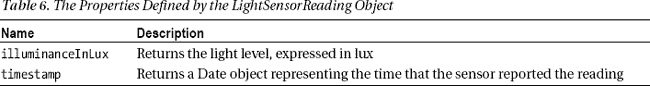

`illuminanceInLux`属性返回以勒克斯为单位的亮度。维基百科对勒克斯单位有很好的描述，并有一个表格描述了一些有用的勒克斯范围。可以在`[http://en.wikipedia.org/wiki/Lux](http://en.wikipedia.org/wiki/Lux)`看到文章。我使用这些勒克斯范围的简化集来猜测设备的工作条件，包括室外、室内和办公室内——你可以在`light.html`文件的`displaySensorReading`函数中看到我的映射。

 **注意**您会注意到对`getCurrentReading`方法的调用在[清单 11](#list_29_11) 中被注释掉了，它显示了`light.html`文件的内容。如果我调用`getCurrentReading`方法来拍摄光照水平的快照，我发现跟踪光照水平(我将在下一节描述)不再有效。这可能只是我的戴尔 Duo 中的光线传感器的一个特征，但我无法使用任何其他传感器来确定。

#### 跟踪光线水平

拍摄光线水平的快照可能很有用，但通常您会希望在光线水平变化时收到通知。`LightSensor`对象定义了`readingchanged`事件，当光线级别改变时触发该事件。传递给处理函数的事件定义了一个名为`reading`的属性，该属性返回一个包含光线级别细节的`LightSensorReading`对象。在清单 13 的[中，你可以看到我是如何为这个事件添加一个处理函数的，以及我是如何通过调用我的`displaySensorReading`函数来显示亮度级别(以及我对设备运行条件的猜测)的。](#list_29_13)

*清单 13。通过 readingchanged 事件跟踪光线水平*

`...
sensor.addEventListener("**readingchanged**", function (e) {
    displaySensorReading(e.reading.illuminanceInLux);
});
...`

#### 测试光传感器示例

你可以在图 9 的[中看到`light.html`页面的布局和我测试示例应用时的光线水平。](#fig_29_9)

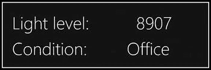

***图九。**使用光传感器*

我建议在根据光线水平决定应用行为时要谨慎，因为光线水平和设备运行条件之间没有明确的相关性。在图中，你可以看到我的照明水平是 8907 勒克斯，我将其归类为在办公室。这是一个不错的猜测，但我是在黄昏前设备在我家一个有玻璃墙的房间里时拍的这张快照。我的观点是，相同的光照水平可以存在于一系列不同的系统中，在响应光传感器的读数时保持灵活是有好处的——例如，如果一个应用将我的网络设置更改为 8900 勒克斯的办公室配置，这可能会有所帮助，但某种覆盖是必不可少的，因为我今天正好在家工作。我在本章中描述的所有传感器都是如此——传感器数据可能很有用，它可以使你的应用更有帮助和更灵活，但你应该适应你对读数的反应方式，并在数据导致你做出错误推断时，总是为用户提供一个覆盖。

### 使用倾斜仪

测斜仪测量设备倾斜的角度。倾斜仪通常用在游戏中，以允许该设备被用作控制器。您很快就会看到，使用测斜仪与使用光传感器非常相似，因为大多数代表传感器的物体都有大致相似的设计。为了演示测斜仪的使用，我在示例项目的`pages`文件夹中添加了一个名为`tilt.html`的文件，其内容可以在[清单 14](#list_29_14) 中看到。

*清单 14。tilt.html 文件的内容*

`<!DOCTYPE html>
<html>
<head>
    <title></title>
    
    
</head>` `<body>
    

        <h1 class="label warning">No Inclinometer Installed</h1>
        <h1 class="label">Pitch: (None)</h1>
        <h1 class="label">Roll: (None)</h1>
        <h1 class="label">Yaw: (None)</h1>
    

    

        

    

</body>
</html>`

测斜仪由`Windows.Devices.Sensors.Inclinometer`物体表示；就像光传感器一样，您必须调用`getDefault`方法来获取一个您可以从中读取数据的对象，就像这样:

`...
var sensor = Windows.Devices.Sensors.Inclinometer.getDefault();
...`

如果`getDefault`方法返回的值为 null，那么设备没有安装测斜仪。

#### 使设备倾斜

您可以通过调用`getCurrentReading`方法来获取当前设备倾斜的快照，该方法返回一个`Windows.Devices.Sensors.InclinometerReading`对象，该对象定义了[表 7](#tab_29_7) 中显示的属性。

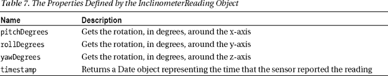

对象定义了一个事件，但是我不能让它在我的设备上触发。为了解决这个问题，我已经注释掉了事件处理代码，并用一个对`setInterval`的调用来代替它，我用它来重复轮询传感器的倾斜值。作为显示读数过程的一部分，我对布局中的一个`div`元素进行了变换，以便显示一个随着设备旋转而“自动调平”的正方形——这与我在[第 18 章](18.html#ch18)中描述的变换类型相同。你可以在[图 10](#fig_29_10) 中看到该应用的布局(请记住，这张截图是在设备倾斜时拍摄的)。

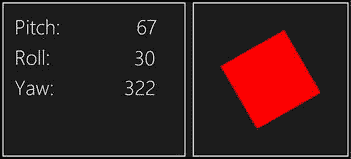

***图十。**跟踪和显示设备倾斜*

### 使用加速度计

加速度计测量加速度，通常与位置数据一起使用，以确定设备移动的方式和时间-例如，如果位置跟踪报告设备以每小时 6 英里的速度移动，而加速度计报告有规律的加速度脉冲，则与锻炼相关的应用可能会开始记录数据，以防用户忘记记录他们的日常跑步。加速度计也可以用于确定设备如何定向，因为当设备静止时，朝向地球的加速度将是 1g。

为了演示加速度计的使用，我在 Visual Studio 项目的`pages`文件夹中添加了一个名为`acceleration.html`的新文件。您可以在[清单 15](#list_29_15) 中看到这个文件的内容。

*清单 15。acceleration.html 文件的内容*

`<!DOCTYPE html>
<html>
<head>
    <title></title>
    
</head>` `<body>
    

        <h1 class="label warning">No Accelerometer Installed</h1>
        <h1 class="label">Accelerate X: (None)</h1>
        <h1 class="label">Accelerate Y: (None)</h1>
        <h1 class="label">Accelerate Z: (None)</h1>
    

</body>
</html>`

你现在应该能认出这个模式了。加速度计设备由`Windows.Devices.Sensors.Accelerometer`对象表示，您必须调用`getDefault`方法来获取表示传感器的对象，如下所示:

`...
var sensor = Windows.Devices.Sensors.Accelerometer.getDefault();
...`

如果来自`getDefault`方法的结果为空，则设备中没有加速度计硬件。

#### 获得设备加速度

您可以通过调用返回一个`Windows.Devices.Sensors.AccelerometerReading`对象的`getCurrentReading`方法来获得加速度计测量的力的快照。这个对象定义了我在[表 8](#tab_29_8) 中描述的属性。

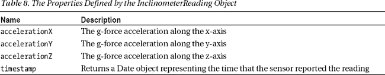

我在`displaySensorReading`函数中读取这些属性的值，这产生了如图[图 11](#fig_29_11) 所示的布局和数据。

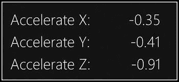

***图 11。**测量加速度*

您可以通过监听由`Accelerometer`对象发出的`readingchanged`事件来跟踪设备加速度。传递给处理函数的事件对象的`reading`属性返回一个`AccelerometerReading`对象，您可以在`acceleration.html`文件中看到我是如何处理这个事件的。

 **注**`Accelerometer`也定义了`shaken`事件。一些加速度计硬件可以检测到设备何时被快速摇动，这个手势将触发`shaken`事件。我的测试设备中的加速度计硬件不支持摇动手势，通常解释设备方向的变化(我在第 6 章的[中描述过)。依赖此事件时要小心，因为它可能不会被触发，并且要求用户摇动设备可能会导致意外的配置更改，正如我在戴尔 Duo 上的经历一样。](06.html#ch6)

### 使用指南针

指南针允许您确定设备指向的方向。使用指南针需要磁力计硬件，它可以测量磁场的强度和方向。指南针在确定地图数据的方向以使其与现实世界相符时最有用——例如，我进行了大量的长距离行走和跑步，我的手持(非 Windows) GPS 设备使用其指南针来确保拓扑图与我所面对的方向相符，这使我更容易找到自己的位置。

为了演示指南针传感器，我在 Visual Studio 项目的`pages`文件夹中添加了一个名为`direction.html`的新文件，您可以在[清单 16](#list_29_16) 中看到该文件的内容。

*清单 16。direction.html 文件的内容*

`<!DOCTYPE html>
<html>
<head>
    <title></title>
    
    
</head>
<body>
    

        

            &#8657;
        

    

    

        <h1 class="label warning">No Compass Installed</h1>
        <h1 class="label">Heading: (None)</h1>
    

</body>
</html>`

指南针的工作原理和我在本章中描述的其他传感器一样。指南针由`Windows.Devices.Sensors.Compass`对象表示，您必须调用`getDefault`方法来获取对象，以便读取传感器数据，如下所示:

`...
var sensor = Windows.Devices.Sensors.Compass.getDefault();
...`

如果`getDefault`方法返回 null，那么设备没有指南针传感器硬件。

#### 获取设备方向

您可以通过调用返回一个`Windows.Devices.Sensors.CompassReading`对象的`getCurrentReading`方法来获得设备朝向的快照。该对象定义了[表 9](#tab_29_9) 中所示的属性。

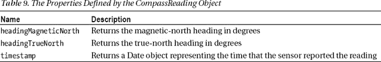

并非所有的指南针硬件包都能够产生磁航向和真北航向，例如，我的测试设备中的传感器只产生磁方位。在本例中，我将`CompassReading`对象传递给`displaySensorReading`函数，该函数显示数字标题并对`div`元素进行旋转，以显示一个始终指向北方的箭头。您可以在图 12 的[中看到布局和传感器数据。](#fig_29_12)

***图 12。**显示指南针的数据*

您可以通过监听`readingchanged`事件来跟踪航向的变化，当指南针传感器报告的方向发生变化时，`Compass`对象会触发该事件。我在示例中使用这个事件来保持示例布局最新。

### 总结

在本章中，我向您展示了您的应用如何利用 Windows 8 传感器框架来获取真实世界的数据。像所有高级功能一样，传感器数据需要谨慎使用，但您可以通过使用您收到的数据来创建灵活和创新的应用，以适应他们的环境。在本书的下一部分，我将向您展示如何准备您的应用并将其发布到 Windows 应用商店。