## 第三十章

## 创建要发布的应用程序

在本书的这一部分，我将向您展示如何在 Windows 应用商店中发布应用程序。我将从头开始，创建一个应用程序，从创建到提交给微软审查。在此过程中，我将向您展示如何应用驱动您的业务模式的功能，并确保应用程序符合 Windows 应用商店的政策。在这一章中，我将带您完成开始之前需要的步骤，然后创建一个应用程序，我将在接下来的章节中介绍它的发布过程。

### 决定你的应用

显然，应该从决定你的应用程序要做什么开始。对于这一章，我将创建一个照片浏览器应用程序。这不是任何真正的用户想要付费的东西(尤其是因为 Windows 8 中已经包含了这样的应用程序)，但它是这本书这一部分的理想例子，因为功能简单且独立，让我专注于发布过程的不同部分。

### 决定你的商业模式

当创建一个应用程序时，首先要做的是决定你想要使用的商业模式。Windows 应用商店支持一系列不同的应用销售方式，包括免费赠送、试用版、收取固定费用、收取订阅费、应用内广告和销售应用内升级。

对于我的示例应用程序，我将提供一个免费的限时试用来吸引用户，然后向他们收取 5 美元的基本应用程序费用。但我的 Windows 8 财富将以应用内升级的形式出现，其中一些将获得永久许可，一些将在订阅的基础上出售。

 **注意**我不打算演示应用内广告，因为它与 Windows 8 商店没有直接关系。微软有一个广告 SDK，可以很容易地在一个应用程序中包含广告，你可以从`[http://advertising.microsoft.com/windowsadvertising/developer](http://advertising.microsoft.com/windowsadvertising/developer)`获得。如果你想使用另一家广告提供商，你需要仔细检查广告内容和获取广告的机制是否违反了应用认证要求(我在[第 33 章](33.html#ch33)中向你展示了如何测试)。

在[表 30-1](#tab_30_1) 中，我已经列出了我的应用程序的不同可购买功能、它们的价格以及它们的用途。该应用程序的免费试用将支持 30 天的所有功能。

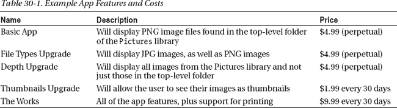

让我再次强调，我不会真的卖这个应用程序，我只是需要一个工具来告诉你如何卖你的。因此，虽然我的应用程序及其升级既乏味又昂贵，但它们将允许我演示如何在一个应用程序中创建和组合一系列商业模式。

### 准备就绪

在开始创建我的应用程序之前，我需要做几件事情。首先是创建一个 Windows Store 开发者账户，允许你向商店发布应用，并从中获得任何收入。您可以以个人身份或代表公司创建一个帐户，Microsoft 会更改该帐户的年费(目前个人为 49 美元，公司为 99 美元)。您将需要一个 Microsoft 帐户来打开 Windows 应用商店开发人员帐户，但您在下载 Visual Studio 时应该已经有了一个。

 **提示**微软将 Windows Store 账户作为其开发者产品的一部分，如 TechNet 和 MSDN。如果您已经购买了这些服务中的一项，您可能不必直接为帐户付费。

在 Visual Studio 的`Store`菜单中选择`Open Developer Account`，开始创建帐户的过程。获得帐户的过程需要填写一些表格并设置支付细节，这样你就可以从你的应用程序销售中获得利润。一旦你创建了一个账户，你会看到如图[图 30-1](#fig_30_1) 所示的仪表板。此仪表板提供了你的商店帐户的详细信息，包括你的应用和付款。

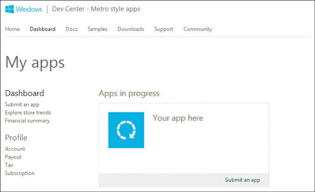

***图 30-1。**Windows Store 仪表盘*

#### 保留应用名称

开始开发应用程序之前，您可以在 Windows 应用商店中保留应用程序的名称。预约有效期为一年，在此期间，只有您可以发布该名称的应用程序。保留一个名字是一个明智的想法，这样你就可以继续创作艺术品、网站和营销宣传材料，而不用担心在你开发应用程序时别人会用这个名字。

你可以通过从 Visual Studio `Store`菜单中选择`Reserve App Name`项或者点击 Windows 应用商店仪表盘中的`Submit an app`链接来保留名称(反正`Reserve App Name`菜单会带你去那里)。仪表盘呈现了发布一个 app 所需的不同步骤，但我目前唯一关心的是第一步，也就是`App name`步骤，如图[图 30-2](#fig_30_2) 所示。

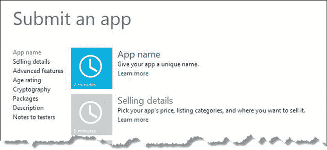

***图 30-2。**显示应用发布流程第一步的 Windows 仪表盘*

点击`App name`项，输入您想要预订的姓名。对于我的 app，我保留了名称`Simple Photo Album`，如图[图 30-3](#fig_30_3) 所示。

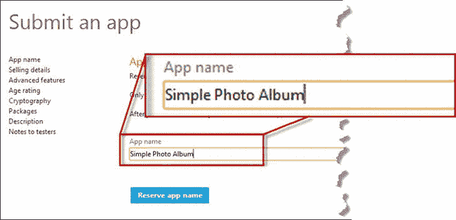

***图 30-3。**选择应用的名称*

您保留的名称是应用程序将在商店中列出的名称，与您的 Visual Studio 项目的名称不同。我将在[第 33 章](33.html#ch33)中向您展示如何将 Visual Studio 项目与仪表板关联起来，但我甚至还没有创建我的 Visual Studio 项目)。

这意味着当你阅读这一章时，我对`Simple Photo Album`名称的保留可能已经失效，并且可能已经被其他人使用。

一旦您保留了您的应用程序名称，仪表板将更新发布过程的第一步以反映您的选择，如[图 30-4](#fig_30_4) 所示。

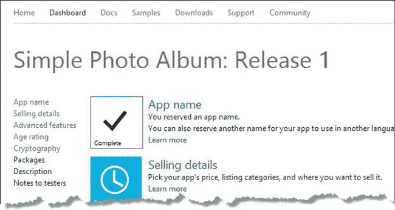

***图 30-4。**完成应用发布流程的第一步*

这就是目前所需要的全部准备工作。保留名称后，我现在可以创建我的 Visual Studio 项目并开始构建我的应用程序。

### 创建 Visual Studio 项目

我已经使用`Blank App`模板创建了一个新的 Visual Studio 项目。我将项目命名为`PhotoApp`，只是为了演示您可以将项目的名称与应用程序在商店中的名称和用户名称分开。你可以在[图 30-5](#fig_30_5) 中看到成品 app 的外观。

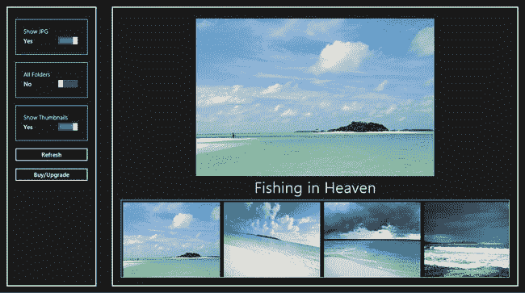

***图 30-5。**示例 app 的布局*

左侧面板包含一些按钮和`ToggleSwitch`控件，允许用户选择显示哪些图像以及是否显示缩略图。右侧面板包含一个大的`FlipView`控件，该控件始终可见，可用于浏览已加载的图像。在右边面板的底部是一个`ListView`控件，显示可用图像的缩略图。缩略图的可见性和图像的选择将由用户购买的功能来控制。在本章的后面，我将向你展示应用程序布局的各个组成部分。

#### 创建商业模式代码

如果你正在创建一个完全免费的应用程序，那么你可以通过应用我在本书中向你展示的技术来开始构建你的功能。你不必担心收款或启用功能或任何其他类型的与商店的互动。但是如果你打算对你的应用程序或者它的一些功能收费，你需要仔细考虑你的应用程序的结构。我发现最好的方法是从一开始就将一些与核心商业模式相关的功能植入应用程序，这样我就可以构建应用程序的功能，然后回来实施我的商业计划。

为此，我添加到`PhotoApp`项目的第一个文件叫做`store.js`，我把它放到了`js`文件夹中。你可以在清单 30-1 中看到这个文件的内容。

***清单 30-1** 。/js/store.js 文件的内容*

`(function() {

    WinJS.Namespace.define("ViewModel.Store", {
        events: WinJS.Utilities.eventMixin,

        checkCapability: function(name) {
            var available = true;
            setImmediate(function () {
                ViewModel.Store.events.dispatchEvent("capabilitycheck",
                    { capability: name, enabled: available });
            });
            return available;
        }
    });

})();`

这个文件目前非常简单，但当我添加将我的应用程序集成到 Windows 商店的支持时，它将成为我在第 31 章中的主要关注点。我创建了一个名为`ViewModel.Store`的新名称空间，并在其中添加了一个`checkCapability`函数。应用程序的其他部分将调用这个函数来查看用户是否已经购买了执行某些操作的权利——在第 32 章中，我将实现代码来检查我的产品层和升级，但目前每个请求都返回`true`,表明某个功能可用。这将允许我在实现我的业务模型代码之前构建出我的应用程序的功能。

当调用`checkCapability`函数时，它会发出一个`capabilitycheck`事件——我将在第 32 章中使用这个事件来响应用户试图使用他们尚未购买的功能。我已经使用`WinJS.Utilties.eventMixin`实现了事件，这是一个有用的对象，您可以使用它向常规 JavaScript 对象添加事件支持。它定义了在 DOM 元素对象上可以找到的标准的`addEventListener`和`removeEventListener`方法，以及`dispatchEvent`方法，该方法允许您向注册的侦听器发送任意类型的事件。使用`eventMixin` 对象比编写自己的事件处理代码更简单，也更不容易出错，通过`ViewModel.Store.event`属性使对象可用，我提供了一个点，应用程序的其他部分可以在这里注册事件。

 **提示**你不必创建一个`eventMixin`对象的新实例。一个实例在想要使用该对象的应用程序的任何部分之间共享，`eventMixin`代码将不同类型事件的侦听器分开。你可以通过查看 Visual Studio 项目参考中的`base.js`文件来了解微软是如何实现这个特性的。

#### 创建视图模型状态

我的下一步是创建让我维护应用程序状态的代码，我已经通过添加一个名为`viewmodel.js`的新文件到`js`文件夹中完成了。您可以在[清单 30-2](#list_30_2) 中看到该文件的内容。

***清单 30-2** 。viewmodel.js 文件的内容*

`(function () {

    WinJS.Namespace.define("ViewModel", {
        State: WinJS.Binding.as({
            pictureDataSource: new WinJS.Binding.List(),
            fileTypes: false,
            depth: false,
            thumbnails: false,
        }),
    });

    WinJS.Namespace.define("Converters", {
        display: WinJS.Binding.converter(function(val) {
            return val ? "block" : "none";
        })
    });

})();`

名称空间`ViewModel.State`包含了`WinJS.Binding.List`对象，我将使用它作为数据源，通过 WinJS `FlipView`和`ListView` UI 控件来显示图片。我还定义了一组可观察的属性，我将使用它们来跟踪用户当前在应用程序中启用了哪些功能——这不同于用户是否许可了它们。我需要跟踪用户使用某个特性的权限以及它当前是否开启，而`ViewModel.State`名称空间中的属性跟踪后者。

 **提示**这种方法要求我在启用`ViewModel.State`名称空间中的相应属性之前，检查用户是否有权使用某个特性。这就是`ViewModel.Store.checkCapability`函数的用途，当我向您展示`/js/default.js`文件的内容时，您将很快看到我是如何处理它的。

#### 定义布局

为了创建我在[图 30-5](#fig_30_5) 中展示的布局，我将[清单 30-3](#list_30_3) 中显示的元素添加到`default.html`文件中。这个应用程序不需要任何导航或内容页面，因为它需要这样一个简单的布局。

***清单 30-3** 。在 default.html 文件中定义示例应用程序的标记*

`<!DOCTYPE html>
<html>
<head>
    <meta charset="utf-8" />
    <title>PhotoApp</title>
    <!-- WinJS references -->
    <link href="//Microsoft.WinJS.1.0/css/ui-dark.css" rel="stylesheet" />
    
    
    <!-- PhotoApp references -->
    <link href="/css/default.css" rel="stylesheet" />
**    **
**    **
    
</head>
<body>
**    
**
**        
**
**            **
**            

**
**        
**
**    
**
**    
**
**        
**
**            **
**        
**
**    
**

**    
**
**        
**
**        
**
**        
**
**        
**
**        
**
**        
**
**        <button id="refresh">Refresh</button>**
**        <button id="upgrade">Buy/Upgrade</button>**
**    
**` `**    
**
**        
**
**        
**
**        
**
**        
**
**    
**
</body>
</html>`

标记可以分为三类。第一类是进入左侧面板的控制元素(由属性为`buttonsContainer`的`div`元素表示)。除了标准的 HTML `button`元素，我还应用了`WinJS.UI.ToggleSwitch`控件，我在第 11 章的[中描述过。您可以在](11.html#ch11)[图 30-6](#fig_30_6) 中看到详细的控制按钮，并且您会注意到这些按钮代表了我将作为升级出售给用户的功能。

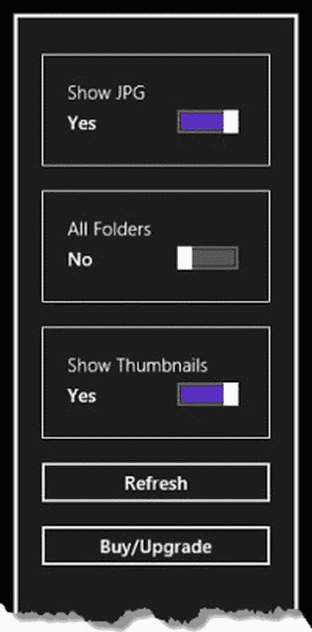

***图 30-6。**控制元素*

我需要某种方式让用户在试用期间购买基本功能或升级到全套功能，这就是我添加`Buy/Upgrade`按钮的原因。您可以看到我是如何将`ToggleSwitch`控件的 checked 属性链接到`ViewModel.State`名称空间中的可观察值的。

下一部分标记包含在`div`元素中，该元素的`id`属性是`imageContainer`。我使用一个`FlipView`控件作为主图像显示，一个`ListView`控件显示缩略图。我在[第 14 章](14.html#ch14)和[第 15 章](15.html#ch15)中介绍了这些 WinJS UI 控件，我在这个应用程序中对它们的使用非常简单和标准。

标记的最后一部分是用于`ListView`和`FlipView`控件的模板。这些使用了我在第 8 章的[中描述的`WinJS.Binding.Template`功能。两个模板都有一个`img`元素，对于用于`FlipView`控件的模板，我使用一个`div`元素来显示当前显示文件的名称。在](08.html#ch8)[图 30-7](#fig_30_7) 中，您可以看到控件和模板是如何组合成应用程序布局的右侧面板的。

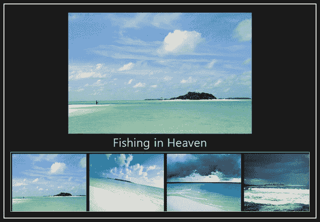

***图 30-7。**示例应用的右侧面板*

#### 定义 CSS

这个例子的 CSS 非常简单——我非常依赖 flex box 布局来创建一个适应不同屏幕分辨率、设备方向和布局的应用程序。你可以在清单 30-4 的[文件中看到我定义的样式。](#list_30_4)

***清单 30-4** 。/css/default.css 文件的内容*

`body {display: -ms-flexbox; -ms-flex-direction: row;}

div.container { border: medium solid white; padding: 20px; margin: 20px;
    display: -ms-flexbox; -ms-flex-direction: column; -ms-flex-align: stretch;
    -ms-flex-pack: center;}

div[data-win-control='WinJS.UI.ToggleSwitch'] { border: thin solid white;
    padding: 20px; margin: 10px 0;}

#buttonContainer {-ms-flex-pack: start;}
#buttonContainer button { margin: 10px 0;}

#imageContainer {-ms-flex: 2;}
#flipView {-ms-flex: 2;}
#listView { -ms-flex: 1; max-height: 200px; min-height: 200px; border: thin solid white;
    display: none;}

.flipItem {display: -ms-flexbox;-ms-flex-direction: column;-ms-flex-align: center;
    -ms-flex-pack: center; width: 100%; height: 100%;}
.flipImg { position: relative; top: 0; left: 0; height: calc(100% - 70px); z-index: 15;}
.flipTitle { font-size: 30pt;}
.listItem img { width: 250px; height: 200px;}

@media print {
    #buttonContainer, #listView { display: none;}
}

@media screen and (-ms-view-state: snapped) {
    #buttonContainer { display: none;}
}

@media screen and (-ms-view-state: fullscreen-portrait) {
    body { -ms-flex-direction: column-reverse;}
    #buttonContainer { -ms-flex-direction: row; -ms-flex-pack: distribute;}
    #buttonContainer button {display: none;}
}`

在打印时，以及当应用程序处于纵向和快照布局时，我使用媒体查询来更改应用程序布局。不同的布局与 Windows 应用商店集成没有直接关系，但为了完整起见，我在布局中添加了一些变化。

#### 定义 JavaScript 代码

`/js/default.js`文件包含将布局的不同部分联系在一起并显示图像的代码。你可以在清单 30-5 中看到这个文件的内容。

***清单 30-5** 。default.js 文件的内容*

`(function () {
    "use strict";

    WinJS.Binding.optimizeBindingReferences = true;

    var app = WinJS.Application;
    var activation = Windows.ApplicationModel.Activation;
    var storage = Windows.Storage;
    var search = storage.Search;

    app.onactivated = function (args) {
        if (args.detail.kind === activation.ActivationKind.launch) {
            if (args.detail.previousExecutionState !==
                activation.ApplicationExecutionState.suspended) {

                refresh.addEventListener("click", function (e) {
                    loadFiles();
                });

                WinJS.Utilities.query("#buttonContainer > div").listen("change",
                    function (e) {
                    if (ViewModel.Store.checkCapability(e.target.id)) {
                        ViewModel.State[e.target.id] = e.target.winControl.checked;
                        if (e.target.id == "thumbnails") {
                            listView.winControl.itemDataSource
                                = ViewModel.State.pictureDataSource.dataSource;
                        } else {
                            setImmediate(loadFiles);
                        }

                    } else {
                        e.target.winControl.checked = false;
                    }
                });

                listView.addEventListener("iteminvoked", function (e) {
                    flipView.winControl.currentPage = e.detail.itemIndex;
                });
                flipView.addEventListener("pageselected", function (e) {
                    var index = flipView.winControl.currentPage;
                    listView.winControl.ensureVisible(index);

                });
            }
            args.setPromise(WinJS.UI.processAll().then(function() {
                return WinJS.Binding.processAll(document.body, ViewModel)
                    .then(function () {
                        setupPrinting();
                        loadFiles();` `                });
            }));
        }
    };

    function setupPrinting() {
        Windows.Graphics.Printing.PrintManager.getForCurrentView().onprinttaskrequested =
            function (e) {
                if (ViewModel.Store.checkCapability("print")
                    && ViewModel.State.pictureDataSource.length > 0) {
                    var printTask = e.request.createPrintTask("PrintAlbum",
                        function (printEvent) {
                            printEvent.setSource(
                                MSApp.getHtmlPrintDocumentSource(document));
                    });
                    printTask.options.orientation
                        = Windows.Graphics.Printing.PrintOrientation.landscape;
            };
        };
    }

    function loadFiles() {
        var options = new search.QueryOptions();
        options.fileTypeFilter.push(".png");

        if (ViewModel.State.fileTypes) {
            options.fileTypeFilter.push(".jpg", ".jpeg");
        }
        if (ViewModel.State.depth) {
            options.folderDepth = search.FolderDepth.deep;
        } else {
            options.folderDepth = search.FolderDepth.shallow;
        }
        storage.KnownFolders.picturesLibrary.createFileQueryWithOptions(options)
            .getFilesAsync().then(function (files) {
                var list = ViewModel.State.pictureDataSource;
                list.dataSource.beginEdits();
                list.length = 0;
                files.forEach(function (file) {
                    list.push({
                        image: URL.createObjectURL(file),
                        title: file.displayName
                    });
                });
                list.dataSource.endEdits();
        })
    };

    app.start();
})();`

这个例子中需要注意的重要一点是,`ViewModel.State`名称空间中的属性控制应用程序行为的方式。例如，在`loadFiles`函数中，定位的文件类型和搜索文件的深度由`ViewModel.State.fileTypes`和`ViewModel.State.depth`属性驱动，如下所示:

`...
if (**ViewModel.State.fileTypes**) {
    options.fileTypeFilter.push(".jpg", ".jpeg");
}
if (**ViewModel.State.depth**) {
    options.folderDepth = search.FolderDepth.deep;
} else {
    options.folderDepth = search.FolderDepth.shallow;
}
...`

这些属性由应用程序布局中的`ToggleSwitch`控件设置，但是只有在成功调用`ViewModel.Store.checkCapability`函数后，这些值才会更改，如下所示:

`...
if (**ViewModel.Store.checkCapability(e.target.id)**) {
    ViewModel.State[e.target.id] = e.target.winControl.checked;
    if (e.target.id == "thumbnails") {
        listView.winControl.itemDataSource= ViewModel.State.pictureDataSource.dataSource;
    } else {
        setImmediate(loadFiles);
    }
} else {
    e.target.winControl.checked = false;
}
...`

为了简单起见，我将每个`ToggleSwitch`控件的`id`设置为我想要检查的功能的名称，并在`ViewModel.State`名称空间中使用相同的属性名称。实现业务模型代码可能会变得复杂，在你的应用程序组件和你销售的产品和升级之间实现尽可能多的通用性会让生活变得容易得多。

也就是说，在很大程度上，这些代码使用了我在本书中向您展示的技术。我不想详细讨论代码，因为我已经描述了各种特性是如何工作的。万一有什么东西吸引了你的注意，而你又找不到它，我在[表 30-2](#tab_30_2) 中列出了代码的关键特性，你可以在本书的什么地方找到它们。

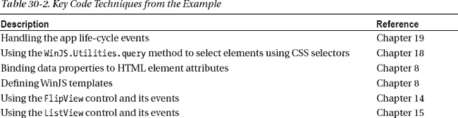
T4】

#### 更新清单

创建基本应用程序的最后一步是更新清单。为了访问`Pictures`库中的文件，我需要打开`package.appxmanifest`文件，导航到`Capabilities`部分，勾选`Pictures Library`选项，如图[图 30-8](#fig_30_8) 所示。

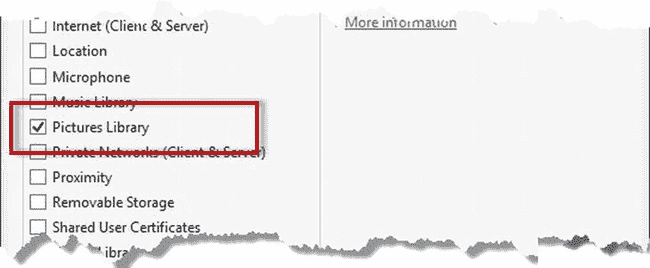

***图 30-8。**允许访问清单中的图片库*

我还在`images`文件夹中添加了一些新文件，用于磁贴和闪屏。我添加的所有文件都显示相同的图标，在透明背景上绘制成白色。你可以在[图 30-9](#fig_30_9) 中看到该图标，它显示在黑色背景上，以便在页面上可见。

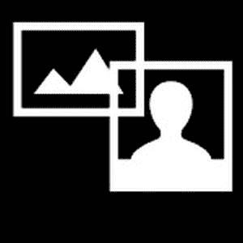

***图 30-9。**用于示例应用程序的图标*

我添加的文件被命名为`tile<size>.png`，其中`<size>`是以像素为单位的图像宽度。你可以在[图 30-10](#fig_30_10) 中看到我是如何将图像应用到应用程序中的，图中显示了货单的`Application UI`部分以及我所做的更改。

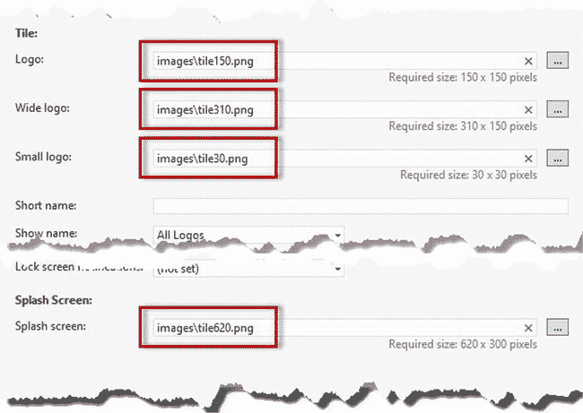

***图 30-10。**更改应用程序使用的磁贴和闪屏图像*

### 测试示例应用

本章剩下的工作就是测试示例应用程序。使用 Visual Studio `Debug`菜单中的`Start Debugging`项启动应用程序。默认情况下，`ViewModel.State`命名空间中的属性设置为`false`，这意味着您将看到基本的应用布局，如图[图 30-11](#fig_30_11) 所示。

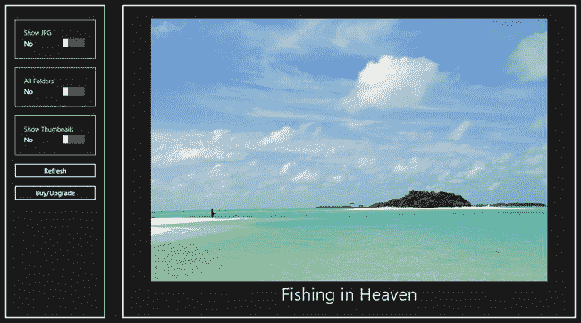

***图 30-11。**基础 app 布局*

当然，当你运行应用程序时，你会看到什么取决于你的`Pictures Library`的内容。当应用程序首次启动时，它将只显示根`Pictures`目录中的 PNG 文件，这将限制显示的内容。在基本模式下，您可以通过滑动`FlipView`或点击其导航按钮来浏览图像。

通过启用`ToggleSwitch`控件，您可以扩大显示图像的范围，以便包含 JPG 文件和`Pictures Library`中更深层次的文件。当然，还会显示`ListView`控件，显示可用图像的缩略图。

`Refresh`按钮将清除数据源的内容，并从磁盘重新加载文件。此时`Buy/Upgrade`按钮没有任何作用，但是我会在[第 32 章](32.html#ch32)中连接它，这样用户就可以进行购买。

### 总结

在本章中，我开始了创建和发布应用程序的过程，首先为我的应用程序保留名称，然后构建将提供给用户的基本功能。从一开始，我就添加了检查用户是否购买了应用关键功能的支持，我将在下一章实现这些检查背后的策略，我还将向您展示如何将您的应用集成到 Windows 应用商店中。