## 第三十二章

## 销售升级

在这一章中，我将向您展示如何使用 Windows 应用商店从您的应用内向您的用户销售升级。我演示了如何在模拟器文件中创建描述升级的条目，如何获取有关已购买的升级的信息，以及如何启动 Windows Store 过程来购买升级。

### 在场景文件中定义产品

创建应用内升级的技术从场景文件中的定义开始。对于这一章，我在`store`文件夹中创建了一个名为`upgrades.xml`的新文件，其内容可以在[清单 1](#list_32_1) 中看到。

*清单 1。upgrades.xml 文件的内容*

`<?xml version="1.0" encoding="utf-16" ?>
<CurrentApp>
  <ListingInformation>
    <App>
      <AppId>e4bbe35f-0509-4cca-a27a-4ec43bed783c</AppId>
      <LinkUri>http://apress.com</LinkUri>
      <CurrentMarket>en-US</CurrentMarket>
      <AgeRating>3</AgeRating>
      <MarketData xml:lang="en-us">
        <Name>Simple Photo Album</Name>
        <Description>An app to display your photos</Description>
        <Price>4.99</Price>
        <CurrencySymbol>$</CurrencySymbol>
        <CurrencyCode>USD</CurrencyCode>
      </MarketData>
    </App>
**    <Product ProductId="fileTypes">**
**      <MarketData xml:lang="en-us">**
**        <Name>JPG Files Upgrade</Name>**
**        <Price>4.99</Price>**
**        <CurrencySymbol>$</CurrencySymbol>**
**        <CurrencyCode>USD</CurrencyCode>**
**      </MarketData>**` `**    </Product>**
  </ListingInformation>
  <LicenseInformation>
    <App>
      <IsActive>true</IsActive>
      <IsTrial>false</IsTrial>
      <ExpirationDate>2012-09-30T00:00:00.00Z</ExpirationDate>
    </App>
**    <Product ProductId="fileTypes">**
**      <IsActive>true</IsActive>**
**    </Product>**
  </LicenseInformation>
</CurrentApp>`

我只在 upgrades.xml 文件中添加了一个应用内升级。在 Windows Store 的说法中，应用内升级被称为*产品*，与定义基本功能的*应用*相对。要定义一个新产品，您必须在场景文件的`ListingInformation`和`LicenseInformation`部分添加一个元素，就像我在示例中所做的那样。

 **注意**对于这个场景文件，我希望应用程序的基本功能可以在试用期尚未到期。您可以看到我是如何在`LicenseInformation.App`元素中做到这一点的，但是您必须更改`ExpirationDate`元素中的日期，以指定一个未来的日期来获得正确的效果。

##### 定义产品详细信息

您使用一个`Product`元素定义产品的细节，并使用`ProductId`属性指定产品的名称，如下所示:

`...
<Product **ProductId="fileTypes"**>
...`

这是升级将被您的应用识别的名称，不会向用户显示。我已经指定了`fileTypes`名称，这与我在应用程序中构建的功能一致。包含在`Product`元素中的元素与应用在`App`元素中的元素具有相同的含义，它们描述升级并指定其成本和货币。在本例中，我将`fileTypes`产品描述为`JPG Files Upgrade`，并将其价格设为 4.99 美元。

##### 定义产品许可

您可以通过向 XML 文件的`LicenseInformation`部分添加一个`Product`元素来设置该场景的许可状态。您必须确保`ProductId`属性的值与您用来描述升级的值相匹配，并且您必须包含一个`IsActive`元素，该元素被设置为`true`以指示用户拥有有效的许可证，否则为`false`。

您还可以使用`ExpirationDate`元素来表示您打算在订阅的基础上销售的产品。您指定的日期将是订阅结束的时间点(或者，如果您指定了过去的日期，则为已经结束的时间点)。

#### 定义剩余产品

既然我已经向您展示了如何定义单个产品，我将为我的应用程序将支持的其他升级向场景文件添加条目。您可以在清单 2 的[中看到相当长的附加内容。](#list_32_2)

*清单 2。为剩余产品定义场景条目*

`<?xml version="1.0" encoding="utf-16" ?>
<CurrentApp>
  <ListingInformation>
    <App>
      <AppId>e4bbe35f-0509-4cca-a27a-4ec43bed783c</AppId>
      <LinkUri>http://apress.com</LinkUri>
      <CurrentMarket>en-US</CurrentMarket>
      <AgeRating>3</AgeRating>
      <MarketData xml:lang="en-us">
        <Name>Simple Photo Album</Name>
        <Description>An app to display your photos</Description>
        <Price>4.99</Price>
        <CurrencySymbol>$</CurrencySymbol>
        <CurrencyCode>USD</CurrencyCode>
      </MarketData>
    </App>
    <Product ProductId="fileTypes">
      <MarketData xml:lang="en-us">
        <Name>JPG Files Upgrade</Name>
        <Price>4.99</Price>
        <CurrencySymbol>$</CurrencySymbol>
        <CurrencyCode>USD</CurrencyCode>
      </MarketData>
    </Product>
**    <Product ProductId="depth">**
**      <MarketData xml:lang="en-us">**
**        <Name>All Folders Upgrade</Name>**
**        <Price>4.99</Price>**
**        <CurrencySymbol>$</CurrencySymbol>**
**        <CurrencyCode>USD</CurrencyCode>**
**      </MarketData>**
**    </Product>**
**    <Product ProductId="thumbnails">**
**      <MarketData xml:lang="en-us">**
**        <Name>Thumbnails Upgrade</Name>**
**        <Price>1.99</Price>**
**        <CurrencySymbol>$</CurrencySymbol>**
**        <CurrencyCode>USD</CurrencyCode>**
**      </MarketData>**
**    </Product>**
**    <Product ProductId="theworks">**
**      <MarketData xml:lang="en-us">**
**        <Name>The Works Upgrade + Printing</Name>**
**        <Price>9.99</Price>**` `**        <CurrencySymbol>$</CurrencySymbol>**
**        <CurrencyCode>USD</CurrencyCode>**
**      </MarketData>**
**    </Product>**
  </ListingInformation>
  <LicenseInformation>
    <App>
      <IsActive>true</IsActive>
      <IsTrial>false</IsTrial>
      <ExpirationDate>2012-09-30T00:00:00.00Z</ExpirationDate>
    </App>
    <Product ProductId="fileTypes">
      <IsActive>true</IsActive>
    </Product>
**    <Product ProductId="thumbnails">**
**      <IsActive>false</IsActive>**
**      <ExpirationDate>2011-09-30T00:00:00.00Z</ExpirationDate>**
**    </Product>**
  </LicenseInformation>
</CurrentApp>`

我的场景文件现在包含我销售的所有升级的列表信息和其中两个的许可信息。`fileTypes`升级得到了正确的许可，但是我在订阅基础上出售的缩略图升级的许可已经过期。

提醒一下，我已经在[表 1](#tab_32_1) 中列出了升级及其产品 id。

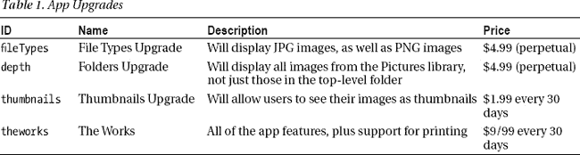

从场景文件的`LicenseInformation`部分省略产品的细节相当于它们不是该产品的许可证——您也可以通过添加一个`Product`元素但将`IsActive`元素设置为`false`来实现这种效果。

##### 切换到新的场景文件

为了使用我的新场景文件，我需要更新`/js/store.js`文件中的代码，如[清单 3](#list_32_3) 所示。通常，您将构建一个不同场景文件的库来支持全面的测试。对于我自己的项目，我发现在我有一套完整的测试来覆盖所有的许可证排列之前，我可能会有多达 20 个不同的场景文件。幸运的是，对于我相对简单的示例应用程序，我不需要那么多文件。

*清单 3。更改 store.js 文件以加载新场景*

`...
loadLicenseData: function () {
    var url = new Windows.Foundation.Uri("**ms-appx:///store/upgrades.xml**");
    return storage.StorageFile.getFileFromApplicationUriAsync(url)
        .then(function (file) {
            return ViewModel.Store.currentApp.reloadSimulatorAsync(file);
        });
},
...`

 **提示**我发现如果我得到了意想不到的结果，那通常是因为我忘记了加载正确的文件。

### 使用许可信息

我现在的目标是使用我定义的许可证信息来设置用户对应用程序中不同功能的权限。我通过`CurrentApp`对象(或者开发过程中的`CurrentAppSimulator`对象)来做这件事。您可以看到我对`/js/store.js`文件所做的更改，以利用清单 4 中的新许可信息。

*清单 4。使用/js/store.js 文件*中的产品许可信息

`(function() {
    var storage = Windows.Storage;

    var licensedCapabilities = {
        basicApp: false,
**        fileTypes: false,**
**        depth: false,**
**        thumbnails: false,**
**        print: false,**
    }

    WinJS.Namespace.define("ViewModel.Store", {
        events: WinJS.Utilities.eventMixin,

        checkCapability: function (name) {
            var available = licensedCapabilities[name] != undefined
                ? licensedCapabilities[name] : true;
            setImmediate(function () {
                ViewModel.Store.events.dispatchEvent("capabilitycheck",
                    { capability: name, enabled: available });
            });
            return available;
       },

        currentApp: Windows.ApplicationModel.Store.CurrentAppSimulator,` 
`        loadLicenseData: function () {
            var url
                = new Windows.Foundation.Uri("ms-appx:///store/upgrades.xml");
            return storage.StorageFile.getFileFromApplicationUriAsync(url)
                .then(function (file) {
                    return ViewModel.Store.currentApp.reloadSimulatorAsync(file);
                });
        },
    });

    ViewModel.Store.currentApp.licenseInformation.addEventListener("licensechanged",
        function () {
            var license = ViewModel.Store.currentApp.licenseInformation;
            licensedCapabilities.basicApp = license.isActive;

**            var products = license.productLicenses;**
**            if (products.lookup(**"**theworks**"**).isActive) {**
**                licensedCapabilities.fileTypes = true;**
**                licensedCapabilities.depth = true;**
**                licensedCapabilities.thumbnails = true;**
**                licensedCapabilities.print = true;**
**            } else {**
**                licensedCapabilities.fileTypes = products.lookup(**"**fileTypes").isActive;**
**                licensedCapabilities.depth = products.lookup(**"**depth**"**).isActive;**
**                licensedCapabilities.thumbnails = products.lookup(**"**thumbnails**"**).isActive;**
**            }**
        });
})();`

#### 处理产品许可证

我在`store.js`文件中做的另一个更改是扩展了`licensechanged`事件的事件处理程序中的代码，这样它就可以处理升级产品的许可证并设置`licensedCapabilities`事件中的属性。

`LicenseInformation`对象定义了一个`productLicenses`属性(我从`CurrentApp.licenseInformation`属性中获得了`LicenseInformation`对象)。由`productLicenses`属性返回的对象允许您使用`lookup`方法查找单个产品，如下所示:

`...
products.lookup("theworks")
...`

lookup 方法的参数是场景文件中`Product`元素的`ProductId`属性值。在上面的片段中，我已经请求了名为`theworks`的升级许可。

lookup 方法返回一个`ProductLicense`对象，它包含所请求产品的许可状态的详细信息。`ProductLicense`对象定义了[表 2](#tab_32_2) 中描述的属性。

T2】

`lookup`方法的好处在于，即使在场景文件中没有相应的`Product`元素，它也会返回一个`ProductLicense`对象——属性`isActive`将被设置为`false`,表示没有值许可。这意味着我可以安全地查找名为`theworks`的产品，并获得一个响应，我可以用它来决定应该启用哪些应用程序功能。我处理产品许可的方法是从查看用户是否购买了`theworks`的许可开始。如果是，那么我启用由`licensedCapabilities`对象定义的所有功能，如下所示:

`...
var products = license.productLicenses;
if (products.lookup("theworks").isActive) {
**    licensedCapabilities.fileTypes = true;**
**    licensedCapabilities.depth = true;**
**    licensedCapabilities.thumbnails = true;**
**    licensedCapabilities.print = true;**
} else {
    licensedCapabilities.fileTypes = products.lookup("fileTypes").isActive;
    licensedCapabilities.depth = products.lookup("depth").isActive;
    licensedCapabilities.thumbnails = products.lookup("thumbnails").isActive;
}
...`

如果用户没有获得作品的有效许可，那么我会依次查找其他产品，并设置相应功能的状态。这意味着，例如，只有当用户拥有`theworks`时，才会启用`print`功能，提供了一个我如何将应用程序功能与升级产品分离的简单演示。

#### 测试许可证信息

您可以通过启动应用程序并在 Visual Studio JavaScript 控制台窗口中输入以下语句来测试许可证信息:

* * *

`["fileTypes", "depth", "thumbnails", "print"].forEach(function(cap) {
    console.log(cap + ": " + ViewModel.Store.checkCapability(cap));
});`

* * *

点击 Return，您应该会看到以下输出，它根据场景文件中的许可证信息指示用户有权使用哪些应用程序功能:

* * *

`fileTypes: true
depth: false
thumbnails: false
print: false`

* * *

如您所料，`fileTypes`功能被启用，所有其他功能被禁用。您可以在应用程序中看到这些信息。关闭告诉您试用期还剩多少天的对话框，尝试更改`ToggleSwitch`控件的位置。您只能移动标有`Show JPG`的选项，因为其他选项与用户无权使用的功能相关。类似地，如果您激活 Devices Charm，您将看到如图[图 1](#fig_32_1) 所示的消息，因为`print`功能对用户不可用。

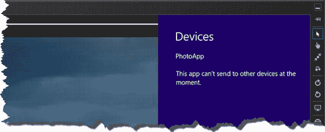

***图 1。**当打印功能未被许可时激活设备魅力*

#### 更正许可权利

既然我已经向您展示了如何检查单个产品的许可信息，我需要返回并纠正`/js/store.js`文件中的代码。当应用程序处于试用期时，我希望用户能够使用所有的应用程序功能，就像他们购买了基本应用程序并订阅了`theworks`升级一样。您可以在清单 5 的[中看到我对`store.js`所做的修改。](#list_32_5)

*清单 5。允许用户在试用期内使用所有功能*

`...
ViewModel.Store.currentApp.licenseInformation.addEventListener("licensechanged",
    function () {
        var license = ViewModel.Store.currentApp.licenseInformation;
        licensedCapabilities.basicApp = license.isActive;

        var products = license.productLicenses;
        if (products.lookup("theworks").isActive
**                || (license.isActive && license.isTrial)) {**

            licensedCapabilities.fileTypes = true;
            licensedCapabilities.depth = true;
            licensedCapabilities.thumbnails = true;
            licensedCapabilities.print = true;
        } else {` `            licensedCapabilities.fileTypes = products.lookup("fileTypes").isActive;
            licensedCapabilities.depth = products.lookup("depth").isActive;
            licensedCapabilities.thumbnails = products.lookup("thumbnails").isActive;
        }
    });
...`

我已经使用了基本应用程序的许可证信息，在未到期的试用期和基本应用程序加`theworks`升级的许可证之间建立了等价关系。

您会记得,`upgrade.xml`场景文件指定应用程序处于试用期，因此如果您在更新了`store.js`文件后重启应用程序，您应该可以访问所有功能。

### 销售升级产品

现在，我的应用程序强制执行产品许可证，我可以提示用户购买升级。如何做到这一点取决于你的应用程序的性质。我建议你仔细考虑这一点，因为以有益和礼貌的方式提示用户和不断向他们索要金钱是有区别的。

对于这一章，我将使用一个简单的方法，即当用户试图使用一个未经许可的特性时，提示用户进行升级。

 **提示**我打算提示用户升级，因为我想把重点放在升级机制上，但我不会在真正的应用程序中这样做，因为这让用户很烦。当我第一次提示用户升级时，我通常会提供一个选项来禁用对同一特性的任何进一步提示。我建议你考虑类似的方法。你可以使用应用数据功能永久记录用户的偏好，我在第 20 章的[中描述过。](20.html#ch20)

您将回忆起当用户试图使用一项功能时，`Windows.Store.checkCapability`方法触发了`capabilitycheck`事件。我在[第 31 章](31.html#ch31)的`/js/storeInteractions.js`文件中对此事件做出了回应，以加强我对基本应用的商业模式，这样我就可以向用户出售应用并加强试用期。我将使用类似的技术来管理升级过程。在接下来的部分中，我将介绍我所做的更改和添加。

#### 调度状态事件

我将从添加对从`ViewModel.State`名称空间调度事件的支持开始。我销售升级的方法是提示用户响应应用布局的变化，我想确保当用户成功购买升级时，我正确地更新了应用布局的状态。这意味着我需要某种方式来表明`ViewModel.State`名称空间中的数据已经更改，为此，我在`/js/viewmodel.js`文件中添加了一些内容，如[清单 6](#list_32_6) 所示。

*清单 6。添加对从 ViewModel 发出事件的支持。状态名称空间*

`(function () {

    WinJS.Namespace.define("ViewModel", {` `        State: WinJS.Binding.as({
            pictureDataSource: new WinJS.Binding.List(),
            fileTypes: false,
            depth: false,
            thumbnails: false,
**            events: WinJS.Utilities.eventMixin,**
**            reloadState: function () {**
**                ViewModel.State.events.dispatchEvent("reloadstate", {});**
**            }**
        }),
    });

    WinJS.Namespace.define("Converters", {
        display: WinJS.Binding.converter(function(val) {
            return val ? "block" : "none";
        })
    });

})();`

名称空间中的单个属性是可以观察到的，但我需要某种方式来表明应用程序状态发生了根本变化，应用程序中的数据应该被刷新。为此，我添加了一个`events`属性，并为其分配了`WinJS.Utilities.eventMixin`对象和一个`reloadState`函数，当被调用时，该函数会触发一个名为`reloadstate`的事件。在接下来的小节中，您将看到我是如何使用该函数并响应事件的。

#### 管理采购流程

当用户试图激活他们无权使用的功能时，我会启动升级购买流程。我通过处理`capabilitycheck`事件来检测这种情况，扩展我在[第 31 章](31.html#ch31)中添加的代码来处理应用购买过程。在[清单 7](#list_32_7) 中，您可以看到我对`/js/storeInteractions.js`文件所做的修改，这些修改扩展了购买，包括了升级。

*清单 7。增加销售应用内升级的支持*

`(function () {

    var pops = Windows.UI.Popups;

    ViewModel.Store.events.addEventListener("capabilitycheck", function (e) {
        if (e.detail.capability == "basicApp") {
            // *...statements removed for brevity...*

**        } else if (e.detail.capability == "print" && !e.detail.enabled) {**
**            var md = new pops.MessageDialog("Printing is only available to subscribers");**
**            md.commands.append(new pops.UICommand("Subscribe"));**
**            md.commands.append(new pops.UICommand("Cancel"));**
**            md.showAsync().then(function (command) {**
**                if (command.label != "Cancel") {**
**                    buyUpgrade("theworks");**` `**                }**
**            });**

**        } else if (!e.detail.enabled) {**
**            var md = new pops.MessageDialog("You need to buy an upgrade to use this "**
**                + " feature or subscribe to unlock all features");**
**            md.commands.append(new pops.UICommand("Upgrade"));**
**            md.commands.append(new pops.UICommand("Subscribe"));**
**            md.commands.append(new pops.UICommand("Cancel"));**
**            md.showAsync().then(function (command) {**
**                if (command.label != "Cancel") {**
**                    var product = command.label**
**                        == "Upgrade" ? e.detail.capability : "theworks";**
**                    buyUpgrade(product).then(function (upgradeResult) {**
**                        if (upgradeResult) {**
**                            var val = ViewModel.State[e.detail.capability];**
**                            if (val != undefined) {**
**                                ViewModel.State[e.detail.capability] = !val;**
**                            }**
**                            ViewModel.State.reloadState();**
**                        }**
**                    });**
**                }**
**            });**
**        }**
    });

    function buyApp() {
        // *...statements removed for brevity...*
    }

**    function buyUpgrade(product) {**
**        var md = new pops.MessageDialog("");**
**        return ViewModel.Store.currentApp.requestProductPurchaseAsync(product, false)**
**        .then(function () {**
**            if (ViewModel.Store.currentApp.licenseInformation.productLicenses**
**                    .lookup(product).isActive) {**
**                md.title = "Success"**
**                md.content = "Your upgrade was succesful. Thank you.";**
**                return md.showAsync().then(function () {**
**                    return true;**
**                });**
**            } else {**
**                return false;**
**            }**
**        }, function () {**
**            md.title = "Error"**
**            md.content = "Your upgrade could not be completed. Please try again.";**
**            return md.showAsync().then(function () {**
**                return false;**
**            });**
**        });**` `**    }**
**}**})();`

您将回忆起当调用`ViewModel.Store.checkCapability`方法时会触发`capabilitycheck`事件。如果要求的功能不是`basicApp`，那么我知道它与我想出售的升级相关联。在接下来的章节中，我将解释如何销售不同类别的升级产品。

##### 间接销售能力

我的应用程序包含了`print`功能(我只将其作为我的`theworks`产品的一部分出售),可以解锁应用程序中的所有内容。这是一个间接升级的例子，我销售的产品不只是激活用户现在想要的功能。我将`print`功能的请求与其他类型的升级分开处理，如下所示:

`...
} else if (**e.detail.capability == "print" && !e.detail.enabled**) {
    var md = new pops.MessageDialog("Printing is only available to subscribers");
    md.commands.append(new pops.UICommand("Subscribe"));
    md.commands.append(new pops.UICommand("Cancel"));
    md.showAsync().then(function (command) {
        if (command.label != "Cancel") {
            buyUpgrade("theworks");
        }
    });
}
...`

我向用户显示一条简单的消息，解释他们请求的功能只对订户可用，并给他们购买订阅的机会，如图[图 2](#fig_32_2) 所示。

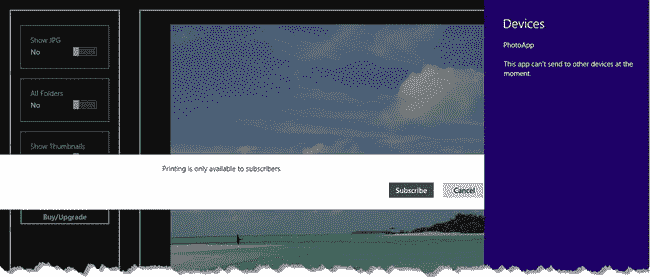

***图二。**请求打印时提示用户订阅*

Windows 8 没有为我提供一种方法来阻止在激活设备魅力时显示设备窗格，所以我显示我的消息，以便用户在关闭窗格时可以看到它。如果用户点击`Subscribe`按钮，然后调用`buyUpgrade`函数，这将启动升级过程(我将很快对此进行描述)。我以`theworks`为参数调用`buyUpgrade`函数，表示用户想要购买订阅产品。

##### 直接销售能力

对于应用程序中的其他功能，我想让用户选择是只购买他们尝试使用的功能，还是订阅并解锁所有功能，我的做法如下:

`...
} else if (!e.detail.enabled) {
    var md = new pops.MessageDialog("You need to buy an upgrade to use this "
        + " feature or subscribe to unlock all features");
**    md.commands.append(new pops.UICommand("Upgrade"));**
**    md.commands.append(new pops.UICommand("Subscribe"));**
**    md.commands.append(new pops.UICommand("Cancel"));**
**    md.showAsync().then(function (command) {**
**        if (command.label != "Cancel") {**
**            var product = command.label**
**                == "Upgrade" ? e.detail.capability : "theworks";**
            buyUpgrade(product).then(function (upgradeResult) {
                if (upgradeResult) {
                    var val = ViewModel.State[e.detail.capability];
                    if (val != undefined) {
                        ViewModel.State[e.detail.capability] = !val;
                    }
                    ViewModel.State.reloadState();
                }
            });
        }
    });
}
...`

我通过给`MessageDialog`添加一个`Subscribe`按钮并改变我传递给`buyUpgrade`函数的参数来达到我想要的效果。你可以在图 3 中看到我呈现给用户的对话框。

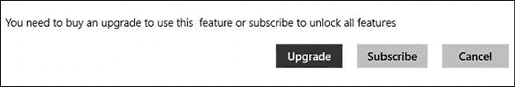

***图三。**向用户出售升级和订阅*

如果用户点击`Upgrade`按钮，我就开始购买解锁该功能的产品。如果用户点击`Subscribe`按钮，我就开始购买`theworks`产品。

如果用户成功购买，那么我会尝试更新与该功能相关联的`ViewModel.State`属性，如果有的话。这就完成了用户通过激活一个`ToggleSwitch`开始的 UI 交互，意味着升级的结果是立竿见影的。用户可以许可的一些升级需要重新加载数据，所以我调用我在[清单 6](#list_32_6) 的`/js/viewmodel.js`文件中定义的`ViewMode.State.reloadState`方法。

#### 刷新应用状态

我需要执行的最后一步是确保应用程序状态反映了用户许可的功能。最简单的方法是从`Pictures`库中重新加载文件，以便应用程序显示用户有权查看的所有图像。您可以在[清单 8](#list_32_8) 中看到我如何刷新应用程序状态以响应`reloadstate`事件，它显示了我对`/js/default.js`文件中的`onactivated`函数所做的更改。

*清单 8。刷新应用状态*

`...
args.setPromise(WinJS.UI.processAll().then(function() {
    return WinJS.Binding.processAll(document.body, ViewModel)
        .then(function () {
            return ViewModel.Store.loadLicenseData().then(function () {

**                ViewModel.State.events.addEventListener("reloadstate", function (e) {**
**                    loadFiles();**
**                    listView.winControl.itemDataSource**
**                        = ViewModel.State.pictureDataSource.dataSource;**
**                });**

                setupPrinting();
                loadFiles();
                ViewModel.Store.checkCapability("basicApp");
            });
    });
}));
...`

为了处理该事件，我调用了`loadFiles`函数，该函数定位用户有权查看的文件。我还刷新了用于显示缩略图的`ListView`控件的数据源，如下所示:

`...
listView.winControl.itemDataSource = ViewModel.State.pictureDataSource.dataSource;
...`

`ListView`控件的一个奇怪之处在于，如果它在被隐藏的时候被初始化，然后显示给用户，它就不能正确显示内容——你得到的只是一个看起来空空的控件。一个快速简单的修复方法是设置`itemDataSource`属性，它触发更新并生成新的内容元素。我没有改变数据源——我只是将它再次分配给 control 属性，以便当用户购买查看缩略图的功能时，内容能够正确显示。

#### 购买升级

`buyUpgrade`函数负责发起购买过程并响应结果。`currentApp`对象定义了`requestProductPurchaseAsync`方法，该方法启动 Windows 商店升级过程(或者在使用`CurrentAppSimulator`对象时的购买模拟)。该方法的参数是与购买相关的产品的`ProductId`值和指示是否需要收据的`boolean`值:

`...
ViewModel.Store.currentApp.**requestProductPurchaseAsync**(product, false)
...`

我收到了应该购买的产品作为`buyUpgrade`函数的参数，我指定了`false`，表示我不想要收据。`requestProductPurchaseAsync`方法返回一个`Promise`,当购买过程完成时，它被实现。当购买成功时，执行成功处理函数，否则执行错误处理函数。我向用户显示确认购买结果的消息，如下所示:

`...
function buyUpgrade(product) {
    var md = new pops.MessageDialog("");
    return ViewModel.Store.currentApp.requestProductPurchaseAsync(product, false)
    .then(function () {
        if (ViewModel.Store.currentApp.licenseInformation.productLicenses
                .lookup(product).isActive) {
**            md.title = "Success"**
**            md.content = "Your upgrade was succesful. Thank you.";**
**            return md.showAsync().then(function () {**
**                return true;**
            });
        } else {
**            return false;**
        }
    }, function () {
**        md.title = "Error"**
**        md.content = "Your upgrade could not be completed. Please try again.";**
**        return md.showAsync().then(function () {**
**            return false;**
**        });**
    });
}
...`

我的`buyUpgrade`函数返回一个`Promise`,当用户关闭消息对话框时该函数被满足，如果购买成功则产生`true`,否则产生`false`,允许我构建动作链，比如刷新应用程序状态。

#### 测试场景

如果您启动应用程序并将`Show Thumbnails`切换开关滑动到`Yes`位置，系统会提示您升级或订阅。点击`Upgrade`按钮，会出现模拟购买对话框，如图[图 4](#fig_32_4) 所示。

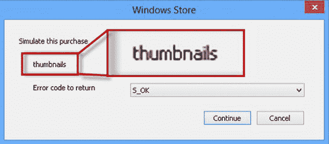

***图 4。**模拟购买升级*

这是模拟应用程序购买的同一个对话框，它有相同的结果选择。该对话框显示所购买产品的名称，我在图中突出显示了该名称。

确保选择了`S_OK`选项，并点击`Continue`按钮模拟成功购买。当您关闭确认购买成功的对话框时，您会看到应用布局更新为显示缩略图，并且`ToggleSwitch`已经移动到`Yes`位置，如图[图 5](#fig_32_5) 所示。

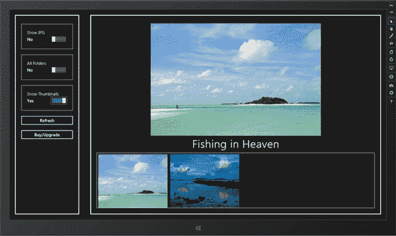

***图 5。**购买缩略图功能许可证的影响*

其他功能仍然未经许可，这意味着如果你滑动其他`ToggleSwitch`控件或激活设备的魅力，你会再次得到提示。

##### 测试订阅升级

重启应用程序，使许可信息重置为场景文件的内容，并再次滑动`Show Thumbnails`切换开关。这一次，当出现提示时，点击`Subscribe`按钮。您将再次看到购买模拟器对话框，但这次购买的产品被报告为`theworks`，如图[图 6](#fig_32_6) 所示。

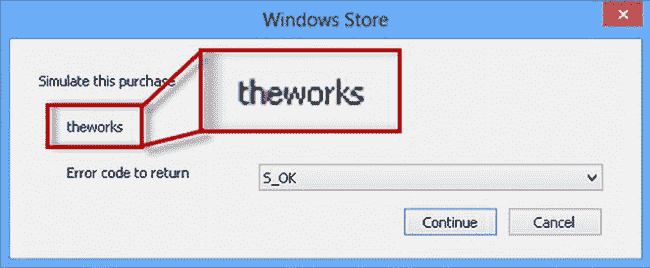

***图六。**模拟购买解锁多种能力的升级*

选择`S_OK`选项并点击`Continue`按钮，模拟一次成功的购买。缩略图将像以前一样显示，但这一次应用程序的其他功能也已解锁——例如，如果您将`All Folders` ToggleSwitch 滑动到`Yes`位置，将使用深度查询来定位您的`Pictures`库中的文件，如图[图 7](#fig_32_7) 所示。

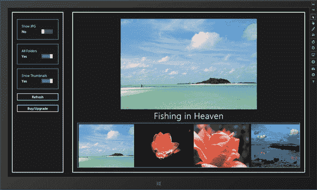

***图 7。**购买适用于多种能力的升级的效果*

### 创建应用内商店

我对示例应用程序的最后一个添加是连接`Buy/Upgrade`按钮，以便为我想卖给用户的各种产品创建一个店面。到目前为止，我的所有销售提示都是由用户试图执行特定操作而触发的，但我也想让用户有机会在任何时候出于任何原因进行购买。在接下来的部分中，我将对应用程序进行一系列的添加，以便用户可以点击按钮，看到可用的选项，并进行购买。

 **注意**这种添加需要相对大量的代码，但它对许多应用程序来说是一种重要的添加，需要我在本书中向你展示的许多技术——包括数据绑定、模板和`Flyout`控件——以及一些基本的 DOM 操作。这一部分的清单有点长，但是我建议努力完成它们。

#### 增强视图模型。存储命名空间

我不想将我的商业模式的细节泄露到应用程序的主要功能中，所以我将对`ViewModel.Store`名称空间进行一些添加，以表示产品并启动购买，而不直接公开`Windows.ApplicationModel.Store`名称空间。您可以在清单 9 的[中看到我对`/js/store.js`文件所做的添加。](#list_32_9)

*清单 9。扩展视图模型的功能。商店名称空间*

`(function() {
    var storage = Windows.Storage;

    var licensedCapabilities = {
        basicApp: false,
        fileTypes: false,
        depth: false,
        thumbnails: false,
        print: false,
    }

    WinJS.Namespace.define("ViewModel.Store", {
        events: WinJS.Utilities.eventMixin,

        checkCapability: function (name) {
            //   *...statements omitted for brevity...*
        },

        currentApp: Windows.ApplicationModel.Store.CurrentAppSimulator,

        loadLicenseData: function () {
            //   *...statements omitted for brevity...*
        },

**        isBasicAppPurchased: function () {**
**            var license = ViewModel.Store.currentApp.licenseInformation;**` `**            return license.isActive && !license.isTrial;**
**        },**

**        isFullyUpgraded: function() {**
**            return ViewModel.Store.currentApp.licenseInformation.productLicenses**
**                .lookup("theworks").isActive;**
**        },**

**        getProductInfo: function () {**
**            var products = [**
**                { id: "p1", name: "Product 1", price: "$4.99", purchased: true },**
**                { id: "p2", name: "Product 2", price: "$1.99", purchased: false },**
**                { id: "p3", name: "Product 3", price: "$10.99", purchased: false },**
**                { id: "p4", name: "Product 4", price: "$0.99", purchased: false }];**
**            return products;**
**        },**
**        requestAppPurchase: function() {**
**            ViewModel.Store.events.dispatchEvent("apppurchaserequested");**
**        },**

**        requestUpgradePurchase: function (productId) {**
**            ViewModel.Store.events.dispatchEvent("productpurchaserequested",**
**               { product: productId });**
**        }**
    });

    ViewModel.Store.currentApp.licenseInformation.addEventListener("licensechanged",
        function () {
            //   *...statements omitted for brevity...*
        });
})();`

我添加到`ViewModel.Store`名称空间的函数分为三类:两个提供管理`button`元素所需的信息，一个提供可用产品的目录，两个启动购买过程。我将在下面的章节中解释每一个。

##### 为布局提供信息

与 Windows 商店(或任何其他商业平台，就此而言)集成的一个方面是应用程序可能处于的不同状态的数量，以及满足所有这些状态的需要。你可以在`getStoreLabel`、`isBasicAppPurchased`和`isFullyUpgraded`函数中看到这一点的缩影，我使用所有这些函数来管理`Buy/Upgrade`按钮在应用程序布局中的呈现。

如果用户是通过免费试用期的一部分，那么我希望按钮提供他们购买应用程序的机会。Windows Store 不允许用户购买应用内升级，直到购买了基本应用，因此我需要确保我为用户提供正确的交易，以便提供合理而有用的用户体验。

`isBasicAppPurchased`允许我告诉什么时候我需要向用户出售基本应用，什么时候我需要出售升级。另一方面，当用户购买了`theworks`升级时，我想禁用`button`元素，因为没有什么可卖的了。为此，我创建了 `isFullyUpgraded`函数，当不再有任何产品留给用户时，该函数返回`true`。

 **提示**请注意，我没有透露任何定义基本应用程序功能的细节，也没有透露必须购买哪些产品才能创建完全升级的条件。我热衷于在应用程序的不同部分之间保持强烈的分离感，而不是在`store.js`文件之外的任何地方建立商业模式的知识，以便我在未来可以更容易地进行调整。

##### 提供产品信息

`getProductInfo`功能提供了应用程序可用升级的详细信息。该函数返回一个对象数组，每个对象都包含表示商店产品`id`(对应于场景文件中的条目)、应该向用户显示的`name`、升级的`price`以及产品是否已经是`purchased`的属性，如下所示:

`...
getProductInfo: function () {
    var products = [
**        { id: "p1", name: "Product 1", price: "$4.99", purchased: true },**
**        { id: "p2", name: "Product 2", price: "$1.99", purchased: false },**
**        { id: "p3", name: "Product 3", price: "$10.99", purchased: false },**
**        { id: "p4", name: "Product 4", price: "$0.99", purchased: false }];**
    return products;
},
...`

我最初实现这个函数时使用了静态虚拟数据。当我使用 Windows Store 时，我经常这样做，因为这让我可以绝对确保我不会依赖于`Windows.ApplicationModel.Store`名称空间中的对象或应用程序中销售的实际产品。同样，我这样做是为了使长期维护尽可能容易。一旦我让应用程序内商店前台功能正常工作并添加对生成真实数据的支持，我将返回到这个函数。

##### 为购买提供支持

我添加到`ViewModel.Store`名称空间的最后两个函数为应用程序的其他部分提供支持，以启动应用程序和升级购买。我在不久前创建的布局中使用这个特性向用户显示产品:

`...
requestAppPurchase: function() {
    ViewModel.Store.events.dispatchEvent("**apppurchaserequested**");
},

requestUpgradePurchase: function (productId) {
    ViewModel.Store.events.dispatchEvent("**productpurchaserequested**",
        { product: productId });
}
...`

`storeInteractions.js`文件包含处理购买过程的代码，我不想将该功能与`store.js`文件紧密耦合，所以我使用两个新事件发出购买请求:`apppurchaserequested`和`productpurchaserequested`。我将在下一节处理这些事件。

#### 定义商场互动

为了理清后端流程，我需要处理我在 store.js 文件的`storeInteractions.js`文件中创建的两个新事件，该文件已经包含了我需要卖给用户的所有代码。您可以在[清单 10](#list_32_10) 中看到我对`storeInteractions.js`文件所做的添加。

*清单 10。响应 storeInteractions.js 文件中的新购买事件*

`(function () {

    var pops = Windows.UI.Popups;

    ViewModel.Store.events.addEventListener("capabilitycheck", function (e) {
        // *...statements omitted for brevity...*
    });

**    ViewModel.Store.events.addEventListener("apppurchaserequested", function () {**
**        buyApp().then(function (result) {**
**            if (result) {**
**                ViewModel.State.reloadState();**
**            }**
**        });**
**    });**

**    ViewModel.Store.events.addEventListener("productpurchaserequested", function (e) {**
**        buyUpgrade(e.detail.product).then(function (result) {**
**            if (result) {**
**                ViewModel.State.reloadState();**
**            }**
**        });**
**    });**

    function buyApp() {
        // *...statements omitted for brevity...*
    }

    function buyUpgrade(product) {
        // *...statements omitted for brevity...*
    }

})();`

收到事件后，我调用现有的`buyApp`或`buyUpgrade`函数，并在成功购买后调用`ViewModel.State.reloadState`方法，以确保应用程序布局反映新获得的功能。

#### 定义标记和样式

我将使用一个`WinJS.UI.Flyout`控件向用户展示应用内商店，我在[第 12 章](12.html#ch12)中对此进行了描述。商店将包含由`ViewModel.Store.getProductInfo`方法返回的每个产品的详细信息，我将使用一个`WinJS.Binding.Template`对象生成我需要的 HTML 元素，我在第 8 章的[中对此进行了描述。您可以看到我对清单 11](08.html#ch8) 中的`default.html`文件所做的修改，添加了`Flyout`和模板。

*清单 11。将弹出按钮和模板添加到 default.html 文件*

`...
<body>
    

        

            
            

        

    

    

        

            
        

    

**    
**
**        

**
**        

**
**    
**

**    
**
**        
Upgrades
**
**        
**
**            
Name
**
**            
Price
**
**            
Buy
**
**        
**
**        
**
**            <button>Cancel</button>**
**        
**
**    
**

    <!-- *other markup removed for brevity* -->
</body>
...`

这个新标记非常简单。我将为每个产品生成`productTemplate`模板中的元素，并将它们添加到`Flyout`中的`productContainer`元素中(以及我将在代码中生成的一些补充元素)。我向名为`/css/store.css`的项目添加了一个新的样式表，以包含我用于`Flyout`和模板元素的样式，您可以在[清单 12](#list_32_12) 中看到这个新文件的内容。

*清单 12。定义弹出菜单和模板元素的样式*

`.title {font-size: 20pt;text-align: center;}
#productContainer {display: -ms-grid;}
.pname, .pprice, .pbuy, .purchased {margin: 10px;}
.pname {-ms-grid-column: 1;}
.pprice {-ms-grid-column: 2; text-align: right;}
.pbuy, .purchased { text-align: center; -ms-grid-column: 3;}
#cancelContainer {text-align: center}`

我依靠 CSS 网格布局来定位元素；一部分网格信息是通过样式表应用的，另一部分是当我从`default.js`文件中的模板生成元素时在代码中应用的，我将在下一节中描述。我向`default.html`文件的`head`部分添加了一个脚本元素，以便在应用程序中包含新文件，如清单 13 中的[所示。](#list_32_13)

*清单 13。将 store.css 文件的脚本元素添加到 default.html 文件*

`...
<head>
    <meta charset="utf-8" />
    <title>PhotoApp</title>

    <!-- WinJS references -->
    <link href="//Microsoft.WinJS.1.0/css/ui-dark.css" rel="stylesheet" />
    
    

    <!-- PhotoApp references -->
    <link href="/css/default.css" rel="stylesheet" />
**    <link href="/css/store.css" rel="stylesheet" />**
    
    
    
    
</head>
...`

#### 编写代码

我已经为我的应用内商店做好了所有的基础准备，剩下的就是将代码添加到`/js/default.js`文件中，将各个部分组合在一起。您可以在清单 14 中看到我添加的内容。

*清单 14。实现应用商店所需的 default.js 文件的附加内容*

`(function () {
    "use strict";

    WinJS.Binding.optimizeBindingReferences = true;

    var app = WinJS.Application;
    var activation = Windows.ApplicationModel.Activation;` `var storage = Windows.Storage;
    var search = storage.Search;

    app.onactivated = function (args) {
        if (args.detail.kind === activation.ActivationKind.launch) {
            if (args.detail.previousExecutionState !==
                activation.ApplicationExecutionState.suspended) {

                // *...statements removed for brevity...*
            }

            args.setPromise(WinJS.UI.processAll().then(function() {
                return WinJS.Binding.processAll(document.body, ViewModel)
                    .then(function () {
                        return ViewModel.Store.loadLicenseData().then(function () {

                            ViewModel.State.events.addEventListener("reloadstate",
                                    function (e) {
                                loadFiles();
                                listView.winControl.itemDataSource
                                    = ViewModel.State.pictureDataSource.dataSource;
**                                configureUpgradeButton();**
                            });

**                            upgrade.addEventListener("click", function () {**
**                                if (ViewModel.Store.isBasicAppPurchased()) {**
**                                    showStoreFront();**
**                                } else {**
**                                    ViewModel.Store.requestAppPurchase();**
**                                }**
**                            });**

                            setupPrinting();
                            loadFiles();
**                            configureUpgradeButton();**
                            ViewModel.Store.checkCapability("basicApp");
                        });
                });
            }));
        }
    };

**    function configureUpgradeButton() {**
**        if (ViewModel.Store.isFullyUpgraded()) {**
**            upgrade.disabled = "true"**
**        } else if (ViewModel.Store.isBasicAppPurchased()) {**
**            upgrade.innerText = "Upgrade";**
**        } else {**
**            upgrade.innerText = "Purchase";**
**        }**
**    }**` `**    function showStoreFront() {**
**        var products = ViewModel.Store.getProductInfo();**
**        var rowNum = 2;**
**        WinJS.Utilities.empty(productContainer);**
**        products.forEach(function (product) {**
**            productTemplate.winControl.render(product).then(function (newDiv) {**
**                if (!product.purchased) {**
**                    var button = document.createElement("button");**
**                    button.innerText = "Buy";**
**                    button.setAttribute("data-product", product.id);**
**                    WinJS.Utilities.addClass(button, "pbuy");**
**                    newDiv.appendChild(button);**
**                } else {**
**                    var div = document.createElement("div");**
**                    div.innerText = "Purchased";**
**                    WinJS.Utilities.addClass(div, "purchased");**
**                    newDiv.appendChild(div);**
**                }**
**                while (newDiv.children.length > 0) {**
**                    var celem = newDiv.children[0];**
**                    celem.style.msGridRow = rowNum;**
**                    productContainer.appendChild(celem);**
**                }**
**            });**
**            rowNum++;**
**        });**
**        WinJS.Utilities.query("button.pbuy", productContainer).listen("click",**
**                function(e) {**
**            var productId = e.target.getAttribute("data-product");**
**            ViewModel.Store.requestUpgradePurchase(productId);**
**        });**

**        WinJS.Utilities.query("#cancelContainer button").listen("click", function () {**
**            storeFlyout.winControl.hide();**
**        });**

**        storeFlyout.winControl.show(upgrade);**
**    }**

    function setupPrinting() {
        // *...statements removed for brevity...*
    }

    function loadFiles() {
        // *...statements removed for brevity...*
    };

    app.start();
})();`

这里有很多新代码，但都很简单。为了便于理解，我将把它分成两个部分。

##### 管理按钮元素

我的第一个任务是确保用户点击显示商店的`button`元素被正确显示，这是我通过添加`configureUpgradeButton`函数完成的，如下所示:

`...
function configureUpgradeButton() {
    if (**ViewModel.Store.isFullyUpgraded**()) {
        upgrade.disabled = "true"
    } else if (**ViewModel.Store.isBasicAppPurchased**()) {
        upgrade.innerText = "Upgrade";
    } else {
        upgrade.innerText = "Purchase";
    }
}
...`

您可以看到我是如何使用在`ViewModel.Store`名称空间中添加的方法来处理按钮的。如果应用程序已经完全升级，没有什么可卖的，那么我禁用按钮。如果用户已经购买了应用程序，那么我将按钮中的文本设置为`Upgrade`，如果用户还没有购买基本功能，我将文本设置为`Purchase`。当我测试我的应用商店功能时，你可以在本章的后面看到这些不同的状态。

我还使用了`isBasicAppPurchased`方法来判断当用户点击按钮时该做什么。如果用户还没有购买基础 app，那么我调用`ViewModel.Store.requestAppPurchase`方法，这将导致 app 购买过程开始，如下所示:

`...
upgrade.addEventListener("click", function () {
    if (**ViewModel.Store.isBasicAppPurchased()**) {
        showStoreFront();
    } else {
**        ViewModel.Store.requestAppPurchase();**
    }
});
...`

如果用户*已经让*购买了这个应用程序，那么我调用`showStoreFront`函数，我将在下一节描述这个函数。

##### 推广弹出型按钮

`showStoreFront`函数负责填充`Flyout`控件并对其进行配置，以便用户可以开始升级的购买过程。这个函数的代码很冗长，因为我用一个`button`来补充从模板生成的元素，以发起对产品的购买，或者用一个`div`元素来表示已经购买了升级。如果您忽略函数的这一部分，代码的其余部分将变得更容易理解，如下所示:

`...
function showStoreFront() {
    var products = ViewModel.Store.getProductInfo();` `    var rowNum = 2;
    WinJS.Utilities.empty(productContainer);
    products.forEach(function (product) {
        productTemplate.winControl.render(product).then(function (newDiv) {
            // *...statements to supplement template elements omitted...*
        });
        rowNum++;
    });
    WinJS.Utilities.query("button.pbuy", productContainer).listen("click",
            function(e) {
        var productId = e.target.getAttribute("data-product");
        ViewModel.Store.requestUpgradePurchase(productId);
     });
    WinJS.Utilities.query("#cancelContainer button").listen("click", function () {
        storeFlyout.winControl.hide();
    });

    storeFlyout.winControl.show(upgrade);
}
...`

我为每个产品的`Flyout`添加元素，并为启动升级过程的按钮的`click`事件设置一个处理程序。一旦我填充并配置了`Flyout`控件，我就调用`show`方法将它显示给用户。当我测试新功能时，您可以在下一部分看到商店是如何出现的。

#### 测试应用商店功能

我已经准备好测试我为应用商店添加的新功能，尽管你会注意到我仍然在使用我的静态虚拟产品数据。只有当我对应用内商店的工作方式感到满意时，我才会转向真实数据。我需要从配置我的场景文件开始。我仍然在使用我在本章前面创建的`upgrades.xml`文件，在[清单 15](#list_32_15) 中，你可以看到`LicenseInformation.App`部分的初始设置，这是我将为这些测试更改的部分。

*清单 15。基本应用购买测试的许可证配置*

`...
<LicenseInformation>
  <App>
**    <IsActive>true</IsActive>**
**    <IsTrial>true</IsTrial>**
**    <ExpirationDate>2012-09-30T00:00:00.00Z</ExpirationDate>**
  </App>
  <Product ProductId="fileTypes">
    <IsActive>true</IsActive>
  </Product>
  <Product ProductId="thumbnails">
    <IsActive>false</IsActive>
    <ExpirationDate>2011-09-30T00:00:00.00Z</ExpirationDate>` `  </Product>
</LicenseInformation>
</CurrentApp>
...`

我想模拟一个还没有到期的试用期，所以我将`isActive`和`isTrial`元素设置为`true`，并在`ExpirationDate`元素中指定一个日期，对我来说是将来的某一天。你必须使用不同的日期来获得正确的效果。

##### 测试基本应用程序购买

启动该应用程序，在您取消关于试用期还剩多少天的提醒后，您会看到布局中的按钮标记为`Purchase`。如果您点击此按钮，您将看到购买模拟器对话框，其中将显示正在购买基本应用程序。

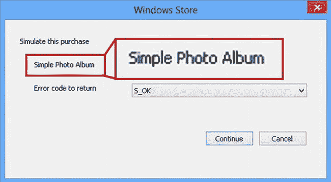

***图 8。**模拟购买基本应用功能*

确保选择了`S_OK`选项并点击`Continue`按钮，模拟一次成功的购买。当您关闭确认您购买的消息时，您会看到按钮标签已更改为`Upgrade`。

##### 测试升级采购

不用重启 app，再次点击按钮就会看到应用内商店，如图[图 9](#fig_32_9) 所示。我使用了一个非常基本的布局，但是您可以看到我是如何显示虚拟产品数据来为用户提供升级的。

单击其中一个`Buy`按钮，您将看到购买模拟器对话框，尽管是针对一个在场景文件中不存在的产品。

***图九。**显示虚拟产品数据的应用内商店*

#### 添加真实产品数据

现在我知道我的应用内商店工作了，我可以添加真正的产品数据，这是通过修改`/js/store.js`文件中的代码来完成的。您可以在清单 16 中看到我所做的修改。

*清单 16。使用真实产品数据*

`...
getProductInfo: function () {
**    return ViewModel.Store.currentApp.loadListingInformationAsync()**
**    .then(function (info) {**

**        var products = [];**
**        var cursor = info.productListings.first();**
**        do {**
**            var prodInfo = cursor.current;**

**            products.push({**
**                id: prodInfo.value.productId,**
**                name: prodInfo.value.name,**
**                price: prodInfo.value.formattedPrice,**
**                purchased: ViewModel.Store.currentApp.licenseInformation.productLicenses**
**                    .lookup(prodInfo.value.productId).isActive**
**            });**
**        } while (cursor.moveNext());**
**        return products;**
**    });**` `},
...`

`CurrentApp`和`CurrentAppSimjulator`对象定义了`loadListingInformationAsync`。该方法返回一个`Promise`,完成后会产生一个`Windows.ApplicationModel.Store.ListingInformation`对象，其中包含 Windows 应用商店中关于您的应用及其升级的列表信息——该信息对应于场景文件的`ListingInformation`部分。`ListingInformation`对象定义了我在[表 3](#tab_32_3) 中描述的属性。

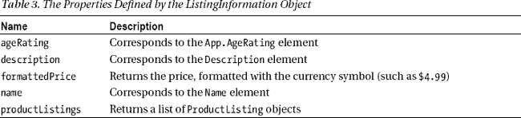

我对应用内商店感兴趣的是`productListings`属性，因为它返回了一个`ProductListing`对象的列表，每个对象描述了我的应用的一个升级。`ProductListing`对象定义了我在[表 4](#tab_32_4) 中描述的属性。

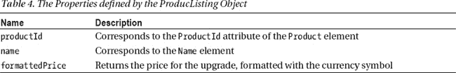

属性返回的对象将对象呈现为一个列表，这就是为什么我使用了一个 T2 循环。对于每个产品列表，我创建一个具有我的应用内商店`Flyout`所需属性的对象，并查找每个产品的许可信息，以查看是否已经购买。

我修改过的`getProductInfo`方法的结果是一个`Promise`，当它被实现时，产生一个描述性对象的数组；这意味着我需要更新`default.js`文件中的`showStoreFront`函数来期待`Promise`，如[清单 17](#list_32_17) 所示。

*清单 17。修改 Default.js 文件*中的 showStoreFront 函数

`function showStoreFront() {
**    ViewModel.Store.getProductInfo().then(function (products) {**
        var rowNum = 2;
        WinJS.Utilities.empty(productContainer);
        products.forEach(function (product) {
            productTemplate.winControl.render(product).then(function (newDiv) {
                if (!product.purchased) {
                    var button = document.createElement("button");
                    button.innerText = "Buy";` `button.setAttribute("data-product", product.id);
                    WinJS.Utilities.addClass(button, "pbuy");
                    newDiv.appendChild(button);
                } else {
                    var div = document.createElement("div");
                    div.innerText = "Purchased";
                    WinJS.Utilities.addClass(div, "purchased");
                    newDiv.appendChild(div);
                }
                while (newDiv.children.length > 0) {
                    var celem = newDiv.children[0];
                    celem.style.msGridRow = rowNum;
                    productContainer.appendChild(celem);
                }
            });
            rowNum++;
        });
        WinJS.Utilities.query("button.pbuy", productContainer).listen("click",
                function (e) {
            var productId = e.target.getAttribute("data-product");
            ViewModel.Store.requestUpgradePurchase(productId);
        });
        WinJS.Utilities.query("#cancelContainer button").listen("click", function () {
            storeFlyout.winControl.hide();
        });

        storeFlyout.winControl.show(upgrade);`     });
`}`

通过这一更改，我的应用内商店功能将显示真实的产品数据，这些数据在使用`CurrentAppSimulator`对象时从场景文件中获得，在使用`CurrentApp`对象时从 Windows 商店数据中获得。

#### 用真实数据测试应用内商店

最终测试是检查真实产品数据是否正确显示，以及当用户购买`theworks`升级时布局中的按钮是否被禁用。首先更新`upgrades.xml`场景文件，这样应用程序启动时就有了基本应用程序的许可证。将`IsActive`元素设置为`true`，将`IsTrial`元素设置为`false`，如[清单 18](#list_32_18) 所示。

*清单 18。更新最终测试的场景文件*

`...
<LicenseInformation>
  <App>
**    <IsActive>true</IsActive>**
**    <IsTrial>false</IsTrial>**
    <ExpirationDate>2012-09-30T00:00:00.00Z</ExpirationDate>
  </App>
  <Product ProductId="fileTypes">
    <IsActive>true</IsActive>` `  </Product>
  <Product ProductId="thumbnails">
    <IsActive>false</IsActive>
    <ExpirationDate>2011-09-30T00:00:00.00Z</ExpirationDate>
  </Product>
</LicenseInformation>
...`

启动应用程序，点击标有`Upgrade`的按钮；你会看到应用商店显示真实的产品数据，如图 10 所示。

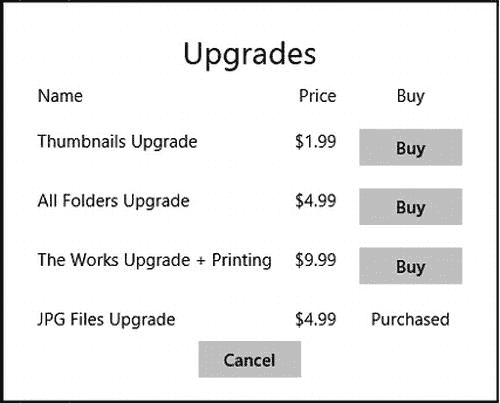

***图 10。**显示真实产品数据的应用内商店*

您可以看到,`JPG Files Upgrade`显示为 purchased，这与场景文件的`LicenseInformation`部分中的数据相匹配。点击`The Works Upgrade`的`Buy`按钮，您将看到购买模拟器对话框。如果您模拟一次成功的购买并关闭确认对话框，您将会看到`Upgrade`按钮现在已被禁用，表示没有进一步的升级可用。

### 总结

在本章中，我向您展示了如何利用 Windows 应用商店支持销售应用内升级。我演示了如何销售单个和多个应用程序功能的升级，以及如何确定用户购买了哪些功能。我还演示了如何创建一个应用商店，它允许用户随时购买升级。在下一章，也是本书的最后一章，我将向你展示如何准备并发布你的应用到 Windows 应用商店。