# 三十三、发布到 Windows 应用商店

在这一章中，我完成了我在[第 30 章](30.html#ch30)中开始的流程，并准备好我的应用，以便它可以提交到 Windows Store 进行认证和上市。我将向您展示如何准备 Windows 应用商店仪表板上的应用列表，如何测试您的应用以发现问题，以及如何将您的应用上传到 Microsoft 以便进行测试。

### 准备应用列表

现在，我已经有了一个可以运行并经过测试的应用，我需要返回到 Windows 应用商店仪表板，并完成发布过程中的更多步骤。您可以通过从 Visual Studio `Store`菜单中选择`Open Developer Account`来打开仪表板。

在[第 30 章](30.html#ch30)中，我通过为 app 保留一个名称，完成了发布过程的第一步；你会看到这一步在 Windows Store 中显示为完成，如图[图 1](#fig_33_1) 所示。

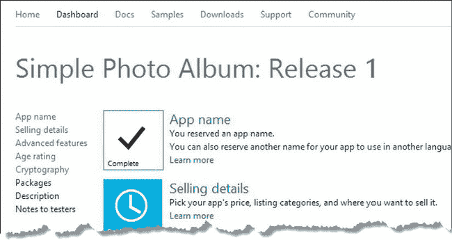

***图 1。**显示已完成第一步的 Windows Store 仪表盘*

在接下来的几节中，我将完成更多的步骤，以便为应用的最终检查、测试和更改做好准备。

#### 完成销售详情部分

点击`Selling Details`链接，设置基础应用的定价信息。我将对我的示例应用收取 4.99 美元，并提供 30 天的试用期(你可以在图 2 中看到我是如何配置的)。

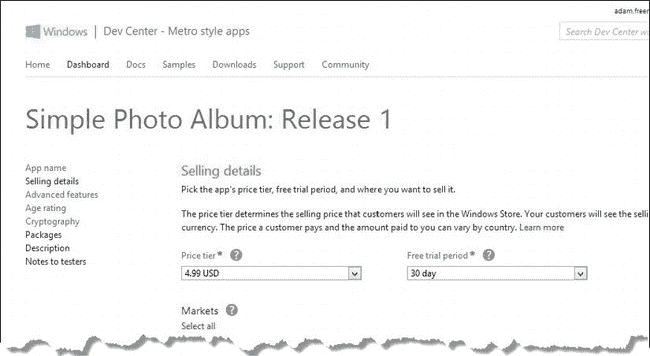

***图二。**设置 app 的销售详情*

检查您想要销售应用的市场。我使用`Select all`链接选择了 Windows Store 运营的所有市场，以便尽可能广泛地销售我的应用。微软会自动为我的应用定价，价格相当于我在当地的美元价格。点击`Save`按钮，保存销售详情；您将返回到步骤列表。

#### 完成高级功能部分

点击`Advanced Features`链接，设置应用内升级的列表信息。(这一部分也可用于配置 notification services，我没有在本书中介绍，因为它们需要服务器功能才能工作)。

使用 web 表单创建您想要提供的一组升级。确保`Product ID`字段对应于您已经用场景文件测试的产品之一是很重要的；否则，您将创建用户无法许可的应用功能。你可以在[图 3](#fig_33_3) 中看到我为我的示例应用创建的升级集。点击`Save`按钮保存这些设置并返回主列表。

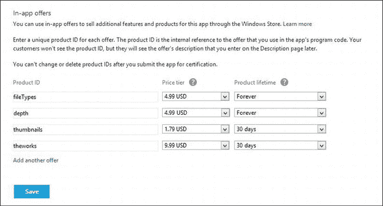

***图三。**创建应用内升级*

#### 完成年龄评定部分

点击`Age rating and rating certificates`链接，选择你的应用适合的年龄段。Windows 应用商店仪表板提供了每个年龄组的目标受众和应用功能的相关信息。选择最合适的群体，请记住，面向年轻用户的应用将无法访问设备和传感器。我选择了`12+`类别，如图[图 4](#fig_33_4) 所示。点击`Save`按钮保存这些设置并返回主列表。

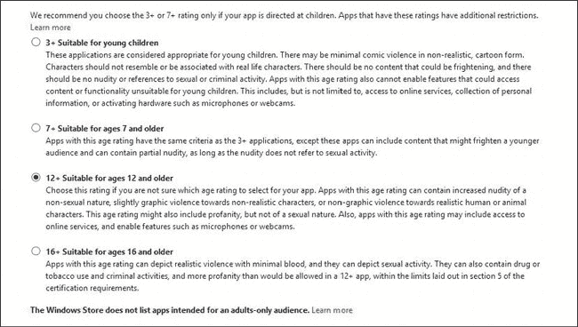

***图 4。**选择应用的年龄等级*

#### 完成加密部分

点击`Cryptography`链接，指定您的应用是否使用加密技术。包括美国在内的相当多的国家限制使用或出口加密技术，因此对这一部分做出准确的声明尤为重要。我选中了 No 选项，如图 5 所示，因为我的示例应用没有使用任何形式的加密技术。

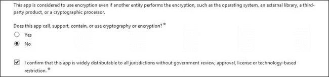

***图 5。**宣布使用加密技术*

这是最后一个最需要的改变，所以当你点击`Save`按钮时，你应该看到前五个步骤已经完成，如图[图 6](#fig_33_6) 所示。稍后我会回来完成剩下的步骤。

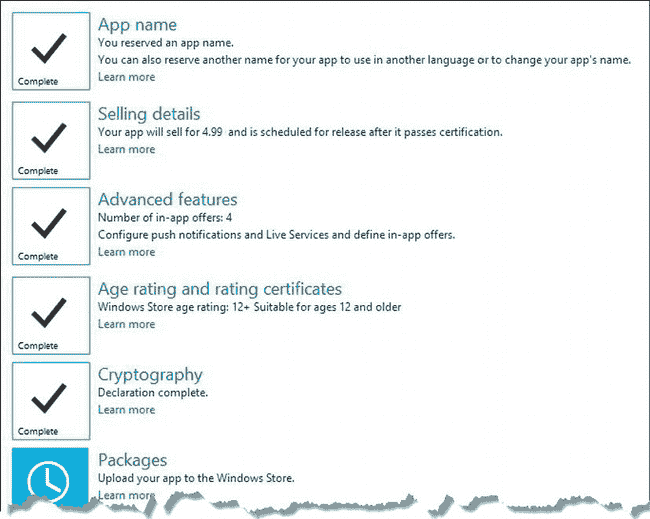

***图六。**正在进行发布流程*

### 将应用与商店关联

下一步是更新 Visual Studio 项目，使其与 Windows 应用商店列表相关联。为此，从 Visual Studio `Store`菜单中选择`Associate App with the Store`菜单项。一旦你提供了你的开发者证书，你就可以从你创建的应用列表中选择，如图[图 7](#fig_33_7) 所示。

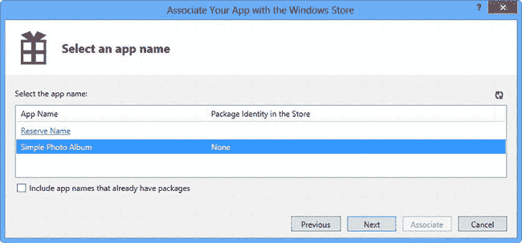

***图 7。**为应用选择列表*

选择一个列表并点击`Next`按钮。我已经选择了我的`Simple Photo Album`列表，但是因为你不能用完全相同的名称创建列表，你将看到你创建的列表。

您将看到从 Windows 应用商店列表中获取并在应用清单中使用的值的详细信息，如[图 8](#fig_33_8) 所示。

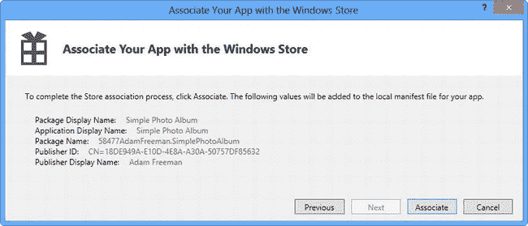

***图 8。**将在清单中使用的商店值列表*

单击`Associate`按钮，将 Visual Studio 项目与 Windows 应用商店列表相关联。您的清单将被更新，以便项目中的关键字段与您在清单中提供的信息相匹配。

#### 提供商店标志

此时，您需要添加一个徽标，该徽标将显示在 Windows 应用商店中您的应用旁边，它是以 50 × 50 像素文件的形式提供的。我使用了与磁贴和闪屏相同的标志，我将它添加到项目的`images`文件夹中的一个名为`store50.png`的文件中。

要应用商店徽标，打开`package.appxmanifest`文件，导航到`Packaging`选项卡，并更改`Logo`字段的值，如图[图 9](#fig_33_9) 所示。

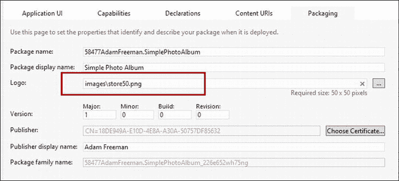

***图九。**更换店标*

### 删除商店模拟代码

在发布之前，从应用中移除`CurrentAppSimulator`对象并用`CurrentApp`替换它是很重要的。您可以看到我在`/js/store.js`文件中所做的更改，以准备在[清单 1](#list_33_1) 中发布应用。我发现能够轻松地返回到处理错误报告的测试代码很有帮助，所以我注释掉了模拟代码，而不是删除它。

*清单 1。从/js/store.js 文件中删除商店模拟代码*

`...
WinJS.Namespace.define("ViewModel.Store", {
    events: WinJS.Utilities.eventMixin,

    checkCapability: function (name) {
        // *...statements omitted for brevity...*
    },

**    //currentApp: Windows.ApplicationModel.Store.CurrentAppSimulator,**
**    currentApp: Windows.ApplicationModel.Store.CurrentApp,**
**    loadLicenseData: function () {**` `**        //var url**
        //    = new Windows.Foundation.Uri("ms-appx:///store/upgrades.xml");
        //return storage.StorageFile.getFileFromApplicationUriAsync(url)
        //    .then(function (file) {
        //        return ViewModel.Store.currentApp.reloadSimulatorAsync(file);
        //    });
**        return WinJS.Promise.wrap("true");**
    },

    isBasicAppPurchased: function () {
        var license = ViewModel.Store.currentApp.licenseInformation;
        return license.isActive && !license.isTrial;
    },

    isFullyUpgraded: function() {
        return ViewModel.Store.currentApp.licenseInformation.productLicenses
            .lookup("theworks").isActive;
    },

    getProductInfo: function () {
        // *...statements omitted for brevity...*
    },

    requestAppPurchase: function() {
        ViewModel.Store.events.dispatchEvent("apppurchaserequested");
    },

    requestUpgradePurchase: function (productId) {
        ViewModel.Store.events.dispatchEvent("productpurchaserequested",
           { product: productId });
    }
});
...`

因为我没有移除`loadLicenseData`函数，所以我需要返回一个结果，该结果将允许来自`/js.default.js`文件的调用工作。为此，我使用了`Promise.wrap`方法，我在[第 9 章](09.html#ch9)中描述过。

 **提示**此时你也可以移除场景文件，因为它们不会被发布的应用使用。

### 构建应用包

下一步是构建将上传到 Windows 应用商店的包。首先，从 Visual Studio `Store`菜单中选择`Create App Packages`。将显示`Create App Packages`向导，第一个问题询问您是否要为 Windows 商店创建一个包，如图[图 10](#fig_33_10) 所示。

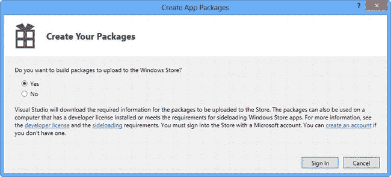

***图十。**创建应用包向导*

选择`Yes`并点击`Sign In`按钮。提供您的开发者账户凭证，然后从列表中选择您希望应用包关联的列表，如图[图 11](#fig_33_11) 所示。

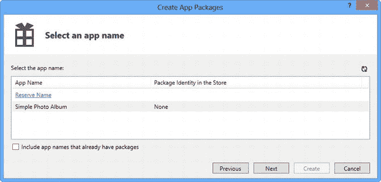

***图 11。**选择与商店关联的列表*

这可确保您的列表中的最新信息用于构建应用包。单击`Next`按钮，您将能够设置创建包的位置，设置版本信息，并指定您的应用将在哪些处理器架构上运行。

我已经接受了默认值，如图[图 12](#fig_33_12) 所示。这意味着这个包将在我的项目文件夹中的`AppPackages`文件夹中创建，版本将是`1.0.0`，我的应用将能够在任何平台上运行。

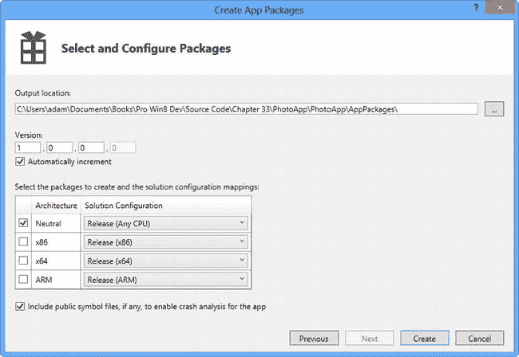

***图 12。**设置版本和架构选项*

点击`Create`按钮，生成 app 包。创建包后，您将有机会运行 Windows 应用认证包，如图[图 13](#fig_33_13) 所示。微软在批准其应用在 Windows Store 中销售之前，会对其进行一系列测试，你可以通过运行认证工具包来防止潜在的问题，该工具包将检查你的应用是否存在一些与微软相同的问题。

 **提示**如果您尚未安装 Windows 8 SDK，您可以下载其中的认证套件。SDK 在`[http://msdn.microsoft.com/en-us/windows/hardware/hh852363.aspx](http://msdn.microsoft.com/en-us/windows/hardware/hh852363.aspx)`可用。

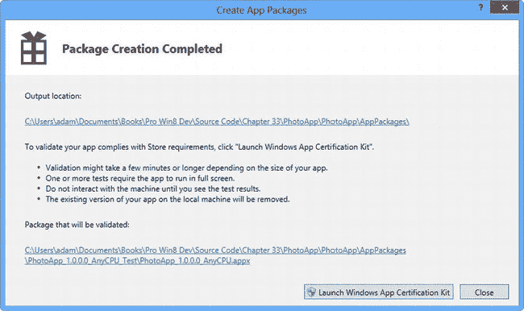

***图十三。**开始认证检查*

点击`Launch Windows App Certification Kit`按钮开始测试过程。该套件将运行您的应用，并对其进行一系列测试，这大约需要 5 分钟。在此期间，你会看到应用暂时运行，然后消失-不要在测试时尝试与应用交互。

测试完成后，您将看到结果，并有机会看到详细的报告。该报告包含所发现的任何问题的详细信息，并就如何解决这些问题提供了一些基本建议。

我的示例应用没有任何问题，所以几分钟后我会看到如图 14 所示的摘要屏幕。

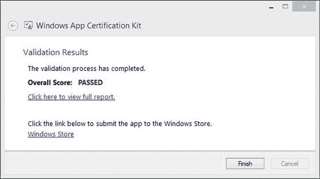

***图十四。**显示认证测试成功的摘要*

### 完成应用列表

现在，应用包已经完成并经过测试，是时候返回 Windows Store 仪表板并完成应用列表了(您可以通过从 Visual Studio Store 菜单中选择`Open Developer Account`返回到`Dashboard`)。

#### 完成包装部分

点击`Package`链接，将应用包上传到 Windows 应用商店。如果您在创建包时接受了默认位置，那么您将能够在 Visual Studio 项目的`AppPackages`文件夹中找到您需要的文件。该包文件的扩展名为`appxupload`，你可以将它拖拽到网页上，如图[图 15](#fig_33_15) 所示。上传软件包文件后，点击`Save`按钮返回主列表页面。

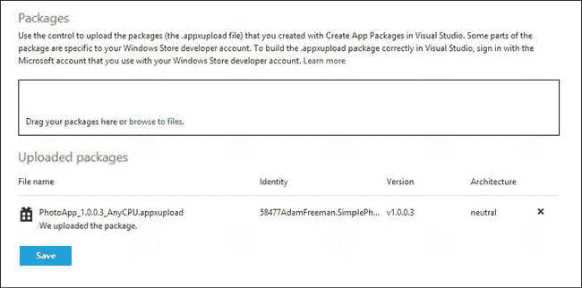

***图 15。**上传包到商店*

#### 完成描述部分

点击`Description`链接，输入您的应用的详细信息。当用户浏览或搜索 Windows 商店时，这些信息会呈现给用户，经过深思熟虑的信息可以使您的应用更容易找到——鉴于应用市场的竞争如此激烈，这一点非常重要。特别是，我建议您注意提供高质量的屏幕截图(可以用 Visual Studio 模拟器拍摄)，并仔细考虑您指定的关键字。

在所需信息列表的最后是您在应用中提供的升级描述，如[图 16](#fig_33_16) 所示。确保你提供的描述对用户有一定的意义。

***图十六。**提供升级描述*

填写完所有必需的详细信息并上传图片后，单击`Save`按钮返回主列表页面。

#### 完成测试人员注意事项部分

单击`Notes for Testers`部分，提供微软测试人员验证您的应用所需的任何信息。这是需要包含的重要信息，因为测试人员对你的应用的关注和兴趣是有限的，你需要确保他们能让你的应用快速而轻松地工作。输入测试提示后，单击`Save`按钮返回主列表页面。

### 提交您的应用

主列表页面应该显示所有步骤现在都已完成。当你准备好提交你的应用时，点击`Submit for certification`按钮，如图[图 17](#fig_33_17) 所示。

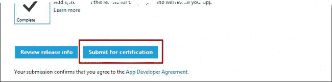

***图 17。**提交 app 认证*

您的应用将被提交进行认证，您将在测试过程中看到其进度的细节，如图 18 所示。一个应用通过认证需要几天时间，但微软会在你的应用通过该过程的每个阶段时向你发送电子邮件。

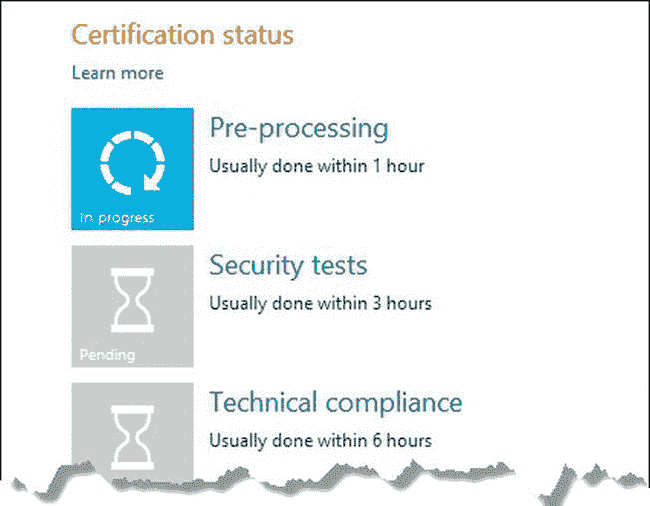

***图十八。**通过认证流程跟踪您的应用*

如果您的应用顺利通过所有测试和审查，它将在 Windows 应用商店中列出，可供用户购买和下载。

### 总结

在本章中，我向您展示了准备和提交您的应用以获得认证并在 Windows 应用商店中列出的流程。在将应用提交给 Microsoft 之前对其进行彻底测试非常重要，因为可能需要几天时间才能获得任何问题的详细信息。

这本书到此结束。我首先向您展示了如何使用您现有的 web 应用知识来构建一个简单的 Windows 应用，然后在此基础上向您展示更复杂和复杂的功能和技术，最后是与 Windows 应用商店集成并提交一个应用进行认证和发布。我希望你的应用取得成功，并希望你喜欢读这本书，就像我喜欢写这本书一样。