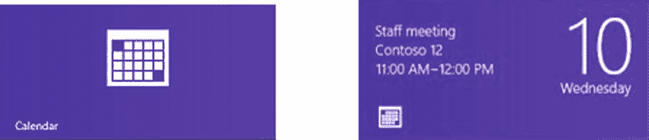
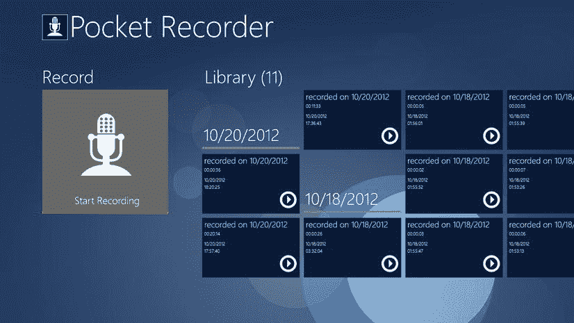
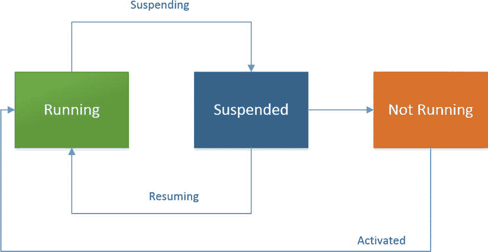
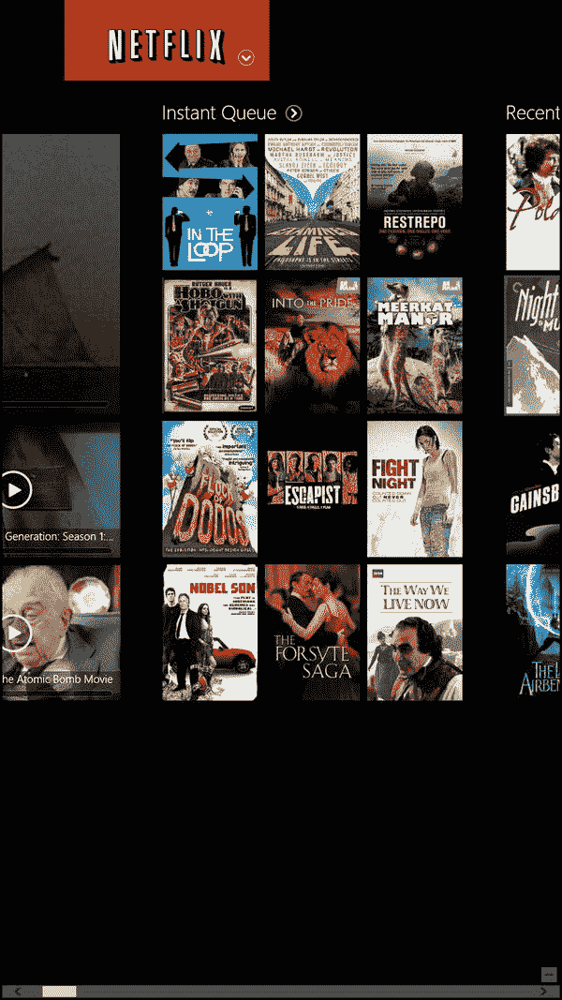
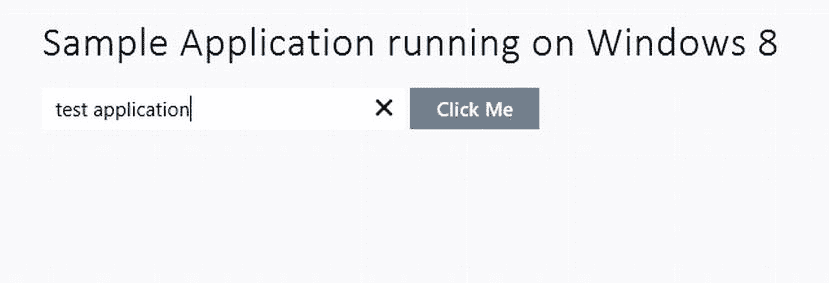
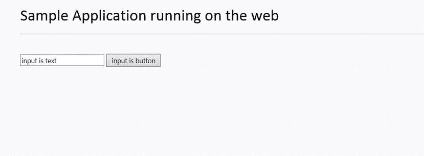

# 一、Windows 8 的精神和环境

Abstract

欢迎来到 Windows 8 的美丽新世界。在这一介绍性章节中，您将了解全新的、完全不同的用户界面。你会对“重新想象的窗户”有所了解当你去掉标志性的桌面概念，用完全的应用集成取而代之时，你就开始探索这对 Windows 应用开发人员意味着什么。技术和社会的影响被认为是你，开发者，通过解释、例子和检查技术与商业生活的融合做准备。

欢迎来到 Windows 8 的美丽新世界。在这一介绍性章节中，您将了解全新的、完全不同的用户界面。你会对“重新想象的窗户”有所了解当你去掉标志性的桌面概念，用完全的应用集成取而代之时，你就开始探索这对 Windows 应用开发人员意味着什么。技术和社会的影响被认为是你，开发者，通过解释、例子和检查技术与商业生活的融合做准备。

目前，Windows 8 基本上是唯一可以在从手机到个人电脑的任何设备上运行的操作系统，具有 Windows 8 开发原生支持的各种语言。这本书是关于一种这样的语言——JavaScript——以及作为一名 JavaScript 开发人员，您如何使用您的语言知识(以及作为 UI 布局引擎的 HTML 和 CSS)来构建 Windows 8 应用，让用户感觉像使用。NET 甚至原生 C++。

## 不太简短的介绍

首先，请允许我们阐明我们是谁，这样你，亲爱的读者，可能会理解这本书的独特视角。这不是一本微软粉丝写的书，而是一本常识性的、完成工作的技术爱好者写的书。我们也喜欢在做一些酷的、前沿的、有意义的事情的同时赚钱的机会，所以当我们说 Windows 8 是开发者有史以来最重要的机会时，请注意。尽管这听起来可能像是重复的微软营销宣传，但我们一直站在 API 的前沿，我们大胆地声称 Windows 8 中的一切都是从头开始重新想象、检查和创新的。

在开始之前，从开发人员的角度介绍一下 Windows 8 是很重要的，特别要关注应用如何工作以及如何由系统管理。讨论并不详尽，因为该主题可能跨越多本书，但它应该为您提供基本信息，以便了解使用 Windows 运行时开发 Windows 8 和 Windows 8 应用的基础知识。

出于解释的目的，让我们浏览一下 Windows 8 UI 工件——不是因为你还不了解 Windows 如何工作，而是为了那些可能还没有接触过该操作系统的人。

Windows 8 外壳是一种数字反转鲻鱼:前面是派对时间，后面是老式的好生意。在第一眼看到 Windows 8 时，你会立刻被这个类比中的派对元素所打动:图 [1-1](#Fig1) 中显示的 Windows 8 开始屏幕。

图 1-1。

Windows 8 Start screen

Windows 8 开始屏幕是新的——更确切地说，是重新设计的——应用的启动板。它取代了 Windows 开始菜单。这意味着 Windows 8 上没有开始菜单。因此，不要期望找到一些注册表黑客或设置来启用它:没有。

Note

可以购买一些第三方应用来增强 Windows 8 的开始菜单体验:例如 Stardock 的 Start8。

Windows 8 中省略了标准的 Windows 开始菜单。事实是，这只是一个语义上的移除。如果人们冷静下来，他们会意识到你喜欢的开始菜单的每个功能都存在于开始屏幕中，只有一个区别:旧的开始菜单不会占据整个屏幕。从任何意义上来说，新的开始屏幕都是其前身的超集和自然演变，一旦人们开始使用它，他们很快就会认识到这一点。

Note

微软发布了一个全面的博客，概述了 Windows 8 许多功能背后的细节或原理。一篇这样的博客文章强调了导致微软在 Windows 8 中使用开始屏幕而不是旧的开始菜单的复杂研究。如果你想了解这方面的更多信息，请访问 [`http://blogs.msdn.com/b/b8/`](http://blogs.msdn.com/b/b8/) 的 Building Windows 8 博客。浏览 Windows 开始屏幕演变的具体博文可以在 [`http://blogs.msdn.com/b/b8/archive/2011/10/03/evolving-the-start-menu.aspx`](http://blogs.msdn.com/b/b8/archive/2011/10/03/evolving-the-start-menu.aspx) 找到。

在图 [1-1](#Fig1) 中，带有图像的彩色矩形是应用的一种组合启动点。这些神奇的矩形表面通常被称为动态磁贴，结合了应用快捷方式(尤其是您可能在 Windows 桌面上找到的快捷方式版本)、通常在任务栏上找到的应用运行状态的表示(当您的应用正在运行时)，以及在系统托盘区域找到的应用通知机制的表示。图 [1-2](#Fig2) 显示了日历应用 live tile 的两种状态。左边的图像是默认状态；当会议临近时，瓷砖呈现出不同的外观(右图)。

图 1-2。

A Windows 8 app tile

像 Windows Essentials 这样的应用(Windows Live 适用于仍然拥有该应用早期版本的用户)可能有一个系统托盘图标，当应用从联机切换到脱机时，该图标的外观会发生变化；它可能在 Windows 桌面上有一个大而漂亮的快捷方式，当应用不是活动窗口时，当向您发送即时消息时，它会闪烁黄色(在 Windows 7 上)。Windows 8 live 磁贴集这三种功能于一身。通过 live tile，你当然可以启动应用；但是如图 [1-2](#Fig2) 所示，磁贴也可以根据应用中发生的事情，甚至是应用未运行时发生的事情来显示通知。

请注意，并非开始屏幕上的所有互动程序都是实时互动程序。Visual Studio、Microsoft Word 和 Adobe Photoshop 等传统应用也可以作为平铺显示在开始屏幕上，但这些平铺并不是“实时的”，它们不具备在其表面呈现动态内容的能力。传统的 Windows 应用磁贴的功能或多或少类似于旧的应用图标(我们说“或多或少”，是因为 Windows 8 为这些磁贴提供了一些快捷功能，这些磁贴遵循与其实时替代产品相似的模式，例如能够在管理员模式下启动)。使用新范式构建的应用可以通过动态磁贴来表达自己，被微软称为 Windows 8 应用。在本书的剩余部分，我们使用这个术语来指代它们。图 [1-3](#Fig3) 显示了已启动的 Windows 8 modern 应用的外观。

图 1-3。

A Windows 8 app

注意到少了什么吗？它是无处不在的关闭、最小化和最大化/恢复按钮。Windows 8 应用会一直占据整个屏幕。这条规则没有例外:即使计划构建一个简单的实用程序窗口，作为开发人员，您也必须考虑如何以减少负面空间的方式进行布局。这是一个棘手的问题，而且你的应用必须支持多种屏幕分辨率。在后面的章节中，当我们开始讨论风格指南和如何通过认证时，我们会对此进行更深入的探讨。

另一个在查看一个已启动的应用时可能出现的问题是，如何关闭它？传统的 Windows 开发通常将应用生命周期管理委托给用户，这意味着用户必须明确地单击右上角的关闭按钮。如果没有，应用将继续运行。Windows Essentials 等应用依赖于此。因为系统没有提供自动关闭不再使用(或已有一段时间未使用)的应用的机制，所以像 Windows Essentials 和 Skype 这样的应用可以将用户的关闭请求视为隐藏请求，并在后台以不可见的窗口继续运行。如果每个人都带着荣誉和同情心行事，这不会是一个问题，但它确实会产生安全问题并消耗系统资源——如果不是不必要的，那么至少在没有用户同意的情况下。

Windows 8 试图通过引入一种考虑用户和系统资源的应用生命周期管理模式来重新想象这种情况(见图 [1-4](#Fig4) )。

图 1-4。

A Windows 8 app’s lifecycle

在 Windows 8 的“party side”中，在任何给定的时间，只有当前运行的应用以及用户选择在后台运行的应用是活动的。所有其他应用都被挂起，这意味着它们的内存是完整的，并且按照指定的顺序运行，但是没有属于这些应用的活动线程正在运行。与保存的文件一样，暂停的应用就像离开时一样完好无损。此外，就像保存的文件一样，可以随时打开并从停止的地方继续，切换回 Windows 8 应用(或从开始屏幕再次启动它)会带你回到它。在这两种状态之间，Windows 8 系统还提供了关闭应用的功能，如果它确定应用需要关闭的话。未来的章节将更多地讨论 Windows 8 应用的生命周期。

Note

你可能在 Windows 8 的演示中见过这一点(或者在我们希望未来版本中包含的教程中)，但现代应用可以通过从应用屏幕顶部拖到屏幕底部(“扔掉”)或使用 Alt+F4 来强制关闭。一个高级用户也可以使用旧的控制面板来停止一个现代的应用。

这个应用还缺少一个东西——可能不像关闭和最小化/最大化按钮那样普遍，但肯定是一个众所周知的 Windows 应用功能——就是菜单栏。假设应用占据了整个屏幕，那么命令如何表示可能是任何开发人员都关心的问题。显而易见的选择是把它放在屏幕上，当然，许多应用就是这么做的。但这种模式违背了微软为 Windows 8 应用规定的风格准则。相反，Windows 8 系统提供了两个区域，底部的应用栏和顶部的应用栏，从中可以启动应用命令。

图 [1-5](#Fig5) 显示了应用如何使用应用栏概念在应用的中心位置隔离命令功能。从这里，最终用户可以启动搜索、按类别对录像进行分组、清除他们的整个库，或者将开始录像的活动直接固定到 Windows 开始屏幕。(在[第 6 章](06.html)中更详细地讨论了固定和二级瓷砖的概念。)

图 1-5。

Windows 8 app with the bottom app bar enabled

在任何 Windows 8 应用中，如果启用了触摸，可以通过分别从设备屏幕的底部或顶部向上或向下滑动来激活底部/顶部应用栏(可见)。

Note

并非所有的 Windows 8 设备都支持触摸功能，或者有鼠标，因此在升级到 Windows 8 时，传统设备继续可用非常重要。因此，Windows 8 为所有与触摸相关的功能提供了鼠标和键盘支持。要使用鼠标激活任何应用的应用栏，请右键单击该应用。使用键盘，按 Windows 徽标键+ Z。

无论从哪个方向滑动，两个应用栏都会显示。在所有情况下，设备屏幕的顶部和底部(如果使用鼠标和键盘，还包括右键单击)都属于应用。屏幕的左边和右边属于 Windows。

从左边滑动(Windows 徽标键+ Tab)可以让用户访问当前未被查看的暂停应用。从右边滑动(Windows 徽标键+ C)会显示出魅力。在图 [1-6](#Fig6) 中，你可以看到 Windows 8 魅力的显露。请注意屏幕左侧的信息框，它显示日期时间信息以及网络和电池状态。

图 1-6。

Windows 8 charms displayed. Displaying charms also reveals the date-time, wifi signal status, and battery status in a block at lower left onscreen

Windows charms 功能是一项极其重要的创新。它使用户能够搜索系统上的所有应用(甚至在应用内部)，轻松地在应用之间共享数据，访问设备以及管理设置。每个 charm 都有一个公开的编程接口，作为 Windows 8 开发者，你可以使用它。

此外，开发现代 Windows 8 应用的开发人员必须应对各种系统环境变化，而使用旧框架开发的应用根本不必担心这些变化。这是因为使用 Windows 8 APIs 构建的应用具有与本机操作系统的连接级别，而这在默认情况下是不存在的。

这种情况的一个实例是应用视图状态。在支持旋转的设备上，Windows 8 应用可以查询系统的当前布局，并相应地调整其 UI。这样，应用可以使用横向模式下可能不可用的垂直空间和纵向模式下可能不可用的水平空间。在视图以横向模式锁定的系统上运行时，检查图 [1-7](#Fig7) 所示的网飞应用。

图 1-7。

Netflix app in landscape mode

同一系统上的同一应用，唯一的变化是从横向模式转换到纵向模式，改变了 UI，如图 [1-8](#Fig8) 所示。

图 1-8。

Netflix app in portrait mode

## 构建 Windows 8 应用

Windows 8 应用可以使用 HTML/JavaScript 构建。NET 语言(C#和 VB)，或者通过称为 C++/Cx 的 C++扩展的原生 C/C++。不管开发应用使用什么技术，Windows 团队在提供一组核心 API 方面都做得很好，这些 API 被投射到每种目标语言中。图 [1-9](#Fig9) 提供了 Windows 8 现代应用编程界面的分层视图。

图 1-9。

Window 8 app API landscape

你有没有见过另一个平台能如此灵活地为其开发者提供这种能力？我们不这么认为。使用这些设计的 API 构建的应用最终被打包成一个包含应用代码(二进制或文本格式)的包；资源；图书馆；以及描述应用(名称、徽标等)、其功能(如文件系统的区域或特定设备，如相机)以及使应用工作所需的一切(如文件关联、后台任务声明等)的清单。清单向 Windows 应用商店以及从商店下载应用的潜在 Windows 客户端描述应用。应用清单的确切工作方式(因为它涉及到发布您的应用和设置其权限)将在第 2 章中讨论。

到目前为止，我们已经讨论了 Windows 8 和你可以用它构建的应用。到目前为止，无论您选择什么样的开发环境，功能、过程和划分本质上都是相同的。本地开发和。NET 是构建 Windows 应用的伟大平台，并且为构建 Windows 8 应用提供了一些独特的优势。最值得注意的是对遗留 Win32 APIs 子集的访问。对于那些可能不知道的人，Win32 是以前用于构建 Windows 应用的编程平台。Adobe Photoshop、Microsoft Word 和 Internet Explorer 10 等程序都是使用这种技术构建的，它仍然可以用于构建在 Windows 8 的桌面(业务端)视图上运行的 Windows 8 应用。

## Windows 8 与 Win32

这本书的重点是使用 HTML 开发 Windows 8 应用，因此谨慎起见，我们在这一点上强调了这些技术之间的一些差异。

首先，需要注意的是。基于. NET 和本机 C++/Cx 的应用在构建时编译。编译是将给定程序的代码部分转换成机器处理器易于读取的中间格式的过程。C++/Cx 被直接编译成特定于处理器的本机代码。(这意味着选择使用这种技术构建应用需要开发人员为他们打算支持的每个平台编译一个版本。Windows 8 目前支持 64 位(x64)、32 位(x86)和基于 ARM 的处理器。) .NET 将代码编译成一种称为字节码的伪二进制格式。字节码是一种中间状态，它允许应用代码比本机代码更具可移植性。这是因为字节码与处理器架构无关，所以相同的字节码可以毫无问题地用在 x64、x86 和 ARM 处理器上。(字节码可以实现这一点，因为它在运行时在运行它的目标平台上被动态编译成本机代码。)

使用 JavaScript 构建的 Windows 8 应用遵循的模式与使用。NET，但是没有中间步骤。Windows 8 JavaScript 应用中的 HTML、CSS 和 JavaScript 代码总是在运行时进行解析、编译和渲染，因此您的应用代码总是完整地传输到运行它的每个客户端。此外，因为这些文件类型不是直接可执行的，所以 Windows 系统必须提供一个宿主进程来运行它们(类似于这些文件类型通常在 web 浏览器环境中的运行方式)。

因为这两者的区别(原生/。NET 和 JavaScript)，并且因为设计者想要为目标平台构建 Windows 开发人员体验，这种体验对于给定的平台开发人员来说就像他们可能在该领域中进行的任何其他活动一样真实和自然，所以作为 JavaScript 开发人员构建 Windows 8 应用的许多 API 和控件都是通过专门为 JavaScript 开发定制的补充库来提供的:用于 JavaScript 的 Windows 库(WinJS)。例如，使用 C#或 C++/Cx 的开发人员使用一种称为可扩展应用标记语言(XAML)的技术来设计他们的用户界面并构建或访问系统控件，如清单 1-1 所示。

Listing 1-1\. XAML Markup

`<Page x:Class="AllLearnings.Samples.ApplicationBars.AppBarSamples"`

`xmlns="`[`http://schemas.microsoft.com/winfx/2006/xaml/presentation`](http://schemas.microsoft.com/winfx/2006/xaml/presentation)T2】

`xmlns:x="`[`http://schemas.microsoft.com/winfx/2006/xaml`](http://schemas.microsoft.com/winfx/2006/xaml)T2】

`xmlns:d="`[`http://schemas.microsoft.com/expression/blend/2008`](http://schemas.microsoft.com/expression/blend/2008)T2】

`xmlns:mc="`[`http://schemas.openxmlformats.org/markup-compatibility/2006`](http://schemas.openxmlformats.org/markup-compatibility/2006)T2】

`mc:Ignorable="d"`

`>`

`<Page.BottomAppBar>`

`<AppBar x:Name="appbar_bottom" VerticalAlignment="Bottom" Height="100" >`

`<Grid>`

`<Button x:Name="btn_bottomone" Visibility="Visible" Content="+" ↩`

`AutomationProperties.Name="Add" HorizontalAlignment="Right"`

`VerticalAlignment="Top" Style="{StaticResource AppBarButtonStyle}"`

`/>`

`</Grid>`

`</AppBar>`

`</Page.BottomAppBar>`

`<Grid x:Name="LayoutRoot" >`

`<TextBlock>This sample tests the app bar functionality, right click or swipe from`

`the bottom to open the bottom app bar.</TextBlock>`

`</Grid>`

`</Page>`

另一方面，作为 HTML/JavaScript 开发人员，您可以使用 HTML/CSS 作为布局引擎来设计您的 UI，并使用 JavaScript 来操作它，就像操作 web 应用一样(见清单 1-2)！

Listing 1-2\. HTML Markup

`<!DOCTYPE html>`

`<html>`

`<head>`

`<meta charset="utf-8" />`

`<title>TestAppBars</title>`

`<!-- WinJS references -->`

`<link href="//Microsoft.WinJS.1.0/css/ui-dark.css" rel="stylesheet" />`

``

``

`<link href="TestAppBars.css" rel="stylesheet" />`

``

`</head>`

`<body>`

`<section aria-label="Main content" role="main" style="margin-left: 100px;">`

`
This sample tests the app bar functionality, right click or`

`swipe from the bottom to open the bottom app bar.
`

`</section>`

`
`

`<button id="btn_bottomone" data-win-control="WinJS.UI.AppBarCommand"`

`data-win-options="{id:'cmdAdd',label:'Add',icon:'add'`，ⅵ

`section:'global',tooltip:'Add item'}">`

`</button>`

`
`

`</body>`

`</html>`

此外，作为开发人员，您可以自由地使用任何您想要的第三方模块(同样以 HTML CSS/ JavaScript 开发人员习惯的方式)。清单 1-3 中的例子使用非常流行且几乎无处不在的 jQuery 选择并着色了一个指定的元素类。

Listing 1-3\. Using jQuery with HTML in a Web Application

`<!DOCTYPE html>`

`<html xmlns="`[`http://www.w3.org/1999/xhtml`](http://www.w3.org/1999/xhtml)T2】

`<head>`

`<title></title>`

``

``

``

`</head>`

`<body>`

`
`

`
`

`
`

`
`

`
`

`
`

`
`

`Sample Application running on the web`

`
`

`

`

`
`

`<input id="txt_alerttext" type="text" style="height: 25px" />`

`<button id="btn_clickme">Click Me</button>`

`
`

`
`

`
`

`
`

`
`

`</body>`

`</html>`

该示例使用 jQuery 选择网页文档结构中的项目，并对其中的事件做出反应。它还展示了如何使用 CSS 来控制一个非常简单的页面的布局。在 web 浏览器中运行该应用应该会产生如图 [1-10](#Fig10) 所示的布局。

图 1-10。

Simple web application layout

请注意，如果您将鼠标放在“单击我”按钮上，该按钮会改变颜色。这是通过清单 1-4 中的 jQuery 指令实现的。

Listing 1-4\. jQuery Handling Events on Elements That It Selects

`.mouseenter(function (e)`

`{`

`$(this).css("background-color", "lightblue");`

`})`

`.mouseout(function (e)`

`{`

`$(this).css("background-color", "slategray");`

`})`

jQuery 只是监听用户鼠标输入目标元素的边界，在本例中是带有标识符`#btn_clickme`的按钮。当鼠标进入后，按钮的背景颜色变为`lightblue`；当鼠标退出时，颜色变回`slategray`。jQuery 代码还监听按钮被单击的情况，当按钮被单击时，会显示一个对话框，其中包含文本框中输入的文本。图 [1-11](#Fig11) 显示了发生这种情况时用户界面的样子。

图 1-11。

Result of a simple web application button click

清单 1-3 中的代码可以一字不差地(大部分)复制到一个以 JavaScript 为目标的 Windows 8 应用中，只需很少的修改，就可以运行了。清单 1-5 说明了这一点，粗体文本表示已经进行了更改的区域。

Listing 1-5\. Windows 8 App Using jQuery

`<!DOCTYPE html>`

`<html xmlns="`[`http://www.w3.org/1999/xhtml`](http://www.w3.org/1999/xhtml)T2】

`<head>`

`<title></title>`

``

``

``

`</head>`

`<body>`

`
`

`
`

`
`

`
`

`
`

`
`

`
`

`Sample Application running on Windows 8`

`
`

`

`

`
`

`<input id="txt_alerttext" type="text" style="height: 25px" />`

`<button id="btn_clickme">Click Me</button>`

`
`

`
`

`
`

`
`

`
`

`</body>`

`</html>`

从这个例子中，您可以看到，为了让代码运行，您只需要更改很少的几项。您显式设置应用标题的背景颜色(并更改文本)。此外，因为 Windows 8 APIs 不支持 HTML `alert`特性，所以您必须注释掉该行，而使用专门为 Windows 8 设计的类似 API。运行该示例会产生图 [1-12](#Fig12) 和图 [1-13](#Fig13) 中的行为。这两幅图分别代表点击“点击我”按钮之前(图 [1-12](#Fig12) )和之后(图 [1-13](#Fig13) )的应用。

图 1-13。

Windows 8 app using a jQuery `MessageDialog` alert

图 1-12。

Windows 8 app using jQuery

正如您在清单 1-5 中看到的，在这两种场景中，您以相同的方式包含了 jQuery 库，并且以相同的方式调用和使用它们。即使一个是 web 应用，另一个是 Windows 8 应用，它们也会产生相同的结果。

## 为 Windows 8 应用开发

现在，您已经对 Windows 8 有了基本的介绍，Windows 8 应用是什么样子，有哪些技术可以构建 Windows 8 应用，以及 JavaScript 在等式中的位置，您已经准备好开始构建样本，并开始成为下一个 Instagram。

### 设置您的环境

在你开始之前，你需要一些东西。首先，要构建 Windows 应用并完成本书中的示例，您需要一份 Windows 8。您还需要 Windows 8 SDK，并且至少需要一份 Visual Studio Express 2012。所需工具的下载链接在表 [1-1](#Tab1) 中列出。请注意，安装 Visual Studio Express 会安装您需要的所有东西(包括必要的 jQuery 库)。表格中还包括其他项目，以防您需要某个特定的组件。

表 1-1。

Windows 8 Development Environment Setup

<colgroup><col> <col></colgroup> 
| 工具 | 位置 |
| --- | --- |
| 框架 | [T2`http://jquery.com/download/`](http://jquery.com/download/) |
| Windows 8 | [T2`http://windows.microsoft.com/en-US/windows-8/release-preview`](http://windows.microsoft.com/en-US/windows-8/release-preview) |
| 免费版 | [T2`www.microsoft.com/visualstudio/eng/products/visual-studio-express-products`](http://www.microsoft.com/visualstudio/eng/products/visual-studio-express-products) |
| Windows 8 SDK | [T2`http://msdn.microsoft.com/en-us/windows/hardware/hh852363.aspx`](http://msdn.microsoft.com/en-us/windows/hardware/hh852363.aspx) |

当然，因为这是 JavaScript 开发，很多布局和功能都可以在没有这些的情况下实现。如果你有一个简单的文本编辑器和网络浏览器，你可以在一定程度上跟随。当您开始使用控件并与 Windows 系统集成时，这种情况会发生变化，因此我们建议在这些情况下下载 bits 并使用 SDK。

### HTML 入门

毫无疑问，许多阅读本书的人对 HTML、CSS 和 JavaScript 在 Windows 8 应用开发中的应用有一定的了解。这是 JavaScript 被作为 Windows 8 应用开发范例之一的主要原因。HTML/CSS 和 JavaScript 在这一点上实在是太受欢迎了，有太多的支持者和日常用户，以至于它们不再像以前一样被平台游戏中的主要玩家所忽视。作为在这个游戏中多年的技术专家，我们继续对 JavaScript 的弹性和纯粹的优雅感到惊讶。如果你在 20 世纪 90 年代末问任何人 JavaScript 是否会成为此时的王者，答案会是响亮的“不”

尽管有工作知识和预先存在的技能，但为了完整起见，在这里提供一个关于 HTML/CSS 的简短复习课程是很重要的。已经知道主题，不需要复习？太好了:你可以跳过两个章节“为 Windows 8 扩展 HTML5”继续阅读。其他人，欢迎！

HTML5 是一个笼统的术语，描述了一组用于制作现代、丰富的 web 内容的相关技术。这些技术数不胜数，但本文主要讨论三个核心组件:

*   HTML5 本身，它定义了用于标记内容的实际元素
*   级联样式表 3 (CSS 3.0)，允许对标记元素的外观进行离散控制
*   JavaScript，作为一个编程接口，用于在 HTML 文档中构建交互性和程序逻辑

HTML 允许对内容应用某种标记。在这个定义中，标记通常是一个元素(我们很快就会知道元素是什么)，内容可以是文本。在上一节中，您已经看到了两个 HTML 示例。清单 1-6 中的清单 1-3 的摘录展示了一个简单 HTML 文档的基本特性。

Listing 1-6\. Two HTML Elements

`<input id="txt_alerttext" type="text" style="height: 25px" />`

`<button id="btn_clickme">Click Me</button>`

`<title class="site-heading">Sample Document Title</title>`

HTML 中的元素有三个主要部分:开始标记、内容和结束标记。从这个例子可以明显看出，开始标记总是以小于尖括号开始，后面跟着元素名。(参见清单 1-7 中的开始标签。你可以在 [`www.w3.org/TR/html-markup/elements.html`](http://www.w3.org/TR/html-markup/elements.html) 找到元素名称列表。)结束标签的开始和开始标签一样，但是在标签名前有一个正斜杠(见清单 1-8)。在清单 1-6 的第一行中，`input`是一个空的 HTML 元素类型，所以它没有结束标签。这种 HTML 元素以正斜杠和大于号结束。

Listing 1-7\. Start Tag for an HTML Element

`<title class="site-heading">`

Listing 1-8\. End Tag for an HTML Element

`</title>`

作为开发人员，元素可以帮助您以平台无关的方式从语义上描述内容。因此，每个元素都有相关的含义。在这个例子中，使用`title`标签包装内容向任何读者(无论是人还是其他人)表明元素中包含的内容是一个文档标题。web 浏览器可能会阅读此内容，并以粗体显示文本“示例文档标题”。搜索引擎机器人可能会根据样本、文档、标题和样本文档标题等术语对页面进行索引，这样，如果您在 Google 中键入样本文档标题，就会出现样本页面。表 [1-2](#Tab2) 中列出了一些常见元素及其含义。

表 1-2。

Elements and Their Meanings

<colgroup><col> <col></colgroup> 
| 元素名称 | 描述 |
| --- | --- |
| `html` | 指示文本是 HTML 的最外层标签 |
| `head` | 提供关于文档的信息 |
| `title` | 提供文档的标题 |
| `script` | 确保向上兼容性的内联脚本 |
| `style` | 确保向上兼容性的样式信息 |
| `body` | 包含文档内容的文档正文 |
| `input` | 生成按钮、输入字段和复选框 |
| `a` | 超文本文档的锚标签 |
| `hr` | 在浏览器窗口中绘制水平标尺 |

元素可以是空的(意味着标签不需要关闭)。一个完美的例子是`hr`标签，它可以用来表示容器宽度的水平线。如今，许多开发人员将 void 元素编写为自结束的空元素。于是，`
`就变成了`
`。关闭 void 元素标记允许 XML 解析器(一种称为 XHTML 的文档类型)将 HTML 文档作为 XML 文档(HTML 的超集)进行处理。

通过使用开始标记中的属性来配置元素，可以进一步定制元素。属性本质上是一个名称-值对，用元素开始标记中的 name=value 语法表示。`input`标签使用`type`元素来指定期望的输入类型。输入类型`button`绘制按钮，输入类型`text`绘制文本框。清单 1-9 说明了这一点。

Listing 1-9\. Changing the `type` Attribute of the `input` Element

`<input type="text" value="input is text" />`

`<input type="button" value="input is button" />`

清单 1-9 展示了两个`input`元素，一个将`type`属性设置为`text`，另一个将`type`属性设置为`button`。如果在浏览器或 Windows 8 上运行，应用显示如图 [1-14](#Fig14) 所示。

图 1-14。

Two input elements with different type attributes

如果元素支持它们，您可以添加任意数量的属性来实现所需的效果。通常，添加到元素中的属性有两种。全局属性可以添加到每个元素中。这些包括`id`属性、`Style`标签和`Class`标签。您在清单 1-3 中看到了所有这三种全局属性类型。

元素还可以定义特定于它们的单个属性。例如，`image`元素具有`src`属性，该属性用于指示要显示的图像相对于根的位置(`src`也可以指向绝对位置)。

HTML 还提供了作者定义属性的创建，在这种情况下，您希望向元素添加比 HTML 标准定义的更多的元数据。浏览器会忽略作者定义的属性，但它们是 JavaScript 注入的重要途径，因为可以通过浏览器 DOM 发现它们。这种技术通常用于在文档的特定位置将 HTML 注入 DOM。您可以通过在属性前添加`data-`来表明属性是作者定义的(见清单 1-10)。

Listing 1-10\. Using Author-Defined Attributes as Placeholders for Controls

`window.onload = function () {`

`var list = document.getElementsByTagName("div");`

`for(var i = 0; i < list.length; i++) {`

`var node = list.item(i);`

`if(node != null) {`

`var islogincontrol = node.hasAttribute(``"data-controls"`T2】

`if(islogincontrol) {`

`var control_type = node.getAttribute(``"data-controls"`T2】

`if(control_type == "logincontrol") {`

`var title_panel = document.createElement("div");`

`var title = document.createElement("span");`

`title_panel.appendChild(title);`

`var username_panel = document.createElement("div");`

`var username_label = document.createElement("span");`

`username_label.innerText = "Username: ";`

`username_panel.appendChild(username_label);`

`var username = document.createElement("input");`

`username.type = "text";`

`username_panel.appendChild(username);`

`var spacer = document.createElement("div");`

`spacer.style.height = "5px";`

`var password_panel = document.createElement("div");`

`var password_label = document.createElement("span");`

`password_label.innerText = "Password: ";`

`password_panel.appendChild(password_label);`

`var password = document.createElement("input");`

`password.type = "password";`

`password_label.appendChild(password);`

`node.appendChild(title);`

`node.appendChild(username_panel);`

`node.appendChild(spacer);`

`node.appendChild(password_label);`

`} else {`

`if(control_type == "labeledinput") {`

`var label_name = node.getAttribute(``"data-labelname"`T2】

`var username_panel = document.createElement("div");`

`var username_label = document.createElement("span");`

`username_label.innerText = label_name;`

`username_panel.appendChild(username_label);`

`var username = document.createElement("input");`

`username.type = "text";`

`username_panel.appendChild(username);`

`node.appendChild(username_panel);`

`}`

`}`

`}`

`}`

`}`

`};`

清单 1-10 中应用的模式是一种简单但常见的方法，使用作者定义的属性将复合控件附加到 HTML 页面上。复合控件是提高开发效率的极好工具，因为它们将多个简单控件和相关的固定行为封装到一个可控制的实体中，该实体可以通过集中机制进行配置。例如，如果您正在开发的应用需要带有标识标签的用户名和密码文本字段，您可以创建一个登录控件。该控件可以将登录到您的站点所需的所有功能封装到一个代码库中，然后可以在您需要该功能的任何地方重用它。

这就是控件的力量，通过使用作者定义的属性实现的 expando 控件允许 JavaScript 开发人员做到这一点。清单 1-10 中的例子在 DOM 树中搜索`div`控件。对`document.getElementsByTagName("div")`的调用实现了这一点，并返回与参数中指定的标记名匹配的每个元素的列表(在本例中为`div`)。一旦返回，您只需遍历列表，查询每个元素以查看它是否定义了属性`data-controls`。如果该属性是在控件上定义的，则读取其值以确定要生成哪种类型的控件。当控件类型为`logincontrol`时，您会生成一个文本框、一个密码框和两个区域——用户名和密码——分别与它们相关联。当控件类型为`labeledinput`时，您将生成一个文本框和范围组合。在`labeledinput`的情况下，您期望定义另一个属性`data-labelname`，并且您使用它的值作为标注文本框的跨度的`innerText`。(注意，为了简洁起见，并不是所有的检查都应用于示例代码。在现实世界的场景中，您会希望检查是否定义了`data-labelname`，而不仅仅是期望它在那里。)

清单 1-11 显示了这个应用的 HTML 可能的样子。

Listing 1-11\. Using Author-Defined Attributes to Create Composite Controls

`<!DOCTYPE html>`

`<html xmlns="`[`http://www.w3.org/1999/xhtml`](http://www.w3.org/1999/xhtml)T2】

`<head>`

`<title></title>`

``

``

`</head>`

`<body>`

`
`

`
`

`
`

`
`

`
`

`
`

`
`

`Sample Application using custom controls`

`
`

`

`

`
`

`
`

`
`

`

`

`
`

`
`

`
`

`
`

`</body>`

`</html>`

在您的浏览器中运行清单 1-11 中的代码，您应该会看到如图 [1-15](#Fig15) 所示的页面。

图 1-15。

Custom controls injected onto a page dynamically

右键单击 web 页面并打开该文件的源代码，您应该会注意到一些有趣的事情:这个 HTML 文档的源代码不包含您在浏览器视图中看到的任何元素或内容。这是因为内容是动态创建的，并被注入到 DOM 中。

### CSS 入门

HTML 引以为豪的一个架构哲学是将语义标记从标记的外观中分离出来(当然，也有例外)。在 HTML 的世界中，CSS 为您提供了在最初或以后执行语义标记与标记外观分离的能力。早在清单 1-3 和最近的清单 1-11 中，您已经看到了样式表可以做什么。如果您从图 [1-15](#Fig15) 中移除与 HTML 页面相关联的内嵌样式表，它看起来如图 [1-16](#Fig16) 所示。

图 1-16。

Application without styles

这个没有样式的 HTML 的例子只是触及了表面。考虑一下网站 [`www.csszengarden.com/`](http://www.csszengarden.com/) (见图 [1-17](#Fig17) 和 [1-18](#Fig18) )，你会开始感觉到 CSS 有多强大，它对 HTML 文档的布局有多大的控制力(当你构建 HTML 文档时，它放弃了布局和外观的考虑，只专注于语义标记)。

图 1-18。

CSS Zen garden Under the Sea! template

图 1-17。

CSS Zen garden default style

正如您在这两个图中看到的，Zen garden 站点中的相同内容可以通过简单地修改与之相关联的 CSS 样式获得完全不同的呈现。CSS 是如此广泛的一个主题，以至于这本书只能让你对它的威力有个大概的了解，而不会让你不知所措。所以，我们建议通过其他方式研究 CSS。除了像《HTML5 入门》和《CSS3:Web Evolved》(a press，2012)这样的书籍之外，网上还有很多资源可以使用。

### 为 Windows 8 扩展 HTML5

回想一下“HTML 入门”一节中关于作者创建的属性的讨论。HTML5 主机通常会忽略它们不理解的属性，这可以用作添加到 DOM 的新内容的插入点。在示例场景中，一个登录控件和带标签的文本框被添加到文档中的一个`div`中，这是基于在整个 DOM 树中搜索该特殊属性并将新的 HTML 注入到定义该属性的任何元素中。如前所述，这是一种将 UI 功能作为自定义控件构建到 HTML 中的古老技术。

现在，还记得我们说过 Windows 8 应用开发的 HTML/CSS/JavaScript 实现是专门为 HTML/CSS/JavaScript 开发人员量身定制开发流程的吗？我们讨论了 WinJS，以及它如何成为 JavaScript 和 Windows 运行时(WinRT)之间的天然桥梁，在必要的地方注入自身，但只是以 JavaScript 兼容的方式。JavaScript 和 WinRT 的这种融合在技术领域中实现控件的选择上最为明显。

在 Windows 8 开发的 HTML 方法中，对用于支持 HTML 开发的语言的扩展，比如你构建的控件，是使用作者创建的属性来实现的，这些属性应用于预先存在的控件，比如`div` s，非常类似于清单 1-11 中的例子。这是通过两个属性来实现的:`data-win-control`，它向运行时指示您想要将什么控件扩展到已标识的`div`区域中；和`data-win-options`，它允许您将单个配置参数(很像属性)传递给所选的控件。更具体地说，在`data-win-control`属性中，必须指定创建实际控件的公共构造函数的完全限定名；在`data-win-options`属性中，您必须指定一个 JSON 字符串，该字符串可用于配置该控件对象。

此外，在实际的 JavaScript 代码中，您必须调用`WinJS.UI.process`或`WinJS.UI.processAll()`来启动将控件展开到其容器中的过程(在本例中，是一个`div`)。Windows 8 应用栏提供了一个使用控件的基本而清晰的例子。图 [1-5](#Fig5) 显示了应用的应用栏，清单 1-12 提供了创建应用的 HTML。

Listing 1-12\. `AppBar` Control Added to the Bottom of the Page

`<!DOCTYPE html>`

`<html>`

`<head>`

`<meta charset="utf-8" />`

`<title>TestAppBars</title>`

`<!-- WinJS references -->`

`<link href="//Microsoft.WinJS.1.0/css/ui-dark.css" rel="stylesheet" />`

``

``

`<link href="TestAppBars.css" rel="stylesheet" />`

``

`</head>`

`<body>`

`<section aria-label="Main content" role="main" style="margin-left: 100px;">`

`
This sample tests the app bar functionality
`

`</section>`

`
`

`</button>`

`
`

`</body>`

`</html>`

### 页面/导航模型

前一节谈到了如何通过作者生成的属性来扩展 Windows 8 开发中使用的 HTML，以包含针对 Windows 8 的强大新功能。HTML 的一个主要(也是最容易识别的)特性是能够通过使用给定文档中的链接来链接文档，或者让 JavaScript 调用 API 来改变浏览器当前指向的位置。在 web 应用中，应用上下文通常在服务器端进行管理，HTML/JavaScript 表示层主要作为用户可以用来启动交互的一个薄薄的无状态皮肤。Windows 8 应用，至少是它们的本地部分，不是基于服务器的。相反，如前所述，执行和管理执行所需的所有显示和代码都是在运行时下载和解释的。这包括代码中内置的任何状态管理机制。不像我们的表亲。NET 和本机方面，没有一个内在地内置于 HTML 中的一致的、内存中的、全局的应用状态。它收集变量，呈现视图，计算值，但是一旦您离开当前页面并移动到另一个页面，所有的状态、所有的内容，更糟糕的是，您的整个脚本上下文都将丢失。下一个页面必须重新构建上下文(即使之前已经对其进行了 JIT)。使用 Windows 8 的一些内置功能，如访问文件系统或应用的设置容器，您可以创建该全局上下文的 IO 绑定版本(从变量而非上下文共享的角度来看)。但是对于它提供的一点点功能来说，这太复杂了。

JavaScript 的 Windows 运行时引入了一个新的导航范例来帮助解决这个问题。使用它，您可以保证跨页面共享内存上下文的概念，并在应用在视图之间切换时保持视觉保真度。运行时通过放弃全屏重新呈现的概念而支持 DOM 注入来实现这一点。如果您还记得的话，清单 1-10 展示了如何根据函数确定的插入点将新元素注入到预先存在的 HTML 文档中。上一节展示了在 Windows 8 中运行时，如何使用强大的新控件来扩展 HTML。清单 1-13 展示了如何使用`WinJS.Navigation`对象实现导航(它使用了类似的技术)。

Listing 1-13\. Navigation Using Partial Documents

`<!DOCTYPE html>`

`<html>`

`<head>`

`<meta charset="utf-8" />`

`<title>AllLearnings_html</title>`

`<!-- WinJS references -->`

`<link href="//Microsoft.WinJS.1.0/css/ui-dark.css" rel="stylesheet" />`

``

``

`<!-- AllLearnings_html references -->`

`<link href="/css/default.css" rel="stylesheet" />`

``

`</head>`

`<body>`

`
`

`

`

`<header aria-label="Header content" role="banner"`

`style="margin-top: 0px;`

`vertical-align: bottom;">`

`<h1 class="titlearea win-type-ellipsis"`

`style="margin-left: 100px;">`

`<button id="btn_back"`

`class="win-backbutton" aria-label="Back"`

`type="button"`

`style="margin-left: 0px; margin-right: 20px;`

`visibility: collapse;"></button>`

`Select a sample`

`</h1>`

`</header>`

`
`

`
`

`
`

`</body>`

`</html>`

示例的第一部分创建了应用的总体布局。注意`frame`的`id`和`div`。这是您执行的 HTML 注入的目标。使用 WinJS `Navigation`类导航使用基于调用`navigate`命令的回调模型。让我们看看清单 1-14 中的 JavaScript 代码。

Listing 1-14\. Code-Behind for Navigation

`(function ()`

`{`

`"use strict";`

`WinJS.Binding.optimizeBindingReferences = true;`

`var app = WinJS.Application;`

`var activation = Windows.ApplicationModel.Activation;`

`var stack = new Stack();`

`app.onactivated = function (args)`

`{`

`if (args.detail.kind === activation.ActivationKind.launch)`

`{`

`args.setPromise(WinJS.UI.processAll().then(function ()`

`{`

`WinJS.Navigation.navigate("samplelist.html");`

`}));`

`}`

`var btn_back = document.getElementById("btn_back");`

`btn_back.onclick = function ()`

`{`

`WinJS.Navigation.back();`

`};`

`};`

`WinJS.Navigation.addEventListener("navigated", function (args)`

`{`

`//find the frame`

`var frame = document.getElementById("frame");`

`//clear the frame`

`WinJS.Utilities.empty(frame);`

`//stack.Push(args.detail.location);`

`if (WinJS.Navigation.canGoBack)`

`btn_back.style.visibility = "visible";`

`else`

`btn_back.style.visibility = "collapse";`

`if (args.detail.state != null)`

`txt_title.textContent = args.detail.state;`

`//render the location onto the frame`

`args.detail.setPromise(WinJS.UI.Pages.render(args.detail.location, frame`，ⅵ

`args.detail.state));`

`});`

`app.start();`

`})();`

使用 WinJS 框架在页面之间导航有两个组件。首先是调用`WinJS.Navigation`类的`navigate()`函数——传入您想要导航到的目标页面的名称。不过，这个电话只是等式的一部分。在进行这个调用之前，应用应该为`navigated`事件提供一个处理程序。这个处理程序让您的应用接收任何导航请求，并将适当的内容加载到清单 1-13 中指定的目标`div`上。导航难题的另一部分是`WinJS.UI.Pages`级。`Pages`类有一个`render`函数，它获取任意的 HTML“页面”(本质上是松散耦合的 HTML 文件)，并将它们插入 DOM，给人一种导航的错觉。执行导航的过程相对简单:

Find the insertion point (in this case, the `div` name’s frame).   Clear the insertion point of any child content from a previous navigation.   Pass the page name (through the `args.detail.location` property, which is retrieved from the event arguments passed into the `navigated` function), frame instance name, and any navigation state through the `args.detail.st`ate property. `args.detail.state` is accessed through the same event argument object, `navigated`. (Chapter 2 goes over navigation in greater detail.)  

清单 1-15 展示了 JavaScript 中处理导航的模式。

Listing 1-15\. Handling Page Navigation

`//find the frame`

`var frame = document.getElementById("frame");`

`//clear the frame`

`WinJS.Utilities.empty(frame);`

`//navigate to the page`

`args.detail.setPromise(WinJS.UI.Pages.render(args.detail.location, frame, args.detail.state));`

### 承诺和新的异步编程模型

传统上，在 JavaScript 中调用函数是以同步的方式发生的，这意味着调用方在被调用的函数完成后等待，然后再继续。在被调用的函数长时间运行的情况下——例如，如果它需要从服务器下载额外的 HTML 来注入 DOM 整个应用可能看起来没有响应。这是因为 JavaScript 是单线程的，这意味着 UI、UI 事件和代码共享同一个线程。如果这个线程在等待某个长时间运行的函数调用的响应时被冻结，用户就不能与屏幕上的任何 UI 元素进行交互。

回调是解决这一限制的流行方法。多种应用都使用这种方法来解决这个问题，而且效果很好。事实上，如果技术实现是唯一的关注点，就没有必要在这个领域进一步创新。

回调的问题在于，由于其执行固有的不确定性，它们可能会彻底改变程序流。检查清单 1-16 中的应用。调用一个异步的、长时间运行的函数，它接受两个回调。每个回调也执行自己的长时间运行的操作。

Listing 1-16\. Long-Running Asynchronous Process Test

`function LongRunning(callback_one, callback_two)`

`{`

`//perform long-running process`

`var response = callback_one();`

`callback_two(response);`

`}`

`//call method`

`LongRunning(function ()`

`{`

`//do something async here`

`}, function (args)`

`{`

`//then do something async here as well`

`});`

即使像示例中一样，`callback_one`在`callback_two`之前被调用，也不能保证回调将以什么顺序执行，因此没有办法以串行方式重新同步结果。这是异步的基本问题:它必须以同步方式编程，以保持对程序员的意义，因为它存在于同步逻辑流和编程结构中。回调将程序员与底层语言的同步结构断开。在小的情况下，这可能没有影响，但是一旦您开始转向异步必须同步的场景(如示例中所示)，您就会遇到问题。

WinJS 使用承诺的概念来降低异步编程的复杂性。承诺创建了一个结构，在这个结构上异步回调的执行可以按顺序同步。让我们看看清单 1-16 中的例子是如何使用承诺的。首先，必须修改`LongRunning`函数，以便在完成时返回一个通用的承诺，而不是要求预先定义和传递所有回调。请参见清单 1-17。

Listing 1-17\. Long-Running Function That Returns a Promise

`function LongRunning()`

`{`

`//perform long-running process`

`//promise function does not exist but is used to denote the conceptual`

`//return of a promise instance`

`return promise();`

`}`

现在，您不再需要显式地传递在完成`LongRunning`函数时执行的回调，您可以根据需要自由地链接尽可能多的回调来完成任务。让我们看看这个函数在清单 1-18 中是如何被调用的。

Listing 1-18\. Consuming a Long-Running Function That Returns a Promise

`LongRunning().then(function (args)`

`{`

`return (promise(callback_one()));`

`}).then(function (args)`

`{`

`return (promise(callback_two(args)));`

`});`

如您所见，回调的显式定义已经从函数参数中移除。现在，只有在前一次执行完成时，才会执行它们。在清单 1-18 中，很容易看出代码是如何面向顺序的。代码不仅更容易阅读和理解，而且以确定性的方式呈现。使用`then`方法以可控的方式将回调附加到`LongRunning`函数。当函数完成时，执行`then`回调(将之前执行的结果传递给它)。这将递归地继续下去，直到不再有回调要执行。使用`then`保证了几件事:

*   当目标异步操作完成时，您可以指定一个回调函数来处理`then`
*   该回调在其参数列表中提供一个值，该值表示先前完成的异步操作的结果
*   `then`操作也是一个返回承诺的异步操作

因为`then`返回一个期望回调的承诺，该回调包含先前执行的`then`的结果，所以您可以通过在任何`then`调用的结果上调用`then`来链接相关的异步调用(如示例所示)。不用说，互相嵌套承诺会让一切回到过去，所以如果可能的话，你应该避免这样做。

在某些情况下，你可以用承诺来做一些事情:

*   你可能会在 JavaScript 代码的事件处理程序中发现使用承诺的机会，特别是因为许多微软 API 已经被重写为异步的，以提高整体系统性能。由于系统对待事件处理程序的方式，您需要告诉它您的承诺仍在运行。系统事件处理程序的 WinJS 实现为此提供了一个函数:`setPromise`。你在清单 1-14 中看到了一个例子。[第 2 章](02.html)深入探讨了这种方法的工作原理。
*   你可能在某个时候需要同步多个承诺。例如，假设您有两个不相关的承诺链:一个检索用户信息，另一个从文件系统读取设置数据。如果您需要在两个操作都完成后执行某个动作，您可以使用`join`操作来实现。

## 摘要

毫无疑问，Windows 8 背离了你所习惯的一切。为它开发也有些如此。本章对 Windows 8 的广泛回顾应该为下一章涉及的基础知识做好准备，并为您提供 Windows 8 应用开发所需的基础知识。你学会了

*   与 Windows 8 用户界面交互的特点、功能和属性
*   如何在 Windows 8 开发中使用 HTML
*   Windows 8 开发中可以使用的各种技术