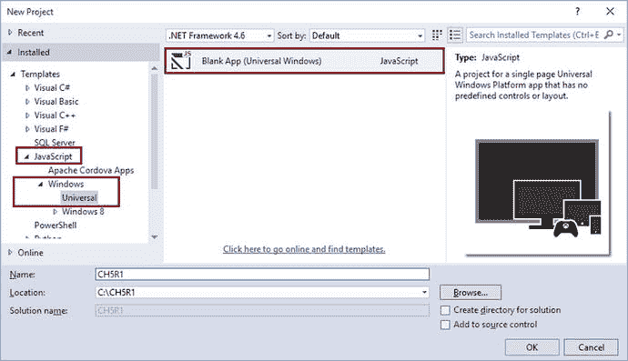
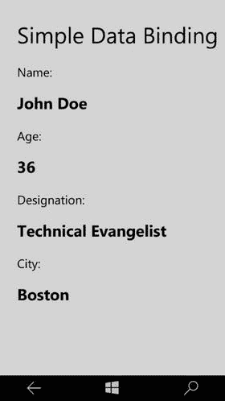
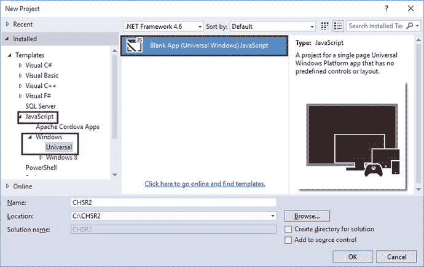
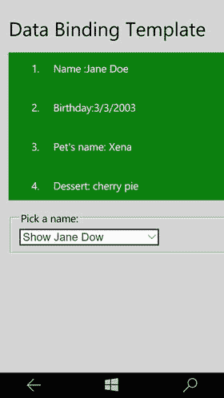
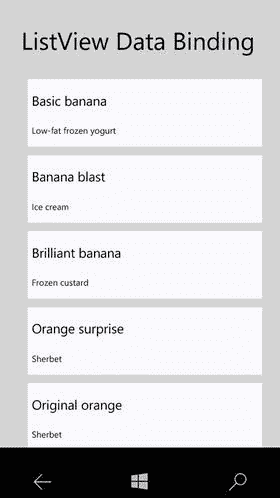
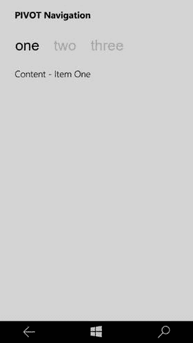
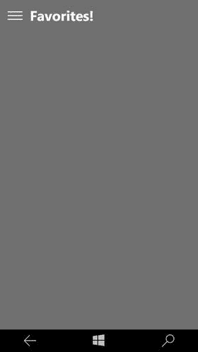
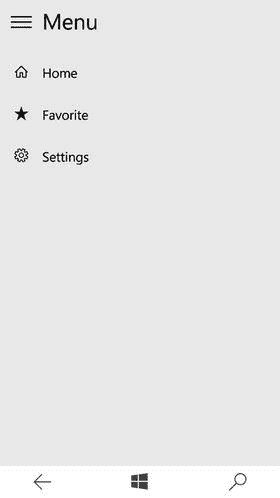
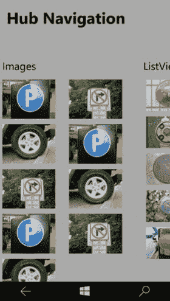
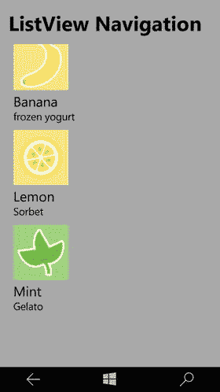

# 五、数据绑定和导航

通常，当您查看任何应用时，它都是由用户界面(UI)和底层业务逻辑组成的。数据绑定是一个连接应用 UI 和业务逻辑的过程。当数据更改其值时，绑定到数据的元素会自动反映这些更改，并且当元素值更改时，底层数据也会更新并反映这些更改。

## 5.1 数据绑定到简单对象

### 问题

作为应用业务逻辑的一部分，您有一个带有数据属性的简单业务对象。您希望将业务对象的数据属性绑定到 UI 上的 HTML 元素。

### 解决办法

数据绑定由`WinJS.Binding`名称空间提供。它提供了`processAll()`方法，将对象的值绑定到任何 DOM 元素的值。DOM 元素必须使用`data-win-bind`属性，并提供需要绑定的属性名。

### 它是如何工作的

让我们看看如何在您的应用中执行简单的数据绑定。

Open Visual Studio 2015\. Select File ➤ New Project ➤ JavaScript ➤ Windows ➤ Universal ➤ Blank App (Universal Windows) template (see Figure [5-1](#Fig1)).

图 5-1。

New Project dialog Visual Studio creates the Universal Windows Apps blank project with all the necessary files added to the solution.   Open default.js, which is found under the `js` folder. Add the following lines of code inside the immediately invoked function, just after the `'use strict'` directive: `(function () {`         `"use strict";`         `//create a person object` `var person = {`                 `name: "John Doe",`                 `age: 36,`                 `designation: "Technical Evangelist",`                 `city: "Boston",`         `};`         `var app = WinJS.Application;`         `var activation = Windows.ApplicationModel.Activation;`         `app.onactivated = function (args) {`                 `if (args.detail.kind === activation.ActivationKind.launch) {`                         `if (args.detail.previousExecutionState !== activation.ApplicationExecutionState.terminated) {`                         `} else {`                         `}`                         `args.setPromise(WinJS.UI.processAll());`                 `}`         `};`         `app.oncheckpoint = function (args) {`         `};`         `app.start();` `})();` Let’s bind the Person object to a `div` element in the HTML.   Open default.html, which is found in the root of the project. Replace the contents of `<body>` with the following: `
`      `<h3>Name:</h3>`      `<h2></h2>`      `<h3>Age:</h3>`      `<h2></h2>`      `<h3>Designation:</h3>`      `<h2></h2>`     `<h3>City:</h3>`       `<h2> </h2>` `
` You have a `span` element and you have a defined `data-win-bind` attribute for data binding. You are binding the `innerText` property of the span element with data property of the Person object you created in `default.js`.   Next, you need to modify the onactivated function and add the data binding call. Modify `app.onactivated`, as shown here: `app.onactivated = function (args) {`         `if (args.detail.kind === activation.ActivationKind.launch) {`             `if (args.detail.previousExecutionState !== activation.ApplicationExecutionState.terminated) {`                 `// TODO: This application has been newly launched. Initialize`                 `// your application here.`             `} else {`                 `// TODO: This application has been reactivated from suspension.`                 `// Restore application state here.`             `}`             `var container = document.querySelector('#container');`             `var prmise = WinJS.UI.processAll().then(function () {`                 `WinJS.Binding.processAll(container, person)`             `})`             `args.setPromise(prmise);`         `}`       `};`   Build and run the app by pressing F5 in Visual Studio. Figure [5-2](#Fig2) shows the output on a Windows Mobile screen.

图 5-2。

Snapshot of Windows Mobile output  

如您所见，Person 对象的值(在`default.js`中定义)被绑定到 HTML 元素。这是可能的，因为有了`WinJS.Binding`名称空间。如果您还记得，您在 onactivated 函数中调用了`WinJS.Binding.processAll()`方法。`processAll()`方法将对象的值绑定到具有`data-win-bind`属性的 DOM 元素的值。在演示代码中，您已经在输出姓名、年龄、头衔和城市信息的`div`元素上设置了`data-win-bind`属性。

## 5.2 DOM 元素的数据绑定样式属性

### 问题

HTML 元素可以使用 CSS 定义来设置样式。在运行时，样式属性需要绑定到底层业务对象数据属性的数据属性。

### 解决办法

除了提供对 DOM 元素属性的数据绑定，WinJS 数据绑定框架还提供了绑定 DOM 元素样式属性的选项。样式属性可以在`data-win-bind`属性中绑定到绑定对象的数据属性。

### 它是如何工作的

Open Visual Studio 2015\. Select File ➤ New Project ➤ JavaScript ➤ Windows ➤ Universal ➤ Blank App (Universal Windows) template. This creates a Universal Windows app template (see Figure [5-3](#Fig3)).

图 5-3。

New Project dialog   Open default.js in the `js` folder. Add the following code inside the immediately invoked function after the `'use strict'` directive: `(function () {`     `"use strict";`     `//create person object`     `var person = {`         `name: "John Doe",`         `age: 36,`         `designation: "Technical Evangelist",`         `city: "Boston",`         `favcolor: "orange"`     `};`     `//Other app set-up code` `})();` You have added a `favcolor` property to the Person object. Let’s bind the favcolor to a `div` element’s `background-color` style property.   Open default.html, which is found in the root of the project. Replace the `<body>` content with the following: `<h1>Data Bind Attributes</h1>`     ` `     `
`         `<h3>Name:</h3>`         `<h2></h2>`         `<h3>Age:</h3>`         `<h2></h2>`         `<h3>Designation:</h3>`         `<h2></h2>`         `<h3>City:</h3>`         `<h2> </h2>`         `<h3>Fav Color:</h3>`         `
`             `

`         `
`     `
`   Go back to the `default.js` file again. Modify the `onactivated` method as follows: `app.onactivated = function (args) {`         `if (args.detail.kind === activation.ActivationKind.launch) {`             `if (args.detail.previousExecutionState !== activation.ApplicationExecutionState.terminated) {`                 `// TODO: This application has been newly launched. Initialize`                 `// your application here.`             `} else {`                 `// TODO: This application has been reactivated from suspension.`                 `// Restore application state here.`             `}`             `var container = document.querySelector("#container");`             `var prmise = WinJS.UI.processAll().then(function () {`                 `WinJS.Binding.processAll(container, person)`             `})`             `args.setPromise(prmise);`         `}`     `};` You just call the WinJS Binding `processAll()` as usual on the container that needs to be data bound.   Next, build and run the app by pressing F5 in Visual Studio. The output on a Windows Mobile screen is shown in Figure [5-4](#Fig4).

图 5-4。

Snapshot of Windows Mobile output  

## 5.3 使用模板进行数据绑定

### 问题

简单数据绑定一次只能绑定到一个数据项。当您有一个数据项列表时，简单的数据绑定方法是不够的。

### 解决办法

使用简单数据绑定，您可以将一个数据项绑定到一个 DOM 元素，该元素显示数据属性的值。为了使用项目列表并允许用户更改他们想要查看的数据项，您需要一个模板。数据模板充当蓝图，在运行时，它绑定到所提供的数据项，并在指定的 DOM 元素上呈现标记。

### 它是如何工作的

Open Visual Studio 2015\. Select File ➤ New Project ➤ JavaScript ➤ Windows Universal ➤ Blank App (Universal Windows) template. This creates a Universal Windows app template (see Figure [5-5](#Fig5)).

图 5-5。

New Project dialog   Open default.js in `js` folder. Inside the immediately invoked function, let’s declare a Person object with a couple of properties. This time you will use `WinJS.Binding.define` to declare the `Person` object. Using `define` will make all the properties bindable. Here is the code snippet for a `Person` object: `(function () {`     `"use strict";`     `var Person = WinJS.Binding.define({`         `name: "",`         `color: "",`         `birthday: "",`         `petname:"",`         `dessert:""`     `});`     `//other app code ...` `})();`   Open default.html, found in root of the project. Replace the content of the `<body>` tag with the following code: `<h1>Data Binding Template</h1>` `
`     `
`         `<ol>`             `<li>Name :</li>`             `<li>Birthday:</li>`             `<li>Pet's name: </li>`             `<li>Dessert: </li>`         `</ol>`     `
` `
` `

` You have defined a `div` with the id `templateDiv` and then added a `data-win-control` attribute with a `WinJS.Binding.Template` value. This defines the template that can be used for data binding. You then have a `div` with the id `renderDiv`. At runtime, you data bind the template with data and render the output to the `renderDiv` DOM element.   For the purpose of this recipe, let’s create three `Person` objects and add a drop-down list so that you can select the person whose details needs to be shown. Inside the body tag, add the following code right after the `"renderDiv"` element: `<fieldset id="templateControlObject">`     `<legend>Pick a name:</legend>`     `<select id="templateControlObjectSelector">`         `<option value="0">Show John Doe</option>`         `<option value="1">Show Jane Dow</option>`         `<option value="2">Show Jake Doe</option>`     `</select>` `</fieldset>`   Back in `default.js` file, right after the Person object definition, create an array of three `Person` objects, as follows: `(function () {`     `"use strict";`     `var Person = WinJS.Binding.define({`         `name: "",`         `color: "",`         `birthday: "",`         `petname:"",`         `dessert:""`     `})`     `var people = [`         `new Person({ name: "John Doe", color: "red", birthday: "2/2/2002", petname: "Spot", dessert: "chocolate cake" }),`         `new Person({ name: "Jane Doe", color: "green", birthday: "3/3/2003", petname: "Xena", dessert: "cherry pie" }),`         `new Person({ name: "Jake Doe", color: "blue", birthday: "2/2/2002", petname: "Pablo", dessert: "ice cream" }),`     `];`     `//Other app code ...` `})();`   Next, add a listener to the change event of the drop-down list in the `onactivated` method in `default.js`. Here is the code snippet: `app.onactivated = function (args) {`     `// Other activation code ...`     `var selector = document.querySelector("#templateControlObjectSelector");`           `selector.addEventListener("change", handleChange, false);`     `args.setPromise(WinJS.UI.processAll());` `}`   Let’s create the event handler for the drop-down list change event. Select the `div`, which contains the template and the `div` where you want to render the markup. Call `render` on the template control. Create a `handleChange` function in `default.js` with the following code: `(function () {`     `//Other app code...`     `function handleChange(evt) {`         `var templateElement = document.querySelector("#templateDiv");`         `var renderElement = document.querySelector("#renderDiv");`         `renderElement.innerHTML = "";`         `var selected = evt.target.selectedIndex;`         `var templateControl = templateElement.winControl;`         `templateElement.winControl.render(people[selected], renderElement);`     `}` `})();`   Build and run the app by pressing F5 in Visual Studio. When you select an item in the drop-down list, the appropriate data is shown in the `div` above it. Figure [5-6](#Fig6) shows the output on a Windows Mobile screen.

图 5-6。

Data binding template output on Windows Mobile screen  

## 5.4 数据绑定 WinJS 控件

### 问题

您有一个项目列表，您希望将该列表数据绑定到一个 WinJS 控件，如 ListView。

### 解决办法

使用 WinJS 数据绑定，您可以将任何 WinJS 控件绑定到数据源。为了显示每个单独的项目，您将提供一个数据模板。在运行时，列表获取绑定到控件的数据，并且根据定义的模板呈现每一项。

### 它是如何工作的

Open Visual Studio 2015\. Select File ➤ New Project ➤ JavaScript ➤ Windows ➤ Universal ➤ Blank App (Universal Windows) template. This creates a Universal Windows app template (see Figure [5-7](#Fig7)).

图 5-7。

New Project dialog   Let’s create a new JavaScript file that will provide data to the ListView. Right-click the `js` folder. Select Add ➤ New Item. In the New Item dialog, select the JavaScript file and name it data.js. Add the following code to the `data.js` file: `(function () {`     `var flavors = [`         `{ title: "Basic banana", text: "Low-fat frozen yogurt" },`         `{ title: "Banana blast", text: "Ice cream" },`         `{ title: "Brilliant banana", text: "Frozen custard" },`         `{ title: "Orange surprise", text: "Sherbet" },`         `{ title: "Original orange", text: "Sherbet" },`         `{ title: "Vanilla", text: "Ice cream" },`         `{ title: "Very vanilla", text: "Frozen custard" },`         `{ title: "Marvelous mint", text: "Gelato" },`         `{ title: "Succulent strawberry", text: "Sorbet" }`     `];`     `var flavorList = new WinJS.Binding.List(flavors);`     `WinJS.Namespace.define("DataExample", {`         `flavorList: flavorList`     `});` `})();`   Add a reference to the `data.js` file in your `default.html`, which is found at the root of the project. `<head>`     `<!-- Other file references ... -->`     `<!-- Your data file. -->`     `` `</head>`   In `default.html`, you will now create a ListView and bind it to the data source you have created in the `data.js` file. Also define an item template for the list view items. Add the following code to `default.html`. `<h1>ListView Data Binding</h1>` `
`     `
`         `
`             `<h4 data-win-bind="innerText: title"></h4>`             `<h6 data-win-bind="innerText: text"></h6>`         `
`     `
` `
` `
` `
` Create the list view by setting the `data-win-control` attribute with a `WinJS.UI.ListView` value. Use the `data-win-options` attribute to set control options like item data source, item template, and the layout of the list view.   Next, you need to add a little bit of style to the list view and the list view items. Open `default.css` in Windows and Windows Mobile projects, and add the following style sheet definition: `#basicListView{`     `height: 100%;`     `margin-top: 10px;`     `margin-right: 20px;` `}` `#templateContainer{`     `display: -ms-grid;`     `-ms-grid-columns: 1fr;`     `min-height: 150px;` `}` `#itemContainer{`     `background-color:lightgray;`     `width:100%;`     `padding:10px;` `}`   Build and run the app by pressing F5 in Visual Studio. Figure [5-8](#Fig8) shows the output on a Windows Mobile screen.

图 5-8。

ListView Data Binding Output on a Windows Mobile Screen  

## 5.5 应用中的导航结构

### 问题

你想把你的应用分成多个页面/屏幕来处理特定的功能。您想知道应该遵循什么样的导航结构来提供在页面/屏幕之间移动的最佳体验。

### 解决办法

现实世界中的应用很少只有一个页面/屏幕，而是由许多页面/屏幕组成。每个页面/屏幕负责一个特定的功能。最好是将你的应用分成不同的功能，并分配一个专门的页面/屏幕来处理这些功能。UWP 应用中的导航基于导航结构、元素和系统级功能。通过在应用中提供正确的导航，您可以实现从一个页面到另一个页面或从这个内容到那个内容的直观用户体验。

应用中的每个页面都将包含或满足一组特定的内容或功能。例如，联系人管理应用会有一个列出联系人的屏幕、一个创建联系人的屏幕、一个更新联系人的屏幕或一个删除联系人的屏幕。应用的导航结构由您如何组织应用的不同屏幕来定义。图 [5-9](#Fig9) 展示了 UWP 应用中可以采用的不同导航结构。

图 5-9。

Navigation structures

层次导航结构是一个树状结构。每个子页面只有一个父页面。要接触到孩子，你需要穿过父母。

对等是页面并排存在的导航结构。你可以以任何顺序从一页转到另一页。

组合导航结构使用层次结构和对等结构。页面组被组织成对等体或层次结构。

## 5.6 应用中的导航元素

### 问题

你了解导航结构。你想知道哪些元素可以用来实现你的应用的导航结构。

### 解决办法

用户可以在许多导航元素的帮助下找到他想看的内容。在某些情况下，导航元素会向用户指示内容在应用中的位置。导航元素可以用作内容或命令元素。因此，建议使用最适合您的导航结构的导航元素。以下是 UWP 应用可用的一些导航元素:

*   Pivot:该控件用于显示指向同一级别页面的持久链接列表。当您有对等导航结构时，可以使用此控件。
*   SplitView:这个控件用于显示一个应用中顶级页面的链接列表。这可以用在需要对等导航结构的场景中。
*   Hub:这个控件用于显示子页面的预览/摘要。导航到子页面是通过页面本身提供的链接或部分标题。当您具有层次导航结构时，将使用此控件。
*   ListView:这个控件用于显示项目摘要的主列表。选择一个项目会在详细信息部分显示所选项目的详细信息。这可以用于您的层次导航结构场景。

## 5.7 应用中的透视导航

### 问题

在您的应用中，您已经确定导航的导航结构是基于对等的。您希望使用透视控件实现导航。

### 解决办法

当您经常访问不同的内容类别时，Pivot 控件用于导航。Pivot 由两个或多个内容窗格组成，每个窗格都有一个相应的类别标题。标题将持续显示在屏幕上，选择状态清晰可见，这使得用户很容易知道他们选择了哪个类别。用户可以在标题上向左或向右滑动，这样做将允许他们导航到相邻的标题。他们还可以在内容上向左或向右滑动。

### 它是如何工作的

Open Visual Studio 2015\. Select File ➤ New Project ➤ JavaScript ➤ Windows ➤ Universal ➤ Blank App (Windows Universal) template. This creates a Universal Windows app project (see Figure [5-10](#Fig10)).

图 5-10。

New Project dialog   Open default.html, which is found in the root of the project. Replace the content of the body with the following content: `
`         `
`             `
 Content - Item One 
`         `
`         `
`             `
 Content - Item Two 
`         `
`         `
`             `
 Content - Item Three 
`         `
`     `
` You have placed a `div` and set the `data-win-control` attribute to a value of WinJS.UI.Pivot. This converts the `div` to a Pivot control. You then pass options to the Pivot control using the `data-win-options` attribute. You are setting the title of the Pivot and the item that will be selected. The items of the pivot control are placed as a `div` with the `data-win-control` attribute set to a value of `WinJS.UI.PivotItem`. Each pivot item has a header. Set the header value using the `data-win-options` attribute. You can place as many items that your app calls for.   Next, press F5 and run the app. Figure [5-11](#Fig11) is a screenshot from the Windows Mobile output.

图 5-11。

Windows Mobile output  

如您所见，有三个枢纽项目。您可以单击透视项目的标题，或者从左向右滑动以导航到相邻的内容/项目。

## 5.8 应用中的拆分视图导航

### 问题

在您的应用中，您已经确定导航的导航结构是基于对等的。您希望提供一个带有顶级页面链接的菜单。您希望使用 SplitView 控件实现导航。

### 解决办法

SplitView 控件包含一个窗格和一个内容区域。窗格可以展开或折叠，而内容区域始终可见。窗格也可以保持打开状态，并且可以灵活地从应用的左侧或右侧显示。通常，导航链接位于此窗格中。

### 它是如何工作的

Open Visual Studio 2015\. Select File ➤ New Project ➤ JavaScript ➤ Windows ➤ Universal ➤ Blank App (Windows Universal) template. This creates a Universal Windows app project (see Figure [5-12](#Fig12)).

图 5-12。

New Project dialog   Open default.html, which is found in the root of the project. Replace the content of the body with the following code snippet: `
`         `
`             `<!-- Pane area -->`             `
`                 `
`                     `<button class="win-splitviewpanetoggle"`                             `data-win-control="WinJS.UI.SplitViewPaneToggle"`                             `data-win-options="{ splitView: select('.splitView') }"></button>`                     `
Menu
`                 `
`                 `
`                     `

`                     `

`                     `

`                 `
`             `
`             `<!-- Content area -->`             `<button class="win-splitviewpanetoggle"`                     `data-win-control="WinJS.UI.SplitViewPaneToggle"`                     `data-win-options="{ splitView: select('.splitView') }"></button>`             `
<h2>Page Content </h2> 
`         `
`     `
` In order to use SplitView, you need to place a `div` and set the `data-win-control` attribute to a value of SplitView. Then you need to create two `div`s. The first `div` will be used for the navigation pane and second `div` will be used as the content area. You use `WinJS.UI.NavBarCommand` to place the links for different pages. You are listening for the click event of the nav bar items and on click will show content according to the navigation link that was clicked. The content page is just a `div`, and at runtime, depending on the navigation link clicked, you will update the content accordingly.   Next open default.js, found in the `js` folder. Replace the `app.activated` handler with the following code snippet: `app.onactivated = function (args) {`                 `if (args.detail.kind === activation.ActivationKind.launch) {`                         `if (args.detail.previousExecutionState !== activation.ApplicationExecutionState.terminated) {`                         `} else {`                         `}`                         `args.setPromise(`                     `WinJS.UI.processAll().done(function () {`                         `SplitViewHelper.splitView = document.querySelector(".splitView").winControl;`                         `new WinJS.UI._WinKeyboard(SplitViewHelper.splitView.paneElement); // Temporary workaround: Draw keyboard focus visuals on NavBarCommands`                     `})`             `);`                 `}`         `};`   Next, after the IIFE (immediately invoked function expression) declaration, place the following code snippet. You are creating a small helper classto handle the navigation click event. `(function () {`         `"use strict";`         `//other app related code ommitted for brevity` `})();` `WinJS.Namespace.define("SplitViewHelper", {`     `splitView: null,`     `homeClick: WinJS.UI.eventHandler(function (ev) {`         `document.querySelector('.contenttext').innerHTML = "<h2>SplitView Content area</h2>";`     `}),`     `favClick: WinJS.UI.eventHandler(function (ev) {`         `document.querySelector('.contenttext').innerHTML = "<h2>Favorites!</h2>";`     `}),`     `settingsClick: WinJS.UI.eventHandler(function (ev) {`         `document.querySelector('.contenttext').innerHTML = "<h2>Settings!</h2>";`     `}),` `});` You are replacing the inner HTML of the content `div` in this example. If you want to load a new page altogether, you can do so by making use of `WinJS.UI.Pages.render('<URI>',<Content Host Elementn>);`.   Now, press F5 and run the app. Figures [5-13](#Fig13) and [5-14](#Fig14) show output on a Windows Mobile.

图 5-14。

Content area

图 5-13。

Navigation pane  

## 5.9 UWP 应用中的枢纽导航

### 问题

您已经确定通用 Windows 平台应用的导航结构本质上是分层的。您希望在应用中使用 Hub 作为导航元素。

### 解决办法

Hub 控件用于导航，应用的内容可以分成不同的、相关的部分或类别，具有不同的详细程度。这是在诸如关系信息这样的场景中使用的一种常见模式，这种关系信息需要以优选的顺序遍历。导航的层次模式适用于提供各种体验和内容的应用。

### 它是如何工作的

Open Visual Studio 2015\. Select File ➤ New Project ➤ JavaScript ➤ Windows ➤ Universal ➤ Blank App (Windows Universal) template. This creates a Universal Windows app project (see Figure [5-15](#Fig15)).

图 5-15。

New Project dialog   Open default.html, found in the root of the project. Replace the contents after the `<body>` tag with the following code snippet: `
`         `
`             `
`                 ``                 ``                 ``                 ``                 ``                 ``                 ``                 ``                 ``             `
`         `
`         `
`             `
`             `
`         `
`     `
`     `
`         `
`             ``             `
`                 `<h4 data-win-bind="innerText: title"></h4>`                 `<h6 data-win-bind="innerText: text"></h6>`             `
`         `
`     `
` To create a Hub control, set the `data-win-control` attribute to a value of `WinJS.UI.Hub` on a `div`. To create sections inside the Hub, create a `div` and set its `data-win-control` attribute to `WinJS.UI.HubSection`. Set the header of the sections using the `data-win-options` attribute. Set the header property on the section.   Section 2 in the preceding code makes use of a ListView. So let’s create a data source for the list view. Open the default.js file in the `js` folder. Inside the immediately invoked function expression and after `'use strict'` statement, copy and paste the following code snippet: `var myData = new WinJS.Binding.List([`   `{ title: "Fire Hydrant", text: "Red", picture: "/img/circle_list1.jpg" },`   `{ title: "Fire Hydrant", text: "Yellow", picture: "/img/circle_list2.jpg" },`   `{ title: "Pothole Cover", text: "Gray", picture: "/img/circle_list3.jpg" },`   `{ title: "Sprinkler", text: "Yellow", picture: "/img/circle_list4.jpg" },`   `{ title: "Electrical Charger", text: "Yellow", picture: "/img/circle_list5.jpg" },`   `{ title: "Knob", text: "Red", picture: "/img/circle_list6.jpg" },`   `{ title: "Fire Hydrant", text: "Red", picture: "/img/circle_list1.jpg" },`   `{ title: "Fire Hydrant", text: "Yellow", picture: "/img/circle_list2.jpg" },`   `{ title: "Pothole Cover", text: "Gray", picture: "/img/circle_list3.jpg" },`   `{ title: "Fire Hydrant", text: "Red", picture: "/img/circle_list1.jpg" },`   `{ title: "Fire Hydrant", text: "Yellow", picture: "/img/circle_list2.jpg" },`   `{ title: "Pothole Cover", text: "Gray", picture: "/img/circle_list3.jpg" }`   `]);`         `WinJS.Namespace.define("HubExample", {`             `data: myData`         `});`   To run the app, press F5 in Visual Studio. Figure [5-16](#Fig16) shows output on a Windows Mobile device.

图 5-16。

Hub navigation output  

## 5.10 在 UWP 应用中使用 ListView 进行主/详细信息导航

### 问题

您已经确定通用 Windows 平台应用的导航结构本质上是分层的。您希望使用主/详细导航模式。您已经将 ListView 标识为导航元素。

### 解决办法

ListView 是一个在垂直堆栈中显示数据项列表的控件。您可以将数据源数据绑定到列表视图，并为呈现每个项目提供模板。

### 它是如何工作的

Open Visual Studio 2015\. Select File ➤ New Project ➤ JavaScript ➤ Windows ➤ Universal ➤ Blank App (Windows Universal) template. This creates a Universal Windows app project (see Figure [5-17](#Fig17)).

图 5-17。

New Project dialog   Open default.html, which is found in the root of the project. Replace the contents of the body with the following code snippet: `<h1>ListView Navigation</h1>` `

` You have a `div` with id `contentHost`. Use this as a placeholder to show different pages at runtime; that is, render the master and details page inside this content host `div` element.   Next, open default.js, found in the `js` folder. Add the following code snippet just before the `app.onactivated` function definition: `WinJS.Navigation.addEventListener("navigating", function (args) {`         `var url = args.detail.location;`         `var host = document.getElementById("contentHost");`         `host.winControl && host.winControl.unload && host.winControl.unload();`         `WinJS.Utilities.empty(host);`         `args.detail.setPromise(WinJS.UI.Pages.render(url, host, args.detail.state));`     `});` Through this code, you are listening to a navigation event that will occur on the page. You have provided a handler for the navigation event. In the event handler, you intercept the navigation call, get the URL of the destination page, get the content host element, and render the destination page inside the content host element.   Next, modify the `app.onactivated` method, as follows: `app.onactivated = function (args) {` `if (args.detail.kind === activation.ActivationKind.launch) {`     `if (args.detail.previousExecutionState !==` `activation.ApplicationExecutionState.terminated) {`     `} else {`     `}`     `args.setPromise( WinJS.UI.processAll().then(function () {`             `return WinJS.Navigation.navigate("/master.html");`         `})`    `);` `}`     `};` The only thing done in the activated event handler is navigating to a page named `master.html` (you will create this page next). So when the app loads, `master.html`, which will hold the ListView control, will be rendered inside the content host.   Add a new HTML file to the project and name it master.html. Replace the contents of the `master.html` with the following snippet: `<!DOCTYPE html>` `<html>` `<head>`     `<title></title>`     `<link href="/css/default.css" rel="stylesheet" />`     `<!-- WinJS references -->`     `<link href="WinJS/css/ui-dark.css" rel="stylesheet" />`     ``     ``     ``     `` `</head>` `<body >`     `
`         `
`             ``             `
`                 `<h4 class="win-h4" data-win-bind="textContent: title"></h4>`                 `<h6 class="win-h6" data-win-bind="textContent: text"></h6>`             `
`         `
`     `
`     `
`     `
` `</body>` `</html>` What you have done in `master.html` is place a list view, provide a data source to the list view, and provide an item template for rendering each item. The template displays an image, title, and text from the data item that will be bound at runtime.   Next, create a new JavaScript file in the `js` folder and name it master.js. Add the following code snippet to the JavaScript file: `(function () {`     `'use strict';`     `WinJS.UI.Pages.define("/master.html", {`         `ready: function (element, options) {`             `var that = this;`             `element.addEventListener("iteminvoked", function (evt) {`                 `evt.detail.itemPromise.then(function (item) {`                     `WinJS.Application.sessionState.selectedItem = item.data;`                     `WinJS.Navigation.navigate("/detail.html");`                 `});`             `});`         `}`     `})` `})();` Let’s go over the code for a moment. You have created a logic file for master.html with this new JavaScript file. Define page members with the `WinJS.UI.Pages.define()` method. You have provided a ready method that will be called when the page is loaded. And you are adding event listener for ListView item tap. When the item is tapped, store the selected item in an application session state and then navigate to `detail.html`.   Next, create a new JavaScript file named data.js inside the `js` folder. This file provides the data source for the ListView in `master.html`. Paste the following code snippet in `data.js`: `var myData = new WinJS.Binding.List([` `{ title: "Lemon", text: "Sorbet", picture: "/img/60Lemon.png" },` `{ title: "Mint", text: "Gelato", picture: "/img/60Mint.png" },` `{ title: "Orange", text: "Sorbet", picture: "/img/60Orange.png" },` `]);` `WinJS.Namespace.define("ListViewExample", {`         `data : myData` `});`   Now let’s create the details page. Add a new HTML file to the root of the project and name it detail.html. Paste the following code snippet to the newly created file: `<!DOCTYPE html>` `<html>` `<head>`     `<title></title>`     `<link href="/css/default.css" rel="stylesheet" />`     `<!-- WinJS references -->`     `<link href="WinJS/css/ui-dark.css" rel="stylesheet" />`     ``     ``     `` `</head>` `<body>`     `
`         `<button data-win-control="WinJS.UI.BackButton"></button>`         `<h3>Item Details </h3>`         `<h2></h2>`         ``         `<h2></h2>`     `
` `</body>` `</html>` In this page, just output the details of the selected item in the list view. Notice that you are using data binding expressions to show the title, text, and image of the data item.   Now you need to create the logic file for `detail.html`. Add a new JavaScript file named detail.js inside the `js` folder. Paste the following code snippet to the newly created file: `(function () {`     `'use strict';`     `WinJS.UI.Pages.define("/detail.html", {`         `processed: function (element, options) {`             `var that = this;`             `WinJS.Binding.processAll(element, WinJS.Application.sessionState.selectedItem);`         `}`     `})` `})();` When the page loads, just call the `Binding.processAll()` on the page and provide the selected item as the data item that needs to be bound to the elements.   You are done with all the code required for master/detail navigation. Now press F5 and run the app. Figures [5-18](#Fig18) and [5-19](#Fig19) show the output from a Windows Mobile device.

图 5-19。

Details screen

图 5-18。

Master screen