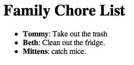
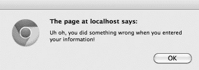
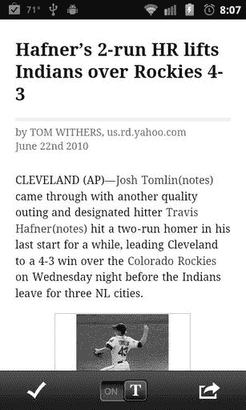
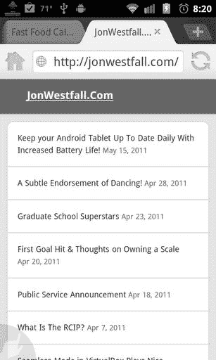

## 第 1 章

## 利用移动网络的力量

欢迎阅读本书的第一章。在这一章中，我们不仅会尽力告诉你在这本书里你会发现什么，而且还会把它和以前的内容进行比较。你看，很简单，尽管“网络”在手机上以某种形式存在了 10 年，但直到现在，移动网络应用程序和移动优化网站的真正力量才被认识到。

在我们展示我们为这本书计划的整洁的东西之前，最好确保每个人都在同一页上，行话。所以我们要开始讨论网页设计中的基本术语。在第二部分，我们将讨论当今移动网络的前身。最后，在最后一节，我们将讨论指导本书的概念，并让您先睹为快一些我们将开发的应用程序！

### 网页设计基础

有几个概念最好先讨论一下。如果你以前听过这些，请原谅我们。然而，如果你对网页设计完全陌生(也就是说，你从未写过一个网页或博客)，那么这应该是一个很好的起点。如果我们从头开始，那么我们应该从网络的通用语言开始:HTML。

#### 入门:超文本标记语言(HTML)

20 世纪 80 年代末，我们今天所知的计算机语言 HTML 诞生了。HTML 本质上不是真正的编程语言，因为它不是编译的。更确切地说，HTML 是由一种叫做“T1”网络浏览器“T2”的特殊软件来解释的。桌面电脑上的微软 Internet Explorer、Mozilla Firefox 和谷歌 Chrome，Android 设备上的 Dolphin HD、Opera Mini 和 Skyfire 等浏览器从**网络服务器**下载 HTML 文件，解释并显示它们。整个过程相当简单。web 服务器可以是任何类型的计算机，它通过一种叫做超文本传输协议(HTTP，即网址开头的`http://`，也称为 **URL** s)的东西向网络上的其他计算机提供文件列表。浏览器通过 HTTP 下载这些 HTML 文件并阅读它们，寻找被称为**标签**的特殊功能。这些标签的功能与旧的文字处理程序中的标签相同，即指定文本和页面的其他元素在查看器中显示时的外观。考虑图 1–1 中的网页。

**图 1–1。**【hello.html】一个名叫的网页实例

让我们来看看组成[清单 1–1](#list_1_1)中所示页面的 HTML 代码:

**清单 1–1。hello.html**T2

`<html>
<head>
<title>This is the text that appears in the browser's Title bar!</title>
</head>
<body>
This is normal text. However let's get fancy and make <strong>this bold</strong> (this
is <em>italicized</em>).
  The tag to the left just made this a new line.

 The tag to the left here just made this a new paragraph.

</body>
</html>`

代码可能看起来有点奇怪，但是让我们一行一行地看一遍。第一行简单地写着`<html>,`让浏览器知道它正在读取一个 HTML 文档。您会注意到文档的最后一行`</html>`也是类似的。这一行“完成”了 HTML 对象—关闭标签并告诉浏览器页面已经结束。有了这样的标签集，浏览器就知道要应用什么格式以及在哪里停止应用。

代码的第二到第四行被称为页面标题。这是程序员存储浏览器需要知道的重要信息的地方，以便正确地格式化页面。在本例中，我在标题中放置的唯一标签是一个`title`标签，它指定了应该在用户 web 浏览器的标题栏中显示什么。标题是人们最常找到某些文档的地方，比如层叠样式表、JavaScript 和搜索引擎优化的元信息、不同浏览器的特殊说明、favicons(浏览器中书签条目旁边出现的小图标)以及其他与文档内容无关的页面重要信息，这就引出了第 5 行——`body`标记。

标签告诉浏览器将要显示给用户的内容。从这里，我们看到的是纯文本——与[图 1–1](#fig_1_1)中显示的渲染页面相同。但是，您会注意到我们添加了一些特殊的标签。第一个是`<strong>`，它告诉浏览器它和它的结束标签`</strong>`之间的文本应该是粗体的，以给它更强的视觉魅力。第二个标签`<em>`通过强调内容或使内容倾斜来做同样的事情。 [1](#CHP-1-FN-1) 第三个标签` `，开始新的一行(br 代表换行符！).` `标签与大多数 HTML 标签略有不同。因为标签不要求自己像`<strong>`和`<em>`标签那样包含页面上的内容，所以这个标签自己关闭。最后，`
`标签开始一个新的段落。

所有网页的核心都是某种形式的 HTML，尽管我们将在本书中讨论的大多数网页要复杂得多。值得庆幸的是，我们将带您浏览它们，这样您就不会不知所措了！

如果这是您第一次涉足 HTML 和 web 应用程序的世界，那么在开始阅读这本书之前，熟悉 HTML 的基础知识可能是个好主意。互联网上学习 HTML 和浏览基本代码示例的最佳资源之一可以在 W3Schools ( `[http://www.w3schools.com/](http://www.w3schools.com/))`)找到。一旦你对 HTML 有了一点了解，或者如果你已经从头到脚都湿透了，是时候继续学习一些我们将在本书中用到的 web 应用程序设计和技术的中级部分了。

#### 变得时尚:层叠样式表(CSS)

想象一下，你正在写一个简单的网页来帮助你为人父母——一个家庭琐事清单。它可能类似于[图 1–2](#fig_1_2)中的列表。

**图 1–2。** *家庭琐事清单*

仅仅看一眼成品，这里似乎没有什么进展。我们有一个标准的无聊的黑白文件，完全缺乏任何风格或个性。让我们来看看[清单 1–2](#list_1_2)中显示的幕后代码。

**清单 1–2。chores.html**T2

`<html>
<head>
<title> Family Chore List </title>
</head>
<body>
<h1>Family Chore List</h1>` `<ul>
<li><strong>Tommy</strong>: Take out the trash</li>
<li><strong>Beth</strong>: Clean out the fridge. </li>
<li><strong>Mittens</strong>: catch mice. </li>
</ul>
</body>
</html>`

__________

1 值得注意的是，你可能习惯使用的< b >和< i >标签在 HTML 4 中的用途分别与< strong >和< em >相同。它们的使用在 HTML5 中已经被弃用，取而代之的是上面的标签。

让我们分解一下`body`元素中的一小段代码。这里，页面上的无序列表是使用`ul`标签创建的。当你想创建一个项目符号列表时，无序列表是很好的选择。如果你的列表需要更多的排序，你可以选择使用`ol`，或者有序列表，HTML 标签。

虽然这个页面相当简单，但是你可能想增加它的趣味。也许在圣诞节前后，你想在你的家庭琐事页面上加点颜色，让最卑鄙的骗子精灵也能开心地笑一笑(见[图 1–3](#fig_1_3))。

**图 1–3。** *圣诞杂务清单用绿色和红色增添节日气氛*

也许在 7 月 4 日，你可能想让你的家人充满爱国热情(见[图 1–4](#fig_1_4))。

**图 1–4。** *爱国杂务清单上有红、白、蓝三色*

每次我们改变颜色时，我们通过添加适当的标签来修改 HTML 源代码。看看清单 1–3 中的爱国版 chores.html。

**清单 1–3。** *爱国的 chores.html*

`<html>
<head>
<title> Family Chore List </title>
</head>
<body bgcolor=blue>
<h1>Family Chore List</h1>

<ul>
<li><strong>Tommy</strong>: Take out the trash</li>
<li><strong>Beth</strong>: Clean out the fridge. </li>
<li><strong>Mittens</strong>: catch mice. </li>
</ul>` `
</body>
</html>`

直接对 HTML 进行修改对于小页面来说很好。然而，想象一下，如果有 12 个孩子和数不清的宠物要协调，添加那些字体标签可能要花多少时间。或者你有多个页面，每个孩子一个，如果他们的兄弟姐妹有很好的颜色组合而他们没有，你不想让他们感到被忽略了。不要担心——我们可以使用一种叫做层叠样式表(CSS)的东西来控制这一切。基本上，CSS 文件是一个小文档，由一组应用于 HTML 文档的样式组成，这些样式可以随时更改，影响它所连接的每个页面，而不必编辑原始的 HTML 文档。[清单 1–4](#list_1_4)提供了一个示例 CSS 文件。

**清单 1–4。** *爱国. css*

`body {background-color: blue}
h1 {color: white}
li {color: red}`

请注意，文件的格式只是您希望编辑的 HTML 标记(例如 H1 和您希望赋予它的属性)。在这种情况下，我们希望`h1`中的文本颜色为白色。我们可以简化 chores.html 来包含一个到这个 CSS 文件的链接，如清单 1–5 中的代码所示。

**清单 1–5。**chores.html*同 CSS 参考*

`<html>
<head>
<title> Family Chore List </title>
<linkrel="stylesheet" type="text/css" href="patriotic.css" />
</head>
<body>
<h1>Family Chore List</h1>
<ul>
<li><strong>Tommy</strong>: Take out the trash</li>
<li><strong>Beth</strong>: Clean out the fridge. </li>
<li><strong>Mittens</strong>: catch mice. </li>
</ul>
</body>
</html>`

我们将得到与图 1–4 中所示完全相同的输出。现在，想象一下如果我们向上扩展这是如何工作的。首先，家长不再需要直接编辑 HTML 标签来改变样式。根据假期的不同，他们可以简单地链接多个 CSS 文件(简单地修改[清单 1–5](#list_1_5)中的第四行代码)。其次，他们可以进一步扩展 CSS 来指定间距、字体(Mittens 讨厌衬线)等等。最后，如果他们有不止一个页面，他们可以简单地将每个页面顶部的 CSS 表链接到他们当前的“主题”,所有的页面看起来都一样。虽然上面的例子非常简单，但是它们展示了 CSS 的强大功能。我们将在本书中更详细地研究 CSS！

#### 互动:JavaScript

有时候伟大的设计不足以表达你的观点。有时候你想做一些华而不实的事情，或者一些独特的事情，或者一些非常有用的事情。最简单的方法之一是使用 JavaScript。JavaScript 是一种脚本语言，在浏览者的网络浏览器中运行。例如，也许你以前访问过一个网站，得到一个类似于[Figure 1–5](#fig_1_5)中的弹出消息。

**图 1–5。** *一个 JavaScript 警告*

通常，您会在填写表单页面时看到这些消息，或者可能在网上购物车中看到这些消息，告诉您您的商品缺货或类似的恼人消息。虽然您可能习惯于在您的计算机上的网页上看到这些消息，但它们也可以在移动网络浏览器中显示(参见[Figure 1–6](#fig_1_6))。

**图 1–6。** *安卓手机上的 JavaScript 警告*

创建这些消息的代码非常简单。[清单 1–6](#list_1_6)将代码集成到我们在上面的 CSS 例子中看到的 chores.html 页面中。

**清单 1–6。**chores.html*用 JavaScript 引用*

`<html>
<head>
<title> Family Chore List </title>
<linkrel="stylesheet" type="text/css" href="patriotic.css" />

</head>
<body onload=ShowWarning();>
<h1>Family Chore List</h1>
<ul>
<li><strong>Tommy</strong>: Take out the trash</li>
<li><strong>Beth</strong>: Clean out the fridge. </li>
<li><strong>Mittens</strong>: catch mice. </li>
</ul>
</body>
</html>`

让我们从 CSS 链接下面的新代码部分开始，在`head`部分内，带有标签`script`。`script`标签告诉浏览器将要给出一段脚本代码(在本例中，类型为`text/javascript`)。然后浏览器解释代码。因为它在`head`部分，浏览器只是存储这些代码以备后用。这段代码被称为一个函数，你可以把它想象成一个用“快捷方式”包装的命令列表。这里的命令是另一个名为`alert`的函数。可以想象，JavaScript 函数会变得非常复杂，函数包括其他函数并与用户输入交互。

一旦函数被加载到浏览器的菜单中，我们需要告诉浏览器我们什么时候想执行它。在这种情况下，我已经更改了`body`标记，以包含行`onload=ShowWarning();`。这告诉浏览器，当页面被加载时，我希望它运行函数`ShowWarning`。两个括号表示我可以包含传递给函数的信息的地方。这对于创建计算器或检查表单中的输入非常有用。例如，我可以写出类似清单 1–7 的内容。

**清单 1–7。**chores.html*用 JavaScript 引用传递一个变量*

`<html>
<head>
<title> Family Chore List </title>
<link rel="stylesheet" type="text/css" href="patriotic.css" />

</head>
<body onload=ShowWarning("Mittens");>
<h1>Family Chore List</h1>` `<ul>
<li><strong>Tommy</strong>: Take out the trash</li>
<li><strong>Beth</strong>: Clean out the fridge. </li>
<li><strong>Mittens</strong>: catch mice. </li>
</ul>
</body>
</html>`

清单 1–7 中的[代码将产生与清单 1–6](#list_1_7)中的[代码完全相同的消息。然而，在](#list_1_6)[清单 1–7](#list_1_7)中，我将猫的名字作为变量传递。函数`ShowWarning`现在希望我传递一个名为“catname”的变量，它可以在代码中使用这个信息。当我调用`body`标签中的`ShowWarning()`时，我简单地添加了要传递给函数的猫的名字。如果我想的话，我可以通过多项考试。如前所述，这可能会变得相当复杂，取决于我有多想惩罚可怜的米滕斯。

正如您所看到的，将 JavaScript 与 HTML 和 CSS 结合在一起可以产生外观漂亮、易于更新、可以与用户交互的页面。但是有时你可能需要制作一个不给出样式信息的文档——它只给出一般信息。下一节将给出一个主要的例子，因为我们开始进入 XML 的奇妙世界了！

#### 获取信息:可扩展标记语言(XML)

如果你在网上呆过一段时间，你可能会注意到一些页面上有一个奇怪的小图标，看起来像这样。

**图 1–7。** *一个 RSS 图标*

这个橙色的小图标告诉读者当前网站有一个 RSS 源。对于用户来说，RSS 提要看起来很无趣，难以理解(请看[图 1–8](#fig_1_8)了解 RSS 提要的开始)。然而，其他网页和脚本可以使用它们从一个来源获取大量信息，并以不同的方式显示给用户。

**图 1–8。** *博客的 RSS 提要开始，显示新条目*

例如，[图 1–9](#fig_1_9)是我的个人博客的 RSS 提要的开始。每个元素都包含各种各样的数据，这些数据看起来并不美观，但提供了人们可能想要在一个叫做 RSS 阅读器的特殊软件中查看我的博客的所有信息。虽然某些应用程序，如 Microsoft Outlook，有内置的 RSS 阅读器，但许多人更喜欢使用专用的阅读器客户端。一个流行的 RSS 阅读器是 Google Reader，它可以链接到我的 RSS feed，并生成我的博客的漂亮视图，这样 Google Reader 用户可以很快看到我最近发布了什么文章。

**图 1–9。** *我的个人博客，显示在谷歌阅读器内*

现在，你可能会问，为什么我想让人们在其他地方而不是通常的网址上浏览我的网站。简单的回答是，对于我的用户来说，在一个软件中查看他们阅读的所有博客(我的和其他人的)可能更方便。谷歌阅读器(Google Reader)等软件可以跟踪数百个 RSS 订阅源，包括新闻源、博客，甚至只是简单的状态更新，比如我的 Twitter 订阅源。所有这些信息都由 Google Reader 以一种称为可扩展标记语言(XML)的格式检索。XML 不是您希望让人类观众看到的格式，但是如果您在网页之间或 web 服务之间共享信息，您会希望使用这种格式。

虽然上面的例子将 XML 显示为输出，但是支持我的博客的 web 应用程序(WordPress)生成 XML，以便其他网站如 Google Reader 可以使用它。XML 也可以用作输入。例如，我可能想获取数据(如体育比分)并在我的网页上显示它们。最有可能的是，这些体育比分将会以 XML 的形式出现，然后我的网页就可以打开它并对其进行解析。解析只是一个花哨的术语，意思是“读取、解释和显示”。我的网页会读取分数，在必要的情况下解释分数(即计算一些东西，聚合一些东西)，然后以某种有意义的方式显示给用户。

概括地说，我们现在已经看到了如何构建一个基本的网页，如何使它看起来漂亮(容易)，以及如何使它与用户互动。最后，我们讨论了网页和程序如何使用 XML 在彼此之间获取数据。在我们阅读这本书的过程中，我们将深入讨论每一个领域，并给出大量如何使用它们的例子。事实上，在接下来的第 2 章中，我们将讨论如何从一个非常流行的 web 服务中获取数据，并在我们创建的第一个完整的应用程序中显示它！

#### JSON:人类可读的数据交换

如果你有一个绝妙的想法，要开发一个依赖于其他服务的应用程序编程接口(API)的移动 web 应用程序，比如 Twitter 或 Foursquare，那么很有可能你会很快被介绍给 JSON (JavaScript Object Notation)，这是我最喜欢的技术之一。

JSON 是一种人类可读的、基于 JavaScript 的超轻量级数据交换技术。基本上，它是一个 JavaScript 对象，可用于传输简单的数据结构和信息数组。当在 web 应用程序中处理外部数据时，我爱上了 JSON，因为它比 XML 等其他技术更易于使用。不过，和所有技术一样，你的收获可能会有所不同。图 1–10 展示了一个 JSON 文档的例子。

**图 1–10。**T3nerdofsteel.com 罗科·奥古斯托 JSON 格式的作品集

### 移动网络的昨天和今天

我们中的许多人在 20 世纪 90 年代末开始使用互联网，或者，如果你不在 20 世纪 90 年代末，也许你已经用了一辈子了！虽然我们可能非常熟悉桌面上的互联网，但将它放在一个可以放入我们口袋的小屏幕上可能会有点奇怪，尤其是在谈到网络时经常听到的不同的行话和营销用语。我们将从讨论数据多快到达你的手机开始，然后讨论什么样的数据可以被发送。

#### 了解速度(或者“3G 到底是什么？”)

在最新智能手机的广告中，你经常会听到“4G”或“比 3G 更快”这样的数字。“G”代表技术的产生。你很少听说 2G，第二代，这是有原因的。智能手机上数据的冲击与第三代蜂窝网络数据标准的出现相吻合。然而，1G 和 2G 确实存在，如果你拥有第一部iPhone(2007 年发布)，你只有 2G 速度，使用的协议包括 GPRS、EDGE 和 1X。2G 网络上的数据传输速度大约是拨号调制解调器的两倍，约为 115KbpsSo，虽然电子邮件和基于文本的网页加载速度相当快，但任何包含太多图像或多媒体的内容都将花费大约永久的时间 [2](#CHP-1-FN-2) 。

大约在 2001 年，我们所认为的 3G(或第三代)数据网络的最初设计被起草，理论速度可以达到 7Mbps 以上。这些网络，包括 UMTS、WCDMA 和 EV-DO 等协议，可以比 2G 网络更快地传输数据。这是第一次，允许创新，如电影和音乐直接传输到手机上。显示复杂网页的限制因素不再是数据连接的速度，而是手机的速度。到 2007 年，大多数电信提供商已经采用并“推出”3G 网络和设备，如移动宽带卡，变得很普遍。

在过去的几年中(2008-2010 年)，当前 3G 技术的新版本和批准版本已经出现。虽然对于我们之前所熟知的 3G 技术与这种被称为“4G”的基于 3G 的新技术之间的确切差异存在相当大的争议，但很明显，较新的协议，如 asHSPA、HSPA+、WiMAX 和 LTE，比它们的 3G 前辈更快。不幸的是，虽然所有主要运营商都在逐步推进其提高数据速度和网络容量的计划，但这些更新和变化不会立即对最终用户变得明显，直到他们购买了具有正确内部硬件的电话来利用这些众多变化。

许多以移动设备为目标的 web 开发人员可能会陷入的一个常见陷阱是，开发移动应用程序时，速度是唯一需要考虑的因素。如果我知道我的用户需要一个 3G 网络来使用我正在开发的功能，考虑到我知道我会有一个更快的数据连接，这可能会吸引我跳过简化应用程序的其他部分。然而，如上所述，速度不是唯一需要考虑的因素。设备的实际处理能力和软件能力(即网络浏览器的能力)也会降低应用程序的速度。如果你想要这方面的证据，使用你自己的智能手机或平板电脑的 Wi-Fi 而不是蜂窝数据，观察某些网站和应用程序在连接到互联网时如何仍然滞后，尽管连接速度(通常)比 3G 或 4G 快得多。我们将讨论如何避免编写臃肿、反应迟钝的应用程序。

#### 语言和协议，昨天和今天

既然我们已经知道我们能走多快，我们也许应该谈一谈过去 10 年里网页是如何呈现给手持设备用户的，以及移动世界的现状。

起初，手持设备，如最早的现代个人数字助理(PDA)，没有直接连接到互联网。这意味着用户想从网上阅读的任何内容都需要先下载，然后存储在设备上或缓存起来。一个非常受欢迎的服务 AvantGo 在 2009 年关闭之前运营了十几年。虽然这些服务有些烦人(因为你需要定期手动将你的 PDA 与你的电脑同步，以获取你想要的内容)，但它们通常以非常基本和易于阅读的方式呈现内容。具有讽刺意味的是，这种类型的呈现已经经历了一点复兴，因为今天的用户在在线或其他繁忙的时候(即在工作中)找到内容，并希望保存它以供以后阅读。一个受欢迎的服务，Read It Later ( `[http://readitlaterlist.com/](http://readitlaterlist.com/)`)，甚至有一个移动客户端，以类似于 20 世纪 90 年代流行的老式“离线缓存”系统的格式显示这些保存的网页！[图 1–11](#fig_1_11)显示了一篇稍后阅读的缓存文章。

__________

至少感觉是这样的。

**图 1–11。** *读完之后，在安卓系统上，显示了一个雅虎的缓存版本体育文章*

随着内置 Wi-Fi 无线电和智能手机的 PDA 的出现，用户可以直接连接到网页并查看其内容。然而，在直接接入互联网之前，许多电信公司提供带有 WAP 浏览器的手机。WAP，即无线应用协议，是一种极其简单的数据服务，它允许用户通过简单的菜单找到他们想要的信息。这些菜单通常都是文本，可能到处都有 1-2 张图片，旨在成为基于网络的电子邮件、电影时间或天气信息等内容的快速入口。装有 WAP 浏览器的手机本身并没有连接到互联网，因为它们只能看到提供商在菜单上放了什么，但至少它们可以在有手机覆盖的任何地方查看，而不是下载并离线阅读。

与 WAP 类似的概念是 Java 平台微型版，通常缩写为 j2me。j2me 允许用户在手机上加载小的 java 小程序，这些小程序可以像 WAP 一样连接到特定的服务，提供类似的体验。虽然 j2me (Java Platform，Micro Edition)和高通的 Brew MP 操作系统在 2-3 年前就可以在手机上使用，但它受到提供商可能在手机上设置的奇怪的安全设置和预防措施的限制。奇怪的是，它可以在已经安装了可以去任何地方的网络浏览器的手机上使用。这不禁让人想知道，当你可以简单地访问移动版的 Gmail 时，为什么你会加载一个特殊的 Gmail j2me 小程序。

最后，到 2005 年左右，市场上的大多数智能手机都包含了一个相当不错的网络浏览器，用户可以打开它，键入一个 URL，并查看实际的网页。这些网页通常是以下两种类型之一:塞进较小屏幕的普通网页(见[图 1–12](#fig_1_12))或专门创建的网站移动版本(见[图 1–13](#fig_1_13))。两者各有利弊。普通页面通常在小屏幕上看起来很糟糕，信息从页面上流出，不可读，或者用技术术语来说，不可呈现(呈现是网页在浏览器中显示的过程)。虽然信息通常显示得很糟糕，但如果一个人有足够的耐心和技能，他通常可以找到他们需要的东西。

**图 1–12。** *我的个人博客，桌面视图，显示在手机浏览器上*

另一方面，移动版本通常更容易浏览，因为它们是专门为使用 XHTML 或 CHTML 等 HTML 语言变体的小屏幕设计的。这些页面看起来很好，非常有用，但通常缺乏具体的内容。

**图 1–13。** *我的个人博客，显示在移动浏览器的移动视图中*

这本书的目标是帮助你创建一个网站的移动优化版本，包含与桌面版本相同的内容，同时仍然可用。正如你所料，那些觉得你的页面易于使用的用户更有可能忽略一些缺失的部分。但是，需要 20 分钟的用户(或者像我们的一位编辑指出的，20 秒！)寻找最新的比赛比分或天气预报可能会涌向其他地方。

### 我们喜欢的概念——以及未来的发展！

在我们结束这一章的时候，我们想花一点时间来讨论一些我们想要记住的指导原则，并希望你不仅在阅读这本书的时候，而且在开始编写自己的 web 应用程序的时候也能记住。

#### 理念一:像用户一样思考

想想你拥有的一个网站，一个你为之做出贡献的网站，或者只是一个你经常访问的网站，问问你自己:大多数人在访问这个网站时都做些什么？答案可能很快就会出来。然而，更深入地思考这个答案到底有多“平均”可能是值得的。

例如，我的一个朋友最近在《赫芬顿邮报》上发表了几篇博客文章，该网站以快速和直言不讳的方式对一篇文章发表评论而闻名。当他发给我他的文章的链接时，我把它拉了出来并通读了一遍。完成后，我关闭了浏览器，开始了我的一天。本周晚些时候，我的朋友问我是否看到了那篇文章，在我说我看到了之后，他问我“你对那些评论有什么看法？”答案很简单。我对那些评论没有任何想法，当然甚至不足以阅读它们。然而，在他看来，由于它们是对他自己作品的反馈，评论比文章本身更有趣(毕竟，对一个作者来说，他们自己的作品似乎很熟悉，也很无趣)。现在想象一下，如果我的朋友设计了发布他作品的网站。如果你看到用户的评论被突出显示，甚至以较小的字体显示在文章的旁边或底部以外的其他地方，你可能不会感到惊讶。对我的朋友来说,“普通”用户对评论比对文章更感兴趣，而事实上，情况可能正好相反。

谢天谢地，我的朋友不是程序员。但是作为程序员，我们必须跟踪我们的用户在用我们的网站或应用程序做什么。如果我们把所有的注意力都集中在用户认为微不足道的功能上，而忽略了用户认为必要的核心功能的更新或增强，我们可能会失去这些用户。

#### 概念 2:不要惹恼用户

我能给出的概念 2 的最好例子来自于“货币化”这个邪恶的词，或者简单地说，“嘿，我做了很多工作，我想以法定货币的形式得到某种回报！”货币化通常来自销售广告；用户理解的东西是生活的事实。如果你想要免费的东西，你会期望以某种方式时不时地受到广告的影响来保持它的免费。大多数人认为这比为内容付费更可取，事实上，许多出版商报告说通过广告比通过销售他们付费的产品赚得更多！

然而，仅仅因为你在向人们做广告，并不意味着你需要在他们面前插入广告！你需要使用有品位的广告，激起用户兴趣的广告，不惹恼用户的广告。每一段或者每一页的顶部、侧面和底部的广告很少是有效的。

类似地，不必要的内容或特殊效果也可能使用户烦恼。例如，最近我遇到一个页面，它使用了一个特殊的登录按钮，有一个很好的凸起边缘，在我的桌面浏览器上看起来很好。然而，在我的 Android 智能手机上，浏览器很困惑:这是一个按钮还是一个图像？当我敲它的时候，什么也没发生。最后，通过一个非常奇怪的动作，轻敲、轻握和移动手指，我让它登录了。如果此类网页的作者只需执行以下操作之一，问题就会得到解决:

1.  用移动浏览器测试了页面
2.  使用标准的 web 表单按钮

在这种情况下，形式优先于功能。不要误解我的意思，花哨的设计很好，只要它们不降低可用性。

#### 概念 3:重测信度

在我(乔恩的)日常工作中，我研究个人如何做决定以及这些决定的影响。在我的研究生涯中，重测信度的概念是指一个给定任务一次运行的结果应该与第二次(以及随后)运行的结果相同。我将借用研究方法论中的概念来讨论一个关于测试你的内容的观点。

和概念 1 类似，用户都不一样。他们中的大多数人会有一个稍微不同的设置，比你在设计网页或应用程序时。例如，现在我使用的是 27 英寸的显示器，作为一名设计师，我觉得这非常有用，但我不希望大多数人都有。因此，如果我设计一个网页，我可能不应该假设人们的浏览器窗口是 1565 像素宽，912 像素高，就像我现在这样。当使用较小的屏幕时，这变得尤其重要。一些 Android 手机和平板电脑的屏幕相对较大，而另一些则较小。在各种设备上测试你的应用或网页(也许在朋友的帮助下)可以确保你的用户每次访问网站时都能获得最佳的体验。人们还必须小心重复访问，因为浏览器可能会缓存它应该更新的内容。另一方面，我们将在未来章节中重点介绍的一些技术利用了模板或框架，这些模板或框架将使浏览器缓存您的朋友。这些技术重用用户已经下载的内容！

#### 理念四:保持简单愚蠢！

如今，你走在街上，一定会看到一些父母把他们的智能手机放在他们蹒跚学步的孩子面前，让他们在长途乘车或在商店里忙碌。在这个神奇的基于触摸、支持互联网的手机和平板电脑时代到来之前，在宽带互联网时代到来之前，我(罗科)也喜欢称之为“前时代”，进入一个基础计算机班被认为是一种巨大的特权。如果一个人想在高中毕业时拥有一份成功的、热爱电子表格的工作，这是他们在小学时就应该做的事情之一。

在每周和父亲一起看《星际迷航》的宗教般的成长过程中，你可以想象当我进入六年级，终于能够上我的第一堂正式的计算机课时，我是多么的欣喜若狂。我是说，拜托！你怎么能不想像斯科特一样，在几秒钟之内就在电脑上完成透明铝的配方呢？就在一秒钟之前，你还在对着鼠标说话，并试图给它发出语音命令。！这就是为什么开学前的整个夏天我都去图书馆查阅我能找到的每一本计算机书籍，为我即将到来的计算机初学者课程做准备。当我了解到计算机世界并不像《星际迷航》那样迷人和令人兴奋，而且每一部有电脑黑客的电影看起来都是如此时，这种兴奋很快变成了失望。相反，我从那门课中学到的最多的是如何复制贝弗利山警察主题曲并把它放在软盘上，以及如何打开 HyperCard 应用程序(尽管奇怪的是我们从未学会编写 HyperCard 应用程序。)

第一年，虽然很失望，但却成了我对计算机的决心/痴迷的催化剂，这使我在七年级时再次报名参加了计算机班。我不知道的是，这门计算机课，我生命中每天这微不足道的一小时，最终会导致我一生的痴迷。看，这是美国在线在美国开始真正流行的一年。最重要的是，今年见证了 HTML 2.0 的诞生。我的老师当时看到了这项技术的发展方向，并对信息自由交换的未来充满憧憬。每天在课堂上，他都会反复强调，总有一天“创建网页的人”(这是在网络开发人员这个术语被创造出来之前)会获得和医生、律师一样的报酬，并且同样有价值和重要。当然，我们都认为他是一个疯狂的老人，但他对未来的兴奋足以让我着迷，最终我开始相信它并宣扬它。他对这个愿景深信不疑，以至于我们全年唯一要做的工作就是创建学校的整个网站。

在我从那堂课上学到的所有东西中，我学到的最重要的规则是 KISS 原则，这是“保持简单愚蠢”的首字母缩写尽管我很喜欢这位老师教给我的知识，但不可否认，他是个爱发牢骚的老混蛋。每次我们为我们学校的网站想出了一个绝妙的主意，比如添加动画 GIF 火焰和海狸和大头鱼的精灵，他总是说“保持简单，愚蠢！”作为一个孩子，不断被拒绝，基本上每天都被称为白痴，这很烦人，但它教会了我耐心和克制的艺术。这让我意识到，即使特性 X、Y 和 Z 在我从事的任何给定项目中都很棒，但更重要的是将它们放在次要位置，这样我就可以对特性 A、B 和 C 进行编码和交付。现在，当我在做一个项目时，我会坐下来，详细规划我需要做些什么来启动我的项目。我把我对额外功能的任何酷想法放在一边，这些额外功能不是发布时必须的，所以我可以在以后手头的任务不会转移我的注意力时再去做。

不管你是谁，也不管你从事设计或开发有多长时间，有一点永远是正确的。任何项目最难的部分是开始那个项目。你的项目中不需要的功能越多，你最终添加的功能就越棒(例如，给热棒添加火焰使它跑得更快)，你就越难决定从哪里开始你的项目。所以请记住，无论你刚刚想到的想法多么不可思议，如果不是绝对有必要让你的项目起步并引起人们的兴趣，那么在将它添加到项目中之前，请试着三思。对这个想法做一个心理记录或物理记录，稍后再回来讨论。一个完美的例子就是像 Twitter 这样的程序。几年前 Twitter 发布的时候，它是一个非常稀疏的程序，围绕着一个非常简单的想法“你现在在做什么？”随着时间的推移，更多新的和令人兴奋的功能被按需添加。Twitter 现在已经从一个你可以告诉世界你午餐吃了什么的愚蠢的小网站发展成为一个大量投资的网络应用程序，它打破了像迈克尔杰克逊之死这样有新闻价值的事件，甚至在从内战中互联网匮乏的国家获取信息方面发挥了重要作用。

记住罗马不是一夜建成的。这是一个不断发展的帝国，每天都在自我建设，你应该以同样的方式看待你的下一个网络项目。从小处着手，尽可能地增加，同时不要让自己在这个过程中不知所措。本质上— *保持简单，笨蛋！*

### 即将到来

既然我们已经讨论了网页设计的具体细节、首字母缩写词、奇怪的故事和概念，那就让我们来谈谈你会在这本书里发现什么。

从下一章开始(只差几页了！)，我们将利用当今网络上最流行的服务之一 Twitter 开发一个简单的应用程序。Twitter 是一个伟大的网络现象，所以我们将在第三章的另一个小应用中继续使用它。然后，我们将后退一步，看看更大的画面——比如你如何首先开发一个应用程序([第四章](04.html#ch4))，以及如何处理不同的屏幕分辨率和浏览器平台([第五章](05.html#ch5) & [6](06.html#ch6) )。在第 7 章[中，我们将展示 jQuery Mobile——更重要的是，展示如何用它让你的应用看起来更专业和“漂亮”。第 8 章](07.html#ch7)将继续这个主题，展示一些在用户界面设计中使用的好资源。这样一来，我们就可以玩玩基于位置和基于云的应用程序，然后讨论如何使用音频和视频、Ajax 以及如何准备产品的“发货”来结束这本书。有很多材料要涵盖，但我们知道你已经准备好了！此外，如果你还没有注意到，我们的趋势是通过例子给你很多信息，然后回到更像教科书的叙述。通过这种方式，希望你能在这本咬指甲的电脑书上保持专注！(好吧，这有点讽刺，尽管我们真心希望这种方法能让阅读变得“有趣”。)

所以，不再拖延，让我们从第一个应用程序开始吧！