## 第十二章

## 用 AJAX 提升用户体验

我们已经阅读了这本书的大部分内容，但是我们还没有明确地触及一个长期困扰网络用户，尤其是移动用户的问题:可怕的刷新！

为什么可怕？正如我们所知，在移动世界中，速度就是一切。移动用户最不想做的事情就是重新加载整个网页。即使页面“较重”的方面缓存在用户手机上(比如图形、字体等。)手机的浏览器仍然必须将它们重新加载到浏览器中。这需要大量的时间、处理能力、电池电量和用户的耐心。谢天谢地，有一系列技术可以帮助我们，这就是 AJAX。

### 什么是 AJAX？

AJAX 代表异步 JavaScript 和 XML。我们来分解一下这个名字。第一个词，Asynchronous，乍听起来可能有点吓人，但是它是 AJAX 与众不同的关键。

#### 异步？

大多数网页被编程为需要在发送/接收/显示系列中进行通信。用户按下 web 应用程序上的一个按钮，页面向服务器发送所需的信息，服务器发回一些响应，应用程序显示一个新页面，上面有该响应。如此往复，直到用户完成应用程序。每次用户与应用程序交互时，页面都会完全刷新。对某些人来说，这就是讨厌的定义。

异步传输是指我们可以将这个链简单地分解为发送/接收/显示/发送/接收/发送/接收等等，而不是在每个连续的循环中包含显示部分。换句话说，我们可以在不加载新页面的情况下发送和接收数据。异步调用就是我们通过这种替代方法向 web 服务器发出的请求。举个例子，我们只需要在手机上访问谷歌的搜索引擎。我们从一个空白的搜索页面开始，如图 12–1 所示。

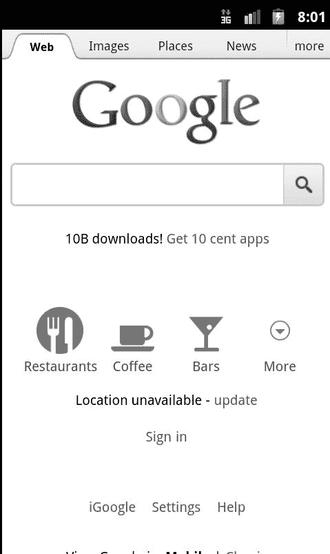

**图 12–1。** *谷歌搜索主页*

现在，假设是一大早，我想听一首很棒的歌曲开始我的一天，这首歌的背景是歌曲所讨论的一系列事件的图片。我可能会开始输入歌曲的名称，如图 12–2 中的[所示，当我这样做的时候，谷歌正在使用异步调用来试图找出我在寻找什么。当我打字时，它会对照中央数据库检查每个字母，而不需要我刷新页面。然后在搜索栏下面显示这些建议。](#fig_12_2)

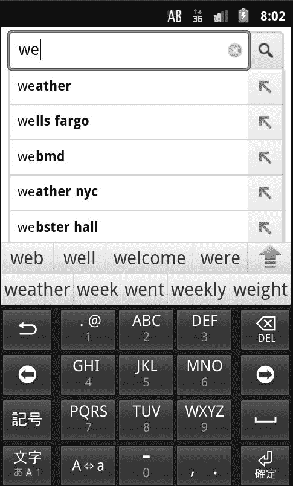

**图 12–2。** *开始我的搜索*

在某个时候，在[图 12–3](#fig_12_3)附近，建议与我正在寻找的整个短语相匹配，我可以简单地点击它。

**图 12–3。随着我输入的越来越多，网页试图填写可能的查询。有趣的是，Android 操作系统也在试图弄清楚我在写什么——就好像它们都在试图读取我的想法！**

基本上，谷歌已经能够预测我在寻找什么，并给我一个直接访问这些搜索列表的捷径。当我点击符合我想要的建议时，它会将我带到我在[Figure 12–4](#fig_12_4)中看到的搜索结果。

**图 12–4。** *啊，我的结果——现在我可以听我一直在搜索的 flash 视频了*

在谷歌在搜索页面上推出这些异步调用之前，人们在搜索框中输入完整的查询，按下“搜索”，然后等待屏幕重新加载。如果查询中有错误，用户并不知道，直到新页面加载，谷歌指出来。这占用了用户的时间(加载不必要的页面)和谷歌的带宽。最近，谷歌通过异步运行整个搜索，将这种“帮助之手”又向前推进了一步——你可以输入你的查询，然后在同一个浏览器窗口中一个字母一个字母地更新搜索结果。

#### 那么 JavaScript 和 XML 呢？

从技术上讲，AJAX 可以与任何客户端编程语言一起工作(客户端语言，如 JavaScript，在用户的浏览器中处理。服务器端语言，如 PHP，在 web 服务器上处理)。然而，由于 JavaScript 已经成为客户端语言的通用语言，所以它被广泛使用。XML 参与进来是因为它已经成为一种简单且易于理解的移动数据的方式。虽然您可以将其他技术混合到 AJAX 宴会中，但是在我们的示例中，我们将坚持使用 JavaScript 和 XML。

既然我们已经确定了 AJAX 是什么，那么让我们来讨论一些将它整合到一些非常简单的应用程序中的巧妙方法。我们将从一个每日一词的例子开始，然后进入一个稍微复杂一点的例子，引用一个 web 服务和我们自己的本地数据库。

### 今日 AJAX

最近有报道称，2011 年的“年度词汇”是“务实”。这是因为一个词典服务网站发现它是那一年被查询次数最多的单词，因此它成为了冠军。也许你会说，“我一直想知道‘实用主义’是什么意思”(或者，“哪个白痴不知道‘实用主义’是什么意思？！?")，并想知道为什么我们没有更多的网络应用程序给我们带来这样的内容。好吧，今天是你的幸运日，因为你将要写一个。

对于今日单词应用程序，我们将创建一个相当简单的机制来提供该单词。在本章的后面，我们将讨论如何使用 AJAX 从数据库或 web 服务中获取信息，但是现在我们将使用一个好的、老式的平面文本文件。恰如其分地命名为:

**清单 12–1。** *word.txt*

`<em>Pragmatic</em>: relating to matters of fact or practical affairs. <i>-<A HREF=http://www.merriam-webster.com/dictionary/pragmatic>Merriam-Webster.com</A></i>`

文件`word.txt`中有一些 HTML(在这种情况下，我们使用简单的样式标签，但是我们可以使用 CSS 主题的 div 语句)，如果我们在 web 浏览器中加载它([图 12–5](#fig_12_5)，我们会看到它显示为简单的文本:

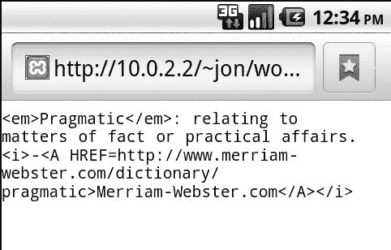

**图 12–5。** *当日 word.txt 文件*

接下来，我将构建一个 HTML 页面，当用户按下按钮时，该页面将加载当日单词。从代码角度来看，它将类似于[清单 12–2](#list_12_2)。我们会一步一步来。

**清单 12–2。word.html 的** *，第 1 部分:加载单词的初始 JavaScript 函数*

`<html>
<head>
<meta content="text/html; charset=ISO-8859-1"
http-equiv="content-type">
<title>Word of the Day</title>
`

现在我们有了请求对象，恰当地命名为“`request`”，我们可以要求它做一些事情。代码的下一部分稍微“向后”写，因为写在顶部的代码将在写在底部的代码之后执行。这是因为 AJAX 的核心 XMLHttpRequest 对象有一个名为`onreadystatechange`的特殊函数。每当我们在后台处理请求时，无论是预期的还是意外的，它都会触发这个函数。本质上，这个函数是我们放置“我用我得到的东西做什么”代码的地方。你可以把这里的代码想象成“代课老师的指令”的编程等价物作为一个聪明的学生，你可能记得，当你的老师不在时，他或她会留下替换的说明，也许在一个特殊的文件夹里。您的`onreadystatechange`函数充当这些指令，告诉计算机(在这种情况下，JavaScript 引擎)当您不在身边但有事发生时该做什么。大多数情况下，这些指令与我们前面的指令相似(在本例中，“如果请求被正确处理，则在屏幕上显示它”)。我们还可以包括针对“最坏情况”的说明，比如当请求无法实现或者抛出错误时。

在这个函数中，我们首先测试一下`readyState`和`status`是我们的请求。前者可以返回五个不同的数字，它们对应于请求的处理阶段。返回的代码

*   0 表示请求尚未开始。这是发送新请求之前的状态。
*   1 表示与服务器的连接已经初始化。本质上，管道是开放的，数据是移动的。
*   2 或 3 分别表示请求已经发送并且正在处理。此时，您的代码所能做的就是坐着等待(或者显示一个“正在加载”的图形，如果您愿意的话)。
*   4 表示请求完成并准备好代码。现在，您可以对这些信息做任何您想做的事情。我们只想在达到 4 的`readyState`时改变页面上的文本。

我们还关心`status`，它可以报告 200(表示“OK”)或 404(表示“未找到”)。因此,[清单 12–3](#list_12_3)的第二行解释为:“只有当请求准备好并且成功完成时才这样做！”从这里开始，只需一行代码就可以将省略号或文本占位符(参见[清单 12–4](#list_12_4))更改为请求返回的文本。

完成[清单 12–3](#list_12_3)，我们正在创建并发送我们的请求。以`request.open`开头的行调用指定我们试图检索什么以及我们想要如何检索的函数。在这种情况下，这是一个非常简单的请求——我们只是获取数据，而不是发送任何我们希望服务器解析的数据。我们将使用“GET”方法而不是“POST”方法，因为这样更快，我们将请求“`word.txt`”，并且我们将 asynchronous 设置为“true”，因为我们希望在后台得到响应，从而允许脚本继续运行。关于我们为什么把它设置为 false 的讨论，以及 GET 和 POST 方法的更多细节，请参阅本章末尾的“AJAX 注意事项”一节。

最后，我们简单地调用`request.send()`，它触发我们的请求。一旦我们得到请求，XMLHttpRequest 对象将触发我们的`onreadystatechange`并更改网页中的行。

最后，我们通过创建基本的 HTML 结构来完成[清单 12–4](#list_12_4)中的页面。我们有一个特殊的`div id`叫做“theword ”,它以省略号(…)开始。这将被我们在顶部编写的 JavaScript 代码所取代。我们还有一个按钮，启动我们的功能`loadword()`。

**清单 12–4。***word.html，第 3 部分:页面的其余部分，由一个简单的正文部分和文本组成，以及“单词”部分*

`</head>
<body>
Get Today’s Word
Of The Day 

<h2>...</h2>

<button type="button" onclick="loadword()">Get The Word!</button>` `
</body>
</html>`

在 Android 网络浏览器上查看时，页面加载并显示默认状态(参见[图 12–6](#fig_12_6))。

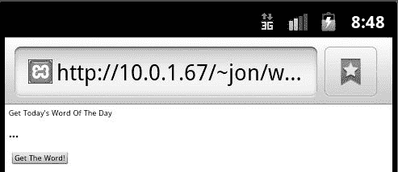

**图 12–6。** *当日单词示例第一页*

现在，当用户点击“获取单词！”按钮，省略号被替换为从`word.txt`中提取的当天的实际单词(参见[图 12–7](#fig_12_7))。您还会注意到文本似乎缩小了一点——这是因为 AJAX 请求占据了整个`‘theword’ 
`部分，包括通常会提供更多间距的`<h2>`标签。我特意这样做是为了指出，在考虑 AJAX 请求时，标记的嵌套很重要。将`<h2>`放在`
`外面可以保留空间。

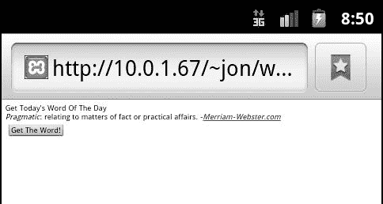

**图 12–7。** *这个词现在已经放入页面，无需重新加载页面！*

成功！我们通过调用服务器改变了页面的内容，而没有真正重新加载页面。更好的是，如果用户点击浏览器上的“reload ”,我们将避免类似于[Figure 12–8](#fig_12_8)中的难看错误，因为我们实际上没有向服务器发送任何“POST”数据(传统意义上)。有关 POST 数据的更多信息，请参见本章末尾的“AJAX 注意事项”一节。

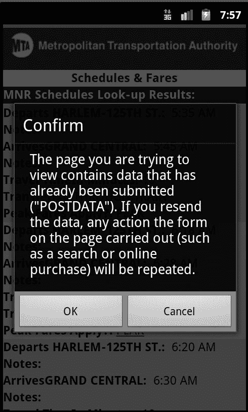

**图 12–8。**T3【安卓确认重装】对话框

现在，单词的基础已经完成，我们可以继续让它更漂亮一点(例如，使用前面提到的 CSS 方案)。不过，出于我们的目的，您现在应该对如何不仅通过 PHP(如前几章所示)而且通过 AJAX 包含平面文本文件有了很好的了解。我们的下一站？web 服务、XML 和 JSON 的奇妙世界。

### 我的消息！

我们的下一个例子调用了几个 web 服务来为我们提供不会存储在我们自己的设备上的内容。我们还必须对这个世界采取一种稍微以自我为中心的观点，但是，嘿，这是作为一名程序员的职责所在！

假设我们有许多喜欢访问的网站，我们希望我们的应用程序显示这些网站的最新消息。为此，我们需要将这些网站的 RSS 提要集合在一起，合并它们，然后显示它们。我们希望列表在我们的页面上实时更新，无需用户干预。听起来很复杂？不尽然——如果你知道一些窍门的话！

#### 首先:创建管道

雅虎！Pipes 是我最喜欢的网络服务之一([图 12–9](#fig_12_9)，`[http://pipes.yahoo.com](http://pipes.yahoo.com)`)，它没有被大多数博客或网站过多报道。但是它提供的服务非常棒——它可以将 RSS 源和其他数据缝合在一起，并以你选择的易于使用的格式提供它们。

**图 12–9。** *雅虎！管道主页*

而其他网站允许你把东西连接在一起(Dapper，另一个雅虎！属性和 ifttt (If This Then That)提供了更加可定制的“输出”，因此我们将在本例中使用它。首先，点击“创建管道”来加载管道编辑器，如图[图 12–10](#fig_12_10)所示。管道编辑器允许您将一系列模块(在左侧)组织成一个逻辑规则结构。每个管道从一个或多个输入开始，然后使用模块对它们进行操作(例如，更改数据或合并数据)，然后以各种形式输出结果。

**图 12–10。** *雅虎！管道编辑*

在左侧，您会发现一系列模块，您可以将它们拖入 Pipes UI。可以连接这些模块来执行您想要的操作。我要用三个模块——获取站点 Feed、Union、Truncate——把三个网站的 Feed 集合在一起，合并在一起，然后截掉五项之后的输出([图 12–11](#fig_12_11))。

1.  获取网站提要获取网站的 RSS 提要的 URL。在这个例子中，我将为三个不同的网站获取三个 RSS 提要，并将它们链接在一起。你会注意到在[图 12–11](#fig_12_11)中，我有三个“获取站点馈送”模块。
2.  Union 只是将最多五个输入组合成一个提要。这里，工会正在合并我输入的三个提要。如果需要的话，我可以有多个联合，通过“联合——连接”到一个联合来供给五个以上的管道，等等。
3.  Truncate 告诉 Pipes 我只想输出五个项目。这有助于加快响应时间，因为 Pipes 只需要导出几个项目，而不是多个提要可能提供的几十或几百个项目。这是我在管道输出模块之前连接的最后一个东西。

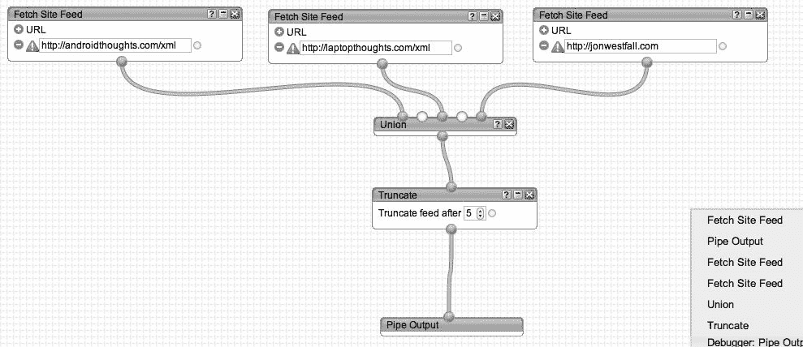

**图 12–11。** *完工的管道*

在调试器窗口中([Figure 12–12](#fig_12_12))，我可以看到整个管道或沿途各个部分的输出。当我点击“管道输出”时，显示如下输出(在[图 12–12](#fig_12_12))如果我点击了 Union，我会看到所有的提要条目，而不仅仅是 Truncate 命令后显示的五个条目。当调试管道以查看哪个组件可能导致问题时，这种中间级别的调试非常有用。

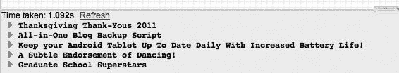

**图 12–12。** *我的管道的全部输出，假设我们已经在五个项目后截断了*

完成后，点击“保存”并给你的管道命名。然后点击“运行管道”查看输出([图 12–13](#fig_12_13))。

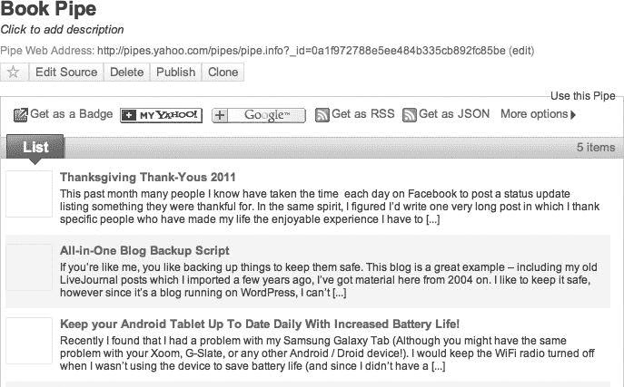

**图 12–13。** *我创作的书管*

你会注意到雅虎！管道为我提供了如何访问管道的选项。我可以将它作为 RSS 提要本身来访问，或者作为 JSON 结果输出来获取。在“更多选项”下，我还可以配置通过电子邮件或 PHP 获取结果。在这个例子中，我想得到 JSON 格式的结果。你应该还记得，在本书的前面，在第二章和第三章的应用程序中，我们已经使用了 JSON。这里，我们再次使用它来获取管道的输出。点击 JSON 按钮会给我一个相当难看的屏幕，里面全是内容，但这确实是我想要记住的 URL。它看起来有点像`[http://pipes.yahoo.com/pipes/pipe.run?_id=0a1f972788e5ee484b335cb892fc85be&_render=json](http://pipes.yahoo.com/pipes/pipe.run?_id=0a1f972788e5ee484b335cb892fc85be&_render=json)`，可以通过我的 AJAX 网页调用它。

#### 第二:获取输出并显示！

我们将修改我们的每日一词示例来提取 JSON 输出并显示它。虽然有更简单的方法可以做到这一点(最明显的是使用 JSON 的 getJSON 函数，并循环列表项)，但是[清单 12–5](#list_12_5)中的代码更长一些，这使得更容易看到我们正在做什么来解析每个项。稍后，作为 JavaScript 技能的一种灵活运用，如果您愿意，可以使用 getJSON 重写这段代码。

**清单 12–5。mynews.html**T2

`<html>
<head>
<meta content="text/html; charset=ISO-8859-1"
http-equiv="content-type">
<title>My News</title>
****

</head>
<body>
Get the News! 

<h2>...</h2>

<button type="button" onclick="loadnews()">Get The News!</button>

</body>
</html>`

你会注意到，这段代码的大部分与我们在《今日一词》中使用的代码相同。值得注意的是，我们改变了一些东西，这些东西在我们的代码中是加粗的。

*   我们已经将请求从`word.txt`更改为 Yahoo！管道 JSON 输出。
*   我们现在使用 jQuery，这是一个我们以前使用过的库，它包含一些读取和解码 JSON 输出的有用函数。使用 jQuery 意味着我们必须在顶部添加对`jquery-1.7.1.min.js`文件的引用。
*   我们现在使用`jQuery.parseJSON`来解析从 XMLHttpRequest 返回的文本。
*   我们得到了一个 HTML 格式的列表，一旦检索到 JSON，就会显示出来。

成品在我们的浏览器中是这样的([Figure 12–14](#fig_12_14)):

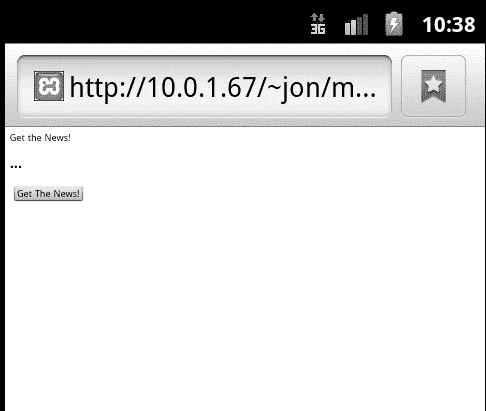

**图 12–14。** *我的新闻应用*

当我们点击“获取新闻！”显示如下([图 12–15](#fig_12_15)):

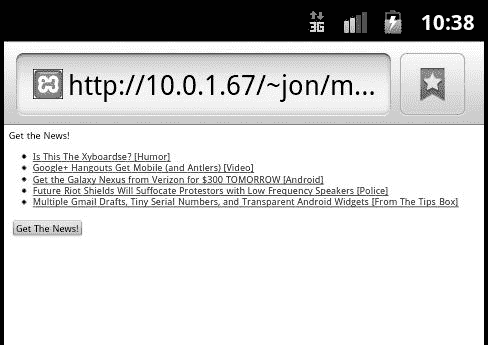

**图 12–15。** *新闻现已加载！*

现在我们已经从服务器加载了数据，从 web 服务加载了数据，我们可以开始最后一部分了:网页和数据库之间的来回交互。

### 用户名可用性

网站在过去几年中做的一件好事是“即时用户名可用性”字段。这是使用 AJAX 完成的，通过检查用户在“用户名”字段中输入的内容，同时检查它在数据库中的可用性。我们将使用 AJAX 创建这种体验，在后端使用 PHP 与 MySQL 数据库通信。这类似于谷歌对其即时搜索结果所做的，我们之前讨论过的功能。我们将从创建数据库开始，使用清单 12–6 中的模式。这个清单首先创建一个表，然后用几个测试用户名(“hardcore”、“恐龙”等)填充它。).

**清单 12–6。** *用户表的 SQL 模式*

`CREATE TABLE IF NOT EXISTS `users` (
  `name` varchar(25) NOT NULL
) ENGINE=MyISAM DEFAULT CHARSET=latin1;

--
-- Dumping data for table `users`
--

INSERT INTO `users` (`name`) VALUES
('hardcore'),
('dinosaur'),
('yelius'),
('tep');`

使用前面的模式在 MySQL 数据库中创建 users 表。(MySQL 在`[http://www.mysql.com/products/community/](http://www.mysql.com/products/community/)`可用。)注意，您可以随意命名数据库，但是在本例中，它被称为“datab”现在我们需要一个简单的 PHP 脚本，它接受一个值并在数据库中检查它。清单 12–7 应该很好。

**清单 12–7。***check _ name . PHP 脚本*

`<?php
$name = $_GET['u'];
$user = "root";
$pass = "";
$server = "localhost";
$db = "datab";
mysql_connect($server,$user,$pass) or die("Can not connect");
mysql_select_db($db) or die("No such database");
$query = "SELECT * FROM `users` where `name` = '$name'";
$result = mysql_query($query);
if (mysql_num_rows($result) == 0)
{ echo "Available!"; } else { echo "Not Available :( "; }
?>`

前面的脚本相当简单。它连接到数据库并执行一个简单的查询，查看在多少行中输入了姓名。如果在任何行上都找不到该名称，那么它是可用的；脚本发回了“可用”(大概会有很多欣喜)。但是，如果它不可用，因为数据库中已经有一个包含该名称的行，那么脚本会返回一个更令人难过的“不可用”您可以通过访问 web 浏览器中的`check_name.php`脚本来测试这一点，包括带有某种测试用户名的`&u=test`。例如，在我的测试环境中，`[http://localhost/~jon/uname/check_name.php?u=dino](http://localhost/~jon/uname/check_name.php?u=dino)`返回“可用”，而`[http://localhost/~jon/uname/check_name.php?u=dinosaur](http://localhost/~jon/uname/check_name.php?u=dinosaur)`返回“不可用”如果这对你有用，那么你就可以继续了。

后端完成后，我们现在将构建一个非常简单的表单，它将在用户输入时检查用户名，并告诉他或她所需的名称是否可用。

我们将使用[清单 12–8](#list_12_8)中的代码来完成这项工作。

**清单 12–8。**checkname.html*页面*

`<html>
<head>
<title>Registration Page</title>

</head>
<body>
<form name="theform">
Register! 

<h2>...</h2>

**<input type="text" name="un" onkeyup="checkusername(this.form.un.value)">**
</form>
</body>
</html>`

你会注意到，和上次一样，我们使用了与今日词汇相同的格式。这一次，我们更改了函数以接受一个参数(我们需要检查的名称)，并且将按钮更改为一个文本字段。这个文本字段在每次释放一个键(`onkeyup`事件)时检查名称，并更新结果。加载后，页面看起来类似于[图 12–16](#fig_12_16)。

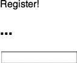

**图 12–16。** *查看用户名页面*

如果您输入一个开放的名称，如“跳过”，您将看到一条成功的消息，如图[图 12–17](#fig_12_17)所示。

**图 12–17。** *甜蜜的胜利*

然而，如果你想要的用户名已经被某个了不起的人使用了，那么你将会看到一个悲伤的消息，比如图 12–18 中的消息。

**图 12–18。** *“不可用”屏幕*

在整个 web 表单中使用这种技术，不仅可以即时检查用户名，还可以验证信息，这样用户就不必点击“提交”按钮，却发现输入了无效的号码、电子邮件地址或用户名。

在我们结束之前，有两个关于表单的快速提示可能会对您有所帮助。首先是考虑您希望将 AJAX 检查代码绑定到什么事件。在本例中，我们已经绑定到正在检查的表单字段上的`onkeyup`事件(用户名)。然而，这会导致每次按键时都有一个查找动作，这可能会使您的脚本陷入困境。另一种方法是将功能代码放在`onfocus`事件的下一个元素(例如，可能是一个密码字段)中，而不是放在`onkeyup`中。这将导致 AJAX 请求在用户移动到表单上的下一个字段后触发，从而减少负载。第二个考虑事项涉及表单的验证和自动提交。填写完最后一个字段后，让表单自动提交是很诱人的。毕竟，您可能会在用户输入信息时验证信息，所以为什么要让他们在完成最后一个字段后等待呢？这可能是一个问题，因为有些人可能希望在继续之前检查他们的答案。最好在页面上保留一个“提交”按钮，让用户在准备好的时候继续。

### AJAX 的注意事项

在这个相对较短的章节中，我们使用的例子涵盖了在使用 AJAX 时要与之交互的三种主要数据类型。我们从服务器上获取数据，不经刷新就放入页面，我们查询 web 服务获取 RSS 标题，我们检查用户名以确保它们可用。至此，您已经拥有了编写利用 AJAX 功能的应用程序所需的基本工具。从这里开始构建时，有几件事情需要考虑，我们将在下面重点介绍。

#### POST vs. GET

您会注意到，在我们的例子中，我们一直使用 GET 方法而不是 POST 方法，如清单 12–3 和 12–4 所示。这主要是因为速度。GET 比 POST 快得多，因为它使用的格式更简单。如果您想知道为什么，这很可能是由于 GET 的原始意图——它被设计为只用于“等幂”数据。这仅仅意味着信息不能持久使用(也就是说，它应该只是一个查找值，而不是要输入数据库或以任何方式处理的数据)。

然而，有些时候 POST 是合适的。首先，POST 没有 GET 的大小限制，所以如果您要向服务器传递大量信息，就需要使用 POST。其次，当您在服务器上更改某些东西(比如数据库更新)时，应该使用 POST，而不是引用静态或缓存的内容。简而言之，如果您正在传递不再需要的数据，请使用 GET。如果要传递应该处理或输入到数据库、电子邮件或文件中的数据，请使用 POST。

使用 POST 比 GET 稍微复杂一些。您需要设置一个请求头，并通过 send 函数发送信息。这是因为 POST 数据编码在消息体中，而 GET 数据只是简单地附加在 URL 上。这就是为什么 Android 浏览器在[Figure 12–8](#fig_12_8)中提到重新发送 post data——它指的是这种特殊编码的消息。如果我们想将我们的用户名示例更改为使用 POST，我们可以更改以下几行:

`request.open("GET","check_name.php?u=" + $name,true);
request.send();`

这一更改将导致清单 12–9 中的行。

**清单 12–9。** *在用户名可用性示例中使用 POST*

`request.open("POST","check_name.php",true);
request.setRequestHeader("Content-type&","application/x-www-form-urlencoded");
request.send("u="+$name);`

我们还必须修改 PHP 脚本(参见[清单 12–7](#list_12_7)，将第一行从`$name = $_GET['u'];`改为`$name = $_POST['u'];`

#### 设置异步为假？

正如您在前面的例子中看到的，XMLHttpRequest 的`open`函数的第三个参数通常设置为“true”。这种方式是有意义的——毕竟，我们为什么要将它设置为 false 呢？答案是，我们很少会这样做！尽管如此，在某些情况下你可能会。例如，如果您正在编写一个脚本，并且您绝对不希望在请求被返回并准备好进行处理之前发生任何事情，那么可以将其设置为 false。我想到的一个例子是一个用户名检查表单，类似于[图 12–16](#fig_12_16)中的表单，它应该只允许用户在用户名可用的情况下继续使用表单(也许可以基于它定制其他选项)。在这种情况下，可以禁用或隐藏所有后续的表单字段，然后等待请求返回；如果成功，则可以重新启用或显示这些字段。但是要注意的是，你的整个脚本将会被延迟，所以对大量的数据这样做并不是一个好主意。人们可以想象整个浏览器“卡住”了，这在任何平台上都是令人沮丧的事情，但在对速度的需求已经超过其可用性的移动设备上尤其令人烦恼。

还要注意，如果您决定将 asynchronous 设置为 false，您不需要(也不应该使用)函数`onreadystatechange`。这是因为没有要寻找的就绪状态—请求就绪后，代码将继续处理。只需将剩余的 JavaScript 代码放在`send`函数之后，它就会按顺序处理。

最后，在将 asynchronous 设置为 false 之前，您可能希望问问自己，对于您想要完成的任务，AJAX 是否真的是最佳解决方案。当然，它可能看起来很酷，但是如果你需要强迫用户等待，也许用不同的方式实现你的代码会更容易。例如:

*   如果您的用户有可能禁用 JavaScript，要求 JavaScript 完成表单将会使页面对他们无用。使用异步设置为 true 的 AJAX 通常可以避免这个问题。
*   在几个选项之后需要复杂验证(例如，数据库查找)的长表单可能更适合作为多页表单，允许用户在第一页创建一个帐户，然后在空闲时返回到后续页面。每个页面都可以保存表单的进度，允许用户跳回到需要的地方，同时还提供足够的验证。

有了这些想法和您自己的测试经验，您不仅可以了解最好的表单提交方法 get 或 POST，还可以了解使用不常见的方法将 asynchronous 设置为 false 对您的脚本来说是否是个好主意。

### 总结

在这一章中，我们已经向前迈出了一大步，让我们的用户生活更加轻松。我们已经开始在后台对我们的表单或页面进行一些处理，这样用户就不需要刷新页面、提交表单或重新加载不必要的内容。通过在你的项目中，甚至在我们之前的例子中，实现这里概述的想法和概念，你将能够立刻创造出令人敬畏的“超级增压”设计！