# 十三、打包您的应用

因此，终于到了这一步:最后一章。在这本书里，我们回忆了过去的日子(也称为 20 世纪 90 年代)，我们了解了 CSS3、HTML5 和 JavaScript 的神奇之处。我们玩了音频和视频。我们已经了解了使用 JavaScript 框架来提高我们的生产力并为我们的用户提供非常容易创建的页面布局的乐趣。我们甚至创建了一系列初学者应用，其中一个最终把你变成了一个国际神秘人，让你开始你未来的明星之路。希望在阅读完这本书之后，我们已经成功地强调了优化代码的重要性，并且在开发过程中要注意许多移动用户面临的有限带宽。

然而，像所有美好的事物一样，我们的时代很快就要结束了。不过，在我们结束之前，我还有更多信息要告诉你。虽然我们已经完成并构建了一个有趣的应用库，但是我们仍然没有讨论在构建这些应用时应该做些什么！在这一章的其余部分，我们将涵盖从打包和压缩你的应用，让它们为互联网做好准备；选择一个合适的托管服务来存储你的应用；将您的文件传输到您使用的任何托管服务；甚至跳过整个托管服务解决方案，而不是将您可信赖的 HTML5 代码包装在 PhoneGap 或 Appcelerator 的 Titanium Mobile 之类的框架中，这样您的代码就像您的用户可以从 Android Market 安装在他们的设备上的原生应用一样工作！

### 压缩应用

现在，您已经完成了代码的编写并在本地开发环境中进行了测试，您可能很兴奋地将您的应用上传到互联网，并开始告诉您认识的每个人去查看它。在任何项目中达到这一阶段都是一项成就，但是仅仅因为你完成了代码并不意味着你没有任何工作要做。在这本书里，我一直试图强调聪明编码的重要性；做一些事情，例如使用 CSS3 来创建精彩的渐变效果，以及定制 web 字体(由 Google 的惊人的 web 字体目录提供)来代替图像或其他“沉重”的资源，如 Flash 电影。这些最终会帮助你的代码在用户的设备上快速加载。

当然，我们正处于向任何想要的人提供全国范围的第四代移动互联网的尖端，但实际上，你的运营商的宽带服务有多快并不重要，因为移动网络严重缺乏延迟(在数据传输之前，你的手机与你试图加载的网站或服务进行通信所需的时间)。)为了帮助我们的代码更快地到达我们的用户，并反过来帮助减轻我们糟糕的 web 服务器的压力，我们将做一些通常被称为缩减代码的事情。缩小或压缩我们的代码包括通过一个应用或服务运行我们的 CSS 和 JavaScript 文件，该应用或服务将获取代码并删除所有换行符和不需要的空格，以使最终产品比以前小一点。

#### 什么是压缩？

让我们再一次看看许多 web 开发人员使用的非常流行的 jQuery 框架。正如您在下面的[图 13–1](#fig_13_1)中看到的，我们有两个版本的主 jQuery 库。该脚本的一个版本是未压缩的，重量高达 231KB，而另一个版本已经压缩并经过了一轮模糊处理，总重量降低到仍然很高，但更易于管理的 90KB。在代码编辑器中打开我们的 JavaScript 文档，我们可以立即看到两个文件之间的区别。如图[图 13–2](#fig_13_2)所示，jQuery 的开发版本格式非常好，并且有一堆非常有用的注释，而 jQuery 的较小的生产就绪版本看起来就像一种奇怪的外星语言，几乎无法理解。看一看[图 13–3](#fig_13_3)来更好地理解我指的是什么。这就是模糊代码的作用。我们不仅去掉了所有的换行符和漂亮的格式，而且代码本身也被压缩和处理，使代码模糊不清，更难理解。

**图 13–1。** *我们在这里检查两个不同版本的 jQuery 1.6.2* 的文件大小

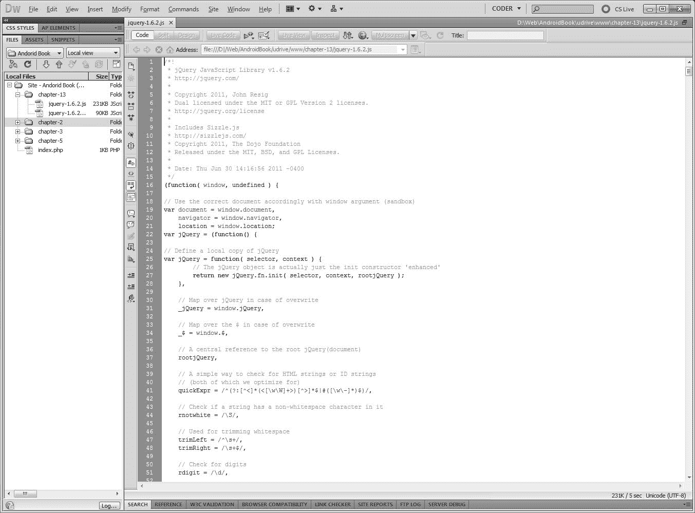

**图 13–2。** *在 Adobe Dreamweaver 5.5 中查看未压缩的 jQuery 脚本*

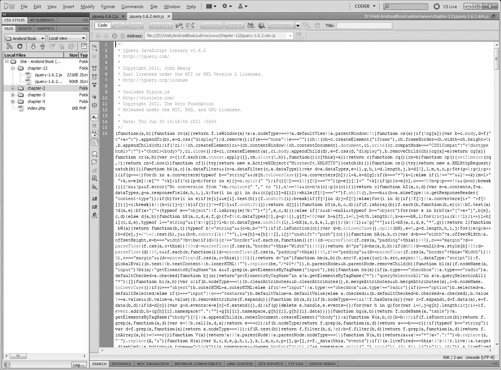

**图 13–3。** *在 Adobe Dreamweaver 5.5 中查看压缩的、模糊的、陌生的 jQuery 代码*

有人可能会问为什么我们要隐藏代码——毕竟，难道我们不想让别人看到我们巧妙的技巧吗？嗯，在像这样的书里，我们当然知道，但是在现实生活中，把一些事情“藏在秘密里”会变得非常重要虽然模糊的代码不会阻止无畏的代码——读者猜出你所有的秘密(因此，永远不要依靠模糊的代码来保护诸如密码、信用卡号、核发射代码等。)，它将阻止那些知识不多的人窃取你长期努力工作的代码，只是为了重用你整洁的过渡或酷的布局。

#### 压缩工具和实用程序

trustyol 的互联网上有大量的程序可以帮助你使你的产品代码更小，减轻你的服务器和用户资源的负担。其中最受欢迎的是雅虎！sYUI 压缩机([图 13–4](#fig_13_4))。与其他一些压缩解决方案不同，YUI 压缩程序是一个用 Java 编写的应用，必须在您的开发工作站上运行。在运行应用并从命令行给它你想要的选项后，应用将获取你的代码，如我们所讨论的那样压缩它，甚至将你的许多不同的 JavaScript 或 CSS 文件合并成一个超级压缩的文档，准备好上传到你的服务器。你可以在`[http://developer.yahoo.com/yui/compressor/](http://developer.yahoo.com/yui/compressor/)`找到 YUI 压缩机。

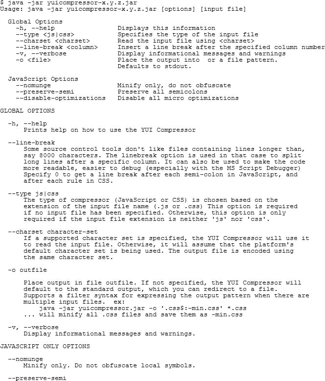

**图 13–4。**

使用 YUI 压缩器看起来有点吓人(当查看所有选项时，如[图 13–4](#fig_13_4)所示)，但它相当简单。例如，假设我想压缩“那条推特是谁？”中的`main.js`文件来自[第二章](02.html#ch2)的 app。首先，我会从网站上下载 YUI 压缩机。然后我提取文件，打开一个命令行窗口，切换到包含 Java JAR 文件的目录(在本例中是`yuicompressor-2.4.7.jar`；该名称会因版本而异)。接下来，我将复制我想要压缩的文件(到我的当前目录中)并运行压缩命令。我将使用的命令是:

`java -jar yuicompressor-2.4.7.jar main.js -o main.small.js`

这告诉 YUI 压缩器将`main.js`压缩成一个名为`main.small.js`的较小文件。在这种情况下，压缩程序将文件大小从 3，763 字节减少到 1，946 字节——略多于一半！

还有一些其他压缩应用绝对值得一提。我想看的第一个是一个由狄恩·爱德华兹创建的叫做 Packer ( `[http://dean.edwards.name/packer/](http://dean.edwards.name/packer/)`)的方便的小应用，如图[图 13–5](#fig_13_5)所示。这个 web 服务将允许您将您的开发 JavaScript 复制到站点上的 textarea 字段中，只需快速点击一个按钮，就会显示出压缩的 JavaScript 代码，您只需复制并粘贴到一个空白的文本文件中，就可以上路了。如果你认为 YUI 对你的特殊需求来说可能有点多余，那么 Packer 可能是一个非常棒而且非常简单易用的替代品。

然而，需要注意的是，虽然 Packer 是一个很好的压缩代码的工具，但是也很容易通过简单地禁用阻止您将代码粘贴到“复制”框并点击“解码”的 JavaScript 来隐藏这些代码！因此，应该将它简单地用作压缩器，而不是安全机制。

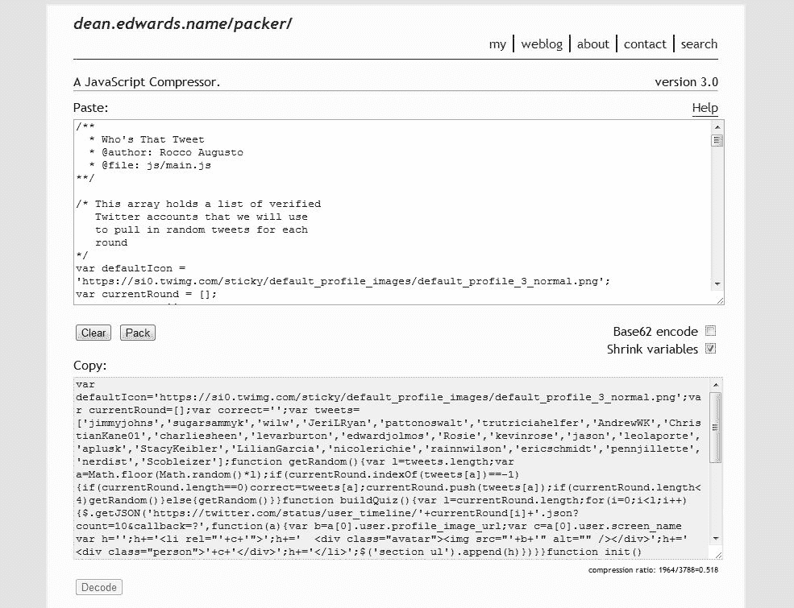

**图 13–5。** *使用 Packer 我们可以毫无痛苦地缩小我们的“那条推特是谁？”第二章的 JavaScript 代码，在顶部的文本区域，只占原始文档大小的一小部分，如底部的文本区域*所示

我想讨论的最后一个神奇的软件是一个代码和应用的小集合，叫做 HTML5 样板，由 Paul Irish 创建，在`[http://html5boilerplate.com/](http://html5boilerplate.com/)`找到。虽然它不是一个专门的压缩工具，但它是一个非常有用的框架，你可以考虑用于应用开发，它包括自己的压缩工具。HTML5 样板文件是一个非常年轻的项目(它于 2010 年 8 月 10 日推出)，对于不想一遍又一遍地编写相同的旧基本代码的开发人员来说是一个很好的起点，因为它包含在他们创建的几乎每个项目中。有人喜欢将 HTML5 样板文件与框架混淆，但实际上远非如此。我更愿意把这个项目看作是一个组织结构和工具箱([图 13–6](#fig_13_6))；它帮助您保持项目文件有序，并通过提供一种简单的方法来实现开发人员必须重复做的许多事情(例如指定某些文件、JavaScript 库等),让您避免重复工作。).

**图 13–6。** *一看 HTML5 样板文件的文件夹结构。所有神奇的压缩功能都发生在“build”文件夹中。*

在样板文件包中，目前是 2.0 版本，可以找到大量有用的项目和特性，比如已经编码好的`index.html`和`404.html`文件的准系统框架布局；jQuery 的最新副本；一些预定义的 CSS 样式用于在浩瀚的互联网海洋中重置大量 web 浏览器的样式；在移动环境中使用的特殊优化；甚至还有一个漂亮的小代码压缩器，当您准备启动应用的生产版本时，它会为您压缩 HTML、CSS 和 JavaScript 文件。

要用内置工具压缩你的文件，包括我们之前讨论过的像 YUI 压缩器这样的压缩器，你所要做的就是编辑位于构建目录中的`build.xml`文件(见[图 13–7](#fig_13_7))。在这里，您会发现一系列选项，您可以指定将您的 web 应用压缩到您想要的内容。你可能需要一点时间来适应处理这个文件，但是一旦你按照你想要的方式设置好了一切，你所要做的就是运行`runbuildscript.bat`文件，你的代码将很快被压缩和优化。

**图 13–7。** *在 Adobe Dreamweaver 5.5 中配置 HTML5 样板构建设置*

### 寻找托管解决方案

既然我们已经设法从代码中挤出了所有不需要的字节，使代码尽可能的小，那么是时候把这个美丽的东西上传到互联网上，让全世界都看到了。寻找一个适合你和你的项目的托管解决方案有时会是一件令人沮丧的事情，尤其是当你不确定你到底在找什么的时候。在这里，我们将谈论三个最大的托管公司，我们对他们的印象以及他们提供的功能。首先，让我们考虑一下选择宿主的过程。

#### 评估主机提供商

并非每个提供商都是相同的，对一个开发人员有效的服务可能不适合另一个开发人员的需求。你需要了解提供商，明确自己的需求和目标。评估任何主机时，以下问题都是一个很好的起点:

1.  我有多少个域名或子域名？当许多 web 开发人员开始工作时，最大的问题是，“我有多少空间？”或者“有多少传输量(你每个月可以发送的数据量，而不会产生超额费用——基本上就是你可以有多少访问者)？”。然而，现在大多数网站主机为初级程序员甚至一些高级程序员提供了充足的空间和转移。更大的问题可能是，提供了多少个域名(whatever.com)或子域名(something.whatever.com)？原因很简单:开发人员很少一次只有一个客户端。你可能会建立多个项目、多个客户端，甚至为你构建的应用或其他产品运行多个公共站点。你会希望每个品牌都不同，所以 newname.com 比 yourname.com/newname—更好，也更容易记住。
2.  他们的技术支持响应速度如何？有常见问题或知识库吗？在我使用现在的网络主机的六年里，以及使用以前的十年里，我不得不给技术支持发五到十次电子邮件，询问各种各样的问题，从次要问题(“服务器是否支持…？”)到少校(“我所有的站点都瘫痪了。”).每次我都想立刻得到答复，尤其是后者，因为等待的时间太长了。不过更好的是，我目前的虚拟主机提供了一个非常好的 FAQ 和知识库，涵盖的内容远远不止如何重置密码或创建新的电子邮件帐户。它讨论了 PHP 版本、服务器软件、shell 访问等等。要点是:当你遇到麻烦时，你要确保信息已经可以帮助你，或者这种帮助是一封快速的电子邮件回复。
3.  **有哪些管理工具可用？**你会希望选择一个在你可以用账户做什么方面有足够可管理性的网络主机。有些主机可能希望您在每次需要设置一个新的域、数据库或其他任何东西时联系他们。其他人可能通过控制面板完全自动化这一过程。我倾向于后者，因为前者通常总是可用的。我现在的主机甚至允许我在网上取消域名或我的整个账户，如果我决定离开的话，就不用打一个尴尬的电话了。
4.  如果我超出了我的计划，会发生什么？几年后，您可能需要访问更多功能或资源。接下来，在我们对 Dreamhost 的讨论中，我们注意到它提供了某些特性来“扩展”或“升级”你的包。如果你担心未来，你可以调查或询问潜在的主机对你来说改变计划或升级有多难。如果他们说您必须重新设置一切，您可能希望找到一个主机来为您迁移一切，或者简单地升级您而无需任何必要的更改。
5.  我有 shell 和/或 CRON 访问权限吗？最后一条有点技术性，但如果你正在做一些开发工作，它可能很重要。Shell 访问或 shell 帐户是指您作为客户端以交互方式登录到主机服务器的能力。通常通过一种叫 SSH 的服务，shell 帐户可以让你直接在服务器上运行命令，就像现在你电脑上的命令提示符或终端窗口一样。CRON 是服务器上的一个特殊软件包，可以让您安排以后或定期运行命令。如果您创建一个需要定期自我检查的应用，比如一个向您的用户发送电子邮件的应用，这可能会非常有用。每隔 20 或 30 分钟，您可能需要自动运行一个脚本来检查是否有电子邮件要发送。CRON access 允许您这样做。然而，CRON 也可能被滥用，这就是为什么一些 web 主机不允许您使用它，或者根本不允许您交互登录服务器。

除了前面的指导方针，当决定选择什么主机时，你也可以咨询评论网站。不过要小心:这些网站上一些过于热情或过于负面的评论可能并不代表实际的服务。在一天结束时，我们将永远相信我们知道真正使用过服务的人的建议，而不是粗略的评论，这就是为什么我们会很快花一秒钟来查看我们过去使用或工作过的一些主机提供商，以给你一个很好的起点，让你找到一个最适合你的。

请注意，以下部分讨论了许多主机提供的功能，我们提到的特定主机只是我们个人使用过的主机。虽然我们显然对这些服务很满意，但我们从不认为它们适合所有人。拿起你在以下段落中读到的，考虑你的选择和价格范围，找到适合你的主机！

##### 梦幻主机

在过去的六年里，我(罗科)个人一直是托管公司 Dreamhost ( `[http://dreamhost.com/](http://dreamhost.com/)`)的超级粉丝，这是一家由四个雄心勃勃的计算机科学本科生在 1997 年创建的伟大的小公司(见[图 13–8](#fig_13_8))。Dreamhost 已经存在了一段时间，虽然他们在过去经历了一些成长的烦恼，但他们为我提供的服务非常可靠，很少打嗝。他们的价格极具竞争力，通常每月 9 美元，他们甚至为客户提供无限的带宽和无限的存储空间。

**图 13–8。自 1997 年以来，Dreamhost 已经在互联网上托管了数百万个网站。目前，他们有超过 500，000 个网站运行在 WordPress 开源内容管理解决方案上**

Dreamhost 提供了各种各样的主机，基本的主机形式是在一个共享的环境中。虽然共享主机对于基础项目来说很好，但是走这条路有一些主要的限制。首先，您正在与该服务器上的其他所有人共享一个环境，如果有人向服务器上传了一个脚本，该脚本设法占用了服务器的大量资源，甚至使服务器崩溃，那么该服务器上的所有人都会受到影响。最重要的是，您可以在共享服务器上执行的定制非常少。您不能安装在后台运行的自定义应用或服务，也不能对 web 服务器配置文件进行任何更改。

如果你像我一样是个控制狂，你可能会考虑给自己买一台虚拟私人服务器或专用服务器。虚拟专用服务器基本上是一台运行在计算机内部的计算机。使用特殊的虚拟化软件，可以在安全的沙盒软件解决方案中模拟计算机的硬件，允许您在另一个操作系统中安装和运行整个操作系统，就像它是自己单独的计算机一样。当你从 Dreamhost 租用虚拟专用服务器(VPS)时，你仍然可以在与其他人共享的环境中使用它，但是你有*巨大的*优势，即受到沙箱保护，免受与你共享该物理服务器的任何其他人的有害行为。

你不仅不用担心因为别人的疏忽而导致网站瘫痪，而且你的资源也得到保护。使用 Dreamhost 管理面板中的一个简单的滑块，您可以动态、实时地为您的服务器分配任意多的 RAM 和 CPU 处理能力(参见[Figure 13–9](#fig_13_9))。然而，给你的服务增加更多的 RAM 和 CPU 能力，确实会增加你的月租费；但是，如果您有一个应用，您知道它需要专用的 1GB RAM 和 CPU 能力来及时快速地为您的所有用户提供服务，那么知道这些资源会自动为您并且只为您提供保护是一件非常棒的事情。如果你有兴趣在 Dreamhost 上建立一个 VPS，它会给你提供第一周的免费服务，这样你就可以根据自己的需要调整服务器的大小，找到网站所需的最佳资源量。

**图 13–9。**

Dreamhost 还让你可以选择拥有自己的专用环境。通常这些机器是相对强大的服务器，具有两到四个 CPU 核心，甚至高达 12GB 的 RAM。如果您是一名新的开发人员，您可能不需要那么多的处理能力，但是当有一天您确实需要它时，您现在知道去哪里找了。

除了拥有大量的 Dreamhost 托管站点的选项外，您还可以访问一个反应非常迅速的技术支持团队。如果你有一个问题，或者在半夜你的服务器出了问题，在大多数情况下，你可以在几分钟内与技术人员进行文本聊天，并迅速解决你的问题。在我过去用过的所有托管公司中，当你需要帮助的时候，Dreamhost 是我最喜欢的公司之一。

#### 1 和 1

转换作者(乔恩在这里)，现在是时候听听我的网络主机在过去六年，1 和 1。1and1 实际上是一个相当大的主机，业内大多数人对它的评价都不冷不热。不是最好的(虽然谁是值得商榷)，也不是最差的。Rocco 讨论过的 Dreamhost 提供的许多功能也可以从 1 和 1(以及许多其他主机，就此而言)中获得，因此我觉得最好简单地概述一下我认为 1 和 1 真正有用的部分。这分为两类:文档和可靠性。文档参考了 1 和 1 常见问题部分，让我惊讶的是，在一般问题中有我之前写的详细信息。我遇到了一个脚本问题，当 1and1 FAQ 网站上有关于服务器设置、PHP 版本和可用软件的非常具体的信息时，我感到非常惊讶。我能够调试我的问题，而不必写一封冗长、复杂的电子邮件。我真正喜欢 1 和 1 的第二个特点是我的服务的可靠性。虽然没有人可以吹嘘 100%的正常运行时间(服务器或服务可用的行业标准术语)，但据我所见 1 和 1 非常接近。作为一个最底层的客户(也就是说，我每月支付大约 9 美元的基本共享主机包)，如果我在这里或那里有不稳定的服务，我不会感到惊讶。事实上，相反的事情发生了——我在那里的整个时间里，我的网站一直保持正常运行。

如果你正在考虑另一台主机，并想知道它的可靠性如何，你可能会在论坛上找到一个使用它的朋友或人，并询问他们的域名是什么。从那以后，我会建议在 Pingdom ( `[http://www.pingdom.com](http://www.pingdom.com)`)这样的服务上建立一个免费账户，这是一个正常运行时间监控服务。Pingdom 可以让你免费监控一个网站，所以直接指向你朋友的网站吧。几周或几个月后，您将会看到一些报告，您可以参考这些报告来查看主机是否可靠地启动。

现在，你知道了，1 和 1 对我来说是可靠和全面的。现在回到罗科来讨论最后一个主持人！

##### 媒体神殿

我(Rocco)过去使用过的另一家托管公司，也是我在本章将与您讨论的第三家托管公司，是一家业界最喜欢的公司，名为 Media Temple ( `[http://mediatemple.net/](http://mediatemple.net/)`)。从很多方面来说，对于更专业的用户来说，Media Temple 提供的服务可以被认为比 Dreamhost 更好。Media Temple 提供了大量的解决方案，首先是基本的网格服务器包(见[图 13–10](#fig_13_10))，它将您的站点托管在一个集群上，该集群由数百个其他服务器提供支持。它还像 Dreamhost 一样提供专用的虚拟服务器，以及各种非常强大的专用服务器。

我对 Media Temple 的唯一真正问题是，它往往比 Dreamhost 等其他提供商贵一些，但它确实可以为你提供更好的硬件，以及与 Dreamhost 等公司一样的技术支持；所以，如果你正在寻找力量，一定要去看看媒体圣殿能提供什么。

**图 13–10。** *媒体寺的网格服务登陆页面*

### 文件传输协议

现在，我们已经为您指出了寻找满足您需求的主机提供商的正确方向，我们必须将我们在本地开发服务器上创建的那些文件上传到我们全新的生产服务器上。这一步通常由文件传输协议(FTP)应用完成。FTP 是网络中的标准协议，用于将文件和文档从一台计算机传输到另一台计算机。在你的主机上有一个运行的 FTP 服务器，它允许你使用桌面或工作站上的 FTP 客户端连接到该主机。有很多免费的 FTP 程序，但是我个人最喜欢的是一个叫做 FileZilla ( `[http://filezilla-project.org/](http://filezilla-project.org/)`)的免费开源软件，如图 13-11 所示。

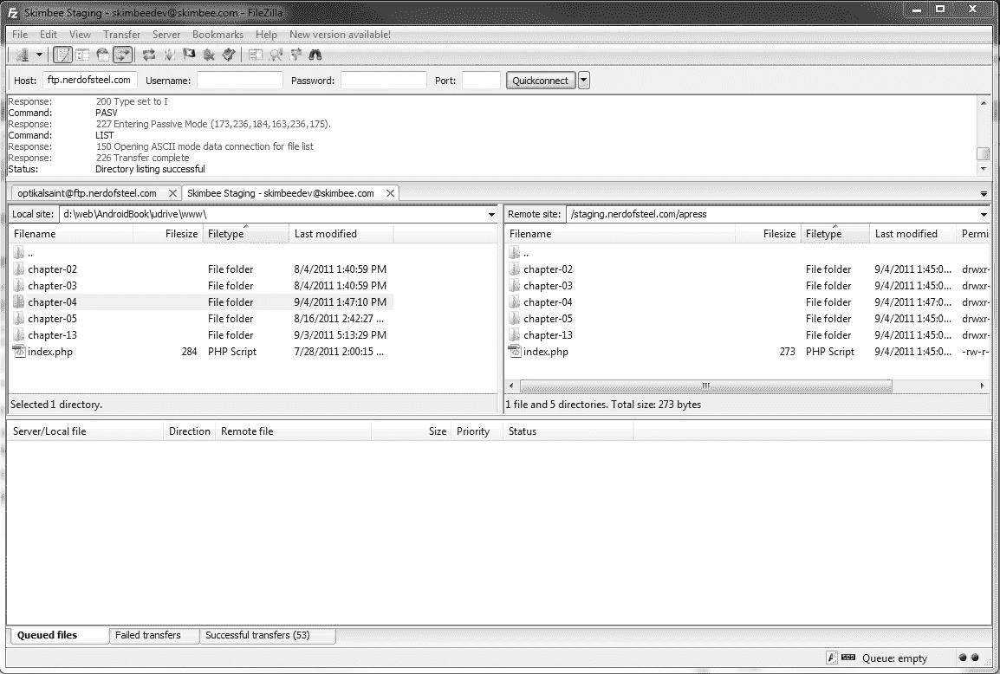

**图 13–11。** *用 FileZilla 把这本书的代码转移到我的一个测试服务器上*

我喜欢 FileZilla 的主要原因之一是因为该软件不断更新，与这个项目相关的开发人员努力工作，以确保它是最快速和最稳定的 FTP 程序之一。

使用 FTP 客户端实际上非常简单明了。一旦你注册了一个托管解决方案，你将获得证书，插入到你的应用中，一旦连接，如果你的 FTP 客户端支持该功能，你就可以拖放文件到服务器上你有权限访问的任何文件夹中。以下是一些 FTP 凭据的示例:

`url: ftp.myawesomesite.com
user: testuser112
password: pssw0rdz
port: 21
path: /var/www/myawesomesite.com/`

如果你以前从来没有这样做过，这可能看起来有点混乱。在下一节中，我们将从头到尾介绍一个应用的部署。

#### 使用安全 FTP 部署应用

在这个例子中，我们将带你通过使用 SFTP 上传整个应用到一个虚拟主机服务。我们将在 Windows 机器上使用 FileZilla，但如果你使用的是 Mac，你可以使用一个由免费捐赠支持的名为 Cyberduck 的程序。步骤大致相同，尽管在 Mac 上屏幕会有所不同。

首先，您需要收集以下信息:

*   您的 web 主机需要的连接方法。一些网络主机不再支持 FTP，更喜欢加密版本，SFTP。你需要知道你的 FTP 地址(这通常是 ftp.yourdomainname.com，其中你的域名是你的个人域名，比如`jonwestfall.com`)、你的 FTP 用户名和 FTP 密码。
*   您需要知道您的域的文件是否在您的 web 主机上的任何特定目录下。默认情况下，许多 web 主机会将您的 FTP 信息放入您的根目录(即，一旦您登录到服务器，您在“/”下看到的文件与您的域名下的文件相同。所以`/test.txt`对应`[http://jonwestfall.com/test.txt](http://jonwestfall.com/test.txt)`。其他主机可能会将您的文件放在一个以域名命名的目录中(即`/jonwestfall.com`)或一个名为`/public_html`或`/web`的目录中。
*   你还需要考虑你希望你的文件放在哪里。在这种情况下，我想要“那条推特是谁？”住在`[http://jonwestfall.com/whosthattweet](http://jonwestfall.com/whosthattweet)`，所以我需要创建那个目录并将我的文件上传到那里。

一旦你有了你需要的信息，下载并安装 FileZilla 客户端(从`[http://filezilla-project.org/download.php](http://filezilla-project.org/download.php)`)。安装后，您应该在开始菜单的 FileZilla FTP 客户端组下找到它。打开 FileZilla，您应该会看到类似于[Figure 13–12](#fig_13_12)的屏幕。

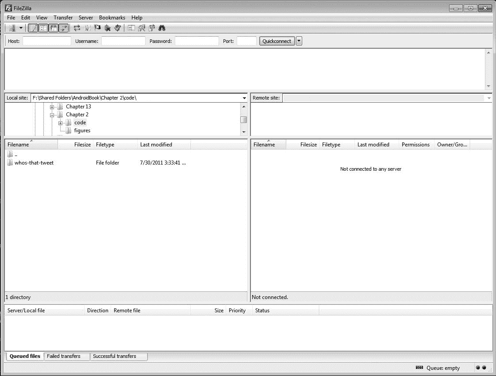

**图 13–12。** *主 FileZilla 窗口没有任何配置*

你会注意到它很空，分成六个窗格。顶部窗格显示了 FileZilla 发送到服务器的 FTP 命令。左侧窗格显示您计算机上的文件(以树形格式列出您正在查找的目录中的文件)，右侧窗格将显示您服务器上的文件(在我们连接后，以相同的排列方式)。底部显示了我们当前正在从一端传输到另一端的文件(从我们的计算机传输到服务器，反之亦然)。

首先在顶部的主机框中输入您的 FTP 主机名、您的 FTP 用户名和您的 FTP 密码。如果您的主机支持 SFTP，这是更安全的方式，您将需要输入 SFTP 的端口号，通常在端口框中输入“22”。但是，如果您只能使用常规 FTP，您将使用 FTP 端口号，通常为“21”(注意:如果您的主机更改了这些值，这对于主机来说是非常罕见的，您应该能够在其 FAQ 部分或知识库中找到它们。输入所有信息后，按“快速连接”连接到服务器([图 13–13](#fig_13_13))。

**图 13–13。**T2【SFTP】FileZilla 主机连接信息

如果这是您第一次连接到此服务器，并且您正在使用 SFTP，您可能会看到以下对话框([图 13–14](#fig_13_14))，要求您验证服务器身份。通常情况下，您不知道要验证什么值，但是您可能希望第一次就注意到它，以确保它总是相同的。这是一项安全功能，可确保您始终连接到正确的计算机。

**图 13–14。** *FileZilla 未知主机按键提示*

登录后，屏幕右侧的窗格会发生变化，显示服务器上的文件。点击文件夹，直到你找到你想上传文件的地方。在我的例子中，我将转到`/new-jonwestfall.com`目录(`jonwestfall.com`的 web 文件所在的位置)并创建一个`whosthattweet`目录。我可以通过双击右侧窗格中的`new-jonwestfall.com`，并右键单击文件旁边的空白区域来完成此操作。在出现的菜单中([图 13–15](#fig_13_15)，我选择“创建目录”，在下一个窗口([图 13–16](#fig_13_16))，我给它一个名字。

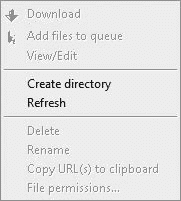

**图 13–15。** *右击显示上下文菜单，允许你创建一个目录*

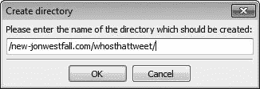

**图 13–16。***FileZilla【创建目录】对话框*

现在我确保我已经正确设置了目录:我想要移动的文件在左边，目标位置在右边，如图[图 13–17](#fig_13_17)。

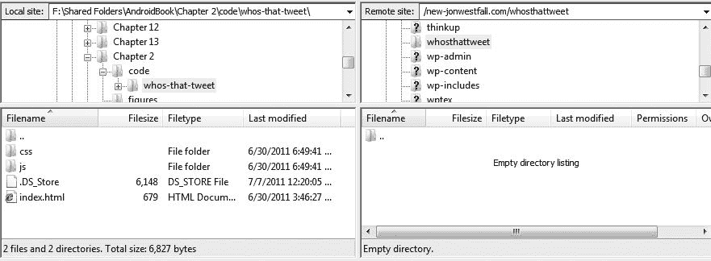

**图 13–17。** *显示源(左边)和目标(右边)*

现在只需选择左侧的文件，右键单击它们，然后选择“上传”(参见[图 13–18](#fig_13_18))。

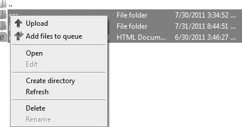

**图 13–18。** *我现在可以点击“上传”选项将文件上传到服务器*

这样做之后，我应该在两个窗格中看到相同的文件，如[图 13–19](#fig_13_19)所示。

**图 13–19。** *我电脑上的文件(左边)现在在服务器上(右边)*

现在大考验来了。现在可以访问这些文件了，我应该可以通过移动浏览器(或桌面)访问相应的地址来查看它们。在本例中，地址是`[http://jonwestfall.com/whosthattweet/index.html](http://jonwestfall.com/whosthattweet/index.html)`。通过在桌面网络浏览器中访问它，我可以看到文件是在线的，如图[图 13–20](#fig_13_20)所示。这可能看起来很难看，因为这些文件是要在移动网络浏览器上查看的；但是，我们已经确认这些文件在线并且可以访问！祝贺您，您已经将您的项目上传到了网络上！

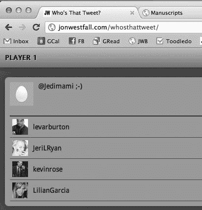

**图 13–20。** *游戏在桌面浏览器上无法正常渲染，但是这个测试验证了文件已经被正确上传*

### 软件版本化

FTP 通常适用于只有一个开发人员的小型开发项目，尤其是当项目不是很复杂的时候。然而，举例来说，假设你正在和一个开发团队一起做一个项目，他们中的每一个人都可以访问 FTP 服务器，并且可以随时上传和修改文件。最终，您会遇到这样的情况:一个用户结束了对一个文件的更改，然后一分钟后有人上传了他们对完全相同的文件所做的更改，完全覆盖了第一个人刚刚上传的工作。

这是一个非常令人沮丧的情况，在现实中，这种事情实际上是相当普遍的，并且在程序员没有组织的时候经常发生。防止这种情况的一个简单方法是使用某种形式的软件版本控制，比如 Subversion，来为您备份和控制文件。这样，假设 Jon 对我们共享的一个文件做了一些更改，而我意外地签入了该文件的一个新版本，其中没有 Jon 添加的代码。我们可以很容易地将文件恢复到它本身的早期版本，并保存我们认为已经丢失的代码，而不是惊慌失措。见鬼，使用版本控制，你甚至可以将一个文件的两个先前版本合并在一起，形成一个超级文件。

有大量的版本控制解决方案等待使用，但是最流行的两个解决方案是 Apache Subversion ( `[http://subversion.apache.org/](http://subversion.apache.org/)`)和 Git ( `[http://git-scm.com/](http://git-scm.com/)`)。Subversion，也称为 SVN，已经存在了很长时间，是一个非常成熟的产品，在我过去使用的几乎每一个托管解决方案中都有广泛的支持。最好的部分是有一个非常漂亮的 Windows 应用，它将所有的 SVN 选项添加到你的右键菜单中，这将在帮助那些害怕使用命令行的新手开发者方面创造奇迹。

尽管我很喜欢 SVN，但在过去的几年里，我越来越倾向于使用 Git 来满足我所有的版本需求。Git 是另一个用于版本控制的免费开源软件解决方案，与 SVN 相比，它的速度快得惊人，而且非常容易使用，如你在[图 13–21](#fig_13_21)中所见。

**图 13–21。** *一个快速入门指南，通过几个简单的击键就可以开始使用 Git*

Git 也变得更加用户友好，因为它有一个非常受欢迎的网站 GitHub ( `[https://github.com/](https://github.com/)`)，该网站将自己标榜为一个社交编码中心，利用 Web 2.0 的操作方式，让一切尽可能“社交化”(见[图 13–22](#fig_13_22))。有了 GitHub，你可以免费将所有项目存储在 GitHub 云中；然后，您可以让其他开发人员派生或复制您的存储库，以便他们可以对其进行任何他们想要的更改，同时保持这些更改与您的工作完全分离。这有点噱头，但 Git 本身是一项非常棒的技术，如果你不喜欢，你可以学会忽略整个社交活动。

**图 13–22。** *使用社交编码 hub，GitHub*

最好将版本控制视为备份代码和应用的一种方式。事实上，即使您是项目中唯一的开发人员，最好也是在为应用创建第一个文件夹或文件时就对其进行版本化。这样，如果在此过程中发生任何事情，比如你的笔记本电脑爆炸，或者你的孩子觉得你的电脑看起来很渴，把它浸在苹果汁中，你将能够恢复代码，并将其下载到新的机器上继续工作。即使您的计算机没有爆炸，一旦您准备好将您的项目部署到您的服务器上，您所要做的就是登录并在提示符下运行一个简单的命令，将您的版本化程序的内容复制到您的生产服务器(即您的 webhost)上，而无需接触 FTP 程序。

如果你的计算机老师像我成长过程中的老师一样，他们可能会反复强调不断保存你的作品的重要性。就像在大学里，当你不想在写一篇大文章的过程中被断电而失去一切时，确保经常保存你的工作，然后在版本控制解决方案中根据你的选择推出那些新的修订。

### 本土化

因此，现在我们已经构建了一个应用，通过压缩应用的永久生命优化了应用的大小，为自己找到了一个可接受的托管解决方案，并学习了如何使用 FTP、SVN 或 Git 将文件传输到该服务器——但如果您不想将应用打包，以便通过数据连接在互联网上使用，该怎么办呢？如果您正在构建一个应用，并且您知道该应用将用于没有任何数据覆盖的领域，该怎么办？如果您知道您的应用确实是资源密集型的，并且包含大量您不想等待加载到设备上的音频文件或图像，该怎么办？如果你的项目太棒了，你不想免费赠送，而是想卖给你的用户，怎么办？好吧，不要担心，因为我们有解决方案可以让你把难以置信的 HTML5 和 JavaScript 应用变成一个完全成熟的本地应用，可以在你的用户的手机上运行，而无需打开他们的互联网浏览器。

最重要的是，通过让你访问手机的许多功能(如访问手机的联系人，或创建一个利用手机或平板电脑加速度计的游戏，或在手机的文件系统上创建文件)，走原生路线为你开辟了许多事先不可用的途径。这些都是你在使用标准网络浏览器时通常不允许使用的功能，而且理由也很充分！如果有人能够从互联网上修改你的电脑、平板电脑或手机的文件系统，那将会是全球范围内的大规模恐慌。如果你认为现在的计算机世界存在病毒和木马的问题，想象一下，如果你访问了`Amazon.com`，一个愤怒的流氓开发者决定使用他的文件系统访问权限删除你计算机上的所有文件，会是怎样的情况？是的，我告诉过你，集体歇斯底里。这就是为什么你的浏览器被锁定了，正如我们在创建我们的 Twitter 应用时所讨论的“谁在发微博？”和“我爱火腿”

然而，有时候需要这种访问，这就是 PhoneGap ( `[http://www.phonegap.com/](http://www.phonegap.com/)`)和 Titanium Mobile ( `[http://www.appcelerator.com/products/titanium-mobile-application-development/](http://www.appcelerator.com/products/titanium-mobile-application-development/)`)等框架发挥作用的地方。这两个应用框架都允许开发人员将他们现有的 HTML5 和 JavaScript 代码转化为成熟的应用，可以上传到您选择的任何移动应用商店。虽然这两种产品都允许您将应用带入本机路径，但它们都以非常不同的方式实现，我觉得这值得一提。

#### 语音间隙

PhoneGap 是一个免费的开源解决方案，就像许多流行的 web 开发解决方案一样，它在很短的时间内取得了很大的进步。PhoneGap 是由 Nitobi Software 在 2009 年 iPhone 开发营的 48 小时编码狂欢中创建的，它诞生了，并一直是希望进入移动开发领域而无需花费大量时间学习新编程语言的 web 开发人员的最爱。

随着 Adobe Dreamweaver CS5.5 的最新发布，Adobe 已经将 PhoneGap 框架集成到 Dreamweaver 中，因此开发人员只需简单地单击鼠标，就可以创建一个本地应用，并在 Android 模拟器中进行测试(参见[图 13–23](#fig_13_23))。与如此强大的开发力量的合作，让 PhoneGap 在“一次编写，随处运行”的移动领域比其竞争对手拥有巨大的优势。

**图 13–23。** *配置 Adobe Dreamweaver CS5.5，使用 PhoneGap 将我们的 HTML5 应用构建为原生应用*

让我们快速看一下来自 PhoneGap 示例的一些代码，在[清单 13–1](#list_13_1)中，这样你就能感受到如何构建你的 HTML5 PhoneGap 应用。

**清单 13–1。***phonegagpexample*

`<!DOCTYPE HTML>
<html>
<head>
<meta name="viewport" content="initial-scale=1.0, user-scalable=no, width=device-width" />
<title>Training App</title>
<linkrel="stylesheet" href="assets/css/master.css" type="text/css" media="screen" />
<scriptsrc="phonegap.js" type="text/JavaScript" charset="utf-8"></script>
<scriptsrc="assets/js/xui.js" type="text/JavaScript" charset="utf-8"></script>
<scriptsrc="assets/js/lawnchair/adaptors/LawnchairAdaptorHelpers.js" type="text/JavaScript" charset="utf-8"></script>
<scriptsrc="assets/js/lawnchair/adaptors/DOMStorageAdaptor.js" type="text/JavaScript" charset="utf-8"></script>
<scriptsrc="assets/js/lawnchair/adaptors/WebkitSQLiteAdaptor.js" type="text/JavaScript" charset="utf-8"></script>
<scriptsrc="assets/js/lawnchair/Lawnchair.js" type="text/JavaScript" charset="utf-8"></script>
<scriptsrc="assets/js/dsl.js" type="text/JavaScript" charset="utf-8"></script>
<scriptsrc="assets/js/app.js" type="text/JavaScript" charset="utf-8"></script>
</head>
<body>

Phone<strong>Gap</strong> Training App

Show My Location

Settings

` `
This is where you are

Go Back

<form id="settings_form">
<fieldset>
<legend>Map Type</legend>
<input type="radio" name="map" value="roadmap" checked>
      Road Map 
<input type="radio" name="map" value="satellite">
      Satellite 
<input type="radio" name="map" value="terrain">
      Terrain 
<input type="radio" name="map" value="hybrid">
      Hybrid 
</fieldset>
<fieldset>
<legend>Zoom Level</legend>
<input type="radio" name="zoom" value="10">
      Super Far 
<input type="radio" name="zoom" value="12">
      Far 
<input type="radio" name="zoom" value="15" checked>
      Normal 
<input type="radio" name="zoom" value="18">
      Close 
<input type="radio" name="zoom" value="20">
      Super Close 
</fieldset>
<button id="save_button">Save</button>
</form>

</body>
</html>`

正如您在前面的厨房水槽示例中看到的那样，这里发生的事情与您通常构建页面的方式没有什么不同。实际上，这是一个 HTML 文档，这也是 PhoneGap 与其竞争对手相比的不足之处。看，当在你的手机上使用 PhoneGap 应用时，即使该应用现在是本地的，并且可以以正常的互联网托管的网络应用永远不能访问的权限挂接到操作系统，你仍然只是在设备上加载网页。这在大多数情况下没问题，但在 Android 设备上，我们必须承认浏览器不像 iPhone 浏览器那样是硬件加速的；所以，如果你的应用中有很多花哨的效果和动画，它仍然会像在网络浏览器中查看时一样缓慢和呆滞。仅仅因为你以一种我们称之为“本机”的方式包装你的应用，它就不是真正意义上的本机。这就是我最喜欢的移动平台发挥作用:钛移动！

#### 钛金属手机

多年来，我一直大力支持 Appcelerator 使用 Titanium Mobile 所做的工作。他们开始采取与 PhoneGap 相同的方法，允许用户用纯 HTML 和 JavaScript 创建内容，但很快意识到有时最好完全本地化以提高性能和速度。大约在 Titanium 移动软件成熟到生产就绪 1.0 版本的时候，Appcelerator 发布了一组新的 API，仍然允许开发人员使用 HTML5 在 web 视图中创建应用，但现在他们可以完全跳过 HTML5，用纯 JavaScript 创建他们的应用。

这样，他们就能够在构建时获取这些 JavaScript 文件，并使用操作系统自己的代码将它们完全转换成真正的本地应用来生成页面布局。这意味着，你不用创建自己的按钮或样式来使用你的应用，而是可以通过为你正在使用的任何平台使用原生用户界面元素来使你的应用看起来更像一个真正的原生应用。

为了不被集成到 Adobe Dreamweaver 中的 PhoneGapwith 超越，Appcelerator 的优秀人员购买了集成开发环境(IDE)公司 Aptana，并创建了他们自己的成熟 IDE，用于他们的框架。自从 Titanium Studio 在 2011 年初发布以来，使用 Titanium 移动环境已经变得轻而易举。

虽然 Titanium Mobile 是一个开源项目，可以免费使用，但有一些特殊的模块只提供给付费用户。成为 Titanium Mobile 的付费用户有其额外的好处，比如可以提前获得 Titanium Mobile 的新版本，并使用一些模块来访问 AdMob 等公司的应用内广告 API 和 Paypal 的应用内购买 API。成为 Titanium Mobile 的订阅会员也很容易，免费基本会员和付费会员的起价为每月 49.99 美元。

如果你能负担得起，并且想要访问某些模块，如 GameKit 和 OpenGL 游戏模块，那么跳基本的独立计划是显而易见的。如果你只是想摆弄软件，创建没有花哨模块的应用，那么你也可以免费这样做！有了 Titanium Mobile，你将能够使用纯 JavaScript 或 HTML5 和 JavaScript 的组合来创建真正令人难以置信的移动应用。

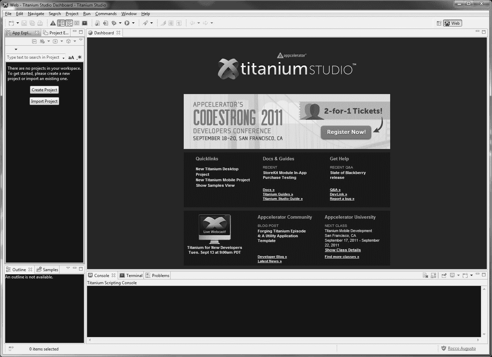

**图 13–24。** *钛金工作室 IDE，钛金手机官方集成开发环境*

### 关门时间

既然我们已经经历了在移动开发世界中起步和运行所需的一切，是时候说再见了，关掉灯，慢慢走开，而远处某处的钢琴上正在播放 20 世纪 70 年代末电视节目 *The Incredible Hulk* 的主题曲。我们真的很高兴与你分享所有这些知识和信息，并希望你能在不久的将来使用它来把自己变成一个 10 级的网络巫师，并击败任何棘手的开发情况。我们确信你现在笑得合不拢嘴，准备跳上你的电脑，开始编写你的下一个项目，我们笑得合不拢嘴是因为我们为你感到兴奋；但是在今天离开你之前，我们要再次提醒你一点点 20 年前给罗科的友好建议——保持简单，笨蛋！

感谢您花时间阅读这本书，如果您碰巧知道任何初露头角的开发人员可以从这本关于移动 web 开发的大部头的内容中受益，那么请随意将您的副本借给他们，并将这些知识和信息传递给其他人。保重，编码愉快！

乔恩、罗科和格兰特