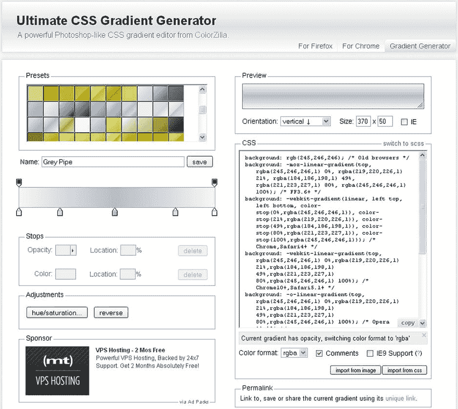
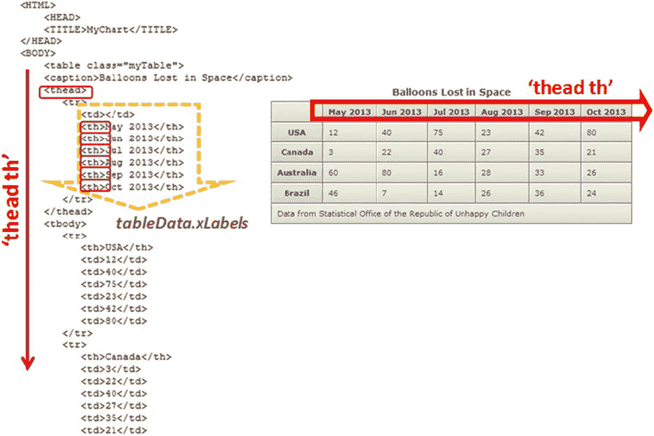
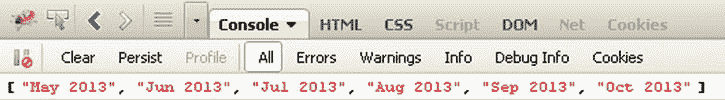
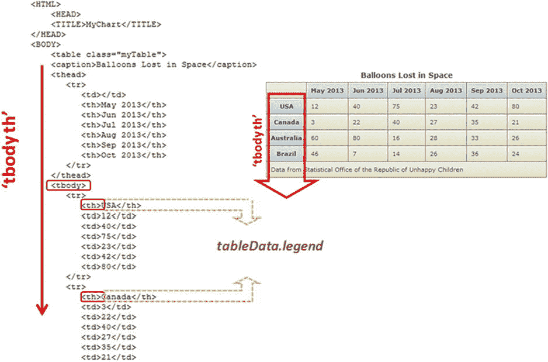
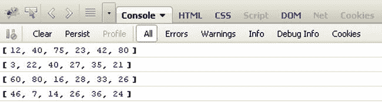

# 3.简单的 HTML 表格

Abstract

HTML 页面中最简单也是最广泛使用的数据显示形式之一是 HTML 表格。正因为它的广泛用途，表格是 HTML 中最早开发的元素之一。

HTML 页面中最简单也是最广泛使用的数据显示形式之一是 HTML 表格。正因为它的广泛用途，表格是 HTML 中最早开发的元素之一。

在这一章中，你将看到一个表格是如何构造的，以及实现它的 HTML 标签。正确使用这些标记可以区分一个可读的表和一个不可理解的表，后者不允许您理解潜在的关系。

然后，您将构建一个包含数据的表，您将在这里和接下来的章节中使用这些数据。这个例子的目的是理解一个表的本质以及数据在表中是如何组织的。这是构建最适合特定数据结构的图表类型的关键一步。

负责数据可视化的图表完全用 JavaScript 实现。因为您需要在图表中表示的数据包含在 HTML 表中，所以在本章的第二部分，您将看到如何用 JavaScript 语言实现一系列解析器。使用 jQuery 库，您会发现实现读取 HTML 表中特定数据的解析器是多么容易。这些以数组形式收集的数据很容易从 JavaScript 语言中获得，也很容易操作。

## 为您的数据创建表

表格只是一个嵌套标签的结构，以`<table>`标签为根。构建这种结构的过程并不困难，但需要一些深谋远虑。首先，你需要在一张纸上画出桌子的草图，或者至少，对于那些更熟悉桌子的人来说，在心里画出。这有助于确定表格中应包含的列数、行数和标题数。在标签对`<table></table>`中，根据需要插入与`<tr></tr>`对一样多的行。每个`<tr>`标记在表中创建一行。然后，您必须定义单元格。通常，顶行包含标题，因此您必须指定它们。您使用`<th></th>`对来指示应该被视为标题的文本。为了指定普通单元格，您使用了一对标签`<td></td>`。您必须小心保持行内单元格的数量一致。

还有其他一些标签可以实现丰富表格结构的功能。`<caption>`标签通常紧接在开始的`<table>`标签之后，呈现时，`<caption>`标签中的内容显示在表格上方的中间。标签`<thead>`、`<tfoot>`和`<tbody>`极大地改善了表格结构，并为级联样式表(CSS)和 JavaScript 提供了额外的挂钩。

这是用 HTML 构建表格结构的基本过程。现在，为了更好地理解，您将创建一个带有简单示例的表。

### 你的例子的目标

不幸儿童共和国统计局最近公布了关于太空中丢失的气球数量的结果。您希望将这个值放在一个 HTML 表中。

通过这个简单的例子，您将熟悉 HTML 表中的数据结构，学习如何应用 jQuery 选择来提取其中包含的数据。

此外，您将发现 CSS 样式在表格图形方面所起的作用。通过改变颜色和文本样式，您可以创建各种各样的图形主题。您还将看到如何通过使用渐变来调整背景颜色，以便为表格中的单元格提供三维外观。

清单 3-1 提供了一组数据，包括几个国家在六个月内每月丢失的气球数量。

清单 3-1。ch3_01.html

`<HTML>`

`<HEAD>`

`<TITLE>MyChart</TITLE>`

`</HEAD>`

`<BODY>`

`<table class="myTable">`

`<caption>Balloons Lost in Space</caption>`

`<thead>`

`<tr>`

`<td></td>`

`<th>May 2013</th>`

`<th>Jun 2013</th>`

`<th>Jul 2013</th>`

`<th>Aug 2013</th>`

`<th>Sep 2013</th>`

`<th>Oct 2013</th>`

`</tr>`

`</thead>`

`<tbody>`

`<tr>`

`<th>USA</th>`

`<td>12</td>`

`<td>40</td>`

`<td>75</td>`

`<td>23</td>`

`<td>42</td>`

`<td>80</td>`

`</tr>`

`<tr>`

`<th>Canada</th>`

`<td>3</td>`

`<td>22</td>`

`<td>40</td>`

`<td>27</td>`

`<td>35</td>`

`<td>21</td>`

`</tr>`

`<tr>`

`<th>Australia</th>`

`<td>60</td>`

`<td>80</td>`

`<td>16</td>`

`<td>28</td>`

`<td>33</td>`

`<td>26</td>`

`</tr>`

`<tr>`

`<th>Brazil</th>`

`<td>46</td>`

`<td>7</td>`

`<td>14</td>`

`<td>26</td>`

`<td>36</td>`

`<td>24</td>`

`</tr>`

`</tbody>`

`<tfoot>`

`<tr>`

`<td colspan="7">Data from Statistical Office of the Republic of Unhappy Children</td>`

`</tr>`

`</tfoot>`

`</table>`

`</BODY>`

`</HTML>`

这个简单的 HTML 代码给出了如图 [3-1](#Fig1) 所示的结果。

图 3-1。

A raw HTML table without any CSS style

如你所见，这张桌子完全没有任何图形。它以表格结构中的一系列字符串的形式出现，但仅此而已。这是 CSS 样式发挥作用的时刻。

### 将 CSS 应用到您的表格

CSS 丰富了表格的图形模式，使其更具可读性，同时也更具吸引力。HTML 页面的每个元素都可以引用 CSS 样式类，并且可以通过设置这些类的属性来调整其图形特性。通过这种方式，您可以根据自己的喜好使用 CSS 来设计表格的样式。可以为 HTML 页面的任何元素设置多个样式属性。这要归功于 CSS3。

Note

这本书没有详细讨论 CSS 样式，也没有列出它们所有的可能性。这是一个庞大的主题，对我们来说，深入讨论可能会产生误导。然而，本书中的具体案例列出了所有需要设置的属性，从而让您更加熟悉 CSS 的广阔世界。

类及其属性的定义以这种方式写在对``中:

`element.class {`

`attribute: value;`

`}`

或者，如果您愿意，可以将这些定义编写在一个 CSS 文件中，然后包含在一个或多个网页中。因此，您可以为您的表定义以下 CSS 样式类，在 web 页面的`<head>`部分编写代码行，如清单 3-2 所示。

清单 3-2。ch3_02a.html

``

现在，如果您再次加载网页，您可以看到表格的新布局，如图 [3-2](#Fig2) 所示。

图 3-2。

An HTML table in which you applied some CSS styles

查看表格，您可以看到数据现在更容易阅读，外观也更美观。上面的图示只是无数可能组合中的一种。可以设置的属性如此之多，以至于表的形式几乎没有限制。您还可以集成图像和背景，以进一步增强图形功能。

### 为您的表格添加颜色渐变

现在，您将继续优化您的表的外观。你已经取得了显著的进步，但你还可以更进一步。

正如您所看到的，表格中单元格的背景颜色是统一的，但是您可以创建颜色渐变，为 CSS 属性分配特定的值。因为这可能有些困难，网页终极 CSS 渐变生成器( [`http://www.colorzilla.com/gradient-editor`](http://www.colorzilla.com/gradient-editor) )可以作为一个有用的工具，通过允许您选择颜色和它们将采取的方向，帮助您以图形方式生成渐变(见图 [3-3](#Fig3) )。

图 3-3。

Ultimate CSS Gradient Generator allows you to generate CSS gradients very easily

从最终的 CSS 渐变网页中，让我们选择两个我们喜欢的预设，为灰色单元格选择预设的灰色 3D #4，为标题单元格选择蓝色管道#2。接下来，复制 CSS 属性并粘贴到你的网页中，如清单 3-3 所示。

清单 3-3。ch3_02b.html

`table.myTable th {`

`border-width: 1px;`

`padding: 8px;`

`border-style: solid;`

`border-color: #666666;`

`background: rgb(225,255,255); /* Old browsers */`

`background: -moz-linear-gradient(top, rgba(225,255,255,1) 0%,`

`rgba(225,255,255,1) 7%,`

`rgba(225,255,255,1) 12%,`

`rgba(253,255,255,1) 12%,`

`rgba(230,248,253,1) 30%,`

`rgba(200,238,251,1) 54%,`

`rgba(190,228,248,1) 75%,`

`rgba(177,216,245,1) 100%); /* FF3.6+ */`

`background: -webkit-gradient(`

`linear, left top, left bottom,`

`color-stop(0%,rgba(225,255,255,1)),`

`color-stop(7%,rgba(225,255,255,1)),`

`color-stop(12%,rgba(225,255,255,1)),`

`color-stop(12%,rgba(253,255,255,1)),`

`color-stop(30%,rgba(230,248,253,1)),`

`color-stop(54%,rgba(200,238,251,1)),`

`color-stop(75%,rgba(190,228,248,1)),`

`color-stop(100%,rgba(177,216,245,1))); /* Chrome,Safari4+ */`

`background: -webkit-linear-gradient(`

`top,`

`rgba(225,255,255,1) 0%,`

`rgba(225,255,255,1) 7%,`

`rgba(225,255,255,1) 12%,`

`rgba(253,255,255,1) 12%,`

`rgba(230,248,253,1) 30%,`

`rgba(200,238,251,1) 54%,`

`rgba(190,228,248,1) 75%,`

`rgba(177,216,245,1) 100%); /* Chrome10+,Safari5.1+ */`

`background: -o-linear-gradient(`

`top,`

`rgba(225,255,255,1) 0%,`

`rgba(225,255,255,1) 7%,`

`rgba(225,255,255,1) 12%,`

`rgba(253,255,255,1) 12%,`

`rgba(230,248,253,1) 30%,`

`rgba(200,238,251,1) 54%,`

`rgba(190,228,248,1) 75%,`

`rgba(177,216,245,1) 100%); /* Opera 11.10+ */`

`background: -ms-linear-gradient(`

`top,`

`rgba(225,255,255,1) 0%,`

`rgba(225,255,255,1) 7%,`

`rgba(225,255,255,1) 12%,`

`rgba(253,255,255,1) 12%,`

`rgba(230,248,253,1) 30%,`

`rgba(200,238,251,1) 54%,`

`rgba(190,228,248,1) 75%,`

`rgba(177,216,245,1) 100%); /* IE10+ */`

`background: linear-gradient(`

`to bottom,`

`rgba(225,255,255,1) 0%,`

`rgba(225,255,255,1) 7%,`

`rgba(225,255,255,1) 12%,`

`rgba(253,255,255,1) 12%,`

`rgba(230,248,253,1) 30%,`

`rgba(200,238,251,1) 54%,`

`rgba(190,228,248,1) 75%,`

`rgba(177,216,245,1) 100%); /* W3C */`

`filter: progid:DXImageTransform.Microsoft.gradient(`

`startColorstr='#e1ffff', endColorstr='#b1d8f5',GradientType=0 ); /* IE6-9 */}`

`table.myTable td {`

`border-width: 1px;`

`padding: 8px;`

`border-style: solid;`

`border-color: #666666;`

`background: rgb(242,245,246); /* Old browsers */`

`background: -moz-linear-gradient(`

`top,`

`rgba(242,245,246,1) 0%,`

`rgba(227,234,237,1) 37%,`

`rgba(200,215,220,1) 100%); /* FF3.6+ */`

`background: -webkit-gradient(`

`linear, left top, left bottom,`

`color-stop(0%,rgba(242,245,246,1)),`

`color-stop(37%,rgba(227,234,237,1)),`

`color-stop(100%,rgba(200,215,220,1))); /* Chrome,Safari4+ */`

`background: -webkit-linear-gradient(`

`top,`

`rgba(242,245,246,1) 0%,`

`rgba(227,234,237,1) 37%,`

`rgba(200,215,220,1) 100%); /* Chrome10+,Safari5.1+ */`

`background: -o-linear-gradient(`

`top, rgba(242,245,246,1) 0%,`

`rgba(227,234,237,1) 37%,`

`rgba(200,215,220,1) 100%); /* Opera 11.10+ */`

`background: -ms-linear-gradient(`

`top,`

`rgba(242,245,246,1) 0%,`

`rgba(227,234,237,1) 37%,`

`rgba(200,215,220,1) 100%); /* IE10+ */`

`background: linear-gradient(`

`to bottom,`

`rgba(242,245,246,1) 0%,`

`rgba(227,234,237,1) 37%,`

`rgba(200,215,220,1) 100%); /* W3C */`

`filter: progid:DXImageTransform.Microsoft.gradient(`

`startColorstr='#f2f5f6', endColorstr='#c8d7dc',GradientType=0 ); /* IE6-9 */`

您会立即注意到添加的代码相当广泛。关于属性背景上渐变的应用，每个浏览器都有不同的规范。因为网站的用户可以从任何类型的浏览器请求您的页面，所以您必须考虑到所有的可能性。

在图 [3-4](#Fig4) 中，您可以看到如何将渐变应用于不同的单元格，从而使表格呈现三维外观。

图 3-4。

The CSS background attribute can be set with gradients to give the table a better appearance

### 使用文件向表格添加颜色渐变

颜色渐变是您可以为表格选择的另一种样式属性。以下示例使用背景图像，使表格的单元格具有颜色渐变。为了实现这一点，您必须包含两个`.jpg`文件，其中您绘制了两种颜色等级:蓝色用于标题单元格，灰色用于具有常规值的单元格，如清单 3-4 所示。

清单 3-4。ch3_02c.html

`table.myTable th {`

`border-width: 1px;`

`padding: 8px;`

`border-style: solid;`

`border-color: #666666;`

`background:#b5cfd2 url('img/cell-blue.jpg');`

`}`

`table.myTable td {`

`border-width: 1px;`

`padding: 8px;`

`border-style: solid;`

`border-color: #666666;`

`background:#dcddc0 url('img/cell-grey.jpg');`

`}`

Note

用来给表格的单个单元格着色的两个`.jpg`背景文件可以在本书附带的代码中找到，在 Apress 网站的源代码/下载区( [`www.apress.com`](http://www.apress.com/) )。

图 [3-5](#Fig5) 说明了同一个 HTML 表格，但是这一次，使用两幅图像作为背景，褪色的颜色模拟阴影，使表格具有三维外观。

图 3-5。

The same HTML table, but with another CSS style

您已经看到了如何构建 HTML 表格以及如何为其分配 CSS 样式。现在，让我们看看 JavaScript 将在整本书中扮演的角色:数据分析和图表显示。在这种情况下，输入数据以表格的形式表示，但也可以是从数据库中获得的数据或从文件中读取的数据。

## 解析表数据

前一章描述了 jQuery 库的基础知识。借助本库提供的函数，在本章和后面的章节中，您将开发不同种类的图表，在表格中显示数据。但是，您应该将 JavaScript 代码放在哪里呢？在``标记对中，您将添加$(document)。ready()函数，在其中编写 JavaScript 代码，以便在窗口加载之前添加所有事件或您想要包含的任何内容。一旦浏览器注册了文档对象模型(DOM ),您在括号中写的所有内容都会被执行。这使您可以在页面打开之前隐藏或显示页面的元素。

### 导入 jQuery 库

要使用 jQuery 函数，您必须导入 jQuery 库。没有必要从 jQuery 网站下载并保存到您的服务器上；网页可以从分发站点直接访问库。清单 3-5 代表了您将要编写的 JavaScript 代码的起点。

清单 3-5。ch3_03a.html

``

Note

如果您使用的是该书附带的源代码，请将对 jQuery 库的引用替换为

``

一旦准备工作完成，您就可以立即开始编写代码了。首先，您将创建一个名为`tableData`的 JavaScript 对象来保存所有信息:

`<script>`

`$(document).ready(function(){`

`var tableData = {};`

`});`

该变量将用作从表中解析的数据的容器。使用括号是为了将它视为一个对象。通过声明`tableData.myNewProperty`并将该属性设置为您选择的任何值，您可以向该对象添加任何属性。同样，您可以将表格元素存储在另一个变量中:

`$(document).ready(function(){`

`var tableData = {};`

`var table = $('table');`

`});`

使用这个语句，您可以指向包含在`<table></table>`标记对中的所有元素。只用几个字，你就做出了选择。

### 标签

您在`tableData`对象中创建的第一个属性是`xLabels`。它将包含 x 轴上标签的值。这些标签对应于表格标题的单元格内容。标签按照收集数据的顺序读取，即从左到右。您可以在`<th>`标签中找到这些值(参见图 [3-6](#Fig6) )。

图 3-6。

Parsing the headings with the `'thead th'` as selector

在清单 3-6 中，`xLabels`被定义为一个数组，通过使用`each()`方法，每个`<th>`元素都被遍历，并将其内容推入这个数组。仔细看看这个表，可以看到`<th>`元素嵌套在`<thead>`标签中。因此，正确的选择需要您用`'thead th'`指定层级。

清单 3-6。ch3_03b.html

`$(document).ready(function(){`

`var tableData = {};`

`var table = $('table')`

`tableData.xLabels = [];`

`table.find('thead th').each(function(){`

`tableData.xLabels.push( $(this).html() );`

`});`

`});`

只是为了调试，为了查看这些数组的内容，您可以使用控制台(参见第 1 章的[中的“Firebug 和 DevTools”一节)，调用`log()`函数来显示作为参数传递的变量的内容:](01.html)

`console.log(tableData.xLabels);`

这样你就定义了一个新的数组`xLabels`，包含了如图 [3-7](#Fig7) 所示的值。

图 3-7。

The content of the `xLabels` array, displayed in Firebug

#### 提取标签

现在你需要从表格中提取标签，引用一系列数据，如图 [3-8](#Fig8) 所示。在您的表格中，您可以用左侧显示的国家名称来识别这些标签。

图 3-8。

Parsing the names of countries with `'tbody th'` as selector

为了捕获标签，您认为它们被分组为`<tbody>`组中的`<th>`元素。与`xLabels`一样，您定义了一个新的属性`tableData` : `legend`(见清单 3-7)。之所以指定这个名称，是因为在任何类型的图表中，系列的标识符通常在图例中报告。因此，您编写了一个与前一个类似的代码，这次使用选择`'tbody th'`。

清单 3-7。ch3_03c.html

`$(document).ready(function(){`

`...`

`table.find('thead th').each(function(){`

`tableData.xLabels.push( $(this).html() );`

`});`

`tableData.legend = [];`

`table.find('tbody th').each(function(){`

`tableData.legend.push( $(this).html() );`

`});`

`});`

使用 Firebug 上的控制台，可以看到`legend`数组的内容，如图 [3-9](#Fig9) 所示。

图 3-9。

The content of the `legend` array, displayed in Firebug

通过分析表中列出的点，你可以很容易地区分什么会在 x 轴上，什么会在 y 轴上。您收集了几个系列(国家)在不同时间(月)的数据。很容易看出，时间将在 x 轴上表示，用`xLabels`填充其刻度；您为每个分笔成交点分配一个月。此外，整个系列的值必须分布在 y 轴上。您事先不知道 y 轴上刻度的数值，也不知道需要多少个刻度，但是您需要计算它们。首先，在这些情况下，通常的做法是找出数据中的最高值和最低值。您可以用`'tbody td'`选择器选择所有数据，如清单 3-8 所示。

清单 3-8。ch3_03d.html

`$(document).ready(function(){`

`...`

`table.find('tbody th').each(function(){`

`tableData.legend.push( $(this).html() );`

`});`

`var tmp = [];`

`table.find('tbody td').each(function(){`

`var thisVal = parseFloat( $(this).text() );`

`tmp.push(thisVal);`

`});`

`if(Math.min.apply(null, tmp) > 0)`

`tableData.minVal = 0;`

`else`

`tableData.minVal = Math.min.apply(null, tmp);`

`tableData.maxVal = Math.max.apply(null, tmp);`

`});`

您希望 y 轴上的最小值等于 0，并且仅当表中有负值时才采用更低的值。这种情况下只有正数，所以`minVal`是 0，`maxVal`是 80。

然后，使用这两个值来计算 y 标签上的刻度。基于这些值，您应该在 0 到 80 的范围内延伸 y 轴。其实最好是把最大值延长，不要让你的数据的最大值点碰到图表顶部。您可以将最大值乘以一个系数(例如，10%)。让我们修正清单 3-8 的最后一行，引入系数，如清单 3-9 所示。

您将从`Math.max.apply()`函数返回的最大值乘以因子 1.1，从而将该值增加 10%(`max`+0.1`*max`= 1.1`*max`)。

清单 3-9。ch3_03e.html

`if(Math.min.apply(null, tmp) > 0)`

`tableData.minVal = 0;`

`else`

`tableData.minVal = Math.min.apply(null, tmp);`

`tableData.maxVal = 1.1 * Math.max.apply(null, tmp);`

关于刻度的数量和它们的内容，清单 3-10 定义了一个`yLabels`数组作为`tableData`的属性。要量化 y 轴上的刻度数，使其代表最佳折衷，您必须首先确定一个刻度与下一个刻度之间的合适距离(以像素为单位)。将 y 轴的范围除以一个数字，该数字表示刻度之间的像素距离。你可能认为 30 像素的距离就足够了。结果不是整数，需要上舍入。

清单 3-10。ch3_03f.html

`$(document).ready(function(){`

`...`

`tableData.maxVal = 1.1 * Math.max.apply(null, tmp);`

`tableData.yLabels = [];`

`var yDeltaPixels = 30;`

`var h = 360;`

`var w = 460;`

`var nTicks = Math.round(h / yDeltaPixels);`

`var yRange = tableData.maxVal - tableData.minVal;`

`var yDelta = Math.ceil(yRange / nTicks);`

`var yVal = tableData.minVal;`

`while( yVal < (tableData.maxVal - yDelta)){`

`tableData.yLabels.push(yVal);`

`yVal += yDelta;`

`}`

`tableData.yLabels.push(yVal);`

`tableData.yLabels.push(tableData.maxVal);`

`});`

如果您研究`yLabels`数组的内容，您会发现 y 的 12 个值对应于 12 个刻度，如图 [3-10](#Fig10) 所示。这些标签将显示在每个刻度旁边。

图 3-10。

The content of the `yLabels` array, displayed in Firebug

`yLabels`数组中的值取决于许多因素，例如，您想要表示 y 轴的维度(这里，您选择了 360 个像素)，每个刻度间隔 30 个像素:这里您得到的是 12 个刻度。另外，如果您想知道 y 的多少个单位对应于一个刻度和下一个刻度之间的距离，您可以计算`yDelta`(向上取整)，在本例中是 8。事实上，`yLabels`的值都是 8 的倍数。

### 数据组

您需要创建的下一个属性是`dataGroups`，一个包含所有值的两级数组，按系列分组。每个数列是一个数值数组，`dataGroups`是一个数列数组。要对不同系列的数据进行分组，可以使用`<tr>`标签。事实上，表中的每一行都是一个序列，您可以获取其中的所有值，因为它们是由单元格标记`<td>`分隔的。结合标题中报告的时间方向，从左至右读取数据(见图 [3-11](#Fig11) )来获取数值。

图 3-11。

Parsing of groups of data for multiseries

接下来，使用`'tbody tr'`作为选择器，遍历表中的行(见清单 3-11)；对于该迭代的每一步，您都必须对每个单元格进行循环，以便获得值。

清单 3-11。ch3_03g.html

`$(document).ready(function(){`

`...`

`tableData.yLabels.push(tableData.maxVal);`

`tableData.dataGroups = [];`

`table.find('tbody tr').each(function(i){`

`tableData.dataGroups[i] = [];`

`$(this).find('td').each(function(){`

`var tdVal = parseFloat( $(this).text() );`

`tableData.dataGroups[i].push( tdVal );`

`});`

`});`

`});`

最后可以看到`dataGroups`数组中包含的四个数组(每个系列一个)，如图 [3-12](#Fig12) 所示。

图 3-12。

The content of the `dataGroups` array, displayed in Firebug

如果您想要访问特定系列中包含的值，您可以按如下方式操作:

`console.log(tableData.dataGroups[0]);`

`console.log(tableData.dataGroups[1]);`

`...`

## 准备实施图形

现在，您已经提取了表中的所有数据并将它们放在单独的数组中，您已经准备好开始实现图形并将这些数据转换成图形元素。

这将是接下来三章的主题，在这三章中，您将看到这些数据首先以折线图(第 4 章)表示，然后以条形图(第 5 章)表示，最后以饼图(第 6 章)表示。

## 摘要

本章的目的是介绍当你有一个数据结构要操作时，你必须遵循的方法。通过本章，您开始了解如何基于 jQuery 库提供的工具开发自己的库。

您从创建 HTML 表开始，这是最原始的数据表示形式。尽管它很简单，但是如果设置不好，这个表可能会有问题。选择表格形式的数据表示作为试验场，开始研究 jQuery 如何选择页面上的特定 HTML 元素，更具体地说，是组成 HTML 表格的标记。在此基础上，您构建了一组解析器来从复杂的结构中提取数据(在本例中是一个 HTML 表，但是正如您将看到的，也可以从其他类型的结构中提取数据)。这些数据因此被分成不同的组，以一种更容易操作的格式。

在下一章中，您将开始使用画布提供的第一批图形元素，同时继续使用 jQuery 库。作为第一步，您将学习如何使用通过本章开发的解析器获得的数据来开发折线图。