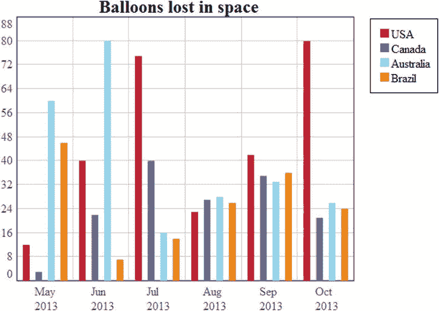

# 5.绘制条形图

Abstract

在上一章中，您使用 HTML 表格中的数据创建了一个折线图。但是，相同的数据可以用其他图表表示，包括众所周知的条形图。使用这种类型的数据可视化，您仍然有两个轴(x 和 y ),但是 x 不是表示为连续的数值范围，而是用于表示组，组可能会也可能不会遵循增长趋势。

在上一章中，您使用 HTML 表格中的数据创建了一个折线图。但是，相同的数据可以用其他图表表示，包括众所周知的条形图。使用这种类型的数据可视化，您仍然有两个轴(x 和 y ),但是 x 不是表示为连续的数值范围，而是用于表示组，组可能会也可能不会遵循增长趋势。

在本章中，您将继续使用前一章中编写的代码，并且您将看到如何通过对代码进行一些更改(非常少！)，可以将折线图转换成条形图。一旦实现了数据解析器并设置了所有的图形元素，比如轴、刻度标签和网格，您会发现从折线图切换到条形图非常容易。

## 绘制条形图

首先要改变的是计算`xDelta`变量的方式。在这种情况下，x 轴失去了它的意义，只用于对不同部门的数据进行分组。HTML 表格有六个不同的日期，所以你把 x 轴分成六段。在折线图中，这六个日期与网格线相对应，给你五个部分。考虑到这些差异，让我们修改一下`xDelta`变量，如清单 5-1 所示。

清单 5-1。ch5_01a.html

`$(document).ready(function(){`

`...`

`table.find('tbody tr').each(function(i){`

`tableData.dataGroups[i] = [];`

`$(this).find('td').each(function(){`

`var tdVal = parseFloat( $(this).text() );`

`tableData.dataGroups[i].push( tdVal );`

`});`

`});`

`var xDelta = w / (tableData.xLabels.length);`

`var xlabelsUL = $('<ul class="labels-x"></ul>')`

`.width(w)`

`.height(h)`

`.insertBefore(canvas);`

`...`

`});`

现在，删除清单 5-2 中用粗体显示的不再需要的行。

清单 5-2。ch5_01b.html

`$(document).ready(function(){`

`...`

`//delete the following rows`

`ctx.lineWidth = 5;`

`for(var i in tableData.dataGroups){`

`var points = tableData.dataGroups[i];`

`ctx.moveTo(0,-points[i]);`

`ctx.strokeStyle = colors[i];`

`ctx.beginPath();`

`var xVal = margin.left;`

`for(var j in points){`

`var relY = (points[j]*h/tableData.maxVal) + 10;`

`ctx.lineTo(xVal,-relY);`

`xVal += xDelta;`

`}`

`ctx.stroke();`

`ctx.closePath();`

`}` `//end delete`

`...`

`});`

在它们的位置上，你现在可以写代码了(见清单 5-3)。

清单 5-3。ch5_01c.html

`$(document).ready(function(){`

`...`

`$.each(tableData.yLabels, function(i){`

`var thisLi = $('<li>'+this+'</li>')`

`.prepend('')`

`.css('bottom',liBottom*i)`

`.prependTo(ylabelsUL);`

`var label = thisLi.find('span:not(.line)');`

`var topOffset = label.height()/-2;`

`if(i == 0){ topOffset = -label.height(); }`

`else if(i== tableData.yLabels.length-1){ topOffset = 0; }`

`label`

`.css('margin-top', topOffset)`

`.addClass('label');`

`});`

`var barGroupMargin = 4;`

`for(var i in tableData.dataGroups){`

`ctx.beginPath();`

`var n = tableData.dataGroups.length;`

`var lineWidth = (xDelta - barGroupMargin * 2 ) / n;`

`var strokeWidth = lineWidth - (barGroupMargin * 2);`

`ctx.lineWidth = strokeWidth;`

`var points = tableData.dataGroups[i];`

`var xVal = (xDelta – n * strokeWidth - (n - 1) * (lineWidth - strokeWidth)) / 2;`

`for(var j in points){`

`var relX = margin.left + (xVal - barGroupMargin) + (i * lineWidth) + lineWidth / 2;`

`ctx.moveTo(relX, -margin.bottom);`

`var relY = margin.bottom + points[j] * h / tableData.maxVal;`

`ctx.lineTo(relX, -relY);`

`xVal += xDelta;`

`}`

`ctx.strokeStyle = colors[i];`

`ctx.stroke();`

`ctx.closePath();`

`}`

`var legendList = $('<ul class="legend"></ul>')`

`.insertBefore(canvas);`

`for(var i in tableData.legend){`

`$('<li>'+ tableData.legend[i] +'</li>')`

`.prepend('')`

`.appendTo(legendList);`

`}`

`...`

`});`

因为您使用的是条形图而不是折线图，所以 x 轴会报告类别。这意味着 x 标签不应再出现在与记号对应的位置，而是出现在每个间隔的中心，由两个记号分隔。要快速简单地做到这一点，你必须编辑与 x 标签相关的`margin-left`层叠样式表(CSS)属性，直接使用`css()` jQuery 函数(见清单 5-4)。

清单 5-4。ch5_01d.html

`$(document).ready(function(){`

`...`

`$.each(tableData.xLabels, function(i){`

`var thisLi = $('<li>' + this + '</li>')`

`.prepend('')`

`.css('left', xDelta * i)`

`.width(0)`

`.appendTo(xlabelsUL);`

`var label = thisLi.find('span.label');`

`label`

`.css('margin-left', '40px')`

`.addClass('label');`

`});`

`...`

`});`

最终的条形图如图 [5-1](#Fig1) 所示。

图 5-1。

A bar chart representing the data in the table

## 摘要

在这一章中，你看到了使用你在前面章节中学到的知识来创建一个条形图是多么容易。在下一章中，您将实现另一种类型的图表，它既不使用网格，也不使用轴，而是使用圆形扇区:饼图。您还将了解如何插入动画来响应某些事件，如鼠标单击，以增加图表的交互性。