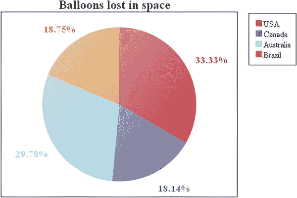
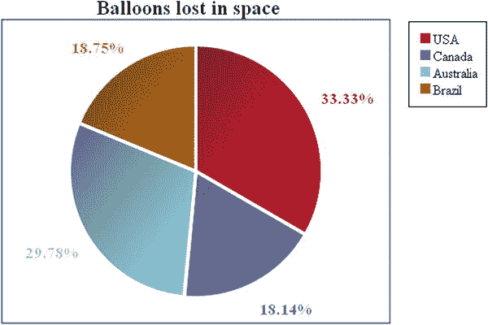
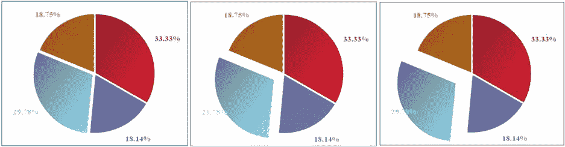

# 6.绘制饼图

Abstract

与你在前两章所做的相似，在这一章中，你将学习使用 HTML 表格中包含的数据来构建一个饼图。

与你在前两章所做的相似，在这一章中，你将学习使用 HTML 表格中包含的数据来构建一个饼图。

从你解析所有数据的地方开始(见[第 3 章](03.html))，你将发现如何实现这种有趣的对象，并探索如何创建你的第一个动画。

## 绘制饼图

这种类型的图表与前两种(折线图和条形图)有很大不同。它由一个圆圈(一个饼图)组成，代表所有值的总和(见图 [6-1](#Fig1) )。这个饼图被分成不同颜色的切片，每个切片代表数据中出现的一个系列。切片的大小与系列中所有值的总和成比例，与饼图中所有值的总和成比例。因此，每个切片表示每个系列占其值总和的百分比。

图 6-1。

A pie chart

让我们看看如何实现这种图表的特殊功能。

### 设置画布

如前所述，在开发您的饼状图时，您将从在第 3 章结束时获得的代码开始，也就是说，从一个 HTML 表中包含的数据和实现的许多解析器中提取数据，并将它们放在不同的数组中。清单 6-1 显示了在第三章的[结尾的代码状态。](03.html)

清单 6-1。ch6_01.html

`<HTML>`

`<HEAD>`

`<TITLE>MyChart</TITLE>`

``

`</HEAD>`

`<BODY>`

`<canvas id="myCanvas" width="500" height="400"> </canvas>`

`<table class="myTable">`

`<caption>Balloons Lost in Space</caption>`

`<thead>`

`<tr>`

`<td></td>`

`<th>May 2013</th>`

`<th>Jun 2013</th>`

`<th>Jul 2013</th>`

`<th>Aug 2013</th>`

`<th>Sep 2013</th>`

`<th>Oct 2013</th>`

`</tr>`

`</thead>`

`<tbody>`

`<tr>`

`<th>USA</th>`

`<td>12</td>`

`<td>40</td>`

`<td>75</td>`

`<td>23</td>`

`<td>42</td>`

`<td>80</td>`

`</tr>`

`<tr>`

`<th>Canada</th>`

`<td>3</td>`

`<td>22</td>`

`<td>40</td>`

`<td>27</td>`

`<td>35</td>`

`<td>21</td>`

`</tr>`

`<tr>`

`<th>Australia</th>`

`<td>60</td>`

`<td>80</td>`

`<td>16</td>`

`<td>28</td>`

`<td>33</td>`

`<td>26</td>`

`</tr>`

`<tr>`

`<th>Brazil</th>`

`<td>46</td>`

`<td>7</td>`

`<td>14</td>`

`<td>26</td>`

`<td>36</td>`

`<td>24</td>`

`</tr>`

`</tbody>`

`<tfoot>`

`<tr><td colspan="7">Data from Statistical Office of the Republic of Unhappy`

`Children</td></tr>`

`</tfoot>`

`</table>`

``

`</BODY>`

`</HTML>`

因此，让我们从画布上下文的定义开始。与折线图和条形图不同，您不需要翻译上下文，因为在饼图中没有轴来表示；取而代之的是定义画布的边距和大小(见清单 6-2)。注意传递到`strokeRect()`中的值:y 值必须作为正值传递(没有转换)。

清单 6-2。ch6_01.html

`$(document).ready(function(){`

`var canvas = $("#myCanvas");`

`var ctx = canvas.get(0).getContext("2d");`

`var colors = ['#be1e2d', '#666699', '#92d5ea', '#ee8310'];`

`var margin = {top: 30, right: 10, bottom: 10, left: 30},`

`w = canvas.width() - margin.left - margin.right,`

`h = canvas.height() - margin.top - margin.bottom;`

`ctx.strokeRect(margin.left,margin.top,w,h);`

`var tableData = {};`

`var table = $('table');`

`tableData.xLabels = [];`

`...`

`});`

### 实施饼图

接下来，定义饼图的圆心(见清单 6-3)。假设它对应于绘图区域的中心，您定义两个变量，`center_x`和`center_y`，代表中心点的坐标，并从那里开始构建您的图表。一旦定义了一个`pieMargin`来建立圆的边缘和边距之间的距离，就定义了半径。绘图区域的大小取决于`pieMargin`(固定的)和圆心(动态的)之差。因此，半径将会改变，以适应绘图区域的大小。所有这些值都必须计算出来，并考虑到余量。

清单 6-3。ch6_01.html

`$(document).ready(function(){`

`...`

`ctx.strokeRect(margin.left,margin.top,w,h);`

`var pieMargin = margin.top + 30;`

`var center_x = Math.round(w / 2) + margin.left;`

`var center_y = Math.round(h / 2) + margin.top;`

`var radius = center_y - pieMargin;`

`var counter = 0.0;`

`var tableData = {};`

`var table = $('table');`

`tableData.xLabels = [];`

`...`

`});`

饼图表示表中写入的所有值的总和。因此，您定义了一个名为`dataSum`的函数，然后定义了一个同名的变量，如清单 6-4 所示。

清单 6-4。ch6_01.html

`$(document).ready(function(){`

`...`

`table.find('tbody tr').each(function(i){`

`tableData.dataGroups[i] = [];`

`$(this).find('td').each(function(){`

`var tdVal = parseFloat( $(this).text() );`

`tableData.dataGroups[i].push( tdVal );`

`});`

`});`

`var dataSum = function(){`

`var dataSum = 0;`

`for(var i in tableData.dataGroups){`

`var points = tableData.dataGroups[i];`

`for(var j in points){`

`dataSum += points[j];`

`}`

`}`

`return dataSum;`

`}`

`var dataSum = dataSum();`

`});`

然后你写一个无序列表`<ul>`标签，每个列表项由一个标签组成，显示在它对应的片旁边，如清单 6-5 所示。

清单 6-5。ch6_01.html

`$(document).ready(function(){`

`...`

`var dataSum = dataSum();`

`var labels = $('<ul class="labels"></ul>')`

`.insertBefore(canvas);`

`});`

现在，如清单 6-6 所示，您可以一个接一个地绘制饼图的切片。

清单 6-6。ch6_01.html

`$(document).ready(function(){`

`...`

`var labels = $('<ul class="labels"></ul>')`

`.insertBefore(canvas);`

`for(var i in tableData.dataGroups){`

`var sum = 0;`

`var points = tableData.dataGroups[i];`

`for(var j in points){`

`sum += points[j];`

`}`

`var fraction = sum/dataSum;`

`ctx.beginPath();`

`ctx.moveTo(centerx, centery);`

`ctx.arc(centerx, centery, radius,`

`counter * Math.PI * 2 - Math.PI * 0.5,`

`(counter + fraction) * Math.PI * 2 - Math.PI * 0.5, false);`

`ctx.lineTo(centerx, centery);`

`ctx.closePath();`

`ctx.fillStyle = colors[i];`

`ctx.fill();`

`var sliceMiddle = (counter + fraction/2);`

`var distance = radius * 1.2;`

`var labelx = Math.round(centerx + Math.sin(sliceMiddle * Math.PI * 2) *`

`(distance));`

`var labely = Math.round(centery - Math.cos(sliceMiddle * Math.PI * 2) *`

`(distance));`

`var leftPlus = (labelx < centerx) ? '40' : '0' ;`

`var percentage = parseFloat((fraction*100).toFixed(2));`

`var labelval = percentage + "%";`

`var labeltext = $('' + labelval +'')`

`.css('font-size', radius / 8)`

`.css('color', colors[i]);`

`var label = $('<li class="label-pos"></li>')`

`.appendTo(labels)`

`.css({left: labelx-leftPlus, top: labely})`

`.append(labeltext);`

`counter+=fraction;`

`}`

`});`

让我们来分解一下清单:

*   您正在使用一个路径来绘制每个切片，使用`ctx.arc()`函数来说明圆的边缘。
*   `counter`是与已经绘制的切片所覆盖的百分比直接相关的累积值，并且是从 0 到 1 的值。当该值为 1 时，您已经绘制了 100%的饼图。
*   变量`fraction`是每个单切片覆盖的百分比，对应的百分比存储在同名变量:`percentage`中。
*   接下来，定义`sliceMiddle`变量，它代表每个切片的平分线的角度(百分比)。您使用`sliceMiddle`值将标签放置在正确的角度，正好在切片的中间。
*   您选择将报告百分比的标签放在切片的外面(但是没有什么可以阻止您在里面表示它们)。`distance`变量是你决定放置标签的距离饼图的中心有多远。在这里，选择一个对应于半径 120%的值。
*   每个标签都作为一个动态的`<li>`标签写在网页中，字体大小与饼图的大小成比例，颜色与国家(系列)相对应。

如果你想看看这些动态生成的行是如何构造的，你可以使用 Firebug 或者 DevTools(见[第 1 章](01.html))，从菜单中选择 HTML 标签。图 [6-2](#Fig2) 显示了您刚刚动态生成的特定结构。

图 6-2。

Using Firebug, it is possible to see the HTML structure dynamically generated

### 完成饼图

要完成您的饼图，您需要添加标题。你可以直接从表中选择`caption`，如清单 6-7 所示。

清单 6-7。ch6_01.html

`$(document).ready(function(){`

`...`

`for(var i in tableData.dataGroups){`

`...`

`}`

`$('
'+table.find('caption').html() + '
')`

`.insertBefore(canvas);`

`});`

添加到图表中的最后但并非最不重要的元素是图例。这对于这种类型的图表尤其重要，因为没有对与切片颜色相对应的数据系列的引用。因此，您必须添加这个元素，如清单 6-8 所示。

清单 6-8。ch6_01.html

`$(document).ready(function(){`

`...`

`$('
'+table.find('caption').html() + '
')`

`.insertBefore(canvas);`

`var legendList = $('<ul class="legend"></ul>')`

`.insertBefore(canvas);`

`for(var i in tableData.legend){`

`$('<li>'+ tableData.legend[i] +'</li>')`

`.prepend('')`

`.appendTo(legendList);`

`}`

`});`

此外，您已经添加了许多在级联样式表(CSS)样式语句中引用的类(参见清单 6-9)。此外，您必须将画布放在页面的顶部，因此您需要将表格放在画布下面，设置`table.myTable`类的`top`和`left` CSS 属性。

清单 6-9。ch6_01.html

``

最后，你得到了如图 [6-3](#Fig3) 所示的饼状图。

图 6-3。

The pie chart representing the data in the table

## 添加效果

现在您已经获得了您的饼图，您将进一步研究，学习如何通过添加有趣的效果来改善图表的外观。您将看到如何通过添加渐变来控制切片的颜色。您还将了解如何制作切片动画，以创建交互式饼图。

### 添加渐变效果

您用统一颜色填充的切片绘制了您的饼图，但您可以进行一些更改。例如，您可以给切片添加渐变效果。为此，您需要替换

`ctx.fillStyle = colors[i];`

清单 6-10 中的行。

清单 6-10。ch6_02.html

`$(document).ready(function(){`

`...`

`ctx.beginPath();`

`ctx.moveTo(center_x, center_y);`

`ctx.arc(center_x, center_y, radius,`

`counter * Math.PI * 2 - Math.PI * 0.5,`

`(counter + fraction) * Math.PI * 2 - Math.PI * 0.5, false);`

`ctx.lineTo(center_x, center_y);`

`ctx.closePath();`

`var sliceGradientColor = "#ddd";`

`var sliceGradient = ctx.createLinearGradient( 0, 0, w, h );`

`sliceGradient.addColorStop( 0, sliceGradientColor );`

`sliceGradient.addColorStop( 1, colors[i]);`

`ctx.fillStyle = sliceGradient;`

`ctx.fill();`

`var sliceMiddle = (counter + fraction/2);    ...`

`});`

出于这些例子的目的，不再需要显示 HTML 表格，所以你可以隐藏它，选择它，然后链接`hide()`函数(见清单 6-11)。

清单 6-11。ch6_02.html

`$(document).ready(function(){`

`...`

`$('table').hide();`

`});`

正如你在图 [6-4](#Fig4) 中所看到的，你选择了一种白色作为与现有颜色重叠的渐变颜色，但是你也可以通过在`sliceGradientColor`中写入红绿蓝(RGB)十六进制来选择任何颜色。

图 6-4。

Adding a white gradient to your pie chart

### 添加更好的渐变效果

但是，老实说，你对你的结果不是很满意，所以你做了额外的改变来获得更好的渐变效果(见清单 6-12)。这一次，您选择了一种深色，几乎是黑色，作为颜色渐变，将非常深的灰色分配给`sliceGradientColor`变量。此外，您可以通过创建分割空间来分隔切片，从而进一步增强渐变效果。一个更好的选择是绘制中间的空间，创建一个白色边框，而不是将切片分开。因此，您定义了`sliceBorderWidth`变量，通过它您可以调整分割大小，以及`sliceBorderStyle`变量，来设置白色。

清单 6-12。ch6_03.html

`$(document).ready(function(){`

`...`

`ctx.beginPath();`

`ctx.moveTo(center_x, center_y);`

`ctx.arc(center_x, center_y, radius,`

`counter * Math.PI * 2 - Math.PI * 0.5,`

`(counter + fraction) * Math.PI * 2 - Math.PI * 0.5, false);`

`ctx.lineTo(center_x, center_y);`

`ctx.closePath();`

`var sliceGradientColor = "#222";`

`var sliceBorderStyle = "#fff";`

`var sliceBorderWidth = 4;`

`var sliceGradient = ctx.createLinearGradient(0, 0, w*.7, h*.7);`

`sliceGradient.addColorStop(0, sliceGradientColor);`

`sliceGradient.addColorStop(1, colors[i]);`

`ctx.fillStyle = sliceGradient;`

`ctx.fill();`

`ctx.lineWidth = sliceBorderWidth;`

`ctx.strokeStyle = sliceBorderStyle;`

`ctx.stroke();`

`var sliceMiddle = (counter + fraction / 2);`

`...`

`});`

图 [6-5](#Fig5) 显示了相同的饼状图，但是带有黑色渐变，使切片更有深度。

图 6-5。

Adding a black gradient and space divisions to your pie chart

### 创建拉出一个切片的饼图

人们通常会吃馅饼，为了诱惑你这样做，面包师通常会从馅饼的剩余部分切下一片，以便更好地展示他或她的商品。玩笑归玩笑，如果在一个饼图中表示的不同系列中，你想突出显示某个特定的系列，有时相关的切片会被抽出来。

现在，假设你对第三个系列感兴趣；你可以把这一片拉出来。为此，首先你需要在通过切片的循环中添加两个新变量:`startAngle`和`endAngle`，如清单 6-13 所示。

清单 6-13。ch6_04.html

`$(document).ready(function(){`

`...`

`for(var i in tableData.dataGroups){`

`var sum = 0;`

`var points = tableData.dataGroups[i];`

`for(var j in points){`

`sum += points[j];`

`}`

`var fraction = sum / dataSum;`

`var startAngle = counter * Math.PI * 2 - Math.PI * 0.5;`

`var endAngle = (counter + fraction) * Math.PI * 2 - Math.PI * 0.5;`

`ctx.beginPath();`

`ctx.moveTo(center_x, center_y);`

`...`

`}`

`...`

`});`

在`for()`循环中，你必须编写仅对第三个片有效的代码——也就是说，当索引`i`为 2 时(见清单 6-14)。

清单 6-14。ch6_04.html

`$(document).ready(function(){`

`...`

`for(var i in tableData.dataGroups){`

`var sum = 0;`

`var points = tableData.dataGroups[i];`

`for(var j in points){`

`sum += points[j];`

`}`

`var fraction = sum / dataSum;`

`var startAngle = counter * Math.PI * 2 - Math.PI * 0.5;`

`var endAngle = (counter + fraction) * Math.PI * 2 - Math.PI * 0.5;`

`if(i == 2){`

`var currentPullOutDistance = 20;`

`var maxPullOutDistance = 25;`

`var ratio = currentPullOutDistance/maxPullOutDistance;`

`var midAngle = (startAngle + endAngle) / 2;`

`var actualPullOutDistance = currentPullOutDistance *`

`(Math.pow( 1 - ratio, .8 ) + 1);`

`var startx = centerx + Math.cos(midAngle) * actualPullOutDistance;`

`var starty = centery + Math.sin(midAngle) * actualPullOutDistance;`

`ctx.beginPath();`

`ctx.moveTo(startx, starty);`

`ctx.arc(startx, starty, radius, startAngle,endAngle, false);`

`ctx.lineTo(startx, starty);`

`ctx.closePath();`

`}else{`

`ctx.beginPath();`

`ctx.moveTo(centerx, centery);`

`ctx.arc(centerx, centery, radius, startAngle,endAngle, false);`

`ctx.lineTo(centerx, centery);`

`ctx.closePath();`

`}`

`var sliceGradientColor = "#222";`

`var sliceBorderStyle = "#fff";`

`var sliceBorderWidth = 4;`

`...`

`}`

`...`

`});`

图 [6-6](#Fig6) 显示了一个切片被拉出的图表。

图 6-6。

The pie chart with a slice pulled out

在这个例子中，您已经看到了如何从馅饼中取出一块。这是你为自己设定的目标的第一步，也就是让你的饼图具有交互性。下一步是创建一个动画，您可以在其中看到从图表中提取的切片。

### 插入动画以拉出切片

有了 JavaScript，除了你的想象力之外，你可以对你的图表做任何改变。对你的图表的一个额外的触摸可能是创建一个动画。例如，当页面刚刚被加载时，您可以完整地显示饼图，然后逐渐拉出您想要用动画突出显示的部分。

您正在开发的代码逐渐变得更加复杂；因此，有必要开始根据代码行的功能将它们分组在一起，从而避免重复和可读性较差的代码。让我们从渐变效果的代码开始。首先，编写`sliceGradient()`函数，它管理颜色渐变效果。该函数只接受一个参数:重叠切片的颜色渐变。每当您想要对画布应用渐变效果时，该函数都会返回分配给画布二维上下文的值。在函数之后，让我们从`for()`循环中取出`sliceBorderStyle`和`sliceBorderWidth`变量的定义。

清单 6-15。ch6_05.html

`$(document).ready(function(){`

`...`

`var dataSum = dataSum();`

`var labels = $('<ul class="labels"></ul>')`

`.insertBefore(canvas);`

`function  sliceGradient(color){`

`var sliceGradientColor = "#222";`

`var sliceGradient = ctx.createLinearGradient(0, 0, w * .7, h * .7);`

`sliceGradient.addColorStop(0, sliceGradientColor);`

`sliceGradient.addColorStop(1, color);`

`return sliceGradient;`

`}`

`var sliceBorderStyle = "#fff";`

`var sliceBorderWidth = 4;`

`for(var i in tableData.dataGroups){`

`var sum = 0;`

`var points = tableData.dataGroups[i];`

`...`

`}`

`...`

`});`

你想开发的另一个函数是`fraction()`(见清单 6-16)。此函数计算 0 到 1 之间的值，该值表示切片相对于整个饼图的分数。正如您将看到的，在许多情况下，返回值是有用的。

清单 6-16。ch6_05.html

`$(document).ready(function(){`

`...`

`var sliceBorderStyle = "#fff";`

`var sliceBorderWidth = 4;`

`function fraction(i) {`

`var sum = 0;`

`var points = tableData.dataGroups[i];`

`for(var j in points){`

`sum += points[j];`

`}`

`return (sum/dataSum);`

`}`

`for(var i in tableData.dataGroups){`

`var sum = 0;`

`var points = tableData.dataGroups[i];`

`...`

`}`

`...`

`});`

现在您收集了整个函数序列，您用上下文`ctx`调用它，如清单 6-17 所示。如果参数化正确，这个序列总是相同的，所以您可以在一个将被称为`drawSlice()`的函数中收集它。

清单 6-17。ch6_05.html

`$(document).ready(function(){`

`...`

`function fraction(i) {`

`var sum = 0;`

`var points = tableData.dataGroups[i];`

`for(var j in points){`

`sum += points[j];`

`}`

`return (sum/dataSum);`

`}`

`function drawSlice(centerx, centery, radius, counter, i) {`

`var startAngle = counter * Math.PI * 2 - Math.PI * 0.5;`

`var endAngle = (counter + fraction(i)) * Math.PI * 2 - Math.PI * 0.5;`

`ctx.beginPath();`

`ctx.moveTo(centerx, centery);`

`ctx.arc(centerx, centery, radius, startAngle,endAngle, false);`

`ctx.lineTo(centerx, centery);`

`ctx.closePath();`

`ctx.fillStyle = sliceGradient(colors[i]);`

`ctx.fill();`

`ctx.lineWidth = sliceBorderWidth;`

`ctx.strokeStyle = sliceBorderStyle;`

`ctx.stroke();`

`}`

`for(var i in tableData.dataGroups){`

`var sum = 0;`

`var points = tableData.dataGroups[i];`

`...`

`}`

`...`

`});`

您可以将相同的逻辑应用到用于生成 HTML 无序列表`<ul>`标签的代码中，如清单 6-18 所示。

清单 6-18。ch6_05.html

`$(document).ready(function(){`

`...`

`function drawSlice(centerx,centery,radius,counter,i) {`

`...`

`ctx.lineWidth = sliceBorderWidth;`

`ctx.strokeStyle = sliceBorderStyle;`

`ctx.stroke();`

`}`

`function drawLabels(i, counter) {`

`var sliceMiddle = (counter + fraction(i)/2);`

`var distance = radius * 1.2;`

`var labelx = Math.round(centerx + Math.sin(sliceMiddle * Math.PI * 2) *`

`(distance));`

`var labely = Math.round(centery - Math.cos(sliceMiddle * Math.PI * 2) *`

`(distance));`

`var leftPlus = (labelx < centerx) ? '40' : '0' ;`

`var percentage = parseFloat((fraction(i)*100).toFixed(2));`

`var labelval = percentage + "%";`

`var labeltext = $('' + labelval +'')`

`.css('font-size', radius / 8)`

`.css('color', colors[i]);`

`var label = $('<li class="label-pos"></li>')`

`.appendTo(labels)`

`.css({left: labelx-leftPlus, top: labely})`

`.append(labeltext);`

`}`

`for(var i in tableData.dataGroups){`

`var sum = 0;`

`var points = tableData.dataGroups[i];`

`...`

`}`

`...`

`});`

在这些语句之后，代码中处理切片循环的部分被缩减为清单 6-19 所示。

清单 6-19。ch6_05.html

`$(document).ready(function(){`

`...`

`function drawLabels(i, counter) {`

`...`

`}`

`for(var i in tableData.dataGroups){`

`if(i == 2){`

`counterAtI2 = counter;`

`}else{`

`drawSlice(centerx, centery, radius, counter, i);`

`}`

`drawLabels(i, counter);`

`counter += fraction(i);`

`}`

`$('
'+table.find('caption').html() + '
')`

`.insertBefore(canvas);`

`...`

`});`

正如您所看到的，代码的可读性大大提高了，在必要的地方进行修改也更加容易了。在您正确地分离了代码的各个部分之后，您将继续处理动画的代码。动画的核心是`setInterval()`函数(见清单 6-20)。这个函数有两个参数:第一个是实现要执行的操作的函数，第二个是作为第一个参数的函数每次执行之间的时间间隔长度(以毫秒为单位)。因此，您定义了`next()`函数，对于每一次执行，它将把切片画得离中心越来越远，直到它到达`maxPullOutDistance`。所以你需要一个计数器`k`，它会一步步增加，直到达到一个最大值，在这个最大值中，函数的每次执行都会在同一个地方绘制切片，让它看起来就像动画完成了一样(实际上它一直在运行)。

清单 6-20。ch6_05.html

`$(document).ready(function(){`

`...`

`for(var i in tableData.dataGroups){`

`if(i == 2){`

`counterAtI2 = counter;`

`}else{`

`drawSlice(centerx,centery,radius,counter,i);`

`}`

`drawLabels(i,counter);`

`counter+=fraction(i);`

`}`

`var nextMove = setInterval(next, 100);`

`var k = 0;`

`function next() {`

`var midAngle = Math.PI * (2 * counterAtI2 + fraction(2) - 0.5);`

`var currentPullOutDistance = k;`

`var maxPullOutDistance = 45;`

`var ratio = currentPullOutDistance / maxPullOutDistance;`

`var actualPullOutDistance = currentPullOutDistance * (Math.pow(1 - ratio, .8) + 1);`

`var startx = centerx + Math.cos(midAngle) * actualPullOutDistance;`

`var starty = centery + Math.sin(midAngle) * actualPullOutDistance;`

`drawSlice(startx, starty, radius, counterAtI2, 2);`

`if(k < maxPullOutDistance){`

`k++;`

`}else{`

`k = maxPullOutDistance;`

`clearInterval(nextMove);`

`}`

`}`

`$('
'+table.find('caption').html() + '
')`

`.insertBefore(canvas);`

`...`

`});`

如果你加载网页，你可以看到你的动画，如图 [6-7](#Fig7) 从左到右所示。

图 6-7。

Different frames of the animation while the slice is being pulled away from the pie chart

### 点按切片以将其拉出

在前面的例子中，您看到了如何实现动画。在这个例子和下面的例子中，你将采取进一步的步骤:添加作为特定事件的结果来启动动画的能力。最常见的事件类型，也是最适合饼图的事件类型，是单击特定的切片。。单击后，切片将直接从饼图中拉出。您还将学习当单击另一个切片时，如何处理切片返回到饼图。

你编写一个新的`slice()`函数，它将构建一个切片对象及其所有属性，比如`startAngle`、`endAngle`、`counter`和`fraction`(见清单 6-21)。到目前为止，你已经含蓄地做到了这一点，但这种方式更正确。您还定义了`sliceAll`数组，它将包含饼图的所有切片。

清单 6-21。ch6_06.html

`$(document).ready(function(){`

`...`

`function drawLabels(i, counter) {`

`...`

`}`

`function slice(counter,i){`

`var startAngle = counter * Math.PI * 2 - Math.PI * 0.5;`

`var endAngle = (counter + fraction(i)) * Math.PI * 2 - Math.PI * 0.5;`

`this.startAngle = startAngle;`

`this.endAngle = endAngle;`

`this.counter = counter;`

`this.fraction = fraction(i);`

`return this;`

`}`

`var allSlices = new Array();`

`for(var i in tableData.dataGroups){`

`...`

`}`

`...`

`});`

使用新的`slice()`函数，通过添加切片的定义来稍微修改`for()`循环，如清单 6-22 所示。

清单 6-22。ch6_06.html

`$(document).ready(function(){`

`...`

`var allSlices = new Array();`

`for(var i in tableData.dataGroups){`

`allSlices[i] = new slice(counter, i);`

`drawSlice(centerx, centery, radius, counter, i);`

`drawLabels(i, counter);`

`counter += fraction(i);`

`}`

`var nextMove = setInterval(next, 100);`

`var k = 0;`

`...`

`});`

在继续之前，让我们把全局变量添加到代码中(见清单 6-23)。同时，必须删除或注释掉`nextMove`和`k`变量。

清单 6-23。ch6_06.html

`$(document).ready(function(){`

`...`

`for(var i in tableData.dataGroups){`

`allSlices[i] = new slice(counter,i);`

`drawSlice(centerx,centery,radius,counter,i);`

`drawLabels(i,counter);`

`counter+=fraction(i);`

`}`

`var sliceToPullout = -1;`

`var sliceToPullin  = 0;`

`//var nextMove = setInterval(next, 100);`

`//var k = 0;`

`function next() {`

`...`

`}`

`...`

`});`

接下来，在画布上激活鼠标`click`事件的捕获，并将其链接到一个将调用`handleChartClick()`的函数，如清单 6-24 所示。

清单 6-24。ch6_06.html

`$(document).ready(function(){`

`...`

`function next() {`

`...`

`}`

`$('#myCanvas').click(handleChartClick);`

`$('
'+table.find('caption').html() + '
')`

`.insertBefore(canvas);`

`$('table').hide();`

`});`

现在，你必须实现`handleChartClick()`函数，你刚刚把它作为参数插入到`click()`函数中(见清单 6-25)。`mouseX`和`mouseY`变量存储你点击鼠标按钮时画布上的点的坐标。分析这些值以确定它们是否对应于饼图面以及它们对应于哪个切片。一旦切片被识别，它就被标记为传出，而当前拉出的切片被标记为传入。然后，抛出`next()`函数。这实现了要在画布上采取的动作。

此外，您必须考虑点击的切片是提取的切片的可能性。在这种情况下，当所有切片都在饼图中时，您将返回到初始状态。

清单 6-25。ch6_06.html

`$(document).ready(function(){`

`...`

`function next() {`

`...`

`}`

`function handleChartClick ( clickEvent ) {`

`var mouseX = clickEvent.pageX - this.offsetLeft;`

`var mouseY = clickEvent.pageY - this.offsetTop;`

`var xFromCentre = mouseX - centerx;`

`var yFromCentre = mouseY - centery;`

`var distanceFromCentre =`

`Math.sqrt( Math.pow( Math.abs( xFromCentre ), 2 ) +`

`Math.pow( Math.abs( yFromCentre ), 2 ) );`

`if ( distanceFromCentre <= radius ) {`

`var clickAngle = Math.atan2( yFromCentre, xFromCentre );`

`if(yFromCentre < 0``&&`T2】

`clickAngle = (Math.PI + clickAngle) + Math.PI;`

`for ( var i in allSlices ) {`

`if ( clickAngle >= allSlices[i].startAngle` `&&`

`clickAngle <= allSlices[i].endAngle ) {`

`sliceToPullin = sliceToPullout;`

`sliceToPullout = i;`

`if(sliceToPullout == sliceToPullin)`

`sliceToPullout = -1;`

`next(sliceToPullout,sliceToPullin);`

`}`

`}`

`}`

`}`

`$('#myCanvas').click ( handleChartClick );`

`$('
'+table.find('caption').html() + '
')`

`.insertBefore(canvas);`

`$('table').hide();`

`});`

你用一个新的带两个参数的函数来替换已经存在的`next()`:`out`和`ins`(见清单 6-26)。每个切片都用一个编号来标识，该编号对应于序列中循环的索引。`Out`和`ins`是变量，存储关于必须从饼图中取出哪个切片以及必须重新插入哪个切片的信息。只有当一个切片被点击时，事件才被捕获，并抛出`next()`函数。它做的第一件事是用`clearRect()`函数清除整个画布。当循环通过所有切片时，它们被一个接一个地绘制出来。如果切片的索引等于变量`out`，切片将被拉出饼图，但是如果它的索引等于`ins`，它将被拉入饼图。

清单 6-26。ch6_06.html

`$(document).ready(function(){`

`...`

`function next(out,ins) {`

`ctx.clearRect ( 0, 0, canvas.width(), canvas.height() );`

`ctx.lineWidth = 1;`

`ctx.strokeStyle = '#000';`

`ctx.strokeRect(margin.left,margin.top,w,h);`

`for(var i in allSlices){`

`var counter = allSlices[i].counter;`

`var startAngle = allSlices[i].startAngle;`

`var endAngle = allSlices[i].endAngle;`

`var fraction = allSlices[i].fraction;`

`var maxPullOutDistance = 30;`

`if( i == out){`

`//Pull out`

`var currentPullOutDistance = 30;`

`var ratio = currentPullOutDistance / maxPullOutDistance;`

`var midAngle = (startAngle + endAngle) / 2;`

`var actualPullOutDistance =`

`currentPullOutDistance * (Math.pow( 1 - ratio, .8 ) + 1);`

`var startx = centerx + Math.cos(midAngle) * actualPullOutDistance;`

`var starty = centery + Math.sin(midAngle) * actualPullOutDistance;`

`drawSlice(startx, starty, radius, counter, i);`

`}else if(i == ins){`

`//Push In`

`var currentPullOutDistance = 0;`

`var ratio = currentPullOutDistance / maxPullOutDistance;`

`var midAngle = (startAngle + endAngle) / 2;`

`var actualPullOutDistance = currentPullOutDistance *`

`(Math.pow( 1 - ratio, .8 ) + 1);`

`var startx = centerx + Math.cos(midAngle) * actualPullOutDistance;`

`var starty = centery + Math.sin(midAngle) * actualPullOutDistance;`

`drawSlice(startx, starty, radius, counter, i);`

`}else{`

`drawSlice(centerx, centery, radius, counter, i);`

`}`

`}`

`}`

`function handleChartClick ( clickEvent ) {`

`...`

`}`

`...`

`});`

现在，当你加载网页时，你会得到一个交互式饼图(见图 [6-8](#Fig8) )！

图 6-8。

The user can choose which slice to extract from the pie

### 单击切片以动画形式将其拉出

既然您已经了解了如何将一个事件连接到一个函数，那么您必须确保鼠标点击激活一个动画。首先，添加两个计数器，如清单 6-27 所示。这些用于存储传出和传入切片从饼图中心覆盖的步长(距离)。当一个计数器处于最大距离时，另一个必须处于 0。

清单 6-27。ch6_06.html

`$(document).ready(function(){`

`...`

`var sliceToPullout = -1;`

`var sliceToPullin  = 0;`

`var k1 = 0;`

`var k2 = 20;`

`function next() {`

`...`

`}`

`...`

`});`

您可以同时插入两个动画，一个处理传入切片，另一个处理传出切片。为了实现这一点，您调用两个不同的`setInterval()`函数；一个是当索引`i`匹配`out`值时，另一个是当`i`匹配`ins`值时(见清单 6-28)。您还必须定义两个不同的函数来描述两个不同的动作，以便您可以将它们作为参数传递给两个`setInterval()`函数。

清单 6-28。ch6_06.html

`$(document).ready(function(){`

`...`

`function next(out,ins) {`

`ctx.clearRect ( 0, 0, canvas.width(), canvas.height() );`

`ctx.lineWidth = 1;`

`ctx.strokeStyle = '#000';`

`ctx.strokeRect(margin.left,margin.top,w,h);`

`for(var i in allSlices){`

`var counter = allSlices[i].counter;`

`var startAngle = allSlices[i].startAngle;`

`var endAngle = allSlices[i].endAngle;`

`var fraction = allSlices[i].fraction;`

`var maxPullOutDistance = 25;`

`if( i == out){`

`var nextMove = setInterval(pullOut, 100);`

`}else if(i == ins){`

`var nextMove = setInterval(pushIn, 100);`

`}else{`

`drawSlice(centerx, centery, radius, counter, i);`

`}`

`}`

`}`

`function handleChartClick ( clickEvent ) {`

`...`

`}`

`...`

`});`

现在，你必须实现`pullout()`函数(见清单 6-29)。与前面的例子相比，这里没有什么新的东西，除了在最后，您需要管理`k1`计数器。

清单 6-29。ch6_06.html

`$(document).ready(function(){`

`...`

`function next() {`

`...`

`}`

`function pullOut(){`

`var s = sliceToPullout;`

`var counter = allSlices[s].counter;`

`var startAngle = allSlices[s].startAngle;`

`var endAngle = allSlices[s].endAngle;`

`var fraction = allSlices[s].fraction;`

`var maxPullOutDistance = 25;`

`var currentPullOutDistance = k1;`

`var ratio = currentPullOutDistance / maxPullOutDistance;`

`var midAngle = (startAngle + endAngle) / 2;`

`var actualPullOutDistance = currentPullOutDistance * (Math.pow( 1 - ratio, .8 ) + 1);`

`var startx = centerx + Math.cos(midAngle) * actualPullOutDistance;`

`var starty = centery + Math.sin(midAngle) * actualPullOutDistance;`

`drawSlice(startx, starty, radius, counter, s);`

`if(k1 < 20){`

`k1++;`

`}else{`

`k1 = 20;`

`clearInterval(nextMove);`

`}`

`}`

`function handleChartClick ( clickEvent ) {`

`...`

`}`

`...`

`});`

这同样适用于`pushIn()`函数，如清单 6-30 所示。

清单 6-30。ch6_06.html

`$(document).ready(function(){`

`...`

`function pullOut() {`

`...`

`}`

`function pushIn(){`

`var s = sliceToPullin;`

`var counter = allSlices[s].counter;`

`var startAngle = allSlices[s].startAngle;`

`var endAngle = allSlices[s].endAngle;`

`var fraction = allSlices[s].fraction;`

`var maxPullOutDistance = 25;`

`var currentPullOutDistance = k2;`

`var ratio = currentPullOutDistance / maxPullOutDistance;`

`var midAngle = (startAngle + endAngle) / 2;`

`var actualPullOutDistance = currentPullOutDistance * (Math.pow( 1 - ratio, .8 ) + 1);`

`var startx = centerx + Math.cos(midAngle) * actualPullOutDistance;`

`var starty = centery + Math.sin(midAngle) * actualPullOutDistance;`

`drawSlice(startx, starty, radius, counter, s);`

`if(k2 > 0){`

`k2--;`

`}else{`

`k2 = 0;`

`clearInterval(nextMove);`

`}`

`}`

`function handleChartClick ( clickEvent ) {`

`...`

`}`

`...`

`});`

对于事件处理函数`handleChartClick()`，你需要重置`k1`和`k2`计数器的值，这样每次你点击一个切片，一个新的动画就会开始(见清单 6-31)。

清单 6-31。ch6_06.html

`$(document).ready(function(){`

`...`

`function handleChartClick ( clickEvent ) {`

`...`

`if ( distanceFromCentre <= radius ) {`

`var clickAngle = Math.atan2( yFromCentre, xFromCentre );`

`if(yFromCentre < 0 && xFromCentre < 0)`

`clickAngle = (Math.PI + clickAngle) + Math.PI;`

`for ( var i in allSlices ) {`

`if ( clickAngle >= allSlices[i].startAngle &&`

`clickAngle <= allSlices[i].endAngle ) {`

`sliceToPullin = sliceToPullout;`

`sliceToPullout = i;`

`if(sliceToPullout == sliceToPullin)`

`sliceToPullout = -1;`

`k1 = 0;`

`k2 = 20;`

`next(sliceToPullout,sliceToPullin);`

`}`

`}`

`}`

`}`

`...`

`});`

在这个例子中，您可以看到用交互式动画实现图表的可能性，这些动画对用户触发的事件做出反应。

### 其他影响

在整本书中，你会发现你可以添加到你的图表中的其他效果，你会看到它们中的许多已经在图表表示的专门库中实现了。

在浏览器上绘制图表的一个效果是，组成图表的元素一个接一个地绘制，而不是一次全部绘制。这种效果会导致动画波动。将详细讨论的另一个效果是突出显示表示数据的元素(如切片、条形或线上的数据点)。当用户将鼠标放在其中一个项目上时，图表可能会显示一些小动画，例如更改元素的形状或颜色，或者创建一个包含附加信息的小框(工具提示)。

## 摘要

通过这一章，你已经学习了三种最常见的图表的开发，使用了从 HTML 表格中获得的相同的一组数据。您还看到了可以通过插入动画来丰富您的图表，以响应用户触发的某些事件，例如单击饼图中的一个切片将其拉出图表。

在下一章，你将读到本书第一部分的结尾。您将会发现，您在最后几章中分别实现的所有功能是如何合并到一个模块中的:一个生成图表的 JavaScript 库。你将逐渐理解这些类型的库是如何工作的——你将在本书的其他部分详细研究这些库。