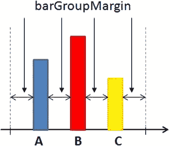
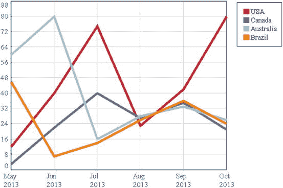

# 七、为简单图表创建库

Abstract

作为这本书第一部分的结论，你将利用你目前所学的一切从头开始创建一个你自己的图书馆。这将是一个专门表示三种不同类型的图表的库，这三种不同类型的图表是:折线图、条形图和饼图。

作为这本书第一部分的结论，你将利用你目前所学的一切从头开始创建一个你自己的图书馆。这将是一个专门表示三种不同类型的图表的库，这三种不同类型的图表是:折线图、条形图和饼图。

您将开发的是一个非常简化的当前互联网上可用的 JavaScript 库模型。目的是帮助您理解这种图表表示专用库的机制。

通过在这个简单的例子中包含所有的步骤，您可以更好地了解这个类的库是如何工作的，即使对于复杂得多的例子也是如此。跟随数据的流动，从它们在 HTML 页面中的定义到它们在库中的处理，您将发现数据是如何被转换成图形元素以形成您最感兴趣的图表类型的。这个库的逐步实现将阐明为什么 jQuery 库是许多此类库的基础。由于它的功能，可以动态管理 HTML 页面的组件。该库还在许多参数的实现和管理中起着关键作用，这些参数将对所创建的图形元素的属性产生直接影响，从而在不修改代码的情况下表征不同的图表表示，每次都指定一个 JavaScript 对象，在该对象中将传递所有这些参数。

在前几章中，您已经开发了这里需要的代码。由于画布的上下文和 jQuery 提供的许多功能，您已经看到了如何迭代地管理数据，如何将数据转换成图形。这样，您创建了三种最常见的图表类型。您将使用您开发的代码来创建您的库，探索如何将其参数化，以便您可以决定表示哪个图表以及在调用库时如何表示，而无需修改代码。

## 创建库

首先，您需要定义您的新库，并将其包含在您的 web 页面中。为此，您创建一个包含`myLibrary()`函数定义的新文件。您将该文件另存为`myLibrary.js`；这将是你的库，只要你想把它包含在一个网页中，它就可以被重用(见清单 7-1)。

清单 7-1。myLibrary.js

`function myLibrary(target, data, options){`

`//add the JavaScript code here`

`}`

同时，您开始实现一个新的 web 页面，包括其中的`myLibrary`文件，如清单 7-2 所示。

清单 7-2。ch7_01.html

`<HTML>`

`<HEAD>`

`<TITLE>MyChart</TITLE>`

`</HEAD>`

`<BODY>`

``

``

``

`<canvas id="myCanvas" width="500" height="400"> </canvas>`

`</BODY>`

`</HTML>`

正如您所看到的，首先您已经在 web 页面中包含了 jQuery 库，这样您就可以在使用代码时利用这个库提供的所有方法。

Note

如果您希望将 jQuery 库包含在内容交付网络(CDN)服务中，您需要使用以下参考资料:

`<script src="`[`http://code.jquery.com/jquery-1.9.1.min.js`](http://code.jquery.com/jquery-1.9.1.min.js)T2】

有关工作区和库路径的更多信息，请参见附录 a。

## 主要功能:目标、数据和选项

在`$(document).ready()`函数中，你用`myLibrary()`函数调用你的库。在这个调用中，您传递了三个不同的参数:

*   `target`
*   `data`
*   `options`

你会发现这种类型的调用在很多库中都很常见，包括 jqPlot 和 Highcharts。因此，在实现您的库时，您已经开始处理将构成后续章节基础的概念。

*   `target`是画布的 ID 类的名称。`target`被传递到库中，使您能够定义一个上下文并在其中绘制所有需要的图形。您可以在同一个网页中使用不同的画布，每个画布代表一种不同的图表类型，但是必须通过给`target`起不同的名字来区分所有画布。
*   `data`是包含输入数据的数组。在前面的章节中，您使用了包含在表中的数据，并通过您实现的解析器将它提取出来。这有助于您理解 jQuery 的潜力，但是，事实上，大多数时候这些输入值可以有任何来源并采用任何形式。通常，转换成可读格式不是库的工作，而是其他支持代码的工作。因此，对于您的库，输入格式必须是数组。
*   `options`是一种对象数据类型，也可以采用复杂的结构，为此你需要指定一些与属性值相关的属性。您将使用这种类型的结构将一系列参数传递给库，以描述图表的所有图形组件。基本上，这需要定义一套关于你希望你的库如何表示你的图表的指导方针。

一旦你熟悉了这些基本概念，你会发现这本书涵盖的所有库，以及互联网上的其他库，将会更容易理解和使用。

与所有其他库一样，您正在实现的库将接受数组形式的输入数据。您不用实现解析器，解析器从 HTML 表中提取值，而是以数字数组的形式直接写入数据。在调用`myLibrary()`函数之前，`data`变量将在`$(document).ready()`中定义(见清单 7-3)。

清单 7-3。ch7_01.html

`$(document).ready(function(){`

`var data = [[12, 40, 75, 23, 42, 80],`

`[3, 22, 40, 27, 35, 21],`

`[60, 80, 16, 28, 33, 26],`

`[46, 7, 14, 26, 36, 24]];`

`myLibrary("#myCanvas",data,options);`

`});`

如前所述，这些是 HTML 表格的数值(见图 [7-1](#Fig1) )。但是，标题、月份和国家名称发生了什么变化呢？您也将把这两组值表示为一个数组，但是您没有将它们作为输入数据引入，而是将它们用作通过`options`插入的图表的属性。

图 7-1。

The input data can come from any kind of source (e.g., a table); the important thing to keep the data structure

您可以考虑一年中的月份刻度标签(也称为类别)，但是对于国家的名称，它们只不过是一系列值的名称，这些值将在图例中报告，并且将被分配不同的颜色。事实上，大多数标签将被分配给图表的组件，所以最好通过`options`传递它们(见清单 7-4)。以前，您通过数组定义了一个颜色序列。因此，您也将在`options`中传递这个数组。

清单 7-4。ch7_01.html

`$(document).ready(function(){`

`var data = [[12, 40, 75, 23, 42, 80],`

`[3, 22, 40, 27, 35, 21],`

`[60, 80, 16, 28, 33, 26],`

`[46, 7, 14, 26, 36, 24]];`

`var options = {`

`categories: ["May 2012", "Jun 2012", "Jul 2012",`

`"Aug 2012", "Sep 2012", "Oct 2012"],`

`series: ["USA","Canada","Australia", "Brazil"],`

`colors: ['#be1e2d', '#666699', '#92d5ea', '#ee8310'],`

`};`

`myLibrary("#myCanvas",data,options);`

`});`

但是，你忘了最重要的一点。您想使用哪种类型的图表？您也将在`options`中指定这个信息，在这个特殊的例子中，定义一个具有三个可能值的`type`属性:

*   `line`
*   `bar`
*   `pie`

就图表中可以参数化的内容而言，这只是冰山一角。在实现你的库时，任何表征图形元素外观或功能的参数都可以通过`options`对象在外部设置，如清单 7-5 所示。

清单 7-5。ch7_01.html

`$(document).ready(function(){`

`var data = [[12, 40, 75, 23, 42, 80],`

`[3, 22, 40, 27, 35, 21],`

`[60, 80, 16, 28, 33, 26],`

`[46, 7, 14, 26, 36, 24]];`

`var options = {`

`//type: 'line',`

`type: 'bar',`

`//type: 'pie',`

`categories: ["May 2012", "Jun 2012", "Jul 2012",`

`"Aug 2012", "Sep 2012", "Oct 2012"],`

`series: ["USA","Canada","Australia", "Brazil"],`

`colors: ['#be1e2d', '#666699', '#92d5ea', '#ee8310'],`

`};`

`myLibrary("#myCanvas",data,options);`

`});`

这里，我们只拿几个小例子，因为我们的目的是说明性的；重要的是理解基本的方法论。例如，在前面的例子中定义画布时，您在绘图区域中指定了边距。然而，在这种情况下，让用户在库之外直接定义这些参数更合适。

在其他情况下，甚至可能有更具体的参数，典型的单一类型的图表。在这种情况下，您将有一个进一步的嵌套结构，例如一个`options`对象在另一个`options`对象内，该对象只特定于一种类型的图表。例如，这种方法是 jqPlot 中构成`options`对象的大量属性和子属性的基础，jqPlot 是一个库，您将在本书的下一部分研究它。因此，举例来说，让我们将`barGroupMargin`属性作为特定参数插入条形图(见图 [7-2](#Fig2) )。使用此属性，您可以控制条形之间的距离。因为该属性只针对一种图表类型，所以它将在一个`bar`对象中指定，该对象又包含在`options`中。

图 7-2。

Setting the `barGroupMargin` property, you can modify the distance between the bars

甚至画布的边距也可以定义为`options`中的属性。这样，您可以调整图表的位置，而无需每次都更改`myLibrary.js`库中的代码。

使用这种方法，根据`options`层次中的影响区域，细分属性，将它们分配给描述该区域的对象(见图 [7-3](#Fig3) )。

图 7-3。

The hierarchy of the `options` object reflects the hierarchy of the elements that form the chart

在这种情况下，在`options`对象中有许多属性需要设置，如清单 7-6 所示。

清单 7-6。ch7_01.html

`$(document).ready(function(){`

`var data = [[12, 40, 75, 23, 42, 80],`

`[3, 22, 40, 27, 35, 21],`

`[60, 80, 16, 28, 33, 26],`

`[46, 7, 14, 26, 36, 24]];`

`var options = {`

`//type: 'line',`

`type: 'bar',`

`//type: 'pie',`

`categories: ["May 2012", "Jun 2012", "Jul 2012",`

`"Aug 2012", "Sep 2012", "Oct 2012"],`

`series: ["USA","Canada","Australia", "Brazil"],`

`colors: ['#be1e2d', '#666699', '#92d5ea', '#ee8310'],`

`margins: {top: 30, right: 10, bottom: 10, left: 30},`

`bar: {`

`barGroupMargin: 4`

`}`

`};`

`myLibrary("#myCanvas",data,options);`

`});`

这样，您就完成了对网页中所有要定义的内容的定义。现在，必须使用`data`数组处理输入数据并将其转换成图形元素。在您的`options`对象中，您还有一系列参数来描述图表的特征。最后，您已经指出了`target`，即您将在其上绘制图表的画布。所以，让我们看看`myLibrary`内部来解决所有这些问题。

## 实现库

现在您已经完成了 web 页面中所有内容的定义，您必须开始实现您的库。如果您回过头来看看用来获得折线图、条形图和饼图的代码，您会发现这些代码有许多共同点。正是这些公共部分构成了库的主干，而那些特定于图表类型的部分将在一个`if()`语句中单独实现，该语句只有在`options`中选择的类型对应时才会激活。

### 设置画布

代码的一个公共部分是应用于画布的上下文的定义，如清单 7-7 所示。

清单 7-7。myLibrary.js

`function myLibrary(target,data,options){`

`var canvas = $(target);`

`var margin = options.margins;`

`var w = canvas.width() - margin.left - margin.right,`

`h = canvas.height() - margin.top - margin.bottom;`

`var ctx = canvas.get(0).getContext("2d");`

`if(options.type === 'pie'){`

`ctx.strokeRect(margin.left, margin.top, w, h);`

`} else {`

`ctx.translate( 0, canvas.height() );`

`ctx.strokeRect(margin.left, -margin.bottom, w, -h);`

`}`

`};`

如您所见，这里使用了`target`参数。关于边距的定义，您必须记住在`options`对象中定义它们，因此您将读取内部定义的值。获取这些值真的很简单；您只需在每次需要时定义语句:

`options.` `property`

因此，边距将使用`options.margins`。在这部分代码中，三种图表之间的唯一区别是定义设计区域的矩形，其方向与饼图的页面一致，而对于折线图和条形图，方向相反。这就是为什么只有当`options.type`不同于`'pie'`时才应用`ctx.translate()`。

### 绘制轴、记号标签和网格

现在，让我们将代码添加到您的库中。这段代码处理 x 和 y 轴刻度标签的创建。只有折线图和条形图才需要这些组件，因为它们是在笛卡尔轴上表示的；饼图不使用它们。因此，您在`if()`语句中应用条件，以便只为这两种类型的图表执行代码。你正在实现的代码与前几章中使用的相同，除了在这种情况下，你已经用`options`对象和`data`数组中可用的其他变量替换了变量(见清单 7-8)。

清单 7-8。myLibrary.js

`function myLibrary(target,data,options){`

`...`

`var ctx = canvas.get(0).getContext("2d");`

`if(options.type === 'pie'){`

`ctx.strokeRect(margin.left, margin.top, w, h);`

`} else {`

`ctx.translate( 0, canvas.height() );`

`ctx.strokeRect(margin.left, -margin.bottom, w, -h);`

`}`

`if(options.type === 'line' || options.type === 'bar'){`

`var minVal = 0;`

`var maxVal = 0;`

`data.forEach(function(d,i){`

`var min = Math.min.apply(null, d);`

`if(min < minVal)`

`minVal = min;`

`var max = Math.max.apply(null, d);`

`if(max > maxVal)`

`maxVal = max;`

`});`

`maxVal = 1.1 * maxVal;`

`//calculate yLabels`

`var yLabels = [];`

`var yDeltaPixels = 30;`

`var nTicks = Math.round(h / yDeltaPixels);`

`var yRange = maxVal - minVal;`

`var yDelta = Math.ceil(yRange / nTicks);`

`var yVal = minVal;`

`while(yVal < (maxVal - yDelta)){`

`yLabels.push(yVal);`

`yVal += yDelta;`

`}`

`yLabels.push(yVal);`

`yLabels.push(maxVal);`

`//draw xLabels`

`if(options.type === 'line'){`

`var xDelta = w / (options.categories.length - 1);`

`}`

`if(options.type === 'bar'){`

`var xDelta = w / (options.categories.length);`

`}`

`var xlabelsUL = $('<ul class="labels-x"></ul>')`

`.width(w)`

`.height(h)`

`.insertBefore(canvas);`

`$.each(options.categories, function(i){`

`var thisLi = $('<li>' + this + '</li>')`

`.prepend('')`

`.css('left', xDelta * i)`

`.width(0)`

`.appendTo(xlabelsUL);`

`var label = thisLi.find('span.label');`

`});`

`//draw yLabels`

`var yScale = h / yRange;`

`var liBottom = h / (yLabels.length-1);`

`var ylabelsUL = $('<ul class="labels-y"></ul>')`

`.width(w)`

`.height(h)`

`.insertBefore(canvas);`

`$.each(yLabels, function(i){`

`var thisLi = $('<li>' + this + '</li>')`

`.prepend('')`

`.css('bottom', liBottom * i)`

`.prependTo(ylabelsUL);`

`var label = thisLi.find('span:not(.line)');`

`var topOffset = label.height()/-2;`

`if(i == 0){ topOffset = -label.height(); }`

`else if(i== yLabels.length-1){ topOffset = 0; }`

`label`

`.css('margin-top', topOffset)`

`.addClass('label');`

`});`

`}`

`};`

如果你看一下前面章节中定义的级联样式表(CSS)样式，对于三种类型的图表，你会发现它们并不完全相同，特别是对于某些类别的样式。为了克服这个问题，最简单的方法是定义这些属性，在定义它们的时候，对各种类型的样式(或者说，代表它们的标签)使用`css()`函数。因此，对于所有三种类型的图表，您可以使用相同名称的样式类，但是使用不同的值，因为它们都有自己的`css()`函数。

例如，当您定义管理 x 轴刻度标签的 CSS 类`span.label`时，根据您是在处理折线图还是条形图，这些标签的行为必须不同。如果您想要表示折线图，将在刻度处报告刻度标签，但是如果您想要表示条形图，应该在两个刻度处报告标签。因此，您必须以不同的方式定义同一个`span.label`类的属性，您可以通过添加 40 个像素的左边距和条形图独有的`css()`函数来实现。代码的相关部分如清单 7-9 所示。

清单 7-9。myLibrary.js

`function myLibrary(target,data,options){`

`...`

`if(options.type === 'line' || options.type === 'bar'){`

`...`

`$.each(options.categories, function(i){`

`var thisLi = $('<li>' + this + '</li>')`

`.prepend('')`

`.css('left', xDelta * i)`

`.width(0)`

`.appendTo(xlabelsUL);`

`var label = thisLi.find('span.label');`

`if(options.type === 'line'){`

`label.addClass('label');`

`}`

`if(options.type === 'bar'){`

`label.css('margin-left', '40px')`

`.addClass('label');`

`}`

`});`

`//draw yLabels`

`var yScale = h / yRange;`

`var liBottom = h / (yLabels.length-1);`

`...`

`}`

`};`

因为我们正在讨论 CSS 类，所以让我们把你在前面章节中使用的所有定义添加到你的网页中，这些定义对所有三种类型都有效。但是，不要把它们直接添加到你的网页上，把它们写在``标签之间，你必须把这些 CSS 定义看作是库的一部分；因此，最好将它们写在一个新的 CSS 文件中，你将称之为`myLibrary.css`(见清单 7-10)。

清单 7-10。myLibrary.css

`canvas {`

`position: relative;`

`}`

`ul,.li {`

`margin: 0;`

`padding: 0;`

`}`

`.labels-x, .labels-y {`

`position: absolute;`

`left: 37;`

`top: 37;`

`list-style: none;`

`}`

`.labels-x li {`

`position: absolute;`

`bottom: 0;`

`height: 100%;`

`}`

`.labels-x li span.label {`

`position: absolute;`

`color: #555;`

`top: 100%;`

`margin-top: 5px;`

`left:-15;`

`}`

`.labels-x li span.line{`

`position: absolute;`

`border: 0 solid #ccc;`

`border-left-width: 1px;`

`height: 100%;`

`}`

`.labels-y li {`

`position: absolute;`

`bottom: 0;`

`width: 100%;`

`}`

`.labels-y li span.label {`

`position: absolute;`

`color: #555;`

`right: 100%;`

`margin-right: 5px;`

`width: 100px;`

`text-align: right;`

`}`

`.labels-y li span.line {`

`position: absolute;`

`border: 0 solid #ccc;`

`border-top-width: 1px;`

`width: 100%;`

`}`

`.legend {`

`list-style: none;`

`position: absolute;`

`left: 520px;`

`top: 40px;`

`border: 1px solid #000;`

`padding: 10px;`

`}`

`.legend li span {`

`width: 12px;`

`height: 12px;`

`float: left;`

`margin: 3px;`

`}`

`.chart-title {`

`font-size: 24;`

`font-weight: bold;`

`position: absolute;`

`left: 150px;`

`top: 10px;`

`width: 100%`

`}`

为了使这些 CSS 样式设置有效，新的 CSS 文件必须包含在你的网页中，并带有一个指向该文件的链接，如清单 7-11 所示。

清单 7-11。myLibrary.js

`<HEAD>`

`<TITLE>MyChart</TITLE>`

`</HEAD>`

`<BODY>`

``

`<link href="./myLibrary.css" rel="stylesheet" type="text/css">`

``

`<script>`

`...`

### 绘图日期

现在你必须使用画布的上下文来定义将输入数据转换成图形元素的代码部分(见清单 7-12)。这部分特定于每种类型的图表，因此每种图表都有不同的实现。

清单 7-12。myLibrary.js

`function myLibrary(target,data,options){`

`...`

`if(options.type === 'line' || options.type === 'bar'){`

`...`

`}`

`if(options.type === 'line'){`

`// draw DATA`

`ctx.lineWidth = 5;`

`for(var i in data){`

`var points = data[i];`

`ctx.moveTo(0,-points[i]);`

`ctx.strokeStyle = options.colors[i];`

`ctx.beginPath();`

`var xVal = margin.left;`

`for(var j in points){`

`var relY = (points[j] * h / maxVal) + 10;`

`ctx.lineTo(xVal,-relY);`

`xVal += xDelta;`

`}`

`ctx.stroke();`

`ctx.closePath();`

`}`

`} // end of LINE`

`if(options.type === 'bar'){`

`var barGroupMargin = options.bar.barGroupMargin;`

`for(var i in data){`

`ctx.beginPath();`

`var n = data.length;`

`var lineWidth = (xDelta - barGroupMargin * 2) / n;`

`var strokeWidth = lineWidth - (barGroupMargin * 2);`

`ctx.lineWidth = strokeWidth;`

`var points = data[i];`

`var xVal = (xDelta - n * strokeWidth - (n - 1) * (lineWidth - strokeWidth)) / 2;`

`for(var j in points){`

`var relX = margin.left + (xVal - barGroupMargin) +`

`(i * lineWidth) + lineWidth / 2;`

`ctx.moveTo(relX,-margin.bottom);`

`var relY = margin.bottom + points[j] * h / maxVal;`

`ctx.lineTo(relX, -relY);`

`xVal += xDelta;`

`}`

`ctx.strokeStyle = options.colors[i];`

`ctx.stroke();`

`ctx.closePath();`

`}`

`} // end of bar`

`if(options.type === 'pie'){`

`var pieMargin = margin.top + 50;`

`var centerx = Math.round(w / 2) + margin.left;`

`var centery = Math.round(h / 2) + margin.top;`

`var radius = centery - pieMargin;`

`var counter = 0.0;`

`var dataSum = function(){`

`var dataSum = 0;`

`for(var i in data){`

`var points = data[i];`

`for(var j in points){`

`dataSum += points[j];`

`}`

`}`

`return dataSum;`

`}`

`var dataSum = dataSum();`

`var labels = $('<ul class="labels"></ul>')`

`.css('list-style','none')`

`.insertBefore(canvas);`

`for(var i in data){`

`var sum = 0;`

`var points = data[i];`

`for(var j in points){`

`sum += points[j];`

`}`

`var fraction = sum / dataSum;`

`ctx.beginPath();`

`ctx.moveTo(centerx, centery);`

`ctx.arc(centerx, centery, radius,`

`counter * Math.PI * 2 - Math.PI * 0.5,`

`(counter + fraction) * Math.PI * 2 - Math.PI * 0.5, false);`

`ctx.lineTo(centerx, centery);`

`ctx.closePath();`

`ctx.fillStyle = options.colors[i];`

`ctx.fill();`

`var sliceMiddle = (counter + fraction / 2);`

`var distance = radius * 1.2;`

`var labelx = Math.round(centerx +`

`Math.sin(sliceMiddle * Math.PI * 2) * (distance));`

`var labely = Math.round(centery -`

`Math.cos(sliceMiddle * Math.PI * 2) * (distance));`

`var leftPlus = (labelx < centerx) ? '40' : '0' ;`

`var percentage = parseFloat((fraction * 100).toFixed(2));`

`var labelval = percentage + "%";`

`var labeltext = $('' + labelval +'')`

`.css('font-size', radius / 8)`

`.css('color', options.colors[i])`

`.css('font-weight', 'bold');`

`var label = $('<li class="label-pos"></li>')`

`.appendTo(labels)`

`.css({left: labelx-leftPlus, top: labely, position: 'absolute',`

`padding: 0})`

`append(labeltext);`

`counter+=fraction;`

`}`

`} //end of pie`

`};`

### 添加图例

要在库中定义的最后一部分代码是实现图例组件的代码(见清单 7-13)。因为这一部分对于所有三种类型的图表都是相同的，所以它不受`if()`语句的约束。注意，在代码中，系列由`options.series`读取，颜色由`options.colors`数组读取。

清单 7-13。myLibrary.js

`function myLibrary(target,data,options){`

`...`

`if(options.type === 'pie'){`

`...`

`} //end of pie`

`//draw the legend`

`var legendList = $('<ul class="legend"></ul>')`

`.insertBefore(canvas);`

`for(var i in options.series){`

`$('<li>'+ options.series[i] +'</li>')`

`.prepend('')`

`.appendTo(legendList);`

`}`

`};`

如果您将三个值`'pie'`、`'line'`和`'bar'`分配给`type`属性，您将得到与前面章节中相同的三个图表，除了生成它们的代码被压缩成一个唯一的版本:库`myLibrary.js`。此外，您现在拥有了能够从库外部配置一切的优势。

## 默认值

但是，假设您忘记了在`options`中定义一个参数。接下来会发生什么？您启动的页面肯定无法正常工作。事实上，所有的库，包括非常简单的库，都必须包含在`options`中定义的所有值，而这些值必须已经定义了默认值。这是一个非常重要的概念，你会在 jqPlot 和 Highcharts 库中看到它。

你已经知道所有的图形元素都可以用标准参数来描述，这些参数一个接一个地创建了一个树形结构属性，你可以在`options`对象中找到。任何一个库，无论多么简单或复杂，都有这样的内部结构。实际上，每个库都必须提供它的`options`结构，其中每个属性都已经指定了一个默认值，所以如果这个属性没有在`options`对象中声明并作为参数传递给`myLibrary()`函数，您不会得到任何错误，因为一个值已经被赋给了那个属性。然而，这样做的原因不仅仅是为了确保当您忘记输入一个值时您的库能够运行，而是为了以最小的努力获得最大的结果。想象一个比您刚刚实现的库复杂得多的库，其中要定义的属性有好几个。这种类型的库很可能是 jqPlot。正如您将看到的，您只需要定义几行代码就可以获得很好的结果。事实上，只写你想改变的参数就足够了；这为你节省了大量的时间和精力。

为了更好地理解这个概念，如果你不希望在属性`barGroupMargin`中定义一个值，例如，因为它的缺省值 4 适合你的需要，那么你不需要在`options`对象中写任何对它的引用，如清单 7-14 所示。

清单 7-14。ch7_01b.html

`var options = {`

`type: 'bar',`

`categories: ["May 2012", "Jun 2012", "Jul 2012",`

`"Aug 2012", "Sep 2012", "Oct 2012"],`

`series: ["USA", "Canada", "Australia", "Brazil"],`

`colors: ['#be1e2d', '#666699', '#92d5ea', '#ee8310'],`

`margins: {top: 30, right: 10, bottom: 10, left: 30},`

`bar: {}`

`}`

并且，这个库，经过适当的修改来处理这个值的缺失，分配了缺省值 4(见清单 7-15)。

清单 7-15。myLibrary.js

`function myLibrary(target,data,options){`

`...`

`if(options.type === 'line'){`

`...`

`} // end of LINE`

`if(options.type === 'bar'){`

`if(typeof options.bar.barGroupMargin!= 'undefined') {`

`var barGroupMargin = options.bar.barGroupMargin;`

`} else {`

`var barGroupMargin = 4;`

`}`

`for(var i in data){`

`ctx.beginPath();`

`var n = data.length;`

`...`

`} // end of bar`

`...`

`};`

图 [7-4](#Fig4) 显示了你在前三章中实现的三种类型的图表，但是这次生成它们的代码都在一个文件中。

T2】

图 7-4。

The library generates three type of charts: (a) a line chart, (b) a bar chart, and (c) a pie chart

## 摘要

读到这一章，你就完成了这本书的第一部分。您已经看到了如何用 JavaScript 创建一个特定于图表数据表示的库。

学习重用已经实现的代码来开发你自己的库，你已经开始理解这种类型的库是如何构造的，以及各部分执行的功能是什么。特别重要的是对树结构的介绍，我们称之为`options`，许多库都有。`options`对象在定义图形组件的所有设置中起着重要的作用，因此也定义了如何表示图表。

此外，您还看到了如何通过输入数组在内部管理这类库的数据，jQuery 库所扮演的角色，以及在其上构建数据的原因。

在下一章，你将开始这本书的第二部分，在这一部分中，jqPlot 和 Highcharts 库将被完整地讨论。这些库在 web 开发人员中取得了一些成功。尽管它们比你刚刚开发的库更复杂，功能更丰富，但有了它们，你会发现本章涵盖的所有概念。