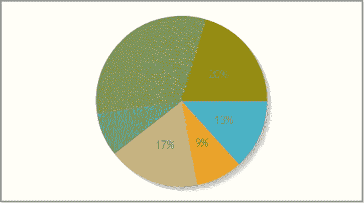
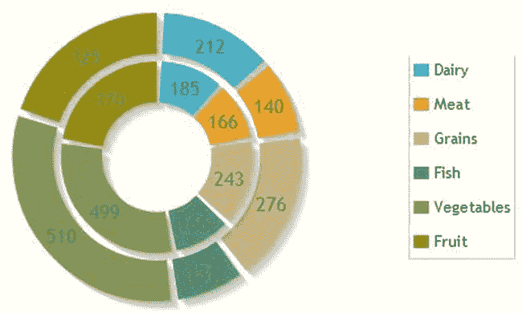
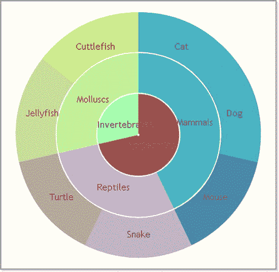

# 十一、jqPlot 饼图和圆环图

Abstract

饼图和圆环图是将数据分解成各个组成部分的绝佳方式。饼图是一个圆形的图表，分为扇形或“切片”，其主要目的是说明它们的相对比例:每个切片的弧长与它所代表的数量成比例。圆环图与饼图非常相似，但中间有一个洞，并支持多个系列的比较。在这一章中，你将会看到这两种图表。本章最后讨论了多维饼图。

饼图和圆环图是将数据分解成各个组成部分的绝佳方式。饼图是一个圆形的图表，分为扇形或“切片”，其主要目的是说明它们的相对比例:每个切片的弧长与它所代表的数量成比例。圆环图与饼图非常相似，但中间有一个洞，并支持多个系列的比较。在这一章中，你将会看到这两种图表。本章最后讨论了多维饼图。

## 饼图

在 jqPlot 中，默认情况下，数据被解释为折线图。如果您想在饼图中显示您的数据，您需要包括 PieRenderer 插件:

``

或者，如果您更喜欢使用内容交付网络(CDN)服务，您可以按如下方式操作:

``

你必须在`options`对象中做的唯一改变是在渲染器调用中用`DonutRenderer`替换`pieRenderer`对象，然后修改`rendererOptions object`中第一个扇区的起始角度。默认情况下，图表从圆圈的左侧开始，但通常必须从顶部开始。因此，有必要将`startAngle`属性设置为–90 度(见清单 11-6)。

清单 11-6。ch11_02.html

`var options = {`

`seriesDefaults: {`

`// Make this a pie chart.`

`renderer:$.jqplot.DonutRenderer,`

`rendererOptions: {`

`showDataLabels: true,`

`dataLabels: 'value',`

`sliceMargin: 3,`

`startAngle: -90`

`}`

`}`

`};`

`jQuery.jqplot ('myChart', [data], options);`

这样你就得到了一个甜甜圈图(见图 [11-3](#Fig3) ，与图 [11-2](#Fig2) 右下方的饼状图非常相似。

图 11-3。

A simple donut chart

但是，我们选择使用圆环图而不是饼图，因为它允许我们同时表示多个系列，从而比较其组成部分的比例。因此，继续这个例子，你可以比较两个不同群体的人所吃的食物。清单 11-7 说明了如何添加另一个数据数组。

清单 11-7。ch11_02.html

`var data2 = [`

`['Dairy', 185],['Meat', 166], ['Grains', 243],`

`['Fish', 166],['Vegetables', 499], ['Fruit', 370]`

`];`

将第二个数组添加到`data`，修改清单:

`$.jqplot ('myChart', [data,``data2`T2】

图 [11-4](#Fig4) 展示了报告两个数值系列的圆环图。

图 11-4。

A multiseries donut chart

看着图 [11-4](#Fig4) ，你可以立刻看到一些基本的东西不见了:一个图例。图例是必需的，因为插件会自动为每个扇区分配一种颜色，因此没有颜色参考，很难理解图表。因此，在您将图例的`show`属性设置为`'true'`之后，您可以选择图例的位置。为了确定在哪个位置放置图例，jqPlot 使用 location 属性，将与基本方向对应的值分配给该属性:`'n'`(北)、`'s'`(南)、`'e'`(东)和`'w'`(西)。但是，也可以使用组合，例如`'ne'`，来指示东北方向的位置。

假设您决定将图例定位在图表的右侧，那么您将`'e'`分配给`location`属性(参见清单 11-8)。

清单 11-8。ch11_02.html

`legend: {`

`show:true,`

`location: 'e'`

`}`

图例自动报告数据数组中包含的标签，如图 [11-5](#Fig5) 所示。

图 11-5。

A multiseries donut chart with a legend

## 多级饼图

多级饼图是一种现代格式，非常适合可视化用于显示层次关系的数据。这种图表提供了一个层次结构，从圆圈中心的根节点开始，您可以跟踪成员资格，因为它们逐渐移动到外部圆圈。为了更好地理解这种图表，让我们以一系列动物为例，逐步确定它们的等级群体。

作为输入数据数组，你想插入三个数组(见清单 11-9)。这将产生三个层次。在第一个数组中，插入最后一级，直到第三个数组，它代表根。

清单 11-9。ch11_03.html

`var data = [ ['Cat', 1],['Dog', 1], ['Mouse', 1],['Snake', 1],`

`['Turtle', 1], ['Jellyfish', 1], ['Cuttlefish', 1] ];`

`var data2 = [ ['Mammals', 3],['Reptiles', 2], ['Mollusks', 2] ];`

`var data3 = [ ['Vertebrates', 5],['Invertebrates', 2] ];`

要生成多级饼图，实际上需要修改一个圆环图，将内孔的直径设置为零。在这种情况下，您需要显示标签所代表的动物或动物群的名称，而不是显示数值；您必须将`dataLabels`属性设置为`'label'`。最后要修改的是颜色的设置。jqPlot 提供的默认颜色是不够的，有必要为层次结构的每个级别定义一组颜色。优选地，将相似的颜色分配给属于同一组的动物，并且对于层级的连续级别也是如此。在清单 11-10 中，特别注意了分配给每个系列的颜色序列(层次级别)。

清单 11-10。ch11_03.html

`var options = {`

`seriesDefaults: {`

`renderer:$.jqplot.DonutRenderer,`

`rendererOptions: {`

`showDataLabels: true,`

`dataLabels: 'label',`

`startAngle: -90,`

`innerDiameter: 0,`

`ringMargin: 2,`

`shadow: false`

`}`

`},`

`series: [`

`{`

`seriesColors: ['#4bb2c5', '#4baacc', '#4b88aa', '#bbb2c5',`

`'#bbaa99', '#c5dd99', '#dddd77']`

`},`

`{`

`seriesColors:  ['#4bbbbb', '#ccb2c5', '#c5ff99']`

`},`

`{`

`seriesColors:  ['#aa5555', '#a3ffaa']`

`}]`

`};`

`$.jqplot ('myChart', [data, data2, data3], options);`

最终，你的努力会得到图 [11-6](#Fig6) 中的多级饼图的回报。

图 11-6。

A multilevel pie chart

## 摘要

在本章中，您已经了解了 jqPlot 库如何允许您通过饼图(具有单个数据系列)或圆环图(具有多个数据系列)来表示数据，同时还可以快速了解一些主要属性以及如何在选项中设置它们。在本章的最后一部分，您创建了一个多级饼图:这是一个经典的例子，说明了如何通过适当地修改某些属性来生成一种不属于库所建议的标准图表的图表类型。

在下一章中，您将看到 jqPlot 库如何让您实现蜡烛图，以及如何处理特定的数据格式开盘-盘高-盘低-收盘(OHLC)，这是这种图表的基础。