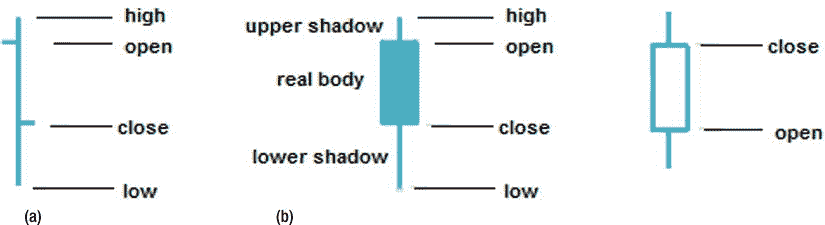
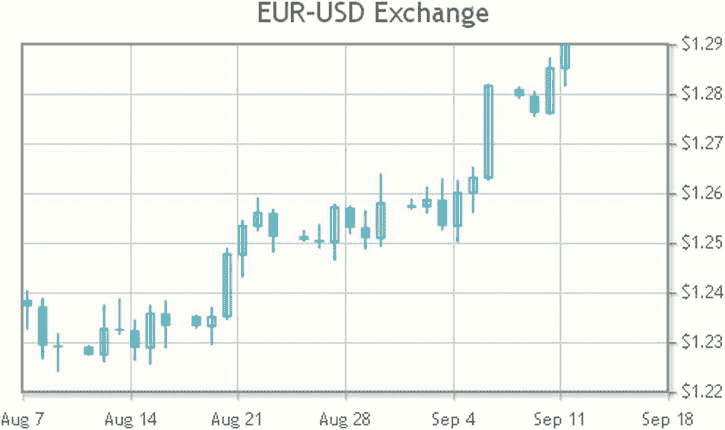
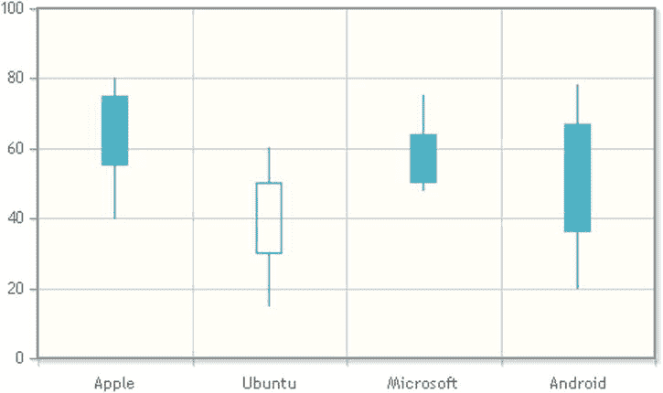

# 12.带有 jqPlot 的蜡烛图

Abstract

蜡烛图广泛用于分析一段时间内的货币或价格变动。该图表由一系列竖线组成，称为烛台。它们显示了给定时间内的开盘价、收盘价、最低价和最高价(见图 12-1)。因此，这种图表通常被称为 OHLC 图表(当它报告开盘-盘高-盘低-收盘值时)或 HLC 图表(当它只报告盘高-盘低-收盘值时)。

蜡烛图广泛用于分析一段时间内的货币或价格变动。该图表由一系列竖线组成，称为烛台。它们显示给定时间段内的开盘价、收盘价、最低价和最高价(见图 [12-1](#Fig1) )。因此，这种图表通常被称为 OHLC 图表(当它报告开盘-盘高-盘低-收盘值时)或 HLC 图表(当它只报告盘高-盘低-收盘值时)。

图 12-1。

Different ways to represent OHLC data: (a) line, (b) real body

烛台可能被描绘成简单的线条或末端有线条(称为灯芯或阴影)的盒子(称为实体)。每个烛台的高度表明了一个特定时期的价格范围。在箱形表示中，真实的主体是开盘价和收盘价之间的区域。但是，如果烛台用简单的垂直线表示，两个小的水平刻度表示开盘价(向左刻度)和收盘价(向右刻度)。此外，在蜡烛图中，根据价格是上涨还是下跌，数据图的颜色也不同。

在本章中，您将看到如何表示特定的`OHLC`数据。你还将学习如何用线条或实体来格式化这样的图表。不过，首先，您需要包含 OHLCRenderer 插件。

## OHLC 图表

要使 jqPlot 能够绘制蜡烛图，您必须在 web 页面中包含一个特定的插件:OHLCRenderer。

您还需要包括 DateAxisRenderer 插件，因为在蜡烛图中，您通常将日期值放在 x 轴上:

``

``

关于输入数据数组，您必须遵守特定的顺序:

`['timestamp', open, max, min, close]`

对于这个例子，您使用的是一组在线可用的真实数据。这些数据取自一个由免费工具 Dukascopy 生成的逗号分隔值(CSV)文件，这个工具也可以在网上获得( [`www.dukascopy.com`](http://www.dukascopy.com/) )。您选择 2012 年大约一个月的欧元兑美元汇率值。让我们将所有这些值赋给一个变量，如清单 12-1 所示。

清单 12-1。ch12_01a.html

`var ohlc = [`

`['8/08/2012 0:00:01', 1.238485, 1.2327, 1.240245, 1.23721],`

`['8/09/2012 0:00:01', 1.23721, 1.22671, 1.23873, 1.229295],`

`['8/10/2012 0:00:01', 1.2293, 1.22417, 1.23168, 1.228975],`

`['8/12/2012 0:00:01', 1.229075, 1.22747, 1.22921, 1.22747],`

`['8/13/2012 0:00:01', 1.227505, 1.22608, 1.23737, 1.23262],`

`['8/14/2012 0:00:01', 1.23262, 1.23167, 1.238555, 1.232385],`

`['8/15/2012 0:00:01', 1.232385, 1.22641, 1.234355, 1.228865],`

`['8/16/2012 0:00:01', 1.22887, 1.225625, 1.237305, 1.23573],`

`['8/17/2012 0:00:01', 1.23574, 1.22891, 1.23824, 1.2333],`

`['8/19/2012 0:00:01', 1.23522, 1.23291, 1.235275, 1.23323],`

`['8/20/2012 0:00:01', 1.233215, 1.22954, 1.236885, 1.2351],`

`['8/21/2012 0:00:01', 1.23513, 1.23465, 1.248785, 1.247655],`

`['8/22/2012 0:00:01', 1.247655, 1.24315, 1.254415, 1.25338],`

`['8/23/2012 0:00:01', 1.25339, 1.252465, 1.258965, 1.255995],`

`['8/24/2012 0:00:01', 1.255995, 1.248175, 1.256665, 1.2512],`

`['8/26/2012 0:00:01', 1.25133, 1.25042, 1.252415, 1.25054],`

`['8/27/2012 0:00:01', 1.25058, 1.249025, 1.25356, 1.25012],`

`['8/28/2012 0:00:01', 1.250115, 1.24656, 1.257695, 1.2571],`

`['8/29/2012 0:00:01', 1.25709, 1.251895, 1.25736, 1.253065],`

`['8/30/2012 0:00:01', 1.253075, 1.248785, 1.25639, 1.25097],`

`['8/31/2012 0:00:01', 1.25096, 1.249375, 1.263785, 1.25795],`

`['9/02/2012 0:00:01', 1.257195, 1.256845, 1.258705, 1.257355],`

`['9/03/2012 0:00:01', 1.25734, 1.25604, 1.261095, 1.258635],`

`['9/04/2012 0:00:01', 1.25865, 1.25264, 1.262795, 1.25339],`

`['9/05/2012 0:00:01', 1.2534, 1.250195, 1.26245, 1.26005],`

`['9/06/2012 0:00:01', 1.26006, 1.256165, 1.26513, 1.26309],`

`['9/07/2012 0:00:01', 1.26309, 1.262655, 1.281765, 1.281625],`

`['9/09/2012 0:00:01', 1.28096, 1.27915, 1.281295, 1.279565],`

`['9/10/2012 0:00:01', 1.27957, 1.27552, 1.28036, 1.27617],`

`['9/11/2012 0:00:01', 1.27617, 1.2759, 1.28712, 1.28515],`

`['9/12/2012 0:00:01', 1.28516, 1.281625, 1.29368, 1.290235] ];`

在`options`中，通过调用`series`对象来激活 OHLCRenderer 插件。因为需要处理 x 轴上的日期值，所以必须激活`xaxis`对象中的`dateAxisRenderer`对象。使用这种类型的图表，最好定义您想要表示的时间段，而不考虑输入数据，以便更精确地控制显示的内容。为此，在`xaxis`对象中指定`min`和`max`属性。您还可以看到，使用`dateAxisRenderer`，您可以选择节拍间隔，使用文字表达式(`'1 day'`、`'n days'`、`'1 week'`、`'n weeks'`、`'1 month'`、`'n months'`，其中`n`是大于 1 的任何整数)。此外，请注意`yaxis`尚未定义，或者说 y 值已归属于`y2axis`。这样做是为了让 y 轴位于图表的右边，而不是默认的左边(见清单 12-2)。

清单 12-2。ch12_01a.html

`var options = {`

`title: 'EUR-USD Exchange',`

`seriesDefaults:{ yaxis: 'y2axis'},`

`axes: {`

`xaxis: {`

`renderer: $.jqplot.DateAxisRenderer,`

`tickOptions: {formatString: '%b %e'},`

`min: "08-07-2012 16:00",`

`max: "09-12-2012 16:00",`

`tickInterval: "1 weeks"`

`},`

`y2axis: {`

`tickOptions:{ formatString: '$%.2f'}`

`}`

`},`

`series: [{ renderer: $.jqplot.OHLCRenderer}]`

`};`

`$.jqplot('myChart', [ohlc], options);`

你现在有了如图 [12-2](#Fig2) 所示的 OHLC 圆图。

图 12-2。

An OHLC chart with lines

只要有整数，就像在输入数据数组中输入一样表示它们。但是，这并不总是可能的。通常，您必须处理小数点后有许多位数并且长度不同的数字。因此，有必要将这些数字标准化，只报告有效数字。您可以通过设置`formatString`属性来实现这一点。这个特例需要一个带两个小数点的浮点值:`'%.2f'`。

## 使用真实的身体和阴影

您刚刚看到的烛台图表是用棒线格式化的。如果你想要一个有真实物体和阴影的盒子，你需要设置一个额外的属性:`candlestick`(见清单 12-3)。

清单 12-3。ch12_01b.html

`series: [{`

`renderer: $.jqplot.OHLCRenderer,`

`rendererOptions:{ candleStick: true }`

`}]`

现在，让我们看看代替小节线上水平刻度的真实物体。在图 [12-3](#Fig3) 中，白色方框表示价格上涨时(开盘价低于收盘价)，黑色方框表示价格下跌时(收盘价低于开盘价)。

图 12-3。

An OHLC chart with boxes

## 对比烛台

偶尔，你需要在特定时间比较代表不同类别的烛台。在这种情况下，x 轴上没有日期，而是主题本身的名称。输入数据数组将是不同的；您必须使用 OHLC 数据所属类别的标签来分隔这些数据。对于每个实体，插入一个包含五个值的数组:

`[n, open, max, min, close]`

这里，`n`不是时间戳，而是对应于刻度数组的索引的整数。因此，您在`data1`数组中定义这些 OHLC 值，如清单 12-4 所示。在`ticks`数组中，使用四个不同的标签来表示四个 OHLC 值中的每一个。

清单 12-4。ch12_02.html

`var data1 = [[1, 75, 80, 40, 55], [2, 30, 60, 15, 50],`

`[3, 64, 75, 48, 50], [4, 67, 78, 20, 36]];`

`var ticks = ['Apple', 'Ubuntu', 'Microsoft', 'Android'];`

将对 DateAxisRenderer 插件的调用替换为对 CategoryAxisRenderer 插件的调用:

``

``

如清单 12-5 所示，`options`中的设置非常简单。首先，您必须用`renderer`属性中的`$.jqplot.CategoryAxisRenderer`替换`$.jqplot.DateAxisRenderer`。此外，将`ticks`数组分配给`xaxis`中的`ticks`对象。

清单 12-5。ch12_02.html

`var options = {`

`axes: {`

`xaxis: {`

`renderer: $.jqplot.CategoryAxisRenderer,`

`ticks: ticks`

`},`

`},`

`series: [{`

`renderer: $.jqplot.OHLCRenderer,`

`rendererOptions:{ candleStick: true}`

`}]`

`};`

`$.jqplot ('myChart', [data1], options);`

这张图表完美地描绘了一个真实身体的盒子；价格下跌时该框被填充，价格上涨时该框被清空(见图 [12-4](#Fig4) )。

图 12-4。

A comparative candlestick chart

## 摘要

在本章中，您已经看到了如何通过蜡烛图来表示特定的 OHLC 数据。您还学习了如何用线条或实体来格式化此类图表。

在下一章，我将讨论一整类图表，它们有一个共同的特点:它们的目的是表示数据的分布。通过这次探索，您将发现如何用 jqPlot 库实现散点图、气泡图和块图。