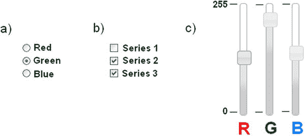
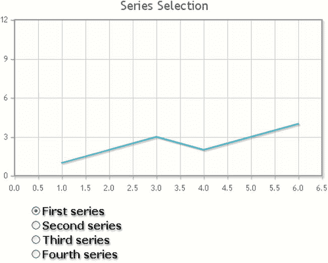
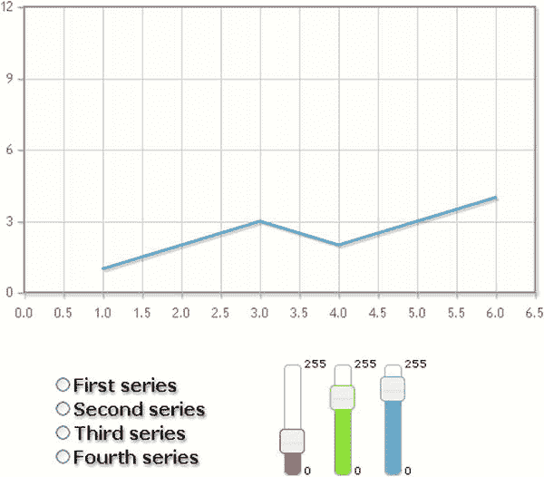
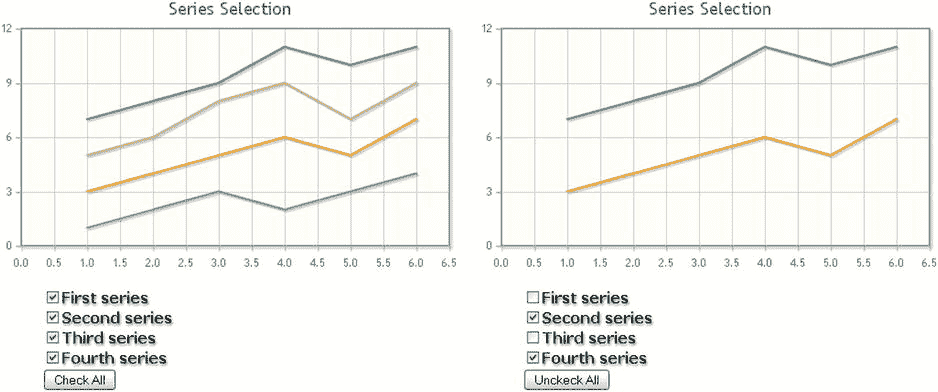

# 15.将控件添加到图表

Abstract

有时，在运行时直接从浏览器更改设置，然后用这些新设置重新绘制图表会很有用。一种典型的方法是添加活动控件。这些控件使图表具有交互性，允许用户实时做出选择，例如决定图表应该如何表示。通过插入控件，用户可以控制图表的属性值，这通常需要在`options`中设置。

有时，在运行时直接从浏览器更改设置，然后用这些新设置重新绘制图表会很有用。一种典型的方法是添加活动控件。这些控件使图表具有交互性，允许用户实时做出选择，例如决定图表应该如何表示。通过插入控件，用户可以控制图表的属性值，这通常需要在`options`中设置。

在这一章中，你将会看到在你的网页中引入控件。您还将考虑导致选择一种控制类型而不是另一种控制类型的因素。以三个最常用的控件为特色的一系列示例将带您更深入地了解这个主题。

## 添加控件

对控件进行分组的一种方法是根据它们的功能。一些控件(例如，按钮、菜单)作为开关(命令控件)工作，用户可以用其触发特定事件或启动命令。其他控件(例如，复选框、单选按钮、组合框、滑块)绑定到特定的值或属性。使用这种类型的控件，用户可以通过文本字段(文本区域)进行选择或输入值。还有一些控件(例如滚动条)具有导航功能，尤其适用于需要移动对象的情况，例如列表中的选定项或包含在框架或网页中的大图像。

在这里，您将研究那些与值相关联的控件，这些控件允许用户通过选择与图表进行交互。这些控件应该以某种方式图形化地表示特定属性可以采用的值(通常分配给`options`对象中的属性的相同值，仅限于您希望提供给用户的值)。您对控件的选择将取决于要设置的属性及其可能采用的值:

图 15-1。

Three of the most commonly used controls: (a) radio buttons, (b) check boxes, (c) sliders

*   为了使用户能够从一组值(例如，三种可能的颜色之一)中进行单一选择，选择互斥的单选按钮作为控件是最佳的(参见图 [15-1a](#Fig1) )。
*   为了让用户选择哪个系列应该在图表中可见，你需要使用复选框(见图 [15-1b](#Fig1) )。
*   为了允许用户在特定属性的值范围内进行选择(例如，通过调整定义颜色的红绿蓝(RGB)值来改变对象的颜色)，滑块通常是最佳选择(参见图 [15-1c](#Fig1) )(在这种情况下，您将使用三个滑块作为控件，分别对应于红色、绿色和蓝色)。

可能的控制列表并没有到此为止。但是，对这些控件背后的机制的理解使图表开发人员能够处理绝大多数情况，包括最复杂的情况。

在下面的示例中，您将发现如何将这三个控件应用于您的图表。

## 使用单选按钮

为了说明控件的用法，让我们先来看看单选按钮。单选按钮是以列表形式分组的一组小按钮(参见图 [15-1a](#Fig1) )。它们通常被表示为小而空的圆圈，旁边有文字。如前所述，这种类型的控制与某个值或属性相关联。单选按钮的特殊性在于它们的值是互斥的；因此，用户只能选择其中之一。

举例来说，让我们以一个简单的多系列折线图为例，在该图中，不是显示所有的系列，而是让用户决定显示哪个系列。要进行选择，用户将单击其中一个单选按钮，用圆点填充圆圈。对应于该控件的系列将被绘制在图表上。

### 添加单选按钮控件

首先，你需要编写 HTML 页面，导入所有必要的库(见清单 11-1)。

清单 15-1。ch15_01.html

`<HTML>`

`<HEAD>`

`<TITLE>Selection series with controls</TITLE>`

`<!--[if lt IE 9]>`

``

`<![endif]-->`

``

``

`<link rel="stylesheet" type="text/css" href="../src/jquery.jqplot.min.css" />`

``

`</HEAD>`

`<BODY>`

`

`

`<!-- add the table with the controls here -->`

`</BODY>`

`</HTML>`

或者，如果您更喜欢使用内容交付网络(CDN)服务，您可以使用以下代码:

`<!--[if lt IE 9]>`

``

一旦导入了所有文件，就可以开始在 HTML 表格中插入三个滑块了。正如您在清单 15-9 中看到的，您删除了包含单选按钮的第二列，代之以一组`
`元素(如果您直接从这里开始，您可以复制整个清单，而不仅仅是粗体文本)。jQuery UI 会将它们转换成滑块(参见第二章)。

清单 15-9。ch15_04.html

`<table>`

`<tr>`

`<td>`

`
`

`<ul>`

`<li><input name="dataSeries" value="data1" type="radio" checked />First series</li>`

`<li><input name="dataSeries" value="data2" type="radio" />Second series</li>`

`<li><input name="dataSeries" value="data3" type="radio" />Third series</li>`

`<li><input name="dataSeries" value="data4" type="radio" />Fourth series</li>`

`</ul>`

`
`

`</td>`

`<td>`

`
`

`
`

`
0
`

`
255
`

`
`

`
`

`
`

`
`

`
0
`

`
255
`

`
`

`
`

`
`

`
`

`
0
`

`
255
`

`
`

`
`

`</td>`

`</tr>`

`</table>`

此外，您还使用`slider-text id`向每个滑块添加了两个数值。这些值只不过是用于显示三个滑块所覆盖的值范围(0–255)的最小值和最大值的标签。当您必须表示网页中每张幻灯片的比例时，这种方法非常有用。

现在让我们添加所有的 CSS 样式指令，以确保这些新控件可以在现有页面的上下文中正确显示(见清单 15-10)。

清单 15-10。ch15_04.html

``

关于 JavaScript 中的代码部分，您只保留管理用于选择所需系列的单选按钮的部分，将其与处理 RGB 值的新代码部分集成，通过三个滑块进行调整，如清单 15-11 所示。然后，这三个 RGB 值通过适当的函数转换为十六进制数，并组合形成 HTML 颜色代码，用井号`(#)`表示，后跟六个十六进制字符(`'rrggbb'`)，其中每一对代表一个从 0 到 255 的值，转换为十六进制格式。

清单 15-11。ch15_04.html

`$(document).ready(function(){`

`...`

`$("input[type=radio][name=dataSeries]").attr("checked", false);`

`$("input[type=radio][name=dataSeries][value=data1]").attr("checked", true);`

`$("input[type=radio][name=dataSeries]").change(function(){`

`var val = $(this).val();`

`plot1.series[0].data = dataSets[val];`

`plot1.series[0].renderer.shapeRenderer.strokeStyle = "#" + col;`

`plot1.replot();`

`});`

`var col = "4bb2c5";`

`function hexFromRGB(r, g, b) {`

`var hex = [`

`r.toString( 16 ),`

`g.toString( 16 ),`

`b.toString( 16 )`

`];`

`$.each( hex, function( nr, val ) {`

`if ( val.length === 1 ) {`

`hex[ nr ] = "0" + val;`

`}`

`});`

`return hex.join( "" ).toUpperCase();`

`};`

`$( "#red, #green, #blue" ).slider({`

`orientation: "vertical",`

`range: "min",`

`max: 255,`

`change: refreshPlot`

`});`

`// set col to default "#4bb2c5";`

`$( "#red" ).slider( "value", 255 );`

`$( "#green" ).slider( "value", 140 );`

`$( "#blue" ).slider( "value", 60 );`

`function refreshPlot() {`

`var r = $( "#red" ).slider( "value" );`

`var g = $( "#green" ).slider( "value" );`

`var b = $( "#blue" ).slider( "value" );`

`var col = hexFromRGB(r, g, b);`

`plot1.series[0].renderer.shapeRenderer.strokeStyle = "#" + col;`

`plot1.replot();`

`}`

`$("[id=0]").css('top','90px');`

`$("[id=1]").css('top','-20px');`

`});`

清单 15-11 中的最后两行代码使用 jQuery `css()`函数将 CSS 样式分配给特定的 HTML 元素(参见[第二章](02.html))。在所有带有`id = 0`和`id = 1`的元素上进行选择，也就是说，`
`元素包含滑块刻度的标签。您可以设置 CSS top 属性，将每个刻度标签放置在相应滑块旁边的特定高度。

在图 [15-4](#Fig4) 中，用户可以通过三个滑块修改 RBG 值来决定要显示和更改的系列。

图 15-4。

A chart with three slider widgets added to adjust the RGB levels

## 使用复选框

在前面的例子中，用户只能从可以显示的系列中选择一个。然而，典型地，用户将希望能够决定哪些系列应该被显示，哪些不应该被显示，例如，选择同时显示两个或更多组。这需要处理同一组中的多种选择。为了让用户做出这种选择，你必须选择复选框。

通常，复选框被分组在一个列表中，由空框表示(见图 [15-1](#Fig1) )。与单选按钮不同，这些控件不是互斥的，而是多项选择。因此，您可以选择它们所代表的全部、部分值，或者不选择任何值(而对于单选按钮，必须选择一个项目)

与单选按钮类似，每个系列都有一个复选框，如果复选框被选中，相应的系列将显示在图表中。然而，与单选按钮不同，复选框是相互独立的:它们的状态(选中或未选中)不会影响其他复选框的状态。

通常，当您有一个复选框列表时，添加两个具有“全部选中/取消选中”功能的按钮会非常有用，从而允许通过一次单击来选择/取消选择所有复选框。

使用前面的例子(见清单 15-9 到 15-11)，数据集和选项设置是相同的；您唯一需要更改的是在`$.jqplot()`函数中传递的数据。在这种情况下，整个数据集将作为参数传递。

`var plot1 = $.jqplot ('myChart', [dataSet.data1, dataSet.data2, dataSet.data3, dataSet.data4], options);`

让我们删除包含先前控件(单选按钮、滑块)的表格，并用一个包含复选框的新表格来替换它，如清单 15-12 所示(如果你直接从这里开始，你可以复制整个列表而不考虑先前的控件)。此外，除了用于多个系列的四个控件之外，您还可以在末尾添加一个按钮来管理“全部选中/取消选中”功能

清单 15-12。ch15_03.html

`<table>`

`<tr>`

`<td>`

`
`

`<ul>`

`<li><input name="data1" type="checkbox" checked />First series</li>`

`<li><input name="data2" type="checkbox" checked />Second series</li>`

`<li><input name="data3" type="checkbox" checked />Third series</li>`

`<li><input name="data4" type="checkbox" checked />Fourth series</li>`

`<li><input type="button" name="checkall" value="Uncheck All"></li>`

`</ul>`

`
`

`</td>`

`</tr>`

`</table>`

与单选按钮一样，您必须添加 jQuery 方法来绑定这些控件发生的事件。首先，定义每个复选框的状态。正常情况下都应该检查。然后，定义五个 jQuery 方法，启用或禁用要表示的系列，然后强制 replot。

从代码中，您必须删除所有处理先前控件的行，并在它们的位置上，编写清单 15-13 中的方法。

清单 15-13。ch15_03.html

`$("input[type=checkbox][name=data1]").change(function(){`

`if(this.checked){`

`plot1.series[0].data = dataSet.data1;`

`plot1.replot();`

`} else {`

`plot1.series[0].data = [];`

`plot1.replot();`

`}`

`});`

`$("input[type=checkbox][name=data2]").change(function(){`

`if(this.checked){`

`plot1.series[1].data = dataSet.data2;`

`plot1.replot();`

`} else {`

`plot1.series[1].data = [];`

`plot1.replot();`

`}`

`});`

`$("input[type=checkbox][name=data3]").change(function(){`

`if(this.checked){`

`plot1.series[2].data = dataSet.data3;`

`plot1.replot();`

`} else {`

`plot1.series[2].data = [];`

`plot1.replot();`

`}`

`});`

`$("input[type=checkbox][name=data4]").change(function(){`

`if(this.checked){`

`plot1.series[3].data = dataSet.data4;`

`plot1.replot();`

`} else {`

`plot1.series[3].data = [];`

`plot1.replot();`

`}`

`});`

`$("input[type=button][name=checkall]").click(function(){`

`if(this.value == "Check All"){`

`plot1.series[0].data = dataSet.data1;`

`plot1.series[1].data = dataSet.data2;`

`plot1.series[2].data = dataSet.data3;`

`plot1.series[3].data = dataSet.data4;`

`$("input[type=checkbox][name=data1]").prop("checked", true);`

`$("input[type=checkbox][name=data2]").prop("checked", true);`

`$("input[type=checkbox][name=data3]").prop("checked", true);`

`$("input[type=checkbox][name=data4]").prop("checked", true);`

`this.value = "Uncheck All";`

`plot1.replot();`

`} else {`

`plot1.series[0].data = [];`

`plot1.series[1].data = [];`

`plot1.series[2].data = [];`

`plot1.series[3].data = [];`

`$("input[type=checkbox][name=data1]").prop("checked", false);`

`$("input[type=checkbox][name=data2]").prop("checked", false);`

`$("input[type=checkbox][name=data3]").prop("checked", false);`

`$("input[type=checkbox][name=data4]").prop("checked", false);`

`this.value = "Check All";`

`plot1.replot();`

`}`

`});`

如图 [15-5](#Fig5) 所示，用户现在可以选择他或她想要在图表中显示的系列。

图 15-5。

A custom legend with check boxes and a button

如果您单击标记为“全部取消选中”的按钮，所有复选框都将被取消选中，相应的系列将在绘图中隐藏。随后，该按钮将显示标签“全部选中”当这次点击它时，所有的复选框将被选中，相应的系列将显示在图表中。

最后一个例子中涵盖的特性与 EnhancedLegendRenderer 插件提供的图例非常相似(参见第 10 章中的“处理图例”一节)。在这种情况下，通过单击与系列相对应的彩色方块，您可以决定是否应该在图表中显示该系列。但是，这里您还添加了只需一次点击就可以选中和取消选中所有系列的可能性，而且这个功能目前还没有在插件中实现(尽管有人正在提议)。这是如何通过使用控件来扩展库提供的功能的另一个小例子。

## 摘要

在本章中，您已经看到了如何使用各种控件(如单选按钮、滑块和复选框)来增加图表的交互性。随着控件的引入，作为程序员，我们不再是唯一能够直接控制图表属性值的人；通过这样的控制，用户也能够做出适当的选择。

此外，您了解了如何将 jQuery UI 小部件与 jqPlot 库集成，并将这些小部件用作控件。在下一章中，您将通过使用 jQuery UI 小部件作为图表的容器来完成这个集成。这种组合极大地扩展了使用 jqPlot 库开发和表示图表的可能性。