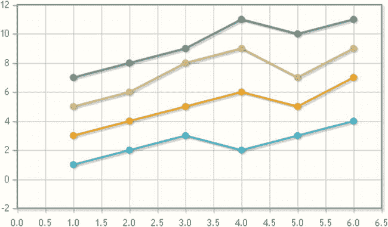

# 17.处理输入数据

Abstract

一旦您处理了图表的所有图形方面，就该更详细地分析输入数据了。在前面的章节中，您将输入数据的值赋给了数组。这些数组是在 jqPlot 代码所在的同一个 HTML 页面中定义的。你经常使用这两种方式:

一旦您处理了图表的所有图形方面，就该更详细地分析输入数据了。在前面的章节中，您将输入数据的值赋给了数组。这些数组是在 jqPlot 代码所在的同一个 HTML 页面中定义的。你经常使用这两种方式:

`var plot1 = $.jqplot ('chart1', [[100, 110, 140, 130, 80, 75, 120, 130, 100]]);`

和

`var data = [[100, 110, 140, 130, 80, 75, 120, 130, 100]];`

实际上，为了获得这样的数据，经常需要与其他技术进行交互，为此，您需要找到一种非常适合任何数据源的方法。由于需要使用一种通用的文本格式，这种格式可以被不同的脚本语言(尤其是 JavaScript)轻松处理，并且仍然能够被人类理解，因此人们开始使用 JavaScript 对象表示法(JSON)格式。您已经在第 1 章中简要地了解了这种格式，但是现在您将看到如何具体地使用它来处理来自外部来源的输入数据。

本章详细研究了 JSON 格式，首先说明了这种格式的数据结构，然后向您展示了如何在 jqPlot 库中使用它们。为此，您将看到两种不同的处理 JSON 数据的方法——第一种使用 jqPlot 插件，第二种使用专门解析 JSON 数据的 jQuery 函数。

无论来自外部源的数据是如何构建的，如果您想要对真实数据的管理和处理有一个完整的概述，您还需要考虑这些数据是如何生成的以及随之而来的采集模式。因此，在本章的最后一部分，您将专门使用 jqPlot 库开发一个实时图表。

事实上，不管输入数据的格式如何，很多时候数据源不仅是外部的，而且是连续的—输入数据由一系列数据组成，这些数据中的值一次产生一个，连续不断。因此，显示这种类型数据的图表不仅必须管理来自外部源的数据格式，还需要能够不断更新自身，从而确保数据表示(在这种情况下，是实时图表)总是更新的。

## 使用 JSON 格式

本节介绍 JSON 格式，包括用于库 jqPlot 的各种选项。首先，通过分析一些语法图，您将了解 JSON 格式的结构化数据是如何形成的。然后你将继续学习实际的例子。

### JSON 格式

JSON 是一种数据交换格式。由于它的树型结构，其中每个元素都被称为一个名称-值对，所以人类很容易读写它，机器也很容易解析和生成它。这是它越来越普遍使用的主要原因。

JSON 结构建立在两种不同结构的组合之上:数组和对象(见图 [17-1](#Fig1) )。在其中，您可以定义所有常用的经典原始值，甚至在其他语言中也是如此:数字、布尔值、字符串和空值。这允许包含在其中的值在各种编程语言之间交换。(在 [`www.json.org`](http://www.json.org/) ，您可以找到处理 JSON 格式的所有语言的列表，以及所有相关技术的列表，比如库、模块、插件等等。)

图 17-1。

Syntax diagrams for JSON

为了更好地理解图 [17-1](#Fig1) 中的语法图，你可以分析 JSON 格式是如何构造的。你必须考虑两件事。首先，对象和数组都包含一系列由图中的`value`标签标识的值。`value`指任意类型的值，比如字符串、数字、布尔值，甚至可以是对象、数组。

除此之外，你很容易猜到 JSON 结构是一个不同层次的树形结构。该树将数组或对象作为节点；树叶是其中包含的值。

考虑一些例子。如果您有一个只有一层的 JSON 结构，您将只有两种可能:

*   一组值
*   有值的对象

如果将该结构扩展到两个级别，则有四种可能性(为简单起见，假设该树是对称的):

*   数组的数组
*   一组对象
*   带有数组的对象
*   有对象的对象

诸如此类；案件逐渐变得更加复杂。

经典的 JSON 结构恰恰是你在本书中已经经常用到的 jqPlot 库`options`对象的结构。事实上，您已经看到，由于对象有一个与每个值相关联的字符串，这些树结构可以描述任何类型的元素。即使是非常复杂的元素，如图表，也可以很容易理解和操作。

### 一个实际案例:jqPlot 数据渲染器

将 JSON 作为一种交换格式，本节考虑外部数据源是文本文件的简单情况。在本例中，您将使用由 jqPlot 库:`json2`插件直接呈现的数据。这个插件允许您读取文件中包含的 JSON 格式的数据，以便将它们用作输入数据。对于您来说，唯一需要做的事情就是将外部源分配给`dataRenderer`属性。

首先实现一个空白的 HTML 页面，如清单 17-1 所示。

清单 17-1。ch17_01a.html

`<HTML>`

`<HEAD>`

`<TITLE>Chapter 17</TITLE>`

`<!--[if lt IE 9]>`

``

`<![endif]-->`

``

``

`<link rel="stylesheet" type="text/css" href="../src/jquery.jqplot.min.css" />`

``

`</HEAD>`

`<BODY>`

`

`

`</BODY>`

`</HTML>`

为了让数据呈现器解释数据，外部源必须返回有效的 jqPlot 数据数组。要用这个功能扩展图表，您需要包含`jqplot.json2`插件:

``

或者使用内容交付网络(CDN)服务:

``

`<![endif]-->`

``

``

`<link rel="stylesheet" type="text/css" href="../src/jquery.jqplot.min.css" />`

``

`</HEAD>`

`<BODY>`

`

`

`<button>Start Updates</button>`

`</BODY>`

`</HTML>`

插入清单 17-8，您现在捕获按钮的`click`事件，并将其链接到`doUpdate()`函数的执行。一旦按钮被按下，你就可以把它从网页上删除。

清单 17-8。ch17_03.html

`$(document).ready(function(){`

`...`

`var plot1 = $.jqplot ('myChart', [data],options);`

`$('button').click( function(){`

`doUpdate();`

`$(this).hide();`

`});`

`});`

因此，在清单 17-9 中，您实现了生成随机变量的函数。

清单 17-9。ch17_03.html

`$(document).ready(function(){`

`...`

`$('button').click( function(){`

`doUpdate();`

`$(this).hide();`

`});`

`function getRandomInt (min, max){`

`return Math.floor(Math.random() * (max - min + 1)) + min;`

`}`

`});`

此函数生成最小值和最大值之间的整数值(可以是负值)。这些值作为参数传递给函数。您在-3 和 3 之间设置了一个可能的变量，该变量将应用于最后获取的值。实时值存储在一个名为`data`的数组中，该数组作为一种缓冲区运行。该数组仅包含 20 个值，因此第一个(最大的)值将被删除，新获取的值将被插入数组的最后一个位置。正如你在图 [17-4](#Fig4) 中看到的，开始时你会看到一条振荡线，它延伸了图表的长度。然后线的右端将移动，跟随观察到的震级的趋势。

要获得动画，您需要刷新图表，因此每次更新您都需要销毁当前图表(`plot1`)，用新的数据数组替换数据数组，然后重新绘制整个`plot1`图表。最后，您需要调用`setTimeout()`函数，该函数将再次调用`doUpdate()`函数。如此，循环无休止地重复。您可以每秒(1，000 毫秒)更新图表，但在其他情况下，这些值将根据源数据进行选择。

继续将清单 17-10 添加到您的代码中。

清单 17-10。ch17_03.html

`$(document).ready(function(){`

`...`

`function getRandomInt (min, max) {`

`return Math.floor(Math.random() * (max - min + 1)) + min;`

`}`

`function doUpdate() {`

`var last = data[data.length-1];`

`if(data.length > 19){`

`data.shift();`

`}`

`var newlast = last + getRandomInt(-3, 3);`

`if(newlast < 0)`

`newlast = 0;`

`data.push(newlast);`

`if (plot1) {`

`plot1.destroy();`

`}`

`plot1.series[0].data = data;`

`plot1.replot( {resetAxes: true} );`

`plot1 = $.jqplot ('myChart', [data], options);`

`setTimeout(doUpdate, 1000)`

`}`

`});`

图 [17-6](#Fig6) 展示了实时图表如何显示围绕 50%值变化的数据流。

图 17-6。

A real-time line chart representing values moment by moment

## 摘要

在这一章中，你已经看到了输入数据通常来自外部资源，以及如何处理它们。通过一种特殊的方式，您已经看到了如何将 JSON 格式的外部数据用作用 jqPlot 库开发的图表的输入数据数组。关于实时生成的数据的管理，您已经看到了一个简单而有效的示例，其中您实现了一个实时折线图，该折线图随着所获取的数据的变化而更新。

在下一章，你将认识另一个图书馆。在许多方面，它与 jqPlot 非常相似，它被称为 Highcharts。通过许多例子，您将看到这个商业库如何保持 jqPlot 的许多基本特性，而且还极大地扩展了您的可能性并为您的图表添加了更多特性。您很快就会看到，Highcharts 库提供了比您目前所看到的更多的功能。