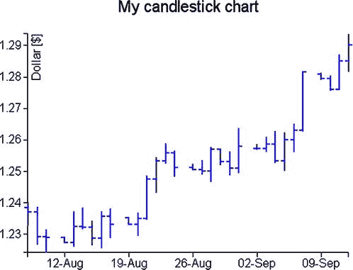

# 二十三、D3 蜡烛图

Abstract

在这简短但重要的一章中，你会看到蜡烛图。这种类型的图表是基于一种特殊的数据格式(OHLC，或开盘-盘高-盘低-收盘)，你已经在介绍 jqPlot 库时处理过了(见第 12 章)。使用 jqPlot，您有一个特殊的插件来以适当的方式处理和表示这样的数据；相反，用 D3 你必须一个接一个地构建所有的图形元素，最重要的是你需要实现一个解析器从外部文件读取 OHLC 数据。此外，您需要解决的另一个重要方面是如何处理日期和时间数据。

在这简短但重要的一章中，你会看到蜡烛图。这种类型的图表是基于一种特殊的数据格式(OHLC，或开盘-盘高-盘低-收盘)，你已经在 jqPlot 库介绍时处理过了(见[第 12 章](12.html))。使用 jqPlot，您有一个特殊的插件来以适当的方式处理和表示这样的数据；相反，用 D3 你必须一个接一个地构建所有的图形元素，最重要的是你需要实现一个解析器从外部文件读取 OHLC 数据。此外，您需要解决的另一个重要方面是如何处理日期和时间数据。

虽然这听起来很复杂，但在这一章中，你会发现 D3 库是如何为你提供工具，让事情变得简单而直接。

您将首先从构建一个简单的 OHLC 图表开始，以便特别关注 OHLC 数据的读取。然后您将详细了解 D3 如何处理日期和时间数据，最后您将仅使用标量矢量图形(SVG)元素(如线条)来表示 OHLC 图表。

在最后一部分，你将通过一些修改把你的 OHLC 图表转换成一个更完整的烛台图表。

## 创建 OHLC 图表

因为 D3 能够从小的图形组件构建新的图形结构，所以您还可以创建像用 jqPlot 生成的那些蜡烛图。您已经看到蜡烛图需要定义良好的数据结构:由日期和四个 OHLC 值组成的数据时间轴。您将清单 23-1 中的数据复制到一个文件中，并保存为`data_08.csv`。

清单 23-1。data_08.csv

`date,open,min,max,close,`

`08/08/2012,1.238485,1.2327,1.240245,1.2372,`

`08/09/2012,1.23721,1.22671,1.23873,1.229295,`

`08/10/2012,1.2293,1.22417,1.23168,1.228975,`

`08/12/2012,1.229075,1.22747,1.22921,1.22747,`

`08/13/2012,1.227505,1.22608,1.23737,1.23262,`

`08/14/2012,1.23262,1.23167,1.238555,1.232385,`

`08/15/2012,1.232385,1.22641,1.234355,1.228865,`

`08/16/2012,1.22887,1.225625,1.237305,1.23573,`

`08/17/2012,1.23574,1.22891,1.23824,1.2333,`

`08/19/2012,1.23522,1.23291,1.235275,1.23323,`

`08/20/2012,1.233215,1.22954,1.236885,1.2351,`

`08/21/2012,1.23513,1.23465,1.248785,1.247655,`

`08/22/2012,1.247655,1.24315,1.254415,1.25338,`

`08/23/2012,1.25339,1.252465,1.258965,1.255995,`

`08/24/2012,1.255995,1.248175,1.256665,1.2512,`

`08/26/2012,1.25133,1.25042,1.252415,1.25054,`

`08/27/2012,1.25058,1.249025,1.25356,1.25012,`

`08/28/2012,1.250115,1.24656,1.257695,1.2571,`

`08/29/2012,1.25709,1.251895,1.25736,1.253065,`

`08/30/2012,1.253075,1.248785,1.25639,1.25097,`

`08/31/2012,1.25096,1.249375,1.263785,1.25795,`

`09/02/2012,1.257195,1.256845,1.258705,1.257355,`

`09/03/2012,1.25734,1.25604,1.261095,1.258635,`

`09/04/2012,1.25865,1.25264,1.262795,1.25339,`

`09/05/2012,1.2534,1.250195,1.26245,1.26005,`

`09/06/2012,1.26006,1.256165,1.26513,1.26309,`

`09/07/2012,1.26309,1.262655,1.281765,1.281625,`

`09/09/2012,1.28096,1.27915,1.281295,1.279565,`

`09/10/2012,1.27957,1.27552,1.28036,1.27617,`

`09/11/2012,1.27617,1.2759,1.28712,1.28515,`

`09/12/2012,1.28516,1.281625,1.29368,1.290235,`

现在这几乎已经成为一种习惯，你从编写几乎所有图表通用的代码开始，不需要更多的解释(见清单 23-2)。

清单 23-2。ch23_01.html

`<!DOCTYPE html>`

`<html>`

`<head>`

`<meta charset="utf-8">`

``

`</body>`

`</html>`

因为在文件的第一列有日期类型的值，你需要定义一个解析器来设置它们的格式(见清单 23-3)。

清单 23-3。ch23_01.html

`...`

`w = 500 - margin.left - margin.right,`

`h = 400 - margin.top - margin.bottom;`

`var parseDate = d3.time.format("%m/%d/%Y").parse;`

`...`

烛台图表是一种通常是时间性的数据表示，即，四个 OHLC 数据与单个时间单位相关，并且它们随时间的变化沿着 x 轴是可见的。因此，您将有一个 x 轴，您必须在其上处理时间值，而在 y 轴上，您将分配一个线性刻度。在定义 x 轴时，你要确保报告的日期只显示日和月，这将由前三个字符表示(见清单 23-4)。

清单 23-4。ch23_01.html

`var parseDate = d3.time.format("%m/%d/%Y").parse;`

`var x = d3.time.scale()`

`.range([0, w]);`

`var y = d3.scale.linear()`

`.range([h, 0]);`

`var xAxis = d3.svg.axis()`

`.scale(x)`

`.orient("bottom")`

`.tickFormat(d3.time.format("%d-%b"))`

`.ticks(5);`

`var yAxis = d3.svg.axis()`

`.scale(y)`

`.orient("left");`

`...`

现在观察数据文件中的内容(清单 23-1)，你可以看到五列数据，其中最后四列是数字。第一列包含必须提交给解析器的日期，而其他四列被解释为数值。此外，您需要找出所有 OHLC 数据中的最大值和最小值。在迭代函数`forEach()`中管理所有这些方面，如清单 23-5 所示。

清单 23-5。ch23_01.html

`...`

`var svg = d3.select("body").append("svg")`

`.attr("width", w + margin.left + margin.right)`

`.attr("height", h + margin.top + margin.bottom)`

`.append("g")`

`.attr("transform", "translate(" +margin.left+ "," +margin.top+ ")");`

`d3.csv("data_08.csv", function(error, data) {`

`var maxVal = -1000;`

`var minVal = 1000;`

`data.forEach(function(d) {`

`d.date = parseDate(d.date);`

`d.open = +d.open;`

`d.close = +d.close;`

`d.max = +d.max;`

`d.min = +d.min;`

`if (d.max > maxVal)`

`maxVal = d.max;`

`if (d.min < minVal)`

`minVal = d.min;`

`});`

`});`

`...`

接下来，在清单 23-6 中，创建 x 和 y 的域。在 x 轴上，域将处理日期，y 域将有一个扩展，它将覆盖刚刚找到的最小值和最大值之间的所有值(`minVal`和`maxVal`)。

清单 23-6。ch23_01.html

`d3.csv("data_08.csv", function(error, data) {`

`data.forEach(function(d) {`

`...`

`});`

`x.domain(d3.extent(data, function(d) { return d.date; }));`

`y.domain([minVal,maxVal]);`

`});`

一旦定义好了域，你就可以用 SVG 元素和它们的标签画出 x 和 y 两个轴，如清单 23-7 所示。

清单 23-7。ch23_01.html

`d3.csv("data_08.csv", function(error, data) {`

`...`

`y.domain([minVal,maxVal]);`

`svg.append("g")`

`.attr("class", "x axis")`

`.attr("transform", "translate(0," + h + ")")`

`.call(xAxis)`

`svg.append("text")`

`.attr("class", "label")`

`.attr("x", w)`

`.attr("y", -6)`

`.style("text-anchor", "end");`

`svg.append("g")`

`.attr("class", "y axis")`

`.call(yAxis);`

`svg.append("text")`

`.attr("class", "label")`

`.attr("transform", "rotate(-90)")`

`.attr("y", 6)`

`.attr("dy", ".71em")`

`.style("text-anchor", "end")`

`.text("Dollar [$]");`

`});`

使用 SVG 元素`<line>`在 OHLC 图上绘制数据(见清单 23-8)。`ext`线是定义高值和低值之间范围的垂直线。`close`和`open`线是两条水平线，分别对应于打开和关闭值。

清单 23-8。ch23_01.html

`d3.csv("data_08.csv", function(error, data) {`

`...`

`svg.append("text")`

`.attr("class", "label")`

`.attr("transform", "rotate(-90)")`

`.attr("y", 6)`

`.attr("dy", ".71em")`

`.style("text-anchor", "end")`

`.text("Dollar [$]")`

`svg.selectAll("line.ext")`

`.data(data)`

`.enter().append("svg:line")`

`.attr("class", "ext")`

`.attr("x1", function(d) { return x(d.date)})`

`.attr("x2", function(d) { return x(d.date)})`

`.attr("y1", function(d) { return y(d.min);})`

`.attr("y2", function(d) { return y(d.max); });`

`svg.selectAll("line.close")`

`.data(data)`

`.enter().append("svg:line")`

`.attr("class", "close")`

`.attr("x1", function(d) { return x(d.date)+5})`

`.attr("x2", function(d) { return x(d.date)-1})`

`.attr("y1", function(d) { return y(d.close);})`

`.attr("y2", function(d) { return y(d.close); });`

`svg.selectAll("line.open")`

`.data(data)`

`.enter().append("svg:line")`

`.attr("class", "open")`

`.attr("x1", function(d) { return x(d.date)+1})`

`.attr("x2", function(d) { return x(d.date)-5})`

`.attr("y1", function(d) { return y(d.open);})`

`.attr("y2", function(d) { return y(d.open); });`

`});`

感谢您定义新生成元素的类的方式，您可以通过使用`line`类，或者使用`line.open`、`line.close`和`line.ext`类分别定义它们，为所有三行定义 CSS 样式的属性(参见清单 23-9)。

清单 23-9。ch23_01.html

``

最后你得到的是图 [23-1](#Fig1) 所示的烛台图，和用 jqPlot 得到的那些没什么好羡慕的。

图 23-1。

An OHLC chart

## 日期格式

在处理这类利用 OHLC 数据的图表时，您总是要处理 x 轴上的时间和日期值。因此，根据这个观察，分析 D3 库如何处理这种类型的数据。

如果在前面的示例中没有用零填充日期和月份，或者报告的年份只有两位数(例如，“8/9/12”)，会发生什么情况？在`d3.csv()`函数中，D3 无法读取这种格式的日期，因此，烛台图表就不会出现。实际上，您需要做的事情非常简单，即猜测要插入解析器的格式化程序的正确序列。对于格式化程序，我们指的是前面带有“%”符号的一组字符，它根据特定的(区分大小写)字符来表示以某种方式书写的时间单位。

`var parseDate = d3.time.format("%m/%e/%y").parse;`

甚至字面上表示的日期也可以用同样的方式处理。您已经见过这种日期格式:

`08-Aug-12,1.238485,1.2327,1.240245,1.2372,`

它可以用这个解析器来处理:

`var parseDate = d3.time.format("%d-%b-%y").parse;`

但是还有更复杂的情况，例如:

`Monday 16 April 2012,1.238485,1.2327,1.240245,1.2372,`

它可以用这个解析器来处理:

`var parseDate = d3.time.format("%A %e %B %Y").parse;`

不同值之间的所有分隔字符(包括空格)应该在解析器中的相同位置报告。因此，如果日期是这样定义的。。。

`'8 Aug-12',1.238485,1.2327,1.240245,1.2372,`

您必须在定义解析器的字符串中插入空格和引号，否则日期将无法识别。

`var parseDate = d3.time.format("'%d %b-%y'").parse;`

您还必须记住，csv 文件中唯一不能添加的分隔字符是“，”。如果您必须插入它，您必须使用 TSV(制表符分隔值)文件。

表 [23-1](#Tab1) 包括所有可用的格式化程序。它们的组合应该覆盖任何输入大小。

表 23-1。

D3 Date and Time Formatters

<colgroup><col> <col></colgroup> 
| 格式程序 | 描述 |
| --- | --- |
| %a | 缩写的工作日名称 |
| %A | 完整的工作日名称 |
| %b | 缩写月份名 |
| %B | 完整的月份名称 |
| %c | 日期和时间，格式为“%a %b %e %H:%M:%S %Y” |
| %d | 以十进制数字[01，31]形式用零填充的一个月中的某一天 |
| %e | 以十进制数字[ 1，31]表示的一个月中的第几天 |
| %H | 以十进制数[00，23]表示的小时(24 小时制) |
| %I | 以十进制数[01，12]表示的小时(12 小时制) |
| %j | 以十进制数表示的一年中的某一天[001，366] |
| %m | 十进制数字形式的月份[01，12] |
| %M | 十进制数形式的分钟[00，59] |
| %p | 上午或下午 |
| %S | 十进制数形式的秒[00，61] |
| %U | 以十进制数[00，53]表示的一年中的周数(星期日是一周的第一天) |
| %w | 以十进制数表示的工作日[0(星期日)，6] |
| %W | 以十进制数[00，53]表示的一年中的周数(星期一是一周的第一天) |
| %x | 日期，作为“%m/%d/%y” |
| %X | 时间，作为“%H:%M:%S” |
| %y | 没有世纪作为十进制数的年份[00，99] |
| %Y | 以世纪为小数的年份 |
| %Z | 时区偏移量，例如“-0700” |
| %% | 文字“%”字符 |

## 蜡烛图中的方框表示

使用 jqPlot，您还看到了显示 OHLC 数据的其他方法。例如，这种数据通常由一条垂直线和一个覆盖它一定长度的垂直方框来表示。垂直线与前面的烛台相同，它位于 OHLC 的高值和低值之间。相反，该框表示开盘价和收盘价之间的范围。此外，如果开盘价大于收盘价，盒子将是给定的颜色，但如果相反，将是另一种颜色。

您使用了包含在`data_08.csv`文件中的相同数据，并且从上一个示例中的代码开始，您将看到将要进行的更改。

用这三条新的线替换`ext`、`open`和`close`:`ext`、`ext1`和`ext2`(见清单 23-10)。然后你必须添加代表盒子的矩形。线应该是黑色的，而当开盘价大于收盘价时，方框应该是红色的，否则，在相反的情况下，方框将是绿色的。

清单 23-10。ch23_02.html

`svg.selectAll("line.ext")`

`.data(data)`

`.enter().append("svg:line")`

`.attr("class", "ext")`

`.attr("x1", function(d) { return x(d.date)})`

`.attr("x2", function(d) { return x(d.date)})`

`.attr("y1", function(d) { return y(d.min);})`

`.attr("y2", function(d) { return y(d.max);});`

`svg.selectAll("line.ext1")`

`.data(data)`

`.enter().append("svg:line")`

`.attr("class", "ext")`

`.attr("x1", function(d) { return x(d.date)+3})`

`.attr("x2", function(d) { return x(d.date)-3})`

`.attr("y1", function(d) { return y(d.min);})`

`.attr("y2", function(d) { return y(d.min); });`

`svg.selectAll("line.ext2")`

`.data(data)`

`.enter().append("svg:line")`

`.attr("class", "ext")`

`.attr("x1", function(d) { return x(d.date)+3})`

`.attr("x2", function(d) { return x(d.date)-3})`

`.attr("y1", function(d) { return y(d.max);})`

`.attr("y2", function(d) { return y(d.max); });`

`svg.selectAll("rect")`

`.data(data)`

`.enter().append("svg:rect")`

`.attr("x", function(d) { return x(d.date)-3; })`

`.attr("y", function(d) { return y(Math.max(d.open, d.close));})`

`.attr("height", function(d) {`

`return y(Math.min(d.open, d.close))-y(Math.max(d.open, d.close));})`

`.attr("width",6)`

`.attr("fill",function(d) {`

`return d.open > d.close ? "darkred" : "darkgreen" ;});`

`});`

最后一件事是在清单 23-11 中设置 CSS 样式类。

清单 23-11。ch23_02.html

``

而图 [23-2](#Fig2) 中的图表就是结果。

图 23-2。

A candlestick chart

## 摘要

在本章中，您已经看到了在 jqPlot 库的第一部分中已经讨论过的烛台图表的类型，但是这次您使用了 D3。您已经看到了如何轻松获得类似的结果，同时保持对每个图形元素的完全控制。此外，由于这种图表使用时间数据，这里您已经深入研究了 D3 库如何管理这种类型的数据以及管理格式的各种方法。

继续关注 jqPlot 库和 D3 库在实现各种类型的图表方面的并行性，在下一章你将学习散点图和气泡图，以及如何用 D3 库实现它们。