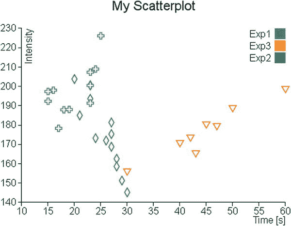
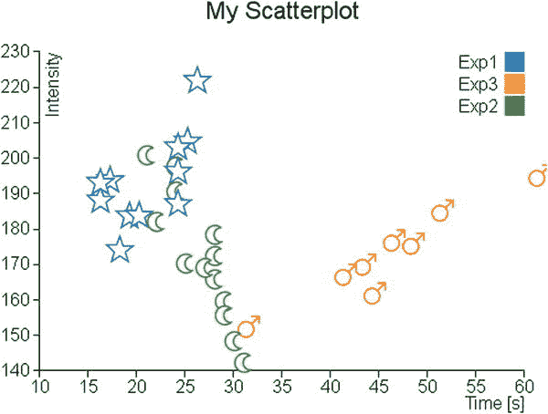
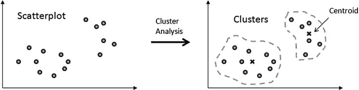
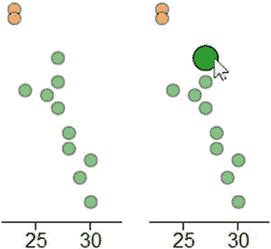
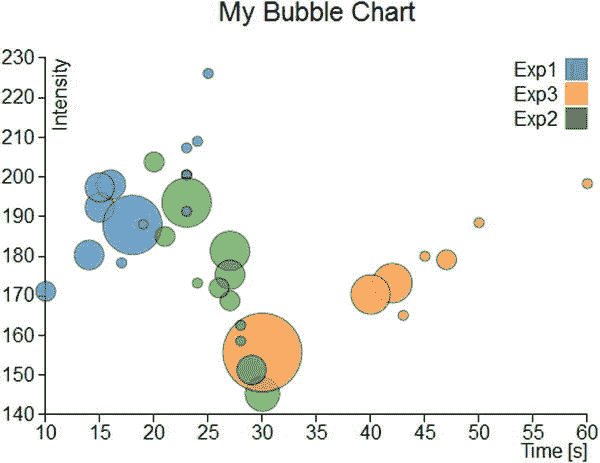

# 二十四、D3 散点图和气泡图

Abstract

在本章中，您将了解散点图。每当您有一组数据对[x，y]并且想要分析它们在 xy 平面上的分布时，您都会参考这种类型的图表。因此，您将首先看到如何使用 D3 库制作这种类型的图表。在第一个示例中，您将开始读取包含多个数据系列的 TSV(制表符分隔值)文件，通过它们，您将看到如何实现散点图。

在本章中，您将了解散点图。每当您有一组数据对[x，y]并且想要分析它们在 xy 平面上的分布时，您都会参考这种类型的图表。因此，您将首先看到如何使用 D3 库制作这种类型的图表。在第一个示例中，您将开始读取包含多个数据系列的 TSV(制表符分隔值)文件，通过它们，您将看到如何实现散点图。

完成散点图后，您将看到如何使用具有特定形状的标记来表示数据点，无论是从预定义的集合中选择还是通过创建原始标记。

这类图表非常重要。它是分析数据分布的基本工具；事实上，从这些图表中，您可以找到特定的趋势(趋势线)和分组(聚类)。在这一章中，两个简单的例子将向你展示如何表示趋势线和聚类。

此外，您将看到如何通过事件处理将突出显示功能添加到图表中，以及 D3 库如何管理它。

最后，本章将以最后一个例子结束，在这个例子中，你需要用三个参数[x，y，z]来表示数据。因此，适当地修改散点图，你会发现你可以得到一个气泡图，这是一个散点图修改，以能够代表一个额外的参数。

## 散点图

由于有了 D3 库，您可以生成的图形表示没有限制，可以像组合砖块一样组合图形元素。散点图的创建也不例外。

你开始收集数据(见清单 24-1)，这一次是以表格的形式(因此是一个 TSV 文件)，你将复制并保存为一个名为`data_09.tsv`的文件。(参见以下注释。)

Note

注意，TSV 文件中的值是用制表符分隔的，所以当你编写或复制清单 24-1 时，记得检查每个值之间只有一个制表符。

清单 24-1。data_09.tsv

`time    intensity    group`

`10    171.11    Exp1`

`14    180.31    Exp1`

`17    178.32    Exp1`

`42    173.22    Exp3`

`30    145.22    Exp2`

`30    155.68    Exp3`

`23    200.56    Exp2`

`15    192.33    Exp1`

`24    173.22    Exp2`

`20    203.78    Exp2`

`18    187.88    Exp1`

`45    180.00    Exp3`

`27    181.33    Exp2`

`16    198.03    Exp1`

`47    179.11    Exp3`

`27    175.33    Exp2`

`28    162.55    Exp2`

`24    208.97    Exp1`

`23    200.47    Exp1`

`43    165.08    Exp3`

`27    168.77    Exp2`

`23    193.55    Exp2`

`19    188.04    Exp1`

`40    170.36    Exp3`

`21    184.98    Exp2`

`15    197.33    Exp1`

`50    188.45    Exp3`

`23    207.33    Exp1`

`28    158.60    Exp2`

`29    151.31    Exp2`

`26    172.01    Exp2`

`23    191.33    Exp1`

`25    226.11    Exp1`

`60    198.33    Exp3`

假设文件中包含的数据属于三个不同的实验(标记为 Exp1、Exp2 和 Exp3)，每个实验应用于一个不同的对象(例如，三种发光物质)，您希望在其中测量它们的发射强度如何随时间变化。读数在不同的时间重复进行。您的目标是在 xy 平面上表示这些值，以便分析它们的分布和最终属性。

观察数据，您可以看到它们由三列组成:时间、强度和组成员。这是一种典型的数据结构，可以以散点图的形式显示。您将把时间刻度放在 x 轴上，把强度值放在 y 轴上，最后通过标记的形状或颜色来识别组，这些标记将标记散点图中点的位置。

按照惯例，您可以从编写清单 24-2 中的代码开始。这段代码代表您的起始代码，因为它对于您在前面的示例中看到的几乎所有图表都是通用的，所以不需要进一步解释。

清单 24-2。ch24_01.html

`<!DOCTYPE html>`

`<html>`

`<head>`

`<meta charset="utf-8">`

``

`</body>`

`</html>`

在清单 24-3 中，你用`d3.tsv()`函数从 TSV 文件中读取列表数据，确保数字值被读取。在这里，即使在第一列有时间，也不需要解析，因为它们是秒，因此可以被认为是线性的。

清单 24-3。ch24_01.html

`...`

`var svg = d3.select("body").append("svg")`

`.attr("width", w + margin.left + margin.right)`

`.attr("height", h + margin.top + margin.bottom)`

`.append("g")`

`.attr("transform", "translate(" + margin.left+ "," +margin.top+ ")");`

`d3.tsv("data_09.tsv", function(error, data) {`

`data.forEach(function(d) {`

`d.time = +d.time;`

`d.intensity = +d.intensity;`

`});`

`});`

`var title = d3.select("svg").append("g")`

`.attr("transform", "translate(" + margin.left+ "," +margin.top+ ")")`

`.attr("class","title");`

`...`

同样关于域，分配非常简单，如清单 24-4 所示。此外，您将使用`nice()`函数，该函数对域的值进行舍入。

清单 24-4。ch24_01.html

`d3.tsv("data_09.tsv", function(error, data) {`

`data.forEach(function(d) {`

`d.time = +d.time;`

`d.intensity = +d.intensity;`

`});`

`x.domain(d3.extent(data, function(d) { return d.time; })).nice();`

`y.domain(d3.extent(data, function(d) { return d.intensity; })).nice();`

`});`

您还添加了轴标签，在 x 轴上显示“时间”，在 y 轴上显示“强度”，如清单 24-5 所示。

清单 24-5。ch24_01.html

`d3.tsv("data_09.tsv", function(error, data) {`

`...`

`x.domain(d3.extent(data, function(d) { return d.time; })).nice();`

`y.domain(d3.extent(data, function(d) { return d.intensity; })).nice();`

`svg.append("g")`

`.attr("class", "x axis")`

`.attr("transform", "translate(0," + h + ")")`

`.call(xAxis);`

`svg.append("text")`

`.attr("class", "label")`

`.attr("x", w)`

`.attr("y", h + margin.bottom - 5)`

`.style("text-anchor", "end")`

`.text("Time [s]");`

`svg.append("g")`

`.attr("class", "y axis")`

`.call(yAxis);`

`svg.append("text")`

`.attr("class", "label")`

`.attr("transform", "rotate(–90)")`

`.attr("y", 6)`

`.attr("dy", ".71em")`

`.style("text-anchor", "end")`

`.text("Intensity");`

`});`

最后，你必须直接在图上画出标记。这些可以用 SVG 元素`<circle>`来表示。因此，散点图上显示的数据点将是半径为 3.5 像素的小点(见清单 24-6)。为了定义不同组的表示，标记以不同的颜色绘制。

清单 24-6。ch24_01.html

`d3.tsv("data_09.tsv", function(error, data) {`

`...`

`svg.append("text")`

`.attr("class", "label")`

`.attr("transform", "rotate(-90)")`

`.attr("y", 6)`

`.attr("dy", ".71em")`

`.style("text-anchor", "end")`

`.text("Intensity");`

`svg.selectAll(".dot")`

`.data(data)`

`.enter().append("circle")`

`.attr("class", "dot")`

`.attr("r", 3.5)`

`.attr("cx", function(d) { return x(d.time); })`

`.attr("cy", function(d) { return y(d.intensity); })`

`.style("fill", function(d) { return color(d.group); });`

`});`

现在你在散点图上有这么多彩色标记，但是没有参考它们的颜色和它们所属的组。因此，有必要添加一个图例，显示与不同颜色相关的各个组的名称(见清单 24-7)。

清单 24-7。ch24_01.html

`d3.tsv("data_09.tsv", function(error, data) {`

`...`

`svg.selectAll(".dot")`

`.data(data)`

`.enter().append("circle")`

`.attr("class", "dot")`

`.attr("r", 3.5)`

`.attr("cx", function(d) { return x(d.time); })`

`.attr("cy", function(d) { return y(d.intensity); })`

`.style("fill", function(d) { return color(d.group); });`

`var legend = svg.selectAll(".legend")`

`.data(color.domain())`

`.enter().append("g")`

`.attr("class", "legend")`

`.attr("transform", function(d, i) {`

`return "translate(0," + (i * 20) + ")"; });`

`legend.append("rect")`

`.attr("x", w - 18)`

`.attr("width", 18)`

`.attr("height", 18)`

`.style("fill", color);`

`legend.append("text")`

`.attr("x", w - 24)`

`.attr("y", 9)`

`.attr("dy", ".35em")`

`.style("text-anchor", "end")`

`.text(function(d) { return d; });`

`});`

所有工作完成后，你得到如图 [24-1](#Fig1) 所示的散点图。

图 24-1。

A scatterplot showing the data distribution

## 标记和符号

当您想要表示散点图时，不可低估的一个方面是您想要用来表示数据点的标记的形状。毫不奇怪，D3 库为您提供了许多通过符号管理标记表示的方法。在本章中，您将了解这个主题，因为它非常适合这种图表(散点图)，但不会改变它对其他类型图表(如折线图)的应用。

### 使用符号作为标记

D3 库提供了一组可以直接用作标记的符号。在表 [24-1](#Tab1) 中，你可以看到一个报告各种预定义符号的列表。

表 24-1。

Predefined Symbols in D3 Library

<colgroup><col> <col></colgroup> 
| 标志 | 描述 |
| --- | --- |
| 圆 | 一个圆圈 |
| 十字架 | 希腊十字(或加号) |
| 钻石 | 菱形 |
| 平方 | 轴对齐的正方形 |
| 三角形向下 | 向下的等边三角形 |
| 三角形向上 | 向上的等边三角形 |

继续前面的示例，您将散点图中的点替换为用作标记的不同符号。这些符号将根据数据成员的系列(`Exp1`、`Exp2,`或`Exp3`)而变化。因此，这一次，要描述数据所属的系列，就需要标记的颜色和形状。

首先，你需要在`groupMarker`对象中给每个序列分配一个符号，如清单 24-8 所示。

清单 24-8。ch24_01b.html

`var margin = {top: 70, right: 20, bottom: 40, left: 40},`

`w = 500 - margin.left - margin.right,`

`h = 400 - margin.top - margin.bottom;`

`var groupMarker = {`

`Exp1: "cross",`

`Exp2: "diamond",`

`Exp3: "triangle-down"`

`};`

`var color = d3.scale.category10();`

然后，从代码中删除与点的表示有关的行(见清单 24-9)。这些行将被生成标记的其他行所替换(见清单 24-10)。

清单 24-9。ch24_01b.html

`svg.selectAll(".dot")`

`.data(data)`

`.enter().append("circle")`

`.attr("class", "dot")`

`.attr("r", 3.5)`

`.attr("cx", function(d) { return x(d.time); })`

`.attr("cy", function(d) { return y(d.intensity); })`

`.style("fill", function(d) { return color(d.group); });`

实际上，您将要生成的符号只不过是预定义的 SVG 路径。你可以从清单 24-10 中通过使用`append("path")`函数来添加符号的事实中猜到这一点。相反，关于符号的生成，D3 库提供了一个特定的函数:`d3.svg.symbol()`。要显示的符号作为参数通过`type()`函数传递，例如，如果您想使用符号交叉使用`type("cross")`。

然而，在这种情况下，要表示的符号是三个，并且它们取决于每个点的级数。因此，您必须通过应用于`groupMarker,`的函数`(d)`对所有数据进行迭代，这将返回对应于“十字形”、“菱形”和“向下三角形”符号的字符串。

最后，由 SVG 路径构成的符号也可以通过调整级联样式表(CSS)样式来更改。在本例中，您可以通过将`fill`属性设置为`white`来选择仅表示符号的轮廓。

清单 24-10。ch24_01b.html

`d3.tsv("data_09.tsv", function(error, data) {`

`...`

`svg.append("text")`

`.attr("class", "label")`

`.attr("transform", "rotate(-90)")`

`.attr("y", 6)`

`.attr("dy", ".71em")`

`.style("text-anchor", "end")`

`.text("Intensity");`

`svg.selectAll("path")`

`.data(data)`

`.enter().append("path")`

`.` `attr("transform", function(d) {`

`return "translate(" + x(d.time) + "," + y(d.intensity) + ")";`

`})`

`.attr("d", d3.svg.symbol().type( function(d) {`

`return groupMarker[d.group];`

`}))`

`.style("fill", "white")`

`.style("stroke", function(d) { return color(d.group); })`

`.style("stroke-width", "1.5px");`

`var legend = svg.selectAll(".legend")`

`...`

`});`

图 [24-2](#Fig2) 显示了用各种符号代替点的散点图。

图 24-2。

In a scatterplot, the series could be represented by different symbols

### 使用定制标记

您已经看到 D3 库的标记只不过是 SVG 路径。您可以利用这一优势，通过创建其他符号来定制您的图表，这些符号将被添加到已定义的符号中。

在互联网上，你可以找到大量的 SVG 符号；一旦你决定了使用什么样的符号，你就可以得到它的路径，以便把它添加到你的网页中。更有事业心的读者也可以决定用 SVG 编辑器编辑 SVG 符号。建议你使用 Inkscape 编辑器(见图[24-3](#Fig3))；可以从其官方网站: [`http://inkscape.org`](http://inkscape.org/) 下载。或者，更简单地说，您可以从一个已经设计好的 SVG 符号开始，然后根据您的喜好对其进行修改。为此，我推荐使用 SVG Tryit 页面的这个链接: [`www.w3schools.com/svg/tryit.asp?filename=trysvg_path`](http://www.w3schools.com/svg/tryit.asp?filename=trysvg_path) (见图 [24-4](#Fig4) )。

图 24-4。

Tryit is a useful tool to preview SVG symbols in real time inserting the path

图 24-3。

Inkscape: a good SVG editor for generating symbols

因此，选择三个新符号(如新月、星星和火星符号)来替换默认符号。你提取它们的路径，然后插入到一个新对象的定义中，你称之为`markers,`，如清单 24-11 所示。

清单 24-11。ch24_01c.html

`var margin = {top: 70, right: 20, bottom: 40, left: 40},`

`w = 500 - margin.left - margin.right,`

`h = 400 - margin.top - margin.bottom;`

`var markers = {`

`mars: "m15,7 a 7,7 0 1,0 2,2 z l 1,1 7-7m-7,0 h 7 v 7",`

`moon: "m15,3 a 8.5,8.5 0 1,0 0,13 a 6.5,6.5 0 0,1 0,-13",`

`star: "m11,1 3,9h9l-7,5.5 2.5,8.5-7.5-5-7.5,5 2.5-8.5-7-6.5h9z"`

`};`

`var groupMarker = {`

`...`

现在你必须更新在`groupMarker`变量中定义的符号和组之间的关联，如清单 24-12 所示。

清单 24-12。ch24_01c.html

`var groupMarker = {`

`Exp1: markers.star,`

`Exp2: markers.moon,`

`Exp3: markers.mars`

`};`

当你创建 SVG 元素时，你可以做的最后一件事是改变路径的定义(见清单 24-13)。

清单 24-13。ch24_01c.html

`svg.selectAll("path")`

`.data(data)`

`.enter().append("path")`

`.attr("transform", function(d) {`

`return "translate(" + x(d.time) + "," + y(d.intensity) + ")";`

`})`

`.attr("d", function(d) { return groupMarker[d.group]; })`

`.style("fill", "white")`

`.style("stroke", function(d) { return color(d.group); })`

`.style("stroke-width", "1.5px");`

最后，你会得到一个散点图，报告你自己创造的或从网上下载的符号(见图 [24-5](#Fig5) )。

图 24-5。

A scatterplot with a customized set of markers

## 添加更多功能

既然您已经学习了如何使用散点图来表示数据的分布，那么是时候介绍趋势线和聚类了。通常，详细分析数据分布中的一些点集，您可以看到它们遵循特定的趋势或倾向于聚集成簇。因此，用图形突出这一点将非常有用。在本节中，您将看到如何计算和表示线性趋势线的第一个示例。然后，您将看到第二个示例，该示例说明了如何突出显示 xy 平面中的一些集群的可能性。

### 趋势线

至于 jqPlot 库，其中有一个插件可以直接给出趋势线，而 D3 库不仅需要实现图形，还需要实现计算。

为简单起见，您将按照线性趋势计算一组点(一个序列)的趋势线。为此，您使用最小二乘法。这种方法确保在给定一组数据的情况下，尽可能通过最小化误差(误差的平方和)找到最符合点趋势的直线。

Note

要了解更多信息，我建议你访问 Wolfram MathWorld 的文章，网址为 [`http://mathworld.wolfram.com/LeastSquaresFitting.html`](http://mathworld.wolfram.com/LeastSquaresFitting.html) 。

对于本例，您将继续使用散点图的代码，但不包括插入符号后所做的所有更改。为了避免不必要的错误和更多的重复，清单 24-14 显示了你需要用来作为这个例子的起点的代码。

清单 24-14。ch24_02.html

`<!DOCTYPE html>`

`<html>`

`<head>`

`<meta charset="utf-8">`

``

`</body></html>`

首先，在`tsv()`函数中定义所有用于最小二乘法的变量，如清单 24-15 所示。对于每个变量，您定义一个大小为 3 的数组，因为在您的图表中要表示三个系列。

清单 24-15。ch24_02.html

`d3.tsv("data_09.tsv", function(error, data) {`

`sumx = [0,0,0];`

`sumy = [0,0,0];`

`sumxy = [0,0,0];`

`sumx2 = [0,0,0];`

`n = [0,0,0];`

`a = [0,0,0];`

`b = [0,0,0];`

`y1 = [0,0,0];`

`y2 = [0,0,0];`

`x1 = [9999,9999,9999];`

`x2 = [0,0,0];`

`colors = ["","",""];`

`data.forEach(function(d) {`

`...`

`});`

现在你利用在数据解析过程中执行的数据迭代，同时计算最小二乘法所需的所有求和(见清单 24-16)。此外，直线的表示便于确定每个系列中的最大和最小 x 值。

清单 24-16。ch24_02.html

`d3.tsv("data_09.tsv", function(error, data) {`

`...`

`data.forEach(function(d) {`

`d.time = +d.time;`

`d.intensity = +d.intensity;`

`for(var i = 0; i < 3; i=i+1)`

`{`

`if(d.group == "Exp"+(i+1)){`

`colors[i] = color(d.group);`

`sumx[i] = sumx[i] + d.time;`

`sumy[i] = sumy[i] + d.intensity;`

`sumxy[i] = sumxy[i] + (d.time * d.intensity);`

`sumx2[i] = sumx2[i] + (d.time * d.time);`

`n[i] = n[i] +1;`

`if(d.time < x1[i])`

`x1[i] = d.time;`

`if(d.time > x2[i])`

`x2[i] = d.time;`

`}`

`}`

`});`

`x.domain(d3.extent(data, function(d) { return d.time; })).nice();`

`...`

`});`

一旦你计算了所有的总和，就该计算清单 24-17 中的最小二乘了。由于系列是三个，您将在一个`for()`循环中重复计算三次。此外，在每个循环中，您直接插入 SVG 元素的创建，用于绘制与每个计算结果相对应的直线。

清单 24-17。ch24_02.html

`d3.tsv("data_09.tsv", function(error, data) {`

`...`

`x.domain(d3.extent(data, function(d) { return d.time; })).nice();`

`y.domain(d3.extent(data, function(d) { return d.intensity; })).nice();`

`for(var i = 0; i < 3; i = i + 1){`

`b[i] = (sumxy[i] - sumx[i] * sumy[i] / n[i]) /`

`(sumx2[i] - sumx[i] * sumx[i] / n[i]);`

`a[i] = sumy[i] / n[i] - b[i] * sumx[i] / n[i];`

`y1[i] = b[i] * x1[i] + a[i];`

`y2[i] = b[i] * x2[i] + a[i];`

`svg.append("svg:line")`

`.attr("class","trendline")`

`.attr("x1", x(x1[i]))`

`.attr("y1", y(y1[i]))`

`.attr("x2", x(x2[i]))`

`.attr("y2", y(y2[i]))`

`.style("stroke", colors[i])`

`.style("stroke-width", 4);`

`}`

现在你已经完成了全部，你可以看到散点图中三条趋势线的表示，如图 [24-6](#Fig6) 所示。

图 24-6。

Each group shows its trendline

### 簇

使用散点图时，可能需要执行聚类分析。在互联网上，有许多分析方法和算法，可以让您执行各种操作的识别和研究的集群。

聚类分析是一种分类技术，旨在识别数据分布(在这种情况下，是 xy 平面上的散点图)中的数据组(准确地说是聚类)。不同数据点在这些聚类中的分配不是事先定义的，但聚类分析的任务是确定选择和分组的标准。应尽可能区分这些聚类，在这种情况下，作为分组标准，聚类分析将基于各种数据点与代表聚类的质心点之间的距离(见图 [24-7](#Fig7) )。

因此，这种分析的目的主要是识别数据分布中可能的相似性，在这方面，没有比散点图更合适的了，在散点图中，您可以根据聚类成员通过不同点的不同颜色来突出这些相似性。

在本节中，您将看到如何实现一个聚类分析算法，以及如何将它集成到一个散点图中。

图 24-7。

The cluster analysis groups a set of data points around a centroid for each cluster

#### k 均值算法

鉴于聚类分析的复杂性，本章将不详细讨论这一主题。您只对以不同于散点图所属系列的方式突出显示散点图的各个点感兴趣(Exp1、Exp2 和 Exp3)。在本例中，您希望根据数据点所属的分类为数据点着色。为此，您将使用一个简单的聚类分析案例:K-means 算法。首先定义要将所有数据分成的聚类数，然后为每个聚类选择一个代表点(质心)。每个数据点和三个质心之间的距离被认为是隶属度的标准。

互联网上有一些应用 K-means 方法的例子，它完全是用 JavaScript 实现的；其中我选择了一个由希瑟·亚瑟( [`https://github.com/harthur/clusterfck`](https://github.com/harthur/clusterfck) )开发的，但是你可以用任何其他的来代替它。

对于这个例子，我冒昧地修改了代码，使其尽可能简单。从包含在 TSV 文件中的数据点开始，并在散点图中表示它们，您实际上是在分析这些点在 xy 空间中是如何分布的。例如，现在您有兴趣识别这个分布中的三个不同的集群。

为此，您将应用以下算法:

Make a random choice of three data points as cluster centroids.   Iterate over all the data points in the file, assigning each of them to the cluster that has the closest centroid. At the end, you have all the data points divided into three clusters.   Within each cluster, a new centroid is calculated, which this time will not correspond to any given point but will be the “midpoint” interposed between all points in the cluster.   Recalculate steps 2 and 3 until the new centroids correspond to the previous ones (that is, the coordinates of the centroids in the xy plane remain unchanged).  

一旦算法完成，散点图中的点将具有三种不同的颜色，对应于三个不同的聚类。

请注意，在这个算法中没有优化，因此每次在浏览器中上传页面时，结果总是不同的。其实你每次得到的都是一个可能的解，而不是“最佳解”。

现在为了保持一定的模块性，您将在一个外部文件中编写集群分析的代码，您将称之为`kmeans.js`。

首先，您将实现`randomCentroids()`函数，该函数将从包含在文件中的点(这里在`points`数组中传递)中选择`k`个点(在本例中，`k` = 3 ),将它们指定为 k 个簇的质心(参见清单 24-18)。该函数对应于算法的点 1。

清单 24-18。kmeans.js

`function randomCentroids(points, k) {`

`var centroids = points.slice(0);`

`centroids.sort(function() {`

`return (Math.round(Math.random()) - 0.5);`

`});`

`return centroids.slice(0, k);`

`}:`

现在，您必须将文件中包含的所有点分配给三个不同的集群。为此，您需要计算每个数据点和所讨论的质心之间的距离，因此您需要实现一个特定的函数来计算两点之间的距离。在清单 24-19 中，定义了`distance()`函数，它返回`v1`和`v2`普通点之间的距离。

清单 24-19。kmeans.js

`function distance(v1, v2) {`

`var total = 0;`

`for (var i = 0; i < v1.length; i++) {`

`total += Math.pow((v2[i] - v1[i]), 2);`

`}`

`return Math.sqrt(total);`

`};`

现在您已经知道如何计算两点之间的距离，您可以实现一个函数来决定每个数据点的聚类分配，计算它与所有质心的距离并选择较小的一个。因此，您可以将`closestCentroid()`函数添加到代码中，如清单 24-20 所示。

清单 24-20。kmeans.js

`function closestCentroid(point, centroids) {`

`var min = Infinity;`

`var index = 0;`

`for (var i = 0; i < centroids.length; i++) {`

`var dist = distance(point, centroids[i]);`

`if (dist < min) {`

`min = dist;`

`index = i;`

`}`

`}`

`return index;`

`}:`

现在，您可以编写完整表达首次公开的算法的函数。这个函数需要两个参数，输入数据点(`points`)和它们将被分成的聚类数(`k`)(见清单 24-21)。在里面，你可以使用新实现的`randomCentroids()`函数选择质心(算法的第一点)。

清单 24-21。kmeans.js

`function kmeans(points, k) {`

`var centroids = randomCentroids(points, k);`

`};`

一旦你选择了三个质心，你可以将所有的数据点(包含在`points`数组中)分配给三个簇，定义`assignment`数组，如清单 24-22 所示(算法的第 2 点)。该数组的长度与 points 数组的长度相同，其元素的顺序对应于数据点的顺序。每个元素都包含它们所属的集群的编号。例如，如果在`assignment`数组的第三个元素中你有一个值 2，那么这将意味着第三个数据点属于第三个簇(簇是 0、1 和 2)。

清单 24-22。kmeans.js

`function kmeans(points, k) {`

`var centroids = randomCentroids(points, k);`

`var assignment = new Array(points.length);`

`var clusters = new Array(k);`

`var movement = true;`

`while (movement) {`

`for (var i = 0; i < points.length; i++) {`

`assignment[i] = closestCentroid(points[i], centroids);`

`}`

`movement = false;`

`}`

`return clusters;`

`};`

最后，通过一次选择一个聚类，您将重新计算质心，并重复整个过程，直到您总是获得相同的值。首先，如清单 24-23 所示，通过迭代器`j`进行迭代，一次分析一个集群。在它的内部，基于`assignment`数组的内容，用属于该集群的所有数据点填充`assigned`数组。这些值用于计算在`newCentroid`变量中定义的新质心。要确定它的新坐标[x，y],需要分别对该簇所有点的所有 x 和 y 值求和。然后将这些量除以点数，因此新质心的 x 和 y 值只不过是所有坐标的平均值。

要做到这一切，你需要用`g`和`i`迭代器实现一个双重迭代(两个`for()`循环)。在`g`上的迭代允许你一次处理一个坐标(首先是 x，然后是 y，等等)，而在`i`上的迭代允许你逐点求和，以便进行求和。

如果新的质心不同于先前的质心，那么再次重复将各种数据点分配给聚类，并且循环再次开始(算法的步骤 3 和 4)。

清单 24-23。kmeans.js

`function kmeans(points, k) {`

`...`

`while (movement) {`

`for (var i = 0; i < points.length; i++) {`

`assignment[i] = closestCentroid(points[i], centroids);`

`}`

`movement = false;`

`for (var j = 0; j < k; j++) {`

`var assigned = [];`

`for (var i = 0; i < assignment.length; i++) {`

`if (assignment[i] == j) {`

`assigned.push(points[i]);`

`}`

`}`

`if (!assigned.length) {`

`continue;`

`}`

`var centroid = centroids[j];`

`var newCentroid = new Array(centroid.length);`

`for (var g = 0; g < centroid.length; g++) {`

`var sum = 0;`

`for (var i = 0; i < assigned.length; i++) {`

`sum += assigned[i][g];`

`}`

`newCentroid[g] = sum / assigned.length;`

`if (newCentroid[g] != centroid[g]) {`

`movement = true;`

`}`

`}`

`centroids[j] = newCentroid;`

`clusters[j] = assigned;`

`}`

`}`

`return clusters;`

`};`

#### 将聚类分析应用于散点图

结束了用于聚类分析的 JavaScript 代码之后，是时候回到 web 页面了。正如您对趋势线示例所做的那样，您将使用如清单 24-24 所示的散点图代码。这是您进行集成聚类分析所需的各种更改和添加的起点。

清单 24-24。ch24_03.html

`<!DOCTYPE html>`

`<html>`

`<head>`

`<meta charset="utf-8">`

``

`</body>`

`</html>`

首先，您需要包含您刚刚创建的文件`kmeans.js`，以便使用其中定义的函数(参见清单 24-25)。

清单 24-25。ch24_03.html

`...`

`<meta charset="utf-8">`

``

``

`</head>`

`<body>`

``

`</body>`

`</html>`

在加载网页以查看结果之前，您需要通过设置 CSS 样式中的`opacity`属性来使数据点的所有颜色变暗，如清单 24-29 所示。

清单 24-29。ch24_04.html

``

图 [24-9](#Fig9) 显示了气泡图中处于两种不同状态的多个数据点之一。在左侧，您可以看到数据点处于正常状态，而在右侧，它被突出显示。

图 24-9。

A bubble assumes two states: normal on the left and highlighted when moused over on the right

## 泡泡图

只需对之前的散点图示例进行一些修改，就可以非常容易地构建一个气泡图。首先，您需要向数据中添加一个新列。在这种情况下(见清单 24-30)，您将带宽值作为最后一列添加到`data_09.tsv`中，并将其保存为`data_10.tsv`。

清单 24-30。data_10.tsv

`time    intensity    group    bandwidth`

`10    171.11    Exp1    20`

`14    180.31    Exp1    30`

`17    178.32    Exp1    10`

`42    173.22    Exp3    40`

`30    145.22    Exp2    35`

`30    155.68    Exp3    80`

`23    200.56    Exp2    10`

`15    192.33    Exp1    30`

`24    173.22    Exp2    10`

`20    203.78    Exp2    20`

`18    187.88    Exp1    60`

`45    180.00    Exp3    10`

`27    181.33    Exp2    40`

`16    198.03    Exp1    30`

`47    179.11    Exp3    20`

`27    175.33    Exp2    30`

`28    162.55    Exp2    10`

`24    208.97    Exp1    10`

`23    200.47    Exp1    10`

`43    165.08    Exp3    10`

`27    168.77    Exp2    20`

`23    193.55    Exp2    50`

`19    188.04    Exp1    10`

`40    170.36    Exp3    40`

`21    184.98    Exp2    20`

`15    197.33    Exp1    30`

`50    188.45    Exp3    10`

`23    207.33    Exp1    10`

`28    158.60    Exp2    10`

`29    151.31    Exp2    30`

`26    172.01    Exp2    20`

`23    191.33    Exp1    10`

`25    226.11    Exp1    10`

`60    198.33    Exp3    10`

现在，数据列表中有了第三个参数，对应于新的色谱柱带宽。这个值用一个数字表示，为了读取它，你需要在数据解析中添加`bandwidth`变量，如清单 24-31 所示。你一定不要忘记在`tsv()`函数中用`data_10.tsv`替换 TSV 文件的名称。

清单 24-31。ch24_05.html

`d3.tsv("``data_10.tsv`T2】

`var myPoints = [];`

`data.forEach(function(d) {`

`d.time = +d.time;`

`d.intensity = +d.intensity;`

`d.bandwidth = +d.bandwidth;`

`myPoints.push([d.time, d.intensity]);`

`});`

`...`

`});`

现在你可以通过增加半径将所有的点变成圆形区域，因为它们已经被设置为 SVG 元素`<circle>`,如清单 24-32 所示。这些圆的半径必须与带宽值成比例，因此可以直接分配给`r`属性。值 0.4 是一个校正因子，它适合在气泡图中很好地表示带宽值(在其他情况下，您将需要使用其他值作为因子)。

清单 24-32。ch24_05.html

`d3.tsv("data_10.tsv", function(error, data) {`

`...`

`svg.append("text")`

`.attr("class", "label")`

`.attr("transform", "rotate(–90)")`

`.attr("y", 6)`

`.attr("dy", ".71em")`

`.style("text-anchor", "end")`

`.text("Intensity");`

`svg.selectAll(".dot")`

`.data(data)`

`.enter().append("circle")`

`.attr("class", "dot")`

`.attr("r", function(d) { return d.bandwidth * 0.4 })`

`.attr("cx", function(d) { return x(d.time); })`

`.attr("cy", function(d) { return y(d.intensity); })`

`.style("fill", function(d) { return color(d.group); })`

`.on("mouseover", function() { d3.select(this)`

`.style("opacity",1.0)`

`.attr("r", function(d) { return d.bandwidth * 0.5 });`

`})`

`.on("mouseout", function() { d3.select(this)`

`.style("opacity",0.6)`

`.attr("r", function(d) { return d.bandwidth * 0.4 });`

`});`

`var legend = svg.selectAll(".legend")`

`...`

`});`

最后但同样重要的是，您需要更新新图表的标题，如清单 24-33 所示。

清单 24-33。ch24_05.html

`title.append("text")`

`.attr("x", (w / 2))`

`.attr("y", –30 )`

`.attr("text-anchor", "middle")`

`.style("font-size", "22px")`

`.` `text("My Bubble Chart");`

而图 [24-10](#Fig10) 将是结果。

图 24-10。

A bubble chart

## 摘要

在这一章中，你简要地看到了如何用 D3 库生成气泡图和散点图。甚至在这里，你使用 jqPlot 库执行了你在本书第二部分看到的相同类型的图表。因此，您可以对这两个不同的库以及实现相同类型图表的各自方法有所了解。

在下一章中，你将实现一种你在书中还没有涉及到的图表类型:雷达图。这个表示的例子用 jqPlot 是不可行的，但是由于 D3 图形元素，它是可能实现的。因此，下一章将是一个很好的例子，说明如何利用 D3 库的潜力来开发不同于最常见的图表的其他类型的图表。