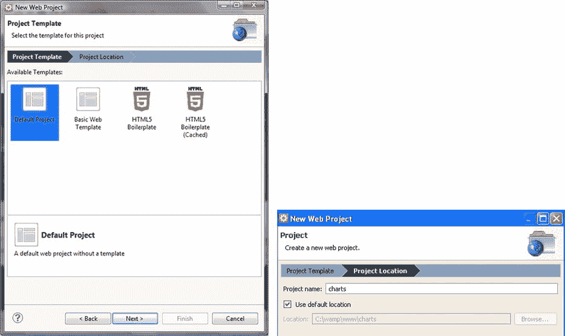
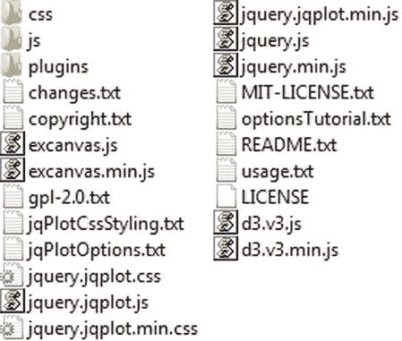

# 27.书中例子的指南

Abstract

本附录提供了如何使用 XAMPP 和 Aptana Studios 在您的 PC 上创建一个开发环境的指南，该环境将允许您开发、运行和修复书中给出的示例。

本附录提供了如何使用 XAMPP 和 Aptana Studios 在您的 PC 上创建一个开发环境的指南，该环境将允许您开发、运行和修复书中给出的示例。

## 安装 Web 服务器

如今，在互联网上，您可以很容易地找到免费的软件包，其中包含了为您的所有示例以及与 web 世界相关的所有内容建立测试环境所需的一切。

这些软件包最大限度地减少了需要安装的程序数量。更重要的是，它们可以通过一次安装获得。这些包通常由一个 Apache HTTP 服务器组成；一个 MySQL 数据库；以及编程语言 PHP、Perl 和 Python 的解释器。最完整的包是 XAMPP(可以在 Apache Friends 网站[[`www.apachefriends.org/en/index.html`](http://www.apachefriends.org/en/index.html)`]`]下载)。XAMPP 是完全免费的，它的主要特点是它是一个跨平台的软件包(Windows、Linux、Solaris、MacOS)。此外，XAMPP 还包括一个 Tomcat 应用服务器(用于编程语言 Java)和一个 FileZilla FTP 服务器(用于文件传输)。其他解决方案是特定于平台的，正如其名称的首字母所示:

*   `WAMP` (Windows)
*   `MAMP` (MacOS)
*   `LAMP` (Linux)
*   `SAMP` (Solaris)
*   `FAMP`

事实上，XAMPP 是一个缩写；其字母代表以下术语:

*   `X`，为操作系统
*   `A`，对于 Apache，web 服务器
*   `M`，对于 MySQL，数据库管理系统
*   `P`，PHP、Perl 或 Python 的编程语言

因此，选择最适合您的平台的 web 服务器解决方案，并将其安装在您的 PC 上。

## 安装 Aptana Studio IDE

一旦安装了 Web 服务器，就需要安装一个集成开发环境(IDE ),这是开发 JavaScript 代码所需要的。在本附录中，您将安装 Aptana Studio 作为您的开发环境。

访问 Aptana 站点( [`www.aptana.com`](http://www.aptana.com/) )，并单击 Aptana Studio 3 软件的产品选项卡(在撰写本文时，最新版本是 3.4.2)。下载单机版(已经集成了 Eclipse IDE):`Aptana_Studio_3_Setup_3.4.2.exe`。

下载完成后，启动可执行文件来安装 Aptana Studio IDE。在安装结束时，在启动应用程序时，您应该看到工作台打开，如图 [27-1](#Fig1) 所示。

图 27-1。

The Aptana Studio IDE workbench

在 Aptana Studio 的安装过程中，软件会检测各种浏览器和安装的 web 服务器，并相应地进行自我配置。

## 设置 Aptana Studio 工作空间

在开始开发书中的例子之前，您必须创建一个工作空间。首先，您应该在 Aptana Studio 上设置工作区，Web 服务器文档根目录就在这里。

这些是 XAMPP 的典型道路:

*   视窗:`C:\xampp\htdocs`
*   Linux:t0]
*   MAC OS:t0]

而 WAMP 的情况是这样的:

*   `C:\WAMP\www`

因此，选择文件➤切换工作区➤其他。。。从菜单上。然后，在字段中插入 web 服务器文档根目录的路径，如图 [27-2](#Fig2) 所示。

图 27-2。

Setting the workspace on the document root

## 创建项目

创建工作空间的下一步是在 Aptana Studio 中创建一个项目:

图 27-3。

Creating a default project Select New ➤ Web Project from the menu.   A window such as that shown in Figure [27-3](#Fig3) appears. Select Default Project, and click Next.   Insert “charts” as the name of the project. This will be the directory in the workspace in which you will write all the example files described in the book, using Aptana Studio.  

## 完成工作空间

一旦您设置了 Aptana Studio 工作区并创建了一个项目，您就完成了工作区。

让我们打开文档根目录并创建一个新目录，命名为`src`。现在，wyou 将在整本书中使用的工作空间由两个目录组成:

*   `src`
*   `charts`

`src`目录应该包含所有与库相关的文件。

`charts`目录应该包含所有与书中例子相关的 HTML、图片和层叠样式表(CSS)文件(实际上是一个项目)。每个示例文件都应该在这个目录中创建(如果您喜欢以不同的方式做事情，这很好，但是为了包含库文件和图像，注意 HTML 页面中不同的路径引用是很重要的)。

Note

这本书附带的源代码(可以从 Apress 网站[ [`www.apress.com`](http://www.apress.com/) ]的源代码/下载区获得)实际上已经打包在一个工作区中了。有了它，你会发现 charts 项目的两个版本:内容交付网络(CDN)和本地。`charts_CDN`目录包含所有引用从 CDN 服务远程分发的库的例子。`charts_local`目录提供了所有引用在`src`目录中找到的库的例子。

## 用库填充 src 目录

如果你选择了通过引用本地的库来开发 HTML 页面，那么就有必要下载它们所有的文件。这些文件将被收集在`src`目录中。这是一个很好的方法，因为您可以开发几个使用相同库的项目，而不必为每个项目复制它们。

本附录中列出的版本是用于实现书中示例的版本。如果您安装其他版本，可能会出现不兼容的问题，或者您可能会观察到与描述不同的行为。

jqPlot 库版本 1.0.8(包括 jQuery 库版本 1.9.1)

Visit the jqPlot web site ( [`https://bitbucket.org/cleonello/jqplot/downloads/`](https://bitbucket.org/cleonello/jqplot/downloads/) ), and download the compressed file (.zip, .tar.gz or tar.bz2) for the library: `jquery.jqplot.1.0.8r1250`.   Extract all content. You should get a directory named `dist`, containing the following subdirectories and files:

*   `doc`
*   `examples`
*   `plugins`
*   一系列文件(`jquery.min.js`、`jquery.jqplot.min.js`等)

  Copy the set of files and the `plugins` directory, and place in `src`.  

jquery UI 库版本 1.10.3，带有平滑主题

Visit the JQuery user interface library (jQuery UI) site ( [`http://jqueryui.com/themeroller/`](http://jqueryui.com/themeroller/) ), and download the library from ThemeRoller, with the smoothness theme: `jquery-ui-1.10.3.custom.zip`.   Extract all content. You should get a directory named `jquery-ui-1.10.3.custom`, with the following directories inside:

*   `css`
*   `js`
*   `development-bundle`

  Copy the `css` and `js` directories, and place in `src`.  

D3 库版本 3

Visit the D3 site ( [`http://d3js.org`](http://d3js.org/) ), and download the library: `d3.v3.zip`.   Extract all content directly, and place in the `src` directory. Now, you should have two new files in the `src` directory:

*   `d3.v3.js`
*   `d3.v3.min.js`

Highcharts 库版本 3.0.5

Visit the Highcharts site ( [`www.highcharts.com`](http://www.highcharts.com/) ), and download the library: `Highcharts-3.0.5.zip`.   Extract all content. You get a directory with several directories inside.   Copy only the `js` directory, and place in `src`.  

这样你就获得了`src`目录，其中应该包含如图 [27-4](#Fig4) 所示的子目录和文件。

图 27-4。

The files and subdirectories contained in the `src` directory Note

按照惯例，您正在开发`charts`目录中的示例。如果您想这样做，当您将其他文件包含在网页中时，您需要考虑新的路径。

如果您正在开发`charts`目录中的 HTML 页面，您需要使用以下代码:

``

相反，如果您喜欢直接开发它，在文档根目录中，您可以使用:

``

简而言之，根据您实现的页面，考虑您要包含的文件的路径是很重要的。

## 运行示例

在工作区中创建或复制 HTML 文件后，要在 Aptana Studio IDE 中运行该文件，请从菜单中选择运行➤运行，或单击工具栏上的运行按钮(参见图 [27-5](#Fig5) )。

图 27-5。

The Run button from the toolbar

您的默认浏览器将立即打开，并加载选定的 HTML 页面。

查看运行配置(参见图 [27-6](#Fig6) )，选择运行配置。。。从运行图标的上下文菜单中。例如，让我们将`http://localhost/`设置为您的基本 URL 为此，请选择“追加项目名称”选项，如图所示。然后，单击“应用”按钮确认您的设置。

图 27-6。

The run configuration for each browser must be set correctly

现在，您已经具备了轻松完成书中所有示例所需的一切。

一旦您对 Aptana IDE 有了一定的了解，您会发现它是一个开发许多其他项目的优秀环境，无论是用 JavaScript 还是用其他编程语言(例如 PHP)。

现在，玩得开心点！

## 摘要

本附录提供了如何使用 XAMPP 和 Aptana Studios 在您的电脑上创建开发环境的指南。使用这些应用程序的选择不是强制性的，许多其他解决方案也是可能的；互联网上有许多可用于执行类似操作的应用程序。但是，如果您希望实现并快速测试书中描述的示例，这个环境将是一个不错的选择。