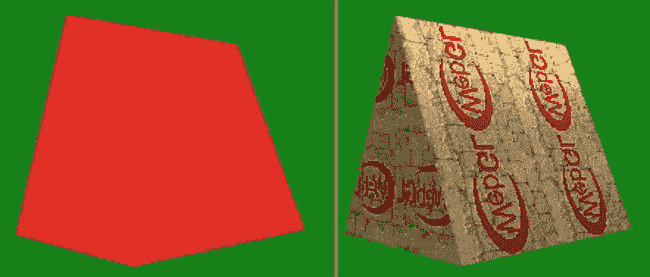

第三章

纹理和灯光

在这一章中，我们将讨论两个对于产生真实场景至关重要的主题，纹理和照明。具体来说，我们将

*   讨论什么是纹理以及如何应用它们
*   展示可用的纹理选项以及如何配置这些选项
*   在着色器中使用多个纹理
*   展示一个基本的照明模型
*   创建平行光着色器

在本章结束时，我们将在图 3-1 的右边制作纹理和光照网格。

[图 3-1](#_Fig1) 。左-没有纹理或照明；右-纹理和照明

图 3-1 中的左图是我们为什么需要使用纹理和照明的一个具体例子。在[第 1 章](01.html)的最后一个例子中，一个三角形网格作为一个 3D 图形可见。它看起来是三维的原因仅仅是因为顶点颜色是不同的，并且是由我们的片段着色器插入的。这为我们提供了深度线索。正如您所看到的，当所有的顶点都具有相同的颜色，并且没有应用光照或纹理时，图像看起来像一个平面的二维多边形。其实还是 3D 的；它看起来很平的原因是没有上下文线索让我们知道这实际上是一个坚实的数字。

当我们看一幅图像时，我们依赖于一些线索，例如一个固体表面在光照方面的变化:黑暗/照明、反射、阴影和纹理的方向图案变化，来告诉我们一个表面在哪里结束，另一个表面在哪里开始。在[图 3-1](#Fig1) 右边的图像中，我们加入了纹理和光照线索，你可以清楚地分辨出这是一个立体。

口感

纹理是在我们的程序中应用于表面的图像。用作纹理的图像可以在原点进行位图化，也可以通过程序生成。纹理必须应用(映射)到我们的图像上，这样做通常会被拉伸、缩放、扭曲和/或重复。

纹理的宽度和高度通常是相同的，并且是 2 的幂，2 n ，例如 64、128、256 和 512。纹理的每个基本元素被称为一个*纹理元素*，代表**纹理**真实 **el** 元素或**纹理**真实像素 **el** 。

纹理坐标

在二维中，纹理坐标是以(s，t)对而不是像顶点位置那样的(x，y)对来引用的。通常，纹理坐标也被限制在(0，0)到(1，1)的范围内。对于 128x128 像素的纹理大小，所有点将被除以 128，以便位于该范围内。128x128 纹理的纹理坐标(0.5，0.25)指的是纹理元素(64，32)。

[图 3-2](#Fig2) 左边是源图像的坐标，右边是等效的纹理坐标。

[图 3-2](#_Fig2) 。左图-一个带有顶点坐标的 128×128 像素的正方形图像；右-等效纹理坐标

纹理坐标通常作为顶点属性值发送给着色器程序，但是(正如我们在上一章看到的)我们也可以在着色器程序中操纵它们。

纹理对象

在 WebGL 中，纹理存储在 WebGLTexture 对象中。要创建和绑定 WebGLTexture 对象，使用的 API 函数有:

webgltexture createtexture()：

void bindTexture(GLenum 目标，WebGLTexture 纹理)；

2D 纹理的目标将是 2D 纹理。其他目标类型在[附录 C](14.html) 中列出。

创建和绑定 WebGLTexture 的代码如下所示:

var texture = GL . create texture()；

gl.bindTexture(gl)。2D 纹理，纹理：

要检查某个纹理是否正确加载，可以使用 API 调用:

glboolean istexture 纹理：

检查纹理的代码如下所示:

如果(！gl.isTexture(纹理) )

{

console.log("错误:纹理无效")；

}

检查这一点很重要，因为如果当前没有绑定 WebGLTexture(通过向 bindTexture 传递 null 或 0)，那么对纹理的进一步操作尝试将产生 INVALID_OPERATION 错误。

当您完成一个纹理时，您可以通过调用以下命令来删除它:

请参阅〈删除材质〉。

它看起来会像这样:

gl.deleteTexture(纹理)：

现在我们已经初始化了一个 WebGLTexture 对象，我们准备向其中加载数据。

二维经纬仪〔t0〕

将数据加载到纹理中的 API 调用是 texImage2D 函数。这个函数有五个签名变量。前四个是这种形式:

void textimage 2d(GLenum 目标，闪烁级别，GLenum 内部格式，

GLenum 格式，GLenum 类型，*【来源】*)；

在此代码中，[source]可以是 ImageData、HTMLImageElement、HTMLCanvasElement 或 HTMLVideoElement 之一。后三个可能会抛出一个 DOMException。

调用的另一种形式是从类型化数组中指定数据:

void textimage 2d(GLenum 目标，闪烁级别，GLenum 内部格式，

格勒齐瓦宽度格勒齐瓦高度格勒齐瓦边界格勒姆格式，

GLenum 类型，ArrayBufferView？像素；

在第 6 章的[中可以找到这种形式函数的使用示例。](06.html)

“级别”参数指的是在小中见大贴图中使用的细节级别，这将在本章后面讨论。该参数通常设置为 0。内部格式和格式通常是 RGBA。并且类型往往是 UNSIGNED_BYTE。所有可用的格式和类型如[附录 C](14.html) 所示。

将图像载入纹理对象

填充纹理数据最常见的方法是从图像文件中填充。我们还可以设置数据或使用其他对象，如 HTMLCanvasElement 或 HTMLVideoElement。

我们将声明一个变量来保存我们的纹理图像数据:

var textureImage = null：

我们使用一个 HTML 图像对象来加载我们的纹理图像:

函数 loadTexture()

{

texture Image = new Image()；

texture image . onload = function(){

setup texture()；

}

textureImage.src = "。/textures/smiley-128 px . jpg "；

}

在 loadTexture 方法中，我们创建一个 HTML 图像对象并设置 onload 事件。这样做的目的是等待图像通过 textureImage.src 赋值被加载，然后调用 setupTexture 方法。我们的纹理设置的细节显示在列表 3-1 中。

 **注意**我们将图像存储在 textureImage 变量中，而不是保存 WebGLTexture 对象的 texture 变量中。

***[清单 3-1](#_list1) 。**T5 设置 *WebGLTexture* 对象*

函数 setupTexture()

{

纹理= GL . create texture()；

gl.bindTexture(gl)。2D 纹理，纹理：

GL . pixel tori(GL . un CK _ flip _ y _ webgl，true)：

gl .二维顶点消除(gl)。2D 纹理，0，gl。RGBA、gl。RGBA、gl。SIGNED_BYTE，textureImage：

gl.texParameteri(gl。纹理 _2D，德国。纹理 _ 放大 _ 过滤，gl。最近)；

gl.texParameteri(gl。纹理 _2D，德国。纹理最小过滤器。最近)；

如果(！gl.isTexture(纹理) )

{

console.log("错误:纹理无效")；

}

}

在[清单 3-1](#list1) 的纹理设置方法中，我们创建了一个 WebGLTextureObject，然后绑定它。然后，我们通过使用加载的 HTML 图像对象调用 texImage2D 来设置纹理数据。pixelStorei 函数告诉 WebGL 如何存储我们的数据，texParameteri 设置如何处理纹理过滤和包装的选项。我们将在本章后面更详细地介绍这两个新功能。最后，我们检查我们的纹理对象是否有效，如果无效，就向控制台输出一条错误消息。

 **注意**这只是加载图像数据的一种方式。您也可以在现有的< img >标签中使用该图像:

函数 loadTexture()

{

textureImage = $("#smiley-image ")。get(0)；

setup texture()；

}

也可以使用 HTMLCanvasElement 或 HTMLVideoElement 中的图像，或者加载原始数据作为纹理图像。

纹理图像也必须遵循跨源资源共享(CORS) 的规则。如果你的纹理源和你的 JavaScript 文件在同一个位置，你不需要担心 CORS。更多关于 CORS 的确切限制的信息可以在[http://www.w3.org/TR/cors](http://www.w3.org/TR/cors)找到，更严格的 WebGL CORS 限制可以在[http://www.khronos.org/registry/webgl/specs/latest/#4.2](http://www.khronos.org/registry/webgl/specs/latest/#4.2)找到

应用和着色器交互

我们需要从我们的应用发送我们加载的纹理对象到着色器程序。在我们的 setupTexture 函数中，我们将添加代码来获取 uSampler 制服的位置，并设置它的值以供我们的程序使用。

GL program . sampleruniform = GL . getuniformlocation(GL program，" uSampler ")；

GL . uniform 1 I(GL program . sample runiform，0)；

第二个参数 0 指的是当前绑定的 TEXTURE0 纹理单元。TEXTURE0 是默认的纹理单位。

对于此示例，我们将使用这些数据点定义由两个三角形组成的平面的顶点:

是三角形商= [

        -0.5, -0.5, 0.0,

        0.5, -0.5, 0.0,

        0.5, 0.5, 0.0,

        0.5, 0.5, 0.0,

        -0.5, 0.5, 0.0,

        -0.5, -0.5, 0.0

];

这些顶点使用普通的*顶点缓冲对象* (VBO)发送到着色器，就像我们在[清单 1-6](01.html#list6) 的[第 1 章](01.html)示例中所做的一样。

在我们的着色器中使用纹理

为了使用纹理，我们需要调整我们的着色器来访问纹理数据。在这个例子中，我们没有为每个顶点使用单独的纹理坐标属性。相反，在我们的顶点着色器中，我们使用位置的 x，y 坐标作为每个顶点的纹理坐标。传入的每个顶点坐标都将在[-0.5，0.5]范围内，所以当我们将它们用作纹理坐标时，我们将两个坐标都加上 0.5 以映射到[0，1]范围。一个可变变量存储纹理坐标并传递给片段着色器，如[清单 3-2](#list2) 所示。

***[清单 3-2](#_list2) 。*** 一个基本的顶点着色器，用于计算和传递纹理坐标